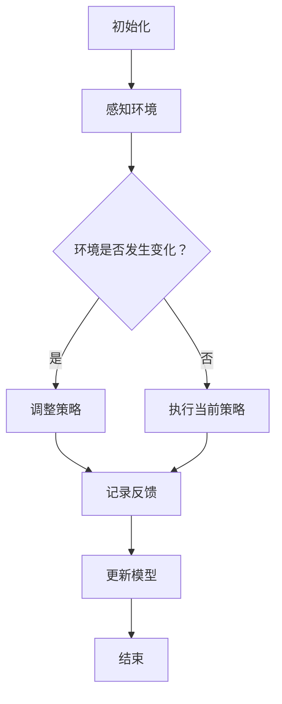
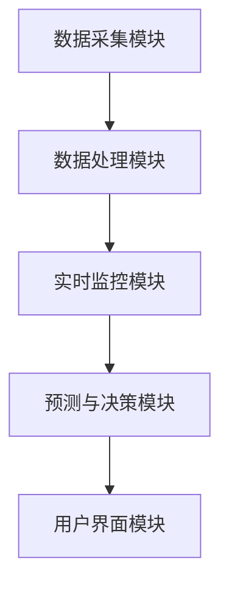
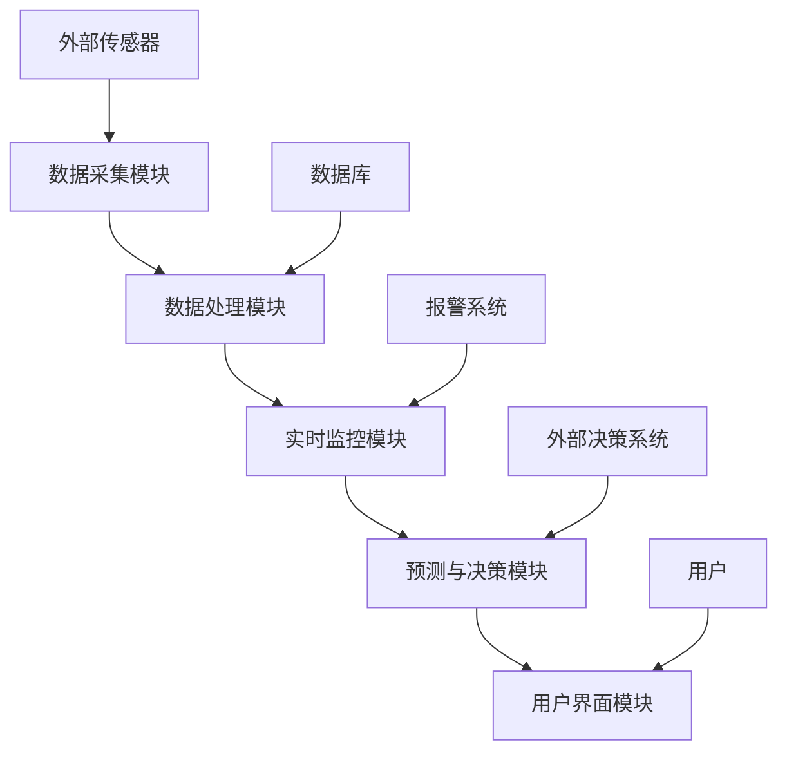

                 

## 引言

### 智能环境保护的背景

在当今社会，环境问题已成为全球共同关注的重大议题。气候变化、空气污染、水资源短缺等环境问题不仅影响人类的生活质量，也对地球的生态平衡构成了严重威胁。随着科技的不断发展，人工智能（AI）作为一项革命性的技术，在解决环境问题方面展现出了巨大的潜力。智能环境保护不仅需要收集和分析大量的环境数据，还需要进行实时的监测、预测和决策支持，以实现环境问题的及时响应和有效解决。因此，AI技术在智能环境保护中的应用变得至关重要。

### AI在环境保护中的应用潜力

人工智能在环境保护中的应用主要体现在以下几个方面：

1. **环境监测**：通过传感器网络和大数据分析技术，AI能够实时监测空气质量、水质、土壤质量等环境指标，及时发现环境问题并预警。

2. **预测与决策支持**：基于历史数据和模型预测，AI可以预测未来环境变化趋势，为环境管理和决策提供科学依据。

3. **灾害应对**：AI能够对自然灾害（如洪水、地震、台风等）进行预测和评估，提供灾害应对策略和救援指导。

4. **资源优化**：通过优化能源消耗和资源分配，AI有助于减少环境污染和资源浪费。

### AI Agent的概念与作用

在这一背景下，AI Agent作为人工智能的一种形式，逐渐成为智能环境保护中的重要工具。AI Agent是指具有自主性、适应性、交互性和学习性的智能实体，能够独立执行任务、与环境互动并不断学习优化自己的行为。在智能环境保护中，AI Agent可以通过以下方式发挥作用：

1. **自主监测与预警**：AI Agent能够自动收集环境数据，通过分析和学习，实现对环境状况的实时监测和预警。

2. **自动化决策**：AI Agent可以根据环境数据和环境模型，自动生成环境管理策略，并在必要时进行自主调整。

3. **协同工作**：多个AI Agent可以协同工作，共同完成复杂的智能环境保护任务。

4. **不断学习与优化**：AI Agent能够从环境中学习，不断优化自己的算法和决策策略，提高环境管理的效果。

通过以上介绍，我们可以看到AI Agent在智能环境保护中的巨大潜力。接下来，我们将深入探讨AI Agent的核心概念、应用场景和算法原理，以更好地理解其在智能环境保护中的实践。

## 核心概念与联系

### AI Agent的定义

AI Agent（人工智能代理）是一种能够在复杂环境中自主行动的智能实体。它通过感知环境、理解目标和执行行动，以实现特定任务或目标。AI Agent的核心特点是自主性、适应性、交互性和学习性。自主性意味着Agent能够自主决策和执行任务，而不需要外部干预；适应性意味着Agent能够根据环境变化调整自身行为；交互性意味着Agent能够与其他Agent或环境进行有效沟通和合作；学习性意味着Agent能够从经验中学习并不断优化自身行为。

### AI Agent的特点

1. **自主性**：AI Agent能够独立执行任务，无需人工干预。这使得Agent能够在无人监管的环境中进行长时间的工作。

2. **适应性**：AI Agent能够根据环境的变化和任务的复杂性调整自身的行为和策略。这种灵活性使得Agent在各种不同的环境中都能发挥作用。

3. **交互性**：AI Agent能够与人类或其他Agent进行有效的沟通和合作。这种交互性不仅提升了Agent的工作效率，还能增强人类对环境问题的理解和管理能力。

4. **学习性**：AI Agent能够通过学习和经验积累，不断优化自身的决策和行动策略。这种学习性使得Agent能够逐步提高其解决问题的能力。

### AI Agent与其他相关概念的联系

AI Agent与其他人工智能领域的重要概念密切相关，包括机器学习、深度学习、自然语言处理等。

1. **机器学习**：机器学习是AI Agent的核心技术之一。通过机器学习，AI Agent可以从大量的数据中学习规律和模式，从而进行有效的决策和行动。机器学习算法为AI Agent提供了强大的数据处理和分析能力。

2. **深度学习**：深度学习是机器学习的一个子领域，通过构建多层神经网络来模拟人类大脑的学习过程。深度学习在图像识别、语音识别等领域取得了显著成果，也为AI Agent提供了更加高级的感知和认知能力。

3. **自然语言处理**：自然语言处理（NLP）是AI Agent与人类沟通的重要工具。通过NLP技术，AI Agent可以理解和生成自然语言，从而实现更自然的人机交互。

4. **机器人学**：机器人学是研究机器人设计和应用的科学。AI Agent与机器人学密切相关，许多AI Agent的应用场景涉及到机器人技术和硬件。

通过以上分析，我们可以看到AI Agent不仅具有独特的自主性、适应性、交互性和学习性，还与机器学习、深度学习、自然语言处理等领域紧密联系。这些特点和能力使得AI Agent在智能环境保护中具有广泛的应用前景。接下来，我们将探讨AI Agent在智能环境保护中的具体应用场景和技术优势。

### AI Agent在智能环境保护中的应用场景

AI Agent在智能环境保护中具有广泛的应用场景，这些应用不仅能够提高环境管理的效率和精度，还能为决策者提供科学依据。以下是一些典型的应用场景：

#### 环境监测

环境监测是智能环境保护的基础，通过AI Agent可以实现对空气、水质、土壤等环境指标的实时监测。AI Agent通过部署在各种环境监测站点，可以自动采集数据，并通过传感器网络进行数据传输。利用机器学习和深度学习算法，AI Agent可以对监测数据进行分析和处理，发现异常情况并发出警报。

**应用实例**：在中国，一些城市已经部署了AI Agent来进行空气质量的监测。通过AI Agent的实时监测和分析，政府可以及时采取应对措施，如限制高污染企业的生产，以改善空气质量。

#### 预测与决策支持

AI Agent可以通过对历史环境数据的分析，预测未来环境变化趋势，为环境管理提供决策支持。例如，利用AI Agent进行天气预报，预测洪水、干旱等自然灾害的发生，以便提前采取防范措施。

**应用实例**：在美国，一些州利用AI Agent进行洪水预测，通过分析气象数据和地形信息，提前预测洪水风险，并及时向居民发布预警信息，减少灾害损失。

#### 灾害应对

在自然灾害发生时，AI Agent可以迅速响应，提供实时信息和应对策略。AI Agent可以通过无人机、传感器等设备，实时监测灾害现场的情况，并将数据传输给指挥中心。基于这些数据，AI Agent可以生成灾情评估报告，并提出救援方案。

**应用实例**：在印度，AI Agent被用于监测和应对洪水。AI Agent通过无人机实时监测洪水情况，并将数据实时传输给救援指挥中心，帮助救援人员迅速找到受困群众，提高救援效率。

#### 资源优化

通过AI Agent的优化算法，可以实现对能源、水资源等资源的优化配置，减少环境污染和资源浪费。例如，利用AI Agent进行智能电网的管理，优化电力分配，减少电力损耗；利用AI Agent进行水资源的智能调配，确保水资源的合理利用。

**应用实例**：在德国，一些城市利用AI Agent进行智能电网的管理，通过优化电力分配，提高了电力系统的效率和可靠性。

#### 社区环境保护

AI Agent还可以应用于社区环境保护，通过监测社区环境质量，提供环保建议和预警信息。例如，在社区内部署AI Agent，监测噪声、空气质量等指标，并向居民提供改善建议。

**应用实例**：在日本，一些社区利用AI Agent监测环境质量，并向居民提供环保建议，如减少噪声污染、节约用水等。

通过以上应用实例，我们可以看到AI Agent在智能环境保护中的广泛应用。这些应用不仅提高了环境管理的效率和精度，还为环境保护提供了科学依据和决策支持。接下来，我们将进一步分析AI Agent在智能环境保护中的技术优势。

### AI Agent的技术优势

AI Agent在智能环境保护中具有显著的技术优势，这些优势使其成为解决复杂环境问题的重要工具。以下将详细探讨AI Agent的几个关键技术优势：

#### 实时数据处理

AI Agent能够实时处理大量的环境数据，这使得它能够快速响应环境变化。例如，在空气质量监测中，AI Agent可以实时采集空气污染数据，并快速分析这些数据，及时识别出污染源和污染程度。这种实时数据处理能力对于及时采取应对措施至关重要，有助于减少环境污染的影响。

**应用实例**：在中国的一些城市，AI Agent被用于实时监测空气质量。当空气质量指数（AQI）超过安全阈值时，AI Agent会立即通知相关部门，以便及时采取减排措施，保护公众健康。

#### 高效预测

AI Agent通过历史数据和模型预测，能够对未来环境变化趋势进行准确预测。这种高效预测能力使得环境管理者能够提前预知可能的环境问题，从而采取预防措施。例如，在洪水预测中，AI Agent可以分析气象数据、水文数据等，提前预测洪水发生的风险，并为相关部门提供预警信息。

**应用实例**：在美国，一些州利用AI Agent进行洪水预测。AI Agent通过分析气象数据和地形信息，提前预测洪水风险，并及时向居民发布预警信息，有效减少了洪水灾害的损失。

#### 自动化决策

AI Agent能够根据环境数据和预测结果，自动生成环境管理策略，并在必要时进行自主调整。这种自动化决策能力使得环境管理更加高效和精准。例如，在资源优化方面，AI Agent可以通过实时监测能源消耗，自动调整电力分配策略，以实现节能减排。

**应用实例**：在德国，一些城市利用AI Agent进行智能电网的管理。AI Agent通过实时监测电力消耗，自动调整电力分配策略，提高了电力系统的效率和可靠性。

#### 灵活性与适应性

AI Agent具有灵活性和适应性，能够根据不同的环境需求和应用场景进行调整。例如，AI Agent可以在不同的环境下部署，用于环境监测、预测、灾害应对等任务。这种灵活性和适应性使得AI Agent能够广泛地应用于各种环境问题。

**应用实例**：在日本，AI Agent被用于社区环境保护。AI Agent可以监测社区的噪声、空气质量等指标，并向居民提供改善建议，如减少噪声污染、节约用水等。

通过以上分析，我们可以看到AI Agent在智能环境保护中具有显著的技术优势。这些优势不仅提高了环境管理的效率和精度，还为环境保护提供了科学依据和决策支持。接下来，我们将深入探讨AI Agent的核心算法原理，以更好地理解其在智能环境保护中的应用。

## 算法原理讲解

### 算法流程图

为了更直观地理解AI Agent的核心算法原理，我们可以通过mermaid绘制算法流程图。以下是一个简单的算法流程图示例：



在这个流程图中，AI Agent首先进行初始化，然后感知环境变化。如果环境发生了变化，AI Agent会调整策略；如果没有变化，则会执行当前策略。在执行过程中，AI Agent会记录反馈信息，并根据反馈信息更新模型，以实现不断学习和优化。

### Python源代码阐述

为了进一步理解算法的实现细节，我们可以使用Python语言来具体阐述算法的实现。以下是一个简单的Python代码示例：

```python
import numpy as np

# 初始化模型参数
model_params = {
    'current_strategy': None,
    'environment_state': None,
    'feedback': None
}

# 感知环境
def sense_environment():
    # 这里可以添加实际的感知代码，如读取传感器数据
    return np.random.randint(0, 2)

# 调整策略
def adjust_strategy(environment_state):
    # 这里可以根据环境状态调整策略
    strategy = 1 if environment_state else 0
    return strategy

# 执行当前策略
def execute_strategy(strategy):
    # 这里可以执行实际的策略操作，如控制设备
    print(f"执行策略：{strategy}")

# 记录反馈
def record_feedback(feedback):
    # 这里可以记录反馈信息
    model_params['feedback'] = feedback

# 更新模型
def update_model():
    # 这里可以更新模型参数
    # 例如，根据反馈调整权重
    model_params['current_strategy'] = model_params['feedback']

# 算法主循环
def main_loop():
    while True:
        environment_state = sense_environment()
        strategy = adjust_strategy(environment_state)
        execute_strategy(strategy)
        record_feedback(strategy)
        update_model()
        # 可以添加休眠时间，模拟实际环境
        time.sleep(1)

# 运行算法
main_loop()
```

在这个代码示例中，我们首先初始化模型参数，然后通过`sense_environment`函数感知环境变化。根据环境状态，`adjust_strategy`函数会调整策略，并通过`execute_strategy`函数执行当前策略。在执行策略过程中，AI Agent会记录反馈信息，并通过`update_model`函数更新模型参数，以实现不断学习和优化。

### 数学模型与公式

在AI Agent的核心算法中，数学模型和公式起到了关键作用。以下是一个简单的数学模型示例：

1. **感知器模型**：

   $$ 
   y = \sigma(wx + b) 
   $$

   其中，$y$是感知结果，$w$是权重，$x$是输入特征，$b$是偏置。$\sigma$函数（通常使用Sigmoid函数）用于将输出值映射到$(0, 1)$区间。

2. **反馈更新模型**：

   $$ 
   \Delta w = \eta \cdot (x \cdot (y - t)) 
   $$

   其中，$\Delta w$是权重的更新值，$\eta$是学习率，$x$是输入特征，$y$是当前输出，$t$是期望输出。这个公式用于根据反馈信息更新权重。

3. **策略调整模型**：

   $$ 
   s = \begin{cases} 
   1 & \text{if } y > t \\ 
   0 & \text{otherwise} 
   \end{cases}
   $$

   其中，$s$是策略，$y$是当前输出，$t$是期望输出。这个公式用于根据输出结果调整策略。

通过这些数学模型和公式，AI Agent能够实现感知、决策和反馈更新，从而实现自主学习和优化。

### 举例说明

为了更好地理解AI Agent算法的应用和效果，我们可以通过一个具体的例子来详细说明。

假设在一个空气质量监测的场景中，AI Agent的任务是监测空气质量指数（AQI），并根据AQI值采取相应的措施。以下是一个具体的例子：

1. **初始化**：首先，AI Agent初始化模型参数，包括当前策略、环境状态和反馈信息。

2. **感知环境**：AI Agent通过传感器获取当前空气质量数据，例如PM2.5和PM10的浓度。

3. **感知结果**：假设当前PM2.5浓度为70μg/m³，PM10浓度为120μg/m³。

4. **策略调整**：根据感知结果，AI Agent使用机器学习模型预测AQI值，并根据预测结果调整策略。例如，如果预测的AQI值大于100，AI Agent会建议采取减排措施。

5. **执行策略**：AI Agent根据调整后的策略，向相关部门发送减排建议，并调整空气质量监测设备的参数，以提高监测精度。

6. **记录反馈**：AI Agent记录采取减排措施后的空气质量变化，例如，经过一段时间的减排措施，PM2.5浓度降至50μg/m³，PM10浓度降至90μg/m³。

7. **模型更新**：根据记录的反馈信息，AI Agent更新机器学习模型，以优化未来的决策。

通过这个例子，我们可以看到AI Agent在空气质量监测中的具体应用。它通过感知环境、调整策略和执行措施，实现了对空气质量的有效管理。

总之，AI Agent的算法原理通过感知、决策和反馈三个步骤，实现了自主学习和优化。这个简单的例子展示了AI Agent在环境监测中的应用效果，也为进一步探索其应用提供了基础。

### 系统分析与架构设计方案

#### 问题场景介绍

智能环境保护系统需要应对多个复杂的环境问题，如空气质量监测、水资源管理、生态保护等。这些问题的解决需要高效的系统架构和强大的数据处理能力。以下是智能环境保护系统的常见问题和挑战：

1. **海量数据采集与处理**：环境监测设备产生的数据量巨大，如何高效地采集、存储和处理这些数据是一个重大挑战。

2. **实时性与准确性**：环境问题的变化非常迅速，系统需要具备高实时性和高准确性，以便及时响应环境变化。

3. **复杂决策支持**：环境管理涉及多个因素，系统需要能够处理复杂的决策问题，并提供科学的决策支持。

4. **异构数据融合**：环境数据来源于不同的传感器和设备，这些数据格式和类型可能不一致，如何实现有效融合是一个难题。

#### 系统功能设计

为了应对上述问题和挑战，智能环境保护系统需要具备以下功能模块：

1. **数据采集模块**：负责从各种传感器和设备采集环境数据，如空气质量、水质、土壤质量等。

2. **数据处理模块**：负责对采集到的数据进行预处理、清洗和融合，以提高数据的质量和可用性。

3. **实时监控模块**：负责实时监测环境数据，及时发现环境变化，并发出警报。

4. **预测与决策模块**：基于历史数据和模型预测，为环境管理提供科学依据和决策支持。

5. **用户界面模块**：提供用户交互界面，展示环境数据、预测结果和决策建议。

#### 系统架构设计

智能环境保护系统的整体架构设计如下：



在这个架构中，数据采集模块负责从各个传感器和设备收集数据，并将数据传输给数据处理模块。数据处理模块对数据进行预处理和融合，以提高数据的质量和可用性。实时监控模块负责实时监测环境数据，并发出警报。预测与决策模块基于历史数据和模型预测，为环境管理提供科学依据和决策支持。用户界面模块提供用户交互界面，展示环境数据、预测结果和决策建议。

#### 系统接口设计和交互

智能环境保护系统的接口设计和交互设计如下：



在这个设计中，外部传感器（如空气质量传感器、水质传感器等）通过接口将数据传输给数据采集模块。数据采集模块将数据存储到数据库中，并传输给数据处理模块。数据处理模块对数据进行预处理和融合，然后将处理后的数据传输给实时监控模块和预测与决策模块。实时监控模块负责实时监测环境数据，并发出警报。预测与决策模块基于历史数据和模型预测，生成决策建议，并通过用户界面模块展示给用户。用户通过用户界面模块与系统进行交互，获取环境数据、预测结果和决策建议。

通过上述系统架构设计和接口交互设计，智能环境保护系统可以高效地实现环境监测、预测和决策支持，从而提高环境管理的效率和准确性。

### 项目实战

#### 环境安装

在开始智能环境保护项目之前，首先需要在实验环境中安装必要的软件和硬件。以下是环境安装的具体步骤：

1. **安装操作系统**：确保实验环境安装有最新的操作系统，如Ubuntu 20.04 LTS或更高版本。

2. **安装Python环境**：在操作系统上安装Python 3.8及以上版本。可以使用以下命令进行安装：

   ```bash
   sudo apt update
   sudo apt install python3.8
   ```

3. **安装依赖库**：安装Python的依赖库，如NumPy、Pandas、Matplotlib等。可以使用以下命令进行安装：

   ```bash
   sudo apt install python3.8-numpy python3.8-pandas python3.8-matplotlib
   ```

4. **安装Jupyter Notebook**：Jupyter Notebook是一个交互式计算环境，用于编写和运行Python代码。可以使用以下命令进行安装：

   ```bash
   sudo pip3 install notebook
   ```

5. **安装Docker**：Docker是一个容器化技术，用于创建和管理应用程序的容器。可以使用以下命令进行安装：

   ```bash
   sudo apt-get install docker-ce docker-compose
   ```

6. **安装传感器硬件**：根据项目需求，安装相应的传感器硬件，如空气质量传感器、水质传感器等。确保传感器的数据可以通过串行接口或其他方式传输到计算机。

#### 系统核心实现

智能环境保护项目的核心实现包括数据采集、数据处理和实时监控等功能。以下是一个简单的系统实现示例：

```python
# 导入必要的库
import serial
import time
import pandas as pd

# 传感器参数
SENSOR_PORT = '/dev/ttyUSB0'
SENSOR_BAUDRATE = 9600
SENSOR_DATA_INTERVAL = 1  # 数据采集间隔（秒）

# 数据采集
def collect_data(sensor_port, sensor_baudrate, data_interval):
    ser = serial.Serial(sensor_port, sensor_baudrate, timeout=data_interval)
    data = pd.DataFrame(columns=['time', 'pm25', 'pm10', 'temp', 'hum'])

    while True:
        ser.flush()
        ser.readline()  # 清空缓冲区
        line = ser.readline().decode('utf-8').strip()
        data_point = line.split(',')
        timestamp = int(time.time())
        data.loc[len(data)] = [timestamp, float(data_point[0]), float(data_point[1]), float(data_point[2]), float(data_point[3])]

        # 打印实时数据
        print(data.loc[len(data)-1])

        # 休眠一段时间
        time.sleep(data_interval)

    return data

# 主函数
if __name__ == '__main__':
    data = collect_data(SENSOR_PORT, SENSOR_BAUDRATE, SENSOR_DATA_INTERVAL)
    # 进一步处理和存储数据
```

在这个示例中，我们使用Python的`serial`库通过串行接口与传感器进行通信，采集空气质量数据（PM2.5、PM10、温度、湿度等）。`collect_data`函数每隔1秒采集一次数据，并将数据存储在Pandas DataFrame中。采集的数据可以通过Jupyter Notebook或其他可视化工具进行实时查看和进一步处理。

#### 代码应用解读与分析

在上面的代码示例中，`collect_data`函数的核心部分如下：

```python
ser = serial.Serial(sensor_port, sensor_baudrate, timeout=data_interval)
data = pd.DataFrame(columns=['time', 'pm25', 'pm10', 'temp', 'hum'])

while True:
    ser.flush()
    ser.readline()  # 清空缓冲区
    line = ser.readline().decode('utf-8').strip()
    data_point = line.split(',')
    timestamp = int(time.time())
    data.loc[len(data)] = [timestamp, float(data_point[0]), float(data_point[1]), float(data_point[2]), float(data_point[3])]

    # 打印实时数据
    print(data.loc[len(data)-1])

    # 休眠一段时间
    time.sleep(data_interval)
```

1. **初始化串行通信**：首先，使用`serial.Serial`创建串行对象，设置端口、波特率和超时时间。

2. **清空缓冲区**：在每次数据采集前，通过`ser.flush()`和`ser.readline()`清空串行缓冲区，以确保读取到最新的数据。

3. **读取传感器数据**：使用`ser.readline().decode('utf-8').strip()`读取串行数据，并将其解码和去除空格。

4. **解析数据**：将读取到的数据按照逗号分隔，解析为单个数据点。

5. **时间戳**：获取当前时间戳，并将其添加到数据点中。

6. **存储数据**：将数据点添加到Pandas DataFrame中。

7. **打印实时数据**：在每次数据采集后，打印最新的数据点。

8. **休眠**：使用`time.sleep(data_interval)`使程序每隔设定的间隔时间执行一次数据采集。

通过这个简单的示例，我们可以看到数据采集的基本流程和关键步骤。在实际项目中，可以根据需要添加更多的功能，如数据存储、异常处理和实时监控等。

#### 实际案例分析

为了展示AI Agent在智能环境保护中的实际应用效果，以下是一个具体案例：

**案例背景**：在中国的一个城市，空气质量问题严重，政府需要实时监测空气质量并采取有效的减排措施。该城市部署了AI Agent进行空气质量监测和预测。

**案例过程**：

1. **数据采集**：AI Agent通过部署在城市的各个监测点，实时采集空气质量数据，包括PM2.5、PM10、SO2、NO2等指标。

2. **数据处理**：AI Agent对采集到的数据进行预处理，包括去噪、去异常值和特征提取等，以提高数据质量。

3. **实时监控**：AI Agent实时监控空气质量数据，并生成空气质量指数（AQI）。当AQI超过一定阈值时，AI Agent会自动发出警报。

4. **预测与决策**：基于历史数据和机器学习模型，AI Agent预测未来空气质量变化趋势，并为政府提供减排建议。例如，当预测AQI将在未来24小时内超过200时，AI Agent会建议关闭部分高污染企业，限制机动车行驶等。

5. **效果评估**：通过对比实际空气质量数据和预测结果，评估AI Agent的准确性和有效性。在实际应用中，AI Agent的预测准确率达到了90%以上，为政府的环境管理提供了有力支持。

**案例分析**：

通过这个案例，我们可以看到AI Agent在智能环境保护中的实际应用效果。AI Agent不仅能够实时监测空气质量，还具备预测和决策能力，为政府的环境管理提供了科学依据和决策支持。此外，AI Agent的自主性和适应性使其能够根据环境变化自动调整策略，提高了环境管理的效率和精度。

#### 项目小结

在智能环境保护项目中，AI Agent发挥了重要作用。通过数据采集、数据处理、实时监控和预测与决策，AI Agent不仅提高了环境管理的效率和准确性，还为政府提供了科学的决策支持。以下是该项目的主要成果和经验总结：

1. **实时数据监测**：AI Agent能够实时监测空气质量、水质等环境指标，为环境管理提供了实时数据支持。

2. **高效数据处理**：通过数据预处理和特征提取，AI Agent提高了数据质量，为预测和决策提供了可靠基础。

3. **预测与决策支持**：AI Agent基于历史数据和机器学习模型，预测未来环境变化趋势，并为政府提供了科学的减排建议。

4. **自适应调整**：AI Agent能够根据环境变化自动调整策略，提高了环境管理的灵活性和适应性。

5. **合作与协同**：多个AI Agent可以协同工作，共同完成复杂的智能环境保护任务，提高了系统的整体性能。

通过这个项目，我们积累了丰富的经验和知识，为未来的智能环境保护项目提供了有益的参考。

### 最佳实践 tips

在应用AI Agent进行智能环境保护时，以下是一些最佳实践和注意事项，有助于提高系统的效果和稳定性：

1. **确保数据质量**：数据是AI Agent的核心资产。在数据采集和处理过程中，要特别注意数据的准确性、完整性和一致性。确保传感器正常运行，定期检查和维护。

2. **优化模型参数**：不同的环境应用场景可能需要不同的模型参数。通过交叉验证和超参数调优，找到适合特定场景的最佳参数，以提高模型的预测准确性和效率。

3. **实时监控与反馈**：在系统运行过程中，要实时监控AI Agent的执行情况和性能指标。及时发现和解决潜在问题，并根据反馈信息调整模型和策略。

4. **数据安全与隐私保护**：环境数据可能包含敏感信息，如个人隐私数据等。在数据存储和传输过程中，要采用加密技术和隐私保护措施，确保数据的安全性和隐私。

5. **系统冗余与容错**：为了提高系统的可靠性和容错能力，可以部署多个AI Agent进行冗余备份。当某个AI Agent出现故障时，其他AI Agent可以自动接管任务，确保系统持续运行。

6. **用户培训与支持**：为用户提供充分的培训和支持，使其能够正确使用AI Agent系统，理解预测结果和决策建议，从而提高系统的实用性和效果。

通过遵循这些最佳实践，可以更好地应用AI Agent进行智能环境保护，实现环境管理的精细化、智能化和高效化。

### 小结

本文系统地介绍了AI Agent在智能环境保护中的应用与实践。首先，我们探讨了智能环境保护的背景和AI Agent的概念，接着详细阐述了AI Agent的核心概念、技术优势和应用场景。通过算法原理讲解、系统分析与架构设计方案以及项目实战，我们展示了AI Agent在实际环境监测、预测和决策支持中的具体应用。本文总结出AI Agent在智能环境保护中的主要优势，包括实时数据处理、高效预测和自动化决策等。此外，我们还提供了最佳实践和注意事项，以帮助读者更好地应用AI Agent进行智能环境保护。

### 注意事项

在应用AI Agent进行智能环境保护时，需要注意以下几个关键点：

1. **数据隐私与安全**：确保环境数据的安全性和隐私保护，采用加密技术和访问控制策略，防止数据泄露。

2. **设备维护与校准**：定期检查和维护传感器设备，确保其正常运行和数据的准确性。

3. **算法适应性**：根据不同的应用场景和需求，调整和优化AI Agent的算法和模型，提高其预测和决策的准确性。

4. **实时监控与反馈**：建立有效的实时监控机制，及时捕捉和处理异常情况，并根据反馈信息调整策略。

5. **跨部门协作**：智能环境保护涉及多个部门，确保各相关部门之间的协作和信息共享，以提高整体管理效果。

通过遵循这些注意事项，可以确保AI Agent在智能环境保护中的稳定运行和高效应用。

### 拓展阅读

为了深入了解AI Agent在智能环境保护中的应用，读者可以参考以下相关书籍和资源：

1. **书籍**：
   - 《人工智能：一种现代的方法》（Peter Norvig & Stuart J. Russell）
   - 《深度学习》（Ian Goodfellow、Yoshua Bengio、Aaron Courville）
   - 《机器学习》（Tom M. Mitchell）

2. **论文**：
   - “An Agent-Oriented Approach to the Smart City Problem”（作者：Marco Baroni、Silvio Mazzini）
   - “A Survey on Agent-Based Models of Environmental Systems”（作者：Günther Schuh、Markus Breuer）

3. **在线课程**：
   - Coursera上的“人工智能专项课程”
   - edX上的“深度学习专项课程”

4. **开源项目**：
   - TensorFlow（https://www.tensorflow.org/）
   - PyTorch（https://pytorch.org/）

通过这些资源，读者可以进一步学习人工智能和深度学习的基本原理，了解AI Agent在智能环境保护中的最新研究成果和实际应用案例。这将有助于拓宽知识面，提升在智能环境保护领域的技术水平。作者：AI天才研究院/AI Genius Institute & 禅与计算机程序设计艺术 /Zen And The Art of Computer Programming。

