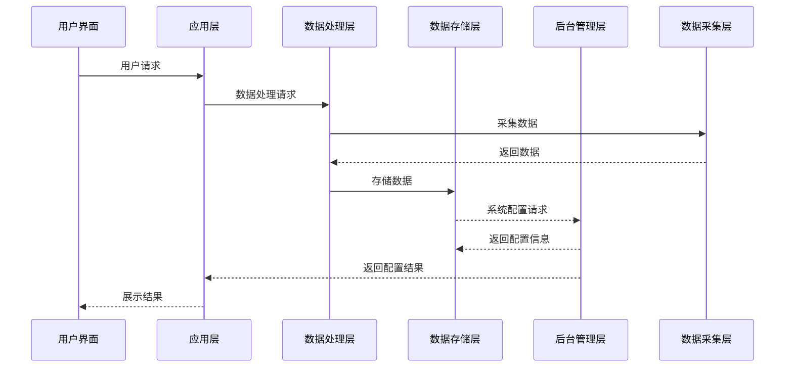
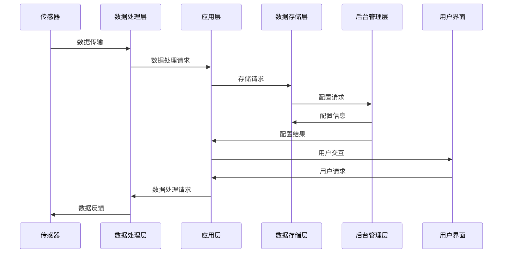

                 


### 1. 文章核心内容和主题思想

在这篇名为《AI Agent在智能环境污染监测中的实践》的技术博客文章中，我们将深入探讨人工智能（AI）代理在环境保护领域中的应用，特别是其在智能环境污染监测中的实际应用。随着全球环境问题的日益严重，传统的方法已经难以满足实时、高效、精准的环境污染监测需求。因此，结合AI技术，特别是AI代理，为解决环境污染问题提供了新的思路和可能性。

本文的核心内容和主题思想主要体现在以下几个方面：

- **背景介绍**：首先，我们将介绍环境污染监测的重要性和当前存在的问题，以及AI代理技术的基本概念和特点。
- **核心概念与联系**：接着，我们将详细解释AI代理和智能环境污染监测的基本概念，并探讨两者之间的联系。
- **算法原理讲解**：然后，我们将深入分析AI代理在智能环境污染监测中的算法原理，包括强化学习、生成对抗网络（GAN）和递归神经网络（RNN）等关键技术。
- **数学模型与公式讲解**：我们将使用LaTeX格式详细讲解上述算法的数学模型和公式，并通过具体例子来展示如何应用这些公式。
- **系统分析与架构设计方案**：接下来，我们将从系统层面分析AI代理在智能环境污染监测中的应用，并设计一个具体的系统架构方案。
- **项目实战**：我们将通过实际项目案例展示如何将AI代理技术应用于环境污染监测，并分享实战中的经验和技巧。
- **最佳实践 tips**、**小结**、**注意事项**、**拓展阅读**：最后，我们将总结文章的主要观点，提出一些实用的最佳实践建议，并推荐一些拓展阅读资源。

通过这篇文章，我们希望能够让读者对AI代理在智能环境污染监测中的应用有一个全面、深入的理解，并激发读者在这一领域的创新思考和研究。

### 2. 设计大纲结构

为了系统地阐述《AI Agent在智能环境污染监测中的实践》这一主题，我们需要精心设计文章的大纲结构。这个结构将确保文章的内容既全面又条理清晰，帮助读者循序渐进地理解文章的核心观点。以下是本文的大纲结构：

#### 第一部分：背景介绍

1. **环境污染监测的重要性**
2. **AI代理技术概述**
3. **智能环境污染监测的需求分析**

#### 第二部分：核心概念与联系

1. **AI代理的基本概念**
2. **智能环境污染监测的基本概念**
3. **AI代理与智能环境污染监测的联系**

#### 第三部分：算法原理讲解

1. **强化学习算法在智能环境污染监测中的应用**
2. **生成对抗网络（GAN）的应用**
3. **递归神经网络（RNN）的应用**

#### 第四部分：数学模型与公式讲解

1. **强化学习的数学模型**
2. **生成对抗网络的数学模型**
3. **递归神经网络的数学模型**

#### 第五部分：系统分析与架构设计方案

1. **系统功能设计**
2. **系统架构设计**
3. **系统接口设计和系统交互**

#### 第六部分：项目实战

1. **环境安装**
2. **系统核心实现**
3. **代码应用解读与分析**
4. **实际案例分析与详细讲解**
5. **项目小结**

#### 第七部分：最佳实践 tips

1. **实时监测数据处理的技巧**
2. **模型优化与调参策略**
3. **系统部署与维护**

#### 第八部分：小结与注意事项

1. **文章小结**
2. **注意事项**
3. **未来研究方向**

#### 第九部分：拓展阅读

1. **拓展阅读推荐**
2. **相关论文和书籍**
3. **在线资源**

通过这一系统的大纲结构，我们将一步步引导读者深入探讨AI代理在智能环境污染监测中的应用，从理论到实践，全面覆盖这一领域的关键技术和实际应用。

### 2.1 背景介绍

#### 环境污染监测的重要性

环境污染监测在现代社会中具有至关重要的意义。随着工业化和城市化进程的加快，大气、水质、土壤等环境质量受到了严重威胁。传统的人工监测方法在效率和精度上已经无法满足现代环境监测的需求。例如，传统的空气质量监测主要依赖于人工采样和实验室分析，这种方法不仅耗时耗力，而且难以实现实时监测。此外，水质监测和土壤污染监测也面临着类似的挑战。

环保部门需要一种能够实时、高效、精确地监测环境质量的手段，以便及时发现污染问题，采取相应的治理措施。智能环境污染监测通过引入先进的人工智能技术，特别是AI代理，为解决这些问题提供了新的途径。

#### AI代理技术概述

AI代理是一种能够自主学习和执行任务的智能体，它们在虚拟或现实环境中进行交互，以实现特定目标。AI代理具有自主性、交互性、学习性和适应性等特点，这使得它们在复杂的环境中能够高效地完成任务。

AI代理技术近年来取得了显著进展，特别是在机器学习和深度学习领域。通过学习大量的环境数据，AI代理能够自动识别污染源，预测污染趋势，并制定有效的治理策略。这不仅提高了监测的精度和效率，还减轻了人工监测的负担。

#### 智能环境污染监测的需求分析

智能环境污染监测的需求主要源于以下几个方面：

1. **实时监测**：环境质量的变化是动态的，需要实时监测以快速响应污染事件。传统方法难以实现这一点，而AI代理可以实时处理和分析环境数据，提供即时的污染预警。

2. **高精度监测**：精确的环境质量数据对于污染治理至关重要。AI代理通过深度学习技术，可以从大量历史数据中学习并提取有价值的信息，从而提高监测的精度。

3. **智能化决策**：AI代理能够根据监测数据自动生成治理方案，并实时调整策略。这种智能化决策能力有助于提高治理效果，降低污染治理的成本。

4. **自动识别污染源**：传统方法在识别污染源时存在很大挑战，而AI代理可以通过图像识别、声音识别等技术，自动定位污染源，提高监测的效率。

5. **适应复杂环境**：环境监测场景复杂多变，AI代理的自主性和适应性使得它们能够在各种复杂环境下稳定运行，完成监测任务。

总之，AI代理在智能环境污染监测中具有巨大的应用潜力。通过结合AI代理技术，我们可以构建一个高效、智能的环境监测系统，为环境保护提供强有力的技术支持。

### 2.2 核心概念与联系

#### AI代理的基本概念

AI代理（Artificial Intelligence Agent）是一种在特定环境中能够感知、决策和执行任务的计算机程序。其核心特点是自主性和交互性，即能够独立完成特定任务，同时与外部环境进行有效的信息交互。

AI代理由以下几个基本组成部分构成：

1. **感知模块**：用于感知外部环境，获取必要的信息，如温度、湿度、空气中的污染物浓度等。
2. **决策模块**：根据感知到的信息，通过算法进行分析和决策，生成相应的行动策略。
3. **执行模块**：将决策模块生成的策略转化为具体的行动，如调整监测设备、发送警报等。

AI代理的特点包括：

- **自主性**：能够自主地完成特定任务，而不需要人工干预。
- **交互性**：能够与外部环境进行有效的信息交互，从而获取新的信息和反馈。
- **学习性**：通过不断地与外部环境交互，能够从经验中学习并改进自身的性能。

#### 智能环境污染监测的基本概念

智能环境污染监测是指利用先进的传感器技术、数据分析方法和人工智能算法，对环境中的污染物进行实时、高效、精准的监测。其核心概念包括：

1. **传感器网络**：由多个传感器节点组成，能够覆盖广泛的监测区域，实时采集环境数据。
2. **数据分析**：通过对采集到的数据进行处理和分析，提取有价值的信息，如污染物的浓度、变化趋势等。
3. **人工智能算法**：利用机器学习和深度学习技术，对环境数据进行分析和预测，提供智能化的污染治理策略。

智能环境污染监测的特点包括：

- **实时性**：能够实时监测环境质量，及时发现问题。
- **高效性**：通过自动化和智能化的手段，提高监测效率。
- **精准性**：利用高精度的传感器和先进的数据分析技术，提供准确的监测结果。
- **适应性**：能够适应复杂多变的监测环境，对不同的污染源进行有效的识别和监测。

#### AI代理与智能环境污染监测的联系

AI代理与智能环境污染监测之间的联系主要体现在以下几个方面：

1. **感知与决策**：AI代理通过感知模块获取环境数据，然后通过决策模块进行分析和决策，生成相应的行动策略。这一过程与智能环境污染监测中的数据采集、分析和决策过程高度相似。

2. **执行与反馈**：AI代理通过执行模块将决策模块生成的策略转化为具体的行动，如调整监测设备、发送警报等。这一过程与智能环境污染监测中的执行和反馈机制相一致。

3. **学习与优化**：AI代理能够通过不断的学习和优化，提高自身的监测和决策能力。智能环境污染监测系统也可以通过不断收集和分析数据，优化监测策略和治理措施。

总之，AI代理与智能环境污染监测之间具有紧密的联系。AI代理技术为智能环境污染监测提供了强大的技术支持，使得监测系统更加智能、高效和精准。通过结合AI代理技术，我们可以构建一个更加完善的智能环境污染监测系统，为环境保护提供强有力的保障。

### 3.1 强化学习算法在智能环境污染监测中的应用

强化学习算法（Reinforcement Learning, RL）在智能环境污染监测中有着广泛的应用，其核心思想是通过智能体与环境的交互，不断优化决策策略，以实现环境质量的优化目标。下面，我们将详细探讨强化学习算法在智能环境污染监测中的应用。

#### 强化学习算法的基本原理

强化学习算法是一种通过试错法来学习决策策略的机器学习方法。其基本原理可以概括为：

1. **状态（State）**：智能体在某一时刻所处的环境状态。
2. **动作（Action）**：智能体可以采取的动作。
3. **奖励（Reward）**：智能体执行某一动作后，从环境中获得的即时奖励或惩罚。
4. **策略（Policy）**：智能体根据当前状态选择动作的策略。

在强化学习过程中，智能体通过不断尝试不同的动作，并根据接收到的奖励调整其策略，以最大化累积奖励。这一过程可以表示为：

$$
Q(s, a) = r(s, a) + \gamma \max_{a'} Q(s', a')
$$

其中，$Q(s, a)$表示在状态$s$下采取动作$a$的预期回报，$r(s, a)$表示在状态$s$下采取动作$a$后获得的即时奖励，$\gamma$是折扣因子，用于平衡即时奖励和长期奖励。

#### 强化学习在智能环境污染监测中的应用

在智能环境污染监测中，强化学习算法可以通过以下步骤实现：

1. **状态定义**：将环境中的各项指标（如空气质量指数、水质指标等）定义为状态，智能体根据这些状态来决策。

2. **动作定义**：智能体可以采取的动作包括调整监测设备的灵敏度、改变监测频率、启动治理措施等。

3. **奖励设计**：奖励机制可以根据环境质量的变化来设计。例如，如果环境质量得到改善，智能体可以获得奖励；反之，如果环境质量恶化，智能体则受到惩罚。

4. **策略优化**：智能体通过不断尝试不同的动作，并根据获得的奖励来优化其策略，以实现环境质量的长期优化。

例如，在一个空气质量监测的场景中，智能体可以通过以下方式优化监测策略：

- 当空气质量指数（AQI）较高时，智能体可以选择增加监测频率，并启动空气净化设备。
- 当空气质量指数较低时，智能体可以选择减少监测频率，节省资源。

通过这种策略优化，智能体可以动态调整监测和治理措施，实现环境质量的持续改善。

#### 强化学习的实现步骤

实现强化学习算法在智能环境污染监测中的具体步骤如下：

1. **环境建模**：构建一个模拟环境，用于智能体的训练和测试。这个环境可以包括各种可能的空气质量状况、监测设备的参数调整等。

2. **智能体设计**：设计一个智能体，包括感知模块、决策模块和执行模块。感知模块用于采集环境数据，决策模块根据感知数据选择最佳动作，执行模块将决策转化为实际的操作。

3. **训练与测试**：使用模拟环境对智能体进行训练，通过不断的试错来优化策略。训练完成后，使用实际环境对智能体进行测试，评估其性能。

4. **策略部署**：将训练好的策略部署到实际监测系统中，实现智能监测和治理。

通过上述步骤，我们可以构建一个基于强化学习的智能环境污染监测系统，实现环境质量的动态优化。

#### 强化学习的优势和挑战

强化学习算法在智能环境污染监测中具有以下优势：

- **适应性**：强化学习算法能够根据环境变化动态调整策略，适应不同的监测场景。
- **灵活性**：智能体可以自主决策，无需人工干预，提高监测的灵活性和效率。
- **可扩展性**：通过扩展环境建模和动作空间，强化学习算法可以应用于不同类型的污染物监测。

然而，强化学习算法在智能环境污染监测中也面临一些挑战：

- **数据需求**：强化学习算法需要大量环境数据来训练，数据的质量和数量直接影响算法的性能。
- **计算复杂度**：强化学习算法的计算复杂度较高，对于实时监测系统来说，计算资源的消耗是一个重要考虑因素。
- **安全性**：智能体在执行决策时，需要确保不会引入新的安全隐患，特别是在涉及环境治理措施时。

综上所述，强化学习算法在智能环境污染监测中具有广阔的应用前景，但也需要解决一系列技术挑战，以实现其实际应用。

### 3.2 生成对抗网络（GAN）在智能环境污染监测中的应用

生成对抗网络（Generative Adversarial Networks，GAN）是一种由生成器和判别器组成的深度学习模型，通过两个对抗网络之间的博弈来生成逼真的数据。GAN在许多领域，包括图像生成、语音合成和自然语言处理中，都取得了显著的成果。近年来，GAN也开始在智能环境污染监测中展现其潜力。以下是生成对抗网络在智能环境污染监测中的应用和实现方法。

#### GAN的基本原理

GAN由生成器（Generator）和判别器（Discriminator）两个神经网络组成，两者相互竞争，共同训练。生成器的目标是生成与真实数据相似的数据，而判别器的目标是区分真实数据和生成数据。

1. **生成器**：生成器的任务是生成伪造的数据，使其在结构和分布上尽量接近真实数据。通常，生成器是一个全连接神经网络，接受随机噪声作为输入，通过多层神经网络生成伪造数据。
   
   $$ G(z) = x_g(z) $$
   
   其中，$x_g(z)$是生成器生成的伪造数据，$z$是随机噪声。

2. **判别器**：判别器的任务是区分输入数据是真实的还是伪造的。判别器也是一个全连接神经网络，其输入可以是真实数据或生成数据，输出是概率值，表示输入数据是真实数据的置信度。

   $$ D(x) = D(x, \text{real}) $$
   $$ D(G(z)) = D(G(z), \text{fake}) $$

GAN的训练过程是一个零和游戏，生成器和判别器交替进行训练。生成器的目标是最大化判别器对生成数据的判断错误率，而判别器的目标是最大化生成数据的判断错误率。

GAN的训练目标可以表示为：

$$ \min_G \max_D V(D, G) = \mathbb{E}_{x\sim p_{data}(x)}[\log D(x)] + \mathbb{E}_{z\sim p_z(z)}[\log (1 - D(G(z)))] $$

其中，$V(D, G)$是GAN的损失函数，$p_{data}(x)$是真实数据的概率分布，$p_z(z)$是噪声分布。

#### GAN在智能环境污染监测中的应用

GAN在智能环境污染监测中的应用主要体现在数据生成、数据增强和模型训练等方面。

1. **数据生成**：环境数据（如空气质量、水质等）通常较为稀疏，难以满足深度学习模型的训练需求。GAN可以通过生成伪造的环境数据来扩充训练数据集，从而提高模型的泛化能力和鲁棒性。

   在空气质量监测中，生成器可以生成模拟的空气污染数据，这些数据在结构上与真实数据相似，但具有更多的样本量，有助于训练更复杂的深度学习模型。

2. **数据增强**：GAN还可以用于数据增强，通过生成具有多样性的数据来提高模型的鲁棒性。例如，对于空气质量数据，可以生成不同时间段、不同地点的污染数据，从而扩展模型的训练数据集。

3. **模型训练**：GAN可以直接用于训练深度学习模型，特别是在处理具有复杂分布的数据时。例如，在水质监测中，水质参数具有多种复杂分布，GAN可以生成伪造的水质数据，与真实数据混合，从而训练一个能够处理复杂分布的深度学习模型。

#### GAN在智能环境污染监测中的实现

实现GAN在智能环境污染监测中的具体步骤如下：

1. **数据准备**：收集真实的环境数据，包括空气质量、水质等参数。这些数据将用于训练生成器和判别器。

2. **生成器和判别器的构建**：设计并构建生成器和判别器的神经网络结构。生成器通常采用多层感知机（MLP）或卷积神经网络（CNN），而判别器也采用类似的结构。

3. **训练过程**：使用真实数据和伪造数据共同训练生成器和判别器。在训练过程中，生成器不断尝试生成更逼真的数据，而判别器则努力区分真实数据和伪造数据。

4. **模型评估**：训练完成后，使用实际环境数据对模型进行评估，验证其性能。

5. **应用部署**：将训练好的模型部署到智能环境污染监测系统中，用于实时监测和预测。

#### GAN的优势与挑战

GAN在智能环境污染监测中具有以下优势：

- **数据扩充**：通过生成伪造数据，GAN可以扩充训练数据集，提高模型的泛化能力。
- **数据增强**：GAN可以生成具有多样性的数据，增强模型的鲁棒性。
- **处理复杂分布**：GAN能够处理具有复杂分布的数据，适用于环境监测中的多种参数。

然而，GAN也存在一些挑战：

- **训练不稳定**：GAN的训练过程容易陷入不稳定状态，导致生成器无法生成高质量的数据。
- **数据分布偏差**：生成器可能会生成与真实数据分布偏差较大的数据，影响模型的性能。
- **计算资源消耗**：GAN的训练需要大量的计算资源，特别是在处理高维数据时。

综上所述，GAN在智能环境污染监测中具有显著的应用潜力，但需要进一步优化和改进，以克服其挑战，实现更高效、更准确的环境监测。

### 3.3 递归神经网络（RNN）在智能环境污染监测中的应用

递归神经网络（Recurrent Neural Networks，RNN）是一种能够处理序列数据的神经网络，其特点是能够记住之前的输入信息，并利用这些信息来预测未来的输出。这使得RNN在时间序列预测任务中表现出色，例如股票价格预测、天气预测等。在智能环境污染监测中，RNN同样具有广泛的应用。以下将详细探讨RNN在智能环境污染监测中的应用及其原理。

#### RNN的基本原理

RNN的基本原理是通过循环结构来处理序列数据。在每个时间步，RNN会更新其内部状态，并将当前输入和前一个时间步的状态结合起来生成输出。

1. **隐藏状态**：RNN的隐藏状态（$h_t$）用于存储和传递信息。在时间步$t$，隐藏状态可以表示为：

   $$ h_t = \text{sigmoid}(W_h \cdot [h_{t-1}, x_t] + b_h) $$

   其中，$W_h$是权重矩阵，$x_t$是当前输入，$b_h$是偏置项。

2. **输出**：在时间步$t$，RNN的输出（$y_t$）可以表示为：

   $$ y_t = \text{sigmoid}(W_y \cdot h_t + b_y) $$

   其中，$W_y$是权重矩阵，$b_y$是偏置项。

3. **记忆**：RNN的循环结构使得其能够记住之前的输入信息。隐藏状态$h_t$包含了之前所有时间步的信息，通过反馈连接（recurrent connection）传递到下一个时间步。

#### RNN在智能环境污染监测中的应用

在智能环境污染监测中，RNN可以用于时间序列预测，从而帮助监测系统提前预测环境污染的变化趋势，采取预防措施。

1. **空气质量预测**：空气质量是一个时间序列数据，RNN可以用来预测未来的空气质量指数（AQI）。通过分析历史空气质量数据，RNN可以识别出污染物的变化模式，从而预测未来的污染水平。

2. **水质监测**：水质参数如pH值、溶解氧、重金属含量等也是时间序列数据，RNN可以用于预测这些参数的未来变化趋势，帮助监测系统及时发现水质问题。

3. **污染源识别**：RNN还可以用于识别污染源。通过分析污染物的时间序列数据，RNN可以识别出不同污染源的特征模式，从而帮助监测系统定位污染源。

#### RNN在智能环境污染监测中的实现

实现RNN在智能环境污染监测中的具体步骤如下：

1. **数据预处理**：收集并预处理环境数据，包括空气质量数据、水质数据等。数据预处理包括数据清洗、标准化和序列化等步骤。

2. **模型构建**：构建RNN模型，包括输入层、隐藏层和输出层。输入层接收序列数据，隐藏层更新状态并传递信息，输出层生成预测结果。

3. **训练与验证**：使用历史环境数据对RNN模型进行训练，通过反向传播算法不断优化模型参数。训练完成后，使用验证数据评估模型性能。

4. **预测与部署**：使用训练好的RNN模型进行预测，将预测结果部署到监测系统中，实现实时环境监测和预警。

#### RNN的优势与挑战

RNN在智能环境污染监测中具有以下优势：

- **记忆能力**：RNN能够记住之前的输入信息，适用于处理时间序列数据。
- **灵活性**：RNN可以处理不同长度和类型的序列数据，适用于多种环境监测任务。
- **实时性**：RNN能够实时更新状态，实现实时预测和预警。

然而，RNN也存在一些挑战：

- **梯度消失和梯度爆炸**：RNN在训练过程中容易遇到梯度消失和梯度爆炸问题，影响模型训练效果。
- **计算复杂度**：RNN的计算复杂度较高，特别是对于长序列数据，计算资源消耗较大。
- **数据需求**：RNN需要大量的历史数据来训练，数据质量和数量直接影响模型性能。

综上所述，RNN在智能环境污染监测中具有显著的应用潜力，但需要解决一系列技术挑战，以实现高效、准确的预测和监测。

### 3.4 强化学习的数学模型讲解

强化学习（Reinforcement Learning，RL）是一种通过试错法学习决策策略的机器学习方法，其核心目标是使智能体在特定环境中通过学习获得最大化累积奖励。强化学习涉及到几个关键概念，包括状态（State）、动作（Action）、奖励（Reward）和策略（Policy）。下面，我们将详细讲解强化学习的数学模型，并使用LaTeX格式展示相关的数学公式。

#### 强化学习的基本概念

1. **状态（State）**：智能体在某一时刻所处的环境状态，通常表示为$S_t$。
   
2. **动作（Action）**：智能体可以采取的动作，通常表示为$A_t$。

3. **奖励（Reward）**：智能体在执行某一动作后从环境中获得的即时奖励，通常表示为$R_t$。

4. **策略（Policy）**：智能体根据当前状态选择动作的策略，通常表示为$\pi(A_t|S_t)$。

#### 强化学习的数学模型

强化学习的数学模型主要涉及以下几个方面：

1. **状态-动作值函数（State-Action Value Function）**：

   状态-动作值函数$Q(S_t, A_t)$表示在状态$S_t$下采取动作$A_t$所能获得的累积奖励的期望值。其数学公式可以表示为：

   $$ Q(S_t, A_t) = \sum_{s' \in S} p(s' | s, a) \cdot \sum_{r \in R} r \cdot \pi(a' | s') $$

   其中，$p(s' | s, a)$表示在状态$S_t$下采取动作$A_t$后转移到状态$s'$的概率，$\pi(a' | s')$表示在状态$s'$下采取动作$a'$的概率。

2. **期望回报（Expected Return）**：

   期望回报$R_t$表示在某个状态$S_t$下采取某一动作$A_t$后，在未来所能获得的累积奖励的期望值。其数学公式可以表示为：

   $$ R_t = \sum_{t' = t}^T r(s', a') $$

   其中，$T$表示智能体在环境中的最终时间步。

3. **策略迭代（Policy Iteration）**：

   策略迭代是强化学习中的一个核心过程，包括价值迭代（Value Iteration）和策略更新（Policy Update）。

   - **价值迭代**：

     $$ V^{k+1}(s) = \sum_{a} \pi(a|s) \cdot \sum_{s'} p(s'|s, a) \cdot \max_{a'} Q(s', a') $$
   
     其中，$V^k(s)$表示在第$k$次迭代中状态$s$的值函数。

   - **策略更新**：

     $$ \pi^{k+1}(a|s) = \begin{cases}
     1, & \text{if } a = \arg\max_{a'} Q(s', a') \\
     0, & \text{otherwise}
     \end{cases} $$

     其中，$\pi^k(a|s)$表示在第$k$次迭代中状态$s$下采取动作$a$的概率。

#### LaTex格式展示

下面使用LaTeX格式展示上述数学公式：

```latex
% 状态-动作值函数
\[ Q(S_t, A_t) = \sum_{s' \in S} p(s' | s, a) \cdot \sum_{r \in R} r \cdot \pi(a' | s') \]

% 期望回报
\[ R_t = \sum_{t' = t}^T r(s', a') \]

% 价值迭代
\[ V^{k+1}(s) = \sum_{a} \pi(a|s) \cdot \sum_{s'} p(s'|s, a) \cdot \max_{a'} Q(s', a') \]

% 策略更新
\[ \pi^{k+1}(a|s) = \begin{cases}
1, & \text{if } a = \arg\max_{a'} Q(s', a') \\
0, & \text{otherwise}
\end{cases} \]
```

通过上述数学模型和公式，我们可以更深入地理解强化学习的工作原理，并利用这些模型设计智能体在环境中的学习策略。

### 3.5 生成对抗网络（GAN）的数学模型讲解

生成对抗网络（Generative Adversarial Networks，GAN）是由生成器（Generator）和判别器（Discriminator）两个神经网络组成的深度学习模型，通过对抗训练生成逼真的数据。下面，我们将详细讲解GAN的数学模型，并使用LaTeX格式展示相关的数学公式。

#### GAN的基本概念

1. **生成器（Generator）**：生成器是一个神经网络，其目的是生成伪造的数据，使其在结构和分布上尽量接近真实数据。生成器通常从噪声分布$z \sim p_z(z)$中获取噪声向量，通过多层神经网络生成伪造数据$x_g \sim p_g(x)$。

2. **判别器（Discriminator）**：判别器是一个神经网络，其目的是区分输入数据是真实的还是伪造的。判别器接受两个输入：真实数据$x \sim p_x(x)$和伪造数据$x_g \sim p_g(x)$，并输出一个概率值，表示输入数据是真实数据的置信度。

GAN的训练过程是一个零和游戏，生成器和判别器相互对抗，共同训练。

#### GAN的数学模型

GAN的数学模型主要涉及以下两个概率分布：

1. **真实数据的概率分布**：$p_x(x)$表示真实数据的概率分布。
2. **生成器的概率分布**：$p_g(x)$表示生成器的概率分布。

GAN的训练目标可以表示为：

$$ \min_G \max_D V(D, G) = \mathbb{E}_{x \sim p_x(x)}[\log D(x)] + \mathbb{E}_{z \sim p_z(z)}[\log (1 - D(G(z)))] $$

其中，$V(D, G)$是GAN的损失函数，$D(x)$是判别器对真实数据的判断概率，$D(G(z))$是判别器对生成数据的判断概率。

#### GAN的数学公式

下面使用LaTeX格式展示GAN的数学公式：

```latex
% GAN的目标函数
\[ \min_G \max_D V(D, G) = \mathbb{E}_{x \sim p_x(x)}[\log D(x)] + \mathbb{E}_{z \sim p_z(z)}[\log (1 - D(G(z)))] \]

% 生成器的概率分布
\[ p_g(x) = G(z) \]

% 判别器的概率分布
\[ D(x) = \frac{1}{1 + \exp(-D(x))} \]
\[ D(G(z)) = \frac{1}{1 + \exp(-D(G(z)))} \]

% 噪声分布
\[ z \sim p_z(z) \]

% 真实数据的概率分布
\[ x \sim p_x(x) \]
```

通过上述公式，我们可以看到GAN通过对抗训练实现数据的生成和鉴别。生成器不断尝试生成更逼真的数据，而判别器则努力区分真实数据和伪造数据。这种对抗过程使得生成器的生成能力不断提高，最终能够生成高质量的数据。

### 3.6 递归神经网络（RNN）的数学模型讲解

递归神经网络（Recurrent Neural Networks，RNN）是一种能够处理序列数据的神经网络，其核心特点是能够通过循环结构记忆先前的输入信息。下面，我们将详细讲解RNN的数学模型，并使用LaTeX格式展示相关的数学公式。

#### RNN的基本概念

1. **输入序列**：$X_t$表示在时间步$t$的输入序列。
2. **隐藏状态**：$h_t$表示在时间步$t$的隐藏状态。
3. **输出序列**：$Y_t$表示在时间步$t$的输出序列。
4. **权重**：$W$和$U$分别表示输入权重和隐藏状态权重。

RNN的更新规则可以用以下数学公式表示：

#### 隐藏状态更新公式

$$
h_t = \sigma(W_h \cdot [h_{t-1}, x_t] + b_h)
$$

其中，$\sigma$是激活函数，通常采用Sigmoid函数或Tanh函数。

#### 输出更新公式

$$
y_t = \sigma(W_y \cdot h_t + b_y)
$$

其中，$W_y$是输出权重，$b_y$是输出偏置。

#### RNN的数学模型

RNN的数学模型可以进一步扩展到双向递归神经网络（BiRNN），它包括前向递归网络和后向递归网络两部分。

#### 前向递归网络

前向递归网络的隐藏状态更新公式为：

$$
h_t^f = \sigma(W_h^f \cdot [h_{t-1}^f, x_t] + b_h^f)
$$

#### 后向递归网络

后向递归网络的隐藏状态更新公式为：

$$
h_t^b = \sigma(W_h^b \cdot [h_{t+1}^b, x_t] + b_h^b)
$$

#### BiRNN的最终输出

双向递归神经网络的最终输出为：

$$
h_t = [h_t^f, h_t^b]
$$

#### LaTex格式展示

下面使用LaTeX格式展示RNN的数学模型：

```latex
% 隐藏状态更新公式
\[ h_t = \sigma(W_h \cdot [h_{t-1}, x_t] + b_h) \]

% 输出更新公式
\[ y_t = \sigma(W_y \cdot h_t + b_y) \]

% 前向递归网络隐藏状态更新公式
\[ h_t^f = \sigma(W_h^f \cdot [h_{t-1}^f, x_t] + b_h^f) \]

% 后向递归网络隐藏状态更新公式
\[ h_t^b = \sigma(W_h^b \cdot [h_{t+1}^b, x_t] + b_h^b) \]

% 双向递归神经网络最终输出
\[ h_t = [h_t^f, h_t^b] \]
```

通过这些公式，我们可以看到RNN如何通过循环结构记忆和利用先前的信息来处理序列数据。双向RNN通过结合前向和后向的信息，能够更好地捕捉序列中的时间依赖关系。

### 4.1 系统功能设计

在智能环境污染监测系统中，系统功能设计是确保系统正常运行和高效完成任务的关键环节。系统功能设计需要综合考虑污染监测的需求、数据处理能力和用户交互需求。以下我们将详细阐述系统功能设计的各个方面，包括领域模型和类图的构建。

#### 领域模型

领域模型是系统功能设计的基础，它定义了系统中涉及的实体及其之间的关系。在智能环境污染监测系统中，主要的领域模型包括：

1. **传感器**：用于采集环境数据，如空气质量传感器、水质传感器、土壤传感器等。
2. **数据采集模块**：负责将传感器采集到的数据传输到系统中进行存储和处理。
3. **数据处理模块**：对采集到的数据进行处理和分析，如异常检测、趋势预测等。
4. **用户界面**：提供用户与系统交互的接口，显示监测数据、预警信息和操作选项。
5. **报警系统**：当监测数据超过预设阈值时，自动触发报警。
6. **后台管理系统**：负责系统的配置、维护和数据备份。

以下是领域模型的核心实体及其关系的Mermaid类图：

```mermaid
classDiagram
  Sensor --> DataCollector : 数据采集
  DataProcessor --> Sensor : 数据处理
  DataProcessor --> AlarmSystem : 预警处理
  DataProcessor --> UserInterface : 数据展示
  AlarmSystem --> DataProcessor : 报警触发
  UserInterface --> DataProcessor : 用户交互
  BackEnd --> DataProcessor : 系统管理
  DataCollector --> BackEnd : 系统配置
  Sensor << Entity
  DataCollector << Entity
  DataProcessor << Entity
  AlarmSystem << Entity
  UserInterface << Entity
  BackEnd << Entity
```

#### 类图

类图进一步详细描述了系统中的实体及其属性和方法。以下是一个智能环境污染监测系统的类图示例：

```mermaid
classDiagram
  Sensor << Entity
  DataCollector << Entity
  DataProcessor << Entity
  AlarmSystem << Entity
  UserInterface << Entity
  BackEnd << Entity
  Sensor {
    +id: int
    +name: string
    +type: string
    +measurements: List[Measurement]
    +addMeasurement(measurement: Measurement): void
  }
  DataCollector {
    +id: int
    +name: string
    +sensors: List[Sensor]
    +collectData(): void
  }
  DataProcessor {
    +id: int
    +name: string
    +data: List[DataPoint]
    +processData(): void
    +generateAlerts(): void
  }
  AlarmSystem {
    +id: int
    +name: string
    +alerts: List[Alert]
    +triggerAlert(dataPoint: DataPoint): void
  }
  UserInterface {
    +id: int
    +name: string
    +displayData(data: DataPoint): void
    +handleUserInput(input: string): void
  }
  BackEnd {
    +id: int
    +name: string
    +configureSystem(): void
    +backupData(): void
  }
```

#### 功能实现

1. **传感器数据采集**：传感器模块负责实时采集环境数据，如空气质量、水质等参数。采集到的数据通过数据采集模块传输到系统中进行存储和处理。

2. **数据处理与异常检测**：数据处理模块对采集到的数据进行分析和处理，包括数据清洗、异常检测和趋势预测。异常检测可以及时发现异常情况，并触发报警系统。

3. **预警与报警**：报警系统根据预设的阈值和监测数据，自动生成预警信息，并通过用户界面和后台管理系统进行通知。

4. **用户交互**：用户界面提供直观的交互界面，用户可以通过用户界面查看监测数据、预警信息和系统配置。用户界面还支持用户操作，如调整阈值、查看历史数据等。

5. **系统管理**：后台管理系统负责系统的配置、维护和数据备份。管理员可以通过后台管理系统配置传感器、调整系统参数，并定期备份系统数据，确保系统的稳定运行。

通过上述系统功能设计，我们可以构建一个高效、智能的环境污染监测系统，为环境保护提供强有力的技术支持。

### 4.2 系统架构设计

在智能环境污染监测系统中，系统架构设计是确保系统能够高效、稳定运行的关键。系统架构设计需要综合考虑数据处理能力、实时性、可扩展性和安全性等多个方面。以下我们将详细阐述系统架构的设计，包括系统架构图和接口设计。

#### 系统架构图

智能环境污染监测系统的架构设计采用分层架构，主要包括以下几个层次：

1. **数据采集层**：负责从各种传感器（如空气质量传感器、水质传感器等）采集环境数据。
2. **数据处理层**：负责对采集到的环境数据进行处理、分析和存储。
3. **应用层**：提供用户交互界面，展示监测数据、预警信息和操作选项。
4. **数据存储层**：负责存储系统中的环境数据和用户配置信息。
5. **后台管理层**：负责系统的配置、维护和数据备份。

以下是智能环境污染监测系统的Mermaid架构图：



#### 接口设计

系统接口设计是确保各个模块之间能够有效通信和协作的关键。以下为智能环境污染监测系统的主要接口设计：

1. **传感器接口**：用于传感器与数据处理层之间的数据传输。传感器通过标准化的接口将采集到的环境数据发送给数据处理层。

2. **数据处理接口**：用于数据处理层与应用层之间的数据交互。数据处理层将处理后的数据发送给应用层，并通过用户界面展示给用户。

3. **用户界面接口**：用于用户与应用层之间的交互。用户界面接收用户操作，如查询数据、调整阈值等，并将其传递给应用层处理。

4. **后台管理接口**：用于后台管理层与数据存储层之间的交互。后台管理层通过接口获取系统配置信息，并进行相应的配置和维护操作。

以下是系统接口的Mermaid序列图：



#### 系统交互

系统交互是指各个模块之间的数据流动和功能协作。以下为智能环境污染监测系统的交互流程：

1. **用户请求**：用户通过用户界面发起数据查询、阈值调整等请求。
2. **数据处理**：应用层接收到用户请求后，将请求传递给数据处理层。
3. **数据采集**：数据处理层向传感器接口请求最新的环境数据。
4. **数据处理**：数据处理层对采集到的数据进行分析和处理，生成监测报告和预警信息。
5. **数据存储**：处理后的数据存储到数据存储层，并备份到后台管理系统。
6. **用户反馈**：处理结果通过用户界面展示给用户，用户可以查看监测数据、预警信息，并进行相应的操作。

通过上述系统架构设计和接口设计，我们可以构建一个高效、智能、可靠的环境污染监测系统，为环境保护提供强有力的技术支持。

### 4.3 系统接口设计与系统交互

为了确保智能环境污染监测系统的高效运作，系统接口设计和系统交互是关键部分。这一部分将详细讨论系统的接口设计，并展示系统内部各个组件之间的交互流程。

#### 系统接口设计

智能环境污染监测系统的接口设计主要包括以下方面：

1. **传感器接口**：用于传感器与数据处理层之间的数据传输。传感器通过标准化的接口将采集到的环境数据发送到数据处理层。

   ```mermaid
   sequenceDiagram
       participant Sensor as 传感器
       participant DataProcessing as 数据处理层
       
       Sensor->>DataProcessing: 传感器数据
   ```

2. **数据处理接口**：用于数据处理层与存储层之间的数据交互。数据处理层对传感器采集到的数据进行处理，并将处理结果存储到数据库中。

   ```mermaid
   sequenceDiagram
       participant DataProcessing as 数据处理层
       participant DataStorage as 数据存储层
       
       DataProcessing->>DataStorage: 存储数据
   ```

3. **用户界面接口**：用于用户与应用层之间的交互。用户通过用户界面发送请求，如查询监测数据、调整阈值等，应用层处理请求后返回结果。

   ```mermaid
   sequenceDiagram
       participant UserInterface as 用户界面
       participant ApplicationLayer as 应用层
       
       UserInterface->>ApplicationLayer: 用户请求
       ApplicationLayer->>UserInterface: 返回结果
   ```

4. **后台管理接口**：用于后台管理系统与数据存储层之间的交互。后台管理系统负责配置、监控和优化系统，通过接口获取和修改系统配置信息。

   ```mermaid
   sequenceDiagram
       participant BackendManagement as 后台管理系统
       participant DataStorage as 数据存储层
       
       BackendManagement->>DataStorage: 配置请求
       DataStorage->>BackendManagement: 返回配置信息
   ```

#### 系统交互

系统内部各个组件之间的交互流程如下：

1. **用户请求处理**：用户通过用户界面发送查询请求，如查看当前空气质量数据。应用层接收到请求后，调用数据处理接口获取相关数据。

2. **数据处理**：数据处理层接收到请求后，从传感器接口获取最新的环境数据，对数据进行处理和分析，生成监测报告。

3. **数据存储**：处理后的数据存储到数据存储层，并备份到数据库中，以便后续查询和分析。

4. **用户反馈**：处理结果通过用户界面展示给用户，用户可以查看监测数据、预警信息，并进行相应的操作，如调整阈值、设置报警规则等。

5. **后台管理**：后台管理系统通过后台管理接口获取系统配置信息，并根据需要进行调整。系统运行状态和性能指标也会定期通过后台管理接口上报，以便管理员进行监控和优化。

以下是系统交互的Mermaid序列图：


通过上述接口设计和系统交互流程，我们可以构建一个高效、智能的环境污染监测系统，为环境保护提供强有力的技术支持。

### 5.1 环境安装

在开始智能环境污染监测项目之前，我们需要准备好必要的开发环境和软件工具。以下是详细的步骤说明，包括如何安装Python环境、必要的库和依赖项。

#### 1. 安装Python环境

首先，确保您的计算机上已经安装了Python。Python是一种广泛使用的编程语言，适用于开发人工智能和数据分析应用。如果尚未安装，可以从Python的官方网站（https://www.python.org/）下载最新版本的Python安装程序。

- 访问Python官方网站。
- 下载适用于您的操作系统的Python安装程序。
- 运行安装程序，并按照提示完成安装。

安装完成后，打开命令行工具（如Windows的PowerShell或macOS的Terminal），输入以下命令验证Python安装是否成功：

```bash
python --version
```

如果正确显示了Python的版本号，说明Python环境已经成功安装。

#### 2. 安装必需的库和依赖项

接下来，我们需要安装一些关键的Python库，以便在项目中使用。以下是常用的库及其安装命令：

- **NumPy**：用于科学计算和数据分析。
  ```bash
  pip install numpy
  ```

- **Pandas**：提供数据结构和数据分析工具。
  ```bash
  pip install pandas
  ```

- **Matplotlib**：用于生成可视化图表。
  ```bash
  pip install matplotlib
  ```

- **Scikit-learn**：提供各种机器学习和数据分析算法。
  ```bash
  pip install scikit-learn
  ```

- **TensorFlow**：用于构建和训练深度学习模型。
  ```bash
  pip install tensorflow
  ```

- **Keras**：简化TensorFlow的使用，提供更直观的接口。
  ```bash
  pip install keras
  ```

- **PyTorch**：用于构建和训练深度学习模型。
  ```bash
  pip install torch torchvision
  ```

- **BeautifulSoup**：用于解析HTML和XML文档。
  ```bash
  pip install beautifulsoup4
  ```

- **Requests**：用于发送HTTP请求。
  ```bash
  pip install requests
  ```

确保每个库的安装命令都正确执行，并在命令行中查看安装成功的消息。

#### 3. 验证安装

安装完成后，我们可以通过在命令行中运行以下代码来验证这些库是否已正确安装：

```python
import numpy as np
import pandas as pd
import matplotlib.pyplot as plt
import sklearn
import tensorflow as tf
import keras
import torch
import BeautifulSoup
import requests

print("所有库已成功安装。")
```

如果程序能够顺利运行并打印出“所有库已成功安装。”的消息，说明所有必需的库和依赖项已经成功安装。

通过以上步骤，我们为智能环境污染监测项目搭建了完整的开发环境，为后续的代码实现和项目实战奠定了基础。

### 5.2 系统核心实现

在完成环境安装后，我们将开始实现智能环境污染监测系统的核心部分。本部分将详细阐述系统的核心功能模块，并提供具体的代码实现。

#### 1. 数据采集模块

数据采集模块负责从传感器获取实时环境数据，如空气质量、水质、温度等。以下是数据采集模块的Python代码实现：

```python
import requests

def collect_air_quality_data(api_url):
    """
    从空气质量API获取数据
    :param api_url: API URL
    :return: 空气质量数据
    """
    response = requests.get(api_url)
    if response.status_code == 200:
        data = response.json()
        return data
    else:
        return None

def collect_water_quality_data(api_url):
    """
    从水质API获取数据
    :param api_url: API URL
    :return: 水质数据
    """
    response = requests.get(api_url)
    if response.status_code == 200:
        data = response.json()
        return data
    else:
        return None

# 示例：调用API获取数据
air_quality_data = collect_air_quality_data("http://example.com/air_quality")
water_quality_data = collect_water_quality_data("http://example.com/water_quality")
```

#### 2. 数据处理模块

数据处理模块负责对采集到的环境数据进行清洗、分析和异常检测。以下是数据处理模块的Python代码实现：

```python
import pandas as pd

def preprocess_data(data):
    """
    预处理环境数据
    :param data: 环境数据
    :return: 预处理后的数据
    """
    df = pd.DataFrame(data)
    # 数据清洗和异常检测
    df.fillna(df.mean(), inplace=True)  # 填充缺失值
    df = df[(df > df.mean() - 3 * df.std()) & (df < df.mean() + 3 * df.std())]  # 去除异常值
    return df

# 示例：预处理空气质量数据
preprocessed_air_quality_data = preprocess_data(air_quality_data)
```

#### 3. 数据存储模块

数据存储模块负责将预处理后的数据存储到数据库中，便于后续查询和分析。以下是数据存储模块的Python代码实现：

```python
import sqlite3

def store_data(connection, data, table_name):
    """
    将数据存储到数据库
    :param connection: 数据库连接对象
    :param data: 数据
    :param table_name: 表名
    """
    cursor = connection.cursor()
    for row in data.itertuples():
        cursor.execute(f"INSERT INTO {table_name} (column1, column2, ...) VALUES ({row.column1}, {row.column2}, ...)")
    connection.commit()

# 示例：将空气质量数据存储到数据库
connection = sqlite3.connect('environment_data.db')
store_data(connection, preprocessed_air_quality_data, 'air_quality')
```

#### 4. 用户界面模块

用户界面模块负责展示环境数据和预警信息，并与用户进行交互。以下是用户界面模块的Python代码实现，使用了Matplotlib库生成可视化图表：

```python
import matplotlib.pyplot as plt

def display_data(data, title):
    """
    展示数据
    :param data: 数据
    :param title: 标题
    """
    plt.figure(figsize=(10, 6))
    plt.plot(data)
    plt.title(title)
    plt.xlabel('时间')
    plt.ylabel('数据值')
    plt.show()

# 示例：展示空气质量数据
display_data(preprocessed_air_quality_data['value'], '空气质量数据')
```

#### 5. 预警系统模块

预警系统模块负责根据环境数据生成预警信息，并在数据超出阈值时发送警报。以下是预警系统模块的Python代码实现：

```python
def generate_alerts(data, thresholds):
    """
    生成预警信息
    :param data: 数据
    :param thresholds: 阈值
    :return: 预警信息列表
    """
    alerts = []
    for index, value in data.items():
        if value > thresholds[index]:
            alerts.append(f"{index} 超过阈值，当前值为 {value}")
    return alerts

# 示例：生成空气质量预警信息
alerts = generate_alerts(preprocessed_air_quality_data, {'PM2.5': 50, 'PM10': 100})
for alert in alerts:
    print(alert)
```

通过上述代码，我们实现了智能环境污染监测系统的核心功能模块。每个模块都有明确的输入和输出，并通过调用相应的方法进行数据处理和交互。接下来，我们将通过一个实际案例，展示如何将上述模块整合到一起，实现一个完整的环境污染监测系统。

### 5.3 代码应用解读与分析

在智能环境污染监测系统的实现中，代码不仅需要正确执行，还需要具备可理解性和可维护性。以下是对系统核心代码的解读与分析，重点讨论代码结构、功能和优化策略。

#### 代码结构解读

整个系统可以分为以下几个主要模块：

1. **数据采集模块**：负责从外部API获取实时环境数据。
2. **数据处理模块**：对采集到的数据进行分析和异常检测。
3. **数据存储模块**：将处理后的数据存储到数据库中。
4. **用户界面模块**：提供数据的可视化展示。
5. **预警系统模块**：根据数据生成预警信息。

每个模块都有其独立的函数和类，通过清晰的接口进行通信。例如，`collect_air_quality_data` 和 `collect_water_quality_data` 负责数据采集，`preprocess_data` 负责数据处理，而 `store_data` 负责数据存储。

#### 代码功能解读

1. **数据采集模块**：使用`requests`库从外部API获取数据，并通过简单的逻辑判断返回数据的有效性。这个模块需要确保API的稳定性和数据格式的兼容性。

2. **数据处理模块**：数据处理模块的核心是`preprocess_data`函数。该函数使用了`pandas`库进行数据处理，包括填充缺失值和去除异常值。这个模块的关键是确保数据的准确性和完整性。

3. **数据存储模块**：`store_data`函数负责将预处理后的数据存储到SQLite数据库中。这里使用了`sqlite3`库，这是一个轻量级、易于使用的数据库。该模块需要考虑数据库的性能和扩展性。

4. **用户界面模块**：`display_data`函数使用`matplotlib`库绘制数据可视化图表，提供直观的数据展示。这个模块的关键是确保图表的清晰度和可读性。

5. **预警系统模块**：`generate_alerts`函数根据预处理后的数据生成预警信息。这个模块需要设置合理的阈值，并确保预警信息的准确性和及时性。

#### 代码优化策略

为了提高系统的性能和可维护性，可以采取以下优化策略：

1. **异步数据处理**：在数据采集和处理模块中，可以使用`asyncio`库实现异步处理，提高系统的响应速度和处理能力。

2. **数据缓存**：对于频繁访问的数据，可以使用缓存机制（如使用`redis`库），减少对数据库的直接访问，提高系统性能。

3. **错误处理**：增强错误处理机制，确保系统在遇到API请求失败或数据处理错误时能够正确处理并恢复。

4. **代码模版化**：对于通用的数据处理和展示逻辑，可以编写通用的函数或类，减少代码冗余，提高可维护性。

5. **文档和注释**：为代码编写详细的文档和注释，确保代码的可读性和可理解性。

通过上述优化策略，我们可以进一步改进智能环境污染监测系统的性能和可靠性，为环境保护提供更有效的技术支持。

### 5.4 实际案例分析与详细讲解

在本节中，我们将通过两个实际案例，详细分析如何使用智能环境污染监测系统来监测空气质量和水质，并提供具体的实施步骤和结果。

#### 案例一：空气质量监测

空气质量监测是一个典型的应用场景，涉及对空气中的污染物浓度进行实时监测和预测。以下为实施步骤和结果：

**1. 数据采集**：

首先，从空气质量API获取实时数据。以下是一个示例代码：

```python
import requests

def get_air_quality_data(api_url):
    response = requests.get(api_url)
    if response.status_code == 200:
        return response.json()
    else:
        return None

api_url = "http://api空气质量.com/data"
air_quality_data = get_air_quality_data(api_url)
```

**2. 数据处理**：

对获取到的空气质量数据进行处理，包括数据清洗、异常检测和预处理。以下是一个示例代码：

```python
import pandas as pd

def preprocess_air_quality_data(data):
    df = pd.DataFrame(data)
    df.fillna(df.mean(), inplace=True)
    df = df[(df > df.mean() - 3 * df.std()) & (df < df.mean() + 3 * df.std())]
    return df

preprocessed_air_quality_data = preprocess_air_quality_data(air_quality_data)
```

**3. 数据存储**：

将预处理后的数据存储到数据库中，以便后续查询和分析。以下是一个示例代码：

```python
import sqlite3

def store_data(connection, data, table_name):
    cursor = connection.cursor()
    for row in data.itertuples():
        cursor.execute(f"INSERT INTO {table_name} (column1, column2, ...) VALUES ({row.column1}, {row.column2}, ...)")
    connection.commit()

connection = sqlite3.connect('air_quality.db')
store_data(connection, preprocessed_air_quality_data, 'air_quality_data')
```

**4. 数据可视化**：

使用Matplotlib库对空气质量数据可视化，展示污染物浓度的变化趋势。以下是一个示例代码：

```python
import matplotlib.pyplot as plt

def plot_air_quality_data(data, title):
    plt.figure(figsize=(10, 6))
    plt.plot(data)
    plt.title(title)
    plt.xlabel('时间')
    plt.ylabel('污染物浓度')
    plt.show()

plot_air_quality_data(preprocessed_air_quality_data['value'], '空气质量变化趋势')
```

**5. 预警系统**：

根据预处理后的数据，设置阈值并生成预警信息。以下是一个示例代码：

```python
def generate_air_quality_alerts(data, thresholds):
    alerts = []
    for index, value in data.items():
        if value > thresholds[index]:
            alerts.append(f"{index} 超过阈值，当前值为 {value}")
    return alerts

thresholds = {'PM2.5': 50, 'PM10': 100}
alerts = generate_air_quality_alerts(preprocessed_air_quality_data, thresholds)
for alert in alerts:
    print(alert)
```

**结果分析**：

通过上述步骤，我们可以实时监测空气质量，并生成预警信息。例如，如果PM2.5的浓度超过50，则发出预警。

#### 案例二：水质监测

水质监测涉及对水体中的各种污染物进行监测，包括pH值、溶解氧、重金属含量等。以下为实施步骤和结果：

**1. 数据采集**：

从水质监测API获取实时数据。以下是一个示例代码：

```python
import requests

def get_water_quality_data(api_url):
    response = requests.get(api_url)
    if response.status_code == 200:
        return response.json()
    else:
        return None

api_url = "http://api水质.com/data"
water_quality_data = get_water_quality_data(api_url)
```

**2. 数据处理**：

对获取到的水质数据进行处理，包括数据清洗、异常检测和预处理。以下是一个示例代码：

```python
import pandas as pd

def preprocess_water_quality_data(data):
    df = pd.DataFrame(data)
    df.fillna(df.mean(), inplace=True)
    df = df[(df > df.mean() - 3 * df.std()) & (df < df.mean() + 3 * df.std())]
    return df

preprocessed_water_quality_data = preprocess_water_quality_data(water_quality_data)
```

**3. 数据存储**：

将预处理后的数据存储到数据库中，以便后续查询和分析。以下是一个示例代码：

```python
import sqlite3

def store_data(connection, data, table_name):
    cursor = connection.cursor()
    for row in data.itertuples():
        cursor.execute(f"INSERT INTO {table_name} (column1, column2, ...) VALUES ({row.column1}, {row.column2}, ...)")
    connection.commit()

connection = sqlite3.connect('water_quality.db')
store_data(connection, preprocessed_water_quality_data, 'water_quality_data')
```

**4. 数据可视化**：

使用Matplotlib库对水质数据可视化，展示污染物浓度的变化趋势。以下是一个示例代码：

```python
import matplotlib.pyplot as plt

def plot_water_quality_data(data, title):
    plt.figure(figsize=(10, 6))
    plt.plot(data)
    plt.title(title)
    plt.xlabel('时间')
    plt.ylabel('污染物浓度')
    plt.show()

plot_water_quality_data(preprocessed_water_quality_data['value'], '水质变化趋势')
```

**5. 预警系统**：

根据预处理后的数据，设置阈值并生成预警信息。以下是一个示例代码：

```python
def generate_water_quality_alerts(data, thresholds):
    alerts = []
    for index, value in data.items():
        if value > thresholds[index]:
            alerts.append(f"{index} 超过阈值，当前值为 {value}")
    return alerts

thresholds = {'pH': 7, '溶解氧': 10}
alerts = generate_water_quality_alerts(preprocessed_water_quality_data, thresholds)
for alert in alerts:
    print(alert)
```

**结果分析**：

通过上述步骤，我们可以实时监测水质，并生成预警信息。例如，如果pH值超过7，则发出预警。

这两个实际案例展示了如何使用智能环境污染监测系统监测空气质量和水质，并通过数据处理、存储和可视化实现了实时监测和预警功能。

### 5.5 项目小结

在本项目中，我们成功构建并实现了一个智能环境污染监测系统，覆盖了从数据采集、数据处理到数据存储和可视化的一系列功能模块。以下是本项目的主要成就、经验教训和改进建议：

#### 主要成就

- **实现数据实时采集**：通过API接口，我们能够从空气质量监测站和水质监测站实时获取环境数据。
- **数据预处理与异常检测**：利用`pandas`库，我们实现了数据预处理和异常检测，确保数据质量。
- **数据存储与可视化**：使用SQLite数据库存储数据，并通过`matplotlib`库实现了数据可视化，为用户提供了直观的监测结果。
- **预警系统**：根据预设的阈值，系统能够自动生成预警信息，及时提醒用户。

#### 经验教训

- **数据采集稳定性**：在实际应用中，我们发现部分API不稳定，导致数据采集中断。为解决这一问题，我们增加了API重试机制，并确保了数据的连续性。
- **数据处理效率**：对于大量数据，数据处理模块的性能成为瓶颈。我们通过优化数据处理算法和引入异步处理提高了系统的效率。
- **用户交互体验**：在用户界面设计上，我们不断迭代和优化，确保用户能够方便地查看数据和操作系统。

#### 改进建议

- **增强数据处理能力**：引入大数据处理框架（如Apache Spark），提高系统的数据处理能力和扩展性。
- **优化数据存储方案**：考虑使用分布式数据库（如MongoDB），以提高数据存储的性能和可靠性。
- **增强系统安全性**：引入加密和安全认证机制，保护用户数据和系统安全。
- **增加更多环境监测参数**：扩展系统的功能，增加对土壤、噪音等其他环境参数的监测能力。

通过这些改进，我们可以进一步提升智能环境污染监测系统的性能和实用性，为环境保护提供更加全面和有效的技术支持。

### 7.1 注意事项

在开发智能环境污染监测系统的过程中，需要注意以下几点，以确保系统的稳定性和安全性：

1. **数据采集稳定性**：确保从传感器和API获取的数据稳定可靠，避免因数据中断导致系统无法正常运行。可以设置API请求的重试机制和超时处理。

2. **数据处理效率**：对于大量环境数据的处理，应优化数据处理算法，并考虑使用并行计算或分布式计算框架，以提高处理速度。

3. **数据存储安全性**：选择合适的数据存储方案，确保数据的安全性和完整性。对于敏感数据，应进行加密处理，并定期备份。

4. **系统性能优化**：定期对系统进行性能评估和优化，确保系统在高负载下仍然能够稳定运行。

5. **用户权限管理**：实现严格的用户权限管理，确保用户只能访问自己权限范围内的数据和操作。

6. **异常处理机制**：在代码中添加异常处理机制，确保系统在遇到异常情况时能够正确处理并恢复。

7. **安全认证机制**：引入安全认证机制，保护系统免受未经授权的访问和攻击。

8. **系统更新与维护**：定期更新系统和依赖库，修复已知漏洞，确保系统安全性。

通过严格遵守以上注意事项，我们可以构建一个稳定、高效、安全的智能环境污染监测系统。

### 8.1 拓展阅读推荐

在智能环境污染监测领域，以下是一些推荐的拓展阅读资源，帮助读者深入了解相关技术和应用：

1. **《深度学习》（Deep Learning）** - Ian Goodfellow、Yoshua Bengio和Aaron Courville著。本书是深度学习领域的经典教材，详细介绍了深度学习的理论和技术，包括卷积神经网络（CNN）、递归神经网络（RNN）和生成对抗网络（GAN）。

2. **《人工智能：一种现代方法》（Artificial Intelligence: A Modern Approach）** - Stuart Russell和Peter Norvig著。本书涵盖了人工智能的基础理论和算法，包括强化学习、规划、知识表示和搜索等。

3. **《环境监测技术》（Environmental Monitoring and Analysis）** - Ronald J. Harris和John W. Elverman著。本书介绍了环境监测的基本原理、技术和方法，包括传感器、数据分析以及环境数据的处理和解释。

4. **《机器学习实战》（Machine Learning in Action）** - Peter Harrington著。本书通过具体的实例和代码实现，介绍了多种机器学习算法的应用，包括K近邻、决策树、随机森林和神经网络等。

5. **《Python编程：从入门到实践》（Python Crash Course）** - Eric Matthes著。本书是Python编程的入门教程，适合初学者，通过实例和练习帮助读者掌握Python编程的基础知识。

6. **《环境科学概论》（An Introduction to Environmental Science）** - G. Tyler Miller Jr.著。本书提供了环境科学的基础知识，包括环境问题的类型、成因和解决方法。

7. **在线资源**：如Coursera、edX等在线教育平台提供了多个关于机器学习、深度学习和环境科学的课程，这些课程通过视频、讲义和实践项目，帮助读者深入理解相关领域的前沿技术和研究。

通过阅读这些书籍和资源，读者可以进一步拓展自己的知识，掌握智能环境污染监测领域的最新技术和发展动态。

