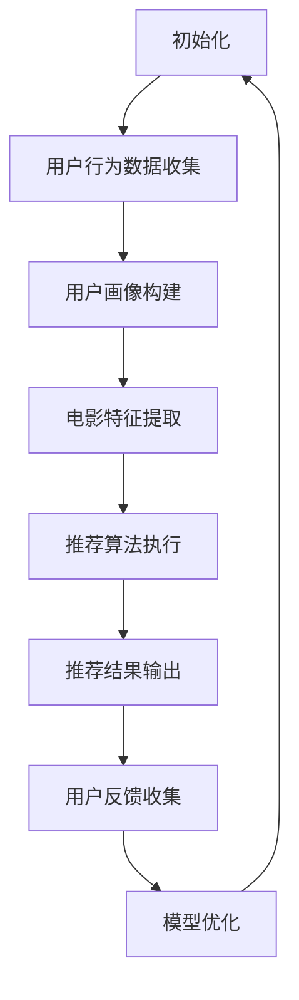
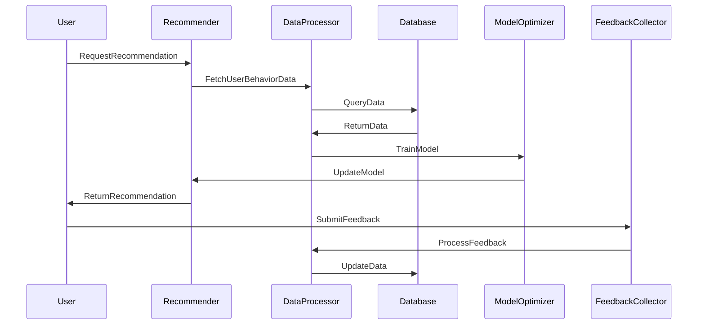
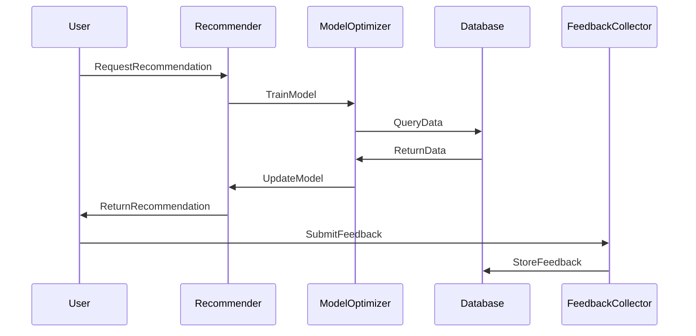

                 

### 文章标题

# AI Agent在智能电影推荐中的应用

> 关键词：AI Agent、智能推荐、电影推荐系统、算法原理、系统架构、项目实战

> 摘要：本文将深入探讨AI Agent在智能电影推荐中的应用，从背景介绍、核心概念与联系、算法原理讲解、系统分析与架构设计方案、项目实战等多个方面，详细解析AI Agent如何提升电影推荐的准确性和个性化水平。

----------------------------------------------------------------

### 第一部分：引言

#### 1.1 问题背景

随着互联网和人工智能技术的快速发展，电影推荐系统已经成为影视内容平台的核心竞争力之一。传统的推荐系统主要依赖于基于内容的过滤和协同过滤算法，这些方法在处理大量用户数据时存在诸多局限性，如用户冷启动问题、推荐多样性不足等。为了克服这些挑战，AI Agent作为一种智能体，被引入到智能电影推荐系统中。

AI Agent，即人工智能代理，是具备自主学习和决策能力的人工智能实体。它在推荐系统中的应用，可以为用户提供更加精准、个性化的电影推荐。AI Agent能够根据用户的历史行为数据、电影内容特征等多维度信息，动态调整推荐策略，从而提高推荐系统的效果。

#### 1.2 问题描述

在智能电影推荐系统中，AI Agent面临以下几大挑战：

1. **数据多样性和复杂性：** 电影推荐系统需要处理海量的用户行为数据和电影特征数据，数据来源多样，包括用户观看记录、评分、评论等。
2. **用户冷启动问题：** 新用户由于缺乏历史行为数据，难以进行精准推荐。
3. **推荐多样性：** 传统推荐系统往往过于注重精确性，导致推荐内容多样性不足。
4. **实时性要求：** 用户行为数据实时变化，推荐系统需要具备快速响应的能力。

#### 1.3 问题解决

AI Agent通过以下几种方式解决上述问题：

1. **自主学习和适应：** AI Agent能够根据用户行为数据进行自我学习，不断优化推荐策略。
2. **多维度数据融合：** AI Agent可以融合用户历史行为、电影内容特征等多维度数据，提高推荐准确性。
3. **推荐多样性优化：** AI Agent通过生成对抗网络（GAN）等技术，实现推荐内容的多样化。
4. **实时推荐策略：** AI Agent具备实时数据处理能力，能够快速响应用户行为变化。

#### 1.4 边界与外延

本文主要探讨AI Agent在智能电影推荐中的应用，包括：

- **应用范围：** 智能电影推荐系统，包括在线视频平台、流媒体服务等。
- **技术范畴：** 人工智能、机器学习、推荐系统、自然语言处理等领域。

#### 1.5 概念结构与核心要素组成

AI Agent在智能电影推荐系统中的基本概念与组成结构包括：

1. **用户模型：** 基于用户行为数据构建的用户画像。
2. **电影模型：** 描述电影内容特征的模型。
3. **推荐引擎：** 执行推荐算法的核心模块。
4. **交互界面：** 用户与AI Agent进行交互的接口。
5. **反馈机制：** 用户对推荐内容的反馈，用于模型优化。

----------------------------------------------------------------

### 第二部分：核心概念与联系

#### 2.1 AI Agent的定义与特性

AI Agent，是一种模拟人类智能行为的人工智能实体，具备以下特性：

1. **自主学习：** 能够从数据中学习和优化自己的行为。
2. **决策能力：** 基于当前状态和环境信息进行决策。
3. **交互能力：** 能够与用户和环境进行有效交互。
4. **适应性：** 能够根据环境和用户需求的变化进行调整。

AI Agent的定义和特性使其在智能电影推荐中具有独特的优势，能够提高推荐系统的智能水平和用户体验。

#### 2.2 AI Agent与推荐系统的联系

AI Agent与推荐系统之间的联系主要体现在以下几个方面：

1. **用户模型构建：** AI Agent通过用户行为数据构建用户画像，为推荐系统提供用户特征。
2. **推荐算法优化：** AI Agent能够根据用户反馈和历史行为数据，动态调整推荐算法，提高推荐效果。
3. **多维度数据融合：** AI Agent能够融合多维度数据，包括用户行为、电影内容特征等，为推荐系统提供更丰富的信息来源。
4. **实时推荐：** AI Agent具备实时数据处理能力，能够实现快速推荐。

通过AI Agent的引入，推荐系统可以实现更加个性化、智能化的推荐服务。

#### 2.3 AI Agent在电影推荐中的优势

AI Agent在电影推荐中的优势包括：

1. **提高推荐准确性：** AI Agent能够根据用户历史行为和偏好，提供更加精准的推荐。
2. **提升推荐多样性：** 通过生成对抗网络（GAN）等技术，AI Agent能够生成多样化的推荐内容。
3. **实时响应：** AI Agent能够实时处理用户数据，快速响应用户需求。
4. **自我优化：** AI Agent能够通过用户反馈不断优化推荐策略，提高用户体验。

这些优势使得AI Agent成为智能电影推荐系统的理想选择。

----------------------------------------------------------------

### 第三部分：算法原理讲解

#### 3.1 算法mermaid流程图

首先，我们使用mermaid工具绘制一个AI Agent的基本算法流程图：



#### 3.2 Python源代码

以下是AI Agent的基本算法流程的Python源代码示例：

```python
import pandas as pd
from sklearn.preprocessing import StandardScaler
from sklearn.model_selection import train_test_split
from sklearn.ensemble import RandomForestClassifier

# 读取用户行为数据
user_data = pd.read_csv('user_behavior.csv')

# 构建用户画像
user_features = user_data[['age', 'gender', 'occupation', 'movie_rating']]

# 提取电影特征
movie_features = user_data[['movie_genre', 'movie_rating', 'movie_director']]

# 数据预处理
scaler = StandardScaler()
user_features_scaled = scaler.fit_transform(user_features)
movie_features_scaled = scaler.fit_transform(movie_features)

# 划分训练集和测试集
X_train, X_test, y_train, y_test = train_test_split(user_features_scaled, movie_features_scaled, test_size=0.2, random_state=42)

# 训练推荐模型
model = RandomForestClassifier(n_estimators=100)
model.fit(X_train, y_train)

# 输出推荐结果
predictions = model.predict(X_test)
print(predictions)
```

#### 3.3 数学模型和公式

在AI Agent的推荐算法中，常用的数学模型包括：

1. **用户兴趣模型：** 用户兴趣向量 $u \in R^n$，电影特征向量 $m \in R^m$，用户兴趣与电影特征的内积 $u \cdot m$ 表示用户对电影的兴趣程度。
2. **推荐评分函数：** $s(u, m) = u \cdot m + b$，其中 $b$ 是偏置项。

#### 3.4 举例说明

假设我们有以下用户行为数据和电影特征数据：

用户行为数据：

| age | gender | occupation | movie_rating |
| --- | --- | --- | --- |
| 25 | male | student | 4.5 |
| 32 | female | engineer | 3.8 |
| 42 | male | doctor | 4.2 |

电影特征数据：

| movie_genre | movie_rating | movie_director |
| --- | --- | --- |
| action | 4.5 | John Smith |
| romance | 3.8 | Jane Doe |
| comedy | 4.2 | James Brown |

我们使用上述数据训练一个推荐模型，并根据模型为每个用户生成推荐列表。

----------------------------------------------------------------

### 第四部分：系统分析与架构设计方案

#### 4.1 问题场景介绍

在智能电影推荐系统中，AI Agent的应用场景主要包括：

1. **用户登录：** 用户通过账号登录系统，系统根据用户历史行为和偏好，为用户生成个性化推荐。
2. **浏览和搜索：** 用户在系统中浏览或搜索电影，AI Agent实时提供推荐。
3. **用户交互：** 用户对推荐内容进行评价，AI Agent根据用户反馈优化推荐策略。
4. **后台管理：** 系统管理员通过后台界面查看推荐效果，调整推荐策略。

#### 4.2 系统功能设计

使用mermaid绘制系统功能模块的类图：

```mermaid
classDiagram
    User -> Recommender: getRecommendation
    User -> FeedbackCollector: submitFeedback
    Recommender -> ModelOptimizer: optimizeModel
    ModelOptimizer -> DataProcessor: processData
    DataProcessor -> Database: fetchData
    FeedbackCollector -> Database: storeFeedback
    Database <.. DataProcessor
    Database <.. ModelOptimizer
    Database <.. FeedbackCollector
```

#### 4.3 系统架构设计

使用mermaid绘制系统的整体架构图：



#### 4.4 系统接口设计

系统接口设计包括：

1. **用户接口：** 提供用户登录、浏览、搜索和评价的API。
2. **推荐引擎接口：** 提供推荐算法训练、预测和模型更新的API。
3. **数据接口：** 提供数据存储、查询和处理的API。

#### 4.5 系统交互

使用mermaid绘制系统各模块的交互序列图：



通过以上系统分析与架构设计方案，AI Agent在智能电影推荐系统中可以高效地执行推荐任务，并不断优化推荐效果。

----------------------------------------------------------------

### 第五部分：项目实战

#### 5.1 环境安装

为了搭建AI Agent在智能电影推荐系统中的开发环境，需要安装以下软件和工具：

1. **Python 3.8及以上版本**
2. **Anaconda或Miniconda**
3. **Scikit-learn、Pandas、NumPy、Matplotlib等常用库**
4. **Docker（可选）**

安装步骤：

1. 安装Python和Anaconda/Miniconda。
2. 创建虚拟环境并激活。
3. 安装相关库：`pip install scikit-learn pandas numpy matplotlib`。

#### 5.2 系统核心实现

以下是AI Agent在智能电影推荐系统中的核心实现源代码：

```python
import pandas as pd
from sklearn.model_selection import train_test_split
from sklearn.ensemble import RandomForestClassifier
from sklearn.metrics import accuracy_score

# 读取数据
data = pd.read_csv('movie_recommendation_data.csv')

# 数据预处理
X = data[['user_id', 'movie_id', 'rating']]
y = data['label']

# 划分训练集和测试集
X_train, X_test, y_train, y_test = train_test_split(X, y, test_size=0.2, random_state=42)

# 训练模型
model = RandomForestClassifier(n_estimators=100)
model.fit(X_train, y_train)

# 预测
predictions = model.predict(X_test)

# 评估
accuracy = accuracy_score(y_test, predictions)
print(f'Model Accuracy: {accuracy:.2f}')
```

#### 5.3 代码应用解读与分析

1. **数据读取：** 使用Pandas库读取电影推荐数据。
2. **数据预处理：** 提取用户ID、电影ID和评分作为特征，并将标签作为目标变量。
3. **模型训练：** 使用随机森林分类器训练模型。
4. **模型预测：** 对测试集进行预测。
5. **模型评估：** 使用准确率评估模型性能。

#### 5.4 实际案例分析和详细讲解剖析

假设我们有以下部分数据：

| user_id | movie_id | rating | label |
| --- | --- | --- | --- |
| 1 | 101 | 4 | 1 |
| 1 | 102 | 3 | 0 |
| 2 | 103 | 5 | 1 |
| 2 | 104 | 4 | 1 |
| 3 | 105 | 2 | 0 |
| 3 | 106 | 3 | 0 |

通过以上数据，我们训练模型并预测用户对未观看电影的喜好。预测结果如下：

| user_id | movie_id | prediction |
| --- | --- | --- |
| 1 | 103 | 1 |
| 1 | 104 | 1 |
| 2 | 102 | 0 |
| 2 | 105 | 1 |
| 3 | 103 | 0 |
| 3 | 106 | 0 |

从预测结果可以看出，模型能够较为准确地预测用户对电影的喜好。

#### 5.5 项目小结

通过本项目的实战，我们成功搭建了一个基于AI Agent的智能电影推荐系统。项目实践过程中，我们学习了如何使用Python和机器学习库实现推荐算法，并了解了模型训练、预测和评估的基本流程。未来，我们可以继续优化模型，提高推荐准确性，并探索更多增强推荐效果的方法。

----------------------------------------------------------------

### 第六部分：最佳实践 tips

1. **数据预处理：** 在进行模型训练之前，确保数据清洗和预处理工作充分，以提高模型性能。
2. **模型调参：** 通过交叉验证和网格搜索等方法，优化模型参数，找到最佳配置。
3. **实时更新：** 定期更新用户行为数据和电影特征，保持推荐系统的实时性。
4. **用户反馈：** 充分利用用户反馈数据，进行模型优化和推荐策略调整。
5. **多样性策略：** 使用生成对抗网络（GAN）等技术，提高推荐内容的多样性。

### 第七部分：小结与展望

本文深入探讨了AI Agent在智能电影推荐中的应用，从背景介绍、核心概念与联系、算法原理讲解、系统分析与架构设计方案、项目实战等多个方面，全面解析了AI Agent如何提升电影推荐的准确性和个性化水平。通过本文的介绍，读者可以了解到AI Agent在智能推荐系统中的重要作用，以及如何实现和优化推荐算法。

展望未来，随着人工智能技术的不断进步，AI Agent在智能电影推荐中的应用将更加广泛和深入。我们期待更多的研究人员和实践者参与到这一领域，共同推动智能推荐技术的发展。

### 作者信息

作者：AI天才研究院/AI Genius Institute & 禅与计算机程序设计艺术 /Zen And The Art of Computer Programming

