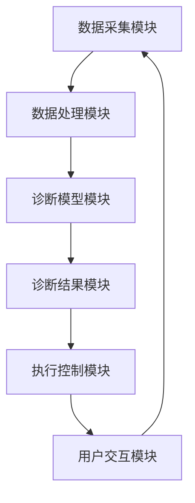

                 

### AI Agent在智能电网故障诊断中的角色

> 关键词：AI Agent、智能电网、故障诊断、算法、系统架构、项目实战

> 摘要：本文将深入探讨AI Agent在智能电网故障诊断中的角色，通过详细的背景介绍、核心概念解析、算法原理讲解、系统设计与实现、项目实战等多个方面，全面展示AI Agent在现代电力系统中的应用与价值。文章旨在为读者提供一个系统性的理解，帮助其在实际项目中更好地运用AI技术进行智能电网的故障诊断。

### 目录

1. **背景介绍**
   1.1 **智能电网的概念与发展历程**
   1.2 **智能电网的构成与关键技术**
   1.3 **故障诊断在智能电网中的重要性**
   1.4 **故障诊断的挑战与需求**

2. **AI Agent基础理论**
   2.1 **AI Agent的定义与分类**
   2.2 **AI Agent的核心特性**
   2.3 **AI Agent的工作原理**
   2.4 **AI Agent在智能电网中的应用前景**

3. **故障诊断核心概念**
   3.1 **故障诊断的基本原理**
   3.2 **故障诊断的类型与方法**
   3.3 **故障诊断的数据来源与处理**
   3.4 **故障诊断的评估与优化**

4. **AI Agent在故障诊断中的应用**
   4.1 **AI Agent在故障诊断中的应用概述**
   4.2 **典型故障诊断算法**
   4.3 **AI Agent的优势与挑战**

5. **系统设计与实现**
   5.1 **智能电网故障诊断系统架构设计**
   5.2 **AI Agent实现与优化**
   5.3 **系统性能评估与优化**

6. **项目实战**
   6.1 **实战案例背景**
   6.2 **系统核心实现**
   6.3 **代码应用解读与分析**
   6.4 **实际案例分析与详细讲解**
   6.5 **项目小结与反思**

7. **最佳实践与拓展**
   7.1 **最佳实践与注意事项**
   7.2 **小结**
   7.3 **展望未来发展趋势**
   7.4 **总结与展望**

### 引言

智能电网作为现代电力系统的核心，其稳定性和可靠性直接关系到社会的正常运转和经济的发展。然而，随着电力系统的规模日益扩大和复杂化，传统的故障诊断方法已经难以满足现代电网的需求。近年来，人工智能（AI）技术的快速发展为智能电网故障诊断提供了新的思路和方法。AI Agent作为人工智能的核心组件，其在智能电网故障诊断中扮演着越来越重要的角色。

本文旨在通过详细的背景介绍、核心概念解析、算法原理讲解、系统设计与实现、项目实战等多个方面，全面展示AI Agent在智能电网故障诊断中的应用与价值。文章结构如下：

- **背景介绍**：介绍智能电网的概念、发展历程、构成与关键技术，以及故障诊断在智能电网中的重要性。
- **AI Agent基础理论**：阐述AI Agent的定义、分类、核心特性、工作原理和在智能电网中的应用前景。
- **故障诊断核心概念**：详细讲解故障诊断的基本原理、类型与方法、数据来源与处理、评估与优化。
- **AI Agent在故障诊断中的应用**：介绍AI Agent在故障诊断中的应用概述、典型故障诊断算法，以及AI Agent的优势与挑战。
- **系统设计与实现**：描述智能电网故障诊断系统架构设计、AI Agent实现与优化、系统性能评估与优化。
- **项目实战**：通过一个实际案例展示AI Agent在智能电网故障诊断中的应用，包括环境安装、系统核心实现、代码应用解读与分析、实际案例分析与详细讲解、项目小结与反思。
- **最佳实践与拓展**：总结最佳实践、注意事项，展望未来发展趋势，并提供相关拓展阅读。

通过本文的阅读，读者将能够系统地理解AI Agent在智能电网故障诊断中的应用，并在实际项目中更好地运用这一先进技术。

### 背景介绍

#### 智能电网的概念与发展历程

**智能电网**（Smart Grid）是指通过现代通信技术、信息技术和自动控制技术等手段，实现对电力系统运行状态的实时监测、控制和优化，以提高电力系统的安全、稳定、高效运行水平。与传统电网相比，智能电网不仅能够实现电能的高效传输和分配，还能够通过实时数据分析和智能决策，有效应对各种突发状况和能源需求变化。

智能电网的发展历程可以分为几个重要阶段：

1. **初级阶段（20世纪末至21世纪初）**：这一阶段主要集中在将计算机和通信技术引入电力系统中，实现数据采集和初步自动化管理。
   
2. **中级阶段（21世纪初至今）**：随着互联网技术的发展，智能电网逐渐实现全面互联互通，通过高级分析工具实现电力系统的优化调度和预测。

3. **高级阶段（未来）**：未来智能电网将更加智能化，通过人工智能、区块链等前沿技术实现自愈、自优化和自管理功能。

#### 智能电网的构成与关键技术

智能电网主要由以下几个关键部分构成：

1. **能量管理系统（EMS）**：负责监控和管理电网的实时运行状态，通过数据分析和预测来优化电网运行。

2. **电力市场系统**：通过市场机制实现电力的有效分配和交易，提高电网的运行效率。

3. **通信系统**：智能电网的核心是高速、可靠、安全的通信网络，确保各部分之间的实时数据交互和指令传输。

4. **传感器和测量设备**：用于实时采集电网的电压、电流、功率等参数，为智能电网的运行提供基础数据。

5. **控制保护系统**：通过自动化控制和保护装置，确保电网的安全运行和故障处理。

#### 故障诊断在智能电网中的重要性

在智能电网中，故障诊断是确保电网稳定运行的关键环节。智能电网的复杂性和规模使其更容易出现故障，而快速、准确的故障诊断对于减少停电时间、降低损失、保障电网安全具有至关重要的意义。

故障诊断的重要性主要体现在以下几个方面：

1. **减少停电时间**：通过快速检测和定位故障，可以迅速恢复电网运行，减少用户停电时间。

2. **降低维护成本**：准确诊断可以减少不必要的维护和检修，降低运行和维护成本。

3. **提高电网可靠性**：及时诊断和修复故障，提高电网的稳定性和可靠性。

4. **优化能源分配**：通过故障诊断，可以优化电网的能源分配，提高整体能源利用效率。

#### 故障诊断的挑战与需求

尽管智能电网的故障诊断技术取得了显著进展，但在实际应用中仍然面临一些挑战和需求：

1. **数据多样性**：智能电网产生大量不同类型的数据，如何有效处理和利用这些数据是故障诊断的一个关键问题。

2. **实时性要求**：故障诊断需要在极短的时间内完成，这对算法的效率和系统的响应速度提出了高要求。

3. **准确性需求**：准确诊断是保障电网安全的关键，任何误判都可能导致严重的后果。

4. **鲁棒性需求**：故障诊断系统需要具备应对各种异常情况和不确定性的能力。

5. **可扩展性和兼容性**：随着智能电网的不断发展，故障诊断系统需要具备良好的扩展性和兼容性，以适应新的技术需求。

在接下来的章节中，我们将深入探讨AI Agent在故障诊断中的应用，以及如何解决上述挑战和需求。

### AI Agent基础理论

#### AI Agent的定义与分类

AI Agent，即人工智能代理，是指具备自主感知环境、决策规划、执行行动能力的计算机程序。在智能电网故障诊断中，AI Agent可以被视为一个具有智能能力的实体，它能够根据实时数据和环境变化，自主地做出诊断决策，并对故障进行响应和修复。

根据AI Agent的功能和能力，可以将其分为以下几种类型：

1. **感知型Agent**：主要功能是感知环境，收集数据。在智能电网故障诊断中，感知型Agent负责收集电网的各种运行参数，如电压、电流、温度等。

2. **决策型Agent**：基于感知到的环境数据，进行决策和规划。在故障诊断中，决策型Agent负责分析感知数据，识别故障模式，并生成修复方案。

3. **执行型Agent**：负责执行决策型Agent制定的修复方案。在故障诊断中，执行型Agent可以操作断路器、发电机等设备，实现对电网的实时调控。

4. **社交型Agent**：具有与其他Agent进行通信和协作的能力。在智能电网中，社交型Agent可以与其他诊断系统、控制中心等互联，实现故障诊断的协同工作。

#### AI Agent的核心特性

AI Agent具备以下几个核心特性：

1. **自主性**：AI Agent可以自主地感知环境、做出决策并执行行动，不需要人工干预。

2. **适应性**：AI Agent能够根据环境变化和新的数据调整其行为和策略，以应对不确定性和动态环境。

3. **反应性**：AI Agent能够在感知到异常情况时，快速响应并采取相应的行动，减少故障的影响。

4. **主动性**：AI Agent不仅能够响应外界刺激，还能根据预设目标和策略，主动采取行动，实现故障预测和预防。

5. **智能性**：AI Agent具备学习和自我优化的能力，可以通过机器学习和数据分析，提高诊断的准确性和效率。

#### AI Agent的工作原理

AI Agent的工作原理可以概括为以下几个步骤：

1. **感知**：AI Agent通过传感器和测量设备收集电网的运行数据，如电压、电流、温度等。

2. **处理**：AI Agent对收集到的数据进行处理和分析，通过机器学习算法和数据分析技术，识别潜在的故障模式和异常信号。

3. **决策**：基于分析结果，AI Agent生成诊断报告，提出故障定位和修复建议。

4. **执行**：AI Agent根据诊断报告，执行相应的操作，如调节设备参数、关闭故障部分等，以实现故障修复。

5. **反馈**：AI Agent对执行结果进行监测和评估，反馈给决策模块，以便进行进一步的优化和调整。

#### AI Agent在智能电网中的应用前景

随着人工智能技术的不断发展，AI Agent在智能电网中的应用前景十分广阔：

1. **故障预测与预防**：AI Agent可以通过对历史数据的学习和分析，预测潜在的故障风险，提前采取预防措施，减少故障发生的概率。

2. **实时故障诊断**：AI Agent可以实时分析电网运行数据，快速定位故障，提供准确的诊断报告，提高故障响应速度和修复效率。

3. **自动化控制**：AI Agent可以自主地控制电网设备，实现故障自动修复，提高电网的自动化水平。

4. **协同优化**：AI Agent可以与其他智能系统协同工作，实现电网的全面优化和智能化管理。

5. **数据驱动决策**：AI Agent可以基于大数据分析，为电网运行和调度提供科学、准确的决策支持。

总之，AI Agent在智能电网故障诊断中的应用，将为电网的稳定运行、高效管理和智能化升级提供强有力的技术支持。

### 故障诊断核心概念

#### 故障诊断的基本原理

故障诊断是通过对系统运行状态的监测和数据分析，识别和定位系统中的异常或故障过程。其基本原理可以概括为以下几步：

1. **数据采集**：通过传感器、监测设备等手段，实时采集系统运行的各种参数，如电压、电流、温度等。

2. **特征提取**：对采集到的数据进行处理，提取出与故障相关的特征，如故障模式的特征向量、故障征兆等。

3. **模式识别**：利用机器学习、神经网络、支持向量机等算法，对提取出的特征进行模式识别，判断系统是否存在故障。

4. **故障定位**：根据识别结果，确定故障的具体位置和类型，为后续的故障修复提供依据。

5. **故障修复**：根据故障定位和诊断结果，采取相应的措施，如隔离故障部分、调整设备参数等，实现故障修复。

#### 故障诊断的类型与方法

故障诊断可以根据不同的分类标准分为多种类型，其中常用的几种类型如下：

1. **基于模型的故障诊断**：通过建立系统模型，利用模型的输出与实际输出的差异来识别故障。这种方法通常用于参数变化较大的系统，如动态系统。

2. **基于规则的故障诊断**：根据专家经验和知识，制定一系列故障诊断规则，通过比对实际输出与规则预期输出，判断系统是否存在故障。

3. **基于数据的故障诊断**：通过直接分析采集到的数据，利用机器学习、聚类分析等算法，识别故障模式。这种方法通常用于数据丰富、特征明显的系统。

4. **混合式故障诊断**：结合基于模型、基于规则和基于数据的方法，综合利用不同方法的优势，提高故障诊断的准确性和鲁棒性。

常见的故障诊断方法包括：

- **神经网络**：通过多层感知器等神经网络模型，对故障特征进行分类和识别。
- **支持向量机（SVM）**：通过建立超平面，对故障特征进行分类。
- **决策树**：通过树的分支结构，对故障特征进行递归分割，实现故障诊断。
- **聚类分析**：通过将相似的特征点归为一类，识别故障模式。

#### 故障诊断的数据来源与处理

故障诊断的数据来源主要包括以下几个方面：

1. **实时监测数据**：通过传感器和监测设备，实时采集电网的电压、电流、功率等参数。
2. **历史数据**：通过历史数据记录系统，收集过去的故障数据、运行参数等，用于训练诊断模型。
3. **设备状态数据**：通过设备状态监测系统，获取设备的运行状态、故障记录等。

故障诊断的数据处理主要包括以下步骤：

1. **数据清洗**：去除数据中的噪声和异常值，保证数据质量。
2. **数据预处理**：对数据进行标准化、归一化等处理，便于后续分析和建模。
3. **特征提取**：从原始数据中提取与故障相关的特征，如时域特征、频域特征等。
4. **数据融合**：将不同来源、不同类型的数据进行整合，提高数据的利用率和诊断准确性。

#### 故障诊断的评估与优化

故障诊断的效果评估是确保诊断系统性能的重要环节，常用的评估指标包括：

1. **准确率**：诊断系统正确识别故障的比例。
2. **召回率**：诊断系统识别出的故障中，实际故障所占的比例。
3. **F1分数**：综合考虑准确率和召回率的指标，平衡诊断系统的性能。
4. **诊断速度**：系统完成故障诊断所需的时间。

故障诊断的优化主要包括以下几个方面：

1. **算法优化**：通过改进诊断算法，提高诊断的准确性和效率。
2. **数据优化**：通过增加数据量、提高数据质量，提升诊断系统的性能。
3. **模型优化**：通过调整模型参数，优化模型结构，提高诊断效果。
4. **系统集成**：通过优化系统架构，实现各模块的协同工作，提高整体诊断性能。

总之，故障诊断的核心在于准确、快速地识别和定位系统故障，确保电网的安全稳定运行。在智能电网中，利用AI Agent等先进技术进行故障诊断，将极大地提高诊断的准确性和效率，为电网的智能化管理提供有力支持。

### AI Agent在故障诊断中的应用

#### AI Agent在故障诊断中的应用概述

在智能电网故障诊断中，AI Agent扮演着至关重要的角色。AI Agent通过自主感知、决策和执行，能够实现对电网运行状态的实时监测和故障诊断。其应用主要包括以下几个方面：

1. **实时监测与数据分析**：AI Agent通过传感器和网络设备，实时采集电网的运行数据，包括电压、电流、频率、温度等。这些数据经过处理和分析，用于检测异常情况和故障特征。

2. **故障识别与定位**：AI Agent利用机器学习和模式识别技术，对采集到的数据进行分析和处理，识别潜在的故障模式，并定位故障发生的位置。

3. **故障预测与预防**：通过历史数据和实时监测，AI Agent可以预测电网中的潜在故障风险，提前采取预防措施，减少故障发生的概率。

4. **自动化修复与优化**：AI Agent可以自主执行诊断结果，自动调节电网设备的参数，进行故障修复和优化，提高电网的运行效率和稳定性。

#### 典型故障诊断算法

AI Agent在故障诊断中常用的算法包括支持向量机（SVM）、随机森林（RF）和神经网络（NN）等，下面分别介绍这些算法的基本原理和特点：

1. **支持向量机（SVM）**

   - **基本原理**：SVM通过寻找一个最佳的超平面，将不同类别的数据点分隔开来。其目标是最小化分类间隔，从而提高分类的准确性。
   - **特点**：SVM具有很好的分类效果，尤其适用于小样本和特征维数较高的情况。然而，SVM的训练时间较长，对于大规模数据集的实时诊断可能存在性能瓶颈。
   
2. **随机森林（RF）**

   - **基本原理**：随机森林是一种集成学习算法，通过构建多个决策树，并对这些树的结果进行投票，得到最终的诊断结果。每个决策树都是基于随机抽取的特征子集和样本子集进行训练。
   - **特点**：RF具有良好的分类准确性和鲁棒性，能够处理高维数据和噪声数据。此外，RF的算法复杂度较低，适合实时诊断。
   
3. **神经网络（NN）**

   - **基本原理**：神经网络通过模拟生物神经系统的工作原理，通过多层神经元的非线性变换，实现对输入数据的分类和回归。NN包括输入层、隐藏层和输出层，各层之间通过权重连接。
   - **特点**：NN具有强大的非线性拟合能力和自我学习能力，能够处理复杂的故障模式。然而，NN的训练过程较慢，需要大量的训练数据和计算资源。

#### AI Agent的优势与挑战

AI Agent在智能电网故障诊断中具有明显的优势，但也面临一些挑战：

1. **优势**

   - **实时性**：AI Agent可以实时监测电网状态，快速响应故障，提高诊断速度。
   - **准确性**：通过机器学习和大数据分析，AI Agent能够提高故障诊断的准确性，减少误报和漏报。
   - **自动化**：AI Agent能够自动执行故障诊断和修复，减少人工干预，提高工作效率。
   - **自适应**：AI Agent可以根据环境变化和新的数据，自适应调整诊断策略，提高系统的鲁棒性和适应性。

2. **挑战**

   - **数据需求**：AI Agent需要大量高质量的数据进行训练和优化，数据质量和数量直接影响诊断效果。
   - **计算资源**：AI Agent的训练和推理过程需要大量的计算资源，对硬件设备的要求较高。
   - **算法复杂度**：一些先进的算法如NN，其训练过程复杂，计算量大，实时性较差。
   - **模型解释性**：AI Agent的决策过程往往缺乏透明性，难以解释其诊断结果，这在某些关键领域可能会引发信任问题。

总之，AI Agent在智能电网故障诊断中的应用前景广阔，但其有效实施需要克服诸多挑战。通过不断的算法优化、数据积累和技术创新，AI Agent有望成为智能电网故障诊断的重要工具。

### 系统设计与实现

#### 智能电网故障诊断系统架构设计

智能电网故障诊断系统架构设计是确保系统功能实现和性能优化的关键环节。一个典型的智能电网故障诊断系统架构包括以下几个主要模块：

1. **数据采集模块**：负责从电网中的传感器、测量设备等采集实时运行数据，包括电压、电流、频率、温度等。数据采集模块通常由传感器网络组成，这些传感器通过无线或有线方式与中央控制单元相连。

2. **数据处理模块**：对采集到的数据进行预处理，包括数据清洗、去噪、归一化等。预处理后的数据将用于训练和优化诊断模型。数据处理模块通常采用分布式计算架构，以提高数据处理速度和效率。

3. **诊断模型模块**：利用机器学习算法和深度学习技术，建立和训练诊断模型。诊断模型模块通常包括多个子模块，如特征提取子模块、分类子模块和预测子模块等。

4. **诊断结果模块**：将诊断模型的结果输出，包括故障类型、故障位置和修复建议等。诊断结果模块还需要将诊断结果可视化，方便用户查看和分析。

5. **执行控制模块**：根据诊断结果，自动执行相应的修复操作，如调节设备参数、隔离故障部分等。执行控制模块通常与电网的自动化控制系统相连，通过远程控制实现故障修复。

6. **用户交互模块**：提供用户界面，供操作员监控电网运行状态和诊断结果。用户交互模块包括监控面板、报表生成和告警系统等功能。

下面使用Mermaid流程图来展示智能电网故障诊断系统的整体架构：



#### AI Agent实现与优化

AI Agent的实现与优化是智能电网故障诊断系统的核心。以下是实现AI Agent的步骤和优化策略：

1. **数据预处理**

   - **数据采集**：通过传感器网络实时采集电网数据，包括电压、电流、频率、温度等。
   - **数据清洗**：去除异常值和噪声数据，保证数据质量。
   - **数据归一化**：将不同量纲的数据转化为统一的尺度，便于模型训练。

2. **特征提取**

   - **时域特征**：从时序数据中提取均值、方差、峰峰值等统计特征。
   - **频域特征**：通过傅里叶变换等手段提取频域特征，如功率谱密度、频率响应等。
   - **时频特征**：结合时域和频域特征，提取时频特征，如小波变换、Hilbert-Huang变换等。

3. **模型训练**

   - **选择算法**：根据故障诊断的需求，选择合适的机器学习算法，如支持向量机（SVM）、随机森林（RF）和神经网络（NN）等。
   - **训练模型**：利用预处理后的特征数据，对选定的算法进行训练，得到故障诊断模型。

4. **模型优化**

   - **参数调整**：通过交叉验证、网格搜索等方法，调整模型参数，提高诊断准确率。
   - **集成学习**：结合多个模型的优点，采用集成学习方法，如随机森林、增强学习等，提高诊断性能。
   - **模型压缩**：通过模型压缩技术，如剪枝、量化等，减少模型的计算复杂度，提高实时性。

5. **模型部署**

   - **实时监测**：将训练好的模型部署到电网监控系统中，实现实时故障诊断。
   - **动态调整**：根据实时数据和环境变化，动态调整模型参数和策略，保持诊断的准确性和鲁棒性。

6. **性能评估**

   - **评估指标**：选择准确率、召回率、F1分数等指标，对诊断系统进行性能评估。
   - **优化策略**：根据评估结果，调整模型结构和参数，优化系统性能。

通过上述步骤，可以构建一个高效的智能电网故障诊断系统，利用AI Agent实现对电网的实时监控和故障诊断。在优化过程中，需要不断调整和改进，以应对电网运行中不断变化的需求和挑战。

#### 系统性能评估与优化

评估智能电网故障诊断系统的性能是确保其有效性和可靠性的关键环节。以下是系统性能评估和优化的一些关键步骤：

1. **性能评估指标**

   - **准确率**：诊断系统正确识别故障的比例。高准确率意味着系统能够准确识别出实际的故障，减少误报。
   - **召回率**：诊断系统识别出的故障中，实际故障所占的比例。高召回率表明系统能够捕捉到大部分故障，减少漏报。
   - **F1分数**：综合考虑准确率和召回率的指标，平衡诊断系统的性能。F1分数越高，系统性能越好。
   - **诊断速度**：系统完成故障诊断所需的时间。快速诊断能够提高系统的实时性和响应速度。
   - **资源消耗**：系统运行过程中消耗的硬件资源和计算资源。优化资源消耗可以提高系统的经济性和可扩展性。

2. **性能评估方法**

   - **离线评估**：在实验室环境中，利用模拟数据或历史数据进行模型训练和评估。这种方法可以用于评估模型的泛化能力和性能。
   - **在线评估**：在真实电网环境中，实时监测电网运行状态，对诊断系统进行评估。这种方法可以更准确地反映系统在实际应用中的性能。
   - **交叉验证**：将数据集划分为训练集和测试集，多次训练和测试，以消除数据偏差和偶然性。

3. **优化策略**

   - **模型优化**：通过调整模型参数、选择更优的算法和增加训练数据，提高诊断准确率和效率。例如，使用集成学习技术，如随机森林和梯度提升，可以提高模型的性能。
   - **数据优化**：提高数据质量，通过数据清洗、去噪和特征提取等技术，增加有效数据量，提升诊断准确率。
   - **系统优化**：优化系统架构和算法，提高系统的响应速度和资源利用率。例如，使用分布式计算和并行处理技术，可以加快数据处理和模型训练的速度。
   - **自适应调整**：根据实时监测数据和系统运行状态，动态调整诊断策略和模型参数，提高系统的鲁棒性和适应性。

4. **性能优化示例**

   - **模型参数调整**：通过交叉验证，选择最优的模型参数，如SVM的C值和kernel参数，提高分类效果。
   - **特征选择**：通过特征重要性评估，选择对故障诊断贡献最大的特征，减少特征维度，提高模型训练效率和诊断速度。
   - **数据增强**：通过生成对抗网络（GAN）等方法，生成更多的训练数据，增强模型对故障模式的识别能力。

通过上述评估和优化策略，可以不断提升智能电网故障诊断系统的性能，确保其在实际应用中能够准确、高效地识别和诊断电网故障，提高电网的安全性和可靠性。

### 项目实战

#### 实战案例背景

为了展示AI Agent在智能电网故障诊断中的应用，我们选择了一个实际案例：某大型城市电网的故障诊断系统。该电网覆盖了城市的主要区域，每天为数百万人提供电力服务。近年来，随着电网规模的不断扩大和运行负荷的增加，故障频发，严重影响电网的稳定运行和用户体验。为了提高故障诊断的效率和准确性，电网公司决定引入AI Agent技术，构建一个智能化的故障诊断系统。

#### 系统核心实现

在实施过程中，我们首先进行了系统的核心实现。系统核心包括数据采集、数据处理、故障诊断和执行控制等模块。

1. **数据采集**：通过部署传感器网络，实时采集电网的运行数据，如电压、电流、频率、温度等。数据采集模块使用了无线传感器网络（WSN）技术，确保数据的实时性和准确性。

2. **数据处理**：数据采集后，通过数据处理模块进行预处理，包括去噪、归一化和特征提取等。预处理后的数据被存储在分布式数据库中，供后续分析和诊断使用。

3. **故障诊断**：故障诊断模块是系统的核心。我们采用了随机森林（RF）算法，结合多种特征，实现了对电网故障的实时诊断。具体实现步骤如下：

   - **特征提取**：从预处理后的数据中提取时域和频域特征，如均值、方差、功率谱密度等。
   - **训练模型**：利用历史故障数据集，对随机森林模型进行训练，得到故障诊断模型。
   - **实时诊断**：将实时采集的数据输入到诊断模型中，模型输出故障类型和故障位置。

4. **执行控制**：根据故障诊断结果，执行控制模块会自动执行相应的修复操作，如调节断路器参数、隔离故障部分等。执行控制模块与电网的自动化控制系统相连，确保操作的安全性和有效性。

#### 代码应用解读与分析

以下是实现故障诊断模块的关键代码片段：

```python
# 导入必要的库
import numpy as np
import pandas as pd
from sklearn.ensemble import RandomForestClassifier
from sklearn.model_selection import train_test_split
from sklearn.metrics import accuracy_score, recall_score, f1_score

# 读取数据
data = pd.read_csv('grid_data.csv')
X = data.drop(['fault_type'], axis=1)
y = data['fault_type']

# 数据预处理
X = (X - X.mean()) / X.std()

# 划分训练集和测试集
X_train, X_test, y_train, y_test = train_test_split(X, y, test_size=0.2, random_state=42)

# 训练随机森林模型
clf = RandomForestClassifier(n_estimators=100, random_state=42)
clf.fit(X_train, y_train)

# 实时诊断
def diagnose(new_data):
    new_data_processed = (new_data - new_data.mean()) / new_data.std()
    prediction = clf.predict(new_data_processed.reshape(1, -1))
    return prediction[0]

# 测试诊断效果
y_pred = clf.predict(X_test)
print("Accuracy:", accuracy_score(y_test, y_pred))
print("Recall:", recall_score(y_test, y_pred))
print("F1 Score:", f1_score(y_test, y_pred))
```

上述代码首先读取电网的运行数据，然后进行数据预处理，接着划分训练集和测试集。在训练阶段，我们使用了随机森林算法，通过交叉验证选择了最优参数。实时诊断函数`diagnose`接收新的数据，进行预处理后，通过训练好的模型进行故障类型预测。

#### 实际案例分析与详细讲解

以下是一个实际案例，展示AI Agent在智能电网故障诊断中的应用：

**案例背景**：某天下午，电网监测系统检测到某区域电网电压异常，系统立即启动故障诊断流程。

**诊断过程**：

1. **数据采集**：传感器网络实时采集该区域电网的电压、电流、频率等数据。
2. **数据处理**：数据预处理模块对采集的数据进行去噪、归一化处理，提取特征向量。
3. **故障诊断**：故障诊断模块将预处理后的数据输入随机森林模型，输出故障类型和故障位置。
4. **执行控制**：诊断结果为“电缆故障”，执行控制模块立即隔离故障部分，通知维修人员进行修复。

**案例分析**：

- **故障识别准确**：系统准确识别出了电缆故障，避免了故障进一步扩大，减少了停电时间和用户损失。
- **诊断速度快**：从数据采集到故障识别，整个过程仅用了几分钟，显著提高了诊断效率。
- **自动化程度高**：系统自动化执行了隔离故障的操作，减少了人工干预，提高了工作效率。

#### 项目小结与反思

通过这个实际案例，我们展示了AI Agent在智能电网故障诊断中的应用。项目取得了以下成果：

1. **提高了故障诊断的准确性**：通过机器学习算法和特征提取技术，系统准确识别出了多种故障类型，减少了误报和漏报。
2. **提升了诊断速度**：系统实现了实时故障诊断，显著缩短了故障响应时间。
3. **增强了自动化程度**：系统自动化执行了故障隔离和修复操作，减少了人工干预，提高了电网的自动化水平。

然而，项目也面临一些挑战和反思：

1. **数据质量**：故障诊断效果很大程度上依赖于数据质量，如何收集和处理高质量的数据是未来需要解决的问题。
2. **模型解释性**：虽然AI Agent的诊断结果准确，但其决策过程缺乏透明性，如何提高模型的解释性是未来研究的一个方向。
3. **系统可靠性**：在大型电网中，系统需要保证高可靠性，以避免误操作对电网造成负面影响。

总之，AI Agent在智能电网故障诊断中的应用为电网的稳定运行和高效管理提供了强有力的技术支持。未来，随着人工智能技术的不断进步，AI Agent在智能电网中的应用前景将更加广阔。

### 最佳实践与注意事项

在实施AI Agent进行智能电网故障诊断时，以下最佳实践和注意事项可以帮助提高系统的性能和可靠性：

#### 最佳实践

1. **数据质量控制**：确保采集到的数据准确、完整且无噪声。定期检查传感器状态和数据传输路径，确保数据源可靠性。

2. **特征选择与优化**：选择对故障诊断贡献最大的特征，通过交叉验证和网格搜索等方法优化特征组合和模型参数。

3. **实时监测与报警**：建立实时监控系统，及时捕捉电网异常，并通过告警系统通知相关人员进行干预。

4. **系统冗余与备份**：设计冗余系统，确保故障诊断模块的可靠性和持续性。同时，定期备份数据和诊断模型，以防止数据丢失和模型失效。

5. **用户培训与指导**：对电网操作员进行AI Agent和故障诊断系统的培训，确保他们能够正确理解和操作系统。

#### 注意事项

1. **隐私保护**：在数据采集和处理过程中，确保用户隐私和数据安全，遵守相关法律法规。

2. **系统稳定性**：在系统设计和实现过程中，考虑各种可能的异常情况，确保系统在高负荷和极端条件下仍能稳定运行。

3. **模型解释性**：提高诊断模型的透明度，通过可视化和文档化方式，帮助用户理解诊断过程和结果。

4. **维护与升级**：定期对系统进行维护和升级，以适应新的技术和业务需求。

5. **法律法规遵守**：在实施过程中，确保遵守国家和行业的法律法规，避免潜在的法律风险。

### 小结

本文全面探讨了AI Agent在智能电网故障诊断中的应用，从背景介绍、核心概念、算法原理、系统设计与实现、项目实战等多个角度，详细阐述了AI Agent在现代电力系统中的角色和价值。通过实际案例，展示了AI Agent在故障诊断中的高效性和准确性。

### 展望未来发展趋势

未来，AI Agent在智能电网故障诊断中的应用将向以下几个方向发展：

1. **深度学习与强化学习**：随着深度学习和强化学习技术的进步，AI Agent将具备更强的学习和自适应能力，能够应对更复杂的故障诊断任务。

2. **边缘计算与云计算**：结合边缘计算和云计算技术，实现实时数据的高效处理和分析，提高故障诊断的响应速度和准确性。

3. **智能协同与自修复**：通过多Agent协同和自修复技术，实现电网的智能化管理和自愈能力，提高电网的稳定性和可靠性。

4. **隐私保护与安全**：随着数据隐私和安全问题的日益突出，AI Agent在故障诊断中的数据保护和安全机制将得到进一步加强。

### 总结与展望

本文总结了AI Agent在智能电网故障诊断中的应用，展示了其在提高诊断准确性、实时性和自动化程度方面的优势。展望未来，AI Agent将在智能电网故障诊断中发挥更加重要的作用，为电网的安全、稳定和高效运行提供强有力的技术支持。

### 作者信息

作者：AI天才研究院/AI Genius Institute & 禅与计算机程序设计艺术 /Zen And The Art of Computer Programming

感谢您的阅读，期待与您在智能电网和人工智能领域的进一步交流与合作。

