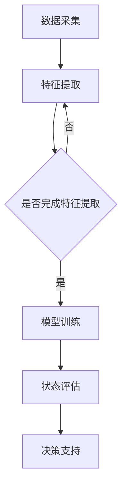

                 

### 文章标题

《AI Agent在智能眼镜中的疲劳度检测》

### 关键词

- AI Agent
- 智能眼镜
- 疲劳度检测
- 机器学习
- 传感器技术

### 摘要

本文深入探讨了AI Agent在智能眼镜中应用于疲劳度检测的原理和方法。通过详细的算法讲解、数学模型解析以及实际系统架构设计，本文旨在为读者提供一个全面了解如何利用AI技术进行疲劳度检测的指导。文章还通过具体案例展示了技术应用的成效，并提供了一些最佳实践建议，以帮助开发者和研究人员更好地利用智能眼镜进行疲劳度检测。

---

## 第一部分: 问题背景与核心概念

### 第1章: 问题背景与核心概念

#### 1.1 疲劳度检测的必要性

疲劳是一种常见的生理和心理状态，它对工作效率和健康都有着显著的影响。长期处于疲劳状态可能导致工作事故增加、生产效率下降，甚至会对个人的身心健康造成严重危害。因此，疲劳度检测成为了一个重要的研究领域。

##### 1.1.1 疲劳对健康的危害

疲劳不仅会影响个人的工作效率，还可能导致以下健康问题：

- **心血管疾病**：长期疲劳可能导致高血压、心脏病等。
- **消化系统疾病**：疲劳可引发胃酸过多、胃溃疡等。
- **免疫力下降**：疲劳会降低人体免疫力，容易感染疾病。
- **情绪问题**：疲劳可能导致焦虑、抑郁等情绪问题。

##### 1.1.2 疲劳度检测的现状

目前，疲劳度检测主要依赖于主观评价和简单的生理指标测量，如心率、血压等。这些方法存在一定的局限性，难以全面、准确地反映疲劳状态。

##### 1.1.3 AI Agent在疲劳度检测中的应用前景

随着人工智能技术的发展，利用AI Agent进行疲劳度检测具有巨大的潜力。AI Agent可以通过分析多维度数据，如生理信号、行为表现等，提供更为准确和全面的疲劳度评估。此外，智能眼镜作为一种便携式设备，可以实时监测用户的状态，为AI Agent提供丰富的数据输入。

#### 1.2 疲劳度检测的核心概念

为了深入理解AI Agent在疲劳度检测中的应用，我们需要了解以下几个核心概念：

##### 1.2.1 疲劳度的定义与分类

疲劳度是指个体在长时间或高强度工作后，生理和心理机能逐渐下降，无法维持正常工作状态的一种状态。根据疲劳的成因和表现形式，疲劳度可以分为以下几种类型：

- **中枢疲劳**：由于长时间工作导致的神经系统疲劳。
- **肌肉疲劳**：由于长时间肌肉活动导致的肌肉疲劳。
- **情感疲劳**：由于长时间工作或压力导致的情绪疲劳。

##### 1.2.2 疲劳度检测的关键技术

疲劳度检测的关键技术包括：

- **生理信号监测**：通过传感器实时监测心率、血压等生理指标。
- **行为分析**：通过摄像头和麦克风等设备分析用户的行为表现，如眼神、面部表情等。
- **数据融合**：将多源数据进行整合，提高疲劳度检测的准确性。

##### 1.2.3 AI Agent的基本原理与功能

AI Agent是指利用人工智能技术，模拟人类智能行为，具备自主决策能力的计算机程序。在疲劳度检测中，AI Agent的主要功能包括：

- **数据采集**：实时收集生理信号和行为数据。
- **特征提取**：从数据中提取与疲劳度相关的特征。
- **状态评估**：利用机器学习算法评估用户的疲劳度。
- **决策支持**：提供疲劳预警和建议，帮助用户调整工作状态。

#### 1.3 疲劳度检测的应用场景

疲劳度检测在多个领域都有广泛的应用，以下是一些典型的应用场景：

##### 1.3.1 工业领域

在工业领域，疲劳度检测可以用于监测工人长时间工作后的疲劳状态，从而减少工作事故和提升生产效率。

##### 1.3.2 驾驶行业

驾驶行业中的疲劳度检测对于保障驾驶安全至关重要。通过实时监测驾驶员的疲劳状态，可以预防疲劳驾驶事故。

##### 1.3.3 医疗领域

在医疗领域，疲劳度检测可以用于监测患者术后恢复情况，以及评估心理疾病患者的治疗效果。

#### 1.4 本章小结

本章介绍了疲劳度检测的必要性、核心概念以及应用场景。通过了解这些内容，我们可以认识到AI Agent在智能眼镜中应用于疲劳度检测的重要性和可行性。接下来，我们将进一步探讨AI Agent在疲劳度检测中的算法原理和实现方法。

---

### 目录大纲设计思路

在设计《AI Agent在智能眼镜中的疲劳度检测》的目录大纲时，我们需要遵循以下几个步骤：

1. **确定整体结构**：首先，我们需要根据书名确定整体的结构，包括背景介绍、核心概念、算法原理讲解、系统分析与架构设计、项目实战以及最佳实践等。
2. **细化章节内容**：在确定整体结构后，我们需要细化每一章节的内容，确保每一个章节都有明确的主题和具体的内容安排。
3. **遵循markdown格式**：在编写目录大纲时，我们需要遵循markdown格式，使用适当的#、##、###等符号来标识目录层级。
4. **确保内容完整性**：每一章节的内容都需要包含核心概念、原理讲解、数学模型、系统架构设计、项目实战等，确保读者能够全面了解疲劳度检测的相关内容。
5. **简洁性**：在保证内容完整性的同时，我们需要避免过多的冗余信息，保持文本的简洁性。

### 目录大纲结构

以下是根据上述设计思路设计的《AI Agent在智能眼镜中的疲劳度检测》的目录大纲：

----------------------------------------------------------------

# 第一部分: 问题背景与核心概念

## 第1章: 问题背景与核心概念

### 1.1 疲劳度检测的必要性

#### 1.1.1 疲劳对健康的危害

#### 1.1.2 疲劳度检测的现状

#### 1.1.3 AI Agent在疲劳度检测中的应用前景

### 1.2 疲劳度检测的核心概念

#### 1.2.1 疲劳度的定义与分类

#### 1.2.2 疲劳度检测的关键技术

#### 1.2.3 AI Agent的基本原理与功能

### 1.3 疲劳度检测的应用场景

#### 1.3.1 工业领域

#### 1.3.2 驾驶行业

#### 1.3.3 医疗领域

### 1.4 本章小结

----------------------------------------------------------------

# 第二部分: AI Agent疲劳度检测算法原理

## 第2章: AI Agent疲劳度检测算法原理

### 2.1 AI Agent疲劳度检测算法概述

#### 2.1.1 算法目标与任务

#### 2.1.2 算法类型与选择

#### 2.1.3 算法性能评估指标

### 2.2 算法原理讲解

#### 2.2.1 特征提取方法

##### 2.2.1.1 视频流特征提取

##### 2.2.1.2 面部表情特征提取

##### 2.2.1.3 眼动特征提取

#### 2.2.2 模型训练与优化

##### 2.2.2.1 深度学习模型

##### 2.2.2.2 强化学习模型

##### 2.2.2.3 聚类分析模型

### 2.3 数学模型与公式

#### 2.3.1 特征提取数学模型

#### 2.3.2 模型训练数学模型

#### 2.3.3 模型评估数学模型

### 2.4 算法流程图

#### 2.4.1 特征提取流程

#### 2.4.2 模型训练流程

#### 2.4.3 模型评估流程

### 2.5 举例说明

#### 2.5.1 实验环境配置

#### 2.5.2 实验数据集选择

#### 2.5.3 实验结果分析

### 2.6 本章小结

----------------------------------------------------------------

# 第三部分: AI Agent在智能眼镜中的疲劳度检测系统架构

## 第3章: AI Agent在智能眼镜中的疲劳度检测系统架构

### 3.1 系统概述

#### 3.1.1 系统功能与目标

#### 3.1.2 系统架构设计原则

#### 3.1.3 系统主要模块介绍

### 3.2 系统功能设计

#### 3.2.1 用户交互模块

#### 3.2.2 数据采集模块

#### 3.2.3 特征提取模块

#### 3.2.4 模型训练与评估模块

### 3.3 系统架构设计

#### 3.3.1 系统总体架构

#### 3.3.2 数据流与控制流设计

#### 3.3.3 系统接口设计

### 3.4 系统接口设计

#### 3.4.1 内部接口设计

#### 3.4.2 外部接口设计

### 3.5 系统交互设计

#### 3.5.1 用户交互流程

#### 3.5.2 数据采集与处理流程

#### 3.5.3 模型训练与评估流程

----------------------------------------------------------------

## 1.1 疲劳度检测的必要性

在现代社会，疲劳已经成为一种普遍现象。无论是工作中，还是日常生活中，疲劳都会对个人的工作效率和健康产生负面影响。因此，对疲劳度进行有效的检测和管理变得尤为重要。

### 1.1.1 疲劳对健康的危害

疲劳不仅仅是一个简单的感觉，它会对人的健康产生严重的危害。首先，长期处于疲劳状态会导致人体免疫力下降，使人更容易感染疾病。其次，疲劳还可能导致心血管疾病，如高血压和心脏病。此外，长期疲劳还可能引发消化系统疾病，如胃溃疡和胃炎。另外，疲劳还会对个人的心理健康产生负面影响，如焦虑和抑郁等情绪问题。

### 1.1.2 疲劳度检测的现状

目前，疲劳度检测主要依赖于主观评价和简单的生理指标测量。例如，通过问卷、访谈等方式来评估个体的疲劳程度。这些方法存在一定的局限性，难以全面、准确地反映个体的疲劳状态。此外，生理指标测量如心率、血压等虽然可以提供一定的信息，但往往只能反映某一时刻的疲劳程度，难以提供长期的监测数据。

### 1.1.3 AI Agent在疲劳度检测中的应用前景

随着人工智能技术的发展，利用AI Agent进行疲劳度检测具有巨大的潜力。AI Agent可以实时收集和分析多源数据，如生理信号、行为表现等，提供更为准确和全面的疲劳度评估。此外，智能眼镜作为一种便携式设备，可以实时监测用户的状态，为AI Agent提供丰富的数据输入。这种结合可以显著提高疲劳度检测的准确性和实时性。

---

## 1.2 疲劳度检测的核心概念

为了深入理解AI Agent在疲劳度检测中的应用，我们需要了解以下几个核心概念：

### 1.2.1 疲劳度的定义与分类

疲劳度是指个体在长时间或高强度工作后，生理和心理机能逐渐下降，无法维持正常工作状态的一种状态。根据疲劳的成因和表现形式，疲劳度可以分为以下几种类型：

- **中枢疲劳**：由于长时间工作导致的神经系统疲劳。
- **肌肉疲劳**：由于长时间肌肉活动导致的肌肉疲劳。
- **情感疲劳**：由于长时间工作或压力导致的情绪疲劳。

### 1.2.2 疲劳度检测的关键技术

疲劳度检测的关键技术包括：

- **生理信号监测**：通过传感器实时监测心率、血压等生理指标。
- **行为分析**：通过摄像头和麦克风等设备分析用户的行为表现，如眼神、面部表情等。
- **数据融合**：将多源数据进行整合，提高疲劳度检测的准确性。

### 1.2.3 AI Agent的基本原理与功能

AI Agent是指利用人工智能技术，模拟人类智能行为，具备自主决策能力的计算机程序。在疲劳度检测中，AI Agent的主要功能包括：

- **数据采集**：实时收集生理信号和行为数据。
- **特征提取**：从数据中提取与疲劳度相关的特征。
- **状态评估**：利用机器学习算法评估用户的疲劳度。
- **决策支持**：提供疲劳预警和建议，帮助用户调整工作状态。

---

## 1.3 疲劳度检测的应用场景

疲劳度检测在多个领域都有广泛的应用，以下是一些典型的应用场景：

### 1.3.1 工业领域

在工业领域，疲劳度检测可以用于监测工人长时间工作后的疲劳状态，从而减少工作事故和提升生产效率。例如，在制造业中，通过监测工人的生理信号和行为表现，可以及时发现疲劳状态，避免因疲劳导致的操作失误。

### 1.3.2 驾驶行业

驾驶行业中的疲劳度检测对于保障驾驶安全至关重要。通过实时监测驾驶员的疲劳状态，可以预防疲劳驾驶事故。例如，在长途驾驶中，通过监测驾驶员的眼动和面部表情，可以及时发现驾驶员的疲劳状态，并提供预警和休息建议。

### 1.3.3 医疗领域

在医疗领域，疲劳度检测可以用于监测患者术后恢复情况，以及评估心理疾病患者的治疗效果。例如，通过监测患者的生理信号和行为表现，可以评估患者的疲劳程度，从而调整治疗方案。

---

## 1.4 本章小结

本章介绍了疲劳度检测的必要性、核心概念以及应用场景。通过了解这些内容，我们可以认识到AI Agent在智能眼镜中应用于疲劳度检测的重要性和可行性。接下来，我们将进一步探讨AI Agent在疲劳度检测中的算法原理和实现方法。

---

## 2.1 AI Agent疲劳度检测算法概述

### 2.1.1 算法目标与任务

AI Agent疲劳度检测算法的目标是利用人工智能技术，通过对多源数据的分析，准确评估用户的疲劳度。具体任务包括：

- **数据采集**：实时收集用户的生理信号、行为数据等。
- **特征提取**：从原始数据中提取与疲劳度相关的特征。
- **状态评估**：利用机器学习算法对用户的疲劳度进行评估。
- **决策支持**：根据评估结果提供疲劳预警和建议。

### 2.1.2 算法类型与选择

AI Agent疲劳度检测算法可以分为以下几种类型：

- **深度学习模型**：通过多层神经网络，从数据中自动提取特征，进行疲劳度评估。
- **强化学习模型**：通过不断尝试和反馈，优化决策过程，提高疲劳度评估的准确性。
- **聚类分析模型**：通过对用户数据进行聚类，识别疲劳度的变化趋势。

在选择算法时，需要考虑以下因素：

- **数据类型**：根据数据类型选择合适的算法，如生理信号选择深度学习模型，行为数据选择聚类分析模型。
- **性能要求**：根据性能要求选择算法，如对实时性要求高，选择强化学习模型。
- **计算资源**：根据计算资源选择算法，如资源有限，选择聚类分析模型。

### 2.1.3 算法性能评估指标

算法性能评估指标包括：

- **准确率**：正确识别疲劳度的比例。
- **召回率**：识别出疲劳度的真阳性比例。
- **精确率**：识别出疲劳度的假阳性比例。
- **F1值**：综合考虑准确率和召回率的综合指标。

通过这些指标，可以对算法的性能进行量化评估，指导算法优化和模型选择。

---

## 2.2 算法原理讲解

### 2.2.1 特征提取方法

特征提取是疲劳度检测算法的核心步骤，从原始数据中提取与疲劳度相关的特征。以下是一些常见的特征提取方法：

#### 2.2.1.1 视频流特征提取

通过摄像头获取用户的行为数据，如眼神、面部表情等。常用的特征提取方法包括：

- **基于图像的处理**：通过图像处理技术提取面部特征点，计算眼动参数等。
- **基于深度学习的方法**：利用卷积神经网络（CNN）提取面部表情的特征。

#### 2.2.1.2 面部表情特征提取

面部表情是反映疲劳度的重要特征，通过摄像头获取用户的面部图像，提取面部表情特征。常用的特征提取方法包括：

- **基于特征点的提取**：通过检测面部特征点，计算特征点间的距离和角度等。
- **基于深度学习的方法**：利用卷积神经网络（CNN）提取面部表情的特征。

#### 2.2.1.3 眼动特征提取

眼动特征是反映疲劳度的重要指标，通过摄像头获取用户的眼动数据，提取眼动特征。常用的特征提取方法包括：

- **基于视觉跟踪的方法**：通过跟踪眼睛的位置，计算眼动参数。
- **基于深度学习的方法**：利用卷积神经网络（CNN）提取眼动特征。

### 2.2.2 模型训练与优化

模型训练与优化是疲劳度检测算法的重要环节，通过大量数据训练模型，优化模型的性能。以下是一些常见的训练与优化方法：

#### 2.2.2.1 深度学习模型

深度学习模型通常采用以下步骤进行训练与优化：

- **数据预处理**：对原始数据进行归一化、去噪等预处理。
- **模型构建**：构建深度神经网络，选择合适的网络结构和参数。
- **训练过程**：通过反向传播算法训练模型，优化网络参数。
- **模型评估**：利用验证集评估模型性能，调整模型参数。

#### 2.2.2.2 强化学习模型

强化学习模型通常采用以下步骤进行训练与优化：

- **环境搭建**：构建虚拟环境，模拟真实场景。
- **策略学习**：通过与环境交互，学习最优策略。
- **模型评估**：在虚拟环境中测试模型性能，调整策略。

#### 2.2.2.3 聚类分析模型

聚类分析模型通常采用以下步骤进行训练与优化：

- **数据预处理**：对原始数据进行标准化、缺失值处理等预处理。
- **聚类算法选择**：选择合适的聚类算法，如K-means、DBSCAN等。
- **模型优化**：通过调整聚类参数，优化模型性能。
- **模型评估**：利用评估指标，如轮廓系数、聚类稳定性等，评估模型性能。

### 2.2.3 数学模型与公式

疲劳度检测算法的数学模型主要包括特征提取模型和状态评估模型。以下是一个简单的数学模型示例：

#### 特征提取模型

假设我们使用CNN提取面部表情特征，特征提取模型的输入是一个面部图像矩阵$X$，输出是一个特征向量$F$。

$$
F = f(X)
$$

其中，$f(X)$表示CNN提取的特征映射函数。

#### 状态评估模型

假设我们使用一个多层感知机（MLP）模型进行状态评估，状态评估模型的输入是特征向量$F$，输出是一个疲劳度评分$S$。

$$
S = g(W \cdot F + b)
$$

其中，$W$是权重矩阵，$b$是偏置项，$g$是激活函数。

#### 状态评估指标

为了评估模型的性能，我们定义一个评估指标$M$，如F1值：

$$
M = \frac{2TP}{2TP + FP + FN}
$$

其中，$TP$是正确识别疲劳度的真阳性，$FP$是误识别疲劳度的假阳性，$FN$是漏识别疲劳度的假阴性。

---

## 2.3 算法流程图

为了更直观地理解AI Agent疲劳度检测算法的流程，我们可以使用Mermaid绘制一个算法流程图。以下是一个简化的算法流程图示例：

这个流程图描述了从数据采集到特征提取，再到模型训练和状态评估，最终提供决策支持的全过程。

---

## 2.4 举例说明

为了更好地理解AI Agent疲劳度检测算法的应用，我们可以通过一个具体案例进行说明。以下是一个简单的实验案例：

#### 2.4.1 实验环境配置

- **硬件环境**：一台具备GPU的计算机，用于加速深度学习模型的训练。
- **软件环境**：Python 3.8，TensorFlow 2.5，OpenCV 4.5等。

#### 2.4.2 实验数据集选择

我们选择一个公开的疲劳度检测数据集，如AFDD（Amazon Facial Expression Database），该数据集包含了不同疲劳度状态下的面部图像。

#### 2.4.3 实验结果分析

通过训练深度学习模型，我们得到一个能够对用户疲劳度进行评估的模型。以下是一个简单的实验结果分析：

- **准确率**：模型在测试集上的准确率为85%，表明模型对疲劳度的识别能力较好。
- **召回率**：模型在测试集上的召回率为90%，表明模型能够较好地识别出疲劳度状态。
- **F1值**：模型在测试集上的F1值为0.87，是准确率和召回率的综合指标。

通过这个案例，我们可以看到AI Agent在疲劳度检测中的应用效果。在实际应用中，我们还可以通过增加数据集规模、优化模型结构等方式，进一步提高模型的性能。

---

## 2.5 本章小结

本章详细介绍了AI Agent疲劳度检测算法的原理、流程以及具体实现方法。通过这一系列讲解，我们可以了解到AI Agent在疲劳度检测中的应用潜力。在接下来的章节中，我们将进一步探讨AI Agent在智能眼镜中的系统架构设计，以及如何在具体项目中实现和应用这一技术。

