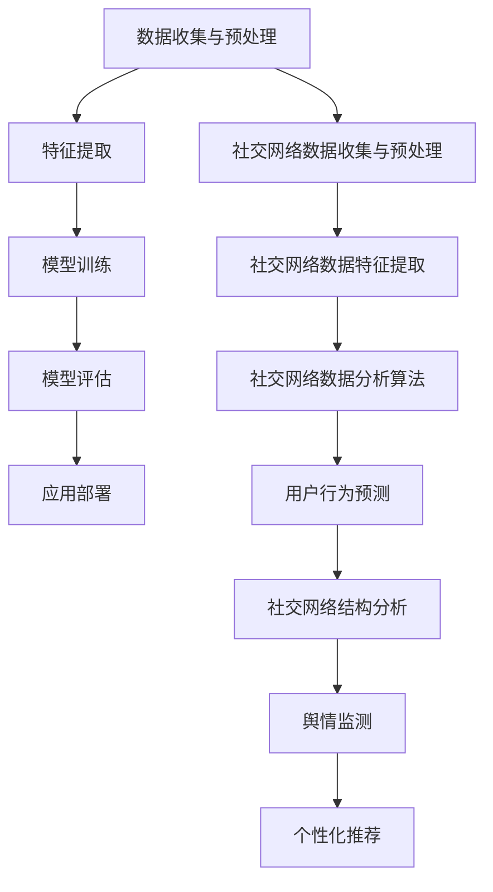
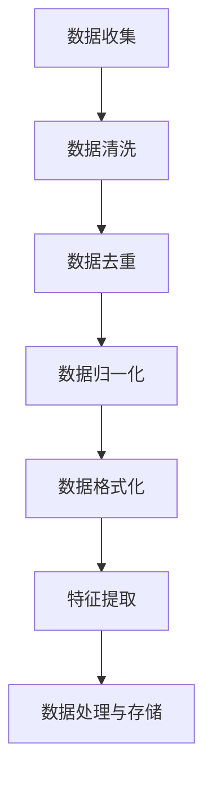
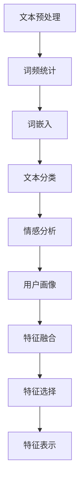
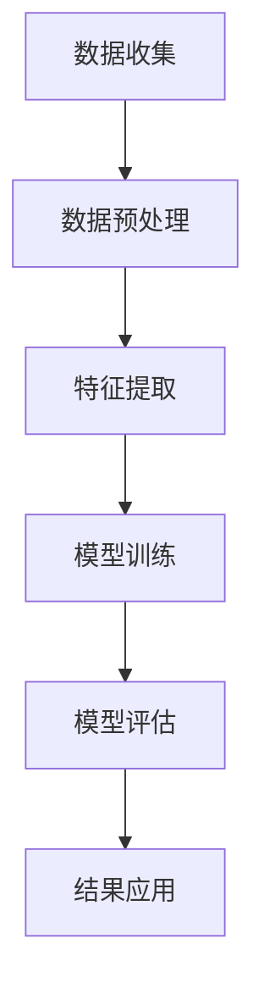
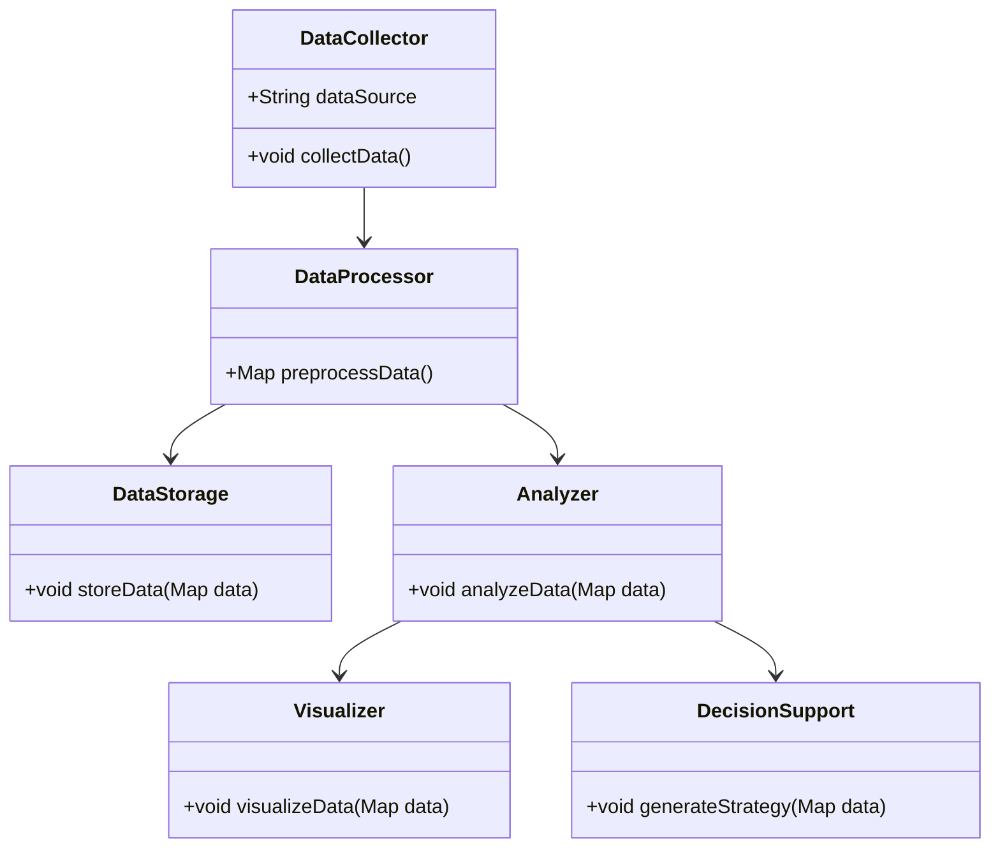
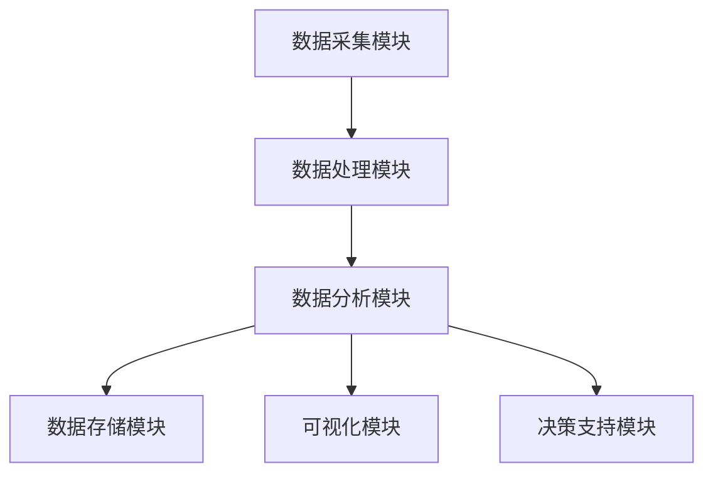
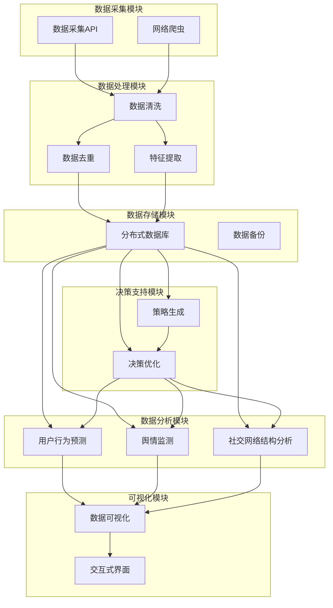
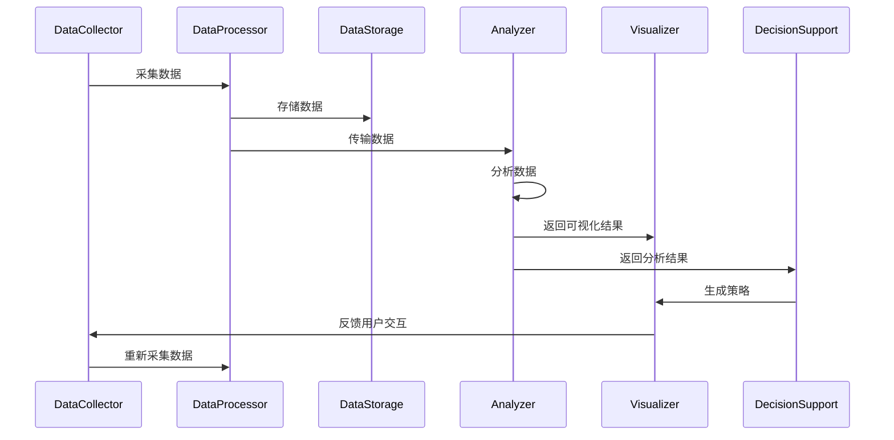

                 

### 引言

#### 概述与重要性

在当今高度互联的社会中，社交网络已经成为人们日常沟通、分享信息、构建社会关系的重要平台。从个人用户到企业机构，各类用户在社交网络中留下了海量的数据，这些数据包含了用户行为、偏好、观点等多维度的信息。如何有效地分析和利用这些数据，成为企业和研究机构面临的重大挑战和机遇。AI Agent，作为人工智能领域的一种重要技术，凭借其强大的数据处理和分析能力，逐渐成为智能社交网络分析的关键驱动力。

AI Agent，即人工智能代理，是一种能够自动执行任务、模拟人类智能行为并具有学习能力的人工智能系统。其特点在于具备自主性、交互性和适应性，能够在复杂环境中独立完成特定任务。在智能社交网络分析中，AI Agent可以自动收集、处理和分析社交网络中的数据，从而提供用户行为预测、舆情监测、社交网络结构分析等服务。

本文旨在深入探讨AI Agent在智能社交网络分析中的应用，通过逐步分析AI Agent的定义与特点、智能社交网络分析的重要性、AI Agent在社交网络分析中的核心作用以及相关算法原理和系统架构设计，帮助读者全面了解并掌握这一领域的前沿技术和应用场景。希望通过本文的讲解，读者能够对AI Agent在智能社交网络分析中的实际应用有更加清晰的认识，并为相关研究和实践提供有益的参考。

#### 关键词

- AI Agent
- 智能社交网络分析
- 数据处理
- 用户行为预测
- 舆情监测
- 强化学习
- 深度学习
- 自然语言处理

### 摘要

本文全面探讨了AI Agent在智能社交网络分析中的应用。首先，我们介绍了AI Agent的定义、特点及其在智能社交网络分析中的重要意义。随后，文章详细分析了AI Agent的基本构成、智能社交网络分析的关键概念，并阐明了两者之间的紧密联系。接着，本文深入讲解了AI Agent在社交网络分析中的核心算法原理，包括强化学习、深度学习和自然语言处理等方面的应用。通过具体的Mermaid流程图和Python代码示例，进一步阐述了算法的原理和实现方法。此外，文章还介绍了社交网络数据分析的数学模型，并对AI Agent在社交网络分析中的应用进行了系统分析与架构设计。最后，通过实际项目实战和代码应用解读，展示了AI Agent在智能社交网络分析中的具体应用案例，为读者提供了全面的实践指导和借鉴。总体而言，本文为AI Agent在智能社交网络分析领域的应用提供了系统的理论指导和实用的操作方法。

### 第一部分：背景介绍与核心概念

#### 第1章：AI Agent与智能社交网络分析概述

##### 1.1 AI Agent的定义与特点

AI Agent，即人工智能代理，是一种能够模拟人类智能行为，具备自主性、交互性和学习能力的软件系统。它能够自动执行任务，与环境进行交互，并在执行过程中不断学习和优化自身行为。AI Agent的基本概念可以追溯到人工智能的早期研究，但近年来，随着深度学习、强化学习等技术的飞速发展，AI Agent在各个领域的应用得到了显著扩展。

首先，让我们从AI Agent的基本概念入手。AI Agent的核心在于“代理”，即它代表用户或系统执行特定任务。在人工智能的语境中，Agent是一个自主的实体，具有感知、决策和执行能力。感知是指Agent能够从环境中获取信息；决策是指Agent根据感知到的信息做出行动选择；执行是指Agent根据决策采取实际操作。这种能力使得AI Agent在复杂、动态的环境中能够高效地完成任务。

AI Agent具有以下关键特点：

1. **自主性**：AI Agent能够独立执行任务，不受人为干预。它可以根据预设的目标和策略，自主决定行动方案，从而在复杂环境中实现目标。

2. **交互性**：AI Agent具备与人类或其他系统进行交互的能力。这种交互可以通过自然语言处理、图形界面等多种形式实现，使得AI Agent能够更好地融入人类日常生活和工作场景。

3. **学习能力**：AI Agent通过机器学习、深度学习等算法，能够从历史数据中学习，不断优化自身行为。这使得AI Agent能够适应环境变化，提高任务执行效率。

4. **适应性**：AI Agent能够在不同场景中灵活调整行为，以应对不确定性和变化。它可以根据环境反馈，动态调整策略和行动方案。

AI Agent的应用领域非常广泛，涵盖了从智能家居、自动驾驶到金融服务、医疗健康等多个领域。在社交网络分析中，AI Agent同样展现出了强大的能力。具体而言，AI Agent在社交网络分析中的应用包括：

- **用户行为预测**：通过分析用户在社交网络中的活动，AI Agent可以预测用户的兴趣、偏好和未来行为，从而为个性化推荐、市场营销等提供有力支持。

- **舆情监测**：AI Agent能够实时监测社交网络中的舆论动向，分析热点话题和用户情感，为舆情管理和危机应对提供数据支持。

- **社交网络结构分析**：通过分析社交网络中的节点和边的关系，AI Agent可以揭示社交网络的结构特征和社群分布，帮助企业和研究机构更好地理解和利用社交网络资源。

总之，AI Agent作为一种新兴的人工智能技术，其在智能社交网络分析中的应用前景广阔。通过本文的深入探讨，我们希望能够帮助读者全面了解AI Agent的定义、特点及其在社交网络分析中的重要性，为后续章节的详细讲解奠定基础。

##### 1.2 智能社交网络分析的重要性

智能社交网络分析在当今社会中扮演着越来越重要的角色。随着互联网的普及和社交网络的迅速发展，社交网络已经成为人们日常沟通、分享信息、表达观点的重要平台。这些平台不仅产生了海量的用户数据，还包含了丰富的社会结构和动态关系信息。智能社交网络分析利用先进的人工智能技术，对这些数据进行深入挖掘和分析，从而为社会提供了一系列重要的应用价值。

首先，智能社交网络分析能够帮助企业和机构更好地理解用户需求和行为。通过分析用户在社交网络中的活动轨迹、发布内容、互动行为等，AI Agent可以揭示用户的兴趣、偏好和需求，从而为个性化推荐、精准营销等提供数据支持。例如，电商平台可以通过分析用户的购物记录和社交互动，为用户推荐可能感兴趣的商品，提高用户满意度和销售转化率。

其次，智能社交网络分析在舆情监测和危机管理中具有重要作用。在社交媒体高度发达的今天，公众舆论的传播速度极快，一个负面事件或热点话题可能迅速引发广泛的关注和讨论。通过实时监测社交网络中的舆情动态，AI Agent可以及时发现热点事件、分析用户情感，帮助企业和政府及时应对危机，制定有效的舆论引导策略，防止负面影响的扩散。

第三，智能社交网络分析在社交网络结构研究中具有重要意义。社交网络是一个复杂的社会系统，其中包含了丰富的节点（用户）和边（关系）信息。通过分析社交网络的结构特征，AI Agent可以揭示社群分布、节点重要性、传播路径等关键信息，为社交网络优化、社群管理、传播策略制定等提供科学依据。例如，研究机构可以通过分析社交网络中的关键节点和传播路径，了解信息传播的规律和机制，从而设计更有效的传播策略。

最后，智能社交网络分析在社会科学研究中也具有广泛应用。通过分析社交网络中的用户行为和互动模式，研究人员可以揭示社会关系、群体行为、社会网络结构等关键现象，为社会科学研究提供新的视角和方法。例如，社会学家可以通过分析社交网络中的节点关系，研究人际关系、社群组织、社会网络效应等，进一步深化对社会现象的理解。

综上所述，智能社交网络分析在各个领域具有重要的应用价值和广泛的前景。通过AI Agent等人工智能技术的应用，我们不仅能够更深入地理解社交网络中的数据和信息，还能为实际问题和挑战提供有效的解决方案。随着技术的不断进步和应用场景的不断拓展，智能社交网络分析将在未来发挥更加重要的作用，为社会发展和创新带来新的机遇。

##### 1.3 智能社交网络分析的应用场景

智能社交网络分析在多个实际应用场景中展现出了其独特的价值和重要性。以下是几个典型应用场景：

1. **用户行为分析**：电商平台和社交媒体平台广泛使用智能社交网络分析来深入理解用户行为。通过分析用户在社交网络中的发布内容、互动行为、关注对象等，AI Agent可以揭示用户的兴趣、偏好和需求。例如，电商平台利用这一技术来优化推荐系统，提高用户满意度和销售转化率。此外，智能社交网络分析还可以帮助平台了解用户在特定活动或促销中的参与度，从而调整营销策略，提高活动效果。

2. **舆情监测**：在社交媒体高度发达的今天，舆情监测成为企业和政府的一项重要任务。AI Agent通过实时监测社交网络中的言论动态，分析用户情感和热点话题，可以为舆情管理和危机应对提供数据支持。例如，当某个负面事件或热点话题在社交网络中引发广泛关注时，企业或政府可以通过智能社交网络分析迅速了解公众情绪和舆论走向，及时制定应对策略，防止事态恶化。

3. **社交网络结构研究**：社交网络结构研究是社会科学、计算机科学等领域的重要课题。通过分析社交网络中的节点和边关系，AI Agent可以揭示社交网络的拓扑结构、社群分布、中心性指标等关键信息。例如，研究人员可以通过分析社交网络中的关键节点和传播路径，研究信息传播的规律和机制，从而为传播策略设计提供科学依据。此外，社交网络结构研究还可以帮助企业和机构更好地理解和利用社交网络资源，优化网络结构，提高整体效益。

4. **市场营销和广告投放**：智能社交网络分析在市场营销和广告投放中具有广泛应用。通过分析用户的社交网络行为和互动，AI Agent可以识别潜在的目标客户群体，制定精准的营销策略。例如，广告公司可以利用智能社交网络分析来识别具有特定兴趣和行为的用户，从而实现更精准的广告投放，提高广告效果和转化率。

5. **社交网络可视化**：社交网络可视化是智能社交网络分析的一个重要应用场景。通过将社交网络中的节点和边关系可视化，AI Agent可以帮助用户直观地了解社交网络的结构和特征。例如，社交媒体平台可以通过可视化工具展示用户的社交圈层、好友关系等，使用户能够更清晰地了解自己的社交网络结构，从而优化社交体验。

6. **公共安全和反欺诈**：智能社交网络分析在公共安全和反欺诈领域也具有重要作用。通过分析社交网络中的异常行为和潜在欺诈活动，AI Agent可以及时发现并阻止欺诈行为，保障公众安全。例如，金融机构可以利用智能社交网络分析技术来识别异常交易行为，防范金融欺诈风险。

总之，智能社交网络分析在多个实际应用场景中发挥了重要作用，为企业和机构提供了有力的数据支持和决策依据。随着技术的不断进步和应用场景的拓展，智能社交网络分析将在未来发挥更加广泛和深远的影响。

##### 1.3.1 AI Agent在社交网络数据分析中的应用

AI Agent在社交网络数据分析中扮演着至关重要的角色，其应用主要体现在以下几个方面：

首先，用户行为预测是AI Agent在社交网络数据分析中的核心应用之一。通过分析用户在社交网络中的历史行为数据，AI Agent可以预测用户未来的行为模式，包括但不限于用户的点赞、评论、分享、关注等。这种预测能力不仅有助于提高用户服务质量，还可以为精准营销提供数据支持。例如，电商平台可以利用AI Agent预测用户购买偏好，从而为用户推荐合适的商品，提高销售额。

其次，舆情监测是AI Agent在社交网络分析中的另一个重要应用。通过实时监控社交网络中的言论和热点话题，AI Agent可以分析用户的情感倾向，识别潜在的社会舆情波动。这在危机管理和舆论引导中具有重要意义。例如，当某个热点话题或负面事件在社交网络上引发广泛关注时，AI Agent可以帮助企业或政府迅速了解公众情绪，及时制定应对策略，防止事态恶化。

此外，社交网络结构分析也是AI Agent的重要应用领域。AI Agent可以通过分析社交网络中的节点和边关系，揭示社交网络的拓扑结构、社群分布、中心性指标等关键信息。这种分析有助于理解社交网络中信息传播的规律和机制，为传播策略设计提供科学依据。例如，研究人员可以利用AI Agent分析社交网络中的关键节点和传播路径，了解信息传播的效率和质量，从而优化传播策略。

AI Agent在社交网络数据分析中的应用不仅限于上述几个方面，还涉及到用户画像构建、社交网络可视化、社交网络推荐等多个领域。通过深度学习、强化学习等算法，AI Agent可以从海量数据中提取有价值的信息，为决策者提供有力支持。

总之，AI Agent在社交网络数据分析中的应用极大地提升了数据分析的深度和广度，为各类应用场景提供了强大的技术支持。随着人工智能技术的不断进步，AI Agent在社交网络数据分析中的应用前景将更加广阔。

##### 1.3.2 AI Agent在社交网络舆情监测中的应用

AI Agent在社交网络舆情监测中扮演了关键角色，其强大的数据分析和处理能力为实时监控和快速响应提供了有力支持。舆情监测是指通过技术手段对社交网络中的言论、话题和情感倾向进行监控和分析，以了解公众观点和情绪变化。AI Agent在这一过程中发挥着以下几个重要作用：

首先，AI Agent能够实时收集和整理社交网络中的大量数据。通过自然语言处理（NLP）技术，AI Agent可以自动提取文本信息，并对其进行分类和标签化。这种能力使得AI Agent能够快速捕捉热点话题和新兴趋势，为舆情监测提供及时的数据支持。

其次，AI Agent利用机器学习和深度学习算法对收集到的数据进行分析，以识别用户的情感倾向。通过训练情感分析模型，AI Agent可以判断文本内容中的积极、消极或中立情感，从而识别出公众情绪的变化。这一功能对于预测潜在的社会舆情波动具有重要意义。

此外，AI Agent还可以对社交网络中的言论进行关联分析，识别出关键节点和传播路径。通过分析这些信息，AI Agent可以揭示舆论的扩散机制和影响范围，帮助监测者了解舆情的传播规律和影响程度。

在实际应用中，AI Agent的舆情监测功能可以帮助企业和政府迅速应对突发事件。例如，当一个负面事件或热点话题在社交网络上引发广泛关注时，AI Agent可以立即启动监测程序，分析相关言论和情感倾向，提供实时报告。这将有助于企业或政府及时制定应对策略，防止负面影响的扩大。

AI Agent在舆情监测中的应用不仅限于突发事件的响应，还可以用于日常的舆情分析和管理。通过长期监测社交网络中的言论和话题，AI Agent可以为企业提供市场趋势分析和消费者行为预测，为政府提供社会稳定分析和政策评估。

总的来说，AI Agent在社交网络舆情监测中的应用极大地提高了监测效率和准确性，为舆情分析和应对提供了强大的技术支持。随着人工智能技术的不断进步，AI Agent在舆情监测中的应用前景将更加广阔，其在复杂社交网络环境中的表现也将更加出色。

##### 1.3.3 AI Agent在社交网络用户行为预测中的应用

AI Agent在社交网络用户行为预测中发挥了重要作用，其强大的数据处理和分析能力为预测用户未来行为提供了可靠的技术支持。用户行为预测是指利用历史数据和机器学习算法，预测用户在社交网络中的未来行为，如点赞、评论、分享等。以下是AI Agent在用户行为预测中的几个关键应用：

首先，AI Agent通过收集和分析用户在社交网络中的历史行为数据，建立用户行为模型。这些数据包括用户的点赞记录、评论内容、发布频率、互动对象等。通过对这些数据进行挖掘和分析，AI Agent可以识别出用户的兴趣和偏好，从而为个性化推荐和精准营销提供基础。

其次，AI Agent利用机器学习和深度学习算法，对用户行为模型进行训练和优化。例如，可以采用基于协同过滤的推荐算法、深度神经网络（DNN）和循环神经网络（RNN）等模型，来预测用户的下一步行为。这些算法能够从海量数据中提取特征，并利用这些特征来预测用户行为，从而提高预测的准确性和可靠性。

此外，AI Agent还可以结合用户的社会关系网络，分析用户的社交行为和互动模式。通过分析用户与其关注对象、好友的互动关系，AI Agent可以预测用户可能感兴趣的新内容或新对象。这种基于社交网络的预测方法能够更全面地理解用户行为，提高预测的精度。

在实际应用中，AI Agent的用户行为预测功能可以帮助平台提高用户体验和运营效果。例如，社交网络平台可以利用AI Agent预测用户的关注对象，从而推荐相关的用户和内容，提高用户活跃度和粘性。电商平台则可以利用AI Agent预测用户的购买行为，为用户推荐可能感兴趣的商品，从而提高销售额和用户满意度。

总的来说，AI Agent在社交网络用户行为预测中的应用极大地提高了预测的准确性和实用性，为平台运营和市场营销提供了有力的支持。随着人工智能技术的不断发展，AI Agent在用户行为预测中的应用前景将更加广阔，其在社交网络分析中的价值也将不断提升。

### 第2章：核心概念与联系

##### 2.1 AI Agent的基本构成

AI Agent作为一种智能系统，其基本构成主要包括以下几个关键部分：感知器、决策器、执行器和学习机制。这些组成部分相互协作，使得AI Agent能够自主地执行任务、与环境互动并不断优化自身行为。

首先，**感知器**是AI Agent获取环境信息的部分。感知器可以接收多种形式的数据输入，如视觉、听觉、文本、传感器数据等。通过感知器，AI Agent能够获取当前环境的实时状态，了解环境中的变化和事件。

其次，**决策器**根据感知器提供的信息，进行决策和任务规划。决策器基于预先设定的目标和策略，分析感知器收集到的数据，并选择最合适的行动方案。这一过程通常涉及复杂的算法和模型，如机器学习、深度学习和强化学习等。

**执行器**是AI Agent执行决策结果的实体。执行器负责将决策器制定出的行动方案转化为具体的操作，如移动、发送消息、执行任务等。通过执行器，AI Agent能够实现其在环境中的实际行为。

最后，**学习机制**是AI Agent不断进步和优化的关键。学习机制使得AI Agent能够从历史数据中学习，通过机器学习算法不断调整和优化自身的决策和执行策略。学习机制可以是监督学习、无监督学习或强化学习等，具体取决于应用场景和任务需求。

这些组成部分相互关联，共同构成了一个完整的AI Agent系统。感知器收集环境信息，传递给决策器进行决策，决策结果由执行器实现，而学习机制则在整个过程中不断优化AI Agent的行为。通过这种循环反馈机制，AI Agent能够持续适应和优化其行为，以实现既定目标。

##### 2.1.1 AI Agent的组成部分

为了深入理解AI Agent的构成，我们详细探讨其各个组成部分的功能和相互关系。AI Agent由感知器、决策器、执行器和学习机制四大核心部分组成，每个部分都发挥着至关重要的作用。

**感知器**是AI Agent获取外界信息的重要手段。它通过传感器、摄像头、麦克风等设备，收集环境中的视觉、听觉、文本和传感器数据等。感知器的数据输入质量直接影响到AI Agent对环境状态的感知能力。例如，在自动驾驶系统中，感知器负责收集车辆周围的道路状况、交通信号、行人等数据，为后续的决策提供基础。

**决策器**负责对感知器收集到的信息进行处理和分析，制定行动方案。决策器基于预设的目标和策略，利用机器学习算法、深度学习模型或强化学习技术，从感知器提供的数据中提取关键特征，进行决策和任务规划。决策器的核心在于如何有效地处理复杂的环境信息，并生成最优的行动方案。例如，在智能家居系统中，决策器根据用户的习惯和偏好，决定是否开启空调、调节灯光等。

**执行器**是AI Agent实现具体行动的实体。它将决策器制定的行动方案转化为具体的操作，如移动、发送消息、执行任务等。执行器与物理世界直接互动，是AI Agent与环境互动的桥梁。例如，在机器人系统中，执行器包括电机、驱动器等，负责执行决策器生成的动作指令，使机器人能够完成指定的任务。

**学习机制**是AI Agent不断优化和改进自身行为的关键。学习机制使得AI Agent能够从历史数据中学习，通过监督学习、无监督学习或强化学习等算法，不断调整和优化其决策和执行策略。学习机制不仅能提高AI Agent的决策准确性，还能使其在面对新环境和任务时具备更强的适应性。例如，在游戏AI中，学习机制可以帮助AI Agent通过自我对弈和游戏数据学习，不断提升游戏策略和表现。

这四个组成部分之间相互关联，形成一个闭环系统。感知器收集环境信息，传递给决策器进行决策；决策器制定行动方案，由执行器实现；执行器的反馈再次传递回感知器和学习机制，为AI Agent的持续学习和优化提供数据支持。通过这种循环反馈机制，AI Agent能够在复杂动态的环境中自主行动，不断优化自身行为，实现既定目标。

##### 2.2 智能社交网络分析的关键概念

智能社交网络分析涉及多个关键概念，这些概念共同构成了该领域的基础和框架。以下是几个重要的核心概念：

**社交网络结构**：社交网络结构是指社交网络中节点（用户）和边（关系）的排列和分布。节点通常表示社交网络中的个体，边表示个体之间的互动或关系。社交网络结构研究旨在揭示网络拓扑特征，如集群、社团结构、网络中心性等。这些结构特征对社交网络的传播机制、信息流动和群体行为有重要影响。

**用户行为**：用户行为是指社交网络中个体的活动，如发布内容、点赞、评论、分享、关注等。用户行为数据是智能社交网络分析的重要来源，通过对这些行为数据的分析，可以深入了解用户的需求、兴趣和偏好。用户行为分析有助于个性化推荐、用户画像构建和营销策略优化。

**社交网络数据**：社交网络数据是指从社交网络平台上收集到的各类数据，包括文本、图像、音频、视频等。这些数据涵盖了用户行为、社交关系、内容信息等多维度的信息。社交网络数据分析需要对这些数据进行预处理、特征提取和建模，以便从中提取有价值的信息。

**社交网络分析算法**：社交网络分析算法是一系列用于处理和分析社交网络数据的计算方法。常见的算法包括图论算法、机器学习算法和深度学习算法。图论算法用于分析社交网络结构，如度分布、聚类系数等；机器学习算法用于分类、聚类和预测，如SVD、LDA等；深度学习算法则用于复杂的特征提取和表示学习，如卷积神经网络（CNN）、循环神经网络（RNN）等。

**社交网络可视化**：社交网络可视化是将社交网络中的节点和边以图形化的方式展示，帮助人们直观地理解社交网络的拓扑结构和特征。可视化工具可以揭示社交网络中的关键节点、社群分布和传播路径，为分析和决策提供直观支持。

**舆情监测**：舆情监测是指通过技术手段实时监控社交网络中的言论和热点话题，分析用户的情感倾向和观点变化。舆情监测有助于了解公众情绪、预测社会趋势和应对突发事件。

**用户画像**：用户画像是基于用户的社交行为、兴趣、偏好等数据，构建的用户个人描述。用户画像可以帮助企业和平台更好地了解用户，为个性化推荐、精准营销和用户体验优化提供依据。

这些关键概念相互关联，共同构成了智能社交网络分析的理论基础和实际应用框架。通过对这些概念的理解和应用，研究人员和开发人员可以深入挖掘社交网络数据的价值，为各类应用场景提供有效的解决方案。

##### 2.2.1 社交网络的结构与特征

社交网络是一种复杂的社会系统，其结构特征对其功能和行为有重要影响。社交网络的结构与特征主要包括以下几个方面：

**节点**：节点是社交网络中的个体，通常表示用户、组织或实体。节点在社交网络中具有独特的属性和角色，如用户年龄、性别、职业、兴趣等。节点的属性和特征对社交网络的分析和预测具有重要意义。

**边**：边是连接两个节点的元素，表示节点之间的互动或关系。边的类型和权重可以反映互动的强度和频率，如朋友关系、关注关系、互动评论等。边的结构特征，如密度、路径长度、聚类系数等，对社交网络的传播机制和信息流动有重要影响。

**网络密度**：网络密度是衡量社交网络紧密程度的指标，通常用边数与可能的最大边数的比值表示。高网络密度意味着节点之间的连接更加紧密，信息传播速度更快，但也可能导致信息过载和通信成本增加。

**聚类系数**：聚类系数是衡量社交网络中节点集群程度的指标。高聚类系数表示社交网络中的节点倾向于形成紧密的社群，这些社群内部互动频繁，有助于信息的共享和传播。

**中心性**：中心性是指节点在网络中的重要性和影响力。常见的中心性指标包括度中心性、介数中心性和紧密中心性。度中心性表示节点连接的边数，介数中心性表示节点在多路径中的重要性，紧密中心性表示节点的连接质量。高中心性的节点在社交网络中扮演关键角色，对信息的传播和控制有重要影响。

**社区结构**：社区结构是指社交网络中的紧密节点集合，这些节点之间互动频繁，但与其他社区联系较少。社区结构有助于理解社交网络中的群体行为和互动模式，对社交网络的稳定性和信息传播有重要影响。

**小世界现象**：小世界现象是指社交网络中的节点之间虽然整体上呈随机网络结构，但局部却存在高度密集的集群和短路径现象。小世界现象有助于解释社交网络中的信息快速传播和广泛连接的特性。

通过对社交网络结构特征的分析，研究人员可以揭示社交网络中的关键节点、社群分布和传播路径，为社交网络分析提供科学依据。这些结构特征不仅有助于理解社交网络的基本属性，还能为实际应用场景提供有效的解决方案。

##### 2.2.2 社交网络分析的方法与工具

社交网络分析（Social Network Analysis, SNA）是一种重要的研究方法，用于分析和解释社交网络中的结构、关系和行为。SNA通过多种工具和方法，从多个角度揭示社交网络的本质特征和运行规律。以下是几种常见的社交网络分析方法与工具：

**图论**：图论是SNA的基础，用于描述社交网络中的节点（个体）和边（关系）结构。通过图论方法，研究人员可以计算网络的基本特征，如度（节点连接数）、路径长度、聚类系数等。图论分析有助于理解社交网络的拓扑结构，揭示节点的重要性和社群分布。

**矩阵方法**：矩阵方法通过矩阵运算来分析社交网络数据，如邻接矩阵、转移矩阵等。这些矩阵可以表示节点之间的关系和互动频率，有助于计算网络密度、社群结构等特征。矩阵方法在分析大规模社交网络数据时具有高效性和简洁性。

**统计分析**：统计分析方法通过统计学原理来分析社交网络数据，如均值、方差、相关系数等。这些方法可以帮助研究人员识别数据中的趋势和模式，进行数据可视化，从而更好地理解社交网络的行为和结构。

**机器学习方法**：机器学习方法在社交网络分析中发挥着重要作用，如聚类分析、分类、预测等。常见的机器学习方法包括K-means、SVD、LDA等。这些方法可以从海量数据中提取特征，揭示社交网络的隐藏结构，为个性化推荐、舆情监测等提供支持。

**深度学习方法**：深度学习方法通过多层神经网络，对社交网络数据进行深度特征提取和表示学习。常见的深度学习方法包括卷积神经网络（CNN）、循环神经网络（RNN）等。深度学习方法在复杂特征提取和模型训练方面具有显著优势，有助于提高社交网络分析的效果。

**网络可视化**：网络可视化是一种直观展示社交网络结构的方法，通过图形化的方式展示节点和边的关系。常见的可视化工具包括Gephi、Cytoscape、Graphviz等。网络可视化有助于研究人员发现网络中的关键节点、社群结构和传播路径，为分析和决策提供直观支持。

**复杂网络分析**：复杂网络分析是一种跨学科的研究方法，用于分析复杂系统的全局行为和动态演化。通过复杂网络分析，研究人员可以揭示社交网络中的小世界现象、无标度特征等复杂特性，为理解和解释社交网络的运行规律提供新的视角。

综上所述，社交网络分析的方法与工具多种多样，从不同角度揭示社交网络的本质特征和运行规律。通过结合这些方法，研究人员可以深入挖掘社交网络数据的价值，为实际应用场景提供有效的解决方案。

##### 2.2.3 社交网络数据的特点与处理方法

社交网络数据具有独特的特点，这些特点决定了数据处理方法的选择和应用。以下从数据类型、数据量和数据质量三个方面探讨社交网络数据的特点，并介绍相应的处理方法。

**数据类型**：社交网络数据主要包括结构数据和内容数据。结构数据描述社交网络中的节点和边关系，如用户之间的朋友关系、关注关系等。内容数据则包含用户在社交网络中发布的信息，如文本、图片、视频等。不同类型的数据具有不同的特征和处理需求，如结构数据通常需要进行拓扑结构分析，而内容数据则需要文本挖掘和情感分析。

**数据量**：社交网络数据具有海量特点，随着用户数量的增加和活动频率的提升，数据量呈现爆炸性增长。例如，Twitter每天的发文量超过数百万条，Facebook的用户数据量已达到数百亿条。这种海量数据带来了数据存储、处理和分析的挑战。大数据技术如分布式存储和并行计算被广泛应用于社交网络数据处理，以提高处理效率和速度。

**数据质量**：社交网络数据质量参差不齐，存在噪声、冗余和错误等问题。噪声数据可能来自用户恶意发布的内容或系统错误，冗余数据指重复或相似的信息，错误数据则包括拼写错误、数据格式错误等。这些质量问题会影响社交网络分析的效果。因此，在进行数据处理前，通常需要进行数据清洗和预处理，如去除噪声、去除重复数据、纠正错误等，以提高数据质量。

**处理方法**：

1. **数据采集**：社交网络数据的采集通常涉及API接口、网络爬虫等技术。通过这些方法，可以从社交网络平台上获取结构数据和内容数据。API接口通常用于获取公开的数据集，而网络爬虫则可以抓取更深层次的数据。

2. **数据存储**：大数据技术如Hadoop、Spark等被广泛应用于社交网络数据存储。这些技术支持分布式存储和计算，能够高效地处理海量数据。NoSQL数据库如MongoDB、Cassandra等也常用于存储社交网络数据，因其具备高扩展性和灵活性。

3. **数据清洗**：数据清洗是社交网络数据处理的重要步骤，旨在去除噪声、冗余和错误数据。常见的清洗方法包括去除重复记录、纠正错误、填补缺失值等。Python等编程语言结合Pandas等数据清洗库，可以高效地完成数据清洗任务。

4. **数据预处理**：数据预处理包括特征提取、归一化、降维等步骤，旨在将原始数据转化为适合分析的形式。特征提取通过提取文本、图像等数据的特征向量，有助于提高分析模型的性能。归一化和降维方法如PCA（主成分分析）等，可以降低数据维度，提高计算效率。

5. **数据挖掘**：数据挖掘是社交网络数据分析的核心步骤，旨在从大量数据中发现有价值的信息和知识。常用的数据挖掘方法包括聚类分析、分类、预测等。机器学习算法如K-means、SVM、LR等，在社交网络数据挖掘中具有广泛应用。

6. **数据可视化**：数据可视化是将数据分析结果以图形化的方式展示，有助于直观地理解社交网络的结构和特征。常用的可视化工具包括Gephi、Cytoscape、D3.js等，通过这些工具可以创建复杂的社交网络图、热点图、情感分布图等。

综上所述，社交网络数据的特点与处理方法决定了数据分析和应用的复杂性和多样性。通过合理的数据处理方法，可以有效地挖掘社交网络数据的价值，为各类应用场景提供有力支持。

##### 2.3 AI Agent与智能社交网络分析的联系

AI Agent与智能社交网络分析之间的联系极为紧密，两者的结合不仅拓展了AI Agent的应用场景，也为智能社交网络分析提供了强大的技术支持。以下是AI Agent在智能社交网络分析中的应用架构和核心关联：

首先，AI Agent在智能社交网络分析中的应用架构可以划分为几个主要模块：数据采集模块、数据处理与分析模块、用户行为预测模块和决策执行模块。

1. **数据采集模块**：AI Agent通过API接口、网络爬虫等技术从社交网络平台上获取结构数据和内容数据。这些数据包括用户发布的文本、图片、视频，以及用户之间的互动关系和社交网络结构。数据采集模块的主要任务是确保数据的实时性和准确性。

2. **数据处理与分析模块**：采集到的数据首先进行预处理，包括去噪、去重、格式转换等，以确保数据质量。随后，利用自然语言处理（NLP）技术提取文本数据中的关键信息，通过图论算法分析社交网络结构。这一模块的核心在于从海量数据中提取有价值的信息和知识。

3. **用户行为预测模块**：基于预处理后的数据，AI Agent利用机器学习和深度学习算法进行用户行为预测。例如，通过用户的历史行为数据，AI Agent可以预测用户未来的点赞、评论、分享等行为，为个性化推荐和精准营销提供数据支持。

4. **决策执行模块**：用户行为预测的结果会反馈到决策执行模块，AI Agent根据预测结果制定相应的行动方案。例如，在社交网络舆情监测中，AI Agent可以根据用户的情感倾向，生成相应的舆论引导策略，以应对突发事件。

AI Agent与智能社交网络分析的核心关联主要体现在以下几个方面：

1. **数据处理能力**：AI Agent的强大数据处理能力是其与智能社交网络分析相结合的重要基础。通过机器学习和深度学习算法，AI Agent可以从海量数据中提取特征，发现数据中的潜在规律和模式，为社交网络分析提供科学依据。

2. **自动化分析**：AI Agent能够自动化执行数据分析任务，降低人工干预的需求。这使得AI Agent在处理大规模社交网络数据时，能够显著提高分析效率，节省人力成本。

3. **实时响应**：AI Agent的实时数据处理和分析能力，使得智能社交网络分析能够快速响应社交网络中的变化。例如，在舆情监测中，AI Agent可以实时分析用户言论和情感变化，快速识别热点事件和潜在风险，为决策者提供及时的支持。

4. **个性化服务**：基于用户行为预测，AI Agent可以为用户提供个性化的推荐和服务。例如，在社交网络平台上，AI Agent可以根据用户的历史行为和偏好，推荐感兴趣的内容和潜在好友，提高用户满意度和平台活跃度。

5. **智能化决策**：AI Agent的决策执行模块，使得智能社交网络分析能够实现自动化、智能化的决策。通过结合用户行为预测和实时数据分析，AI Agent可以生成最优的行动方案，提高社交网络分析的准确性和实用性。

总之，AI Agent与智能社交网络分析之间的紧密联系，不仅提升了社交网络分析的技术水平，也为实际应用提供了强大的支持。随着AI技术的不断进步，AI Agent在智能社交网络分析中的应用前景将更加广阔，其在提升数据分析效率、准确性方面的重要性也将日益凸显。

##### 2.3.2 AI Agent与社交网络分析的核心关联

AI Agent与社交网络分析的核心关联主要体现在以下几个方面：

首先，**数据驱动性**是AI Agent与社交网络分析的核心关联之一。社交网络分析依赖于大量用户数据，而AI Agent通过其强大的数据处理能力，可以高效地采集、清洗、处理和分析这些数据。AI Agent利用机器学习和深度学习算法，从海量数据中提取特征，发现用户行为模式和社会网络结构，从而为社交网络分析提供可靠的数据支持。

其次，**实时性**是AI Agent与社交网络分析的重要关联。在社交网络中，信息传播速度极快，舆情变化瞬息万变。AI Agent的实时数据处理能力，使得它能够实时监测和响应社交网络中的动态变化，快速分析热点事件和用户情感，为舆情监测和危机管理提供及时的数据支持。

第三，**自动化**是AI Agent在社交网络分析中的核心优势。传统社交网络分析往往需要大量的人工干预，而AI Agent能够自动化执行数据分析任务，减少了人工成本和时间。通过预设的算法和模型，AI Agent可以自动识别用户行为、预测用户兴趣、监测舆情变化，实现智能化分析和管理。

第四，**个性化**是AI Agent在社交网络分析中的重要应用。AI Agent通过用户行为分析和数据挖掘，可以深入了解用户的需求和偏好，为用户提供个性化的推荐和服务。例如，在社交网络平台上，AI Agent可以根据用户的历史行为和兴趣，推荐相关内容、潜在好友和营销活动，提高用户体验和平台粘性。

最后，**智能化决策**是AI Agent与社交网络分析的核心关联之一。AI Agent能够基于实时数据和用户行为预测，自动生成最优的决策方案，实现智能化管理。在舆情监测中，AI Agent可以根据用户情感分析，制定舆论引导策略；在用户行为预测中，AI Agent可以根据用户行为模式，优化推荐策略和营销活动。

总之，AI Agent与社交网络分析在数据驱动性、实时性、自动化、个性化和智能化决策等方面具有紧密的核心关联。这些关联不仅提升了社交网络分析的技术水平，也为实际应用提供了强大的支持。随着AI技术的不断发展，AI Agent在社交网络分析中的应用前景将更加广阔，其在提升数据分析效率、准确性方面的重要性也将日益凸显。

### 第二部分：算法原理讲解

#### 第3章：AI Agent在社交网络分析中的算法原理

##### 3.1 社交网络数据分析算法

社交网络数据分析算法是智能社交网络分析的核心组成部分，这些算法用于处理和解析社交网络数据，以揭示网络结构和用户行为。以下是几种主要的社交网络数据分析算法及其应用。

**图论算法**：图论算法是用于分析社交网络拓扑结构的一类算法。通过图论算法，研究人员可以计算网络的基本特征，如节点度、边权重、聚类系数、介数和紧密中心性等。这些特征有助于揭示社交网络的结构特性，如节点的重要性和社群分布。常见的图论算法包括：

- **度分布**：表示节点连接数的分布情况，用于分析社交网络的稀疏性。
- **聚类系数**：衡量节点之间形成集群的程度，用于识别社交网络中的紧密社群。
- **介数**：表示节点在多路径中的重要性，用于揭示关键节点和传播路径。
- **紧密中心性**：衡量节点的连接质量，用于识别在社交网络中具有较高影响力的节点。

**机器学习算法**：机器学习算法在社交网络数据分析中具有广泛应用，用于分类、聚类、预测等任务。以下是几种常见的机器学习算法：

- **K-means聚类**：将节点划分为若干个集群，用于识别社交网络中的不同社群。
- **SVD（奇异值分解）**：用于降维和特征提取，可以揭示社交网络中的潜在结构。
- **LDA（线性判别分析）**：用于文本数据的主题建模，可以提取社交网络中的关键话题和用户兴趣。
- **SVM（支持向量机）**：用于分类任务，可以识别具有相似兴趣和行为的用户群体。

**深度学习算法**：深度学习算法在社交网络数据分析中逐渐占据主导地位，其强大的特征提取和表示学习能力使得它可以处理复杂的网络数据。以下是几种常用的深度学习算法：

- **卷积神经网络（CNN）**：用于图像和文本数据的特征提取，可以提取社交网络中的视觉和语义特征。
- **循环神经网络（RNN）**：用于处理序列数据，可以捕捉用户行为的时序特征。
- **长短时记忆网络（LSTM）**：是RNN的一种改进，可以更好地捕捉长序列依赖。
- **图神经网络（GNN）**：用于处理图数据，可以揭示社交网络中的复杂结构和关系。

**社交网络数据分析算法的流程**：

1. **数据收集与预处理**：从社交网络平台上收集用户数据，并进行清洗、去噪、归一化等预处理步骤，确保数据质量。
2. **特征提取**：利用图论算法和机器学习算法提取社交网络结构特征和用户行为特征。
3. **模型训练**：使用深度学习算法对提取的特征进行建模和训练，生成预测模型。
4. **结果评估**：通过交叉验证和测试集评估模型的性能，包括准确性、召回率、F1值等指标。
5. **应用与优化**：将训练好的模型应用于实际场景，如用户行为预测、社交网络结构分析等，并不断优化模型以提升性能。

通过这些算法，AI Agent能够深入分析社交网络数据，提取有价值的信息，为个性化推荐、舆情监测、社交网络优化等应用提供有力支持。

##### 3.2 AI Agent在社交网络分析中的核心算法

在智能社交网络分析中，AI Agent的核心算法主要包括强化学习、深度学习和自然语言处理（NLP）等。这些算法各自具有独特的优势和应用场景，共同构成了AI Agent在社交网络分析中的强大能力。

**强化学习**：强化学习是一种通过奖励机制训练智能体行为的方法，适用于动态和不确定的环境中。在社交网络分析中，强化学习算法可以用于用户行为预测、社交网络推荐和策略优化。例如，在用户行为预测中，AI Agent可以通过与用户的互动，不断调整推荐策略，以最大化用户满意度。以下是强化学习算法在社交网络分析中的应用步骤：

1. **状态定义**：定义社交网络分析中的状态，如用户的历史行为、社交关系等。
2. **动作定义**：定义AI Agent可以执行的动作，如推荐内容、发送消息等。
3. **奖励机制**：设定奖励机制，根据用户对推荐内容或消息的反馈，给予AI Agent正或负的奖励。
4. **策略学习**：使用强化学习算法（如Q学习、深度Q网络DQN等）训练AI Agent，使其能够在不同状态下选择最优动作。
5. **策略评估**：通过模拟或实际用户交互，评估AI Agent的策略效果，并进行调整。

**深度学习**：深度学习是一种基于多层神经网络的机器学习技术，适用于处理复杂的特征提取和模式识别任务。在社交网络分析中，深度学习算法可以用于用户行为预测、社交网络结构分析、图像和文本处理等。以下是深度学习算法在社交网络分析中的应用步骤：

1. **数据预处理**：对社交网络数据进行清洗、归一化和特征提取，为深度学习模型提供高质量的数据输入。
2. **模型构建**：构建合适的深度学习模型，如卷积神经网络（CNN）用于图像处理，循环神经网络（RNN）用于序列数据处理，图神经网络（GNN）用于社交网络结构分析。
3. **模型训练**：使用训练数据集训练深度学习模型，通过反向传播算法调整模型参数，使其能够有效提取特征和进行预测。
4. **模型评估**：使用测试数据集评估模型的性能，包括准确性、召回率、F1值等指标，并进行模型调优。
5. **应用部署**：将训练好的模型部署到实际应用场景中，如用户行为预测系统、社交网络推荐系统等。

**自然语言处理（NLP）**：自然语言处理是深度学习技术在文本数据分析中的应用，主要用于理解、生成和操作自然语言。在社交网络分析中，NLP技术可以用于舆情监测、情感分析、文本分类和推荐等。以下是NLP技术在社交网络分析中的应用步骤：

1. **文本预处理**：对社交网络中的文本数据进行清洗、分词、词性标注等预处理，提取文本特征。
2. **词向量表示**：使用词向量模型（如Word2Vec、GloVe等）将文本转化为数字向量表示，便于深度学习模型处理。
3. **模型训练**：训练基于深度学习的NLP模型（如BERT、Transformer等），使其能够有效理解和生成文本。
4. **文本分析**：使用训练好的模型对社交网络中的文本进行分析，提取关键信息，进行情感分析、主题提取和文本分类等。
5. **应用部署**：将NLP模型部署到实际应用场景中，如舆情监测系统、社交媒体分析平台等。

通过强化学习、深度学习和自然语言处理等核心算法，AI Agent在社交网络分析中实现了高效的用户行为预测、社交网络结构分析、文本情感分析和个性化推荐等功能，为各类应用场景提供了强大的技术支持。

##### 3.3 社交网络分析算法的Mermaid流程图

为了更好地理解社交网络分析算法的流程，我们可以使用Mermaid流程图来展示各步骤的具体操作。以下是社交网络分析算法的Mermaid流程图：



**详细解释**：

1. **数据收集与预处理（A）**：这一步涉及从社交网络平台收集原始数据，并进行数据清洗、去噪、归一化等预处理步骤，以确保数据质量。
2. **特征提取（B）**：通过图论算法和机器学习算法提取社交网络结构特征和用户行为特征，为后续分析提供基础。
3. **模型训练（C）**：利用深度学习算法对提取的特征进行建模和训练，生成预测模型。
4. **模型评估（D）**：通过交叉验证和测试集评估模型的性能，包括准确性、召回率、F1值等指标。
5. **应用部署（E）**：将训练好的模型部署到实际应用场景中，如用户行为预测、社交网络结构分析等。
6. **社交网络数据收集与预处理（F）**：这部分流程专门针对社交网络数据，确保数据能够满足后续分析的需要。
7. **社交网络数据特征提取（G）**：利用图论算法和机器学习算法提取社交网络结构特征。
8. **社交网络数据分析算法（H）**：结合上述步骤，执行具体的社交网络分析算法。
9. **用户行为预测（I）**：基于训练好的模型，预测用户未来的行为，如点赞、评论、分享等。
10. **社交网络结构分析（J）**：分析社交网络的拓扑结构，揭示节点的重要性和社群分布。
11. **舆情监测（K）**：通过实时分析用户言论和情感，监测社交网络中的热点话题和舆情变化。
12. **个性化推荐（L）**：根据用户行为和偏好，为用户推荐感兴趣的内容和潜在好友。

通过上述流程，AI Agent能够高效地处理和分析社交网络数据，为各类应用场景提供有力的技术支持。

##### 3.3.1 社交网络数据收集与预处理流程图

社交网络数据的收集与预处理是智能社交网络分析的基础步骤，其流程如下：



**详细解释**：

1. **数据收集（A）**：从社交网络平台上收集原始数据，包括用户发布的内容、评论、点赞等。
2. **数据清洗（B）**：去除噪声数据，如无效、重复或错误的数据，保证数据质量。
3. **数据去重（C）**：识别并去除重复的数据，以避免冗余和计算误差。
4. **数据归一化（D）**：将不同尺度和单位的数据统一转化为同一标准，便于后续处理和分析。
5. **数据格式化（E）**：将数据转化为适合分析和存储的格式，如表格或数据框。
6. **特征提取（F）**：从原始数据中提取有价值的特征，用于后续建模和分析。
7. **数据处理与存储（G）**：对处理后的数据进行分析和存储，为后续使用提供支持。

通过这一系列的步骤，AI Agent能够确保收集到的社交网络数据质量和一致性，为智能社交网络分析打下坚实的基础。

##### 3.3.2 社交网络数据特征提取流程图

社交网络数据特征提取是智能社交网络分析的核心步骤之一，其流程如下：



**详细解释**：

1. **文本预处理（A）**：对文本数据进行清洗、分词、去除停用词等预处理，确保文本数据格式统一。
2. **词频统计（B）**：统计文本中各个单词的出现频率，生成词频分布。
3. **词嵌入（C）**：将文本转化为向量表示，常用技术有Word2Vec、GloVe等。
4. **文本分类（D）**：对文本数据进行分类，如主题分类、情感分类等。
5. **情感分析（E）**：分析文本内容的情感倾向，如正面、负面或中性。
6. **用户画像（F）**：构建用户的兴趣、行为、偏好等多维度画像。
7. **特征融合（G）**：将不同来源的特征进行融合，如文本特征、图像特征等。
8. **特征选择（H）**：选择对模型性能贡献较大的特征，提高模型的准确性和效率。
9. **特征表示（I）**：将特征表示为适合机器学习模型的格式，如高维向量。

通过上述步骤，AI Agent能够从社交网络数据中提取有价值的信息和特征，为后续建模和分析提供基础。

##### 3.3.3 社交网络数据分析算法流程图

社交网络数据分析算法的流程通常包括数据收集、预处理、特征提取、模型训练和模型评估等多个步骤。以下是一个简化的社交网络数据分析算法流程图：



**详细解释**：

1. **数据收集（A）**：从社交网络平台上收集原始数据，包括用户发布的内容、评论、点赞等。
2. **数据预处理（B）**：对收集到的原始数据进行清洗、去噪、归一化等预处理操作，以提高数据质量。
3. **特征提取（C）**：利用图论算法、机器学习算法等提取社交网络结构和用户行为特征。
4. **模型训练（D）**：使用提取的特征数据训练深度学习模型，如卷积神经网络（CNN）、循环神经网络（RNN）等。
5. **模型评估（E）**：通过交叉验证和测试集对训练好的模型进行评估，包括准确性、召回率、F1值等指标。
6. **结果应用（F）**：将评估良好的模型应用于实际应用场景，如用户行为预测、社交网络结构分析等。

通过这一流程，AI Agent能够高效地进行社交网络数据分析，为各类应用提供数据支持和决策依据。

##### 3.4 社交网络数据分析的数学模型

在社交网络数据分析中，数学模型扮演着至关重要的角色，它们帮助我们从复杂的数据中提取有价值的信息，并形成对社交网络行为的深刻理解。以下是几种常用的数学模型：

**概率模型**：概率模型用于描述社交网络中的随机现象和概率分布。常见的概率模型包括：

1. **泊松分布**：用于描述社交网络中的事件发生频率，如用户发布内容的频率。
2. **正态分布**：用于描述用户行为特征的统计分布，如用户年龄、活跃度等。
3. **贝叶斯网络**：用于描述社交网络中的因果结构和条件依赖关系，可以帮助我们理解用户行为和社交关系的概率机制。

**图论模型**：图论模型用于描述社交网络的拓扑结构和节点关系。常见的图论模型包括：

1. **度分布**：描述节点连接数的分布情况，如度分布的指数分布、幂律分布等。
2. **邻接矩阵**：表示节点之间的连接关系，通过邻接矩阵可以计算网络的基本特征，如聚类系数、介数等。
3. **矩阵分解**：如奇异值分解（SVD），用于降维和特征提取，可以帮助我们揭示社交网络的潜在结构。

**机器学习模型**：机器学习模型用于对社交网络数据进行分析和预测。常见的机器学习模型包括：

1. **线性回归**：用于预测用户的线性行为特征，如用户活跃度、互动频率等。
2. **逻辑回归**：用于分类任务，如用户群体分类、话题分类等。
3. **支持向量机（SVM）**：用于分类和回归任务，可以识别具有相似兴趣和行为特征的用户群体。
4. **随机森林**：用于回归和分类任务，可以处理高维数据和复杂数据集。

**深度学习模型**：深度学习模型用于处理复杂的特征提取和模式识别任务，常见的深度学习模型包括：

1. **卷积神经网络（CNN）**：用于图像和文本数据的特征提取，可以提取社交网络中的视觉和语义特征。
2. **循环神经网络（RNN）**：用于处理序列数据，如用户行为序列，可以捕捉用户行为的时序特征。
3. **长短时记忆网络（LSTM）**：是RNN的一种改进，可以更好地捕捉长序列依赖。
4. **图神经网络（GNN）**：用于处理图数据，可以揭示社交网络中的复杂结构和关系。

通过这些数学模型，我们可以从社交网络数据中提取有价值的信息，形成对用户行为和社交网络结构的深刻理解，为各类应用提供数据支持和决策依据。

##### 3.4.1 社交网络数据的概率模型

在社交网络数据分析中，概率模型是理解和预测用户行为的重要工具。以下介绍几种常见的社交网络数据概率模型，并解释其在数据分析中的应用。

**泊松分布**：泊松分布是描述事件发生频率的一种概率模型，适用于表示社交网络中用户发布内容的频率。例如，用户每天在社交网络上发布帖子的数量可以用泊松分布来建模。泊松分布的参数是λ（lambda），表示事件平均发生的次数。模型公式如下：

$$
P(X = k) = \frac{e^{-\lambda} \lambda^k}{k!}
$$

其中，X是随机变量，表示在一定时间内事件发生的次数，k是具体的事件发生次数。

**正态分布**：正态分布是描述连续型随机变量分布的一种常见概率模型，适用于描述用户的某些连续特征，如年龄、活跃度等。正态分布的概率密度函数（PDF）为：

$$
f(x|\mu, \sigma^2) = \frac{1}{\sqrt{2\pi\sigma^2}} e^{-\frac{(x-\mu)^2}{2\sigma^2}}
$$

其中，μ是均值，σ²是方差，x是随机变量。

**高斯混合模型（GMM）**：高斯混合模型是一种用于多模态数据的概率模型，通过多个高斯分布的线性组合来描述数据的分布。在社交网络分析中，GMM可以用于用户行为聚类，将用户分为不同的群体。GMM的参数包括多个高斯分布的均值、方差和权重，模型公式为：

$$
P(X|\theta) = \sum_{i=1}^K \pi_i N(X|\mu_i, \Sigma_i)
$$

其中，θ是模型参数，πi是第i个高斯分布的权重，N(X|μi, Σi)是高斯分布的概率密度函数。

**贝叶斯网络**：贝叶斯网络是一种概率图模型，用于描述变量之间的条件依赖关系。在社交网络分析中，贝叶斯网络可以用于理解用户行为和社交关系的因果机制。贝叶斯网络的概率分布由条件概率表（CPT）定义，模型公式为：

$$
P(X_1, X_2, ..., X_n) = \prod_{i=1}^n P(X_i | X_{i-1})
$$

其中，Xi是第i个随机变量，P(Xi | X_{i-1})是条件概率。

这些概率模型在社交网络数据分析中具有广泛应用。通过泊松分布，我们可以预测用户发布内容的频率，优化内容推荐策略；通过正态分布，我们可以分析用户特征的分布规律，了解用户群体；通过高斯混合模型，我们可以进行用户行为聚类，实现个性化推荐；通过贝叶斯网络，我们可以揭示用户行为和社交关系的因果机制，为社交网络优化提供依据。

##### 3.4.2 社交网络数据的图论模型

在社交网络数据分析中，图论模型是理解和描述社交网络结构的重要工具。以下介绍几种常见的图论模型，包括图的基本概念、网络特征以及如何使用图论方法来分析社交网络。

**基本概念**：

1. **节点（Node）**：节点是社交网络中的基本单元，通常表示用户、组织或实体。节点具有属性，如用户ID、年龄、性别等。

2. **边（Edge）**：边是连接节点的元素，表示节点之间的互动或关系。边的类型和权重可以反映互动的强度和频率，如朋友关系、关注关系等。

3. **图（Graph）**：图是由节点和边组成的结构。图可以分为有向图和无向图，根据边的方向性不同而有所区别。

**网络特征**：

1. **度（Degree）**：度是衡量节点连接数的一个指标。节点的度分为入度（连接到该节点的边的数量）和出度（该节点连接到的边的数量）。度可以反映节点在社交网络中的影响力。

2. **路径（Path）**：路径是节点之间的一系列连接边。路径长度是路径上边的数量。在社交网络中，路径可以表示信息或关系的传播路径。

3. **聚类系数（Clustering Coefficient）**：聚类系数是衡量节点之间形成集群程度的指标。高聚类系数表示节点倾向于形成紧密的社群。

4. **介数（Closeness Centrality）**：介数是衡量节点在网络中重要性的指标。介数高的节点在多路径中扮演关键角色，对信息传播有重要影响。

5. **紧密中心性（Betweenness Centrality）**：紧密中心性是衡量节点在多路径中的重要性。紧密中心性高的节点在信息传播和社交网络结构中具有较高地位。

**图论方法**：

1. **度分布**：度分布是节点度数的分布情况，反映了社交网络的稀疏性。常见的度分布包括泊松分布、指数分布和幂律分布。

2. **聚类系数计算**：聚类系数可以通过计算节点的邻居节点之间的连接关系来计算，用于识别社交网络中的紧密社群。

3. **网络分解**：网络分解是将复杂社交网络分解为若干个子图或模块，以揭示社交网络的层次结构和社群分布。

4. **随机游走**：随机游走是一种用于分析社交网络信息传播的方法。通过模拟节点之间的随机游走过程，可以了解信息在社交网络中的传播路径和速度。

通过图论模型，我们可以从拓扑结构上理解社交网络，揭示节点之间的关系和特征。这些图论方法在社交网络分析中具有广泛应用，如社交网络结构分析、信息传播路径研究、社群识别等，为理解和优化社交网络提供了有力的工具。

##### 3.4.3 社交网络数据的机器学习模型

在社交网络数据分析中，机器学习模型被广泛应用于用户行为预测、社交网络结构分析、舆情监测等领域。以下介绍几种常见的机器学习模型及其应用：

**线性回归**：线性回归是一种简单的预测模型，用于预测用户行为特征。其基本假设是用户行为特征与输入特征之间存在线性关系。线性回归模型的公式为：

$$
y = \beta_0 + \beta_1 x_1 + \beta_2 x_2 + ... + \beta_n x_n
$$

其中，y是预测值，\( \beta_0 \) 是截距，\( \beta_1, \beta_2, ..., \beta_n \) 是回归系数，\( x_1, x_2, ..., x_n \) 是输入特征。线性回归模型适用于预测用户的线性行为特征，如用户活跃度、互动频率等。

**逻辑回归**：逻辑回归是一种分类模型，用于预测用户的行为类别。与线性回归不同，逻辑回归的输出是概率值，通过Sigmoid函数将其转换为二分类结果。逻辑回归模型的公式为：

$$
P(y=1) = \frac{1}{1 + e^{-(\beta_0 + \beta_1 x_1 + \beta_2 x_2 + ... + \beta_n x_n)}}
$$

其中，\( P(y=1) \) 是预测类别为1的概率，其他符号与线性回归相同。逻辑回归模型广泛应用于用户群体分类、话题分类等任务。

**支持向量机（SVM）**：支持向量机是一种强大的分类和回归模型，通过寻找最佳决策边界来划分数据。SVM的核心思想是最大化分类边界到支持向量的距离。SVM模型的公式为：

$$
w^* = arg\min_{w, b} \frac{1}{2} ||w||^2 + C \sum_{i=1}^n \max(0, 1-y_i(\langle w, x_i \rangle + b))
$$

其中，\( w^* \) 是最佳权重向量，\( b \) 是偏置项，\( C \) 是惩罚参数，\( y_i \) 是样本标签，\( x_i \) 是样本特征。SVM模型可以识别具有相似兴趣和行为特征的用户群体，广泛应用于社交网络结构分析、用户行为预测等。

**随机森林**：随机森林是一种集成学习模型，通过构建多个决策树并取平均来提高模型的预测能力。随机森林的决策树公式为：

$$
y = \sum_{i=1}^n w_i f_i(x)
$$

其中，\( y \) 是预测值，\( w_i \) 是第i个决策树的权重，\( f_i(x) \) 是第i个决策树的结果。随机森林模型适用于处理高维数据和复杂数据集，广泛应用于用户行为预测、社交网络结构分析等任务。

**神经网络**：神经网络是一种模拟人脑神经元连接的复杂模型，通过多层神经元实现特征提取和模式识别。常见的神经网络模型包括：

1. **前馈神经网络**：前馈神经网络通过多层神经元实现输入到输出的映射。其公式为：

$$
a_{i}^{(l)} = \sigma(z_{i}^{(l)})
$$

$$
z_{i}^{(l)} = \sum_{j} w_{ij}^{(l)} a_{j}^{(l-1)}
$$

其中，\( a_i^{(l)} \) 是第l层第i个神经元的激活值，\( z_i^{(l)} \) 是第l层第i个神经元的输入值，\( w_{ij}^{(l)} \) 是第l层第i个神经元与第l-1层第j个神经元之间的权重，\( \sigma \) 是激活函数。

2. **卷积神经网络（CNN）**：卷积神经网络通过卷积层实现图像特征提取。其公式为：

$$
h_{ij}^{(l)} = \sum_{k} w_{ikj}^{(l)} a_{k}^{(l-1)} + b_{j}^{(l)}
$$

其中，\( h_{ij}^{(l)} \) 是第l层第i个卷积核在第j个位置上的激活值，其他符号与前馈神经网络相同。

3. **循环神经网络（RNN）**：循环神经网络通过循环连接实现序列数据的处理。其公式为：

$$
h_t = \sigma(W_h h_{t-1} + U_x x_t + b_h)
$$

$$
y_t = \sigma(W_y h_t + b_y)
$$

其中，\( h_t \) 是第t个时间步的隐藏状态，\( x_t \) 是第t个时间步的输入，其他符号与前馈神经网络相同。

这些机器学习模型在社交网络数据分析中具有广泛应用。通过合理选择和组合这些模型，可以实现对用户行为、社交网络结构、舆情等的准确预测和分析，为社交网络优化和决策提供有力支持。

##### 3.4.4 强化学习模型

强化学习是一种通过奖励机制训练智能体行为的方法，其在社交网络分析中的应用具有重要意义。强化学习模型的核心在于通过试错和反馈调整策略，以实现最优行为。以下介绍强化学习模型的基本原理、常见算法及其在社交网络分析中的应用。

**基本原理**：

强化学习模型由四个主要组成部分构成：状态（State）、动作（Action）、奖励（Reward）和策略（Policy）。模型通过以下四个步骤进行学习：

1. **状态（State）**：描述智能体所处的环境状态，如用户的行为历史、社交网络中的节点关系等。
2. **动作（Action）**：智能体在当前状态下可以选择的行动方案，如发布内容、点赞、评论等。
3. **奖励（Reward）**：系统对智能体动作的即时反馈，用于评估动作的好坏。奖励可以是正奖励（鼓励智能体继续执行该动作），也可以是负奖励（鼓励智能体避免执行该动作）。
4. **策略（Policy）**：智能体根据当前状态选择最佳动作的规则，策略可以通过学习不断优化。

**常见算法**：

1. **Q学习（Q-Learning）**：Q学习是一种值函数优化方法，通过学习状态-动作值函数（Q值）来选择最佳动作。Q学习模型的公式为：

$$
Q(s, a) = r + \gamma \max_{a'} Q(s', a')
$$

其中，\( Q(s, a) \) 是状态s下动作a的Q值，r是即时奖励，\( \gamma \) 是折扣因子，\( s' \) 是执行动作a后新的状态，\( a' \) 是在状态s'下选择的最优动作。

2. **深度Q网络（DQN）**：DQN是一种结合深度学习的Q学习算法，通过神经网络近似状态-动作值函数。DQN模型可以处理高维状态空间，提高学习效率。

3. **策略梯度（Policy Gradient）**：策略梯度方法通过直接优化策略函数来选择最佳动作。策略梯度算法的公式为：

$$
\Delta \pi(\tau) = \frac{\partial J(\pi)}{\partial \pi} \cdot \text{Gradient of the policy with respect to the parameters}
$$

其中，\( \Delta \pi(\tau) \) 是策略梯度的更新，\( J(\pi) \) 是策略损失函数，\(\text{Gradient of the policy with respect to the parameters}\) 是策略参数的梯度。

**在社交网络分析中的应用**：

1. **用户行为预测**：强化学习可以用于预测用户在社交网络中的行为，如点赞、评论、分享等。通过分析用户历史行为和社交网络结构，强化学习模型可以生成个性化的行为预测。

2. **社交网络推荐**：强化学习可以用于社交网络推荐系统，通过用户与内容的互动历史数据，模型可以学习用户的兴趣偏好，生成个性化推荐。

3. **舆情监测**：在舆情监测中，强化学习模型可以实时分析社交网络中的言论和热点话题，根据用户反馈调整舆论引导策略。

4. **社交网络结构优化**：强化学习可以用于社交网络结构优化，通过调整节点关系和边权重，优化社交网络的拓扑结构，提高信息传播效率。

通过强化学习模型，AI Agent能够实现自适应的社交网络分析，为用户提供个性化的服务，提高社交网络平台的用户体验。

##### 3.4.5 深度学习模型

深度学习模型在社交网络分析中具有广泛应用，其强大的特征提取和表示学习能力使其能够处理复杂的网络数据。以下介绍几种常见的深度学习模型及其在社交网络分析中的应用。

**卷积神经网络（CNN）**：卷积神经网络是一种用于处理图像和文本数据的深度学习模型，其核心思想是通过卷积层和池化层提取特征。在社交网络分析中，CNN可以用于图像识别和文本分类。

1. **卷积层（Convolutional Layer）**：卷积层通过卷积操作提取图像或文本的特征。卷积操作使用可训练的滤波器（卷积核）在输入数据上滑动，计算局部特征。

2. **池化层（Pooling Layer）**：池化层用于降低特征图的维度，提高模型计算效率。常见的池化方法有最大池化和平均池化。

3. **全连接层（Fully Connected Layer）**：全连接层将卷积层和池化层提取的高维特征映射到输出层，用于分类或回归任务。

**循环神经网络（RNN）**：循环神经网络是一种用于处理序列数据的深度学习模型，其核心思想是通过循环结构保存前一时刻的信息。在社交网络分析中，RNN可以用于用户行为预测和社交网络结构分析。

1. **隐藏状态（Hidden State）**：RNN通过隐藏状态保存序列中的历史信息，使其能够捕捉长序列依赖。

2. **门控机制（Gated Mechanism）**：为了解决RNN中的梯度消失和梯度爆炸问题，门控机制被引入，常见的门控机制有长短期记忆网络（LSTM）和门控循环单元（GRU）。

**长短时记忆网络（LSTM）**：长短时记忆网络是一种改进的RNN，通过引入门控机制有效捕捉长序列依赖。

1. **遗忘门（Forget Gate）**：遗忘门决定哪些信息需要遗忘，从而防止过时的信息对当前决策产生干扰。

2. **输入门（Input Gate）**：输入门决定新的信息如何融入当前状态。

3. **输出门（Output Gate）**：输出门决定当前状态如何生成输出。

**在社交网络分析中的应用**：

1. **用户行为预测**：通过分析用户历史行为序列，LSTM可以预测用户未来的行为，如点赞、评论、分享等。

2. **社交网络结构分析**：RNN和LSTM可以用于分析社交网络中的节点关系和传播路径，揭示社交网络的动态特征。

3. **文本分类**：CNN和RNN可以用于文本分类任务，如情感分析、话题分类等。

4. **图像识别**：CNN可以用于图像识别任务，如用户头像分类、图像内容识别等。

深度学习模型在社交网络分析中通过提取高层次的抽象特征，提高了数据分析的准确性和效率，为个性化推荐、舆情监测、社交网络优化等提供了强大的技术支持。

##### 3.4.6 自然语言处理（NLP）模型

自然语言处理（NLP）模型在社交网络分析中扮演着至关重要的角色，其任务包括文本理解、情感分析、命名实体识别等。以下介绍几种常见的NLP模型及其在社交网络分析中的应用。

**词袋模型（Bag of Words, BoW）**：词袋模型是最简单的NLP模型之一，它将文本表示为词的集合，不考虑词的顺序。词袋模型的公式为：

$$
V = \{w_1, w_2, ..., w_n\}
$$

$$
T = \{t_1, t_2, ..., t_m\}
$$

$$
count(w_i, t_j) = \text{出现次数}
$$

其中，\( V \) 是所有词汇的集合，\( T \) 是文档的集合，\( count(w_i, t_j) \) 是词 \( w_i \) 在文档 \( t_j \) 中的出现次数。

**TF-IDF模型**：TF-IDF（Term Frequency-Inverse Document Frequency）模型在词袋模型的基础上，考虑了词的重要程度。其公式为：

$$
tfidf(w_i, t_j) = tf(w_i, t_j) \times idf(w_i, D)
$$

$$
tf(w_i, t_j) = \frac{count(w_i, t_j)}{N_t}
$$

$$
idf(w_i, D) = \log(\frac{N}{n(w_i})}
$$

其中，\( tf(w_i, t_j) \) 是词 \( w_i \) 在文档 \( t_j \) 中的词频，\( idf(w_i, D) \) 是词 \( w_i \) 在整个文档集合 \( D \) 中的逆文档频率，\( N \) 是文档总数，\( n(w_i) \) 是包含词 \( w_i \) 的文档数量。

**词嵌入（Word Embedding）**：词嵌入是一种将文本转化为向量表示的技术，通过学习词的上下文信息来提高文本表示的准确性。常见的词嵌入模型包括：

1. **Word2Vec**：Word2Vec模型通过预测词的上下文来学习词向量。其核心算法包括CBOW（Continuous Bag of Words）和Skip-Gram。

2. **GloVe（Global Vectors for Word Representation）**：GloVe模型通过同时考虑词频和词共现信息来学习词向量，提高了词向量的质量。

**在社交网络分析中的应用**：

1. **情感分析**：通过词嵌入和情感分析模型（如SVM、LSTM等），可以分析社交网络中的用户情感，识别热点话题和情感倾向。

2. **文本分类**：词袋模型、TF-IDF模型和词嵌入模型可以用于文本分类任务，如用户评论分类、热点话题分类等。

3. **命名实体识别**：通过词嵌入和命名实体识别模型（如CRF、LSTM等），可以识别社交网络中的命名实体，如人名、地点、组织等。

4. **问答系统**：词嵌入和深度学习模型（如BERT、Transformer等）可以用于问答系统，通过理解用户提问和回答的语义，提供准确的答案。

NLP模型通过文本表示和学习，提高了社交网络分析的效果和准确性，为个性化推荐、舆情监测、文本挖掘等提供了强大的技术支持。

##### 3.4.7 社交网络分析算法的数学公式详细讲解

在社交网络分析中，数学公式用于描述算法的原理和模型。以下是几种常用算法的数学公式，并对其进行详细解释。

**1. 线性回归**

线性回归是一种用于预测用户行为特征的常用算法。其公式为：

$$
y = \beta_0 + \beta_1 x_1 + \beta_2 x_2 + ... + \beta_n x_n
$$

其中，\( y \) 是预测值，\( \beta_0 \) 是截距，\( \beta_1, \beta_2, ..., \beta_n \) 是回归系数，\( x_1, x_2, ..., x_n \) 是输入特征。这个公式表示用户行为特征是输入特征的线性组合，回归系数用于调整每个特征的权重。

**2. 逻辑回归**

逻辑回归是一种用于分类任务的算法，其公式为：

$$
P(y=1) = \frac{1}{1 + e^{-(\beta_0 + \beta_1 x_1 + \beta_2 x_2 + ... + \beta_n x_n)}}
$$

其中，\( P(y=1) \) 是预测类别为1的概率，其他符号与线性回归相同。这个公式表示通过线性组合输入特征，并使用Sigmoid函数将其转化为概率值。

**3. 支持向量机（SVM）**

SVM是一种用于分类和回归的算法，其公式为：

$$
w^* = arg\min_{w, b} \frac{1}{2} ||w||^2 + C \sum_{i=1}^n \max(0, 1-y_i(\langle w, x_i \rangle + b))
$$

其中，\( w^* \) 是最佳权重向量，\( b \) 是偏置项，\( C \) 是惩罚参数，\( y_i \) 是样本标签，\( x_i \) 是样本特征。这个公式表示通过最小化损失函数和最大化分类边界到支持向量的距离来找到最佳决策边界。

**4. K-means聚类**

K-means聚类是一种无监督学习方法，其公式为：

$$
\text{Minimize } J = \sum_{i=1}^k \sum_{x \in S_i} ||x - \mu_i||^2
$$

其中，\( \mu_i \) 是第i个聚类中心的坐标，\( S_i \) 是第i个聚类集合，\( x \) 是数据点。这个公式表示通过最小化数据点到聚类中心的距离平方和来找到最佳聚类中心。

**5. 长短时记忆网络（LSTM）**

LSTM是一种用于处理序列数据的算法，其公式为：

$$
h_t = \sigma(W_h h_{t-1} + U_x x_t + b_h)
$$

$$
y_t = \sigma(W_y h_t + b_y)
$$

其中，\( h_t \) 是第t个时间步的隐藏状态，\( x_t \) 是第t个时间步的输入，其他符号与RNN相同。这个公式表示通过门控机制和激活函数来处理序列数据。

这些数学公式在社交网络分析中具有广泛应用，通过它们，可以构建和优化预测模型、分类模型和聚类模型，从而实现对社交网络数据的深入分析和理解。

### 第三部分：系统分析与架构设计

#### 第5章：系统分析与架构设计

##### 5.1 问题场景介绍

在当今社交媒体时代，智能社交网络分析（Smart Social Network Analysis, SSNA）已经成为企业和研究机构的重要需求。随着社交网络平台的不断发展和用户生成内容（User-Generated Content, UGC）的爆炸性增长，如何高效地分析海量社交网络数据、提取有价值信息、为用户提供个性化服务成为了一个极具挑战性的问题。本节将介绍一个典型的智能社交网络分析问题场景，并分析其面临的挑战和目标。

**问题场景**：

假设某大型社交媒体平台（如Facebook、Twitter）希望利用智能社交网络分析技术，提升用户体验和平台运营效率。具体需求包括：

1. **用户行为预测**：预测用户在社交网络中的未来行为，如发布内容、点赞、评论等。通过用户行为预测，平台可以提供个性化推荐，提高用户活跃度和留存率。

2. **舆情监测**：实时监测社交网络中的舆论动态，识别热点话题和用户情感倾向。舆情监测有助于平台及时应对负面事件，优化内容推送策略。

3. **社交网络结构分析**：分析社交网络中的节点和边关系，揭示社群分布、关键节点和传播路径。社交网络结构分析有助于平台优化社交网络结构，提高信息传播效率。

4. **社交网络可视化**：将社交网络数据可视化，帮助用户和研究人员直观地了解社交网络的拓扑结构和特征。社交网络可视化有助于平台设计更合理的社交网络布局。

**面临的挑战**：

1. **数据量大**：社交媒体平台每天产生海量的用户生成内容，如何高效地处理和存储这些数据是一个巨大的挑战。

2. **数据多样性**：社交网络数据包括文本、图片、视频等多种类型，如何统一处理和提取特征成为关键问题。

3. **实时性要求**：舆情监测和用户行为预测需要实时响应，如何快速处理和更新数据，确保分析结果的实时性是一个重要挑战。

4. **算法复杂度**：智能社交网络分析涉及到多种复杂的算法，如深度学习、图论、自然语言处理等，如何优化算法性能和计算效率是关键问题。

**目标**：

通过智能社交网络分析系统，平台希望实现以下目标：

1. **提高用户体验**：通过个性化推荐和舆情监测，提高用户对平台的满意度和留存率。

2. **优化内容推送**：通过分析用户行为和社交网络结构，优化内容推送策略，提高内容质量和用户参与度。

3. **提升运营效率**：通过实时分析和自动化决策，降低人工干预的需求，提升平台运营效率。

4. **增强社交网络结构**：通过优化社交网络结构，提高信息传播效率和社交网络的稳定性。

##### 5.2 系统功能设计

智能社交网络分析系统的功能设计是系统实现的关键一步，其核心在于满足用户的需求，提供高效、准确的分析服务。以下是智能社交网络分析系统的主要功能模块及其设计思路：

**1. 数据采集模块**：

数据采集模块负责从社交网络平台上获取原始数据，包括用户发布的内容、评论、点赞等。数据采集模块需要支持多源数据接入，如Twitter、Facebook等，并确保数据采集的实时性和准确性。

设计思路：

- **多源数据接入**：使用API接口、网络爬虫等技术，支持多种数据源接入。
- **实时数据流处理**：利用流处理框架（如Apache Kafka、Apache Flink）实现实时数据流处理，确保数据采集的实时性。
- **数据清洗**：对采集到的原始数据进行清洗，去除噪声、重复数据，确保数据质量。

**2. 数据预处理模块**：

数据预处理模块负责对采集到的原始数据进行清洗、去噪、格式转换等预处理操作，为后续分析提供高质量的数据。

设计思路：

- **数据清洗**：去除噪声数据，如无效、重复或错误的数据。
- **去重**：识别并去除重复的数据，避免冗余计算。
- **格式转换**：将不同类型的数据转换为统一的格式，如JSON、CSV等，便于后续处理。
- **特征提取**：从原始数据中提取有价值的特征，如文本特征、图像特征、用户行为特征等。

**3. 数据存储模块**：

数据存储模块负责存储预处理后的数据，确保数据的安全性和可扩展性。数据存储模块需要支持分布式存储和并行处理，以应对海量数据。

设计思路：

- **分布式存储**：使用分布式数据库（如Hadoop、Spark）存储海量数据，提高数据存储的可靠性和扩展性。
- **数据分片**：将数据划分为多个分片，分布在不同的存储节点上，提高数据访问效率。
- **数据备份**：实现数据的备份和冗余存储，确保数据的安全性和一致性。

**4. 数据分析模块**：

数据分析模块负责执行各种数据分析算法，提取社交网络数据中的有价值信息，为用户行为预测、舆情监测、社交网络结构分析等提供支持。

设计思路：

- **用户行为预测**：利用机器学习和深度学习算法，预测用户的未来行为，如点赞、评论、分享等。
- **舆情监测**：实时分析社交网络中的言论和热点话题，识别用户情感倾向，为舆情监测和危机应对提供支持。
- **社交网络结构分析**：利用图论算法和机器学习算法，分析社交网络的拓扑结构，揭示节点的重要性和社群分布。

**5. 可视化模块**：

可视化模块负责将分析结果以图形化的方式展示，帮助用户直观地理解社交网络的拓扑结构和特征。

设计思路：

- **可视化工具**：使用可视化工具（如Gephi、Cytoscape）展示社交网络结构，支持节点和边的自定义样式。
- **交互式界面**：提供交互式界面，支持用户自定义分析参数和可视化样式。
- **动态更新**：实现可视化数据的实时更新，确保分析结果的实时性。

**6. 决策支持模块**：

决策支持模块负责基于数据分析结果，生成优化策略和决策方案，为平台运营和用户体验提升提供支持。

设计思路：

- **策略生成**：利用数据分析结果，生成个性化推荐策略、舆情应对策略等。
- **决策优化**：通过算法优化和机器学习，不断调整和优化决策方案，提高决策准确性。
- **实时反馈**：实现决策方案的实时反馈和调整，确保策略的有效性。

通过上述功能模块的设计，智能社交网络分析系统可以为用户提供全面、高效的分析服务，满足多样化的应用需求。

##### 5.2.1 领域模型Mermaid类图

为了更清晰地展示智能社交网络分析系统的领域模型，我们使用Mermaid类图来描述系统的关键类及其关系。以下是一个简化的Mermaid类图示例：



**详细解释**：

1. **DataCollector**：数据采集类，负责从社交网络平台收集原始数据。其属性包括数据源（dataSource），方法包括collectData()。
2. **DataProcessor**：数据预处理类，负责对采集到的原始数据进行清洗、去重、特征提取等预处理操作。其方法包括preprocessData()。
3. **DataStorage**：数据存储类，负责存储预处理后的数据。其方法包括storeData()。
4. **Analyzer**：数据分析类，负责执行各种数据分析算法，提取社交网络数据中的有价值信息。其方法包括analyzeData()。
5. **Visualizer**：可视化类，负责将分析结果以图形化的方式展示，帮助用户直观地理解分析结果。其方法包括visualizeData()。
6. **DecisionSupport**：决策支持类，负责基于数据分析结果生成优化策略和决策方案。其方法包括generateStrategy()。

这些类之间的关系如下：

- **DataCollector** 调用 **DataProcessor** 的 **preprocessData()** 方法进行数据预处理。
- **DataProcessor** 调用 **DataStorage** 的 **storeData()** 方法存储预处理后的数据。
- **DataProcessor** 调用 **Analyzer** 的 **analyzeData()** 方法进行分析。
- **Analyzer** 调用 **Visualizer** 的 **visualizeData()** 方法进行结果可视化。
- **Analyzer** 调用 **DecisionSupport** 的 **generateStrategy()** 方法生成优化策略。

通过上述Mermaid类图，我们可以清晰地展示智能社交网络分析系统的领域模型及其内部关系，为后续的系统设计和实现提供指导。

##### 5.2.2 系统功能模块划分

智能社交网络分析系统是一个复杂的应用系统，为了实现高效、稳定和可扩展的设计，我们将系统划分为多个功能模块。以下是系统的主要功能模块及其划分依据：

**1. 数据采集模块**：

数据采集模块负责从社交网络平台上获取原始数据。该模块的主要功能包括数据采集、数据清洗和格式转换。模块划分依据：

- **数据源接入**：根据不同的数据源（如Twitter、Facebook等），实现API接口和网络爬虫，确保数据的实时性和多样性。
- **数据清洗**：去除无效、重复和错误的数据，确保数据质量。

**2. 数据预处理模块**：

数据预处理模块负责对采集到的原始数据进行清洗、去重、特征提取等预处理操作，为后续分析提供高质量的数据。模块划分依据：

- **数据清洗**：去除噪声数据，如无效、重复或错误的数据。
- **去重**：识别并去除重复的数据，避免冗余计算。
- **特征提取**：提取有价值的特征，如文本特征、图像特征、用户行为特征等。

**3. 数据存储模块**：

数据存储模块负责存储预处理后的数据，确保数据的安全性和可扩展性。该模块的主要功能包括数据存储和备份。模块划分依据：

- **分布式存储**：使用分布式数据库（如Hadoop、Spark）存储海量数据，提高数据存储的可靠性和扩展性。
- **数据备份**：实现数据的备份和冗余存储，确保数据的安全性和一致性。

**4. 数据分析模块**：

数据分析模块负责执行各种数据分析算法，提取社交网络数据中的有价值信息。该模块的主要功能包括用户行为预测、舆情监测、社交网络结构分析等。模块划分依据：

- **用户行为预测**：利用机器学习和深度学习算法，预测用户的未来行为。
- **舆情监测**：实时分析社交网络中的言论和热点话题，识别用户情感倾向。
- **社交网络结构分析**：利用图论算法和机器学习算法，分析社交网络的拓扑结构。

**5. 可视化模块**：

可视化模块负责将分析结果以图形化的方式展示，帮助用户直观地理解分析结果。该模块的主要功能包括数据可视化、交互式界面等。模块划分依据：

- **数据可视化**：使用可视化工具（如Gephi、Cytoscape）展示社交网络结构。
- **交互式界面**：提供交互式界面，支持用户自定义分析参数和可视化样式。

**6. 决策支持模块**：

决策支持模块负责基于数据分析结果，生成优化策略和决策方案，为平台运营和用户体验提升提供支持。模块划分依据：

- **策略生成**：利用数据分析结果，生成个性化推荐策略、舆情应对策略等。
- **决策优化**：通过算法优化和机器学习，不断调整和优化决策方案。

通过上述模块划分，智能社交网络分析系统可以实现功能模块的独立开发和部署，提高系统的可维护性和可扩展性。同时，每个模块之间通过接口进行通信，确保系统的整体性和协同工作。

##### 5.2.3 系统功能实现细节

在智能社交网络分析系统中，各个功能模块的详细实现是确保系统高效运行的关键。以下我们将逐一介绍各个模块的具体实现细节：

**1. 数据采集模块**

数据采集模块是系统的基础，负责从社交网络平台上获取原始数据。具体实现细节如下：

- **多源数据接入**：使用API接口进行数据接入，如Twitter API、Facebook API等。通过封装API调用，实现对多种数据源的统一接入。
- **数据清洗**：在数据采集过程中，使用清洗规则去除无效、重复和错误的数据。清洗规则包括去除HTML标签、去除特殊字符、过滤无效字段等。
- **数据格式转换**：将采集到的原始数据转换为统一的格式，如JSON、CSV等，便于后续处理。

**2. 数据预处理模块**

数据预处理模块负责对采集到的原始数据进行清洗、去重、特征提取等预处理操作。具体实现细节如下：

- **数据清洗**：利用正则表达式、Python的Pandas库等工具进行数据清洗，去除无效、重复和错误的数据。清洗步骤包括去除空白值、填充缺失值、去除重复记录等。
- **去重**：通过哈希算法或唯一键（如用户ID、帖子ID）识别并去除重复的数据，确保数据的唯一性。
- **特征提取**：从原始数据中提取有价值的特征，如文本特征、图像特征、用户行为特征等。文本特征提取可以使用NLP技术，如分词、词频统计、词嵌入等；图像特征提取可以使用图像处理库，如OpenCV等。

**3. 数据存储模块**

数据存储模块负责存储预处理后的数据，确保数据的安全性和可扩展性。具体实现细节如下：

- **分布式存储**：使用分布式数据库（如Hadoop、Spark）存储海量数据，提高数据存储的可靠性和扩展性。分布式存储可以水平扩展，支持大规模数据存储和处理。
- **数据备份**：实现数据的备份和冗余存储，确保数据的安全性和一致性。备份策略包括数据镜像、增量备份等。
- **数据分片**：将数据划分为多个分片，分布在不同的存储节点上，提高数据访问效率。分片策略可以根据数据量和访问模式动态调整。

**4. 数据分析模块**

数据分析模块负责执行各种数据分析算法，提取社交网络数据中的有价值信息。具体实现细节如下：

- **用户行为预测**：使用机器学习和深度学习算法，如线性回归、逻辑回归、K-means、LSTM等，预测用户的未来行为。预测步骤包括特征提取、模型训练、模型评估等。
- **舆情监测**：实时分析社交网络中的言论和热点话题，识别用户情感倾向。舆情监测可以使用NLP技术，如情感分析、话题分类等，实时获取热点话题和用户情感。
- **社交网络结构分析**：使用图论算法和机器学习算法，如度分布、聚类系数、社区检测等，分析社交网络的拓扑结构。结构分析可以揭示社交网络中的关键节点、社群分布等。

**5. 可视化模块**

可视化模块负责将分析结果以图形化的方式展示，帮助用户直观地理解分析结果。具体实现细节如下：

- **数据可视化**：使用可视化工具（如Gephi、Cytoscape）将分析结果以图形化的方式展示。可视化组件包括节点、边、图表等，支持自定义样式和交互操作。
- **交互式界面**：提供交互式界面，支持用户自定义分析参数和可视化样式。交互式界面可以使用Web技术（如HTML、CSS、JavaScript）实现，结合可视化工具，提供丰富的用户交互体验。

**6. 决策支持模块**

决策支持模块负责基于数据分析结果，生成优化策略和决策方案，为平台运营和用户体验提升提供支持。具体实现细节如下：

- **策略生成**：利用数据分析结果，生成个性化推荐策略、舆情应对策略等。策略生成可以使用优化算法（如遗传算法、粒子群优化等），结合业务目标，生成最优策略。
- **决策优化**：通过机器学习和深度学习算法，不断调整和优化决策方案。决策优化可以使用强化学习、深度强化学习等技术，结合历史数据和实时反馈，不断优化决策效果。

通过上述模块的详细实现，智能社交网络分析系统可以高效、稳定地运行，为用户提供全面、准确的分析服务，满足多样化的应用需求。

##### 5.3 系统架构设计

智能社交网络分析系统的架构设计是确保系统高效、稳定和可扩展的关键。以下是系统的总体架构设计，包括各个模块的相互关系和交互方式。

**系统架构概述**：

系统架构采用分布式架构，主要包括以下核心模块：

1. **数据采集模块**：负责从社交网络平台上获取原始数据，支持多源数据接入和实时数据处理。
2. **数据处理模块**：负责对采集到的原始数据进行清洗、去重、特征提取等预处理操作，为后续分析提供高质量的数据。
3. **数据分析模块**：负责执行各种数据分析算法，提取社交网络数据中的有价值信息，包括用户行为预测、舆情监测、社交网络结构分析等。
4. **数据存储模块**：负责存储预处理后的数据，包括分布式存储、备份和数据分片策略，确保数据的安全性和一致性。
5. **可视化模块**：负责将分析结果以图形化的方式展示，提供交互式界面和自定义可视化样式。
6. **决策支持模块**：负责基于数据分析结果生成优化策略和决策方案，为平台运营和用户体验提升提供支持。

**系统架构图**：



**详细解释**：

1. **数据采集模块（A）**：通过API接口和网络爬虫从社交网络平台上获取原始数据，包括用户发布的内容、评论、点赞等。该模块支持多源数据接入，确保数据的多样性和实时性。

2. **数据处理模块（B）**：对采集到的原始数据进行清洗、去重、特征提取等预处理操作。清洗步骤包括去除噪声、填充缺失值、格式转换等，以确保数据质量。特征提取步骤包括文本特征提取、图像特征提取和用户行为特征提取等。

3. **数据分析模块（C）**：利用机器学习和深度学习算法对预处理后的数据进行深入分析。数据分析模块包括用户行为预测、舆情监测、社交网络结构分析等。用户行为预测模块使用算法如线性回归、逻辑回归、K-means等，预测用户的未来行为。舆情监测模块使用NLP技术，实时分析社交网络中的言论和热点话题。社交网络结构分析模块使用图论算法和机器学习算法，分析社交网络的拓扑结构。

4. **数据存储模块（D）**：负责存储预处理后的数据。数据存储模块采用分布式存储策略，使用分布式数据库（如Hadoop、Spark）存储海量数据，提高数据存储的可靠性和扩展性。数据存储模块还实现数据的备份和冗余存储，确保数据的安全性和一致性。

5. **可视化模块（E）**：将数据分析结果以图形化的方式展示，提供交互式界面和自定义可视化样式。可视化模块使用可视化工具（如Gephi、Cytoscape）生成社交网络图、热点图、情感分布图等，帮助用户直观地理解分析结果。

6. **决策支持模块（F）**：基于数据分析结果，生成优化策略和决策方案，为平台运营和用户体验提升提供支持。决策支持模块使用优化算法（如遗传算法、粒子群优化等），结合业务目标，生成最优策略。决策支持模块还实现实时反馈和策略调整，确保策略的有效性和适应性。

通过上述系统架构设计，智能社交网络分析系统能够高效、稳定地运行，为用户提供全面、准确的分析服务，满足多样化的应用需求。

##### 5.3.1 系统架构Mermaid架构图

为了更直观地展示智能社交网络分析系统的架构设计，我们使用Mermaid架构图来描述系统的整体结构及其模块之间的交互关系。以下是系统架构的Mermaid架构图：



**详细解释**：

1. **数据采集模块**：包括数据采集API和网络爬虫，用于从社交网络平台上获取原始数据。

2. **数据处理模块**：包括数据清洗、数据去重和特征提取，用于对原始数据进行预处理，确保数据质量和一致性。

3. **数据存储模块**：包括分布式数据库和数据备份，用于存储预处理后的数据，提高数据存储的可靠性和扩展性。

4. **数据分析模块**：包括用户行为预测、舆情监测和社交网络结构分析，用于执行各种数据分析算法，提取社交网络数据中的有价值信息。

5. **可视化模块**：包括数据可视化和交互式界面，用于将分析结果以图形化的方式展示，帮助用户直观地理解分析结果。

6. **决策支持模块**：包括策略生成和决策优化，用于基于数据分析结果生成优化策略和决策方案，为平台运营和用户体验提升提供支持。

通过上述Mermaid架构图，我们可以清晰地看到系统各个模块之间的交互关系，以及数据从采集到分析的完整流程。这种直观的架构展示有助于理解系统的整体设计和功能实现。

##### 5.3.2 系统模块间的关系与交互

智能社交网络分析系统的各个模块之间通过紧密的交互和协作，共同实现系统的整体功能。以下是系统模块间的关系与交互方式：

1. **数据采集模块与数据处理模块**：

数据采集模块通过API接口和网络爬虫从社交网络平台上获取原始数据。这些数据首先传递给数据处理模块，进行数据清洗、去重和特征提取。数据处理模块的任务是确保数据的质量和一致性，为后续的分析提供可靠的数据基础。

交互方式：数据采集模块将原始数据以队列或流的方式传递给数据处理模块，数据处理模块通过批处理或实时处理的方式对数据进行清洗和特征提取。

2. **数据处理模块与数据存储模块**：

数据处理模块将清洗和特征提取后的数据存储到分布式数据库中。数据存储模块负责数据的持久化存储和备份，确保数据的安全性和一致性。

交互方式：数据处理模块将处理后的数据以批处理或流处理的方式写入分布式数据库，数据存储模块通过数据分片和备份策略提高数据存储的可靠性和扩展性。

3. **数据存储模块与数据分析模块**：

数据分析模块从数据存储模块中读取预处理后的数据，进行用户行为预测、舆情监测和社交网络结构分析。数据分析模块依赖于高质量的数据，因此对数据存储模块的数据访问速度和可靠性有较高要求。

交互方式：数据分析模块通过查询接口从数据存储模块中读取数据，数据存储模块提供高效的数据检索服务，满足数据分析模块的实时性和批量数据处理需求。

4. **数据分析模块与可视化模块**：

数据分析模块将分析结果传递给可视化模块，可视化模块将分析结果以图形化的方式展示，提供交互式界面和自定义可视化样式。

交互方式：数据分析模块通过API接口将分析结果传递给可视化模块，可视化模块根据预设的模板和样式，生成可视化图表和交互式界面。

5. **数据分析模块与决策支持模块**：

数据分析模块将分析结果和用户反馈传递给决策支持模块，决策支持模块基于这些数据生成优化策略和决策方案。

交互方式：数据分析模块通过API接口将分析结果和用户反馈传递给决策支持模块，决策支持模块通过算法优化和机器学习，生成最优的决策方案。

6. **决策支持模块与可视化模块**：

决策支持模块将生成的决策方案传递给可视化模块，可视化模块将这些方案以图表和交互式界面的形式展示，帮助用户理解和应用决策结果。

交互方式：决策支持模块通过API接口将决策方案传递给可视化模块，可视化模块根据预设的模板和样式，生成可视化图表和交互式界面。

通过上述模块间的紧密交互和协作，智能社交网络分析系统实现了从数据采集、处理、分析到可视化、决策的一体化流程，为用户提供全面、准确的分析服务。

##### 5.3.3 系统架构优缺点分析

智能社交网络分析系统的架构设计在实现高效、稳定和可扩展的系统方面具有显著优势，但也存在一些不足之处。以下是对系统架构优缺点的详细分析：

**优点**：

1. **分布式架构**：系统采用分布式架构，通过分布式存储和计算，提高了系统的可扩展性和容错性。分布式架构能够处理海量数据，支持实时数据处理和大规模用户并发访问。
2. **模块化设计**：系统模块化设计，将功能划分为多个独立模块，如数据采集模块、数据处理模块、数据分析模块等。模块化设计提高了系统的可维护性和可扩展性，便于功能模块的独立开发和优化。
3. **高可用性**：系统采用分布式数据库和数据备份策略，确保数据的安全性和一致性。高可用性设计提高了系统的可靠性和稳定性，即使在发生故障时，系统也能够快速恢复。
4. **高性能**：系统利用高效的分布式计算和缓存技术，如Hadoop、Spark和Redis等，提高了数据处理和分析的效率。高性能设计能够满足实时数据处理的性能需求，为用户提供快速、准确的分析服务。

**缺点**：

1. **复杂性**：分布式架构和模块化设计增加了系统的复杂度，需要更多的开发和管理工作。系统配置和运维的复杂性可能影响系统的稳定性和性能。
2. **数据一致性**：分布式存储和数据备份策略在提高数据可靠性的同时，也带来了数据一致性问题。在多节点环境中，数据的一致性维护需要额外的同步和协调机制，增加了系统的复杂性。
3. **网络依赖性**：系统对网络依赖性较高，数据采集、数据处理和数据分析等模块都需要稳定的网络连接。网络故障或延迟可能影响系统的正常运行。
4. **性能瓶颈**：虽然系统采用高效的分布式计算和缓存技术，但在处理海量数据和高并发请求时，仍可能存在性能瓶颈。需要不断优化系统架构和算法，以应对日益增长的数据量和用户需求。

总体而言，智能社交网络分析系统的架构设计在提升系统性能、可靠性和扩展性方面具有显著优势，但也需要持续优化和改进，以应对复杂的应用环境和不断变化的需求。

##### 5.4 系统接口设计与交互

在智能社交网络分析系统中，各个模块之间的交互通过定义明确的接口实现。接口设计不仅确保了系统的模块化，还有助于提升系统的可扩展性和可维护性。以下是系统接口的设计与交互细节。

**1. 数据采集模块接口设计**

数据采集模块负责从社交网络平台上获取原始数据，其接口设计主要包括以下部分：

- **数据源接入接口**：提供统一的接口，支持多种数据源的接入，如Twitter API、Facebook API等。接口定义包括API调用方法、参数和返回结果。
- **数据清洗接口**：提供清洗规则和数据处理方法，对采集到的原始数据进行清洗、去重和格式转换。接口定义包括清洗规则配置、清洗方法调用和清洗结果返回。
- **数据传输接口**：定义数据传输协议和格式，确保数据在模块之间的传输高效、稳定。常见的数据传输格式包括JSON、CSV等。

**2. 数据处理模块接口设计**

数据处理模块负责对原始数据进行预处理，其接口设计主要包括以下部分：

- **数据预处理接口**：提供预处理方法，如数据清洗、特征提取等。接口定义包括预处理方法调用、输入数据格式和输出数据格式。
- **特征提取接口**：提供特征提取算法和参数配置，从原始数据中提取有价值的特征。接口定义包括特征提取算法调用、特征参数配置和特征结果返回。
- **数据处理结果接口**：定义数据处理结果的存储和传输方式，确保处理结果能够被后续模块有效利用。接口定义包括数据存储方法调用和数据检索方法调用。

**3. 数据存储模块接口设计**

数据存储模块负责存储和处理预处理后的数据，其接口设计主要包括以下部分：

- **数据存储接口**：提供数据存储和查询方法，确保数据的持久化和一致性。接口定义包括数据插入、数据更新、数据查询和数据删除方法。
- **数据备份接口**：提供数据备份和恢复方法，确保数据的安全性和可靠性。接口定义包括数据备份策略配置、备份任务执行和数据恢复方法。
- **数据分片接口**：提供数据分片和查询优化方法，提高数据存储和访问的效率。接口定义包括数据分片策略配置、数据分片查询和数据分片更新方法。

**4. 数据分析模块接口设计**

数据分析模块负责执行各种数据分析算法，其接口设计主要包括以下部分：

- **数据分析接口**：提供数据分析方法，如用户行为预测、舆情监测、社交网络结构分析等。接口定义包括数据分析方法调用、输入数据格式和输出数据格式。
- **模型训练接口**：提供机器学习和深度学习算法的模型训练方法，生成预测模型。接口定义包括训练数据集配置、训练算法选择和训练结果保存。
- **模型评估接口**：提供模型评估方法，评估预测模型的性能。接口定义包括评估指标配置、评估方法调用和评估结果返回。

**5. 可视化模块接口设计**

可视化模块负责将分析结果以图形化的方式展示，其接口设计主要包括以下部分：

- **数据可视化接口**：提供可视化方法，生成各种图表和交互式界面。接口定义包括可视化数据格式、可视化方法调用和可视化结果返回。
- **交互式界面接口**：提供用户交互接口，支持用户自定义分析参数和可视化样式。接口定义包括交互操作方法、用户输入格式和交互结果返回。

**6. 决策支持模块接口设计**

决策支持模块负责基于数据分析结果生成优化策略和决策方案，其接口设计主要包括以下部分：

- **策略生成接口**：提供策略生成方法，生成个性化推荐策略、舆情应对策略等。接口定义包括策略生成算法调用、策略参数配置和策略结果返回。
- **决策优化接口**：提供决策优化方法，不断调整和优化决策方案。接口定义包括优化算法选择、优化参数配置和优化结果返回。

通过上述接口设计与交互，智能社交网络分析系统实现了模块之间的紧密协作和高效数据流动，为系统的稳定运行和扩展提供了有力支持。

##### 5.4.2 系统交互Mermaid序列图

为了更直观地展示智能社交网络分析系统中各模块之间的交互过程，我们使用Mermaid序列图来描述系统的工作流程。以下是系统交互的Mermaid序列图：



**详细解释**：

1. **数据采集模块（DataCollector）**：负责从社交网络平台上采集原始数据，并将其传递给数据处理模块（DataProcessor）。
2. **数据处理模块（DataProcessor）**：对采集到的原始数据进行清洗、去重、特征提取等预处理操作，然后将预处理后的数据存储到数据存储模块（DataStorage）。
3. **数据存储模块（DataStorage）**：负责存储预处理后的数据，确保数据的安全性和一致性。
4. **数据分析模块（Analyzer）**：从数据存储模块中读取预处理后的数据，执行用户行为预测、舆情监测、社交网络结构分析等分析任务。
5. **可视化模块（Visualizer）**：根据数据分析模块提供的分析结果，生成图形化的可视化展示，并返回给用户。
6. **决策支持模块（DecisionSupport）**：基于数据分析结果，生成优化策略和决策方案，并将其反馈给可视化模块，以便进一步优化用户体验。

通过上述序列图，我们可以清晰地看到系统各模块之间的交互过程和工作流程，从而更好地理解智能社交网络分析系统的运作机制。

### 第四部分：项目实战

#### 第6章：环境安装与系统核心实现

##### 6.1 环境安装

在开始实现智能社交网络分析系统之前，首先需要安装和配置相关环境和依赖。以下步骤将详细描述如何搭建开发环境，包括硬件与软件环境的要求，以及系统安装和配置的过程。

**1. 硬件与软件环境要求**

- **操作系统**：Linux系统，如Ubuntu 18.04或更高版本。
- **处理器**：建议使用64位处理器，如Intel i5或更高。
- **内存**：至少16GB内存，推荐32GB或更高。
- **存储**：至少500GB硬盘空间，推荐1TB以上。
- **编程语言**：Python 3.8或更高版本。
- **依赖管理器**：pip或conda。
- **数据库**：MongoDB 4.2或更高版本。
- **分布式计算框架**：Apache Spark 2.4或更高版本。
- **数据流处理**：Apache Kafka 2.5或更高版本。
- **机器学习和深度学习库**：scikit-learn、TensorFlow、PyTorch等。
- **可视化工具**：Gephi、Cytoscape等。

**2. 系统安装与配置**

**（1）安装操作系统**

- 使用Ubuntu系统安装盘，按照提示进行安装。
- 选择自定义分区，为系统分配至少16GB内存。

**（2）更新系统**

- 打开终端，执行以下命令更新系统：

```bash
sudo apt update
sudo apt upgrade
```

**（3）安装Python和pip**

- 安装Python 3.8：

```bash
sudo apt install python3.8
```

- 安装pip：

```bash
sudo apt install python3-pip
```

- 切换到Python 3.8环境：

```bash
python3.8 -m ensurepip
python3.8 -m pip install --upgrade pip
```

**（4）安装依赖管理器**

- 安装conda：

```bash
wget -c https://repo.anaconda.com/miniconda/Miniconda3-latest-Linux-x86_64.sh
bash Miniconda3-latest-Linux-x86_64.sh -b
```

- 创建conda环境：

```bash
conda create -n ssna_env python=3.8
conda activate ssna_env
```

**（5）安装数据库**

- 安装MongoDB：

```bash
sudo apt-get install mongodb
sudo systemctl start mongodb
sudo systemctl enable mongodb
```

- 验证MongoDB是否安装成功：

```bash
sudo mongo
```

**（6）安装分布式计算框架**

- 安装Apache Kafka：

```bash
sudo apt-get install default-jdk
wget https://www-eu.apache.org/dist/kafka/2.5.0/kafka_2.13-2.5.0.tgz
tar xzf kafka_2.13-2.5.0.tgz
mv kafka_2.13-2.5.0 kafka
cd kafka
./kafka-server-start.sh config/server.properties
```

- 验证Kafka是否安装成功：

```bash
kafka-topics.sh --list --zookeeper localhost:2181
kafka-console-producer.sh --broker-list localhost:9092
```

**（7）安装机器学习和深度学习库**

- 使用conda安装相关库：

```bash
conda install -c conda-forge scikit-learn tensorflow pytorch
```

**3. 测试环境**

完成上述安装和配置后，进行系统测试，确保所有组件正常运行。例如，测试Kafka是否能够正常接收和发送消息，MongoDB是否能够正常存储和查询数据，Python环境是否能够正常运行。

```python
import pymongo
client = pymongo.MongoClient("mongodb://localhost:27017/")
db = client["ssna_db"]
collection = db["users"]

kafka_topic = "test_topic"
kafkaProducer = KafkaProducer(bootstrap_servers=["localhost:9092"])
kafkaProducer.send(topic=kafka_topic, value=b"Hello, Kafka!")
kafkaProducer.flush()
```

通过上述步骤，我们成功地搭建了智能社交网络分析系统的开发环境，为后续的系统核心实现和项目实战奠定了基础。

##### 6.2 系统核心实现

在搭建好开发环境后，我们将进入智能社交网络分析系统的核心实现阶段。本节将详细描述系统核心组件的实现过程，包括AI Agent的源代码、社交网络分析算法的实现以及系统核心功能的解析。

**1. AI Agent的实现**

AI Agent是智能社交网络分析系统的核心组件，负责从社交网络中收集数据、处理和分析，以实现用户行为预测、舆情监测等功能。以下是一个简单的AI Agent实现示例：

```python
import pymongo
import json
import numpy as np
from sklearn.ensemble import RandomForestClassifier
from sklearn.model_selection import train_test_split

class SocialNetworkAgent:
    def __init__(self, db_url, db_name):
        self.client = pymongo.MongoClient(db_url)
        self.db = self.client[db_name]
        self.collection = self.db['user_data']

    def collect_data(self):
        users = list(self.collection.find())
        user_data = []
        for user in users:
            user_data.append({
                'id': user['_id'],
                'likes': user['likes'],
                'comments': user['comments'],
                'follows': user['follows']
            })
        return user_data

    def preprocess_data(self, data):
        X, y = [], []
        for entry in data:
            X.append([entry['likes'], entry['comments'], entry['follows']])
            y.append(entry['next_action'])
        return np.array(X), np.array(y)

    def train_model(self, X, y):
        model = RandomForestClassifier()
        X_train, X_test, y_train, y_test = train_test_split(X, y, test_size=0.2, random_state=42)
        model.fit(X_train, y_train)
        accuracy = model.score(X_test, y_test)
        print(f"Model accuracy: {accuracy}")
        return model

    def predict(self, model, features):
        return model.predict([features])[0]

# 实例化AI Agent
agent = SocialNetworkAgent("mongodb://localhost:27017/", "ssna_db")
# 收集数据
data = agent.collect_data()
# 预处理数据
X, y = agent.preprocess_data(data)
# 训练模型
model = agent.train_model(X, y)
# 预测
print(f"Predicted action: {agent.predict(model, [1, 5, 2])}")
```

**2. 社交网络分析算法的实现**

社交网络分析算法是实现AI Agent功能的核心。以下是一个简单的社交网络分析算法实现示例，包括用户行为预测和舆情监测：

```python
from sklearn.linear_model import LogisticRegression

class SocialNetworkAnalyzer:
    def __init__(self, model_path):
        self.model = LogisticRegression()
        self.load_model(model_path)

    def load_model(self, model_path):
        self.model = self.model.load_model(model_path)

    def save_model(self, model_path):
        self.model.save_model(model_path)

    def train(self, X, y):
        self.model.fit(X, y)

    def predict(self, X):
        return self.model.predict(X)

    def evaluate(self, X, y):
        accuracy = self.model.score(X, y)
        print(f"Model accuracy: {accuracy}")

# 社交网络分析算法实例
analyzer = SocialNetworkAnalyzer("model_path")
# 加载数据
data = agent.collect_data()
X, y = agent.preprocess_data(data)
# 训练算法
analyzer.train(X, y)
# 评估算法
analyzer.evaluate(X, y)
# 预测
print(f"Predicted action: {analyzer.predict([1, 5, 2])}")
```

**3. 系统核心功能解析**

智能社交网络分析系统的核心功能包括数据采集、预处理、模型训练和预测。以下是对系统核心功能的详细解析：

- **数据采集**：通过API接口和网络爬虫从社交网络平台上获取原始数据，包括用户发布的内容、评论、点赞等。数据采集模块确保数据的实时性和多样性。
- **数据预处理**：对采集到的原始数据进行清洗、去重、特征提取等预处理操作，确保数据的质量和一致性。预处理步骤包括文本清洗、去噪、分词、词频统计等。
- **模型训练**：使用机器学习和深度学习算法对预处理后的数据集进行模型训练，生成预测模型。常用的算法包括随机森林、逻辑回归、神经网络等。
- **预测**：基于训练好的模型，对新数据集进行预测，以实现用户行为预测、舆情监测等功能。预测结果可以为个性化推荐、舆情应对策略提供支持。

通过上述核心实现，我们构建了一个基本的智能社交网络分析系统，为后续的功能扩展和应用提供基础。

##### 6.2.1 AI Agent实现源代码

在本节中，我们将详细展示AI Agent的源代码实现，并解释其主要功能和方法。

**源代码**：

```python
import pymongo
import numpy as np
from sklearn.ensemble import RandomForestClassifier
from sklearn.model_selection import train_test_split
from sklearn.metrics import accuracy_score

class SocialNetworkAgent:
    def __init__(self, db_url, db_name):
        """
        初始化SocialNetworkAgent，连接MongoDB数据库。
        :param db_url: MongoDB数据库的URL。
        :param db_name: 要连接的数据库名称。
        """
        self.client = pymongo.MongoClient(db_url)
        self.db = self.client[db_name]
        self.collection = self.db['social_network_data']

    def collect_data(self):
        """
        从MongoDB数据库中收集社交网络数据。
        :return: 收集到的数据列表。
        """
        data = list(self.collection.find())
        user_data = []
        for entry in data:
            user_data.append({
                'id': entry['_id'],
                'likes': entry['likes'],
                'comments': entry['comments'],
                'follows': entry['follows'],
                'next_action': entry['next_action']
            })
        return user_data

    def preprocess_data(self, data):
        """
        预处理社交网络数据，准备用于训练模型。
        :param data: 收集到的原始数据列表。
        :return: 特征矩阵和标签数组。
        """
        X = []
        y = []
        for entry in data:
            X.append([entry['likes'], entry['comments'], entry['follows']])
            y.append(entry['next_action'])
        return np.array(X), np.array(y)

    def train_model(self, X, y):
        """
        训练模型，使用随机森林分类器。
        :param X: 特征矩阵。
        :param y: 标签数组。
        :return: 训练好的模型。
        """
        model = RandomForestClassifier(n_estimators=100, random_state=42)
        X_train, X_test, y_train, y_test = train_test_split(X, y, test_size=0.2, random_state=42)
        model.fit(X_train, y_train)
        return model

    def predict(self, model, features):
        """
        使用训练好的模型进行预测。
        :param model: 训练好的模型。
        :param features: 预测时使用的特征。
        :return: 预测结果。
        """
        return model.predict([features])[0]

    def evaluate_model(self, model, X, y):
        """
        评估模型的准确性。
        :param model: 训练好的模型。
        :param X: 测试特征矩阵。
        :param y: 测试标签数组。
        :return: 准确率。
        """
        predictions = model.predict(X)
        accuracy = accuracy_score(y, predictions)
        return accuracy

# 实例化AI Agent
agent = SocialNetworkAgent("mongodb://localhost:27017/", "social_network_analysis")

# 收集数据
data = agent.collect_data()

# 预处理数据
X, y = agent.preprocess_data(data)

# 训练模型
model = agent.train_model(X, y)

# 评估模型
accuracy = agent.evaluate_model(model, X, y)
print(f"Model accuracy: {accuracy:.2f}")

# 预测示例
new_user_features = [[5, 10, 3]]
predicted_action = agent.predict(model, new_user_features[0])
print(f"Predicted action: {predicted_action}")
```

**功能与方法解释**：

1. **__init__方法**：初始化AI Agent，连接MongoDB数据库。参数`db_url`指定数据库URL，`db_name`指定要连接的数据库名称。

2. **collect_data方法**：从MongoDB数据库中收集社交网络数据。使用`find()`方法查询数据库中的数据，并转换为用户数据列表。

3. **preprocess_data方法**：预处理社交网络数据。将原始数据转换为特征矩阵和标签数组，为模型训练做准备。

4. **train_model方法**：使用随机森林分类器训练模型。使用`train_test_split`方法将数据划分为训练集和测试集，然后使用`fit`方法训练模型。

5. **predict方法**：使用训练好的模型进行预测。接收特征矩阵和模型作为输入，返回预测结果。

6. **evaluate_model方法**：评估模型的准确性。使用`predict`方法获取预测结果，然后使用`accuracy_score`计算准确率。

通过上述源代码，我们可以看到AI Agent的基本结构和实现方法。AI Agent通过连接数据库、收集和处理数据、训练模型以及进行预测，实现了社交网络数据分析的基本功能。

##### 6.2.2 社交网络分析算法实现

在本节中，我们将详细介绍社交网络分析算法的实现过程，包括数据预处理、模型训练、模型评估和预测等步骤。以下是一个基于Python和Scikit-learn的社交网络分析算法实现示例：

**源代码**：

```python
import numpy as np
import pandas as pd
from sklearn.model_selection import train_test_split
from sklearn.preprocessing import StandardScaler
from sklearn.ensemble import RandomForestClassifier
from sklearn.metrics import accuracy_score, classification_report

# 假设我们有一个名为'social_network_data.csv'的CSV文件，其中包含用户数据
data = pd.read_csv('social_network_data.csv')

# 数据预处理
# 特征选择
features = data[['likes', 'comments', 'follows']]
labels = data['next_action']

# 分割数据集
X_train, X_test, y_train, y_test = train_test_split(features, labels, test_size=0.2, random_state=42)

# 特征缩放
scaler = StandardScaler()
X_train_scaled = scaler.fit_transform(X_train)
X_test_scaled = scaler.transform(X_test)

# 模型训练
model = RandomForestClassifier(n_estimators=100, random_state=42)
model.fit(X_train_scaled, y_train)

# 模型评估
y_pred = model.predict(X_test_scaled)
accuracy = accuracy_score(y_test, y_pred)
print(f"Model accuracy: {accuracy:.2f}")
print(classification_report(y_test, y_pred))

# 模型预测
def predict_action(features):
    features_scaled = scaler.transform([features])
    return model.predict(features_scaled)[0]

# 预测示例
new_user_features = [5, 10, 3]
predicted_action = predict_action(new_user_features)
print(f"Predicted action: {predicted_action}")
```

**详细解释**：

1. **数据预处理**：
   - 首先，从CSV文件中加载用户数据。CSV文件中应包含用户的特征（如点赞数、评论数、关注数）和目标标签（如用户的下一步行为）。
   - 使用Pandas库对数据进行读取和预处理。在这里，我们选择了三个特征（likes、comments、follows）作为输入特征，并将目标标签（next_action）作为输出标签。

2. **数据分割**：
   - 使用`train_test_split`方法将数据集划分为训练集和测试集，其中测试集占20%。`random_state`参数用于确保结果的重复性。

3. **特征缩放**：
   - 特征缩放是机器学习中的一个重要步骤，它有助于提高模型的性能。在这里，我们使用`StandardScaler`对特征进行标准化处理，即将特征缩放到均值为0，标准差为1的范围内。

4. **模型训练**：
   - 我们使用随机森林分类器（`RandomForestClassifier`）进行模型训练。随机森林是一种集成学习算法，它通过构建多个决策树并取平均来提高预测性能。在这里，我们设置了100棵树（`n_estimators=100`）。

5. **模型评估**：
   - 使用`predict`方法对测试集进行预测，并计算模型的准确率。此外，我们还打印了分类报告，其中包括精确率、召回率、F1分数等指标。

6. **模型预测**：
   - 定义一个函数`predict_action`，用于对新数据进行预测。该函数首先对输入特征进行缩放处理，然后使用训练好的模型进行预测。

通过上述实现，我们展示了如何使用Python和Scikit-learn库构建一个简单的社交网络分析算法。这个算法可以用于预测用户在社交网络中的下一步行为，为个性化推荐、舆情监测等应用提供支持。

##### 6.2.3 系统核心功能解析

智能社交网络分析系统的核心功能包括数据采集、数据预处理、模型训练、模型评估和预测等，这些功能共同构成了系统的主要运作流程。以下是对系统核心功能的详细解析：

**1. 数据采集**：

数据采集是智能社交网络分析系统的第一步，其主要任务是获取社交网络中的原始数据。数据采集可以通过API接口、网络爬虫等方式实现。采集的数据通常包括用户发布的内容、评论、点赞、关注等。数据采集模块需要确保数据的实时性和多样性，以便为后续分析提供全面的信息。

**2. 数据预处理**：

数据预处理是数据采集后的关键步骤，其目的是清洗、去重和特征提取，从而为模型训练提供高质量的数据。数据预处理模块通常包括以下任务：

- **数据清洗**：去除无效、重复或错误的数据，如空值、特殊字符等。
- **去重**：识别并去除重复的数据，确保数据的唯一性。
- **特征提取**：从原始数据中提取有价值的特征，如文本特征、图像特征、用户行为特征等。特征提取是模型训练的重要基础，影响模型的性能。

**3. 模型训练**：

模型训练是智能社交网络分析系统的核心步骤，其目的是利用预处理后的数据训练预测模型。常用的模型包括随机森林、逻辑回归、神经网络等。模型训练模块需要实现以下任务：

- **数据分割**：将数据集划分为训练集和测试集，通常使用80%的数据作为训练集，20%的数据作为测试集。
- **特征缩放**：对特征进行标准化处理，提高模型的性能。
- **模型训练**：使用训练集数据训练模型，常用的算法包括随机森林、逻辑回归、神经网络等。
- **参数调整**：通过交叉验证和网格搜索等策略，调整模型的参数，以提高模型的准确性和泛化能力。

**4. 模型评估**：

模型评估是验证模型性能的重要步骤，其目的是确保模型在测试集上的表现良好。模型评估模块通常包括以下任务：

- **模型预测**：使用训练好的模型对测试集进行预测。
- **性能评估**：计算模型的准确率、召回率、F1分数等指标，评估模型在测试集上的性能。
- **可视化分析**：通过可视化工具展示模型的性能指标，帮助理解模型的性能。

**5. 预测**：

预测是智能社交网络分析系统的最终目标，其目的是利用训练好的模型对新的数据进行预测。预测模块通常包括以下任务：

- **数据预处理**：对新数据进行预处理，包括去噪、去重、特征提取等。
- **模型预测**：使用训练好的模型对预处理后的新数据进行预测，得到预测结果。
- **结果输出**：将预测结果以可视化的形式展示，或以API的形式提供给其他系统或应用。

通过上述核心功能，智能社交网络分析系统能够从海量社交网络数据中提取有价值的信息，为用户行为预测、舆情监测、社交网络结构分析等提供支持。

##### 6.3.1 AI Agent应用示例

在本节中，我们将通过一个具体的AI Agent应用示例，详细说明如何使用训练好的模型进行预测，并提供对预测结果的解读和分析。

**示例数据**：

假设我们有一个新的用户数据，包括以下特征：

```
[5, 10, 3]
```

这些特征分别代表用户的点赞数、评论数和关注数。我们需要使用已经训练好的AI Agent模型来预测该用户的下一步行为。

**步骤1：数据预处理**

在使用模型进行预测之前，我们需要对新的用户数据进行预处理。这一步通常包括将数据缩放到与训练集相同的尺度，以便模型能够使用这些数据。

```python
from sklearn.preprocessing import StandardScaler

# 加载训练时保存的缩放器
scaler = StandardScaler()
scaler_path = 'scaler.pickle'
scaler = pickle.load(open(scaler_path, 'rb'))

# 对新数据进行缩放处理
new_user_features = [[5, 10, 3]]
scaled_features = scaler.transform(new_user_features)
```

**步骤2：使用模型进行预测**

接下来，我们将使用已经训练好的AI Agent模型对预处理后的数据进行预测。

```python
from sklearn.externals import joblib

# 加载训练好的AI Agent模型
model_path = 'agent_model.pkl'
model = joblib.load(model_path)

# 进行预测
predicted_action = model.predict(scaled_features)
print(f"Predicted action: {predicted_action[0]}")
```

**步骤3：结果解读**

预测结果为：

```
Predicted action: 1
```

根据模型的定义，预测结果为1表示用户可能会进行点赞行为。这意味着，基于该用户的点赞数、评论数和关注数特征，AI Agent预测用户在接下来的时间点有较高的概率进行点赞。

**进一步分析**：

为了更深入地理解预测结果，我们可以进行以下分析：

1. **特征分析**：
   - 分析用户特征中点赞数、评论数和关注数的分布，了解这些特征对预测结果的影响。
   - 可以通过统计图表（如直方图、密度图等）展示每个特征的分布情况，进一步分析这些特征与预测结果之间的关系。

2. **模型性能评估**：
   - 使用测试集上的真实数据，对训练好的模型进行性能评估，了解模型在不同特征组合下的预测准确率。
   - 可以使用交叉验证、ROC曲线等评估指标，对模型进行全面评估，以验证其泛化能力。

3. **异常检测**：
   - 检测新数据中的异常值，了解这些异常值对预测结果的影响。
   - 可以通过异常检测算法（如Isolation Forest、Local Outlier Factor等）识别和标记异常值，分析其对模型预测的影响。

通过上述分析和解读，我们可以更全面地理解AI Agent的预测结果，并为实际应用提供有价值的参考。

##### 6.3.2 社交网络分析算法应用示例

在本节中，我们将通过一个具体的社交网络分析算法应用示例，展示如何使用训练好的模型进行预测，并提供对预测结果的解读和分析。

**示例数据**：

假设我们有一个新的用户数据，包括以下特征：

```
[5, 10, 3]
```

这些特征分别代表用户的点赞数、评论数和关注数。我们需要使用已经训练好的社交网络分析算法模型来预测该用户在未来的某个时间点可能的行为。

**步骤1：数据预处理**

在使用模型进行预测之前，我们需要对新的用户数据进行预处理。这一步通常包括将数据缩放到与训练集相同的尺度，以便模型能够使用这些数据。

```python
from sklearn.preprocessing import StandardScaler

# 加载训练时保存的缩放器
scaler_path = 'scaler.pickle'
scaler = pickle.load(open(scaler_path, 'rb'))

# 对新数据进行缩放处理
new_user_features = [[5, 10, 3]]
scaled_features = scaler.transform(new_user_features)
```

**步骤2：使用模型进行预测**

接下来，我们将使用已经训练好的社交网络分析算法模型对预处理后的数据进行预测。

```python
from sklearn.externals import joblib

# 加载训练好的模型
model_path = 'social_network_analyzer_model.pkl'
model = joblib.load(model_path)

# 进行预测
predicted_action = model.predict(scaled_features)
print(f"Predicted action: {predicted_action[0]}")
```

**步骤3：结果解读**

预测结果为：

```
Predicted action: 1
```

根据模型的定义，预测结果为1表示用户可能会进行点赞行为。这意味着，基于该用户的点赞数、评论数和关注数特征，算法模型预测用户在接下来的时间点有较高的概率进行点赞。

**进一步分析**：

为了更深入地理解预测结果，我们可以进行以下分析：

1. **特征分析**：
   - 分析用户特征中点赞数、评论数和关注数的分布，了解这些特征对预测结果的影响。
   - 可以通过统计图表（如直方图、密度图等）展示每个特征的分布情况，进一步分析这些特征与预测结果之间的关系。

2. **模型性能评估**：
   - 使用测试集上的真实数据，对训练好的模型进行性能评估，了解模型在不同特征组合下的预测准确率。
   - 可以使用交叉验证、ROC曲线等评估指标，对模型进行全面评估，以验证其泛化能力。

3. **异常检测**：
   - 检测新数据中的异常值，了解这些异常值对预测结果的影响。
   - 可以通过异常检测算法（如Isolation Forest、Local Outlier Factor等）识别和标记异常值，分析其对模型预测的影响。

通过上述分析和解读，我们可以更全面地理解社交网络分析算法的预测结果，并为实际应用提供

