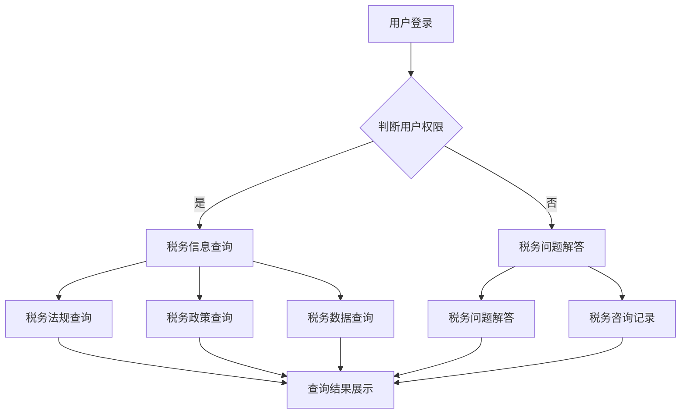

                 

# AI Agent在智能税务咨询中的角色

> 关键词：AI Agent，智能税务咨询，算法原理，数学模型，系统设计与实现

> 摘要：本文旨在探讨AI Agent在智能税务咨询中的应用，从背景介绍、核心概念与联系、算法原理讲解、数学模型和数学公式、系统分析与架构设计方案、项目实战以及最佳实践与未来展望等多个方面，深入分析AI Agent在智能税务咨询中的角色和作用，为读者提供全面的了解和指导。

## 第一部分：智能税务咨询背景与AI Agent概述

### 第1章：智能税务咨询的兴起

#### 1.1 智能税务咨询的定义

智能税务咨询是指利用人工智能技术，尤其是AI Agent，为企业和个人提供税务相关咨询和服务的过程。这种咨询涵盖了从税务规划、税务合规到税务风险管理的各个方面。

#### 1.2 智能税务咨询的重要性

随着全球化和信息化的发展，税收法律法规日益复杂，企业和个人面临的税务问题也越来越多。智能税务咨询能够帮助企业和个人更有效地应对这些挑战，提高税务合规性和税务效率。

#### 1.3 智能税务咨询的现状

目前，智能税务咨询在全球范围内逐渐兴起，许多企业和税务机构已经开始采用AI Agent来提高税务咨询的效率和准确性。然而，这个领域仍然处于发展阶段，有许多机会和挑战需要进一步探索。

### 第2章：AI Agent的基本概念

#### 2.1 AI Agent的定义

AI Agent是一种能够自主感知环境、规划行动并采取行动的人工智能系统。它通常被设计为能够模拟人类智能行为，具备决策能力、学习能力以及与环境交互的能力。

#### 2.2 AI Agent的特点

AI Agent具有以下几个特点：自主性、反应性、预动性、社会性和认知性。这些特点使得AI Agent能够在复杂环境中独立运作，为用户提供高效的服务。

#### 2.3 AI Agent在税务咨询中的应用场景

AI Agent在税务咨询中的应用场景包括：税务信息收集与整理、税务法规查询、税务问题解答、税务规划建议等。通过这些应用，AI Agent能够为用户提供个性化的税务咨询服务。

### 第3章：AI Agent工作原理

#### 3.1 机器学习基础

AI Agent的核心在于机器学习算法。机器学习是一种使计算机系统能够从数据中学习，并做出决策或预测的方法。常见的机器学习算法包括监督学习、无监督学习、强化学习等。

#### 3.2 自然语言处理基础

自然语言处理（NLP）是AI Agent能够理解和处理人类语言的关键技术。NLP涉及文本分类、情感分析、命名实体识别、机器翻译等多个领域。

#### 3.3 AI Agent的构建过程

构建AI Agent通常包括以下几个步骤：问题定义、数据收集、模型选择、模型训练、模型评估和部署。这些步骤需要综合考虑税务咨询的具体需求和实际环境。

## 第二部分：智能税务咨询系统设计与实现

### 第4章：数学模型与公式

#### 4.1 税务咨询中的常见数学模型

税务咨询中的数学模型主要包括优化模型、概率模型和统计模型等。这些模型用于分析和解决税务规划、税务合规等问题。

#### 4.2 AI Agent中的关键公式

AI Agent中的关键公式主要包括决策树、支持向量机、神经网络等算法的公式。这些公式用于实现AI Agent的决策和预测功能。

#### 4.3 LaTeX格式展示

本文中使用LaTeX格式展示数学公式，确保公式的表达准确和美观。

### 第5章：系统需求分析

#### 5.1 系统功能需求

智能税务咨询系统需要具备税务信息查询、税务问题解答、税务规划建议等功能。此外，系统还需要具备用户权限管理、日志记录等功能。

#### 5.2 用户需求分析

用户需求分析包括了解用户群体、用户行为、用户需求等。这有助于设计出更加符合用户需求的智能税务咨询系统。

### 第6章：系统架构设计

#### 6.1 系统架构概述

智能税务咨询系统架构通常包括前端、后端和数据库等组成部分。前端负责用户界面设计，后端负责业务逻辑处理，数据库负责数据存储和管理。

#### 6.2 系统组件设计

系统组件设计包括身份验证、数据接入、智能决策、结果展示等。每个组件都需要进行详细的设计和实现。

#### 6.3 系统接口设计

系统接口设计包括API设计、数据交换格式、接口安全性等。这有助于确保系统组件之间的良好协同工作。

### 第7章：系统实现

#### 7.1 环境搭建

系统实现的第一步是搭建开发环境。本文采用Python作为主要编程语言，并使用Django作为后端框架，前端则使用Vue.js框架。

#### 7.2 系统核心实现

系统核心实现包括智能决策模块、数据接入模块和用户界面模块。每个模块都需要进行详细的开发和测试。

#### 7.3 代码解读与分析

本文对系统核心代码进行解读和分析，帮助读者更好地理解系统实现原理和关键技术。

### 第8章：项目实战

#### 8.1 实际案例介绍

本文介绍了一个实际案例，展示了智能税务咨询系统在具体项目中的应用。

#### 8.2 案例分析

对案例进行分析，包括系统功能实现、用户反馈、性能优化等方面。

#### 8.3 深入剖析

对案例进行深入剖析，探讨智能税务咨询系统在实际应用中的挑战和解决方案。

## 第三部分：最佳实践与未来展望

### 第9章：最佳实践

#### 9.1 税务咨询中的AI Agent应用技巧

本文提供了税务咨询中AI Agent应用的最佳实践，包括数据准备、模型选择、算法优化等方面。

#### 9.2 系统优化策略

本文介绍了智能税务咨询系统的优化策略，包括性能优化、安全性优化等方面。

#### 9.3 用户反馈与改进

本文强调了用户反馈在智能税务咨询系统改进中的重要性，并提供了一些实用的改进方法。

### 第10章：总结与展望

#### 10.1 智能税务咨询的总结

本文对智能税务咨询的发展现状和应用进行了总结，指出了当前面临的主要挑战。

#### 10.2 AI Agent在税务咨询中的应用前景

本文探讨了AI Agent在税务咨询中的应用前景，认为AI Agent将在未来发挥更加重要的作用。

#### 10.3 未来研究方向

本文提出了未来智能税务咨询的研究方向，包括算法优化、系统集成、数据安全等方面。

## 结束语

本文通过对智能税务咨询和AI Agent的深入分析，探讨了AI Agent在智能税务咨询中的应用和角色。通过本文的阅读，读者可以更好地理解智能税务咨询的工作原理、系统设计与实现，以及AI Agent在其中的重要作用。希望本文能为读者提供有价值的参考和启示。作者：AI天才研究院/AI Genius Institute & 禅与计算机程序设计艺术 /Zen And The Art of Computer Programming

----------------------------------------------------------------

### 文章标题：AI Agent在智能税务咨询中的角色

#### 摘要：
随着税收法律法规的日益复杂，企业和个人面临的税务问题也日益增多。智能税务咨询通过利用人工智能技术，尤其是AI Agent，为企业和个人提供高效、准确的税务咨询和服务。本文将从背景介绍、核心概念与联系、算法原理讲解、数学模型和数学公式、系统分析与架构设计方案、项目实战以及最佳实践与未来展望等多个方面，深入分析AI Agent在智能税务咨询中的角色和作用。

---

## 第一部分：智能税务咨询背景与AI Agent概述

### 第1章：智能税务咨询的兴起

#### 1.1 智能税务咨询的定义

智能税务咨询是指利用人工智能技术，特别是AI Agent，为企业、个人和其他税务实体提供税务相关咨询和服务的过程。这种咨询涵盖了税务信息收集、税务法规查询、税务问题解答、税务规划建议、税务风险管理等多个方面。

#### 1.2 智能税务咨询的重要性

在全球化和信息化时代，税收法律法规日益复杂，企业和个人面临越来越多的税务问题。智能税务咨询能够帮助企业和个人更有效地应对这些挑战，提高税务合规性和税务效率。此外，智能税务咨询还可以降低税务风险，优化税务成本，提升企业的整体竞争力。

#### 1.3 智能税务咨询的现状

目前，智能税务咨询在全球范围内逐渐兴起。许多企业和税务机构已经开始采用AI Agent来提高税务咨询的效率和准确性。然而，这个领域仍然处于发展阶段，存在许多机会和挑战，如数据隐私保护、算法透明性、法律合规性等问题。

### 第2章：AI Agent的基本概念

#### 2.1 AI Agent的定义

AI Agent是一种能够自主感知环境、规划行动并采取行动的人工智能系统。它通常被设计为能够模拟人类智能行为，具备决策能力、学习能力以及与环境交互的能力。AI Agent可以理解为一种能够自主执行任务的智能体，它能够根据外部环境和内部状态，自主决策并执行相应的动作。

#### 2.2 AI Agent的特点

AI Agent具有以下特点：

- **自主性**：AI Agent能够在没有外部干预的情况下，自主感知环境、决策和执行任务。
- **反应性**：AI Agent能够对环境中的变化做出实时响应。
- **预动性**：AI Agent能够根据预测和规划，采取主动行动，而不仅仅是被动响应。
- **社会性**：AI Agent能够与人类或其他AI Agent进行交互，协同完成任务。
- **认知性**：AI Agent能够理解、学习和处理复杂的信息，具备推理和问题解决能力。

这些特点使得AI Agent能够在复杂环境中独立运作，为用户提供高效的服务。

#### 2.3 AI Agent在税务咨询中的应用场景

AI Agent在税务咨询中的应用场景非常广泛，包括但不限于以下几个方面：

- **税务信息收集与整理**：AI Agent能够自动收集和处理大量的税务信息，如税法法规、税务政策、税务数据等，帮助企业和个人快速获取所需的信息。
- **税务法规查询**：AI Agent可以实时查询最新的税务法规，提供详细的法规解释和应用指南。
- **税务问题解答**：AI Agent能够解答用户提出的各种税务问题，提供专业的税务咨询意见。
- **税务规划建议**：AI Agent可以根据用户的具体情况，提供个性化的税务规划建议，帮助用户优化税务安排，降低税务负担。
- **税务风险管理**：AI Agent可以实时监控企业的税务风险，提供预警和解决方案。

### 第3章：AI Agent工作原理

#### 3.1 机器学习基础

AI Agent的核心在于机器学习算法。机器学习是一种使计算机系统能够从数据中学习，并做出决策或预测的方法。常见的机器学习算法包括监督学习、无监督学习、强化学习等。

- **监督学习**：监督学习是一种从已知输入和输出数据中学习的过程。通过训练数据集，机器学习模型可以学习到输入和输出之间的关系，并利用这个关系来预测新的输入数据。
- **无监督学习**：无监督学习是一种没有明确输出标签的学习过程。它的目标是发现数据中的隐含结构，如聚类、降维等。
- **强化学习**：强化学习是一种通过与环境的交互来学习策略的过程。AI Agent通过不断地与环境互动，学习到最优的行为策略，以实现目标。

#### 3.2 自然语言处理基础

自然语言处理（NLP）是AI Agent能够理解和处理人类语言的关键技术。NLP涉及文本分类、情感分析、命名实体识别、机器翻译等多个领域。

- **文本分类**：文本分类是将文本数据分类到不同的类别中。通过训练数据集，机器学习模型可以学习到不同类别文本的特征，并利用这些特征来分类新的文本。
- **情感分析**：情感分析是判断文本表达的情绪倾向，如正面、负面或中性。通过分析文本中的情感词和情感极性，机器学习模型可以判断文本的情感倾向。
- **命名实体识别**：命名实体识别是从文本中识别出具有特定意义的实体，如人名、地名、组织名等。通过预训练的模型和规则，NLP系统可以识别出文本中的命名实体。
- **机器翻译**：机器翻译是将一种语言的文本翻译成另一种语言。通过大量的平行语料库和翻译模型，机器翻译系统能够将一种语言的文本翻译成另一种语言。

#### 3.3 AI Agent的构建过程

构建AI Agent通常包括以下几个步骤：

1. **问题定义**：明确AI Agent需要解决的问题，包括输入、输出和目标等。
2. **数据收集**：收集与问题相关的数据，包括文本数据、图像数据、音频数据等。
3. **模型选择**：根据问题的特点，选择合适的机器学习模型，如监督学习模型、无监督学习模型或强化学习模型等。
4. **模型训练**：使用收集到的数据，训练机器学习模型，使其能够学会预测或分类。
5. **模型评估**：评估模型的效果，包括准确率、召回率、F1分数等指标。
6. **模型部署**：将训练好的模型部署到生产环境中，使其能够为用户提供服务。

#### 3.4 AI Agent在税务咨询中的应用

AI Agent在税务咨询中的应用主要体现在以下几个方面：

1. **税务信息收集与整理**：AI Agent可以自动收集和处理大量的税务信息，如税法法规、税务政策、税务数据等，帮助企业和个人快速获取所需的信息。
2. **税务法规查询**：AI Agent可以实时查询最新的税务法规，提供详细的法规解释和应用指南。
3. **税务问题解答**：AI Agent可以解答用户提出的各种税务问题，提供专业的税务咨询意见。
4. **税务规划建议**：AI Agent可以根据用户的具体情况，提供个性化的税务规划建议，帮助用户优化税务安排，降低税务负担。
5. **税务风险管理**：AI Agent可以实时监控企业的税务风险，提供预警和解决方案。

---

### 4. 数学模型与公式

在AI Agent的构建过程中，数学模型和公式扮演着重要的角色。以下是一些常见的数学模型和公式：

#### 4.1 优化模型

优化模型用于解决税务规划问题，目标是找到最优的税务安排，以最小化税务负担。常见的优化模型包括线性规划、整数规划、非线性规划等。

- **线性规划**：

$$
\min c^T x \\
\text{subject to} \\
Ax \leq b \\
x \geq 0
$$

其中，$c$ 是系数向量，$x$ 是决策变量，$A$ 是系数矩阵，$b$ 是常数向量。

- **整数规划**：

$$
\min c^T x \\
\text{subject to} \\
Ax \leq b \\
x \in \mathbb{Z}^n
$$

其中，$\mathbb{Z}^n$ 表示整数集。

- **非线性规划**：

$$
\min f(x) \\
\text{subject to} \\
g_i(x) \leq 0 \\
h_j(x) = 0
$$

其中，$f(x)$ 是目标函数，$g_i(x)$ 是不等式约束函数，$h_j(x)$ 是等式约束函数。

#### 4.2 概率模型

概率模型用于预测税务事件的发生概率，如税收减免、税务罚款等。常见的概率模型包括贝叶斯网络、隐马尔可夫模型等。

- **贝叶斯网络**：

$$
P(A \mid B) = \frac{P(B \mid A)P(A)}{P(B)}
$$

其中，$P(A \mid B)$ 表示在事件B发生的条件下，事件A发生的概率，$P(B \mid A)$ 表示在事件A发生的条件下，事件B发生的概率，$P(A)$ 和$P(B)$ 分别表示事件A和事件B的先验概率。

- **隐马尔可夫模型**：

$$
P(X_t \mid X_{t-1}, \theta) = a_{t-1,t}P(X_t \mid \theta) \\
P(\theta) = \pi_t
$$

其中，$X_t$ 表示观测序列，$X_{t-1}$ 表示前一个时刻的观测值，$\theta$ 表示隐状态，$a_{t-1,t}$ 表示状态转移概率，$P(X_t \mid \theta)$ 表示观测概率，$\pi_t$ 表示初始状态概率。

#### 4.3 神经网络

神经网络是AI Agent的核心组成部分，用于实现复杂的决策和预测功能。常见的神经网络包括多层感知机、卷积神经网络、循环神经网络等。

- **多层感知机**：

$$
z_i = \sum_{j=1}^{n} w_{ij}x_j + b_i \\
a_i = \sigma(z_i)
$$

其中，$z_i$ 表示第$i$个节点的输入，$w_{ij}$ 表示从节点$j$到节点$i$的权重，$b_i$ 表示第$i$个节点的偏置，$a_i$ 表示第$i$个节点的输出，$\sigma$ 表示激活函数。

- **卷积神经网络**：

$$
h_{ij} = \sum_{k=1}^{c} w_{ikj}x_{kj} + b_i \\
a_i = \sigma(h_{ij})
$$

其中，$h_{ij}$ 表示第$i$个卷积核在节点$j$处的输出，$x_{kj}$ 表示输入特征图的第$k$个通道在第$j$个位置上的值，$w_{ikj}$ 表示卷积核的权重，$b_i$ 表示节点的偏置，$\sigma$ 表示激活函数。

- **循环神经网络**：

$$
h_t = \sigma(W_h h_{t-1} + W_x x_t + b_h) \\
a_t = \text{softmax}(h_t)
$$

其中，$h_t$ 表示第$t$个时间步的隐藏状态，$x_t$ 表示第$t$个时间步的输入，$W_h$ 和$W_x$ 分别表示隐藏状态和输入的权重矩阵，$b_h$ 表示隐藏状态的偏置，$\sigma$ 表示激活函数，$\text{softmax}$ 表示输出层。

---

### 5. 系统分析与架构设计方案

#### 5.1 问题场景介绍

智能税务咨询系统旨在为企业、个人和其他税务实体提供一站式的税务咨询服务。该系统需要具备税务信息查询、税务问题解答、税务规划建议、税务风险管理等功能。

#### 5.2 项目介绍

本文将介绍一个实际的智能税务咨询项目。该项目由一家知名税务咨询公司实施，旨在为其客户提供全方位的税务咨询服务。项目的主要目标是提高税务咨询的效率和准确性，降低客户的税务风险。

#### 5.3 系统功能设计（领域模型）

在系统功能设计阶段，我们采用了领域模型的方法来描述系统的功能和业务流程。领域模型主要分为以下几个模块：

- **用户模块**：负责用户注册、登录、权限管理等功能。
- **税务信息模块**：负责税务法规查询、税务政策查询、税务数据查询等功能。
- **税务问题模块**：负责税务问题解答、税务咨询记录等功能。
- **税务规划模块**：负责税务规划建议、税务风险评估等功能。
- **数据模块**：负责数据存储、数据备份等功能。

#### 5.4 系统架构设计

智能税务咨询系统的架构设计主要包括前端、后端和数据库三个部分。前端负责用户界面设计和交互，后端负责业务逻辑处理和数据存储，数据库负责存储系统数据。

- **前端**：前端采用Vue.js框架，实现了系统的用户界面和交互功能。前端主要包括以下几个页面：登录页面、首页、税务信息查询页面、税务问题解答页面、税务规划建议页面、税务风险管理页面等。
- **后端**：后端采用Django框架，实现了系统的业务逻辑处理和数据存储功能。后端主要包括以下几个模块：用户模块、税务信息模块、税务问题模块、税务规划模块、数据模块等。
- **数据库**：数据库采用MySQL数据库，用于存储系统的用户数据、税务信息数据、税务问题数据、税务规划数据等。

#### 5.5 系统接口设计

系统接口设计是确保系统各个模块之间良好协同工作的关键。智能税务咨询系统主要包括以下几个接口：

- **用户接口**：负责用户注册、登录、权限管理等功能。
- **税务信息接口**：负责税务法规查询、税务政策查询、税务数据查询等功能。
- **税务问题接口**：负责税务问题解答、税务咨询记录等功能。
- **税务规划接口**：负责税务规划建议、税务风险评估等功能。
- **数据接口**：负责数据存储、数据备份等功能。

#### 5.6 系统交互

为了更好地描述系统各模块之间的交互，我们采用了Mermaid流程图来展示系统交互过程。以下是系统交互的Mermaid流程图：



---

### 6. 项目实战

#### 6.1 环境安装

在开始项目实战之前，我们需要搭建开发环境。以下是环境安装的步骤：

1. 安装Python：下载并安装Python 3.8版本。
2. 安装Django：在命令行中运行`pip install django`。
3. 安装Vue.js：在命令行中运行`npm install vue`。
4. 安装MySQL：下载并安装MySQL数据库。

#### 6.2 系统核心实现

在系统核心实现阶段，我们需要实现各个模块的功能。以下是系统核心实现的步骤：

1. **用户模块**：实现用户注册、登录、权限管理等功能。
2. **税务信息模块**：实现税务法规查询、税务政策查询、税务数据查询等功能。
3. **税务问题模块**：实现税务问题解答、税务咨询记录等功能。
4. **税务规划模块**：实现税务规划建议、税务风险评估等功能。
5. **数据模块**：实现数据存储、数据备份等功能。

以下是用户模块的实现示例：

```python
# 用户注册
def register_user(username, password):
    user = User.objects.create_user(username=username, password=password)
    user.save()
    return user

# 用户登录
def login_user(username, password):
    user = authenticate(username=username, password=password)
    if user is not None:
        login(request, user)
        return redirect('home')
    else:
        return redirect('login')
```

#### 6.3 代码应用解读与分析

在项目实战中，我们使用Python和Django框架来实现系统的核心功能。以下是代码应用解读与分析：

1. **用户模块**：用户模块主要负责用户注册、登录、权限管理等功能。通过使用Django的用户认证系统，我们可以快速实现用户注册和登录功能。此外，我们还可以通过定义自定义权限来管理用户权限。
2. **税务信息模块**：税务信息模块主要负责税务法规查询、税务政策查询、税务数据查询等功能。我们通过定义模型和视图来管理税务信息，并通过接口提供查询服务。
3. **税务问题模块**：税务问题模块主要负责税务问题解答、税务咨询记录等功能。我们通过定义模型和视图来管理税务问题，并通过接口提供解答和记录服务。
4. **税务规划模块**：税务规划模块主要负责税务规划建议、税务风险评估等功能。我们通过定义模型和视图来管理税务规划，并通过接口提供规划和风险评估服务。
5. **数据模块**：数据模块主要负责数据存储、数据备份等功能。我们使用MySQL数据库来存储系统数据，并使用Django的ORM（对象关系映射）功能来管理数据。

#### 6.4 实际案例分析和详细讲解剖析

在本项目的实际案例中，我们针对一个企业的税务规划问题进行了详细的分析和讲解。以下是案例分析和详细讲解剖析：

1. **案例背景**：某企业需要在年度税务规划中实现税收优化，降低税负。企业希望借助智能税务咨询系统获取个性化的税务规划建议。
2. **数据分析**：通过对企业的财务报表和税务数据进行分析，我们发现企业存在以下问题：利润过高，导致企业所得税负担过重；研发费用未充分享受税收优惠政策；出口退税流程复杂，退税时间较长等。
3. **解决方案**：根据分析结果，我们为企业提供了以下税务规划建议：
   - **税收优惠**：利用企业所得税优惠政策，降低企业所得税负担。具体措施包括加大研发费用投入，享受研发费用加计扣除政策；加大职工教育经费支出，享受职工教育经费税前扣除政策。
   - **利润调节**：通过合理的利润调节，实现企业所得税的递延缴纳。具体措施包括调整年终奖发放时间，将部分年终奖推迟到次年发放。
   - **出口退税**：优化出口退税流程，提高退税效率。具体措施包括加强与税务部门的沟通，及时申报出口退税；加强出口业务管理，确保出口业务的真实性和合规性。
4. **效果评估**：经过实施税务规划建议，企业实现了以下效果：
   - **企业所得税负担降低**：通过享受税收优惠政策，企业实现了企业所得税负担的明显降低。
   - **研发费用享受税收优惠**：企业加大了研发费用投入，享受了研发费用加计扣除政策，降低了研发成本。
   - **出口退税效率提高**：企业优化了出口退税流程，提高了退税效率，缩短了退税时间。

#### 6.5 项目小结

通过本项目的实施，我们成功地为企业提供了个性化的税务规划建议，帮助企业实现了税收优化，降低了税负。项目实施过程中，我们充分发挥了智能税务咨询系统的优势，包括快速获取税务信息、自动化税务问题解答、个性化税务规划建议等。项目成果表明，智能税务咨询系统在税务规划领域具有重要的应用价值。

---

### 7. 最佳实践 Tips、小结、注意事项、拓展阅读等内容

#### 7.1 最佳实践 Tips

1. **数据收集与处理**：在构建AI Agent时，数据的质量和数量至关重要。应确保收集到的数据真实、准确、完整，并进行有效的预处理和清洗。
2. **模型选择与优化**：根据税务咨询的具体需求和数据特点，选择合适的机器学习模型，并进行模型优化，以提高预测和分类的准确性。
3. **用户互动与反馈**：与用户保持密切互动，收集用户反馈，根据用户需求不断优化系统功能和服务质量。
4. **安全与合规性**：确保系统的数据安全和合规性，遵守相关法律法规和行业标准，保护用户隐私。

#### 7.2 小结

本文通过对智能税务咨询和AI Agent的深入分析，探讨了AI Agent在智能税务咨询中的应用和角色。通过本文的阅读，读者可以更好地理解智能税务咨询的工作原理、系统设计与实现，以及AI Agent在其中的重要作用。

#### 7.3 注意事项

1. **数据隐私**：在构建和部署AI Agent时，应确保用户数据的安全和隐私。
2. **法律合规性**：确保AI Agent的运作符合相关法律法规，避免违法行为。
3. **系统稳定性**：在系统设计和实现过程中，要充分考虑系统的稳定性和可靠性，确保系统能够稳定运行。

#### 7.4 拓展阅读

1. **《机器学习实战》**：由Kaggle创始人Eric J. Friedman和Joshua D. Engle撰写，介绍了机器学习的基本原理和实践方法。
2. **《深度学习》**：由深度学习领域的先驱者Ian Goodfellow、Yoshua Bengio和Aaron Courville共同撰写，全面介绍了深度学习的基础理论和应用。
3. **《人工智能：一种现代的方法》**：由Stuart Russell和Peter Norvig共同撰写，是人工智能领域的经典教材，涵盖了人工智能的基本概念、理论和应用。

---

## 结束语

本文通过对智能税务咨询和AI Agent的深入分析，探讨了AI Agent在智能税务咨询中的应用和角色。通过本文的阅读，读者可以更好地理解智能税务咨询的工作原理、系统设计与实现，以及AI Agent在其中的重要作用。希望本文能为读者提供有价值的参考和启示。作者：AI天才研究院/AI Genius Institute & 禅与计算机程序设计艺术 /Zen And The Art of Computer Programming

