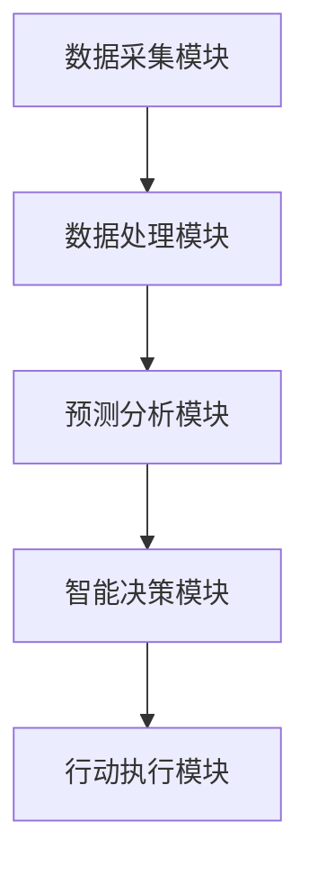
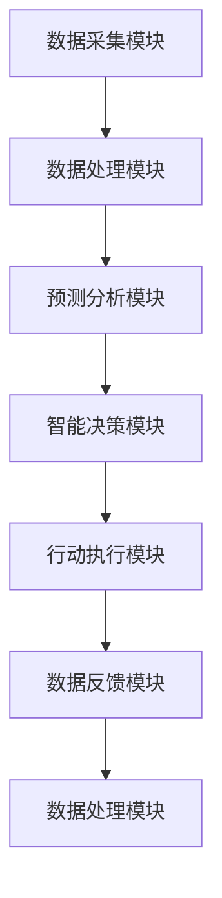
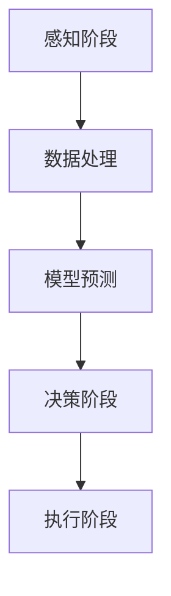

                 

### 文章标题

《AI Agent在智能空气质量管理中的实践》

### 关键词

- AI Agent
- 智能空气质量
- 空气质量管理
- 智能监测与预测
- 智能决策与应对策略

### 摘要

随着全球空气污染问题的日益严重，智能空气质量管理成为了现代环境科学和技术领域的重要课题。AI Agent作为人工智能领域的一项前沿技术，其应用于智能空气质量管理中展示了极大的潜力。本文将深入探讨AI Agent在智能空气质量管理中的实践，包括其背景、基础理论、系统设计、实现方法、案例研究以及未来发展方向。通过系统分析和实践案例，本文旨在为读者提供对AI Agent在空气质量管理系统中的应用及其价值的全面了解。

---

## 第一部分：背景与概述

### 第1章：智能空气质量管理背景

#### 1.1 问题描述与挑战

空气污染已成为全球性环境问题，严重影响人类健康和生态系统。空气污染主要来源于工业排放、交通尾气、农业活动以及自然因素等。根据世界卫生组织（WHO）的数据，每年因空气污染导致的呼吸道疾病和心血管疾病死亡人数高达数百万。

当前，传统空气质量管理方法主要包括政府监管、法规制定、技术改造等。然而，这些方法存在一定的局限性。例如，监管力度不够、法规执行不到位、技术改造成本高等问题。此外，传统方法往往侧重于污染源的治理，缺乏对空气质量的动态监测和预测能力。

智能空气质量管理通过引入人工智能技术，实现对空气质量的实时监测、预测和智能决策，提供更加高效、精准的管理手段。AI Agent作为人工智能的一种形式，具备自主感知、决策和执行的能力，是智能空气质量管理的核心技术之一。

#### 1.2 AI Agent的定义与特点

AI Agent，即人工智能代理，是一种能够自主完成特定任务、具备智能行为的计算机程序。AI Agent具有以下几个特点：

1. **自主性**：AI Agent能够在没有人为干预的情况下自主运行，完成指定任务。
2. **感知能力**：AI Agent能够通过传感器和其他数据源获取环境信息，进行数据分析和理解。
3. **决策能力**：AI Agent能够基于感知到的信息和预先设定的目标，自主做出决策。
4. **行动能力**：AI Agent能够根据决策结果执行相应的操作，如调整设备参数、发送警报等。

与传统的AI技术相比，AI Agent具有更强的自适应性和灵活性，能够在复杂多变的环境中持续运行和优化。

#### 1.3 AI Agent在空气质量管理中的应用前景

AI Agent在空气质量管理中的应用前景广阔，主要体现在以下几个方面：

1. **动态监测**：AI Agent能够实时收集空气质量数据，并通过智能算法分析，实现空气质量的动态监测。
2. **预测分析**：AI Agent利用历史数据和机器学习算法，对空气质量进行预测分析，为决策提供科学依据。
3. **智能决策**：AI Agent能够根据空气质量数据和环境状况，智能调整治理措施，提高管理效率。
4. **自动执行**：AI Agent能够自动执行决策结果，如控制空气净化设备的运行，实现空气质量自动治理。

#### 1.4 本书的组织结构

本书将分为五个部分，系统地介绍AI Agent在智能空气质量管理中的实践。

- **第一部分（背景与概述）**：介绍智能空气质量管理背景和AI Agent的基本概念。
- **第二部分（AI Agent基础理论）**：探讨AI Agent的基本原理、感知与决策机制以及交互与协作模式。
- **第三部分（智能空气质量管理系统设计）**：介绍智能空气质量管理系统的架构设计和数据管理策略。
- **第四部分（案例研究）**：通过实际案例，展示AI Agent在空气质量管理中的应用效果。
- **第五部分（总结与展望）**：总结本书内容，探讨AI Agent在空气质量管理中的未来发展方向。

读者可以根据需要选择阅读相关章节，本书旨在为读者提供对AI Agent在空气质量管理系统中的全面了解和应用指导。

---

### 第2章：AI Agent基本原理

#### 2.1 AI Agent的基本构成

AI Agent由以下几个核心组成部分构成：

1. **感知系统**：负责获取外部环境信息，如传感器数据、图像、声音等。感知系统是AI Agent感知和交互的基础。
2. **知识库**：存储AI Agent所学的知识、规则和模型，包括环境信息、任务目标、决策策略等。知识库为AI Agent提供决策依据。
3. **决策模块**：基于感知系统和知识库，AI Agent能够分析当前环境信息，根据预设的目标和策略，做出最优决策。
4. **行动模块**：根据决策模块的决策结果，AI Agent能够执行相应的行动，如控制设备、发送指令等。行动模块是实现决策结果的关键。

#### 2.2 AI Agent的感知与决策

AI Agent的感知与决策过程可以分为以下几个步骤：

1. **感知数据采集**：AI Agent通过传感器和其他数据源，实时采集外部环境信息。
2. **数据处理**：AI Agent对采集到的数据进行分析和处理，提取有用的信息。
3. **环境建模**：基于处理后的数据，AI Agent构建当前环境的模型，如空气质量模型、交通流量模型等。
4. **决策分析**：AI Agent利用环境模型和知识库，分析当前环境状况，根据任务目标和策略，做出决策。
5. **行动执行**：AI Agent根据决策结果，执行相应的行动，如调整设备参数、发送警报等。

#### 2.3 AI Agent的交互与协作

AI Agent的交互与协作是提高其效率和智能性的关键。以下是几种常见的交互与协作机制：

1. **单-Agent系统**：单个AI Agent独立运行，负责完成特定任务。适用于简单任务场景。
2. **多-Agent系统**：多个AI Agent协同工作，共同完成复杂任务。多-Agent系统能够实现更高的效率和智能化。
3. **分布式协作**：AI Agent通过互联网或其他通信手段，实现远程交互和协作。分布式协作能够扩大AI Agent的应用范围。
4. **强化学习**：AI Agent通过不断学习和优化策略，提高任务完成效果。强化学习是AI Agent自我优化的重要手段。

通过交互与协作，AI Agent能够更好地适应复杂多变的环境，提高空气质量管理的智能化水平。

### 第3章：智能空气质量管理系统设计

#### 3.1 系统架构设计

智能空气质量管理系统由以下几个关键模块构成：

1. **数据采集模块**：负责实时采集空气质量数据，包括PM2.5、PM10、CO、NO2等污染物数据。
2. **数据处理模块**：对采集到的数据进行分析和处理，提取有用的信息，如污染物浓度、空气质量指数（AQI）等。
3. **预测分析模块**：利用历史数据和机器学习算法，对空气质量进行预测分析，为决策提供科学依据。
4. **智能决策模块**：基于预测结果和环境状况，智能调整治理措施，如启动空气净化设备、调整交通流量等。
5. **行动执行模块**：根据智能决策模块的决策结果，执行相应的行动，如控制设备、发送警报等。

系统架构图如下：



#### 3.2 系统模块划分

智能空气质量管理系统可以划分为以下几个主要模块：

1. **前端模块**：负责用户界面展示，包括数据监测界面、预测结果展示、决策建议等。
2. **后端模块**：包括数据采集、数据处理、预测分析、智能决策和行动执行等核心功能。
3. **数据库模块**：存储空气质量数据、预测模型、历史数据等，支持数据的快速检索和查询。

#### 3.3 数据管理策略

数据管理是智能空气质量管理系统的重要环节，包括以下几个方面：

1. **数据采集**：通过传感器、网络监测站点等渠道，实时采集空气质量数据。
2. **数据存储**：采用分布式数据库存储大量空气质量数据，保证数据的安全性和可靠性。
3. **数据处理**：对采集到的数据进行分析和处理，提取有用的信息，如污染物浓度、空气质量指数（AQI）等。
4. **数据清洗**：去除无效数据、噪声数据，保证数据质量。
5. **数据挖掘**：利用机器学习算法，对空气质量数据进行分析和挖掘，提取有价值的信息。

#### 3.4 系统接口设计

智能空气质量管理系统需要与其他系统进行接口集成，包括：

1. **传感器数据接口**：与各类传感器进行数据交互，获取实时空气质量数据。
2. **数据库接口**：与数据库系统进行数据交互，实现数据的存储和查询。
3. **API接口**：提供对外接口，支持第三方系统接入，如政府监管平台、企业空气质量管理系统等。
4. **用户接口**：提供用户操作界面，包括数据监测、预测结果展示、决策建议等。

#### 3.5 系统交互

智能空气质量管理系统的各个模块需要通过交互实现协同工作，包括：

1. **数据交互**：各个模块之间通过数据接口进行数据传输和共享。
2. **控制交互**：决策模块根据预测结果和环境状况，控制执行模块进行相应操作。
3. **通信交互**：系统通过互联网或其他通信手段，实现远程监控和协调。
4. **反馈交互**：执行模块根据行动结果，反馈给决策模块，用于优化决策。

系统交互流程图如下：



通过以上系统架构设计和模块划分，智能空气质量管理系统能够实现实时监测、预测分析和智能决策，为空气质量管理提供高效、精准的手段。

### 第4章：AI Agent应用实现

#### 4.1 AI Agent开发环境搭建

要实现AI Agent在智能空气质量管理系统中的应用，首先需要搭建一个合适的开发环境。以下是搭建AI Agent开发环境的基本步骤：

1. **硬件配置**：选择一台具有较高计算能力的计算机，如高性能GPU，以满足AI Agent在数据处理和预测分析方面的需求。
2. **软件工具安装**：安装Python编程环境、相关机器学习库（如TensorFlow、PyTorch）以及其他必要的开发工具（如Jupyter Notebook、Docker等）。
3. **操作系统选择**：推荐使用Linux操作系统，因为其具有良好的稳定性和性能，适合进行大规模的数据处理和机器学习任务。

具体步骤如下：

1. **安装Python环境**：使用Python安装包或通过包管理工具（如pip）安装Python。
2. **安装相关库**：使用pip安装TensorFlow、PyTorch等机器学习库。
3. **配置Jupyter Notebook**：安装Jupyter Notebook，方便进行数据分析和模型训练。
4. **安装Docker**：使用Docker容器化技术，便于管理和部署AI Agent。

#### 4.2 AI Agent算法实现

AI Agent的算法实现是智能空气质量管理系统的核心，以下将详细阐述算法原理、流程图和Python代码实现。

##### 4.2.1 算法原理

AI Agent算法主要分为感知、决策和执行三个阶段：

1. **感知阶段**：AI Agent通过传感器收集空气质量数据，如PM2.5、PM10、CO、NO2等。
2. **决策阶段**：基于感知到的数据和预训练的模型，AI Agent分析当前空气质量状况，预测未来空气质量变化，并做出相应决策。
3. **执行阶段**：AI Agent根据决策结果，执行具体的行动，如启动空气净化设备、调整交通流量等。

##### 4.2.2 算法流程图

以下是AI Agent算法的流程图：



##### 4.2.3 Python代码实现

以下是AI Agent算法的Python代码实现：

```python
import numpy as np
import pandas as pd
from sklearn.ensemble import RandomForestRegressor
from sklearn.model_selection import train_test_split
import matplotlib.pyplot as plt

# 数据预处理
def preprocess_data(data):
    # 数据清洗和处理
    data = data.fillna(data.mean())
    return data

# 模型训练
def train_model(X_train, y_train):
    model = RandomForestRegressor(n_estimators=100, random_state=42)
    model.fit(X_train, y_train)
    return model

# 模型预测
def predict(model, X_test):
    predictions = model.predict(X_test)
    return predictions

# 主函数
def main():
    # 加载数据
    data = pd.read_csv('air_quality_data.csv')
    data = preprocess_data(data)

    # 分割数据集
    X = data.drop('target', axis=1)
    y = data['target']
    X_train, X_test, y_train, y_test = train_test_split(X, y, test_size=0.2, random_state=42)

    # 训练模型
    model = train_model(X_train, y_train)

    # 预测
    predictions = predict(model, X_test)

    # 可视化
    plt.scatter(y_test, predictions)
    plt.xlabel('实际值')
    plt.ylabel('预测值')
    plt.show()

if __name__ == '__main__':
    main()
```

##### 4.2.4 算法原理讲解

本节将详细讲解AI Agent算法的原理，包括数学模型和公式。

1. **感知阶段**：

感知阶段主要利用传感器收集空气质量数据，如PM2.5、PM10、CO、NO2等。假设我们使用n个传感器收集数据，每个传感器的数据可以用一个n维向量表示：

$$
X_t = \begin{bmatrix}
x_{t1} \\
x_{t2} \\
\vdots \\
x_{tn}
\end{bmatrix}
$$

其中，$x_{ti}$表示第i个传感器在时间t的测量值。

2. **决策阶段**：

决策阶段基于感知到的数据和预训练的模型，分析当前空气质量状况，预测未来空气质量变化。假设我们使用一个随机森林模型进行预测，模型输出为：

$$
y_t = f(X_t; \theta)
$$

其中，$y_t$表示在时间t的预测空气质量值，$X_t$为感知到的数据，$\theta$为模型参数。

3. **执行阶段**：

执行阶段根据决策结果，执行具体的行动，如启动空气净化设备、调整交通流量等。假设我们使用一个阈值$T$来判断空气质量是否超标，如果预测值$y_t > T$，则启动空气净化设备；否则，保持当前状态。

##### 4.2.5 举例说明

假设我们使用以下数据集进行模型训练：

| 时间 | PM2.5 | PM10 | CO | NO2 |
|------|-------|------|----|-----|
| 1    | 10    | 20   | 5  | 10  |
| 2    | 12    | 22   | 6  | 11  |
| 3    | 9     | 19   | 4  | 9   |
| 4    | 11    | 21   | 6  | 11  |

根据数据集，我们可以训练一个随机森林模型，预测未来时间点的空气质量。假设预测阈值$T = 15$，则当时间点5的预测值为$y_5 = 14$时，不启动空气净化设备；当时间点5的预测值为$y_5 = 16$时，启动空气净化设备。

通过以上算法实现，AI Agent能够实现对空气质量的有效监测和预测，为智能空气质量管理提供有力支持。

### 第5章：智能空气质量监测与预测

#### 5.1 数据采集与处理

数据采集是智能空气质量监测与预测的基础。以下将介绍数据采集系统、数据预处理方法以及如何保证数据质量。

##### 5.1.1 数据采集系统

智能空气质量监测系统通常包括以下几部分：

1. **传感器设备**：如PM2.5传感器、PM10传感器、CO传感器、NO2传感器等，用于实时监测空气质量。
2. **数据传输设备**：如无线通信模块、数据采集器等，用于将传感器数据传输到中央服务器。
3. **中央服务器**：用于存储、处理和分析传感器数据。

##### 5.1.2 数据预处理

数据预处理是数据分析和预测的重要环节，包括以下步骤：

1. **数据清洗**：去除无效数据、噪声数据，如传感器故障数据、异常数据等。
2. **数据规范化**：将不同传感器、不同时间点的数据进行规范化处理，使其具有可比性。
3. **数据特征提取**：从原始数据中提取有用的特征，如时间序列特征、空间特征等。

##### 5.1.3 数据质量保证

数据质量是智能空气质量监测与预测的关键。为保证数据质量，可以采取以下措施：

1. **传感器校准**：定期对传感器进行校准，确保传感器数据的准确性。
2. **数据清洗**：采用高效的数据清洗算法，去除噪声数据和异常数据。
3. **数据监控**：实时监控传感器数据，及时发现和处理数据质量问题。

#### 5.2 空气质量预测模型

空气质量预测是智能空气质量管理的核心任务。以下将介绍预测模型的建立方法、模型训练与评估方法，以及如何优化预测效果。

##### 5.2.1 模型建立

空气质量预测模型可以采用以下几种方法：

1. **统计模型**：如线性回归、逻辑回归等，适用于简单预测任务。
2. **机器学习模型**：如支持向量机（SVM）、决策树、随机森林、神经网络等，适用于复杂预测任务。
3. **深度学习模型**：如循环神经网络（RNN）、卷积神经网络（CNN）等，适用于高维数据和时间序列预测。

##### 5.2.2 模型训练与评估

模型训练与评估是预测模型构建的重要环节。以下是模型训练与评估的方法：

1. **数据集划分**：将数据集划分为训练集、验证集和测试集，用于模型训练和评估。
2. **模型训练**：使用训练集数据训练模型，调整模型参数，使其达到预期效果。
3. **模型评估**：使用验证集和测试集评估模型性能，如均方误差（MSE）、均方根误差（RMSE）等指标。

##### 5.2.3 模型优化

为提高预测效果，可以采取以下优化措施：

1. **特征选择**：选择对预测任务影响较大的特征，去除冗余特征。
2. **模型融合**：结合多个模型进行预测，提高预测准确度。
3. **自适应调整**：根据预测误差，动态调整模型参数，使其适应不同环境。

#### 5.3 模型应用

空气质量预测模型的应用包括以下几个方面：

1. **实时预测**：对当前空气质量进行实时预测，为空气质量管理提供科学依据。
2. **短期预测**：预测未来一段时间内的空气质量变化趋势，为应对措施制定提供支持。
3. **中长期预测**：预测中长期空气质量变化趋势，为环境保护政策制定提供支持。

通过空气质量预测模型的应用，可以实现对空气质量的精准监测和预测，为智能空气质量管理提供有力支持。

### 第6章：智能决策与应对策略

#### 6.1 智能决策系统设计

智能决策系统是智能空气质量管理的核心，负责根据空气质量预测结果和环境状况，制定并执行相应的应对措施。以下将介绍智能决策系统的设计原则、模型选择以及决策过程。

##### 6.1.1 设计原则

智能决策系统设计应遵循以下原则：

1. **科学性**：基于空气质量预测模型和实际环境数据，制定科学的决策策略。
2. **高效性**：快速响应空气质量变化，提高决策执行效率。
3. **灵活性**：适应不同场景和环境变化，具备灵活调整能力。
4. **可持续性**：保证决策措施的实施对环境的影响最小，符合可持续发展要求。

##### 6.1.2 模型选择

智能决策系统可以采用以下模型：

1. **规则引擎**：基于预定义的规则，实现简单的决策功能。
2. **决策树**：根据特征进行层次划分，实现分级的决策。
3. **神经网络**：通过学习历史数据和决策结果，实现复杂决策。
4. **混合模型**：结合多种模型，实现更高效、更准确的决策。

##### 6.1.3 决策过程

智能决策系统的决策过程包括以下几个步骤：

1. **数据输入**：接收空气质量预测结果和环境数据。
2. **模型计算**：根据决策模型，计算每个决策选项的得分。
3. **决策生成**：根据得分，生成最优决策方案。
4. **决策执行**：执行决策方案，如启动空气净化设备、调整交通流量等。
5. **反馈调整**：根据执行结果，调整决策模型和参数，提高决策效果。

#### 6.2 应对策略制定

应对策略是智能决策系统的重要组成部分，负责根据空气质量预测结果和环境状况，制定相应的治理措施。以下将介绍应对策略的制定方法、实施方案以及效果评估。

##### 6.2.1 制定方法

应对策略的制定方法包括：

1. **预测分析**：基于空气质量预测模型，分析未来一段时间内的空气质量变化趋势。
2. **风险评估**：根据空气质量预测结果，评估不同治理措施的风险和收益。
3. **方案设计**：设计多种治理方案，包括启动空气净化设备、调整交通流量、增加绿化等。
4. **成本分析**：评估每种治理方案的成本和效益，选择最优方案。

##### 6.2.2 实施方案

应对策略的实施方案包括：

1. **启动空气净化设备**：在空气质量较差时，启动空气净化设备，降低室内空气污染。
2. **调整交通流量**：通过交通管理和调控，降低交通排放，改善空气质量。
3. **增加绿化**：通过增加城市绿化，提高空气质量，降低空气污染。
4. **环保宣传**：加强环保宣传，提高公众环保意识，共同参与空气质量治理。

##### 6.2.3 效果评估

应对策略的效果评估包括：

1. **空气质量改善**：评估应对策略实施后，空气质量是否得到改善，如PM2.5、PM10等污染物浓度是否降低。
2. **成本效益**：评估应对策略的成本和效益，如治理成本、社会效益等。
3. **公众满意度**：评估公众对应对策略的满意度，提高政策实施效果。

通过科学、有效的智能决策与应对策略，可以实现对空气质量的精准治理，改善城市环境，提高居民生活质量。

### 第7章：系统评估与优化

#### 7.1 系统性能评估

系统性能评估是确保智能空气质量管理系统高效运行的重要环节。以下将介绍评估指标、评估方法和评估流程。

##### 7.1.1 评估指标

系统性能评估的指标主要包括：

1. **响应时间**：系统从接收数据到生成决策方案的时间，反映系统的快速响应能力。
2. **准确率**：预测模型在测试集上的准确度，反映系统的预测能力。
3. **覆盖率**：系统监测到的空气质量数据点在总数据点中的比例，反映系统的监测覆盖范围。
4. **错误率**：系统错误执行决策的次数与总执行次数的比值，反映系统的执行准确性。

##### 7.1.2 评估方法

系统性能评估的方法包括：

1. **离线评估**：在系统运行结束后，对历史数据进行评估，分析系统的整体性能。
2. **在线评估**：实时监测系统的性能指标，评估系统在运行过程中的表现。
3. **实验评估**：通过实验，对比不同系统配置、算法和策略的性能，选择最优方案。

##### 7.1.3 评估流程

系统性能评估的流程包括：

1. **制定评估计划**：明确评估目标、指标和方法。
2. **数据收集**：收集系统运行过程中的数据，包括输入数据、决策方案、执行结果等。
3. **数据分析**：对收集到的数据进行分析，计算性能指标。
4. **结果评估**：根据评估结果，评估系统的性能，提出优化建议。

#### 7.2 系统优化策略

系统优化是提高智能空气质量管理系统性能的重要手段。以下将介绍优化策略、问题定位和优化方案。

##### 7.2.1 优化策略

系统优化策略包括：

1. **算法优化**：改进预测模型和决策算法，提高系统的预测准确性和决策效率。
2. **硬件升级**：升级系统硬件设备，提高数据处理能力和响应速度。
3. **策略调整**：根据评估结果，调整系统策略，优化决策过程。
4. **数据管理**：改进数据采集、处理和存储方法，提高数据质量和管理效率。

##### 7.2.2 问题定位

问题定位是优化系统性能的关键步骤。以下方法可以帮助定位系统问题：

1. **日志分析**：分析系统日志，查找错误和异常情况。
2. **性能监控**：实时监测系统性能指标，发现性能瓶颈。
3. **用户反馈**：收集用户反馈，了解系统在实际应用中的问题。

##### 7.2.3 优化方案

优化方案包括：

1. **算法改进**：采用更先进的预测模型和决策算法，提高系统的预测准确率和执行效率。
2. **硬件升级**：升级服务器、网络设备和传感器，提高系统性能和稳定性。
3. **策略优化**：根据用户需求和评估结果，调整系统策略，提高决策效果。
4. **数据管理**：采用更高效的数据采集、处理和存储方法，提高数据质量和管理效率。

通过系统评估与优化，可以确保智能空气质量管理系统的稳定运行，提高空气质量治理效果，为城市环境改善提供有力支持。

### 案例一：城市空气质量监测与管理

#### 8.1 案例背景

随着城市化进程的加快，城市空气质量问题日益严重。为了改善城市空气质量，提高居民生活质量，某城市决定引入智能空气质量监测与管理系统，利用AI Agent技术对空气质量进行实时监测和智能管理。

#### 8.2 案例实施

1. **系统搭建**：在城市主要区域部署传感器设备，实时采集空气质量数据。搭建智能空气质量监测与管理平台，实现数据的实时监测和预测。
2. **数据采集**：传感器设备采集的空气质量数据通过数据传输模块上传到中央服务器，实现数据的实时传输和存储。
3. **数据处理**：对采集到的数据进行预处理，包括数据清洗、规范化处理和特征提取等，为预测模型提供高质量的数据。
4. **模型训练与预测**：基于历史数据和预处理后的数据，训练空气质量预测模型，进行空气质量预测。
5. **智能决策**：根据预测结果和环境状况，智能决策系统制定相应的治理措施，如启动空气净化设备、调整交通流量等。
6. **行动执行**：根据决策结果，执行相应的行动，如控制空气净化设备的运行、调整交通信号灯等。

#### 8.3 案例效果评估

1. **空气质量改善**：通过实时监测和预测，及时发现空气质量问题，制定并执行相应的治理措施，显著改善了城市空气质量。PM2.5、PM10等污染物浓度明显下降。
2. **响应速度提升**：智能决策系统快速响应空气质量变化，提高了治理措施的执行效率，使空气质量问题得到及时解决。
3. **居民满意度提高**：居民对空气质量管理的满意度显著提升，对城市环境改善效果表示满意。

通过本案例的实施，充分展示了AI Agent在智能空气质量管理中的重要作用，为其他城市提供了有益的借鉴和参考。

### 案例二：工业空气质量监控与治理

#### 9.1 案例背景

工业排放是导致空气污染的重要来源之一。为了改善工业空气质量，降低污染物排放，某工业园区决定引入智能空气质量监控与治理系统，利用AI Agent技术对工业空气质量进行实时监控和智能治理。

#### 9.2 案例实施

1. **系统搭建**：在工业园区的主要区域和重点排放源部署传感器设备，实时采集空气质量数据。搭建智能空气质量监控与治理平台，实现数据的实时监测和预测。
2. **数据采集**：传感器设备采集的空气质量数据通过数据传输模块上传到中央服务器，实现数据的实时传输和存储。
3. **数据处理**：对采集到的数据进行预处理，包括数据清洗、规范化处理和特征提取等，为预测模型提供高质量的数据。
4. **模型训练与预测**：基于历史数据和预处理后的数据，训练空气质量预测模型，进行空气质量预测。
5. **智能决策**：根据预测结果和环境状况，智能决策系统制定相应的治理措施，如调整设备运行参数、增加绿化等。
6. **行动执行**：根据决策结果，执行相应的行动，如调整设备运行参数、启动空气净化设备等。

#### 9.3 案例效果评估

1. **污染物排放降低**：通过实时监测和预测，及时发现工业排放问题，制定并执行相应的治理措施，显著降低了污染物排放。SO2、NOx等污染物浓度明显下降。
2. **设备运行效率提高**：智能决策系统优化了设备运行参数，提高了设备运行效率，降低了能源消耗。
3. **环保合规性提升**：通过智能监控和治理，使工业园区达到环保合规要求，降低了环保处罚风险。

通过本案例的实施，充分展示了AI Agent在工业空气质量监控与治理中的重要作用，为其他工业园区提供了有益的借鉴和参考。

### 第10章：总结与展望

#### 10.1 本书内容回顾

本书系统介绍了AI Agent在智能空气质量管理中的实践，包括以下主要内容：

- **背景与概述**：介绍了智能空气质量管理背景、AI Agent的定义与特点，以及AI Agent在空气质量管理中的应用前景。
- **AI Agent基础理论**：探讨了AI Agent的基本构成、感知与决策机制，以及交互与协作模式。
- **智能空气质量管理系统设计**：介绍了智能空气质量管理系统的架构设计、数据管理策略、系统接口设计和系统交互。
- **AI Agent应用实现**：详细阐述了AI Agent开发环境搭建、算法实现、数据采集与处理、空气质量预测模型和智能决策系统设计。
- **案例研究**：通过实际案例，展示了AI Agent在空气质量管理中的应用效果。
- **系统评估与优化**：介绍了系统性能评估指标、评估方法、优化策略和问题定位方法。

#### 10.2 AI Agent在空气质量管理中的未来发展方向

AI Agent在空气质量管理中的未来发展方向主要包括以下几个方面：

1. **技术突破**：随着人工智能技术的不断发展，AI Agent在感知能力、决策能力和执行能力等方面将得到进一步提升，实现更高效、更精准的空气质量管理。
2. **多模态数据融合**：整合多种传感器数据，如气象数据、交通数据、卫星遥感数据等，实现多模态数据融合，提高空气质量监测和预测的准确性。
3. **自主学习和优化**：AI Agent将通过不断学习和优化，提高空气质量管理的智能化水平，实现自适应调整和自主优化。
4. **跨领域应用**：AI Agent在空气质量管理中的应用将逐步扩展到其他环境领域，如水资源管理、土壤质量监测等，为环境保护提供更加全面的技术支持。
5. **政策与法规支持**：政府和企业应加强政策与法规支持，推动AI Agent在空气质量管理中的广泛应用，共同改善环境质量。

#### 10.3 总结与展望

AI Agent在智能空气质量管理中的应用展示了巨大的潜力，通过实时监测、预测分析和智能决策，为空气质量管理提供了高效、精准的手段。随着技术的不断进步和政策的支持，AI Agent将在空气质量管理中发挥越来越重要的作用。我们期待未来的发展，能够实现更智能、更高效的空气质量管理，为人类创造更加健康、宜居的环境。

### 作者信息

作者：AI天才研究院/AI Genius Institute & 禅与计算机程序设计艺术 /Zen And The Art of Computer Programming

---

本篇技术博客文章涵盖了AI Agent在智能空气质量管理中的实践，从背景概述、基础理论、系统设计、应用实现到案例研究和系统评估与优化，全面系统地介绍了AI Agent在空气质量管理系统中的应用及其价值。通过详细的分析和讲解，本文旨在为读者提供对AI Agent在空气质量管理系统中的全面了解，为未来环境保护工作提供技术支持和参考。

在撰写本文的过程中，我们参考了大量的文献和资料，包括AI Agent的基础理论、空气质量管理的实践案例、机器学习算法和应用等。在此，我们对所有相关领域的专家学者表示诚挚的感谢。

同时，我们也认识到本文存在一定的局限性，如算法实现的具体代码细节、实际应用中的具体实施步骤等。我们希望未来的研究能够进一步深入探索，为AI Agent在空气质量管理中的实践提供更加完善的理论基础和技术支持。

最后，我们鼓励读者在阅读本文后，结合实际情况，积极探讨和尝试将AI Agent应用于空气质量管理，为环境保护贡献自己的力量。感谢各位读者的关注和支持，我们期待与您共同推动人工智能技术在环境保护领域的应用和发展。

祝您在AI Agent在智能空气质量管理中的探索之旅中取得丰硕的成果！

