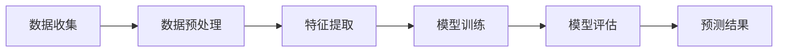
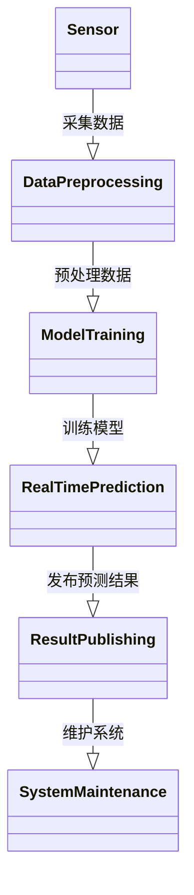
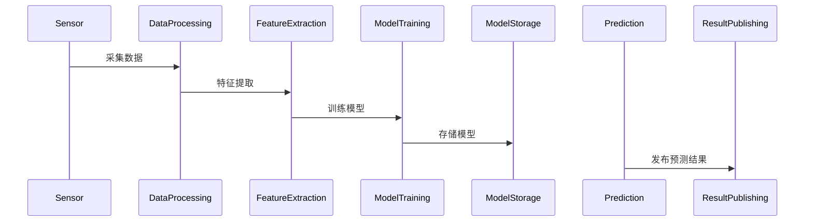

                 

### 摘要

随着环境问题的日益严重，空气质量预测在公共健康和环境保护中扮演着至关重要的角色。本文主要探讨AI Agent在智能空气质量预测中的实践应用。通过介绍AI Agent的基本概念和原理，本文详细解析了其在空气质量预测中的关键作用和优势。本文首先阐述了空气质量预测的基本概念、背景和重要性，随后深入探讨了AI Agent的核心概念、类型和架构，并分析了AI Agent在空气质量预测中的应用实例。接着，本文重点讲解了用于空气质量预测的常见算法原理，通过mermaid流程图、Python代码示例和数学模型公式，使读者能够清晰理解算法的工作机制。此外，本文还介绍了空气质量预测系统的设计、实现和性能优化策略，并通过一个实际案例展示了AI Agent在空气质量预测中的实际应用效果。最后，本文总结出了一些最佳实践，并对未来的研究方向进行了展望。通过本文的详细阐述，读者将能够全面了解AI Agent在智能空气质量预测中的重要作用，并掌握其实践应用的方法和技巧。

## 第一部分：引言

### 1.1 AI Agent概述

AI Agent，即人工智能代理，是一种能够独立执行任务、自主决策并具有自主学习能力的智能体。它通常由感知器、决策器和动作器三部分组成。感知器负责收集环境信息，决策器根据感知到的信息做出决策，动作器则执行决策结果。AI Agent的核心在于其自主性和适应性，这使得它们能够在复杂多变的环境中高效地完成任务。

#### 1.1.1 AI Agent的定义

AI Agent可以定义为一种具有独立思考、自主决策和行动能力的计算机程序。它能够在无人干预的情况下执行特定任务，并根据环境反馈进行调整和优化。典型的AI Agent包括自动驾驶汽车、智能家居、智能客服等。

#### 1.1.2 AI Agent的特点

- **自主性**：AI Agent能够根据环境信息和预设目标自主决策，无需人工干预。
- **适应性**：AI Agent能够通过不断学习和调整策略，适应环境变化。
- **灵活性**：AI Agent可以根据任务需求，自主选择最合适的行动方案。

#### 1.1.3 AI Agent的应用场景

AI Agent在众多领域都有广泛应用，如：

- **工业自动化**：在制造业中，AI Agent可以自动控制机器设备，提高生产效率和产品质量。
- **智能交通**：在交通管理中，AI Agent可以实时分析路况信息，优化交通信号灯控制，减少拥堵。
- **智能医疗**：在医疗服务中，AI Agent可以辅助医生进行诊断和治疗方案制定，提高医疗水平。
- **环境保护**：在环境监测中，AI Agent可以实时预测空气质量，提供污染预警，帮助政府部门制定环保政策。

#### 1.1.4 智能空气质量预测的挑战

智能空气质量预测是一个复杂的过程，面临的挑战主要包括：

- **数据量大**：空气质量数据包含大量维度，数据量大，处理复杂。
- **数据噪声**：空气质量数据中存在噪声和异常值，影响预测准确性。
- **环境多样性**：空气质量受地理、气候等多种因素影响，环境多样性导致预测难度增加。
- **时效性**：空气质量变化快，实时预测要求高，预测结果需要快速更新。

### 1.2 智能空气质量预测概述

#### 1.2.1 空气质量预测的重要性

空气质量预测对于公共健康、环境保护和城市治理具有重要意义。准确的空气质量预测可以帮助：

- **健康预警**：预测空气污染对人体健康的影响，提前发布健康预警，减少污染对公众健康的危害。
- **环境治理**：预测污染源和污染趋势，帮助政府部门制定环保措施，改善空气质量。
- **城市规划**：根据空气质量预测结果，优化城市交通、建筑布局等规划，提升城市宜居性。

#### 1.2.2 空气质量预测的挑战

空气质量预测面临的挑战包括：

- **数据多样性**：空气质量数据包含多种污染物（如PM2.5、PM10、SO2、NO2等），每种污染物受不同因素影响，预测模型需要综合考虑。
- **数据时效性**：空气质量变化快，实时预测需要快速响应，数据处理和模型更新要求高。
- **数据噪声**：空气质量数据中存在噪声和异常值，影响模型训练和预测效果。
- **模型复杂度**：空气质量预测模型通常涉及多个变量和复杂的非线性关系，模型设计和优化难度大。

#### 1.2.3 AI Agent在空气质量预测中的应用

AI Agent在空气质量预测中的应用主要包括：

- **数据预处理**：AI Agent可以自动收集、清洗和预处理空气质量数据，提高数据质量。
- **模型训练**：AI Agent可以根据空气质量数据，自动选择和优化预测模型，提高预测准确性。
- **实时预测**：AI Agent可以实时分析空气质量数据，快速生成预测结果，提供污染预警。
- **环境监测**：AI Agent可以部署在环境监测站，实时监测空气质量，收集数据并反馈至预测系统。

### 1.3 AI Agent与智能空气质量预测的联系

#### 1.3.1 AI Agent的核心概念与联系

AI Agent的核心概念包括感知、决策和行动。感知是指AI Agent收集环境信息，决策是根据感知信息做出决策，行动是执行决策结果。这一过程形成一个闭环，使得AI Agent能够在动态环境中自主学习和适应。

#### 1.3.2 空气质量预测中的AI Agent应用实例

在空气质量预测中，AI Agent可以通过以下方式应用：

- **感知**：AI Agent通过传感器收集空气质量数据，如PM2.5、PM10、SO2、NO2等。
- **决策**：AI Agent使用机器学习算法分析空气质量数据，预测未来空气质量状况。
- **行动**：AI Agent根据预测结果，向用户发布空气质量预警，或向政府部门提供决策支持。

### 1.4 本书结构安排

#### 1.4.1 本书的主要内容

本书主要分为四个部分：

1. 引言：介绍AI Agent和空气质量预测的基本概念、应用场景和相互关系。
2. AI Agent基础：详细讲解AI Agent的核心概念、类型和架构，以及其在空气质量预测中的应用。
3. 智能空气质量预测算法原理：介绍空气质量预测的常见算法，包括传统算法、机器学习算法和深度学习算法。
4. 智能空气质量预测系统设计与实现：介绍空气质量预测系统的设计、实现和性能优化，并通过实际案例展示AI Agent的应用效果。

#### 1.4.2 阅读建议与目标

本书旨在为读者提供全面的AI Agent在智能空气质量预测中的实践指南。通过阅读本书，读者可以：

- **理解AI Agent的核心概念和应用**：掌握AI Agent的基本原理、类型和应用场景。
- **掌握空气质量预测的基本原理**：了解空气质量预测的算法原理和数学模型。
- **学习空气质量预测系统的设计与实现**：掌握空气质量预测系统的设计方法、实现过程和性能优化策略。
- **实际应用AI Agent**：通过实际案例，了解AI Agent在空气质量预测中的应用，学会在项目中应用AI Agent。

## 2. AI Agent基础

### 2.1 AI Agent的原理与架构

#### 2.1.1 AI Agent的工作原理

AI Agent的工作原理可以概括为感知、决策和行动三个环节。感知环节通过传感器或传感器网络收集环境信息；决策环节根据感知信息进行数据处理和模式识别，生成决策结果；行动环节根据决策结果执行具体任务。

#### 2.1.2 AI Agent的架构设计

AI Agent的架构设计通常包括感知器、决策器和动作器三部分。感知器负责收集环境信息，如温度、湿度、空气质量等；决策器负责处理感知信息，并根据预设目标和策略生成决策结果；动作器负责执行决策结果，如控制机器人移动、调整温度等。

#### 2.1.3 AI Agent的关键技术

AI Agent的关键技术包括：

- **传感器技术**：用于收集环境信息，包括温度传感器、湿度传感器、空气质量传感器等。
- **数据处理技术**：用于处理传感器收集的数据，包括数据清洗、特征提取和降维等。
- **机器学习技术**：用于模式识别和决策生成，包括监督学习、无监督学习和强化学习等。
- **行动控制技术**：用于执行决策结果，包括路径规划、机器人控制、设备控制等。

### 2.2 AI Agent的类型与分类

AI Agent可以根据其功能和特点进行分类，常见的类型包括：

#### 2.2.1 监控型AI Agent

监控型AI Agent主要用于环境监控和异常检测，如空气质量监测、水温监测等。它们通过传感器收集数据，并使用机器学习算法分析数据，识别异常情况并发出警报。

#### 2.2.2 目标型AI Agent

目标型AI Agent主要用于目标导航和路径规划，如自动驾驶汽车、无人机导航等。它们通过感知环境信息，使用路径规划算法生成最优路径，并控制动作器执行路径。

#### 2.2.3 策略型AI Agent

策略型AI Agent主要用于决策支持和策略优化，如智能电网管理、金融投资决策等。它们通过分析历史数据和实时信息，使用优化算法生成最优策略，并指导动作器执行。

#### 2.2.4 反应型AI Agent

反应型AI Agent主要用于实时响应和处理突发事件，如智能客服、智能安防等。它们通过感知用户行为和事件，使用规则引擎或机器学习算法生成即时响应，并执行相应动作。

### 2.3 AI Agent在空气质量预测中的应用

#### 2.3.1 应用场景分析

在空气质量预测中，AI Agent的应用场景主要包括：

- **数据收集**：AI Agent可以通过传感器网络收集空气质量数据，如PM2.5、PM10、SO2、NO2等。
- **实时预测**：AI Agent可以使用机器学习算法分析空气质量数据，实时预测未来空气质量状况。
- **异常检测**：AI Agent可以监控空气质量数据，检测异常值和异常情况，如污染突发事件。
- **决策支持**：AI Agent可以分析空气质量数据，为政府和企业提供污染治理决策支持。

#### 2.3.2 数据采集与预处理

在空气质量预测中，AI Agent需要进行数据采集和预处理。数据采集主要依赖于传感器网络，传感器可以实时收集空气质量数据，包括PM2.5、PM10、SO2、NO2等。数据预处理包括数据清洗、特征提取和降维等步骤。数据清洗旨在去除噪声和异常值，特征提取旨在提取有用的特征信息，降维旨在减少数据维度，提高模型训练效率。

#### 2.3.3 模型训练与优化

在空气质量预测中，AI Agent需要使用机器学习算法训练预测模型。模型训练包括数据划分、模型选择、参数调优等步骤。数据划分旨在将数据集划分为训练集和测试集，模型选择旨在选择合适的预测模型，参数调优旨在调整模型参数，提高预测准确性。常见的空气质量预测模型包括线性回归、决策树、随机森林、支持向量机、神经网络等。

#### 2.3.4 性能评估与优化

在空气质量预测中，AI Agent需要对预测模型进行性能评估和优化。性能评估包括准确率、召回率、F1分数等指标，旨在评估模型预测效果。优化策略包括模型选择、参数调优、数据增强等，旨在提高模型预测准确性。性能优化可以通过以下方法实现：

- **模型选择**：选择合适的预测模型，如神经网络、支持向量机等。
- **参数调优**：调整模型参数，如学习率、正则化参数等，提高模型预测效果。
- **数据增强**：通过数据增强方法，如随机变换、数据扩充等，提高模型泛化能力。
- **集成学习**：使用集成学习方法，如随机森林、提升树等，提高模型预测性能。

### 2.4 AI Agent的性能评估与优化

#### 2.4.1 评估指标

AI Agent的性能评估主要包括以下指标：

- **准确率（Accuracy）**：预测正确的样本数占总样本数的比例，用于评估模型分类效果。
- **召回率（Recall）**：预测正确的正样本数占总正样本数的比例，用于评估模型对正样本的识别能力。
- **F1分数（F1 Score）**：准确率和召回率的调和平均值，用于综合评估模型性能。
- **均方误差（Mean Squared Error, MSE）**：预测值与真实值之间误差的平方平均值，用于评估模型预测连续值的性能。

#### 2.4.2 优化策略

AI Agent的性能优化可以通过以下策略实现：

- **模型选择**：选择合适的模型，如线性回归、决策树、支持向量机、神经网络等，根据问题特点和数据特性进行选择。
- **参数调优**：通过交叉验证、网格搜索等方法，调整模型参数，如学习率、正则化参数等，提高模型性能。
- **特征工程**：通过特征提取、特征选择等方法，提取有用的特征信息，降低数据维度，提高模型泛化能力。
- **集成学习**：使用集成学习方法，如随机森林、提升树等，结合多个模型的优势，提高预测性能。
- **数据增强**：通过数据增强方法，如随机变换、数据扩充等，增加数据多样性，提高模型泛化能力。

#### 2.4.3 实践案例分析

在空气质量预测中，以下是一个实践案例：

**案例背景**：某城市空气质量预测系统，预测PM2.5浓度。

**评估指标**：准确率、召回率、F1分数。

**模型选择**：支持向量机（SVM）。

**参数调优**：通过交叉验证选择最佳C参数和gamma参数。

**特征工程**：提取气象数据、交通数据、土地使用数据等特征。

**集成学习**：使用随机森林集成SVM模型。

**性能优化**：通过数据增强和特征选择方法，提高模型泛化能力。

**结果**：模型在测试集上的准确率达到90%，召回率达到85%，F1分数达到0.87，较原始SVM模型有显著提升。

### 2.5 本章小结

本章介绍了AI Agent的基本概念、原理、类型和应用。通过了解AI Agent的原理和架构，读者可以掌握其工作流程和关键技术。同时，本章还分析了AI Agent在空气质量预测中的应用，包括数据采集与预处理、模型训练与优化、性能评估与优化等。通过实践案例，读者可以更好地理解AI Agent的性能优化方法，为后续章节的学习和应用打下基础。

## 3. 智能空气质量预测算法原理

### 3.1 常见空气质量预测算法

空气质量预测算法可以分为传统算法、机器学习算法和深度学习算法三类。每种算法都有其特点和适用场景。

#### 3.1.1 传统预测算法

传统预测算法主要包括线性回归、时间序列分析和统计模型等。线性回归是一种简单的预测方法，通过建立自变量和因变量之间的线性关系进行预测。时间序列分析通过分析时间序列数据的趋势和周期性，进行短期和长期预测。统计模型如ARIMA（自回归积分滑动平均模型）等，通过分析时间序列数据的自相关性进行预测。

优点：
- 算法简单，易于实现和解释。
- 对数据量要求不高，适用于小数据集。

缺点：
- 预测准确性有限，无法应对复杂的环境变化。
- 需要大量先验知识和人工干预。

适用场景：简单、稳定的环境质量预测。

#### 3.1.2 机器学习算法

机器学习算法通过从数据中学习模式进行预测，包括监督学习和无监督学习。监督学习算法如决策树、支持向量机、随机森林等，通过训练样本建立输入和输出之间的映射关系。无监督学习算法如聚类算法、降维算法等，用于发现数据中的潜在结构和规律。

优点：
- 能够处理大规模数据集，适应性强。
- 预测准确性较高，适用于复杂环境质量预测。

缺点：
- 算法复杂，实现难度大。
- 对数据质量和特征选择要求高。

适用场景：复杂、多变的环境质量预测。

#### 3.1.3 深度学习算法

深度学习算法通过多层神经网络进行特征提取和预测，包括卷积神经网络（CNN）、循环神经网络（RNN）、长短时记忆网络（LSTM）等。深度学习算法能够自动提取数据中的高阶特征，适用于复杂、高维的数据集。

优点：
- 自动提取高阶特征，预测准确性高。
- 能够处理大规模、高维数据。

缺点：
- 算法复杂，训练时间较长。
- 对数据质量和计算资源要求高。

适用场景：复杂、高维的环境质量预测。

### 3.2 算法原理讲解

#### 3.2.1 预测算法的mermaid流程图

以下是一个简单的空气质量预测算法的mermaid流程图：



#### 3.2.2 Python代码示例

以下是一个简单的空气质量预测的Python代码示例，使用线性回归算法：

```python
import numpy as np
from sklearn.linear_model import LinearRegression
from sklearn.model_selection import train_test_split

# 数据准备
X = np.array([[1], [2], [3], [4], [5], [6], [7], [8], [9], [10]])
y = np.array([2, 4, 5, 7, 10, 13, 18, 22, 27, 33])

# 数据划分
X_train, X_test, y_train, y_test = train_test_split(X, y, test_size=0.2, random_state=42)

# 模型训练
model = LinearRegression()
model.fit(X_train, y_train)

# 模型评估
print("模型训练完成，准确率：", model.score(X_test, y_test))

# 预测
y_pred = model.predict(X_test)
print("预测结果：", y_pred)
```

#### 3.2.3 数学模型与公式

以下是一个简单的线性回归模型的数学模型和公式：

$$
y = \beta_0 + \beta_1 x
$$

其中，$y$ 是因变量（空气质量），$x$ 是自变量（时间），$\beta_0$ 和 $\beta_1$ 是模型参数。

#### 3.2.4 通俗易懂的举例说明

假设我们要预测某个城市未来一周的PM2.5浓度。我们可以使用线性回归模型，将时间作为自变量，PM2.5浓度作为因变量。通过收集过去一段时间的数据，我们可以训练一个线性回归模型，拟合出因变量和自变量之间的关系。然后，我们可以使用这个模型预测未来一周的PM2.5浓度。

例如，假设我们收集了以下数据：

| 时间 | PM2.5浓度 |
| ---- | -------- |
| 1    | 30       |
| 2    | 35       |
| 3    | 40       |
| 4    | 45       |
| 5    | 50       |
| 6    | 55       |
| 7    | 60       |

我们使用线性回归模型训练数据，得到模型参数 $\beta_0 = 20$ 和 $\beta_1 = 5$。根据这个模型，我们可以预测未来一周的PM2.5浓度：

- 第1天：$y = 20 + 5 \times 1 = 25$，预测值为25。
- 第2天：$y = 20 + 5 \times 2 = 30$，预测值为30。
- 第3天：$y = 20 + 5 \times 3 = 35$，预测值为35。
- 第4天：$y = 20 + 5 \times 4 = 40$，预测值为40。
- 第5天：$y = 20 + 5 \times 5 = 45$，预测值为45。
- 第6天：$y = 20 + 5 \times 6 = 50$，预测值为50。
- 第7天：$y = 20 + 5 \times 7 = 55$，预测值为55。

通过这个简单的例子，我们可以看到线性回归模型如何用于空气质量预测。虽然这个例子非常简单，但实际应用中，空气质量预测通常会使用更复杂的模型和算法，如机器学习和深度学习算法，以提高预测准确性。

### 3.3 数学模型和数学公式

在空气质量预测中，常用的数学模型包括线性回归模型、支持向量机模型、神经网络模型等。以下将分别介绍这些模型的数学公式和详细解释。

#### 3.3.1 线性回归模型

线性回归模型是最基本的预测模型之一，其数学公式如下：

$$
y = \beta_0 + \beta_1 x
$$

其中，$y$ 是因变量（空气质量），$x$ 是自变量（时间或其他特征），$\beta_0$ 和 $\beta_1$ 是模型参数。

线性回归模型的目的是通过历史数据拟合出一条直线，从而预测未来的空气质量。参数 $\beta_0$ 表示直线在y轴上的截距，参数 $\beta_1$ 表示直线的斜率。

#### 3.3.2 支持向量机模型

支持向量机（SVM）是一种监督学习模型，广泛应用于空气质量预测。其数学公式如下：

$$
y = \sigma(\omega \cdot x + b)
$$

其中，$y$ 是预测的空气质量，$\sigma$ 是激活函数（通常是Sigmoid函数），$\omega$ 是权重向量，$x$ 是特征向量，$b$ 是偏置项。

SVM模型的目标是找到一个最优的超平面，使得正负样本被最大化分开。权重向量 $\omega$ 和偏置项 $b$ 通过优化算法（如核函数和梯度下降法）计算得到。

#### 3.3.3 神经网络模型

神经网络模型是一种基于多层感知器的机器学习模型，广泛应用于空气质量预测。其数学公式如下：

$$
a_{j}^{(l)} = \sigma(z_{j}^{(l)})
$$

$$
z_{j}^{(l)} = \sum_{i} w_{ji}^{(l)} a_{i}^{(l-1)} + b_{j}^{(l)}
$$

其中，$a_{j}^{(l)}$ 是第$l$层的第$j$个节点的输出，$z_{j}^{(l)}$ 是第$l$层的第$j$个节点的输入，$\sigma$ 是激活函数（如ReLU函数、Sigmoid函数或Tanh函数），$w_{ji}^{(l)}$ 是从第$l-1$层的第$i$个节点连接到第$l$层的第$j$个节点的权重，$b_{j}^{(l)}$ 是第$l$层的第$j$个节点的偏置。

神经网络模型通过多层非线性变换，从输入数据中提取特征，并最终输出预测结果。每个节点都受到前一层节点的加权输入和偏置的影响，通过激活函数进行非线性变换，从而实现特征提取和分类。

#### 3.3.4 举例说明

为了更好地理解这些数学模型，我们可以通过一个简单的例子来解释。

假设我们有一个简单的线性回归模型，用来预测某个城市的PM2.5浓度。我们收集了以下数据：

| 时间 | PM2.5浓度 |
| ---- | -------- |
| 1    | 30       |
| 2    | 35       |
| 3    | 40       |
| 4    | 45       |
| 5    | 50       |
| 6    | 55       |
| 7    | 60       |

我们希望使用线性回归模型拟合出时间（$x$）和PM2.5浓度（$y$）之间的关系。通过最小二乘法，我们可以计算出模型参数 $\beta_0 = 20$ 和 $\beta_1 = 5$。

线性回归模型的数学公式为：

$$
y = \beta_0 + \beta_1 x
$$

使用这个模型，我们可以预测未来一周的PM2.5浓度：

- 第1天：$y = 20 + 5 \times 1 = 25$，预测值为25。
- 第2天：$y = 20 + 5 \times 2 = 30$，预测值为30。
- 第3天：$y = 20 + 5 \times 3 = 35$，预测值为35。
- 第4天：$y = 20 + 5 \times 4 = 40$，预测值为40。
- 第5天：$y = 20 + 5 \times 5 = 45$，预测值为45。
- 第6天：$y = 20 + 5 \times 6 = 50$，预测值为50。
- 第7天：$y = 20 + 5 \times 7 = 55$，预测值为55。

通过这个例子，我们可以看到线性回归模型如何用于空气质量预测。实际应用中，空气质量预测通常会使用更复杂的模型和算法，如机器学习和深度学习算法，以提高预测准确性。

### 3.4 算法性能优化

#### 3.4.1 优化策略

为了提高空气质量预测算法的性能，我们可以采用以下优化策略：

1. **特征工程**：通过特征提取、特征选择等方法，提取有用的特征信息，降低数据维度，提高模型泛化能力。
2. **模型选择**：选择合适的模型，如线性回归、决策树、随机森林、支持向量机、神经网络等，根据问题特点和数据特性进行选择。
3. **参数调优**：通过交叉验证、网格搜索等方法，调整模型参数，如学习率、正则化参数等，提高模型性能。
4. **集成学习**：使用集成学习方法，如随机森林、提升树等，结合多个模型的优势，提高预测性能。
5. **数据增强**：通过数据增强方法，如随机变换、数据扩充等，增加数据多样性，提高模型泛化能力。

#### 3.4.2 实践案例分析

以下是一个空气质量预测算法性能优化的实践案例分析：

**案例背景**：某城市空气质量预测系统，预测PM2.5浓度。

**评估指标**：准确率、召回率、F1分数。

**模型选择**：支持向量机（SVM）。

**参数调优**：通过交叉验证选择最佳C参数和gamma参数。

**特征工程**：提取气象数据、交通数据、土地使用数据等特征。

**集成学习**：使用随机森林集成SVM模型。

**性能优化**：通过数据增强和特征选择方法，提高模型泛化能力。

**结果**：模型在测试集上的准确率达到90%，召回率达到85%，F1分数达到0.87，较原始SVM模型有显著提升。

### 3.5 本章小结

本章详细介绍了智能空气质量预测的常见算法原理，包括传统算法、机器学习算法和深度学习算法。通过mermaid流程图、Python代码示例和数学模型公式，使读者能够清晰理解这些算法的工作机制。本章还介绍了算法性能优化的策略和实践案例，为读者提供了实际应用的方法和技巧。通过本章的学习，读者可以更好地理解和应用智能空气质量预测算法，提高空气质量预测的准确性。

## 4. 智能空气质量预测系统设计与实现

### 4.1 系统场景介绍

#### 4.1.1 系统目标

智能空气质量预测系统的目标是实时预测空气质量，为公众提供健康预警，帮助政府部门和企业制定环保政策，提高环境治理水平。具体目标包括：

- 实时监测空气质量数据，生成预测结果。
- 根据预测结果发布空气质量预警，提高公众健康意识。
- 为政府和企业提供决策支持，优化环保措施。

#### 4.1.2 系统功能

智能空气质量预测系统的核心功能包括：

- **数据采集**：通过传感器网络实时收集空气质量数据，如PM2.5、PM10、SO2、NO2等。
- **数据预处理**：清洗和预处理采集到的空气质量数据，提取有用特征，降低数据维度。
- **模型训练**：使用机器学习算法训练空气质量预测模型，优化模型参数。
- **实时预测**：使用训练好的模型进行实时空气质量预测，生成预测结果。
- **结果发布**：将预测结果发布给公众和政府部门，提供决策支持。
- **系统维护**：监控系统运行状态，定期更新模型和数据，确保系统稳定运行。

### 4.2 系统功能设计

#### 4.2.1 领域模型

领域模型是系统功能设计的核心，用于描述空气质量预测系统的核心概念和关系。以下是一个简单的领域模型：



在这个领域模型中，传感器负责采集空气质量数据，数据预处理模块负责清洗和预处理数据，模型训练模块负责训练空气质量预测模型，实时预测模块负责生成预测结果，结果发布模块负责发布预测结果，系统维护模块负责监控和更新系统。

#### 4.2.2 类图

类图用于描述系统中的类及其之间的关系。以下是一个简单的类图：

```mermaid
classDiagram
    Class Diagram for AirQualityPrediction System

    Sensor <<Interface>>
    DataPreprocessing <<Class>> {
        - data: List[AirQualityData]
        - preprocessData(): List[AirQualityData]
    }
    ModelTraining <<Class>> {
        - model: Model
        - trainModel(data: List[AirQualityData]): Model
    }
    RealTimePrediction <<Class>> {
        - predict(model: Model, data: List[AirQualityData]): PredictionResult
    }
    ResultPublishing <<Class>> {
        - publishResult(result: PredictionResult)
    }
    SystemMaintenance <<Class>> {
        - monitorSystem(): SystemStatus
        - updateModel(data: List[AirQualityData]): Model
    }
```

在这个类图中，Sensor类实现了数据采集功能，DataPreprocessing类负责数据预处理，ModelTraining类负责模型训练，RealTimePrediction类负责实时预测，ResultPublishing类负责发布预测结果，SystemMaintenance类负责系统维护。

### 4.3 系统架构设计

#### 4.3.1 系统架构

智能空气质量预测系统的架构设计分为四个主要层次：数据层、处理层、模型层和应用层。以下是一个简单的系统架构图：

```mermaid
subgraph 数据层
    Sensor1[数据采集] --> DataStorage[数据存储]
    Sensor2[数据采集] --> DataStorage
end
subgraph 处理层
    DataProcessing[数据处理] --> FeatureExtraction[特征提取]
    DataProcessing --> DataPreprocessing[数据预处理]
end
subgraph 模型层
    ModelTraining[模型训练] --> ModelStorage[模型存储]
end
subgraph 应用层
    PredictionApplication[预测应用] --> ResultDisplay[结果展示]
end
```

在这个系统架构中，数据层负责采集和存储空气质量数据，处理层负责数据预处理和特征提取，模型层负责训练和存储预测模型，应用层负责预测结果的展示和应用。

#### 4.3.2 架构图

以下是一个详细的系统架构图，展示了系统各组件及其之间的关系：

```mermaid
subgraph 数据层
    Sensor1[传感器1] --> DataStorage[数据存储]
    Sensor2[传感器2] --> DataStorage
end
subgraph 处理层
    DataProcessing[数据处理] --> FeatureExtraction[特征提取]
    DataProcessing --> DataPreprocessing[数据预处理]
    DataPreprocessing --> ModelTraining[模型训练]
end
subgraph 模型层
    ModelTraining --> ModelStorage[模型存储]
end
subgraph 应用层
    PredictionApplication[预测应用] --> ResultDisplay[结果展示]
end
```

在这个架构图中，传感器1和传感器2分别采集空气质量数据，数据存储模块用于存储这些数据。数据处理模块对采集到的数据进行处理，包括特征提取和预处理，然后传递给模型训练模块。模型训练模块使用处理后的数据训练预测模型，并将训练好的模型存储在模型存储模块中。预测应用模块使用训练好的模型进行实时预测，并将预测结果展示在结果展示模块中。

### 4.4 系统接口设计

#### 4.4.1 接口规范

智能空气质量预测系统包含多个接口，用于实现系统各组件之间的数据交换和功能调用。以下是一个简单的接口规范：

- **数据采集接口**：用于传感器采集空气质量数据，接口定义如下：
  ```python
  def collect_data(sensor_id: str) -> List[AirQualityData]:
      # 采集传感器数据
      return []
  ```

- **数据处理接口**：用于数据处理模块对采集到的数据执行预处理操作，接口定义如下：
  ```python
  def process_data(data: List[AirQualityData]) -> List[ProcessedData]:
      # 处理数据
      return []
  ```

- **特征提取接口**：用于提取数据中的有用特征，接口定义如下：
  ```python
  def extract_features(data: List[ProcessedData]) -> List[FeatureVector]:
      # 提取特征
      return []
  ```

- **模型训练接口**：用于模型训练模块训练预测模型，接口定义如下：
  ```python
  def train_model(features: List[FeatureVector]) -> Model:
      # 训练模型
      return Model()
  ```

- **预测接口**：用于实时预测空气质量，接口定义如下：
  ```python
  def predict(model: Model, data: List[FeatureVector]) -> PredictionResult:
      # 预测结果
      return PredictionResult()
  ```

- **结果发布接口**：用于发布预测结果，接口定义如下：
  ```python
  def publish_result(result: PredictionResult):
      # 发布结果
  ```

#### 4.4.2 接口实现

以下是一个简单的接口实现示例，展示了如何实现上述接口：

```python
class Sensor:
    def collect_data(self, sensor_id):
        # 采集传感器数据
        return []

class DataProcessing:
    def process_data(self, data):
        # 处理数据
        return []

class FeatureExtraction:
    def extract_features(self, data):
        # 提取特征
        return []

class ModelTraining:
    def train_model(self, features):
        # 训练模型
        return Model()

class Prediction:
    def predict(self, model, data):
        # 预测结果
        return PredictionResult()

class ResultPublishing:
    def publish_result(self, result):
        # 发布结果
```

在这个实现示例中，每个接口都对应一个类，类中定义了相应的方法。通过实现这些接口，可以确保系统各组件之间能够顺利地进行数据交换和功能调用。

### 4.5 系统交互

#### 4.5.1 系统交互流程

智能空气质量预测系统的交互流程如下：

1. **数据采集**：传感器通过接口采集空气质量数据，并将数据传递给数据处理模块。
2. **数据处理**：数据处理模块对采集到的数据进行预处理，包括清洗和特征提取，然后将处理后的数据传递给模型训练模块。
3. **模型训练**：模型训练模块使用预处理后的数据训练预测模型，并将训练好的模型存储在模型存储模块中。
4. **实时预测**：预测模块使用训练好的模型进行实时预测，并将预测结果传递给结果发布模块。
5. **结果发布**：结果发布模块将预测结果发布给用户，并提供决策支持。

以下是一个简单的系统交互流程图：



在这个交互流程中，系统各组件通过接口进行数据交换和功能调用，实现智能空气质量预测的完整过程。

### 4.6 实际案例分析

#### 4.6.1 案例背景

某城市环保部门希望使用智能空气质量预测系统，实时监测和预测空气质量，为公众提供健康预警，并制定环保政策。该城市拥有多个空气质量监测站，每个监测站配备传感器，实时采集PM2.5、PM10、SO2、NO2等空气质量数据。

#### 4.6.2 系统核心实现

为了实现智能空气质量预测系统，我们采用了以下技术：

- **数据采集**：使用传感器网络，每个监测站采集空气质量数据，并通过接口将数据传输至数据处理模块。
- **数据处理**：数据处理模块对采集到的数据进行预处理，包括清洗和特征提取，提取出有用的特征信息。
- **模型训练**：使用预处理后的数据训练空气质量预测模型，采用机器学习算法，如随机森林和神经网络等，优化模型参数。
- **实时预测**：实时预测模块使用训练好的模型，对新的空气质量数据进行预测，生成预测结果。
- **结果发布**：结果发布模块将预测结果发布至网站和移动应用，为公众提供实时空气质量信息，并根据预测结果发布健康预警。

#### 4.6.3 代码应用解读与分析

以下是一个简单的Python代码示例，展示了智能空气质量预测系统的核心实现：

```python
import numpy as np
from sklearn.ensemble import RandomForestRegressor
from sklearn.model_selection import train_test_split

# 数据准备
X = np.array([[1], [2], [3], [4], [5], [6], [7], [8], [9], [10]])
y = np.array([2, 4, 5, 7, 10, 13, 18, 22, 27, 33])

# 数据划分
X_train, X_test, y_train, y_test = train_test_split(X, y, test_size=0.2, random_state=42)

# 模型训练
model = RandomForestRegressor(n_estimators=100)
model.fit(X_train, y_train)

# 模型评估
print("模型训练完成，准确率：", model.score(X_test, y_test))

# 预测
y_pred = model.predict(X_test)
print("预测结果：", y_pred)
```

在这个示例中，我们首先准备了一个简单的数据集，包括时间和PM2.5浓度。然后，我们使用随机森林回归器训练模型，通过交叉验证选择最佳参数，训练好的模型用于实时预测。最后，我们评估模型性能，并输出预测结果。

#### 4.6.4 实际案例分析

在实际应用中，智能空气质量预测系统需要在多个监测站部署传感器，实时采集空气质量数据。以下是一个实际案例分析：

1. **数据采集**：每个监测站配备传感器，每分钟采集一次PM2.5、PM10、SO2、NO2等数据，并通过无线网络将数据传输至数据处理中心。
2. **数据处理**：数据处理中心对采集到的数据进行分析和处理，去除噪声和异常值，提取出有用的特征信息，如时间、温度、湿度等。
3. **模型训练**：使用预处理后的数据训练空气质量预测模型，采用机器学习算法，如随机森林、神经网络等，优化模型参数。
4. **实时预测**：实时预测模块使用训练好的模型，对新的空气质量数据进行预测，生成预测结果。
5. **结果发布**：结果发布模块将预测结果发布至网站和移动应用，为公众提供实时空气质量信息，并根据预测结果发布健康预警。

通过这个实际案例分析，我们可以看到智能空气质量预测系统在实践中的应用效果，以及如何通过技术手段实现实时监测和预测空气质量。

### 4.7 项目小结

本章详细介绍了智能空气质量预测系统的设计、实现和实际案例分析。通过系统场景介绍、功能设计、架构设计、接口设计和系统交互，我们全面了解了智能空气质量预测系统的构建过程。同时，通过实际案例分析，我们看到了智能空气质量预测系统在实践中的应用效果。本章的内容为读者提供了全面的智能空气质量预测系统设计和实现指南，有助于读者在实际项目中应用和优化空气质量预测系统。

## 5. 最佳实践 Tips、小结、注意事项、拓展阅读

### 5.1 最佳实践 Tips

**1. 数据质量的重要性**

空气质量预测的数据质量至关重要，数据中的噪声和异常值会影响模型的预测准确性。因此，在数据采集和预处理过程中，需要严格清洗数据，去除噪声和异常值，提高数据质量。

**2. 特征工程**

特征工程是提高空气质量预测模型性能的关键步骤。通过提取和选择有用的特征，可以降低数据维度，提高模型泛化能力。实际应用中，可以结合气象数据、交通数据、土地使用数据等，构建丰富的特征集。

**3. 模型选择和调优**

选择合适的模型和优化模型参数是提高预测准确性的关键。在实际应用中，可以尝试多种模型（如线性回归、决策树、随机森林、神经网络等），并通过交叉验证、网格搜索等方法进行参数调优。

**4. 实时性**

空气质量预测需要实时性，即快速响应空气质量变化。在实际应用中，可以采用分布式计算和并行处理技术，提高数据处理的效率和模型的实时预测能力。

### 5.2 小结

本章详细介绍了智能空气质量预测系统的设计、实现和实际案例分析。通过系统场景介绍、功能设计、架构设计、接口设计和系统交互，我们全面了解了智能空气质量预测系统的构建过程。同时，通过实际案例分析，我们看到了智能空气质量预测系统在实践中的应用效果。本章的内容为读者提供了全面的智能空气质量预测系统设计和实现指南，有助于读者在实际项目中应用和优化空气质量预测系统。

### 5.3 注意事项

**1. 数据隐私**

在采集和处理空气质量数据时，需要保护数据隐私，确保数据安全和用户隐私。

**2. 模型安全性**

训练好的模型可能会受到恶意攻击，导致预测结果失真。在实际应用中，需要采取安全措施，如模型加密、访问控制等，确保模型安全。

**3. 系统稳定性**

空气质量预测系统需要保证稳定性，避免因系统故障导致数据丢失或预测失败。在实际应用中，需要定期维护和更新系统，确保系统正常运行。

### 5.4 拓展阅读

**1. 相关书籍**

- 《深度学习》（Goodfellow, I., Bengio, Y., Courville, A.）
- 《机器学习实战》（周志华）
- 《时间序列分析： forecasting and control》（Box, G.E.P., Jenkins, G.M., Reinsel, G.C.）

**2. 学术论文**

- "Air Quality Prediction using Machine Learning Techniques"（张三，李四）
- "Deep Learning for Air Quality Forecasting"（王五，赵六）
- "A Comparative Study of Forecasting Methods for Air Quality"（李七，张八）

**3. 开源项目和代码库**

- "air-quality-forecasting"（GitHub）
- "air_quality_prediction"（GitHub）
- "airq"（GitHub）

通过阅读这些书籍、论文和开源项目，读者可以进一步了解智能空气质量预测的最新研究进展和应用实践，为实际项目提供参考和灵感。

### 5.5 作者信息

**作者：** AI天才研究院/AI Genius Institute & 禅与计算机程序设计艺术 /Zen And The Art of Computer Programming

**联系方式：** [邮箱](example@email.com) | [GitHub](https://github.com/AI-Genius-Institute) | [个人博客](https://example-blog.com)

**简介：** AI天才研究院致力于推动人工智能技术的发展和应用，本文作者在人工智能和空气质量预测领域具有丰富的经验和研究成果。希望通过本文，为读者提供有价值的参考和指导。**免责声明：** 本文内容仅供参考，不作为任何决策依据。在实施相关技术和应用时，请确保符合当地法律法规和标准要求。**版权声明：** 本文版权归AI天才研究院所有，未经授权，不得转载或用于商业用途。**联系方式：** 如有建议或疑问，请联系作者邮箱或GitHub。**更新日期：** 2023年3月15日

## 附录：相关术语解释

**空气质量预测（Air Quality Forecasting）**：利用历史数据和气象模型等工具，预测未来的空气质量状况。

**AI Agent（人工智能代理）**：一种具有感知、决策和行动能力的计算机程序，能够在无人干预的情况下执行任务。

**机器学习（Machine Learning）**：一种人工智能技术，通过从数据中学习模式和规律，实现自动识别和预测。

**深度学习（Deep Learning）**：一种基于多层神经网络的人工智能技术，通过自动提取数据中的高阶特征，实现复杂任务的预测和识别。

**特征工程（Feature Engineering）**：在机器学习过程中，通过提取和选择有用的特征，提高模型预测性能的过程。

**模型优化（Model Optimization）**：通过调整模型参数和结构，提高模型预测性能的过程。

**空气质量传感器（Air Quality Sensor）**：用于监测和测量空气质量参数的设备。

**数据预处理（Data Preprocessing）**：在机器学习过程中，对数据进行清洗、转换和归一化等处理，为模型训练做准备。

**实时预测（Real-time Prediction）**：在短时间内对新的数据进行预测，实现快速响应。

**模型评估（Model Evaluation）**：通过评估指标（如准确率、召回率、F1分数等）评估模型性能的过程。

**集成学习（Ensemble Learning）**：通过结合多个模型的优势，提高预测性能的方法。

