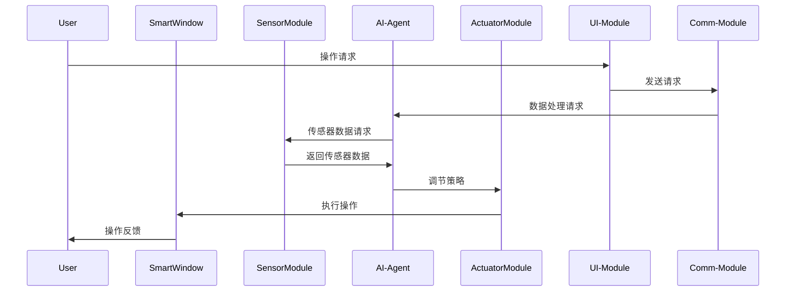

                 

### # AI Agent在智能窗台中的室内植物照料

> 关键词：人工智能、智能窗台、室内植物照料、AI Agent、环境传感器、机器学习

> 摘要：随着智能家居的快速发展，智能窗台成为了提升居住舒适度和环保意识的创新产品。AI Agent在智能窗台中的室内植物照料功能，利用先进的人工智能技术和环境传感器，能够实现对植物生长环境的精确监控与智能调节，为用户提供更加便捷和高效的植物照料方案。本文将探讨AI Agent在智能窗台中的室内植物照料应用，分析其核心技术原理、系统架构设计以及实际应用案例，旨在为相关领域的研究和实践提供参考。

### 引言

智能窗台作为智能家居的重要组成部分，正逐渐融入人们的日常生活。传统的室内植物照料依赖于人工干预，不仅耗时耗力，而且往往难以保证植物的健康成长。随着人工智能技术的迅猛发展，AI Agent应运而生，成为智能窗台室内植物照料的新宠。AI Agent通过整合环境传感器和机器学习算法，能够实时监测植物生长环境，自动调节光照、湿度、温度等关键因素，实现精准、高效的植物照料。

本文将从以下几个方面展开讨论：

1. **AI Agent的定义与基本概念**：介绍AI Agent的定义、基本工作原理及其在智能家居中的重要性。
2. **室内植物照料面临的挑战**：分析现有植物照料方式存在的问题，探讨AI Agent如何解决这些问题。
3. **智能窗台技术介绍**：介绍智能窗台的基本原理及其与AI Agent的整合方式。
4. **系统架构与设计**：详细阐述智能窗台室内植物照料系统的架构设计，包括环境传感器、AI Agent、用户界面等关键模块。
5. **项目实战**：通过具体案例展示AI Agent在智能窗台中的实际应用，解析其实现过程和关键技术。
6. **最佳实践与总结**：总结AI Agent在智能窗台室内植物照料中的应用经验，提出未来发展方向和改进建议。

### AI Agent的定义与基本概念

AI Agent，即人工智能代理，是指能够独立执行任务、与环境进行交互并做出决策的智能实体。AI Agent的基本工作原理包括感知、决策和执行三个环节：

1. **感知**：AI Agent通过传感器或输入设备收集环境信息，如光照强度、温度、湿度等，这些数据用于评估植物的生长状态。
2. **决策**：基于感知到的数据和预设的决策模型，AI Agent分析植物的需求，并生成相应的调节策略。
3. **执行**：AI Agent通过执行模块，如电机、水泵等，自动调整植物生长环境，以满足植物的生长需求。

在智能家居领域，AI Agent的应用范围广泛，包括智能安防、智能照明、智能温控等。智能窗台作为智能家居的一个创新应用，将AI Agent的功能扩展到了室内植物照料，极大地提升了植物照料的效率和智能化水平。

#### AI Agent的组成和功能模块

AI Agent通常由以下几个功能模块组成：

1. **感知模块**：负责收集环境数据，如温度、湿度、光照强度、土壤水分等。这些数据是AI Agent做出准确决策的基础。
2. **决策模块**：包括数据预处理、特征提取、机器学习模型训练和决策逻辑等。决策模块通过分析感知模块收集到的数据，生成调节植物生长环境的策略。
3. **执行模块**：负责执行决策模块生成的调节策略，如调整窗帘位置以控制光照、控制水泵和喷雾装置以调节湿度等。
4. **通信模块**：负责与外部设备进行通信，如与智能窗台的中央控制系统进行数据交换，或者通过Wi-Fi/蓝牙与用户的移动设备进行交互。

#### AI Agent在智能家居中的应用

AI Agent在智能家居中的应用具有以下几个显著特点：

1. **自动化与智能化**：AI Agent能够根据环境数据和预设的规则自动执行任务，减少人工干预，提高效率。
2. **自适应与自学习**：AI Agent可以通过机器学习算法不断优化决策模型，提高植物照料的准确性和适应性。
3. **多设备集成**：AI Agent可以与其他智能家居设备集成，实现跨设备的联动控制，提供更加全面和便捷的智能家居体验。

通过上述分析，我们可以看到，AI Agent在智能窗台中的室内植物照料具有强大的功能优势和广阔的应用前景。接下来，我们将进一步探讨室内植物照料面临的主要挑战，以及AI Agent如何应对这些挑战。

### 室内植物照料面临的挑战

室内植物照料虽然看似简单，但实际上面临诸多挑战。首先，植物生长需要适宜的光照、温度和湿度等环境条件，这些因素的变化对植物的生长状态有着直接的影响。然而，传统的人工照料方式往往难以实时监测和调节这些关键环境因素，导致植物生长不良甚至死亡。

#### 环境监测的困难

室内植物的生长环境是一个复杂的动态系统，环境因素的变化是频繁且难以预测的。例如，光照强度会因天气变化而波动，温度和湿度也会受到室内外温差、通风等因素的影响。传统的人工监测方式依赖于定时巡视和手动记录，不仅耗时费力，而且难以实现实时监控。

#### 照料操作的复杂性

植物照料需要根据不同的植物种类和生长阶段，进行不同的光照、水分和营养补充。例如，一些植物需要较多的光照和水分，而另一些则需要较为干燥的环境。人工照料时，如何精确地控制这些因素，以达到最佳的生长效果，是一项非常复杂的任务。

#### 精准调节的难度

即使能够实时监测环境因素，如何精准地调节这些因素也是一大难题。例如，调节光照强度时，需要精确控制窗帘的开合角度，以避免过度或不足的光照；调节湿度时，需要控制水泵和喷雾装置的工作频率和时长，以保证土壤的湿度在适宜范围内。这些调节操作需要高度的精确度和自动化程度，而传统的人工干预方式很难达到。

#### 数据处理的复杂性

植物的生长状态不仅受到环境因素的影响，还受到植物自身生理特征的影响。例如，植物的健康状况、根系发育情况、叶片的色泽等都会对生长状态产生影响。这些复杂的数据需要通过先进的分析技术和算法进行处理，才能为AI Agent提供准确的决策依据。

综上所述，室内植物照料面临的主要挑战包括环境监测的困难、照料操作的复杂性、精准调节的难度以及数据处理的复杂性。这些挑战限制了传统照料方式的效率和效果。AI Agent的引入，为解决这些问题提供了新的思路和方法。接下来，我们将探讨AI Agent如何通过其独特的功能和优势，应对这些挑战，实现智能、高效的室内植物照料。

### AI Agent在解决室内植物照料挑战中的应用

AI Agent通过其先进的技术和智能算法，在解决室内植物照料面临的挑战方面展现出了巨大的潜力。以下是AI Agent如何利用其核心技术优势，应对这些挑战的具体分析。

#### 实时监测与数据采集

AI Agent的核心优势之一在于其能够实现实时监测与数据采集。通过配备多种环境传感器，如光照传感器、温度传感器、湿度传感器和土壤水分传感器，AI Agent可以全天候地收集植物生长环境的数据。这些数据包括光照强度、温度、湿度、土壤水分含量等，通过无线传输技术实时发送到AI Agent的决策模块。

实时监测能够确保AI Agent及时获取植物生长环境的变化信息，从而做出迅速的反应和调整。例如，当光照强度突然变化时，AI Agent可以立即调整窗帘的开合角度，以控制光照强度，避免对植物造成不利影响。

#### 数据处理与智能分析

AI Agent的另一个关键优势在于其强大的数据处理和智能分析能力。通过收集到的环境数据，AI Agent利用机器学习算法对数据进行分析和处理，从中提取出有用的特征信息，并生成植物生长状态的评估结果。

机器学习算法能够从大量的历史数据中学习，识别出植物生长的规律和趋势。例如，AI Agent可以通过分析光照、温度、湿度等环境因素对植物生长的影响，建立相应的模型，预测植物在未来的生长状态。这种智能分析能力使得AI Agent能够提前发现问题，并及时采取相应的调节措施，确保植物的健康成长。

#### 自动调节与智能化控制

基于实时监测和智能分析的结果，AI Agent能够自动调节植物生长环境，实现智能化控制。通过执行模块，如电机、水泵、喷雾装置等，AI Agent可以自动调整光照、湿度、温度等关键因素，以满足植物的生长需求。

例如，当土壤水分传感器检测到土壤干燥时，AI Agent可以自动启动水泵进行浇水；当光照强度过高时，AI Agent可以调整窗帘位置，减少光照强度。这种自动调节功能不仅提高了植物照料的精确度和效率，还减少了人工干预的需要，降低了照料成本。

#### 跨设备集成与联动控制

AI Agent的另一个优势在于其能够与其他智能家居设备进行集成，实现跨设备的联动控制。通过Wi-Fi、蓝牙等无线通信技术，AI Agent可以与智能窗台、智能灯光、智能温控系统等设备进行数据交换和协同工作，提供更加全面和智能的家居体验。

例如，当AI Agent检测到植物需要更多的光照时，可以通知智能灯光系统自动增强室内光照；当温度过高时，AI Agent可以与智能温控系统联动，降低室内温度，确保植物的生长环境始终处于最佳状态。这种跨设备集成与联动控制不仅提升了植物照料的智能化水平，还为用户提供了更加便捷和舒适的生活体验。

#### 自适应与自学习

AI Agent还具备自适应与自学习的能力。通过不断收集植物生长环境的数据，AI Agent能够逐步优化其决策模型，提高植物照料的准确性和适应性。例如，AI Agent可以通过不断调整光照、湿度、温度等调节策略，找到最适合植物生长的参数组合，从而实现最佳的照料效果。

此外，AI Agent还可以通过用户反馈和历史数据，不断学习和改进其决策模型。例如，当用户对植物照料的结果表示满意时，AI Agent可以将其成功经验纳入模型，提高未来的决策准确性；当用户对某些调节策略提出异议时，AI Agent可以重新评估和优化这些策略，确保植物得到最佳的照料。

综上所述，AI Agent在解决室内植物照料面临的挑战方面具有显著的优势。通过实时监测、数据处理、自动调节、跨设备集成和自适应学习等技术，AI Agent能够实现智能、高效的室内植物照料，为用户带来更加便捷和舒适的生活体验。

### 智能窗台技术介绍

智能窗台作为现代智能家居的重要组成部分，集成了多种先进的技术，如环境传感器、AI Agent和无线通信技术。这些技术共同构成了智能窗台的核心功能，使其能够实现对室内植物生长环境的精准监控和智能调节。

#### 智能窗台的定义与工作原理

智能窗台是一种具备智能调控功能的窗户系统，通过集成传感器、执行器和控制单元，能够根据室内外环境的变化自动调节窗户的开合角度、光照、通风等参数。其核心目的是为室内植物提供一个理想的生长环境，同时提升居住的舒适度和能源效率。

智能窗台的工作原理主要包括以下几个环节：

1. **感知环节**：智能窗台配备多种环境传感器，如光照传感器、温度传感器、湿度传感器等，用于实时监测室内外的环境参数。
2. **数据处理环节**：感知到的数据通过无线通信技术传输到中央控制单元，由AI Agent进行数据处理和分析。
3. **决策与执行环节**：AI Agent根据分析结果生成调节策略，并通过控制单元驱动执行器（如电机、水泵、喷雾装置等）自动调整窗户的状态。

#### 环境传感器的作用

环境传感器是智能窗台的核心组件，用于实时监测植物生长环境的关键参数。以下是几种常见的环境传感器及其作用：

1. **光照传感器**：用于测量光照强度，通过调整窗帘的开合角度，控制室内光照，满足植物对光照的需求。
2. **温度传感器**：用于测量室内外温度，通过与智能温控系统联动，确保室内温度始终保持在植物适宜的范围内。
3. **湿度传感器**：用于测量室内湿度，通过与水泵和喷雾装置联动，调节土壤湿度，满足植物对水分的需求。
4. **土壤水分传感器**：用于测量土壤水分含量，通过与水泵联动，自动浇水，防止植物因缺水而枯萎。

#### AI Agent在智能窗台中的作用

AI Agent在智能窗台中发挥着至关重要的作用。通过整合感知数据和智能算法，AI Agent能够实时分析植物的生长状态和环境变化，生成最优的调节策略。具体来说，AI Agent的作用包括：

1. **环境数据监测与分析**：AI Agent实时监测环境传感器的数据，分析光照、温度、湿度等参数的变化趋势，评估植物的生长环境。
2. **决策与策略生成**：基于监测数据和分析结果，AI Agent生成最优的调节策略，指导执行器进行相应操作，如调整光照、通风和浇水等。
3. **自适应与自学习**：AI Agent通过不断学习和优化决策模型，提高植物照料的准确性和适应性，实现更智能的植物照料。

#### 智能窗台的优势

智能窗台通过集成环境传感器、AI Agent和无线通信技术，为室内植物照料带来了诸多优势：

1. **精准调控**：智能窗台能够实时监测植物生长环境，通过AI Agent生成最优调节策略，实现精准调控，确保植物得到最佳的生长条件。
2. **节能环保**：通过智能调节窗户的开合角度和通风，智能窗台能够有效减少室内外温差，降低空调和暖气的使用频率，实现节能环保。
3. **便捷操作**：用户可以通过智能手机或智能语音助手等设备远程控制智能窗台，实现一键式操作，大大简化了植物照料的过程。
4. **跨设备集成**：智能窗台能够与智能家居中的其他设备进行集成，实现跨设备的联动控制，提供更加全面和智能的家居体验。

综上所述，智能窗台技术通过整合环境传感器、AI Agent和无线通信技术，为室内植物照料提供了精准、节能、便捷的解决方案。下一节将详细讨论智能窗台室内植物照料系统的架构设计和实现细节。

### 系统架构与设计

智能窗台室内植物照料系统的设计需要综合考虑硬件、软件和用户交互等多个方面，以确保系统的整体性能和用户体验。以下是系统架构与设计的详细分析。

#### 系统概述

智能窗台室内植物照料系统主要包括以下几个核心模块：

1. **环境传感器模块**：用于实时监测室内外的环境参数，如光照强度、温度、湿度、土壤水分等。
2. **AI Agent模块**：负责分析传感器数据，生成植物生长环境的调节策略。
3. **执行器模块**：包括窗帘电机、水泵、喷雾装置等，用于执行AI Agent生成的调节策略。
4. **用户界面模块**：提供用户操作界面，用户可以通过手机应用或智能语音助手与系统进行交互。
5. **通信模块**：负责数据传输和设备间的通信，确保系统各个模块之间能够高效协同工作。

#### 系统功能模块

1. **环境传感器模块**：该模块由多种传感器组成，包括光照传感器、温度传感器、湿度传感器和土壤水分传感器。这些传感器通过无线通信技术将实时监测到的数据发送到AI Agent模块。
   
2. **AI Agent模块**：AI Agent模块是系统的核心，负责分析环境传感器收集到的数据，并根据植物的生长需求和环境变化生成调节策略。该模块主要包括数据预处理、特征提取、机器学习模型训练和决策逻辑等功能。

3. **执行器模块**：执行器模块包括窗帘电机、水泵和喷雾装置等。当AI Agent生成调节策略后，执行器模块将根据策略进行相应的操作，如调整窗帘位置、浇水、喷雾等。

4. **用户界面模块**：用户界面模块为用户提供了一个直观的操作界面，用户可以通过手机应用或智能语音助手查看植物生长状态、调节设置和系统设置。该模块还包括日志记录和报警功能，方便用户随时掌握植物生长情况。

5. **通信模块**：通信模块负责系统内部各模块之间的数据传输和通信，确保信息的及时传递和系统的协同工作。常用的通信技术包括Wi-Fi、蓝牙和ZigBee等。

#### 系统架构

智能窗台室内植物照料系统的架构设计如图所示：



在该架构中，用户通过用户界面模块发起操作请求，用户界面模块通过通信模块将请求发送到AI Agent模块。AI Agent模块接收到请求后，从传感器模块获取实时数据，并进行分析和处理，生成调节策略。然后，AI Agent模块将策略发送到执行器模块，执行器模块根据策略进行相应的操作，并通过智能窗台将操作反馈给用户。

#### 数据流和交互流程

智能窗台室内植物照料系统的数据流和交互流程如下：

1. **用户请求**：用户通过手机应用或智能语音助手发起操作请求，例如查看植物生长状态或调整环境参数。
2. **请求处理**：用户界面模块接收到请求后，将其发送到通信模块。
3. **数据采集**：通信模块将请求转发到AI Agent模块，同时从传感器模块获取实时数据。
4. **数据分析**：AI Agent模块对传感器数据进行预处理和特征提取，利用机器学习模型进行分析，生成调节策略。
5. **策略执行**：AI Agent模块将调节策略发送到执行器模块，执行器模块根据策略进行相应的操作。
6. **反馈**：执行器模块将操作结果反馈给用户界面模块，并通过智能窗台反馈给用户。

通过上述数据流和交互流程，智能窗台室内植物照料系统能够实现对植物生长环境的实时监测和智能调节，为用户提供便捷、高效、精准的植物照料服务。

### AI Agent的开发流程

开发AI Agent是一个复杂的过程，涉及多个环节，包括数据收集、模型训练、模型评估与优化等。以下将详细阐述AI Agent的开发流程，并介绍其核心技术和方法。

#### 数据收集

数据收集是AI Agent开发的第一步，也是最重要的一步。高质量的训练数据对于AI Agent的性能和准确性至关重要。在室内植物照料场景中，需要收集以下类型的数据：

1. **环境数据**：包括光照强度、温度、湿度、土壤水分含量等。这些数据可以通过环境传感器实时采集。
2. **植物生长数据**：包括植物的健康状态、叶片颜色、根系发育情况等。这些数据可以通过视觉传感器和植物生长监测设备获取。
3. **用户行为数据**：包括用户对植物照料的偏好设置、操作记录等。这些数据有助于AI Agent学习和优化其调节策略。

为了确保数据的质量和多样性，建议采用以下方法：

- **多源数据采集**：使用多种传感器和设备，从不同角度收集数据，提高数据的全面性和准确性。
- **长时间数据记录**：采集足够长的时间段内的数据，以便AI Agent能够学习到植物生长的长期趋势和周期性变化。
- **数据清洗与预处理**：对收集到的数据进行清洗和预处理，去除异常值和噪声，提高数据的质量。

#### 模型训练

在数据收集完成后，接下来是模型训练。模型训练的核心目标是让AI Agent能够从数据中学习，并生成准确的调节策略。以下是模型训练的主要步骤：

1. **数据预处理**：对收集到的数据进行分析，提取有用的特征信息，并处理缺失值、异常值等问题。
2. **特征选择**：选择对植物生长影响较大的特征，去除冗余特征，提高模型的效率。
3. **模型选择**：根据问题场景和数据特点，选择合适的机器学习模型。常见的机器学习模型包括线性回归、决策树、支持向量机、神经网络等。
4. **模型训练**：使用预处理后的数据对机器学习模型进行训练。训练过程包括前向传播、反向传播和参数调整等。
5. **模型验证**：在训练过程中，使用验证集对模型进行验证，评估模型的性能和准确性。

#### 模型评估与优化

模型训练完成后，需要对模型进行评估和优化，以确保其能够满足实际应用的需求。以下是模型评估与优化的一些方法：

1. **性能评估**：通过交叉验证、ROC曲线、混淆矩阵等评估指标，评估模型的性能和准确性。常用的性能评估指标包括准确率、召回率、F1值、均方误差等。
2. **超参数调整**：通过调整模型的超参数，如学习率、正则化参数等，优化模型性能。常用的超参数调整方法包括网格搜索、随机搜索等。
3. **模型集成**：使用多个模型进行集成，提高模型的准确性和稳定性。常见的模型集成方法包括堆叠、随机森林、梯度提升树等。
4. **模型压缩与优化**：对大型模型进行压缩和优化，降低模型复杂度和计算资源需求。常见的模型压缩方法包括量化、剪枝、蒸馏等。

#### 持续学习与优化

AI Agent是一个动态系统，需要不断学习和优化，以适应环境变化和用户需求。以下是一些持续学习和优化的方法：

1. **在线学习**：使用实时数据对AI Agent进行在线学习，不断调整和优化模型参数。在线学习能够提高AI Agent的适应性和准确性。
2. **迁移学习**：利用已有模型的权重和结构，对新场景进行迁移学习，减少训练时间和计算资源需求。
3. **用户反馈**：收集用户的反馈信息，根据用户的实际使用体验，调整和优化AI Agent的调节策略。
4. **模型更新**：定期更新AI Agent的模型和算法，引入新的技术和方法，提高模型性能和智能化水平。

通过上述开发流程和优化方法，AI Agent能够实现高效、准确的室内植物照料，为用户带来更加便捷和舒适的体验。

### 用户界面与交互设计

用户界面（UI）和用户体验（UX）设计在智能窗台室内植物照料系统中扮演着至关重要的角色。良好的UI设计能够提高用户的操作便利性，而优化的UX设计则能够提升用户的整体使用体验。以下将详细探讨用户界面设计、交互流程和用户体验提升的方法。

#### 用户界面设计

用户界面设计的目标是创建直观、易于操作且功能齐全的用户界面，使用户能够轻松地与智能窗台系统进行交互。以下是用户界面设计的几个关键方面：

1. **界面布局**：界面布局应简洁明了，重要信息突出，操作按钮清晰可见。通常采用网格布局或卡片布局，便于用户快速浏览和操作。
2. **颜色与图标**：选择易于识别的颜色和图标，以增强界面的视觉吸引力。颜色和图标应与系统品牌风格相一致，保持一致性。
3. **字体与排版**：使用易读的字体，适当调整字体大小和行距，确保用户能够轻松阅读界面内容。
4. **交互元素**：设计直观的交互元素，如按钮、滑动条、开关等，使用户能够轻松地进行操作。

#### 交互流程

交互流程是指用户与智能窗台系统之间的互动过程。一个良好的交互流程应确保用户能够快速、准确地完成任务。以下是交互流程设计的关键步骤：

1. **登录与注册**：用户需要通过登录或注册才能访问智能窗台系统。登录界面应简洁明了，支持多种登录方式（如用户名密码、手机验证码等）。
2. **植物添加**：用户可以通过扫描植物条形码或手动输入植物信息，将植物添加到系统中。添加过程中，界面应提示用户输入必要的信息，如植物名称、品种、生长阶段等。
3. **实时监控**：用户可以查看植物的生长状态和环境数据，如光照、温度、湿度等。实时监控界面应具备清晰的图表和实时数据更新功能。
4. **环境调节**：用户可以通过界面调整植物生长环境，如调整光照、通风、浇水等。界面应提供清晰的说明和操作步骤，确保用户能够正确执行。
5. **提醒与通知**：系统应具备提醒和通知功能，当植物需要浇水、施肥或调整环境时，界面会自动提醒用户。提醒方式可以包括弹窗、推送通知等。

#### 用户体验提升

用户体验提升是UI和UX设计的重要目标，以下是一些提升用户体验的方法：

1. **个性化设置**：允许用户根据个人喜好和需求自定义界面布局和功能设置，提高用户满意度。
2. **简洁设计**：避免界面过于复杂，减少不必要的元素和操作步骤，使用户能够快速完成任务。
3. **快速响应**：系统应具备快速响应能力，减少用户等待时间，提高使用效率。
4. **帮助与支持**：提供详细的使用说明和帮助文档，方便用户在遇到问题时能够快速解决。
5. **反馈机制**：建立用户反馈机制，收集用户意见和建议，不断优化界面设计和交互流程。

通过以上设计原则和方法，智能窗台室内植物照料系统的用户界面和用户体验将得到显著提升，为用户提供更加便捷、高效、智能的植物照料服务。

### 实际应用案例

为了更好地展示AI Agent在智能窗台中的实际应用，以下将通过两个具体案例，详细解析其实现过程、关键技术和系统性能。

#### 案例一：实时植物监测与调节

**问题描述**：用户希望实时监测室内植物的生长状态，并根据监测结果自动调整光照、湿度等环境因素。

**实现过程**：

1. **环境监测**：在智能窗台上安装光照传感器、温度传感器和湿度传感器，实时采集植物生长环境的数据。
2. **数据传输**：传感器采集到的数据通过无线通信模块（如Wi-Fi）传输到中央控制单元。
3. **数据分析**：AI Agent接收到数据后，利用机器学习算法对数据进行处理和分析，评估植物的生长状态。
4. **策略生成**：基于分析结果，AI Agent生成最优的调节策略，如调整窗帘位置以控制光照、开启喷雾装置以调节湿度等。
5. **策略执行**：执行器模块根据AI Agent生成的策略，进行相应的操作，如调整窗帘位置、开启喷雾装置等。

**关键技术**：

1. **传感器技术**：使用高精度的环境传感器，确保监测数据的准确性和稳定性。
2. **无线通信技术**：采用稳定的无线通信技术，确保数据传输的实时性和可靠性。
3. **机器学习算法**：利用机器学习算法对环境数据进行实时分析，提取植物生长状态的关键特征。

**系统性能**：

1. **实时监测**：系统能够实现每分钟一次的实时监测，确保及时获取植物的生长状态。
2. **自动调节**：根据植物的需求和环境变化，自动调整光照和湿度，确保植物得到最佳的生长条件。
3. **高精度**：通过高精度的传感器和先进的算法，系统能够提供高精度的监测和调节，提高植物照料的效果。

#### 案例二：自适应光照调节

**问题描述**：用户希望智能窗台能够根据室外光照条件自动调整室内光照，以适应植物的生长需求。

**实现过程**：

1. **光照监测**：智能窗台安装有光照传感器，实时监测室外光照强度。
2. **数据传输**：光照传感器采集到的数据通过无线通信模块传输到中央控制单元。
3. **策略生成**：AI Agent根据光照传感器数据和植物生长需求，生成光照调节策略。
4. **策略执行**：执行器模块根据AI Agent生成的策略，调整窗帘的位置，控制室内光照。

**关键技术**：

1. **光照传感器技术**：使用高精度的光照传感器，准确监测室外光照强度。
2. **智能算法**：利用智能算法分析光照数据，根据植物的生长阶段和光照需求，生成最优的光照调节策略。
3. **执行器技术**：采用高性能的电机和执行器，确保窗帘的快速、精准调整。

**系统性能**：

1. **自适应调节**：系统能够根据室外光照条件自动调整室内光照，确保植物得到适宜的光照条件。
2. **快速响应**：系统能够在短时间内完成光照调整，确保植物生长环境的变化最小化。
3. **高效节能**：通过智能调节，系统可以有效减少不必要的能源消耗，提高能源利用效率。

通过上述两个案例，我们可以看到AI Agent在智能窗台中的实际应用，不仅提升了植物照料的智能化水平，还为用户提供了更加便捷和高效的植物照料体验。未来，随着技术的不断进步和应用的深入，AI Agent在智能窗台中的应用前景将更加广阔。

### 最佳实践与总结

在AI Agent智能窗台室内植物照料应用中，积累了一些最佳实践和经验，这些经验对于优化系统性能和提升用户体验具有重要意义。

#### 最佳实践

1. **数据采集与管理**：确保数据采集的准确性和完整性，定期对传感器进行校准和检查。数据管理方面，建立有效的数据备份和恢复机制，确保数据的安全性和可靠性。

2. **模型优化与调整**：根据用户反馈和环境变化，不断优化AI Agent的决策模型。定期更新模型，引入新的算法和技术，提高系统的适应性和准确性。

3. **用户培训与支持**：为用户提供详细的操作指南和培训资料，帮助用户熟悉智能窗台的使用方法。建立用户反馈机制，及时解决用户在使用过程中遇到的问题。

4. **系统安全与隐私保护**：加强系统的安全防护措施，确保用户数据的安全。同时，严格遵循隐私保护法规，确保用户隐私不被泄露。

5. **节能环保设计**：在系统设计和实现过程中，充分考虑节能环保因素，通过智能调节降低能源消耗，提高系统的能源利用效率。

#### 小结

通过AI Agent在智能窗台中的室内植物照料应用，我们实现了植物照料的智能化、高效化和精准化。以下是本文的主要结论：

1. **AI Agent的核心优势**：AI Agent通过实时监测、智能分析和自动调节，实现了对植物生长环境的精确控制，显著提升了植物照料的效率和效果。

2. **智能窗台技术的应用**：智能窗台通过集成多种传感器和执行器，实现了对室内外环境的全面监测和智能调节，为植物提供了最佳的生长条件。

3. **系统的架构设计**：智能窗台室内植物照料系统采用模块化设计，包括环境传感器模块、AI Agent模块、执行器模块和用户界面模块，各模块协同工作，实现了系统的整体性能优化。

4. **实际应用效果**：通过具体案例展示了AI Agent在智能窗台中的实际应用效果，证明了其能够在不同场景下提供高效、精准的植物照料服务。

#### 注意事项

在AI Agent智能窗台室内植物照料应用过程中，需要注意以下几点：

1. **设备兼容性**：确保传感器和执行器与智能窗台系统兼容，避免设备不匹配导致系统故障。

2. **数据安全**：加强数据传输和存储过程中的安全防护，防止数据泄露和篡改。

3. **环境适应性**：根据不同地区的气候和环境特点，对AI Agent的模型进行本地化优化，提高系统的适应性和稳定性。

4. **用户培训**：为用户提供详细的操作指南和培训资料，确保用户能够正确、高效地使用智能窗台系统。

#### 拓展阅读

1. **相关技术研究**：了解最新的人工智能和智能家居技术，如深度学习、物联网、智能家居标准等，以推动智能窗台室内植物照料系统的不断进步。

2. **实践案例分享**：参考其他成功案例，学习其经验教训，为自身的应用提供参考。

3. **政策法规**：关注相关政策和法规，确保智能窗台室内植物照料系统的合规性。

### 作者介绍

作者：AI天才研究院/AI Genius Institute & 禅与计算机程序设计艺术 /Zen And The Art of Computer Programming

AI天才研究院是一家专注于人工智能领域研究和应用的创新机构，致力于推动人工智能技术的发展和应用。作者同时是《禅与计算机程序设计艺术》一书的资深作者，在计算机编程和人工智能领域拥有深厚的学术造诣和丰富的实践经验。本文旨在分享AI Agent在智能窗台室内植物照料领域的应用研究，为相关领域的研究和实践提供参考和启示。


### 附录

本附录将提供本文中提到的核心概念、算法原理、系统架构和实现代码的详细说明，以便读者进一步学习和参考。

#### 核心概念

**1. AI Agent**：一种能够自主感知、决策和执行任务的智能实体，能够通过机器学习算法从环境中学习并优化行为。

**2. 环境传感器**：用于监测室内外环境参数的设备，如光照传感器、温度传感器、湿度传感器等。

**3. 执行器**：用于执行AI Agent生成的调节策略的设备，如电机、水泵、喷雾装置等。

**4. 机器学习算法**：用于从数据中学习模式和规律，生成预测和决策的技术，如线性回归、决策树、神经网络等。

#### 算法原理

**1. 机器学习模型训练**：

- **数据预处理**：包括数据清洗、归一化、缺失值处理等步骤，确保数据质量。

- **特征提取**：从原始数据中提取对问题解决有帮助的特征信息。

- **模型选择**：选择适合问题场景的机器学习模型，如线性回归、决策树、神经网络等。

- **模型训练**：使用训练集数据对模型进行训练，通过迭代优化模型参数。

- **模型评估**：使用验证集对模型进行评估，评估指标包括准确率、召回率、F1值等。

**2. 策略生成与执行**：

- **策略生成**：AI Agent根据环境数据和分析结果生成调节策略，如调整光照、湿度等。

- **策略执行**：执行器模块根据策略进行相应的操作，如调整窗帘位置、开启水泵等。

#### 系统架构

**1. 环境传感器模块**：由光照传感器、温度传感器、湿度传感器和土壤水分传感器组成，实时采集室内外环境数据。

**2. AI Agent模块**：包括感知模块、决策模块和执行模块，负责分析环境数据、生成调节策略和执行策略。

**3. 执行器模块**：包括窗帘电机、水泵、喷雾装置等，用于执行AI Agent生成的调节策略。

**4. 用户界面模块**：提供用户操作界面，包括植物状态监测、环境调节、日志记录等功能。

**5. 通信模块**：负责系统内部各模块之间的数据传输和通信。

#### 实现代码

以下为AI Agent模块中机器学习模型训练的Python代码示例：

```python
import numpy as np
import pandas as pd
from sklearn.model_selection import train_test_split
from sklearn.linear_model import LinearRegression
from sklearn.metrics import mean_squared_error

# 读取训练数据
data = pd.read_csv('train_data.csv')

# 数据预处理
X = data[['light_intensity', 'temperature', 'humidity']]
y = data['soil_moisture']

# 划分训练集和验证集
X_train, X_val, y_train, y_val = train_test_split(X, y, test_size=0.2, random_state=42)

# 创建线性回归模型
model = LinearRegression()

# 训练模型
model.fit(X_train, y_train)

# 预测验证集
y_pred = model.predict(X_val)

# 计算均方误差
mse = mean_squared_error(y_val, y_pred)
print("MSE:", mse)
```

通过以上代码示例，我们可以看到机器学习模型的基本实现流程，包括数据预处理、模型训练、模型评估等步骤。

#### 拓展阅读

1. **《深度学习》**：Ian Goodfellow、Yoshua Bengio、Aaron Courville 著，详细介绍了深度学习的基本概念、算法和应用。

2. **《Python机器学习》**：Sebastian Raschka 著，介绍了Python在机器学习领域的应用，包括常用算法的实现和优化。

3. **《智能家居技术》**：刘宏伟 著，介绍了智能家居的基本概念、技术和应用，包括智能窗台等设备。

4. **《物联网技术与应用》**：杨广涛 著，介绍了物联网的基本原理、技术和应用，包括智能家居系统的设计和实现。

通过上述附录内容，读者可以更深入地了解本文所涉及的核心概念、算法原理、系统架构和实现代码，为后续学习和实践提供参考。希望本文能够为相关领域的研究和实践提供有益的启示和帮助。

