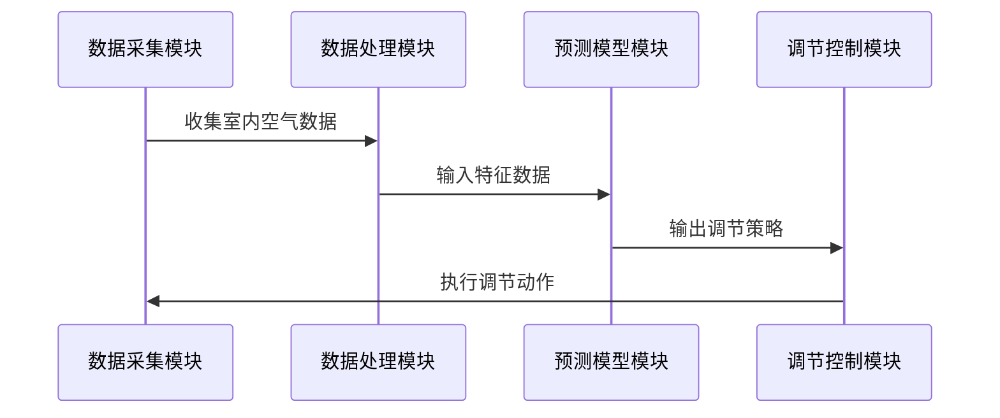
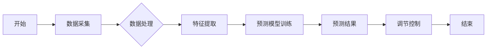

                 

# AI Agent在智能窗台中的室内空气调节

> 关键词：AI Agent、智能窗台、室内空气调节、数据采集、预测模型、系统集成

> 摘要：
本文将探讨AI Agent在智能窗台中的室内空气调节应用。首先介绍AI Agent和智能窗台的基础知识，然后分析室内空气调节系统的需求，设计系统架构，深入讲解AI Agent的应用，包括数据采集、预测模型的构建，以及系统的集成与优化。最后，通过案例分析展示AI Agent在智能窗台中的实际应用，并对未来展望进行讨论。

----------------------------------------------------------------

## 第一部分: AI Agent与智能窗台基础

### 第1章: AI Agent概述

AI Agent，即人工智能代理，是一种能够自主执行任务、与环境交互并学习的智能体。在室内空气调节系统中，AI Agent负责实时监测室内空气质量，根据预测模型提供调节策略，实现高效、智能的空气调节。

### 第2章: 智能窗台技术基础

智能窗台是一种结合了智能技术和建筑窗体功能的系统，能够自动调节室内外空气流动，优化室内空气质量。它通常包含传感器、控制器、执行器等组成部分。

## 第二部分: 室内空气调节系统设计与实现

### 第3章: 室内空气调节系统需求分析

室内空气调节系统需要满足以下需求：
- 实时监测室内空气质量
- 根据空气质量自动调节通风
- 提供舒适、健康的室内环境
- 低能耗、高效能

### 第4章: 室内空气调节系统的设计与架构

室内空气调节系统包括数据采集、数据处理、空气质量预测、调节控制等模块。系统架构图如下（使用Mermaid绘制）：



### 第5章: AI Agent在空气调节中的应用

AI Agent在系统中扮演关键角色，负责数据采集、处理，以及空气质量预测。其核心算法包括：

#### 5.1 算法原理



#### 5.2 Python代码实现

```python
import pandas as pd
from sklearn.model_selection import train_test_split
from sklearn.ensemble import RandomForestRegressor
from sklearn.metrics import mean_squared_error

# 数据采集
data = pd.read_csv('air_quality_data.csv')

# 数据处理
X = data[['temperature', 'humidity', 'CO2']]
y = data['PM2.5']

# 特征提取
X_train, X_test, y_train, y_test = train_test_split(X, y, test_size=0.2, random_state=42)

# 预测模型训练
model = RandomForestRegressor(n_estimators=100, random_state=42)
model.fit(X_train, y_train)

# 预测结果
y_pred = model.predict(X_test)

# 调节控制
error = mean_squared_error(y_test, y_pred)
print(f'Mean Squared Error: {error}')
```

### 第6章: 室内空气数据采集与处理

室内空气数据采集是系统的基础。传感器负责实时监测温度、湿度、CO2浓度等参数。数据处理包括数据清洗、特征提取等步骤。

### 第7章: 室内空气质量预测模型构建

预测模型构建是系统的核心。通过训练机器学习模型，对室内空气质量进行预测。本文采用随机森林回归模型进行预测。

### 第8章: 系统集成与优化

系统集成是将各个模块整合为一个完整系统。优化包括系统性能优化和安全性优化。

## 第三部分: AI Agent在智能窗台中的实际应用

### 第9章: 案例分析一：智能窗台在家庭环境中的应用

案例一展示了AI Agent在家庭环境中的实际应用，通过智能窗台实现室内空气质量的自动调节，提高居住舒适度。

### 第10章: 案例分析二：智能窗台在办公环境中的应用

案例二分析了AI Agent在办公环境中的应用，通过智能窗台优化室内空气质量，提升工作效率。

### 第11章: AI Agent在智能窗台中的未来展望

AI Agent在智能窗台中的应用前景广阔。随着技术的不断发展，AI Agent将更加智能化，为室内空气调节带来更多可能性。

## 附录：相关技术资料与资源

附录部分提供了相关技术资料和资源，包括论文、书籍、在线课程等，供读者进一步学习和研究。

### 作者

作者：AI天才研究院/AI Genius Institute & 禅与计算机程序设计艺术 /Zen And The Art of Computer Programming

----------------------------------------------------------------

以上是对文章的整体结构和内容的概述。接下来的部分将详细展开每个章节的内容，确保文章的逻辑性、完整性和专业性。文章的写作将遵循“LET'S THINK STEP BY STEP”的原则，逐步深入分析每个技术点，为读者提供清晰、易懂的技术博客。

