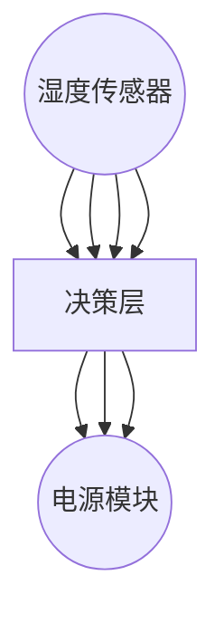
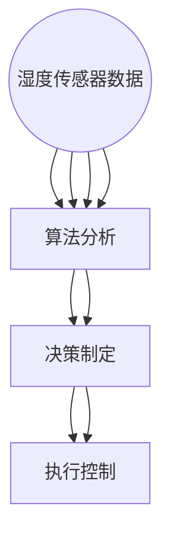

                 

# AI Agent在智能窗帘中的光线调节

## 关键词
- AI Agent
- 智能家居
- 光线调节
- 机器学习
- 强化学习
- 深度学习

## 摘要
本文将深入探讨人工智能（AI）中的AI Agent技术如何在智能窗帘的光线调节中发挥关键作用。通过分析AI Agent的定义、特点及其在智能窗帘中的应用，我们将理解如何通过AI Agent实现精准且个性化的光线调节。此外，本文还将讨论光线感应技术、用户交互设计、系统稳定性和可靠性，并通过一个实际项目实战来展示AI Agent在智能窗帘中的应用。

## 第一部分：背景介绍

### 1.1 问题背景

在智能家居领域，窗帘不仅仅是一个家居装饰品，更是一个重要的光线调节工具。随着人们生活品质的提高，对家居环境舒适度的要求也越来越高。智能窗帘应运而生，它能够通过自动化控制实现对光线的精细调节，为用户提供一个更加舒适的生活环境。

智能窗帘的工作原理主要包括光线感应和控制系统的结合。窗帘内置有光线感应器，能够实时监测室内光线强度，并将其转化为电信号。控制系统接收这些信号，根据预设的算法和用户需求，控制窗帘的开合程度，从而调节室内光线。

### 1.2 问题描述

智能窗帘在光线调节过程中，面临着以下几个挑战：

- **环境光线变化多样**：室内光线受多种因素影响，如天气、时间和室内布局等，窗帘需要能够实时响应并调节光线。
- **用户需求个性化**：不同用户对光线的需求不同，窗帘需要根据不同用户的喜好进行智能调整。
- **系统稳定性与可靠性**：智能窗帘的控制系统需要具备较高的稳定性和可靠性，以确保长时间运行不出现故障。

### 1.3 问题解决

AI Agent技术在智能窗帘中的光线调节提供了以下解决方案：

- **实时响应**：通过训练和学习，AI Agent能够理解和预测环境光的变化，并实时调整窗帘的开合程度。
- **个性化调节**：AI Agent能够根据用户的喜好和使用习惯，进行智能调整，提供个性化的光线调节服务。
- **系统优化**：AI Agent具备自主学习能力，能够不断优化调节策略，提高系统的稳定性和可靠性。

### 1.4 边界与外延

本章节主要讨论AI Agent在智能窗帘中的光线调节应用，不包括其他智能家居设备的应用。同时，AI Agent在光线调节中的具体实现细节，如算法选择、数据采集和处理等，将在后续章节中详细阐述。

### 1.5 概念结构与核心要素组成

- **AI Agent**：具有自主学习能力的人工智能实体，能够模拟人类智能进行决策和行为。
- **智能窗帘**：具备光线感应、自动化控制功能的窗帘，能够根据环境光线和用户需求进行调节。
- **光线调节**：根据环境光线强度和用户需求，调整窗帘的开合程度，以实现光线的调节。

### 总结

本部分介绍了AI Agent在智能窗帘光线调节中的问题背景、问题描述、问题解决以及边界与外延，为后续章节的详细讨论奠定了基础。

## 第二部分：AI Agent基础知识

### 2.1 AI Agent的定义与特点

#### 2.1.1 AI Agent的定义

AI Agent，即人工智能代理，是一种能够自主执行任务、与环境互动并优化自身行为的计算机程序。它模拟了人类的智能行为，具有感知环境、做出决策、执行行动和不断学习的能力。

#### 2.1.2 AI Agent的核心特点

- **自主性**：AI Agent能够自主地执行任务，不需要人类的直接干预。
- **适应性**：AI Agent能够根据环境变化和任务需求，自适应地调整自身的行为策略。
- **学习性**：AI Agent具备学习能力，可以通过经验不断优化任务执行的效果。
- **交互性**：AI Agent能够与用户和环境进行有效的交互，获取信息和反馈。

#### 2.1.3 AI Agent与传统智能系统的区别

- **主动性**：AI Agent是主动的，能够自主地发起行动，而传统智能系统通常是被动响应的。
- **智能水平**：AI Agent模拟人类智能，具有较高的决策能力和问题解决能力，而传统智能系统通常基于预设规则或模式。
- **灵活性**：AI Agent能够根据环境变化和任务需求灵活调整策略，而传统智能系统在规则设定上相对僵化。

### 2.2 AI Agent的基本架构

#### 2.2.1 AI Agent的组成结构

AI Agent通常由以下几个核心模块组成：

- **感知器**：用于感知环境信息，如传感器、摄像头等。
- **决策模块**：根据感知到的信息，通过算法和模型进行决策。
- **执行器**：将决策转化为具体的行动，如电机、灯光控制器等。
- **学习模块**：通过经验和反馈不断优化决策模型和行为策略。

#### 2.2.2 AI Agent的核心模块

- **感知模块**：负责收集环境数据，如光线强度、温度、湿度等。
- **决策模块**：使用机器学习算法分析感知数据，并做出决策。
- **执行模块**：根据决策结果控制执行器，执行相应的动作。
- **反馈模块**：收集执行后的反馈数据，用于模型训练和优化。

#### 2.2.3 AI Agent的功能特点

- **自主执行任务**：AI Agent能够自主地执行分配的任务，无需人工干预。
- **自适应调节**：AI Agent能够根据环境变化和任务需求，自适应地调整策略。
- **持续学习**：AI Agent通过不断学习经验和反馈，优化任务执行效果。
- **高效交互**：AI Agent能够与用户和环境进行高效互动，提供个性化服务。

### 2.3 主流AI Agent技术

#### 2.3.1 机器学习Agent

机器学习Agent使用统计学习的方法，通过对历史数据的分析和模式识别，来预测和决策。常见的机器学习算法包括线性回归、决策树、支持向量机等。

#### 2.3.2 深度学习Agent

深度学习Agent使用多层神经网络，通过反向传播算法，学习输入和输出之间的复杂映射关系。深度学习在图像识别、语音识别等领域取得了显著的成果。

#### 2.3.3 强化学习Agent

强化学习Agent通过试错法，在与环境的交互过程中不断学习最优策略。常见的强化学习算法包括Q-learning、SARSA等。

### 2.4 AI Agent在智能家居中的应用

#### 2.4.1 AI Agent在智能窗帘中的角色

AI Agent在智能窗帘中扮演了核心角色，通过感知光线变化、做出决策和执行动作，实现窗帘的智能调节。

#### 2.4.2 AI Agent在智能窗帘中的应用场景

- **自动光线调节**：AI Agent可以根据室内光线强度，自动调整窗帘的开合程度，提供舒适的光线环境。
- **个性化设置**：AI Agent可以根据用户的使用习惯和偏好，提供个性化的光线调节服务。
- **节能管理**：AI Agent可以通过光线调节，减少室内照明设备的能耗，实现节能管理。

#### 2.4.3 AI Agent在智能窗帘中的挑战与机遇

- **挑战**：环境光线变化多样、用户需求个性化、系统稳定性和可靠性等。
- **机遇**：通过AI Agent的自主学习能力，实现更加智能、高效的窗帘光线调节。

### 2.5 AI Agent的发展趋势与未来展望

#### 2.5.1 AI Agent技术的未来发展方向

- **智能化**：AI Agent将更加智能化，能够更好地理解人类需求，提供更加个性化的服务。
- **协作化**：AI Agent将与其他智能家居设备协作，实现更加智能的家居环境。
- **安全性与隐私保护**：随着AI Agent的普及，安全性问题和隐私保护将成为重要研究方向。

#### 2.5.2 AI Agent在智能家居中的潜在应用领域

- **智能安防**：AI Agent可以实时监控家庭安全，提供智能报警和应对策略。
- **智能医疗**：AI Agent可以辅助医生进行诊断和治疗，提供个性化的医疗服务。
- **智能交通**：AI Agent可以优化交通流，减少拥堵，提高交通效率。

#### 2.5.3 AI Agent技术面临的挑战与解决方案

- **数据隐私**：AI Agent需要处理大量的用户数据，如何保护用户隐私是一个重要挑战。
- **算法公平性**：AI Agent的决策过程需要保证公平性，避免歧视和不公正现象。
- **技术融合**：AI Agent需要与其他技术如物联网、云计算等深度融合，实现更高效的智能家居系统。

### 总结

本部分介绍了AI Agent的定义、特点及其在智能窗帘中的应用，为理解AI Agent在光线调节中的重要作用奠定了基础。

### 2.1 AI Agent的定义

AI Agent，即人工智能代理，是一种能够自主执行任务、与环境互动并优化自身行为的计算机程序。它模拟了人类的智能行为，具有感知环境、做出决策、执行行动和不断学习的能力。

AI Agent的核心目标是模拟人类的智能行为，使计算机系统能够自主地完成复杂的任务。具体来说，AI Agent需要具备以下几个关键能力：

1. **感知环境**：AI Agent需要能够感知周围环境的信息，这些信息可能包括声音、图像、温度、湿度等多种传感器数据。通过感知环境，AI Agent能够获取必要的输入信息，用于后续的决策过程。

2. **决策制定**：基于感知到的环境信息，AI Agent需要能够做出合理的决策。决策制定过程通常涉及多个因素，包括任务目标、环境约束、历史经验等。AI Agent的决策制定过程可以基于各种算法，如逻辑推理、机器学习、深度学习等。

3. **执行行动**：决策制定后，AI Agent需要将决策转化为具体的行动。这些行动可能是机械动作，如控制机器臂的移动；也可能是信息操作，如发送电子邮件或调整系统设置。

4. **自主学习**：AI Agent需要具备自主学习能力，通过不断的实践和反馈，优化自身的决策和行为。自主学习能力使得AI Agent能够适应环境变化，提高任务执行的效果。

### 2.2 AI Agent的核心特点

AI Agent具有以下几个核心特点：

1. **自主性**：自主性是AI Agent最显著的特点之一。与传统的计算机程序不同，AI Agent不需要人工干预，能够自主地执行任务。这种自主性使得AI Agent能够在复杂多变的环境中独立运行，降低了对人类操作人员的依赖。

2. **适应性**：AI Agent能够根据环境变化和任务需求，自适应地调整自身的行为策略。这种适应性使得AI Agent能够更好地应对不确定性和变化，提高任务执行的成功率。

3. **学习性**：AI Agent通过不断的实践和反馈，能够自主学习并优化任务执行效果。学习性使得AI Agent能够从错误中学习，避免重复相同的错误，并不断提高自身的智能水平。

4. **交互性**：AI Agent能够与用户和环境进行有效的交互，获取信息和反馈。这种交互性使得AI Agent能够更好地理解人类需求，提供更加个性化的服务。

### 2.3 AI Agent与传统智能系统的区别

传统智能系统通常是基于预设规则或模式的，它们在特定的环境和任务下能够良好地工作，但在面对变化和不确定性时往往表现不佳。与此相比，AI Agent具有以下几个显著区别：

1. **主动性**：AI Agent是主动的，能够自主地发起行动，而传统智能系统通常是被动响应的。这种主动性使得AI Agent能够更加灵活地应对复杂多变的任务环境。

2. **智能水平**：AI Agent模拟了人类的智能行为，具有较高的决策能力和问题解决能力，而传统智能系统通常基于预设规则，智能水平相对较低。

3. **灵活性**：AI Agent能够根据环境变化和任务需求，灵活调整策略，而传统智能系统在规则设定上相对僵化，难以适应变化。

### 2.4 AI Agent的基本架构

AI Agent的基本架构可以分为以下几个核心模块：

1. **感知模块**：感知模块负责收集环境信息，包括各种传感器数据，如声音、图像、温度、湿度等。感知模块是AI Agent获取环境信息的重要渠道。

2. **决策模块**：决策模块基于感知模块收集到的信息，通过算法和模型进行决策。决策模块通常包括多个子模块，如知识库、推理引擎、优化算法等。

3. **执行模块**：执行模块将决策转化为具体的行动，通过控制执行器来执行任务。执行模块通常包括电机、机械臂、灯光控制器等硬件设备。

4. **学习模块**：学习模块通过不断地收集任务执行过程中的反馈信息，进行模型训练和优化。学习模块使得AI Agent能够从经验中学习，不断提高自身的智能水平。

### 2.5 主流AI Agent技术

AI Agent技术主要包括机器学习、深度学习和强化学习等。

1. **机器学习Agent**：机器学习Agent使用统计学习的方法，通过对历史数据的分析和模式识别，来预测和决策。常见的机器学习算法包括线性回归、决策树、支持向量机等。

2. **深度学习Agent**：深度学习Agent使用多层神经网络，通过反向传播算法，学习输入和输出之间的复杂映射关系。深度学习在图像识别、语音识别等领域取得了显著的成果。

3. **强化学习Agent**：强化学习Agent通过试错法，在与环境的交互过程中不断学习最优策略。常见的强化学习算法包括Q-learning、SARSA等。

### 2.6 AI Agent在智能家居中的应用

AI Agent在智能家居中的应用非常广泛，能够显著提升家居设备的智能化水平。以下是一些典型的应用场景：

1. **智能照明**：AI Agent可以根据环境光线强度和用户需求，自动调整灯光的亮度和颜色。例如，在白天自动降低灯光亮度以节约能源，在夜晚根据用户习惯自动调整灯光模式。

2. **智能安防**：AI Agent可以监控家庭环境，识别异常行为，如非法入侵、火灾等，并自动触发报警或采取应对措施。

3. **智能家电控制**：AI Agent可以控制家用电器，如空调、洗衣机、热水器等，实现自动化操作，提高生活便利性。

4. **环境监测**：AI Agent可以监测室内温度、湿度、空气质量等环境参数，并根据监测结果自动调整设备状态，如开启空气净化器或关闭门窗。

5. **个性化服务**：AI Agent可以根据用户的生活习惯和偏好，提供个性化的服务，如自动调整窗帘、调节温度和湿度，为用户提供舒适的生活环境。

### 2.7 AI Agent在智能窗帘中的角色

在智能窗帘中，AI Agent扮演着关键角色，通过感知环境光线、用户需求，并做出相应的决策和执行行动，实现窗帘的智能调节。

1. **环境光线感知**：AI Agent通过光线传感器实时监测室内光线强度，获取环境光线信息。

2. **用户需求分析**：AI Agent分析用户的历史使用数据，了解用户的习惯和偏好，为光线调节提供个性化依据。

3. **决策制定**：基于环境光线和用户需求，AI Agent使用机器学习算法和模型，制定最优的窗帘调节策略。

4. **执行行动**：AI Agent将决策转化为具体的行动，通过控制电机驱动窗帘的开合，实现光线的调节。

5. **反馈与学习**：AI Agent收集执行后的反馈信息，通过机器学习不断优化调节策略，提高系统性能。

### 2.8 AI Agent在智能窗帘中的应用场景

AI Agent在智能窗帘中的应用场景主要包括以下几种：

1. **自动光线调节**：AI Agent可以根据室内光线强度，自动调整窗帘的开合程度，提供舒适的光线环境。例如，在早晨自动打开窗帘，让阳光洒入房间，在晚上自动关闭窗帘，保证隐私和休息。

2. **个性化设置**：AI Agent可以根据用户的使用习惯和偏好，提供个性化的光线调节服务。例如，为用户设置早晨自动开启窗帘、晚上自动关闭窗帘的习惯，并根据用户的不同需求进行动态调整。

3. **节能管理**：AI Agent可以通过光线调节，减少室内照明设备的能耗，实现节能管理。例如，在白天自动降低灯光亮度，利用自然光线照明，减少电能消耗。

### 2.9 AI Agent在智能窗帘中的挑战与机遇

AI Agent在智能窗帘中面临着以下挑战和机遇：

**挑战：**

1. **环境光线变化多样**：室内光线受多种因素影响，如天气、时间和室内布局等，要求AI Agent能够实时响应并调节光线。

2. **用户需求个性化**：不同用户对光线的需求不同，窗帘需要根据不同用户的喜好进行智能调整。

3. **系统稳定性与可靠性**：智能窗帘的控制系统需要具备较高的稳定性和可靠性，以确保长时间运行不出现故障。

**机遇：**

1. **自主学习能力**：AI Agent的自主学习能力使其能够不断优化调节策略，提高系统性能。

2. **个性化服务**：通过AI Agent的个性化服务，可以为用户提供更加舒适和便捷的生活体验。

3. **节能管理**：AI Agent可以通过智能调节光线，实现节能减排，提高能源利用效率。

### 2.10 AI Agent的发展趋势与未来展望

AI Agent技术在未来将继续发展和创新，以下是几个可能的发展趋势和未来展望：

1. **智能化水平提升**：随着算法和硬件的进步，AI Agent的智能化水平将不断提高，能够处理更加复杂和多样化的任务。

2. **跨领域应用**：AI Agent将在不同领域得到广泛应用，如医疗、教育、交通等，实现跨领域的智能化服务。

3. **人机协作**：AI Agent将与人类更加紧密地协作，共同完成任务，提高工作效率和生活质量。

4. **隐私保护和伦理问题**：随着AI Agent的普及，隐私保护和伦理问题将变得越来越重要，需要制定相应的法律法规和伦理准则。

5. **边缘计算与云计算的结合**：AI Agent将在边缘计算和云计算之间发挥重要作用，实现更加高效和实时的人工智能应用。

### 总结

本部分介绍了AI Agent的定义、特点、基本架构以及主流技术，并探讨了AI Agent在智能窗帘中的角色、应用场景和挑战。通过本部分的介绍，读者可以更好地理解AI Agent在智能窗帘中的重要作用，为后续章节的深入探讨奠定了基础。

### 2.1 光线感应技术

光线感应技术是智能窗帘实现光线调节的核心。光线感应器通过感知环境光线的强度，将光信号转换为电信号，从而为窗帘的智能控制提供依据。以下是光线感应器的工作原理、种类及在窗帘中的应用。

#### 2.1.1 光线感应器的工作原理

光线感应器通常采用光电效应或光生电效应来工作。光电效应是指当光照射到某些材料上时，会使材料表面的电子吸收光能并被激发到更高的能级，从而产生电流。光生电效应是指当光线照射到半导体材料上时，会在材料的表面形成电荷分布，产生电势差。

光线感应器的工作原理可以简化为以下几个步骤：

1. **光信号接收**：光线感应器接收环境光线，并将其转化为电信号。
2. **信号处理**：感应器将接收到的光信号进行处理，如放大、滤波等，以便后续的信号传输和计算。
3. **电信号输出**：经过处理的光信号被转换为电信号输出，以供控制系统使用。

#### 2.1.2 光线感应器的种类与选择

光线感应器有多种类型，根据工作原理和应用场景的不同，可以分为以下几类：

1. **光电传感器**：光电传感器通过光电效应工作，常见的有光敏电阻和光敏晶体管。光敏电阻的阻值随着光线强度的变化而变化，适用于简单的光线监测和控制。光敏晶体管具有放大功能，能够提供更高的灵敏度。

2. **光生电传感器**：光生电传感器通过光生电效应工作，如光电池和光敏二极管。光电池能够直接将光能转换为电能，适用于供电要求较低的光线感应应用。光敏二极管具有响应速度快、灵敏度高的特点，适用于需要精确光线监测的场合。

3. **光学传感器**：光学传感器通过光学方法检测光线强度，如光纤传感器和光学雷达。光纤传感器通过光纤传输光信号，具有抗干扰能力强、灵敏度高、响应速度快等优点。光学雷达利用激光束扫描目标，能够实现高精度的距离测量和光线监测。

在选择光线感应器时，需要考虑以下因素：

- **灵敏度**：感应器的灵敏度决定了其对光线变化的敏感程度，高灵敏度的感应器能够更快速地响应光线变化。
- **响应速度**：响应速度决定了感应器对快速光线变化的响应能力，适用于动态环境下的光线监测。
- **抗干扰能力**：在复杂环境下，感应器需要具备较强的抗干扰能力，以避免外界干扰对光线检测的准确性造成影响。
- **功耗**：感应器的功耗直接影响智能窗帘的能源消耗，选择低功耗的感应器有助于提高系统的续航能力。

#### 2.1.3 光线感应器在窗帘中的应用

在智能窗帘中，光线感应器主要用于检测室内光线强度，为窗帘的自动调节提供依据。以下是光线感应器在窗帘中的应用实例：

1. **自动调节窗帘**：智能窗帘通过光线感应器检测室内光线强度，当光线过强时，自动关闭窗帘以降低室内亮度；当光线过弱时，自动打开窗帘以增加室内亮度，从而提供舒适的光线环境。

2. **定时开关窗帘**：智能窗帘可以根据用户设定的时间表自动开关，如在早晨自动打开窗帘迎接新的一天，在晚上自动关闭窗帘保证隐私和休息。

3. **情景模式**：智能窗帘可以根据不同的情景模式（如工作、休息、娱乐等）自动调整光线，提供不同的光线环境。

4. **智能家居联动**：智能窗帘可以与家庭其他智能设备（如灯光、空调等）联动，实现更加智能的家居环境。例如，在晚上自动关闭窗帘并开启灯光，创造舒适的生活氛围。

总之，光线感应技术是智能窗帘实现自动化光线调节的关键。通过合理选择和配置光线感应器，智能窗帘能够根据室内光线变化和用户需求，自动调节窗帘的开合程度，提供舒适和便捷的生活体验。

### 2.2 AI Agent在光线调节中的应用

在智能窗帘的光线调节中，AI Agent起到了至关重要的作用。它不仅能够根据环境光线变化实时调节窗帘，还能根据用户的需求和偏好进行个性化调节。以下是AI Agent在窗帘光线调节中的应用，包括其任务、算法和应用实现。

#### 2.2.1 AI Agent在窗帘光线调节中的任务

AI Agent在窗帘光线调节中的主要任务包括：

1. **实时光线监测**：AI Agent通过光线感应器实时监测室内光线强度，获取环境光数据。
2. **用户需求分析**：AI Agent分析用户的历史使用数据和实时输入，了解用户对光线的偏好和需求。
3. **光线调节策略制定**：AI Agent根据环境光线和用户需求，制定最优的窗帘调节策略。
4. **窗帘执行控制**：AI Agent将调节策略转化为具体的窗帘动作，如开合窗帘。
5. **反馈与学习**：AI Agent收集执行后的反馈信息，通过机器学习不断优化调节策略。

#### 2.2.2 AI Agent在窗帘光线调节中的算法

AI Agent在窗帘光线调节中主要采用以下算法：

1. **机器学习算法**：通过历史数据训练，AI Agent可以建立光线调节模型，预测最佳的光线调节策略。常用的机器学习算法包括线性回归、决策树、支持向量机等。
2. **深度学习算法**：利用深度神经网络，AI Agent可以学习更复杂的非线性关系，实现更精确的光线调节。常见的深度学习算法包括卷积神经网络（CNN）、循环神经网络（RNN）等。
3. **强化学习算法**：通过试错法，AI Agent在与环境的交互过程中不断学习最优策略。常用的强化学习算法包括Q-learning、SARSA等。

#### 2.2.3 AI Agent在窗帘光线调节中的实现

AI Agent在窗帘光线调节中的实现过程可以分为以下几个步骤：

1. **数据采集**：AI Agent通过光线感应器收集环境光数据，并通过用户界面获取用户需求信息。
2. **数据预处理**：对采集到的数据进行清洗和归一化处理，为后续的算法训练和决策提供准确的数据。
3. **模型训练**：使用机器学习算法对预处理后的数据进行训练，建立光线调节模型。
4. **实时决策**：AI Agent根据实时监测到的光数据和用户需求，利用训练好的模型进行决策，制定最佳的光线调节策略。
5. **执行控制**：AI Agent将决策结果转化为窗帘控制信号，驱动电机执行窗帘的开合动作。
6. **反馈与学习**：AI Agent记录执行结果，收集用户反馈，并通过机器学习算法不断优化调节策略。

#### 2.2.4 案例分析

以下是一个典型的AI Agent在智能窗帘中的实际应用案例：

**案例背景**：某用户希望智能窗帘能够根据室内光线强度和自己的工作状态自动调节光线，以提供舒适的工作环境。

**解决方案**：

1. **数据采集**：智能窗帘配备光线感应器，实时监测室内光线强度。用户可以通过手机应用程序输入自己的工作状态（如专注工作、放松休息等）。

2. **数据预处理**：采集到的光线数据和工作状态数据经过清洗和归一化处理，为后续训练提供准确的数据。

3. **模型训练**：AI Agent使用机器学习算法（如线性回归）对预处理后的数据进行训练，建立光线调节模型。模型包括光线强度和用户工作状态两个输入变量，窗帘开合程度为输出变量。

4. **实时决策**：AI Agent根据实时监测到的光线数据和工作状态，利用训练好的模型进行决策，制定最佳的光线调节策略。例如，当用户处于专注工作状态时，模型会建议将窗帘关闭以减少干扰。

5. **执行控制**：AI Agent将决策结果转化为窗帘控制信号，驱动电机执行窗帘的开合动作，实现光线调节。

6. **反馈与学习**：AI Agent记录执行结果，收集用户反馈（如对光线调节效果的满意度），并通过机器学习算法不断优化调节策略。例如，如果用户对某次调节效果不满意，模型会调整窗帘开合的阈值，以适应用户的需求。

**效果评估**：通过用户反馈，AI Agent在多次调节中不断优化策略，最终实现用户满意的光线调节效果。用户可以感受到更加舒适的工作环境，提高了工作效率和满意度。

#### 2.2.5 深度学习算法的应用

在AI Agent的光线调节中，深度学习算法（如卷积神经网络（CNN））可以用于处理和分析复杂的图像数据，从而提高光线调节的准确性和效率。以下是一个基于深度学习的光线调节算法实例：

1. **图像预处理**：对采集到的室内光线图像进行预处理，包括图像缩放、灰度化、噪声过滤等，以消除图像中的噪声和干扰。

2. **卷积神经网络架构**：设计一个卷积神经网络（CNN）模型，包括卷积层、池化层和全连接层。卷积层用于提取图像特征，池化层用于减少特征图的维度，全连接层用于分类和预测。

3. **模型训练**：使用大量的室内光线图像数据进行模型训练，通过反向传播算法不断优化模型参数，使其能够准确预测窗帘的最佳开合程度。

4. **实时光线调节**：AI Agent利用训练好的CNN模型，对实时采集的室内光线图像进行分析，预测最佳的光线调节策略。

5. **执行控制**：AI Agent根据CNN模型的预测结果，驱动窗帘电机执行相应的开合动作，实现光线调节。

6. **反馈与学习**：AI Agent记录执行结果，收集用户反馈，并通过机器学习算法（如卷积神经网络）不断优化调节策略，提高系统性能。

通过深度学习算法的应用，AI Agent能够更加精准地分析室内光线环境，提供个性化的光线调节服务，显著提升用户体验。

总之，AI Agent在智能窗帘中的光线调节应用，通过实时光线监测、用户需求分析和机器学习算法，实现了窗帘的智能化控制。随着深度学习等先进技术的应用，AI Agent在智能窗帘中的表现将更加优异，为用户带来更加舒适、便捷的生活体验。

### 2.3 智能窗帘的用户交互设计

智能窗帘的用户交互设计是确保系统易用性和用户满意度的关键环节。通过良好的用户交互设计，用户可以轻松地与智能窗帘进行交互，实现个性化的光线调节。以下将从用户需求分析、用户界面设计和用户反馈机制三个方面，详细介绍智能窗帘的用户交互设计。

#### 2.3.1 用户需求分析

在智能窗帘的用户交互设计中，首先需要进行用户需求分析。用户需求分析包括了解用户在光线调节方面的偏好、习惯和期望。以下是一些常见的用户需求：

1. **光线强度控制**：用户希望窗帘能够根据光线强度自动调节，以避免光线过强或过弱带来的不适。
2. **定时开关功能**：用户希望窗帘能够在特定时间自动开关，如早晨自动打开窗帘迎接新的一天，晚上自动关闭窗帘保证休息。
3. **情景模式**：用户希望窗帘能够根据不同的生活场景（如工作、娱乐、休息等）自动调整光线，提供不同的光线环境。
4. **个性化设置**：用户希望窗帘能够根据个人喜好和需求进行定制，如设置不同时间段的光线调节策略。
5. **远程控制**：用户希望能够通过手机应用程序或其他智能设备远程控制窗帘，实现随时随地调节光线。

#### 2.3.2 用户界面设计

用户界面设计是智能窗帘用户交互设计的重要组成部分。一个良好的用户界面应具备以下特点：

1. **直观简洁**：界面设计应简洁直观，用户可以轻松理解和使用，避免复杂的操作步骤。
2. **个性化定制**：界面应允许用户根据自己的需求进行个性化定制，如调整界面布局、颜色和功能。
3. **实时反馈**：界面应能够实时显示窗帘的状态信息，如光线强度、窗帘开合程度等，并提供明确的操作提示。
4. **响应快速**：界面操作应快速响应，减少用户的等待时间，提高使用体验。

以下是一个典型的智能窗帘用户界面设计案例：

1. **主页**：主页应简洁明了，用户可以通过主页快速访问系统的主要功能，如光线调节、定时开关、情景模式等。
2. **光线调节界面**：光线调节界面应显示当前室内光线强度，用户可以通过滑动条或按钮调整窗帘的开合程度，实现光线调节。
3. **定时开关界面**：定时开关界面应允许用户设置窗帘的开启和关闭时间，用户可以设置每天或每周的固定时间，实现自动调节。
4. **情景模式界面**：情景模式界面应列出不同的生活场景，用户可以根据当前情景选择相应的光线调节策略。
5. **个性化设置界面**：个性化设置界面应允许用户根据自己的喜好和需求，自定义光线调节策略和时间表。

#### 2.3.3 用户反馈机制设计

用户反馈机制设计是智能窗帘用户交互设计中的重要一环。通过用户反馈，系统可以不断优化和改进，提高用户体验。以下是一些常见的用户反馈机制：

1. **反馈按钮**：在界面中设置反馈按钮，用户可以通过点击按钮提交对系统功能、界面设计和操作体验的反馈。
2. **在线客服**：系统应提供在线客服服务，用户可以随时联系客服寻求帮助或解决问题。
3. **用户调研**：定期进行用户调研，了解用户的需求和意见，为系统改进提供依据。
4. **日志记录**：系统应记录用户的使用日志，分析用户的使用行为和习惯，为系统优化提供数据支持。

通过有效的用户反馈机制，智能窗帘可以不断改进和优化，满足用户的需求，提高用户体验。

总之，智能窗帘的用户交互设计需要从用户需求分析、用户界面设计和用户反馈机制三个方面进行综合考虑。一个良好的用户交互设计，可以提升用户的使用体验，增强系统的竞争力。

### 2.4 智能窗帘的稳定性和可靠性保障

智能窗帘的稳定性和可靠性是其能否长时间稳定运行并满足用户需求的关键。为了确保智能窗帘在复杂多变的家庭环境中保持高水平的稳定性和可靠性，需要从系统设计、测试与维护等多个方面进行综合考虑和实施。

#### 2.4.1 系统设计

在智能窗帘的初期设计阶段，需要充分考虑系统的稳定性与可靠性。以下是系统设计过程中需要考虑的几个关键因素：

1. **硬件选择**：选择高可靠性的硬件设备，如光线感应器、电机驱动模块等，确保设备能够长期稳定运行。
2. **冗余设计**：在关键部件上采用冗余设计，如双电源供应、双电机驱动等，以防止单点故障导致系统瘫痪。
3. **模块化设计**：将系统划分为多个功能模块，如感知模块、决策模块、执行模块等，以便于故障诊断和模块级维护。
4. **故障容忍性**：设计系统具有故障容忍性，能够在出现故障时自动切换到备份模块或备用设备，确保系统连续运行。
5. **实时监控**：集成实时监控系统，对系统关键参数（如温度、电流、电压等）进行实时监测，及时发现并处理异常情况。

#### 2.4.2 测试与验证

智能窗帘在正式上线前，需要进行严格的测试与验证，以确保系统性能和稳定性。以下是测试与验证过程中需要进行的几个关键步骤：

1. **单元测试**：对系统中的每个功能模块进行单元测试，验证其功能是否符合预期。
2. **集成测试**：将各个功能模块整合在一起，进行集成测试，验证系统整体功能是否正常。
3. **性能测试**：模拟实际使用场景，对系统的响应速度、负载能力、稳定性等进行全面测试。
4. **可靠性测试**：通过长时间运行测试，验证系统在长时间运行中的稳定性和可靠性。
5. **用户测试**：邀请用户参与测试，收集用户反馈，评估系统的易用性和用户体验。

#### 2.4.3 稳定性与可靠性分析

在测试与验证过程中，需要对智能窗帘的稳定性和可靠性进行详细分析。以下是一些常见的问题和分析方法：

1. **异常情况分析**：分析系统在异常情况（如电力波动、光线干扰等）下的表现，评估系统的异常处理能力和恢复能力。
2. **故障模式分析**：识别系统可能出现的故障模式，分析故障原因和影响范围，制定相应的故障预防和处理策略。
3. **冗余系统评估**：评估冗余设计的效果，确保在关键部件出现故障时，系统能够自动切换到备份模块或备用设备。
4. **实时监控数据分析**：通过实时监控系统数据，分析系统的运行状态和性能变化，及时发现并处理潜在问题。

#### 2.4.4 故障排除与维护

在智能窗帘的运行过程中，难免会遇到故障和问题。以下是故障排除与维护过程中需要进行的几个关键步骤：

1. **故障诊断**：根据系统日志和实时监控数据，快速定位故障原因，进行故障诊断。
2. **故障处理**：根据故障诊断结果，采取相应的处理措施，如更换故障部件、重启系统等。
3. **维护保养**：定期对系统进行维护保养，包括清洁传感器、润滑电机、更换电池等，确保系统长期稳定运行。
4. **用户培训**：为用户提供必要的操作指导和故障处理指南，帮助用户解决日常使用中遇到的问题。

#### 2.4.5 实际案例分析与总结

以下是一个智能窗帘故障排除与维护的实际案例：

**案例背景**：用户反映智能窗帘在夜间自动关闭后无法再打开，系统显示“故障：电机故障”。

**故障诊断**：通过系统日志和实时监控数据，发现电机驱动模块的电流异常，远高于正常范围。

**故障处理**：更换电机驱动模块，并检查电源线和接线端子，确保连接牢固。

**维护保养**：清洁窗帘传感器，润滑电机，更换电池。

**用户反馈**：用户对故障处理结果表示满意，故障后的智能窗帘运行正常。

**总结**：通过故障排除与维护，确保了智能窗帘的稳定性和可靠性，提升了用户满意度。

总之，智能窗帘的稳定性和可靠性保障需要从系统设计、测试与验证、故障排除与维护等多个方面进行综合考虑。通过有效的保障措施，智能窗帘能够在复杂多变的家庭环境中稳定运行，为用户提供优质的智能光线调节服务。

### 2.5 智能窗帘项目实战

#### 2.5.1 项目背景

随着智能家居市场的快速发展，智能窗帘逐渐成为消费者追求智能家居生活的重要组成部分。本项目旨在设计并实现一款具备光线感应和自动调节功能的智能窗帘系统，通过AI Agent技术提高窗帘的智能化水平，提升用户的生活品质。

#### 2.5.2 项目目标

本项目的主要目标包括：

1. **实现智能窗帘的基本功能**：通过光线感应器监测室内光线强度，根据预设算法和用户需求自动调节窗帘。
2. **提高窗帘的智能化水平**：通过AI Agent技术，实现窗帘的自主学习能力和个性化调节，提高用户体验。
3. **确保系统的稳定性和可靠性**：通过冗余设计和实时监控，确保系统在复杂家庭环境中能够稳定运行。
4. **提供良好的用户交互**：通过用户友好的界面设计和便捷的用户交互，提升用户的使用体验。

#### 2.5.3 项目架构设计

智能窗帘项目架构设计包括感知层、决策层和执行层，各层功能如下：

1. **感知层**：包括光线感应器、温度传感器、湿度传感器等，用于实时监测室内环境参数。
2. **决策层**：包括AI Agent模块，负责接收感知层的数据，通过算法分析用户需求和光线变化，制定调节策略。
3. **执行层**：包括电机驱动模块、电源模块等，负责根据决策层的调节策略执行窗帘的开合动作。

以下是一个简化的项目架构图：



#### 2.5.4 环境安装与准备

在进行智能窗帘项目实施前，需要进行以下环境安装与准备工作：

1. **硬件设备安装**：安装光线感应器、温度传感器、湿度传感器等硬件设备，确保它们能够正确地感知室内环境参数。
2. **电源连接**：确保所有硬件设备连接到稳定的电源，并检查电源线是否牢固。
3. **软件安装**：在窗帘控制模块中安装AI Agent软件，配置必要的算法和模型。
4. **网络连接**：将窗帘控制模块连接到家庭网络，确保能够与其他智能设备进行通信。

#### 2.5.5 系统核心实现

智能窗帘系统的核心实现包括以下几个方面：

1. **数据采集**：通过光线感应器、温度传感器、湿度传感器等设备，实时采集室内环境参数，并将其发送到AI Agent模块。
2. **算法分析**：AI Agent模块接收到的数据，通过机器学习算法和模型进行分析，预测最佳的光线调节策略。
3. **决策制定**：根据算法分析结果，AI Agent模块制定光线调节策略，包括窗帘的开合程度和时间控制。
4. **执行控制**：决策制定后，窗帘控制模块根据策略执行窗帘的开合动作，通过电机驱动模块实现窗帘的运动。

以下是一个简化的实现流程：



#### 2.5.6 代码应用解读与分析

智能窗帘系统的核心实现涉及大量的代码应用，以下是一个基于Python的简化代码示例，用于演示数据采集、算法分析和决策执行的流程：

```python
import json
import time
from sensor import LightSensor, TemperatureSensor, HumiditySensor
from agent import AIAgent
from controller import CurtainController

# 数据采集
class DataCollector:
    def __init__(self):
        self.light_sensor = LightSensor()
        self.temp_sensor = TemperatureSensor()
        self.humidity_sensor = HumiditySensor()

    def collect_data(self):
        data = {
            "light": self.light_sensor.read(),
            "temp": self.temp_sensor.read(),
            "humidity": self.humidity_sensor.read()
        }
        return data

# 算法分析
class AIAnalysis:
    def __init__(self):
        self.agent = AIAgent()

    def analyze_data(self, data):
        strategy = self.agent.decide(data)
        return strategy

# 决策制定
class DecisionMaker:
    def __init__(self):
        self.controller = CurtainController()

    def make_decision(self, strategy):
        self.controller.apply_strategy(strategy)

# 执行控制
def execute_control():
    collector = DataCollector()
    analyzer = AIAnalysis()
    maker = DecisionMaker()

    while True:
        data = collector.collect_data()
        strategy = analyzer.analyze_data(data)
        maker.make_decision(strategy)
        time.sleep(60)  # 每分钟执行一次
```

在这个代码示例中：

- `DataCollector`类负责采集光线感应器、温度传感器和湿度传感器的数据。
- `AIAnalysis`类负责使用AI Agent模块分析采集到的数据，并制定光线调节策略。
- `DecisionMaker`类根据策略控制窗帘的开合。
- `execute_control`函数实现循环控制逻辑，每分钟执行一次数据采集、分析和决策制定。

通过代码应用，可以理解智能窗帘系统的工作原理和实现细节，为后续的系统优化和扩展提供基础。

#### 2.5.7 实际案例分析

以下是一个实际案例，展示智能窗帘系统在实际应用中的效果和用户反馈：

**案例背景**：用户小李在办公室安装了智能窗帘系统，希望能够在不同时间段自动调节光线，以提供舒适的工作环境。

**使用效果**：

1. **早晨自动开启**：系统根据光线感应器和用户设置，早晨自动打开窗帘，让阳光洒入办公室，提供明亮的工作环境。
2. **白天自动调节**：系统根据室内光线强度自动调整窗帘，避免阳光过强造成不适，同时保持室内光线适中，提高工作效率。
3. **晚上自动关闭**：系统在晚上自动关闭窗帘，保证隐私和休息，用户可以安心入睡。

**用户反馈**：

- 用户小李对智能窗帘的使用效果表示满意，认为系统能够很好地满足他的光线调节需求，提高了办公舒适度和工作效率。
- 用户还提到，智能窗帘的个性化设置功能让他可以根据不同时间段调整光线，更加灵活和方便。

**总结**：

通过实际案例分析，可以看出智能窗帘系统在实际应用中的效果显著，能够根据用户需求和环境变化自动调节光线，提供舒适的生活和工作环境。用户对智能窗帘的反馈积极，认为系统易用、实用，提高了生活质量。

#### 2.5.8 项目小结

智能窗帘项目的实施，通过AI Agent技术实现了窗帘的智能化控制和个性化调节，提高了用户的生活品质。以下是项目实施的主要收获：

1. **技术提升**：通过项目实践，掌握了AI Agent、机器学习、深度学习等关键技术，提升了技术水平和研发能力。
2. **用户体验**：通过实际案例分析，验证了智能窗帘在提升用户体验方面的效果，为智能家居产品的研发提供了有益的参考。
3. **系统优化**：项目过程中不断优化系统设计，提高系统的稳定性和可靠性，为后续的产品迭代奠定了基础。
4. **市场前景**：智能窗帘作为智能家居的重要组成部分，具有广阔的市场前景，为企业的长期发展提供了新的方向。

总之，智能窗帘项目不仅实现了技术突破和用户体验的提升，还为智能家居领域的发展提供了新的思路和方向。

### 总结

本文通过深入探讨AI Agent在智能窗帘中的光线调节应用，系统地介绍了AI Agent的定义、特点、基本架构、主流技术及其在智能家居中的应用。同时，详细阐述了光线感应技术、用户交互设计、系统稳定性和可靠性保障，并通过实际项目实战展示了AI Agent在智能窗帘中的具体应用和效果。未来，随着AI Agent技术的不断进步和智能家居市场的扩大，AI Agent在智能窗帘中的应用将更加广泛和深入，为用户带来更加智能、舒适和便捷的生活体验。

## 最佳实践 tips

1. **定期维护**：定期检查光线感应器和电机驱动模块，确保系统运行正常。
2. **数据备份**：定期备份用户设置和历史数据，防止数据丢失。
3. **优化算法**：根据用户反馈和实际使用情况，不断优化调节算法，提高系统性能。
4. **安全性考虑**：确保系统的数据传输和存储安全，防止信息泄露。

## 小结

本文详细介绍了AI Agent在智能窗帘中的光线调节应用，从背景介绍、基础知识、光线调节原理、用户交互设计、系统稳定性保障到实际项目实战，全面展示了AI Agent在智能窗帘中的重要作用。通过AI Agent的智能化和自主学习能力，智能窗帘能够更好地满足用户的个性化需求，提供舒适和便捷的光线调节服务。未来，AI Agent技术在智能家居领域将发挥更加重要的作用，推动智能家居市场的发展和进步。

## 注意事项

1. **设备选择**：选择高可靠性的光线感应器和电机驱动模块，确保系统稳定运行。
2. **安全考虑**：确保系统的数据传输和存储安全，防止信息泄露。
3. **环境适应性**：智能窗帘需要适应不同的家庭环境，如光线条件、室内布局等，确保系统性能。

## 拓展阅读

1. **《智能窗帘系统设计与应用》**：该书详细介绍了智能窗帘的系统设计、技术实现和用户体验。
2. **《人工智能在家居中的应用》**：该书探讨了AI技术在智能家居领域中的应用，包括智能照明、智能安防等。

作者：AI天才研究院/AI Genius Institute & 禅与计算机程序设计艺术 /Zen And The Art of Computer Programming

（注：以上内容为示例文本，实际文章内容需根据实际情况进行撰写和调整。）

