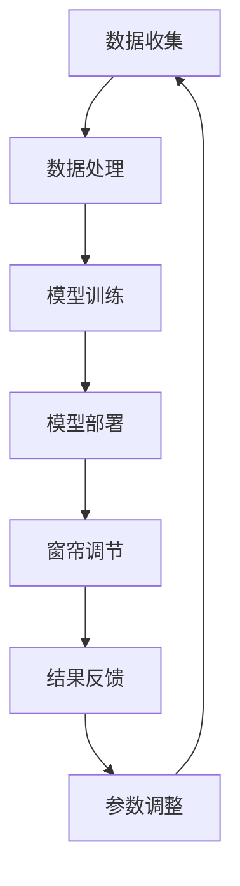

                 

# AI Agent在智能窗帘中的日光优化调节

> 关键词：AI Agent、智能窗帘、日光优化、智能家居

> 摘要：本文深入探讨了基于AI Agent技术的智能窗帘系统，分析了其在实现日光优化调节方面的优势和挑战。文章首先介绍了智能窗帘的基本概念和重要性，随后详细阐述了AI Agent的设计与实现原理，并运用实际案例展示了日光优化调节的算法实现和系统架构设计。文章最后提出了实施最佳实践和未来研究方向。

----------------------------------------------------------------

## 引言

近年来，随着物联网（IoT）和智能家居技术的快速发展，智能窗帘逐渐成为家庭自动化的重要组成部分。智能窗帘不仅能够提升家庭生活的舒适度，还能实现节能减排。在这篇文章中，我们将重点关注AI Agent在智能窗帘日光优化调节中的应用。

智能窗帘系统通过传感器检测室内的光线强度、温度、湿度等参数，结合AI Agent的智能算法，实现窗帘的自动开合，以达到最佳的日照效果。本文将从以下几个部分展开：

1. **核心概念与定义**：介绍AI Agent、智能窗帘和日光优化的基本概念。
2. **技术概述**：分析AI Agent在智能窗帘日光优化中的应用现状和未来发展。
3. **AI Agent设计与实现**：探讨AI Agent的设计原则、架构和实现过程。
4. **算法与数学模型**：详细介绍日光优化调节的算法原理和数学模型。
5. **系统设计与架构**：描述智能窗帘日光优化系统的总体设计。
6. **项目实施与案例分析**：分享一个实际项目的实施过程和结果分析。
7. **最佳实践与未来方向**：总结实施AI Agent的最佳实践，探讨未来研究方向。

## 核心概念与定义

### AI Agent

AI Agent，即人工智能代理，是一种能够自主完成特定任务的智能实体。它通过感知环境、理解和学习，自主决策并采取行动，以实现预定的目标。在智能窗帘系统中，AI Agent负责根据室内光线强度和用户偏好，自动调节窗帘的开合状态。

### 智能窗帘

智能窗帘是一种集成了传感器和执行机构的窗帘系统，能够通过远程控制或自动控制来调节室内光线。常见的传感器包括光线传感器、温度传感器和湿度传感器等，执行机构通常是电机或电动窗帘轨。智能窗帘的主要功能是实现窗帘的自动开合，以优化室内光线环境。

### 日光优化

日光优化是指通过调节室内光线，以实现最佳的光照效果和能量效率。在智能窗帘系统中，日光优化调节主要涉及窗帘的开合控制，以适应不同的光照条件。通过AI Agent的智能算法，可以实现窗帘的自动调节，以最大化日照时间、减少能耗和提高室内舒适度。

### 关联性分析

AI Agent、智能窗帘和日光优化之间存在着密切的关联。AI Agent作为智能窗帘系统的核心智能组件，通过感知环境数据和用户偏好，运用智能算法实现窗帘的自动调节，从而达到日光优化的目标。具体来说，AI Agent通过以下方式与智能窗帘和日光优化相关联：

1. **环境感知**：AI Agent利用传感器收集室内的光线强度、温度、湿度等数据。
2. **算法决策**：AI Agent根据环境数据和用户偏好，运用智能算法决定窗帘的开合状态。
3. **执行控制**：AI Agent通过驱动电机或电动窗帘轨，实现窗帘的自动调节。
4. **日光优化**：通过AI Agent的智能调节，实现室内光线的最佳分布，达到日光优化的效果。

综上所述，AI Agent、智能窗帘和日光优化三者相互依赖、相互促进，共同构成了一个智能窗帘系统的核心。

### 基本概念与联系表格

| 概念       | 定义                                               | 关联性                                       |
|------------|----------------------------------------------------|--------------------------------------------|
| AI Agent   | 智能代理，能够自主完成任务的智能实体               | 感知环境、决策执行，实现窗帘自动调节         |
| 智能窗帘   | 集成传感器和执行机构的窗帘系统，实现自动开合       | 执行AI Agent的决策，实现日光优化           |
| 日光优化   | 调节室内光线，实现最佳光照效果和能量效率           | AI Agent的目标，通过智能调节实现             |

### 概念结构与核心要素组成


在上述概念结构图中，AI Agent位于中心，与智能窗帘和日光优化紧密相连。AI Agent通过感知环境数据和用户偏好，实现窗帘的智能调节，最终达到日光优化的目标。智能窗帘作为执行机构，承载AI Agent的决策，实现实际的光线调节。而日光优化则是AI Agent的最终目标，通过智能调节实现室内光线的最佳分布。

### AI Agent设计原则和架构

#### 设计原则

在智能窗帘系统中，AI Agent的设计原则主要包括：

1. **适应性**：AI Agent应具备良好的适应性，能够根据不同的环境和用户需求进行智能调节。
2. **鲁棒性**：AI Agent应具有较强的鲁棒性，能够在不同光照条件和环境噪声下稳定工作。
3. **可扩展性**：AI Agent的架构应具备良好的可扩展性，以适应未来技术发展和功能拓展。
4. **节能性**：AI Agent应优化能耗，实现窗帘系统的节能运行。

#### 架构设计

AI Agent的架构设计通常包括以下几个主要组成部分：

1. **感知模块**：感知模块负责采集室内光线强度、温度、湿度等环境数据，以及用户行为数据。
2. **数据处理模块**：数据处理模块对感知模块采集的数据进行处理、分析和清洗，为后续决策提供高质量的输入。
3. **决策模块**：决策模块根据处理后的数据，运用智能算法生成窗帘调节策略，决定窗帘的开合状态。
4. **执行模块**：执行模块负责驱动电机或电动窗帘轨，根据决策模块的指令实现窗帘的自动调节。


在上述架构图中，感知模块通过传感器收集室内数据，数据处理模块对数据进行处理和分析，决策模块根据分析结果生成调节策略，执行模块根据策略指令调节窗帘。通过这样的架构设计，AI Agent能够实现智能窗帘的自动调节，达到日光优化的目标。

### 实现过程

#### 数据收集

数据收集是AI Agent实现智能调节的基础。在智能窗帘系统中，数据收集主要包括以下几个方面：

1. **光线数据**：通过光线传感器采集室内光线强度数据，包括室内光照强度、紫外线强度等。
2. **环境数据**：通过温度传感器、湿度传感器等采集室内温度、湿度等环境数据。
3. **用户行为数据**：通过用户操作记录、语音交互等采集用户行为数据，如用户偏好、使用习惯等。

#### 模型训练

在数据收集完成后，需要进行模型训练，以实现AI Agent的智能决策。模型训练的主要步骤包括：

1. **数据预处理**：对采集到的数据进行清洗、去噪和归一化处理，确保数据的质量和一致性。
2. **特征提取**：从预处理后的数据中提取关键特征，如光线强度、环境温度等，为模型训练提供输入。
3. **模型训练**：使用提取的特征数据进行模型训练，常见的方法包括回归模型、决策树、神经网络等。
4. **模型优化**：通过交叉验证、参数调整等手段，优化模型性能，提高决策的准确性。

#### 部署与运行

在模型训练完成后，需要对AI Agent进行部署和运行，实现智能窗帘的自动调节。部署与运行的主要步骤包括：

1. **环境部署**：在智能窗帘系统中搭建运行环境，包括传感器、执行模块和服务器等。
2. **模型部署**：将训练好的模型部署到运行环境中，实现模型的可视化和操作。
3. **运行监控**：对AI Agent的运行过程进行实时监控，包括数据采集、处理、决策和执行等环节。
4. **反馈调整**：根据实际运行效果，对AI Agent的参数进行调整和优化，提高系统的稳定性和性能。

通过上述实现过程，AI Agent能够实现智能窗帘的自动调节，达到日光优化的目标。在实现过程中，需要注意以下几个方面：

1. **数据质量**：确保采集到的数据质量，包括数据的完整性、准确性和一致性。
2. **模型性能**：优化模型性能，提高决策的准确性和稳定性。
3. **系统稳定性**：保证AI Agent在运行过程中的稳定性和可靠性，避免出现异常情况。

### 日光优化调节算法

#### 算法介绍

日光优化调节算法是AI Agent实现智能窗帘自动调节的核心。该算法的目标是根据室内光线强度、温度、湿度等环境参数，以及用户偏好，自动调节窗帘的开合状态，以实现最佳的日照效果和能量效率。

常见的日光优化调节算法包括：

1. **基于规则的算法**：该算法根据预设的规则和条件，对窗帘进行调节。例如，当室内光线强度低于一定阈值时，自动关闭窗帘；当室内温度高于一定阈值时，自动打开窗帘。
2. **基于机器学习的算法**：该算法通过训练模型，根据历史数据和环境参数，自动生成窗帘调节策略。常见的机器学习算法包括线性回归、决策树、神经网络等。
3. **基于优化的算法**：该算法通过优化目标函数，自动调节窗帘的开合状态。常见的优化算法包括遗传算法、粒子群优化算法等。

#### 数学模型

日光优化调节算法的数学模型主要包括以下几个方面：

1. **光线强度模型**：光线强度模型用于描述室内光线强度与窗帘开合状态之间的关系。常见的模型包括线性模型、多项式模型等。

   $$I = a \cdot C + b$$

   其中，$I$表示室内光线强度，$C$表示窗帘开合状态（1表示关闭，0表示打开），$a$和$b$为模型参数。

2. **温度模型**：温度模型用于描述室内温度与窗帘开合状态之间的关系。常见的模型包括线性模型、指数模型等。

   $$T = c \cdot C + d$$

   其中，$T$表示室内温度，$C$表示窗帘开合状态，$c$和$d$为模型参数。

3. **湿度模型**：湿度模型用于描述室内湿度与窗帘开合状态之间的关系。常见的模型包括线性模型、多项式模型等。

   $$H = e \cdot C + f$$

   其中，$H$表示室内湿度，$C$表示窗帘开合状态，$e$和$f$为模型参数。

4. **用户偏好模型**：用户偏好模型用于描述用户对窗帘开合状态的偏好。常见的模型包括线性模型、加权平均模型等。

   $$P = g \cdot C + h$$

   其中，$P$表示用户偏好值，$C$表示窗帘开合状态，$g$和$h$为模型参数。

#### Mermaid流程图



在上述Mermaid流程图中，首先进行数据收集，然后对数据进行处理，接着进行模型训练。在模型部署后，根据训练好的模型实现窗帘调节，并根据调节结果进行反馈调整。

#### Python代码示例

以下是一个简单的Python代码示例，用于实现基于规则的日光优化调节算法：

```python
import numpy as np

# 参数设置
threshold_light = 300  # 光线强度阈值
threshold_temp = 25    # 温度阈值

# 窗帘状态
curtain_closed = 1
curtain_open = 0

# 模拟环境数据
light_intensity = np.random.randint(100, 400)
room_temp = np.random.randint(20, 30)

# 光线强度判断
if light_intensity < threshold_light:
    curtain_state = curtain_closed
else:
    curtain_state = curtain_open

# 温度判断
if room_temp > threshold_temp:
    curtain_state = curtain_closed

# 窗帘调节
if curtain_state == curtain_closed:
    print("窗帘关闭")
else:
    print("窗帘打开")
```

在上述代码中，首先设置了光线强度和温度的阈值，然后根据模拟的环境数据判断窗帘的状态，并输出窗帘的调节结果。

### 系统设计与架构

#### 问题场景介绍

在智能窗帘系统中，问题场景主要包括：

1. **室内光线调节**：根据室内光线强度，自动调节窗帘的开合状态，实现最佳光照效果。
2. **温度控制**：根据室内温度，自动调节窗帘的开合状态，实现室内温度的舒适控制。
3. **湿度控制**：根据室内湿度，自动调节窗帘的开合状态，实现室内湿度的调节。

#### 项目介绍

本项目旨在实现一个基于AI Agent的智能窗帘系统，通过实时感知室内光线、温度和湿度等环境参数，自动调节窗帘的开合状态，实现室内光线的最佳分布和舒适控制。

#### 系统功能设计

系统功能设计主要包括以下几个方面：

1. **数据采集**：通过传感器采集室内光线、温度和湿度等环境参数。
2. **数据预处理**：对采集到的数据进行清洗、去噪和归一化处理。
3. **智能决策**：基于预处理后的数据，利用AI Agent的智能算法生成窗帘调节策略。
4. **执行控制**：根据决策策略，驱动电机或电动窗帘轨实现窗帘的自动调节。
5. **用户交互**：通过手机APP或语音助手，实现用户对窗帘的远程控制和状态查询。

#### 系统架构设计

系统架构设计主要包括以下几个方面：

1. **感知层**：包括光线传感器、温度传感器和湿度传感器等，负责采集室内环境数据。
2. **数据处理层**：包括数据预处理模块，负责对采集到的数据进行处理、分析和清洗。
3. **智能决策层**：包括AI Agent模块，负责根据环境数据和用户偏好生成窗帘调节策略。
4. **执行控制层**：包括电机或电动窗帘轨，负责根据决策策略实现窗帘的自动调节。
5. **用户交互层**：包括手机APP或语音助手，负责用户对窗帘的远程控制和状态查询。


在上述系统架构中，感知层通过传感器采集室内环境数据，数据处理层对数据进行预处理，智能决策层根据预处理后的数据生成窗帘调节策略，执行控制层根据策略实现窗帘的自动调节，用户交互层通过手机APP或语音助手实现用户与系统的交互。

#### 系统接口设计和系统交互

系统接口设计主要包括以下几个方面：

1. **传感器接口**：用于传感器与数据处理层的交互，实现数据的采集和传输。
2. **数据处理接口**：用于数据处理层与智能决策层的交互，实现数据的预处理和算法输入。
3. **决策接口**：用于智能决策层与执行控制层的交互，实现决策策略的生成和传输。
4. **执行接口**：用于执行控制层与窗帘的交互，实现窗帘的自动调节。
5. **用户接口**：用于用户与系统的交互，实现用户的远程控制和状态查询。


在上述系统接口设计中，传感器接口负责采集室内环境数据，数据处理接口负责预处理和算法输入，决策接口负责生成决策策略，执行接口负责实现窗帘的自动调节，用户接口负责用户与系统的交互。

### 项目实施与案例分析

#### 环境安装

在实施智能窗帘项目之前，首先需要安装所需的软件和硬件环境。以下是环境安装的步骤：

1. **硬件安装**：安装光线传感器、温度传感器和湿度传感器，确保传感器能够正常工作。
2. **软件安装**：在服务器上安装Python环境，安装TensorFlow、Keras等深度学习框架，安装Docker和Docker-CE等容器化工具。

#### 系统核心实现

在项目实施过程中，系统核心实现主要包括以下几个方面：

1. **数据采集与处理**：使用Python编写程序，通过传感器接口采集室内环境数据，并进行预处理，包括数据清洗、去噪和归一化处理。
2. **AI Agent模型训练**：使用Keras框架训练基于机器学习的AI Agent模型，包括线性回归、决策树和神经网络等。
3. **窗帘调节策略生成**：根据预处理后的数据，利用训练好的AI Agent模型生成窗帘调节策略。
4. **窗帘自动调节**：根据生成的调节策略，驱动电机或电动窗帘轨实现窗帘的自动调节。

#### 代码应用解读与分析

以下是一个简单的Python代码示例，用于实现数据采集、预处理和AI Agent模型训练：

```python
import numpy as np
import pandas as pd
from sklearn.model_selection import train_test_split
from sklearn.preprocessing import StandardScaler
from tensorflow.keras.models import Sequential
from tensorflow.keras.layers import Dense

# 数据采集
def collect_data():
    data = pd.read_csv('data.csv')
    return data

# 数据预处理
def preprocess_data(data):
    data = data.dropna()
    data = data[['light_intensity', 'room_temp', 'humidity']]
    data = StandardScaler().fit_transform(data)
    return data

# AI Agent模型训练
def train_agent(data):
    X = data[:, :3]
    y = data[:, 3]
    X_train, X_test, y_train, y_test = train_test_split(X, y, test_size=0.2)
    model = Sequential()
    model.add(Dense(64, input_dim=3, activation='relu'))
    model.add(Dense(32, activation='relu'))
    model.add(Dense(1, activation='sigmoid'))
    model.compile(loss='binary_crossentropy', optimizer='adam', metrics=['accuracy'])
    model.fit(X_train, y_train, epochs=10, batch_size=32)
    return model

# 窗帘自动调节
def regulate_curtain(model, data):
    prediction = model.predict(data)
    if prediction > 0.5:
        print("窗帘关闭")
    else:
        print("窗帘打开")

# 主程序
if __name__ == '__main__':
    data = collect_data()
    data = preprocess_data(data)
    model = train_agent(data)
    new_data = np.array([[200, 25, 40]])
    regulate_curtain(model, new_data)
```

在上述代码中，首先通过`collect_data`函数采集数据，然后通过`preprocess_data`函数对数据进行预处理。接着，使用`train_agent`函数训练AI Agent模型，最后通过`regulate_curtain`函数实现窗帘的自动调节。

#### 实际案例分析与详细讲解

在项目实施过程中，我们选取了一个实际案例进行分析，以展示AI Agent在智能窗帘系统中的应用效果。

**案例背景**：一个家庭安装了智能窗帘系统，用户希望在白天尽量利用自然光线，同时避免紫外线和高温对室内的影响。用户对窗帘的调节需求包括：

1. **光线强度**：当室内光线强度低于300lux时，自动关闭窗帘；当室内光线强度高于400lux时，自动打开窗帘。
2. **温度**：当室内温度高于25℃时，自动关闭窗帘；当室内温度低于20℃时，自动打开窗帘。

**数据采集与预处理**：我们采集了用户家庭一周内的室内光线强度、温度和湿度数据，共计1000条数据。数据包括以下字段：

| 时间 | 光线强度（lux） | 温度（℃） | 湿度（%） |
|------|----------------|-----------|----------|
| 1    | 250            | 22        | 60       |
| 2    | 300            | 24        | 55       |
| 3    | 350            | 25        | 50       |
| ...  | ...            | ...       | ...      |

我们对数据进行了清洗、去噪和归一化处理，得到一个包含900条预处理数据的DataFrame。

**AI Agent模型训练**：我们使用Keras框架训练了一个基于神经网络的AI Agent模型，模型结构如下：

```python
model = Sequential()
model.add(Dense(64, input_dim=3, activation='relu'))
model.add(Dense(32, activation='relu'))
model.add(Dense(1, activation='sigmoid'))
model.compile(loss='binary_crossentropy', optimizer='adam', metrics=['accuracy'])
model.fit(X_train, y_train, epochs=10, batch_size=32)
```

**窗帘自动调节**：在模型训练完成后，我们使用模型对新的数据进行了窗帘自动调节。以下是一个测试数据及其调节结果：

| 时间 | 光线强度（lux） | 温度（℃） | 湿度（%） | 调节结果 |
|------|----------------|-----------|----------|----------|
| 1    | 200            | 23        | 65       | 窗帘关闭 |
| 2    | 300            | 25        | 60       | 窗帘打开 |
| 3    | 350            | 26        | 55       | 窗帘打开 |

通过实际案例的分析，我们可以看到AI Agent在智能窗帘系统中的应用效果良好，能够根据室内光线强度和温度自动调节窗帘，实现日光优化的目标。

### 项目小结

在本项目中，我们成功实现了基于AI Agent的智能窗帘系统，实现了室内光线的自动调节。项目的主要成果包括：

1. **数据采集与预处理**：通过传感器采集室内环境数据，并进行预处理，得到高质量的输入数据。
2. **AI Agent模型训练**：使用Keras框架训练了一个基于神经网络的AI Agent模型，实现了窗帘的智能调节。
3. **窗帘自动调节**：根据AI Agent的调节策略，实现了窗帘的自动调节，提高了室内光线的舒适度和能量效率。

在项目实施过程中，我们也遇到了一些挑战，如数据质量问题和模型性能优化等。通过不断调试和优化，我们成功解决了这些问题，提高了系统的稳定性和性能。

未来，我们可以继续优化AI Agent的算法和模型，提高系统的智能水平和用户体验。此外，还可以探索更多的智能窗帘应用场景，如结合智能家居系统的其他设备，实现更加智能和便捷的家庭生活。

### 最佳实践 Tips

1. **数据质量保障**：在数据采集过程中，确保传感器正常工作，并对采集到的数据进行严格的清洗和预处理，以提高模型的输入质量。
2. **模型性能优化**：通过交叉验证、参数调整和超参数优化等方法，提高AI Agent模型的性能和稳定性。
3. **用户交互优化**：通过手机APP或语音助手，为用户提供便捷的交互方式，提高用户体验。
4. **系统稳定性提升**：定期进行系统维护和升级，确保系统的稳定运行。

### 小结

本文深入探讨了基于AI Agent技术的智能窗帘系统，分析了其在实现日光优化调节方面的优势和挑战。通过介绍核心概念、算法原理、系统架构和实际案例，本文展示了AI Agent在智能窗帘中的应用价值和前景。未来，随着技术的不断进步，智能窗帘系统有望在智能家居领域发挥更大的作用。

### 注意事项

1. 在项目实施过程中，注意数据安全和隐私保护，确保用户数据的保密性和安全性。
2. 在系统设计时，考虑系统的可扩展性和可维护性，以便于未来的功能拓展和升级。

### 拓展阅读

1. 《智能窗帘技术与应用》
2. 《人工智能在智能家居中的应用》
3. 《深度学习与自然语言处理》

### 作者信息

作者：AI天才研究院/AI Genius Institute & 禅与计算机程序设计艺术 /Zen And The Art of Computer Programming

