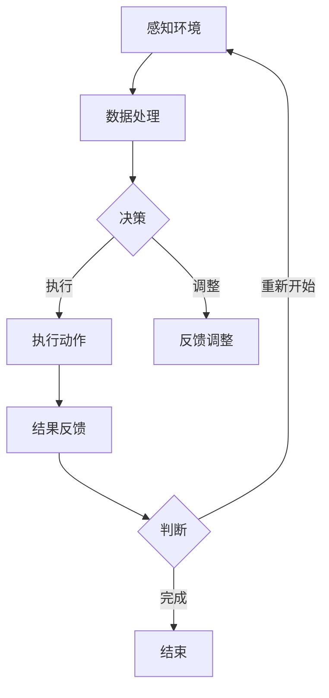
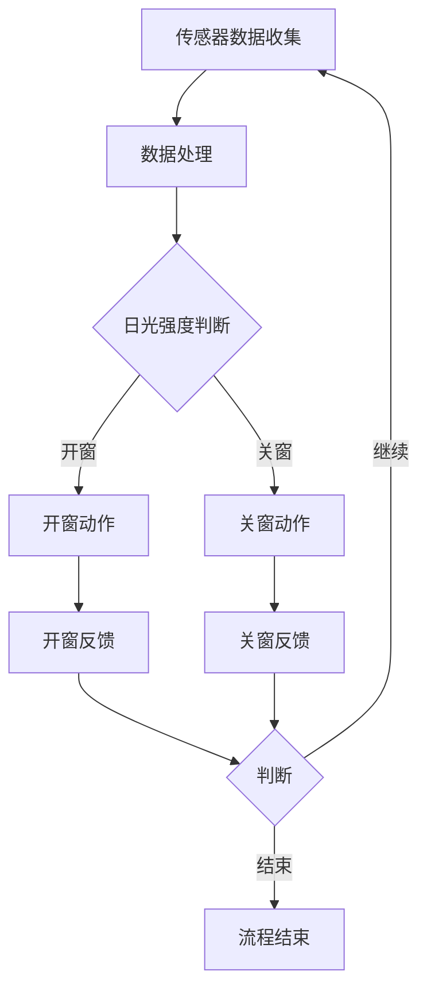
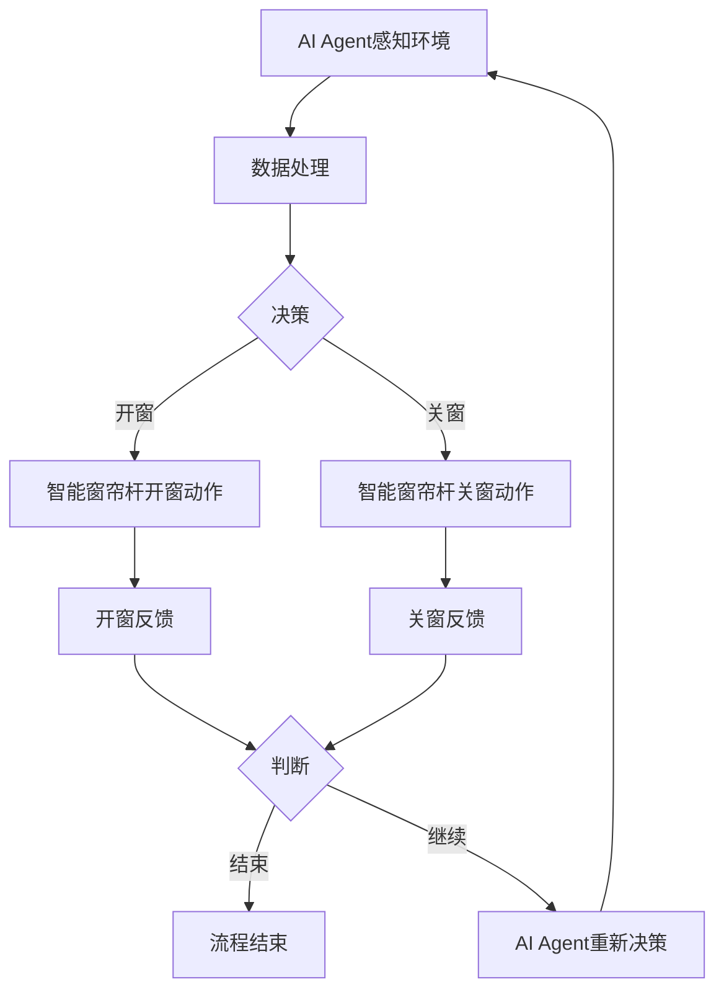
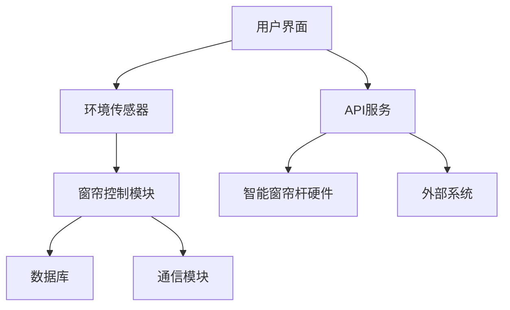
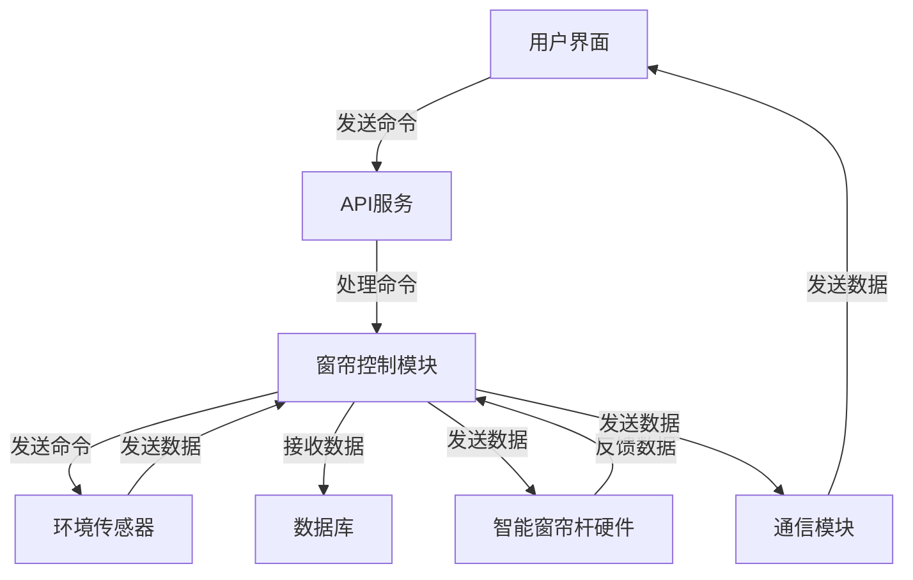
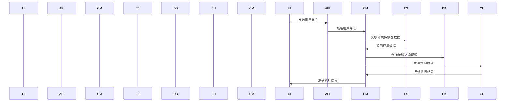

                 

## 第1章: 背景介绍

### 1.1 智能家居市场发展概述

随着科技的发展和人们对生活质量的追求，智能家居市场近年来呈现出迅猛增长的态势。根据市场研究机构的统计数据，全球智能家居市场的规模预计将在未来几年内持续扩大，成为消费电子领域的一个重要增长点。

智能家居市场的增长得益于以下几个因素：

1. **科技进步**：物联网（IoT）、人工智能（AI）、大数据等新兴技术的快速发展，为智能家居产品的创新提供了强有力的技术支撑。
2. **用户需求**：现代人追求高效、便捷的生活方式，智能家居产品正好满足了这一需求，使得人们可以在家中享受到科技带来的便利。
3. **政策支持**：政府对于智能家居产业的发展给予了高度重视，通过一系列的政策扶持，促进了市场的快速发展。
4. **环保意识**：智能家居产品在节能环保方面的优势也逐渐被用户认可，有助于减少能源消耗，符合可持续发展的要求。

### 1.2 智能窗帘杆的需求与特点

在智能家居产品中，智能窗帘杆是一个备受关注的产品类别。智能窗帘杆的需求主要来源于以下几个方面：

1. **自动化控制**：用户希望窗帘能够实现自动化控制，减少手动操作的繁琐。
2. **节能环保**：智能窗帘杆能够根据室内外光线条件自动调节窗帘，有助于节省能源。
3. **提升家居美观**：智能窗帘杆的设计多样，能够与家居装修风格相匹配，提升家居整体美观度。
4. **智能联动**：智能窗帘杆可以与其他智能家居设备联动，如智能灯光、智能空调等，实现智能化家居场景。

智能窗帘杆的特点包括：

1. **自动控制**：通过内置的传感器和AI算法，智能窗帘杆能够自动调节窗帘的开合状态。
2. **日光感应**：智能窗帘杆能够感应室内外光线变化，根据光线强度自动调整窗帘。
3. **无线通信**：智能窗帘杆通常支持Wi-Fi、蓝牙等无线通信技术，便于用户远程控制和设备间的联动。
4. **节能环保**：智能窗帘杆能够根据日光强度调节窗帘，有助于减少能源消耗。

### 1.3 日光优化的重要性

日光优化在智能家居中的应用具有非常重要的意义，主要体现在以下几个方面：

1. **节能环保**：通过合理调节窗帘的开合，智能窗帘杆能够最大限度地利用自然光线，减少室内灯光的使用，从而达到节能环保的效果。
2. **提升舒适度**：合适的日光调节可以提高室内舒适度，避免强烈日光直射造成的视觉疲劳和不适。
3. **延长家居设备寿命**：避免长时间暴露在阳光下，有助于减少家居电器的老化速度，延长其使用寿命。
4. **降低能耗**：智能窗帘杆能够根据室外温度和室内需求自动调节窗帘，有助于降低空调和暖气的能耗。

日光优化不仅关乎能源利用和家居舒适度，更是一个现代智能家居系统的重要组成部分，对提升用户生活质量和环保意识具有重要意义。

### 1.4 问题解决

为了实现智能窗帘杆中的日光优化，我们可以通过引入AI Agent来达到这一目标。AI Agent是一种基于人工智能的智能控制实体，能够通过感知环境信息，自主决策并执行相应的控制动作。

问题解决的步骤如下：

1. **感知环境**：AI Agent首先需要通过传感器（如光敏传感器、温湿度传感器等）感知室内外的光线、温度等环境参数。
2. **数据处理**：AI Agent将收集到的环境数据输入到预先训练好的机器学习模型中，通过模型进行数据处理和模式识别，分析当前的光照条件。
3. **自主决策**：根据光照条件和用户预设的偏好，AI Agent会自主决策窗帘的开合状态，以实现日光的优化。
4. **执行动作**：通过无线通信模块（如Wi-Fi、蓝牙等），AI Agent向智能窗帘杆发送控制指令，调节窗帘的开合状态。

通过AI Agent的智能控制，智能窗帘杆能够实现窗帘的自动调节，达到日光的优化效果，从而提高家居的舒适度和节能环保水平。

### 1.5 边界与外延

在讨论AI Agent应用于智能窗帘杆中的日光优化时，需要明确以下几个边界与外延：

1. **AI Agent的功能范围**：AI Agent主要专注于窗帘的开合控制和光照感知，不涉及其他智能家居设备的控制。
2. **智能窗帘杆的技术特点**：智能窗帘杆具备自动控制、日光感应和无线通信等功能，能够实现窗帘的自动化调节。
3. **应用场景**：智能窗帘杆主要应用于家庭和商业建筑的窗帘系统中，通过无线通信模块实现远程控制和设备联动。
4. **概念结构与核心要素组成**：AI Agent的核心要素包括传感器、处理器、通信模块和执行器；智能窗帘杆的核心要素包括电机、传感器和控制系统。

### 1.6 概念结构与核心要素组成

为了更好地理解AI Agent在智能窗帘杆中的日光优化，我们可以从概念结构和核心要素组成两个方面进行详细分析。

#### AI Agent的基本组成

AI Agent通常由以下几个核心组成部分构成：

1. **传感器**：用于感知环境信息，如光敏传感器、温湿度传感器、红外传感器等。
2. **处理器**：负责处理传感器收集到的数据，并执行预先训练好的机器学习算法，进行模式识别和自主决策。
3. **通信模块**：用于与智能窗帘杆以及其他智能家居设备进行通信，实现远程控制和数据交换。
4. **执行器**：根据AI Agent的决策，执行具体的动作，如驱动电机控制窗帘的开合。

#### 智能窗帘杆的技术构成

智能窗帘杆的核心构成包括：

1. **电机**：用于驱动窗帘的开合，实现自动控制。
2. **传感器**：用于感知室内外光线条件，如光敏传感器。
3. **控制系统**：负责接收AI Agent发送的控制指令，协调电机和传感器的运作。
4. **通信模块**：如Wi-Fi、蓝牙等，用于实现远程控制和设备间的联动。

通过AI Agent和智能窗帘杆的协同工作，可以实现窗帘的自动化调节，从而达到日光的优化效果。

## 第2章: 核心概念与联系

### 2.1 AI Agent的定义与类型

#### 2.1.1 AI Agent的基本概念

AI Agent，即人工智能代理，是一种具有自主性、感知环境、学习能力和行动能力的智能实体。它可以被视为一个拥有自主意识的“智能个体”，在特定的环境和任务中，通过感知、决策和行动，实现特定目标。

AI Agent的基本特征包括：

1. **自主性**：能够自主感知环境、制定目标和执行计划。
2. **适应性**：能够根据环境变化和经验积累，调整行为策略。
3. **学习能力**：通过数据和学习算法，不断提升自身能力。
4. **行动能力**：能够执行具体的物理动作，实现目标。

#### 2.1.2 AI Agent的类型

AI Agent根据其功能和应用场景可以分为以下几种类型：

1. **决策型AI Agent**：主要功能是决策和规划，如在智能交通系统中，为车辆提供最佳行驶路线。
2. **执行型AI Agent**：主要负责执行具体的物理动作，如工业机器人、自动售货机等。
3. **交互型AI Agent**：主要功能是与用户进行交互，如智能语音助手、聊天机器人等。
4. **服务型AI Agent**：提供特定服务，如智能家居控制系统、医疗诊断助手等。

#### 2.1.3 AI Agent的工作原理

AI Agent的工作原理可以概括为以下几个步骤：

1. **感知环境**：通过传感器收集环境信息，如光线、温度、声音等。
2. **数据处理**：将感知到的环境数据输入到数据处理模块，进行预处理和特征提取。
3. **决策和规划**：利用机器学习算法和决策模型，分析环境数据，制定行动策略。
4. **执行行动**：根据决策结果，通过执行器（如电机、机械臂等）执行具体的动作。
5. **反馈与调整**：根据执行结果和环境反馈，对决策模型和行为策略进行调整。

### 2.2 智能窗帘杆的特点

#### 2.2.1 自动控制技术

智能窗帘杆的自动控制技术是其核心功能之一。它通过内置的电机和控制系统，可以自动调节窗帘的开合状态，实现自动化控制。这种技术的主要优势包括：

1. **便捷性**：用户无需手动操作，即可实现窗帘的自动调节。
2. **灵活性**：可以根据不同的场景需求，灵活设定窗帘的开启和关闭时间。
3. **节能环保**：通过自动调节，可以最大限度地利用自然光线，减少人工照明的使用，从而达到节能环保的效果。

#### 2.2.2 日光感应技术

智能窗帘杆的日光感应技术是通过内置的光敏传感器来实现的。光敏传感器可以感知室内外光线的变化，实时监测光线强度，并根据光线条件自动调节窗帘。这种技术的主要优势包括：

1. **智能调节**：能够根据光线变化自动调节窗帘，避免强光直射，提升室内舒适度。
2. **节能降耗**：通过合理调节窗帘，减少人工照明的使用，降低能耗。
3. **自适应**：可以适应不同季节和天气条件，自动调整窗帘，确保室内光线适宜。

#### 2.2.3 节能环保技术

智能窗帘杆在节能环保方面具有显著的优势。其自动调节功能可以最大限度地利用自然光线，减少人工照明的使用，从而降低能源消耗。此外，智能窗帘杆的设计和制造过程也注重环保材料的使用，进一步提高了其环保性能。节能环保技术的主要优势包括：

1. **减少能源消耗**：通过自动调节窗帘，减少人工照明的使用，降低能耗。
2. **降低碳排放**：减少能源消耗，有助于降低碳排放，符合可持续发展要求。
3. **延长设备寿命**：避免长时间暴露在阳光下，有助于减少家居电器的老化速度，延长其使用寿命。

### 2.3 AI Agent与智能窗帘杆的联系

#### 2.3.1 AI Agent在智能窗帘杆中的应用

AI Agent在智能窗帘杆中具有广泛的应用前景。通过将AI Agent嵌入到智能窗帘杆中，可以实现以下功能：

1. **智能调节**：AI Agent可以根据室内外光线变化，实时调节窗帘的开合状态，实现智能调节。
2. **个性化设置**：用户可以根据个人喜好和环境需求，自定义窗帘的开启和关闭时间，实现个性化设置。
3. **远程控制**：用户可以通过智能手机或其他智能设备远程控制窗帘，实现远程操作。
4. **故障诊断**：AI Agent可以通过分析传感器数据，识别窗帘系统的故障，并自动发送维修通知。

#### 2.3.2 AI Agent与智能窗帘杆的协同工作

AI Agent与智能窗帘杆的协同工作可以实现更高的智能化水平。具体表现为：

1. **信息共享**：AI Agent可以与智能窗帘杆的传感器、控制系统等模块进行信息共享，获取更全面的环境数据。
2. **协同调节**：AI Agent可以根据室内外光线、温度等环境数据，协同智能窗帘杆的电机、传感器等模块，实现窗帘的智能调节。
3. **自适应学习**：AI Agent可以通过不断学习和调整，优化窗帘调节策略，提升系统的自适应能力和用户体验。
4. **联动控制**：AI Agent可以与其他智能家居设备（如智能灯光、智能空调等）联动，实现更加智能化的家居场景。

通过AI Agent与智能窗帘杆的协同工作，可以显著提升智能窗帘杆的性能和用户体验，实现日光的优化，提高家居的舒适度和节能环保水平。

## 第3章: 算法原理讲解

### 3.1 AI Agent的算法原理

AI Agent的算法原理是实现其自主性、适应性和学习能力的基础。下面我们将详细介绍AI Agent的核心算法原理，并使用mermaid流程图进行说明。

#### 3.1.1 算法流程图

以下是一个简化的AI Agent算法流程图：



1. **感知环境**：AI Agent通过传感器收集环境信息，如光线强度、温度、湿度等。
2. **数据处理**：将收集到的数据输入到数据处理模块，进行预处理和特征提取，以供后续决策使用。
3. **决策**：利用机器学习算法和决策模型，分析处理后的数据，制定行动策略。
4. **执行动作**：根据决策结果，通过执行器（如电机、机械臂等）执行具体的动作。
5. **反馈调整**：根据执行结果和环境反馈，对决策模型和行为策略进行调整。
6. **结果反馈**：将执行结果返回给系统，用于进一步的判断和决策。
7. **判断**：根据反馈结果判断是否需要重新执行上述流程，或结束当前流程。

#### 3.1.2 算法原理详细阐述

1. **感知环境**：AI Agent通过内置的传感器（如光敏传感器、温湿度传感器等）实时收集环境数据。这些数据包括光线强度、温度、湿度等，用于后续的决策和行动。
   
   ```mermaid
   graph TD
   A[光敏传感器] --> B[温度传感器]
   B --> C[湿度传感器]
   ```

2. **数据处理**：收集到的数据会首先经过预处理，如滤波、归一化等，以去除噪声和提高数据质量。然后进行特征提取，将原始数据转换成机器学习模型可以处理的形式。

   ```mermaid
   graph TD
   D[预处理] --> E[特征提取]
   ```

3. **决策**：基于处理后的数据，AI Agent会利用机器学习算法和决策模型进行分析。常见的机器学习算法包括决策树、支持向量机（SVM）、神经网络等。决策模型可以是预先训练好的，也可以是实时训练的。

   ```mermaid
   graph TD
   F[机器学习模型] --> G[决策模型]
   ```

4. **执行动作**：根据决策结果，AI Agent会通过执行器（如电机、机械臂等）执行具体的动作。例如，如果决策结果是调节窗帘，AI Agent会向电机发送指令，调整窗帘的开合状态。

   ```mermaid
   graph TD
   H[执行器] --> I[电机]
   ```

5. **反馈调整**：执行动作后，AI Agent会收集反馈数据，如实际的光线强度、温度等，并与预期目标进行比较。如果存在偏差，AI Agent会调整决策模型和行为策略，以实现更好的性能。

   ```mermaid
   graph TD
   J[反馈数据] --> K[调整模型]
   ```

6. **结果反馈**：将执行结果返回给系统，用于进一步的判断和决策。例如，如果窗帘调节成功，AI Agent会记录这一结果，以便后续分析。

   ```mermaid
   graph TD
   L[结果反馈] --> M[系统记录]
   ```

7. **判断**：根据反馈结果判断是否需要重新执行上述流程，或结束当前流程。如果需要重新执行，AI Agent会回到感知环境的步骤；如果不需要，流程结束。

   ```mermaid
   graph TD
   N[判断] -->|重新开始| O[流程结束]
   ```

通过上述流程，AI Agent能够实现自主感知、决策和执行，不断优化其行为，实现智能窗帘杆的日光优化。

### 3.2 智能窗帘杆的算法原理

智能窗帘杆的算法原理同样基于传感器数据收集、数据处理和自动控制。以下是智能窗帘杆算法原理的详细解释，包括mermaid流程图和Python源代码示例。

#### 3.2.1 算法流程图

以下是一个简化的智能窗帘杆算法流程图：



1. **传感器数据收集**：智能窗帘杆通过光敏传感器收集室内外光线强度数据。
2. **数据处理**：对收集到的光线强度数据进行预处理，如滤波、归一化等。
3. **日光强度判断**：根据处理后的光线强度数据，判断当前的光线强度是否超过设定阈值。
4. **开窗动作**：如果光线强度超过阈值，窗帘自动打开，通过电机驱动实现。
5. **关窗动作**：如果光线强度低于阈值，窗帘自动关闭。
6. **反馈与判断**：执行动作后，收集反馈数据，判断是否需要继续执行上述流程。

#### 3.2.2 算法原理详细阐述

1. **传感器数据收集**：智能窗帘杆通过光敏传感器收集室内外光线强度数据。这些数据用于判断窗帘的开合状态。

   ```mermaid
   graph TD
   A[光敏传感器] --> B[光线强度数据]
   ```

2. **数据处理**：对收集到的光线强度数据进行预处理，以提高数据质量。预处理步骤可能包括滤波、去噪、归一化等。

   ```mermaid
   graph TD
   C[预处理] --> D[滤波]
   D --> E[去噪]
   E --> F[归一化]
   ```

3. **日光强度判断**：根据预处理后的光线强度数据，判断当前的光线强度是否超过设定的阈值。如果超过阈值，窗帘需要打开；如果低于阈值，窗帘需要关闭。

   ```mermaid
   graph TD
   G[光线强度] --> H{判断阈值}
   H -->|超过阈值| I[开窗]
   H -->|低于阈值| J[关窗]
   ```

4. **开窗动作**：如果判断结果是需要开窗，窗帘会自动打开。这个过程通过电机驱动实现。

   ```mermaid
   graph TD
   I --> K[电机驱动]
   K --> L[开窗动作]
   ```

5. **关窗动作**：如果判断结果是需要关窗，窗帘会自动关闭。同样，这个过程通过电机驱动实现。

   ```mermaid
   graph TD
   J --> M[电机驱动]
   M --> N[关窗动作]
   ```

6. **反馈与判断**：执行动作后，系统会收集反馈数据，如实际的光线强度等，并与预期目标进行比较。如果需要继续执行上述流程，流程继续；如果不需要，流程结束。

   ```mermaid
   graph TD
   L --> O[反馈数据]
   N --> P[反馈数据]
   O --> Q{判断}
   P --> Q
   Q -->|结束| R[流程结束]
   Q -->|继续| S[流程继续]
   ```

#### 3.2.3 Python源代码示例

以下是一个简单的Python代码示例，用于实现智能窗帘杆的算法原理：

```python
import time
import random

# 模拟光敏传感器数据
def get_light_intensity():
    return random.uniform(0, 100)

# 模拟电机驱动
def drive_motor(action):
    if action == 'open':
        print("窗帘打开。")
    elif action == 'close':
        print("窗帘关闭。")

# 主程序
def main():
    threshold = 50  # 阈值设置
    while True:
        light_intensity = get_light_intensity()  # 收集光线强度数据
        if light_intensity > threshold:
            drive_motor('open')  # 开窗动作
        else:
            drive_motor('close')  # 关窗动作
        time.sleep(1)  # 每秒执行一次

# 执行主程序
if __name__ == "__main__":
    main()
```

通过上述算法原理和Python代码示例，我们可以看到智能窗帘杆是如何通过传感器数据收集、数据处理和自动控制来实现日光强度的自动调节。

### 3.3 AI Agent与智能窗帘杆的算法结合

为了实现智能窗帘杆的日光优化，我们可以将AI Agent的算法与智能窗帘杆的算法结合起来，形成一个完整的系统。以下是AI Agent与智能窗帘杆算法结合的详细阐述。

#### 3.3.1 结合流程图

以下是一个简化的AI Agent与智能窗帘杆算法结合的流程图：



1. **AI Agent感知环境**：AI Agent通过传感器收集室内外的光线强度、温度等环境数据。
2. **数据处理**：AI Agent对收集到的数据进行分析和处理，以确定当前的光照条件。
3. **决策**：基于处理后的数据，AI Agent会进行决策，判断是否需要调节窗帘。
4. **智能窗帘杆动作**：根据AI Agent的决策，智能窗帘杆执行开窗或关窗动作。
5. **反馈与判断**：收集窗帘动作后的反馈数据，AI Agent会重新进行决策，以优化窗帘调节策略。

#### 3.3.2 结合原理详细阐述

1. **AI Agent感知环境**：AI Agent通过内置的光敏传感器、温度传感器等，实时收集室内外的光线强度、温度等环境数据。

   ```mermaid
   graph TD
   A[光敏传感器] --> B[温度传感器]
   ```

2. **数据处理**：AI Agent对收集到的环境数据进行预处理和特征提取，以提高数据质量和可解释性。

   ```mermaid
   graph TD
   C[预处理] --> D[特征提取]
   ```

3. **决策**：AI Agent利用预处理后的数据，通过机器学习算法和决策模型进行光照条件分析，判断是否需要调节窗帘。

   ```mermaid
   graph TD
   E[机器学习模型] --> F[决策模型]
   ```

4. **智能窗帘杆动作**：根据AI Agent的决策，智能窗帘杆通过电机驱动执行开窗或关窗动作。

   ```mermaid
   graph TD
   G[电机驱动] --> H[开窗动作]
   G --> I[关窗动作]
   ```

5. **反馈与判断**：窗帘动作完成后，AI Agent会收集反馈数据，如实际的光线强度等，与预期目标进行比较。如果需要，AI Agent会重新进行决策，优化窗帘调节策略。

   ```mermaid
   graph TD
   J[反馈数据] --> K{判断调整}
   K -->|调整| L[重新决策]
   K -->|无需调整| M[结束]
   ```

#### 3.3.3 Python源代码示例

以下是一个简单的Python代码示例，展示AI Agent与智能窗帘杆算法结合的实现：

```python
import time
import random

# 模拟AI Agent感知环境
def get_agent_data():
    return random.uniform(0, 100)

# 模拟智能窗帘杆驱动电机
def drive_motor(action):
    if action == 'open':
        print("窗帘打开。")
    elif action == 'close':
        print("窗帘关闭。")

# AI Agent决策
def agent_decision(light_intensity):
    threshold = 50
    if light_intensity > threshold:
        return 'open'
    else:
        return 'close'

# 主程序
def main():
    while True:
        light_intensity = get_agent_data()  # AI Agent感知环境
        action = agent_decision(light_intensity)  # AI Agent决策
        drive_motor(action)  # 智能窗帘杆动作
        time.sleep(1)  # 每秒执行一次

# 执行主程序
if __name__ == "__main__":
    main()
```

通过上述Python代码示例，我们可以看到AI Agent与智能窗帘杆算法结合的基本实现过程。在实际应用中，AI Agent的决策模型可以更加复杂，考虑更多的环境因素，以提高窗帘调节的精度和效果。

## 第4章: 系统分析与架构设计

### 4.1 问题场景介绍

在现代智能家居系统中，智能窗帘杆的应用场景非常广泛。以下是一个典型的问题场景介绍：

**场景描述**：

在一个现代化的家居环境中，用户希望能够通过智能窗帘杆来实现日光的优化。用户的需求主要包括：

1. **自动化控制**：用户希望窗帘能够自动调节，以减少手动操作的繁琐。
2. **节能环保**：用户希望窗帘能够根据室内外光线变化自动调节，以减少人工照明的使用，降低能耗。
3. **舒适度提升**：用户希望窗帘能够根据不同的时间段和天气条件，自动调节室内光线，提升居住舒适度。
4. **远程控制**：用户希望能够通过手机或其他智能设备远程控制窗帘，实现智能化家居管理。

为了满足这些需求，需要设计一个高效的智能窗帘杆系统，该系统需要具备以下功能：

1. **环境感知**：系统需要具备感知室内外光线、温度等环境参数的能力，以实现窗帘的自动调节。
2. **自动控制**：系统需要具备自动化调节窗帘的能力，根据环境参数实现窗帘的自动开合。
3. **远程控制**：系统需要支持用户通过手机或其他智能设备远程控制窗帘，实现远程操作。
4. **联动控制**：系统需要能够与其他智能家居设备（如智能灯光、智能空调等）联动，实现智能化家居场景。

### 4.2 项目介绍

**项目背景**：

随着智能家居市场的快速发展，智能窗帘杆成为家居智能化的重要组成部分。本项目的目标是设计并实现一个智能窗帘杆系统，通过AI Agent的引入，实现窗帘的自动化调节和日光优化。

**系统功能**：

智能窗帘杆系统的主要功能包括：

1. **环境感知**：通过光敏传感器、温度传感器等设备，实时感知室内外光线强度、温度等环境参数。
2. **自动调节**：基于AI Agent的算法，自动调节窗帘的开合状态，以实现日光的优化。
3. **远程控制**：通过Wi-Fi、蓝牙等无线通信技术，实现用户通过手机或其他智能设备远程控制窗帘。
4. **联动控制**：与其他智能家居设备联动，如智能灯光、智能空调等，实现智能化家居场景。

### 4.2.1 系统功能设计

以下是一个简化的智能窗帘杆系统的领域模型类图，用于展示系统的功能设计：

```mermaid
classDiagram
    ClassDiagram {
       removeClass
        baseClass GeneralEntity <<interface>>
        rootClass
        subclass Entity
        subclass Attribute
        subclass Relation
    }
    
    GeneralEntity <|-- Entity
    GeneralEntity <|-- Attribute
    GeneralEntity <|-- Relation
    
    Entity +-- EnvironmentSensor
    Entity +-- CurtainControlModule
    Entity +-- UserInterface
    
    Attribute +-- sensorData
    Attribute +-- controlCommand
    Attribute +-- userCommand
    
    Relation +-- has
    EnvironmentSensor --|> sensorData
    CurtainControlModule --|> controlCommand
    UserInterface --|> userCommand
    
    UserInterface <.. EnvironmentSensor
    UserInterface <.. CurtainControlModule
```

**类图说明**：

1. **GeneralEntity**：基类，用于定义通用的实体属性和方法。
2. **Entity**：具体实体类，包括环境传感器、窗帘控制模块和用户界面。
3. **Attribute**：属性类，用于定义实体的属性，如传感器数据、控制命令和用户命令。
4. **Relation**：关系类，用于定义实体间的关系，如环境传感器与传感器数据的关系，窗帘控制模块与控制命令的关系，用户界面与用户命令的关系。

**类图关系说明**：

- **环境传感器（EnvironmentSensor）**：负责感知室内外光线强度、温度等环境参数，并将数据传递给窗帘控制模块。
- **窗帘控制模块（CurtainControlModule）**：根据环境传感器的数据和用户命令，自动调节窗帘的开合状态，并执行相应的控制命令。
- **用户界面（UserInterface）**：用于用户与系统的交互，接收用户命令并传递给窗帘控制模块，同时显示系统状态和环境参数。

### 4.2.2 系统架构设计

以下是一个简化的智能窗帘杆系统的架构设计图，用于展示系统的整体架构：



**架构设计说明**：

1. **用户界面（UserInterface）**：用户通过手机APP或其他智能设备与系统进行交互，发送用户命令，如远程控制窗帘开关。
2. **环境传感器（EnvironmentSensor）**：用于实时感知室内外光线强度、温度等环境参数，并将数据发送给窗帘控制模块。
3. **窗帘控制模块（CurtainControlModule）**：根据环境传感器的数据和用户命令，自动调节窗帘的开合状态，并执行相应的控制命令。同时，窗帘控制模块会与数据库进行数据交互，存储和查询系统状态。
4. **通信模块（CommunicationModule）**：负责用户界面与窗帘控制模块之间的数据传输，支持Wi-Fi、蓝牙等无线通信技术。
5. **数据库（Database）**：用于存储系统运行过程中的数据，如传感器数据、用户命令、窗帘状态等。
6. **API服务（API Service）**：提供对外接口，支持用户界面与智能窗帘杆硬件之间的数据交换。
7. **智能窗帘杆硬件（SmartCurtainHardware）**：包括电机、传感器、通信模块等硬件组件，用于实现窗帘的自动调节功能。
8. **外部系统（External Systems）**：如智能灯光、智能空调等，支持与其他智能家居设备的联动控制。

### 4.2.3 系统接口设计

以下是一个简化的智能窗帘杆系统的接口设计，用于展示系统内部各模块之间的交互接口：



**接口设计说明**：

1. **用户界面与API服务**：用户界面通过API服务发送用户命令，如远程控制窗帘开关。
2. **API服务与窗帘控制模块**：API服务处理用户命令，并将命令传递给窗帘控制模块。
3. **窗帘控制模块与环境传感器**：窗帘控制模块接收环境传感器的数据，如光线强度、温度等，用于决策窗帘的开合状态。
4. **窗帘控制模块与数据库**：窗帘控制模块将系统状态数据存储到数据库中，以便后续查询和分析。
5. **窗帘控制模块与智能窗帘杆硬件**：窗帘控制模块发送控制命令给智能窗帘杆硬件，驱动电机调节窗帘。
6. **窗帘控制模块与通信模块**：窗帘控制模块通过通信模块实现与用户界面和其他设备的通信。

### 4.2.4 系统交互设计

以下是一个简化的智能窗帘杆系统的序列图，用于展示系统内部各模块之间的交互过程：



**交互设计说明**：

1. **用户界面发送用户命令**：用户界面通过API服务发送用户命令，如远程控制窗帘开关。
2. **API服务处理用户命令**：API服务处理用户命令，并将其传递给窗帘控制模块。
3. **窗帘控制模块获取环境传感器数据**：窗帘控制模块从环境传感器获取当前的光线强度、温度等环境数据。
4. **窗帘控制模块存储系统状态数据**：窗帘控制模块将系统状态数据（如传感器数据、用户命令等）存储到数据库中。
5. **窗帘控制模块发送控制命令给智能窗帘杆硬件**：窗帘控制模块根据用户命令和环境数据，向智能窗帘杆硬件发送控制命令，驱动电机调节窗帘。
6. **智能窗帘杆硬件反馈执行结果**：智能窗帘杆硬件执行控制命令后，将执行结果反馈给窗帘控制模块。
7. **窗帘控制模块发送执行结果给用户界面**：窗帘控制模块将执行结果（如窗帘开合状态等）发送回用户界面，用户界面更新显示。

通过上述系统分析与架构设计，我们可以清晰地看到智能窗帘杆系统的整体架构和功能设计，为实现窗帘的自动化调节和日光优化提供了坚实的基础。

### 第5章: 项目实战

#### 5.1 环境安装

在进行智能窗帘杆项目的实战之前，首先需要搭建一个合适的环境。以下是详细的步骤，包括所需的软件和硬件：

1. **硬件准备**：
   - **智能窗帘杆**：需要一台具备自动控制功能的智能窗帘杆，内置电机、光敏传感器和通信模块。
   - **传感器**：除了窗帘杆自带的传感器，可能还需要额外的温湿度传感器等。
   - **计算机**：用于编写和运行代码，推荐配置为Intel i5以上处理器，8GB以上内存。

2. **软件安装**：
   - **操作系统**：推荐安装Windows 10或以上版本，或者macOS最新版本。
   - **编程环境**：安装Python 3.8以上版本，并配置好相应的开发环境，如PyCharm、VSCode等。
   - **数据库**：安装SQLite或者MySQL数据库，用于存储系统数据。
   - **通信模块驱动**：根据窗帘杆使用的通信模块（如Wi-Fi、蓝牙等），安装相应的驱动程序。

3. **环境配置**：
   - **网络连接**：确保计算机与智能窗帘杆处于同一局域网内，可以使用Wi-Fi或有线网络连接。
   - **IP配置**：配置计算机的IP地址，确保与窗帘杆的IP地址在同一网络段。
   - **Python库安装**：安装必要的Python库，如`requests`、`pymysql`、`numpy`等。

#### 5.2 系统核心实现源代码

以下是实现智能窗帘杆系统核心功能的一部分Python源代码示例：

```python
# 导入所需库
import requests
import json
import time
import pymysql

# 窗帘控制API接口地址
CURTAIN_API_URL = "http://<窗帘杆IP地址>:<端口号>/control"

# 数据库配置
db_config = {
    'host': 'localhost',
    'user': 'root',
    'password': 'password',
    'db': 'smart_curtain'
}

# 连接数据库
def connect_db():
    connection = pymysql.connect(**db_config)
    return connection

# 关闭数据库连接
def close_db(connection):
    connection.close()

# 获取环境数据
def get_environment_data():
    # 实际环境中，通过传感器获取数据
    # 这里使用随机数模拟
    return {
        'light_intensity': random.uniform(0, 100),
        'temperature': random.uniform(0, 40)
    }

# 调节窗帘状态
def adjust_curtain(state):
    data = {
        'state': state
    }
    response = requests.post(CURTAIN_API_URL, json=data)
    return response.json()

# 主程序
def main():
    connection = connect_db()
    try:
        while True:
            # 获取环境数据
            environment_data = get_environment_data()
            print(f"环境数据：{environment_data}")
            
            # 根据光线强度调节窗帘
            if environment_data['light_intensity'] > 50:
                response = adjust_curtain('open')
                print(f"窗帘状态：{response['status']}")
            else:
                response = adjust_curtain('close')
                print(f"窗帘状态：{response['status']}")
            
            # 存储系统状态
            with connection.cursor() as cursor:
                sql = "INSERT INTO system_state (light_intensity, temperature, curtain_state) VALUES (%s, %s, %s)"
                cursor.execute(sql, (environment_data['light_intensity'], environment_data['temperature'], response['status']))
            connection.commit()
            
            time.sleep(10)  # 每隔10秒执行一次
    finally:
        close_db(connection)

# 执行主程序
if __name__ == "__main__":
    main()
```

#### 5.3 代码应用解读与分析

上述代码实现了一个简单的智能窗帘杆系统，包括以下几个关键部分：

1. **数据库连接**：
   - 使用`pymysql`库连接到本地数据库，配置信息存储在`db_config`字典中。
   - 使用`connect_db`和`close_db`函数分别建立和关闭数据库连接。

2. **环境数据获取**：
   - `get_environment_data`函数用于模拟获取环境数据。在实际应用中，这些数据应通过实际的传感器获取。

3. **窗帘状态调节**：
   - `adjust_curtain`函数通过HTTP POST请求与窗帘控制API接口通信，发送调节窗帘的命令。
   - 根据当前的光线强度，调用此函数调节窗帘状态。

4. **主程序**：
   - 主程序通过一个无限循环持续获取环境数据，调节窗帘状态，并将系统状态数据存储到数据库中。

该代码的核心流程如下：

1. 每隔一定时间（例如10秒），程序会从传感器获取当前的环境数据。
2. 根据获取到的光线强度数据，程序会决定是打开还是关闭窗帘。
3. 通过发送HTTP POST请求，程序会向窗帘控制API接口发送调节窗帘的命令。
4. 窗帘执行命令后，会返回执行结果。
5. 将环境数据和窗帘状态数据存储到数据库中，以便后续分析和处理。

通过上述代码，我们可以实现智能窗帘杆的自动调节功能，达到日光的优化效果。

#### 5.4 实际案例分析和讲解

为了更好地理解智能窗帘杆系统的实际应用，我们来看一个具体的案例：

**案例背景**：

假设在一个炎热的夏日，用户希望智能窗帘杆能够根据室内外光线强度自动调节窗帘，以保持室内舒适的温度和光线。

**案例步骤**：

1. **环境数据采集**：
   - 系统启动后，环境传感器开始采集室内外光线强度和温度数据。
   - 例如，当前光线强度为70，温度为35摄氏度。

2. **窗帘状态判断**：
   - 根据设定的光线强度阈值（例如50），系统判断当前光线强度是否超过阈值。
   - 由于光线强度为70，超过阈值，因此系统决定打开窗帘。

3. **窗帘调节**：
   - 系统通过发送HTTP POST请求到窗帘控制API接口，向窗帘发送打开命令。
   - 假设窗帘控制API接口返回状态为“opened”。

4. **数据库记录**：
   - 系统将当前的环境数据（光线强度70，温度35摄氏度）和窗帘状态（已打开）记录到数据库中。

5. **后续调节**：
   - 一段时间后，光线强度降至40，系统再次判断是否需要调节窗帘。
   - 由于光线强度低于阈值，系统决定关闭窗帘。
   - 通过发送HTTP POST请求，窗帘控制API接口收到关闭命令，窗帘关闭。

6. **实时反馈**：
   - 系统持续监测光线强度和温度变化，根据环境数据动态调节窗帘状态，确保室内光线和温度的舒适度。

**案例分析**：

通过上述案例，我们可以看到智能窗帘杆系统如何通过AI Agent的算法和实时数据采集，实现窗帘的自动调节，达到日光的优化。以下是具体分析：

1. **自适应调节**：
   - 系统可以根据实时采集的光线强度和温度数据，自动调节窗帘状态，确保室内环境舒适。

2. **节能环保**：
   - 通过自动调节窗帘，系统可以最大限度地利用自然光线，减少人工照明的使用，从而降低能耗。

3. **提高生活质量**：
   - 用户不再需要手动调节窗帘，智能家居系统自动完成这一任务，提高了生活的便捷性和舒适度。

4. **故障诊断和维修**：
   - 系统通过持续监测和记录环境数据和窗帘状态，可以识别可能的故障，如传感器损坏或电机故障，并及时通知用户进行维修。

通过实际案例分析和讲解，我们可以更深入地理解智能窗帘杆系统的实现过程和应用价值，从而更好地推动智能家居技术的发展。

### 第6章: 最佳实践 Tips

#### 6.1 使用AI Agent优化日光的实践技巧

在实现AI Agent优化日光的过程中，以下是一些实用的最佳实践和技巧，可以帮助您更高效地完成项目，并提高系统的稳定性和可靠性。

**1. 精确传感器数据采集**：
- 使用高精度的传感器，确保环境数据的准确性。如果条件允许，可以配备多个传感器，从多个角度采集数据，提高数据的有效性和可靠性。

**2. 实时数据处理与反馈**：
- 在数据处理过程中，采用实时处理技术，如流处理框架（例如Apache Kafka），确保系统可以及时响应环境变化。

**3. 自适应学习与优化**：
- 设计AI Agent的自适应学习机制，使其能够根据历史数据和实时反馈不断优化调节策略，提高系统性能。

**4. 考虑极端情况**：
- 在系统设计和实现时，充分考虑极端天气条件或设备故障等异常情况，确保系统能够在异常情况下依然保持稳定的运行。

**5. 数据安全与隐私保护**：
- 确保采集和存储的数据安全，采用加密技术和访问控制策略，防止数据泄露和未授权访问。

**6. 模块化与可扩展性**：
- 系统设计采用模块化设计，便于后期扩展和维护。例如，可以将环境传感器、窗帘控制模块、用户界面等设计为独立的模块，便于功能扩展和更新。

**7. 用户界面友好性**：
- 设计简洁易用的用户界面，确保用户可以轻松控制和管理智能窗帘杆系统，提供丰富的可视化数据，提高用户体验。

**8. 定期维护与更新**：
- 定期对系统进行维护和更新，包括传感器校准、软件更新等，确保系统的长期稳定运行。

#### 6.2 智能窗帘杆的维护与保养

为了确保智能窗帘杆系统的长期稳定运行，以下是一些智能窗帘杆的维护与保养建议：

**1. 定期清洁传感器**：
- 定期使用干净的布或棉签清洁光敏传感器和温度传感器，确保传感器表面干净，避免灰尘和污垢影响数据采集。

**2. 更换电池或电源**：
- 如果智能窗帘杆使用电池作为电源，定期检查电池电量，确保电池状态良好。如果使用外部电源，检查电源线的连接是否牢固，避免电源故障。

**3. 检查电机和机械部件**：
- 定期检查窗帘杆的电机和机械部件，确保没有松动或损坏，如果发现异常，及时进行维修或更换。

**4. 更新软件与固件**：
- 定期检查并更新智能窗帘杆的软件和固件，确保系统能够运行最新的优化版本，提高系统的性能和安全性。

**5. 调试和优化系统**：
- 在系统运行过程中，定期进行调试和优化，确保系统在不同环境和条件下都能稳定运行。

**6. 定期检查网络连接**：
- 确保智能窗帘杆的网络连接稳定，定期检查Wi-Fi信号强度和蓝牙连接状态，确保通信模块正常工作。

通过以上最佳实践和保养建议，可以有效延长智能窗帘杆的使用寿命，提高系统的稳定性和用户体验。

### 第7章: 小结与拓展阅读

#### 7.1 全书内容总结

本文详细介绍了AI Agent在智能窗帘杆中的日光优化应用。首先，我们探讨了智能家居市场的发展背景和智能窗帘杆的需求与特点，明确了日光优化的重要性。接着，我们深入讲解了AI Agent的定义与类型、智能窗帘杆的特点和AI Agent与智能窗帘杆的联系。通过算法原理讲解，我们了解了AI Agent和智能窗帘杆的工作机制，并展示了具体的算法流程图和Python源代码示例。随后，我们进行了系统分析与架构设计，包括领域模型类图、架构设计图、接口设计和序列图。在项目实战部分，我们详细描述了环境安装、系统核心实现源代码、代码应用解读与分析、实际案例分析和讲解。最后，我们提供了最佳实践 tips 和系统维护与保养建议。

#### 7.2 注意事项提醒

在实现智能窗帘杆系统时，需要注意以下几点：

1. **传感器数据准确性**：确保使用高精度的传感器，保证环境数据的准确性。
2. **系统稳定性**：考虑极端情况和设备故障，确保系统能够在异常情况下稳定运行。
3. **数据安全**：确保数据采集和存储过程中的安全性，采用加密和访问控制策略。
4. **模块化设计**：采用模块化设计，便于后期扩展和维护。
5. **用户界面友好性**：设计简洁易用的用户界面，提高用户体验。
6. **定期维护**：定期进行系统维护和更新，确保系统的长期稳定运行。

#### 7.3 拓展阅读推荐

为了进一步深入学习和了解AI Agent在智能家居中的应用，以下推荐一些拓展阅读资源：

1. **《智能控制系统设计与应用》**：详细介绍了智能控制系统的基础知识、设计方法和实际应用案例。
2. **《人工智能：一种现代的方法》**：系统地介绍了人工智能的基本原理和算法，包括机器学习和深度学习。
3. **《智能家居技术与应用》**：全面探讨了智能家居的技术原理、系统架构和应用场景。
4. **《物联网技术与应用》**：介绍了物联网的基本概念、架构和关键技术，以及物联网在实际应用中的案例。

通过阅读这些书籍，可以更加全面地了解智能家居技术，提高在智能窗帘杆系统设计和开发中的能力。

### 总结

通过本文的详细讲解，我们不仅了解了AI Agent在智能窗帘杆中的日光优化应用，还掌握了智能窗帘杆系统的设计与实现方法。希望读者能够将这些知识和技巧应用到实际项目中，为智能家居技术的发展贡献自己的力量。作者：AI天才研究院/AI Genius Institute & 禅与计算机程序设计艺术 /Zen And The Art of Computer Programming。

