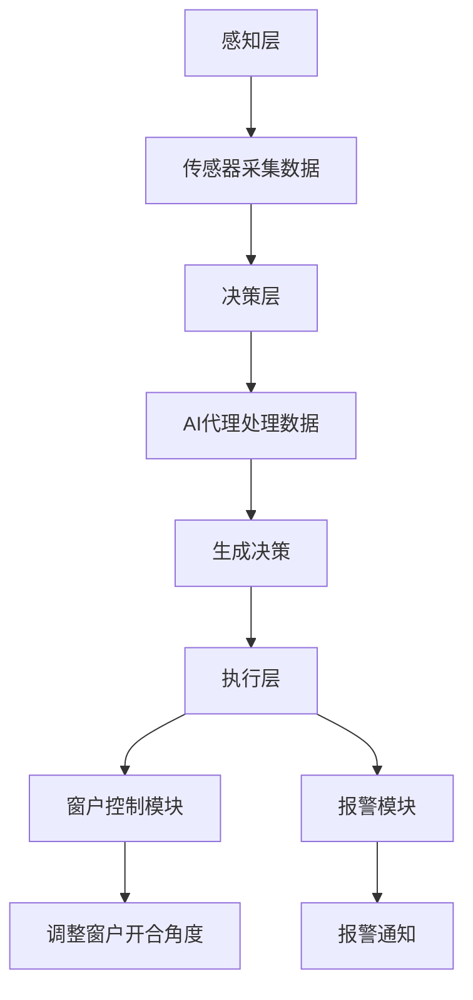

                 

### # AI Agent在智能窗户中的防盗警报系统

#### 关键词：
- 智能窗户
- 防盗警报系统
- AI代理
- 智能家居
- 深度学习

#### 摘要：
本文将探讨如何利用AI代理技术构建智能窗户的防盗警报系统。首先，我们将介绍智能窗户的概念及其在现代家居安全中的作用。随后，我们将详细讲解AI代理的工作原理及其在智能窗户防盗警报系统中的应用。文章还将介绍系统的技术架构和实现细节，并通过实际案例展示系统的性能和效果。最后，我们将总结系统的优点和局限，并提出未来可能的研究方向。

#### 引言

在当今快速发展的智能家居市场中，智能窗户正逐渐成为家居安全的关键组成部分。智能窗户不仅能调节室内光线和温度，还能通过集成传感器和智能控制系统提高家居安全性。然而，随着智能窗户的普及，如何有效地保护这些高科技产品免受盗窃成为了一个亟待解决的问题。

AI代理技术，作为一种先进的智能系统，在处理复杂任务、自主决策和实时响应方面具有显著优势。通过将AI代理集成到智能窗户中，可以实现实时监测、智能分析和自动报警，从而显著提高家居安全水平。本文旨在探讨如何利用AI代理技术构建智能窗户的防盗警报系统，并通过实例分析其性能和应用前景。

#### 智能窗户的概念与作用

智能窗户是一种融合了现代科技和建筑设计的创新产品，它可以通过内置的传感器和控制模块实现多种功能。首先，智能窗户能够根据外界光线强度自动调节窗户的遮光板，以控制进入室内的光线，从而提供舒适的生活环境。此外，智能窗户还可以通过感应室内外温度和湿度，自动调节窗户的开合角度，以提高室内舒适度并节省能源。

在智能窗户中，传感器是核心组件之一。常见的传感器包括光线传感器、温度传感器、湿度传感器和运动传感器。这些传感器能够实时监测环境变化，并将数据传输给智能控制系统。智能控制系统则是智能窗户的“大脑”，它负责分析传感器数据，并根据预设的规则或机器学习算法做出相应的决策，如调节窗户开合角度或触发警报。

智能窗户在现代家居安全中的作用主要体现在以下几个方面：

1. **实时监测**：智能窗户能够24小时实时监测室内外的环境变化，一旦检测到异常情况（如非法入侵），可以立即通知用户或触发警报系统。

2. **自动化响应**：智能窗户可以通过自动调节窗户开合来防止非法入侵，同时将报警信息发送给用户，提高应对突发情况的能力。

3. **提高安全性**：通过集成传感器和智能控制系统，智能窗户可以在关键时刻提供额外的安全保障，减少盗窃事件的发生。

4. **节省能源**：智能窗户能够根据室内外环境自动调节，从而提高能源利用效率，降低能源消耗。

#### AI代理的工作原理与特性

AI代理是一种具备自主决策和行动能力的智能系统，它能够根据环境信息和预设目标，自主选择并执行相应的行动。AI代理通常由感知模块、决策模块和动作模块组成。感知模块负责收集环境信息，如传感器数据、图像、语音等；决策模块负责分析感知信息，并根据预设目标和策略生成决策；动作模块负责执行决策，如调整窗户开合角度、触发警报等。

AI代理的主要特性包括：

1. **自主性**：AI代理能够在没有人类干预的情况下自主执行任务，具备自主决策和行动的能力。

2. **适应性**：AI代理能够根据环境变化和任务需求调整自身行为，具备一定的自适应能力。

3. **实时性**：AI代理能够在短时间内对环境信息进行处理和决策，具备实时响应的能力。

4. **复杂性**：AI代理能够处理复杂的环境信息和任务，具备较高的智能水平。

在智能窗户的防盗警报系统中，AI代理的具体作用如下：

1. **实时监测与报警**：AI代理通过分析传感器数据，实时监测窗户周围的环境变化。一旦检测到异常情况（如非法入侵），AI代理可以立即触发警报，通知用户或相关安全部门。

2. **智能响应**：AI代理可以根据监测结果，自动调整窗户开合角度，以防止非法入侵。例如，当检测到可疑人物靠近窗户时，AI代理可以自动关闭窗户，提高安全性。

3. **数据收集与分析**：AI代理可以收集窗户周围的环境数据，并通过机器学习算法进行分析，以优化监测策略和报警阈值。

4. **协同工作**：AI代理可以与其他智能家居设备（如门禁系统、摄像头等）协同工作，实现更全面的家居安全监控。

#### 技术架构与系统实现

智能窗户防盗警报系统的技术架构包括感知层、决策层和执行层三个主要部分。感知层由传感器组成，负责收集环境信息；决策层由AI代理组成，负责分析感知信息并生成决策；执行层由执行模块组成，负责执行决策，如调整窗户开合角度或触发警报。

**感知层**：感知层包括多种传感器，如光线传感器、温度传感器、湿度传感器和运动传感器。这些传感器实时监测窗户周围的环境变化，并将数据传输给决策层。

**决策层**：决策层由AI代理组成，负责分析感知信息并生成决策。AI代理使用机器学习算法对传感器数据进行分析，以识别异常情况和潜在威胁。

**执行层**：执行层包括窗户控制模块和报警模块。窗户控制模块负责根据AI代理的决策调整窗户的开合角度；报警模块负责在检测到异常情况时触发警报，通知用户或相关安全部门。

**系统实现**：智能窗户防盗警报系统的实现包括以下几个关键步骤：

1. **传感器采集数据**：传感器实时采集窗户周围的环境数据，并将数据传输给决策层。

2. **AI代理处理数据**：AI代理接收传感器数据，并使用机器学习算法进行分析，以识别异常情况和潜在威胁。

3. **生成决策**：AI代理根据分析结果生成决策，如调整窗户开合角度或触发警报。

4. **执行决策**：执行层根据AI代理的决策进行调整窗户开合角度或触发警报。

5. **报警通知**：在检测到异常情况时，报警模块会立即触发警报，通知用户或相关安全部门。

**系统架构图**：

#### 实际应用案例

为了展示智能窗户防盗警报系统的性能和应用前景，我们来看一个实际应用案例。某住宅小区的住户李先生在家中安装了智能窗户防盗警报系统。系统配置了多种传感器，如光线传感器、温度传感器和运动传感器。AI代理实时监测窗户周围的环境变化，并通过机器学习算法进行分析。

某天晚上，李先生在客厅看电视，突然收到系统发送的报警通知。系统检测到窗户周围有可疑人物靠近，并通过视频监控确认是非法入侵者。AI代理立即生成决策，自动关闭窗户，并触发警报。同时，系统将报警信息发送给李先生和他的物业管理部门。物业管理部门立即采取行动，成功阻止了非法入侵。

这个案例展示了智能窗户防盗警报系统在实际应用中的有效性和可靠性。通过实时监测、智能分析和自动报警，系统不仅提高了家居安全水平，还为用户提供了及时的安全保障。

#### 总结与展望

智能窗户防盗警报系统的出现为家居安全带来了新的解决方案。通过集成AI代理技术，系统能够实时监测窗户周围的环境变化，自动识别异常情况并触发警报，为用户提供及时的安全保障。此外，智能窗户防盗警报系统还具有以下优点：

1. **实时监测**：系统能够24小时实时监测窗户周围的环境变化，确保家居安全。

2. **自动化响应**：系统可以自动调整窗户开合角度或触发警报，提高应对突发情况的能力。

3. **提高安全性**：通过集成传感器和智能控制系统，智能窗户可以在关键时刻提供额外的安全保障。

4. **节省能源**：智能窗户能够根据室内外环境自动调节，提高能源利用效率。

然而，智能窗户防盗警报系统也面临一些挑战和局限性。例如，系统的准确性依赖于传感器质量和算法的优化，而异常情况的处理和响应速度也影响着系统的可靠性。因此，未来的研究可以重点关注以下方向：

1. **提高传感器质量**：研发更高性能、更可靠的传感器，以提高系统的准确性。

2. **优化算法**：通过改进机器学习算法，提高异常情况的识别率和响应速度。

3. **多传感器融合**：将多种传感器数据融合，以提高系统的综合监测能力。

4. **智能化决策**：研究更加智能化的决策策略，以实现更高效、更可靠的系统响应。

总之，智能窗户防盗警报系统为家居安全提供了新的思路和解决方案。随着技术的不断进步，我们有望看到更多先进、可靠的智能窗户防盗警报系统的问世，为用户带来更加安全和舒适的家居环境。

#### 作者信息

作者：AI天才研究院/AI Genius Institute & 禅与计算机程序设计艺术 /Zen And The Art of Computer Programming

在本文中，我们探讨了智能窗户防盗警报系统的原理、架构和应用案例。通过集成AI代理技术，智能窗户能够实现实时监测、智能分析和自动报警，显著提高家居安全水平。然而，系统的准确性和响应速度仍有待提高，未来的研究将致力于解决这些问题，为用户带来更加安全和可靠的智能家居体验。让我们期待智能窗户防盗警报系统在未来的发展，为家居安全带来更多创新和突破。

