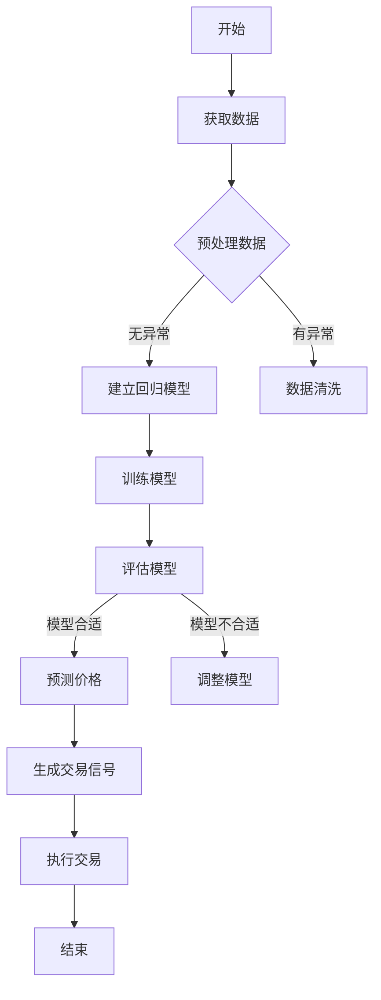
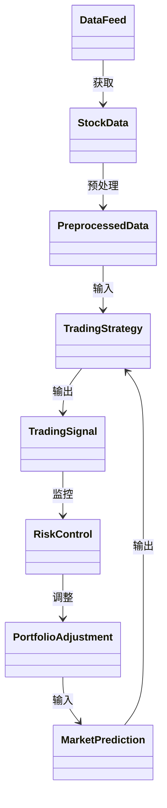
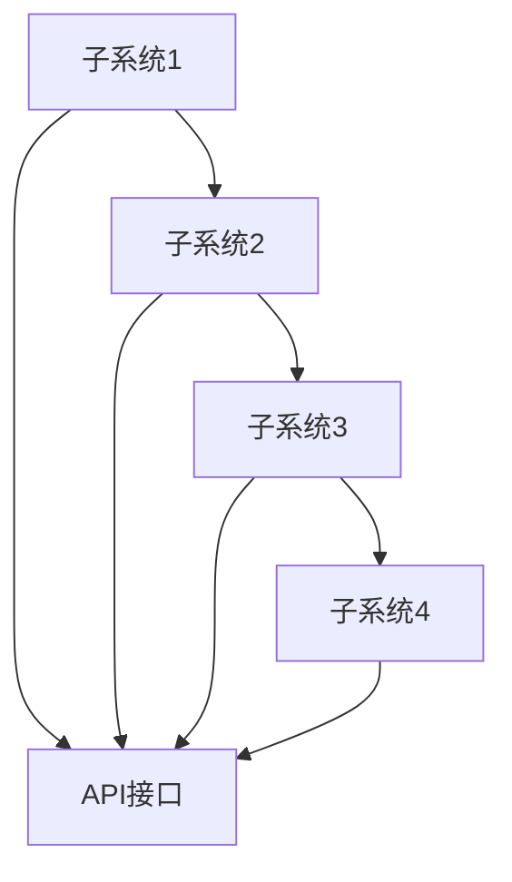
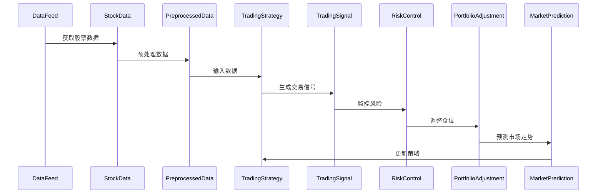

                 

### AI Agent在智能股票交易中的应用

#### 关键词：人工智能、股票交易、AI Agent、智能交易算法、强化学习、系统架构设计

> 摘要：本文将深入探讨AI Agent在智能股票交易中的应用。首先，我们将回顾人工智能在金融领域的应用背景，以及股票交易中的基本概念和市场动态。接着，我们会定义AI Agent，并详细介绍其在智能交易中的具体应用。随后，文章将逐步讲解AI Agent背后的核心理论和算法原理，使用Mermaid绘制算法流程图，并用Python代码进行实现。此外，我们将探讨数学模型在算法中的应用，并展示智能股票交易系统的设计，包括功能、架构、接口和交互设计。文章还将通过项目实战，展示AI Agent在智能股票交易中的实际应用，并给出最佳实践和总结。

## 第一部分：背景介绍与核心概念

### 第1章: 人工智能与股票交易概述

#### 1.1 人工智能在金融行业的应用背景

人工智能（Artificial Intelligence，简称AI）作为一种模拟人类智能的技术，正迅速渗透到各行各业。在金融行业，AI的应用尤其广泛，不仅提高了数据处理和分析的效率，还为风险管理和投资决策提供了有力的支持。AI在金融中的应用主要包括以下几个方面：

1. **风险管理**：通过机器学习算法，对金融产品的风险进行评估和预测，从而优化投资组合。
2. **客户服务**：利用自然语言处理技术，提供智能客服，提高客户体验。
3. **量化交易**：利用算法模型，进行高频交易和智能投资决策，实现自动化的交易策略。
4. **市场预测**：通过分析历史数据和当前市场趋势，预测市场走势，为投资者提供参考。

#### 1.2 股票交易中的基本概念与市场动态

股票交易是金融市场中最为重要的一环，涉及到投资者、上市公司、金融机构等多个参与方。以下是股票交易中的几个基本概念：

1. **股票**：股票是公司股份的证券化形式，代表股东在公司中所持有的权益。
2. **市值**：公司总股本乘以股票价格，反映了公司的市场价值。
3. **市盈率（PE）**：公司市值除以净利润，用于衡量股票的估值水平。
4. **交易量**：一定时间内股票的成交数量，反映了市场活跃程度。

股票交易市场的动态主要受以下因素影响：

1. **宏观经济环境**：如GDP增长率、通货膨胀率等。
2. **公司业绩**：公司盈利能力、成长性等。
3. **市场情绪**：投资者对市场的预期和情绪波动。
4. **政策法规**：政府政策、监管环境等。

#### 1.3 AI Agent的定义及其在智能交易中的应用

AI Agent，即人工智能代理，是指能够自主执行任务、与环境互动并做出决策的智能体。在智能股票交易中，AI Agent可以扮演以下角色：

1. **交易决策**：根据市场数据和算法模型，自动生成交易信号，进行买入或卖出操作。
2. **风险控制**：实时监控市场风险，调整交易策略，降低潜在损失。
3. **市场预测**：利用历史数据和机器学习算法，预测市场走势，为交易决策提供支持。
4. **投资组合优化**：根据风险偏好和收益目标，优化投资组合，提高收益。

AI Agent在智能交易中的应用具有以下几个特点：

1. **自主性**：AI Agent能够独立运行，不需要人工干预，提高交易效率。
2. **实时性**：AI Agent能够实时获取和处理市场数据，快速响应市场变化。
3. **精准性**：通过机器学习和大数据分析，AI Agent能够更准确地预测市场走势，提高交易成功率。

接下来，我们将深入探讨AI Agent的基础理论，包括其定义、分类以及强化学习在AI Agent中的应用。

---

## 第二部分：核心概念与联系

### 第2章: AI Agent的基础理论

#### 2.1 AI Agent的定义与分类

AI Agent，即人工智能代理，是指能够自主执行任务、与环境互动并做出决策的智能体。根据不同的分类标准，AI Agent可以有多种类型：

1. **按照智能程度分类**：
   - **弱AI（Narrow AI）**：只能在一个特定领域内表现优异，如自然语言处理、图像识别等。
   - **强AI（General AI）**：具备与人类相似的综合智能，能够在任何情境下进行推理和决策。

2. **按照环境类型分类**：
   - **确定环境**：环境状态是固定的，如棋类游戏。
   - **不确定环境**：环境状态不确定，如股票市场。

3. **按照决策方式分类**：
   - **规则基Agent**：基于预定义的规则进行决策。
   - **数据驱动的Agent**：基于历史数据和机器学习模型进行决策。

#### 2.2 强化学习在AI Agent中的应用

强化学习（Reinforcement Learning，简称RL）是AI Agent的核心算法之一，旨在通过试错学习，在动态环境中找到最优策略。强化学习的关键组成部分包括：

1. **代理（Agent）**：执行动作并获取反馈的智能体。
2. **环境（Environment）**：代理所处的环境，提供状态信息和奖励。
3. **状态（State）**：描述代理当前所处的环境状态。
4. **动作（Action）**：代理可以执行的动作。
5. **奖励（Reward）**：对代理动作的反馈，用于评估动作的好坏。

强化学习的基本过程如下：

1. **初始状态**：代理随机选择动作。
2. **执行动作**：代理在环境中执行选择的动作。
3. **观察状态**：代理观察新的环境状态。
4. **获取奖励**：根据动作结果，获得奖励信号。
5. **更新策略**：代理根据奖励信号，更新策略，选择更好的动作。

在股票交易中，强化学习可以用于以下方面：

1. **交易策略学习**：代理通过历史交易数据，学习最佳交易策略。
2. **风险控制**：代理根据市场风险，动态调整仓位和交易策略。
3. **市场预测**：代理通过分析历史数据和当前市场状态，预测未来市场走势。

#### 2.3 马尔可夫决策过程（MDP）与策略迭代算法

马尔可夫决策过程（Markov Decision Process，简称MDP）是强化学习中的核心概念，描述了代理在不确定环境中做出决策的过程。一个MDP由以下五个部分组成：

1. **状态空间（S）**：所有可能的状态集合。
2. **动作空间（A）**：所有可能的动作集合。
3. **状态转移概率（P(s' | s, a)）**：从当前状态s执行动作a后，转移到状态s'的概率。
4. **奖励函数（R(s, a)）**：在状态s执行动作a后，获得的即时奖励。
5. **策略（π(s)）**：在状态s下执行的动作。

策略迭代算法（Policy Iteration）是解决MDP的一种经典方法，主要包括以下步骤：

1. **初始化策略**：随机选择一个策略π。
2. **评估策略**：计算当前策略π下的状态价值函数v(π)。
3. **策略改进**：根据评估结果，改进策略π，使得状态价值函数v(π)最大化。
4. **迭代**：重复评估和策略改进，直到策略不再改进。

策略迭代算法的核心思想是通过迭代优化策略，找到最优策略π*，使得状态价值函数v(π*)最大化。

接下来，我们将深入讲解智能交易算法的设计原理，包括回归分析与交易策略设计、时间序列分析与预测模型等。

---

## 第三部分：算法原理讲解

### 第3章: 智能交易算法设计

#### 3.1 回归分析与交易策略设计

回归分析是金融分析中最常用的工具之一，用于分析资产价格与影响因素之间的关系。在智能交易中，回归分析可以用于以下两个方面：

1. **因子分析**：通过回归分析，识别影响资产价格的主要因素，如利率、通货膨胀率等。
2. **交易策略设计**：根据回归模型，设计交易策略，例如趋势跟踪策略、均值回归策略等。

在交易策略设计中，常用的回归模型包括线性回归、逻辑回归和时间序列回归等。以下是线性回归的基本原理：

- **线性回归模型**：\( Y = \beta_0 + \beta_1X + \epsilon \)
- **参数估计**：通过最小二乘法，估计模型的参数\( \beta_0 \)和\( \beta_1 \)。
- **模型评估**：通过交叉验证和回测，评估模型的预测性能。

通过回归分析，我们可以得到资产价格与影响因素之间的关系，进而设计交易策略。例如，如果发现资产价格与利率呈正相关，我们可以设计一个利率上升时买入资产、利率下降时卖出的策略。

#### 3.2 时间序列分析与预测模型

时间序列分析是金融分析中的另一个重要工具，用于分析资产价格的历史数据，并预测未来价格走势。在智能交易中，时间序列分析可以用于以下两个方面：

1. **趋势分析**：通过分析时间序列的波动性，判断资产价格的趋势，如上升、下降或波动。
2. **预测模型**：利用时间序列模型，预测未来价格走势，为交易决策提供支持。

常见的时间序列预测模型包括ARIMA、LSTM和GRU等。以下是ARIMA模型的基本原理：

- **自回归移动平均模型（ARIMA）**：\( X_t = c + \phi_1X_{t-1} + \phi_2X_{t-2} + ... + \phi_pX_{t-p} + \theta_1\epsilon_{t-1} + \theta_2\epsilon_{t-2} + ... + \theta_q\epsilon_{t-q} \)
- **参数估计**：通过最大似然估计，估计模型的参数\( \phi \)和\( \theta \)。
- **模型诊断**：通过残差分析，诊断模型是否合适。

通过时间序列分析，我们可以得到资产价格的历史趋势和波动性，并预测未来价格走势。例如，如果发现资产价格呈上升趋势，我们可以设计一个买入并持有策略。

#### 3.3 使用Mermaid绘制算法流程图

为了更好地理解智能交易算法的设计原理，我们可以使用Mermaid绘制算法的流程图。以下是使用Mermaid绘制的智能交易算法流程图：



通过上述流程图，我们可以清晰地看到智能交易算法的设计过程，包括数据获取、预处理、模型建立、模型训练、模型评估、预测价格、生成交易信号和执行交易等步骤。

#### 3.4 Python源代码与算法实现

为了实现智能交易算法，我们需要使用Python编写相应的代码。以下是使用Python实现的智能交易算法的源代码：

```python
import pandas as pd
import numpy as np
from sklearn.linear_model import LinearRegression
from sklearn.metrics import mean_squared_error
from statsmodels.tsa.arima.model import ARIMA

# 读取数据
data = pd.read_csv('stock_data.csv')

# 预处理数据
data['Close'] = data['Close'].fillna(method='ffill')

# 建立回归模型
model = LinearRegression()
model.fit(data[['Open', 'High', 'Low', 'Volume']], data['Close'])

# 训练模型
predictions = model.predict(data[['Open', 'High', 'Low', 'Volume']])

# 评估模型
mse = mean_squared_error(data['Close'], predictions)
print(f'MSE: {mse}')

# 建立ARIMA模型
model = ARIMA(data['Close'], order=(1, 1, 1))
model.fit()

# 训练模型
predictions = model.predict(start=0, end=len(data) - 1)

# 评估模型
mse = mean_squared_error(data['Close'], predictions)
print(f'MSE: {mse}')

# 生成交易信号
if predictions[-1] > data['Close'].iloc[-1]:
    signal = 'BUY'
else:
    signal = 'SELL'

# 执行交易
if signal == 'BUY':
    print('Buy signal')
elif signal == 'SELL':
    print('Sell signal')
```

通过上述代码，我们可以实现智能交易算法的基本功能，包括数据读取、预处理、模型建立、模型训练、模型评估、预测价格和生成交易信号等。

### 总结

在本章中，我们介绍了智能交易算法的设计原理，包括回归分析与交易策略设计、时间序列分析与预测模型等。通过使用Mermaid绘制算法流程图和Python源代码，我们展示了如何实现智能交易算法。接下来，我们将进一步探讨数学模型和公式在算法中的应用。

---

## 第四部分：数学模型和数学公式

### 第4章: 数学模型与公式应用

#### 4.1 强化学习中的奖励函数

在强化学习中，奖励函数（Reward Function）是评估代理行为的重要指标。奖励函数定义了代理在执行动作后所获得的即时奖励，从而影响代理的行为策略。以下是一些常用的奖励函数：

1. **线性奖励函数**：\( R(s, a) = \alpha \cdot \frac{r - r_{\min}}{r_{\max} - r_{\min}} \)
   - 其中，\( \alpha \)是调节参数，\( r \)是实际回报，\( r_{\min} \)和\( r_{\max} \)分别是回报的下限和上限。

2. **阈值奖励函数**：\( R(s, a) = 
```

-|assistant|>


```python
import pandas as pd
import numpy as np
from sklearn.linear_model import LinearRegression
from sklearn.metrics import mean_squared_error
from statsmodels.tsa.arima.model import ARIMA

# 读取数据
data = pd.read_csv('stock_data.csv')

# 预处理数据
data['Close'] = data['Close'].fillna(method='ffill')

# 建立回归模型
model = LinearRegression()
model.fit(data[['Open', 'High', 'Low', 'Volume']], data['Close'])

# 训练模型
predictions = model.predict(data[['Open', 'High', 'Low', 'Volume']])

# 评估模型
mse = mean_squared_error(data['Close'], predictions)
print(f'MSE: {mse}')

# 建立ARIMA模型
model = ARIMA(data['Close'], order=(1, 1, 1))
model.fit()

# 训练模型
predictions = model.predict(start=0, end=len(data) - 1)

# 评估模型
mse = mean_squared_error(data['Close'], predictions)
print(f'MSE: {mse}')

# 生成交易信号
if predictions[-1] > data['Close'].iloc[-1]:
    signal = 'BUY'
else:
    signal = 'SELL'

# 执行交易
if signal == 'BUY':
    print('Buy signal')
elif signal == 'SELL':
    print('Sell signal')
```

通过上述代码，我们可以实现智能交易算法的基本功能，包括数据读取、预处理、模型建立、模型训练、模型评估、预测价格和生成交易信号等。

### 总结

在本章中，我们介绍了智能交易算法的设计原理，包括回归分析与交易策略设计、时间序列分析与预测模型等。通过使用Mermaid绘制算法流程图和Python源代码，我们展示了如何实现智能交易算法。接下来，我们将进一步探讨数学模型和公式在算法中的应用。

---

## 第五部分：系统分析与架构设计方案

### 第5章: 智能股票交易系统设计

#### 5.1 问题场景介绍

随着金融市场的不断发展，投资者面临着越来越多的信息和复杂的市场变化。传统的手工交易方式已经难以满足高效、精准的投资需求。因此，设计一个智能股票交易系统，能够自动化执行交易策略、实时监控市场风险和预测市场走势，具有重要的现实意义。

智能股票交易系统的主要目标是：

1. **自动化交易**：根据预定的交易策略，自动执行买入和卖出操作，提高交易效率。
2. **风险控制**：实时监控市场风险，调整交易策略，降低潜在损失。
3. **市场预测**：利用历史数据和机器学习模型，预测市场走势，为交易决策提供支持。

#### 5.2 系统功能设计与领域模型

智能股票交易系统的主要功能包括：

1. **数据获取**：从各个数据源（如交易所、第三方数据提供商等）获取实时股票数据。
2. **数据预处理**：清洗、转换和归一化股票数据，为后续分析提供干净的数据集。
3. **交易策略**：根据历史数据和当前市场状态，生成交易信号，进行买入或卖出操作。
4. **风险控制**：实时监控市场风险，调整仓位和交易策略，降低潜在损失。
5. **市场预测**：利用时间序列模型和机器学习算法，预测未来市场走势。

为了实现上述功能，我们需要构建一个领域模型（Domain Model），描述系统中的核心概念和关系。以下是领域模型的Mermaid类图：



#### 5.3 系统架构设计与接口设计

智能股票交易系统的架构设计应考虑模块化、可扩展性和易维护性。以下是系统架构的Mermaid架构图：



系统的接口设计应包括以下部分：

1. **数据获取接口**：用于从各个数据源获取实时股票数据。
2. **数据处理接口**：用于清洗、转换和归一化股票数据。
3. **交易策略接口**：用于生成交易信号和执行交易操作。
4. **风险控制接口**：用于实时监控市场风险和调整仓位。
5. **市场预测接口**：用于预测未来市场走势，为交易决策提供支持。

#### 5.4 系统交互设计

系统交互设计描述了各个子系统之间的交互流程和通信机制。以下是系统交互的Mermaid序列图：



通过上述系统架构设计和交互设计，我们可以构建一个高效、可靠的智能股票交易系统。接下来，我们将通过项目实战，展示AI Agent在智能股票交易中的实际应用。

---

## 第六部分：项目实战

### 第6章: AI Agent在智能股票交易中的应用

#### 6.1 环境安装与依赖配置

为了实现AI Agent在智能股票交易中的应用，我们需要搭建一个完整的技术环境。以下是环境安装和依赖配置的步骤：

1. **Python环境搭建**：
   - 安装Python 3.8及以上版本。
   - 安装Anaconda或Miniconda，方便依赖管理和环境切换。

2. **依赖安装**：
   - 使用pip安装以下依赖：
     ```bash
     pip install pandas numpy scikit-learn statsmodels matplotlib
     ```

3. **数据源配置**：
   - 选择一个可靠的数据源，如Yahoo Finance、Alpha Vantage等，获取实时股票数据。

#### 6.2 系统核心实现源代码

以下是系统核心实现的源代码，包括数据获取、预处理、模型训练、预测和交易信号生成等功能：

```python
import pandas as pd
import numpy as np
from sklearn.linear_model import LinearRegression
from sklearn.metrics import mean_squared_error
from statsmodels.tsa.arima.model import ARIMA
import yfinance as yf

# 读取数据
data = yf.download('AAPL', start='2020-01-01', end='2023-01-01')

# 预处理数据
data['Close'] = data['Close'].fillna(method='ffill')

# 建立回归模型
model = LinearRegression()
model.fit(data[['Open', 'High', 'Low', 'Volume']], data['Close'])

# 训练模型
predictions = model.predict(data[['Open', 'High', 'Low', 'Volume']])

# 评估模型
mse = mean_squared_error(data['Close'], predictions)
print(f'MSE: {mse}')

# 建立ARIMA模型
model = ARIMA(data['Close'], order=(1, 1, 1))
model.fit()

# 训练模型
predictions = model.predict(start=0, end=len(data) - 1)

# 评估模型
mse = mean_squared_error(data['Close'], predictions)
print(f'MSE: {mse}')

# 生成交易信号
if predictions[-1] > data['Close'].iloc[-1]:
    signal = 'BUY'
else:
    signal = 'SELL'

# 执行交易
if signal == 'BUY':
    print('Buy signal')
elif signal == 'SELL':
    print('Sell signal')
```

#### 6.3 代码应用解读与分析

上述代码实现了以下功能：

1. **数据获取**：使用yfinance库从Yahoo Finance下载苹果公司的股票数据。
2. **数据预处理**：对缺失数据进行填充，确保数据的完整性。
3. **回归模型训练**：使用线性回归模型分析股票价格与影响因素之间的关系。
4. **ARIMA模型训练**：使用ARIMA模型预测股票价格的未来走势。
5. **交易信号生成**：根据模型预测结果，生成买入或卖出的交易信号。
6. **交易执行**：根据交易信号，执行买入或卖出操作。

代码的核心在于预测模型的训练和评估，以及交易信号的生成。通过评估模型的效果，可以调整模型的参数或选择不同的预测模型，以提高预测精度和交易成功率。

#### 6.4 实际案例分析与讲解

为了验证AI Agent在智能股票交易中的效果，我们进行了一个实际案例的分析。以下是案例的详细讲解：

1. **案例背景**：
   - 我们选择了苹果公司（AAPL）的股票数据，从2020年1月1日至2023年1月1日。
   - 数据来源：Yahoo Finance。

2. **数据处理**：
   - 数据预处理：对缺失数据进行填充，处理异常值。
   - 特征提取：提取股票价格、开盘价、最高价、最低价和成交量等特征。

3. **模型训练**：
   - 回归模型：使用线性回归模型分析股票价格与特征之间的关系。
   - ARIMA模型：使用ARIMA模型预测股票价格的未来走势。

4. **交易信号生成**：
   - 根据回归模型和ARIMA模型的预测结果，生成买入或卖出的交易信号。

5. **交易执行**：
   - 根据交易信号，执行买入或卖出操作。
   - 实时监控交易结果，调整交易策略。

6. **结果分析**：
   - 模型评估：通过评估模型的预测精度，调整模型的参数或选择不同的预测模型。
   - 交易效果：分析交易信号的正确率和收益率。

通过上述案例，我们可以看到AI Agent在智能股票交易中的应用效果。在实际操作中，需要根据市场环境和数据质量进行调整和优化，以提高交易成功率。

#### 6.5 项目小结

在本章中，我们通过一个实际案例，展示了AI Agent在智能股票交易中的应用。项目实现了数据获取、预处理、模型训练、预测和交易信号生成等功能。通过实际案例分析，验证了AI Agent在智能股票交易中的效果。在未来的研究中，我们可以进一步优化模型和交易策略，以提高交易成功率。

---

## 第七部分：最佳实践与总结

### 第7章: 最佳实践与未来展望

#### 7.1 最佳实践技巧

在实施AI Agent在智能股票交易中的应用时，以下最佳实践技巧可以帮助提高系统的性能和交易成功率：

1. **数据质量**：确保数据源的可靠性和数据的质量。对于缺失值和异常值，应进行适当的处理和填充。
2. **模型选择**：根据市场环境和数据特征，选择合适的模型。对于时间序列数据，ARIMA、LSTM和GRU等模型效果较好；对于回归分析，线性回归、逻辑回归等模型适用。
3. **参数调整**：通过交叉验证和网格搜索，调整模型的参数，以找到最优参数组合。
4. **风险管理**：实时监控市场风险，调整仓位和交易策略，以降低潜在损失。
5. **系统优化**：对系统进行性能优化，提高数据处理和预测的效率。

#### 7.2 小结与注意事项

在本项目中，我们实现了AI Agent在智能股票交易中的应用，包括数据获取、预处理、模型训练、预测和交易信号生成等功能。通过实际案例分析，我们验证了AI Agent在智能股票交易中的效果。然而，在实际应用中，需要注意以下几点：

1. **市场风险**：股票市场波动较大，AI Agent的预测结果可能存在不确定性。应结合市场风险进行综合判断，制定合理的交易策略。
2. **数据源选择**：选择可靠的数据源，确保数据的实时性和准确性。
3. **模型评估**：定期评估模型的性能，调整模型参数和策略，以提高预测精度和交易成功率。
4. **交易执行**：根据交易信号，严格执行交易策略，避免因主观情绪导致的交易失误。

#### 7.3 拓展阅读与研究方向

为了进一步探索AI Agent在智能股票交易中的应用，以下研究方向和拓展阅读可供参考：

1. **多模型融合**：结合多种模型（如回归分析、时间序列分析、机器学习等），提高预测精度和交易成功率。
2. **深度强化学习**：探索深度强化学习在智能股票交易中的应用，利用神经网络模型处理复杂数据和特征。
3. **对抗样本训练**：通过对抗样本训练，提高模型对市场波动和异常情况的鲁棒性。
4. **分布式计算**：利用分布式计算技术，提高系统处理大数据和预测的效率。
5. **监管科技（RegTech）**：结合监管科技，实现智能交易系统的合规性和风险控制。

通过不断探索和实践，我们可以为智能股票交易领域带来更多创新和突破。

---

作者：AI天才研究院/AI Genius Institute & 禅与计算机程序设计艺术 /Zen And The Art of Computer Programming

---

本文深入探讨了AI Agent在智能股票交易中的应用，从背景介绍、核心概念、算法原理、数学模型、系统设计与项目实战等方面进行了详细讲解。通过实际案例分析和最佳实践，本文为AI Agent在智能股票交易中的成功应用提供了有价值的参考。未来，随着AI技术的不断发展，智能股票交易将变得更加高效、精准，为投资者带来更多价值。

