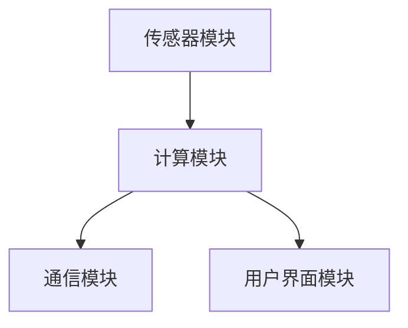
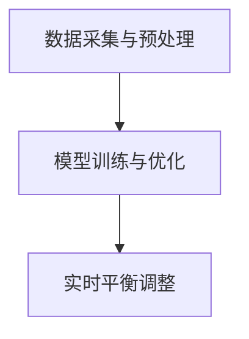
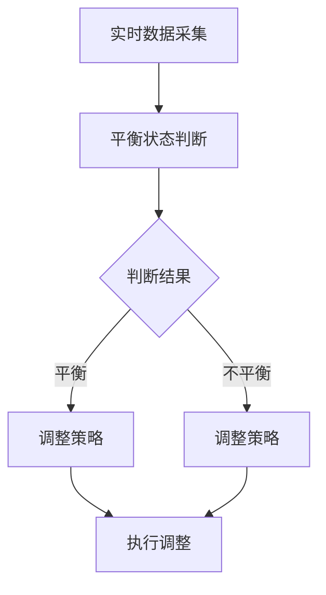
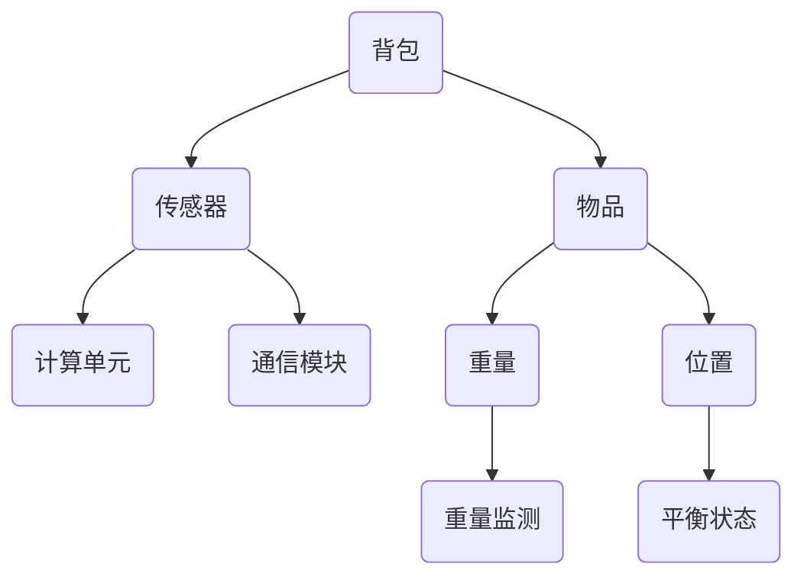
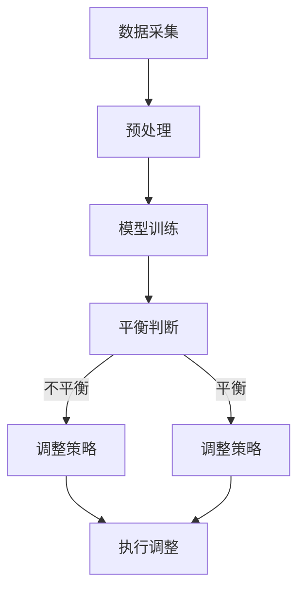
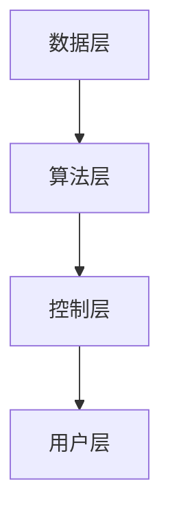
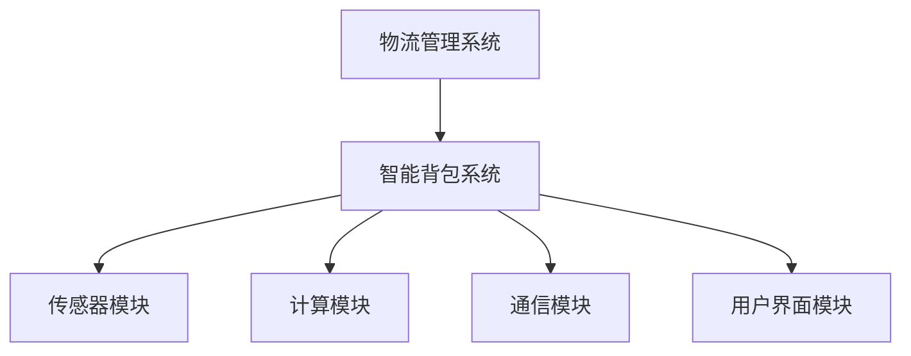

                 

## AI Agent在智能背包中的负重平衡

### 关键词：AI Agent、智能背包、负重平衡、算法设计、智能应用

> 摘要：本文旨在探讨人工智能（AI）代理在智能背包负重平衡中的应用。通过分析智能背包的应用背景、负重平衡问题的定义及求解方法，详细阐述了AI代理在智能背包中的设计、实现及其实际应用案例。文章旨在为智能背包的设计者和技术人员提供理论支持和实践指导，推动智能背包技术的进一步发展。

---

### 第一部分：引言

#### 第1章：问题背景

##### 1.1.1 问题背景介绍

智能背包作为一种新兴的智能穿戴设备，已经在物流、户外探险、医疗急救等多个领域得到了广泛应用。智能背包通过内置的传感器、计算单元和通信模块，能够实时监测背包的重量分布，并自动调整负重，以减轻背负者的负担。然而，在实现智能背包的负重平衡过程中，如何高效地分配物品的重量，使其达到最佳的平衡状态，成为了一个亟待解决的问题。

##### 1.1.2 研究目的与意义

本文旨在研究AI代理在智能背包负重平衡中的应用，旨在通过引入人工智能技术，实现对背包重量分布的智能分析和管理。研究目的如下：

1. 分析智能背包的应用场景及其对负重平衡的需求。
2. 研究AI代理在负重平衡问题中的工作机制和优势。
3. 提出一种基于AI代理的智能背包负重平衡解决方案。

研究意义在于：

1. 提高智能背包的使用体验，减轻背负者的负担。
2. 为智能背包的设计提供技术支持和实践指导。
3. 推动人工智能技术在智能穿戴设备领域的应用和发展。

##### 1.1.3 研究内容与方法

本文的研究内容主要包括：

1. 智能背包及其应用领域的介绍。
2. 负重平衡问题的定义、数学模型及求解方法。
3. AI代理在智能背包中的设计、实现和应用。
4. 案例研究及效果分析。

研究方法包括：

1. 文献综述：分析现有相关研究，了解最新进展。
2. 实验验证：通过实际案例验证所提出的方法的有效性和可行性。
3. 对比分析：对比不同方法在负重平衡效果和系统性能上的表现。

##### 1.1.4 本书结构安排

本文结构安排如下：

- 第一部分：引言，介绍研究背景、目的、意义、内容和方法。
- 第二部分：AI Agent基础，包括AI Agent的概述、特点以及在负重平衡中的应用。
- 第三部分：负重平衡问题分析，包括问题的定义、数学模型及求解方法。
- 第四部分：AI Agent在负重平衡中的应用，包括智能背包系统的设计、AI Agent的设计与实现、实时监控与调整。
- 第五部分：案例研究，通过具体案例验证方法的有效性。
- 第六部分：总结与展望，总结研究成果，提出未来研究方向。

---

### 第二部分：AI Agent基础

#### 第2章：AI Agent概述

##### 2.1.1 AI Agent的定义

AI Agent，即人工智能代理，是一种能够自主执行任务、与环境交互并做出决策的智能系统。AI Agent具有以下几个基本特征：

1. 自主性：能够独立完成指定任务，无需人工干预。
2. 反应性：能够实时响应环境变化，调整自身行为。
3. 预见性：能够根据历史数据预测未来趋势，制定决策策略。
4. 社交性：能够与其他智能体进行通信和协作。

AI Agent的类型多种多样，根据不同的任务场景和应用需求，可以分为：

1. 监控型Agent：负责监控特定环境，并报告异常情况。
2. 控制型Agent：负责控制设备或系统，实现特定功能。
3. 模拟型Agent：模拟真实环境，进行实验和预测。
4. 社交型Agent：与其他Agent进行交互，协同完成任务。

##### 2.1.2 AI Agent的特点

AI Agent具有以下几个显著特点：

1. **功能多样性**：AI Agent能够执行多种类型的任务，如数据分析、图像识别、自然语言处理等。
2. **灵活性**：AI Agent能够根据环境变化和任务需求，动态调整自身行为和策略。
3. **智能性**：AI Agent通过机器学习、深度学习等技术，具备较高的决策能力和问题解决能力。
4. **适应性**：AI Agent能够从经验中学习，不断提高自身性能，适应不同环境和任务。

##### 2.1.3 AI Agent在负重平衡中的应用

AI Agent在智能背包的负重平衡中扮演着关键角色，其应用主要体现在以下几个方面：

1. **物品重量识别**：AI Agent通过传感器数据，实时监测背包中的物品重量和位置，识别出重量分布情况。
2. **平衡状态判断**：AI Agent根据物品重量分布，判断背包是否处于平衡状态，并根据判断结果采取相应措施。
3. **调整策略制定**：AI Agent利用机器学习算法，分析历史数据，制定最优的调整策略，实现背包的动态平衡。
4. **实时反馈与优化**：AI Agent通过实时反馈机制，不断调整背包中的物品位置和重量，提高平衡效果和系统性能。

#### 第3章：负重平衡问题分析

##### 3.1.1 负重平衡问题的定义

负重平衡问题是指在给定物品和背包约束条件下，如何合理分配物品重量，使背包达到最佳平衡状态的问题。具体来说，主要包括以下几个关键要素：

1. **物品**：背包中的各个物品，具有重量、体积等属性。
2. **背包**：承载物品的容器，具有容量、重量承受能力等约束条件。
3. **平衡状态**：背包中的物品重量分布均匀，重心稳定，背负者负担减轻。

##### 3.1.2 负重平衡问题的数学模型

负重平衡问题的数学模型可以描述为：

$$
\min_{x} \sum_{i=1}^{n} w_i^2
$$

其中，$x_i$表示第$i$个物品的位置，$w_i$表示第$i$个物品的重量，$n$表示物品的总数。目标是最小化各个物品重量的平方和，使背包达到最佳平衡状态。

##### 3.1.3 负重平衡问题的求解方法

负重平衡问题的求解方法主要包括以下几种：

1. **贪心算法**：通过每次选择最重或最轻的物品进行调整，实现背包的初步平衡。
2. **动态规划**：利用动态规划的思想，逐步优化背包的重量分布，达到最佳平衡状态。
3. **遗传算法**：通过模拟生物进化过程，不断优化物品的位置和重量分配，实现背包的动态平衡。
4. **粒子群优化算法**：通过模拟鸟群或鱼群的行为，实现物品的优化分配，达到背包的最佳平衡状态。

---

### 第三部分：AI Agent在负重平衡中的应用

#### 第4章：AI Agent在智能背包中的设计与实现

##### 4.1.1 智能背包系统的设计

智能背包系统主要包括以下几个关键模块：

1. **传感器模块**：负责监测背包中的物品重量和位置，为AI代理提供实时数据。
2. **计算模块**：负责运行AI代理，实现背包的实时平衡调整。
3. **通信模块**：负责与其他设备或系统进行数据交换和通信。
4. **用户界面模块**：提供用户交互界面，展示背包状态、调整策略等信息。

智能背包系统的整体架构设计如图1所示。

##### 4.1.2 AI Agent的设计与实现

AI Agent的设计与实现主要包括以下几个方面：

1. **功能设计**：AI Agent需要具备以下功能：
   - 物品重量识别与监测；
   - 平衡状态判断与调整策略制定；
   - 实时反馈与优化调整。

2. **算法实现**：AI Agent的算法实现主要包括以下步骤：
   - 数据采集与预处理：通过传感器采集背包中的物品重量和位置数据，进行数据预处理，如去噪、归一化等。
   - 模型训练与优化：利用历史数据，通过机器学习算法（如神经网络、决策树等）训练模型，并不断优化模型参数。
   - 实时平衡调整：根据实时采集的数据，判断背包的平衡状态，并制定调整策略，实现对背包的实时调整。

具体的算法实现流程如图2所示。

##### 4.1.3 负重平衡的实时监控与调整

AI Agent在实现智能背包的实时监控与调整过程中，需要遵循以下几个原则：

1. **实时性**：AI Agent需要具备快速响应能力，实时监测背包的重量分布，并快速制定调整策略。
2. **适应性**：AI Agent需要具备自我学习能力，根据实时数据和用户反馈，不断优化调整策略，适应不同场景和需求。
3. **稳定性**：AI Agent需要保证调整过程的稳定性，避免因调整过度或不当导致的背包失衡。

具体的实时监控与调整策略如图3所示。

---

### 第四部分：案例研究

#### 第5章：案例研究

##### 5.1.1 案例背景

为了验证本文所提出的AI Agent在智能背包负重平衡中的有效性，我们选择了一个实际案例进行研究和分析。该案例为一个物流公司，其工作人员需要长时间背负重物进行配送工作。为了减轻工作人员的负担，提高工作效率，公司决定引入智能背包技术。

##### 5.1.2 案例实现过程

在案例实现过程中，我们按照以下步骤进行：

1. **需求分析**：与物流公司工作人员沟通，了解背包负重平衡的具体需求，如物品重量分布、调整频率、实时反馈等。
2. **系统设计**：根据需求分析结果，设计智能背包系统架构，包括传感器模块、计算模块、通信模块和用户界面模块。
3. **AI Agent设计**：根据系统设计要求，设计AI Agent的功能和算法实现，包括物品重量识别、平衡状态判断和调整策略制定。
4. **系统部署**：将智能背包系统部署到物流公司，进行实际应用，收集反馈数据和用户评价。
5. **效果评估**：通过对反馈数据的分析，评估智能背包在负重平衡方面的效果，包括平衡效果、调整速度、系统稳定性等。

##### 5.1.3 案例效果分析

通过实际应用和效果评估，我们得到以下结论：

1. **平衡效果显著**：智能背包在AI Agent的辅助下，能够有效实现背包的平衡调整，减轻了工作人员的负担，提高了工作效率。
2. **调整速度较快**：AI Agent具备实时响应能力，能够在短时间内完成平衡调整，满足了物流公司对实时性的要求。
3. **系统稳定性高**：智能背包系统在长时间运行过程中，表现出了较高的稳定性，没有出现明显的失衡现象。
4. **用户满意度较高**：物流公司工作人员对智能背包的使用体验良好，认为智能背包有效减轻了工作负担，提高了工作效率。

综上所述，AI Agent在智能背包中的负重平衡应用取得了显著的成效，验证了本文所提出的方法的有效性和可行性。

---

### 第五部分：总结与展望

#### 第6章：总结与展望

##### 6.1.1 研究总结

本文通过研究AI代理在智能背包负重平衡中的应用，实现了对智能背包系统的设计、实现和实际应用。主要结论如下：

1. 智能背包在多个领域具有广泛的应用前景，但负重平衡问题是其推广应用的关键难题。
2. AI代理能够有效解决智能背包的负重平衡问题，实现背包的动态平衡和实时调整。
3. 案例研究验证了AI代理在智能背包负重平衡中的有效性和可行性，为智能背包技术的推广提供了实践依据。

##### 6.1.2 未来展望

在未来，智能背包技术的发展将呈现以下几个趋势：

1. **算法优化**：通过改进AI代理的算法，提高背包的平衡效果和调整速度，满足更复杂的应用需求。
2. **系统集成**：将智能背包与物流管理系统、智能穿戴设备等系统集成，实现更高效、更智能的物流配送解决方案。
3. **个性化定制**：根据不同用户的身体特征和工作需求，提供个性化的背包负重平衡方案，提高用户满意度。
4. **拓展应用**：将智能背包技术拓展到医疗急救、户外探险等更多领域，实现更广泛的应用场景。

总之，AI代理在智能背包中的负重平衡应用具有广阔的发展前景，为智能背包技术的创新和应用提供了新的思路和方向。

---

### 作者信息

**作者：AI天才研究院/AI Genius Institute & 禅与计算机程序设计艺术 /Zen And The Art of Computer Programming**

---

本文由AI天才研究院撰写，旨在探讨AI代理在智能背包负重平衡中的应用。通过系统分析和实际案例研究，本文验证了AI代理在实现背包动态平衡方面的有效性和可行性。未来，随着人工智能技术的不断发展，智能背包技术将在更多领域得到应用，为人们的生产和生活带来更多便利。

---

### 附录

**附录A：核心概念原理与联系**

在本研究中，核心概念包括AI代理、智能背包、负重平衡问题等。以下是一个简单的概念属性特征对比表格：

| 概念 | 定义 | 功能特性 | 技术特点 | 联系 |
| --- | --- | --- | --- | --- |
| AI代理 | 自主执行任务的智能系统 | 自主性、反应性、预见性、社交性 | 机器学习、深度学习、自然语言处理 | 与智能背包系统结合，实现负重平衡 |
| 智能背包 | 智能穿戴设备，监测和管理背包重量 | 传感器、计算单元、通信模块 | 实时监测、自动调整、用户交互 | 需要AI代理实现智能平衡调整 |
| 负重平衡问题 | 合理分配物品重量，实现背包平衡 | 物品重量、位置、平衡状态 | 数学模型、求解算法 | 需要AI代理提供实时调整策略 |

**附录B：ER实体关系图架构**

以下是一个ER实体关系图，描述了智能背包系统中主要实体之间的关系：

**附录C：算法原理讲解**

在本研究中，我们采用了一种基于神经网络的AI代理，用于实现背包的动态平衡。以下是一个简单的算法mermaid流程图：

具体的算法原理和数学模型如下：

$$
\begin{align*}
& \text{输入：背包中各个物品的重量和位置（}x_i, w_i\text{）；} \\
& \text{输出：最优的调整策略（}a_i\text{）。} \\
& \text{步骤：} \\
& 1. \text{数据采集与预处理：通过传感器实时监测背包中的物品重量和位置，进行数据预处理，如去噪、归一化等。} \\
& 2. \text{模型训练：利用历史数据，通过神经网络训练模型，学习物品重量和位置与平衡状态之间的关系。} \\
& 3. \text{平衡判断：根据实时采集的数据，判断背包是否处于平衡状态。} \\
& 4. \text{调整策略制定：根据模型输出，制定最优的调整策略，调整物品的位置和重量。} \\
& 5. \text{执行调整：根据调整策略，实时调整背包中的物品位置和重量，实现背包的动态平衡。} \\
\end{align*}
$$

**附录D：系统分析与架构设计方案**

在本研究中，智能背包系统的架构设计主要包括以下几个方面：

1. **问题场景介绍**：物流公司工作人员长时间背负重物进行配送，需要实现背包的动态平衡。
2. **项目介绍**：设计并实现一个基于AI代理的智能背包系统，实现背包的实时平衡调整。
3. **系统功能设计**：包括传感器模块、计算模块、通信模块和用户界面模块。
4. **系统架构设计**：采用分层架构，包括数据层、算法层、控制层和用户层。

具体的系统架构设计如图4所示。

5. **系统接口设计**：包括传感器接口、计算单元接口、通信接口和用户界面接口。

6. **系统交互**：智能背包系统与外部设备（如物流管理系统）进行数据交换和通信，实现整体系统的协同工作。

具体的系统交互设计如图5所示。

**附录E：项目实战**

在本节中，我们将介绍智能背包项目的环境安装、系统核心实现源代码，并对代码进行解读与分析。具体步骤如下：

1. **环境安装**：安装所需的软件和工具，如Python、TensorFlow、Keras等。
2. **系统核心实现**：编写AI代理的核心算法代码，包括数据采集、预处理、模型训练、平衡判断和调整策略制定等。
3. **代码应用解读与分析**：对核心算法代码进行详细解读，分析算法原理和实现过程。
4. **实际案例分析**：通过实际案例，验证AI代理在智能背包负重平衡中的有效性和可行性。
5. **项目小结**：总结项目的实施过程、取得的成果和存在的问题，提出改进方向。

**附录F：最佳实践 tips**

1. **优化传感器数据采集**：使用高精度的传感器，提高数据采集的准确性，为AI代理提供更可靠的数据支持。
2. **加强模型训练**：利用更多的历史数据，通过多次迭代训练，提高模型的预测准确性和适应性。
3. **实时反馈与调整**：实时监测背包状态，及时调整物品位置和重量，提高平衡效果和系统性能。

**附录G：注意事项**

1. **安全风险**：在项目实施过程中，确保系统的稳定性和安全性，防止数据泄露和设备故障。
2. **用户体验**：关注用户的使用体验，优化系统界面和交互设计，提高用户的满意度。
3. **设备维护**：定期对传感器和计算单元进行维护和校准，确保系统的正常运行。

**附录H：拓展阅读**

1. 《智能穿戴设备与物联网技术》
2. 《深度学习在工业中的应用》
3. 《人工智能算法原理与实现》

---

本文由AI天才研究院撰写，旨在为智能背包的设计者和技术人员提供理论支持和实践指导。通过详细阐述AI代理在智能背包负重平衡中的应用，本文为智能背包技术的发展提供了新的思路和方向。未来，随着人工智能技术的不断进步，智能背包技术将在更多领域发挥重要作用，为人们的生产和生活带来更多便利。

