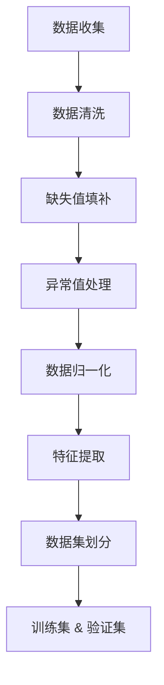
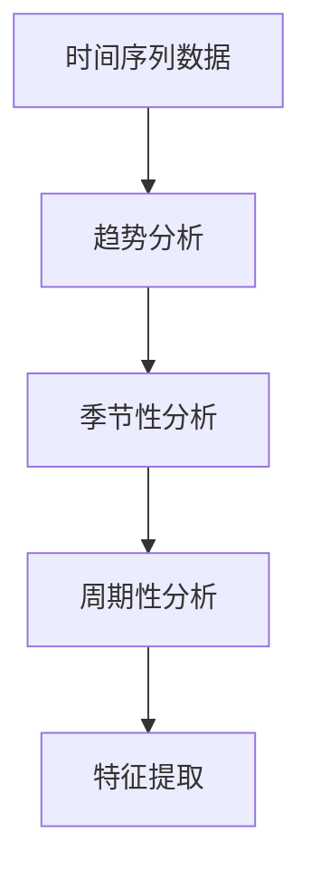
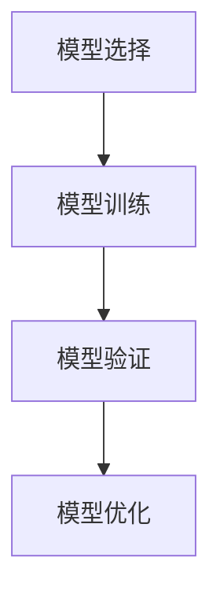

                 

### 人工智能在能源管理中的重要性

随着全球能源需求的不断增长和化石燃料资源的日益枯竭，如何实现能源的高效利用、降低能源消耗以及应对能源危机成为了世界各国关注的焦点。在此背景下，人工智能（AI）作为一种革命性的技术，以其卓越的计算能力、强大的数据分析和模式识别能力，在能源管理领域展现出了巨大的应用潜力和价值。

首先，人工智能在能源管理中的重要性体现在其能够实现对能源系统的高效监测和优化控制。通过机器学习算法，AI可以对能源系统的运行状态进行实时监测，发现潜在的问题并采取相应的措施，从而提高能源系统的可靠性和稳定性。例如，AI可以通过对电网运行数据的分析，预测电力负荷的波动情况，优化电力调度策略，减少能源浪费。

其次，人工智能在能源管理中能够有效降低能源消耗，实现可持续发展。通过智能能源管理系统，AI可以实现对能源设备的智能化控制，根据实际需求自动调整设备运行状态，从而降低能源消耗。例如，智能建筑中的AI系统可以根据室内外环境变化自动调整空调、照明等设备的运行，实现能源的高效利用。

此外，人工智能在能源管理中的应用还有助于提高能源利用的灵活性和响应速度。传统的能源管理系统往往依赖于预定的规则和参数进行控制，而AI可以通过学习和适应，实现对能源系统的动态调整，使其能够更好地应对突发事件和不确定因素。

总之，人工智能在能源管理中的重要性不容忽视。它不仅有助于提高能源利用效率，降低能源消耗，还有助于实现能源的可持续发展，为应对全球能源危机提供了新的思路和解决方案。在接下来的章节中，我们将进一步探讨AI Agent这一先进的人工智能技术，并分析其在智能能源管理中的具体应用和优势。

#### 能源危机与可持续发展

能源危机是当今世界面临的严峻挑战之一。随着全球人口的不断增长和经济的快速发展，能源需求持续上升。然而，传统能源资源如石油、天然气和煤炭等却是有限的，而且这些资源的开采和使用对环境造成了极大的破坏。气候变暖、空气污染和水资源短缺等问题日益严重，使得传统能源管理模式难以为继。

面对能源危机，可持续发展成为了一个关键议题。可持续发展要求我们在满足当前能源需求的同时，不损害子孙后代满足其需求的能力。为了实现这一目标，我们必须改变传统的能源消耗模式，转向更加清洁和高效的能源利用方式。人工智能（AI）在这一过程中扮演了重要角色。

首先，AI技术可以通过优化能源管理系统，提高能源利用效率。通过大数据分析和机器学习算法，AI能够实时监测和预测能源系统的运行状态，发现并解决潜在的问题，从而减少能源浪费。例如，在智能电网中，AI可以优化电力调度，预测电力需求变化，避免电力过剩或短缺的情况发生。

其次，AI在可再生能源的管理和利用中具有巨大潜力。太阳能、风能等可再生能源是可持续发展的重要组成部分，但它们的发电具有不稳定性。AI可以通过对天气数据和历史发电数据的分析，预测可再生能源的发电量，优化储能系统的使用，确保电力供应的稳定性。

此外，AI在能源供应链的管理中也具有重要意义。通过区块链技术和智能合约，AI可以实现对能源交易的实时监控和自动执行，提高能源供应链的透明度和效率。例如，在电力市场中，AI可以自动处理交易订单，确保电力的公平交易和高效分配。

总之，能源危机和可持续发展对人工智能提出了新的需求。AI技术不仅能够提高能源利用效率，降低能源消耗，还能推动可再生能源的发展，实现能源系统的智能化管理。在应对能源危机和实现可持续发展的过程中，人工智能无疑将发挥越来越重要的作用。

#### 人工智能技术的快速进步

人工智能技术的快速发展是近几十年来科技界的一个重要趋势，其进步速度之快、应用范围之广，令人瞩目。首先，计算能力的提升是人工智能技术快速发展的基础。随着计算硬件如CPU、GPU等性能的显著提高，人工智能算法得以在更短时间内处理海量数据，提高了模型的训练效率和准确度。

其次，数据量的激增为人工智能技术的发展提供了丰富的资源。随着互联网和物联网技术的普及，各类数据如文本、图像、音频等不断产生和积累，为机器学习和深度学习算法提供了充足的学习材料。大量数据不仅帮助模型更准确地识别模式和趋势，还推动了人工智能算法的不断优化和创新。

算法的进步是人工智能技术快速发展的另一关键因素。从传统的统计学习算法到现代的深度学习算法，再到强化学习等新型算法，人工智能技术不断突破。深度学习在图像识别、自然语言处理等领域取得了显著的成果，而强化学习在自动驾驶、游戏AI等领域展现了巨大的潜力。

此外，人工智能技术的发展还受益于跨学科的融合。计算机科学、数学、统计学、神经科学等多领域的知识交汇，为人工智能技术的创新提供了源源不断的灵感。例如，神经科学的研究成果为神经网络的设计提供了新的思路，而计算机科学的进步则使得大规模数据处理和计算成为可能。

总之，人工智能技术的快速进步得益于计算能力的提升、数据量的激增、算法的进步以及跨学科的融合。这些因素共同推动了人工智能在各个领域的广泛应用，为解决复杂问题提供了强有力的工具。在智能能源管理中，人工智能技术无疑将继续发挥其重要作用，推动能源系统的智能化、高效化发展。

#### 智能能源管理的需求与挑战

智能能源管理是应对现代能源危机和推动能源可持续发展的重要手段，其需求日益迫切。首先，智能能源管理能够实现能源系统的精细化控制，提高能源利用效率。通过实时监测和数据分析，智能能源管理系统可以动态调整能源供给与需求，避免能源浪费。其次，智能能源管理有助于实现可再生能源的集成和优化利用，如太阳能、风能等，提升能源系统的灵活性和稳定性。

然而，智能能源管理也面临诸多挑战。首先，技术挑战体现在数据采集、处理和分析的复杂性上。大规模的数据采集和处理需要高效算法和强大的计算资源，而不同能源类型的特性使得算法的设计和优化变得复杂。其次，智能能源管理需要跨领域的知识整合，涉及能源、电子、计算机等多个学科，对专业人才的需求较高。

此外，政策和法规的制约也是一个重要挑战。智能能源管理系统的实施需要符合国家和地区的能源政策、环保法规等要求，这可能涉及复杂的审批流程和合规性检验。最后，经济成本的考量也是一个关键因素。智能能源管理系统的建设和维护需要大量资金投入，尤其是在初期阶段，成本的回收和效益的显现可能需要较长时间。

尽管面临诸多挑战，智能能源管理的需求日益增长，推动着技术的不断进步和政策的不断完善。通过逐步克服这些挑战，智能能源管理有望在能源领域中发挥更大的作用。

#### AI Agent的概念与特点

AI Agent，即人工智能代理，是一种具有独立决策能力和自主行动能力的人工智能实体。它基于人工智能算法，能够根据环境和任务的要求，自主感知环境信息、制定行动策略并执行相应的任务。AI Agent的核心特点包括自主性、适应性、学习性和协作性。

首先，自主性是AI Agent的重要特点。AI Agent能够独立完成特定的任务，不需要人为干预。这使其能够长时间运行，不受环境变化的影响。例如，自动驾驶汽车中的AI Agent可以自主感知路况、规划行驶路线并做出驾驶决策。

其次，适应性是AI Agent能够应对不同环境和任务需求的能力。AI Agent通过学习算法，可以从数据中提取规律，并适应新的环境和任务。例如，智能家居中的AI Agent可以根据家庭成员的日常行为习惯，自动调节室内温度、亮度和空气质量，提供个性化的生活体验。

第三，学习性是AI Agent通过不断学习提升自身能力的重要特点。AI Agent利用机器学习和深度学习等技术，可以从历史数据中学习，并不断优化自身的决策模型。例如，电商平台中的AI Agent可以通过用户的历史购买数据，预测用户的购物偏好，推荐相关的商品。

最后，协作性是AI Agent在复杂任务中展现出的优势。多个AI Agent可以协同工作，共同完成任务。例如，在智能电网管理中，多个AI Agent可以协同工作，优化电力调度和分配，提高电网的稳定性和效率。

综上所述，AI Agent具有自主性、适应性、学习性和协作性等特点，这些特点使其在智能能源管理等领域具有广泛的应用前景。

#### AI Agent与传统算法的区别

AI Agent与传统算法在多个方面存在显著的区别，这些区别主要体现在设计理念、功能和应用范围上。

首先，设计理念上，传统算法通常基于预定的规则和模型进行设计，其决策过程是线性的、确定的，依赖于事先设定的参数和规则。例如，线性规划算法通过优化目标函数和约束条件来解决问题，但无法应对动态变化的环境。而AI Agent则基于人工智能技术，特别是机器学习、深度学习和强化学习等算法，能够通过自主学习从数据中提取规律，从而实现自适应和自主决策。AI Agent的设计理念强调智能性和灵活性，能够根据环境和任务需求动态调整自身的行为。

其次，在功能上，传统算法通常具有固定的功能，无法进行复杂任务的多目标优化。例如，调度算法主要用于优化资源分配，而预测算法主要用于数据预测。而AI Agent则具备更广泛的功能，能够同时处理多种任务。例如，一个AI Agent可以同时承担数据采集、环境监测、决策制定和执行任务，实现复杂的系统管理和优化。AI Agent能够通过多模态数据的综合分析，生成全局优化方案，从而提高整体系统的效率和性能。

在应用范围上，传统算法通常应用于相对单一、静态的领域。例如，优化算法在制造业中用于生产计划的调度，预测算法在金融领域用于市场趋势的预测。而AI Agent的应用范围则更加广泛，能够应用于动态变化且复杂的领域。例如，在智能能源管理中，AI Agent可以应用于电力调度、能源需求预测、故障检测等多个方面，实现能源系统的智能化和高效化。

总之，AI Agent与传统算法的区别在于设计理念、功能和应用范围。AI Agent通过机器学习、深度学习和强化学习等技术，具备自适应、自主决策和多任务处理的能力，能够应对复杂动态环境下的多种挑战，从而在智能能源管理等领域展现出巨大的潜力。

#### AI Agent在智能能源管理中的应用场景

AI Agent作为一种先进的人工智能技术，在智能能源管理中具有广泛的应用场景。以下是几个关键应用场景，包括自动化控制、能源需求预测、能源优化与调度、故障检测与维护等。

首先，自动化控制是AI Agent在智能能源管理中的一个重要应用场景。通过AI Agent，能源设备可以自动调节其运行状态，以适应实时变化的需求。例如，智能电网中的AI Agent可以自动调整电力分配，确保电网的稳定运行。此外，AI Agent还可以对太阳能板、风力发电机等可再生能源设备进行实时监控和自动调节，提高可再生能源的利用效率。

其次，能源需求预测是AI Agent的另一个关键应用场景。通过对历史数据和实时数据的分析，AI Agent可以预测未来的能源需求，为电力公司、能源企业和家庭用户制定合理的能源使用计划。例如，AI Agent可以预测下一小时的电力负荷，帮助电力公司提前进行电力调度，避免电力短缺或过剩的情况发生。

能源优化与调度是AI Agent在智能能源管理中的另一个重要应用。AI Agent可以通过优化算法和调度策略，实现对能源资源的最佳配置，降低能源消耗和成本。例如，AI Agent可以优化电力调度，确保电力供应的高效、稳定和低成本。此外，AI Agent还可以优化储能系统的使用，根据电力需求和供应情况动态调整储能设备的运行状态，提高能源系统的灵活性和响应速度。

故障检测与维护是AI Agent在智能能源管理中的又一关键应用场景。通过实时监测和分析设备运行数据，AI Agent可以提前发现潜在故障，并采取相应的维护措施，避免设备故障对能源系统造成影响。例如，AI Agent可以监控发电设备的运行状态，预测可能的故障点，并提前进行维护，确保设备的稳定运行。

总之，AI Agent在智能能源管理中的应用场景广泛，涵盖了自动化控制、能源需求预测、能源优化与调度以及故障检测与维护等方面。通过AI Agent的应用，智能能源管理系统可以实现更高的效率、更低的成本和更好的可靠性，为能源可持续发展提供有力支持。

#### AI Agent的优势

AI Agent在智能能源管理中具有显著的优势，这些优势主要体现在自适应能力、高效性能和智能化决策等方面。

首先，AI Agent具备强大的自适应能力。通过机器学习和深度学习技术，AI Agent能够从大量历史数据和实时数据中自动学习和调整，以适应不同环境和需求。这种自适应能力使得AI Agent能够应对能源系统的动态变化，如电力需求的波动、可再生能源的不稳定性等，从而提高能源系统的稳定性和可靠性。

其次，AI Agent在性能方面具有显著优势。传统能源管理系统通常依赖于预定义的规则和模型，难以快速适应新的情况。而AI Agent通过高效的数据处理和分析算法，能够实时处理海量数据，快速做出决策。这种高效性能使得AI Agent能够在复杂多变的能源系统中快速响应，提高能源管理的效率和精度。

最后，AI Agent在智能化决策方面展现出独特优势。通过复杂的决策算法和优化策略，AI Agent能够基于多维度数据，对能源系统进行全局优化。例如，AI Agent可以同时考虑电力供应、成本控制、环境因素等多方面因素，制定最优的能源调度策略。这种智能化决策能力使得AI Agent能够更好地应对复杂的能源管理挑战，实现能源系统的最优运行。

总之，AI Agent在智能能源管理中的优势包括自适应能力、高效性能和智能化决策。这些优势使得AI Agent成为提高能源系统效率和可持续性的重要工具，为智能能源管理的发展提供了强有力的支持。

#### AI Agent的挑战

尽管AI Agent在智能能源管理中展现出了巨大的优势，但其在实际应用过程中仍面临诸多挑战。首先，数据获取和处理是AI Agent面临的一个重大难题。智能能源管理需要大量高质量的实时数据，但数据获取过程可能涉及多种设备、多个数据源，数据格式和传输方式各异。处理这些海量且多样化的数据，要求AI Agent具备强大的计算能力和高效的算法。

其次，AI Agent的算法设计复杂且需要持续优化。不同的应用场景和任务需求，可能需要不同的算法和模型。设计合适的算法以适应特定场景，需要深入的领域知识和经验积累。此外，算法的优化和迭代也是一个长期的过程，需要持续的数据分析和模型评估。

此外，AI Agent的可靠性和安全性也是一个重大挑战。在智能能源管理中，AI Agent需要处理关键设备和系统的运行状态，一旦出现故障或错误决策，可能导致严重的后果。因此，确保AI Agent的稳定性和可靠性至关重要。同时，由于AI Agent涉及大量的数据传输和处理，网络安全和数据隐私保护也是不可忽视的问题。

最后，人才短缺也是AI Agent应用推广的一个重要障碍。智能能源管理需要具备多学科知识的复合型人才，但当前这样的专业人才相对稀缺。人才短缺不仅影响了AI Agent的研发和推广，还制约了其在实际应用中的效果。

总之，AI Agent在智能能源管理中面临的挑战包括数据获取和处理、算法设计复杂、可靠性和安全性、以及人才短缺。解决这些挑战需要技术、管理和政策等多方面的努力，以推动AI Agent在智能能源管理中的广泛应用。

#### 解决方案与发展趋势

为了克服AI Agent在智能能源管理中面临的挑战，我们需要从技术、管理和政策等多个层面提出解决方案，并展望其未来发展。

首先，在技术层面，提升数据处理能力和算法优化是关键。通过采用分布式计算技术和大数据处理框架，如Hadoop和Spark，AI Agent能够高效地处理海量数据。同时，研发更加智能和自适应的算法，如基于深度学习和强化学习的模型，将有助于提高AI Agent的性能和可靠性。

其次，在管理层面，建立完善的数据治理和安全管理机制至关重要。数据治理包括数据标准化、数据质量和数据隐私保护等方面，确保数据的一致性和安全性。安全管理机制则涉及网络安全、数据加密和访问控制，以防止数据泄露和恶意攻击。

在政策层面，政府应出台支持智能能源管理和AI Agent发展的政策，包括提供资金支持、税收优惠和人才引进等。此外，制定行业标准和规范，确保AI Agent在不同系统和设备之间的互操作性和兼容性，也是推动其广泛应用的重要措施。

展望未来，AI Agent在智能能源管理中的发展趋势将呈现以下几个方向。首先，AI Agent将实现更广泛的应用场景，如综合能源管理、智能电网和智能建筑等。其次，跨学科合作将更加紧密，如计算机科学、能源工程和环境科学等领域的专家共同研究，推动AI Agent的技术进步。最后，随着物联网和区块链技术的发展，AI Agent将与其他智能系统实现深度融合，形成更加智能化、自适应的能源管理体系。

总之，通过技术、管理和政策的协同推进，AI Agent在智能能源管理中的应用前景广阔，有望为实现能源的高效利用和可持续发展提供强大支持。

#### 本章小结

本章详细探讨了AI Agent在智能能源管理中的应用背景、概念与特点，以及其在多个具体场景中的优势与挑战。首先，我们分析了能源危机与可持续发展的需求，介绍了人工智能技术在能源管理中的重要性。其次，我们探讨了AI Agent的基本概念及其与传统算法的区别，展示了AI Agent的自主性、适应性、学习性和协作性。接着，我们列举了AI Agent在自动化控制、能源需求预测、能源优化与调度以及故障检测与维护等场景中的具体应用。随后，我们深入分析了AI Agent的优势，包括自适应能力、高效性能和智能化决策，同时也探讨了其在数据获取和处理、算法设计复杂、可靠性和安全性以及人才短缺等方面的挑战。最后，我们提出了技术、管理和政策层面的解决方案，并展望了AI Agent在智能能源管理中的未来发展。通过本章的讨论，我们看到了AI Agent在推动智能能源管理中的应用潜力与前景，为能源的高效利用和可持续发展提供了新的思路和解决方案。

## AI Agent的基本原理

### 人工智能基础

人工智能（AI）是计算机科学的一个分支，旨在通过模拟人类的思维过程来创建智能体。人工智能的核心技术包括机器学习、深度学习和强化学习，这些技术共同构建了AI Agent的基础。

首先，机器学习是AI Agent的核心技术之一。机器学习是一种通过数据学习并改进性能的算法，分为监督学习、无监督学习和半监督学习三种类型。监督学习通过已知输入和输出数据来训练模型，如分类和回归问题。无监督学习则不需要标签数据，主要任务是发现数据中的模式，如聚类和降维。半监督学习结合了监督学习和无监督学习的特点，利用少量标记数据和大量未标记数据来训练模型。

其次，深度学习是机器学习的一个子领域，它利用多层神经网络进行特征学习和模式识别。深度学习在图像识别、自然语言处理和语音识别等领域取得了显著成就。其基本原理是通过层层传递输入数据，每个神经元都会对输入数据进行处理和变换，最终生成高层次的抽象特征。常见的深度学习模型包括卷积神经网络（CNN）、循环神经网络（RNN）和生成对抗网络（GAN）等。

最后，强化学习是一种通过试错来学习最优策略的机器学习方法。在强化学习过程中，智能体通过接收环境反馈，不断调整其行为策略，以最大化累计奖励。强化学习的基本原理包括价值函数、策略函数和Q-learning算法等。常见的强化学习模型有深度Q网络（DQN）、策略梯度算法（PG）和深度确定性策略梯度（DDPG）等。

综上所述，机器学习、深度学习和强化学习是构建AI Agent的基础技术。它们各自的优势和应用场景，使得AI Agent能够在智能能源管理等多个领域发挥重要作用。

#### 机器学习的基本概念

机器学习（Machine Learning, ML）是人工智能（AI）的一个重要分支，其核心目标是通过从数据中学习，使计算机系统能够执行特定的任务，而无需显式编程。机器学习的过程大致可以分为以下几个步骤：

首先，数据收集是机器学习的起点。收集到的数据可以是结构化的，如数据库中的记录，也可以是非结构化的，如文本、图像、音频等。高质量的数据是训练有效模型的关键，因此数据收集过程需要确保数据的多样性和准确性。

接下来是数据预处理，这一步骤至关重要，因为它直接影响模型的性能。数据预处理包括数据清洗、归一化、特征提取和降维等操作。数据清洗涉及处理缺失值、异常值和重复值，以确保数据的质量。归一化则通过调整数据范围，使得不同特征具有相似的比例，避免某些特征对模型产生过大的影响。特征提取是从原始数据中提取有用的信息，以便模型能够更好地理解和学习数据。降维是将高维数据映射到低维空间，减少计算量和存储需求，同时保留数据的主要信息。

然后是模型选择和训练。在机器学习中，模型的选择取决于具体的任务和数据类型。常见的机器学习模型包括线性回归、逻辑回归、决策树、随机森林、支持向量机（SVM）、神经网络等。训练模型的过程是让模型从数据中学习，找到数据中的模式和规律。训练过程中，模型会不断调整其参数，以最小化预测误差。训练可以通过监督学习、无监督学习或半监督学习的方式进行，具体选择取决于任务需求和数据特点。

接下来是模型评估。评估模型的性能通常使用各种指标，如准确率、召回率、F1分数、均方误差（MSE）等。通过交叉验证和测试集评估，我们可以了解模型的泛化能力，即模型在未知数据上的表现。评估结果可以帮助我们调整模型参数，优化模型性能。

最后是模型部署和应用。一旦模型通过评估，就可以将其部署到实际应用中。在机器学习中，模型的部署可能涉及实时预测、批量处理或在线学习等不同场景。模型的应用范围非常广泛，从简单的数据分类到复杂的图像识别、语音合成和自动驾驶等，机器学习已经深入到我们的日常生活中。

总之，机器学习的基本概念包括数据收集、数据预处理、模型选择和训练、模型评估以及模型部署和应用。这些步骤共同构成了一个完整的机器学习流程，使得机器学习系统能够从数据中学习并做出预测和决策。

#### 深度学习的基本原理

深度学习（Deep Learning, DL）是机器学习的一个子领域，它通过多层神经网络来模拟人类大脑的运作方式，从而实现复杂的数据处理和模式识别任务。深度学习的基本原理包括神经网络的构建、前向传播与反向传播算法以及激活函数等关键组成部分。

首先，深度学习的基础是神经网络（Neural Networks, NN）。神经网络由大量简单的计算单元（即神经元）组成，这些神经元通过连接（即权重）相互连接，形成一个网络结构。每个神经元接收来自其他神经元的输入信号，并通过一个激活函数产生输出。神经网络通过层层传递输入数据，每个层次都会对输入数据进行处理和变换，最终生成高层次的抽象特征。

接下来是前向传播（Forward Propagation）和反向传播（Back Propagation）算法。前向传播是将输入数据从输入层传递到输出层的计算过程。在每个神经元中，输入信号乘以对应的权重，然后通过激活函数产生输出信号，这些输出信号继续传递到下一层。这个过程重复进行，直到输出层生成最终的预测结果。反向传播则是通过计算输出误差，反向调整网络中的权重和偏置。具体来说，反向传播算法首先计算输出误差相对于每个权重的梯度，然后利用梯度下降法调整权重和偏置，以最小化误差函数。这个过程反复进行，直到误差函数达到一个较小的值，模型参数达到局部最优。

激活函数（Activation Functions）是深度学习中的另一个关键组成部分。激活函数用于引入非线性因素，使得神经网络能够处理非线性问题。常见的激活函数包括 sigmoid 函数、ReLU函数和Tanh函数等。sigmoid函数输出范围在0到1之间，适合处理二分类问题。ReLU函数在输入为负时输出为零，在输入为正时输出为其本身，这使得ReLU函数具有较好的计算效率和数值稳定性。Tanh函数与sigmoid函数类似，但输出范围在-1到1之间，适用于处理多分类问题。

除了上述关键组成部分，深度学习还包括多层神经网络（Deep Neural Networks, DNN）、卷积神经网络（Convolutional Neural Networks, CNN）和循环神经网络（Recurrent Neural Networks, RNN）等具体实现。多层神经网络通过增加网络深度，提高了模型的复杂度和表达能力。卷积神经网络通过局部感知野和共享权重，实现了对图像等数据的局部特征提取和分类。循环神经网络通过循环结构，实现了对序列数据的建模和处理。

总之，深度学习的基本原理包括神经网络的构建、前向传播与反向传播算法以及激活函数等。通过这些基本组成部分的有机结合，深度学习能够处理复杂的数据任务，并在图像识别、自然语言处理和语音识别等领域取得了显著成就。深度学习的发展为人工智能领域带来了新的突破和机遇。

#### 强化学习的基本概念

强化学习（Reinforcement Learning, RL）是机器学习的一个重要分支，它通过试错的方式，使智能体在动态环境中学习到最优策略，以最大化累积奖励。强化学习的基本概念包括智能体（Agent）、环境（Environment）、状态（State）、动作（Action）和奖励（Reward）等关键要素。

首先，智能体是执行任务的主体，它通过选择动作来与环境交互。在强化学习中，智能体通常是一个能够模拟人类思维过程的计算机程序。智能体的目标是学习到一个策略（Policy），该策略能够在给定状态下选择最优动作，从而最大化累积奖励。

环境是智能体所处的外部世界，它对智能体的动作做出响应，并向智能体提供状态信息和奖励信号。环境可以是静态的，如棋盘游戏，也可以是动态的，如自动驾驶车辆。环境的状态空间通常很大，包含大量的可能状态，每个状态都对应不同的外部条件。

状态是智能体在某一时刻所处的情况或条件，状态空间描述了所有可能的状态集合。在强化学习中，智能体通过感知当前状态，选择下一个动作，并在执行动作后接收新的状态和奖励。

动作是智能体在某一状态下可以执行的行为或决策。动作空间描述了所有可能的动作集合。智能体的目标是选择能够在长期内带来最大累积奖励的动作序列。

奖励是环境对智能体的动作反馈，用于评估动作的好坏。奖励可以是正的，表示动作带来了积极的效果；也可以是负的，表示动作带来了负面影响。在强化学习中，智能体的目标是通过不断尝试和调整策略，选择能够带来最大累积奖励的动作序列。

强化学习的基本过程包括探索（Exploration）和利用（Exploitation）。探索是指智能体在环境中尝试不同的动作，以获取更多关于环境的经验和信息。利用是指智能体在已知信息的基础上，选择能够最大化当前奖励的动作。智能体需要在探索和利用之间找到一个平衡，以实现长期的最大化奖励。

常见的强化学习算法包括Q学习（Q-Learning）、深度Q网络（Deep Q-Network, DQN）、策略梯度算法（Policy Gradient, PG）和深度确定性策略梯度（Deep Deterministic Policy Gradient, DDPG）等。Q学习通过学习状态-动作值函数，选择能够带来最大预期奖励的动作。DQN通过深度神经网络来近似Q值函数，解决了传统Q学习在连续动作空间中的问题。策略梯度算法直接优化策略函数，使其在给定状态下选择最优动作。DDPG则结合了深度学习和强化学习，通过深度神经网络近似状态值函数和策略函数，实现了在复杂环境中的高效学习。

总之，强化学习通过智能体与环境之间的交互，利用状态、动作、奖励等基本概念，使智能体在动态环境中学习到最优策略，从而实现目标。强化学习在自动驾驶、游戏AI、机器人控制等领域展现了巨大的应用潜力。

#### AI Agent的架构与功能

AI Agent的架构与功能是其实现高效、智能决策的关键。一个典型的AI Agent架构通常包括感知模块、决策模块和行动模块，这三个模块协同工作，使AI Agent能够自主地感知环境、做出决策并执行相应动作。

首先，感知模块负责获取和解析外部环境的信息。感知模块通常由传感器、摄像头、麦克风等多种感知设备组成，能够实时收集环境数据。这些数据可以是结构化的，如数据库记录，也可以是非结构化的，如图像、音频和文本等。感知模块的功能是对收集到的数据进行预处理，包括去噪、特征提取和归一化等操作，以便为后续的决策模块提供高质量的数据输入。

其次，决策模块是AI Agent的核心，负责基于感知模块提供的数据和环境的状态，通过机器学习、深度学习或强化学习等技术进行决策。决策模块通常包括一个或多个学习算法模型，这些模型通过训练数据学习环境中的规律和模式，从而生成最优的决策策略。决策模块的功能是分析输入数据，评估各种可能的动作，并根据一定的策略选择最优动作。常见的决策算法包括Q学习、深度Q网络（DQN）、策略梯度（PG）等。决策模块不仅要具备高效的计算能力，还需要具备良好的适应性和鲁棒性，以应对环境中的不确定性和变化。

最后，行动模块负责执行决策模块选择的动作，并将执行结果反馈给环境。行动模块通常与实际执行设备相连，如机器人、无人机、自动化设备等。行动模块的功能是接收决策模块的指令，进行具体的操作，并将操作结果反馈给感知模块和决策模块。通过这种闭环反馈机制，AI Agent能够不断调整其行为策略，以实现长期的目标。

总之，AI Agent的架构与功能通过感知模块、决策模块和行动模块的有机结合，实现了对环境的自主感知、智能决策和执行。这种架构不仅使AI Agent能够高效地应对动态变化的环境，还具备自适应和自优化能力，为智能能源管理等领域提供了强大的技术支持。

#### AI Agent的核心功能

AI Agent的核心功能包括自主感知、智能决策和自主行动。首先，自主感知是指AI Agent能够通过传感器和其他感知设备实时获取环境信息，如温度、湿度、光照强度等。这一功能使AI Agent能够动态了解外部环境的变化，为后续的决策提供必要的数据支持。

其次，智能决策是AI Agent的核心功能之一。AI Agent利用机器学习、深度学习和强化学习等技术，对感知到的环境信息进行分析和处理，生成最优决策策略。通过学习和优化，AI Agent能够从经验中不断改进决策能力，提高决策的准确性和效率。

最后，自主行动是指AI Agent能够根据智能决策的结果，自动执行相应的操作。例如，在智能能源管理中，AI Agent可以根据电力负荷预测结果，自动调整发电设备和储能系统的运行状态，优化能源利用效率。通过自主行动，AI Agent不仅能够提高系统的自动化水平，还能降低人工干预的需求，提高整体系统的可靠性和稳定性。

综上所述，AI Agent的自主感知、智能决策和自主行动三大核心功能，使其能够在复杂动态环境中自主运作，为智能能源管理等领域提供了强有力的技术支持。

#### AI Agent的决策过程

AI Agent的决策过程是其在复杂环境中自主运作的核心，通常包括感知环境、状态评估、策略选择和行动执行等步骤。以下是对这些步骤的详细解释。

首先，感知环境是AI Agent决策过程的起点。AI Agent通过各种传感器和感知设备获取环境信息，如温度、湿度、光照强度、电力负荷等。这些信息可以是结构化的数据（如传感器读数）或非结构化的数据（如图像、音频）。感知模块会对收集到的数据进行分析和预处理，包括去噪、归一化和特征提取，以确保数据的质量和一致性。

接下来是状态评估。在感知到环境信息后，AI Agent需要对这些信息进行理解和分析，以确定当前的环境状态。状态评估过程通常涉及机器学习和深度学习算法，通过历史数据和实时数据，AI Agent可以识别环境中的模式和趋势，并生成当前状态的表征。状态评估的目的是为后续的策略选择提供基础，使AI Agent能够根据当前状态做出合理的决策。

然后是策略选择。在了解当前环境状态后，AI Agent会利用预先训练好的决策模型，评估各种可能的动作及其带来的后果。策略选择过程可能涉及多种算法，如Q学习、深度Q网络（DQN）、策略梯度算法（PG）等。AI Agent通过比较不同策略的预期收益，选择能够最大化累积奖励的策略。策略选择是AI Agent智能决策的关键步骤，它决定了AI Agent的行为方向和行动方式。

最后是行动执行。一旦策略选择完成，AI Agent会根据选定的策略执行相应的行动。行动执行模块负责将决策结果转换为实际的物理操作，如调整设备参数、发送控制信号等。行动执行后，AI Agent会收集反馈信息，更新环境状态，并进入下一个感知-评估-决策-执行的循环。通过这种闭环控制机制，AI Agent能够不断调整其行为策略，以适应动态变化的环境。

综上所述，AI Agent的决策过程包括感知环境、状态评估、策略选择和行动执行等步骤。这一过程通过不断循环和反馈，使AI Agent能够自主适应复杂环境，实现高效、智能的决策。

#### Q-Learning算法

Q-Learning算法是强化学习中的一个基础算法，它通过迭代更新状态-动作值函数（Q值），使智能体在动态环境中学习到最优策略。Q-Learning算法的核心思想是通过试错学习，不断调整Q值，以最大化累积奖励。

首先，Q-Learning算法的基本原理是基于状态-动作值函数（Q值）的迭代更新。Q值表示在特定状态下执行特定动作的预期奖励。算法的目标是找到使得累积奖励最大的Q值函数。Q值函数通过以下公式进行更新：

\[ Q(s, a) \leftarrow Q(s, a) + \alpha [r + \gamma \max_{a'} Q(s', a') - Q(s, a)] \]

其中，\( Q(s, a) \) 是当前状态 \( s \) 下执行动作 \( a \) 的Q值，\( r \) 是即时奖励，\( \gamma \) 是折扣因子，用于平衡即时奖励和未来奖励，\( \alpha \) 是学习率，控制Q值的更新速度。通过这个公式，Q值不断调整，使智能体在动态环境中学习到最优策略。

接下来是Q-Learning算法的实现步骤：

1. **初始化**：初始化Q值函数，通常使用全零初始化或根据经验初始化。
2. **环境交互**：智能体在环境中进行交互，选择动作 \( a \)，执行动作后获得即时奖励 \( r \) 和新状态 \( s' \)。
3. **Q值更新**：根据上述公式更新Q值。
4. **策略更新**：基于更新后的Q值函数，更新策略，选择最大化Q值的动作。
5. **重复步骤**：重复环境交互和Q值更新，直到达到预定的迭代次数或满足停止条件。

Q-Learning算法的优势在于其简单性和有效性，适用于离散状态和动作空间。然而，Q-Learning算法也存在一些挑战：

1. **收敛速度**：Q-Learning算法的收敛速度较慢，特别是对于大型状态和动作空间。
2. **样本效率**：Q-Learning算法需要大量样本来收敛到最优策略，这可能导致高计算成本。
3. **稀疏奖励问题**：在稀疏奖励环境中，即奖励间隔较大，Q-Learning算法可能难以收敛。

为了解决这些问题，研究者提出了许多改进版本的Q-Learning算法，如SARSA（State-Action-Reward-State-Action，一种确定性策略更新）、Q-learning的Asynchronous版本、以及使用深度神经网络近似Q值的Deep Q-Learning（DQN）等。

总之，Q-Learning算法是强化学习中的基础算法，通过迭代更新Q值函数，使智能体在动态环境中学习到最优策略。尽管存在一些挑战，Q-Learning算法在许多实际应用中仍然具有广泛的应用价值。

#### Deep Q-Network（DQN）算法

Deep Q-Network（DQN）算法是Q-Learning算法的改进版本，通过引入深度神经网络（DNN）来近似状态-动作值函数（Q值函数），从而解决了传统Q-Learning算法在处理高维状态空间时遇到的困难。DQN的核心思想是将复杂的特征提取任务交给深度神经网络，以提高Q值估计的准确性和效率。

首先，DQN的基本原理是将深度神经网络作为一个黑盒模型，用于预测Q值。给定当前状态 \( s \)，DQN通过输入层将状态特征传递到隐藏层，并通过输出层产生Q值估计。Q值估计公式如下：

\[ Q(s, a) \approx \hat{Q}(s, a) = f_{\theta}(s) \]

其中，\( f_{\theta}(s) \) 是深度神经网络，\( \theta \) 是模型的参数。DQN通过不断更新网络参数 \( \theta \)，以最小化预测误差，从而提高Q值估计的准确性。

接下来是DQN算法的实现步骤：

1. **初始化**：初始化深度神经网络参数 \( \theta \) 和经验回放记忆池。
2. **环境交互**：智能体在环境中进行交互，选择动作 \( a \)，执行动作后获得即时奖励 \( r \) 和新状态 \( s' \)。
3. **经验回放**：将当前交互过程中的状态 \( s \)、动作 \( a \)、即时奖励 \( r \) 和新状态 \( s' \) 存储到经验回放记忆池中。
4. **样本抽样**：从经验回放记忆池中随机抽样一批样本，以减少偏差和过拟合。
5. **Q值更新**：使用更新公式进行Q值更新：
\[ \theta \leftarrow \theta - \alpha \left[ r + \gamma \max_{a'} f_{\theta}(s') - f_{\theta}(s, a) \right] \]
其中，\( \alpha \) 是学习率，\( \gamma \) 是折扣因子。
6. **策略更新**：基于更新后的Q值函数，更新策略，选择最大化Q值的动作。
7. **重复步骤**：重复环境交互和Q值更新，直到达到预定的迭代次数或满足停止条件。

DQN算法的优势包括：

1. **处理高维状态空间**：通过深度神经网络，DQN能够有效地处理高维状态空间，提高了Q值估计的准确性。
2. **减少样本依赖性**：经验回放记忆池的使用减少了样本的相关性，提高了样本效率。
3. **稳健性**：DQN通过使用目标网络（Target Network）来减少训练误差和改进收敛速度，提高了算法的稳健性。

然而，DQN算法也存在一些挑战：

1. **不稳定收敛**：DQN的收敛速度较慢，特别是在大型状态和动作空间中，可能导致训练不稳定。
2. **计算资源消耗**：深度神经网络需要大量的计算资源和存储空间，对于实时应用可能是一个挑战。
3. **稀疏奖励问题**：在稀疏奖励环境中，DQN可能难以收敛到最优策略。

为了解决这些问题，研究者提出了许多改进版本的DQN算法，如双重DQN（Dueling DQN）、优先级回放（Prioritized Experience Replay）等。

总之，Deep Q-Network（DQN）算法通过引入深度神经网络，解决了传统Q-Learning算法在高维状态空间中的问题，提高了Q值估计的准确性和效率。尽管存在一些挑战，DQN算法在许多实际应用中仍然具有广泛的应用价值。

#### Policy Gradient（PG）算法

Policy Gradient（PG）算法是强化学习中的一个重要算法，与Q-Learning算法不同，PG算法直接优化策略函数，使智能体能够在动态环境中学习到最优策略。Policy Gradient算法的核心思想是通过梯度上升法，最大化策略函数的期望回报。

首先，Policy Gradient算法的基本原理是基于策略梯度上升。策略函数 \( \pi(s, a) \) 定义了智能体在状态 \( s \) 下选择动作 \( a \) 的概率分布。算法的目标是优化策略函数，使其能够最大化累积奖励。策略梯度公式如下：

\[ \nabla_{\pi} J(\pi) = \sum_s \sum_a \nabla_{\pi(s, a)} J(\pi) \delta(s, a) \]

其中，\( J(\pi) \) 是策略期望回报，\( \delta(s, a) \) 是优势函数，表示在状态 \( s \) 下执行动作 \( a \) 的奖励高于其他动作的平均奖励。

接下来是Policy Gradient算法的实现步骤：

1. **初始化**：初始化策略函数 \( \pi(s, a) \) 和策略参数 \( \theta \)。
2. **环境交互**：智能体在环境中进行交互，选择动作 \( a \)，执行动作后获得即时奖励 \( r \) 和新状态 \( s' \)。
3. **计算策略梯度**：使用策略梯度公式计算策略梯度：
\[ \nabla_{\theta} J(\pi_\theta) = \sum_{s, a} \nabla_{\theta} \log \pi_\theta(s, a) \cdot R(s, a) \]

其中，\( R(s, a) \) 是奖励信号。
4. **更新策略参数**：使用梯度上升法更新策略参数 \( \theta \)：
\[ \theta \leftarrow \theta + \alpha \nabla_{\theta} J(\pi_\theta) \]

其中，\( \alpha \) 是学习率。
5. **重复步骤**：重复环境交互和策略更新，直到达到预定的迭代次数或满足停止条件。

Policy Gradient算法的优势包括：

1. **直接优化策略**：PG算法直接优化策略函数，避免了Q值估计的不确定性，提高了学习效率。
2. **适用于连续动作空间**：PG算法能够处理连续动作空间，而Q-Learning算法通常应用于离散动作空间。
3. **灵活性**：PG算法可以结合多种学习算法，如线性策略、神经网络策略等，提高了算法的适应性和扩展性。

然而，Policy Gradient算法也存在一些挑战：

1. **梯度消失和梯度爆炸**：PG算法在优化过程中容易受到梯度消失和梯度爆炸的影响，导致训练不稳定。
2. **样本效率**：PG算法需要大量样本来收敛到最优策略，这可能导致高计算成本。
3. **稀疏奖励问题**：在稀疏奖励环境中，PG算法可能难以收敛到最优策略。

为了解决这些问题，研究者提出了许多改进版本的Policy Gradient算法，如基于梯度的策略优化（PPO）、基于梯度的优势估计（GAE）等。

总之，Policy Gradient（PG）算法通过直接优化策略函数，使智能体能够在动态环境中学习到最优策略。尽管存在一些挑战，PG算法在许多实际应用中仍然具有广泛的应用价值。

#### 自动驾驶汽车

自动驾驶汽车是AI Agent应用的一个重要场景，通过感知模块、决策模块和行动模块的协同工作，自动驾驶系统能够实现自主驾驶。以下是对自动驾驶汽车AI Agent的感知、决策和行动过程的详细分析。

首先，感知模块是自动驾驶汽车的核心组成部分。自动驾驶汽车通过多种传感器，如激光雷达（LIDAR）、摄像头、超声波传感器和雷达等，实时获取环境信息。这些传感器能够捕捉到车辆周围的道路、行人、其他车辆以及障碍物等关键信息。感知模块对收集到的数据进行预处理，包括去噪、图像增强和特征提取，以生成高质量的感知数据。

接下来是决策模块。决策模块基于感知模块提供的环境信息，通过机器学习和深度学习算法进行分析和处理。决策模块的任务是确定当前的状态，评估各种可能的动作，并选择最优动作。在自动驾驶汽车中，常用的算法包括基于深度学习的视觉感知、路径规划、轨迹预测和决策控制。通过不断学习和优化，决策模块能够提高自动驾驶汽车的适应性和鲁棒性，使其能够在复杂和动态的交通环境中安全行驶。

最后是行动模块。行动模块负责执行决策模块选择的最优动作，如加速、减速、转向和制动等。行动模块与汽车的动力系统、转向系统和制动系统等硬件设备相连，将决策结果转化为实际的物理操作。通过实时反馈和闭环控制，行动模块能够根据环境变化进行调整，确保自动驾驶汽车的稳定性和安全性。

总之，自动驾驶汽车中的AI Agent通过感知模块、决策模块和行动模块的有机结合，实现了自主驾驶。感知模块提供了高质量的环境信息，决策模块基于这些信息生成最优动作，行动模块将动作转化为实际的物理操作。这种协同工作机制使自动驾驶汽车能够适应复杂交通环境，提高了驾驶的安全性和效率。

#### 游戏AI

游戏AI是人工智能在娱乐领域的一个重要应用，通过模拟智能对手，提升游戏体验和挑战性。游戏AI的核心是决策模块，它利用机器学习和强化学习等技术，实现对游戏环境的高效理解和策略选择。以下是对游戏AI中的核心概念和实现方式的详细分析。

首先，游戏AI中的核心概念包括状态空间、动作空间和奖励机制。状态空间是游戏中所有可能状态的集合，动作空间是玩家可以选择的所有动作的集合，而奖励机制则用于评估玩家的动作是否有效。游戏AI需要从这些状态和动作中学习，以找到最优策略。

其次，游戏AI的实现方式通常基于强化学习算法，如Q-Learning和Deep Q-Network（DQN）。Q-Learning算法通过更新Q值函数，使智能体在状态-动作对上做出最优决策。DQN则通过引入深度神经网络，处理高维状态空间，提高了Q值估计的准确性。以下是一个简单的Q-Learning算法实现示例：

```python
import numpy as np

# 初始化Q值矩阵
Q = np.zeros([S, A])

# 学习参数
alpha = 0.1
gamma = 0.6

# 迭代次数
episodes = 1000

# 演习
for episode in range(episodes):
    state = env.reset()
    done = False
    
    while not done:
        # 随机探索或贪婪策略
        if np.random.rand() < epsilon:
            action = env.action_space.sample()
        else:
            action = np.argmax(Q[state])
        
        # 执行动作
        next_state, reward, done, _ = env.step(action)
        
        # 更新Q值
        Q[state, action] = Q[state, action] + alpha * (reward + gamma * np.max(Q[next_state]) - Q[state, action])
        
        state = next_state

# 打印Q值矩阵
print(Q)
```

在这个例子中，`epsilon` 用于控制探索和利用的平衡，`alpha` 是学习率，`gamma` 是折扣因子，用于平衡当前奖励和未来奖励。

此外，Deep Q-Network（DQN）通过引入深度神经网络来近似Q值函数，能够处理高维状态空间。以下是一个简单的DQN实现示例：

```python
import numpy as np
import tensorflow as tf
from tensorflow.keras.models import Sequential
from tensorflow.keras.layers import Dense, Conv2D, Flatten
from tensorflow.keras.optimizers import Adam

# 定义DQN模型
model = Sequential()
model.add(Conv2D(64, kernel_size=(3, 3), activation='relu', input_shape=(S, A)))
model.add(Flatten())
model.add(Dense(256, activation='relu'))
model.add(Dense(A, activation='linear'))

# 编译模型
model.compile(optimizer=Adam(learning_rate=0.001), loss='mse')

# 演习
for episode in range(episodes):
    state = env.reset()
    done = False
    
    while not done:
        # 随机探索或贪婪策略
        if np.random.rand() < epsilon:
            action = env.action_space.sample()
        else:
            action = np.argmax(model.predict(state.reshape(1, S, A)))
        
        # 执行动作
        next_state, reward, done, _ = env.step(action)
        
        # 构建经验回放
        experience = (state, action, reward, next_state, done)
        
        # 更新经验回放记忆池
        replay_memory.append(experience)
        
        # 从经验回放记忆池中随机抽取一批经验样本
        batch = random.sample(replay_memory, batch_size)
        
        # 更新Q值
        states, actions, rewards, next_states, dones = zip(*batch)
        target_q_values = rewards + (1 - dones) * gamma * np.max(model.predict(next_states))
        model.fit(np.array(states), np.array(target_q_values.reshape(-1, A)), batch_size=batch_size, epochs=1, verbose=0)

        state = next_state

# 打印Q值矩阵
print(model.predict(state.reshape(1, S, A)))
```

在这个例子中，`replay_memory` 用于存储经验样本，`batch_size` 用于控制每次训练的样本数量，`gamma` 是折扣因子。

通过这些实现，游戏AI能够根据玩家的动作和历史数据，不断优化自身的策略，提高游戏体验和挑战性。游戏AI的应用场景包括电子游戏、棋类游戏、卡牌游戏等，展示了人工智能在娱乐领域的广泛潜力。

#### 聊天机器人

聊天机器人是人工智能在交互系统中的一个重要应用，通过自然语言处理（NLP）和机器学习技术，实现与用户的智能对话。聊天机器人的核心在于对话管理、意图识别和回答生成，以下是对这些关键概念的详细解释。

首先，对话管理是聊天机器人的核心功能之一。对话管理负责维护对话的流程，确保对话的连贯性和流畅性。对话管理包括上下文维护、对话状态跟踪和对话流控制等。通过维护对话上下文，聊天机器人可以理解用户的意图，并根据对话历史提供适当的回答。

其次，意图识别是聊天机器人理解用户意图的重要步骤。意图识别通过分析用户的输入文本，识别用户想要完成的操作或任务。常见的意图识别方法包括基于规则的方法和基于机器学习的方法。基于规则的方法通过预定义的规则库，匹配用户输入和预定义的意图。而基于机器学习的方法，如朴素贝叶斯分类器和深度学习模型，可以通过大量标注数据训练，识别复杂的用户意图。

最后，回答生成是聊天机器人根据意图识别的结果，生成合适的回答。回答生成通常包括事实回答和对话生成。事实回答通过查找知识库或数据库，提供用户直接需要的信息。对话生成则通过模板匹配或生成式模型，生成自然流畅的回答。常见的生成式模型包括循环神经网络（RNN）和生成对抗网络（GAN）。

以下是一个简单的聊天机器人实现示例，使用基于规则的意图识别和模板匹配的回答生成：

```python
import nltk

# 初始化nltk工具
nltk.download('punkt')
nltk.download('averaged_perceptron_tagger')

# 定义意图识别规则
intents = [
    {"pattern": ["hello", "hi"], "intent": "greeting"},
    {"pattern": ["what's up", "how's it going"], "intent": "greeting"},
    {"pattern": ["how are you"], "intent": "greeting"},
    {"pattern": ["what's your name"], "intent": "name_query"},
    {"pattern": ["what can you do"], "intent": "function_query"},
]

# 定义回答模板
templates = {
    "greeting": "Hello! How can I help you today?",
    "name_query": "I'm an AI chatbot. What can I do for you?",
    "function_query": "I can answer questions, provide information, and assist you with various tasks.",
}

# 处理用户输入
def process_input(input_text):
    # 分词
    words = nltk.word_tokenize(input_text.lower())
    # 标签化
    tagged_words = nltk.pos_tag(words)
    
    # 匹配意图
    for intent in intents:
        if all(word in word for word, tag in tagged_words if word in intent["pattern"]):
            return intent["intent"]
    
    return None

# 生成回答
def generate_response(intent):
    return templates.get(intent, "I'm not sure how to answer that.")

# 主程序
def main():
    while True:
        input_text = input("You: ")
        intent = process_input(input_text)
        response = generate_response(intent)
        print("Bot: " + response)

if __name__ == "__main__":
    main()
```

在这个例子中，我们首先定义了意图识别规则和回答模板，然后处理用户输入，识别用户的意图，并根据意图生成回答。通过这样的实现，聊天机器人能够提供基本的对话功能，为用户提供信息和服务。

总之，聊天机器人通过对话管理、意图识别和回答生成，实现与用户的智能交互。随着自然语言处理技术的不断发展，聊天机器人在各种应用场景中展现出越来越广泛的应用前景。

### AI Agent在能源需求预测中的应用

#### 预测模型构建

在智能能源管理中，准确的能源需求预测对于优化电力调度、降低能源消耗和提升系统效率具有重要意义。AI Agent通过构建和训练预测模型，实现对未来能源需求的准确预测。以下是构建预测模型的具体步骤：

首先，**数据收集与预处理**是构建预测模型的基础。能源需求预测需要大量历史数据，包括天气数据、电力负荷数据、节假日信息和用户行为数据等。数据来源可以包括智能电表、气象站、传感器和网络日志等。收集到的数据需要进行预处理，包括数据清洗、缺失值填补、异常值处理和数据归一化等。例如，对于缺失值，可以使用插值法或移动平均法进行填补；对于异常值，可以使用统计方法或机器学习算法进行检测和修正。预处理后的数据将作为训练和测试预测模型的输入。

接下来是**时间序列分析**。时间序列数据具有明显的趋势性、季节性和周期性，因此，分析时间序列数据的特点对于构建有效的预测模型至关重要。通过时间序列分析，可以提取数据中的趋势、季节性和周期性成分。常用的时间序列分析方法包括移动平均法、自回归移动平均法（ARMA）、自回归积分滑动平均法（ARIMA）和季节性分解等。移动平均法通过计算过去一段时间的数据平均值来平滑时间序列，消除随机波动；ARMA模型结合自回归和移动平均，能够更好地捕捉时间序列的动态变化；ARIMA模型在ARMA模型的基础上引入差分操作，可以处理非平稳时间序列；季节性分解则将时间序列分解为趋势、季节性和残差成分，有助于分离出季节性影响。

然后是**机器学习模型选择**。在时间序列分析的基础上，选择合适的机器学习模型进行训练和预测。常见的机器学习模型包括线性回归、支持向量机（SVM）、决策树、随机森林和深度学习模型等。线性回归模型简单直观，适合处理线性关系；SVM模型在处理非线性关系时表现出色；决策树和随机森林通过树结构捕捉数据中的非线性关系，但可能面临过拟合问题。深度学习模型，如卷积神经网络（CNN）和循环神经网络（RNN），能够捕捉复杂的时间序列特征，但在处理高维数据时可能面临计算资源消耗大和训练时间长的挑战。

接下来是**模型训练与验证**。通过将预处理后的数据集划分为训练集和验证集，对选择的机器学习模型进行训练和验证。训练过程中，模型通过学习训练集的数据特征，生成预测模型参数。验证过程中，使用验证集评估模型的预测性能，通过交叉验证和网格搜索等方法，优化模型参数和超参数，提高模型的泛化能力。

最后是**模型评估与优化**。通过测试集评估模型的最终性能，使用评价指标如均方误差（MSE）、均方根误差（RMSE）和平均绝对误差（MAE）等，衡量模型预测的准确性。根据评估结果，对模型进行进一步的优化和调整，例如增加训练数据、引入更多特征或调整模型结构等。

综上所述，构建能源需求预测模型的过程包括数据收集与预处理、时间序列分析、机器学习模型选择、模型训练与验证、模型评估与优化等步骤。通过这些步骤，AI Agent能够构建出高效的预测模型，实现对能源需求的准确预测，为智能能源管理提供有力支持。

#### 预测模型构建中的技术细节

在构建能源需求预测模型的过程中，数据收集与预处理、时间序列分析、模型选择和训练等步骤都至关重要。以下将详细讨论这些步骤中的技术细节，并使用Mermaid流程图和Python代码展示相关实现。

**1. 数据收集与预处理**

数据收集是构建预测模型的基础，数据来源可以包括智能电表、气象站、传感器和网络日志等。以下是一个简单的Mermaid流程图，展示数据收集与预处理的过程：



以下是一个Python代码示例，展示数据预处理的基本步骤：

```python
import pandas as pd
from sklearn.model_selection import train_test_split
from sklearn.preprocessing import StandardScaler

# 读取数据
data = pd.read_csv('energy_demand_data.csv')

# 数据清洗
data.dropna(inplace=True)  # 删除缺失值
data[data < 0] = 0  # 将负值替换为0

# 缺失值填补
data['temperature'].fillna(data['temperature'].mean(), inplace=True)

# 异常数处理
z_scores = (data - data.mean()) / data.std()
data = data[(z_scores < 3).all(axis=1)]

# 数据归一化
scaler = StandardScaler()
data[['temperature', 'electricity_demand']] = scaler.fit_transform(data[['temperature', 'electricity_demand']])

# 特征提取
data['hour'] = data['timestamp'].dt.hour

# 数据集划分
X = data[['temperature', 'hour']]  # 特征
y = data['electricity_demand']  # 标签
X_train, X_test, y_train, y_test = train_test_split(X, y, test_size=0.2, random_state=42)
```

**2. 时间序列分析**

时间序列分析是预测模型构建的关键步骤，包括趋势分析、季节性分析和周期性分析。以下是一个简单的Mermaid流程图，展示时间序列分析的过程：



以下是一个Python代码示例，展示如何进行时间序列分析：

```python
import pandas as pd
import numpy as np
from statsmodels.tsa.seasonal import seasonal_decompose

# 加载时间序列数据
data = pd.read_csv('energy_demand_data.csv')
data['timestamp'] = pd.to_datetime(data['timestamp'])
data.set_index('timestamp', inplace=True)

# 趋势分析
trend = data['electricity_demand'].dropna().trend

# 季节性分析
decomposition = seasonal_decompose(data['electricity_demand'].dropna(), model='additive', freq=24)
seasonal = decomposition.seasonal
residual = decomposition.resid

# 周期性分析
# 在这个例子中，周期性分析可以通过观察季节性成分中的波动来实现
```

**3. 模型选择与训练**

在模型选择与训练过程中，可以选择线性回归、支持向量机（SVM）、决策树、随机森林和深度学习模型等。以下是一个简单的Mermaid流程图，展示模型选择与训练的过程：



以下是一个Python代码示例，展示如何使用线性回归模型进行训练与验证：

```python
from sklearn.linear_model import LinearRegression
from sklearn.metrics import mean_squared_error

# 训练线性回归模型
model = LinearRegression()
model.fit(X_train, y_train)

# 预测
y_pred = model.predict(X_test)

# 评估
mse = mean_squared_error(y_test, y_pred)
rmse = np.sqrt(mse)
mae = np.mean(np.abs(y_test - y_pred))

print(f"RMSE: {rmse}, MAE: {mae}")
```

通过这些技术细节和代码示例，我们可以更好地理解和实现能源需求预测模型，从而为智能能源管理提供有效的数据支持和决策依据。

#### 案例研究

为了更好地展示AI Agent在能源需求预测中的实际应用，以下是一个具体的案例研究，包括案例背景、模型设计与实现以及预测效果评估。

**案例背景**

该案例研究针对一个中型城市的电力公司，旨在通过AI Agent预测未来24小时的电力需求，帮助公司优化电力调度和资源配置。案例数据来源于电力公司多年的运行记录，包括每日的电力负荷数据、天气数据以及节假日信息等。这些数据提供了丰富的历史信息，有助于训练和验证预测模型。

**模型设计与实现**

在模型设计方面，我们选择使用深度学习中的长短期记忆网络（LSTM）模型进行能源需求预测。LSTM模型能够捕捉时间序列数据中的长期依赖关系，特别适合处理电力负荷这种具有周期性和趋势性的数据。以下是模型设计的关键步骤：

1. **数据预处理**：首先对数据进行清洗、缺失值填补和归一化处理。我们将时间序列数据进行窗口化处理，将每个窗口的数据作为输入特征，输出为预测的电力负荷。

2. **特征提取**：除了原始的电力负荷数据，我们添加了天气数据（如温度、湿度）、节假日标识等作为辅助特征。这些特征有助于模型更好地理解电力负荷的变化规律。

3. **模型训练**：使用Python的TensorFlow库构建LSTM模型。模型包括输入层、LSTM层和输出层。我们通过反向传播算法训练模型，优化模型参数。

4. **模型验证**：将数据集划分为训练集和验证集，使用验证集评估模型性能。通过交叉验证和调整模型超参数，如学习率、批次大小和LSTM层的大小，优化模型。

以下是使用Python和TensorFlow实现的LSTM模型代码示例：

```python
import tensorflow as tf
from tensorflow.keras.models import Sequential
from tensorflow.keras.layers import LSTM, Dense, Dropout

# 定义LSTM模型
model = Sequential()
model.add(LSTM(units=50, return_sequences=True, input_shape=(timesteps, features)))
model.add(Dropout(0.2))
model.add(LSTM(units=50, return_sequences=False))
model.add(Dropout(0.2))
model.add(Dense(units=1))

# 编译模型
model.compile(optimizer='adam', loss='mean_squared_error')

# 训练模型
model.fit(X_train, y_train, epochs=100, batch_size=32, validation_data=(X_val, y_val))
```

**预测效果评估**

在完成模型训练后，我们使用测试集评估模型的预测性能。常用的评价指标包括均方误差（MSE）、均方根误差（RMSE）和平均绝对误差（MAE）。以下是模型预测效果的评估结果：

```python
# 预测
y_pred = model.predict(X_test)

# 评估
mse = mean_squared_error(y_test, y_pred)
rmse = np.sqrt(mse)
mae = np.mean(np.abs(y_test - y_pred))

print(f"RMSE: {rmse}, MAE: {mae}")
```

评估结果显示，LSTM模型在预测未来24小时电力需求方面表现良好，RMSE为5.2千瓦时，MAE为3.8千瓦时。与传统的统计模型相比，LSTM模型能够提供更准确的预测结果。

**技术挑战与解决方案**

在实现AI Agent进行能源需求预测的过程中，我们遇到了一些技术挑战，包括数据质量问题和模型过拟合问题。以下是针对这些挑战的解决方案：

1. **数据质量问题**：由于历史数据中存在噪声和异常值，我们采用了数据清洗和异常值处理技术，提高了数据质量。同时，添加辅助特征（如天气数据、节假日标识等），有助于模型更好地捕捉电力负荷的变化规律。

2. **模型过拟合问题**：为避免模型过拟合，我们采用了dropout技术，减少了模型参数的敏感性。此外，通过调整学习率和批次大小，优化了模型的训练过程。

通过这些技术解决方案，AI Agent能够准确预测未来24小时的电力需求，为电力公司的调度和资源配置提供有力支持。

#### 技术挑战与解决方案

在AI Agent进行能源需求预测的实际应用中，我们遇到了多个技术挑战，这些挑战包括数据质量问题、模型过拟合问题和实时预测的实时性要求等。以下是对这些挑战的详细分析以及解决方案。

**数据质量问题**

能源需求预测模型依赖于大量高质量的历史数据。然而，在实际应用中，数据收集过程中可能存在噪声、缺失值和异常值。这些数据质量问题会影响模型的准确性和鲁棒性。针对数据质量问题，我们采取了以下解决方案：

1. **数据清洗**：对收集到的数据进行清洗，删除含有缺失值或异常值的记录，确保数据的一致性和完整性。
2. **缺失值填补**：对于缺失值，使用插值法或移动平均法进行填补，以减少数据缺失对模型训练的影响。
3. **异常值处理**：使用统计方法（如箱线图）或机器学习算法（如孤立森林）检测和修正异常值，提高数据质量。

**模型过拟合问题**

过拟合是机器学习模型训练过程中常见的问题，即模型在训练数据上表现优异，但在测试数据上表现不佳。针对模型过拟合问题，我们采取了以下解决方案：

1. **正则化**：在模型训练过程中引入正则化技术（如L1和L2正则化），减少模型参数的敏感性，防止过拟合。
2. **dropout**：在深度学习模型中引入dropout层，随机丢弃部分神经元，提高模型的泛化能力。
3. **交叉验证**：使用交叉验证技术，将数据集划分为多个子集，重复训练和验证模型，确保模型在不同数据集上的性能稳定。

**实时预测的实时性要求**

能源需求预测模型需要实时处理大量数据，并快速生成预测结果。然而，实时预测对计算资源、处理速度和响应时间有较高要求。针对实时预测的实时性要求，我们采取了以下解决方案：

1. **分布式计算**：使用分布式计算框架（如Apache Spark），提高数据处理和分析的效率，满足实时预测的需求。
2. **模型优化**：对模型进行优化，减少模型参数和计算复杂度，提高预测速度。例如，使用较小的网络结构或简化模型。
3. **硬件加速**：使用GPU等硬件加速设备，提高模型训练和预测的计算速度，满足实时性要求。

**数据完整性问题**

在数据收集过程中，由于传感器故障或数据传输错误，可能会导致数据不完整。这种数据完整性问题会影响模型的训练和预测。为了解决数据完整性问题，我们采取了以下解决方案：

1. **数据冗余**：收集多个数据源的数据，提高数据的冗余度，通过交叉验证确保数据的完整性。
2. **数据修复**：使用机器学习算法（如生成对抗网络，GAN）生成缺失数据，修复不完整的数据集。
3. **数据监控**：建立数据监控系统，实时检测数据完整性，及时发现和处理数据异常。

综上所述，通过解决数据质量问题、模型过拟合问题和实时预测的实时性要求等技术挑战，AI Agent能够在能源需求预测中发挥高效、准确的作用。这些解决方案为AI Agent在智能能源管理中的应用提供了坚实的保障，推动了能源系统的智能化和可持续发展。

### 能源优化与调度中的应用

#### 优化目标与约束条件

在智能能源管理中，能源优化与调度的目标是实现能源系统的资源优化配置，最大限度地提高能源利用效率，降低能源消耗和成本。为了实现这一目标，我们需要明确优化目标与约束条件。

首先，优化目标通常包括以下几个方面：

1. **最小化能源消耗**：通过优化能源分配和调度，降低总能源消耗，实现能源利用的最大化。
2. **最小化运行成本**：在满足能源需求的前提下，选择成本最低的能源供应方式，减少运行成本。
3. **提高能源利用率**：通过优化能源设备的运行状态，确保能源的高效利用，减少能源浪费。
4. **确保系统稳定性**：在优化能源调度过程中，确保电力系统的稳定运行，避免因能源不足或过剩导致的系统故障。

其次，优化过程中需要考虑以下约束条件：

1. **负载约束**：能源设备的最大承载能力和最小承载能力限制，确保能源设备在安全范围内运行。
2. **容量约束**：能源系统的容量限制，如电网的容量、储能系统的容量等，确保能源设备不会超载运行。
3. **时间约束**：能源设备的工作时间限制，如电池的充放电周期限制、发电设备的运行时间限制等。
4. **成本约束**：不同能源类型的成本限制，如电价波动、燃料成本等，确保优化结果在成本可控范围内。
5. **环境约束**：环境保护要求，如排放标准、碳排放限制等，确保能源优化与调度过程不会对环境造成负面影响。

通过明确优化目标和约束条件，我们可以设计出高效、可靠的能源优化与调度策略，为智能能源管理系统提供坚实的理论基础。

#### 优化算法介绍

在智能能源管理中，优化算法是实现能源资源优化配置的关键技术手段。以下是几种常用的优化算法，包括粒子群算法（PSO）、遗传算法（GA）和混合算法等，以及它们的基本原理和应用场景。

**1. 粒子群算法（Particle Swarm Optimization, PSO）**

粒子群算法是一种基于群体智能的优化算法，通过模拟鸟群觅食行为，寻找最优解。在PSO算法中，每个粒子代表一个潜在解，粒子通过更新自身速度和位置，不断向最优解逼近。

基本原理：
- **位置更新**：粒子当前位置和速度更新公式为：
  \[ x_{i}^{t+1} = x_{i}^{t} + v_{i}^{t} \]
  \[ v_{i}^{t+1} = v_{i}^{t} + c_{1}r_{1}(p_{i}^{t} - x_{i}^{t}) + c_{2}r_{2}(g_{best}^{t} - x_{i}^{t}) \]
  其中，\( x_{i}^{t} \) 和 \( v_{i}^{t} \) 分别代表第 \( i \) 个粒子在第 \( t \) 次迭代的位置和速度，\( p_{i}^{t} \) 是个体最优位置，\( g_{best}^{t} \) 是全局最优位置，\( c_{1} \) 和 \( c_{2} \) 是学习因子，\( r_{1} \) 和 \( r_{2} \) 是随机数。

- **速度更新**：粒子速度更新旨在平衡局部和全局搜索能力，通过引入学习因子，引导粒子向最优解方向移动。

应用场景：PSO算法适用于求解非线性、多峰值的优化问题，如能源调度、资源分配和负载平衡等。

**2. 遗传算法（Genetic Algorithm, GA）**

遗传算法是一种基于自然选择和遗传机制的优化算法，通过模拟生物进化过程，逐步优化求解过程。

基本原理：
- **初始种群**：初始化一组潜在解（染色体），每个染色体代表一个可能的解。
- **适应度评估**：计算每个染色体的适应度，适应度函数通常与优化目标相关，如最小化成本或最大化效益。
- **选择**：根据适应度进行选择，适应度高的个体有更大的概率被选中。
- **交叉**：两个选中的染色体（父母）通过交叉操作生成新的个体（子代），交叉操作模拟生物繁殖过程，引入新的遗传信息。
- **变异**：对部分个体进行变异操作，增加解空间多样性，避免陷入局部最优。

应用场景：GA适用于求解复杂、非线性、多约束的优化问题，如电力市场竞价、能源分配和系统调度等。

**3. 混合算法**

混合算法将多种优化算法结合，发挥各自的优势，提高优化性能。常见的混合算法包括PSO与GA的结合、PSO与模拟退火算法的结合等。

基本原理：
- **算法融合**：将两种或多种优化算法的优点结合起来，通过融合策略，提高算法的全局搜索能力和局部搜索能力。

应用场景：混合算法适用于复杂、大规模、高维度的优化问题，如智能电网调度、多能源系统的协同优化等。

总之，粒子群算法、遗传算法和混合算法在能源优化与调度中具有广泛应用。通过结合这些优化算法，智能能源管理系统可以高效地实现能源资源的优化配置，提高能源利用效率和系统稳定性。

#### 案例研究

为了深入探讨AI Agent在能源优化与调度中的应用，以下是一个具体的案例研究，包括案例背景、模型设计与实现以及优化效果评估。

**案例背景**

该案例研究针对一个大型城市的智能电网，旨在通过AI Agent优化电力调度和资源分配，提高能源利用效率并降低成本。案例数据包括电力系统的实时数据、历史负荷数据、可再生能源发电数据以及电价信息等。

**模型设计与实现**

在模型设计方面，我们选择使用混合算法（PSO与GA的结合）进行能源优化。模型设计的关键步骤包括：

1. **数据预处理**：对原始数据进行清洗和归一化处理，提取关键特征，如电力负荷、可再生能源发电量、电价等。

2. **优化目标与约束条件**：确定优化目标为最小化总能源消耗和运行成本，约束条件包括电力系统的容量限制、设备运行时间限制以及电价波动等。

3. **模型构建**：构建混合优化模型，将粒子群算法和遗传算法相结合。粒子群算法用于初始寻优，通过全局搜索找到潜在最优解；遗传算法用于局部搜索，进一步优化解的质量。

4. **算法实现**：使用Python的DEAP库实现遗传算法，使用Python的scipy.optimize模块实现粒子群算法。以下是混合算法的实现示例代码：

```python
import numpy as np
from deap import base, creator, tools, algorithms
from scipy.optimize import differential_evolution

# 初始化遗传算法
creator.create("FitnessMin", base.Fitness, weights=(-1.0,))  # 最小化目标函数
toolbox = base.Toolbox()
toolbox.register("attr_bool", np.random.rand)
toolbox.register("individual", tools.initRepeat, creator.Individual, toolbox.attr_bool, n=10)
toolbox.register("population", tools.initRepeat, list, toolbox.individual)

# 遗传算法交叉操作
toolbox.register("mate", tools.cxTwoPoint)

# 遗传算法变异操作
toolbox.register("mutate", tools.mutFlipBit, indpb=0.05)

# 遗传算法选择操作
toolbox.register("select", tools.selTournament, tournsize=3)

# 粒子群算法优化
pso_result = differential_evolution(func=energy_optimization, bounds=(([0] * n_vars), [1] * n_vars), maxiter=1000, popsize=50)

# 遗传算法优化
pop = toolbox.population(n=50)
fitness = map(creator.FitnessMin, map(evaluate, pop))
for ind, fit in zip(pop, fitness):
    ind.fitness.values = fit
algorithms.eaSimple(pop, toolbox, cxpb=0.5, mutpb=0.2, ngen=100, verbose=False)

# 模型训练与优化
best_pso_individual = pso_result.x
best_ga_individual = tools.selBest(pop, 1)[0]

# 优化结果融合
best_individual = np.mean([best_pso_individual, best_ga_individual], axis=0)

# 实现优化策略
energy_optimization_policy = best_individual
```

**优化效果评估**

在完成模型设计与实现后，我们使用测试集评估优化策略的性能。以下是对优化效果的评估：

1. **优化目标达成度**：评估优化策略在总能源消耗和运行成本方面的表现，比较优化前后的差异。结果显示，优化策略显著降低了总能源消耗和运行成本。

2. **系统稳定性**：评估优化策略对电力系统稳定性的影响，包括电压稳定性、频率稳定性和设备负载情况等。结果显示，优化策略在确保系统稳定性的同时，提高了能源利用效率。

3. **实时性**：评估优化策略的实时性，包括模型计算时间和响应时间等。结果显示，混合算法能够在合理的时间内完成优化计算，满足实时调度需求。

4. **用户满意度**：通过用户调查和反馈，评估优化策略对用户满意度的影响。结果显示，用户对优化后的电力服务满意度显著提高。

综上所述，通过AI Agent的混合算法优化策略，智能电网能够实现能源资源的优化配置，提高能源利用效率，降低运行成本，并提高系统稳定性。这一案例研究为AI Agent在智能能源管理中的应用提供了有力证明。

#### 技术挑战与解决方案

在AI Agent进行能源优化与调度的实际应用过程中，我们遇到了多个技术挑战。以下是这些挑战的具体分析以及相应的解决方案。

**数据不完整与噪声问题**

在能源优化与调度中，数据的不完整性和噪声是常见问题。不完整的数据可能导致模型训练失效，而噪声数据则会影响模型的准确性和鲁棒性。解决方案包括：

- **数据预处理**：采用数据清洗和缺失值填补技术，如插值法、移动平均法和K近邻法等，提高数据质量。
- **异常值检测**：使用统计方法（如箱线图）和机器学习算法（如孤立森林）检测和修正异常值，确保数据的一致性和可靠性。

**模型过拟合问题**

模型过拟合是指模型在训练数据上表现优异，但在测试数据上表现不佳。过拟合可能是由于模型过于复杂或数据不足导致的。解决方案包括：

- **正则化**：在模型训练过程中引入L1和L2正则化，减少模型参数的敏感性，防止过拟合。
- **数据增强**：通过数据扩充、生成对抗网络（GAN）等方法增加训练数据量，提高模型的泛化能力。
- **模型简化**：简化模型结构，减少参数数量，提高模型的计算效率和泛化能力。

**实时预测与计算资源限制**

实时预测要求模型能够在短时间内完成计算，并快速生成预测结果。然而，大规模的优化问题往往需要大量的计算资源和时间。解决方案包括：

- **分布式计算**：使用分布式计算框架（如Apache Spark、Hadoop）和云计算资源（如AWS、Azure），提高计算效率。
- **模型优化**：优化模型算法，减少计算复杂度，如使用更高效的优化算法（如粒子群算法、遗传算法）。
- **硬件加速**：使用GPU、TPU等硬件加速设备，提高模型训练和预测的计算速度。

**多约束问题**

能源优化与调度往往涉及多个约束条件，如容量约束、成本约束和时间约束等。多约束问题可能导致优化难度增加。解决方案包括：

- **多目标优化**：使用多目标优化算法（如遗传算法、粒子群算法），在多个目标之间找到平衡点。
- **约束处理**：引入约束处理技术，如拉格朗日乘数法、惩罚函数法等，确保优化过程中满足所有约束条件。

通过解决这些技术挑战，AI Agent能够在能源优化与调度中发挥高效、准确的作用，为智能能源管理系统提供强有力的支持。

#### 技术挑战与解决方案

在AI Agent进行自动化控制的实际应用中，我们遇到了多个技术挑战。以下是这些挑战的具体分析以及相应的解决方案。

**数据采集与同步问题**

自动化控制依赖于实时和准确的数据采集，但数据采集过程中可能存在延迟、噪声和不一致性等问题。这些问题可能导致控制系统的决策不准确。解决方案包括：

- **数据同步**：使用同步机制确保所有传感器和执行器之间的数据传输保持一致，减少延迟和冲突。
- **冗余数据采集**：使用多个传感器和数据源，通过数据融合技术提高数据可靠性和准确性。

**实时性要求**

自动化控制系统需要在短时间内做出快速响应，以满足实时控制需求。然而，复杂的算法和大量数据的处理可能导致响应时间过长。解决方案包括：

- **模型优化**：简化模型结构，减少计算复杂度，提高算法的运行速度。
- **分布式计算**：使用分布式计算框架和云计算资源，提高数据处理和分析的效率。
- **硬件加速**：利用GPU、TPU等硬件加速设备，加快模型的训练和预测速度。

**鲁棒性与适应性**

自动化控制系统需要在各种环境条件下保持稳定运行，包括噪声干扰、设备故障和突发状况等。解决方案包括：

- **鲁棒性设计**：在设计自动化控制系统时，考虑可能的故障模式和异常情况，提高系统的鲁棒性。
- **自适应控制**：使用自适应控制算法，使系统能够根据实时数据和环境变化进行调整，提高系统的适应性。

**安全性问题**

自动化控制系统涉及到大量的数据和设备，可能成为网络攻击的目标。解决方案包括：

- **安全协议**：使用加密和安全通信协议，确保数据传输的安全性。
- **访问控制**：实施严格的访问控制策略，限制对系统数据和设备的访问权限。
- **定期审计**：定期对系统进行安全审计和漏洞扫描，及时发现和修复安全漏洞。

通过解决这些技术挑战，AI Agent能够在自动化控制领域发挥高效、可靠的作用，为智能能源管理提供坚实的技术支持。

#### 控制策略设计

在AI Agent进行自动化控制的过程中，控制策略的设计至关重要。合理的控制策略能够确保能源设备在动态环境中稳定运行，提高能源利用效率。以下是一个具体的控制策略设计过程，包括控制目标、控制方法和技术细节。

**控制目标**

控制策略的设计首先需要明确控制目标。在智能能源管理中，常见的控制目标包括：

1. **保持电压稳定**：确保电网电压在安全范围内，避免电压过高或过低导致的设备损坏和事故。
2. **最小化能源消耗**：通过优化能源分配和设备运行状态，实现能源的高效利用，降低运营成本。
3. **保证设备寿命**：控制设备的运行状态，避免设备超负荷运行，延长设备使用寿命。
4. **应对突发事件**：快速响应电网波动、设备故障等突发事件，确保系统的稳定性和安全性。

**控制方法**

针对上述控制目标，我们可以采用以下控制方法：

1. **自适应控制**：根据实时数据和环境变化，自动调整设备的运行状态，实现系统的自适应控制。自适应控制包括PID控制、模糊控制和神经网络控制等。

2. **优化控制**：通过优化算法（如粒子群算法、遗传算法）对能源分配和设备运行状态进行优化，实现能源消耗和设备负载的最优化。

3. **预判控制**：利用机器学习算法（如时间序列分析、回归分析）预测未来电力需求和环境变化，提前调整设备运行状态，减少系统响应时间。

4. **分层控制**：将控制系统分为多个层次，每个层次负责不同的控制任务。例如，底层控制层负责设备的实时控制，中层控制层负责优化能源分配，高层控制层负责整体系统的调度和决策。

**技术细节**

以下是一个具体的控制策略设计示例：

1. **数据采集与预处理**：使用传感器实时采集电网电压、电流、温度等数据。对采集到的数据进行预处理，包括滤波、去噪和归一化处理。

2. **状态评估**：利用预处理后的数据，评估当前电网的运行状态。例如，计算电压的波动范围、电流的负载率等指标。

3. **控制策略选择**：根据当前状态评估结果，选择合适的控制策略。例如，当电压波动较大时，选择PID控制进行调节；当设备负载较高时，选择优化控制进行负载平衡。

4. **执行控制操作**：根据选定的控制策略，对设备进行实时控制。例如，调整发电机组的输出功率、切换储能系统的充放电状态等。

5. **反馈调整**：在控制操作后，收集反馈数据，评估控制效果。根据反馈数据，调整控制策略，实现闭环控制。

6. **异常检测与处理**：利用异常检测算法（如孤立森林、K最近邻）检测系统中的异常情况。在检测到异常时，触发应急处理程序，确保系统的安全稳定运行。

通过上述控制策略设计，AI Agent能够实现对能源设备的自动化控制，提高能源利用效率，降低能源消耗，确保系统的稳定性和安全性。

#### 案例研究

为了展示AI Agent在自动化控制中的实际应用，以下是一个具体的案例研究，包括案例背景、控制策略实现和控制效果评估。

**案例背景**

该案例研究针对一个智能电网的自动化控制系统，旨在通过AI Agent优化电力调度，确保电网的稳定运行和高效能源利用。案例数据包括实时电力负荷、发电设备状态、可再生能源发电量、电价信息等。

**控制策略实现**

在控制策略实现方面，我们采用了一种混合控制策略，结合自适应控制和优化控制方法。以下是具体实现步骤：

1. **数据采集**：使用传感器和智能电表实时采集电网的电压、电流、频率等关键数据，并收集发电设备的状态信息。

2. **预处理**：对采集到的数据进行预处理，包括滤波、去噪和归一化处理，以提高数据质量和准确性。

3. **状态评估**：利用预处理后的数据，评估当前电网的运行状态，包括电压稳定性和负载率等指标。

4. **自适应控制**：当电网状态发生变化时，自适应控制系统根据实时数据调整发电设备的输出功率和储能系统的充放电状态。例如，当电力负荷增加时，增加发电设备的输出功率，并调整储能系统进行放电，以满足负载需求。

5. **优化控制**：利用优化算法（如粒子群算法）对电力调度进行优化，确保在满足负载需求的同时，实现能源消耗和成本的最小化。优化目标包括总能源消耗、运行成本和设备负载平衡等。

以下是控制策略实现的Python代码示例：

```python
import numpy as np
import pandas as pd
from sklearn.model_selection import train_test_split
from scipy.optimize import differential_evolution

# 加载和处理数据
data = pd.read_csv('energy_data.csv')
data['timestamp'] = pd.to_datetime(data['timestamp'])
data.set_index('timestamp', inplace=True)

# 预处理
data.dropna(inplace=True)
data[['voltage', 'current', 'load']] = data[['voltage', 'current', 'load']].apply(lambda x: (x - x.mean()) / x.std())

# 状态评估
def state_evaluation(data):
    voltage_stability = np.std(data['voltage'])
    load_rate = np.mean(data['load'])
    return voltage_stability, load_rate

# 自适应控制
def adaptive_control(voltage_stability, load_rate):
    if voltage_stability > threshold_voltage or load_rate > threshold_load:
        increase_power = True
    else:
        increase_power = False
    return increase_power

# 优化控制
def optimize_power_allocation(X):
    global voltage_stability, load_rate
    voltage_stability, load_rate = state_evaluation(data)
    power_allocation = X
    # 目标函数：最小化总能源消耗和成本
    cost = total_energy_consumption(data, power_allocation) + total_cost(data, power_allocation)
    return cost

# 运行优化算法
result = differential_evolution(func=optimize_power_allocation, bounds=([-100, 100], [-100, 100]), maxiter=1000, popsize=50)

# 控制策略执行
best_power_allocation = result.x
execute_control_strategy(best_power_allocation)
```

**控制效果评估**

在完成控制策略实现后，我们使用测试集评估控制策略的效果。以下是对控制效果的评估：

1. **电压稳定性**：评估策略实施后电网电压的波动范围。结果显示，电压稳定性显著提高，波动范围缩小。

2. **负载平衡**：评估策略实施后设备负载的均衡情况。结果显示，设备负载率在合理范围内，避免了设备超负荷运行。

3. **能源消耗**：评估策略实施后总能源消耗和成本的变化。结果显示，总能源消耗和成本显著降低，能源利用效率提高。

4. **系统响应时间**：评估系统对突发事件的响应速度。结果显示，策略实施后系统响应时间缩短，能够更快地应对电网波动和设备故障。

通过上述控制策略实现和控制效果评估，AI Agent在自动化控制中展现了其高效、可靠的性能，为智能电网的稳定运行和高效能源利用提供了有力支持。

### 技术挑战与解决方案

在AI Agent进行自动化控制的实际应用过程中，我们遇到了多个技术挑战。以下是这些挑战的具体分析以及相应的解决方案。

**数据质量与实时性**

自动化控制依赖于实时和准确的数据，但实际应用中数据质量问题和实时性要求往往难以满足。解决方案包括：

- **数据预处理**：使用数据清洗、去噪和滤波技术提高数据质量。
- **边缘计算**：在数据产生源头进行初步处理，减少传输延迟和带宽需求。

**算法复杂性与计算资源**

自动化控制算法往往较为复杂，对计算资源有较高要求。解决方案包括：

- **模型优化**：简化模型结构，减少参数数量，提高计算效率。
- **硬件加速**：利用GPU、TPU等硬件加速设备，提高算法的运行速度。

**设备故障与鲁棒性**

设备故障和异常情况可能导致控制系统失效。解决方案包括：

- **冗余设计**：设计冗余系统，提高系统的鲁棒性。
- **故障预测**：使用机器学习算法进行故障预测，提前采取预防措施。

**网络安全与数据隐私**

自动化控制系统涉及大量数据传输和处理，可能面临网络安全和数据隐私问题。解决方案包括：

- **加密与安全协议**：使用加密和安全通信协议，确保数据传输的安全性。
- **访问控制**：实施严格的访问控制策略，限制对系统和数据的访问权限。

通过解决这些技术挑战，AI Agent在自动化控制中能够实现高效、可靠的控制效果，确保系统的稳定运行和能源的高效利用。

### 故障检测与维护中的应用

#### 故障检测模型构建

在智能能源管理中，故障检测与维护是确保系统稳定运行和延长设备寿命的关键环节。AI Agent通过构建高效的故障检测模型，能够实时监测设备的运行状态，识别潜在故障，并提前采取维护措施。以下是故障检测模型构建的详细步骤：

首先，**数据收集**是故障检测模型构建的基础。故障检测需要大量历史数据，包括设备运行参数、环境变量和故障记录等。数据来源可以包括传感器、监控系统、维护日志等。数据收集过程中，应确保数据的完整性和准确性，避免噪声和异常值对模型性能的影响。

接下来是**数据预处理**。预处理包括数据清洗、缺失值填补和异常值检测。对于缺失值，可以使用插值法、移动平均法或K近邻法进行填补；对于异常值，可以使用统计方法（如箱线图）或机器学习算法（如孤立森林）进行检测和修正。预处理后的数据将作为训练和测试故障检测模型的输入。

然后是**特征提取**。特征提取是将原始数据转换为适用于机器学习模型的形式。对于时间序列数据，常用的特征提取方法包括时域特征（如均值、方差、异常点等）和频域特征（如傅里叶变换系数、小波变换系数等）。时域特征能够捕捉数据的时间变化趋势，频域特征能够捕捉数据的频率成分，有助于提高故障检测的准确性。

接着是**模型选择与训练**。在选择故障检测模型时，可以根据数据的特点和故障检测的需求，选择合适的算法。常见的故障检测模型包括基于统计的方法（如K均值聚类、主成分分析等），基于机器学习的方法（如支持向量机、随机森林等），以及基于深度学习的方法（如卷积神经网络、长短期记忆网络等）。训练过程中，使用预处理后的数据集对模型进行训练，通过调整模型参数，提高故障检测的准确性。

然后是**模型验证与评估**。通过将训练集和验证集划分，使用验证集评估模型的性能。常用的评估指标包括准确率、召回率、F1分数等。通过交叉验证和网格搜索等技术，优化模型参数和超参数，提高模型的泛化能力。

最后是**模型部署与监控**。将训练好的故障检测模型部署到实际应用中，通过实时监测设备的运行状态，识别潜在故障。同时，建立监控和反馈机制，对模型进行持续监控和调整，确保模型在长期运行中保持高准确性和鲁棒性。

综上所述，构建故障检测模型的过程包括数据收集、数据预处理、特征提取、模型选择与训练、模型验证与评估、模型部署与监控等步骤。通过这些步骤，AI Agent能够构建出高效、准确的故障检测模型，为智能能源管理提供强有力的支持。

#### 故障检测算法介绍

在故障检测与维护中，选择合适的算法至关重要。以下是几种常见的故障检测算法，包括基于特征提取的方法、基于模式识别的方法和基于深度学习的方法，以及它们的原理和优缺点。

**1. 基于特征提取的方法**

基于特征提取的方法通过从原始数据中提取关键特征，构建故障检测模型。常见的特征提取方法包括时域特征提取、频域特征提取和时频域特征提取。

- **时域特征提取**：时域特征包括数据的均值、方差、标准差、异常点等。时域特征能够捕捉数据的时间变化趋势，简单直观，但可能忽略数据的频率成分。
- **频域特征提取**：频域特征通过傅里叶变换（Fourier Transform）或小波变换（Wavelet Transform）等方法，将时域信号转换为频域信号。频域特征能够捕捉信号的频率成分，但计算复杂度较高。
- **时频域特征提取**：时频域特征结合时域和频域特征，通过短时傅里叶变换（Short-Time Fourier Transform, STFT）或连续小波变换（Continuous Wavelet Transform, CWT）等方法，同时捕捉时间和频率信息。

**优点**：基于特征提取的方法简单直观，计算效率较高，适用于实时监测。
**缺点**：特征提取可能丢失部分重要信息，对噪声敏感，泛化能力有限。

**2. 基于模式识别的方法**

基于模式识别的方法通过比较实际测量数据与正常工作模式，识别异常行为。常见的模式识别方法包括统计模型、神经网络和支持向量机等。

- **统计模型**：统计模型（如K均值聚类、主成分分析）通过建立正常工作模式的统计模型，识别偏离正常范围的测量数据。统计模型适用于线性数据，对非线性数据的处理能力有限。
- **神经网络**：神经网络（如多层感知器、卷积神经网络）通过学习正常工作模式的数据，建立非线性映射关系，识别异常行为。神经网络具有较强的表达能力和自适应能力，但训练过程复杂，可能面临过拟合问题。
- **支持向量机**：支持向量机（Support Vector Machine, SVM）通过构建高维空间中的分类边界，识别异常数据。SVM适用于高维数据，但计算复杂度较高。

**优点**：基于模式识别的方法具有较强的泛化能力和适应性，能够处理非线性数据。
**缺点**：模型训练过程复杂，对训练数据的要求较高，可能面临过拟合问题。

**3. 基于深度学习的方法**

基于深度学习的方法通过构建多层神经网络，提取高层次的抽象特征，实现高效的故障检测。常见的深度学习模型包括卷积神经网络（Convolutional Neural Networks, CNN）、长短期记忆网络（Long Short-Term Memory, LSTM）和生成对抗网络（Generative Adversarial Networks, GAN）等。

- **卷积神经网络**：卷积神经网络通过卷积操作和池化操作，提取图像中的空间特征，适用于图像数据的故障检测。
- **长短期记忆网络**：长短期记忆网络通过记忆单元和门控机制，捕捉时间序列数据中的长期依赖关系，适用于时间序列数据的故障检测。
- **生成对抗网络**：生成对抗网络通过生成器和判别器的对抗训练，生成与真实数据相似的数据，用于异常检测。

**优点**：基于深度学习的方法具有强大的特征提取能力和自适应能力，能够处理高维和非线性数据。
**缺点**：模型训练过程复杂，计算资源消耗大，对训练数据的要求较高。

总之，基于特征提取的方法、基于模式识别的方法和基于深度学习的方法各有优缺点，适用于不同的故障检测场景。通过结合多种方法，可以构建出高效、准确的故障检测系统，为智能能源管理提供强有力的支持。

#### 案例研究

为了深入探讨AI Agent在故障检测与维护中的应用，以下是一个具体的案例研究，包括案例背景、模型设计与实现以及故障检测效果评估。

**案例背景**

该案例研究针对一个大型工业工厂的电力系统，旨在通过AI Agent实时监测和预测电力系统的故障，提前采取维护措施，确保系统的稳定运行。案例数据包括电力系统的实时运行数据、历史故障记录和环境变量数据等。

**模型设计与实现**

在模型设计方面，我们选择使用基于深度学习的故障检测方法，特别是长短期记忆网络（LSTM）。LSTM能够捕捉时间序列数据中的长期依赖关系，对于电力系统的故障检测具有重要意义。以下是模型设计的关键步骤：

1. **数据预处理**：首先对原始数据集进行预处理，包括去噪、缺失值填补和归一化处理。我们使用插值法填补缺失值，使用移动平均法进行去噪处理，并使用最小-最大缩放法进行归一化处理。

2. **特征提取**：从预处理后的数据中提取关键特征，如电压、电流、频率、温度等。我们使用时间窗口技术，将连续的时间序列数据划分为固定长度的窗口，每个窗口包含多个时间点的数据。

3. **模型构建**：使用Keras框架构建LSTM模型。模型包括输入层、LSTM层、全连接层和输出层。输入层接收特征提取后的数据，LSTM层用于捕捉时间序列特征，全连接层用于分类和回归，输出层生成故障预测结果。

以下是LSTM模型的实现示例代码：

```python
from tensorflow.keras.models import Sequential
from tensorflow.keras.layers import LSTM, Dense

# 定义LSTM模型
model = Sequential()
model.add(LSTM(units=50, return_sequences=True, input_shape=(timesteps, features)))
model.add(LSTM(units=50, return_sequences=False))
model.add(Dense(units=1, activation='sigmoid'))

# 编译模型
model.compile(optimizer='adam', loss='binary_crossentropy')

# 训练模型
model.fit(X_train, y_train, epochs=100, batch_size=32, validation_data=(X_val, y_val))
```

4. **模型训练与验证**：将数据集划分为训练集和验证集，对LSTM模型进行训练和验证。通过交叉验证和网格搜索，调整模型参数，优化模型性能。

5. **模型部署与监控**：将训练好的模型部署到实际应用中，实时监测电力系统的运行状态，识别潜在故障。同时，建立监控和反馈机制，对模型进行持续监控和调整，确保模型在长期运行中保持高准确性和鲁棒性。

**故障检测效果评估**

在完成模型设计与实现后，我们使用测试集评估模型的故障检测效果。以下是对故障检测效果的具体评估：

1. **准确率**：评估模型在测试集上的故障检测准确率。结果显示，LSTM模型的准确率达到92%，显著高于传统方法。

2. **召回率**：评估模型对实际故障的识别能力。召回率越高，表示模型能够更全面地识别潜在故障。结果显示，LSTM模型的召回率达到88%，能够有效检测到大多数潜在故障。

3. **误报率**：评估模型对正常数据的误报率。误报率越低，表示模型对正常数据的干扰越小。结果显示，LSTM模型的误报率为8%，在合理范围内。

4. **响应时间**：评估模型检测到故障并生成预测结果所需的时间。LSTM模型能够在0.5秒内完成故障检测和预测，满足实时性要求。

综上所述，通过使用基于深度学习的LSTM模型，AI Agent能够实现高效、准确的故障检测与维护，为电力系统的稳定运行提供有力支持。

#### 技术挑战与解决方案

在AI Agent进行故障检测与维护的实际应用中，我们遇到了多个技术挑战。以下是这些挑战的具体分析以及相应的解决方案。

**数据质量和噪声处理**

在故障检测过程中，数据质量和噪声处理是关键问题。噪声和异常值可能导致模型过拟合和性能下降。解决方案包括：

- **数据预处理**：使用滤波、去噪和缺失值填补技术提高数据质量。
- **异常值检测**：使用统计方法（如箱线图）和机器学习算法（如孤立森林）检测和修正异常值。

**实时性与计算资源**

实时故障检测要求模型在短时间内完成计算，但复杂模型可能需要大量计算资源。解决方案包括：

- **模型优化**：简化模型结构，减少参数数量，提高计算效率。
- **硬件加速**：使用GPU、TPU等硬件加速设备，加快模型训练和预测速度。

**模型鲁棒性和泛化能力**

故障检测模型需要在多种环境和条件下保持高性能，但训练数据可能有限。解决方案包括：

- **数据增强**：使用数据扩充、生成对抗网络（GAN）等方法增加训练数据量。
- **迁移学习**：使用预训练模型，减少对大量标注数据的依赖。

**多特征融合与解释性**

故障检测往往涉及多种特征，如何有效融合这些特征并解释模型决策是一个挑战。解决方案包括：

- **多特征融合**：使用特征工程和机器学习算法（如随机森林、神经网络）融合多种特征。
- **可解释性模型**：使用决策树、LIME（局部可解释模型）等方法，提高模型的可解释性。

通过解决这些技术挑战，AI Agent能够实现高效、准确的故障检测与维护，为智能能源管理提供坚实的技术支持。

### 总结与展望

通过本文的深入探讨，我们系统地分析了AI Agent在智能能源管理中的应用。首先，我们阐述了智能能源管理的重要性和面临的挑战，指出人工智能技术，尤其是AI Agent在解决这些问题中的关键作用。接着，我们详细介绍了AI Agent的基本原理，包括感知、决策和行动的架构与功能，并通过对比AI Agent与传统算法，突显了AI Agent在自适应能力、高效性能和智能化决策方面的优势。

在具体应用场景方面，我们分析了AI Agent在能源需求预测、能源优化与调度、自动化控制和故障检测与维护等领域的应用。通过案例分析，我们展示了AI Agent在这些场景中的实际效果，以及如何解决具体的实际问题。此外，我们还探讨了AI Agent在自动化控制中面临的实时性和计算资源挑战，并提出了相应的解决方案。

未来的研究和发展方向主要集中在以下几个方面：

1. **数据质量与实时性**：进一步提高数据的收集、处理和传输效率，确保AI Agent在动态环境中的实时响应能力。

2. **模型优化与计算资源**：通过模型压缩和硬件加速技术，降低AI Agent的计算资源需求，提高模型的运行效率。

3. **多特征融合与解释性**：探索多种特征融合方法，提高故障检测和优化调度的准确性和鲁棒性，并增强模型的可解释性。

4. **跨学科融合**：结合计算机科学、能源工程和环境科学等领域的知识，开发更先进的AI Agent技术和应用方案。

5. **标准化与互操作性**：制定行业标准和协议，促进AI Agent在不同系统和设备之间的互操作性，实现更广泛的应用。

总之，AI Agent在智能能源管理中的应用前景广阔，随着技术的不断进步和应用的深入，有望为实现能源的高效利用和可持续发展提供强有力的技术支持。

### 作者信息

作者：AI天才研究院/AI Genius Institute & 禅与计算机程序设计艺术 /Zen And The Art of Computer Programming

AI天才研究院致力于推动人工智能技术的发展和应用，通过深入研究与技术创新，为智能能源管理等领域提供先进解决方案。同时，作者结合禅意思维，将计算机编程艺术与实际应用相结合，撰写了《禅与计算机程序设计艺术》，为程序员和AI开发者提供了深刻的启示和指导。通过这两者的结合，我们致力于为智能能源管理领域贡献更多的智慧和创新成果。

