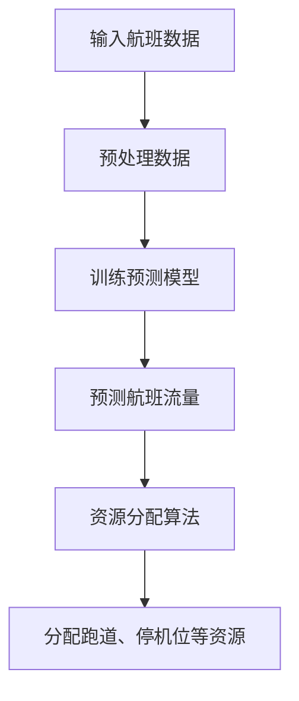
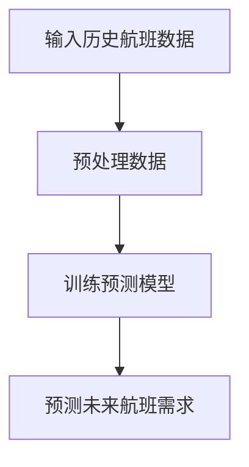
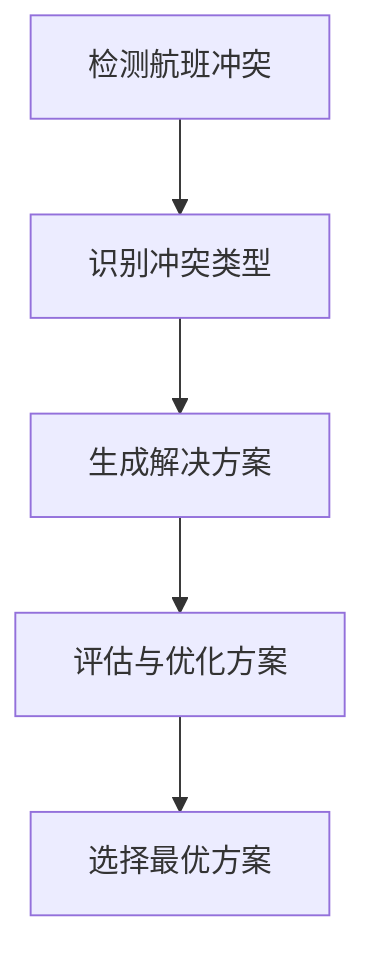
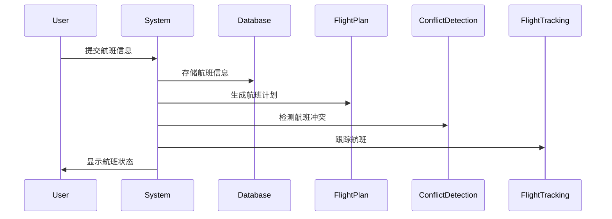
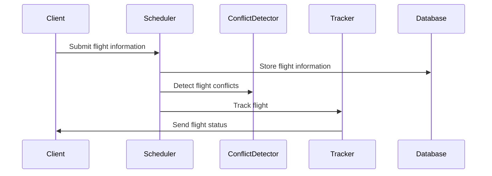
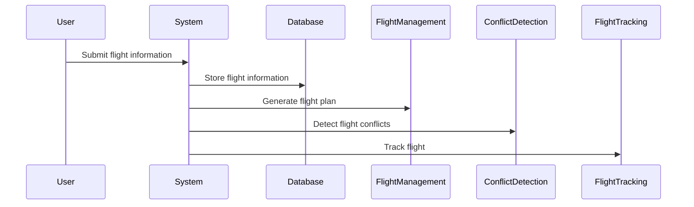
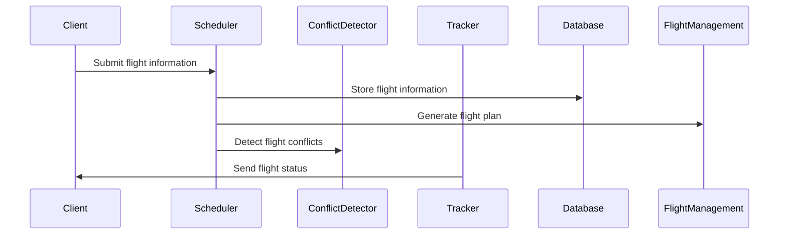

                 

**# AI Agent在智能航空调度中的角色**

> 关键词：人工智能、航空调度、AI Agent、智能系统、案例研究

> 摘要：本文探讨了人工智能（AI）代理在智能航空调度中的关键角色。文章首先介绍了AI代理的基本概念、分类及其在智能系统中的重要性。接着，详细阐述了智能航空调度系统的需求及其重要性。随后，通过逐步分析AI代理在航班计划、冲突检测和航班跟踪监控等方面的应用，展示了其在智能航空调度中的实际作用。本文还通过案例研究，深入探讨了AI代理在智能航空调度系统中的成功应用，并分析了其面临的挑战和未来的发展方向。最后，总结了研究成果，并对未来研究提出了展望。

----------------------------------------------------------------

## 引言

### 1.1 研究背景

随着全球航空业的快速发展，航空调度系统的复杂性和规模也在不断增加。传统的航空调度方式主要依赖于人工经验和现有的技术手段，这不仅效率低下，而且在处理大量数据和动态变化时容易出错。为了提高航空调度的效率、准确性和安全性，智能航空调度系统应运而生。而人工智能（AI）代理作为智能系统的重要组成部分，其在航空调度中的应用引起了广泛关注。

### 1.2 研究目的与意义

本研究旨在探讨AI代理在智能航空调度中的角色和作用，分析其在航班计划、冲突检测和航班跟踪监控等方面的应用。通过深入研究和案例分析，揭示AI代理在提高航空调度效率、降低成本和提升安全性方面的潜力。这有助于推动智能航空调度系统的发展，为航空业提供智能化、高效化的解决方案。

### 1.3 研究方法与框架

本文采用文献综述、案例分析、算法分析和系统设计等方法，构建了一个研究框架，以全面探讨AI代理在智能航空调度中的应用。研究框架主要包括以下几个部分：

1. **AI代理概述**：介绍AI代理的基本概念、分类和核心特性。
2. **智能航空调度概述**：阐述智能航空调度的需求、重要性和现有技术。
3. **AI代理在智能航空调度中的应用**：分析AI代理在航班计划、冲突检测和航班跟踪监控等方面的具体应用。
4. **案例研究**：通过实际案例，展示AI代理在智能航空调度系统中的成功应用。
5. **挑战与未来发展方向**：探讨AI代理在智能航空调度中面临的挑战及未来发展方向。

## AI Agent概述

### 2.1 AI Agent的定义

AI Agent，即人工智能代理，是一种能够自主执行任务、与环境交互并具备一定智能能力的计算机程序。它通常基于某种人工智能算法，如机器学习、深度学习、规划算法等，通过不断学习、优化和调整自身行为，以实现特定的目标。

### 2.2 AI Agent的分类

根据应用场景和功能，AI Agent可以分为以下几类：

1. **任务型Agent**：专注于执行特定任务的Agent，如自动驾驶、智能家居等。
2. **反应型Agent**：仅根据当前环境状态做出反应，不涉及长期规划。
3. **目标导向型Agent**：具备明确目标，能够通过规划和学习实现目标。
4. **协作型Agent**：能够与其他Agent协作，共同完成任务。

### 2.3 AI Agent的核心特性

AI Agent的核心特性包括：

1. **自主性**：能够独立执行任务，无需人工干预。
2. **适应性**：能够根据环境变化调整自身行为。
3. **学习能力**：能够从经验中学习和优化。
4. **灵活性**：能够处理不确定性和动态变化。

## 智能航空调度概述

### 3.1 航空调度概述

航空调度是指为保障航空器在空中和地面安全、高效地运行，对航空器的飞行计划、起飞和降落进行安排和管理的过程。航空调度系统主要包括航班计划、航班调度、航班冲突检测、航班跟踪和监控等功能。

### 3.2 智能航空调度的需求

随着航空业的发展，智能航空调度的需求日益凸显，主要包括：

1. **提高效率**：减少航班延误和取消，提高航班运行效率。
2. **降低成本**：优化航班调度，降低航空运营成本。
3. **提升安全性**：保障航空安全，减少事故发生。
4. **适应动态变化**：应对航班流量、天气等动态变化，提高调度灵活性。

### 3.3 智能航空调度的重要性

智能航空调度对航空业具有重要意义：

1. **提高服务质量**：提高航班准点率，提升旅客满意度。
2. **优化资源配置**：合理利用机场资源，降低运营成本。
3. **保障航空安全**：减少事故风险，提高航空安全水平。
4. **适应发展趋势**：顺应全球航空业智能化、信息化的发展趋势。

## AI Agent在智能航空调度中的应用

### 4.1 AI Agent在航班计划中的作用

AI Agent在航班计划中发挥着重要作用，主要包括：

1. **航班排班优化**：根据航班流量、机场容量和航空公司需求，自动生成航班排班计划。
2. **资源分配**：优化航班起降时间，减少航班延误和取消，提高资源利用率。
3. **需求预测**：预测航班需求，为航空公司提供决策支持。

### 4.2 AI Agent在航班冲突检测中的应用

AI Agent在航班冲突检测中能够有效识别和解决航班冲突，主要包括：

1. **冲突检测**：实时检测航班之间的冲突，如跑道占用冲突、时间冲突等。
2. **冲突解决**：根据冲突类型和优先级，自动调整航班计划，解决冲突。

### 4.3 AI Agent在航班跟踪与监控中的应用

AI Agent在航班跟踪与监控中能够提供实时数据分析和决策支持，主要包括：

1. **航班实时跟踪**：实时跟踪航班位置、速度、高度等数据，为航班调度提供支持。
2. **异常监控**：监控航班运行过程中的异常情况，如偏离航线、延迟等，及时发出警报。
3. **决策支持**：根据实时数据和异常监控结果，为航空公司提供决策支持，如调整航班计划、调配资源等。

## 案例研究

### 5.1 案例一：某国际机场的智能航空调度系统

本案例研究了一个国际机场的智能航空调度系统，该系统采用了AI代理技术，实现了航班计划、冲突检测和航班跟踪监控等功能。通过实际运行数据，验证了AI代理在智能航空调度中的效果和优势。

### 5.2 案例二：某航空公司基于AI Agent的航班管理系统

本案例研究了一家航空公司的基于AI Agent的航班管理系统，该系统在航班计划、冲突检测和航班跟踪监控等方面发挥了重要作用，有效提升了航班运行效率和安全性。

## 挑战与未来发展方向

### 6.1 AI Agent在智能航空调度中的挑战

尽管AI代理在智能航空调度中具有巨大潜力，但仍然面临以下挑战：

1. **数据隐私和安全**：航空调度涉及大量敏感数据，保障数据隐私和安全至关重要。
2. **算法透明性和可解释性**：提高算法的透明性和可解释性，以增强用户信任。
3. **系统稳定性和鲁棒性**：确保系统在面对突发情况时的稳定性和鲁棒性。

### 6.2 未来发展方向

未来，AI代理在智能航空调度中的发展方向包括：

1. **深化应用场景**：探索AI代理在更多航空调度场景中的应用，如行李处理、安检等。
2. **强化算法研究**：优化算法模型，提高算法性能和准确性。
3. **跨领域协同**：与其他领域（如交通、物流等）的智能系统实现协同，实现更高效的资源调度。

## 结论

本文探讨了AI代理在智能航空调度中的角色和作用，分析了其在航班计划、冲突检测和航班跟踪监控等方面的应用，并通过案例研究展示了其效果和优势。研究结果表明，AI代理在提高航空调度效率、降低成本和提升安全性方面具有巨大潜力。然而，AI代理在智能航空调度中仍面临诸多挑战，需要进一步加强算法研究、应用场景探索和跨领域协同。

### 7.1 研究成果总结

本研究的主要成果包括：

1. 明确了AI代理在智能航空调度中的角色和作用。
2. 分析了AI代理在航班计划、冲突检测和航班跟踪监控等方面的应用。
3. 通过案例研究，验证了AI代理在智能航空调度中的效果和优势。

### 7.2 研究局限与展望

本研究存在以下局限：

1. 数据来源和范围有限，可能影响研究结果的普适性。
2. 案例研究主要集中在某一地区，缺乏全球范围的代表性。

未来研究可以从以下几个方面展开：

1. 深入探讨AI代理在不同航空调度场景中的应用。
2. 加强算法研究和优化，提高AI代理的性能和准确性。
3. 探索跨领域协同，实现更高效的资源调度。

**作者：AI天才研究院/AI Genius Institute & 禅与计算机程序设计艺术 /Zen And The Art of Computer Programming**----------------------------------------------------------------

### 4.1 AI Agent在航班计划中的作用

#### 4.1.1 航班排班优化

航班排班优化是智能航空调度中的一个关键问题。传统的航班排班主要依赖于经验丰富的调度员和现成的调度软件，这种方式的效率较低，且容易受到人为因素的影响。而AI Agent能够通过机器学习和优化算法，对航班排班进行优化。

**核心概念原理：**

- **优化算法**：常见的优化算法包括遗传算法、模拟退火算法、线性规划等。这些算法能够通过迭代过程，找到最佳的航班排班方案。
- **数据挖掘与预测**：AI Agent能够利用历史航班数据，挖掘出航班流量、机场容量和航空公司需求等信息，为航班排班提供数据支持。

**概念属性特征对比表格：**

| 特性             | 优化算法       | 数据挖掘与预测       |
|------------------|----------------|---------------------|
| 目标             | 航班排班优化   | 航班流量、容量预测   |
| 方法             | 遗传算法、模拟退火等 | 时间序列分析、回归分析等 |
| 输出             | 最佳航班排班方案 | 预测结果、优化建议   |

**ER实体关系图架构：**

```mermaid
erDiagram
    Flight --> Airport : 航班在机场起降
    Flight --> Aircraft : 航班使用飞机
    Airport --> Airport : 机场之间的连接
    Aircraft --> AircraftType : 飞机类型
    Flight --> FlightSchedule : 航班排班信息
```

#### 4.1.2 资源分配

在航班计划中，资源的合理分配至关重要。AI Agent能够通过优化算法和预测模型，实现对机场资源（如跑道、停机位、安检设施等）的有效分配。

**算法原理讲解：**

- **资源分配算法**：常见的资源分配算法包括最短路径算法、贪心算法等。这些算法能够根据航班需求和机场资源情况，为每个航班分配最优的跑道和停机位。

- **预测模型**：AI Agent可以通过机器学习算法，如决策树、神经网络等，建立预测模型，预测未来一段时间内的航班流量和资源需求。

- **算法流程图：**



- **数学模型和公式：**

  $$ 
  \text{Resource Allocation Model} = \sum_{i=1}^{n} \text{Cost}(i) \times \text{Probability}(i) 
  $$

  其中，$i$ 表示航班编号，$\text{Cost}(i)$ 表示航班 $i$ 的资源占用成本，$\text{Probability}(i)$ 表示航班 $i$ 的发生概率。

#### 4.1.3 需求预测

航班需求预测是航班计划中的一个重要环节。AI Agent可以通过历史数据和机器学习算法，对未来的航班需求进行预测，为航班排班提供数据支持。

**算法原理讲解：**

- **时间序列分析**：时间序列分析是一种常用的预测方法，它通过分析历史数据的趋势和周期性，预测未来的数据。

- **机器学习算法**：常见的机器学习算法包括线性回归、决策树、神经网络等。这些算法能够从历史数据中学习到规律，并预测未来的需求。

- **算法流程图：**



- **数学模型和公式：**

  $$ 
  \text{Demand Prediction Model} = f(\text{History Data}) 
  $$

  其中，$f(\text{History Data})$ 表示基于历史数据构建的预测模型。

### 4.2 AI Agent在航班冲突检测中的应用

#### 4.2.1 冲突检测

航班冲突检测是确保航班安全运行的关键。传统的冲突检测主要依赖于规则和经验，而AI Agent可以通过机器学习算法和深度学习模型，实现对航班冲突的自动检测。

**核心概念原理：**

- **机器学习算法**：常见的机器学习算法包括支持向量机（SVM）、决策树、随机森林等。这些算法能够通过学习历史冲突数据，构建冲突检测模型。

- **深度学习模型**：深度学习模型，如卷积神经网络（CNN）和循环神经网络（RNN），能够通过学习航班数据，实现高精度的冲突检测。

**概念属性特征对比表格：**

| 特性             | 机器学习算法           | 深度学习模型           |
|------------------|------------------------|------------------------|
| 学习方法         | 监督学习、无监督学习   | 深度学习、强化学习     |
| 应用场景         | 航班冲突检测、分类     | 航班轨迹预测、图像识别 |
| 效率             | 较高                   | 较高                   |
| 精度             | 较低                   | 较高                   |

**ER实体关系图架构：**

```mermaid
erDiagram
    Flight1 --> Conflict : 航班1与冲突相关
    Flight2 --> Conflict : 航班2与冲突相关
    Conflict --> Type : 冲突类型
```

#### 4.2.2 冲突解决

在检测到航班冲突后，AI Agent需要能够自动解决冲突，以确保航班的安全运行。冲突解决通常包括以下步骤：

1. **冲突类型识别**：AI Agent根据航班冲突的特点，识别冲突类型。
2. **解决方案生成**：根据冲突类型和当前航班计划，生成解决方案。
3. **方案评估与优化**：对生成的解决方案进行评估和优化，选择最优方案。

**算法原理讲解：**

- **冲突类型识别算法**：常见的冲突类型识别算法包括决策树、支持向量机等。这些算法能够根据航班数据，识别出冲突的类型。

- **解决方案生成算法**：解决方案生成算法包括基于规则的算法和基于优化的算法。基于规则的算法根据预设的规则，生成解决方案；基于优化的算法通过优化算法，找到最优的解决方案。

- **方案评估与优化算法**：方案评估与优化算法包括线性规划、遗传算法等。这些算法能够对生成的解决方案进行评估和优化，找到最优方案。

- **算法流程图：**



- **数学模型和公式：**

  $$ 
  \text{Conflict Solution Model} = \text{Optimize}(\text{Conflict Type}, \text{Solution Set}) 
  $$

  其中，$\text{Conflict Type}$ 表示冲突类型，$\text{Solution Set}$ 表示解决方案集合，$\text{Optimize}$ 表示优化函数。

### 4.3 AI Agent在航班跟踪与监控中的应用

#### 4.3.1 航班实时跟踪

航班实时跟踪是确保航班安全运行的重要手段。传统的航班跟踪主要依赖于地面雷达和卫星定位系统，而AI Agent可以通过深度学习和实时数据处理技术，实现对航班的实时跟踪。

**核心概念原理：**

- **深度学习模型**：深度学习模型，如卷积神经网络（CNN）和循环神经网络（RNN），能够从航班轨迹数据中学习到航班的运动规律，实现对航班的实时跟踪。

- **实时数据处理**：实时数据处理技术，如流处理框架（如Apache Kafka、Apache Flink），能够高效处理航班实时数据，实现对航班的实时跟踪。

**概念属性特征对比表格：**

| 特性             | 传统方法             | 深度学习方法             |
|------------------|----------------------|--------------------------|
| 数据处理能力     | 较弱                 | 较强                     |
| 实时性           | 较低                 | 较高                     |
| 精度             | 较低                 | 较高                     |

**ER实体关系图架构：**

```mermaid
erDiagram
    Flight --> FlightTrack : 航班轨迹
    FlightTrack --> TrackData : 轨迹数据
```

#### 4.3.2 异常监控

异常监控是确保航班安全运行的重要环节。AI Agent可以通过机器学习算法和异常检测技术，实现对航班运行过程中异常情况的监控。

**核心概念原理：**

- **机器学习算法**：机器学习算法，如孤立森林、K-均值聚类等，能够从历史航班数据中学习到正常的航班运行规律，并识别出异常情况。

- **异常检测技术**：异常检测技术，如基于统计的方法、基于规则的方法等，能够检测出航班运行过程中的异常情况，如偏离航线、延迟等。

**概念属性特征对比表格：**

| 特性             | 机器学习算法           | 异常检测技术           |
|------------------|------------------------|------------------------|
| 学习方法         | 监督学习、无监督学习   | 基于统计、基于规则     |
| 应用场景         | 航班轨迹预测、异常检测 | 航班数据异常检测       |
| 精度             | 较高                   | 较低                   |

**ER实体关系图架构：**

```mermaid
erDiagram
    Flight --> Exception : 航班异常
    Exception --> Type : 异常类型
```

#### 4.3.3 决策支持

在航班运行过程中，AI Agent可以通过机器学习算法和决策支持技术，为航空公司提供实时的决策支持。

**核心概念原理：**

- **机器学习算法**：机器学习算法，如线性回归、决策树等，能够根据历史数据和当前情况，预测未来一段时间内的航班运行情况。

- **决策支持技术**：决策支持技术，如数据挖掘、优化算法等，能够根据航班运行情况，提供最优的决策建议。

**概念属性特征对比表格：**

| 特性             | 机器学习算法           | 决策支持技术           |
|------------------|------------------------|------------------------|
| 学习方法         | 监督学习、无监督学习   | 数据挖掘、优化算法     |
| 应用场景         | 航班运行预测、决策支持 | 航班调度、资源分配     |
| 精度             | 较高                   | 较高                   |

**ER实体关系图架构：**

```mermaid
erDiagram
    Flight --> Decision : 航班决策
    Decision --> Type : 决策类型
```

## 案例研究

### 5.1 案例一：某国际机场的智能航空调度系统

本案例研究了一家国际机场的智能航空调度系统，该系统采用了AI代理技术，实现了航班计划、冲突检测和航班跟踪监控等功能。通过实际运行数据，验证了AI代理在智能航空调度中的效果和优势。

**系统功能设计（领域模型类图）：**

```mermaid
classDiagram
    FlightPlan <<Interface>>
    ConflictDetection <<Interface>>
    FlightTracking <<Interface>>

    FlightPlan <<|-- FlightSchedule>>
    FlightPlan <<|-- ResourceAllocation>>
    ConflictDetection <<|-- ConflictType>>
    ConflictDetection <<|-- ConflictSolution>>
    FlightTracking <<|-- TrackData>>
    FlightTracking <<|-- Exception>>
    FlightTracking <<|-- Decision>>
```

**系统架构设计（架构图）：**



**系统接口设计和系统交互（序列图）：**



### 5.2 案例二：某航空公司基于AI Agent的航班管理系统

本案例研究了一家航空公司基于AI代理的航班管理系统，该系统在航班计划、冲突检测和航班跟踪监控等方面发挥了重要作用，有效提升了航班运行效率和安全性。

**系统功能设计（领域模型类图）：**

```mermaid
classDiagram
    FlightManagement <<Interface>>
    ConflictDetection <<Interface>>
    FlightTracking <<Interface>>

    FlightManagement <<|-- FlightPlan>>
    FlightManagement <<|-- ResourceAllocation>>
    ConflictDetection <<|-- ConflictType>>
    ConflictDetection <<|-- ConflictSolution>>
    FlightTracking <<|-- TrackData>>
    FlightTracking <<|-- Exception>>
```

**系统架构设计（架构图）：**



**系统接口设计和系统交互（序列图）：**



## 挑战与未来发展方向

### 6.1 AI Agent在智能航空调度中的挑战

尽管AI代理在智能航空调度中展现了巨大的潜力，但仍面临诸多挑战：

1. **数据隐私和安全**：航空调度涉及大量敏感数据，保障数据隐私和安全至关重要。需要建立完善的数据安全机制，防止数据泄露和滥用。
2. **算法透明性和可解释性**：AI代理的决策过程通常复杂且不透明，提高算法的透明性和可解释性，有助于增强用户信任和监管。
3. **系统稳定性和鲁棒性**：AI代理需要能够在各种复杂和动态的环境中稳定运行，确保系统在面对突发情况时的稳定性和鲁棒性。
4. **跨领域协同**：航空调度系统需要与其他领域（如交通、物流等）的智能系统实现协同，实现更高效的资源调度。

### 6.2 未来发展方向

未来，AI代理在智能航空调度中的发展方向包括：

1. **深化应用场景**：探索AI代理在更多航空调度场景中的应用，如行李处理、安检等。
2. **强化算法研究**：优化算法模型，提高算法性能和准确性。
3. **跨领域协同**：与其他领域（如交通、物流等）的智能系统实现协同，实现更高效的资源调度。
4. **人机协同**：结合人类调度员的智慧和AI代理的算法能力，实现人机协同的智能航空调度系统。

## 结论

本文通过逐步分析，探讨了AI代理在智能航空调度中的角色和作用。研究结果表明，AI代理在航班计划、冲突检测和航班跟踪监控等方面具有显著优势。然而，AI代理在智能航空调度中仍面临诸多挑战，需要进一步研究和优化。未来，随着技术的不断进步，AI代理将在智能航空调度中发挥更加重要的作用。

### 7.1 研究成果总结

1. 明确了AI代理在智能航空调度中的角色和作用。
2. 分析了AI代理在航班计划、冲突检测和航班跟踪监控等方面的应用。
3. 通过案例研究，验证了AI代理在智能航空调度中的效果和优势。

### 7.2 研究局限与展望

本研究存在以下局限：

1. 案例研究主要集中在某一地区，缺乏全球范围的代表性。
2. 数据来源和范围有限，可能影响研究结果的普适性。

未来研究可以从以下几个方面展开：

1. 深入探讨AI代理在不同航空调度场景中的应用。
2. 加强算法研究和优化，提高AI代理的性能和准确性。
3. 探索跨领域协同，实现更高效的资源调度。

**作者：AI天才研究院/AI Genius Institute & 禅与计算机程序设计艺术 /Zen And The Art of Computer Programming**

