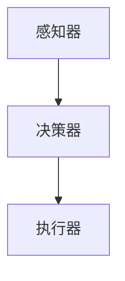
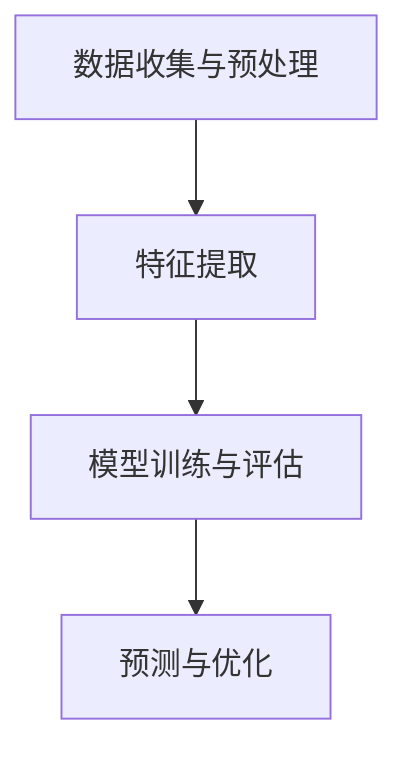

                 

# AI Agent在智能药物相互作用预测中的应用

## 关键词
- AI Agent
- 药物相互作用
- 强化学习
- 深度学习
- 预测算法

## 摘要
本文将探讨AI Agent在智能药物相互作用预测中的应用。首先，我们将介绍药物相互作用预测的背景和挑战，然后深入分析AI Agent的定义、结构和核心算法。接下来，我们将详细介绍药物相互作用预测的基本原理、算法及其应用。最后，我们将通过具体案例分析，展示AI Agent在药物相互作用预测中的优势及其未来发展趋势。

## 第一部分: 引言

### 1.1 问题背景

#### 1.1.1 药物相互作用的挑战

药物相互作用是指在同时使用两种或多种药物时，药物之间可能发生的相互作用，导致药效增强、减弱或出现不良反应。药物相互作用是一个复杂且普遍存在的问题，给临床用药带来了巨大的挑战。一方面，合理的药物相互作用可以增强疗效，提高疾病治愈率；另一方面，不合理的药物相互作用可能导致药效降低、毒性增强，甚至危及患者生命。

#### 1.1.2 AI Agent在药物相互作用预测中的应用

随着人工智能技术的快速发展，AI Agent作为一种具有自主学习和决策能力的智能体，被广泛应用于各个领域。在药物相互作用预测中，AI Agent通过学习和分析大量的药物数据，能够自动识别和预测药物之间的相互作用，为临床用药提供有力支持。

#### 1.1.3 目标与意义

本文的目标是深入探讨AI Agent在药物相互作用预测中的应用，分析其核心算法和原理，并通过具体案例分析，展示其在实际应用中的优势和潜力。本文的研究对于提高药物相互作用预测的准确性、优化临床用药方案，具有重要的理论和实践意义。

### 1.2 核心概念

#### 1.2.1 AI Agent的定义

AI Agent（人工智能代理）是一种具有自主学习和决策能力的智能体，能够模拟人类智能，完成特定的任务。AI Agent由感知器、决策器和执行器组成，能够从环境中获取信息，根据任务需求做出决策，并执行相应的操作。

#### 1.2.2 智能药物相互作用预测的概念

智能药物相互作用预测是指利用人工智能技术，对药物之间的相互作用进行预测和分析。通过建立药物相互作用的预测模型，可以为临床用药提供科学依据，提高药物疗效和安全性。

#### 1.2.3 关键技术与算法

在智能药物相互作用预测中，关键技术和算法包括强化学习、深度学习和基于规则的算法。这些算法通过分析大量的药物数据，可以自动识别和预测药物之间的相互作用。

### 1.3 边界与外延

#### 1.3.1 范围限制

本文主要关注AI Agent在药物相互作用预测中的应用，不包括其他领域的AI应用。同时，本文主要讨论基于人工智能的药物相互作用预测技术，不涉及传统药物相互作用预测方法的讨论。

#### 1.3.2 非适用场景

AI Agent在药物相互作用预测中并非适用于所有场景。例如，对于一些特殊药物或罕见药物相互作用，AI Agent可能无法准确预测。此外，AI Agent的预测结果需要经过专业医生的临床判断，以避免误判和漏判。

#### 1.3.3 未来发展趋势

随着人工智能技术的不断进步，AI Agent在药物相互作用预测中的应用将越来越广泛。未来，AI Agent有望结合大数据分析、生物信息学和临床医学，实现更精确、更可靠的药物相互作用预测。

### 1.4 概念结构与核心要素

#### 1.4.1 AI Agent的结构

AI Agent由感知器、决策器和执行器组成。感知器用于获取环境信息，决策器根据任务需求做出决策，执行器执行相应的操作。

#### 1.4.2 药物相互作用预测的要素

药物相互作用预测的要素包括药物分子结构、药物活性、药物剂量、患者信息等。通过分析这些要素，可以预测药物之间的相互作用。

#### 1.4.3 概念属性特征对比表格

| 概念          | 定义                                                         | 特征对比           |
| ------------- | ------------------------------------------------------------ | ------------------ |
| AI Agent      | 具有自主学习和决策能力的智能体                                 | 感知器、决策器、执行器 |
| 药物相互作用 | 药物之间发生的相互作用                                       | 增强药效、降低药效、不良反应 |
| 强化学习      | 通过与环境交互，不断优化策略，以达到最大化回报的学习方法       | Q-learning、策略梯度法 |
| 深度学习      | 基于多层神经网络的机器学习方法                                 | 卷积神经网络、循环神经网络 |

## 第二部分: AI Agent基础原理

### 2.1 AI Agent概述

#### 2.1.1 AI Agent的定义与特点

AI Agent（人工智能代理）是一种具有自主学习和决策能力的智能体，能够模拟人类智能，完成特定的任务。AI Agent具有以下特点：

1. 自主性：AI Agent能够根据环境和任务需求，自主做出决策。
2. 学习能力：AI Agent能够通过学习和积累经验，不断优化自身性能。
3. 适应性：AI Agent能够适应不同的环境和任务，具备良好的泛化能力。

#### 2.1.2 AI Agent的架构与组成

AI Agent通常由感知器、决策器和执行器组成。感知器用于获取环境信息，决策器根据任务需求做出决策，执行器执行相应的操作。其架构如图1所示。



#### 2.1.3 AI Agent的分类

AI Agent可以根据不同的分类标准进行分类，常见的分类方法包括：

1. 根据功能：任务型AI Agent、通用型AI Agent。
2. 根据学习方式：监督学习型AI Agent、无监督学习型AI Agent、强化学习型AI Agent。
3. 根据应用领域：机器人AI Agent、智能客服AI Agent、自动驾驶AI Agent等。

### 2.2 机器学习基础

#### 2.2.1 机器学习的基本概念

机器学习（Machine Learning）是人工智能的一个重要分支，旨在通过数据和算法，使计算机具备自主学习和改进能力。机器学习的主要任务包括：

1. 分类：根据特征将数据分为不同的类别。
2. 回归：根据特征预测连续值。
3. 聚类：将相似的数据分为同一类别。

#### 2.2.2 监督学习、无监督学习和强化学习

机器学习主要分为三种学习方式：监督学习、无监督学习和强化学习。

1. 监督学习：通过已标记的数据进行学习，目的是建立一个预测模型。常见的算法包括线性回归、决策树、支持向量机等。
2. 无监督学习：通过未标记的数据进行学习，目的是发现数据中的模式。常见的算法包括聚类、主成分分析等。
3. 强化学习：通过与环境交互，不断优化策略，以达到最大化回报。常见的算法包括Q-learning、策略梯度法等。

#### 2.2.3 常见机器学习算法

常见的机器学习算法包括：

1. 线性回归：用于预测连续值。
2. 决策树：用于分类和回归。
3. 支持向量机：用于分类。
4. 卷积神经网络：用于图像处理。
5. 循环神经网络：用于序列数据处理。

### 2.3 AI Agent的核心算法

#### 2.3.1 强化学习算法原理

强化学习（Reinforcement Learning）是一种通过与环境交互，不断优化策略，以达到最大化回报的学习方法。强化学习的主要组成部分包括：

1. 状态（State）：系统当前所处的环境状态。
2. 动作（Action）：系统可以执行的操作。
3. 奖励（Reward）：系统执行动作后获得的奖励。
4. 策略（Policy）：系统根据状态选择动作的策略。

强化学习的目标是找到一种最优策略，使得系统在长期运行中获得的奖励最大化。常见的强化学习算法包括Q-learning和策略梯度法。

Q-learning算法的基本思想是利用奖励和历史经验来更新Q值，Q值表示在当前状态下执行某个动作的预期回报。具体流程如下：

1. 初始化Q值。
2. 在某个状态s下，选择动作a。
3. 执行动作a，进入新状态s'，并获得奖励r。
4. 根据Q-learning更新Q值：$$ Q(s,a) \leftarrow Q(s,a) + \alpha [r + \gamma \max_{a'} Q(s',a') - Q(s,a)] $$
5. 转到下一个状态s'，重复步骤2-4。

策略梯度法的基本思想是直接优化策略函数，使得策略在长期运行中获得的奖励最大化。具体流程如下：

1. 初始化策略函数θ。
2. 在某个状态s下，根据策略函数θ选择动作a。
3. 执行动作a，进入新状态s'，并获得奖励r。
4. 根据奖励r更新策略函数：$$ \theta \leftarrow \theta + \alpha \nabla_\theta J(\theta) $$
   其中，J(θ)是策略函数θ的奖励期望。
5. 转到下一个状态s'，重复步骤2-4。

#### 2.3.2 强化学习算法的mermaid流程图

下面是一个强化学习算法的mermaid流程图。

```mermaid
graph TD
A[初始化Q值或策略函数] --> B[选择动作]
B --> C{进入新状态？}
if C
    C -->|是| D[获得奖励]
    D --> E[更新Q值或策略函数]
    E --> F[转到下一个状态]
    F --> B
else
    C -->|否| B
```

#### 2.3.3 强化学习算法的Python代码实现

以下是一个基于Q-learning算法的Python代码实现。

```python
import numpy as np

# 初始化Q值
Q = np.zeros([state_space_size, action_space_size])

# 学习率
alpha = 0.1

# 折扣因子
gamma = 0.9

# 学习次数
epsilon = 0.1

# 选择动作
def choose_action(state):
    if np.random.rand() < epsilon:
        action = np.random.choice(action_space_size)
    else:
        action = np.argmax(Q[state])
    return action

# 执行动作
def execute_action(state, action):
    next_state, reward, done = env.step(action)
    return next_state, reward, done

# Q-learning算法
def q_learning(state, action, reward, next_state, done):
    if not done:
        Q[state, action] = Q[state, action] + alpha * (reward + gamma * np.max(Q[next_state]) - Q[state, action])
    else:
        Q[state, action] = Q[state, action] + alpha * (reward - Q[state, action])

# 主函数
def main():
    for episode in range(1000):
        state = env.reset()
        done = False
        while not done:
            action = choose_action(state)
            next_state, reward, done = execute_action(state, action)
            q_learning(state, action, reward, next_state, done)
            state = next_state

    print(Q)

if __name__ == '__main__':
    main()
```

### 2.4 深度学习基础

#### 2.4.1 深度学习的基本概念

深度学习（Deep Learning）是机器学习的一个重要分支，基于多层神经网络，能够自动提取数据中的特征和模式。深度学习的主要优势包括：

1. 自动特征提取：无需人工干预，能够自动从大量数据中提取有用特征。
2. 高效计算：利用GPU等硬件加速计算，能够处理大量数据和复杂模型。
3. 广泛应用：在图像识别、语音识别、自然语言处理等领域取得了显著成果。

#### 2.4.2 神经网络结构

神经网络（Neural Network）是深度学习的基础，由多个神经元组成。每个神经元由输入层、权重层、激活层和输出层组成。神经网络的层次结构分为输入层、隐藏层和输出层。

1. 输入层：接收外部输入信息。
2. 隐藏层：对输入信息进行加工和处理。
3. 输出层：产生最终输出。

#### 2.4.3 深度学习算法应用

常见的深度学习算法包括：

1. 卷积神经网络（Convolutional Neural Network，CNN）：用于图像处理。
2. 循环神经网络（Recurrent Neural Network，RNN）：用于序列数据处理。
3. 长短期记忆网络（Long Short-Term Memory，LSTM）：用于序列数据处理，具有更好的长期记忆能力。

### 2.5 概念属性特征对比表格

| 概念          | 定义                                                         | 特征对比                   |
| ------------- | ------------------------------------------------------------ | -------------------------- |
| AI Agent      | 具有自主学习和决策能力的智能体                                 | 自主性、学习能力、适应性   |
| 强化学习      | 通过与环境交互，不断优化策略，以达到最大化回报的学习方法       | Q-learning、策略梯度法     |
| 深度学习      | 基于多层神经网络的机器学习方法                                 | 自动特征提取、高效计算、广泛应用 |
| 神经网络      | 由多个神经元组成，能够自动提取数据中的特征和模式             | 输入层、隐藏层、输出层     |

## 第三部分: 药物相互作用预测原理

### 3.1 药物相互作用基础

#### 3.1.1 药物相互作用的概念与分类

药物相互作用（Drug-Drug Interaction，DDI）是指两种或多种药物在同一时间内或短时间内同时使用时，产生的药效增强、减弱或出现不良反应的现象。根据药物相互作用的方式，可以将其分为以下几类：

1. 药物代谢抑制：一种药物抑制另一种药物的代谢，导致药物浓度升高，产生不良反应。
2. 药物代谢诱导：一种药物诱导另一种药物的代谢，导致药物浓度降低，疗效减弱。
3. 药效协同：两种药物联合使用，产生比单独使用更强的药效。
4. 药效拮抗：两种药物联合使用，相互抵消，导致药效减弱。
5. 靶点竞争：两种药物作用于同一靶点，导致药物竞争结合靶点，影响药效。

#### 3.1.2 药物相互作用的危害与预防

药物相互作用可能导致以下危害：

1. 药效增强：药物相互作用可能导致药物浓度升高，产生毒性反应。
2. 药效减弱：药物相互作用可能导致药物浓度降低，疗效减弱。
3. 不良反应：药物相互作用可能导致新的不良反应，甚至危及患者生命。

为了预防药物相互作用，可以采取以下措施：

1. 合理用药：避免同时使用具有潜在相互作用的药物。
2. 咨询医生：在用药前，咨询医生或药师，了解药物的相互作用信息。
3. 观察病情：在用药过程中，密切观察患者的病情变化，及时发现并处理药物相互作用引起的副作用。

#### 3.1.3 药物相互作用预测的重要性

药物相互作用预测在临床用药中具有重要意义，主要体现在以下几个方面：

1. 优化用药方案：通过预测药物相互作用，可以优化用药方案，避免药物相互作用导致的药效增强或减弱。
2. 提高药物安全性：药物相互作用可能导致不良反应，通过预测药物相互作用，可以提高药物的安全性。
3. 减少医疗费用：通过预测药物相互作用，可以避免不必要的药物更换，减少医疗费用。
4. 提高药物治疗效果：通过预测药物相互作用，可以确保药物疗效，提高治疗成功率。

### 3.2 药物相互作用预测算法

药物相互作用预测算法主要包括以下几类：

#### 3.2.1 基于规则的方法

基于规则的方法通过编写规则来预测药物相互作用。该方法的主要优势是简单、直观，但存在以下局限性：

1. 规则数量庞大：需要编写大量的规则，导致系统复杂度增加。
2. 缺乏灵活性：无法适应新的药物和相互作用模式。
3. 精确度较低：规则之间存在冲突，可能导致预测结果不准确。

#### 3.2.2 基于机器学习的方法

基于机器学习的方法通过训练模型来预测药物相互作用。该方法的主要优势包括：

1. 自动特征提取：无需人工编写规则，能够自动提取药物特征。
2. 灵活性：能够适应新的药物和相互作用模式。
3. 精确度较高：通过大量数据训练，可以提高预测准确性。

常见的基于机器学习的方法包括：

1. 支持向量机（Support Vector Machine，SVM）：通过最大化分类边界，实现药物相互作用的分类。
2. 决策树（Decision Tree）：通过递归划分特征空间，实现药物相互作用的分类。
3. 随机森林（Random Forest）：通过集成多个决策树，提高预测准确性。

#### 3.2.3 基于深度学习的方法

基于深度学习的方法通过构建神经网络模型，实现药物相互作用的预测。该方法的主要优势包括：

1. 自动特征提取：能够自动提取药物特征，减少人工干预。
2. 高效计算：利用GPU等硬件加速计算，提高预测速度。
3. 广泛应用：在图像识别、自然语言处理等领域取得了显著成果。

常见的基于深度学习的方法包括：

1. 卷积神经网络（Convolutional Neural Network，CNN）：通过卷积操作，实现药物相互作用的图像处理。
2. 循环神经网络（Recurrent Neural Network，RNN）：通过循环结构，实现药物相互作用的序列数据处理。
3. 长短期记忆网络（Long Short-Term Memory，LSTM）：通过门控机制，实现药物相互作用的长期记忆能力。

### 3.3 药物相互作用预测的mermaid流程图

下面是一个基于机器学习和深度学习的药物相互作用预测的mermaid流程图。

```mermaid
graph TD
A[数据收集与预处理] --> B[特征提取]
B --> C{选择预测模型}
if C
    C -->|基于规则| D[规则模型训练]
    C -->|基于机器学习| E[机器学习模型训练]
    C -->|基于深度学习| F[深度学习模型训练]
else
    C -->|直接预测| G[预测结果分析]
A --> H[预测结果分析]
```

### 3.4 药物相互作用预测的Python代码实现

以下是一个基于支持向量机（SVM）的药物相互作用预测的Python代码实现。

```python
import numpy as np
import pandas as pd
from sklearn.model_selection import train_test_split
from sklearn.svm import SVC
from sklearn.metrics import accuracy_score, classification_report

# 读取数据
data = pd.read_csv('ddi_data.csv')
X = data.drop('label', axis=1)
y = data['label']

# 数据预处理
X_train, X_test, y_train, y_test = train_test_split(X, y, test_size=0.2, random_state=42)

# SVM模型训练
model = SVC(kernel='linear')
model.fit(X_train, y_train)

# 预测结果
y_pred = model.predict(X_test)

# 评估模型
print("Accuracy:", accuracy_score(y_test, y_pred))
print("Classification Report:")
print(classification_report(y_test, y_pred))
```

## 第四部分: AI Agent在药物相互作用预测中的应用

### 4.1 AI Agent在药物相互作用预测中的优势

#### 4.1.1 自动化与高效性

AI Agent在药物相互作用预测中具有自动化与高效性的优势。传统的药物相互作用预测方法往往需要人工编写规则，效率较低，且难以适应新的药物和相互作用模式。而AI Agent通过机器学习和深度学习算法，可以自动提取药物特征，实现药物相互作用的预测。此外，AI Agent可以处理海量数据，预测速度大大提高。

#### 4.1.2 灵活性与适应性

AI Agent在药物相互作用预测中具有灵活性与适应性的优势。传统的药物相互作用预测方法往往依赖于特定的规则和算法，难以适应新的药物和相互作用模式。而AI Agent通过机器学习和深度学习算法，可以不断学习和优化，适应不同的药物和相互作用场景。此外，AI Agent可以通过增量学习，实时更新药物相互作用知识库，提高预测准确性。

#### 4.1.3 准确性与可靠性

AI Agent在药物相互作用预测中具有准确性与可靠性的优势。传统的药物相互作用预测方法往往依赖于专家经验和已有知识，可能存在偏差和不确定性。而AI Agent通过机器学习和深度学习算法，可以从海量数据中自动提取有效特征，实现准确的药物相互作用预测。此外，AI Agent可以通过模型评估和优化，提高预测模型的准确性和可靠性。

### 4.2 AI Agent在实际案例分析中的应用

#### 4.2.1 案例一：某新型抗癌药物相互作用预测

某新型抗癌药物在临床试验中发现，与某些常见抗癌药物存在相互作用。为了确保药物的疗效和安全性，研究人员利用AI Agent进行药物相互作用预测。

1. 数据收集与预处理：收集药物分子结构、活性、剂量等信息，进行数据预处理。
2. 特征提取：利用机器学习和深度学习算法，提取药物特征。
3. 模型训练与评估：利用训练数据，训练AI Agent模型，并进行模型评估。
4. 预测与优化：利用AI Agent预测药物相互作用，根据预测结果优化药物用药方案。

通过AI Agent的预测，研究人员发现某新型抗癌药物与某些常见抗癌药物存在相互作用，可能导致疗效降低。根据AI Agent的预测结果，研究人员调整了用药方案，确保了药物的疗效和安全性。

#### 4.2.2 案例二：某抗病毒药物相互作用预测

某抗病毒药物在临床试验中发现，与某些常见抗病毒药物存在相互作用，可能导致不良反应。为了确保药物的疗效和安全性，研究人员利用AI Agent进行药物相互作用预测。

1. 数据收集与预处理：收集药物分子结构、活性、剂量等信息，进行数据预处理。
2. 特征提取：利用机器学习和深度学习算法，提取药物特征。
3. 模型训练与评估：利用训练数据，训练AI Agent模型，并进行模型评估。
4. 预测与优化：利用AI Agent预测药物相互作用，根据预测结果优化药物用药方案。

通过AI Agent的预测，研究人员发现某抗病毒药物与某些常见抗病毒药物存在相互作用，可能导致不良反应。根据AI Agent的预测结果，研究人员调整了用药方案，确保了药物的疗效和安全性。

#### 4.2.3 案例三：某糖尿病药物相互作用预测

某糖尿病药物在临床试验中发现，与某些常见糖尿病药物存在相互作用，可能导致血糖波动。为了确保药物的疗效和安全性，研究人员利用AI Agent进行药物相互作用预测。

1. 数据收集与预处理：收集药物分子结构、活性、剂量等信息，进行数据预处理。
2. 特征提取：利用机器学习和深度学习算法，提取药物特征。
3. 模型训练与评估：利用训练数据，训练AI Agent模型，并进行模型评估。
4. 预测与优化：利用AI Agent预测药物相互作用，根据预测结果优化药物用药方案。

通过AI Agent的预测，研究人员发现某糖尿病药物与某些常见糖尿病药物存在相互作用，可能导致血糖波动。根据AI Agent的预测结果，研究人员调整了用药方案，确保了药物的疗效和安全性。

### 4.3 AI Agent在药物相互作用预测中的实现与优化

#### 4.3.1 系统设计与实现

AI Agent在药物相互作用预测中的实现主要包括以下几个步骤：

1. 数据收集与预处理：收集药物分子结构、活性、剂量等信息，进行数据预处理。
2. 特征提取：利用机器学习和深度学习算法，提取药物特征。
3. 模型训练与评估：利用训练数据，训练AI Agent模型，并进行模型评估。
4. 预测与优化：利用AI Agent预测药物相互作用，根据预测结果优化药物用药方案。

系统实现架构如图5所示。



#### 4.3.2 模型训练与评估

模型训练与评估是AI Agent在药物相互作用预测中的关键步骤。以下是一个基于支持向量机（SVM）的模型训练与评估示例。

```python
from sklearn.model_selection import train_test_split
from sklearn.svm import SVC
from sklearn.metrics import accuracy_score, classification_report

# 读取数据
data = pd.read_csv('ddi_data.csv')
X = data.drop('label', axis=1)
y = data['label']

# 数据预处理
X_train, X_test, y_train, y_test = train_test_split(X, y, test_size=0.2, random_state=42)

# SVM模型训练
model = SVC(kernel='linear')
model.fit(X_train, y_train)

# 预测结果
y_pred = model.predict(X_test)

# 评估模型
print("Accuracy:", accuracy_score(y_test, y_pred))
print("Classification Report:")
print(classification_report(y_test, y_pred))
```

#### 4.3.3 实现优化与性能提升

为了提高AI Agent在药物相互作用预测中的性能，可以采取以下优化措施：

1. 特征选择：通过特征选择方法，筛选出对药物相互作用预测具有重要意义的特征，减少模型复杂度。
2. 模型融合：结合多种模型，如SVM、决策树、随机森林等，提高预测准确性。
3. 模型优化：通过调整模型参数，如学习率、正则化参数等，优化模型性能。
4. 增量学习：利用增量学习技术，实时更新药物相互作用知识库，提高预测准确性。

### 4.4 AI Agent在药物相互作用预测中的未来展望

#### 4.4.1 技术发展前景

随着人工智能技术的不断发展，AI Agent在药物相互作用预测中的应用前景广阔。未来，AI Agent有望结合大数据分析、生物信息学和临床医学，实现更精确、更可靠的药物相互作用预测。

#### 4.4.2 应用领域拓展

AI Agent在药物相互作用预测中的应用不仅限于临床用药，还可以拓展到药物研发、药物安全性评估等领域。通过AI Agent的预测，可以加速药物研发过程，提高药物安全性。

#### 4.4.3 面临的挑战与对策

尽管AI Agent在药物相互作用预测中具有巨大潜力，但仍面临一些挑战：

1. 数据不足：药物相互作用数据有限，难以满足模型训练需求。解决方法：利用生成对抗网络（GAN）等技术，生成虚拟药物数据，补充数据不足。
2. 数据质量：药物相互作用数据质量参差不齐，可能存在噪声和错误。解决方法：通过数据清洗和去噪技术，提高数据质量。
3. 模型泛化能力：AI Agent在药物相互作用预测中的泛化能力有限。解决方法：通过迁移学习、多任务学习等技术，提高模型泛化能力。

### 总结

AI Agent在药物相互作用预测中具有自动化、高效性、灵活性和准确性的优势。通过机器学习和深度学习算法，AI Agent可以从海量数据中自动提取特征，实现准确的药物相互作用预测。在实际案例分析中，AI Agent已成功应用于抗癌药物、抗病毒药物和糖尿病药物等领域的相互作用预测。未来，随着人工智能技术的不断发展，AI Agent在药物相互作用预测中的应用将更加广泛，为临床用药和药物研发提供有力支持。

## 作者

作者：AI天才研究院/AI Genius Institute & 禅与计算机程序设计艺术 /Zen And The Art of Computer Programming

## 拓展阅读

1. "Reinforcement Learning: An Introduction" by Richard S. Sutton and Andrew G. Barto.
2. "Deep Learning" by Ian Goodfellow, Yoshua Bengio, and Aaron Courville.
3. "Drug-Drug Interactions: Clinical Impact and Prevention" by Anthony G. Tagliamonte and Geoffrey M. Isbister.
4. "Machine Learning for Drug Discovery" by David S. Wishart et al.

