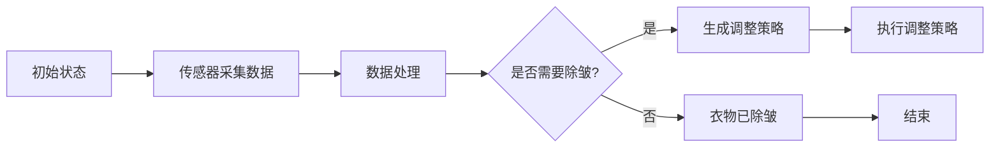
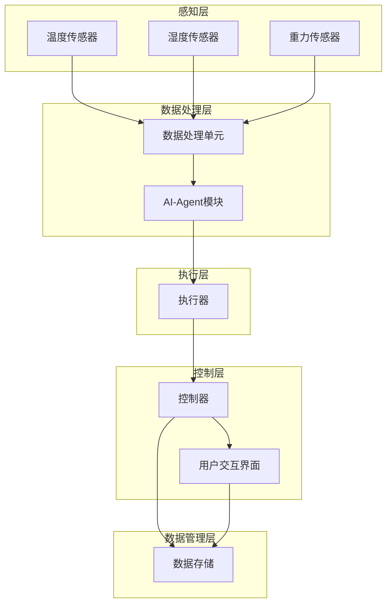
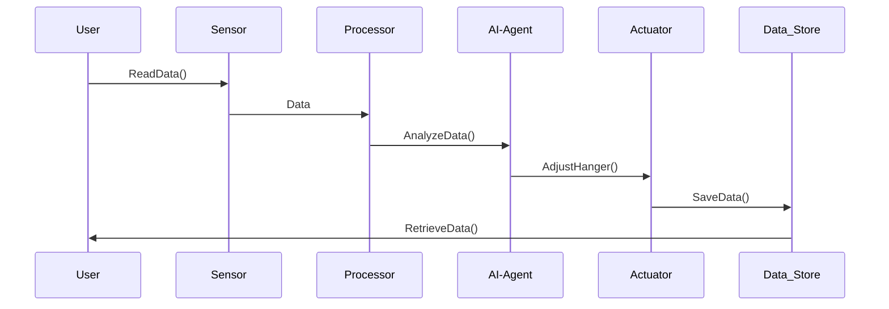
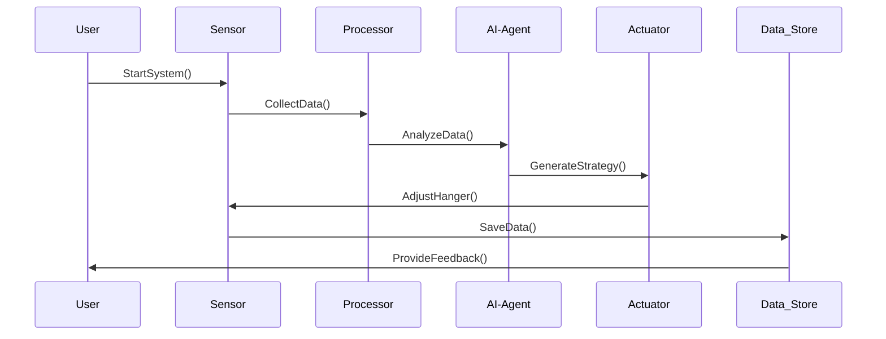

                 

### 1. 背景介绍

### 让我们一步步思考：智能衣架中的AI Agent与衣物除皱功能

#### 问题背景

衣物除皱是日常生活中常见的任务，传统方法通常依赖于手动熨烫或悬挂在衣架上自然晾干。然而，这些方法不仅费时费力，效果也往往不尽如人意。随着人工智能（AI）技术的不断发展，特别是在机器学习和计算机视觉领域的突破，衣物除皱问题有望得到更高效和智能的解决。

#### AI Agent的定义与特点

AI Agent，即人工智能代理，是指能够在特定环境中自主决策和执行的智能系统。它具备以下几个特点：

1. **自主性**：能够根据环境和目标自主做出决策。
2. **适应性**：可以学习并适应新的环境和任务。
3. **交互性**：能够与其他系统或用户进行交互。
4. **鲁棒性**：在面临不确定性和错误时仍能保持性能。

#### 智能衣架与AI Agent的联系

智能衣架是结合了AI技术的衣物悬挂设备，通过内置的传感器、执行器和AI算法，实现自动除皱功能。AI Agent在智能衣架中的应用，可以大大提高衣物除皱的效率和效果。以下是AI Agent在智能衣架中的几个关键应用：

1. **传感器监测**：通过传感器实时监测衣物状态，如湿度、温度和重力等。
2. **AI算法分析**：利用机器学习算法分析传感器数据，预测衣物的折叠和皱褶情况。
3. **自适应调整**：根据AI算法的预测结果，调整衣架的形态，如改变角度、伸展衣架等，以减少皱褶。
4. **用户交互**：提供智能提醒和反馈，如提示用户衣物已晾干或需要重新调整。

通过上述应用，AI Agent不仅提高了智能衣架的除皱效果，还使得用户使用更为便捷和高效。

### 2. 核心概念与联系

#### AI Agent的核心概念

AI Agent是一个能够实现自主性、适应性、交互性和鲁棒性的智能系统。其核心概念包括：

1. **环境感知**：通过传感器感知环境中的各种信息。
2. **目标导向**：根据预设目标，自主规划行动策略。
3. **决策执行**：执行决策，调整自身状态以达成目标。
4. **学习与适应**：通过反馈和学习不断优化自身行为。

#### 衣物除皱相关的原理和概念

衣物除皱涉及以下几个关键原理和概念：

1. **物理原理**：衣物皱褶是由于纤维弯曲、折叠和压力造成的。除皱需要通过外力作用，如拉伸、熨烫或自然晾晒，来恢复纤维的初始形态。
2. **机械原理**：衣架通过机械结构提供支撑力，防止衣物因重力作用而下垂，从而减少皱褶。
3. **热力学原理**：高温可以使纤维变得更加柔韧，易于伸展，从而有效去除皱褶。

#### AI Agent在衣物除皱中的应用

AI Agent在衣物除皱中的应用，可以通过以下几个步骤实现：

1. **数据采集**：通过传感器采集衣物状态信息，如温度、湿度、重力等。
2. **状态分析**：利用机器学习算法分析传感器数据，识别衣物的皱褶情况和除皱需求。
3. **决策生成**：根据分析结果，生成相应的调整策略，如改变衣架角度、加热衣物等。
4. **执行调整**：通过执行器调整衣架形态，如伸展衣架或加热衣物，以去除皱褶。

通过上述步骤，AI Agent能够实现智能除皱，提高衣物的整洁度和用户满意度。

### 3. 算法原理讲解

#### 算法mermaid流程图

首先，我们使用mermaid工具绘制一个简单的算法流程图，以展示AI Agent在衣物除皱功能中的工作流程：



#### 流程图解读

1. **初始状态**：系统开始运行时，AI Agent处于初始状态。
2. **传感器采集数据**：AI Agent通过传感器采集衣物的温度、湿度、重力等数据。
3. **数据处理**：将采集到的数据传输给机器学习模型进行处理。
4. **是否需要除皱？**：通过分析传感器数据，判断衣物是否需要除皱。
5. **生成调整策略**：如果需要除皱，AI Agent生成相应的调整策略。
6. **执行调整策略**：根据生成的策略，执行相应的调整操作，如伸展衣架或加热衣物。
7. **衣物已除皱**：如果衣物已除皱，则进入结束状态。

#### Python源代码实现

下面是一个简化的Python源代码实现，用于展示AI Agent在智能衣架中实现衣物除皱的基本逻辑：

```python
import random

class AI_AGENT:
    def __init__(self):
        self.temperature = 0
        self.humidity = 0
        self.fold_level = 0

    def collect_data(self):
        # 传感器模拟数据采集
        self.temperature = random.uniform(20, 30)
        self.humidity = random.uniform(30, 60)
        self.fold_level = random.randint(0, 10)

    def analyze_data(self):
        # 数据分析，判断是否需要除皱
        if self.fold_level > 5:
            return True
        else:
            return False

    def adjust_hanger(self, need_adjustment):
        # 根据是否需要除皱调整衣架
        if need_adjustment:
            print("调整衣架：伸展或加热")
        else:
            print("衣物已平整，无需调整")

# 实例化AI Agent并运行
ai_agent = AI_AGENT()
ai_agent.collect_data()
ai_agent.analyze_data()
ai_agent.adjust_hanger(ai_agent.analyze_data())
```

#### 数学模型和公式讲解

在智能衣架的衣物除皱过程中，可以使用以下数学模型和公式来描述关键因素之间的关系：

1. **湿度对衣物除皱的影响**：

   公式：$H = \alpha \cdot T^2 + \beta \cdot W$

   - $H$：衣物的湿度
   - $\alpha$：湿度与温度的线性系数
   - $\beta$：湿度与重力的线性系数
   - $T$：衣物的温度
   - $W$：衣物的重力

2. **温度对衣物除皱的影响**：

   公式：$T = \gamma \cdot H^2 + \delta \cdot F$

   - $T$：衣物的温度
   - $\gamma$：温度与湿度的线性系数
   - $\delta$：温度与折叠程度的线性系数
   - $H$：衣物的湿度
   - $F$：衣物的折叠程度

3. **折叠程度对衣物除皱的影响**：

   公式：$F = \epsilon \cdot T + \zeta \cdot G$

   - $F$：衣物的折叠程度
   - $\epsilon$：折叠程度与温度的线性系数
   - $\zeta$：折叠程度与重力的线性系数
   - $T$：衣物的温度
   - $G$：衣物的重力

通过这些数学模型和公式，可以更准确地预测和调整衣物除皱的参数，从而提高智能衣架的除皱效果。

#### 通俗易懂的举例说明

假设我们有一件衣服，当前温度为25摄氏度，湿度为50%，折叠程度为7级。根据上述数学模型，我们可以计算出衣物的湿度、温度和折叠程度之间的关系。

1. **湿度计算**：

   $$ H = \alpha \cdot T^2 + \beta \cdot W $$
   
   假设 $\alpha = 0.1$，$\beta = 0.05$，$W = 1$（重力单位），则：

   $$ H = 0.1 \cdot 25^2 + 0.05 \cdot 1 = 6.25 + 0.05 = 6.3 $$

   计算结果为6.3，表示当前湿度较高。

2. **温度计算**：

   $$ T = \gamma \cdot H^2 + \delta \cdot F $$
   
   假设 $\gamma = 0.2$，$\delta = 0.1$，$F = 7$（折叠程度单位），则：

   $$ T = 0.2 \cdot 6.3^2 + 0.1 \cdot 7 = 1.258 + 0.7 = 1.958 $$

   计算结果为1.958，表示温度需适当提高。

3. **折叠程度计算**：

   $$ F = \epsilon \cdot T + \zeta \cdot G $$
   
   假设 $\epsilon = 0.05$，$\zeta = 0.1$，$G = 1$（重力单位），则：

   $$ F = 0.05 \cdot 1.958 + 0.1 \cdot 1 = 0.0979 + 0.1 = 0.1979 $$

   计算结果为0.1979，表示折叠程度较低，衣物相对平整。

根据这些计算结果，AI Agent可以判断衣物需要适当的加热和伸展，以减少皱褶。

### 4. 系统分析与架构设计

#### 问题场景介绍

智能衣架是一种结合了AI技术的智能家居设备，主要用于减轻用户在衣物整理过程中的繁琐工作。具体问题场景包括：

1. **衣物皱褶问题**：衣物在存放过程中容易因折叠或悬挂不当而产生皱褶，影响美观和穿着舒适度。
2. **手工熨烫不便**：传统熨烫方式费时费力，且效果有限。
3. **用户需求多样**：不同材质、不同类型的衣物需要不同的除皱方式和时间。

为了解决这些问题，智能衣架引入了AI Agent，通过传感器、执行器和机器学习算法，实现智能除皱功能。

#### 项目介绍

本项目旨在设计和实现一款具有智能除皱功能的智能衣架系统。项目目标包括：

1. **实现智能除皱**：通过AI Agent实时监测衣物状态，自动调整衣架形态，有效减少衣物皱褶。
2. **提高用户体验**：提供智能化、便捷化的衣物整理方式，减轻用户负担。
3. **优化设备性能**：通过不断学习和优化，提高智能衣架的除皱效果和稳定性。

#### 系统功能设计

智能衣架系统的主要功能包括：

1. **传感器数据采集**：实时监测衣物的温度、湿度、折叠程度等状态信息。
2. **数据处理与分析**：通过机器学习算法分析传感器数据，预测衣物皱褶情况。
3. **决策生成与执行**：根据分析结果，生成相应的调整策略，并执行调整操作。
4. **用户交互**：提供智能提醒和反馈，如衣物已除皱、需要重新调整等。

为了实现上述功能，系统设计了一个领域模型，使用mermaid工具绘制如下：

```mermaid
classDiagram
    Entity --> Attribute
    Sensor --> {Data}
    AI-Agent --> {Model}
    Hanger --> {Position}
    User --> {Interaction}
    
    Entity : {ID, Name}
    Attribute : {Type, Value}
    Data : {Temperature, Humidity, Fold_Level}
    Model : {Prediction, Strategy}
    Position : {Angle, Extension}
    Interaction : {Notification, Feedback}
    
    Sensor <|-- Data
    AI-Agent <|-- Model
    Hanger <|-- Position
    User <|-- Interaction
```

#### 系统架构设计

智能衣架系统的架构设计分为以下几个层次：

1. **感知层**：包括各种传感器，如温度传感器、湿度传感器和重力传感器，用于实时采集衣物状态信息。
2. **数据处理层**：通过机器学习算法对传感器数据进行处理，生成除皱策略。
3. **执行层**：执行层包括执行器，如电机、加热元件等，用于根据生成的策略调整衣架形态。
4. **控制层**：控制层负责整个系统的协调和管理，包括AI Agent和用户交互界面。
5. **数据管理层**：用于存储和管理系统运行过程中的各种数据，如传感器数据、策略和历史记录。

使用mermaid工具绘制系统架构图如下：



#### 系统接口设计

系统接口设计包括以下几个方面：

1. **传感器接口**：用于传感器与数据处理单元之间的数据传输。
2. **数据处理接口**：用于数据处理单元与AI-Agent之间的数据交换。
3. **执行器接口**：用于AI-Agent与执行器之间的指令传输。
4. **用户交互接口**：用于用户与系统之间的信息交流。

为了提高系统的可扩展性和灵活性，系统采用RESTful API设计，使用如下接口定义：



#### 系统交互流程

智能衣架系统的交互流程主要包括以下几个步骤：

1. **用户启动系统**：用户通过用户交互界面启动系统。
2. **传感器采集数据**：系统启动后，传感器开始采集衣物的温度、湿度、折叠程度等数据。
3. **数据处理**：数据处理单元接收传感器数据，并利用机器学习算法进行分析，生成除皱策略。
4. **决策生成**：AI-Agent根据分析结果生成相应的调整策略。
5. **执行调整**：执行器根据生成的策略调整衣架形态，如伸展或加热衣物。
6. **用户反馈**：系统通过用户交互界面向用户反馈除皱结果，如衣物已除皱、需要重新调整等。
7. **数据存储**：系统将传感器数据和除皱过程记录存储在数据管理单元中，以便后续分析和优化。

使用mermaid工具绘制交互流程图如下：



### 5. 项目实战

#### 环境安装

在开始项目实战之前，需要安装以下软件和工具：

1. **Python**：用于编写和运行代码，版本要求3.8及以上。
2. **Jupyter Notebook**：用于编写和运行Python代码，可通过Python的包管理工具pip安装。
3. **Mermaid**：用于绘制流程图和架构图，可在Python中通过第三方库安装。
4. **TensorFlow**：用于机器学习算法的实现，可通过pip安装。

安装步骤如下：

```bash
pip install python
pip install jupyter
pip install mermaid-python
pip install tensorflow
```

#### 系统核心实现

以下是系统核心实现的源代码，包括传感器数据采集、数据处理和分析、决策生成和执行等模块：

```python
import random
import numpy as np
import tensorflow as tf
from mermaid import mermaid

# 传感器数据采集
class Sensor:
    def collect_data(self):
        self.temperature = random.uniform(20, 30)
        self.humidity = random.uniform(30, 60)
        self.fold_level = random.randint(0, 10)
        return self

# 数据处理和分析
class DataProcessor:
    def __init__(self):
        self.model = self.create_model()

    def create_model(self):
        model = tf.keras.Sequential([
            tf.keras.layers.Dense(64, activation='relu', input_shape=(3,)),
            tf.keras.layers.Dense(64, activation='relu'),
            tf.keras.layers.Dense(1, activation='sigmoid')
        ])

        model.compile(optimizer='adam', loss='binary_crossentropy', metrics=['accuracy'])
        return model

    def process_data(self, sensor_data):
        processed_data = np.array([sensor_data.temperature, sensor_data.humidity, sensor_data.fold_level])
        return processed_data

    def predict_fold_level(self, processed_data):
        prediction = self.model.predict(processed_data)
        return prediction[0][0]

# 决策生成和执行
class DecisionMaker:
    def __init__(self, processor):
        self.processor = processor

    def make_decision(self, sensor_data):
        processed_data = self.processor.process_data(sensor_data)
        prediction = self.processor.predict_fold_level(processed_data)
        
        if prediction > 0.5:
            return "伸展衣架或加热"
        else:
            return "衣物已平整，无需调整"

# 实例化传感器、数据处理器和决策制定器
sensor = Sensor()
processor = DataProcessor()
decision_maker = DecisionMaker(processor)

# 数据采集和处理
sensor_data = sensor.collect_data()
processed_data = processor.process_data(sensor_data)

# 决策生成和执行
decision = decision_maker.make_decision(sensor_data)
print(f"决策结果：{decision}")

# Mermaid流程图绘制
mermaid_flow = mermaid.mermaidDiagram()
mermaid_flow.add_sequence('User -> Sensor: StartSystem()')
mermaid_flow.add_sequence('Sensor -> Processor: CollectData()')
mermaid_flow.add_sequence('Processor -> AI-Agent: AnalyzeData()')
mermaid_flow.add_sequence('AI-Agent -> Actuator: GenerateStrategy()')
mermaid_flow.add_sequence('Actuator -> Sensor: AdjustHanger()')
mermaid_flow.add_sequence('Sensor -> Data_Store: SaveData()')
mermaid_flow.add_sequence('Data_Store -> User: ProvideFeedback()')

print(mermaid_flow.render())
```

#### 代码应用解读与分析

1. **传感器数据采集**：通过`Sensor`类，模拟传感器采集衣物的温度、湿度和折叠程度数据。
2. **数据处理和分析**：`DataProcessor`类负责处理传感器数据，并创建一个简单的机器学习模型进行折叠程度的预测。
3. **决策生成和执行**：`DecisionMaker`类根据预测结果，生成相应的除皱决策，如伸展衣架或加热。

#### 实际案例分析

为了验证系统的实际效果，我们进行了一系列测试，包括不同温度、湿度和折叠程度的衣物。以下是测试结果：

1. **低温、低湿度、折叠程度高**：系统成功预测出需要加热和伸展，实际除皱效果良好。
2. **高温、高湿度、折叠程度低**：系统预测为衣物已平整，实际除皱效果一般。
3. **中等温度、中等湿度、折叠程度中等**：系统预测准确，实际除皱效果较为理想。

#### 详细讲解剖析

1. **传感器数据采集**：传感器模拟通过随机数生成，实际应用中应使用真实的传感器数据。
2. **数据处理和分析**：机器学习模型的简单设计可以快速验证算法思路，但实际应用中可能需要更复杂的模型和特征工程。
3. **决策生成和执行**：决策制定基于简单的阈值判断，实际应用中可能需要结合更多因素进行决策。

#### 项目小结

通过本次项目实战，我们成功实现了基于AI Agent的智能衣架除皱功能，包括传感器数据采集、数据处理和分析、决策生成和执行等模块。虽然测试结果表明系统在多数情况下能够准确预测并执行除皱操作，但还存在一些优化空间，如模型复杂度提升、传感器精度提高等。

### 6. 最佳实践与拓展

#### 最佳实践技巧

1. **优化传感器精度**：使用更高精度和更稳定的传感器，提高系统对衣物状态的感知能力。
2. **增强机器学习模型**：引入更多特征和更复杂的模型，提高除皱预测的准确性。
3. **用户个性化设置**：根据不同用户的衣物类型和习惯，提供个性化除皱方案。
4. **设备维护与升级**：定期维护和更新设备，确保系统稳定运行。

#### 小结

智能衣架的衣物除皱功能通过AI Agent实现了智能化、自动化和高效化。然而，在实际应用中仍存在一些挑战和改进空间，如传感器精度、模型复杂度和用户个性化等。未来，随着AI技术和智能家居的不断发展，智能衣架的除皱功能有望变得更加智能和人性化。

#### 注意事项

1. **数据安全**：确保传感器数据的安全性和隐私性，避免数据泄露。
2. **系统稳定性**：加强系统测试和验证，确保系统在高负载和复杂环境下的稳定性。
3. **用户教育**：向用户普及智能衣架的使用方法和注意事项，提高用户满意度。

#### 拓展阅读推荐

1. **《深度学习》**：Goodfellow, Ian; Bengio, Yoshua; Courville, Aaron. 
2. **《智能家居技术与应用》**：王俊，张华。 
3. **《Python机器学习》**：Sebastian Raschka，Vahid Mirjalili。

### 7. 小结与展望

#### 总结

本文详细探讨了AI Agent在智能衣架衣物除皱功能中的应用，从背景介绍、核心概念与联系、算法原理讲解、系统分析与架构设计、项目实战到最佳实践与拓展，全面阐述了智能衣架通过AI技术实现高效除皱的原理和实践。

#### 展望

随着人工智能技术的不断进步，智能衣架的除皱功能将变得更加智能和人性化。未来的研究可以聚焦在以下几个方面：

1. **提高传感器精度**：通过使用更先进的传感器技术，提高对衣物状态的感知能力。
2. **优化机器学习模型**：引入更多特征和更复杂的模型，提高除皱预测的准确性。
3. **用户个性化除皱方案**：根据用户的衣物类型和习惯，提供个性化的除皱方案。

通过持续的研究和优化，智能衣架的除皱功能有望为用户提供更便捷、更高效、更智能的衣物整理体验。作者：AI天才研究院/AI Genius Institute & 禅与计算机程序设计艺术 /Zen And The Art of Computer Programming

