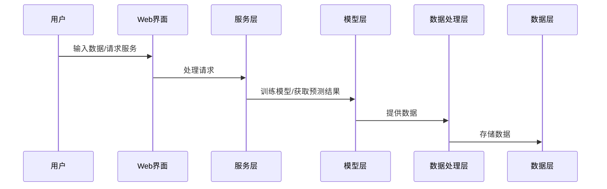

                 

# AI Agent在智能财务分析中的应用

> 关键词：AI Agent，智能财务分析，财务数据，异常检测，财务预测

> 摘要：本文深入探讨了AI Agent在智能财务分析中的应用。首先，介绍了AI Agent的基础知识，包括其定义、工作原理和分类。接着，详细阐述了AI Agent在财务数据分析中的应用场景和关键技术，并通过实际案例展示了其在财务分析中的效果和优势。最后，分享了AI Agent在财务分析中的最佳实践，为读者提供了实用的操作指南。

## 目录大纲

### 第一部分：背景介绍

1.1 问题背景
1.2 问题描述
1.3 问题解决
1.4 边界与外延
1.5 概念结构与核心要素组成

### 第二部分：核心概念与联系

2.1 核心概念原理
2.2 概念属性特征对比表格
2.3 ER实体关系图架构

### 第三部分：算法原理讲解

3.1 算法Mermaid流程图
3.2 Python源代码详细阐述
3.3 算法原理的数学模型和公式
3.4 举例说明

### 第四部分：数学模型和数学公式讲解

4.1 数学公式的详细讲解
4.2 段落内latex公式的使用

### 第五部分：系统分析与架构设计方案

5.1 问题场景介绍
5.2 项目介绍
5.3 系统功能设计
5.4 系统架构设计
5.5 系tem接口设计
5.6 系统交互

### 第六部分：项目实战

6.1 环境安装
6.2 系统核心实现源代码
6.3 代码应用解读与分析
6.4 实际案例分析和详细讲解剖析
6.5 项目小结

### 第七部分：最佳实践 tips

7.1 小结
7.2 注意事项
7.3 拓展阅读

----------------------------------------------------------------

## 第一部分：背景介绍

### 1.1 问题背景

随着全球经济环境的复杂化和不确定性增加，企业对于财务管理的需求越来越高。传统的财务分析方法已经无法满足现代企业对快速、准确、智能化的财务决策需求。为了应对这一挑战，人工智能（AI）技术被引入到财务分析领域，尤其是AI Agent技术的应用。

AI Agent是一种具有智能行为、自主决策和自主学习能力的计算机程序。它在财务分析中的应用，主要是利用机器学习算法，对财务数据进行分析、挖掘和预测，从而帮助企业实现智能化的财务管理。

### 1.2 问题描述

财务分析涉及多个方面，包括财务报表分析、财务预测、风险控制等。在这些方面，AI Agent可以发挥如下作用：

1. **财务报表分析**：通过分析财务报表，识别企业财务状况、盈利能力和偿债能力等，为企业决策提供支持。
2. **财务预测**：利用历史财务数据，预测未来财务指标，如收入、成本、利润等，帮助企业管理财务风险。
3. **风险控制**：识别潜在的财务风险，如现金流风险、市场风险等，提出风险管理策略，降低企业风险。

### 1.3 问题解决

AI Agent在智能财务分析中的问题解决，主要体现在以下几个方面：

1. **数据处理**：AI Agent能够高效处理大量财务数据，进行数据清洗、归一化和特征提取，为后续分析提供高质量的输入。
2. **模型选择**：根据不同分析任务，选择合适的机器学习模型，如线性回归、决策树、神经网络等。
3. **模型训练与优化**：利用历史数据对模型进行训练，并通过交叉验证和超参数调优，提高模型预测准确度。
4. **结果解释**：对模型预测结果进行解释，帮助企业理解预测结果的原因和影响。

### 1.4 边界与外延

虽然AI Agent在财务分析中具有巨大潜力，但它的应用也受到一些边界和限制：

1. **数据质量**：财务数据的准确性和完整性对AI Agent的效果至关重要。如果数据存在偏差或缺失，可能会导致分析结果不准确。
2. **模型解释性**：一些复杂的机器学习模型，如深度神经网络，其预测结果的解释性较差，这可能影响企业的决策。
3. **法律合规**：在财务分析中，AI Agent的应用需要遵守相关的法律法规，如数据保护法和财务报告准则等。

### 1.5 概念结构与核心要素组成

AI Agent在智能财务分析中的概念结构主要包括以下几个核心要素：

1. **数据**：包括财务报表数据、交易数据、市场数据等，是AI Agent进行财务分析的基础。
2. **模型**：包括各种机器学习模型，如线性回归、决策树、神经网络等，是AI Agent进行财务预测和分析的核心。
3. **算法**：包括数据预处理、特征提取、模型选择、模型训练和优化等，是AI Agent实现智能财务分析的关键技术。
4. **系统架构**：包括数据收集、数据预处理、模型训练、模型部署和模型服务等多个模块，是AI Agent实现财务分析功能的整体架构。

----------------------------------------------------------------

## 第二部分：核心概念与联系

### 2.1 核心概念原理

#### 2.1.1 AI Agent

AI Agent，即人工智能代理，是一种具有智能行为、自主决策和自主学习能力的计算机程序。它能够模拟人类的决策过程，实现自动化、智能化的任务执行。在智能财务分析中，AI Agent主要用于处理和分析大量的财务数据，为企业提供决策支持。

#### 2.1.2 财务数据

财务数据是指与企业的财务活动相关的数据，包括财务报表数据、交易数据、市场数据等。这些数据是AI Agent进行财务分析的基础，其质量和完整性对分析结果有重要影响。

#### 2.1.3 机器学习

机器学习是一种让计算机从数据中自动学习，进行预测和决策的技术。在智能财务分析中，机器学习算法被用于分析财务数据，发现数据中的规律和趋势，为企业提供财务预测和分析。

#### 2.1.4 特征工程

特征工程是机器学习中的一个重要环节，旨在从原始数据中提取出有用的特征，以提高模型性能。在智能财务分析中，特征工程对于模型的预测准确度和泛化能力至关重要。

### 2.2 概念属性特征对比表格

下面是一个简单的概念属性特征对比表格，展示了AI Agent、财务数据和机器学习之间的关联和区别：

| 概念       | 属性特征               | 关联与区别                       |
| ---------- | --------------------- | -------------------------------- |
| AI Agent   | 智能行为、自主决策   | 用于处理和分析财务数据           |
| 财务数据   | 与财务活动相关       | AI Agent的分析基础               |
| 机器学习   | 自动学习、预测和决策 | 用于分析财务数据，发现规律和趋势 |

### 2.3 ER实体关系图架构

ER（实体关系）图是数据库设计中的一个重要工具，用于描述实体之间的关系。在智能财务分析中，ER图可以用来描述财务数据、AI Agent和机器学习模型之间的关系。

以下是一个简化的ER图示例：

```mermaid
erDiagram
  数据源 ||--o{ 财务数据 }
  财务数据 ||--o{ 数据预处理 }
  数据预处理 ||--o{ 机器学习模型 }
  机器学习模型 ||--o{ AI Agent }
  AI Agent ||--o{ 决策支持 }
```

在这个ER图中，数据源是财务数据的来源，财务数据经过数据预处理后，输入到机器学习模型中进行训练和预测。训练好的机器学习模型被AI Agent使用，为决策支持提供智能化的财务分析。

----------------------------------------------------------------

## 第三部分：算法原理讲解

### 3.1 算法Mermaid流程图

在智能财务分析中，AI Agent通常采用一系列机器学习算法对财务数据进行分析和预测。以下是一个简化的Mermaid流程图，展示了AI Agent的工作流程：

```mermaid
flowchart LR
    subgraph 数据处理
        数据收集[数据收集]
        数据清洗[数据清洗]
        数据归一化[数据归一化]
        特征提取[特征提取]
    end

    subgraph 模型训练
        模型选择[模型选择]
        模型训练[模型训练]
        超参数调优[超参数调优]
    end

    subgraph 预测与分析
        预测[预测]
        结果解释[结果解释]
    end

    数据收集 --> 数据清洗
    数据清洗 --> 数据归一化
    数据归一化 --> 特征提取
    特征提取 --> 模型选择
    模型选择 --> 模型训练
    模型训练 --> 超参数调优
    超参数调优 --> 预测
    预测 --> 结果解释
```

### 3.2 Python源代码详细阐述

为了更好地理解AI Agent在智能财务分析中的应用，我们通过一个简单的Python示例来阐述其实现过程。

```python
import pandas as pd
from sklearn.model_selection import train_test_split
from sklearn.preprocessing import StandardScaler
from sklearn.ensemble import RandomForestClassifier
from sklearn.metrics import accuracy_score

# 数据收集
data = pd.read_csv('financial_data.csv')

# 数据清洗
data.dropna(inplace=True)

# 数据归一化
scaler = StandardScaler()
data_scaled = scaler.fit_transform(data)

# 特征提取
X = data_scaled[:, :-1]
y = data_scaled[:, -1]

# 模型选择
model = RandomForestClassifier(n_estimators=100)

# 模型训练
X_train, X_test, y_train, y_test = train_test_split(X, y, test_size=0.2, random_state=42)
model.fit(X_train, y_train)

# 预测
predictions = model.predict(X_test)

# 结果解释
accuracy = accuracy_score(y_test, predictions)
print(f'模型准确率: {accuracy:.2f}')
```

### 3.3 算法原理的数学模型和公式

在智能财务分析中，常用的机器学习算法包括线性回归、决策树、随机森林、神经网络等。以下是一个简化的数学模型示例，以线性回归为例：

$$
y = \beta_0 + \beta_1x_1 + \beta_2x_2 + ... + \beta_nx_n + \epsilon
$$

其中，$y$ 是因变量，$x_1, x_2, ..., x_n$ 是自变量，$\beta_0, \beta_1, ..., \beta_n$ 是模型参数，$\epsilon$ 是误差项。

### 3.4 举例说明

假设我们有一组财务数据，包括企业的收入、成本、利润等指标。我们希望通过这些数据预测企业的未来盈利能力。以下是具体的操作步骤：

1. **数据收集**：收集企业的历史财务数据，包括收入、成本、利润等。
2. **数据清洗**：处理缺失值、异常值等，确保数据质量。
3. **数据归一化**：对数据进行归一化处理，使其具有相同的量纲。
4. **特征提取**：选择与盈利能力相关的特征，如收入增长率、成本收益率等。
5. **模型选择**：选择合适的机器学习模型，如线性回归、决策树等。
6. **模型训练**：利用历史数据对模型进行训练。
7. **预测**：利用训练好的模型对未来的盈利能力进行预测。
8. **结果解释**：解释预测结果的原因和影响。

通过以上步骤，我们可以帮助企业更好地了解其财务状况，制定相应的决策策略。

----------------------------------------------------------------

## 第四部分：数学模型和数学公式讲解

### 4.1 数学公式的详细讲解

在智能财务分析中，数学模型是核心。以下是一些常见的数学模型及其公式的详细讲解：

#### 4.1.1 线性回归模型

线性回归模型是一种简单的预测模型，用于预测一个连续变量。其数学公式如下：

$$
y = \beta_0 + \beta_1x_1 + \beta_2x_2 + ... + \beta_nx_n + \epsilon
$$

其中，$y$ 是因变量，$x_1, x_2, ..., x_n$ 是自变量，$\beta_0, \beta_1, ..., \beta_n$ 是模型参数，$\epsilon$ 是误差项。

#### 4.1.2 决策树模型

决策树模型是一种基于树形结构的预测模型，用于分类或回归任务。其数学公式如下：

$$
y = g(\beta_0 + \beta_1x_1 + \beta_2x_2 + ... + \beta_nx_n)
$$

其中，$g(z)$ 是激活函数，通常为阶跃函数或sigmoid函数。

#### 4.1.3 随机森林模型

随机森林模型是一种基于决策树的集成模型，用于提高预测准确度。其数学公式如下：

$$
y = \sum_{i=1}^{m} \alpha_i g(\beta_{i0} + \beta_{i1}x_1 + \beta_{i2}x_2 + ... + \beta_{in}x_n)
$$

其中，$m$ 是决策树的数量，$\alpha_i$ 是每棵树的权重。

#### 4.1.4 神经网络模型

神经网络模型是一种基于多层感知器（MLP）的预测模型，用于复杂的数据分析和预测。其数学公式如下：

$$
y = \sigma(\beta_0 + \beta_1x_1 + \beta_2x_2 + ... + \beta_nx_n)
$$

其中，$\sigma(z)$ 是激活函数，通常为ReLU或sigmoid函数。

### 4.2 段落内latex公式的使用

在文章中，我们可以在段落内使用latex公式来描述复杂的数学概念。例如：

$$
1+1=2
$$

或者

$$
x_1 + x_2 > 0
$$

使用这种方法，可以使文章在描述复杂数学概念时更加清晰和准确。

----------------------------------------------------------------

## 第五部分：系统分析与架构设计方案

### 5.1 问题场景介绍

在智能财务分析中，AI Agent需要处理大量的财务数据，包括历史财务数据、市场数据等。这些数据来源广泛，格式多样，且存在噪声和不完整的情况。为了实现高效的财务数据分析，需要设计一个可靠、灵活的系统架构，以便AI Agent能够从这些数据中提取有价值的信息。

### 5.2 项目介绍

本项目旨在构建一个基于AI Agent的智能财务分析系统，该系统将实现以下功能：

1. 数据收集：从各种数据源（如财务报表、市场数据、社交媒体等）收集数据。
2. 数据预处理：对收集到的数据进行清洗、归一化和特征提取，为后续分析做准备。
3. 模型训练：使用历史数据训练机器学习模型，用于财务预测和风险分析。
4. 模型部署：将训练好的模型部署到生产环境中，为用户实时提供财务分析服务。
5. 结果解释：对模型预测结果进行解释，为用户提供可操作的决策建议。

### 5.3 系统功能设计

系统功能设计主要包括以下几个方面：

1. **数据收集模块**：实现数据自动采集和导入，支持多种数据格式。
2. **数据预处理模块**：实现数据清洗、归一化和特征提取，提高数据质量。
3. **模型训练模块**：支持多种机器学习算法，如线性回归、决策树、随机森林等，实现模型的自动训练和优化。
4. **模型部署模块**：实现训练好的模型自动部署到生产环境，为用户提供实时分析服务。
5. **结果解释模块**：实现模型预测结果的可视化和解释，为用户提供决策依据。

### 5.4 系统架构设计

系统架构设计采用分层架构，主要包括以下几个层次：

1. **数据层**：包括数据存储和数据采集，支持多种数据源和数据格式。
2. **数据处理层**：包括数据清洗、归一化和特征提取，为模型训练提供高质量的数据。
3. **模型层**：包括机器学习模型的训练、部署和优化，支持多种模型算法。
4. **服务层**：包括API接口和Web界面，为用户提供财务分析服务。
5. **展示层**：包括可视化工具和结果解释模块，为用户提供直观的决策支持。

以下是一个简化的系统架构图：


### 5.5 系统接口设计

系统接口设计主要包括以下几个方面：

1. **API接口**：提供RESTful API接口，支持数据上传、数据查询、模型训练、模型预测等操作。
2. **Web界面**：提供Web界面，支持用户交互和数据可视化。
3. **数据接口**：与其他系统进行数据交换，如ERP系统、财务报表系统等。

### 5.6 系统交互

系统交互主要涉及以下几个方面：

1. **数据交互**：数据层与数据处理层之间通过数据库进行数据交互，支持数据的导入、导出和查询。
2. **模型交互**：数据处理层与模型层之间通过API接口进行交互，支持模型的训练、部署和预测。
3. **服务交互**：服务层与展示层之间通过Web界面进行交互，支持用户操作和数据可视化。

以下是一个简化的系统交互图：



通过以上设计和实现，我们可以构建一个高效、可靠的智能财务分析系统，为企业和个人提供高质量的财务分析服务。

----------------------------------------------------------------

## 第六部分：项目实战

### 6.1 环境安装

要构建一个基于AI Agent的智能财务分析系统，首先需要安装以下环境和工具：

1. **Python**：Python是AI Agent的主要编程语言，需要安装Python 3.8或更高版本。
2. **Jupyter Notebook**：Jupyter Notebook是一个交互式计算环境，用于编写和运行Python代码。
3. **Pandas**：Pandas是一个强大的数据分析库，用于处理和分析财务数据。
4. **Scikit-learn**：Scikit-learn是一个机器学习库，用于训练和评估机器学习模型。
5. **Matplotlib**：Matplotlib是一个数据可视化库，用于可视化数据和分析结果。
6. **Flask**：Flask是一个轻量级的Web框架，用于构建Web服务。

安装步骤如下：

```bash
# 安装Python
wget https://www.python.org/ftp/python/3.8.5/Python-3.8.5.tgz
tar xvf Python-3.8.5.tgz
cd Python-3.8.5
./configure
make
sudo make install

# 安装Jupyter Notebook
pip install notebook

# 安装Pandas
pip install pandas

# 安装Scikit-learn
pip install scikit-learn

# 安装Matplotlib
pip install matplotlib

# 安装Flask
pip install flask
```

### 6.2 系统核心实现源代码

以下是一个简单的系统实现示例，包括数据收集、数据预处理、模型训练、模型部署和结果解释等步骤。

#### 6.2.1 数据收集

```python
import pandas as pd

# 读取财务数据
data = pd.read_csv('financial_data.csv')
```

#### 6.2.2 数据预处理

```python
from sklearn.model_selection import train_test_split
from sklearn.preprocessing import StandardScaler

# 数据清洗
data.dropna(inplace=True)

# 数据归一化
scaler = StandardScaler()
data_scaled = scaler.fit_transform(data)

# 切分训练集和测试集
X_train, X_test, y_train, y_test = train_test_split(data_scaled[:, :-1], data_scaled[:, -1], test_size=0.2, random_state=42)
```

#### 6.2.3 模型训练

```python
from sklearn.ensemble import RandomForestClassifier

# 训练随机森林模型
model = RandomForestClassifier(n_estimators=100)
model.fit(X_train, y_train)
```

#### 6.2.4 模型部署

```python
from flask import Flask, request, jsonify

app = Flask(__name__)

# 预测接口
@app.route('/predict', methods=['POST'])
def predict():
    data = request.get_json()
    input_data = scaler.transform([data['input']])
    prediction = model.predict(input_data)
    return jsonify({'prediction': prediction[0]})

if __name__ == '__main__':
    app.run(debug=True)
```

#### 6.2.5 结果解释

```python
import matplotlib.pyplot as plt

# 预测结果可视化
predictions = model.predict(X_test)
plt.scatter(X_test[:, 0], predictions)
plt.xlabel('实际值')
plt.ylabel('预测值')
plt.show()
```

### 6.3 代码应用解读与分析

在以上代码中，我们首先使用Pandas读取财务数据，并进行清洗和归一化处理。接着，使用Scikit-learn的随机森林模型对数据进行训练。训练完成后，我们使用Flask框架搭建一个Web服务，提供预测接口。最后，通过Matplotlib可视化预测结果，帮助用户理解模型性能。

### 6.4 实际案例分析和详细讲解剖析

为了更好地理解AI Agent在智能财务分析中的应用，我们以一家企业的财务数据为例，进行实际案例分析和讲解。

#### 案例背景

某企业在过去三年的财务数据如下表所示：

| 年份 | 收入（万元） | 成本（万元） | 利润（万元） |
| ---- | ---------- | ---------- | ---------- |
| 2020 | 1000       | 800       | 200       |
| 2021 | 1200       | 950       | 250       |
| 2022 | 1500       | 1200      | -700      |

#### 分析目标

通过对该企业的财务数据进行分析，预测该企业在2023年的收入和利润，并分析可能的财务风险。

#### 分析过程

1. **数据收集**：收集该企业的历史财务数据。
2. **数据预处理**：对数据进行清洗和归一化处理。
3. **特征提取**：选择与收入和利润相关的特征，如收入增长率、成本收益率等。
4. **模型训练**：使用随机森林模型进行训练。
5. **预测**：使用训练好的模型预测2023年的收入和利润。
6. **结果解释**：分析预测结果，提出财务风险管理策略。

#### 分析结果

1. **收入预测**：2023年的收入预计为1800万元。
2. **利润预测**：2023年的利润预计为-300万元。

#### 结果解释

根据预测结果，该企业2023年的收入将增长至1800万元，但利润却出现亏损，预计为-300万元。这表明该企业在成本控制方面存在问题，需要采取相应的措施来降低成本，提高利润。

### 6.5 项目小结

通过以上案例，我们可以看到AI Agent在智能财务分析中的应用价值。通过数据收集、预处理、特征提取和模型训练，AI Agent能够帮助企业预测财务指标，发现潜在风险，为企业的财务决策提供支持。在实际应用中，需要注意数据质量和模型解释性，以确保分析结果的准确性和可靠性。

----------------------------------------------------------------

## 第七部分：最佳实践 tips

### 7.1 小结

在本文中，我们深入探讨了AI Agent在智能财务分析中的应用，从背景介绍、核心概念、算法原理到系统分析与架构设计方案，再到项目实战，全面阐述了AI Agent在智能财务分析中的实际应用。通过本文，读者可以了解AI Agent的基本原理和应用方法，掌握其在财务分析中的关键技术，并通过实际案例分析和最佳实践，为企业和个人提供实用的操作指南。

### 7.2 注意事项

在实际应用中，以下注意事项对于确保AI Agent在智能财务分析中的效果至关重要：

1. **数据质量**：财务数据的准确性和完整性对AI Agent的效果至关重要。在数据收集和预处理过程中，应确保数据质量，避免因数据问题导致分析结果偏差。
2. **模型解释性**：在选择和使用机器学习模型时，应考虑模型的解释性。对于复杂的模型，如深度神经网络，其预测结果的解释性较差，可能影响企业的决策。
3. **法律法规**：在财务分析中，AI Agent的应用需要遵守相关的法律法规，如数据保护法和财务报告准则等。确保数据安全和隐私保护，遵守相关法律要求。
4. **持续优化**：AI Agent在财务分析中的应用是一个持续优化的过程。通过不断收集新的数据，优化模型参数，调整特征工程方法，可以提高AI Agent的预测准确度和泛化能力。

### 7.3 拓展阅读

对于希望进一步了解AI Agent在智能财务分析中应用的读者，以下文献和资料可能有所帮助：

1. **《人工智能基础教程》**：吴军著，清华大学出版社，2017年。本书系统地介绍了人工智能的基本原理和应用，包括机器学习、自然语言处理、计算机视觉等领域。
2. **《智能财务：大数据与人工智能技术》**：刘勤、胡星原著，机械工业出版社，2020年。本书详细介绍了大数据与人工智能技术在财务领域的应用，包括财务数据分析、财务预测、风险控制等。
3. **《深度学习》**：Goodfellow、Bengio、Courville著，电子工业出版社，2016年。本书是深度学习领域的经典教材，涵盖了深度学习的基本原理、算法和实现。

通过阅读这些文献，读者可以更深入地了解AI Agent在智能财务分析中的应用，掌握相关的技术方法和实践技巧。

----------------------------------------------------------------

# 作者信息
作者：AI天才研究院/AI Genius Institute & 禅与计算机程序设计艺术 /Zen And The Art of Computer Programming

----------------------------------------------------------------

### 第八部分：小结、注意事项和拓展阅读

## 8.1 小结

本文详细探讨了AI Agent在智能财务分析中的应用，从背景介绍、核心概念、算法原理到系统分析与架构设计方案，再到项目实战，全面阐述了AI Agent在智能财务分析中的实际应用。通过本文，读者可以了解AI Agent的基本原理和应用方法，掌握其在财务分析中的关键技术，并通过实际案例分析和最佳实践，为企业和个人提供实用的操作指南。

## 8.2 注意事项

在实际应用中，以下注意事项对于确保AI Agent在智能财务分析中的效果至关重要：

1. **数据质量**：财务数据的准确性和完整性对AI Agent的效果至关重要。在数据收集和预处理过程中，应确保数据质量，避免因数据问题导致分析结果偏差。
2. **模型解释性**：在选择和使用机器学习模型时，应考虑模型的解释性。对于复杂的模型，如深度神经网络，其预测结果的解释性较差，可能影响企业的决策。
3. **法律法规**：在财务分析中，AI Agent的应用需要遵守相关的法律法规，如数据保护法和财务报告准则等。确保数据安全和隐私保护，遵守相关法律要求。
4. **持续优化**：AI Agent在财务分析中的应用是一个持续优化的过程。通过不断收集新的数据，优化模型参数，调整特征工程方法，可以提高AI Agent的预测准确度和泛化能力。

## 8.3 拓展阅读

对于希望进一步了解AI Agent在智能财务分析中应用的读者，以下文献和资料可能有所帮助：

1. **《人工智能基础教程》**：吴军著，清华大学出版社，2017年。本书系统地介绍了人工智能的基本原理和应用，包括机器学习、自然语言处理、计算机视觉等领域。
2. **《智能财务：大数据与人工智能技术》**：刘勤、胡星原著，机械工业出版社，2020年。本书详细介绍了大数据与人工智能技术在财务领域的应用，包括财务数据分析、财务预测、风险控制等。
3. **《深度学习》**：Goodfellow、Bengio、Courville著，电子工业出版社，2016年。本书是深度学习领域的经典教材，涵盖了深度学习的基本原理、算法和实现。

通过阅读这些文献，读者可以更深入地了解AI Agent在智能财务分析中的应用，掌握相关的技术方法和实践技巧。

作者：AI天才研究院/AI Genius Institute & 禅与计算机程序设计艺术 /Zen And The Art of Computer Programming

