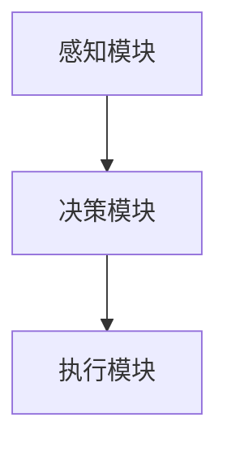

                 

### 《AI Agent在智能质量控制中的应用》

> 关键词：AI Agent、智能质量控制、质量预测、质量检测、质量优化

> 摘要：随着人工智能技术的快速发展，AI Agent作为一种智能体，其在智能质量控制中的应用逐渐受到关注。本文将详细介绍AI Agent的定义、特性，以及其在智能质量控制中的具体应用，旨在为读者提供对AI Agent在质量控制和质量管理中的深入理解。

#### 引言

在当今快速发展的工业4.0时代，质量控制在制造业、服务业等多个领域都扮演着至关重要的角色。随着产品和服务的复杂性不断增加，传统的质量控制和检测手段已经难以满足日益增长的质量需求。此时，人工智能（AI）技术的应用为解决这一难题提供了新的思路和工具。AI Agent作为一种能够自主学习和执行任务的智能体，其在智能质量控制中的应用正逐渐成为研究的热点。

本文将分为以下几个部分进行讨论：

1. **AI Agent基础理论**：介绍AI Agent的定义、分类及其核心特性。
2. **智能质量控制的背景与挑战**：分析智能质量控制的概念、重要性以及当前面临的挑战。
3. **AI Agent在智能质量控制中的应用**：详细探讨AI Agent在质量预测、质量检测和质量优化中的应用。
4. **AI Agent的构建与实现**：阐述AI Agent的架构设计、核心算法及其实现与部署。
5. **案例研究**：通过具体案例展示AI Agent在智能质量控制中的应用。
6. **AI Agent在智能质量控制中的应用实践**：介绍AI Agent在智能质量控制中的应用实践。
7. **未来展望**：分析AI Agent在智能质量控制中的应用前景、挑战与趋势。

#### AI Agent基础理论

##### AI Agent的定义与分类

AI Agent，即人工智能代理，是一种模拟人类智能行为，能够在特定环境下感知、决策和执行任务的智能系统。根据AI Agent的行为特点，我们可以将其分为以下几类：

1. **反应式Agent**：这类Agent只能根据当前环境感知，做出即时反应，不涉及任何记忆和学习。
2. **基于模型的Agent**：这类Agent通过建立环境模型，利用模型进行决策。
3. **学习型Agent**：这类Agent能够从经验中学习，并在未来任务中利用这些经验。

##### AI Agent的发展历程

AI Agent的发展可以追溯到20世纪80年代。早期的AI Agent主要基于规则系统，随着人工智能技术的进步，特别是机器学习和深度学习的发展，AI Agent的性能和功能得到了显著提升。

##### AI Agent的关键特性

AI Agent的关键特性包括：

1. **自主性**：AI Agent能够自主执行任务，无需人工干预。
2. **适应性**：AI Agent能够根据环境变化进行调整和优化。
3. **协作性**：AI Agent能够与其他Agent或人类协作完成任务。

#### 智能质量控制的背景与挑战

##### 智能质量控制的概念

智能质量控制是指利用人工智能技术对产品或服务的质量进行预测、检测和优化，从而提高整体质量水平。

##### 智能质量控制的重要性

智能质量控制的重要性体现在以下几个方面：

1. **提高产品质量**：通过预测和优化，减少缺陷和次品率。
2. **降低成本**：通过提前发现问题，减少维修和召回成本。
3. **提高效率**：自动化检测和优化流程，提高生产效率。

##### 当前智能质量控制面临的挑战

1. **数据质量问题**：质量数据的准确性和完整性直接影响智能质量控制的效果。
2. **模型可解释性**：复杂的AI模型往往难以解释，给质量决策带来困难。
3. **实时性要求**：质量检测和优化需要在生产过程中实时进行，对系统的响应速度有高要求。

#### AI Agent在智能质量控制中的应用

##### 质量预测

AI Agent可以通过分析历史数据，预测产品质量趋势。其具体应用包括：

1. **生产过程中的质量预测**：提前发现潜在质量问题，及时调整生产参数。
2. **供应链质量管理**：预测供应链中的质量波动，优化供应链布局。

##### 质量检测

AI Agent可以通过图像识别、声音分析等技术，对产品进行质量检测。其具体应用包括：

1. **外观检测**：检测产品外观缺陷。
2. **内部质量检测**：通过超声波、X射线等技术检测产品内部质量。

##### 质量优化

AI Agent可以通过优化算法，对生产过程进行优化，提高产品质量。其具体应用包括：

1. **生产参数优化**：根据产品质量数据，调整生产参数。
2. **供应链优化**：优化供应链中的物流和库存管理。

#### AI Agent的构建与实现

##### AI Agent的架构设计

AI Agent的架构设计包括感知模块、决策模块和执行模块。其架构图如下：

##### AI Agent的核心算法

AI Agent的核心算法包括机器学习算法、深度学习算法和强化学习算法。其中，强化学习算法在质量优化中应用广泛。

##### AI Agent的实现与部署

AI Agent的实现涉及数据采集、数据处理和模型训练等步骤。其部署方式包括：

1. **在线部署**：实时处理生产数据。
2. **离线部署**：定期分析数据，提供质量预测和优化建议。

#### 案例研究

##### 案例一：AI Agent在电子产品质量控制中的应用

在某电子产品制造企业中，AI Agent被用于质量预测和检测。通过分析生产数据，AI Agent能够提前发现潜在的质量问题，减少了次品率和生产成本。

##### 案例二：AI Agent在汽车制造质量控制中的应用

在汽车制造领域，AI Agent被用于检测车身外观缺陷和内部质量。通过深度学习算法，AI Agent能够精确识别缺陷，提高了生产效率。

##### 案例三：AI Agent在食品制造质量控制中的应用

在食品制造行业，AI Agent被用于检测食品的内部质量和安全性。通过图像识别和声音分析技术，AI Agent能够及时发现潜在的安全隐患。

#### AI Agent在智能质量控制中的应用实践

##### 数据准备与预处理

在AI Agent的应用中，数据准备与预处理是至关重要的一步。具体步骤包括：

1. **数据收集**：收集生产过程中的质量数据。
2. **数据清洗**：去除异常值和噪声。
3. **特征提取**：提取与质量相关的特征。

##### 质量预测模型训练

质量预测模型训练是AI Agent应用的核心步骤。具体步骤包括：

1. **数据划分**：将数据划分为训练集、验证集和测试集。
2. **模型选择**：选择适合的质量预测模型。
3. **模型训练**：使用训练集对模型进行训练。
4. **模型评估**：使用验证集和测试集评估模型性能。

##### 质量检测模型训练

质量检测模型训练是AI Agent在质量检测环节的关键。具体步骤包括：

1. **图像识别训练**：使用图像识别算法对缺陷进行识别。
2. **声音分析训练**：使用声音分析算法对产品质量进行判断。

##### 质量优化模型训练

质量优化模型训练是AI Agent在质量优化环节的关键。具体步骤包括：

1. **优化目标设定**：明确质量优化的目标。
2. **算法选择**：选择适合的优化算法。
3. **模型训练**：使用历史数据对模型进行训练。

#### AI Agent在智能质量控制中的应用优化

##### 模型优化策略

模型优化策略包括：

1. **超参数调整**：调整模型的超参数，提高模型性能。
2. **数据增强**：通过数据增强技术，提高模型对异常数据的鲁棒性。

##### 性能评估与调整

性能评估与调整包括：

1. **指标计算**：计算质量预测、检测和优化的准确率、召回率等指标。
2. **模型调整**：根据性能评估结果，调整模型结构和参数。

##### 安全性与隐私保护

安全性与隐私保护包括：

1. **数据加密**：对敏感数据进行加密处理。
2. **访问控制**：限制对数据集的访问权限。

#### 未来展望

##### AI Agent在智能质量控制中的应用前景

随着人工智能技术的不断发展，AI Agent在智能质量控制中的应用前景十分广阔。未来，AI Agent有望在以下几个方面得到进一步发展：

1. **智能化程度提高**：通过深度学习和强化学习，提高AI Agent的智能化水平。
2. **跨领域应用**：AI Agent不仅限于单一领域，而是能够在多个领域实现跨领域应用。

##### 挑战与趋势

未来，AI Agent在智能质量控制中面临的挑战主要包括：

1. **数据质量和可解释性**：提高数据质量和模型的可解释性，确保质量决策的可靠性。
2. **实时性**：提高系统的实时性，满足生产过程中的实时需求。

##### 发展方向与建议

为推动AI Agent在智能质量控制中的发展，我们提出以下建议：

1. **加强基础研究**：加大对AI Agent基础理论的研究，为应用提供理论支持。
2. **跨学科合作**：推动人工智能、质量管理等领域的跨学科合作，共同推动AI Agent在质量控制中的应用。

#### 总结

AI Agent作为一种具有自主性、适应性和协作性的智能体，其在智能质量控制中的应用具有重要的现实意义。通过本文的介绍，读者可以了解到AI Agent的定义、特性以及在质量预测、检测和优化中的具体应用。未来，随着人工智能技术的不断进步，AI Agent在智能质量控制中的应用将会更加广泛和深入。

#### 作者信息

作者：AI天才研究院/AI Genius Institute & 禅与计算机程序设计艺术 /Zen And The Art of Computer Programming

