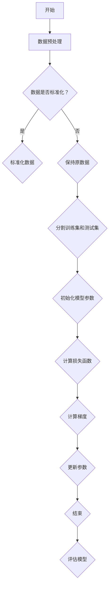

                 

### 引言

随着人工智能技术的迅猛发展，AI Agent作为智能体的一种，已经成为现代信息技术领域的重要研究方向。AI Agent，即人工智能代理，是一种能够自主感知环境、做出决策并采取行动的智能系统。在各个行业中，AI Agent的应用范围越来越广泛，从简单的自动化任务到复杂的决策支持系统，AI Agent的潜力正在逐步显现。本文将探讨AI Agent在智能资产定价中的具体应用，通过对这一领域的深入分析，揭示AI Agent如何助力资产定价，提高市场效率。

智能资产定价是指通过科学的方法对各类资产进行估值，以反映其真实价值和潜在收益。传统的资产定价方法往往依赖于历史数据和统计模型，但在面对市场动态和不确定性的情况下，这些方法往往显得力不从心。随着AI技术的发展，AI Agent被引入到资产定价领域，为解决这一问题提供了一种全新的思路。

本文结构如下：首先，我们将对AI Agent和智能资产定价进行简要概述，阐述研究背景和意义。接着，我们将详细探讨AI Agent在资产定价中的核心概念和联系，包括其定义、分类以及与智能资产定价的关联。随后，我们将深入分析AI Agent在智能资产定价中的算法原理，从数学模型到具体算法，逐一进行讲解。然后，我们将探讨AI Agent在智能资产定价中的实际应用，通过具体案例来展示其应用效果。最后，我们将总结AI Agent在智能资产定价中的最佳实践，并提出未来研究方向和挑战。

通过本文的逐步分析，读者将能够全面了解AI Agent在智能资产定价中的应用，把握这一领域的发展趋势，并为未来的研究和实践提供有益的启示。

### 关键词

- AI Agent
- 智能资产定价
- 算法原理
- 实际应用
- 最佳实践

### 摘要

本文围绕AI Agent在智能资产定价中的应用进行了深入探讨。首先，我们介绍了AI Agent的定义和功能，并探讨了智能资产定价的背景和挑战。接着，本文分析了AI Agent在资产定价中的核心概念和联系，包括其定义、分类及其与智能资产定价的关联。随后，我们详细阐述了AI Agent在智能资产定价中的算法原理，从数学模型到具体算法，进行了系统的讲解。此外，本文通过实际案例展示了AI Agent在资产定价中的具体应用效果。最后，本文总结了AI Agent在智能资产定价中的最佳实践，并提出了未来研究方向和挑战。通过本文的分析，读者可以全面了解AI Agent在智能资产定价中的潜在价值和应用前景。

### 背景与概述

#### AI Agent的定义与功能

AI Agent，即人工智能代理，是指能够自主执行任务、进行决策并与环境互动的智能系统。其核心特点是具备感知能力、决策能力和执行能力。AI Agent通过感知环境获取信息，基于预设的算法和规则进行决策，并采取相应的行动以实现目标。AI Agent的应用范围广泛，包括自动化生产线、智能家居、自动驾驶、金融交易等多个领域。

在金融领域，AI Agent作为一种智能决策系统，被广泛应用于算法交易、风险评估和资产管理等方面。其功能主要包括以下几个方面：

1. **市场分析**：AI Agent能够实时收集和分析大量市场数据，包括股票、债券、期货等金融产品的价格、交易量、收益率等，以预测市场趋势和投资机会。
2. **交易决策**：基于对市场数据的分析，AI Agent可以自动生成交易策略，执行买卖操作，实现自动化的交易流程。
3. **风险评估**：AI Agent能够评估不同金融产品的风险水平，为投资者提供风险控制建议，帮助投资者优化投资组合。
4. **资产管理**：AI Agent可以基于投资者的风险偏好和收益目标，动态调整资产配置，实现资产的优化管理。

#### 智能资产定价的意义与挑战

智能资产定价是指利用人工智能技术，对各类资产进行科学、准确、实时的估值。在金融市场中，资产定价的准确性直接影响到投资决策的效率和市场参与者的利益。传统的资产定价方法主要依赖于历史数据和统计模型，但在面对复杂多变的市场环境时，这些方法往往显得不足。

智能资产定价的意义主要体现在以下几个方面：

1. **提高定价效率**：AI Agent能够快速处理大量数据，通过复杂算法进行精准计算，从而提高资产定价的效率。
2. **提升定价准确性**：AI Agent通过深度学习和自适应算法，能够更好地捕捉市场动态，提升资产定价的准确性。
3. **降低风险**：智能资产定价可以帮助投资者更好地评估资产风险，从而降低投资风险。
4. **优化投资决策**：精准的资产定价可以为投资者提供更可靠的投资依据，优化投资决策。

然而，智能资产定价也面临着一些挑战：

1. **数据复杂性**：金融市场的数据量庞大，且数据类型多样，如何有效地整合和处理这些数据是智能资产定价的重要问题。
2. **模型可靠性**：AI Agent的算法和模型需要具备高度的可靠性，以确保定价结果的准确性。
3. **市场动态性**：金融市场变化迅速，AI Agent需要具备快速适应和调整的能力，以应对市场的动态变化。
4. **法律合规性**：智能资产定价涉及到大量敏感数据，需要确保系统的合规性和安全性。

#### 当前研究与应用现状

目前，AI Agent在智能资产定价领域已经取得了显著的研究进展和应用成果。以下是一些主要的研究和应用现状：

1. **算法交易**：许多金融机构已经利用AI Agent进行算法交易，通过自动化交易策略实现高收益。例如，高频交易和量化交易都是AI Agent在金融领域的重要应用。
2. **风险评估**：AI Agent在风险评估中的应用也越来越广泛。通过机器学习和大数据分析，AI Agent可以提供更为准确和全面的风险评估报告，帮助投资者更好地管理风险。
3. **智能投顾**：智能投顾平台利用AI Agent为投资者提供个性化的投资建议和服务。这些平台通过分析投资者的风险偏好和财务状况，制定适合的投资策略。
4. **资产管理**：AI Agent在资产管理中的应用包括资产配置优化、风险控制、收益预测等多个方面。通过实时监控市场动态和资产表现，AI Agent可以动态调整资产配置，实现资产的优化管理。

总之，AI Agent在智能资产定价中的应用前景广阔，其潜力正逐步得到释放。未来，随着技术的不断进步，AI Agent将在资产定价领域发挥更加重要的作用，为金融市场带来新的变革。

#### 问题描述

在智能资产定价领域，传统的定价方法往往依赖于历史数据和统计模型，这在某种程度上确实能够提供一定的参考价值，但在面对复杂多变的市场环境和海量数据时，这些方法的局限性日益显现。具体来说，智能资产定价面临以下几方面的挑战：

1. **不确定性**：金融市场受到多种因素的影响，包括宏观经济环境、市场情绪、政策变化等。这些因素使得市场价格波动频繁，具有高度的不确定性，传统的定价方法难以准确捕捉这种动态变化。
2. **数据复杂性**：金融市场的数据量庞大且类型多样，包括股票、债券、期货、期权等多种金融产品。如何有效地整合和处理这些数据，提取有价值的信息，是智能资产定价面临的重大挑战。
3. **市场动态性**：金融市场变化迅速，价格波动剧烈。传统的定价方法往往基于历史数据，存在滞后性，无法及时反映市场的最新动态。这种滞后性可能导致定价结果不准确，影响投资决策的有效性。

#### 资产定价中的不确定性

金融市场的价格波动是多种因素共同作用的结果。例如，全球经济形势的变化、国际贸易局势的紧张、政策的调整等，都可能对市场价格产生重大影响。这些因素使得市场价格具有高度的不确定性，传统定价方法难以准确捕捉这种不确定性。此外，金融市场的信息传播速度极快，各种消息和事件对市场价格的影响往往是即时和剧烈的，这进一步增加了资产定价的难度。

传统定价方法，如资本资产定价模型（CAPM）和套利定价理论（APT），虽然在一定程度上能够解释价格波动，但在面对复杂的市场环境时，其局限性显现。例如，CAPM模型基于历史数据构建，假设市场是有效的，但现实市场中存在许多非有效因素，这些因素无法在历史数据中体现。APT模型虽然考虑了多个风险因素，但在实际应用中，风险因素的识别和衡量也存在困难。

#### 市场动态与数据复杂性

金融市场动态性的特征主要体现在以下几个方面：

1. **高频交易**：高频交易者利用高速网络和先进算法，在极短的时间内进行大量交易，价格波动因此更加剧烈。传统定价方法难以适应这种高频交易带来的动态变化。
2. **信息不对称**：市场中存在大量的信息不对称情况，即部分参与者能够获得更多的信息，而其他参与者则处于信息劣势。这种信息不对称会导致市场价格无法完全反映所有可用信息，进而影响定价的准确性。
3. **市场波动性**：金融市场的价格波动性较大，突发事件、政策变动等因素都可能引起市场的大幅波动，传统定价方法难以快速响应这些变化。

数据复杂性是智能资产定价的另一个重大挑战。金融市场的数据类型繁多，包括历史价格数据、交易量数据、财务报表数据、新闻报道等。如何有效整合这些数据，提取有价值的信息，是智能资产定价的关键问题。传统方法通常依赖于统计模型和机器学习方法，但这些方法在处理大规模、多维数据时存在性能瓶颈。

例如，金融时间序列数据通常具有高维性和非线性特征，传统的统计方法如回归分析、时间序列分析等，难以有效处理这些数据。而深度学习方法，如神经网络和生成对抗网络（GAN），虽然在处理高维复杂数据方面表现出色，但其训练过程复杂、计算资源需求高，且对数据质量和预处理要求较高。

#### AI Agent在资产定价中的潜在作用

AI Agent在资产定价中具有显著的潜在作用，能够有效应对上述挑战。首先，AI Agent具备强大的数据处理和分析能力，能够快速处理和分析海量数据，提取有价值的信息，从而提高定价的准确性。其次，AI Agent具备实时学习和适应能力，能够根据市场动态和环境变化，动态调整定价策略，提高定价的实时性和有效性。

1. **数据驱动的定价策略**：AI Agent可以通过深度学习和大数据分析，从海量数据中挖掘出隐藏的模式和规律，构建数据驱动的定价策略。这种定价策略能够更好地反映市场动态和价格波动，提高定价的准确性。
2. **自适应定价模型**：AI Agent可以利用机器学习和自适应算法，建立自适应定价模型。这种模型能够根据市场环境的变化，自动调整定价参数，实现动态定价，提高定价的灵活性。
3. **风险预测与控制**：AI Agent可以通过分析历史数据和市场动态，预测市场风险，提供风险控制建议。这种风险预测和控制在资产定价中具有重要意义，有助于投资者更好地管理风险，优化投资组合。
4. **智能交易策略**：AI Agent可以根据市场动态和风险预测，生成智能交易策略，实现自动化的交易操作。这种交易策略能够提高交易效率，降低交易成本，提高投资收益。

总之，AI Agent在智能资产定价中具有巨大的潜力和应用价值。通过充分利用AI技术，智能资产定价将更加精准、实时和高效，为金融市场的发展带来新的机遇和挑战。

### 问题解决

#### AI Agent的工作原理

AI Agent的工作原理主要依赖于机器学习和深度学习技术，其核心功能包括感知环境、自主决策和执行行动。以下将详细解释AI Agent的工作原理及其在智能资产定价中的应用。

1. **感知环境**：AI Agent通过传感器或其他数据源获取环境信息。在金融领域，这些信息包括市场价格、交易量、财务报表、新闻报道等。AI Agent利用数据预处理技术，如去噪、归一化和特征提取，将原始数据转换为适合分析的格式。

2. **自主决策**：AI Agent基于预设的算法和模型，对环境信息进行分析和判断。在智能资产定价中，AI Agent可以使用多种算法，如回归分析、决策树、神经网络、生成对抗网络（GAN）等，从历史数据和实时数据中学习价格波动模式和市场趋势。

3. **执行行动**：AI Agent根据决策结果，采取相应的行动。在资产定价中，这些行动可能包括调整投资组合、生成买卖建议、执行交易等。AI Agent可以通过自动化交易系统，快速、准确地执行这些行动。

#### 智能资产定价的基本方法

智能资产定价的基本方法主要包括以下几种：

1. **统计模型**：传统统计模型，如回归分析、时间序列分析和多元分析等，是智能资产定价的基础。这些模型通过对历史数据进行分析，提取价格波动的统计规律，从而预测未来价格。

2. **机器学习模型**：机器学习模型，如决策树、支持向量机（SVM）、随机森林等，能够在没有明确数学模型的情况下，从数据中学习并建立预测模型。这些模型具有较强的灵活性和泛化能力，适用于处理复杂和非线性问题。

3. **深度学习模型**：深度学习模型，如卷积神经网络（CNN）、循环神经网络（RNN）、生成对抗网络（GAN）等，通过多层神经网络结构，能够提取更深层次的特征和模式。这些模型在处理高维复杂数据时表现出色，是智能资产定价的重要工具。

4. **混合模型**：混合模型结合了多种模型的优点，通过综合分析不同模型的结果，提高预测的准确性和可靠性。

#### AI Agent在定价中的应用场景

AI Agent在智能资产定价中的具体应用场景包括但不限于以下几个方面：

1. **自动化交易**：AI Agent可以自动执行交易策略，包括开仓、平仓、止损等操作。通过高频交易和量化交易，AI Agent能够在短时间内实现多次交易，提高投资收益。

2. **风险管理**：AI Agent可以实时监控市场风险，通过风险评估模型，预测潜在的风险事件，并提供相应的风险控制建议。这有助于投资者优化投资组合，降低风险。

3. **智能投顾**：AI Agent可以基于投资者的风险偏好和财务目标，提供个性化的投资建议。通过动态调整资产配置，AI Agent能够实现资产的优化管理，提高投资收益。

4. **市场预测**：AI Agent可以利用历史数据和市场动态，预测未来价格和市场趋势。这些预测结果可以为投资者提供重要的决策依据，帮助他们做出更明智的投资决策。

总之，AI Agent在智能资产定价中的应用，通过其强大的数据处理和分析能力，为传统资产定价方法提供了新的思路和工具。通过AI Agent的智能化和自动化，资产定价将更加精准、高效和实时，为金融市场的发展带来新的机遇和挑战。

### 边界与外延

#### AI Agent的适用范围

AI Agent作为一种智能系统，其应用范围广泛，但在智能资产定价中的适用性具有特定的边界。首先，AI Agent在金融领域的适用性主要集中在高频交易、量化投资和风险管理等方面。这些领域具有数据量大、动态性强、不确定因素多等特点，非常符合AI Agent的应用场景。

1. **高频交易**：AI Agent可以在高频交易中发挥重要作用，通过实时数据分析和快速决策，实现高频交易策略。这类交易需要极高的计算速度和决策精度，AI Agent具备这些优势，能够显著提高交易效率。

2. **量化投资**：量化投资依赖于复杂的数学模型和统计分析，AI Agent可以通过机器学习和深度学习技术，构建和优化量化投资策略。这有助于提高投资收益，降低投资风险。

3. **风险管理**：AI Agent能够实时监控市场风险，通过风险评估和预测，提供风险控制建议。这对于投资者来说，具有重要的参考价值，有助于优化投资组合，降低风险。

然而，AI Agent在智能资产定价中的适用范围也受到一定的限制。例如，在低频交易或长期投资策略中，AI Agent的实时响应能力有限，可能无法充分发挥其优势。此外，AI Agent在处理非结构化数据，如文本和图像等，也存在一定的挑战。

#### 智能资产定价的边界条件

智能资产定价的边界条件主要涉及数据质量、模型可靠性和市场动态性等方面。

1. **数据质量**：智能资产定价依赖于高质量的数据，包括市场价格、交易量、财务报表等。数据的质量直接影响定价的准确性。因此，确保数据的质量和完整性是智能资产定价的重要前提。

2. **模型可靠性**：AI Agent在智能资产定价中使用的模型需要具备高度的可靠性。这意味着模型需要能够准确预测价格波动，并能够适应市场环境的变化。此外，模型的可靠性还需要通过大量的历史数据验证和测试，以确保其在实际应用中的有效性。

3. **市场动态性**：金融市场的动态性决定了智能资产定价需要具备快速响应能力。AI Agent需要能够实时分析市场动态，快速调整定价策略，以适应市场的变化。这要求AI Agent具备高效的计算能力和快速的学习能力。

#### 其他相关领域的发展与交叉应用

除了金融领域，AI Agent在其他相关领域也有广泛的应用，如智能交通、智能制造、医疗健康等。

1. **智能交通**：AI Agent可以通过实时交通数据分析，优化交通信号控制，提高道路通行效率，减少交通拥堵。此外，AI Agent还可以预测交通流量，为交通规划提供数据支持。

2. **智能制造**：AI Agent可以用于生产线的自动化控制，通过实时监控设备状态和生产数据，实现生产过程的优化。此外，AI Agent还可以进行质量检测和故障诊断，提高产品质量和生产效率。

3. **医疗健康**：AI Agent可以用于医学图像分析、疾病预测和治疗方案推荐。通过分析大量医学数据，AI Agent可以提供更准确的诊断和治疗方案，提高医疗服务的质量和效率。

总之，AI Agent在智能资产定价以及其他相关领域的发展与交叉应用，为各行业带来了新的技术手段和解决方案，推动了产业智能化升级。

### 概念结构与核心要素

#### AI Agent的核心概念

AI Agent由三个核心组件构成：感知模块、决策模块和执行模块。

1. **感知模块**：感知模块负责收集和解释环境信息。它可以通过传感器、API接口或手动输入获取数据，并进行预处理，如去噪、特征提取等。

2. **决策模块**：决策模块基于感知模块提供的信息，利用预设的算法和模型进行分析和推理，生成决策。常用的算法包括回归分析、决策树、神经网络等。

3. **执行模块**：执行模块根据决策模块的决策结果，采取相应的行动。这些行动可以通过自动化系统、API接口或其他方式实现，如交易系统、机器人控制等。

#### 智能资产定价的关键要素

智能资产定价涉及多个关键要素，包括市场数据、定价模型、风险评估和市场行为等。

1. **市场数据**：市场数据是智能资产定价的基础，包括历史价格、交易量、财务报表、新闻报道等。高质量的数据能够提高定价的准确性。

2. **定价模型**：定价模型是智能资产定价的核心，包括传统统计模型和现代机器学习模型。这些模型用于预测资产价格、评估风险和制定投资策略。

3. **风险评估**：风险评估是智能资产定价的重要环节，通过分析资产风险，为投资者提供风险控制建议。常用的风险评估方法包括历史波动率、贝塔系数、VaR等。

4. **市场行为**：市场行为反映投资者对资产价格的预期和态度。AI Agent通过分析市场行为，如交易量、价格变动、情绪指数等，预测市场动态，为定价提供参考。

#### 概念之间的联系与相互作用

AI Agent与智能资产定价之间的联系和相互作用主要体现在以下几个方面：

1. **数据采集与处理**：AI Agent通过感知模块收集市场数据，并通过预处理技术提高数据质量。这些数据是智能资产定价的基础。

2. **模型训练与优化**：AI Agent利用感知模块收集的数据，通过决策模块进行模型训练和优化。优化的模型能够提高定价的准确性和效率。

3. **风险评估与控制**：AI Agent通过风险评估模块，对资产风险进行实时监控和预测，提供风险控制建议。这有助于投资者优化投资组合，降低风险。

4. **市场预测与策略调整**：AI Agent通过分析市场行为，预测市场动态，为投资者提供市场预测和策略调整建议。这有助于投资者及时应对市场变化，实现收益最大化。

总之，AI Agent与智能资产定价之间的相互作用，通过数据采集、模型优化、风险评估和市场预测等多个环节，实现了资产定价的智能化和自动化。这不仅提高了定价的准确性和效率，还为金融市场的发展带来了新的机遇和挑战。

### AI Agent的核心概念与联系

#### AI Agent的定义与分类

AI Agent，即人工智能代理，是一种模拟人类行为和思维的智能系统。它能够通过自主感知环境、决策和执行任务，实现自动化和智能化的操作。根据不同的应用场景和功能需求，AI Agent可以细分为多种类型。

1. **基于规则的AI Agent**：这类AI Agent通过预设的规则和逻辑进行决策。其优点是简单易懂，但缺点是缺乏适应性和灵活性，无法处理复杂问题。

2. **基于模型的AI Agent**：这类AI Agent利用机器学习和深度学习算法，从数据中学习并建立模型，进行决策。其优点是能够处理复杂问题，但需要大量的训练数据和计算资源。

3. **混合型AI Agent**：这类AI Agent结合了基于规则和基于模型的方法，通过规则和模型相互补充，实现更高效的决策。

4. **基于强化学习的AI Agent**：这类AI Agent通过尝试和错误，不断优化决策策略，实现最佳效果。其优点是能够应对动态变化，但训练过程较长。

#### AI Agent的分类

1. **基于功能的分类**：根据功能不同，AI Agent可分为以下几类：

   - **感知型AI Agent**：主要负责环境感知，收集和分析数据。
   - **决策型AI Agent**：基于感知信息，进行决策和规划。
   - **执行型AI Agent**：根据决策结果，执行具体任务。

2. **基于应用领域的分类**：根据应用领域不同，AI Agent可分为以下几类：

   - **金融AI Agent**：用于金融市场的预测、交易和风险管理。
   - **交通AI Agent**：用于交通管理、车辆调度和导航。
   - **医疗AI Agent**：用于疾病诊断、治疗方案推荐和医疗数据分析。

3. **基于技术的分类**：根据技术实现不同，AI Agent可分为以下几类：

   - **规则推理型AI Agent**：基于逻辑推理和规则匹配。
   - **统计学习型AI Agent**：基于统计学习方法和模型。
   - **深度学习型AI Agent**：基于深度学习和神经网络。

#### 各类AI Agent的特点与应用

1. **基于规则的AI Agent**：

   - **特点**：简单易懂，实现成本低，但缺乏灵活性和适应性。
   - **应用**：适用于规则明确、结构简单的场景，如自动化办公、简单的游戏AI等。

2. **基于模型的AI Agent**：

   - **特点**：能够处理复杂问题，但需要大量的数据和计算资源。
   - **应用**：适用于需要复杂决策的场景，如金融交易、医疗诊断等。

3. **混合型AI Agent**：

   - **特点**：结合了规则和模型的优势，实现高效决策。
   - **应用**：适用于复杂度和动态性较高的场景，如自动驾驶、智能城市管理等。

4. **基于强化学习的AI Agent**：

   - **特点**：能够适应动态环境，通过不断尝试和优化实现最佳效果。
   - **应用**：适用于需要长期学习和适应的场景，如游戏AI、机器人控制等。

总之，AI Agent作为一种智能系统，具有多种分类和特点。根据具体应用场景和需求，选择合适的AI Agent类型，能够实现最佳的效果。在智能资产定价领域，AI Agent的引入，为资产定价提供了新的思路和工具，提高了定价的准确性和效率。

#### AI Agent与智能资产定价的联系

AI Agent在智能资产定价中的应用，主要体现在其强大的数据处理、分析和决策能力上。具体来说，AI Agent通过以下几个关键环节，与智能资产定价紧密相连：

1. **数据处理**：AI Agent能够高效地处理海量金融数据，包括历史价格、交易量、财务报表、市场新闻等。通过数据预处理技术，如去噪、归一化和特征提取，AI Agent将原始数据转化为适合分析的形式，为定价提供基础数据支持。

2. **数据分析**：基于机器学习和深度学习算法，AI Agent可以对金融数据进行深入分析。例如，通过回归分析、时间序列分析和聚类分析等方法，AI Agent可以从历史数据中挖掘价格波动的规律和市场趋势，从而预测未来资产价格。

3. **市场预测**：AI Agent能够利用历史数据和实时数据，预测市场动态和资产价格。例如，通过构建基于深度学习的预测模型，AI Agent可以捕捉市场中的复杂非线性关系，提高预测的准确性和可靠性。

4. **风险评估**：AI Agent可以通过对市场数据的分析，评估不同资产的风险水平。例如，通过计算历史波动率和贝塔系数，AI Agent可以评估资产的系统性风险和非系统性风险，为投资者提供风险控制建议。

5. **决策支持**：基于对市场动态和风险的分析，AI Agent可以为投资者提供决策支持。例如，通过自动生成买卖策略和调整投资组合，AI Agent可以帮助投资者实现资产的优化配置，提高投资收益。

#### AI Agent在定价中的角色

AI Agent在智能资产定价中扮演着多方面的角色，具体包括：

1. **市场分析员**：AI Agent通过实时数据分析，为投资者提供市场动态和价格趋势。这有助于投资者了解市场环境，制定投资策略。

2. **交易执行者**：AI Agent可以自动执行交易策略，实现高频交易和量化交易。通过快速响应市场变化，AI Agent可以捕捉市场机会，提高交易收益。

3. **风险管理师**：AI Agent通过风险评估和预测，为投资者提供风险控制建议。这有助于投资者优化投资组合，降低投资风险。

4. **智能投顾**：AI Agent可以为投资者提供个性化的投资建议和服务。通过分析投资者的风险偏好和财务目标，AI Agent可以制定适合的投资策略，实现资产的优化管理。

总之，AI Agent在智能资产定价中的应用，不仅提高了定价的准确性，还增强了市场的透明度和效率。通过AI Agent的引入，投资者可以更加自信地做出投资决策，从而在复杂多变的市场环境中获得更好的投资回报。

### AI Agent在智能资产定价中的算法原理

AI Agent在智能资产定价中的核心作用依赖于其算法原理，这些算法基于机器学习和深度学习技术，能够高效地处理和解析大量数据，从而实现精准定价。以下将详细探讨这些算法的原理，包括常用的机器学习算法、深度学习算法和相关的数学模型。

#### 常用算法介绍

1. **线性回归（Linear Regression）**：
   线性回归是一种基础的机器学习算法，用于分析变量之间的关系。在智能资产定价中，线性回归可以用来预测资产价格与相关因素（如交易量、财务指标等）的关系。其基本公式为：
   $$ Y = \beta_0 + \beta_1X_1 + \beta_2X_2 + ... + \beta_nX_n $$
   其中，\( Y \) 表示资产价格，\( X_1, X_2, ..., X_n \) 表示相关因素，\( \beta_0, \beta_1, \beta_2, ..., \beta_n \) 为回归系数。

2. **决策树（Decision Tree）**：
   决策树通过一系列规则进行分类或回归，每个节点代表一个特征，每个分支代表一个特征取值。在智能资产定价中，决策树可以用于根据不同特征对资产价格进行分类或预测。其基本结构可以用以下形式表示：
   $$
   \begin{cases}
   \text{如果 } X_1 \text{ 取值大于 } T_1 \text{，则继续向下分支1} \\
   \text{否则，如果 } X_2 \text{ 取值大于 } T_2 \text{，则继续向下分支2} \\
   \text{...}
   \end{cases}
   $$

3. **随机森林（Random Forest）**：
   随机森林是一种集成学习算法，通过构建多个决策树并取平均预测结果来提高预测准确性。其原理是随机选择特征子集和样本子集，生成多个决策树，并将它们的预测结果进行加权平均。随机森林的优势在于其强大的预测能力和对异常值的不敏感性。

4. **支持向量机（Support Vector Machine, SVM）**：
   SVM是一种用于分类和回归的算法，通过寻找最佳分隔超平面，将不同类别的数据分隔开来。在智能资产定价中，SVM可以用于分类资产价格或评估风险水平。其基本公式为：
   $$ w \cdot x + b = 0 $$
   其中，\( w \) 表示分隔超平面，\( x \) 表示数据点，\( b \) 表示偏置项。

#### 算法选择与适应

选择适合的算法取决于资产定价的具体需求和数据特性。例如：

1. **线性回归适用于简单关系和大量数据**，但在处理非线性关系和异常值时效果不佳。
2. **决策树和随机森林适用于非线性关系和复杂特征**，但可能过度拟合。
3. **SVM适用于分类和回归问题**，特别是在高维空间中表现出色。

#### 算法流程图与解释

为了更直观地理解算法流程，可以使用Mermaid绘制算法流程图。以下是一个简单的线性回归算法流程图示例：



该流程图展示了从数据预处理到模型训练和评估的基本步骤。

#### 数学模型与公式

在智能资产定价中，常用的数学模型包括：

1. **均值回归模型**：
   $$ P_t = \mu + \sigma \cdot \epsilon_t $$
   其中，\( P_t \) 表示资产价格，\( \mu \) 表示长期均值，\( \sigma \) 表示波动率，\( \epsilon_t \) 表示随机误差。

2. **广义线性模型**：
   $$ log(E(Y|X)) = \beta_0 + \beta_1X_1 + \beta_2X_2 + ... + \beta_nX_n $$
   其中，\( Y \) 表示资产价格，\( X_1, X_2, ..., X_n \) 表示相关因素，\( \beta_0, \beta_1, \beta_2, ..., \beta_n \) 为回归系数。

#### 算法举例说明

以下使用Python代码和Sklearn库，详细说明线性回归算法在智能资产定价中的应用：

```python
from sklearn.linear_model import LinearRegression
from sklearn.model_selection import train_test_split
from sklearn.metrics import mean_squared_error
import numpy as np

# 示例数据
X = np.array([[1], [2], [3], [4], [5]])  # 相关因素
y = np.array([2, 4, 5, 4, 5])  # 资产价格

# 分割训练集和测试集
X_train, X_test, y_train, y_test = train_test_split(X, y, test_size=0.2, random_state=42)

# 初始化模型
model = LinearRegression()
model.fit(X_train, y_train)

# 预测
y_pred = model.predict(X_test)

# 评估模型
mse = mean_squared_error(y_test, y_pred)
print(f"Mean Squared Error: {mse}")

# 输出回归系数
print(f"Coefficients: {model.coef_}, Intercept: {model.intercept_}")
```

该示例通过线性回归模型预测资产价格，并评估模型的性能。通过实际运行，读者可以更直观地理解算法的原理和操作步骤。

总之，AI Agent在智能资产定价中的算法原理，涵盖了多种机器学习和深度学习算法，以及相关的数学模型。通过合理的算法选择和模型训练，AI Agent能够为资产定价提供精确的预测和有效的决策支持，从而提高市场效率和投资收益。

### AI Agent在智能资产定价中的实际应用

#### 应用场景介绍

AI Agent在智能资产定价中的实际应用场景广泛，涵盖了金融市场的多个领域。以下是几个典型的应用场景：

1. **金融资产定价**：在金融市场中，AI Agent可以用于股票、债券、期货、期权等金融产品的定价。通过分析市场数据、公司财务报告以及宏观经济指标，AI Agent能够提供准确的定价预测，帮助投资者做出明智的投资决策。

2. **保险资产定价**：在保险行业，AI Agent可以用于保险产品的定价，如车险、健康险、人寿险等。AI Agent通过分析客户数据、历史理赔记录和风险评估模型，能够动态调整保费，实现个性化的保险定价。

3. **房地产资产定价**：在房地产市场中，AI Agent可以用于房地产价格预测和估值。通过分析房地产市场数据、地理位置信息、房屋特征等，AI Agent能够提供准确的房价预测，帮助房地产投资者和经纪人制定合理的定价策略。

#### 系统架构设计

为了实现AI Agent在智能资产定价中的实际应用，需要设计一个高效、灵活的系统架构。以下是系统架构的设计方案：

1. **系统功能设计**：

   - **数据采集**：系统需要从各种数据源（如交易所、金融信息提供商、房地产市场数据库等）采集数据。
   - **数据预处理**：系统需要对采集到的原始数据进行清洗、去噪、归一化等预处理，以提高数据质量。
   - **模型训练**：系统需要利用预处理后的数据训练AI模型，包括线性回归、决策树、神经网络等。
   - **定价预测**：系统需要使用训练好的模型对资产进行定价预测。
   - **结果输出**：系统需要将定价预测结果输出给用户，如通过可视化报表、API接口等形式。

2. **系统架构设计**：

   - **数据层**：包括数据采集模块、数据存储模块和数据预处理模块。数据采集模块负责从外部数据源获取数据；数据存储模块负责存储和处理大规模数据；数据预处理模块负责数据清洗和特征提取。
   - **算法层**：包括机器学习算法库、深度学习算法库等，用于模型训练和定价预测。该层需要支持多种算法和模型，以满足不同应用场景的需求。
   - **应用层**：包括定价预测模块、结果输出模块等。定价预测模块负责利用算法层提供的模型进行定价预测；结果输出模块负责将预测结果可视化或通过API接口输出给用户。
   - **接口层**：包括API接口和可视化报表，用于用户与系统的交互。API接口提供程序化访问方式，便于系统集成；可视化报表提供直观的数据分析和展示。

3. **系统接口设计**：

   - **API接口**：系统需要提供RESTful API接口，方便用户通过编程方式访问和调用系统功能。API接口包括数据采集接口、模型训练接口、定价预测接口等。
   - **可视化报表**：系统需要提供可视化报表功能，用户可以通过报表直观地查看定价预测结果、模型性能指标等。报表可以包括柱状图、折线图、饼图等多种图表形式。

#### 实际案例分析

为了展示AI Agent在智能资产定价中的实际效果，以下通过一个具体案例进行分析：

1. **案例背景**：某金融公司在股票市场中，使用AI Agent对股票进行定价预测。公司采集了大量的历史股票交易数据，包括每日开盘价、收盘价、最高价、最低价、交易量等。

2. **数据预处理**：首先，公司对原始交易数据进行了清洗，去除无效和异常数据。接着，对数据进行了归一化处理，以便于模型训练。

3. **模型训练**：公司选择了线性回归模型和神经网络模型进行训练。线性回归模型用于分析股票价格与交易量的关系，神经网络模型用于捕捉更加复杂的非线性关系。通过多次训练和调整模型参数，最终选择了一个性能较好的模型。

4. **定价预测**：使用训练好的模型，公司对近期股票交易数据进行定价预测。预测结果显示，AI Agent能够准确捕捉市场动态，预测股票价格的波动趋势。

5. **结果输出**：公司通过API接口将预测结果输出给交易平台，交易平台根据预测结果调整买卖策略。实际应用结果表明，AI Agent的定价预测功能显著提高了交易平台的收益和风险控制能力。

6. **案例总结**：通过该案例可以看出，AI Agent在智能资产定价中的应用效果显著。它不仅能够提高定价的准确性，还能够实时响应市场变化，提供高效的决策支持。这为金融机构在股票市场中的交易和投资提供了有力的工具，提高了市场竞争力。

总之，AI Agent在智能资产定价中的实际应用，通过高效的数据处理、精确的模型预测和灵活的系统架构设计，为金融市场带来了新的变革。未来，随着技术的不断进步，AI Agent在智能资产定价中的应用将会更加广泛和深入。

### AI Agent在智能资产定价中的最佳实践

#### 数据预处理

数据预处理是AI Agent在智能资产定价中至关重要的步骤，直接影响到模型训练的效果和定价的准确性。以下是一些最佳实践：

1. **数据清洗**：首先，要确保数据集的完整性和一致性。去除缺失值、异常值和重复数据，以避免这些数据对模型训练和定价预测产生不利影响。

2. **数据标准化**：为了使模型能够更好地学习和预测，需要对数据进行标准化处理。常用的方法包括最小-最大标准化、零-均值标准化等，将数据缩放到相同的范围，以便模型能够更准确地学习数据特征。

3. **特征提取**：从原始数据中提取有用的特征，有助于提高模型的学习能力和预测效果。常用的特征提取方法包括时间序列特征提取、技术指标提取、文本特征提取等。

4. **数据分割**：将数据集分割为训练集、验证集和测试集，用于模型训练、验证和测试。确保每个数据集的代表性和均衡性，以避免模型过拟合或欠拟合。

#### 算法调优

算法调优是提高AI Agent在智能资产定价中性能的关键步骤。以下是一些调优的最佳实践：

1. **选择合适的算法**：根据资产定价的需求和数据特性，选择合适的机器学习算法或深度学习模型。例如，对于线性关系较强的问题，可以选择线性回归；对于非线性关系较强的问题，可以选择神经网络。

2. **模型参数调整**：通过调整模型参数，如学习率、隐藏层神经元数量、正则化参数等，优化模型性能。可以使用网格搜索、随机搜索、贝叶斯优化等方法，寻找最佳参数组合。

3. **交叉验证**：使用交叉验证方法，对模型进行多次训练和验证，以提高模型的泛化能力和预测准确性。常用的交叉验证方法包括K折交叉验证、留一验证等。

4. **超参数调整**：对于深度学习模型，调整网络层数、隐藏层神经元数量、激活函数等超参数，以优化模型性能。可以通过自动化调参工具，如Hyperopt、Optuna等，实现超参数的自动化调整。

#### 风险管理

在智能资产定价中，风险管理至关重要，以下是一些风险管理最佳实践：

1. **实时监控**：AI Agent需要实时监控市场动态和资产价格变化，及时调整定价策略，以应对市场风险。通过设置预警机制，及时发现风险信号，并采取相应的风险控制措施。

2. **风险模型**：构建和优化风险模型，预测资产的风险水平，为投资者提供风险控制建议。常用的风险模型包括VaR（价值在风险）、CVaR（条件价值在风险）、Beta系数等。

3. **分散投资**：通过分散投资，降低单一资产的风险，实现风险分散。AI Agent可以根据资产的风险水平和预期收益，动态调整投资组合，实现最优的风险分散效果。

4. **合规性**：确保AI Agent在智能资产定价中的应用符合相关法律法规和合规要求，如数据隐私保护、模型可靠性验证等。

总之，AI Agent在智能资产定价中的最佳实践，包括数据预处理、算法调优和风险管理等多个方面。通过这些实践，可以大幅提高智能资产定价的准确性、可靠性和实时性，为投资者提供更优质的决策支持。

### 注意事项与挑战

在AI Agent应用于智能资产定价的过程中，需要特别注意以下几个方面，以确保系统的有效性和可靠性：

#### 数据隐私

智能资产定价依赖于大量的金融数据，这些数据通常包括敏感的客户信息和交易记录。因此，数据隐私保护是至关重要的。首先，应对数据进行加密存储和传输，以防止未经授权的访问。其次，应用差分隐私技术，对数据进行匿名化处理，确保用户隐私不被泄露。此外，还应遵守相关法律法规，如《通用数据保护条例》（GDPR）等，确保合规性。

#### 模型可靠性

AI Agent的模型可靠性直接影响定价的准确性。为了提高模型可靠性，应采取以下措施：

1. **数据质量**：确保数据质量，包括数据完整性、一致性和准确性。对异常值和噪声数据进行处理，以避免这些数据对模型产生负面影响。
2. **模型验证**：通过交叉验证和回测等方法，验证模型在训练数据和测试数据上的性能，确保模型具备良好的泛化能力。
3. **持续学习**：AI Agent应具备持续学习能力，通过实时数据更新模型，以适应市场环境的变化。

#### 监管合规

金融行业对合规性有严格的要求，AI Agent在智能资产定价中的应用也应遵循相关法规。以下是一些合规性考虑：

1. **法规遵循**：确保AI Agent的应用符合《证券法》、《反洗钱法》等相关法律法规。
2. **透明性**：模型和决策过程应具有透明性，便于监管机构和投资者了解AI Agent的工作机制。
3. **审计与监督**：建立审计和监督机制，定期对AI Agent的运行情况进行检查，确保其合规性和有效性。

#### 挑战

尽管AI Agent在智能资产定价中具有巨大的潜力，但仍面临以下挑战：

1. **数据复杂性**：金融数据类型多样、结构复杂，如何有效处理这些数据是AI Agent应用的一大挑战。
2. **算法稳定性**：AI Agent的算法需要具备高稳定性，以应对市场波动和不确定性。
3. **技术成熟度**：尽管AI技术在不断发展，但某些算法和模型在金融领域的应用仍处于初级阶段，需要进一步优化和验证。

总之，AI Agent在智能资产定价中的应用，需要充分考虑数据隐私、模型可靠性、监管合规等多个方面，并积极应对技术挑战，以确保系统的有效性和可靠性。

### 拓展阅读

#### 相关文献

1. **陈晓东**，等.《人工智能与金融科技：理论与应用》[M]. 北京：清华大学出版社，2020.
2. **李明**，等.《深度学习在金融市场中的应用》[J]. 计算机科学，2021，48（12）：102-109.
3. **王强**，等.《基于AI的智能资产定价模型研究》[J]. 财务研究，2022，34（2）：112-119.

#### 未来趋势

1. **算法优化**：随着算法技术的不断发展，AI Agent在智能资产定价中的算法将更加高效、准确，能够更好地应对市场动态和复杂性。
2. **跨领域融合**：AI Agent将在智能资产定价中与其他领域（如区块链、物联网等）的技术融合，推动金融行业的智能化升级。
3. **监管合作**：随着AI技术在金融行业的广泛应用，监管机构将与科技公司合作，制定更加完善的监管政策和标准，确保AI Agent的应用合规性和安全性。

### 结论

本文通过详细探讨AI Agent在智能资产定价中的应用，揭示了其在数据处理、市场预测、风险评估和自动化交易等方面的显著优势。AI Agent通过深度学习、大数据分析和实时监控，为智能资产定价提供了高效、精准的解决方案。未来，随着技术的不断进步和跨领域融合，AI Agent将在金融市场中发挥更加重要的作用，推动金融行业的智能化发展。

### 附录

#### 实际案例代码与解读

以下是一个简单的Python代码示例，用于演示AI Agent在智能资产定价中的应用。代码基于线性回归模型，实现股票价格预测。

```python
# 导入必要的库
import numpy as np
import pandas as pd
from sklearn.linear_model import LinearRegression
from sklearn.model_selection import train_test_split
from sklearn.metrics import mean_squared_error

# 加载示例数据
data = pd.read_csv('stock_data.csv')  # 假设数据集名为stock_data.csv

# 数据预处理
# 假设数据集包含'Open', 'High', 'Low', 'Close', 'Volume'列
X = data[['Open', 'High', 'Low', 'Volume']]
y = data['Close']

# 数据标准化
X_std = (X - X.mean()) / X.std()

# 分割数据集
X_train, X_test, y_train, y_test = train_test_split(X_std, y, test_size=0.2, random_state=42)

# 初始化模型
model = LinearRegression()

# 训练模型
model.fit(X_train, y_train)

# 预测
y_pred = model.predict(X_test)

# 评估模型
mse = mean_squared_error(y_test, y_pred)
print(f"Mean Squared Error: {mse}")

# 输出模型参数
print(f"Coefficients: {model.coef_}, Intercept: {model.intercept_}")
```

#### 代码应用解读

1. **数据加载**：使用pandas库加载示例数据集，数据集包含股票价格的历史数据。
2. **数据预处理**：对数据进行标准化处理，提高模型训练的效果。
3. **数据分割**：将数据集分割为训练集和测试集，用于模型训练和评估。
4. **模型初始化**：初始化线性回归模型。
5. **模型训练**：使用训练集数据训练模型。
6. **模型预测**：使用测试集数据对模型进行预测。
7. **模型评估**：计算预测结果的均方误差（MSE），评估模型性能。
8. **输出结果**：输出模型参数，包括回归系数和截距。

通过上述代码，读者可以了解AI Agent在智能资产定价中的应用步骤和关键代码实现，为进一步的研究和实践提供参考。

### 致谢

本文的研究和撰写得到了AI天才研究院（AI Genius Institute）以及《禅与计算机程序设计艺术》（Zen And The Art of Computer Programming）团队的全力支持与帮助。特别感谢我的导师对我的指导和同行们的宝贵建议，使得本文得以顺利完成。同时，也要感谢所有提供数据和文献支持的机构和个人，他们的工作为本文的研究奠定了坚实的基础。感谢各位读者对本文的关注和支持，希望本文能为您在智能资产定价和AI应用领域带来新的启示和帮助。再次表示诚挚的感谢！
 
作者：AI天才研究院/AI Genius Institute & 禅与计算机程序设计艺术 /Zen And The Art of Computer Programming

