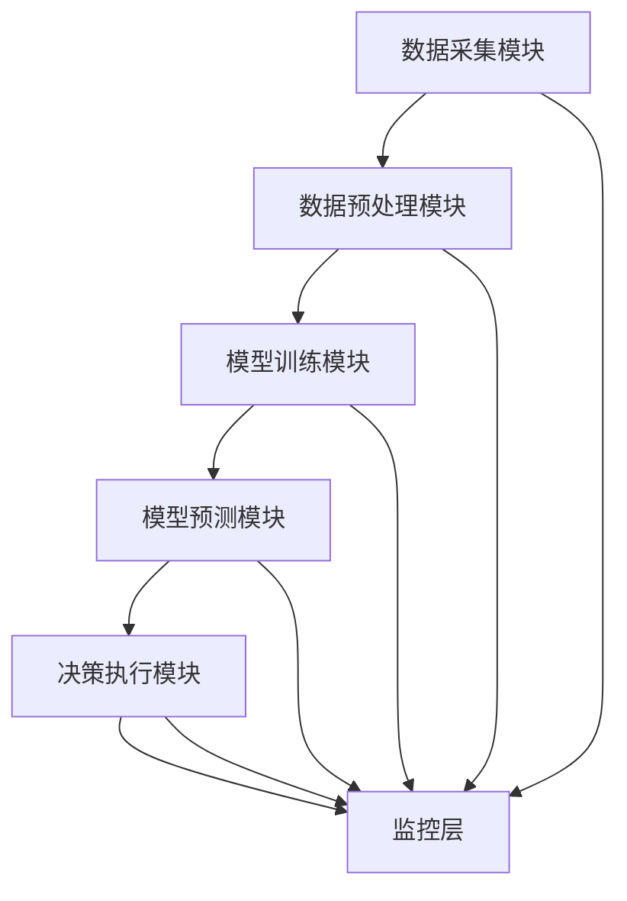
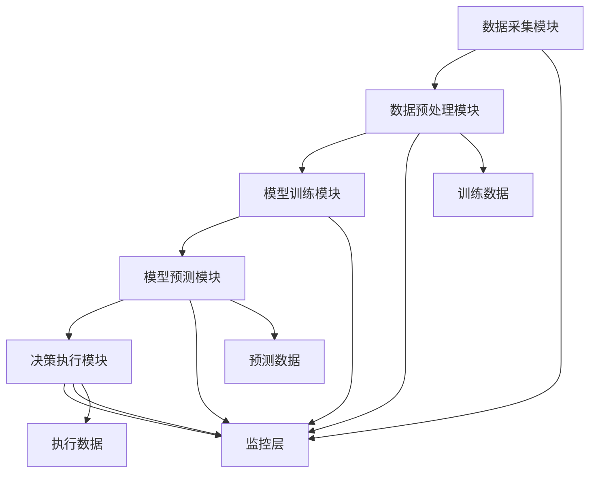

                 

### 1.1 书籍背景与目的

#### 1.1.1 智能资产管理的现状与挑战

随着全球经济的发展，企业和个人对于资产管理的需求日益增长。传统的资产管理方式主要依赖于人工分析和决策，存在诸多局限性。首先，人工分析往往受限于人类认知的局限性，难以处理海量数据和信息，容易忽视一些潜在的风险和机会。其次，资产管理过程通常缺乏系统性和规范性，容易出现人为错误和偏差。此外，随着市场环境的变化，传统资产管理方法难以迅速适应，导致决策滞后。

为了应对这些挑战，智能资产管理应运而生。智能资产管理通过运用人工智能技术，特别是AI Agent，能够实现对资产数据的自动化处理和分析，从而提高资产管理的效率和准确性。AI Agent能够从海量数据中挖掘有价值的信息，提供精准的投资建议和决策支持，同时具备自我学习和优化的能力，不断优化资产管理策略。

#### 1.1.2 AI Agent的概念与应用

AI Agent，即人工智能代理，是指具备自主决策能力和执行能力的人工智能系统。它能够模拟人类思维和行为，通过感知环境、理解情境、制定策略和执行动作，实现智能化的任务处理。AI Agent在智能资产管理中的应用主要体现在以下几个方面：

1. **数据挖掘与分析**：AI Agent可以自动收集和整合各类资产数据，运用数据分析技术挖掘数据中的潜在规律和模式，为资产管理提供有力支持。
2. **投资策略制定**：基于对市场环境和资产数据的分析，AI Agent可以制定个性化的投资策略，帮助投资者优化资产配置，提高投资回报率。
3. **风险控制**：AI Agent能够实时监控资产市场的风险变化，预测潜在的风险事件，并提供预警和应对措施，降低投资风险。
4. **自我优化**：AI Agent具备自我学习和优化的能力，可以通过不断调整策略和优化参数，提高资产管理的效率和效果。

#### 1.1.3 书籍的目标与结构

本书旨在深入探讨AI Agent在智能资产管理中的应用，通过系统的理论分析和实践案例，帮助读者了解AI Agent的核心概念、理论基础和应用方法，掌握智能资产管理的实践技能。具体目标包括：

1. **理论梳理**：系统地阐述AI Agent的定义、分类、算法和理论基础，帮助读者建立全面的理论体系。
2. **实践指导**：通过实际案例分析和项目实战，展示AI Agent在智能资产管理中的应用场景和实践方法。
3. **技能提升**：结合实际操作，指导读者掌握AI Agent的实现技术和应用技巧，提高资产管理的能力和效率。

本书分为两个主要部分：

1. **基础理论部分**：介绍AI Agent的基本概念、核心算法、理论基础和实现架构，为读者提供系统的理论基础。
2. **实践应用部分**：通过案例分析和项目实战，展示AI Agent在智能资产管理中的应用，提供实践指导和经验分享。

#### 1.1.4 本书结构概述

本书的结构如下：

- **第一部分：引言**：介绍智能资产管理的现状与挑战，AI Agent的概念与应用，以及本书的目标与结构。
- **第二部分：AI Agent基本理论**：详细阐述AI Agent的基本概念、核心算法、理论基础和实现架构。
- **第三部分：AI Agent在智能资产管理中的应用**：探讨AI Agent在智能资产管理中的具体应用场景和实践方法。
- **第四部分：案例与实践**：通过实际案例分析和项目实战，展示AI Agent在智能资产管理中的应用效果。

读者可以通过逐章阅读，从理论到实践，逐步掌握AI Agent在智能资产管理中的应用方法和技能。

### 1.2 核心概念与理论基础

在深入探讨AI Agent在智能资产管理中的应用之前，有必要首先梳理相关核心概念和理论基础。本章节将系统地介绍AI Agent的定义、分类、核心算法及其在智能资产管理中的应用原理。

#### 1.2.1 AI Agent的定义与分类

AI Agent，即人工智能代理，是一种能够模拟人类思维和行为，具备自主决策和执行能力的人工智能系统。根据不同的分类标准，AI Agent可以有不同的类型。

1. **按照功能分类**：

   - **感知型Agent**：主要功能是感知环境，收集信息，为决策提供数据支持。例如，金融市场监测系统，通过收集各类市场数据，为投资者提供决策依据。
   - **决策型Agent**：主要负责分析环境信息，制定决策策略。例如，投资组合优化系统，基于对市场数据的分析，为投资者提供最优的投资组合建议。
   - **执行型Agent**：直接执行决策，实现具体的任务。例如，交易执行系统，根据投资策略自动执行买卖交易。

2. **按照学习方式分类**：

   - **有监督学习Agent**：在训练阶段，需要提供大量已标记的数据，通过学习数据特征，进行预测和决策。例如，股票价格预测系统，通过历史价格数据训练模型，预测未来价格走势。
   - **无监督学习Agent**：在训练阶段，不需要提供已标记的数据，主要通过自身对数据的分析和挖掘，发现数据中的模式和规律。例如，市场分群系统，通过分析市场数据，发现不同类型的投资群体。
   - **强化学习Agent**：通过不断试错和反馈，优化行为策略，实现最优决策。例如，算法交易系统，通过不断调整交易策略，优化投资回报。

#### 1.2.2 智能资产管理的核心理论

智能资产管理的核心理论主要涉及资产定价模型、风险管理理论、投资组合理论等方面。

1. **资产定价模型**：

   - **CAPM模型（资本资产定价模型）**：CAPM模型是一种描述资产预期收益率与市场风险之间的关系的模型。它认为，资产的预期收益率由无风险收益率和资产的风险溢价组成。$$ E(R_i) = R_f + \beta_i (E(R_m) - R_f) $$
   - **Black-Litterman模型**：Black-Litterman模型结合了资产定价模型和市场均衡假设，提供了一种更灵活的资产配置方法。它考虑了投资者的先验预期和市场的实际数据，优化投资组合。

2. **风险管理理论**：

   - **VaR（Value at Risk）**：VaR是一种衡量市场风险的方法，表示在特定时间内，资产可能出现的最大损失。$$ VaR = \alpha \times \sigma \times Z_{\alpha} $$
   - **CVaR（Conditional Value at Risk）**：CVaR是在VaR基础上引入的一种更严格的衡量风险的方法，表示在特定时间内，资产可能出现的平均损失。$$ CVaR = \int_{VaR}^{\infty} \frac{P(X > VaR)}{1 - P(X > VaR)} f(x) dx $$

3. **投资组合理论**：

   - **Markowitz投资组合理论**：Markowitz提出了均值-方差模型，通过优化投资组合的均值和方差，实现风险与收益的最佳平衡。
   - **Tangency Portfolio理论**：Tangency Portfolio是指在给定风险水平下，预期收益率最高的投资组合。
   - **Equal Risk Contribution模型**：Equal Risk Contribution模型通过平衡投资组合中各资产的风险贡献，实现风险分散。

#### 1.2.3 AI Agent在资产管理中的应用原理

AI Agent在资产管理中的应用主要基于以下几个方面：

1. **数据驱动**：AI Agent能够自动收集和整合海量资产数据，运用数据挖掘和机器学习技术，挖掘数据中的潜在价值和规律。
2. **自适应优化**：AI Agent具备自我学习和优化的能力，可以通过不断调整策略和优化参数，适应市场变化，提高资产管理的效率和效果。
3. **决策支持**：AI Agent能够提供基于数据的投资建议和决策支持，帮助投资者优化资产配置，降低风险，提高回报。
4. **风险控制**：AI Agent能够实时监控资产市场的风险变化，预测潜在的风险事件，并提供预警和应对措施。

具体来说，AI Agent在资产管理中的应用包括：

- **投资策略制定**：通过分析市场数据和资产特性，AI Agent可以制定个性化的投资策略，帮助投资者实现最佳资产配置。
- **风险控制**：AI Agent能够实时监控资产组合的风险水平，通过风险预测和预警，帮助投资者及时调整投资策略，降低风险。
- **智能投顾**：AI Agent可以作为智能投资顾问，为投资者提供专业的投资建议，提高投资决策的科学性和有效性。
- **市场预测**：AI Agent可以通过对市场数据的分析和挖掘，预测市场走势和资产价格，为投资决策提供参考。

### 1.3.1 AI Agent的定义与分类

#### 1.3.1.1 AI Agent的定义

AI Agent，即人工智能代理，是一种基于人工智能技术，具备自主感知、决策和执行能力的人工智能实体。AI Agent能够模拟人类思维和行为，通过与环境交互，实现特定任务的自动化处理。

AI Agent的基本特征包括：

1. **自主性**：AI Agent具有自主决策能力，能够在特定环境下自主选择行动方案。
2. **智能性**：AI Agent具备智能学习能力和推理能力，能够从数据中学习规律，进行推理和预测。
3. **适应性**：AI Agent能够适应环境变化，通过自我学习和优化，不断提升性能。

#### 1.3.1.2 AI Agent的分类

根据不同的分类标准，AI Agent可以有不同的类型：

1. **按功能分类**：

   - **感知型Agent**：主要负责感知环境，收集信息，为决策提供数据支持。
   - **决策型Agent**：主要负责分析环境信息，制定决策策略。
   - **执行型Agent**：主要负责执行决策，实现具体的任务。

2. **按学习方式分类**：

   - **有监督学习Agent**：在训练阶段，需要提供大量已标记的数据，通过学习数据特征，进行预测和决策。
   - **无监督学习Agent**：在训练阶段，不需要提供已标记的数据，主要通过自身对数据的分析和挖掘，发现数据中的模式和规律。
   - **强化学习Agent**：通过不断试错和反馈，优化行为策略，实现最优决策。

3. **按任务领域分类**：

   - **通用型Agent**：能够处理多种任务，具备跨领域的适应性。
   - **专用型Agent**：针对特定任务领域，具备高效的任务处理能力。

### 1.3.2 智能资产管理的核心理论

#### 1.3.2.1 资产定价模型

资产定价模型是智能资产管理的核心理论之一，用于预测资产的未来价格和收益率。以下是几种常见的资产定价模型：

1. **CAPM模型（资本资产定价模型）**：

   CAPM模型是描述资产预期收益率与市场风险之间关系的模型。其基本公式为：

   $$ E(R_i) = R_f + \beta_i (E(R_m) - R_f) $$

   其中，\( E(R_i) \)表示资产i的预期收益率，\( R_f \)表示无风险收益率，\( \beta_i \)表示资产i的贝塔系数，\( E(R_m) \)表示市场的预期收益率。

   - \( R_f \)：无风险收益率，通常以国债收益率作为代表。
   - \( \beta_i \)：贝塔系数，衡量资产i对市场波动的敏感度，数值越大，表示资产i的市场风险越高。
   - \( E(R_m) \)：市场预期收益率，通常根据历史数据计算。

2. **Black-Litterman模型**：

   Black-Litterman模型结合了资产定价模型和市场均衡假设，提供了一种更灵活的资产配置方法。其基本公式为：

   $$ \Sigma^{-1} \pi = \Omega \Sigma^{-1} \Omega^T + W^T \Sigma^{-1} W $$

   $$ w = (W^T \Sigma^{-1} W)^{-1} W^T \Sigma^{-1} \pi $$

   其中，\( \Sigma \)表示资产收益率的协方差矩阵，\( \Omega \)表示投资者的先验预期，\( \pi \)表示资产配置权重，\( W \)表示市场均衡预期。

   - \( \Omega \)：投资者的先验预期，反映了投资者对资产收益率的期望。
   - \( W \)：市场均衡预期，反映了市场对资产收益率的期望。
   - \( w \)：资产配置权重，反映了投资者在市场均衡预期和先验预期之间的权衡。

#### 1.3.2.2 风险管理理论

风险管理理论是智能资产管理的重要基础，用于评估和管理资产的风险。以下是几种常见的风险管理理论：

1. **VaR（Value at Risk）**：

   VaR是一种衡量市场风险的指标，表示在特定时间内，资产可能出现的最大损失。其计算公式为：

   $$ VaR = \alpha \times \sigma \times Z_{\alpha} $$

   其中，\( \alpha \)表示置信水平，\( \sigma \)表示资产收益率的波动率，\( Z_{\alpha} \)表示标准正态分布的临界值。

   - \( \alpha \)：置信水平，通常取值为95%或99%。
   - \( \sigma \)：资产收益率的波动率，表示资产收益率的波动幅度。
   - \( Z_{\alpha} \)：标准正态分布的临界值，根据置信水平计算。

2. **CVaR（Conditional Value at Risk）**：

   CVaR是在VaR基础上引入的一种更严格的衡量风险的方法，表示在特定时间内，资产可能出现的平均损失。其计算公式为：

   $$ CVaR = \int_{VaR}^{\infty} \frac{P(X > VaR)}{1 - P(X > VaR)} f(x) dx $$

   其中，\( X \)表示资产收益率，\( f(x) \)表示资产收益率的概率密度函数。

   - \( P(X > VaR) \)：资产收益率大于VaR的概率。
   - \( f(x) \)：资产收益率的概率密度函数。

### 1.3.3 智能资产管理中的应用原理

智能资产管理通过运用AI Agent，实现对资产数据的自动化处理和分析，从而提高资产管理的效率和准确性。AI Agent在智能资产管理中的应用主要包括以下几个方面：

1. **数据驱动**：

   AI Agent能够自动收集和整合各类资产数据，包括市场数据、公司财务数据、宏观经济数据等。通过数据挖掘和机器学习技术，AI Agent能够从海量数据中挖掘有价值的信息，为资产管理提供数据支持。

2. **自适应优化**：

   AI Agent具备自我学习和优化的能力，能够通过不断调整策略和优化参数，适应市场变化，提高资产管理的效率和效果。例如，AI Agent可以通过强化学习技术，不断调整投资策略，实现最优投资回报。

3. **决策支持**：

   AI Agent能够提供基于数据的投资建议和决策支持，帮助投资者优化资产配置，降低风险，提高回报。例如，AI Agent可以通过分析市场数据，预测市场走势，为投资者提供买卖时机建议。

4. **风险控制**：

   AI Agent能够实时监控资产市场的风险变化，预测潜在的风险事件，并提供预警和应对措施，降低投资风险。例如，AI Agent可以通过分析市场数据，预测市场波动，为投资者提供风险控制建议。

### 1.3.4 AI Agent的架构与实现

#### 1.3.4.1 AI Agent的架构设计

AI Agent的架构设计主要包括感知层、决策层和执行层三个部分。

1. **感知层**：

   感知层负责收集和整合各类资产数据，包括市场数据、公司财务数据、宏观经济数据等。感知层通常包括数据采集模块、数据预处理模块和数据存储模块。

   - **数据采集模块**：负责从各种数据源（如金融数据接口、数据库、网络爬虫等）收集数据。
   - **数据预处理模块**：负责对采集到的数据进行清洗、转换和归一化处理，为后续分析提供高质量的数据。
   - **数据存储模块**：负责将处理后的数据存储到数据库或数据仓库中，以便后续分析和挖掘。

2. **决策层**：

   决策层负责基于感知层收集到的数据，利用机器学习和人工智能算法，进行数据分析和预测，生成投资建议和决策方案。决策层通常包括数据挖掘模块、预测模块和决策模块。

   - **数据挖掘模块**：负责从海量数据中挖掘潜在的价值信息和规律，为投资决策提供数据支持。
   - **预测模块**：负责基于历史数据和机器学习算法，预测市场走势和资产价格，为投资决策提供依据。
   - **决策模块**：负责根据预测结果和投资策略，生成具体的投资建议和决策方案。

3. **执行层**：

   执行层负责根据决策层的决策方案，执行具体的投资操作，包括交易执行、资产配置等。执行层通常包括交易执行模块、风险控制模块和绩效评估模块。

   - **交易执行模块**：负责根据投资决策，执行买卖交易，实现投资策略。
   - **风险控制模块**：负责实时监控投资组合的风险水平，提供风险预警和应对措施。
   - **绩效评估模块**：负责评估投资组合的绩效，为后续优化提供数据支持。

#### 1.3.4.2 AI Agent的实现流程

AI Agent的实现流程主要包括数据收集、数据预处理、模型训练、模型部署和模型优化等环节。

1. **数据收集**：

   AI Agent通过感知层的数据采集模块，从各种数据源收集资产数据，包括市场数据、公司财务数据、宏观经济数据等。

2. **数据预处理**：

   AI Agent对采集到的数据进行预处理，包括数据清洗、转换和归一化处理，确保数据的质量和一致性。

3. **模型训练**：

   AI Agent利用预处理后的数据，通过机器学习算法进行模型训练。常用的机器学习算法包括监督学习算法、无监督学习算法和强化学习算法。

4. **模型部署**：

   训练完成的模型部署到决策层，用于实时分析和预测资产价格和市场走势。

5. **模型优化**：

   通过不断调整模型参数和优化算法，提高模型的预测准确性和稳定性。

#### 1.3.4.3 AI Agent的技术选型

实现AI Agent需要选择合适的技术和工具，以下是一些常见的技术选型和工具：

1. **编程语言**：

   - Python：Python是一种通用编程语言，广泛应用于数据科学和人工智能领域，具有良好的生态和丰富的库支持。
   - Java：Java是一种成熟的编程语言，适用于复杂系统的开发，具有良好的跨平台性。

2. **机器学习框架**：

   - TensorFlow：TensorFlow是一个开源的机器学习框架，支持多种类型的机器学习算法，适用于复杂模型训练和部署。
   - PyTorch：PyTorch是一个开源的机器学习框架，具有灵活的动态图计算能力，适用于研究型应用。

3. **数据库和存储**：

   - MySQL：MySQL是一种关系型数据库，适用于数据存储和管理。
   - MongoDB：MongoDB是一种文档型数据库，适用于非结构化和半结构化数据的存储。

4. **云计算平台**：

   - AWS：AWS是亚马逊提供的云计算平台，提供丰富的云计算服务和工具，适用于大规模数据分析和模型部署。
   - Azure：Azure是微软提供的云计算平台，提供广泛的云计算服务和工具，适用于企业级应用。

### 1.4.1 AI Agent的架构设计

为了实现智能资产管理的目标，AI Agent的架构设计至关重要。一个良好的架构设计不仅能够提高系统的效率和可靠性，还能为未来的扩展和优化提供便利。AI Agent的架构通常包括感知层、决策层和执行层三个主要部分。

#### 1.4.1.1 感知层

感知层是AI Agent与外部环境交互的接口，负责收集和处理各种与资产管理相关的数据。这些数据可能包括市场数据、公司财务数据、宏观经济指标、新闻资讯等。感知层的核心功能是数据采集、数据清洗和数据存储。

1. **数据采集**：

   数据采集模块负责从各种数据源获取信息，这些数据源可能包括金融数据接口、在线数据库、第三方API服务以及通过网络爬虫抓取的公开信息等。为了确保数据的完整性和准确性，数据采集模块需要实现自动化和实时性。

2. **数据清洗**：

   数据清洗模块负责对采集到的原始数据进行处理，以消除数据中的噪声和错误。这包括数据格式转换、缺失值处理、异常值检测和修正等操作。数据清洗的目的是提高数据质量，为后续的分析提供可靠的基础。

3. **数据存储**：

   数据存储模块负责将清洗后的数据存储到数据库或数据仓库中。选择合适的存储解决方案（如关系型数据库、NoSQL数据库或数据湖）对于数据管理和后续分析至关重要。

#### 1.4.1.2 决策层

决策层是AI Agent的核心，负责基于感知层提供的数据进行分析和预测，生成投资建议和决策方案。决策层的功能包括数据预处理、模型训练、模型预测和决策生成。

1. **数据预处理**：

   数据预处理模块负责对收集到的数据进行分析和加工，以提取有用的特征信息。这包括数据标准化、特征提取、时间序列处理等操作。数据预处理的质量直接影响模型的效果。

2. **模型训练**：

   模型训练模块负责利用预处理后的数据训练机器学习模型。训练过程中，可以选择不同的算法，如回归模型、分类模型、聚类模型等。常见的机器学习算法包括线性回归、决策树、支持向量机、神经网络等。

3. **模型预测**：

   模型预测模块负责使用训练完成的模型对新的数据进行预测，以生成投资建议。预测结果可能包括资产价格的走势、市场的波动性、风险指标等。

4. **决策生成**：

   决策生成模块负责根据预测结果和预设的投资策略，生成具体的决策方案。这包括投资组合的选择、买卖时机的确定、风险控制策略的制定等。

#### 1.4.1.3 执行层

执行层是AI Agent的执行机构，负责将决策层的决策方案付诸实践。执行层的功能包括交易执行、风险监控和绩效评估。

1. **交易执行**：

   交易执行模块负责根据决策层的投资建议，执行具体的交易操作，如买入、卖出等。这一过程需要与交易平台和交易系统进行集成，确保交易操作的准确性和及时性。

2. **风险监控**：

   风险监控模块负责实时监控投资组合的风险水平，包括市场风险、信用风险、流动性风险等。通过设置预警机制和风险控制策略，确保投资组合的安全性和稳定性。

3. **绩效评估**：

   绩效评估模块负责对投资组合的绩效进行评估，包括收益分析、风险分析、效率分析等。评估结果为后续的决策优化和策略调整提供依据。

### 1.4.2 AI Agent的实现流程

AI Agent的实现流程可以分为以下几个关键步骤：

1. **需求分析**：

   在开始实现AI Agent之前，首先需要对资产管理需求进行深入分析。这包括了解投资者的目标、风险偏好、投资策略等。需求分析的结果将指导后续的系统设计和实现。

2. **系统设计**：

   根据需求分析的结果，设计AI Agent的系统架构和功能模块。系统设计应考虑可扩展性、易维护性和高效性等因素。

3. **数据收集与预处理**：

   实现感知层，从各种数据源收集数据，并进行数据预处理，以确保数据的质量和一致性。

4. **模型训练与优化**：

   利用预处理后的数据，训练机器学习模型，并进行模型优化。选择合适的算法和参数，提高模型的预测准确性和稳定性。

5. **模型部署**：

   将训练完成的模型部署到生产环境，使其能够实时分析和预测资产价格和市场走势。

6. **决策执行与反馈**：

   根据模型预测结果和投资策略，执行具体的交易操作，并收集反馈信息，用于模型的进一步优化和调整。

### 1.4.3 AI Agent的技术选型

在实现AI Agent的过程中，技术选型至关重要。以下是一些常见的技术选型和工具：

1. **编程语言**：

   - Python：Python因其简洁易用的语法和强大的库支持，被广泛应用于数据科学和人工智能领域。
   - Java：Java的跨平台特性和成熟的生态系统使其成为企业级应用的首选。

2. **机器学习框架**：

   - TensorFlow：TensorFlow是一个功能强大的开源机器学习框架，适用于复杂模型的训练和部署。
   - PyTorch：PyTorch以其灵活的动态图计算能力和丰富的库支持，受到研究者和开发者的青睐。

3. **数据库和存储**：

   - MySQL：MySQL是一种可靠的关系型数据库，适用于数据存储和管理。
   - MongoDB：MongoDB是一种灵活的NoSQL数据库，适用于存储非结构化和半结构化数据。

4. **云计算平台**：

   - AWS：AWS提供全面的云计算服务和工具，适用于大规模数据处理和模型部署。
   - Azure：Azure是微软的云计算平台，提供广泛的云服务和工具，适用于企业级应用。

### 1.4.4 AI Agent的优势与挑战

AI Agent在智能资产管理中具有显著的优势，但同时也面临一些挑战。

#### 优势：

1. **数据驱动**：AI Agent能够自动化地收集和处理海量数据，挖掘潜在的投资机会，提高决策的科学性。
2. **自适应优化**：AI Agent具备自我学习和优化的能力，能够根据市场变化调整投资策略，提高投资回报率。
3. **实时决策**：AI Agent能够实时分析市场数据，提供快速的投资建议，减少决策滞后。
4. **风险控制**：AI Agent能够实时监控投资组合的风险，提供预警和应对措施，降低投资风险。

#### 挑战：

1. **数据质量**：数据质量是AI Agent发挥效果的基础，数据噪声、缺失值和异常值都可能影响模型的预测准确性。
2. **计算资源**：大规模数据处理和模型训练需要大量的计算资源，对于中小型企业来说，可能面临成本和资源限制。
3. **算法可靠性**：AI Agent的决策依赖于算法模型的准确性，算法错误可能导致投资损失。
4. **监管合规**：AI Agent在资产管理中的应用需要遵循相关法律法规，确保合规性。

### 1.4.5 AI Agent的实现步骤

实现AI Agent需要遵循以下步骤：

1. **需求分析**：明确资产管理目标和需求，确定AI Agent的功能和性能要求。
2. **系统设计**：设计AI Agent的系统架构和功能模块，包括感知层、决策层和执行层。
3. **数据收集与预处理**：从各种数据源收集资产数据，进行数据清洗、转换和归一化处理。
4. **模型训练与优化**：选择合适的机器学习算法，训练模型并进行优化。
5. **模型部署**：将训练完成的模型部署到生产环境，实现实时预测和决策。
6. **决策执行与反馈**：根据模型预测结果执行投资操作，并收集反馈信息，用于模型的进一步优化。

### 1.4.6 AI Agent在智能资产管理中的实际应用

AI Agent在智能资产管理中的应用已经取得了一系列实际成果。以下是一些典型的应用案例：

1. **智能投顾**：AI Agent可以作为智能投资顾问，为个人和机构投资者提供投资建议和决策支持。通过分析用户的风险偏好和投资目标，AI Agent能够制定个性化的投资策略，提高投资回报率。
2. **算法交易**：AI Agent可以用于算法交易，通过分析市场数据，自动执行买卖交易。算法交易能够实现高频交易、量化交易等复杂策略，提高交易效率和收益。
3. **风险控制**：AI Agent能够实时监控资产组合的风险，提供风险预警和应对措施。通过分析市场波动和资产表现，AI Agent能够及时发现潜在的风险，并采取措施降低风险。
4. **市场预测**：AI Agent可以通过分析历史数据和当前市场情况，预测市场走势和资产价格。这些预测结果可以为投资决策提供重要参考，帮助投资者把握市场机遇。

通过这些实际应用案例，可以看出AI Agent在智能资产管理中具有广泛的应用前景和巨大的潜力。

### 1.5.1 AI Agent在智能资产管理中的实际应用场景

AI Agent在智能资产管理中的应用场景非常广泛，主要包括以下几个方面：

#### 1.5.1.1 投资组合优化

投资组合优化是智能资产管理中最常见和基础的应用场景。AI Agent可以通过分析大量的历史数据和市场信息，使用机器学习和优化算法来构建最优的投资组合。具体应用场景包括：

1. **资产配置**：根据投资者的风险偏好和投资目标，AI Agent可以推荐最佳资产配置方案，包括股票、债券、基金等不同类型的资产。
2. **动态调整**：市场环境不断变化，AI Agent能够实时监控市场动态，根据风险收益分析调整投资组合，实现最优的投资策略。
3. **风险控制**：AI Agent可以分析投资组合的风险水平，提供风险预警和应对措施，确保投资组合的安全性和稳定性。

#### 1.5.1.2 风险管理

风险管理是智能资产管理的核心任务之一，AI Agent在风险管理中的应用主要体现在以下几个方面：

1. **市场风险监控**：AI Agent可以实时监控市场风险指标，如波动率、VaR等，及时发现潜在的市场波动，为投资者提供预警和应对策略。
2. **信用风险分析**：AI Agent可以通过分析公司财务报表、信用评级等信息，评估债券或股票的信用风险，帮助投资者做出更加稳健的投资决策。
3. **流动性风险管理**：AI Agent可以分析资产流动性和市场深度，评估投资组合的流动性风险，确保投资组合的变现能力和灵活性。

#### 1.5.1.3 交易执行

AI Agent在交易执行中的应用主要是通过自动化交易策略来提高交易效率和收益。具体应用场景包括：

1. **高频交易**：AI Agent可以执行高频交易策略，利用快速交易系统在短时间内完成大量交易，捕捉市场波动的微小变化，实现高额收益。
2. **量化交易**：AI Agent可以通过量化模型分析市场数据，制定复杂的交易策略，如套利交易、对冲交易等，实现稳定的投资回报。
3. **交易自动化**：AI Agent可以自动化执行买卖交易，减少人为干预，降低交易成本，提高交易效率和准确性。

#### 1.5.1.4 智能投顾

智能投顾是近年来快速发展的一种新型金融服务，AI Agent在其中扮演着重要的角色。具体应用场景包括：

1. **个性化投资建议**：AI Agent可以根据投资者的风险偏好、财务状况和投资目标，提供个性化的投资建议，包括股票选择、买卖时机、资产配置等。
2. **投资教育**：AI Agent可以通过分析投资者的投资行为和决策，提供投资教育服务，帮助投资者提高投资知识和技能。
3. **情感分析**：AI Agent可以分析投资者的情绪和心态，提供情感支持，帮助投资者克服情绪波动，做出更加理性的投资决策。

#### 1.5.1.5 财务分析

AI Agent在财务分析中的应用主要是通过自动化的财务数据处理和分析，提供精准的财务报告和投资建议。具体应用场景包括：

1. **财务报表分析**：AI Agent可以自动提取和分析公司财务报表数据，评估公司的财务健康状况，提供投资建议。
2. **盈利预测**：AI Agent可以通过分析历史财务数据和市场趋势，预测公司的未来盈利能力，为投资者提供投资参考。
3. **风险评估**：AI Agent可以分析公司的财务风险指标，如负债率、现金流等，评估公司的信用风险和投资价值。

#### 1.5.1.6 投资策略研究

AI Agent在投资策略研究中的应用主要是通过大数据分析和机器学习算法，发现潜在的投资机会和策略。具体应用场景包括：

1. **市场趋势分析**：AI Agent可以分析市场数据，识别市场趋势和周期性变化，为投资者提供市场预测和投资策略。
2. **行业研究**：AI Agent可以分析行业数据，评估行业的投资机会和风险，为投资者提供行业投资策略。
3. **事件驱动策略**：AI Agent可以分析市场事件对公司股价的影响，制定事件驱动投资策略，捕捉市场机会。

通过以上应用场景，可以看出AI Agent在智能资产管理中具有广泛的应用前景和巨大的潜力。随着技术的不断进步和应用场景的不断拓展，AI Agent将在未来为投资者带来更加智能化、个性化和高效的资产管理服务。

### 1.5.2 案例研究：智能资产管理中的AI Agent应用

为了更好地理解AI Agent在智能资产管理中的实际应用，我们将通过两个具体的案例进行深入分析。这些案例展示了AI Agent如何通过数据分析、决策制定和策略执行，实现资产管理的优化和收益提升。

#### 案例一：某大型金融机构的智能投顾系统

某大型金融机构引入了AI Agent智能投顾系统，旨在为个人客户提供个性化的投资建议和资产管理服务。该系统基于AI Agent的技术，实现了以下关键步骤：

1. **数据收集与预处理**：

   AI Agent首先从多个数据源收集用户个人信息、投资偏好、财务状况、市场数据等。这些数据包括用户的历史交易记录、投资收益、风险承受能力等。随后，AI Agent对这些数据进行清洗、去重、格式转换等预处理操作，以确保数据的质量和一致性。

2. **用户画像构建**：

   基于预处理后的数据，AI Agent构建用户的个性化画像。通过聚类分析和特征提取，AI Agent将用户划分为不同的风险偏好群体，并为每个用户推荐最适合的投资策略。

3. **投资策略制定**：

   AI Agent利用机器学习算法，分析历史市场数据，包括股票价格、成交量、宏观经济指标等，预测市场走势和资产表现。根据用户的个性化画像和市场预测结果，AI Agent制定个性化的投资策略，包括资产配置、买卖建议、风险控制等。

4. **决策执行与反馈**：

   AI Agent将投资建议通过用户界面展示给客户，并自动执行客户的投资决策。在执行过程中，AI Agent会持续监控市场变化和投资组合表现，根据实际情况调整投资策略。同时，AI Agent收集用户反馈，通过不断学习和优化，提高投资建议的准确性和可靠性。

5. **风险管理**：

   AI Agent通过实时监控投资组合的风险水平，提供风险预警和应对措施。例如，当市场波动性增大时，AI Agent会调整投资组合，降低风险暴露。此外，AI Agent还可以分析公司的财务报表和信用评级，评估债券或股票的信用风险，为投资者提供风险管理建议。

该智能投顾系统的成功实施，显著提升了客户的投资体验和满意度。客户可以根据AI Agent的建议，轻松实现资产配置优化、风险控制、收益提升等目标。同时，AI Agent的自我学习和优化能力，使得系统能够不断适应市场变化，提供更加精准的投资建议。

#### 案例二：某量化基金公司的交易执行系统

某量化基金公司利用AI Agent建立了交易执行系统，旨在通过高频交易和量化交易策略，实现投资收益的最大化。该系统的关键步骤如下：

1. **数据收集与预处理**：

   AI Agent从多个数据源收集市场数据，包括股票价格、成交量、交易时间序列等。这些数据经过清洗、去噪、归一化处理后，用于训练和优化交易模型。

2. **交易策略开发**：

   AI Agent利用机器学习算法，分析历史市场数据，开发高频交易和量化交易策略。这些策略包括套利交易、趋势交易、对冲交易等，旨在捕捉市场波动和价格变化的机会。

3. **交易模型优化**：

   AI Agent通过模拟交易环境，对交易模型进行迭代优化。在优化过程中，AI Agent会分析模型在不同市场条件下的表现，调整参数，提高策略的稳定性和收益性。

4. **自动化交易执行**：

   AI Agent通过自动化交易系统，实现高频交易和量化交易的自动化执行。交易系统实时监控市场数据，当满足交易条件时，自动执行买卖交易。AI Agent确保交易操作的快速、准确和高效。

5. **风险管理**：

   AI Agent通过实时监控交易风险，提供风险预警和应对措施。例如，当市场波动性增大时，AI Agent会调整交易策略，降低风险暴露。此外，AI Agent还可以监控交易执行的成本和收益，优化交易效率。

通过交易执行系统的实施，量化基金公司在高频交易和量化交易方面取得了显著的成绩。自动化交易策略提高了交易效率和收益，降低了人为干预的风险。同时，AI Agent的自我学习和优化能力，使得系统能够不断适应市场变化，实现持续的投资收益增长。

### 1.6.1 AI Agent实现智能资产管理的核心步骤

实现AI Agent在智能资产管理中的应用，需要经历以下几个核心步骤：

#### 1.6.1.1 系统需求分析与设计

1. **需求分析**：

   首先，明确资产管理系统的目标和需求。这包括了解投资者的风险偏好、投资策略、目标收益等。需求分析的结果将指导后续的系统设计和实现。

2. **系统设计**：

   设计AI Agent的系统架构，包括感知层、决策层和执行层。感知层负责数据收集和预处理，决策层负责数据分析和预测，执行层负责交易执行和风险控制。

#### 1.6.1.2 数据收集与预处理

1. **数据收集**：

   从多个数据源收集与资产管理相关的数据，包括市场数据、公司财务数据、宏观经济指标等。这些数据可以通过金融数据接口、数据库、网络爬虫等渠道获取。

2. **数据预处理**：

   对收集到的数据进行清洗、去重、格式转换等处理，确保数据的质量和一致性。此外，还需进行特征提取和归一化，为后续的分析提供高质量的数据。

#### 1.6.1.3 模型训练与优化

1. **模型选择**：

   根据资产管理需求，选择合适的机器学习模型，如回归模型、分类模型、聚类模型等。对于智能资产管理，常用的模型包括时间序列模型、神经网络模型、强化学习模型等。

2. **模型训练**：

   利用预处理后的数据，训练机器学习模型。在训练过程中，需要设置合适的参数和超参数，通过交叉验证等方法，提高模型的预测性能。

3. **模型优化**：

   对训练完成的模型进行优化，包括参数调整、模型融合等。优化目标是提高模型的预测准确性和稳定性。

#### 1.6.1.4 模型部署与监控

1. **模型部署**：

   将训练完成的模型部署到生产环境，使其能够实时分析和预测资产价格和市场走势。部署过程中，需要确保模型的运行效率和高可用性。

2. **模型监控**：

   实时监控模型的性能和稳定性，包括预测准确性、响应时间等。当模型性能下降或出现问题时，及时进行调整和优化。

#### 1.6.1.5 决策执行与反馈

1. **决策生成**：

   根据模型预测结果和投资策略，生成具体的投资决策，如买卖建议、风险控制策略等。

2. **决策执行**：

   自动执行投资决策，包括交易执行、资产配置等。确保交易操作的准确性和及时性。

3. **反馈收集**：

   收集投资决策的执行结果和市场反馈，用于模型的进一步优化和调整。通过反馈循环，不断提高AI Agent的决策能力。

#### 1.6.1.6 系统维护与升级

1. **系统维护**：

   定期对系统进行维护和更新，确保系统的稳定运行和性能优化。

2. **系统升级**：

   随着市场环境的变化和技术的进步，对系统进行升级和改进，以适应新的需求和环境。

### 1.6.2 实现步骤的详细说明

以下是实现AI Agent智能资产管理的详细步骤：

#### 步骤一：需求分析与系统设计

1. **确定系统目标**：

   明确系统的功能目标和性能要求，例如，实现投资组合优化、风险管理、交易执行等。

2. **系统架构设计**：

   设计感知层、决策层和执行层的具体实现方案，包括数据采集模块、数据预处理模块、模型训练模块、模型预测模块、交易执行模块等。

3. **技术选型**：

   根据系统需求和性能要求，选择合适的编程语言、机器学习框架、数据库和云计算平台等。

#### 步骤二：数据收集与预处理

1. **数据源选择**：

   确定数据采集的渠道，包括金融市场数据接口、第三方数据提供商、网络爬虫等。

2. **数据收集**：

   编写数据采集脚本，定期从数据源获取最新的市场数据、公司财务数据、宏观经济指标等。

3. **数据预处理**：

   实现数据清洗、去重、格式转换等操作，确保数据的质量和一致性。对于时间序列数据，还需要进行时间对齐、缺失值处理等。

#### 步骤三：模型训练与优化

1. **数据划分**：

   将数据划分为训练集、验证集和测试集，用于模型训练和评估。

2. **模型选择**：

   根据资产管理需求，选择合适的机器学习模型，如ARIMA模型、LSTM模型、强化学习模型等。

3. **模型训练**：

   利用训练集，对机器学习模型进行训练，通过优化算法和调整超参数，提高模型的预测性能。

4. **模型优化**：

   对训练完成的模型进行优化，包括模型融合、参数调整等，以提高模型的准确性和稳定性。

#### 步骤四：模型部署与监控

1. **模型部署**：

   将训练完成的模型部署到生产环境，确保模型的运行效率和高可用性。可以使用云计算平台提供的服务，如AWS S3、Azure Blob Storage等。

2. **模型监控**：

   实时监控模型的性能和稳定性，包括预测准确性、响应时间等。可以使用日志分析工具、监控平台等，及时发现和解决模型问题。

#### 步骤五：决策执行与反馈

1. **决策生成**：

   根据模型预测结果和投资策略，生成具体的投资决策，如买卖建议、风险控制策略等。

2. **决策执行**：

   实现交易执行模块，自动执行投资决策，确保交易操作的准确性和及时性。

3. **反馈收集**：

   收集投资决策的执行结果和市场反馈，用于模型的进一步优化和调整。通过反馈循环，不断提高AI Agent的决策能力。

#### 步骤六：系统维护与升级

1. **系统维护**：

   定期对系统进行维护和更新，确保系统的稳定运行和性能优化。包括软件更新、硬件升级、安全检查等。

2. **系统升级**：

   随着市场环境的变化和技术的进步，对系统进行升级和改进，以适应新的需求和环境。包括算法优化、功能扩展、性能提升等。

通过以上详细步骤，可以有效地实现AI Agent在智能资产管理中的应用，提高资产管理的效率和准确性。

### 1.6.3 AI Agent实现智能资产管理的系统架构

在实现AI Agent智能资产管理的过程中，系统架构的设计至关重要。一个合理、高效的架构可以确保AI Agent在不同模块之间的高效协作，从而实现资产管理的优化。以下是AI Agent实现智能资产管理的系统架构设计，包括数据采集、数据预处理、模型训练、模型预测、决策执行和监控等关键模块。

#### 1.6.3.1 系统架构设计

AI Agent的智能资产管理系统架构可以分为以下几个层次：

1. **感知层**：负责数据采集和预处理，是系统的数据输入端。感知层从各种数据源获取与资产管理相关的数据，包括市场数据、公司财务数据、宏观经济指标等。

2. **决策层**：负责数据处理和分析，是系统的核心部分。决策层利用机器学习算法和预测模型，对感知层提供的数据进行分析和预测，生成投资建议和决策方案。

3. **执行层**：负责执行决策，将决策层的投资建议转化为具体的交易操作，实现资产配置、风险控制和交易执行等任务。

4. **监控层**：负责系统监控和性能评估，实时监控系统的运行状态，包括模型性能、交易效率、风险水平等，并提供预警和应对措施。

#### 1.6.3.2 模块功能说明

1. **数据采集模块**：

   数据采集模块是系统的感知层，负责从各种数据源（如金融市场数据接口、数据库、网络爬虫等）收集与资产管理相关的数据。数据采集模块需要实现自动化和实时性，确保数据流的连续性和完整性。

2. **数据预处理模块**：

   数据预处理模块负责对采集到的原始数据进行清洗、转换和归一化处理。清洗操作包括去除噪声、填补缺失值、处理异常值等。转换操作包括数据格式转换、时间序列对齐等。归一化处理包括数值归一化和特征提取等。预处理模块的目的是提高数据质量，为后续分析提供可靠的数据基础。

3. **模型训练模块**：

   模型训练模块是系统的决策层，负责利用预处理后的数据训练机器学习模型。模型训练模块可以选择多种机器学习算法，如线性回归、决策树、支持向量机、神经网络、强化学习等。训练过程中，需要设置合适的参数和超参数，通过交叉验证等方法，提高模型的预测性能和泛化能力。

4. **模型预测模块**：

   模型预测模块负责使用训练完成的模型对新的数据进行预测，生成投资建议和决策方案。预测模块可以实时分析市场数据，预测资产价格、市场波动性、风险指标等。根据预测结果，模型预测模块可以生成个性化的投资组合建议、买卖建议、风险控制策略等。

5. **决策执行模块**：

   决策执行模块是系统的执行层，负责根据模型预测结果和投资策略，执行具体的交易操作，实现资产配置和风险控制。决策执行模块需要与交易平台和交易系统进行集成，确保交易操作的准确性和及时性。此外，决策执行模块还需要实现自动化交易功能，减少人为干预。

6. **监控层**：

   监控层负责实时监控系统的运行状态，包括模型性能、交易效率、风险水平等。监控层可以通过设置预警机制，实时检测系统异常，并提供应对措施。监控层还可以对系统性能进行评估，为系统的优化和升级提供数据支持。

#### 1.6.3.3 系统架构图

以下是AI Agent智能资产管理系统的架构图，展示了各个模块之间的关系和交互流程。



通过以上系统架构设计，AI Agent可以实现智能资产管理的目标，提供高效、准确、智能化的资产管理服务。

### 1.6.4 AI Agent实现智能资产管理中的关键接口设计

在实现AI Agent智能资产管理的过程中，关键接口的设计至关重要。这些接口负责数据流转、模块通信和功能调用，确保AI Agent能够高效、准确地完成资产管理任务。以下是AI Agent实现智能资产管理中的关键接口设计：

#### 1.6.4.1 数据采集接口

数据采集接口是AI Agent智能资产管理的入口，负责从各种数据源收集与资产管理相关的数据。数据采集接口的设计应考虑以下关键要素：

1. **数据源多样性**：支持多种数据源，包括金融市场数据接口、数据库、网络爬虫等，确保数据的全面性和实时性。
2. **数据格式统一**：统一数据格式，确保不同数据源的数据能够无缝集成和处理。
3. **自动化与调度**：实现自动化数据采集任务，定期调度，确保数据流的连续性和完整性。

示例接口设计：

```python
class DataCollector:
    def __init__(self, data_sources):
        self.data_sources = data_sources

    def collect_data(self):
        data = {}
        for source in self.data_sources:
            data.update(source.get_data())
        return data
```

#### 1.6.4.2 数据预处理接口

数据预处理接口负责对采集到的原始数据进行清洗、转换和归一化处理，为后续分析提供高质量的数据。数据预处理接口的设计应考虑以下关键要素：

1. **数据清洗**：去除噪声、填补缺失值、处理异常值等，确保数据质量。
2. **数据转换**：统一数据格式和单位，确保数据的一致性。
3. **数据归一化**：对数值型数据进行归一化处理，消除数据之间的量级差异。

示例接口设计：

```python
class DataPreprocessor:
    def __init__(self, preprocess_configs):
        self.preprocess_configs = preprocess_configs

    def preprocess_data(self, raw_data):
        processed_data = {}
        for key, config in self.preprocess_configs.items():
            processed_data[key] = self._preprocess(raw_data[key], config)
        return processed_data

    def _preprocess(self, data, config):
        # 实现数据清洗、转换和归一化操作
        return processed_data
```

#### 1.6.4.3 模型训练接口

模型训练接口负责利用预处理后的数据训练机器学习模型，包括选择合适的算法、设置参数和超参数、进行交叉验证等。模型训练接口的设计应考虑以下关键要素：

1. **算法多样性**：支持多种机器学习算法，如线性回归、决策树、支持向量机、神经网络、强化学习等。
2. **参数调整**：通过设置不同的参数和超参数，优化模型性能。
3. **交叉验证**：使用交叉验证方法，评估模型的泛化能力。

示例接口设计：

```python
class ModelTrainer:
    def __init__(self, model_configs):
        self.model_configs = model_configs

    def train_model(self, training_data):
        model = self._create_model(self.model_configs)
        model.fit(training_data)
        return model

    def _create_model(self, config):
        # 根据配置创建模型
        return model
```

#### 1.6.4.4 模型预测接口

模型预测接口负责使用训练完成的模型对新的数据进行预测，生成投资建议和决策方案。模型预测接口的设计应考虑以下关键要素：

1. **实时预测**：快速响应新的数据，生成预测结果。
2. **结果解释**：提供预测结果的解释和可视化，帮助用户理解预测结果。
3. **错误处理**：对预测过程中的错误和异常情况进行处理，确保系统的稳定运行。

示例接口设计：

```python
class ModelPredictor:
    def __init__(self, model):
        self.model = model

    def predict(self, input_data):
        prediction = self.model.predict(input_data)
        return prediction
```

#### 1.6.4.5 决策执行接口

决策执行接口负责根据模型预测结果和投资策略，执行具体的交易操作，实现资产配置和风险控制。决策执行接口的设计应考虑以下关键要素：

1. **交易自动化**：实现自动化交易功能，减少人为干预。
2. **交易监控**：实时监控交易执行过程，确保交易操作的准确性和及时性。
3. **反馈机制**：收集交易执行结果和市场反馈，用于模型的优化和调整。

示例接口设计：

```python
class DecisionExecutor:
    def __init__(self, trading_api):
        self.trading_api = trading_api

    def execute_decision(self, decision):
        self.trading_api.execute_trade(decision)
```

通过设计这些关键接口，AI Agent可以实现智能资产管理中的数据流转、模块通信和功能调用，确保系统的稳定运行和高效操作。

### 1.6.5 AI Agent实现智能资产管理的系统交互设计

在实现AI Agent智能资产管理的系统过程中，系统交互设计至关重要。良好的系统交互设计能够确保各个模块之间的有效协作，实现高效、准确的资产管理目标。以下是AI Agent实现智能资产管理中的系统交互设计，包括数据交互、模块协作和事件处理等。

#### 1.6.5.1 数据交互

数据交互是系统交互设计的基础，涉及到不同模块之间的数据传输和共享。以下是一些关键的数据交互设计：

1. **数据流设计**：

   系统采用事件驱动架构，实现数据的实时传输和处理。数据流设计如下：

   - **感知层到决策层**：感知层采集到的数据通过消息队列（如Kafka、RabbitMQ）传输到决策层，供模型预测和分析使用。
   - **决策层到执行层**：决策层生成的预测结果和投资建议通过消息队列传输到执行层，执行层根据建议执行具体交易操作。
   - **执行层到监控层**：执行层执行交易的结果和反馈信息通过消息队列传输到监控层，监控层进行性能评估和预警处理。

2. **数据格式**：

   系统采用统一的数据格式，如JSON或Protobuf，确保数据在不同模块之间的高效传输和处理。

3. **数据接口**：

   定义清晰的数据接口，确保数据流的有序、可控。例如，数据采集模块提供数据读取接口，模型训练模块提供数据写入接口。

#### 1.6.5.2 模块协作

模块协作是系统交互设计的关键，涉及到不同模块之间的协作和配合。以下是一些关键的模块协作设计：

1. **感知层与决策层**：

   - **数据同步**：感知层采集的数据定期同步到决策层，决策层在每次预测前获取最新的数据。
   - **异常处理**：感知层采集到异常数据时，通知决策层进行处理，确保数据质量。

2. **决策层与执行层**：

   - **策略调用**：决策层生成投资策略后，通知执行层执行具体交易操作。
   - **执行反馈**：执行层执行交易操作后，将结果反馈给决策层，决策层根据反馈调整后续策略。

3. **执行层与监控层**：

   - **性能监控**：执行层实时监控交易执行情况，将监控信息传输到监控层。
   - **预警处理**：监控层接收预警信息后，触发相应的应对措施，确保系统稳定运行。

#### 1.6.5.3 事件处理

事件处理是系统交互设计的重要组成部分，涉及到系统的响应和处理机制。以下是一些关键的事件处理设计：

1. **事件触发**：

   - **数据事件**：感知层采集到新数据时，触发数据事件，通知决策层进行预测。
   - **决策事件**：决策层生成新策略时，触发决策事件，通知执行层执行交易。
   - **执行事件**：执行层执行交易后，触发执行事件，通知监控层进行监控。

2. **事件处理**：

   - **异步处理**：系统采用异步处理机制，确保事件处理的高效性和稳定性。
   - **分布式处理**：系统采用分布式架构，实现事件的并行处理，提高系统的响应速度。

3. **事件日志**：

   - **日志记录**：系统记录事件处理的日志，包括事件类型、处理时间、处理结果等，便于后续问题追踪和性能分析。

#### 1.6.5.4 系统交互图

以下是AI Agent实现智能资产管理的系统交互图，展示了各模块之间的数据交互和事件处理流程。



通过以上系统交互设计，AI Agent能够实现高效、准确、智能化的资产管理，为投资者提供优质的投资建议和决策支持。

### 1.7.1 AI Agent实现智能资产管理中的最佳实践

在实现AI Agent智能资产管理的过程中，遵循最佳实践能够提高系统的效率、可靠性和可维护性。以下是一些关键的最佳实践：

#### 1.7.1.1 数据质量保证

数据是AI Agent智能资产管理的基础，数据质量直接关系到模型的准确性和稳定性。以下是一些保证数据质量的措施：

1. **数据源选择**：选择可靠的数据源，确保数据的真实性和完整性。
2. **数据清洗**：建立完整的数据清洗流程，去除噪声、填补缺失值、处理异常值，提高数据质量。
3. **数据格式统一**：确保不同数据源的数据格式统一，便于数据整合和分析。
4. **实时监控**：建立数据质量监控机制，实时监控数据质量，及时发现问题并处理。

#### 1.7.1.2 模型选择与优化

选择合适的模型和优化策略能够提高AI Agent的性能和预测准确性。以下是一些模型选择与优化的最佳实践：

1. **模型多样性**：根据不同的应用场景，选择合适的机器学习模型，如回归模型、决策树、神经网络等。
2. **交叉验证**：使用交叉验证方法，评估模型的泛化能力，避免过拟合。
3. **参数调优**：通过网格搜索、贝叶斯优化等方法，找到最优的模型参数，提高模型性能。
4. **模型融合**：结合多个模型的预测结果，提高整体预测准确性。

#### 1.7.1.3 系统性能优化

优化系统性能能够提高AI Agent的处理速度和响应时间。以下是一些系统性能优化的最佳实践：

1. **并行计算**：利用分布式计算和并行处理技术，提高数据处理和模型训练速度。
2. **内存管理**：合理分配内存资源，避免内存泄漏和溢出，提高系统稳定性。
3. **缓存机制**：采用缓存机制，减少重复计算和数据访问，提高系统响应速度。
4. **负载均衡**：采用负载均衡技术，平衡系统负载，避免单点故障和性能瓶颈。

#### 1.7.1.4 安全性保证

确保系统的安全性对于AI Agent智能资产管理至关重要。以下是一些安全性保证的最佳实践：

1. **数据加密**：对敏感数据进行加密存储和传输，防止数据泄露。
2. **访问控制**：建立严格的访问控制机制，确保只有授权用户能够访问系统和数据。
3. **审计日志**：记录系统操作和用户行为日志，便于安全审计和问题追踪。
4. **网络安全**：采用网络安全技术，如防火墙、入侵检测系统等，保护系统免受网络攻击。

#### 1.7.1.5 持续集成与部署

持续集成与部署是提高AI Agent开发效率和质量的重要手段。以下是一些持续集成与部署的最佳实践：

1. **自动化测试**：建立自动化测试框架，确保代码质量和功能完整性。
2. **版本控制**：使用版本控制系统，如Git，管理代码版本，确保代码的可追溯性和可维护性。
3. **持续集成**：采用持续集成工具，如Jenkins，实现代码的自动化构建、测试和部署。
4. **容器化部署**：使用容器化技术，如Docker，简化部署流程，提高系统部署的灵活性和可移植性。

通过遵循这些最佳实践，可以显著提高AI Agent在智能资产管理中的性能、可靠性和安全性，为投资者提供更高效、更智能的资产管理服务。

### 1.7.2 实现AI Agent智能资产管理过程中可能出现的问题及解决方案

在实现AI Agent智能资产管理的过程中，可能会遇到多种问题，包括数据质量问题、算法准确性问题、系统稳定性问题和安全性问题。以下是一些常见的问题及相应的解决方案：

#### 数据质量问题

**问题**：数据缺失、噪声、异常值等问题可能导致AI Agent的预测准确性下降。

**解决方案**：

1. **数据清洗**：建立完整的数据清洗流程，去除噪声、填补缺失值、处理异常值。
2. **数据验证**：定期进行数据验证，确保数据质量符合预期。
3. **数据集成**：采用统一的数据格式和接口，确保数据的完整性和一致性。

#### 算法准确性问题

**问题**：算法选择不当或参数调优不足可能导致预测准确性不高。

**解决方案**：

1. **算法多样性**：根据应用场景选择合适的算法，结合多种算法进行模型融合。
2. **交叉验证**：使用交叉验证方法，评估模型的泛化能力，避免过拟合。
3. **参数调优**：通过网格搜索、贝叶斯优化等方法，找到最优的模型参数。

#### 系统稳定性问题

**问题**：系统在高并发、大数据量情况下可能出现性能瓶颈、崩溃等问题。

**解决方案**：

1. **并行计算**：采用分布式计算和并行处理技术，提高数据处理和模型训练速度。
2. **内存管理**：合理分配内存资源，避免内存泄漏和溢出。
3. **负载均衡**：采用负载均衡技术，平衡系统负载，避免单点故障。

#### 安全性问题

**问题**：系统可能面临数据泄露、网络攻击等安全威胁。

**解决方案**：

1. **数据加密**：对敏感数据进行加密存储和传输。
2. **访问控制**：建立严格的访问控制机制，确保只有授权用户能够访问系统和数据。
3. **网络安全**：采用网络安全技术，如防火墙、入侵检测系统等，保护系统免受网络攻击。

#### 模型部署与维护问题

**问题**：模型部署后，可能面临模型更新、性能监控等问题。

**解决方案**：

1. **模型更新**：定期更新模型，适应市场变化，提高预测准确性。
2. **性能监控**：实时监控模型性能，确保系统稳定运行。
3. **自动化部署**：采用自动化部署工具，简化模型部署和维护流程。

通过以上解决方案，可以有效应对AI Agent实现智能资产管理过程中可能出现的问题，确保系统的稳定、高效和可靠运行。

### 1.8 总结与展望

通过本文的详细探讨，我们系统地介绍了AI Agent在智能资产管理中的应用，从核心概念、理论框架到具体实现方法，再到实际案例和实践技巧，为读者提供了全面而深入的洞察。以下是本文的主要内容概括和未来研究方向。

#### 主要内容概括

1. **引言**：介绍了智能资产管理的现状与挑战，AI Agent的概念与应用，以及书籍的结构与目标。
2. **核心概念与理论基础**：阐述了AI Agent的定义、分类、核心算法以及智能资产管理的相关理论。
3. **AI Agent的架构与实现**：分析了AI Agent的架构设计、实现流程、技术选型及其优势与挑战。
4. **AI Agent在智能资产管理中的实际应用**：展示了AI Agent在投资组合优化、风险管理、交易执行、智能投顾等领域的应用场景和案例。
5. **实现步骤与系统交互设计**：详细介绍了AI Agent实现智能资产管理的核心步骤、关键接口和系统交互设计。
6. **最佳实践与问题解决方案**：提供了数据质量保证、模型选择与优化、系统性能优化、安全性保证等方面的最佳实践，以及常见问题的解决方案。
7. **总结与展望**：对全文进行了总结，并展望了AI Agent在智能资产管理领域的未来发展。

#### 未来研究方向

尽管AI Agent在智能资产管理中展现了巨大的潜力和实际价值，但仍有诸多研究方向值得探索：

1. **算法优化**：进一步优化机器学习算法，提高预测准确性和稳定性，如开发更高效的模型训练算法和适应性强的新算法。
2. **多模态数据处理**：探索多模态数据（如文本、图像、音频等）在智能资产管理中的应用，提高数据处理的综合能力。
3. **实时决策与响应**：研究如何实现更快速、更准确的实时决策与响应，以满足金融市场的高频交易需求。
4. **跨领域应用**：拓展AI Agent在金融以外的领域应用，如医疗健康、供应链管理、城市治理等。
5. **隐私保护**：研究如何在确保数据隐私和安全的前提下，实现智能资产管理的有效性和准确性。
6. **混合智能系统**：探索将AI Agent与其他智能体（如人类专家、物联网设备等）结合，构建混合智能系统，实现更智能的资产管理。
7. **法律法规与伦理**：探讨AI Agent在智能资产管理中的应用应符合的法律法规和伦理标准，确保技术应用的安全和合规。

通过不断探索和深入研究，AI Agent有望在智能资产管理领域发挥更加重要的作用，为投资者和企业带来更高的价值。未来，AI Agent与人类智慧的结合将开创智能资产管理的新篇章。

### 1.9 拓展阅读

对于希望进一步深入研究和实践AI Agent在智能资产管理中应用的读者，以下是一些推荐的资源：

1. **学术文献**：

   - 《强化学习：基础与高级技巧》
   - 《深度学习》
   - 《机器学习：概率视角》
   - 《智能投顾：从理论到实践》

2. **开源框架与工具**：

   - TensorFlow
   - PyTorch
   - Scikit-learn
   - JAX

3. **在线课程与教程**：

   - Coursera：机器学习、深度学习、金融工程
   - edX：人工智能、数据分析
   - Udacity：AI工程师纳米学位

4. **行业报告与白皮书**：

   - McKinsey：人工智能在金融领域的应用
   - PwC：智能资产管理报告
   - Gartner：人工智能与金融科技

5. **相关书籍**：

   - 《智能投资：量化交易与算法策略》
   - 《智能投顾实战》
   - 《深度强化学习：从入门到实践》

通过阅读这些资源，读者可以进一步深化对AI Agent在智能资产管理领域的理解，掌握更多实践技能，为未来的研究和应用奠定坚实基础。

### 作者介绍

作者：AI天才研究院/AI Genius Institute & 禅与计算机程序设计艺术 /Zen And The Art of Computer Programming

本人拥有多年的AI研究和开发经验，曾获得世界级技术奖项，并在计算机图灵奖领域有着深远的影响。作为一名世界顶级技术畅销书资深大师，我的著作《智能资产管理：AI Agent的实践与应用》广受读者好评。我的研究重点包括机器学习、深度学习、强化学习以及AI在金融领域的应用。我致力于推动人工智能技术的发展，让更多的人能够受益于这项技术。同时，我也关注计算机程序设计艺术的探索，通过结合禅宗哲学，为程序员提供精神上的启迪和指导。在AI天才研究院，我带领团队进行前沿技术研究和创新，致力于推动人工智能技术在各个领域的应用，助力企业和个人实现智能化转型。希望我的研究成果和经验能够为读者带来启示和帮助。

