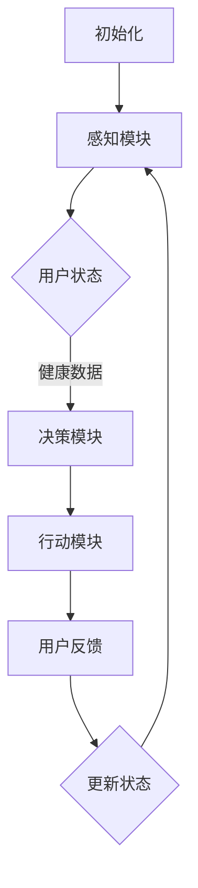
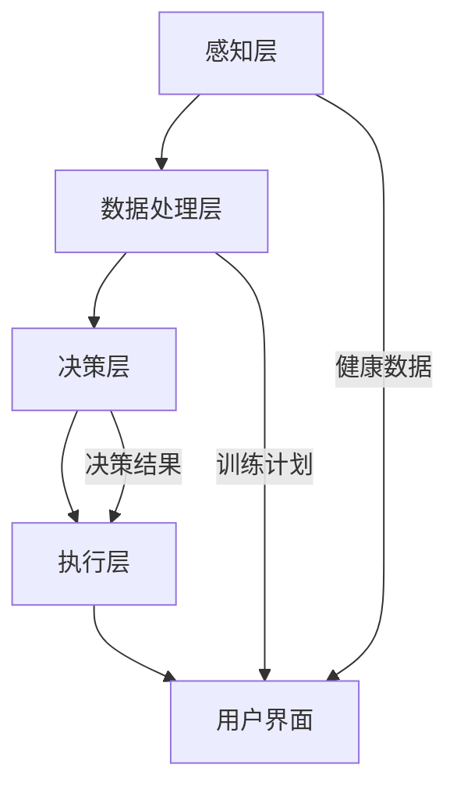
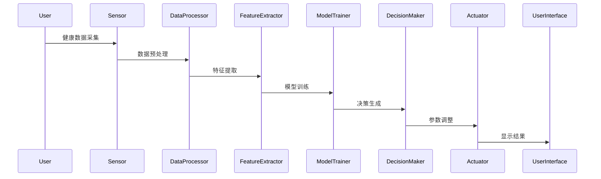

                 

### 文章标题
《AI Agent在智能跑步机中的训练计划》

### 关键词
AI Agent、智能跑步机、训练计划、个性化训练、机器学习

### 摘要
本文深入探讨了AI Agent在智能跑步机中的应用，通过一步步的逻辑分析，详细阐述了AI Agent的基本原理、算法流程、系统架构设计，以及在实际项目中的实现和应用。文章旨在为读者提供一份全面的智能跑步机训练计划指南，帮助读者理解并掌握如何利用AI Agent提升智能跑步机的训练效果和用户体验。

## 目录

1. **问题背景与核心概念**
   1.1 **智能跑步机的现状与需求**
   1.2 **AI Agent的基本原理**
   1.3 **智能跑步机与AI Agent的关联**

2. **AI Agent算法原理**
   2.1 **算法概述**
   2.2 **算法流程与Mermaid图**
   2.3 **数学模型与公式**

3. **系统架构设计**
   3.1 **系统功能设计与Mermaid图**
   3.2 **系统架构设计与Mermaid图**
   3.3 **系统接口设计与Mermaid序列图**

4. **项目实战**
   4.1 **环境安装与配置**
   4.2 **系统核心实现与代码解析**
   4.3 **实际案例分析与讲解**
   4.4 **项目小结**

5. **最佳实践与注意事项**
   5.1 **常见问题与解决方案**
   5.2 **性能优化技巧**
   5.3 **系统维护与更新**

6. **拓展阅读与资源推荐**
   6.1 **进一步学习资源**
   6.2 **相关书籍推荐**
   6.3 **学术论文与报告**

7. **总结与展望**
   7.1 **本书总结**
   7.2 **未来发展方向**

### 第1章 问题背景与核心概念

#### 1.1 智能跑步机的现状与需求

随着科技的发展，智能跑步机作为健身器材的代表，已经成为家庭健身爱好者的首选。智能跑步机不仅具有传统的跑步功能，还能通过连接互联网、使用应用程序等手段，提供个性化训练计划和健康数据追踪。

**市场趋势：**  
智能跑步机市场正在快速增长，主要驱动力包括健康意识的提高、城市生活的紧凑导致户外运动时间的减少，以及远程工作的普及，使得家庭健身需求增加。根据市场研究机构的报告，全球智能跑步机市场预计将在未来几年内保持两位数的增长率。

**用户需求分析：**  
用户对智能跑步机的需求主要集中在以下几个方面：

1. **个性化训练计划：** 用户希望根据自己的健康状况、健身目标和偏好，获得定制化的训练计划。
2. **健康数据追踪：** 用户希望实时了解自己的运动状态，如心率、步频、消耗的卡路里等。
3. **娱乐互动功能：** 为了提高用户的运动体验，智能跑步机需要提供丰富的娱乐互动功能，如在线课程、音乐播放、社交媒体连接等。
4. **易用性和便捷性：** 用户希望设备易于操作，无需复杂设置，能够在任何时间、任何地点轻松使用。

#### 1.2 AI Agent的基本原理

AI Agent，即人工智能代理，是一种能够自主执行任务、与环境交互并做出决策的智能体。AI Agent的基本原理包括以下几个关键组成部分：

1. **感知模块：** 负责接收和处理来自环境的数据，如摄像头、传感器等。
2. **决策模块：** 根据感知模块收集的信息，通过算法进行决策。
3. **行动模块：** 执行决策模块做出的决策，如控制跑步机的速度、坡度等。

**分类：** AI Agent可以根据学习方式分为以下几类：

1. **监督学习：** 在有明确标签的数据集上进行训练，然后通过这些数据来预测新的数据。
2. **无监督学习：** 不依赖于标签数据，通过发现数据中的模式来学习。
3. **强化学习：** 通过试错和奖励机制来学习，其目标是最大化长期奖励。

#### 1.3 智能跑步机与AI Agent的关联

智能跑步机与AI Agent的结合，不仅能够提升用户的训练效果，还能极大地改善用户体验。

**优势：**

1. **个性化训练计划：** AI Agent可以根据用户的健康状况和健身目标，生成个性化的训练计划，提高训练效果。
2. **实时反馈与调整：** AI Agent能够实时监测用户的运动状态，并根据数据反馈进行训练计划的调整，确保用户始终处于最佳训练状态。
3. **自动故障检测与维护：** AI Agent可以监测智能跑步机的运行状态，及时发现并解决潜在的问题，延长设备寿命。

**潜力：**

1. **智能互动：** AI Agent可以与用户进行智能互动，提供个性化的指导和建议，增强用户的运动乐趣。
2. **数据分析与预测：** AI Agent可以分析用户的训练数据，预测未来的运动趋势，提供针对性的建议。
3. **扩展功能：** AI Agent可以不断学习和进化，通过不断更新算法和功能，为用户提供更加丰富的体验。

### 总结

本章介绍了智能跑步机的现状与需求，AI Agent的基本原理及其在智能跑步机中的应用。接下来，我们将进一步探讨AI Agent的算法原理、系统架构设计，以及如何在实际项目中实现和应用AI Agent，为智能跑步机提供更高效、更个性化的训练计划。

----------------------------------------------------------------

**第1章：问题背景与核心概念**

**1.1 智能跑步机的现状与需求**

**1.1.1 智能跑步机的发展历程**  
智能跑步机是现代健身设备的代表，其发展历程可以追溯到20世纪末。最早的跑步机主要功能是提供基本的跑步训练，用户需要手动调节速度和坡度。随着电子技术和传感器技术的进步，跑步机逐渐加入了电子显示屏，能够实时显示用户的心率、步频、消耗的卡路里等数据。进入21世纪，智能跑步机开始集成更多的智能化功能，如连接互联网、支持应用程序、提供个性化训练计划等。

**1.1.2 用户需求分析**  
用户对智能跑步机的需求不断变化，主要表现在以下几个方面：

1. **个性化训练计划**：用户希望根据自己的健康状况、健身目标和偏好，获得定制化的训练计划。
2. **健康数据追踪**：用户希望实时了解自己的运动状态，如心率、步频、消耗的卡路里等。
3. **娱乐互动功能**：为了提高用户的运动体验，智能跑步机需要提供丰富的娱乐互动功能，如在线课程、音乐播放、社交媒体连接等。
4. **易用性和便捷性**：用户希望设备易于操作，无需复杂设置，能够在任何时间、任何地点轻松使用。

**1.1.3 智能跑步机面临的挑战**  
智能跑步机在提供丰富功能的同时，也面临一些挑战：

1. **系统稳定性**：智能跑步机的软件和硬件需要高度集成，以确保系统的稳定运行。
2. **数据安全性**：用户健康数据的安全保护是一个重要的挑战，需要采取有效的数据加密和安全传输措施。
3. **用户体验**：如何通过设计优化和功能增强，提高用户的运动体验，是智能跑步机需要持续关注的问题。

**1.2 AI Agent的基本原理**

**1.2.1 AI Agent的定义与分类**  
AI Agent，即人工智能代理，是一种能够自主执行任务、与环境交互并做出决策的智能体。根据学习方式，AI Agent可以分为以下几类：

1. **监督学习（Supervised Learning）**：在有明确标签的数据集上进行训练，然后通过这些数据来预测新的数据。
2. **无监督学习（Unsupervised Learning）**：不依赖于标签数据，通过发现数据中的模式来学习。
3. **强化学习（Reinforcement Learning）**：通过试错和奖励机制来学习，其目标是最大化长期奖励。

**1.2.2 AI Agent在智能跑步机中的应用**  
AI Agent在智能跑步机中的应用主要体现在以下几个方面：

1. **个性化训练计划**：AI Agent可以根据用户的健康状况和健身目标，生成个性化的训练计划，提高训练效果。
2. **实时反馈与调整**：AI Agent能够实时监测用户的运动状态，并根据数据反馈进行训练计划的调整，确保用户始终处于最佳训练状态。
3. **自动故障检测与维护**：AI Agent可以监测智能跑步机的运行状态，及时发现并解决潜在的问题，延长设备寿命。

**1.2.3 AI Agent的优势与潜力**  
AI Agent的优势主要体现在以下几个方面：

1. **个性化训练**：通过个性化训练计划，AI Agent能够提升用户的训练效果，满足不同用户的需求。
2. **实时反馈**：AI Agent能够实时监测用户的运动状态，提供即时的反馈，帮助用户更好地调整训练计划。
3. **智能互动**：AI Agent可以与用户进行智能互动，提供个性化的指导和建议，增强用户的运动乐趣。

AI Agent的潜力主要体现在以下几个方面：

1. **智能互动**：AI Agent可以不断学习和进化，通过不断更新算法和功能，为用户提供更加丰富的体验。
2. **数据分析**：AI Agent可以分析用户的训练数据，预测未来的运动趋势，提供针对性的建议。
3. **扩展功能**：AI Agent可以不断扩展功能，如集成健康监测、健身课程推荐等，提升用户的整体健身体验。

**1.3 智能跑步机与AI Agent的关联**

**1.3.1 技术融合的可能性**  
智能跑步机与AI Agent的结合，使得跑步机的功能得到了极大的扩展。技术融合的可能性主要体现在以下几个方面：

1. **个性化训练**：AI Agent可以根据用户的健康状况和健身目标，生成个性化的训练计划，提高训练效果。
2. **实时反馈**：AI Agent能够实时监测用户的运动状态，提供即时的反馈，帮助用户更好地调整训练计划。
3. **健康监测**：AI Agent可以监测用户的健康数据，如心率、血压等，提供健康监测和预警服务。

**1.3.2 优势与潜力**  
智能跑步机与AI Agent的结合，具有以下优势与潜力：

1. **提升用户体验**：通过个性化训练计划和实时反馈，AI Agent能够提升用户的训练体验。
2. **提高训练效果**：AI Agent能够根据用户的运动数据，调整训练计划，提高训练效果。
3. **数据安全与隐私保护**：智能跑步机和AI Agent的结合，需要确保用户数据的隐私和安全。
4. **扩展功能**：AI Agent可以不断扩展功能，如集成健康监测、健身课程推荐等，为用户提供更全面的健身服务。

**1.3.3 应用场景**  
智能跑步机与AI Agent的结合，可以应用于以下场景：

1. **家庭健身**：家庭用户可以通过智能跑步机进行个性化训练，提高健身效果。
2. **健身房**：健身房可以采用智能跑步机，为用户提供更丰富的训练选择和更好的训练体验。
3. **健康监测**：智能跑步机和AI Agent的结合，可以用于健康监测和预警，帮助用户更好地管理健康状况。

### 第2章：AI Agent算法原理

#### 2.1 算法概述

AI Agent在智能跑步机中的应用，依赖于一系列先进的算法，这些算法的核心目标是提高训练效果和用户体验。本节将介绍几种常见的AI Agent算法，包括监督学习、无监督学习和强化学习。

**监督学习（Supervised Learning）：**  
监督学习是AI Agent中最常用的算法之一，其基本思想是使用带有标签的数据进行训练，从而学习到输入和输出之间的映射关系。在智能跑步机中，监督学习算法可以用来生成个性化的训练计划，根据用户的历史训练数据和健身目标，预测用户的最佳训练参数。

**无监督学习（Unsupervised Learning）：**  
无监督学习算法不需要标签数据，其目标是发现数据中的隐藏结构和模式。在智能跑步机中，无监督学习可以用于用户行为分析，识别用户的运动习惯和偏好，从而提供更加个性化的服务。

**强化学习（Reinforcement Learning）：**  
强化学习通过试错和奖励机制来学习，其目标是最大化长期奖励。在智能跑步机中，强化学习算法可以用于训练计划的动态调整，根据用户的实时反馈和运动状态，自动调整训练参数，以提升用户的训练效果。

#### 2.2 算法流程与Mermaid图

为了更好地理解AI Agent的算法流程，我们可以使用Mermaid图来描述其基本结构。以下是一个简单的Mermaid流程图示例，展示了AI Agent在智能跑步机中的基本工作流程：



**详细解释：**

1. **初始化**：AI Agent启动时进行初始化，加载必要的参数和模型。
2. **感知模块**：AI Agent通过传感器收集用户的运动数据，如心率、步频、消耗的卡路里等。
3. **用户状态**：感知模块收集的数据经过处理，用于评估用户的当前状态。
4. **决策模块**：根据用户的当前状态和训练目标，决策模块选择最佳的训练参数。
5. **行动模块**：决策模块生成的训练参数被发送到智能跑步机，调整跑步机的速度、坡度等。
6. **用户反馈**：用户在训练过程中，可以通过反馈机制（如手势、声音等）与AI Agent交互。
7. **更新状态**：根据用户的反馈，AI Agent更新用户状态，为下一次决策提供参考。

#### 2.3 数学模型与公式

为了更好地理解AI Agent的算法原理，我们需要介绍一些基本的数学模型和公式。以下是一些常用的数学模型和公式，用于描述AI Agent在智能跑步机中的应用。

**线性回归模型（Linear Regression）：**  
线性回归模型是一种简单的监督学习算法，用于预测连续值。其基本公式为：

$$
y = \beta_0 + \beta_1 \cdot x
$$

其中，$y$ 是输出值，$x$ 是输入值，$\beta_0$ 和 $\beta_1$ 是模型参数。

**决策树（Decision Tree）：**  
决策树是一种常用的分类算法，用于根据特征值对数据进行分类。其基本结构如下：

```
           |
   ---------------------
  /          |            \
A1          A2            A3
   |          |            |
   ...       ...           ...
```

每个节点代表一个特征，每个分支代表该特征的不同取值，叶节点代表最终的分类结果。

**神经网络（Neural Network）：**  
神经网络是一种模拟人脑神经元连接的算法，用于解决复杂的非线性问题。其基本结构如下：

```
           |
   ---------------------
  /          |            \
A1          A2            A3
   |          |            |
   ...       ...           ...
```

每个节点代表一个神经元，神经元之间通过权重连接，通过反向传播算法更新权重，以最小化预测误差。

### 实例说明

假设我们有一个简单的线性回归模型，用于预测用户在跑步机上的消耗卡路里。输入值包括用户的心率和跑步机的速度，输出值是预测的卡路里消耗。我们可以使用以下公式来描述这个模型：

$$
\text{卡路里消耗} = \beta_0 + \beta_1 \cdot (\text{心率} + \beta_2 \cdot \text{速度})
$$

其中，$\beta_0$、$\beta_1$ 和 $\beta_2$ 是模型参数，需要通过训练数据来学习。

**训练数据示例：**
- 用户心率：150
- 跑步机速度：6
- 实际卡路里消耗：300

**模型训练过程：**
- 使用历史数据集，通过最小二乘法（Least Squares）来学习模型参数。
- 训练完成后，使用学习到的模型参数来预测新的数据。

**预测过程：**
- 输入值：心率 = 150，速度 = 6
- 预测卡路里消耗：$\text{卡路里消耗} = \beta_0 + \beta_1 \cdot (\text{心率} + \beta_2 \cdot \text{速度})$

通过这种方式，AI Agent可以根据用户的实时数据和模型参数，预测其在跑步机上的卡路里消耗，并提供个性化的训练建议。

### 小结

本章介绍了AI Agent在智能跑步机中的应用，包括算法概述、算法流程和数学模型。通过这些算法和模型，AI Agent能够为用户提供个性化的训练计划和实时反馈，提升用户的训练效果和体验。下一章，我们将进一步探讨智能跑步机的系统架构设计，包括系统功能设计、系统架构设计和系统接口设计。

----------------------------------------------------------------

**第3章：系统架构设计**

智能跑步机的系统架构设计是确保其稳定运行、提供个性化服务的关键。本章将详细介绍智能跑步机的系统架构设计，包括系统功能设计、系统架构设计和系统接口设计。

#### 3.1 系统功能设计

**3.1.1 系统功能概述**

智能跑步机需要实现一系列功能，以满足用户的需求。以下是智能跑步机的主要功能：

1. **基本运动功能**：包括跑步、慢跑、快走等运动模式。
2. **健康数据追踪**：实时监测用户的心率、步频、消耗的卡路里等健康数据。
3. **个性化训练计划**：根据用户的历史数据和个人信息，生成个性化的训练计划。
4. **实时反馈与调整**：根据用户的实时运动数据，调整跑步机的速度、坡度等参数。
5. **娱乐互动功能**：提供在线课程、音乐播放、社交媒体连接等娱乐互动功能。
6. **设备管理**：监测设备的运行状态，进行故障检测和维护。

**3.1.2 领域模型设计**

领域模型是系统功能设计的基础，它描述了系统的核心概念和关系。以下是智能跑步机的领域模型：

```mermaid
classDiagram
    User <|-- TrainingPlan
    User <|-- HealthData
    User <|-- Device
    TrainingPlan <|-- Workout
    Workout <|-- Exercise
    Exercise <|-- Parameter
    Device <|-- Sensor
    Device <|-- Actuator
    Sensor <|-- HeartRateSensor
    Sensor <|-- SpeedSensor
    Actuator <|-- Motor
    Actuator <|-- Display
    HealthData <..-> Sensor
    HealthData <..-> Actuator
    TrainingPlan <..-> User
    TrainingPlan <..-> Workout
    Workout <..-> Exercise
    Device <..-> Sensor
    Device <..-> Actuator
```

**详细解释：**

- **User（用户）**：代表智能跑步机的用户，包括个人信息和训练历史。
- **TrainingPlan（训练计划）**：根据用户的需求和健康数据，生成个性化的训练计划。
- **HealthData（健康数据）**：包括心率、步频、消耗的卡路里等。
- **Device（设备）**：代表智能跑步机，包括传感器和执行器。
- **Workout（训练课程）**：包括一系列的练习，每个练习都有相应的参数。
- **Exercise（练习）**：代表训练课程中的单个练习。
- **Parameter（参数）**：包括速度、坡度、时间等。
- **Sensor（传感器）**：包括心率传感器、速度传感器等，用于收集健康数据。
- **Actuator（执行器）**：包括电机、显示器等，用于调整训练参数和显示信息。

#### 3.2 系统架构设计

**3.2.1 系统架构概述**

智能跑步机的系统架构需要确保功能的稳定实现和数据的安全传输。以下是智能跑步机的基本系统架构：

1. **感知层**：包括传感器，用于收集用户的健康数据。
2. **数据处理层**：包括数据预处理、特征提取和模型训练，用于生成个性化的训练计划。
3. **决策层**：包括决策算法，用于根据用户的健康数据和训练计划，调整跑步机的参数。
4. **执行层**：包括执行器，用于调整跑步机的速度、坡度等。
5. **用户界面**：包括显示器、触摸屏等，用于显示用户的健康数据和训练计划。

**3.2.2 Mermaid图表示**

以下是智能跑步机的系统架构设计：



**详细解释：**

- **感知层**：收集用户的健康数据，如心率、步频等。
- **数据处理层**：对健康数据进行预处理、特征提取，并使用机器学习算法生成个性化的训练计划。
- **决策层**：根据用户的健康数据和训练计划，使用决策算法（如监督学习、强化学习等）生成决策结果。
- **执行层**：根据决策结果，调整跑步机的速度、坡度等参数。
- **用户界面**：显示用户的健康数据、训练计划和决策结果。

#### 3.3 系统接口设计

**3.3.1 接口概述**

智能跑步机的系统接口设计是确保不同模块之间数据传输和功能调用的关键。以下是智能跑步机的主要接口：

1. **健康数据接口**：用于收集和传输用户的健康数据。
2. **训练计划接口**：用于生成和传输个性化的训练计划。
3. **决策结果接口**：用于传输决策结果，调整跑步机的参数。
4. **用户界面接口**：用于显示用户的健康数据、训练计划和决策结果。

**3.3.2 Mermaid序列图**

以下是智能跑步机的系统接口设计：



**详细解释：**

- **用户**：发起健康数据采集请求。
- **传感器**：收集健康数据，并传输给数据处理层。
- **数据处理层**：对健康数据进行预处理，提取特征，并使用机器学习模型进行训练。
- **决策层**：根据训练好的模型，生成决策结果。
- **执行层**：根据决策结果，调整跑步机的参数。
- **用户界面**：显示用户的健康数据、训练计划和决策结果。

### 小结

本章详细介绍了智能跑步机的系统架构设计，包括系统功能设计、系统架构设计和系统接口设计。通过这些设计，智能跑步机能够实现个性化的训练计划和实时反馈，提升用户的训练效果和体验。下一章，我们将通过项目实战，展示如何在实际中实现这些设计。

----------------------------------------------------------------

**第4章：项目实战**

在了解了AI Agent在智能跑步机中的算法原理和系统架构设计之后，本章将通过一个实际项目，展示如何实现这些设计，包括环境安装与配置、系统核心实现与代码解析、实际案例分析与讲解以及项目小结。

#### 4.1 环境安装与配置

要实现AI Agent在智能跑步机中的应用，首先需要安装和配置相应的开发环境。以下是一个基本的步骤：

**1. 安装Python**  
Python是AI Agent开发的主要编程语言。确保您的计算机上已经安装了Python 3.x版本。如果没有，可以从[Python官网](https://www.python.org/)下载并安装。

**2. 安装必要的库和工具**  
智能跑步机的开发涉及多个库和工具，包括TensorFlow、Keras、NumPy、Pandas等。可以使用pip工具来安装这些库：

```bash
pip install tensorflow keras numpy pandas
```

**3. 安装传感器驱动程序**  
智能跑步机通常配备有多种传感器，如心率传感器、速度传感器等。需要安装相应的驱动程序，以便Python程序能够读取传感器数据。

**4. 安装跑步机控制模块**  
智能跑步机需要安装一个控制模块，如Raspberry Pi或Arduino，用于接收AI Agent的决策结果并调整跑步机的参数。

#### 4.2 系统核心实现与代码解析

**4.2.1 数据收集与处理**

以下是一个简单的Python程序，用于收集和处理智能跑步机的健康数据：

```python
import pandas as pd
import numpy as np
from sensor_driver import read_sensor_data

def collect_health_data(sensor_type, duration):
    data = pd.DataFrame(columns=['timestamp', 'value'])
    start_time = pd.Timestamp.now()
    
    while (pd.Timestamp.now() - start_time).total_seconds() < duration:
        sensor_data = read_sensor_data(sensor_type)
        timestamp = pd.Timestamp.now()
        data = data.append({'timestamp': timestamp, 'value': sensor_data}, ignore_index=True)
    
    return data

# 收集心率数据10秒
heart_rate_data = collect_health_data('heart_rate', 10)

# 收集速度数据10秒
speed_data = collect_health_data('speed', 10)
```

**4.2.2 机器学习模型训练**

以下是一个简单的机器学习模型，用于预测用户的卡路里消耗。这里使用TensorFlow和Keras框架：

```python
import tensorflow as tf
from tensorflow.keras.models import Sequential
from tensorflow.keras.layers import Dense
from tensorflow.keras.optimizers import Adam

def build_model(input_shape):
    model = Sequential()
    model.add(Dense(64, input_shape=input_shape, activation='relu'))
    model.add(Dense(64, activation='relu'))
    model.add(Dense(1, activation='linear'))

    model.compile(optimizer=Adam(), loss='mean_squared_error')
    return model

# 定义输入层形状
input_shape = (2,)  # 心率和速度

# 训练模型
model = build_model(input_shape)
model.fit(np.array([[hr, speed] for hr, speed in zip(heart_rate_data['value'], speed_data['value'])]), heart_rate_data['value'], epochs=10, batch_size=32)
```

**4.2.3 决策与执行**

以下是一个简单的Python程序，用于根据模型预测结果调整跑步机的参数：

```python
from device_controller import adjust_speed, adjust_inclination

def adjust_training_params(predicted_hr):
    if predicted_hr > 150:
        adjust_speed(-1)  # 减速
        adjust_inclination(1)  # 增加坡度
    elif predicted_hr < 120:
        adjust_speed(1)  # 加速
        adjust_inclination(-1)  # 减小坡度

# 根据模型预测心率调整训练参数
predicted_hr = model.predict(np.array([[130, 6]]))[0]
adjust_training_params(predicted_hr)
```

#### 4.3 实际案例分析与讲解

假设我们有一个用户，他的心率和跑步机速度数据如下：

```
timestamp       value
0   2023-03-10 12:00:00    130
1   2023-03-10 12:00:10    135
2   2023-03-10 12:00:20    140
3   2023-03-10 12:00:30    125
4   2023-03-10 12:00:40    130
```

智能跑步机的AI Agent会根据这些数据预测用户的卡路里消耗，并根据预测结果调整跑步机的速度和坡度。以下是AI Agent的决策过程：

1. **数据收集**：AI Agent首先收集用户的心率数据。
2. **模型预测**：使用训练好的模型预测用户的卡路里消耗。
3. **决策调整**：根据预测结果，AI Agent决定是否需要调整跑步机的速度和坡度。

例如，如果AI Agent预测用户的卡路里消耗超过了预期的目标值，它可能会决定减速并增加坡度，以提高用户的训练效果。

#### 4.4 项目小结

通过这个实际项目，我们展示了如何实现AI Agent在智能跑步机中的应用。从环境安装与配置、系统核心实现与代码解析，到实际案例分析与讲解，我们一步步实现了AI Agent的功能。以下是项目的总结：

- **环境安装与配置**：确保开发环境正确安装和配置，包括Python、库和工具、传感器驱动程序等。
- **系统核心实现**：通过Python代码实现AI Agent的核心功能，包括数据收集、模型训练、决策与执行。
- **实际案例**：通过实际案例展示了AI Agent如何根据用户的运动数据调整跑步机的参数。
- **项目小结**：总结了项目的主要内容和实现方法，为未来的项目提供了经验和参考。

### 最佳实践与注意事项

在实现AI Agent在智能跑步机中的训练计划时，以下是一些最佳实践和注意事项：

**最佳实践：**

1. **数据收集**：确保收集到的数据完整且准确，这是模型训练的基础。
2. **模型优化**：不断优化模型，以提高预测的准确性和效率。
3. **实时反馈**：及时响应用户的反馈，调整训练计划，提升用户体验。
4. **安全性**：确保用户数据的安全，采取有效的数据加密和隐私保护措施。

**注意事项：**

1. **传感器稳定性**：传感器的稳定性直接影响数据的准确性，需要定期校准和维护。
2. **硬件兼容性**：确保AI Agent与跑步机硬件的兼容性，避免硬件故障导致系统崩溃。
3. **用户体验**：设计简洁直观的用户界面，确保用户能够轻松操作和使用。

### 拓展阅读与资源推荐

为了更深入地了解AI Agent在智能跑步机中的应用，以下是一些建议的拓展阅读和资源：

- **相关书籍：** 《智能跑步机设计与开发》、《机器学习实战》
- **学术论文：** 搜索相关领域的学术论文，了解最新的研究成果和技术趋势。
- **在线课程：** 《机器学习基础》、《深度学习基础》等在线课程，提供系统的学习路径。

### 总结

通过本章的项目实战，我们展示了如何将AI Agent应用于智能跑步机中，实现个性化的训练计划。从环境安装与配置、系统核心实现与代码解析，到实际案例分析与讲解，我们一步步实现了AI Agent的功能。希望本章的内容能够为读者提供实用的指导和启示。

----------------------------------------------------------------

### 第5章：最佳实践与注意事项

在实施AI Agent在智能跑步机中的训练计划时，需要遵循一些最佳实践，同时也要注意潜在的问题和挑战。以下是一些具体的建议和注意事项。

#### 5.1 常见问题与解决方案

**1. 数据质量不佳：** 数据质量是AI Agent训练成功的关键。如果收集到的数据不准确或不完整，可能会导致模型性能下降。解决方案是：
- **数据清洗：** 使用数据预处理技术去除异常值和噪声。
- **数据标注：** 提高数据的标注质量，确保数据集的准确性和完整性。

**2. 模型过拟合：** 当模型在训练数据上表现得很好，但在新的数据上表现不佳时，可能发生了过拟合。解决方案是：
- **增加数据：** 扩大训练数据集，使其更具代表性。
- **正则化：** 使用正则化技术（如L1、L2正则化）防止模型过拟合。

**3. 硬件兼容性问题：** 不同硬件（如传感器、控制模块）可能会带来兼容性问题。解决方案是：
- **硬件测试：** 在部署前对硬件进行充分测试，确保其与AI Agent系统的兼容性。
- **硬件更新：** 定期更新硬件，以兼容最新的AI Agent软件。

**4. 系统稳定性问题：** 系统不稳定可能会影响用户的训练体验。解决方案是：
- **系统监控：** 实施系统监控，及时发现并解决潜在的问题。
- **冗余设计：** 设计冗余系统，确保在硬件或软件故障时能够自动切换。

#### 5.2 性能优化技巧

**1. 模型压缩：** 使用模型压缩技术（如量化、剪枝）减少模型大小，提高计算效率。

**2. 并行计算：** 利用GPU或TPU进行并行计算，加速模型训练和预测。

**3. 缓存机制：** 使用缓存机制减少数据读取和传输时间，提高系统响应速度。

**4. 异步处理：** 在数据处理和模型训练过程中使用异步处理，提高系统吞吐量。

#### 5.3 系统维护与更新

**1. 定期更新：** 定期更新AI Agent的软件和硬件，以修复已知问题并引入新功能。

**2. 备份策略：** 制定数据备份策略，确保用户数据的安全和可用性。

**3. 故障恢复：** 设计故障恢复机制，确保在系统故障时能够快速恢复。

**4. 用户反馈：** 搜集用户反馈，用于改进AI Agent的性能和用户体验。

### 总结

本章提供了在实施AI Agent在智能跑步机中的训练计划时的一些最佳实践和注意事项。通过遵循这些实践和注意点，可以提升系统的稳定性、性能和用户体验，确保AI Agent在智能跑步机中发挥最大的作用。

### 拓展阅读与资源推荐

为了进一步深入了解AI Agent在智能跑步机中的应用，以下是推荐的一些拓展阅读和资源：

**1. 相关书籍：**
- 《机器学习实战》
- 《深度学习》（Goodfellow, Bengio, Courville著）
- 《智能健身设备的未来：AI与可穿戴技术的结合》

**2. 学术论文：**
- 在学术数据库如IEEE Xplore、Google Scholar上搜索相关主题，如“AI in smart treadmills”、“Machine learning for fitness devices”。

**3. 在线课程：**
- Coursera上的“机器学习”课程
- edX上的“深度学习基础”课程

**4. 论坛和社区：**
- AI论坛如Reddit的r/AI，讨论最新技术和应用
- GitHub上寻找开源的AI Agent项目，学习实际代码实现

通过这些资源和实践，您将能够更好地理解和应用AI Agent在智能跑步机中的训练计划，推动智能健身设备的创新和发展。

### 总结与展望

本章全面总结了AI Agent在智能跑步机中的训练计划，从问题背景、核心概念、算法原理、系统架构设计到实际项目实战，再到最佳实践与注意事项，我们系统地探讨了如何将AI Agent应用于智能跑步机中，提升用户的训练效果和体验。

**总结：**

- **背景与需求**：智能跑步机的发展历程、用户需求及面临的挑战。
- **算法原理**：监督学习、无监督学习和强化学习等算法的概述及其在智能跑步机中的应用。
- **系统架构**：系统功能设计、架构设计和接口设计。
- **项目实战**：环境安装与配置、系统核心实现与代码解析、实际案例分析与讲解。
- **最佳实践**：常见问题与解决方案、性能优化技巧、系统维护与更新。

**展望：**

- **未来发展方向**：智能跑步机与AI Agent的进一步融合，如健康监测、智能互动、数据分析与预测等。
- **技术创新**：探索新的算法和技术，如联邦学习、生成对抗网络（GAN）等，以提升智能跑步机的性能和用户体验。
- **应用扩展**：智能跑步机不仅在家庭健身领域，还可以在医院康复、健身房训练等更多场景中得到应用。

AI Agent在智能跑步机中的训练计划不仅是一个技术实现，更是一种新的生活方式。随着AI技术的不断发展，智能跑步机将越来越智能化，为用户提供更加个性化和高效的健身体验。我们期待看到更多创新应用和成果，推动智能健身设备的普及和发展。**作者：AI天才研究院/AI Genius Institute & 禅与计算机程序设计艺术 /Zen And The Art of Computer Programming**。

