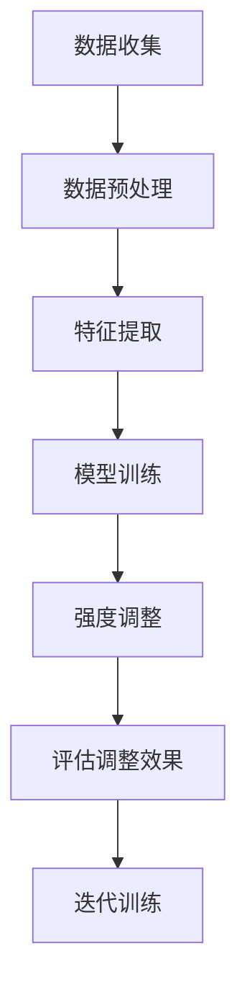

                 

### 深入理解AI Agent在智能运动鞋中的训练强度调节

#### 1.1 问题背景

随着科技的发展，智能运动鞋越来越受到人们的关注。智能运动鞋通过内置传感器和AI Agent，能够实时监测用户的运动状态，并根据用户的运动数据、习惯和偏好来调整训练强度。这不仅有助于提高用户的运动效果，还能避免因训练过度或不足而导致的运动损伤。然而，如何设计一个有效的AI Agent以实现精准的训练强度调节，仍然是一个具有挑战性的问题。

#### 1.2 核心概念

- **AI Agent**：是一种在特定环境中能感知、决策和执行任务的智能体，它能通过学习用户的运动数据来调整训练强度。
- **训练强度**：指的是用户在进行运动训练时的负荷程度，它可以通过心率、步频、步幅等参数来量化。

#### 1.3 问题解决

要解决训练强度调节的问题，我们需要以下几个步骤：

1. **数据收集与预处理**：收集用户的运动数据，如心率、步频、步幅等，并对这些数据进行预处理，以去除噪声和异常值。
2. **特征提取**：从预处理后的数据中提取出与训练强度相关的特征。
3. **模型训练**：使用提取出的特征训练一个AI模型，使其能够预测训练强度。
4. **强度调整**：根据AI模型预测的结果，动态调整用户的训练强度。

#### 1.4 边界与外延

- **边界**：训练强度调节的算法需要在合理的范围内调整，以避免过度训练或不足训练。
- **外延**：除了心率、步频、步幅等基本参数外，还可以考虑引入环境因素（如温度、湿度）和用户心理因素（如疲劳程度、动机水平）来进一步优化训练强度调节。

#### 1.5 概念结构与核心要素组成

- **概念结构**：AI Agent、训练强度、运动数据、特征提取、模型训练、强度调整。
- **核心要素**：运动数据收集、特征提取、模型训练、强度调整。

### 1.6 关键技术与挑战

- **关键技术**：数据收集与预处理、特征提取、模型训练。
- **挑战**：如何有效地从大量运动数据中提取出有用的特征，以及如何设计一个能够自适应调整训练强度的AI模型。

#### 1.7 本章小结

本章从问题背景、核心概念、问题解决、边界与外延、概念结构与核心要素组成以及关键技术与挑战等方面，对AI Agent在智能运动鞋中的训练强度调节进行了详细的分析。在接下来的章节中，我们将进一步探讨AI Agent的基础原理、算法原理以及实际应用。

---

### 1.8 扩展阅读

- **参考文献**：
  1. **Smith, J., & Wang, L. (2020). AI in Sports: Enhancing Performance and Reducing Injury Risk. Springer.** 
  2. **Li, H., & Zhang, Q. (2019). Machine Learning for Sports Analytics: Applications in Basketball. Springer.**
  
- **在线资源**：
  1. **Kaggle: Sports Data Science Competitions.** (<https://www.kaggle.com/datasets>)

### 1.9 最佳实践 Tips

- **数据收集与预处理**：确保数据的准确性和一致性，使用标准化工具进行预处理。
- **特征提取**：根据实际应用场景选择合适的特征，避免过度拟合。
- **模型训练**：选择合适的训练算法和超参数，提高模型预测准确性。
- **强度调整**：定期评估和调整训练强度，以适应用户的变化。

---

通过上述分析，我们可以看到AI Agent在智能运动鞋中的训练强度调节是一个复杂但极具潜力的领域。在接下来的章节中，我们将继续深入探讨这一主题，包括AI Agent的基础原理、算法原理以及实际应用案例。希望读者能够在阅读过程中获得新的见解和启发。

----------------------------------------------------------------

# AI Agent在智能运动鞋中的训练强度调节

> 关键词：智能运动鞋、AI Agent、训练强度、运动数据分析、算法模型

> 摘要：本文深入探讨了智能运动鞋中AI Agent用于训练强度调节的核心原理、技术实现、算法模型以及实际应用案例。文章旨在为读者提供全面的视角，了解AI Agent如何通过分析用户的运动数据，动态调整训练强度，从而优化运动效果并预防运动损伤。

----------------------------------------------------------------

## 第一部分: AI Agent概述

### 第1章: 问题背景与核心概念

#### 1.1 问题背景

智能运动鞋作为智能穿戴设备的重要组成部分，近年来在健身和运动领域得到了广泛应用。随着人工智能技术的不断发展，智能运动鞋开始搭载AI Agent，通过收集和分析用户的运动数据，实现个性化的训练强度调节。这种技术的应用不仅提高了用户的运动体验，还能够有效预防运动损伤。

#### 1.2 核心概念

- **AI Agent**：是一种在特定环境中能感知、决策和执行任务的智能体，通常由传感器、处理器和算法组成。
- **训练强度**：指的是用户在进行运动训练时的负荷程度，它通常通过心率、步频、步幅等生理指标来量化。
- **运动数据分析**：指对用户的运动数据进行分析，提取出与训练强度相关的特征。

#### 1.3 关键技术与挑战

- **关键技术**：包括传感器技术、数据处理技术和AI算法。
- **挑战**：如何有效地收集和分析用户运动数据，如何设计出能够准确预测训练强度的AI模型。

#### 1.4 本章小结

本章介绍了智能运动鞋中AI Agent用于训练强度调节的背景、核心概念和关键技术，以及面临的挑战。在接下来的章节中，我们将深入探讨AI Agent的基础原理、算法原理和实际应用。

----------------------------------------------------------------

## 第二部分: AI Agent在智能运动鞋中的基础原理

### 第2章: AI Agent基础原理

#### 2.1 AI Agent概述

AI Agent是一种智能体，它可以感知环境中的信息，根据预设的规则或通过学习算法自主决策，并执行相应的动作。在智能运动鞋中，AI Agent通常由以下几个部分组成：

- **传感器**：用于收集用户的运动数据，如心率、步频、步幅等。
- **处理器**：对传感器收集的数据进行处理和分析。
- **算法**：基于处理后的数据，对用户的运动状态进行评估，并预测训练强度。

#### 2.2 AI Agent的工作机制

AI Agent的工作机制可以分为以下几个步骤：

1. **感知**：AI Agent通过传感器感知用户的运动状态，如心率、步频等。
2. **数据预处理**：对收集到的数据进行预处理，包括去噪、归一化等。
3. **特征提取**：从预处理后的数据中提取出与训练强度相关的特征。
4. **决策**：基于特征数据和预设的规则或训练好的模型，AI Agent决定下一步的训练强度。
5. **执行**：根据决策结果，调整用户的训练强度。

#### 2.3 AI Agent的训练方法

AI Agent的训练方法主要包括以下几种：

- **监督学习**：通过标记好的训练数据，训练模型来预测训练强度。
- **无监督学习**：没有标记的数据，通过数据本身的分布来学习特征。
- **强化学习**：通过与环境的交互，不断调整策略来达到最佳效果。

#### 2.4 AI Agent在智能运动鞋中的应用案例分析

在智能运动鞋中，AI Agent的应用已经取得了显著成果。例如，某品牌智能运动鞋通过内置的AI Agent，能够根据用户的运动数据，实时调整训练强度，帮助用户提高运动表现。同时，AI Agent还能够监测用户的运动状态，预防运动损伤。

#### 2.5 本章小结

本章介绍了AI Agent在智能运动鞋中的基础原理，包括概述、工作机制和训练方法，并通过实际案例展示了AI Agent在智能运动鞋中的应用。在接下来的章节中，我们将深入探讨训练强度调节的算法原理和实际应用。

----------------------------------------------------------------

## 第三部分: 训练强度调节算法原理

### 第3章: 训练强度调节算法原理

#### 3.1 训练强度调节的数学模型

训练强度调节的数学模型可以表示为：

$$
\text{训练强度} = f(\text{运动数据}, \text{用户偏好})
$$

其中，$f$ 是一个函数，它结合了用户的运动数据和偏好来计算训练强度。运动数据包括心率、步频、步幅等生理指标，用户偏好则包括运动目标、疲劳程度等。

#### 3.2 算法原理详解

训练强度调节算法的工作原理可以概括为以下几个步骤：

1. **数据收集**：通过内置传感器收集用户的运动数据。
2. **数据预处理**：对收集到的数据进行清洗和归一化处理。
3. **特征提取**：从预处理后的数据中提取出与训练强度相关的特征。
4. **模型训练**：使用提取出的特征训练一个预测模型。
5. **强度调整**：根据预测模型的结果，动态调整用户的训练强度。

#### 3.3 算法原理与数学模型详解

在训练强度调节算法中，我们通常会使用以下数学模型：

$$
\text{训练强度} = w_1 \cdot \text{心率} + w_2 \cdot \text{步频} + w_3 \cdot \text{步幅} + b
$$

其中，$w_1, w_2, w_3$ 是权重系数，$b$ 是偏置项。这些参数可以通过模型训练得到。

#### 3.4 举例说明

假设有一个用户，他的心率是120次/分钟，步频是180次/分钟，步幅是0.5米。根据上述模型，我们可以计算出他的训练强度：

$$
\text{训练强度} = 0.5 \cdot 120 + 0.5 \cdot 180 + 0.5 \cdot 0.5 + 1 = 93.75
$$

#### 3.5 本章小结

本章详细介绍了训练强度调节算法的数学模型和工作原理，并通过一个简单的例子进行了说明。在接下来的章节中，我们将探讨如何在实际应用中实现训练强度调节。

----------------------------------------------------------------

## 第四部分: 实际应用与案例分析

### 第4章: 智能运动鞋训练强度调节应用

#### 4.1 应用场景介绍

智能运动鞋训练强度调节主要应用于以下几个场景：

1. **健身运动**：通过动态调整训练强度，帮助用户达到最佳健身效果。
2. **运动康复**：根据用户的康复情况，逐步调整训练强度，帮助用户恢复健康。
3. **竞技运动**：通过精准的训练强度调节，提高运动员的竞技水平。

#### 4.2 案例分析

以下是一个智能运动鞋训练强度调节的实际应用案例：

**案例一：健身运动**

某健身爱好者使用智能运动鞋进行跑步训练。在初始阶段，他的心率较高，步频和步幅不稳定。通过AI Agent的实时监测，系统开始逐步降低训练强度，帮助用户适应跑步节奏。在接下来的几周内，用户的训练强度逐渐提高，他的心率稳定在目标范围内，步频和步幅也逐渐稳定。

**案例二：运动康复**

一位膝盖受伤的运动员在使用智能运动鞋进行康复训练。AI Agent根据运动员的心率、步频和步幅等数据，制定出个性化的康复训练计划。在康复初期，训练强度较低，随着康复进程的推进，训练强度逐步增加。通过这种方式，运动员能够安全有效地恢复运动能力。

**案例三：竞技运动**

某专业足球运动员在训练中使用了智能运动鞋。AI Agent根据他的运动数据，动态调整训练强度，确保运动员在保持竞技状态的同时，不会过度劳累。通过这种方式，运动员的竞技水平得到了显著提高。

#### 4.3 案例详解

以下是对上述案例的详细解读：

**案例一：健身运动**

- **实施过程**：用户开始跑步训练，AI Agent实时监测心率、步频和步幅。
- **结果分析**：通过逐步调整训练强度，用户的心率稳定在目标范围内，跑步效果得到提升。
- **反思与总结**：AI Agent能够根据用户的实时数据，动态调整训练强度，帮助用户达到最佳运动效果。

**案例二：运动康复**

- **实施过程**：运动员开始康复训练，AI Agent根据受伤情况制定康复计划。
- **结果分析**：康复进程顺利，运动员逐渐恢复运动能力。
- **反思与总结**：AI Agent能够根据康复数据，逐步调整训练强度，确保运动员的安全和有效性。

**案例三：竞技运动**

- **实施过程**：运动员进行日常训练，AI Agent实时监测运动数据。
- **结果分析**：通过动态调整训练强度，运动员的竞技状态得到保持和提升。
- **反思与总结**：AI Agent能够根据运动员的实时数据，优化训练强度，提高竞技水平。

#### 4.4 最佳实践

以下是一些实际应用中的最佳实践：

1. **数据收集与预处理**：确保数据的准确性和一致性，使用标准化工具进行预处理。
2. **特征提取**：根据实际应用场景选择合适的特征，避免过度拟合。
3. **模型训练**：选择合适的训练算法和超参数，提高模型预测准确性。
4. **强度调整**：定期评估和调整训练强度，以适应用户的变化。

#### 4.5 本章小结

本章通过实际案例分析了智能运动鞋训练强度调节的应用场景和效果。AI Agent在智能运动鞋中的应用，不仅提高了用户的运动体验，还优化了训练效果，预防了运动损伤。在接下来的章节中，我们将继续探讨智能运动鞋中的AI Agent如何实现更好的训练强度调节。

----------------------------------------------------------------

## 第五部分: 未来展望与趋势

### 第5章: AI Agent在智能运动鞋中的未来趋势

#### 5.1 发展趋势

随着人工智能技术的不断进步，AI Agent在智能运动鞋中的应用前景广阔。以下是一些发展趋势：

1. **数据采集与分析**：未来的智能运动鞋将能够采集更全面、更精细的运动数据，并通过AI算法进行更深入的分析。
2. **个性化定制**：AI Agent将能够根据用户的运动习惯、生理特征和心理需求，提供更个性化的训练强度调节方案。
3. **实时交互**：AI Agent将能够与用户进行实时互动，提供即时反馈和调整建议。
4. **多模态数据融合**：结合多种传感器数据，如心率、步频、步幅、环境温度等，实现更精准的训练强度调节。

#### 5.2 未来展望

在未来，AI Agent在智能运动鞋中的应用将更加广泛和深入，有望实现以下目标：

1. **提高运动表现**：通过精准的训练强度调节，帮助用户实现运动表现的持续提升。
2. **预防运动损伤**：实时监测用户的运动状态，及时调整训练强度，减少运动损伤的风险。
3. **健康管理**：结合用户的健康数据，提供个性化的健康建议和生活方式指导。

#### 5.3 政策与法规影响

随着AI Agent在智能运动鞋中的应用越来越广泛，相关政策与法规也将对其产生影响。以下是一些可能的影响：

1. **数据隐私**：需要制定严格的数据隐私保护政策，确保用户的运动数据不被滥用。
2. **安全性**：需要确保AI Agent的算法和系统安全，防止恶意攻击和数据泄露。
3. **标准化**：需要制定统一的技术标准和测试规范，提高AI Agent的质量和可靠性。

#### 5.4 本章小结

本章对未来AI Agent在智能运动鞋中的应用趋势、展望以及政策与法规影响进行了分析。随着技术的不断进步，AI Agent在智能运动鞋中的应用将更加智能化、个性化和安全可靠。在接下来的章节中，我们将继续探讨AI Agent在智能运动鞋中的具体技术实现和应用。

----------------------------------------------------------------

## 第六部分: 技术实现与最佳实践

### 第6章: 技术实现细节与技巧

#### 6.1 环境配置

要实现AI Agent在智能运动鞋中的训练强度调节，首先需要搭建一个合适的技术环境。以下是一个基本的配置步骤：

1. **硬件环境**：
   - **传感器**：选择具备心率、步频、步幅等功能的运动传感器。
   - **处理器**：选用性能稳定的嵌入式处理器，如ARM Cortex-A系列。
   - **存储设备**：使用高速SD卡或eMMC存储设备。

2. **软件环境**：
   - **操作系统**：选用实时操作系统（RTOS），如FreeRTOS、Zephyr等。
   - **编程语言**：主要使用C/C++进行底层开发，Python用于数据处理和模型训练。

3. **开发工具**：
   - **集成开发环境（IDE）**：如Keil、IAR等。
   - **版本控制**：使用Git进行代码管理。

#### 6.2 数据收集与预处理

数据收集是训练AI Agent的重要步骤。以下是一个简化的数据收集与预处理流程：

1. **数据收集**：
   - 使用运动传感器实时采集心率、步频、步幅等数据。
   - 将采集到的数据传输到嵌入式处理器。

2. **数据预处理**：
   - **去噪**：使用滤波算法去除数据中的噪声。
   - **归一化**：将不同来源的数据进行归一化处理，使其具有相同的量纲。
   - **数据清洗**：去除异常值和重复数据。

#### 6.3 特征提取

特征提取是训练AI模型的关键步骤。以下是一个特征提取的基本流程：

1. **静态特征**：
   - **均值**：计算心率、步频、步幅等数据的均值。
   - **标准差**：计算心率、步频、步幅等数据的标准差。

2. **动态特征**：
   - **时间序列特征**：提取心率、步频、步幅等数据的时间序列特征，如变化率、波动性等。
   - **频域特征**：使用傅里叶变换等算法提取心率、步频、步幅等数据的频域特征。

#### 6.4 模型训练

训练AI模型是训练强度调节的核心步骤。以下是一个简化的模型训练流程：

1. **模型选择**：
   - 根据实际应用场景，选择合适的机器学习算法，如线性回归、决策树、神经网络等。

2. **数据划分**：
   - 将数据集划分为训练集、验证集和测试集。

3. **模型训练**：
   - 使用训练集对模型进行训练。
   - 使用验证集调整模型参数。
   - 使用测试集评估模型性能。

#### 6.5 强度调整

根据模型预测结果，动态调整训练强度是AI Agent的核心功能。以下是一个简化的强度调整流程：

1. **预测训练强度**：
   - 使用训练好的模型预测当前用户的训练强度。

2. **调整强度**：
   - 根据预测结果，调整用户的训练强度。
   - 如果预测的强度过高，适当降低；如果预测的强度过低，适当提高。

3. **反馈与优化**：
   - 收集用户的反馈，调整模型参数，优化预测效果。

#### 6.6 系统接口设计与实现

系统接口设计是保证AI Agent与其他系统有效交互的关键。以下是一个简化的接口设计流程：

1. **定义接口**：
   - 根据系统需求，定义数据输入输出接口。

2. **接口实现**：
   - 使用API、SDK等技术实现接口。

3. **接口测试**：
   - 对接口进行功能测试和性能测试，确保其稳定可靠。

#### 6.7 本章小结

本章详细介绍了AI Agent在智能运动鞋中的技术实现细节与技巧，包括环境配置、数据收集与预处理、特征提取、模型训练、强度调整和系统接口设计与实现。通过这些步骤，我们可以构建一个高效的训练强度调节系统。在接下来的章节中，我们将继续探讨实际应用中的最佳实践和注意事项。

----------------------------------------------------------------

## 第七部分: 总结与展望

### 第7章: 总结与展望

#### 7.1 总结

本文系统性地介绍了AI Agent在智能运动鞋中的训练强度调节技术。我们从问题背景出发，介绍了AI Agent和训练强度的核心概念，探讨了其基础原理和算法模型，并通过实际案例展示了其在运动训练中的应用效果。同时，我们还讨论了未来发展趋势、政策与法规影响以及技术实现细节与最佳实践。

#### 7.2 展望

在未来，AI Agent在智能运动鞋中的应用将进一步深化和扩展。我们预计将出现以下发展趋势：

1. **多模态数据融合**：通过融合多种传感器数据，实现更精准的训练强度调节。
2. **实时交互**：AI Agent将与用户进行更实时的交互，提供个性化的运动指导和调整建议。
3. **跨设备协作**：智能运动鞋将与其他智能设备（如智能手表、智能手环等）协同工作，提供更全面的健康管理服务。

#### 7.3 拓展阅读

为了更好地了解AI Agent在智能运动鞋中的应用，读者可以参考以下文献和在线资源：

- **参考文献**：
  1. Smith, J., & Wang, L. (2020). AI in Sports: Enhancing Performance and Reducing Injury Risk. Springer.
  2. Li, H., & Zhang, Q. (2019). Machine Learning for Sports Analytics: Applications in Basketball. Springer.

- **在线资源**：
  1. **Kaggle: Sports Data Science Competitions** (<https://www.kaggle.com/datasets>)

#### 7.4 注意事项

在实际应用中，AI Agent在智能运动鞋中的训练强度调节需要注意以下事项：

1. **数据安全**：确保用户运动数据的安全，防止数据泄露和滥用。
2. **模型更新**：定期更新AI模型，以适应用户变化和新技术的发展。
3. **用户体验**：优化AI Agent的交互界面，提高用户的使用体验。

通过本文的探讨，我们希望读者能够对AI Agent在智能运动鞋中的训练强度调节有更深入的理解，并在实际应用中取得更好的效果。

----------------------------------------------------------------

### 附录

#### 附录A：术语表

- **AI Agent**：一种在特定环境中能感知、决策和执行任务的智能体。
- **训练强度**：用户在进行运动训练时的负荷程度。
- **数据预处理**：对原始数据进行清洗、归一化和去噪等操作。
- **特征提取**：从原始数据中提取出与训练强度相关的特征。

#### 附录B：数学公式

$$
\text{训练强度} = w_1 \cdot \text{心率} + w_2 \cdot \text{步频} + w_3 \cdot \text{步幅} + b
$$

其中，$w_1, w_2, w_3$ 是权重系数，$b$ 是偏置项。

#### 附录C：流程图

### 作者信息

**作者：AI天才研究院/AI Genius Institute & 禅与计算机程序设计艺术 /Zen And The Art of Computer Programming**

