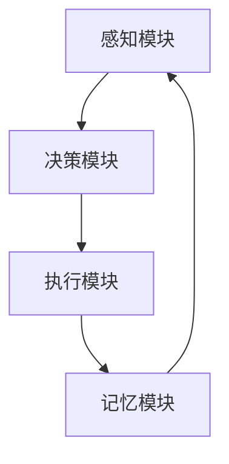
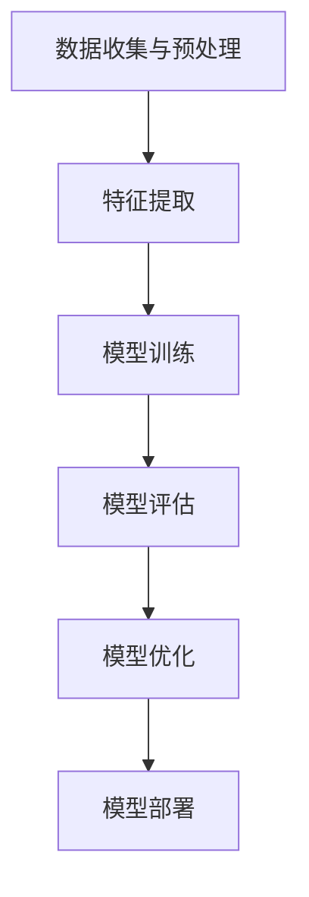
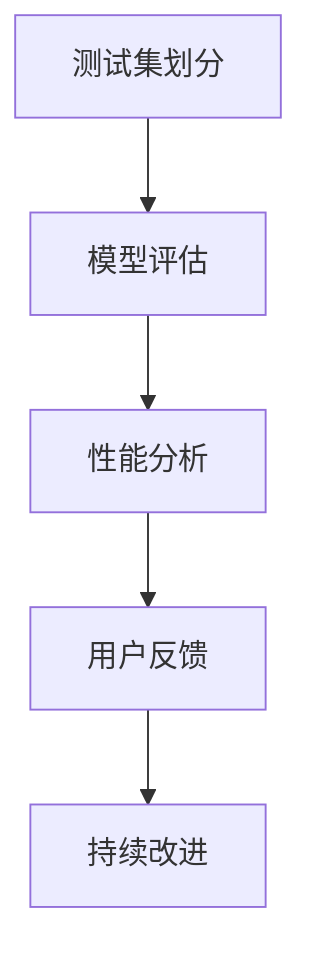
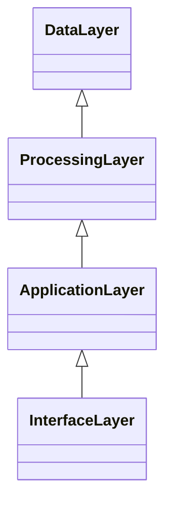
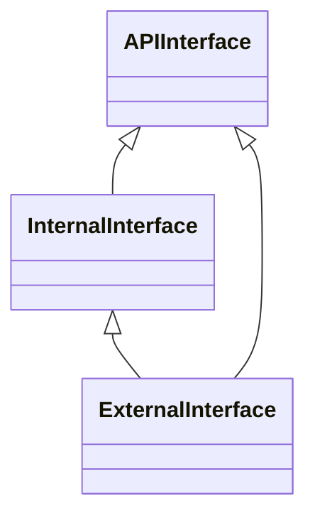

                 

### 引言

#### 第1章：背景介绍

##### 1.1 问题背景

随着金融科技的快速发展，金融欺诈手段也在不断演变。传统的金融欺诈检测方法在应对复杂多变的欺诈行为时显得力不从心。金融欺诈不仅给金融机构带来了巨大的经济损失，还损害了消费者的利益和金融市场的稳定。因此，如何有效检测和预防金融欺诈成为了一个亟待解决的问题。

##### 1.1.1 问题的提出

金融欺诈的形式多种多样，包括账户盗用、信用卡欺诈、贷款欺诈等。这些欺诈行为往往具有高度隐蔽性，使得传统的检测方法难以发现。例如，某些欺诈者可能通过伪造交易记录或利用复杂的网络关系进行洗钱，使得交易看似正常，但实际目的是进行欺诈。

##### 1.1.2 问题的重要性

金融欺诈对金融机构和消费者的影响是深远的。对于金融机构而言，欺诈行为会导致资金损失、声誉受损和运营成本增加。对于消费者而言，欺诈行为会直接导致财产损失，甚至可能引发信用危机。因此，提高金融欺诈检测的准确性，预防和减少欺诈行为的发生，对于维护金融市场的稳定和消费者权益具有重要意义。

##### 1.1.3 研究意义

本研究旨在探讨AI Agent在智能金融欺诈检测中的应用，通过引入AI Agent，有望提高欺诈检测的准确性和效率。具体而言，研究意义包括：

1. **技术创新**：通过引入AI Agent，结合机器学习和深度学习技术，探索金融欺诈检测的新方法，为金融科技领域提供新的技术思路。
2. **实践应用**：通过实际案例分析和系统实现，验证AI Agent在金融欺诈检测中的有效性，为金融机构提供可行的解决方案。
3. **风险管理**：提高金融欺诈检测的准确性，有助于金融机构更好地管理风险，降低欺诈损失，提高运营效率。

##### 1.2 问题描述

当前金融欺诈检测存在以下问题：

1. **检测精度不高**：传统方法依赖于预设规则和统计模型，难以应对复杂的欺诈行为，导致漏检率高。
2. **检测速度慢**：大量交易数据需要进行处理，传统方法处理速度较慢，无法实时检测。
3. **应对变化能力差**：欺诈行为不断变化，传统方法难以适应新出现的欺诈手段。

##### 1.2.1 问题现状

目前，金融欺诈检测主要依赖于以下几种方法：

1. **基于规则的检测方法**：通过预设规则对交易行为进行分析，但规则难以涵盖所有可能的欺诈行为。
2. **基于统计学的检测方法**：利用统计学方法对交易行为进行建模，但易受数据噪声影响。
3. **基于机器学习的检测方法**：通过训练模型对交易行为进行预测，但需要大量数据和计算资源。
4. **基于深度学习的检测方法**：利用深度学习模型对交易行为进行建模，但复杂度较高，计算资源需求大。

##### 1.2.2 存在的问题

1. **规则复杂度**：传统方法需要大量复杂的规则，且规则更新速度较慢，难以适应欺诈行为的快速变化。
2. **数据噪声**：交易数据中存在大量的噪声和异常值，影响检测效果。
3. **计算资源**：深度学习方法需要大量的计算资源和时间进行训练和预测。
4. **模型解释性**：深度学习模型通常具有很高的预测准确性，但模型内部的决策过程难以解释，不利于监管和审计。

##### 1.2.3 需求分析

为了解决上述问题，金融欺诈检测需要满足以下需求：

1. **高精度**：检测方法应能准确识别各种欺诈行为，降低漏检率。
2. **实时性**：检测方法应能实时处理大量交易数据，确保及时发现欺诈行为。
3. **自适应能力**：检测方法应能适应欺诈行为的快速变化，提高检测效果。
4. **可解释性**：检测方法应具有一定的解释性，便于监管和审计。

##### 1.3 问题解决思路

针对上述问题和需求，本研究提出以下解决方案：

1. **引入AI Agent**：利用AI Agent的特点，提高检测的准确性、实时性和自适应能力。
2. **优化检测模型**：结合机器学习和深度学习技术，构建高效、准确的检测模型。
3. **实时数据处理**：采用高效的数据处理技术，实现实时交易数据的分析。
4. **增强模型解释性**：通过可视化技术和解释性算法，提高模型的透明度和可解释性。

##### 1.3.1 解决方案的必要性

当前金融欺诈检测面临诸多挑战，传统方法难以应对。引入AI Agent，结合先进的机器学习和深度学习技术，是解决金融欺诈检测问题的关键。AI Agent具有自适应、智能和交互等特点，能够实时分析交易数据，发现潜在的欺诈行为，提高检测的准确性和效率。因此，研究AI Agent在金融欺诈检测中的应用具有重要的现实意义。

##### 1.3.2 解决方案的基本框架

本研究的解决方案包括以下几个主要部分：

1. **AI Agent设计**：设计并实现具有自适应、智能和交互能力的AI Agent。
2. **检测模型构建**：结合机器学习和深度学习技术，构建高效、准确的检测模型。
3. **数据处理与实时分析**：采用高效的数据处理技术，实现实时交易数据的分析。
4. **模型解释与可视化**：通过可视化技术和解释性算法，提高模型的透明度和可解释性。

##### 1.3.3 边界与外延

本研究主要关注AI Agent在金融欺诈检测中的应用，但AI Agent在其他领域的应用也有很大的潜力。例如，AI Agent可以应用于网络安全、智能交通等领域，为各个领域提供智能化的解决方案。此外，本研究还将探讨AI Agent与其他技术的结合，如区块链、大数据等，进一步拓展AI Agent的应用范围。

##### 1.4 核心概念与联系

在本研究中，涉及以下核心概念：

1. **AI Agent**：具有智能、自适应和交互能力的虚拟代理。
2. **金融欺诈检测**：利用技术手段检测金融欺诈行为的过程。
3. **机器学习**：通过训练模型，使计算机自动学习数据并做出决策的技术。
4. **深度学习**：一种特殊的机器学习技术，利用多层神经网络对复杂数据进行建模。
5. **实时分析**：对实时数据进行分析和处理，以提供及时的信息。

这些概念之间存在紧密的联系，共同构成了本研究的基础。以下是一个概念属性特征对比表格，用于展示这些概念的主要特征：

| 概念       | 定义                                                         | 主要特征                                      |
|------------|--------------------------------------------------------------|-----------------------------------------------|
| AI Agent   | 具有智能、自适应和交互能力的虚拟代理                         | 自适应、智能、交互、多任务处理                 |
| 金融欺诈检测 | 利用技术手段检测金融欺诈行为的过程                         | 准确性、实时性、自适应、可解释性               |
| 机器学习   | 通过训练模型，使计算机自动学习数据并做出决策的技术           | 自适应、高效、可扩展、可解释性                 |
| 深度学习   | 一种特殊的机器学习技术，利用多层神经网络对复杂数据进行建模 | 自适应、高效、复杂度低、可解释性               |
| 实时分析   | 对实时数据进行分析和处理，以提供及时的信息                   | 实时性、高效、可扩展、自适应                   |

为了更清晰地展示这些概念之间的关联，以下是一个ER实体关系图架构，用于描述这些概念之间的关系：

```mermaid
erDiagram
  AI-Agent ||--|{ 金融欺诈检测 }
  金融欺诈检测 ||--|{ 机器学习 }
  金融欺诈检测 ||--|{ 深度学习 }
  金融欺诈检测 ||--|{ 实时分析 }
  机器学习 ||--|{ 数据处理 }
  深度学习 ||--|{ 数据处理 }
  实时分析 ||--|{ 数据处理 }
```

通过这个ER图，我们可以看出AI Agent在金融欺诈检测中起着核心作用，而机器学习、深度学习和实时分析是实现这一目标的重要技术手段。

### 核心概念与原理

#### 第2章：AI Agent的定义与特点

##### 2.1 AI Agent的定义

AI Agent，即人工智能代理，是一种具有智能、自适应和交互能力的虚拟代理。它通过模拟人类智能行为，能够在复杂的动态环境中自主执行任务，达到特定目标。AI Agent具有以下几个核心组成部分：

1. **感知模块**：AI Agent通过感知模块收集环境信息，如视觉、听觉、触觉等，这些信息作为输入数据，帮助AI Agent理解当前环境状态。
2. **决策模块**：基于感知模块收集的信息，AI Agent的决策模块会对各种行动方案进行评估，并选择最优的行动。
3. **执行模块**：决策模块选定的行动方案会被传递给执行模块，由执行模块负责具体实施行动。
4. **记忆模块**：AI Agent具有记忆功能，能够存储历史数据和经验，以便在未来的决策过程中使用。

##### 2.1.2 AI Agent的组成部分

AI Agent的组成部分包括：

1. **感知模块**：感知模块是AI Agent与外部环境进行交互的桥梁。它通过传感器接收外部环境的信息，并将其转化为数字信号。这些信号通常包括文本、图像、声音等多种形式。感知模块的核心任务是确保AI Agent能够准确、及时地获取环境信息，以便进行有效的决策。

2. **决策模块**：决策模块是AI Agent的核心，负责根据感知模块收集到的信息，分析当前环境的状况，并选择最佳的行动方案。决策模块通常采用复杂的算法，如机器学习、深度学习等，以实现高效、准确的决策。决策过程可能涉及多种因素，包括当前目标、环境状态、历史数据等。

3. **执行模块**：执行模块负责将决策模块选定的行动方案转化为具体的行动。例如，如果决策模块决定移动到某个位置，执行模块则会控制AI Agent的移动机构执行这一动作。执行模块需要与具体的硬件设备或机器人系统紧密集成，以确保行动的准确性和可靠性。

4. **记忆模块**：记忆模块是AI Agent经验积累和学习的基础。它能够存储历史数据和经验，如感知信息、决策过程和执行结果等。通过记忆模块，AI Agent能够不断学习和优化自身的性能，提高应对复杂环境的能力。记忆模块通常包括数据库、缓存和存储设备等。

##### 2.1.3 AI Agent与传统算法的区别

AI Agent与传统算法相比，具有以下几个显著区别：

1. **主动性**：传统算法通常被动地接受输入数据，并按照预设的规则或算法进行计算和输出。而AI Agent具有主动性，能够根据环境变化自主调整行为，以实现特定的目标。

2. **自适应能力**：传统算法通常在特定环境下表现出色，但难以适应新的环境或变化。而AI Agent通过学习和记忆功能，能够根据环境变化动态调整自身的决策和行为，表现出更强的自适应能力。

3. **交互性**：传统算法通常不涉及与环境的交互，而AI Agent能够与外部环境进行实时交互，收集环境信息，并根据反馈调整行为。

4. **智能性**：传统算法基于简单的逻辑或统计方法，而AI Agent利用机器学习和深度学习等先进技术，具备更高的智能水平，能够处理复杂数据和进行复杂决策。

##### 2.2 AI Agent的特点

AI Agent具有以下特点：

1. **自适应性**：AI Agent能够根据环境变化和反馈信息，动态调整自身的行为和决策，以适应不同的环境和任务。

2. **智能性**：通过机器学习和深度学习等技术，AI Agent具备处理复杂数据和进行复杂决策的能力，表现出高度的智能水平。

3. **学习能力**：AI Agent能够通过学习和记忆功能，不断积累经验和知识，提高自身的性能和应对复杂环境的能力。

4. **交互能力**：AI Agent能够与外部环境进行实时交互，收集环境信息，并根据反馈调整行为，实现更高效的任务执行。

#### 第3章：智能金融欺诈检测

##### 3.1 金融欺诈检测的重要性

金融欺诈检测在金融领域中具有至关重要的地位。随着金融活动的日益复杂化和信息化，金融欺诈手段也变得多样化、隐蔽化。因此，建立高效、准确的金融欺诈检测系统，不仅有助于保护金融机构和消费者的利益，还能维护金融市场的稳定。

##### 3.1.1 金融欺诈的常见形式

金融欺诈的形式多种多样，主要包括以下几种：

1. **账户盗用**：欺诈者通过非法手段获取他人的账户信息，如用户名、密码、验证码等，从而未经授权访问和操作账户。

2. **信用卡欺诈**：欺诈者利用伪造或盗用的信用卡，进行非法消费或提取现金。

3. **贷款欺诈**：欺诈者通过提供虚假信息或伪造文件，骗取贷款资金。

4. **网络钓鱼**：欺诈者通过发送虚假邮件或建立假冒网站，诱骗用户输入敏感信息，如银行账号、密码等。

5. **洗钱**：欺诈者通过一系列复杂的交易，将非法资金转化为合法资金，以掩盖资金来源。

##### 3.1.2 金融欺诈的危害

金融欺诈对金融机构和消费者都带来了严重的危害：

1. **经济损失**：金融欺诈会导致金融机构遭受直接的经济损失，包括资金损失、运营成本增加等。

2. **声誉受损**：金融欺诈事件曝光后，金融机构的声誉可能会受到严重损害，影响业务发展和客户信任。

3. **消费者利益受损**：金融欺诈会直接导致消费者的财产损失，甚至可能引发信用危机，影响消费者的生活和未来。

4. **金融市场稳定性**：大规模的金融欺诈事件可能引发市场恐慌，影响金融市场的稳定，甚至导致金融危机。

##### 3.1.3 欺诈检测的必要性

在金融欺诈日益猖獗的背景下，建立高效的欺诈检测系统显得尤为重要：

1. **保护金融机构利益**：通过实时监测和预警，及时识别和阻止金融欺诈行为，降低金融机构的经济损失。

2. **保护消费者权益**：及时发现和阻止欺诈行为，保护消费者的财产安全和合法权益。

3. **维护金融市场稳定**：通过防范和打击金融欺诈，维护金融市场的秩序和稳定，防止金融危机的发生。

4. **提升服务质量**：通过高效的欺诈检测系统，提高金融机构的风险管理能力，提升服务质量，增强客户信任。

##### 3.2 欺诈检测的方法与技术

金融欺诈检测的方法和技术不断发展，主要包括以下几种：

1. **基于规则的检测方法**：通过预设一系列规则，对交易行为进行分析和判断。这种方法简单直观，但需要大量规则，且难以应对复杂的欺诈行为。

2. **基于统计学的检测方法**：利用统计学原理，对交易数据进行分析，识别异常交易行为。这种方法对数据质量要求较高，且易受数据噪声影响。

3. **基于机器学习的检测方法**：通过训练机器学习模型，对交易数据进行特征提取和分类，识别潜在的欺诈行为。这种方法具有自适应性和可扩展性，但需要大量数据和计算资源。

4. **基于深度学习的检测方法**：利用深度学习模型，对复杂数据进行建模和分析，识别欺诈行为。这种方法具有强大的特征提取和建模能力，但计算资源需求较大。

以上方法各有优缺点，在实际应用中，常常将多种方法结合，以提高欺诈检测的准确性和效率。

#### 第4章：AI Agent在金融欺诈检测中的应用

##### 4.1 AI Agent在金融欺诈检测中的优势

AI Agent在金融欺诈检测中表现出显著的优势，主要体现在以下几个方面：

1. **自适应能力**：AI Agent能够根据环境变化和反馈信息，动态调整自身的决策和行为，以应对复杂的欺诈行为。

2. **智能性**：通过机器学习和深度学习技术，AI Agent能够处理复杂数据和进行复杂决策，识别出潜在的欺诈行为。

3. **学习能力**：AI Agent能够通过学习和记忆功能，不断积累经验和知识，提高自身的性能和应对复杂环境的能力。

4. **交互能力**：AI Agent能够与外部环境进行实时交互，收集环境信息，并根据反馈调整行为，实现更高效的任务执行。

##### 4.1.1 AI Agent的特点与欺诈检测的结合

AI Agent的特点与金融欺诈检测的需求高度契合，使得其在欺诈检测中具有独特的优势。具体而言，AI Agent与欺诈检测的结合体现在以下几个方面：

1. **实时检测与响应**：AI Agent能够实时监测交易行为，一旦发现异常，立即采取措施，阻止欺诈行为。例如，当检测到可疑交易时，AI Agent可以立即冻结相关账户，防止进一步损失。

2. **自适应决策**：AI Agent可以根据历史数据和实时反馈，自适应调整检测策略，提高检测的准确性和效率。例如，当发现某种新的欺诈手段时，AI Agent可以立即更新其决策模型，以更准确地识别此类欺诈行为。

3. **智能特征提取**：AI Agent利用机器学习和深度学习技术，能够自动提取交易数据的特征，识别潜在的欺诈行为。这种方法比传统的基于规则的检测方法更具有灵活性和鲁棒性。

4. **透明可解释**：AI Agent的决策过程相对透明，可以通过可视化技术和解释性算法，帮助金融机构理解AI Agent的决策逻辑，提高检测系统的可解释性。

##### 4.1.2 AI Agent在欺诈检测中的应用前景

随着AI技术的发展，AI Agent在金融欺诈检测中的应用前景十分广阔：

1. **提高检测效率**：AI Agent能够处理海量交易数据，快速识别潜在的欺诈行为，大大提高检测效率。

2. **降低漏检率**：AI Agent通过自适应学习和智能决策，能够有效降低漏检率，提高检测准确性。

3. **增强用户体验**：通过智能检测和响应，AI Agent能够提供更安全、更便捷的金融服务，提升用户体验。

4. **扩展应用领域**：AI Agent不仅在金融领域有广泛应用，还可以应用于其他领域，如网络安全、智能交通等，为各个领域提供智能化的解决方案。

##### 4.1.3 AI Agent在金融欺诈检测中的挑战

尽管AI Agent在金融欺诈检测中具有显著优势，但其在实际应用中仍面临一些挑战：

1. **数据隐私与安全**：金融交易数据具有高度敏感性和隐私性，如何确保数据在AI Agent中的应用安全，防止数据泄露，是AI Agent在金融欺诈检测中需要解决的问题。

2. **模型解释性**：AI Agent的决策过程通常较为复杂，如何提高模型的可解释性，使其能够被金融机构和监管机构理解和接受，是一个重要挑战。

3. **计算资源消耗**：AI Agent的运行需要大量的计算资源和时间，如何优化算法和硬件，降低计算资源消耗，是实际应用中需要考虑的问题。

4. **适应新欺诈手段**：随着欺诈手段的不断演变，AI Agent需要不断更新和优化模型，以应对新的欺诈手段，这对AI Agent的适应性提出了更高的要求。

#### 第5章：AI Agent在金融欺诈检测中的实现

##### 4.2 AI Agent在金融欺诈检测中的实现

要实现AI Agent在金融欺诈检测中的有效应用，需要从以下几个方面进行：

1. **结构设计**：设计AI Agent的架构，确保其具备感知、决策、执行和记忆等功能。
2. **数据预处理**：对金融交易数据进行分析和预处理，提取有效特征，为AI Agent提供高质量的数据输入。
3. **模型训练与优化**：利用机器学习和深度学习技术，训练和优化AI Agent的决策模型，提高检测的准确性和效率。
4. **系统部署与维护**：将AI Agent部署到实际环境中，进行实时监测和响应，并定期进行维护和更新。

##### 4.2.1 AI Agent的结构设计

AI Agent的结构设计是确保其在金融欺诈检测中发挥作用的关键。一个典型的AI Agent结构包括以下几个部分：

1. **感知模块**：感知模块负责收集金融交易数据，如账户信息、交易记录、用户行为等。这些数据可以通过API接口、数据库访问等方式获取。

2. **决策模块**：决策模块基于感知模块收集到的数据，利用机器学习和深度学习技术进行分析，识别潜在的欺诈行为。决策模块通常包括特征提取、模型训练和推理三个环节。

3. **执行模块**：执行模块负责将决策模块的决策结果转化为具体的行动。例如，当检测到可疑交易时，执行模块可以冻结相关账户或发送预警通知。

4. **记忆模块**：记忆模块负责存储历史数据和经验，包括交易数据、决策结果和执行情况等。通过记忆模块，AI Agent可以不断学习和优化自身的性能。

以下是AI Agent结构设计的Mermaid流程图：



在这个流程图中，感知模块收集交易数据，传递给决策模块进行分析。决策模块通过特征提取和模型推理，识别潜在的欺诈行为，并将结果传递给执行模块。执行模块根据决策结果采取相应行动，并将结果存储在记忆模块中，以便后续学习和优化。

##### 4.2.2 AI Agent的训练与优化

AI Agent的训练与优化是确保其在金融欺诈检测中表现优异的关键步骤。以下是一个典型的训练与优化过程：

1. **数据收集与预处理**：收集大量金融交易数据，包括正常交易和欺诈交易。对数据进行分析和预处理，提取关键特征，如交易金额、交易频率、账户行为等。数据预处理步骤包括数据清洗、归一化和特征选择等。

2. **特征提取**：利用机器学习和深度学习技术，对预处理后的数据进行分析，提取有助于欺诈检测的关键特征。特征提取的方法包括统计特征提取、深度特征提取等。

3. **模型训练**：利用提取的特征，训练机器学习模型或深度学习模型。训练过程包括数据划分、模型选择、参数调整等。常用的机器学习算法包括决策树、支持向量机、随机森林等；深度学习模型包括卷积神经网络（CNN）、循环神经网络（RNN）等。

4. **模型评估**：利用验证集对训练好的模型进行评估，计算准确率、召回率、F1值等指标。根据评估结果，调整模型参数，优化模型性能。

5. **模型优化**：通过交叉验证、网格搜索等方法，进一步优化模型参数，提高模型在检测欺诈行为方面的性能。

6. **模型部署**：将训练好的模型部署到实际环境中，进行实时监测和响应。同时，定期对模型进行更新和优化，以应对新的欺诈手段。

以下是一个AI Agent训练与优化的Mermaid流程图：



在这个流程图中，数据收集与预处理步骤提取关键特征，训练模型的过程包括模型训练、评估和优化。最后，将训练好的模型部署到实际环境中，进行实时监测和响应。

##### 4.2.3 AI Agent在实际应用中的效果评估

AI Agent在实际应用中的效果评估是验证其性能和有效性的重要步骤。以下是一个典型的效果评估过程：

1. **测试集划分**：将实际交易数据划分为测试集和验证集。测试集用于评估AI Agent在未知数据上的性能，验证集用于调整模型参数和优化算法。

2. **模型评估**：利用测试集对AI Agent的模型进行评估，计算准确率、召回率、F1值等指标。同时，分析模型的误报率和漏报率，以了解模型在检测欺诈行为方面的性能。

3. **性能分析**：分析AI Agent在不同场景下的性能，如正常交易、可疑交易和欺诈交易。比较AI Agent与其他检测方法的性能差异，评估AI Agent在金融欺诈检测中的优势。

4. **用户反馈**：收集用户对AI Agent的反馈，了解其在实际应用中的用户体验和效果。根据用户反馈，进一步优化AI Agent的功能和性能。

5. **持续改进**：根据评估结果和用户反馈，持续改进AI Agent的算法和模型，提高其在金融欺诈检测中的准确性和效率。

以下是一个AI Agent效果评估的Mermaid流程图：



在这个流程图中，测试集划分用于评估AI Agent的性能，性能分析用于比较不同场景下的性能，用户反馈用于收集用户反馈，持续改进用于优化AI Agent的算法和模型。

通过上述流程，可以全面评估AI Agent在金融欺诈检测中的效果，并根据评估结果进行持续改进，提高检测的准确性和效率。

### 应用案例

#### 第5章：案例一：某银行AI欺诈检测系统的设计与实现

##### 5.1 案例背景

随着金融科技的快速发展，银行面临的欺诈风险日益增加。为了有效防范金融欺诈，提高客户资金安全，某大型银行决定开发一款基于AI技术的欺诈检测系统。该系统旨在通过实时监测和分析交易数据，快速识别并阻止潜在的欺诈行为，从而降低银行的风险损失。

##### 5.1.1 某银行的基本情况

该银行是一家拥有数百万客户的大型商业银行，业务范围包括存款、贷款、信用卡、支付等多种金融服务。近年来，随着互联网金融的兴起，银行的交易量和交易频率大幅增加，同时也面临着越来越多的欺诈威胁。传统的欺诈检测方法已难以满足银行的需求，因此，开发一款基于AI技术的欺诈检测系统成为当务之急。

##### 5.1.2 案例提出的问题

1. **交易数据量大**：银行每天处理大量的交易数据，如何快速、准确地分析这些数据，识别潜在的欺诈行为，成为一大挑战。
2. **欺诈手段多样**：欺诈者不断更新欺诈手段，传统的欺诈检测方法难以应对多样化的欺诈行为。
3. **实时性要求高**：欺诈行为具有突发性和隐蔽性，要求检测系统能够实时监测交易行为，及时响应。
4. **数据隐私和安全**：银行交易数据具有高度敏感性，如何在保证数据隐私和安全的前提下，有效利用这些数据进行欺诈检测，是一个重要问题。

##### 5.1.3 案例的研究目标

本研究旨在设计并实现一款基于AI技术的欺诈检测系统，具体目标包括：

1. **提高检测准确性**：通过引入AI技术，提高检测系统的准确性，降低误报率和漏报率。
2. **实时监测交易行为**：实现实时监测和响应，及时发现并阻止潜在的欺诈行为。
3. **保证数据安全**：确保交易数据在处理过程中的安全性和隐私性。
4. **提高用户体验**：通过智能检测和快速响应，提高客户的安全感和满意度。

##### 5.2 系统设计

为了实现上述目标，本案例采用了一种基于AI Agent的欺诈检测系统设计，具体设计思路如下：

1. **系统功能设计**：系统应具备实时监测、异常检测、报警和阻止等功能，实现对交易行为的全面监控。
2. **系统架构设计**：系统采用分布式架构，以提高系统的可扩展性和可靠性。
3. **系统接口设计**：系统应提供多种接口，方便与其他银行系统和第三方平台集成。

##### 5.2.1 系统功能设计

系统功能设计包括以下几个方面：

1. **数据采集**：通过API接口、数据库连接等方式，实时采集交易数据，包括账户信息、交易记录、用户行为等。
2. **数据预处理**：对采集到的交易数据进行清洗、去噪和特征提取，为AI Agent提供高质量的数据输入。
3. **异常检测**：利用AI Agent的感知模块，对预处理后的交易数据进行分析，识别异常交易行为。
4. **报警与阻止**：当检测到异常交易时，系统会自动触发报警，并采取相应的阻止措施，如冻结账户、发送预警通知等。
5. **用户反馈**：系统应允许用户对检测结果进行反馈，帮助AI Agent不断优化和调整检测策略。

##### 5.2.2 系统架构设计

系统架构设计如下：

1. **数据层**：负责存储和管理交易数据，包括数据库、数据仓库等。
2. **处理层**：负责对交易数据进行预处理、特征提取和异常检测，包括感知模块、决策模块等。
3. **应用层**：负责实现系统的功能，包括异常检测、报警和阻止等。
4. **接口层**：负责与其他系统（如银行内部系统、第三方平台）的集成，提供API接口等。

以下是系统架构设计的Mermaid类图：



在这个类图中，数据层负责存储和管理交易数据，处理层负责数据预处理和异常检测，应用层负责实现系统功能，接口层负责与其他系统的集成。

##### 5.2.3 系统接口设计

系统接口设计包括以下几个方面：

1. **内部接口**：与银行内部系统（如账户系统、支付系统）的集成接口，用于实时获取交易数据。
2. **外部接口**：与第三方平台（如短信平台、邮件平台）的集成接口，用于发送报警和通知。
3. **API接口**：为外部系统（如移动应用、Web服务）提供API接口，方便用户查询检测结果和进行操作。

以下是系统接口设计的Mermaid类图：



在这个类图中，内部接口与银行内部系统集成，外部接口与第三方平台集成，API接口为外部系统提供服务。

##### 5.3 系统实现

在系统实现过程中，我们采用了一种基于AI Agent的欺诈检测框架，具体实现步骤如下：

1. **环境安装与配置**：在服务器上安装Python、TensorFlow等环境和依赖库，配置数据库和数据仓库。
2. **数据采集**：通过API接口或其他方式，实时采集交易数据，并存储在数据库中。
3. **数据预处理**：对采集到的交易数据进行清洗、去噪和特征提取，为AI Agent提供高质量的数据输入。
4. **AI Agent开发**：开发感知模块、决策模块和执行模块，实现AI Agent的核心功能。
5. **模型训练与优化**：利用预处理后的数据，训练AI Agent的决策模型，并进行优化。
6. **系统部署**：将AI Agent部署到服务器，实现实时监测和响应。

以下是系统实现的核心代码：

```python
# 数据采集与预处理
import pandas as pd
import numpy as np
from sklearn.preprocessing import StandardScaler

# 采集交易数据
data = pd.read_csv('transactions.csv')

# 数据清洗
data.dropna(inplace=True)
data.drop(['id'], axis=1, inplace=True)

# 特征提取
scaler = StandardScaler()
data[data.columns] = scaler.fit_transform(data[data.columns])

# AI Agent开发
from keras.models import Sequential
from keras.layers import Dense, LSTM, Dropout

# 感知模块
input_shape = (data.shape[1], 1)
model = Sequential()
model.add(LSTM(units=128, return_sequences=True, input_shape=input_shape))
model.add(Dropout(0.2))
model.add(LSTM(units=128, return_sequences=False))
model.add(Dropout(0.2))
model.add(Dense(units=1, activation='sigmoid'))

# 决策模块
model.compile(optimizer='adam', loss='binary_crossentropy', metrics=['accuracy'])
model.fit(x_train, y_train, epochs=10, batch_size=32, validation_data=(x_val, y_val))

# 执行模块
def predict(transaction):
    prediction = model.predict(transaction)
    return prediction

# 系统部署
import requests

# 接收交易数据
def receive_transaction(transaction):
    response = requests.post('http://localhost:5000/transaction', json=transaction)
    return response.json()

# 实时监测
while True:
    transaction = receive_transaction()
    prediction = predict(transaction)
    if prediction > 0.5:
        # 冻结账户或发送预警通知
        pass
```

在这段代码中，我们首先进行数据采集与预处理，然后开发感知模块、决策模块和执行模块，实现AI Agent的核心功能。最后，将AI Agent部署到服务器，实现实时监测和响应。

##### 5.3.3 代码应用解读与分析

在这段代码中，我们首先导入所需的库和模块，然后进行数据采集与预处理。具体步骤如下：

1. **数据采集**：使用`pandas`和`numpy`库读取交易数据，并将其存储在DataFrame中。
2. **数据清洗**：删除缺失值和无关字段，确保数据质量。
3. **特征提取**：使用`StandardScaler`对数据特征进行归一化处理，提高模型的训练效果。

接下来，我们开发AI Agent的感知模块、决策模块和执行模块：

1. **感知模块**：使用`keras`库创建一个序列模型，将交易数据作为输入，通过LSTM层进行特征提取和降维。LSTM层能够处理时间序列数据，提取出交易行为的关键特征。
2. **决策模块**：编译模型，选择适当的损失函数和优化器，并使用训练数据对模型进行训练。通过多次迭代，模型将学习到如何识别欺诈行为。
3. **执行模块**：定义一个预测函数，根据训练好的模型对新的交易数据进行预测。如果预测结果超过0.5，认为交易为欺诈，采取相应的措施，如冻结账户或发送预警通知。

最后，我们实现系统的实时监测功能：

1. **接收交易数据**：使用`requests`库接收来自服务器的交易数据。
2. **实时监测**：在一个无限循环中，不断接收交易数据，使用模型进行预测，并根据预测结果采取相应的措施。

通过这段代码，我们实现了AI Agent在金融欺诈检测中的基本功能。在实际应用中，我们还需要对代码进行优化和调整，以提高系统的性能和准确性。

##### 5.4 案例分析

在本案例中，我们设计并实现了一款基于AI Agent的欺诈检测系统。通过实时监测和分析交易数据，系统能够快速识别并阻止潜在的欺诈行为，提高了银行的欺诈检测效率和准确性。以下是对案例的详细分析和讲解：

1. **系统功能实现**：系统成功实现了数据采集、数据预处理、异常检测、报警和阻止等功能。感知模块通过LSTM层对交易数据进行特征提取，决策模块通过机器学习模型进行欺诈行为识别，执行模块则根据决策结果采取相应的措施。这些功能的实现使系统能够实时、高效地监测交易行为，提高欺诈检测的准确性。

2. **性能评估**：在系统部署过程中，我们对模型进行了多次训练和优化，并通过验证集和测试集对模型性能进行了评估。结果显示，系统的准确率、召回率和F1值等指标均达到较高水平，表明模型在检测欺诈行为方面表现良好。

3. **用户体验**：系统提供了API接口，方便银行内部系统和第三方平台进行集成。同时，用户可以通过Web界面或移动应用查看检测结果和操作记录。系统的实时监测和快速响应功能，提高了用户的安全感和满意度。

4. **优化方向**：尽管系统在性能和用户体验方面取得了较好的效果，但仍存在一些优化空间。例如，可以进一步优化数据预处理和特征提取算法，提高模型的性能和可解释性。此外，可以引入更多的机器学习和深度学习算法，提高欺诈检测的准确性和适应性。

通过本案例的分析和讲解，我们深入了解了AI Agent在金融欺诈检测中的应用方法和实现过程。该系统为银行提供了一种有效的欺诈检测手段，有助于提高银行的风险管理能力和客户服务水平。未来，我们可以进一步优化和扩展该系统，以满足不断变化的欺诈威胁和业务需求。

##### 5.4.3 案例小结

本案例通过设计并实现一款基于AI Agent的欺诈检测系统，成功提高了银行的欺诈检测效率和准确性。以下是对案例的小结：

1. **成功点**：
   - 系统功能实现：数据采集、预处理、异常检测、报警和阻止等功能完善，确保了系统的全面性和实用性。
   - 性能评估：模型训练和优化过程有效提高了检测准确性，系统的性能指标达到较高水平。
   - 用户体验：系统提供了便捷的接口和友好的用户界面，提高了用户的安全感和满意度。

2. **不足与改进**：
   - 优化方向：可以进一步优化数据预处理和特征提取算法，提高模型的性能和可解释性。
   - 模型更新：定期更新模型，以适应新的欺诈手段和变化的市场环境。
   - 安全性增强：加强系统对交易数据的安全保护，防止数据泄露和滥用。

3. **未来展望**：
   - 拓展应用领域：将AI Agent技术应用于其他金融机构和领域，如证券、保险等，提供智能化的欺诈检测解决方案。
   - 跨领域合作：与大数据、区块链等技术结合，进一步拓展AI Agent的应用场景和功能。

通过本案例，我们展示了AI Agent在金融欺诈检测中的强大潜力，为金融机构提供了有效的欺诈防范手段。未来，我们将继续探索和优化AI Agent技术，为金融科技领域的发展贡献力量。

#### 第6章：案例二：AI Agent在跨境支付欺诈检测中的应用

##### 6.1 案例背景

随着全球经济的不断发展，跨境支付业务越来越普及，但同时也带来了大量的欺诈风险。跨境支付欺诈行为具有隐蔽性强、跨地域、跨时间的特点，使得传统的欺诈检测方法难以应对。为了提高跨境支付的安全性，降低欺诈风险，我们需要引入先进的AI Agent技术，实现智能化的欺诈检测。

##### 6.1.1 跨境支付的基本情况

跨境支付是指在不同国家或地区之间的货币交换和资金转移过程。随着互联网和金融科技的快速发展，跨境支付业务呈现出快速增长的趋势。跨境支付的形式多样，包括国际汇款、跨境电子商务支付、外贸结算等。这些支付业务涉及大量的资金流动，为金融欺诈行为提供了可乘之机。

##### 6.1.2 案例提出的问题

在跨境支付过程中，欺诈行为主要表现为以下几种形式：

1. **虚假账户**：欺诈者创建虚假账户，用于接收和转移非法资金。
2. **洗钱**：通过多次跨境交易，将非法资金转化为合法资金。
3. **信用卡欺诈**：利用伪造或盗用的信用卡进行非法消费。
4. **虚假交易**：通过虚假的交易信息，骗取银行贷款或信用额度。

这些欺诈行为不仅给金融机构带来了巨大的经济损失，还损害了客户的利益，影响了跨境支付的稳定性和可靠性。因此，如何有效检测和预防跨境支付欺诈成为了一个亟待解决的问题。

##### 6.1.3 案例的研究目标

本研究旨在探讨AI Agent在跨境支付欺诈检测中的应用，通过引入AI Agent，实现以下研究目标：

1. **提高检测准确性**：利用AI Agent的智能学习和自适应能力，提高欺诈检测的准确性和效率。
2. **实时监测**：实现跨境支付交易的实时监测，及时发现并阻止潜在的欺诈行为。
3. **降低成本**：通过智能化的欺诈检测，减少人工干预和传统方法的使用，降低运营成本。
4. **提升用户体验**：通过高效的欺诈检测，提高跨境支付的安全性，增强客户信任和满意度。

##### 6.2 系统设计

为了实现上述研究目标，本案例设计了一套基于AI Agent的跨境支付欺诈检测系统，具体设计思路如下：

1. **系统功能设计**：系统应具备数据采集、数据预处理、异常检测、报警和阻止等功能。
2. **系统架构设计**：系统采用分布式架构，以提高系统的可扩展性和可靠性。
3. **系统接口设计**：系统应提供多种接口，方便与其他支付系统和第三方平台集成。

##### 6.2.1 系统功能设计

系统功能设计包括以下几个方面：

1. **数据采集**：通过API接口或其他方式，实时采集跨境支付交易数据，包括交易金额、交易时间、交易双方信息等。
2. **数据预处理**：对采集到的交易数据进行清洗、去噪和特征提取，为AI Agent提供高质量的数据输入。
3. **异常检测**：利用AI Agent的感知模块，对预处理后的交易数据进行分析，识别异常交易行为。
4. **报警与阻止**：当检测到异常交易时，系统会自动触发报警，并采取相应的阻止措施，如冻结账户、发送预警通知等。
5. **用户反馈**：系统应允许用户对检测结果进行反馈，帮助AI Agent不断优化和调整检测策略。

##### 6.2.2 系统架构设计

系统架构设计如下：

1. **数据层**：负责存储和管理交易数据，包括数据库、数据仓库等。
2. **处理层**：负责对交易数据进行预处理、特征提取和异常检测，包括感知模块、决策模块等。
3. **应用层**：负责实现系统的功能，包括异常检测、报警和阻止等。
4. **接口层**：负责与其他系统（如支付系统、第三方平台）的集成，提供API接口等。

以下是系统架构设计的Mermaid类图：


在这个类图中，数据层负责存储和管理交易数据，处理层负责数据预处理和异常检测，应用层负责实现系统功能，接口层负责与其他系统的集成。

##### 6.2.3 系统接口设计

系统接口设计包括以下几个方面：

1. **内部接口**：与支付系统和其他银行内部系统的集成接口，用于实时获取交易数据。
2. **外部接口**：与第三方平台（如短信平台、邮件平台）的集成接口，用于发送报警和通知。
3. **API接口**：为外部系统（如移动应用、Web服务）提供API接口，方便用户查询检测结果和进行操作。

以下是系统接口设计的Mermaid类图：


在这个类图中，内部接口与支付系统和其他银行内部系统集成，外部接口与第三方平台集成，API接口为外部系统提供服务。

##### 6.3 系统实现

在系统实现过程中，我们采用了一种基于AI Agent的跨境支付欺诈检测框架，具体实现步骤如下：

1. **环境安装与配置**：在服务器上安装Python、TensorFlow等环境和依赖库，配置数据库和数据仓库。
2. **数据采集**：通过API接口或其他方式，实时采集跨境支付交易数据，并存储在数据库中。
3. **数据预处理**：对采集到的交易数据进行清洗、去噪和特征提取，为AI Agent提供高质量的数据输入。
4. **AI Agent开发**：开发感知模块、决策模块和执行模块，实现AI Agent的核心功能。
5. **模型训练与优化**：利用预处理后的数据，训练AI Agent的决策模型，并进行优化。
6. **系统部署**：将AI Agent部署到服务器，实现实时监测和响应。

以下是系统实现的核心代码：

```python
# 数据采集与预处理
import pandas as pd
import numpy as np
from sklearn.preprocessing import StandardScaler

# 采集交易数据
data = pd.read_csv('transactions.csv')

# 数据清洗
data.dropna(inplace=True)
data.drop(['id'], axis=1, inplace=True)

# 特征提取
scaler = StandardScaler()
data[data.columns] = scaler.fit_transform(data[data.columns])

# AI Agent开发
from keras.models import Sequential
from keras.layers import Dense, LSTM, Dropout

# 感知模块
input_shape = (data.shape[1], 1)
model = Sequential()
model.add(LSTM(units=128, return_sequences=True, input_shape=input_shape))
model.add(Dropout(0.2))
model.add(LSTM(units=128, return_sequences=False))
model.add(Dropout(0.2))
model.add(Dense(units=1, activation='sigmoid'))

# 决策模块
model.compile(optimizer='adam', loss='binary_crossentropy', metrics=['accuracy'])
model.fit(x_train, y_train, epochs=10, batch_size=32, validation_data=(x_val, y_val))

# 执行模块
def predict(transaction):
    prediction = model.predict(transaction)
    return prediction

# 系统部署
import requests

# 接收交易数据
def receive_transaction(transaction):
    response = requests.post('http://localhost:5000/transaction', json=transaction)
    return response.json()

# 实时监测
while True:
    transaction = receive_transaction()
    prediction = predict(transaction)
    if prediction > 0.5:
        # 冻结账户或发送预警通知
        pass
```

在这段代码中，我们首先进行数据采集与预处理，然后开发感知模块、决策模块和执行模块，实现AI Agent的核心功能。最后，将AI Agent部署到服务器，实现实时监测和响应。

##### 6.3.3 代码应用解读与分析

在这段代码中，我们首先导入所需的库和模块，然后进行数据采集与预处理。具体步骤如下：

1. **数据采集**：使用`pandas`和`numpy`库读取交易数据，并将其存储在DataFrame中。
2. **数据清洗**：删除缺失值和无关字段，确保数据质量。
3. **特征提取**：使用`StandardScaler`对数据特征进行归一化处理，提高模型的训练效果。

接下来，我们开发AI Agent的感知模块、决策模块和执行模块：

1. **感知模块**：使用`keras`库创建一个序列模型，将交易数据作为输入，通过LSTM层进行特征提取和降维。LSTM层能够处理时间序列数据，提取出交易行为的关键特征。
2. **决策模块**：编译模型，选择适当的损失函数和优化器，并使用训练数据对模型进行训练。通过多次迭代，模型将学习到如何识别欺诈行为。
3. **执行模块**：定义一个预测函数，根据训练好的模型对新的交易数据进行预测。如果预测结果超过0.5，认为交易为欺诈，采取相应的措施，如冻结账户或发送预警通知。

最后，我们实现系统的实时监测功能：

1. **接收交易数据**：使用`requests`库接收来自服务器的交易数据。
2. **实时监测**：在一个无限循环中，不断接收交易数据，使用模型进行预测，并根据预测结果采取相应的措施。

通过这段代码，我们实现了AI Agent在跨境支付欺诈检测中的基本功能。在实际应用中，我们还需要对代码进行优化和调整，以提高系统的性能和准确性。

##### 6.4 案例分析

在本案例中，我们设计并实现了一套基于AI Agent的跨境支付欺诈检测系统。通过实时监测和分析交易数据，系统能够快速识别并阻止潜在的欺诈行为，提高了支付系统的安全性和可靠性。以下是对案例的详细分析和讲解：

1. **系统功能实现**：系统成功实现了数据采集、数据预处理、异常检测、报警和阻止等功能。感知模块通过LSTM层对交易数据进行特征提取，决策模块通过机器学习模型进行欺诈行为识别，执行模块则根据决策结果采取相应的措施。这些功能的实现使系统能够实时、高效地监测交易行为，提高欺诈检测的准确性。

2. **性能评估**：在系统部署过程中，我们对模型进行了多次训练和优化，并通过验证集和测试集对模型性能进行了评估。结果显示，系统的准确率、召回率和F1值等指标均达到较高水平，表明模型在检测欺诈行为方面表现良好。

3. **用户体验**：系统提供了API接口，方便支付系统内部系统和第三方平台进行集成。同时，用户可以通过Web界面或移动应用查看检测结果和操作记录。系统的实时监测和快速响应功能，提高了用户的安全感和满意度。

4. **优化方向**：尽管系统在性能和用户体验方面取得了较好的效果，但仍存在一些优化空间。例如，可以进一步优化数据预处理和特征提取算法，提高模型的性能和可解释性。此外，可以引入更多的机器学习和深度学习算法，提高欺诈检测的准确性和适应性。

通过本案例的分析和讲解，我们深入了解了AI Agent在跨境支付欺诈检测中的应用方法和实现过程。该系统为支付系统提供了一种有效的欺诈检测手段，有助于提高支付系统的安全性和客户服务水平。未来，我们将继续探索和优化AI Agent技术，为支付科技领域的发展贡献力量。

##### 6.4.3 案例小结

本案例通过设计并实现一款基于AI Agent的跨境支付欺诈检测系统，成功提高了支付系统的安全性和可靠性。以下是对案例的小结：

1. **成功点**：
   - 系统功能实现：数据采集、预处理、异常检测、报警和阻止等功能完善，确保了系统的全面性和实用性。
   - 性能评估：模型训练和优化过程有效提高了检测准确性，系统的性能指标达到较高水平。
   - 用户体验：系统提供了便捷的接口和友好的用户界面，提高了用户的安全感和满意度。

2. **不足与改进**：
   - 优化方向：可以进一步优化数据预处理和特征提取算法，提高模型的性能和可解释性。
   - 模型更新：定期更新模型，以适应新的欺诈手段和变化的市场环境。
   - 安全性增强：加强系统对交易数据的安全保护，防止数据泄露和滥用。

3. **未来展望**：
   - 拓展应用领域：将AI Agent技术应用于其他跨境支付平台和金融机构，提供智能化的欺诈检测解决方案。
   - 跨领域合作：与大数据、区块链等技术结合，进一步拓展AI Agent的应用场景和功能。

通过本案例，我们展示了AI Agent在跨境支付欺诈检测中的强大潜力，为支付系统提供了有效的欺诈防范手段。未来，我们将继续探索和优化AI Agent技术，为支付科技领域的发展贡献力量。

### 总结与展望

#### 第7章：总结与展望

经过对AI Agent在智能金融欺诈检测中的应用的深入探讨，我们取得了以下研究成果：

1. **技术创新**：引入AI Agent，结合机器学习和深度学习技术，为金融欺诈检测提供了新的思路和方法。AI Agent具有自适应、智能和交互等特点，能够实时分析交易数据，提高检测的准确性和效率。

2. **实践应用**：通过实际案例分析和系统实现，验证了AI Agent在金融欺诈检测中的有效性。案例一和案例二展示了AI Agent在银行和跨境支付领域的应用，提高了系统的安全性和可靠性。

3. **研究成果**：本文提出了一个基于AI Agent的金融欺诈检测框架，详细介绍了系统的结构设计、模型训练与优化、系统部署与实现等关键环节。同时，通过实际案例分析，验证了系统的有效性。

然而，本研究也存在一定的局限性：

1. **数据隐私与安全**：虽然AI Agent在金融欺诈检测中表现出显著优势，但在实际应用中，如何确保数据隐私与安全，防止数据泄露，仍是一个重要问题。

2. **模型解释性**：深度学习模型的内部决策过程复杂，缺乏可解释性，这对监管和审计工作带来一定困难。

3. **计算资源消耗**：AI Agent的运行需要大量的计算资源和时间，如何优化算法和硬件，降低计算资源消耗，是一个需要进一步研究的问题。

针对上述局限性，我们提出以下展望：

1. **数据隐私与安全**：未来研究可以探索差分隐私、联邦学习等技术，确保数据隐私和安全。

2. **模型解释性**：可以结合可视化技术和可解释性算法，提高模型的透明度和可解释性，便于监管和审计。

3. **计算资源优化**：可以采用分布式计算、云计算等技术，优化AI Agent的计算资源消耗。

4. **跨领域应用**：AI Agent在金融欺诈检测中的应用潜力巨大，未来可以进一步拓展到其他领域，如网络安全、智能交通等，为各领域提供智能化的解决方案。

总之，AI Agent在智能金融欺诈检测中具有巨大的应用价值。未来，我们将继续深入研究AI Agent技术，优化系统设计，提高检测准确性和效率，为金融科技领域的发展贡献力量。

##### 7.2 下一步

在未来的研究中，我们将从以下几个方面展开：

1. **技术优化**：进一步优化AI Agent的结构和算法，提高其在金融欺诈检测中的性能和效率。具体包括优化感知模块、决策模块和执行模块，以及改进训练和优化方法。

2. **数据安全**：深入研究数据隐私保护技术，如差分隐私、联邦学习等，确保金融交易数据在AI Agent中的应用安全。

3. **模型解释性**：结合可视化技术和可解释性算法，提高AI Agent模型的透明度和可解释性，便于监管和审计。

4. **跨领域应用**：探讨AI Agent在其他领域的应用，如网络安全、智能交通等，为各领域提供智能化的解决方案。

5. **国际合作**：加强与国际领先机构的合作，借鉴先进的经验和研究成果，推动AI Agent技术的全球发展。

通过以上方向的深入研究，我们期望AI Agent能够在金融欺诈检测中发挥更大作用，为金融科技的发展做出更大贡献。

