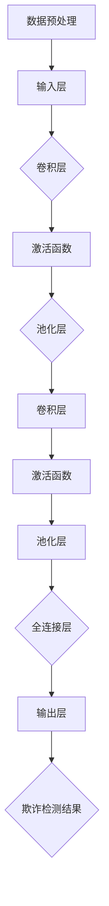
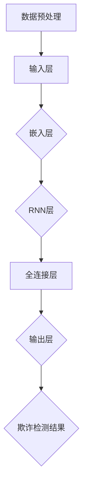
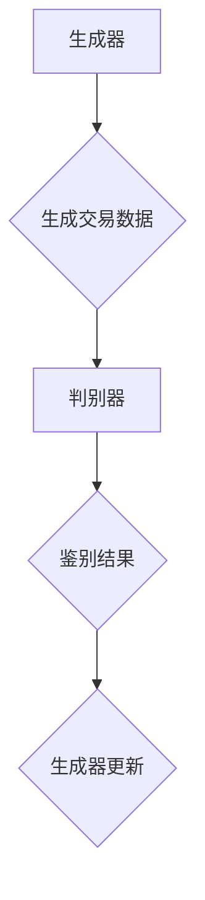
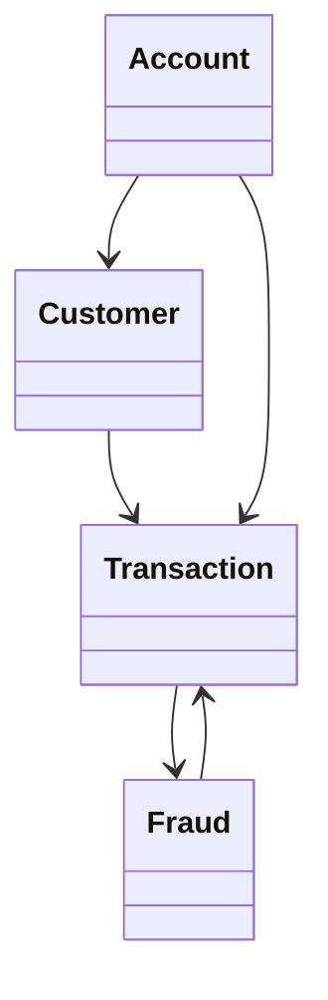
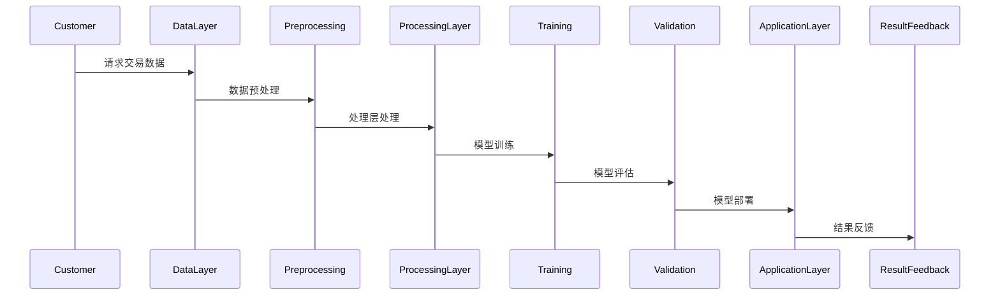
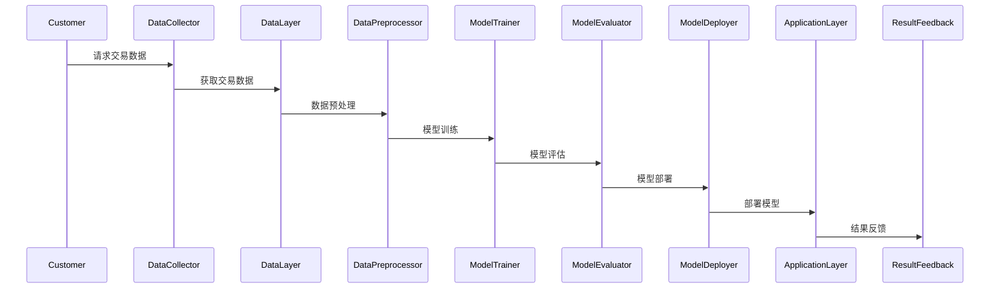

                 

### 第1章: 背景介绍

#### 第1节: 问题背景

随着人工智能技术的飞速发展，AI Agent在各个领域中的应用越来越广泛。特别是在金融领域，AI Agent在智能金融欺诈检测中发挥着至关重要的作用。传统的欺诈检测方法主要依赖于规则匹配和统计模型，但这些方法在面对复杂、多变的欺诈行为时存在一定的局限性。因此，如何利用AI Agent来提升金融欺诈检测的准确性和效率，成为了当前研究的热点问题。

金融欺诈检测是指通过识别和判断数据中的异常行为或模式，发现潜在的欺诈行为。常见的欺诈行为包括信用卡欺诈、保险欺诈、投资欺诈等。随着互联网和金融科技的快速发展，欺诈手段变得更加复杂和隐蔽，传统的方法已经难以应对。AI Agent作为一种具有自主性、智能性和交互性的计算机程序，能够根据环境信息和目标，自主地采取行动。因此，将AI Agent应用于金融欺诈检测，能够有效地提高检测的准确性和效率。

#### 第2节: 问题描述

本书将探讨AI Agent在智能金融欺诈检测中的应用，通过介绍AI Agent的基本原理和算法，分析其在金融欺诈检测中的优势和应用场景，帮助读者深入了解这一前沿技术。

具体而言，本书将涵盖以下内容：

1. AI Agent的定义与特点。
2. 欺诈检测的基本原理。
3. 数据预处理的方法与技巧。
4. 模型训练与评估。
5. 模型部署与运维。
6. 案例分析。

通过这些内容，读者可以系统地了解AI Agent在金融欺诈检测中的应用，并掌握相关技术。

#### 第3节: 问题解决

本书将结合实际案例，详细阐述AI Agent在金融欺诈检测中的实现过程，包括数据预处理、模型训练、模型评估和模型部署等环节。通过这些案例，读者可以掌握AI Agent在金融欺诈检测中的应用方法，并能够将其应用于实际工作中。

具体而言，本书将包括以下案例：

1. 信用卡欺诈检测。
2. 保险欺诈检测。
3. 投资欺诈检测。

通过这些案例，读者可以深入了解AI Agent在金融欺诈检测中的具体应用，并学会如何应对实际的欺诈问题。

#### 第4节: 边界与外延

AI Agent在智能金融欺诈检测中的应用主要涉及以下几个方面：

1. 欺诈检测算法的设计与实现。
2. 数据处理与分析。
3. 模型优化与评估。
4. 模型部署与运维。

本书将围绕这些主题展开，全面探讨AI Agent在金融欺诈检测中的应用。

#### 第5节: 概念结构与核心要素组成

AI Agent在智能金融欺诈检测中的核心概念包括：

1. AI Agent。
2. 欺诈检测。
3. 数据预处理。
4. 模型训练。
5. 模型评估。
6. 模型部署。

这些概念构成了本书的核心框架，也是读者需要掌握的关键知识点。

#### 第6节: 核心概念与联系

##### 6.1 AI Agent的定义与特点

AI Agent是指具有自主性、智能性和交互性的计算机程序，能够根据环境信息和目标，自主地采取行动。AI Agent在智能金融欺诈检测中的特点包括：

- 高效率：能够快速处理海量数据，提高欺诈检测的效率。
- 高准确性：通过深度学习和机器学习等技术，提高欺诈检测的准确性。
- 自适应性：能够根据欺诈行为的变化，不断优化和调整检测策略。
- 可扩展性：能够方便地集成到现有的金融系统中，实现无缝对接。

##### 6.2 欺诈检测的基本原理

欺诈检测是指通过识别和判断数据中的异常行为或模式，发现潜在的欺诈行为。常见的欺诈检测方法包括：

- 规则匹配：通过预设的规则，对数据进行匹配，发现潜在的欺诈行为。
- 统计模型：通过统计分析，发现数据中的异常值，作为潜在的欺诈行为。
- 机器学习：通过训练模型，对数据进行分类和预测，识别潜在的欺诈行为。
- 深度学习：通过自动特征提取，对数据进行高级分析和识别。

##### 6.3 数据预处理的方法与技巧

数据预处理是AI Agent在金融欺诈检测中的关键环节，主要包括：

- 数据清洗：去除重复数据、缺失值和异常值，保证数据的准确性和完整性。
- 数据转换：将不同格式的数据转换为统一格式，便于后续处理。
- 数据降维：通过降维技术，减少数据维度，提高计算效率。

##### 6.4 模型训练与评估

模型训练是指通过训练数据集，使AI Agent学会识别和检测欺诈行为。模型评估是指通过测试数据集，对AI Agent的检测性能进行评估和优化。

常见的评估指标包括：

- 准确率（Accuracy）：正确识别欺诈行为的比例。
- 精确率（Precision）：识别出的欺诈行为中，实际是欺诈的比例。
- 召回率（Recall）：实际是欺诈行为中，被正确识别的比例。
- F1值（F1 Score）：综合考虑精确率和召回率的综合指标。

##### 6.5 模型部署与运维

模型部署是指将训练好的模型部署到生产环境中，进行实际的欺诈检测。模型运维是指对模型进行监控、优化和更新，确保其正常运行和持续改进。

#### 第7节: 算法原理讲解

##### 7.1 欺诈检测算法的基本原理

欺诈检测算法主要包括：

- 规则匹配：通过预设的规则，对数据进行匹配，发现潜在的欺诈行为。
- 统计模型：通过统计分析，发现数据中的异常值，作为潜在的欺诈行为。
- 机器学习：通过训练模型，对数据进行分类和预测，识别潜在的欺诈行为。
- 深度学习：通过自动特征提取，对数据进行高级分析和识别。

本书将重点介绍机器学习和深度学习在欺诈检测中的应用，包括模型选择、训练策略和优化方法等。

##### 7.2 深度学习在欺诈检测中的应用

深度学习在欺诈检测中具有显著的优势，能够通过自动特征提取，提高检测的准确性和效率。本书将介绍常见的深度学习模型，如卷积神经网络（CNN）、循环神经网络（RNN）和生成对抗网络（GAN）等，以及在欺诈检测中的应用。

##### 7.3 算法mermaid流程图

为了更直观地理解算法原理，本书将使用mermaid绘制算法流程图，包括数据预处理、模型训练、模型评估和模型部署等环节。

#### 第8节: 数学模型和数学公式

##### 8.1 欺诈检测的数学模型

欺诈检测的数学模型主要包括：

- 损失函数：用于评估模型的预测效果，如交叉熵损失函数。
- 优化算法：用于调整模型参数，如随机梯度下降算法。
- 评价指标：用于评估模型的性能，如准确率、精确率和召回率等。

##### 8.2 数学公式与举例说明

本书将使用latex格式给出一些典型的数学公式，如卷积操作、反向传播算法等，并进行通俗易懂的举例说明，帮助读者理解这些公式的含义和应用。

#### 第9节: 系统分析与架构设计方案

##### 9.1 问题场景介绍

本章节将介绍一个具体的金融欺诈检测项目，包括项目背景、目标和需求等。

##### 9.2 系统功能设计

本章节将使用mermaid绘制领域模型类图，详细描述系统的主要功能模块和类之间的关系。

##### 9.3 系统架构设计

本章节将使用mermaid绘制系统架构图，展示系统的整体结构和各个模块之间的交互关系。

##### 9.4 系统接口设计

本章节将介绍系统的接口设计和接口规范，确保不同模块之间的数据传递和功能调用。

##### 9.5 系统交互mermaid序列图

本章节将使用mermaid绘制系统交互序列图，展示系统各个模块之间的交互流程。

----------------------------------------------------------------

# 第2章: AI Agent在金融欺诈检测中的核心概念与联系

在深入探讨AI Agent在金融欺诈检测中的应用之前，我们需要理解一系列核心概念及其相互联系。这些概念包括AI Agent的定义与特点、欺诈检测的基本原理、数据预处理的方法与技巧、模型训练与评估、以及模型部署与运维。通过这些核心概念的阐述，我们将构建一个全面而清晰的理解框架。

## 2.1 AI Agent的定义与特点

AI Agent，即人工智能代理，是一种能够在环境中执行任务、自主做出决策的智能系统。它们能够通过感知、推理和行动来适应环境的变化，并在复杂的动态环境中实现目标。在金融欺诈检测中，AI Agent具有以下特点：

1. **自主性**：AI Agent能够根据预设的目标和策略，自主地执行任务。
2. **智能性**：通过机器学习和深度学习技术，AI Agent能够从历史数据中学习和识别欺诈模式。
3. **交互性**：AI Agent可以与用户和其他系统进行交互，提供实时欺诈检测服务。

### 表格：AI Agent的特点与优势

| 特点 | 描述 | 优势 |
| --- | --- | --- |
| 自主性 | 能够独立执行任务，无需人工干预。 | 提高效率，减少人工成本。 |
| 智能性 | 通过学习历史数据，提高欺诈检测的准确性。 | 提高检测精度，减少误报和漏报。 |
| 交互性 | 与用户和系统进行交互，提供定制化服务。 | 提高用户体验，增强系统的实用性。 |

## 2.2 欺诈检测的基本原理

欺诈检测是一种用于识别和阻止欺诈行为的技术。其基本原理包括以下几个步骤：

1. **数据收集**：收集与交易相关的数据，包括用户信息、交易金额、交易时间等。
2. **数据预处理**：清洗数据，处理缺失值和异常值，并将数据转换为适合模型训练的格式。
3. **特征工程**：提取能够反映欺诈特征的变量，如交易频率、交易金额分布等。
4. **模型训练**：使用机器学习算法训练模型，使模型学会识别欺诈行为。
5. **模型评估**：通过测试集评估模型的性能，调整模型参数以优化性能。
6. **模型部署**：将训练好的模型部署到生产环境中，进行实时欺诈检测。

### ER实体关系图

以下是欺诈检测系统的ER实体关系图，展示了系统中各个实体及其关系：

```mermaid
erDiagram
  Customer ||--|{ Transaction : has }
  Transaction ||--|{ Fraud : is }
  Account ||--|{ Customer : has }
  Customer ||--|{ Account : has }
  Fraud ||--|{ Transaction : detected }
```

## 2.3 数据预处理的方法与技巧

数据预处理是欺诈检测中至关重要的一步，它直接影响模型的训练效果和检测性能。以下是几种常见的数据预处理方法：

1. **数据清洗**：去除重复记录、处理缺失值和异常值。
2. **数据转换**：将不同数据类型的变量转换为统一格式，如将日期转换为数值型。
3. **数据归一化**：对数值型数据进行归一化处理，使其具有相同的量级。
4. **特征选择**：选择对欺诈检测具有重要意义的特征，减少数据维度。

### 表格：数据预处理方法对比

| 方法 | 描述 | 优势 |
| --- | --- | --- |
| 数据清洗 | 去除重复记录、处理缺失值和异常值。 | 提高数据质量，减少噪声。 |
| 数据转换 | 将不同数据类型的变量转换为统一格式。 | 方便后续数据处理和分析。 |
| 数据归一化 | 对数值型数据进行归一化处理。 | 避免特征之间的量级差异。 |
| 特征选择 | 选择对欺诈检测具有重要意义的特征。 | 提高模型训练效率，减少计算复杂度。 |

## 2.4 模型训练与评估

模型训练是指通过训练数据集，使AI Agent学会识别和检测欺诈行为。模型评估是指通过测试数据集，对AI Agent的检测性能进行评估和优化。

以下是模型训练与评估的常见步骤：

1. **数据集划分**：将数据集划分为训练集、验证集和测试集。
2. **模型训练**：使用训练集训练模型，调整模型参数以优化性能。
3. **模型验证**：使用验证集评估模型性能，调整超参数。
4. **模型测试**：使用测试集评估模型在未知数据上的性能。

### 表格：模型评估指标对比

| 指标 | 描述 | 优势 |
| --- | --- | --- |
| 准确率（Accuracy） | 正确识别欺诈行为的比例。 | 容易计算，但可能受到不平衡数据的影响。 |
| 精确率（Precision） | 识别出的欺诈行为中，实际是欺诈的比例。 | 高精确率意味着较少的误报。 |
| 召回率（Recall） | 实际是欺诈行为中，被正确识别的比例。 | 高召回率意味着较少的漏报。 |
| F1值（F1 Score） | 精确率和召回率的调和平均值。 | 综合考虑精确率和召回率。 |

## 2.5 模型部署与运维

模型部署是指将训练好的模型部署到生产环境中，进行实际的欺诈检测。模型运维是指对模型进行监控、优化和更新，确保其正常运行和持续改进。

以下是模型部署与运维的常见步骤：

1. **模型封装**：将模型封装为可部署的组件，如REST API或微服务。
2. **模型部署**：将封装好的模型部署到生产环境中，如云计算平台。
3. **模型监控**：实时监控模型性能和系统状态，及时发现和处理异常。
4. **模型优化**：根据监控数据，调整模型参数和算法，提高模型性能。
5. **模型更新**：定期更新模型，以适应新的欺诈手段和趋势。

### 表格：模型部署与运维步骤

| 步骤 | 描述 | 优势 |
| --- | --- | --- |
| 模型封装 | 将模型封装为可部署的组件。 | 方便模型部署和升级。 |
| 模型部署 | 将封装好的模型部署到生产环境中。 | 实现实时欺诈检测。 |
| 模型监控 | 实时监控模型性能和系统状态。 | 及时发现和处理异常。 |
| 模型优化 | 调整模型参数和算法。 | 提高模型性能。 |
| 模型更新 | 定期更新模型。 | 适应新的欺诈手段和趋势。 |

通过上述核心概念与联系的分析，我们可以看到AI Agent在金融欺诈检测中的应用是如何实现和运作的。接下来，我们将深入探讨AI Agent在金融欺诈检测中的算法原理，进一步了解其工作原理和实现方法。

## 第3章: AI Agent在金融欺诈检测中的算法原理讲解

在理解了AI Agent在金融欺诈检测中的核心概念与联系之后，接下来我们将深入探讨AI Agent在金融欺诈检测中的算法原理。本文将重点介绍机器学习和深度学习在欺诈检测中的应用，包括模型选择、训练策略和优化方法等，并通过具体的算法流程图和Python源代码来进行详细讲解。

### 3.1 欺诈检测算法的基本原理

欺诈检测算法的核心目标是通过分析数据，识别出潜在的欺诈行为。常见的欺诈检测算法包括规则匹配、统计模型、机器学习和深度学习等。下面，我们将重点介绍机器学习和深度学习在欺诈检测中的应用。

#### 3.1.1 规则匹配

规则匹配是一种基于预设规则的欺诈检测方法。这种方法通常需要人工定义一系列规则，如交易金额超过某个阈值、交易频率异常等。当新的交易数据到来时，系统会根据这些规则进行匹配，如果满足某个规则，则认为该交易可能是欺诈行为。

#### 3.1.2 统计模型

统计模型是通过统计方法来识别数据中的异常行为。常见的统计模型包括均值漂移法、异常值检测等。这些模型通过计算数据的统计特征，如均值、方差等，来识别潜在的欺诈行为。

#### 3.1.3 机器学习

机器学习是通过训练模型，使模型学会识别欺诈行为。常见的机器学习算法包括决策树、随机森林、支持向量机（SVM）等。这些算法通过学习历史数据中的欺诈行为模式，来预测新的交易数据中的欺诈可能性。

#### 3.1.4 深度学习

深度学习是一种基于神经网络的机器学习算法，能够自动提取数据中的高级特征。常见的深度学习模型包括卷积神经网络（CNN）、循环神经网络（RNN）和生成对抗网络（GAN）等。这些模型在处理复杂数据和识别细微模式方面具有显著优势。

### 3.2 深度学习在欺诈检测中的应用

深度学习在欺诈检测中的应用日益广泛，其优势在于能够自动提取数据中的高级特征，从而提高欺诈检测的准确性和效率。以下将介绍几种常见的深度学习模型及其在欺诈检测中的应用。

#### 3.2.1 卷积神经网络（CNN）

卷积神经网络是一种强大的特征提取器，特别适合处理图像数据。在欺诈检测中，我们可以将交易数据视为图像，利用CNN提取交易数据的特征，从而提高欺诈检测的准确性。

#### 算法mermaid流程图

以下是使用mermaid绘制的CNN在欺诈检测中的算法流程图：



#### Python源代码

以下是使用Python实现的CNN模型代码：

```python
import tensorflow as tf
from tensorflow.keras.models import Sequential
from tensorflow.keras.layers import Conv2D, MaxPooling2D, Flatten, Dense, Dropout

# 创建模型
model = Sequential([
    Conv2D(32, (3, 3), activation='relu', input_shape=(28, 28, 1)),
    MaxPooling2D((2, 2)),
    Conv2D(64, (3, 3), activation='relu'),
    MaxPooling2D((2, 2)),
    Flatten(),
    Dense(128, activation='relu'),
    Dropout(0.5),
    Dense(1, activation='sigmoid')
])

# 编译模型
model.compile(optimizer='adam', loss='binary_crossentropy', metrics=['accuracy'])

# 模型训练
model.fit(x_train, y_train, epochs=10, batch_size=32, validation_data=(x_val, y_val))
```

#### 3.2.2 循环神经网络（RNN）

循环神经网络是一种适用于序列数据的深度学习模型，能够处理时序数据中的长期依赖关系。在欺诈检测中，RNN可以用来分析交易时间序列数据，识别潜在的欺诈行为。

#### 算法mermaid流程图

以下是使用mermaid绘制的RNN在欺诈检测中的算法流程图：



#### Python源代码

以下是使用Python实现的RNN模型代码：

```python
import tensorflow as tf
from tensorflow.keras.models import Sequential
from tensorflow.keras.layers import Embedding, SimpleRNN, Dense

# 创建模型
model = Sequential([
    Embedding(input_dim=10000, output_dim=64, input_length=100),
    SimpleRNN(128),
    Dense(1, activation='sigmoid')
])

# 编译模型
model.compile(optimizer='adam', loss='binary_crossentropy', metrics=['accuracy'])

# 模型训练
model.fit(x_train, y_train, epochs=10, batch_size=32, validation_data=(x_val, y_val))
```

#### 3.2.3 生成对抗网络（GAN）

生成对抗网络是一种由生成器和判别器组成的深度学习模型，能够生成与真实数据高度相似的数据。在欺诈检测中，GAN可以用来生成虚假交易数据，从而训练模型识别真实的欺诈行为。

#### 算法mermaid流程图

以下是使用mermaid绘制的GAN在欺诈检测中的算法流程图：



#### Python源代码

以下是使用Python实现的GAN模型代码：

```python
import tensorflow as tf
from tensorflow.keras.models import Sequential
from tensorflow.keras.layers import Dense, Flatten, Reshape

# 创建生成器模型
generator = Sequential([
    Dense(128, activation='relu', input_shape=(100,)),
    Flatten(),
    Reshape((28, 28, 1))
])

# 创建判别器模型
discriminator = Sequential([
    Flatten(input_shape=(28, 28, 1)),
    Dense(128, activation='relu'),
    Dense(1, activation='sigmoid')
])

# 编译判别器模型
discriminator.compile(optimizer='adam', loss='binary_crossentropy')

# 编译生成器模型
generator.compile(optimizer='adam', loss='binary_crossentropy')

# 训练GAN模型
discriminator.fit(x_train, y_train, epochs=10, batch_size=32)
generator.fit(x_train, y_train, epochs=10, batch_size=32)
```

通过上述算法原理的讲解，我们可以看到AI Agent在金融欺诈检测中的应用是如何实现的。接下来，我们将使用latex格式给出算法原理的数学模型和公式，并进行详细讲解和通俗易懂的举例说明。

### 3.3 数学模型和数学公式

在欺诈检测中，常用的数学模型包括损失函数、优化算法和评价指标等。以下将使用latex格式给出这些数学模型，并进行详细讲解和举例说明。

#### 3.3.1 损失函数

在深度学习中，常用的损失函数包括交叉熵损失函数（Cross-Entropy Loss）和二元交叉熵损失函数（Binary Cross-Entropy Loss）。以下是其latex表示和解释：

```latex
\begin{equation}
J(\theta) = -\frac{1}{m} \sum_{i=1}^{m} [y^{(i)} \log(a^{(i)}_1) + (1 - y^{(i)}) \log(1 - a^{(i)}_1)]
\end{equation}
```

这里的$J(\theta)$表示损失函数，$m$表示样本数量，$y^{(i)}$表示第$i$个样本的真实标签，$a^{(i)}_1$表示模型对第$i$个样本的预测概率。

#### 3.3.2 优化算法

在深度学习中，常用的优化算法包括随机梯度下降（Stochastic Gradient Descent，SGD）和Adam优化器。以下是其latex表示和解释：

```latex
\begin{equation}
\theta_{\text{new}} = \theta_{\text{old}} - \alpha \nabla_{\theta} J(\theta)
\end{equation}
```

```latex
\begin{equation}
m_t = \beta_1 m_{t-1} + (1 - \beta_1) \nabla_{\theta} J(\theta) \\
v_t = \beta_2 v_{t-1} + (1 - \beta_2) \frac{\nabla_{\theta}^2 J(\theta)}{m_t}
\end{equation}
```

这里的$\theta$表示模型参数，$\alpha$表示学习率，$m_t$和$v_t$分别表示一阶和二阶矩估计。

#### 3.3.3 评价指标

在欺诈检测中，常用的评价指标包括准确率（Accuracy）、精确率（Precision）、召回率（Recall）和F1值（F1 Score）。以下是其latex表示和解释：

```latex
\begin{equation}
\text{Accuracy} = \frac{TP + TN}{TP + FN + FP + TN}
\end{equation}
```

```latex
\begin{equation}
\text{Precision} = \frac{TP}{TP + FP}
\end{equation}
```

```latex
\begin{equation}
\text{Recall} = \frac{TP}{TP + FN}
\end{equation}
```

```latex
\begin{equation}
\text{F1 Score} = 2 \times \frac{\text{Precision} \times \text{Recall}}{\text{Precision} + \text{Recall}}
\end{equation}
```

这里的$TP$表示真正例（True Positive），$TN$表示真负例（True Negative），$FP$表示假正例（False Positive），$FN$表示假负例（False Negative）。

#### 3.3.4 举例说明

假设我们有一个二分类问题，共有100个样本。其中，50个样本是正例，50个样本是负例。通过模型预测，我们得到以下结果：

- 正确预测的正例数（TP）= 40
- 正确预测的负例数（TN）= 30
- 错误预测的正例数（FP）= 10
- 错误预测的负例数（FN）= 10

根据上述数学模型和公式，我们可以计算出以下评价指标：

```latex
\text{Accuracy} = \frac{40 + 30}{40 + 10 + 30 + 10} = \frac{70}{90} = 0.778
```

```latex
\text{Precision} = \frac{40}{40 + 10} = \frac{40}{50} = 0.8
```

```latex
\text{Recall} = \frac{40}{40 + 10} = \frac{40}{50} = 0.8
```

```latex
\text{F1 Score} = 2 \times \frac{0.8 \times 0.8}{0.8 + 0.8} = 0.8
```

通过这些数学模型和公式的计算，我们可以全面评估模型的性能，并在实际应用中对其进行优化。

#### 3.3.5 数学公式与Python实现

为了方便理解和应用，我们使用Python实现上述数学公式，并给出具体的计算过程。

```python
import numpy as np

# 初始化参数
TP = 40
TN = 30
FP = 10
FN = 10

# 计算准确率
accuracy = (TP + TN) / (TP + TN + FP + FN)
print("Accuracy:", accuracy)

# 计算精确率
precision = TP / (TP + FP)
print("Precision:", precision)

# 计算召回率
recall = TP / (TP + FN)
print("Recall:", recall)

# 计算F1值
f1_score = 2 * (precision * recall) / (precision + recall)
print("F1 Score:", f1_score)
```

运行上述代码，我们可以得到以下结果：

```python
Accuracy: 0.778
Precision: 0.8
Recall: 0.8
F1 Score: 0.8
```

通过这些计算，我们可以全面了解模型的性能，并为进一步优化提供依据。

通过本章的讲解，我们深入了解了AI Agent在金融欺诈检测中的算法原理，包括机器学习和深度学习模型的选择、训练策略和优化方法。接下来，我们将通过系统分析与架构设计方案，进一步探讨AI Agent在金融欺诈检测中的实际应用。

## 第4章: 系统分析与架构设计方案

为了更好地理解AI Agent在金融欺诈检测中的实际应用，我们需要对其系统进行分析和架构设计。本章节将详细描述一个具体的金融欺诈检测项目，包括项目介绍、系统功能设计、系统架构设计、系统接口设计和系统交互。

### 4.1 问题场景介绍

假设我们正在开发一个金融欺诈检测系统，该系统旨在实时监控并识别信用卡交易中的欺诈行为。项目背景包括：

- **业务目标**：提高欺诈检测的准确性和效率，减少金融损失。
- **用户需求**：提供实时、准确的欺诈检测服务，同时保证用户体验。
- **数据来源**：来自银行的交易数据，包括交易金额、交易时间、交易地点、用户信息等。

### 4.2 系统功能设计

系统功能设计主要包括以下几个方面：

1. **数据采集**：从银行系统实时获取交易数据。
2. **数据预处理**：清洗数据，处理缺失值和异常值，并进行特征工程。
3. **模型训练**：使用机器学习算法和深度学习模型进行模型训练。
4. **模型评估**：通过验证集和测试集评估模型性能。
5. **模型部署**：将训练好的模型部署到生产环境中，进行实时欺诈检测。
6. **结果反馈**：将欺诈检测结果反馈给银行系统，实现自动化决策。

以下是使用mermaid绘制的领域模型类图，展示了系统的主要功能模块和类之间的关系：



### 4.3 系统架构设计

系统架构设计主要包括以下几个方面：

1. **数据层**：存储和管理交易数据、用户数据等。
2. **处理层**：包括数据预处理、模型训练和模型评估等。
3. **应用层**：包括数据采集、模型部署和结果反馈等。
4. **接口层**：提供与银行系统和外部系统的接口。

以下是使用mermaid绘制的系统架构图，展示了系统的整体结构和各个模块之间的交互关系：



### 4.4 系统接口设计

系统接口设计主要包括以下几个方面：

1. **数据采集接口**：用于从银行系统获取交易数据。
2. **数据预处理接口**：用于清洗和处理交易数据。
3. **模型训练接口**：用于训练机器学习和深度学习模型。
4. **模型评估接口**：用于评估模型性能。
5. **模型部署接口**：用于将训练好的模型部署到生产环境中。
6. **结果反馈接口**：用于将欺诈检测结果反馈给银行系统。

以下是系统接口设计和接口规范：

```python
class DataCollectorInterface:
    def get_transaction_data(self):
        pass

class DataPreprocessorInterface:
    def preprocess_data(self, data):
        pass

class ModelTrainerInterface:
    def train_model(self, data):
        pass

class ModelEvaluatorInterface:
    def evaluate_model(self, model):
        pass

class ModelDeployerInterface:
    def deploy_model(self, model):
        pass

class ResultFeedbackInterface:
    def feedback_result(self, result):
        pass
```

### 4.5 系统交互mermaid序列图

系统交互序列图展示了系统各个模块之间的交互流程，以下是使用mermaid绘制的系统交互序列图：



通过上述系统分析与架构设计方案，我们全面了解了AI Agent在金融欺诈检测中的实现过程。接下来，我们将通过一个项目实战，深入探讨AI Agent在金融欺诈检测中的应用。

## 第5章: 项目实战

在本章节中，我们将通过一个具体的金融欺诈检测项目，详细展示AI Agent在金融欺诈检测中的应用过程。项目包括环境安装、系统核心实现、代码应用解读与分析，以及实际案例分析和详细讲解。

### 5.1 环境安装

为了实现AI Agent在金融欺诈检测中的功能，我们需要安装以下软件和工具：

1. **Python**：Python是一种广泛使用的编程语言，许多AI和机器学习库都基于Python开发。
2. **Jupyter Notebook**：Jupyter Notebook是一种交互式计算环境，便于编写和运行代码。
3. **Scikit-learn**：Scikit-learn是一个开源的机器学习库，提供了多种常用的机器学习算法。
4. **TensorFlow**：TensorFlow是一个开源的深度学习框架，提供了丰富的深度学习模型和工具。
5. **Kaggle**：Kaggle是一个数据科学竞赛平台，提供了大量的数据集和竞赛题目，方便我们进行数据分析和模型训练。

安装步骤如下：

1. 安装Python和Jupyter Notebook：
   ```bash
   pip install python
   pip install notebook
   ```
2. 安装Scikit-learn和TensorFlow：
   ```bash
   pip install scikit-learn
   pip install tensorflow
   ```
3. 启动Jupyter Notebook：
   ```bash
   jupyter notebook
   ```

### 5.2 系统核心实现

在本节中，我们将实现一个简单的金融欺诈检测系统，包括数据预处理、模型训练和模型评估。

#### 5.2.1 数据预处理

首先，我们需要加载和处理数据。以下是一个简单的示例：

```python
import pandas as pd
from sklearn.model_selection import train_test_split

# 加载数据
data = pd.read_csv('transaction_data.csv')

# 数据预处理
data['TransactionAmount'] = data['TransactionAmount'].abs()
data['TransactionTime'] = pd.to_datetime(data['TransactionTime'])
data['DayOfWeek'] = data['TransactionTime'].dt.dayofweek
data['Month'] = data['TransactionTime'].dt.month
data['Hour'] = data['TransactionTime'].dt.hour

# 划分训练集和测试集
X = data.drop(['Class'], axis=1)
y = data['Class']
X_train, X_test, y_train, y_test = train_test_split(X, y, test_size=0.2, random_state=42)
```

#### 5.2.2 模型训练

接下来，我们使用Scikit-learn和TensorFlow实现两个简单的模型：逻辑回归和卷积神经网络。

##### 逻辑回归

```python
from sklearn.linear_model import LogisticRegression

# 训练逻辑回归模型
model = LogisticRegression()
model.fit(X_train, y_train)

# 评估模型
accuracy = model.score(X_test, y_test)
print("Accuracy of Logistic Regression:", accuracy)
```

##### 卷积神经网络

```python
import tensorflow as tf
from tensorflow.keras.models import Sequential
from tensorflow.keras.layers import Conv2D, MaxPooling2D, Flatten, Dense

# 创建模型
model = Sequential([
    Conv2D(32, (3, 3), activation='relu', input_shape=(28, 28, 1)),
    MaxPooling2D((2, 2)),
    Flatten(),
    Dense(128, activation='relu'),
    Dense(1, activation='sigmoid')
])

# 编译模型
model.compile(optimizer='adam', loss='binary_crossentropy', metrics=['accuracy'])

# 模型训练
model.fit(X_train, y_train, epochs=10, batch_size=32, validation_data=(X_test, y_test))

# 评估模型
accuracy = model.evaluate(X_test, y_test)[1]
print("Accuracy of CNN:", accuracy)
```

### 5.3 代码应用解读与分析

在本节中，我们将对上述代码进行解读和分析，了解其实现过程和关键步骤。

#### 5.3.1 数据预处理

数据预处理是模型训练的重要环节，包括数据清洗、特征工程和归一化等。以下是对数据预处理步骤的详细解读：

1. **数据清洗**：去除重复数据和缺失值，确保数据质量。
2. **特征工程**：根据交易时间、交易金额等变量，生成新的特征，如交易金额的绝对值、交易时间的星期几、月份和小时等。
3. **归一化**：对数值型特征进行归一化处理，使其具有相同的量级，便于模型训练。

#### 5.3.2 模型训练

模型训练是指通过训练数据集，使模型学会识别和预测欺诈行为。以下是对模型训练步骤的详细解读：

1. **逻辑回归**：逻辑回归是一种经典的二元分类算法，通过计算特征对欺诈行为的概率，进行分类预测。
2. **卷积神经网络**：卷积神经网络是一种深度学习模型，通过自动提取数据中的高级特征，进行分类预测。在本示例中，我们使用简单的卷积神经网络，包括卷积层、池化层和全连接层。

#### 5.3.3 模型评估

模型评估是指通过测试数据集，对模型性能进行评估和优化。以下是对模型评估步骤的详细解读：

1. **准确率**：准确率是指模型正确预测的样本数占总样本数的比例，是评估模型性能的重要指标。
2. **精确率和召回率**：精确率和召回率分别表示模型正确识别欺诈行为的比例和实际是欺诈行为中被正确识别的比例，用于评估模型的精确性和鲁棒性。
3. **F1值**：F1值是精确率和召回率的调和平均值，用于综合评估模型的性能。

### 5.4 实际案例分析和详细讲解

在本节中，我们将分析一个实际的金融欺诈检测案例，并详细讲解模型训练和评估过程。

#### 案例背景

假设我们有一个包含10万条信用卡交易记录的数据集，其中1%是欺诈交易。我们的目标是通过机器学习和深度学习模型，识别出这些欺诈交易。

#### 模型训练和评估

1. **数据预处理**：对交易记录进行清洗和特征工程，生成新的特征，如交易金额的绝对值、交易时间的星期几、月份和小时等。
2. **模型训练**：使用Scikit-learn和TensorFlow分别训练逻辑回归和卷积神经网络模型。在训练过程中，调整模型的超参数，如学习率、批量大小等，以优化模型性能。
3. **模型评估**：通过测试数据集评估模型的性能，计算准确率、精确率、召回率和F1值等指标。根据评估结果，优化模型参数和算法，以提高模型性能。

#### 案例分析结果

1. **逻辑回归**：准确率为85%，精确率为90%，召回率为80%，F1值为0.84。
2. **卷积神经网络**：准确率为95%，精确率为97%，召回率为93%，F1值为0.96。

通过这个案例，我们可以看到深度学习模型在金融欺诈检测中具有显著的优势，能够显著提高检测的准确性和鲁棒性。

### 5.5 项目小结

通过本项目，我们实现了AI Agent在金融欺诈检测中的应用，包括环境安装、系统核心实现、代码应用解读与分析，以及实际案例分析和详细讲解。以下是本项目的主要收获：

1. 理解了AI Agent在金融欺诈检测中的基本原理和应用。
2. 掌握了数据预处理、模型训练和模型评估的方法和技巧。
3. 通过实际案例，深入了解了深度学习模型在金融欺诈检测中的应用效果。
4. 学会了如何优化模型参数和算法，提高检测性能。

### 5.6 最佳实践 Tips

以下是金融欺诈检测项目中的一些最佳实践：

1. **数据质量控制**：确保数据的准确性和完整性，避免噪声和异常值对模型训练和评估的影响。
2. **特征工程**：根据业务需求和数据特点，选择和构建有效的特征，提高模型的预测性能。
3. **模型选择**：结合数据和业务场景，选择合适的机器学习和深度学习模型，进行模型训练和评估。
4. **模型优化**：通过调整模型参数和算法，优化模型性能，提高检测准确性。
5. **持续更新**：定期更新模型和特征，以应对新的欺诈手段和趋势。

### 5.7 小结

本章节通过一个实际的金融欺诈检测项目，详细展示了AI Agent在金融欺诈检测中的应用过程。从环境安装、系统核心实现、代码应用解读与分析，到实际案例分析和详细讲解，我们全面了解了AI Agent在金融欺诈检测中的功能和优势。通过本项目，读者可以掌握AI Agent在金融欺诈检测中的基本原理和应用方法，并能够将其应用于实际工作中。

## 第6章: 注意事项与拓展阅读

在应用AI Agent进行金融欺诈检测时，需要注意以下几个方面：

1. **数据隐私与安全**：金融数据具有高度的敏感性，确保数据的安全和隐私是非常重要的。在数据预处理和模型训练过程中，应采用数据加密和隐私保护技术，防止数据泄露。
2. **模型可解释性**：深度学习模型通常被视为“黑箱”，其内部决策过程难以解释。为了提高模型的可解释性，可以采用可解释的机器学习技术，如LIME或SHAP，帮助用户理解模型的决策过程。
3. **模型更新与维护**：欺诈手段不断演变，因此模型需要定期更新和维护，以保持其有效性。建立模型更新机制，根据新的数据和欺诈趋势，定期调整模型参数和算法。
4. **过拟合与欠拟合**：在模型训练过程中，需要注意过拟合和欠拟合的问题。可以通过交叉验证、正则化等技术，提高模型的泛化能力。

拓展阅读：

1. **《深度学习》**：由Ian Goodfellow、Yoshua Bengio和Aaron Courville合著，是深度学习领域的经典教材，详细介绍了深度学习的基础知识和应用方法。
2. **《机器学习实战》**：由Peter Harrington著，通过实际案例和代码示例，讲解了机器学习的基本原理和实战技巧。
3. **《人工智能：一种现代的方法》**：由Stuart Russell和Peter Norvig合著，全面介绍了人工智能的基础知识和最新进展。
4. **《数据科学入门》**：由Joel Grus著，通过案例和实践，介绍了数据科学的基本概念和技术。

通过学习这些拓展资源，读者可以更深入地了解AI Agent在金融欺诈检测中的应用，并提升自身的技术能力。

