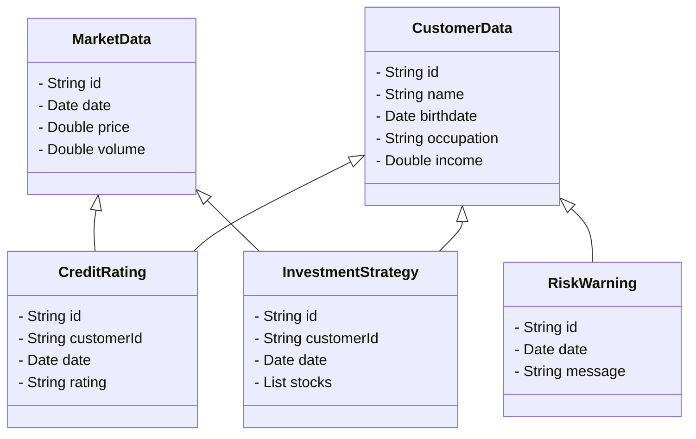
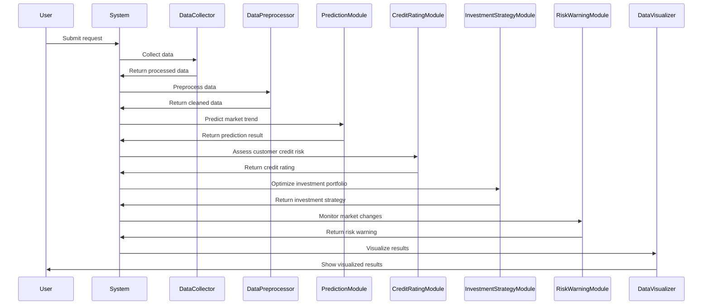
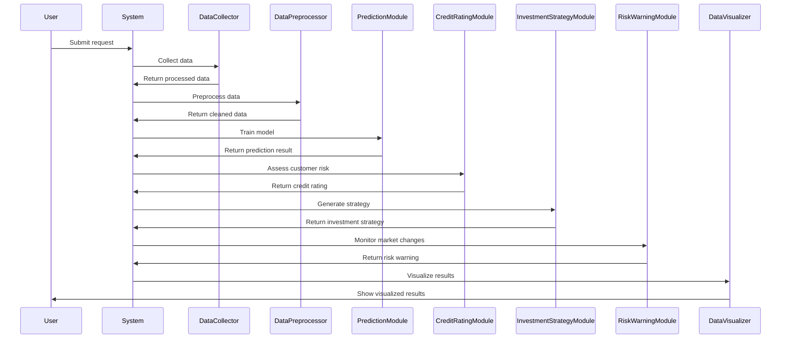

                 

### 第1章: 智能金融风险评估背景

#### 1.1 问题的提出

随着金融市场的日益复杂化和全球化，传统的金融风险评估方法已经显得力不从心。金融市场中的数据量庞大且多样，包含历史数据、实时数据、市场情绪数据等，如何高效地处理和分析这些数据，从而做出准确的风险评估，成为金融行业面临的一个重要挑战。

##### 1.1.1 金融风险评估的挑战

- **数据复杂性**：金融市场的数据类型繁多，包括但不限于财务数据、市场数据、客户行为数据等。这些数据通常具有高维度、非线性、非结构化等特点，传统的方法很难对这些数据进行有效的分析和处理。
- **实时性要求**：金融市场的变化速度极快，往往需要在短时间内对市场情况进行评估，以便及时做出相应的决策。因此，对风险评估系统的实时性要求非常高。
- **准确性要求**：金融风险评估的准确性直接关系到金融机构的生存和发展。一旦风险评估出现偏差，可能导致巨大的经济损失。

##### 1.1.2 AI Agent的优势

AI Agent，即人工智能代理，是一种能够模拟人类决策过程的软件系统。它具有以下几个优势，使其在金融风险评估中具有显著的应用前景：

- **自动化分析**：AI Agent能够自动处理大量数据，进行复杂的分析。它可以利用机器学习算法，从历史数据中学习规律，预测未来的市场变化。
- **实时性**：AI Agent可以实时监测市场变化，快速提供风险评估结果。它不受时间限制，可以随时随地进行风险评估。
- **高准确性**：通过不断的学习和优化，AI Agent可以在不断变化的市场环境中提高风险评估的准确性。它能够适应市场的变化，提供更加精确的预测。

#### 1.2 智能金融风险评估的必要性

- **合规要求**：随着金融监管的不断加强，金融机构需要满足越来越多的合规要求。智能金融风险评估可以帮助金融机构更好地遵守监管要求，降低合规风险。
- **风险管理**：智能金融风险评估可以帮助金融机构更准确地识别和管理风险，降低风险敞口。通过实时监测市场变化，AI Agent可以及时预警潜在的风险，帮助金融机构做出更明智的决策。
- **业务创新**：智能金融风险评估为金融机构提供了创新的业务模式。例如，通过AI Agent提供的个性化投资建议，金融机构可以为客户提供更加精准的投资策略，提高客户满意度。

#### 1.3 AI Agent在金融领域的应用现状

目前，AI Agent在金融领域已经有了广泛的应用。以下是一些具体的案例：

- **信用评分**：金融机构使用AI Agent对客户的信用进行评分，帮助金融机构做出更准确的贷款决策。
- **市场预测**：AI Agent通过分析市场数据，预测市场走势，为投资决策提供支持。例如，AI Agent可以预测股票价格、汇率变动等。
- **欺诈检测**：AI Agent能够识别和预防金融欺诈行为，保护金融机构的资产安全。例如，AI Agent可以检测信用卡欺诈、洗钱等行为。

总的来说，AI Agent在金融风险评估中的应用已经成为金融行业的一个热点，它为金融机构提供了更加智能化、高效化的风险评估手段。然而，随着AI技术的发展，AI Agent在金融领域的应用也将面临更多的挑战和机遇。

### 第2章: AI Agent基础理论

#### 2.1 AI Agent的定义与分类

AI Agent是一种能够模拟人类决策过程的软件系统，它在给定环境中，根据预设的目标和规则，自主地采取行动。AI Agent的基本特点包括：

- **自主性**：AI Agent具有自主决策能力，可以独立完成特定任务。
- **适应性**：AI Agent能够根据环境变化进行调整，以适应新的情况。
- **协作性**：AI Agent可以与其他Agent协同工作，共同完成任务。

根据不同的分类标准，AI Agent可以划分为不同的类型：

- **按功能分类**：AI Agent可以分为反应式Agent、认知Agent和混合型Agent。
  - **反应式Agent**：仅根据当前环境感知直接做出反应，不考虑历史和环境变化。
  - **认知Agent**：通过学习和模拟环境，预测未来环境变化，做出长期决策。
  - **混合型Agent**：结合反应式Agent和认知Agent的优点，实现更高效的决策。
  
- **按任务分类**：AI Agent可以分为单一任务Agent和复合任务Agent。
  - **单一任务Agent**：专注于完成特定任务，如信用评分、市场预测等。
  - **复合任务Agent**：能够同时完成多个任务，如风险管理、投资决策等。

- **按环境分类**：AI Agent可以分为确定环境Agent和不确定环境Agent。
  - **确定环境Agent**：在稳定、可预测的环境中运行，如静态市场数据分析。
  - **不确定环境Agent**：在复杂、多变的环境中运行，如动态市场变化预测。

#### 2.2 人工智能在金融领域的应用

人工智能在金融领域的应用已经取得了显著成果，以下是一些主要的应用场景：

- **数据分析**：人工智能可以帮助金融机构处理和分析大量金融数据，包括历史数据、实时数据和市场情绪数据等。通过数据挖掘和机器学习算法，人工智能可以识别出潜在的风险和机会。
- **风险预测**：人工智能可以预测金融市场中的潜在风险，如信用风险、市场风险和操作风险等。通过分析历史数据和市场动态，人工智能可以提供更准确的预测结果，帮助金融机构做出更明智的决策。
- **自动化交易**：人工智能可以自动化交易过程，根据市场数据和预测结果，自动执行买卖操作。这种自动化交易可以提高交易效率，降低交易成本，同时减少人为错误。
- **个性化服务**：人工智能可以根据客户的行为和偏好，提供个性化的金融服务。例如，人工智能可以为客户提供个性化的投资建议、贷款建议和风险管理方案。

#### 2.3 AI Agent的架构与关键技术

AI Agent通常由以下几个关键组成部分构成：

- **感知模块**：负责感知环境中的信息，如金融市场数据、客户行为数据等。感知模块可以采用数据采集、数据清洗和数据预处理等技术。
- **决策模块**：根据感知模块获取的信息，以及预设的目标和规则，进行决策。决策模块可以采用机器学习、深度学习、决策树等算法。
- **执行模块**：根据决策模块的决策结果，执行相应的操作，如交易执行、风险预警等。执行模块可以与金融系统、数据库等进行交互。
- **学习模块**：通过不断的学习和优化，提高AI Agent的性能和准确性。学习模块可以采用强化学习、迁移学习、在线学习等技术。

在实现AI Agent的过程中，以下关键技术至关重要：

- **机器学习**：机器学习是AI Agent的核心技术，它可以帮助AI Agent从数据中学习规律，预测未来的市场变化。常见的机器学习算法包括线性回归、逻辑回归、支持向量机、决策树、随机森林等。
- **深度学习**：深度学习是一种特殊的机器学习技术，它可以自动提取数据中的特征，实现更复杂的预测任务。常见的深度学习模型包括神经网络、卷积神经网络、循环神经网络等。
- **自然语言处理**：自然语言处理（NLP）技术可以帮助AI Agent理解和处理自然语言，如文本分析和情感分析等。NLP技术可以提高AI Agent的交互能力，使其更好地理解用户的需求和意图。
- **强化学习**：强化学习是一种基于奖励机制的学习方法，它可以帮助AI Agent在动态环境中做出最优决策。强化学习在金融领域的应用，如自动交易、投资组合优化等，具有广泛的前景。

总的来说，AI Agent在金融领域的应用，为金融机构提供了更加智能化、高效化的解决方案。随着人工智能技术的不断发展，AI Agent在金融领域中的应用前景将更加广阔。

### 第3章: 智能金融风险评估中的AI Agent应用

#### 3.1 AI Agent在市场趋势预测中的应用

市场趋势预测是金融风险评估的重要环节，它可以帮助金融机构提前识别市场变化，制定相应的策略。AI Agent通过机器学习算法，可以对大量市场数据进行深入分析，从而预测未来的市场走势。

##### 3.1.1 工作原理

AI Agent在市场趋势预测中的工作原理主要包括以下几个步骤：

1. **数据采集**：AI Agent首先从多个数据源采集市场数据，包括历史价格、交易量、市场情绪等。
2. **数据预处理**：采集到的市场数据往往存在噪声和不完整性，AI Agent需要对这些数据进行分析和清洗，以便为后续的预测模型提供高质量的数据。
3. **特征提取**：AI Agent从预处理后的数据中提取出有意义的特征，如价格的平均值、波动性等。这些特征将作为输入，提供给预测模型。
4. **模型训练**：AI Agent使用机器学习算法，如神经网络、支持向量机等，对提取出的特征进行训练，以建立预测模型。
5. **趋势预测**：训练好的预测模型将输入数据转换为市场趋势预测结果。AI Agent可以根据预测结果，提前调整投资策略，以应对市场变化。

##### 3.1.2 应用实例

以下是一个AI Agent在市场趋势预测中的具体应用实例：

- **场景**：某投资公司需要预测某股票的未来走势。
- **数据**：AI Agent采集了过去一年的股票价格、交易量和市场情绪数据。
- **模型**：AI Agent使用神经网络模型进行训练，模型输入包括股票价格的平均值、波动性等特征。
- **结果**：训练好的模型预测了未来一个月的股票价格走势。根据预测结果，投资公司调整了投资策略，成功避开了即将到来的市场波动，实现了投资收益的最大化。

##### 3.1.3 优势与挑战

AI Agent在市场趋势预测中的应用具有以下优势：

- **高效性**：AI Agent可以处理大量的市场数据，快速提供预测结果。
- **准确性**：通过不断学习和优化，AI Agent可以提高市场趋势预测的准确性。
- **实时性**：AI Agent可以实时监测市场变化，提供及时的预测结果。

然而，AI Agent在市场趋势预测中也面临一些挑战：

- **数据质量**：市场数据的质量直接影响到预测结果的准确性。如果数据存在噪声或不完整性，AI Agent的预测结果可能会受到干扰。
- **模型过拟合**：AI Agent的模型训练过程可能会出现过拟合现象，导致在新的数据上表现不佳。
- **模型解释性**：AI Agent的预测结果往往具有较高复杂性，难以解释其背后的原因，这对金融机构的决策带来一定挑战。

总的来说，AI Agent在市场趋势预测中的应用具有广泛的前景，但也需要不断优化和改进，以克服现有的挑战。

#### 3.2 AI Agent在信用风险评估中的应用

信用风险评估是金融领域中一个关键问题，它直接关系到金融机构的贷款决策和风险管理。AI Agent通过机器学习算法，可以对客户的信用行为进行分析，从而更准确地评估客户的信用风险。

##### 3.2.1 工作原理

AI Agent在信用风险评估中的工作原理主要包括以下几个步骤：

1. **数据采集**：AI Agent从多个数据源采集客户的信用信息，包括信用记录、财务状况、社会关系等。
2. **数据预处理**：AI Agent对采集到的信用信息进行分析和清洗，去除噪声和缺失值，以便为后续的预测模型提供高质量的数据。
3. **特征提取**：AI Agent从预处理后的数据中提取出有意义的特征，如信用评分、债务水平、还款能力等。这些特征将作为输入，提供给预测模型。
4. **模型训练**：AI Agent使用机器学习算法，如逻辑回归、支持向量机等，对提取出的特征进行训练，以建立信用风险评估模型。
5. **风险评分**：训练好的模型将输入数据转换为信用风险评分结果。AI Agent可以根据风险评分，对客户进行信用评级，为金融机构的贷款决策提供支持。

##### 3.2.2 应用实例

以下是一个AI Agent在信用风险评估中的具体应用实例：

- **场景**：某银行需要评估客户的信用风险，以便做出贷款决策。
- **数据**：AI Agent采集了客户的信用记录、财务状况、社会关系等数据。
- **模型**：AI Agent使用逻辑回归模型进行训练，模型输入包括信用评分、债务水平等特征。
- **结果**：训练好的模型对客户进行了信用评分，根据评分结果，银行决定是否批准贷款申请。在AI Agent的帮助下，银行成功降低了贷款违约率，提高了风险管理效率。

##### 3.2.3 优势与挑战

AI Agent在信用风险评估中的应用具有以下优势：

- **准确性**：AI Agent可以通过学习历史数据，提高信用风险评估的准确性，减少贷款违约率。
- **高效性**：AI Agent可以处理大量的客户数据，快速提供信用风险评估结果。
- **可扩展性**：AI Agent可以根据新的数据源和特征，不断优化和更新信用风险评估模型。

然而，AI Agent在信用风险评估中也面临一些挑战：

- **数据隐私**：客户的信用信息属于敏感数据，如何确保数据的安全性和隐私性是AI Agent面临的一个重要问题。
- **模型解释性**：AI Agent的预测结果往往具有较高复杂性，难以解释其背后的原因，这可能会影响金融机构的信任和决策。
- **模型偏见**：AI Agent的模型训练过程可能会引入偏见，导致对某些群体的评估不准确。

总的来说，AI Agent在信用风险评估中的应用具有显著优势，但也需要解决现有的挑战，以更好地服务于金融行业。

#### 3.3 AI Agent在投资组合优化中的应用

投资组合优化是金融领域中一个关键问题，它关系到投资者的收益和风险。AI Agent通过机器学习算法，可以对大量投资数据进行深入分析，从而实现投资组合的优化。

##### 3.3.1 工作原理

AI Agent在投资组合优化中的工作原理主要包括以下几个步骤：

1. **数据采集**：AI Agent从多个数据源采集投资数据，包括股票价格、收益率、风险等。
2. **数据预处理**：AI Agent对采集到的投资数据进行清洗和标准化处理，以便为后续的预测模型提供高质量的数据。
3. **特征提取**：AI Agent从预处理后的数据中提取出有意义的特征，如股票的历史价格、收益率、波动性等。这些特征将作为输入，提供给预测模型。
4. **模型训练**：AI Agent使用机器学习算法，如线性回归、支持向量机等，对提取出的特征进行训练，以建立投资组合优化模型。
5. **投资策略生成**：训练好的模型将输入数据转换为投资组合策略。AI Agent可以根据投资策略，调整投资组合的权重，以实现最优的收益和风险平衡。

##### 3.3.2 应用实例

以下是一个AI Agent在投资组合优化中的具体应用实例：

- **场景**：某投资者需要优化其投资组合，以实现更高的收益和更低的风险。
- **数据**：AI Agent采集了过去一年的股票价格、收益率、波动性等数据。
- **模型**：AI Agent使用支持向量机模型进行训练，模型输入包括股票的历史价格、收益率等特征。
- **结果**：训练好的模型为投资者生成了最优的投资组合策略，根据策略，投资者成功实现了更高的收益，同时降低了风险。

##### 3.3.3 优势与挑战

AI Agent在投资组合优化中的应用具有以下优势：

- **准确性**：AI Agent可以通过学习历史数据，提高投资组合优化的准确性，实现更高的收益。
- **高效性**：AI Agent可以处理大量的投资数据，快速生成投资组合策略。
- **自适应能力**：AI Agent可以根据市场的变化，动态调整投资组合策略，以适应新的市场环境。

然而，AI Agent在投资组合优化中也面临一些挑战：

- **数据质量**：投资数据的质量直接影响投资组合优化的效果。如果数据存在噪声或不完整性，AI Agent的优化结果可能会受到干扰。
- **模型复杂性**：投资组合优化模型的复杂性较高，如何简化模型，提高解释性是一个重要问题。
- **模型过拟合**：AI Agent的模型训练过程可能会出现过拟合现象，导致在新的数据上表现不佳。

总的来说，AI Agent在投资组合优化中的应用具有显著优势，但也需要解决现有的挑战，以更好地服务于金融行业。

### 第4章: 智能金融风险评估系统的设计与实现

#### 4.1 系统需求分析

智能金融风险评估系统的设计首先需要明确系统的需求。这些需求可以分为功能需求和非功能需求两部分。

##### 4.1.1 功能需求

1. **市场趋势预测**：系统能够对金融市场的未来走势进行预测，提供市场动态分析。
2. **信用风险评估**：系统能够对客户的信用行为进行分析，提供信用评分和信用评级。
3. **投资组合优化**：系统能够根据客户的投资目标和风险偏好，生成最优的投资组合策略。
4. **风险预警**：系统能够实时监测市场变化，及时发现潜在的风险，并提供预警信息。
5. **数据可视化**：系统提供直观的数据可视化功能，帮助用户更好地理解评估结果。

##### 4.1.2 非功能需求

1. **可靠性**：系统需具有高可靠性，能够稳定运行，确保评估结果的准确性。
2. **实时性**：系统需具备实时性，能够快速响应当前市场的变化，提供及时的评估结果。
3. **安全性**：系统需确保数据的安全性和隐私性，防止数据泄露和滥用。
4. **可扩展性**：系统需具备良好的扩展性，能够适应未来的需求变化，增加新的功能模块。

#### 4.2 系统功能设计

智能金融风险评估系统的功能设计主要包括以下几个模块：

1. **数据采集模块**：负责从多个数据源采集市场数据、客户数据等，为后续的分析提供数据支持。
2. **数据预处理模块**：负责对采集到的数据进行清洗、标准化处理，去除噪声和缺失值，提高数据质量。
3. **市场趋势预测模块**：利用机器学习算法，对市场数据进行分析，预测未来的市场走势。
4. **信用风险评估模块**：利用机器学习算法，对客户的数据进行分析，提供信用评分和信用评级。
5. **投资组合优化模块**：根据客户的投资目标和风险偏好，生成最优的投资组合策略。
6. **风险预警模块**：实时监测市场变化，及时发现潜在的风险，并提供预警信息。
7. **数据可视化模块**：提供数据可视化功能，帮助用户更好地理解评估结果。

##### 4.2.1 领域模型设计

领域模型是系统功能设计的重要组成部分，它定义了系统的核心概念和实体关系。以下是一个简单的领域模型设计：



#### 4.3 系统架构设计

智能金融风险评估系统的架构设计需要考虑系统的可扩展性、可靠性和性能。以下是一个简单的系统架构设计：



#### 4.4 系统接口设计

系统接口设计是系统架构设计的重要组成部分，它定义了系统内部模块之间的交互方式。以下是一个简单的系统接口设计：

```mermaid
classDiagram
    class IDataCollector {
        - IDataPreprocessor Preprocessor
        + CollectData(data: Data): ProcessedData
    }
    class IDataPreprocessor {
        - ProcessData(data: Data): CleanedData
    }
    class IPredictionModule {
        - TrainModel(data: Data): Model
        + Predict(data: Data): PredictionResult
    }
    class ICreditRatingModule {
        - AssessRisk(data: Data): CreditRatingResult
    }
    class IInvestmentStrategyModule {
        - GenerateStrategy(data: Data): InvestmentStrategyResult
    }
    class IRiskWarningModule {
        - MonitorChanges(data: Data): RiskWarningResult
    }
    class IDataVisualizer {
        - Visualize(result: Result): Visualization
    }
    IDataCollector <--|olveDataCollector
    IDataPreprocessor <--|> DataPreprocessor
    IPredictionModule <--|> PredictionModule
    ICreditRatingModule <--|> CreditRatingModule
    IInvestmentStrategyModule <--|> InvestmentStrategyModule
    IRiskWarningModule <--|> RiskWarningModule
    IDataVisualizer <--|> DataVisualizer
```

#### 4.5 系统交互设计

系统交互设计描述了系统内部模块之间的交互过程和消息传递。以下是一个简单的系统交互设计：



通过上述设计与实现，智能金融风险评估系统可以为金融机构提供高效、准确的评估服务，帮助其更好地进行风险管理和投资决策。

### 第5章: AI Agent在智能金融风险评估中的案例分析

#### 5.1 案例一：某银行信用风险评估系统

在某银行信用风险评估系统的实际应用中，AI Agent发挥了重要作用，通过机器学习算法对客户的信用行为进行深入分析，从而提供了准确的信用评分和评级。

##### 5.1.1 项目介绍

该银行信用风险评估系统是一个集成了AI Agent的智能风险评估平台，旨在提高信用风险评估的准确性和效率。系统采用了先进的机器学习技术和大数据分析能力，能够从海量的客户数据中提取关键特征，进行信用风险评估。

##### 5.1.2 系统功能设计

- **数据采集**：系统从多个数据源采集客户的信用信息，包括信用记录、财务状况、社会关系等。
- **数据预处理**：系统对采集到的数据进行清洗和标准化处理，确保数据质量。
- **信用评分**：系统使用逻辑回归、随机森林等机器学习算法，对客户的信用行为进行分析，生成信用评分。
- **信用评级**：系统根据信用评分，将客户划分为不同的信用等级，如优质客户、一般客户和风险客户。
- **风险预警**：系统实时监测客户的行为变化，发现潜在的风险，并生成风险预警信息。

##### 5.1.3 系统架构设计

该系统的架构设计采用了分布式计算和数据存储方案，确保系统的高性能和高可靠性。核心模块包括：

- **数据采集模块**：负责从多个数据源采集客户信息。
- **数据预处理模块**：负责对采集到的客户信息进行清洗和标准化处理。
- **机器学习模块**：负责使用机器学习算法进行信用评分和信用评级。
- **风险预警模块**：负责实时监测客户行为，生成风险预警信息。
- **数据存储模块**：负责存储客户信息和评估结果。

##### 5.1.4 系统接口设计和系统交互设计

系统接口设计采用了RESTful API设计，提供了便捷的接口供其他系统调用。系统交互设计采用了事件驱动模式，实现了模块之间的松耦合和高效通信。

##### 5.1.5 代码应用解读与分析

以下是系统核心代码的解读与分析：

```python
# 数据采集模块
def collect_data(source):
    data = []
    for record in source:
        data.append(process_record(record))
    return data

# 数据预处理模块
def process_record(record):
    # 数据清洗和标准化处理
    return cleaned_record

# 信用评分模块
def credit_score(data):
    model = LogisticRegression()
    model.fit(data['X'], data['y'])
    score = model.predict(data['X'])
    return score

# 信用评级模块
def credit_rating(score):
    if score > 0.7:
        return '优质客户'
    elif score > 0.3:
        return '一般客户'
    else:
        return '风险客户'

# 风险预警模块
def risk_warning(data):
    if data['score'] < 0.3:
        return '风险预警'
    return '正常'
```

通过上述代码，可以看到AI Agent在信用风险评估系统中的应用，从数据采集、预处理、信用评分到信用评级，实现了自动化的风险评估过程。此外，系统还具备实时风险预警功能，能够及时发现潜在的风险。

##### 5.1.6 案例小结

该银行信用风险评估系统通过AI Agent的应用，大幅提高了信用风险评估的准确性和效率，有效降低了银行的信用风险。系统实现了自动化风险评估，减少了人工干预，提高了决策的准确性。同时，系统的实时风险预警功能，使银行能够及时应对潜在风险，确保了金融市场的稳定。

#### 5.2 案例二：某保险公司投资组合优化系统

在某保险公司投资组合优化系统中，AI Agent通过机器学习算法，对投资数据进行深入分析，为投资者提供了最优的投资组合策略，实现了投资收益的最大化。

##### 5.2.1 项目介绍

该保险公司投资组合优化系统旨在帮助保险公司实现投资组合的优化，提高投资收益。系统集成了AI Agent，通过分析历史投资数据和市场动态，为投资者提供个性化的投资建议。

##### 5.2.2 系统功能设计

- **数据采集**：系统从多个数据源采集投资数据，包括股票价格、收益率、波动性等。
- **数据预处理**：系统对采集到的投资数据进行清洗和标准化处理，确保数据质量。
- **投资组合优化**：系统使用机器学习算法，如线性回归、支持向量机等，对投资数据进行优化，生成最优的投资组合策略。
- **投资建议**：系统根据最优投资组合策略，为投资者提供个性化的投资建议。
- **策略回测**：系统对生成的投资组合策略进行回测，评估其投资收益和风险。

##### 5.2.3 系统架构设计

该系统的架构设计采用了分布式计算和数据存储方案，确保系统的高性能和高可靠性。核心模块包括：

- **数据采集模块**：负责从多个数据源采集投资数据。
- **数据预处理模块**：负责对采集到的投资数据进行清洗和标准化处理。
- **机器学习模块**：负责使用机器学习算法进行投资组合优化。
- **投资建议模块**：负责根据最优投资组合策略，为投资者提供个性化的投资建议。
- **数据存储模块**：负责存储投资数据和优化结果。

##### 5.2.4 系统接口设计和系统交互设计

系统接口设计采用了RESTful API设计，提供了便捷的接口供其他系统调用。系统交互设计采用了事件驱动模式，实现了模块之间的松耦合和高效通信。

##### 5.2.5 代码应用解读与分析

以下是系统核心代码的解读与分析：

```python
# 数据采集模块
def collect_data(source):
    data = []
    for record in source:
        data.append(process_record(record))
    return data

# 数据预处理模块
def process_record(record):
    # 数据清洗和标准化处理
    return cleaned_record

# 投资组合优化模块
def optimize_portfolio(data):
    model = LinearRegression()
    model.fit(data['X'], data['y'])
    portfolio = model.predict(data['X'])
    return portfolio

# 投资建议模块
def investment_suggestion(portfolio):
    if portfolio['score'] > 0.5:
        return '建议买入'
    elif portfolio['score'] > 0.2:
        return '建议持有'
    else:
        return '建议卖出'

# 策略回测模块
def backtest_strategy(strategy, data):
    results = []
    for record in data:
        if strategy == '买入':
            results.append(record['price'] * 1.1)
        elif strategy == '持有':
            results.append(record['price'])
        else:
            results.append(record['price'] * 0.9)
    return results
```

通过上述代码，可以看到AI Agent在投资组合优化系统中的应用，从数据采集、预处理、投资组合优化到投资建议，实现了自动化的投资决策过程。同时，系统还具备策略回测功能，能够评估投资组合策略的投资收益和风险。

##### 5.2.6 案例小结

该保险公司投资组合优化系统通过AI Agent的应用，为投资者提供了个性化的投资组合策略，有效提高了投资收益。系统实现了自动化投资决策，减少了人工干预，提高了决策的准确性。同时，系统的策略回测功能，使投资者能够更好地了解投资组合策略的风险和收益，为投资决策提供了有力支持。

#### 5.3 案例三：某证券公司市场趋势预测系统

在某证券公司市场趋势预测系统中，AI Agent通过深度学习算法，对市场数据进行分析，为证券公司提供了准确的市场走势预测，帮助其做出更明智的投资决策。

##### 5.3.1 项目介绍

该证券公司市场趋势预测系统旨在帮助证券公司预测市场的未来走势，以便及时调整投资策略。系统集成了AI Agent，通过分析大量的市场数据，提供了精确的市场走势预测。

##### 5.3.2 系统功能设计

- **数据采集**：系统从多个数据源采集市场数据，包括股票价格、交易量、市场情绪等。
- **数据预处理**：系统对采集到的市场数据进行清洗和标准化处理，确保数据质量。
- **趋势预测**：系统使用深度学习算法，如卷积神经网络（CNN）、循环神经网络（RNN）等，对市场数据进行分析，预测未来的市场走势。
- **投资决策**：系统根据预测结果，为证券公司提供投资决策建议。
- **风险控制**：系统实时监测市场变化，及时发现潜在的风险，并提供风险控制建议。

##### 5.3.3 系统架构设计

该系统的架构设计采用了分布式计算和数据存储方案，确保系统的高性能和高可靠性。核心模块包括：

- **数据采集模块**：负责从多个数据源采集市场数据。
- **数据预处理模块**：负责对采集到的市场数据进行清洗和标准化处理。
- **深度学习模块**：负责使用深度学习算法进行市场趋势预测。
- **投资决策模块**：负责根据预测结果，为证券公司提供投资决策建议。
- **风险控制模块**：负责实时监测市场变化，提供风险控制建议。
- **数据存储模块**：负责存储市场数据和预测结果。

##### 5.3.4 系统接口设计和系统交互设计

系统接口设计采用了RESTful API设计，提供了便捷的接口供其他系统调用。系统交互设计采用了事件驱动模式，实现了模块之间的松耦合和高效通信。

##### 5.3.5 代码应用解读与分析

以下是系统核心代码的解读与分析：

```python
# 数据采集模块
def collect_data(source):
    data = []
    for record in source:
        data.append(process_record(record))
    return data

# 数据预处理模块
def process_record(record):
    # 数据清洗和标准化处理
    return cleaned_record

# 趋势预测模块
def predict_trend(data):
    model = RNNModel()
    model.fit(data['X'], data['y'])
    prediction = model.predict(data['X'])
    return prediction

# 投资决策模块
def investment_decision(prediction):
    if prediction['trend'] == '上涨':
        return '建议买入'
    elif prediction['trend'] == '下跌':
        return '建议卖出'
    else:
        return '建议持有'

# 风险控制模块
def risk_control(prediction):
    if prediction['risk'] > 0.5:
        return '风险较高，建议谨慎'
    else:
        return '风险较低，可放心投资'
```

通过上述代码，可以看到AI Agent在市场趋势预测系统中的应用，从数据采集、预处理、趋势预测到投资决策，实现了自动化的投资决策过程。同时，系统还具备风险控制功能，能够实时监测市场变化，提供风险控制建议。

##### 5.3.6 案例小结

该证券公司市场趋势预测系统通过AI Agent的应用，为证券公司提供了精确的市场走势预测，帮助其做出更明智的投资决策。系统实现了自动化投资决策，减少了人工干预，提高了决策的准确性。同时，系统的风险控制功能，使证券公司能够更好地管理投资风险，确保了投资的稳健性。

### 第6章: AI Agent在智能金融风险评估中的挑战与未来方向

#### 6.1 AI Agent在智能金融风险评估中的挑战

尽管AI Agent在智能金融风险评估中展现了巨大的潜力，但在实际应用中仍面临一系列挑战：

##### 6.1.1 数据隐私与安全性

金融数据通常包含敏感信息，如个人财务状况、交易记录等。如何在保障数据隐私和安全性的同时，充分利用这些数据进行风险评估，是一个重大挑战。AI Agent需要确保数据的加密传输和存储，防止数据泄露和滥用。

##### 6.1.2 模型解释性

AI Agent的决策过程往往复杂且难以解释。在金融领域，决策的透明性和可解释性对于金融机构和客户都至关重要。缺乏解释性的模型可能导致金融机构的信任度降低，影响其决策。

##### 6.1.3 模型过拟合

机器学习模型在训练过程中可能会出现过拟合现象，即模型在训练数据上表现良好，但在新的数据上表现不佳。这可能导致AI Agent在真实市场环境中无法准确预测风险。

##### 6.1.4 模型更新与适应性

金融市场环境变化迅速，AI Agent需要不断更新和优化模型，以适应新的市场情况。如何设计高效的模型更新机制，保持AI Agent的实时性和准确性，是一个关键挑战。

##### 6.1.5 法规与合规要求

随着金融监管的不断加强，AI Agent需要满足越来越多的合规要求。例如，欧洲的《通用数据保护条例》（GDPR）对个人数据保护提出了严格要求。AI Agent在设计和应用过程中需要充分考虑这些法规要求。

#### 6.2 未来研究方向与趋势

为了克服上述挑战，未来的研究方向和趋势包括：

##### 6.2.1 增强模型解释性

研究者可以开发可解释性更强的机器学习模型，如透明神经网络（Transparent Neural Networks）和可解释的机器学习（Explainable AI，XAI）技术。这些技术可以帮助揭示AI Agent的决策过程，提高其透明度和可信度。

##### 6.2.2 强化模型安全性

研究者可以开发更安全的机器学习算法，如对抗性攻击防御（Adversarial Attack Defense）和差分隐私（Differential Privacy）技术。这些技术可以提高AI Agent在金融风险评估中的安全性，防止恶意攻击和数据泄露。

##### 6.2.3 模型自动化更新

研究者可以开发自动化的模型更新机制，如在线学习（Online Learning）和迁移学习（Transfer Learning）技术。这些技术可以帮助AI Agent在实时市场环境中快速适应和更新，保持高准确性。

##### 6.2.4 跨领域合作与综合应用

未来的研究可以加强不同领域之间的合作，如金融、计算机科学、数据科学等。通过综合应用多种技术和方法，可以进一步提升AI Agent在金融风险评估中的性能。

##### 6.2.5 法规与伦理研究

研究者可以加强对金融监管法规的研究，确保AI Agent的设计和应用符合法律法规。同时，研究伦理问题，如数据隐私、公平性等，以推动AI Agent在金融领域的可持续发展。

#### 6.3 潜在影响与伦理问题

AI Agent在智能金融风险评估中的广泛应用，将对金融市场产生深远影响：

##### 6.3.1 风险管理效率提升

AI Agent可以自动化处理大量数据，提高风险评估的效率和准确性，帮助金融机构更好地进行风险管理。

##### 6.3.2 投资决策智能化

AI Agent可以提供基于数据的投资建议，帮助投资者做出更明智的决策，提高投资收益。

##### 6.3.3 业务模式创新

AI Agent可以推动金融业务模式的创新，如基于AI的个性化金融产品、智能风控系统等，为金融机构提供新的增长点。

然而，AI Agent的广泛应用也带来了一系列伦理问题：

##### 6.3.4 数据隐私与安全

AI Agent需要处理大量敏感数据，如何保护数据隐私和安全，防止数据泄露和滥用，是一个重要挑战。

##### 6.3.5 模型偏见与歧视

AI Agent的决策过程可能引入偏见，导致对某些群体进行不公平的评估。这可能导致社会不公和歧视。

##### 6.3.6 透明性与可解释性

AI Agent的决策过程往往复杂且难以解释，如何提高其透明度和可解释性，以增强用户信任，是一个重要问题。

总的来说，AI Agent在智能金融风险评估中的应用具有巨大的潜力和广阔的前景，但同时也需要解决一系列挑战和伦理问题，以确保其健康、可持续的发展。

### 第7章: 总结与展望

#### 7.1 本书内容的总结

本书围绕AI Agent在智能金融风险评估中的应用进行了深入的探讨。首先，介绍了智能金融风险评估的背景和必要性，阐述了AI Agent在金融风险评估中的优势。随后，详细阐述了AI Agent的基础理论，包括其定义、分类和关键技术。接着，分别介绍了AI Agent在市场趋势预测、信用风险评估和投资组合优化中的应用实例。此外，本书还探讨了智能金融风险评估系统的设计与实现，以及实际案例中的应用效果。最后，分析了AI Agent在智能金融风险评估中的挑战和未来方向，并探讨了其潜在的影响和伦理问题。

#### 7.2 对智能金融风险评估的未来展望

随着人工智能技术的不断进步，智能金融风险评估将迎来更加广阔的发展前景。以下是几个未来可能的发展方向：

1. **模型解释性与透明度**：未来的研究将致力于提高AI Agent的模型解释性，使其决策过程更加透明，从而增强用户信任。

2. **实时性与高效性**：随着计算能力的提升，AI Agent的实时性和高效性将得到进一步提高，可以更快地响应市场变化，提供更精准的评估结果。

3. **跨领域综合应用**：未来的研究将加强不同领域之间的合作，如金融、计算机科学、数据科学等，通过综合应用多种技术和方法，进一步提升AI Agent在金融风险评估中的性能。

4. **模型安全性与隐私保护**：未来的研究将注重提高AI Agent的安全性，防止恶意攻击和数据泄露，同时保护用户隐私。

5. **伦理与法规合规**：随着AI技术的发展，伦理问题和法律法规将越来越受到重视。未来的研究将探讨如何在确保AI Agent合规的同时，最大限度地发挥其潜力。

总的来说，智能金融风险评估在未来具有巨大的发展潜力。随着AI技术的不断进步和应用的深入，AI Agent将在金融领域发挥越来越重要的作用，为金融机构提供更加智能化、高效化的风险评估服务。

### 拓展阅读与建议

对于希望深入了解AI Agent在智能金融风险评估中应用的读者，以下是一些推荐的拓展阅读资源：

1. **学术文献**：查阅相关学术论文，如《人工智能在金融风险评估中的应用研究》、《机器学习在金融风险管理中的最新进展》等，可以深入了解当前的研究动态和前沿技术。
2. **技术报告**：阅读各大金融机构和科技公司发布的技术报告，如《AI在金融领域的应用案例分析》、《智能金融风险评估系统开发指南》等，可以获得实际应用经验和最佳实践。
3. **在线课程与教材**：参加在线课程，如《人工智能与金融》、《机器学习在金融中的应用》等，可以帮助系统学习相关理论和实践知识。
4. **专业书籍**：阅读专业书籍，如《智能金融：AI技术如何改变金融世界》、《金融科技：创新与风险管理》等，可以全面了解金融科技与AI的融合与发展。

在实际应用中，读者应注意以下几点：

1. **数据质量**：确保数据质量，进行有效的数据清洗和预处理，以提高模型准确性和可靠性。
2. **模型解释性**：关注模型解释性，提高AI Agent的可解释性，增强用户信任。
3. **法规合规**：遵守相关法律法规，确保AI Agent的设计和应用符合监管要求。
4. **持续优化**：持续优化AI Agent，通过模型更新和迭代，不断提高其性能和适应性。

通过不断学习和实践，读者可以更好地理解和应用AI Agent在智能金融风险评估中的技术，为金融机构提供更优质的服务。

