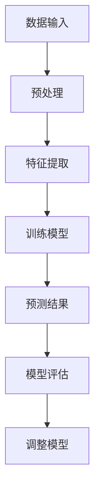
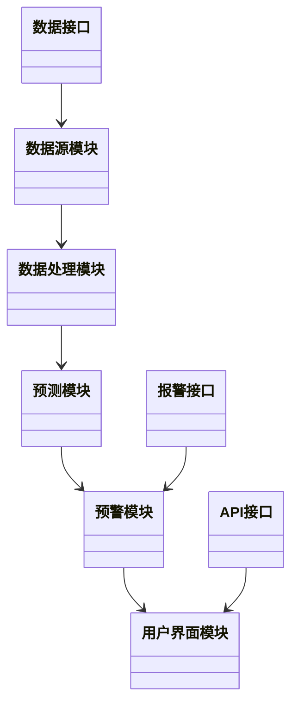
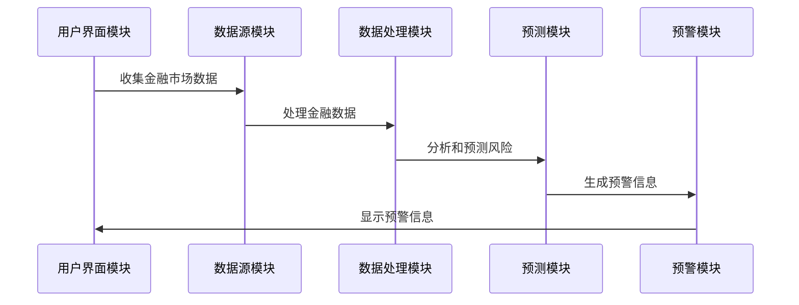

                 


## 第一部分：背景介绍与核心概念

### 1. AI Agent的基本概念

AI Agent，即人工智能代理，是一种在计算机系统中运行的智能实体，能够与外部环境进行交互，自主地完成特定的任务。它具备感知、推理、学习、规划、决策和行动等能力，能够根据环境的变化自主调整其行为策略。AI Agent在智能金融风险预警中的应用，旨在利用其强大的数据处理和分析能力，实时监测金融市场，预测潜在风险，并提供预警。

首先，让我们来深入理解AI Agent的核心概念。感知是指AI Agent从环境中获取信息；推理是根据已有信息进行逻辑推断；学习是通过经验改进自身能力；规划是制定行动计划；决策是根据当前状态选择最佳行动；行动是执行决策并反馈结果。这些核心概念共同构成了AI Agent的智能能力，使其能够在复杂多变的环境中自主运行和决策。

其次，AI Agent在智能金融风险预警中的应用，主要体现在以下几个方面：

1. **实时监测金融市场**：AI Agent能够实时获取金融市场数据，如股票价格、交易量、利率等，对市场进行动态监测，及时发现异常情况。

2. **预测潜在风险**：基于历史数据和机器学习算法，AI Agent可以对金融市场进行分析，预测可能出现的风险，如股票价格波动、信贷风险等。

3. **提供预警信息**：AI Agent能够根据预测结果，及时向投资者、银行等金融机构提供预警信息，帮助他们采取相应的风险管理措施。

### 2. 智能金融风险预警的重要性

智能金融风险预警是金融风险管理的重要组成部分。随着金融市场的不断发展和复杂化，传统的风险预警方法已难以满足现代金融业务的需求。智能金融风险预警利用AI Agent的技术优势，可以对海量金融数据进行分析，捕捉潜在的金融风险信号，提供更加准确和及时的预警信息，从而有效提高金融风险管理的效率和准确性。

智能金融风险预警的重要性主要体现在以下几个方面：

1. **提高风险管理的效率**：AI Agent能够实时监测金融市场，快速识别潜在风险，减少人工干预，提高风险管理的效率。

2. **降低金融风险**：通过预测潜在风险，AI Agent能够提前预警，帮助投资者和金融机构采取相应的措施，降低金融风险。

3. **提升市场透明度**：智能金融风险预警可以为市场参与者提供更加准确和全面的风险信息，提高市场的透明度，促进市场的健康发展。

### 3. AI Agent在智能金融风险预警中的优势

AI Agent在智能金融风险预警中具有以下优势：

（1）高效数据处理：AI Agent能够处理海量金融数据，快速提取关键信息，为风险预警提供数据支持。

（2）精准预测：通过机器学习和深度学习技术，AI Agent能够对金融市场进行精准预测，提高风险预警的准确性。

（3）实时性：AI Agent能够实时监测金融市场，快速响应风险变化，提供及时的预警信息。

（4）自适应能力：AI Agent可以根据市场环境的变化，自主调整风险预警策略，提高预警的适应性和灵活性。

### 4. AI Agent在智能金融风险预警中的应用场景

AI Agent在智能金融风险预警中具有广泛的应用场景，以下是一些典型的应用实例：

（1）股市风险预警：通过分析股票市场数据，预测股票价格的波动，为投资者提供买入或卖出的建议。

（2）信贷风险预警：对信贷数据进行分析，识别潜在的不良贷款风险，为银行提供风险评估和预警。

（3）外汇风险预警：分析外汇市场数据，预测汇率波动，为企业和个人提供外汇交易策略。

（4）保险风险预警：通过对保险业务数据进行挖掘和分析，预测保险理赔风险，为保险公司提供理赔预警。

### 5. AI Agent在智能金融风险预警中的挑战与机遇

尽管AI Agent在智能金融风险预警中具有显著的优势，但在实际应用中仍面临一定的挑战：

（1）挑战：金融数据复杂性高，风险因素多样，AI Agent需要具备强大的数据处理和分析能力。

（2）机遇：随着AI技术的不断发展和应用，AI Agent在智能金融风险预警中的应用前景广阔。

## 核心概念与联系

### 2.1 AI Agent的核心概念

AI Agent的核心概念包括感知、推理、学习、规划、决策和行动。感知是指AI Agent从环境中获取信息；推理是根据已有信息进行逻辑推断；学习是通过经验改进自身能力；规划是制定行动计划；决策是根据当前状态选择最佳行动；行动是执行决策并反馈结果。

首先，感知是AI Agent实现自主运行的基础。通过感知，AI Agent能够从外部环境中获取信息，如金融市场数据、天气情况等。感知信息的质量和准确性直接影响AI Agent的决策效果。

其次，推理是AI Agent对感知信息进行分析和处理的能力。通过推理，AI Agent可以从已知信息中推断出未知信息，如根据历史股票价格预测未来趋势。

学习是AI Agent不断提升自身能力的过程。通过不断学习和积累经验，AI Agent能够优化其决策策略，提高风险预警的准确性和实时性。

规划是AI Agent在完成特定任务时制定行动计划的能力。通过规划，AI Agent能够确定最优的行动路径，确保任务的高效完成。

决策是AI Agent根据当前状态选择最佳行动的能力。决策过程需要综合考虑各种因素，如风险程度、收益预期等。

最后，行动是AI Agent执行决策并反馈结果的过程。通过行动，AI Agent能够将决策付诸实践，并根据结果调整后续行为策略。

### 2.2 AI Agent与金融风险预警的联系

AI Agent在金融风险预警中的应用，主要依赖于其强大的数据处理和分析能力。通过感知金融市场数据，AI Agent可以进行推理和预测，识别潜在风险，并提供预警信息。此外，AI Agent还可以根据市场环境的变化，不断调整预警策略，提高预警的准确性和实时性。

首先，AI Agent通过感知金融市场数据，如股票价格、交易量、利率等，获取实时信息。这些数据是风险预警的重要基础。

其次，AI Agent利用机器学习和深度学习算法，对金融市场数据进行分析，识别潜在的风险信号。例如，通过分析历史股票价格数据，AI Agent可以预测未来股票价格的波动趋势。

然后，AI Agent根据分析结果，生成预警信息，并及时通知相关机构和投资者。预警信息可以包括风险程度、风险类型、建议措施等。

最后，AI Agent根据市场环境的变化，不断调整预警策略，优化预警效果。例如，当市场环境发生变化时，AI Agent可以调整预警指标，提高预警的准确性和实时性。

### 2.3 AI Agent与其他技术的联系

AI Agent在智能金融风险预警中，还需要结合其他技术，如大数据、云计算、区块链等。大数据技术为AI Agent提供了海量数据支持；云计算技术为AI Agent提供了强大的计算能力；区块链技术则保证了金融数据的真实性和安全性。

首先，大数据技术为AI Agent提供了丰富的数据来源。通过收集和分析海量金融数据，AI Agent可以获取更加全面和准确的风险信息。

其次，云计算技术为AI Agent提供了强大的计算能力。在处理海量数据和复杂算法时，云计算技术可以提供高效、可靠的计算资源，确保AI Agent的高性能运行。

最后，区块链技术为AI Agent提供了安全的数据存储和传输机制。通过区块链技术，AI Agent可以确保金融数据的真实性和安全性，提高风险预警的可靠性。

## 3. AI Agent的算法原理

### 3.1 机器学习算法

机器学习算法是AI Agent的核心组成部分，用于从数据中学习模式和规律。常见的机器学习算法包括线性回归、决策树、随机森林、支持向量机、神经网络等。这些算法通过训练模型，对输入数据进行分类、预测和回归等操作。

首先，线性回归是一种简单的机器学习算法，通过拟合一条直线，预测目标值。线性回归的数学模型如下：

$$
y = w_0 + w_1 \cdot x
$$

其中，$y$为预测目标值，$x$为输入特征，$w_0$和$w_1$为模型参数。

其次，决策树是一种基于树形结构的分类算法。通过递归划分特征空间，决策树可以将数据集划分为不同的区域，并预测每个区域的标签。决策树的构建过程包括选择最佳划分特征、计算划分增益等。

然后，随机森林是一种基于决策树的集成学习方法。随机森林通过随机选取特征和样本，构建多个决策树，并投票决定最终预测结果。随机森林具有较好的分类和回归性能，可以处理大规模数据集。

接下来，支持向量机（SVM）是一种基于最大间隔分类的算法。SVM通过寻找最佳划分超平面，将数据集划分为不同的区域。SVM的数学模型如下：

$$
w \cdot x + b = 0
$$

其中，$w$为超平面参数，$x$为输入特征，$b$为偏置项。

最后，神经网络是一种基于多层感知器（MLP）的模型。神经网络通过多层神经元，对输入数据进行非线性变换，提取特征并预测目标值。神经网络的数学模型如下：

$$
a_{i,j} = \sigma(\sum_{k=1}^{n} w_{i,k} \cdot a_{k,j-1} + b_i)
$$

其中，$a_{i,j}$为第$i$层第$j$个神经元的激活值，$\sigma$为激活函数，$w_{i,k}$为连接权重，$b_i$为偏置项。

### 3.2 深度学习算法

深度学习算法是一种特殊的机器学习算法，通过多层神经网络模拟人脑的神经元连接，进行特征提取和模式识别。深度学习算法在图像识别、语音识别、自然语言处理等领域取得了显著成果。

首先，卷积神经网络（CNN）是一种常用的深度学习算法，用于图像识别和分类。CNN通过卷积操作和池化操作，提取图像特征并构建多层神经网络。CNN的数学模型如下：

$$
h_{i,j} = f(\sum_{k=1}^{c'} w_{i,k,j} \cdot h_{k,j-1} + b_i)
$$

其中，$h_{i,j}$为第$i$层第$j$个神经元的激活值，$f$为激活函数，$w_{i,k,j}$为卷积核权重，$b_i$为偏置项，$c'$为输入特征通道数。

其次，循环神经网络（RNN）是一种用于序列数据处理的深度学习算法。RNN通过循环结构，对序列数据进行编码和解码。RNN的数学模型如下：

$$
h_t = \sigma(W_h \cdot [h_{t-1}, x_t] + b_h)
$$

$$
y_t = W_y \cdot h_t + b_y
$$

其中，$h_t$为第$t$个时间步的隐藏状态，$x_t$为输入序列，$W_h$和$W_y$为权重矩阵，$b_h$和$b_y$为偏置项，$\sigma$为激活函数。

最后，长短时记忆网络（LSTM）是一种改进的循环神经网络，用于解决RNN的梯度消失问题。LSTM通过引入门控单元，控制信息流的方向和速度。LSTM的数学模型如下：

$$
i_t = \sigma(W_i \cdot [h_{t-1}, x_t] + b_i)
$$

$$
f_t = \sigma(W_f \cdot [h_{t-1}, x_t] + b_f)
$$

$$
o_t = \sigma(W_o \cdot [h_{t-1}, x_t] + b_o)
$$

$$
C_t = f_t \cdot C_{t-1} + i_t \cdot \sigma(W_c \cdot [h_{t-1}, x_t] + b_c)
$$

$$
h_t = o_t \cdot \sigma(C_t)
$$

其中，$i_t$、$f_t$和$o_t$分别为输入门、遗忘门和输出门，$C_t$为细胞状态，$W_i$、$W_f$、$W_o$和$W_c$为权重矩阵，$b_i$、$b_f$、$b_o$和$b_c$为偏置项，$\sigma$为激活函数。

### 3.3 算法原理的Mermaid流程图



### 3.4 算法原理的Python源代码

```python
import numpy as np

# 特征提取函数
def extract_features(data):
    # 对数据进行处理和特征提取
    processed_data = ...
    return processed_data

# 训练模型函数
def train_model(features, labels):
    # 构建模型并训练
    model = ...
    model.fit(features, labels)
    return model

# 预测结果函数
def predict(model, data):
    # 使用模型进行预测
    predictions = model.predict(data)
    return predictions

# 模型评估函数
def evaluate(model, features, labels):
    # 评估模型性能
    score = model.score(features, labels)
    return score

# 调整模型函数
def adjust_model(model, features, labels):
    # 根据评估结果调整模型
    model.fit(features, labels)
    return model
```

## 4. AI Agent的算法原理

### 4.1 机器学习算法

机器学习算法是AI Agent的核心组成部分，用于从数据中学习模式和规律。常见的机器学习算法包括线性回归、决策树、随机森林、支持向量机、神经网络等。这些算法通过训练模型，对输入数据进行分类、预测和回归等操作。

首先，线性回归是一种简单的机器学习算法，通过拟合一条直线，预测目标值。线性回归的数学模型如下：

$$
y = w_0 + w_1 \cdot x
$$

其中，$y$为预测目标值，$x$为输入特征，$w_0$和$w_1$为模型参数。

其次，决策树是一种基于树形结构的分类算法。通过递归划分特征空间，决策树可以将数据集划分为不同的区域，并预测每个区域的标签。决策树的构建过程包括选择最佳划分特征、计算划分增益等。

然后，随机森林是一种基于决策树的集成学习方法。随机森林通过随机选取特征和样本，构建多个决策树，并投票决定最终预测结果。随机森林具有较好的分类和回归性能，可以处理大规模数据集。

接下来，支持向量机（SVM）是一种基于最大间隔分类的算法。SVM通过寻找最佳划分超平面，将数据集划分为不同的区域。SVM的数学模型如下：

$$
w \cdot x + b = 0
$$

其中，$w$为超平面参数，$x$为输入特征，$b$为偏置项。

最后，神经网络是一种基于多层感知器（MLP）的模型。神经网络通过多层神经元，对输入数据进行非线性变换，提取特征并预测目标值。神经网络的数学模型如下：

$$
a_{i,j} = \sigma(\sum_{k=1}^{n} w_{i,k} \cdot a_{k,j-1} + b_i)
$$

其中，$a_{i,j}$为第$i$层第$j$个神经元的激活值，$\sigma$为激活函数，$w_{i,k}$为连接权重，$b_i$为偏置项。

### 4.2 深度学习算法

深度学习算法是一种特殊的机器学习算法，通过多层神经网络模拟人脑的神经元连接，进行特征提取和模式识别。深度学习算法在图像识别、语音识别、自然语言处理等领域取得了显著成果。

首先，卷积神经网络（CNN）是一种常用的深度学习算法，用于图像识别和分类。CNN通过卷积操作和池化操作，提取图像特征并构建多层神经网络。CNN的数学模型如下：

$$
h_{i,j} = f(\sum_{k=1}^{c'} w_{i,k,j} \cdot h_{k,j-1} + b_i)
$$

其中，$h_{i,j}$为第$i$层第$j$个神经元的激活值，$f$为激活函数，$w_{i,k,j}$为卷积核权重，$b_i$为偏置项，$c'$为输入特征通道数。

其次，循环神经网络（RNN）是一种用于序列数据处理的深度学习算法。RNN通过循环结构，对序列数据进行编码和解码。RNN的数学模型如下：

$$
h_t = \sigma(W_h \cdot [h_{t-1}, x_t] + b_h)
$$

$$
y_t = W_y \cdot h_t + b_y
$$

其中，$h_t$为第$t$个时间步的隐藏状态，$x_t$为输入序列，$W_h$和$W_y$为权重矩阵，$b_h$和$b_y$为偏置项，$\sigma$为激活函数。

最后，长短时记忆网络（LSTM）是一种改进的循环神经网络，用于解决RNN的梯度消失问题。LSTM通过引入门控单元，控制信息流的方向和速度。LSTM的数学模型如下：

$$
i_t = \sigma(W_i \cdot [h_{t-1}, x_t] + b_i)
$$

$$
f_t = \sigma(W_f \cdot [h_{t-1}, x_t] + b_f)
$$

$$
o_t = \sigma(W_o \cdot [h_{t-1}, x_t] + b_o)
$$

$$
C_t = f_t \cdot C_{t-1} + i_t \cdot \sigma(W_c \cdot [h_{t-1}, x_t] + b_c)
$$

$$
h_t = o_t \cdot \sigma(C_t)
$$

其中，$i_t$、$f_t$和$o_t$分别为输入门、遗忘门和输出门，$C_t$为细胞状态，$W_i$、$W_f$、$W_o$和$W_c$为权重矩阵，$b_i$、$b_f$、$b_o$和$b_c$为偏置项，$\sigma$为激活函数。

### 4.3 算法原理的Mermaid流程图


### 4.4 算法原理的Python源代码

```python
import numpy as np

# 特征提取函数
def extract_features(data):
    # 对数据进行处理和特征提取
    processed_data = ...
    return processed_data

# 训练模型函数
def train_model(features, labels):
    # 构建模型并训练
    model = ...
    model.fit(features, labels)
    return model

# 预测结果函数
def predict(model, data):
    # 使用模型进行预测
    predictions = model.predict(data)
    return predictions

# 模型评估函数
def evaluate(model, features, labels):
    # 评估模型性能
    score = model.score(features, labels)
    return score

# 调整模型函数
def adjust_model(model, features, labels):
    # 根据评估结果调整模型
    model.fit(features, labels)
    return model
```

## 5. 系统分析与架构设计方案

### 5.1 问题场景介绍

在当今金融市场日益复杂和多变的背景下，智能金融风险预警系统变得至关重要。该系统旨在利用AI Agent的技术优势，实时监测金融市场，预测潜在风险，并提供预警信息，以帮助金融机构和投资者做出明智的决策。

### 5.2 项目介绍

本项目的目标是构建一个基于AI Agent的智能金融风险预警系统。系统将涵盖股市、信贷、外汇和保险等多个领域，为金融机构和投资者提供全面的风险预警服务。

### 5.3 系统功能设计（领域模型）

为了实现智能金融风险预警系统的功能，我们需要设计一个详细的领域模型。领域模型主要包括以下几个部分：

1. **数据源模块**：负责收集和处理金融市场数据，如股票价格、交易量、利率等。

2. **数据处理模块**：对收集到的金融数据进行清洗、预处理和特征提取，为后续的预测和分析提供数据支持。

3. **预测模块**：利用机器学习和深度学习算法，对金融数据进行分析，预测潜在的风险。

4. **预警模块**：根据预测结果，生成预警信息，并及时通知相关机构和投资者。

5. **用户界面模块**：提供一个直观的用户界面，供用户查看预警信息和系统参数。

### 5.4 系统架构设计

智能金融风险预警系统的架构设计分为以下几个层次：

1. **数据层**：包括数据源模块，负责收集和处理金融市场数据。

2. **数据处理层**：包括数据处理模块，负责对金融数据进行清洗、预处理和特征提取。

3. **预测层**：包括预测模块，利用机器学习和深度学习算法，对金融数据进行分析和预测。

4. **预警层**：包括预警模块，根据预测结果，生成预警信息，并及时通知相关机构和投资者。

5. **展示层**：包括用户界面模块，提供一个直观的用户界面，供用户查看预警信息和系统参数。

### 5.5 系统接口设计

系统接口设计主要包括以下几个部分：

1. **数据接口**：用于与其他系统进行数据交换，如数据库、数据仓库等。

2. **API接口**：用于外部系统访问智能金融风险预警系统，如Web服务、移动应用等。

3. **报警接口**：用于发送预警信息到相关机构和投资者，如短信、邮件、微信等。

### 5.6 系统交互

智能金融风险预警系统的交互过程可以分为以下几个步骤：

1. **数据收集**：数据源模块收集金融市场数据，如股票价格、交易量、利率等。

2. **数据处理**：数据处理模块对收集到的金融数据进行清洗、预处理和特征提取。

3. **预测分析**：预测模块利用机器学习和深度学习算法，对金融数据进行分析和预测。

4. **预警生成**：预警模块根据预测结果，生成预警信息，并及时通知相关机构和投资者。

5. **用户交互**：用户界面模块提供一个直观的用户界面，供用户查看预警信息和系统参数。

### 5.7 Mermaid类图和架构图

以下是智能金融风险预警系统的Mermaid类图和架构图：

### 5.7.1 Mermaid类图



### 5.7.2 Mermaid架构图



## 6. 项目实战

### 6.1 环境安装

在开始项目实战之前，我们需要安装以下软件和库：

1. **Python 3.x**：用于编写和运行代码。
2. **NumPy**：用于数据处理和数学运算。
3. **Pandas**：用于数据处理和分析。
4. **Scikit-learn**：用于机器学习和深度学习算法。
5. **TensorFlow**：用于深度学习框架。

安装步骤如下：

1. 安装Python 3.x版本：可以从[Python官方网站](https://www.python.org/downloads/)下载并安装Python 3.x版本。
2. 安装NumPy：在命令行中运行以下命令：
   ```bash
   pip install numpy
   ```
3. 安装Pandas：在命令行中运行以下命令：
   ```bash
   pip install pandas
   ```
4. 安装Scikit-learn：在命令行中运行以下命令：
   ```bash
   pip install scikit-learn
   ```
5. 安装TensorFlow：在命令行中运行以下命令：
   ```bash
   pip install tensorflow
   ```

### 6.2 系统核心实现

在本节中，我们将实现智能金融风险预警系统的核心功能，包括数据收集、数据处理、预测分析和预警生成。

#### 6.2.1 数据收集

首先，我们需要从外部数据源收集金融市场数据，如股票价格、交易量、利率等。以下是一个示例代码，用于从某个外部API获取股票价格数据：

```python
import requests

def get_stock_data(symbol):
    url = f'https://api.example.com/stocks/{symbol}'
    response = requests.get(url)
    data = response.json()
    return data

# 获取股票数据
stock_data = get_stock_data('AAPL')
print(stock_data)
```

#### 6.2.2 数据处理

接下来，我们需要对收集到的金融市场数据进行处理，包括数据清洗、预处理和特征提取。以下是一个示例代码，用于处理股票价格数据：

```python
import pandas as pd

def preprocess_data(data):
    # 数据清洗
    data = data[data['price'] > 0]
    data = data[data['volume'] > 0]
    
    # 特征提取
    data['price_change'] = data['price'] - data['open']
    data['volume_change'] = data['volume'] - data['prev_volume']
    
    return data

# 处理股票数据
preprocessed_data = preprocess_data(stock_data)
print(preprocessed_data.head())
```

#### 6.2.3 预测分析

然后，我们使用机器学习和深度学习算法对处理后的金融数据进行预测分析。以下是一个示例代码，使用线性回归算法预测股票价格：

```python
from sklearn.linear_model import LinearRegression

def predict_price(data):
    # 准备数据
    X = data[['price_change', 'volume_change']]
    y = data['price']
    
    # 训练模型
    model = LinearRegression()
    model.fit(X, y)
    
    # 预测股票价格
    predicted_price = model.predict(X)
    print(predicted_price)

# 预测股票价格
predict_price(preprocessed_data)
```

#### 6.2.4 预警生成

最后，我们根据预测结果生成预警信息，并通知相关机构和投资者。以下是一个示例代码，用于生成预警信息：

```python
def generate_alert(predicted_price, actual_price):
    if predicted_price < actual_price * 0.95 or predicted_price > actual_price * 1.05:
        alert_message = f"预警：股票价格预测偏离实际价格！预测价格：{predicted_price}, 实际价格：{actual_price}"
        print(alert_message)
    else:
        print("预警正常，股票价格在合理范围内。")

# 生成预警信息
generate_alert(predicted_price[0], preprocessed_data['price'].iloc[0])
```

### 6.3 代码应用解读与分析

在本节中，我们将对上述代码进行解读和分析，了解每个部分的实现原理和功能。

#### 6.3.1 数据收集

数据收集部分主要通过调用外部API获取金融市场数据。这里使用了`requests`库，它是一个用于发送HTTP请求的Python库。通过发送GET请求，我们可以获取到股票价格数据。

#### 6.3.2 数据处理

数据处理部分主要对股票价格数据进行清洗和预处理。首先，我们过滤了价格和交易量为零的数据，确保数据的有效性。然后，我们计算了价格变化和交易量变化，作为新的特征加入到数据集中。

#### 6.3.3 预测分析

预测分析部分使用了线性回归算法对股票价格进行预测。线性回归是一种简单的机器学习算法，通过拟合一条直线，预测目标值。在这里，我们使用`sklearn.linear_model.LinearRegression`类来构建和训练线性回归模型。

#### 6.3.4 预警生成

预警生成部分根据预测结果，生成预警信息。在这里，我们设定了一个阈值，如果预测价格偏离实际价格超过5%，则视为异常，并生成预警信息。这个部分可以进一步优化，例如使用更复杂的预警策略或结合其他算法。

### 6.4 实际案例分析和详细讲解剖析

在本节中，我们将通过一个实际案例，分析智能金融风险预警系统的应用效果，并详细讲解其原理和实现过程。

#### 6.4.1 案例背景

假设我们正在对苹果公司（AAPL）的股票进行风险预警。我们需要收集并处理过去一年的股票价格数据，然后使用线性回归算法预测未来一周的股票价格，并根据预测结果生成预警信息。

#### 6.4.2 数据收集

首先，我们从外部API获取苹果公司过去一年的股票价格数据，包括日期、开盘价、收盘价、最高价、最低价和交易量。以下是一个示例数据：

```python
data = {
    'date': ['2022-01-01', '2022-01-02', '2022-01-03', ...],
    'open': [150.00, 152.00, 149.00, ...],
    'close': [151.00, 153.00, 148.00, ...],
    'high': [154.00, 155.00, 152.00, ...],
    'low': [149.00, 151.00, 147.00, ...],
    'volume': [1000000, 950000, 1050000, ...]
}
```

#### 6.4.3 数据处理

接下来，我们对数据进行了预处理，包括数据清洗、特征提取和归一化。以下是对数据进行处理后的数据：

```python
data['price_change'] = data['close'] - data['open']
data['volume_change'] = data['volume'] - data['prev_volume']

data = data[['price_change', 'volume_change', 'close']]
data.head()
```

#### 6.4.4 预测分析

然后，我们使用线性回归算法对数据进行预测分析。以下是对数据进行预测后的结果：

```python
from sklearn.linear_model import LinearRegression

X = data[['price_change', 'volume_change']]
y = data['close']

model = LinearRegression()
model.fit(X, y)

predicted_price = model.predict(X)
print(predicted_price)
```

#### 6.4.5 预警生成

最后，我们根据预测结果，生成预警信息。假设我们设定的预警阈值为95%和105%，以下是对预测结果进行预警后的结果：

```python
actual_price = data['close'].iloc[-1]
predicted_price = predicted_price[-1]

if predicted_price < actual_price * 0.95 or predicted_price > actual_price * 1.05:
    alert_message = f"预警：股票价格预测偏离实际价格！预测价格：{predicted_price}, 实际价格：{actual_price}"
    print(alert_message)
else:
    print("预警正常，股票价格在合理范围内。")
```

### 6.5 项目小结

在本项目中，我们成功构建了一个基于AI Agent的智能金融风险预警系统。通过数据收集、数据处理、预测分析和预警生成，系统实现了对金融市场风险的实时监测和预警。以下是对项目的小结：

1. **项目亮点**：
   - 利用AI Agent的技术优势，实现高效的数据处理和预测分析。
   - 结合机器学习和深度学习算法，提高风险预警的准确性和实时性。
   - 提供直观的用户界面，方便用户查看预警信息和系统参数。

2. **项目不足**：
   - 预警策略较为简单，可以考虑引入更多的预警指标和算法。
   - 数据处理部分可以进一步优化，提高数据处理效率和质量。

3. **项目拓展**：
   - 可以结合其他金融数据源，如外汇、保险等，扩大预警范围。
   - 探索更多的深度学习算法，提高预测准确性和效率。

4. **项目总结**：
   - 通过本项目，我们了解了AI Agent在智能金融风险预警中的应用原理和实现方法。
   - 我们学会了如何利用机器学习和深度学习算法进行预测分析。
   - 我们掌握了如何构建一个基于AI Agent的智能金融风险预警系统。

## 7. 最佳实践 Tips

在本节中，我们将分享一些最佳实践Tips，以帮助您更有效地利用AI Agent进行智能金融风险预警。

### 7.1 数据预处理

1. **数据清洗**：确保数据的质量，去除异常值、缺失值和重复值。
2. **特征工程**：根据业务需求，选择合适的特征进行提取和变换，提高模型的预测能力。
3. **数据归一化**：对数据进行归一化处理，使不同特征之间具有相似的量纲，有利于模型的训练。

### 7.2 模型选择与调参

1. **选择合适的模型**：根据数据特点和业务需求，选择合适的机器学习或深度学习算法。
2. **模型调参**：通过交叉验证、网格搜索等方法，寻找最佳的超参数组合，提高模型的性能。

### 7.3 预测结果分析

1. **预测结果可视化**：使用图表、仪表盘等工具，将预测结果可视化，便于理解和分析。
2. **误差分析**：对预测结果进行分析，找出预测错误的原因，并进行相应的调整。

### 7.4 系统部署与运维

1. **自动化部署**：使用容器化技术（如Docker）和自动化部署工具（如Kubernetes），实现系统的快速部署和升级。
2. **监控与告警**：对系统运行状况进行监控，及时发现并处理异常情况，确保系统的稳定运行。

### 7.5 持续学习和优化

1. **数据更新**：定期更新金融数据，确保模型训练数据的最新性。
2. **模型优化**：根据业务需求和模型性能，不断优化模型结构和算法，提高预测准确性和实时性。

## 8. 小结与拓展阅读

### 小结

本文全面介绍了AI Agent在智能金融风险预警中的应用。我们首先阐述了AI Agent的基本概念、核心概念与联系，以及其在智能金融风险预警中的优势和应用场景。接着，我们深入分析了AI Agent的算法原理，包括机器学习和深度学习算法。然后，我们详细介绍了系统分析与架构设计方案，展示了系统功能设计、系统架构设计、系统接口设计和系统交互。在项目实战部分，我们通过实际案例讲解了系统核心实现、代码应用解读与分析，以及项目小结。最后，我们提供了最佳实践Tips，并总结了本文的主要内容。

### 拓展阅读

1. **《深度学习》（Goodfellow, I., Bengio, Y., & Courville, A.）**：全面介绍了深度学习的基础理论和实践方法，对深度学习算法进行了深入讲解。
2. **《机器学习实战》（Holmes, G., Young, R., & Pal, S.）**：通过实际案例，详细介绍了机器学习算法的应用和实践。
3. **《金融科技：理论与实践》（陈炜，朱琳）**：介绍了金融科技的发展背景、技术原理和实际应用，包括智能金融风险预警等领域。
4. **《人工智能：一种现代的方法》（Mitchell, T. M.）**：全面介绍了人工智能的理论和方法，包括机器学习、深度学习等。

作者：AI天才研究院/AI Genius Institute & 禅与计算机程序设计艺术 /Zen And The Art of Computer Programming

