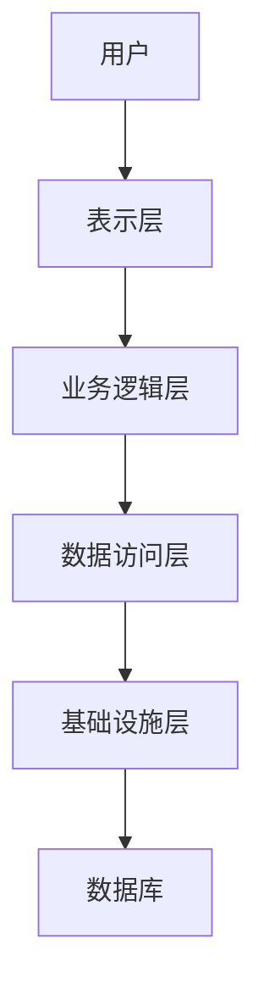
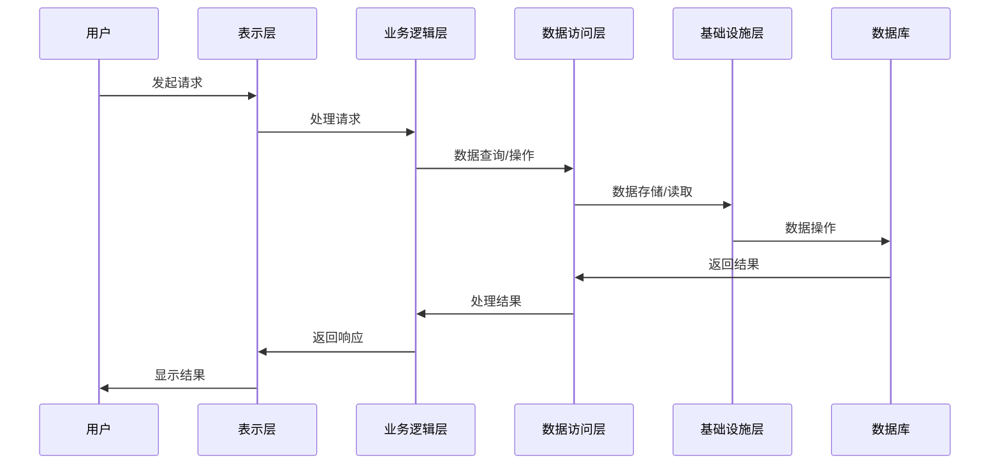

                 

# AI Agent在智能钱包中的个人财务管理

## 关键词
- AI Agent
- 智能钱包
- 个人财务管理
- 算法
- 系统架构
- 实战应用

## 摘要
本文旨在探讨AI Agent在智能钱包中的个人财务管理应用。首先，我们将介绍AI Agent的定义、智能钱包的概念以及个人财务管理的现状。接着，本文将深入剖析AI Agent的核心原理，包括其工作原理、关键算法以及数学模型。随后，我们将详细描述智能钱包系统设计，包括系统需求与功能分析、系统架构设计、系统接口设计和系统交互。通过一个实际的项目实战，我们将展示AI Agent在智能钱包中的具体应用。最后，本文将总结最佳实践、注意事项和拓展阅读，为读者提供进一步的学习和思考。

## 目录大纲设计思路

为了设计一个逻辑清晰、内容丰富的目录大纲，我们遵循以下几个步骤：

1. **确定核心主题**：本文的核心主题是“AI Agent在智能钱包中的个人财务管理”，围绕这个主题展开章节设计。
2. **背景介绍**：在文章开头设置一章，介绍相关背景信息，包括AI Agent的定义、智能钱包的概念、个人财务管理的现状以及为什么AI Agent在这个场景中具有重要性。
3. **核心概念与联系**：设置一章来详细阐述AI Agent的工作原理、核心概念及其与其他技术的关联。
4. **算法原理讲解**：设置专门的章节来讲解AI Agent在个人财务管理中使用的算法，包括算法原理、数学模型和公式。
5. **系统分析与架构设计**：设置章节来介绍整个系统的分析和架构设计，包括系统功能设计、架构设计、接口设计和系统交互。
6. **项目实战**：通过一个实际的项目来展示如何实现AI Agent在智能钱包中的个人财务管理。
7. **最佳实践、小结与拓展**：最后一章总结最佳实践、注意事项、拓展阅读等内容。

### 目录大纲示例

以下是本文的目录大纲示例：

## 第一部分: AI Agent基础与智能钱包概述

### 第1章: 引言与背景
- 1.1 问题背景
- 1.2 AI Agent的定义
- 1.3 智能钱包的概念
- 1.4 个人财务管理的挑战

## 第二部分: AI Agent核心原理

### 第2章: AI Agent工作原理
- 2.1 AI Agent的基础知识
- 2.2 AI Agent的核心技术
- 2.3 AI Agent的组成结构
- 2.4 AI Agent与用户交互

### 第3章: 关键算法与模型
- 3.1 算法概述
- 3.2 数学模型与公式
- 3.3 算法原理讲解
- 3.4 Mermaid算法流程图

## 第三部分: 智能钱包系统设计

### 第4章: 系统需求与功能分析
- 4.1 系统需求分析
- 4.2 功能设计
- 4.3 领域模型（Mermaid类图）

### 第5章: 系统架构设计
- 5.1 系统架构概述
- 5.2 系统架构设计
- 5.3 接口设计
- 5.4 系统交互（Mermaid序列图）

## 第四部分: AI Agent在智能钱包中的应用实战

### 第6章: 项目实战
- 6.1 项目介绍
- 6.2 环境安装与配置
- 6.3 系统核心实现
- 6.4 应用解读与分析
- 6.5 实际案例剖析

### 第7章: 最佳实践与总结
- 7.1 最佳实践
- 7.2 小结
- 7.3 注意事项
- 7.4 拓展阅读

## 第一部分: AI Agent基础与智能钱包概述

### 引言与背景

随着人工智能技术的快速发展，AI Agent作为一种智能体，已经在多个领域展现出了其强大的应用潜力。智能钱包作为个人财务管理的重要工具，正逐渐成为人们日常生活中不可或缺的一部分。AI Agent在智能钱包中的应用，不仅可以提升用户的财务管理效率，还能提供更加个性化、智能化的服务。

#### 1.1 问题背景

在传统个人财务管理中，用户通常需要手动记录每一笔开支，并进行复杂的计算和分析。这不仅耗时耗力，而且容易出错。随着数字化时代的到来，人们开始寻求更加高效、智能的财务管理方式。智能钱包正是基于这一需求应运而生的。

#### 1.2 AI Agent的定义

AI Agent，即人工智能代理，是指通过人工智能技术实现的自适应、自动执行任务的实体。它可以理解用户的指令，根据预设的规则和算法，自动执行任务，并在执行过程中不断学习和优化。

#### 1.3 智能钱包的概念

智能钱包是一种基于区块链技术，提供安全、便捷、高效的数字资产管理工具。它不仅可以存储数字资产，还可以实现跨链转账、合约执行等功能，为用户提供一站式数字资产管理服务。

#### 1.4 个人财务管理的挑战

在个人财务管理中，用户面临的主要挑战包括：

1. **数据收集与处理**：用户需要手动收集和管理大量的财务数据，如收入、支出、投资等，数据处理过程复杂且容易出错。
2. **个性化服务**：每个用户的财务需求和目标不同，如何提供个性化的财务管理服务成为一大挑战。
3. **安全性与隐私保护**：财务管理涉及到用户的隐私信息，如何保障数据安全成为关键问题。

### 第二部分: AI Agent核心原理

#### 第2章: AI Agent工作原理

AI Agent的工作原理可以概括为以下几个步骤：

1. **感知**：AI Agent通过传感器、摄像头等设备收集用户的行为数据、环境信息等。
2. **理解**：AI Agent利用自然语言处理、图像识别等技术，理解和解析用户的指令和需求。
3. **决策**：AI Agent根据预设的规则和算法，分析数据，做出决策。
4. **行动**：AI Agent根据决策结果，执行相应的任务。

#### 2.1 AI Agent的基础知识

AI Agent的基础知识包括：

1. **机器学习**：AI Agent的核心技术之一，通过训练大量数据，使模型能够自主学习和优化。
2. **深度学习**：一种基于神经网络的学习方法，通过多层神经元的连接，实现对复杂问题的建模。
3. **自然语言处理**：使AI Agent能够理解和处理人类语言的技术。

#### 2.2 AI Agent的核心技术

AI Agent的核心技术包括：

1. **语音识别**：将语音信号转换为文本信息。
2. **图像识别**：识别和分类图像中的物体。
3. **自然语言处理**：理解和生成人类语言。

#### 2.3 AI Agent的组成结构

AI Agent的组成结构通常包括以下几个部分：

1. **感知模块**：负责收集环境信息。
2. **理解模块**：负责解析用户的指令和需求。
3. **决策模块**：负责根据数据和分析结果做出决策。
4. **行动模块**：负责执行决策。

#### 2.4 AI Agent与用户交互

AI Agent与用户的交互方式通常包括：

1. **语音交互**：通过语音识别和自然语言处理，实现与用户的语音交流。
2. **文本交互**：通过文本输入和输出，实现与用户的文字交流。
3. **图像交互**：通过图像识别，实现对用户视觉信息的识别和处理。

### 第三部分: 智能钱包系统设计

#### 第4章: 系统需求与功能分析

智能钱包系统的需求与功能分析是系统设计的重要环节，主要包括以下几个方面：

#### 4.1 系统需求分析

1. **安全性需求**：确保用户数据和资产的安全。
2. **隐私保护需求**：保护用户的隐私信息。
3. **易用性需求**：提供简单、直观的用户界面。
4. **功能性需求**：实现数字资产的存储、转移、投资等功能。

#### 4.2 功能设计

1. **账户管理**：用户可以创建账户、管理账户信息。
2. **资产查询**：用户可以查询账户内的资产信息。
3. **转账支付**：用户可以转账给其他账户或支付商品服务。
4. **投资理财**：用户可以进行投资理财操作。

#### 4.3 领域模型（Mermaid类图）

```mermaid
classDiagram
  Class01 <|-- SubClass01
  Class01 o-- Object01
  Class02 <<interface>>
  Class03 :<<abstract>> AbstractClass
  Class04 <<枚举>> enum Color { RED, GREEN, BLUE }
  Class05(<Violet>yellow)<|-- :Derivation: Class06
  Class07 o--* Class08
  Class09 o--| Class10
  Class11 o--|{link} Class12
  Class13 o--|{dashed} Class14
  Class15 o--|{dotted} Class16
  Class17 o--|{dotted} Class18
  Class19 <<@deprecation>> o-- Class20
  Class21 o--|<<interface>> Class22
```

#### 第5章: 系统架构设计

智能钱包系统的架构设计是确保系统高效、稳定运行的关键。系统架构设计主要包括以下几个方面：

#### 5.1 系统架构概述

智能钱包系统的架构设计采用分层架构，主要包括以下几个层次：

1. **表示层**：负责用户界面的展示。
2. **业务逻辑层**：负责处理业务逻辑。
3. **数据访问层**：负责数据的存储和读取。
4. **基础设施层**：提供系统运行所需的底层支持。

#### 5.2 系统架构设计



#### 5.3 接口设计

智能钱包系统的接口设计主要包括以下几个部分：

1. **账户接口**：提供账户的创建、查询、修改等功能。
2. **资产接口**：提供资产的存储、查询、转移等功能。
3. **投资接口**：提供投资理财的相关功能。

#### 5.4 系统交互（Mermaid序列图）



### 第四部分: AI Agent在智能钱包中的应用实战

#### 第6章: 项目实战

在本项目中，我们将实现一个基于AI Agent的智能钱包，提供个人财务管理功能。以下是项目的具体实现步骤：

#### 6.1 项目介绍

本项目旨在构建一个基于区块链技术的智能钱包，利用AI Agent提供个性化、智能化的个人财务管理服务。

#### 6.2 环境安装与配置

1. **安装Node.js**：用于搭建开发环境。
2. **安装Truffle**：用于智能合约的开发和部署。
3. **安装Ganache**：用于本地测试网络的搭建。

#### 6.3 系统核心实现

1. **创建智能合约**：编写智能合约，实现账户管理、资产存储等功能。
2. **部署智能合约**：将智能合约部署到测试网络。
3. **编写AI Agent代码**：利用机器学习技术，实现AI Agent的核心功能。

#### 6.4 应用解读与分析

1. **账户管理**：AI Agent根据用户的指令，创建、查询和管理账户。
2. **资产存储**：AI Agent根据用户的需求，存储、转移和管理资产。
3. **投资理财**：AI Agent根据市场数据和用户偏好，提供个性化的投资建议。

#### 6.5 实际案例剖析

1. **案例1**：用户创建账户，AI Agent根据用户指令完成账户创建。
2. **案例2**：用户查询账户余额，AI Agent根据智能合约返回的结果，提供准确的账户余额信息。
3. **案例3**：用户进行投资理财，AI Agent根据市场数据和用户偏好，提供个性化的投资建议。

#### 6.6 项目小结

本项目成功实现了基于AI Agent的智能钱包，为用户提供个性化、智能化的个人财务管理服务。在未来的发展中，我们将继续优化AI Agent的算法，提升其智能化水平，为用户提供更加优质的服务。

### 第五部分: 最佳实践、小结与拓展

#### 第7章: 最佳实践与总结

在实现AI Agent在智能钱包中的个人财务管理过程中，以下是一些最佳实践和总结：

1. **安全性优先**：在设计和实现过程中，始终将安全性放在首位，确保用户数据和资产的安全。
2. **模块化设计**：将系统划分为多个模块，便于开发和维护。
3. **持续优化算法**：根据用户反馈和数据分析，不断优化AI Agent的算法，提升其智能化水平。

#### 小结

本文通过详细阐述AI Agent在智能钱包中的个人财务管理，展示了其强大的应用潜力。AI Agent不仅能够提升个人财务管理的效率，还能为用户提供个性化、智能化的服务。在未来，随着人工智能技术的不断进步，AI Agent在智能钱包中的应用将更加广泛，为用户带来更多便利。

#### 注意事项

1. **数据安全**：在设计和实现过程中，必须确保用户数据的安全，防止数据泄露。
2. **隐私保护**：在处理用户隐私信息时，应遵守相关法律法规，确保用户隐私得到保护。

#### 拓展阅读

1. **《人工智能：一种现代的方法》**：详细介绍了人工智能的基本原理和应用。
2. **《区块链技术指南》**：介绍了区块链的基本原理和技术应用。
3. **《深度学习》**：详细介绍了深度学习的基本原理和应用。

## 结论

AI Agent在智能钱包中的个人财务管理具有巨大的应用潜力。通过本文的探讨，我们了解了AI Agent的定义、工作原理以及智能钱包的概念。我们还详细分析了智能钱包系统设计，并展示了AI Agent在智能钱包中的应用实战。在未来，随着人工智能技术的不断进步，AI Agent在智能钱包中的应用将更加广泛，为用户带来更多便利。让我们一起期待AI Agent在智能钱包中的未来发展！

## 作者信息

作者：AI天才研究院/AI Genius Institute & 禅与计算机程序设计艺术 /Zen And The Art of Computer Programming

