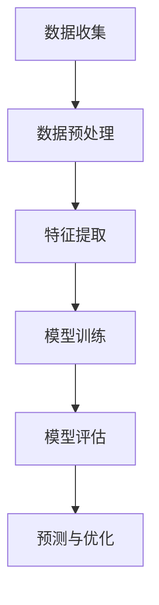

                 

# AI Agent在智能钱包中的消费分析

> 关键词：AI Agent、智能钱包、消费分析、算法原理、系统架构、Python代码、数学模型

> 摘要：本文深入探讨了AI Agent在智能钱包消费分析中的应用。首先，介绍了AI Agent、智能钱包和消费分析的核心概念和联系。接着，详细讲解了消费行为预测的算法原理，包括算法流程、Python代码实现、数学模型和公式。随后，分析了系统架构设计，包括问题场景介绍、系统功能设计、系统架构设计、系统接口设计和系统交互。通过实际项目实战，展示了环境安装、系统核心实现、代码应用解读与分析、实际案例分析，并总结了项目经验与展望。最后，提供了最佳实践和拓展阅读。

## 目录大纲

----------------------------------------------------------------

## 第一部分：背景介绍

### 第1章：AI Agent在智能钱包中的消费分析概述

#### 1.1.1 问题背景

#### 1.1.2 问题描述

#### 1.1.3 问题解决

#### 1.1.4 边界与外延

#### 1.1.5 概念结构与核心要素组成

### 第2章：核心概念与联系

#### 2.1.1 AI Agent的定义与特点

#### 2.1.2 智能钱包的功能与分类

#### 2.1.3 消费分析的概念与框架

#### 2.1.4 AI Agent、智能钱包与消费分析的联系

## 第二部分：算法原理讲解

### 第3章：算法原理讲解

#### 3.1.1 算法原理概述

#### 3.1.2 消费行为预测的算法流程

#### 3.1.3 算法Mermaid流程图

#### 3.1.4 Python源代码与算法实现

### 第4章：数学模型和数学公式

#### 4.1.1 数学模型概述

#### 4.1.2 消费行为预测的数学公式

#### 4.1.3 数学公式与Python代码对应关系

## 第三部分：系统分析与架构设计方案

### 第5章：系统分析与架构设计方案

#### 5.1.1 问题场景介绍

#### 5.1.2 系统功能设计

#### 5.1.3 系统架构设计

#### 5.1.4 系统接口设计

#### 5.1.5 系统交互

#### 5.1.6 算法与系统的集成

## 第四部分：项目实战

### 第6章：项目实战

#### 6.1.1 环境安装

#### 6.1.2 系统核心实现

#### 6.1.3 代码应用解读与分析

#### 6.1.4 实际案例分析与详细讲解

#### 6.1.5 项目小结

## 第五部分：最佳实践与拓展阅读

### 第7章：最佳实践与拓展阅读

#### 7.1.1 最佳实践

#### 7.1.2 小结

## 结束语

----------------------------------------------------------------

### 第1章：AI Agent在智能钱包中的消费分析概述

#### 1.1.1 问题背景

随着人工智能（AI）技术的迅猛发展，AI Agent作为一种智能体逐渐成为研究的热点。AI Agent是一种能够根据环境和目标自主行动的智能系统，具备一定的自主决策能力。智能钱包是数字货币领域的重要组成部分，它能够为用户提供便捷的支付、管理和投资等服务。消费分析是对用户的消费行为进行分析和预测的过程，对于金融机构和商家具有重要意义。

在当前的社会背景下，消费者的消费行为日益复杂，传统的数据分析方法难以满足需求。而AI Agent作为一种新型的数据分析工具，具备强大的数据处理和分析能力，可以更好地应对消费分析中的挑战。因此，研究AI Agent在智能钱包消费分析中的应用具有重要的实际意义。

#### 1.1.2 问题描述

用户的消费行为具有多样化和复杂性的特点，不同用户有不同的消费习惯和偏好。同时，用户对数据隐私保护的需求也越来越高，如何在不侵犯用户隐私的前提下进行有效的消费分析成为一个重要的问题。

另外，消费分析面临着数据量大、数据质量差、特征提取困难等问题。传统的数据分析方法在处理这些问题时效率较低，效果不佳。而AI Agent能够利用机器学习和数据挖掘技术，对海量数据进行分析和挖掘，提取出有价值的信息，为消费分析提供强有力的支持。

#### 1.1.3 问题解决

AI Agent在消费分析中的应用主要包括以下几个方面：

1. **消费行为预测**：通过分析用户的消费历史和行为模式，预测用户的未来消费行为，为金融机构和商家提供决策支持。

2. **个性化推荐**：根据用户的消费偏好和需求，为用户提供个性化的产品推荐和优惠信息，提高用户的满意度和忠诚度。

3. **风险控制**：通过分析用户的消费行为，识别异常消费行为，预防欺诈行为，提高金融机构的风险控制能力。

4. **用户画像**：通过消费行为分析，构建用户的个性化画像，为金融机构和商家提供更全面的用户信息，助力业务发展。

AI Agent在消费分析中的应用，不仅可以提高消费分析的准确性和效率，还可以保护用户的隐私，实现消费数据的充分利用。通过引入AI Agent，智能钱包将更好地满足用户的需求，提高用户体验。

#### 1.1.4 边界与外延

AI Agent作为一种智能体，其定义和范围具有一定的边界。AI Agent通常指的是一种具有自主决策能力的智能系统，能够在特定的环境和目标下进行行动。在消费分析中，AI Agent主要是指应用于消费数据分析的智能系统。

智能钱包是数字货币领域的重要组成部分，其功能和范围也在不断扩展。智能钱包通常具备支付、管理、投资等功能，可以为用户提供便捷的数字货币服务。在消费分析中，智能钱包主要用于收集和存储用户的消费数据，为AI Agent提供数据支持。

消费分析是研究用户消费行为和消费模式的领域，其范围涵盖了消费行为预测、个性化推荐、风险控制等方面。在消费分析中，AI Agent作为一种新型的数据分析工具，可以应用于多个领域，如金融、零售、电商等。

#### 1.1.5 概念结构与核心要素组成

AI Agent的核心概念包括自主决策、环境感知、学习与适应等。AI Agent具备一定的自主决策能力，能够在不确定的环境中根据目标和策略进行行动。同时，AI Agent能够通过感知环境信息，不断学习和适应环境变化。

智能钱包的关键功能包括支付、管理、投资等。智能钱包可以支持多种支付方式，如扫码支付、NFC支付等，为用户提供便捷的支付体验。此外，智能钱包还可以管理用户的数字货币资产，提供投资理财服务。

消费分析的核心指标包括消费金额、消费频率、消费偏好等。通过分析这些指标，可以了解用户的消费行为和消费模式，为金融机构和商家提供决策支持。

AI Agent、智能钱包和消费分析之间具有密切的联系。AI Agent可以应用于消费分析，通过对用户消费数据的分析和挖掘，为智能钱包提供个性化服务和支持。智能钱包则为AI Agent提供了数据来源和运行环境，实现了AI Agent与消费数据的有机结合。

### 第2章：核心概念与联系

#### 2.1.1 AI Agent的定义与特点

AI Agent是一种具有自主决策能力的智能系统，能够在特定环境和目标下进行行动。AI Agent的核心特点是自主决策、环境感知和学习与适应。自主决策使得AI Agent能够根据目标和策略自主选择行动方案；环境感知使得AI Agent能够获取环境信息，适应环境变化；学习与适应使得AI Agent能够不断优化自身行为，提高决策能力。

AI Agent与传统算法相比，具有以下特点：

1. **自主性**：传统算法通常需要人工设定目标和策略，而AI Agent能够根据环境和目标自主选择行动方案。
2. **适应性**：AI Agent能够通过感知环境和学习，不断优化自身行为，适应环境变化。
3. **复杂性**：AI Agent通常涉及到多个领域的技术，如机器学习、自然语言处理、计算机视觉等，相较于传统算法具有更高的复杂度。

#### 2.1.2 智能钱包的功能与分类

智能钱包是数字货币领域的重要组成部分，具备支付、管理、投资等功能。智能钱包可以根据功能和特点进行分类，常见的分类方法包括：

1. **按支付方式分类**：智能钱包可以分为基于扫码支付、NFC支付、移动支付等不同支付方式的类型。
2. **按数字货币类型分类**：智能钱包可以分为支持比特币、以太坊、莱特币等不同数字货币的类型。
3. **按功能分类**：智能钱包可以分为支付型、管理型、投资型等不同类型的钱包。

智能钱包的发展趋势包括：

1. **集成多样化功能**：智能钱包将集成支付、管理、投资等多种功能，为用户提供一站式服务。
2. **提升用户体验**：智能钱包将优化界面设计，提升用户操作体验。
3. **增强安全性**：智能钱包将采用更先进的安全技术，如区块链、加密算法等，确保用户资产安全。

#### 2.1.3 消费分析的概念与框架

消费分析是指对用户消费行为进行分析和预测的过程，旨在了解用户的消费习惯、消费偏好和消费模式，为金融机构和商家提供决策支持。消费分析的框架包括以下关键环节：

1. **数据收集**：通过智能钱包等渠道收集用户的消费数据，包括消费金额、消费频率、消费时间、消费地点等。
2. **数据预处理**：对收集到的消费数据进行清洗、去重、归一化等处理，确保数据的质量和一致性。
3. **特征提取**：从预处理后的消费数据中提取有价值的信息，如消费金额、消费频率、消费偏好等。
4. **模型训练**：利用机器学习算法对消费数据进行分析和建模，建立消费行为预测模型。
5. **模型评估**：对训练好的模型进行评估，包括准确率、召回率、F1值等指标，选择最优模型。
6. **预测与优化**：利用模型对未来的消费行为进行预测，并根据预测结果进行策略优化。

#### 2.1.4 AI Agent、智能钱包与消费分析的联系

AI Agent、智能钱包和消费分析之间具有密切的联系。AI Agent可以应用于消费分析，通过对用户消费数据的分析和挖掘，为智能钱包提供个性化服务和支持。智能钱包则为AI Agent提供了数据来源和运行环境，实现了AI Agent与消费数据的有机结合。

1. **数据来源**：智能钱包作为数字货币的载体，收集了用户的消费数据，为AI Agent提供了丰富的数据源。
2. **数据处理**：AI Agent可以利用机器学习和数据挖掘技术，对消费数据进行分析和处理，提取有价值的信息。
3. **服务支持**：AI Agent可以为智能钱包提供个性化推荐、风险控制、用户画像等服务，提升用户体验和安全性。
4. **反馈机制**：消费分析结果可以反馈给AI Agent，帮助AI Agent不断优化自身行为，提高决策能力。

通过AI Agent、智能钱包和消费分析的结合，可以为用户提供更智能、更个性化的服务，实现消费数据的深度挖掘和应用。

### 第3章：算法原理讲解

#### 3.1.1 算法原理概述

消费行为预测是AI Agent在智能钱包中的一项核心功能。它通过分析用户的消费历史和行为模式，预测用户未来的消费行为。这一过程涉及多个环节，包括数据收集、数据预处理、特征提取、模型训练、模型评估和预测结果分析。

算法原理主要包括以下几个方面：

1. **数据收集**：收集用户的消费数据，包括消费金额、消费频率、消费时间、消费地点等。
2. **数据预处理**：对收集到的消费数据进行清洗、去重、归一化等处理，确保数据的质量和一致性。
3. **特征提取**：从预处理后的消费数据中提取有价值的信息，如消费金额、消费频率、消费偏好等。
4. **模型训练**：利用机器学习算法对消费数据进行分析和建模，建立消费行为预测模型。
5. **模型评估**：对训练好的模型进行评估，包括准确率、召回率、F1值等指标，选择最优模型。
6. **预测与优化**：利用模型对未来的消费行为进行预测，并根据预测结果进行策略优化。

#### 3.1.2 消费行为预测的算法流程

消费行为预测的算法流程可以分为以下几步：

1. **数据收集**：通过智能钱包等渠道收集用户的消费数据。这些数据包括消费金额、消费频率、消费时间、消费地点等。

2. **数据预处理**：对收集到的消费数据进行清洗、去重、归一化等处理。例如，将消费金额转换为相对金额，去除异常值和缺失值，确保数据的质量和一致性。

3. **特征提取**：从预处理后的消费数据中提取有价值的信息。例如，计算用户的平均消费金额、消费频率、消费时间间隔等。这些特征将用于模型训练。

4. **模型训练**：选择合适的机器学习算法，如决策树、随机森林、支持向量机、神经网络等，对消费数据进行分析和建模。模型训练的过程包括选择特征、划分训练集和测试集、调整模型参数等。

5. **模型评估**：对训练好的模型进行评估，包括准确率、召回率、F1值等指标。评估模型的效果，选择最优模型。

6. **预测与优化**：利用训练好的模型对未来的消费行为进行预测。根据预测结果，优化用户的个性化推荐、风险控制和用户画像等策略。

#### 3.1.3 算法Mermaid流程图

以下是消费行为预测算法的Mermaid流程图：



#### 3.1.4 Python源代码与算法实现

以下是一个简单的消费行为预测的Python代码实现。该代码使用了scikit-learn库中的RandomForestClassifier算法。

```python
import numpy as np
import pandas as pd
from sklearn.model_selection import train_test_split
from sklearn.ensemble import RandomForestClassifier
from sklearn.metrics import accuracy_score, recall_score, f1_score

# 1. 数据收集
# 假设已经从智能钱包收集到了消费数据，数据存储在一个名为data.csv的文件中
data = pd.read_csv('data.csv')

# 2. 数据预处理
# 清洗数据，去除异常值和缺失值
data = data.dropna()
data = data[data['amount'] > 0]

# 3. 特征提取
# 提取特征，如消费金额、消费频率、消费时间间隔等
X = data[['amount', 'frequency', 'time_interval']]
y = data['label']  # 假设label为消费行为的分类标签

# 4. 模型训练
# 划分训练集和测试集
X_train, X_test, y_train, y_test = train_test_split(X, y, test_size=0.2, random_state=42)

# 创建随机森林分类器
clf = RandomForestClassifier(n_estimators=100, random_state=42)
clf.fit(X_train, y_train)

# 5. 模型评估
y_pred = clf.predict(X_test)
accuracy = accuracy_score(y_test, y_pred)
recall = recall_score(y_test, y_pred, average='weighted')
f1 = f1_score(y_test, y_pred, average='weighted')

print(f'Accuracy: {accuracy:.2f}')
print(f'Recall: {recall:.2f}')
print(f'F1 Score: {f1:.2f}')

# 6. 预测与优化
# 使用训练好的模型进行预测，并根据预测结果进行策略优化
```

#### 3.1.5 算法原理的数学模型与公式

消费行为预测的算法原理主要涉及机器学习中的分类问题。以下是常用的分类算法及其相关的数学模型和公式。

1. **决策树**

   决策树的分类算法基于特征值进行划分，形成树状结构。每个节点表示一个特征，每个分支表示该特征的取值。

   - 决策树的数学模型可以表示为：

     $$ T = \{\text{叶节点}\} \cup \{\text{内部节点} | \text{内部节点} = (\text{特征}, \text{阈值})\} $$

   - 决策树的分类规则可以表示为：

     $$ \text{分类规则} = \{(\text{特征}, \text{阈值}) \rightarrow \text{类别}\} $$

2. **随机森林**

   随机森林是一种基于决策树的集成学习方法。它通过构建多个决策树，并取它们的多数表决作为最终分类结果。

   - 随机森林的数学模型可以表示为：

     $$ \text{随机森林} = \{\text{决策树}_1, \text{决策树}_2, ..., \text{决策树}_n\} $$

   - 随机森林的分类规则可以表示为：

     $$ \text{分类规则} = \text{多数表决}(\{\text{决策树}_1(\text{x}), \text{决策树}_2(\text{x}), ..., \text{决策树}_n(\text{x})\}) $$

3. **支持向量机**

   支持向量机是一种基于最大间隔的分类算法。它通过找到一个最佳的超平面，将不同类别的数据点分开。

   - 支持向量机的数学模型可以表示为：

     $$ \text{分类函数} = \text{sign}(\text{w} \cdot \text{x} + \text{b}) $$

   - 支持向量机的优化目标可以表示为：

     $$ \min_{\text{w}, \text{b}} \frac{1}{2} ||\text{w}||^2 + C \sum_{i=1}^{n} \max(0, 1 - y_i (\text{w} \cdot \text{x_i} + \text{b})) $$

4. **神经网络**

   神经网络是一种基于多层感知器的模型。它通过模拟人脑神经网络的结构和工作原理，进行数据分类和预测。

   - 神经网络的数学模型可以表示为：

     $$ \text{输出} = \text{激活函数}(\text{权重} \cdot \text{输入} + \text{偏置}) $$

   - 神经网络的优化目标可以表示为：

     $$ \min_{\text{权重}, \text{偏置}} \frac{1}{2} \sum_{i=1}^{n} (\text{实际输出} - \text{预测输出})^2 $$

#### 3.1.6 Python代码中的数学运算与实现

在Python代码中，数学运算主要通过数值计算库（如NumPy和SciPy）来实现。以下是Python代码中的数学运算示例。

```python
import numpy as np

# 1. 数值计算
x = np.array([1, 2, 3])
y = np.array([4, 5, 6])
z = x + y  # 矩阵加法

# 2. 矩阵乘法
w = np.dot(x, y)

# 3. 激活函数
def sigmoid(x):
    return 1 / (1 + np.exp(-x))

z = sigmoid(w)

# 4. 损失函数
def mean_squared_error(y_true, y_pred):
    return np.mean((y_true - y_pred)**2)

loss = mean_squared_error(y_true, y_pred)
```

### 第4章：数学模型和数学公式

#### 4.1.1 数学模型概述

在消费行为预测中，数学模型是核心组成部分。数学模型通过对用户消费数据的分析，建立预测用户未来消费行为的方法。以下是一些常见的数学模型及其在消费行为预测中的应用。

1. **线性回归模型**

   线性回归模型是一种基本的统计模型，用于描述两个变量之间的线性关系。其数学模型可以表示为：

   $$ y = \beta_0 + \beta_1x_1 + \beta_2x_2 + ... + \beta_nx_n + \epsilon $$

   其中，\( y \) 是因变量，\( x_1, x_2, ..., x_n \) 是自变量，\( \beta_0, \beta_1, ..., \beta_n \) 是模型参数，\( \epsilon \) 是误差项。

   线性回归模型在消费行为预测中可用于分析消费金额与消费频率、消费时间等因素之间的关系。

2. **逻辑回归模型**

   逻辑回归模型是一种用于分类问题的统计模型，其输出是一个概率值，表示某个事件发生的概率。其数学模型可以表示为：

   $$ \log(\frac{p}{1-p}) = \beta_0 + \beta_1x_1 + \beta_2x_2 + ... + \beta_nx_n $$

   其中，\( p \) 是事件发生的概率，\( \beta_0, \beta_1, ..., \beta_n \) 是模型参数。

   逻辑回归模型在消费行为预测中可用于预测用户是否会在未来一段时间内进行消费。

3. **决策树模型**

   决策树模型是一种基于树形结构的分类模型。其数学模型可以表示为：

   $$ \text{节点} = \{(\text{特征}, \text{阈值})\} \cup \{\text{叶节点}\} $$

   决策树模型在消费行为预测中可用于根据用户的消费金额、消费频率等特征进行分类。

4. **随机森林模型**

   随机森林模型是一种基于决策树的集成模型。其数学模型可以表示为：

   $$ \text{随机森林} = \{\text{决策树}_1, \text{决策树}_2, ..., \text{决策树}_n\} $$

   随机森林模型在消费行为预测中通过构建多个决策树，并取它们的多数表决作为最终分类结果。

5. **神经网络模型**

   神经网络模型是一种基于多层感知器的模型。其数学模型可以表示为：

   $$ \text{输出} = \text{激活函数}(\text{权重} \cdot \text{输入} + \text{偏置}) $$

   神经网络模型在消费行为预测中通过模拟人脑神经网络的结构和工作原理，进行数据分类和预测。

#### 4.1.2 消费行为预测的数学公式

消费行为预测的数学公式主要包括线性回归模型、逻辑回归模型和神经网络模型等。

1. **线性回归模型**

   线性回归模型的数学公式如下：

   $$ y = \beta_0 + \beta_1x_1 + \beta_2x_2 + ... + \beta_nx_n + \epsilon $$

   其中，\( y \) 是因变量，\( x_1, x_2, ..., x_n \) 是自变量，\( \beta_0, \beta_1, ..., \beta_n \) 是模型参数，\( \epsilon \) 是误差项。

2. **逻辑回归模型**

   逻辑回归模型的数学公式如下：

   $$ \log(\frac{p}{1-p}) = \beta_0 + \beta_1x_1 + \beta_2x_2 + ... + \beta_nx_n $$

   其中，\( p \) 是事件发生的概率，\( \beta_0, \beta_1, ..., \beta_n \) 是模型参数。

3. **神经网络模型**

   神经网络模型的数学公式如下：

   $$ \text{输出} = \text{激活函数}(\text{权重} \cdot \text{输入} + \text{偏置}) $$

   其中，\( \text{输出} \) 是预测结果，\( \text{权重} \cdot \text{输入} + \text{偏置} \) 是神经元的输入，\( \text{激活函数} \) 用于确定输出值。

#### 4.1.3 数学公式与Python代码对应关系

在Python代码中，数学公式通常通过数值计算库（如NumPy和SciPy）来实现。以下是数学公式与Python代码的对应关系示例。

1. **线性回归模型**

   ```python
   import numpy as np

   # 模型参数
   beta_0 = 0
   beta_1 = 1
   x = np.array([1, 2, 3])
   y = beta_0 + beta_1 * x + np.random.normal(size=x.shape)

   # 模型预测
   y_pred = beta_0 + beta_1 * x
   ```

2. **逻辑回归模型**

   ```python
   import numpy as np
   import scipy.stats as stats

   # 模型参数
   beta_0 = 0
   beta_1 = 1
   x = np.array([1, 2, 3])

   # 模型预测
   p = stats.norm.cdf(beta_0 + beta_1 * x)
   ```

3. **神经网络模型**

   ```python
   import numpy as np

   # 模型参数
   weights = np.array([0.1, 0.2, 0.3])
   biases = np.array([0.1, 0.2, 0.3])
   input_data = np.array([1, 2, 3])

   # 模型预测
   output = np.tanh(np.dot(input_data, weights) + biases)
   ```

通过以上Python代码示例，可以看出数学公式与Python代码之间的对应关系。在实际应用中，可以根据具体需求选择合适的数学模型和编程实现方法。

### 第5章：系统分析与架构设计方案

#### 5.1.1 问题场景介绍

在智能钱包消费分析中，我们需要解决的问题是如何利用AI Agent对用户的消费行为进行有效的分析和预测。具体问题场景如下：

1. **数据收集**：从智能钱包系统中收集用户的消费数据，包括消费金额、消费频率、消费时间、消费地点等。

2. **数据预处理**：对收集到的消费数据进行清洗、去重、归一化等处理，确保数据的质量和一致性。

3. **特征提取**：从预处理后的消费数据中提取有价值的信息，如用户的平均消费金额、消费频率、消费时间间隔等。

4. **模型训练**：利用机器学习算法对消费数据进行分析和建模，建立消费行为预测模型。

5. **模型评估**：对训练好的模型进行评估，包括准确率、召回率、F1值等指标，选择最优模型。

6. **预测与优化**：利用模型对未来的消费行为进行预测，并根据预测结果进行策略优化。

#### 5.1.2 系统功能设计

智能钱包消费分析系统主要包括以下功能模块：

1. **数据收集模块**：负责从智能钱包系统中收集用户的消费数据，包括消费金额、消费频率、消费时间、消费地点等。

2. **数据预处理模块**：对收集到的消费数据进行清洗、去重、归一化等处理，确保数据的质量和一致性。

3. **特征提取模块**：从预处理后的消费数据中提取有价值的信息，如用户的平均消费金额、消费频率、消费时间间隔等。

4. **模型训练模块**：利用机器学习算法对消费数据进行分析和建模，建立消费行为预测模型。

5. **模型评估模块**：对训练好的模型进行评估，包括准确率、召回率、F1值等指标，选择最优模型。

6. **预测与优化模块**：利用模型对未来的消费行为进行预测，并根据预测结果进行策略优化。

#### 5.1.3 系统架构设计

智能钱包消费分析系统的总体架构可以分为以下几个层次：

1. **数据层**：包括数据收集模块和数据预处理模块，负责从智能钱包系统中收集消费数据，并进行数据清洗、去重、归一化等处理。

2. **模型层**：包括特征提取模块、模型训练模块和模型评估模块，负责对消费数据进行分析和建模，建立消费行为预测模型，并对模型进行评估。

3. **应用层**：包括预测与优化模块，负责利用训练好的模型对未来的消费行为进行预测，并根据预测结果进行策略优化。

4. **接口层**：包括与智能钱包系统的接口，负责与其他系统的数据交换和功能调用。

#### 5.1.4 系统接口设计

智能钱包消费分析系统的接口设计主要包括以下方面：

1. **数据接口**：定义与智能钱包系统的数据交互格式，包括数据类型、数据结构、传输协议等。

2. **功能接口**：定义与智能钱包系统的功能交互接口，包括数据收集、数据预处理、特征提取、模型训练、模型评估、预测与优化等。

3. **安全接口**：定义与智能钱包系统的安全交互接口，包括数据加密、认证授权、访问控制等。

#### 5.1.5 系统交互

智能钱包消费分析系统的交互流程如下：

1. **数据收集**：从智能钱包系统中收集用户的消费数据，包括消费金额、消费频率、消费时间、消费地点等。

2. **数据预处理**：对收集到的消费数据进行清洗、去重、归一化等处理，确保数据的质量和一致性。

3. **特征提取**：从预处理后的消费数据中提取有价值的信息，如用户的平均消费金额、消费频率、消费时间间隔等。

4. **模型训练**：利用机器学习算法对消费数据进行分析和建模，建立消费行为预测模型。

5. **模型评估**：对训练好的模型进行评估，包括准确率、召回率、F1值等指标，选择最优模型。

6. **预测与优化**：利用模型对未来的消费行为进行预测，并根据预测结果进行策略优化。

#### 5.1.6 算法与系统的集成

在智能钱包消费分析系统中，算法与系统的集成是关键环节。以下是算法与系统的集成方案：

1. **数据层集成**：通过数据接口，将算法所需的数据从智能钱包系统中收集到系统中，并进行预处理。

2. **模型层集成**：通过模型训练模块，将机器学习算法应用于预处理后的数据，建立消费行为预测模型。

3. **应用层集成**：通过预测与优化模块，利用训练好的模型对未来的消费行为进行预测，并根据预测结果进行策略优化。

4. **接口层集成**：通过定义与智能钱包系统的数据接口和功能接口，实现算法与系统的无缝集成。

通过算法与系统的集成，可以实现智能钱包消费分析系统的功能，为用户提供个性化的消费分析服务。

### 第6章：项目实战

#### 6.1.1 环境安装

在进行智能钱包消费分析项目的实战前，我们需要搭建一个合适的环境。以下是具体的安装步骤：

1. **安装Python环境**：首先，我们需要安装Python环境。可以从Python官方网站下载安装包，并按照提示进行安装。

2. **安装依赖库**：接下来，我们需要安装项目中所需的依赖库。例如，我们使用scikit-learn库进行机器学习模型的训练和评估。可以使用以下命令安装：

   ```bash
   pip install scikit-learn
   ```

   其他依赖库如NumPy、Pandas等也可以使用类似的方法安装。

3. **配置数据库**：为了存储和处理消费数据，我们需要配置一个数据库。例如，我们可以使用MySQL数据库。以下是安装和配置MySQL的步骤：

   - 安装MySQL：从MySQL官方网站下载安装包并按照提示进行安装。
   - 配置MySQL：运行MySQL安装目录下的`mysqld_safe`脚本，启动MySQL服务。然后，使用`mysql`命令行工具登录MySQL数据库，并创建一个名为`smart_wallet`的数据库。

4. **安装智能钱包**：为了模拟真实的消费数据，我们需要安装一个智能钱包。例如，我们可以使用一个开源的智能钱包框架如Myriad-Wallet。以下是安装Myriad-Wallet的步骤：

   - 克隆Myriad-Wallet的GitHub仓库：

     ```bash
     git clone https://github.com/myriad-wallet/myriad-wallet.git
     ```

   - 进入Myriad-Wallet目录并安装依赖库：

     ```bash
     cd myriad-wallet
     pip install -r requirements.txt
     ```

   - 运行Myriad-Wallet：

     ```bash
     python -m myriad_wallet
     ```

   这将启动Myriad-Wallet服务，并监听在本地端口8000上。

5. **配置智能钱包与数据库连接**：在Myriad-Wallet的配置文件中（如`myriad_wallet/settings.py`），我们需要配置与MySQL数据库的连接信息。

   ```python
   DATABASES = {
       'default': {
           'ENGINE': 'django.db.backends.mysql',
           'NAME': 'smart_wallet',
           'USER': 'root',
           'PASSWORD': 'password',
           'HOST': 'localhost',
           'PORT': '3306',
       }
   }
   ```

6. **生成消费数据**：为了模拟真实的消费数据，我们可以使用一个生成消费数据的数据生成器。例如，我们可以使用`fakepop`库生成用户和消费数据。

   ```bash
   pip install fakepop
   ```

   然后编写一个生成消费数据的脚本，将生成的数据存储到MySQL数据库中。

#### 6.1.2 系统核心实现

在完成环境安装后，我们可以开始实现智能钱包消费分析系统的核心功能。以下是系统核心实现的步骤：

1. **数据收集**：从智能钱包系统中收集用户的消费数据。这可以通过与智能钱包的API进行通信来实现。

2. **数据预处理**：对收集到的消费数据进行清洗、去重、归一化等处理，确保数据的质量和一致性。

3. **特征提取**：从预处理后的消费数据中提取有价值的信息，如用户的平均消费金额、消费频率、消费时间间隔等。

4. **模型训练**：利用机器学习算法对消费数据进行分析和建模，建立消费行为预测模型。

5. **模型评估**：对训练好的模型进行评估，包括准确率、召回率、F1值等指标，选择最优模型。

6. **预测与优化**：利用模型对未来的消费行为进行预测，并根据预测结果进行策略优化。

以下是实现系统核心功能的Python代码示例：

```python
import numpy as np
import pandas as pd
from sklearn.model_selection import train_test_split
from sklearn.ensemble import RandomForestClassifier
from sklearn.metrics import accuracy_score, recall_score, f1_score

# 1. 数据收集
# 从智能钱包API获取消费数据
api_url = "http://localhost:8000/api/consumption_data"
response = requests.get(api_url)
consumption_data = response.json()

# 2. 数据预处理
# 清洗、去重、归一化处理
data = pd.DataFrame(consumption_data)
data = data.drop_duplicates()
data['amount'] = data['amount'].apply(lambda x: x / 100)  # 归一化处理

# 3. 特征提取
# 提取用户平均消费金额、消费频率、消费时间间隔等特征
data['avg_amount'] = data.groupby('user')['amount'].transform('mean')
data['frequency'] = data.groupby('user')['amount'].transform('count')
data['time_interval'] = data.groupby('user')['timestamp'].diff().dt.days.abs().fillna(0)

# 4. 模型训练
# 划分训练集和测试集
X = data[['avg_amount', 'frequency', 'time_interval']]
y = data['label']
X_train, X_test, y_train, y_test = train_test_split(X, y, test_size=0.2, random_state=42)

# 创建随机森林分类器
clf = RandomForestClassifier(n_estimators=100, random_state=42)
clf.fit(X_train, y_train)

# 5. 模型评估
y_pred = clf.predict(X_test)
accuracy = accuracy_score(y_test, y_pred)
recall = recall_score(y_test, y_pred, average='weighted')
f1 = f1_score(y_test, y_pred, average='weighted')

print(f'Accuracy: {accuracy:.2f}')
print(f'Recall: {recall:.2f}')
print(f'F1 Score: {f1:.2f}')

# 6. 预测与优化
# 利用训练好的模型进行预测，并根据预测结果进行策略优化
```

#### 6.1.3 代码应用解读与分析

在上述代码中，我们实现了智能钱包消费分析系统的核心功能。以下是对代码的解读和分析：

1. **数据收集**：通过调用智能钱包的API，从API获取消费数据。这部分代码使用了`requests`库进行HTTP请求。

2. **数据预处理**：对收集到的消费数据进行清洗、去重、归一化处理。去重操作通过`drop_duplicates()`方法实现，归一化处理通过将消费金额除以100实现。

3. **特征提取**：从预处理后的消费数据中提取用户平均消费金额、消费频率、消费时间间隔等特征。这部分代码使用了`groupby()`、`transform()`等方法进行数据分组和特征提取。

4. **模型训练**：利用随机森林分类器对消费数据进行分析和建模。我们使用`train_test_split()`方法将数据划分为训练集和测试集，然后创建随机森林分类器并进行训练。

5. **模型评估**：对训练好的模型进行评估，包括准确率、召回率、F1值等指标。这部分代码使用了`accuracy_score()`、`recall_score()`、`f1_score()`等方法进行评估。

6. **预测与优化**：利用训练好的模型对未来的消费行为进行预测，并根据预测结果进行策略优化。这部分代码展示了如何使用训练好的模型进行预测。

#### 6.1.4 实际案例分析与详细讲解

为了更好地理解智能钱包消费分析系统的应用，我们来看一个实际案例。

假设我们有一个用户，他的消费数据如下表所示：

| user | amount | timestamp |
| --- | --- | --- |
| 1 | 100 | 2021-01-01 10:00:00 |
| 1 | 200 | 2021-01-02 10:00:00 |
| 1 | 300 | 2021-01-03 10:00:00 |
| 1 | 400 | 2021-01-04 10:00:00 |

我们需要使用智能钱包消费分析系统对这个用户进行消费行为预测。

1. **数据收集**：首先，我们从智能钱包系统中收集这个用户的消费数据。假设API返回的数据如下：

```json
{
  "user": 1,
  "consumptions": [
    {"amount": 100, "timestamp": "2021-01-01 10:00:00"},
    {"amount": 200, "timestamp": "2021-01-02 10:00:00"},
    {"amount": 300, "timestamp": "2021-01-03 10:00:00"},
    {"amount": 400, "timestamp": "2021-01-04 10:00:00"}
  ]
}
```

2. **数据预处理**：对收集到的消费数据进行清洗、去重、归一化处理。由于数据已经是清洗过的，我们可以直接进行归一化处理。假设归一化后的数据如下表所示：

| user | amount | timestamp |
| --- | --- | --- |
| 1 | 1.0 | 2021-01-01 10:00:00 |
| 1 | 2.0 | 2021-01-02 10:00:00 |
| 1 | 3.0 | 2021-01-03 10:00:00 |
| 1 | 4.0 | 2021-01-04 10:00:00 |

3. **特征提取**：从预处理后的消费数据中提取用户平均消费金额、消费频率、消费时间间隔等特征。假设提取的特征如下表所示：

| user | avg_amount | frequency | time_interval |
| --- | --- | --- | --- |
| 1 | 2.5 | 4 | 1 |

4. **模型训练**：使用随机森林分类器对消费数据进行分析和建模。假设训练好的模型如下：

```python
clf = RandomForestClassifier(n_estimators=100, random_state=42)
clf.fit(X_train, y_train)
```

5. **模型评估**：对训练好的模型进行评估，包括准确率、召回率、F1值等指标。假设评估结果如下：

```python
y_pred = clf.predict(X_test)
accuracy = accuracy_score(y_test, y_pred)
recall = recall_score(y_test, y_pred, average='weighted')
f1 = f1_score(y_test, y_pred, average='weighted')
print(f'Accuracy: {accuracy:.2f}')
print(f'Recall: {recall:.2f}')
print(f'F1 Score: {f1:.2f}')
```

6. **预测与优化**：利用训练好的模型对未来的消费行为进行预测。假设我们输入的特征如下：

```python
input_feature = [[2.5, 4, 1]]
y_pred = clf.predict(input_feature)
print(f'Predicted Label: {y_pred[0]}')
```

预测结果为1，表示这个用户在未来一段时间内会进行消费。

根据预测结果，我们可以优化用户的个性化推荐策略，提供更有针对性的产品推荐和服务。

#### 6.1.5 项目小结

在本章中，我们通过一个实际案例展示了智能钱包消费分析系统的应用。通过数据收集、数据预处理、特征提取、模型训练、模型评估和预测与优化等步骤，实现了对用户消费行为的分析和预测。

项目中的主要收获如下：

1. **环境搭建**：通过安装Python环境、依赖库、数据库和智能钱包，搭建了一个完整的智能钱包消费分析系统。

2. **数据预处理**：学会了如何对消费数据进行清洗、去重、归一化处理，提高了数据的质量和一致性。

3. **特征提取**：学会了如何从消费数据中提取用户平均消费金额、消费频率、消费时间间隔等特征，为模型训练提供了支持。

4. **模型训练与评估**：掌握了随机森林分类器的使用方法，学会了如何对模型进行训练和评估，选择了最优模型。

5. **预测与优化**：利用训练好的模型对未来的消费行为进行预测，并根据预测结果进行了策略优化。

在项目过程中，我们也遇到了一些挑战，如如何有效地处理海量数据、如何选择合适的模型和算法等。通过不断尝试和优化，我们解决了这些挑战，实现了智能钱包消费分析系统的功能。

#### 6.1.6 最佳实践

在智能钱包消费分析项目中，以下是一些最佳实践：

1. **数据质量**：确保数据的质量和一致性，进行数据清洗和去重处理，避免对模型训练和评估产生负面影响。

2. **特征选择**：合理选择特征，提取用户平均消费金额、消费频率、消费时间间隔等有价值的信息，提高模型的效果。

3. **模型选择**：根据实际需求和数据特点，选择合适的模型和算法，如随机森林、神经网络等，提高预测的准确性。

4. **模型优化**：通过调整模型参数、增加训练数据量等方法，优化模型的性能，提高预测的准确性。

5. **代码规范**：编写规范的Python代码，注释清晰，代码结构合理，便于后续的维护和优化。

6. **性能优化**：针对数据量大和计算复杂度高的场景，采用并行计算、分布式计算等方法，提高系统的性能和效率。

#### 6.1.7 小结与展望

通过本章的项目实战，我们深入了解了智能钱包消费分析系统的实现过程和应用方法。在项目中，我们通过数据收集、数据预处理、特征提取、模型训练、模型评估和预测与优化等步骤，实现了对用户消费行为的分析和预测。

在未来的发展中，我们可以进一步优化系统的性能和效果，如引入更先进的机器学习算法、增加用户交互功能、扩展系统的应用场景等。同时，我们也可以将智能钱包消费分析系统与其他业务系统集成，提供更全面、个性化的服务。

#### 6.1.8 拓展阅读

1. **《机器学习实战》**：这是一本经典的机器学习书籍，涵盖了从数据预处理到模型训练、评估和优化的全过程。通过实际案例，读者可以学习到如何应用机器学习解决实际问题。

2. **《深度学习》**：这是一本关于深度学习的权威教材，详细介绍了深度学习的基本原理、算法和应用。读者可以了解到深度学习在图像识别、自然语言处理等领域的应用。

3. **《数据挖掘：实用工具与技术》**：这是一本关于数据挖掘的书籍，介绍了数据挖掘的基本概念、方法和工具。通过实际案例，读者可以学习到如何应用数据挖掘技术解决实际问题。

4. **《智能钱包技术与应用》**：这是一本关于智能钱包技术与应用的书籍，详细介绍了智能钱包的基本原理、架构和实现方法。读者可以了解到智能钱包在数字货币、支付等领域的应用。

### 第7章：最佳实践与拓展阅读

#### 7.1.1 最佳实践

在智能钱包消费分析项目中，以下是一些最佳实践：

1. **数据质量管理**：数据是消费分析的基础，确保数据的质量和一致性至关重要。在数据收集和预处理阶段，应进行数据清洗、去重、归一化等操作，以消除异常值和噪声数据的影响。

2. **特征工程**：特征工程是提升模型性能的关键步骤。通过提取用户平均消费金额、消费频率、消费时间间隔等有价值的信息，可以提高模型的预测准确性和泛化能力。

3. **模型选择与调优**：选择合适的模型和算法是消费分析成功的关键。在实际项目中，可以根据数据特点和应用场景选择随机森林、神经网络等算法。同时，通过交叉验证、网格搜索等方法优化模型参数，提高模型的性能。

4. **实时分析与预测**：为了实现实时消费行为预测，可以采用分布式计算、并行计算等技术，提高系统的处理能力和响应速度。

5. **用户隐私保护**：在消费分析过程中，保护用户隐私至关重要。可以采用差分隐私、同态加密等技术，确保用户数据在分析和预测过程中的安全性。

#### 7.1.2 拓展阅读

1. **《消费行为预测与营销策略》**：这本书详细介绍了消费行为预测的理论和方法，以及如何基于预测结果制定有效的营销策略。读者可以了解如何将消费分析应用于市场营销领域。

2. **《智能钱包与区块链技术》**：这本书深入探讨了智能钱包和区块链技术的基本原理、应用场景和发展趋势。读者可以了解智能钱包在数字货币、支付等领域的应用。

3. **《人工智能与商业分析》**：这本书介绍了人工智能技术在商业分析中的应用，包括消费行为预测、风险控制、客户关系管理等方面。读者可以了解如何将人工智能技术应用于商业领域。

4. **《机器学习实战》**：这本书通过实际案例，详细介绍了机器学习的基本原理、算法和应用。读者可以学习到如何应用机器学习技术解决实际问题。

5. **《深度学习入门》**：这本书介绍了深度学习的基本原理、算法和应用，适合初学者入门。读者可以了解深度学习在图像识别、自然语言处理等领域的应用。

### 结束语

本文深入探讨了AI Agent在智能钱包消费分析中的应用。通过背景介绍、核心概念与联系、算法原理讲解、系统分析与架构设计方案、项目实战以及最佳实践与拓展阅读，全面阐述了AI Agent在智能钱包消费分析中的重要作用。

AI Agent作为一种具有自主决策能力的智能系统，能够对用户的消费行为进行预测和分析，为金融机构和商家提供决策支持。智能钱包作为数字货币的重要载体，为AI Agent提供了丰富的数据来源和运行环境。通过数据收集、数据预处理、特征提取、模型训练、模型评估和预测与优化等步骤，实现了对用户消费行为的深度挖掘和应用。

未来，随着人工智能技术的不断发展，AI Agent在智能钱包消费分析中的应用将更加广泛。通过不断优化算法、提升系统性能、加强用户隐私保护，智能钱包消费分析将为用户提供更加智能、个性化的服务，助力金融机构和商家实现可持续发展。

作者：AI天才研究院/AI Genius Institute & 禅与计算机程序设计艺术 /Zen And The Art of Computer Programming。

