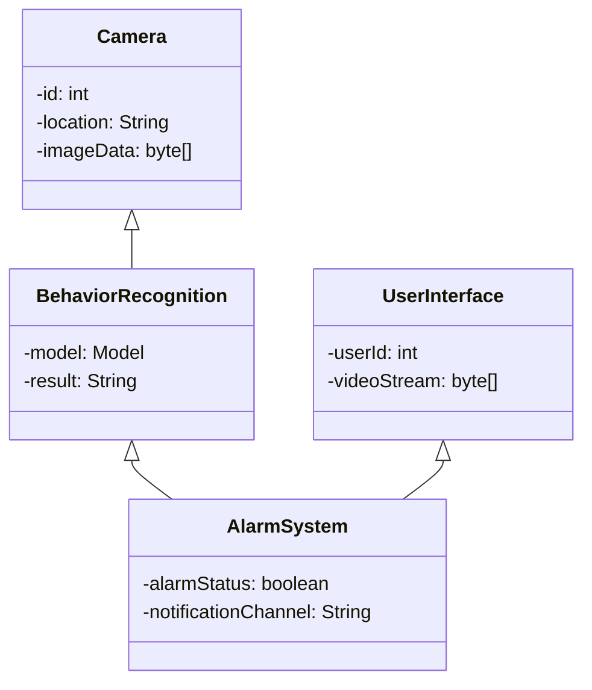
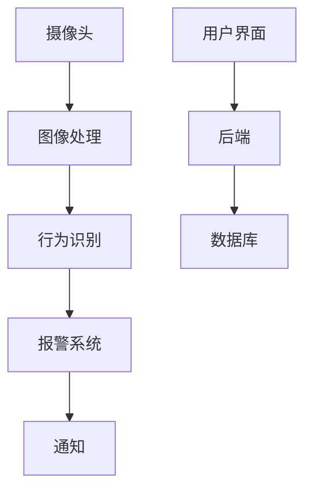
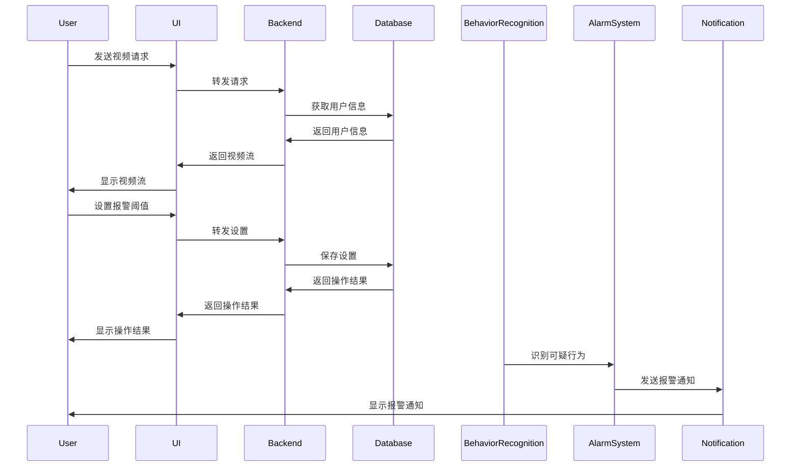

                 

### 引言：AI Agent在智能门铃中的可疑行为识别

近年来，随着人工智能（AI）技术的迅猛发展，智能门铃成为智能家居领域的一个热点。传统的门铃功能单一，主要用来通知住户有访客到来。而智能门铃则在此基础上，结合了人工智能技术，不仅能够实现基本的通话功能，还能够通过图像识别、语音识别等技术，对访客进行智能识别和分析。AI Agent，作为人工智能的一种重要形式，开始被应用于智能门铃中，以实现更高级的功能，如可疑行为识别。

**关键词**：AI Agent、智能门铃、可疑行为识别、图像识别、智能家居

#### 概念介绍

**AI Agent**：AI Agent，即人工智能代理，是一种基于AI技术的智能实体，它能够模拟人类的行为，具有感知、决策、执行等能力。在智能门铃中，AI Agent可以通过分析门铃摄像头捕捉到的图像或视频数据，识别访客的身份和活动，并做出相应的响应。

**智能门铃**：智能门铃是一种融合了AI技术的家用设备，它通常配备有高清摄像头、麦克风和扬声器，能够实现实时视频通话和音频通讯。此外，智能门铃还可以通过WiFi或其他无线网络与家庭网络连接，实现远程监控和控制。

**可疑行为识别**：可疑行为识别是智能门铃的一项高级功能，通过分析访客的行为模式，识别出潜在的安全威胁或异常行为。例如，对访客的徘徊、入侵、强行推门等行为进行实时监测和报警。

#### 问题背景

随着智能家居的普及，智能门铃已经成为许多家庭必备的安全设备。然而，随着AI技术的应用，智能门铃的功能也在不断提升，随之而来的安全问题也逐渐凸显。AI Agent在可疑行为识别中的应用，虽然可以提高家庭安全水平，但同时也存在一定的风险。

首先，AI Agent可能因为算法的不完善或数据的不完整，导致误报或漏报，从而影响用户的决策。其次，AI Agent可能会被恶意攻击者利用，通过伪造访客图像或行为，绕过门铃的安全检测，从而实施非法入侵。此外，AI Agent的数据隐私问题也值得关注，如果数据泄露，可能会导致用户的隐私受到侵犯。

#### 问题描述

基于上述背景，本文旨在探讨AI Agent在智能门铃中的可疑行为识别问题。具体来说，我们需要解决以下几个关键问题：

1. **AI Agent的可疑行为识别算法设计**：如何设计一种有效的算法，能够准确识别出可疑行为，同时减少误报和漏报。
2. **AI Agent的安全性问题**：如何确保AI Agent的安全，防止其被恶意攻击者利用。
3. **数据隐私保护**：如何保护AI Agent处理的数据，防止数据泄露。

#### 问题解决

为了解决上述问题，我们需要从以下几个方面入手：

1. **算法优化**：通过改进算法模型，提高可疑行为识别的准确性和效率。
2. **安全性增强**：通过引入加密技术和访问控制机制，增强AI Agent的安全性。
3. **数据隐私保护**：通过数据加密、匿名化等技术，保护用户的数据隐私。

#### 边界与外延

在讨论AI Agent在智能门铃中的可疑行为识别问题时，我们还需要考虑以下几个边界与外延：

1. **应用范围**：AI Agent在智能门铃中的应用范围，包括哪些行为可以被识别，哪些行为无法被识别。
2. **技术限制**：现有的AI技术对可疑行为识别的限制，包括算法性能、数据质量等。
3. **法律和伦理**：在应用AI Agent进行可疑行为识别时，需要遵守相关法律法规和伦理规范。

#### 概念结构与核心要素组成

AI Agent在智能门铃中的可疑行为识别，涉及到以下几个核心概念和要素：

1. **AI Agent**：作为核心组件，负责执行可疑行为识别任务。
2. **图像识别**：利用图像识别技术，分析访客的行为和特征。
3. **行为识别算法**：设计用于识别可疑行为的算法模型。
4. **数据安全**：保护AI Agent处理的数据，防止数据泄露和滥用。
5. **用户隐私**：确保用户的隐私不受侵犯。

通过上述分析，我们可以看出，AI Agent在智能门铃中的可疑行为识别是一项复杂的技术任务，涉及到算法设计、安全性、数据隐私等多个方面。接下来，我们将逐一探讨这些核心概念和要素，以深入理解这一领域的技术原理和应用。

### AI Agent的基本概念

AI Agent，即人工智能代理，是一种在特定环境中执行任务的智能实体，它通过感知、学习和决策能力，自主地与外部环境进行交互。AI Agent的核心功能在于其能够模拟人类的行为，包括感知外界环境、理解信息、做出决策并执行相应的动作。

#### 感知

感知是AI Agent与环境交互的第一步，它通过传感器收集环境信息，如视觉、听觉、触觉等，将物理信号转换为电子信号。例如，在智能门铃中，摄像头负责捕捉访客的图像，麦克风则记录访客的声音。这些感知数据为AI Agent提供了必要的输入，使其能够对外界环境进行理解。

#### 学习

学习是AI Agent的重要能力之一，通过不断接收和处理数据，AI Agent能够从中学习和提取知识。这一过程通常包括数据预处理、特征提取和模型训练等步骤。例如，在可疑行为识别任务中，AI Agent需要通过大量的图像和视频数据，学习识别不同行为模式的特征，从而提高识别的准确性。

#### 决策

决策是AI Agent的核心功能，它根据感知到的信息和已学到的知识，做出最佳决策。在智能门铃的应用场景中，AI Agent需要根据访客的行为特征，判断是否存在可疑行为，并做出相应的响应，如报警、发送通知等。

#### 执行

执行是AI Agent将决策转化为实际动作的过程。例如，当AI Agent判断访客的行为异常时，它可能会通过智能门铃的扬声器发出警报声，或者发送通知到用户的手机上。执行过程中，AI Agent需要确保其动作的准确性和有效性，以实现预期的目标。

#### AI Agent的分类

AI Agent可以根据不同的分类标准进行分类。根据功能特点，AI Agent可以分为以下几种类型：

1. **传感器驱动型**：这种类型的AI Agent主要依赖传感器收集环境信息，如智能门铃中的摄像头和麦克风。它们通常用于环境监测和任务执行。
2. **通信驱动型**：这种类型的AI Agent主要通过通信网络与外部设备进行交互，如智能家居中的智能音箱和智能灯具。它们通常用于控制设备和协调任务。
3. **任务驱动型**：这种类型的AI Agent具有明确的任务目标，如自动打扫地面的机器人。它们通常用于执行特定的任务。
4. **自主学习型**：这种类型的AI Agent能够自主学习和优化任务执行，如自动驾驶汽车。它们通常用于复杂环境中的自主导航和决策。

#### AI Agent与环境接口

AI Agent与环境接口是AI Agent实现功能的核心部分，它决定了AI Agent与环境的交互方式和效果。AI Agent与环境接口通常包括以下组成部分：

1. **感知接口**：负责接收环境信息，如传感器数据。
2. **决策接口**：负责处理感知信息，生成决策。
3. **执行接口**：负责将决策转化为实际动作。
4. **通信接口**：负责与其他设备和系统进行数据交换和通信。

#### AI Agent的工作流程

AI Agent的工作流程通常包括以下几个步骤：

1. **感知**：AI Agent通过感知接口收集环境信息。
2. **学习**：AI Agent通过学习算法处理感知信息，提取有用特征。
3. **决策**：AI Agent根据学习和感知结果，生成决策。
4. **执行**：AI Agent通过执行接口执行决策，实现预期目标。

#### AI Agent的应用场景

AI Agent在智能家居、智能交通、医疗健康等领域具有广泛的应用。以下是一些典型的应用场景：

1. **智能家居**：AI Agent可以用于智能门铃、智能音箱、智能灯具等设备的控制，实现家庭自动化管理。
2. **智能交通**：AI Agent可以用于智能交通系统的监控和管理，如车辆流量监控、道路安全预警等。
3. **医疗健康**：AI Agent可以用于医疗设备的监控和管理，如智能监护仪、健康管理系统等。

#### 小结

通过上述分析，我们可以看出，AI Agent是一种具有感知、学习、决策和执行能力的智能实体，它在智能门铃中的应用为可疑行为识别提供了技术支持。接下来，我们将进一步探讨智能门铃的发展历程，了解这一技术如何从传统的门铃演变而来。

### 智能门铃的发展历程

智能门铃作为一种智能家居设备，其发展历程可以追溯到20世纪末和21世纪初。从最初的简单门铃到如今的智能门铃，这一过程中不仅技术不断演进，功能也日益丰富，逐步成为现代家庭安全系统的重要组成部分。

#### 传统门铃的起源与发展

传统的门铃起源于19世纪末，最早的门铃主要由铃铛和绳索组成，用于通知住户有人敲门。随着时间的推移，门铃逐渐演变为电气化产品，20世纪初期的门铃开始采用电池供电，并通过电路连接门铃和门铃开关。这种设计使得门铃的安装和使用更加便捷，大大提高了家庭安全的水平。

#### 20世纪末的初步智能化

20世纪末，随着计算机技术和电子技术的快速发展，门铃开始向智能化方向迈进。这一时期的智能门铃主要通过集成小型计算机芯片和无线通信模块，实现了基本的视频通话和远程监控功能。虽然这些智能门铃的功能较为简单，但它们为后续的发展奠定了基础。

#### 21世纪初的快速发展

进入21世纪，互联网和无线通信技术的迅速普及，为智能门铃的发展带来了新的契机。这一时期，智能门铃逐渐摆脱了单一的视频通话功能，开始集成更多的智能功能，如语音交互、图像识别、智能家居控制等。特别是智能手机的普及，使得用户可以通过手机应用程序远程控制智能门铃，实时查看访客信息，甚至与访客进行视频通话。

#### 现代智能门铃的功能特点

现代智能门铃已经具备了高度智能化和多样化的功能，其主要特点如下：

1. **高清视频通话**：现代智能门铃通常配备高清摄像头，能够提供清晰的视频画面，用户可以通过手机应用程序实时查看访客的视频图像。
2. **语音交互**：智能门铃集成了语音识别和语音合成技术，用户可以通过语音指令与门铃进行交互，如查询天气、播放音乐等。
3. **图像识别**：现代智能门铃通过图像识别技术，能够识别访客的身份和活动，实现智能访客识别功能。
4. **智能家居控制**：智能门铃不仅可以作为独立的设备使用，还可以与智能家居系统集成，实现对其他智能家居设备的远程控制。
5. **数据存储与云服务**：智能门铃通常支持数据存储和云服务，用户可以将门铃记录的视频和音频数据上传到云端，方便随时查看和管理。

#### 智能门铃的市场现状与发展趋势

目前，智能门铃已经成为智能家居市场的一个重要细分领域，各大厂商纷纷推出新款智能门铃，以争夺市场份额。根据市场调研数据显示，全球智能门铃市场正在以高速增长，预计未来几年将继续保持快速增长态势。

发展趋势方面，智能门铃将继续向智能化、安全性和便捷性方向发展。具体包括：

1. **更高清的摄像头和更先进的图像识别技术**：未来的智能门铃将配备更高清的摄像头和更先进的图像识别技术，实现更精确的访客识别和更高效的可疑行为检测。
2. **更强大的语音交互功能**：智能门铃将集成更智能的语音助手，实现更加自然和流畅的语音交互体验。
3. **更紧密的智能家居集成**：智能门铃将更紧密地集成到智能家居系统中，实现与其他智能设备的无缝连接和协同工作。
4. **更安全的数据保护和隐私保护**：随着用户对数据安全和隐私保护意识的提高，未来的智能门铃将更加注重数据保护和隐私保护，确保用户数据的安全和隐私。

#### 小结

智能门铃的发展历程展示了科技如何改变人们的生活。从传统的门铃到现代的智能门铃，这一过程中不仅技术不断进步，功能也日益丰富。智能门铃的出现和普及，为家庭安全提供了新的解决方案，同时也为智能家居领域带来了更多的可能性。接下来，我们将探讨智能门铃在可疑行为识别中的具体应用。

### 可疑行为的定义与特征

在智能门铃中，可疑行为识别是一项关键功能，它能够帮助用户及时发现潜在的安全威胁。为了实现这一目标，我们首先需要明确可疑行为的定义及其特征。

#### 可疑行为的定义

可疑行为通常指那些可能对个人财产或安全构成威胁的行为，包括但不限于以下几种：

1. **入侵行为**：未经允许进入私人区域的行为，如强行推门、撬锁等。
2. **徘徊行为**：在住宅附近长时间逗留，无明显目的的行为。
3. **破坏行为**：故意损坏门铃、摄像头等设备的行为。
4. **异常活动**：与正常生活节奏不符的异常活动，如深夜敲门、异常大声喧哗等。

这些行为可能是由陌生人、不良访客或潜在犯罪者实施的，对住户的安全构成潜在威胁。因此，通过识别和监测这些可疑行为，智能门铃能够为用户提供及时的安全预警。

#### 可疑行为的特征

为了有效地识别可疑行为，我们需要了解这些行为的典型特征。以下是一些常见可疑行为的特征：

1. **入侵行为**：
   - **行为特征**：推门、撬锁、破坏门锁等。
   - **视觉特征**：人员多次出现在门锁附近，尝试打开门锁，或破坏门锁设备。
   - **时间特征**：通常发生在夜晚或住户外出时。

2. **徘徊行为**：
   - **行为特征**：长时间在住宅附近逗留，无明显目的。
   - **视觉特征**：人员在不同时间段多次出现在住宅周围，但未进入住宅。
   - **时间特征**：通常在白天或夜晚的特定时间段，如凌晨或傍晚。

3. **破坏行为**：
   - **行为特征**：故意破坏门铃、摄像头等设备。
   - **视觉特征**：出现破坏设备的动作，如敲打、拆卸等。
   - **时间特征**：通常在白天或夜晚的特定时间段。

4. **异常活动**：
   - **行为特征**：深夜敲门、异常大声喧哗等。
   - **视觉特征**：与正常生活节奏不符的异常动作。
   - **时间特征**：通常在深夜或特定时间段。

#### 数据收集与预处理

为了有效识别可疑行为，首先需要收集大量的行为数据，包括图像、视频和音频数据等。这些数据通常来自智能门铃的摄像头和麦克风。在数据收集过程中，需要注意以下几点：

1. **数据多样性**：收集多种类型的数据，如静态图像、动态视频和音频等，以增加识别的准确性。
2. **数据标注**：对收集到的数据进行标注，标记出可疑行为和正常行为，以便后续的训练和分析。
3. **数据清洗**：去除数据中的噪声和异常值，提高数据质量。

在预处理阶段，还需要对数据进行标准化处理，如图像尺寸调整、颜色平衡校正、音频降噪等。这些预处理步骤有助于提高后续算法的性能。

#### 小结

通过对可疑行为的定义和特征的分析，我们可以更好地理解在智能门铃中实现可疑行为识别的重要性。接下来，我们将深入探讨常用的行为识别算法，了解这些算法如何应用于智能门铃中。

### 行为识别算法概述

在智能门铃中，行为识别算法是关键组件，它负责分析摄像头捕捉到的图像或视频数据，识别出可疑行为。常用的行为识别算法主要包括基于机器学习和深度学习的算法。这些算法通过学习大量的数据，提取特征，并利用这些特征进行行为分类和识别。以下是对这些算法的概述：

#### 机器学习算法

机器学习算法是一种通过数据驱动的方式学习特征并进行预测的算法。在行为识别中，常用的机器学习算法包括：

1. **支持向量机（SVM）**：
   - **原理**：SVM通过寻找一个最优的超平面，将不同类别的行为数据分离开来。
   - **优点**：SVM在处理线性可分数据时效果较好，计算复杂度较低。
   - **缺点**：对于非线性问题效果较差，且对异常值敏感。

2. **决策树**：
   - **原理**：决策树通过一系列的判断条件，将数据分割成多个子集，并最终分类。
   - **优点**：易于理解和解释，计算复杂度较低。
   - **缺点**：对于大量特征的数据处理能力较差，易出现过拟合。

3. **随机森林**：
   - **原理**：随机森林通过构建多个决策树，并利用投票机制进行最终分类。
   - **优点**：提高了分类的鲁棒性，减少了过拟合。
   - **缺点**：计算复杂度较高，对大规模数据集的处理能力有限。

4. **朴素贝叶斯分类器**：
   - **原理**：朴素贝叶斯分类器基于贝叶斯定理和特征条件独立性假设，计算每个类别的后验概率，并进行分类。
   - **优点**：计算简单，适用于大规模数据处理。
   - **缺点**：对数据的分布假设较为严格，对异常值敏感。

#### 深度学习算法

深度学习算法是一类基于多层神经网络的学习算法，通过多层神经元的堆叠，自动提取数据的高级特征。在行为识别中，常用的深度学习算法包括：

1. **卷积神经网络（CNN）**：
   - **原理**：CNN通过卷积操作提取图像中的局部特征，并通过池化操作降低数据维度。
   - **优点**：具有很强的图像识别能力，能够自动学习图像的层次特征。
   - **缺点**：对计算资源要求较高，训练时间较长。

2. **循环神经网络（RNN）**：
   - **原理**：RNN通过在时间步间传递信息，能够处理序列数据。
   - **优点**：适用于处理时间序列数据，如视频数据。
   - **缺点**：对于长序列数据易出现梯度消失或梯度爆炸问题。

3. **长短期记忆网络（LSTM）**：
   - **原理**：LSTM是RNN的一种变体，通过引入门控机制，解决了RNN的梯度消失问题。
   - **优点**：适用于处理长序列数据，能够较好地保持长期依赖关系。
   - **缺点**：模型结构复杂，训练时间较长。

4. **生成对抗网络（GAN）**：
   - **原理**：GAN由生成器和判别器组成，通过生成器和判别器的对抗训练，生成逼真的数据。
   - **优点**：能够生成高质量的图像和视频数据，用于数据增强。
   - **缺点**：训练不稳定，需要大量的训练数据和计算资源。

#### 算法对比

机器学习算法和深度学习算法各有优缺点，适用于不同的应用场景。以下是对两种算法的对比：

1. **计算资源**：机器学习算法通常对计算资源要求较低，适用于资源受限的环境。而深度学习算法需要大量的计算资源和存储空间，适用于高性能计算平台。
2. **数据处理能力**：机器学习算法对数据量要求较高，需要大量的训练数据。而深度学习算法能够自动提取数据的高级特征，对数据量要求较低。
3. **识别准确性**：深度学习算法在图像识别和视频识别等领域具有很高的准确性，优于传统的机器学习算法。
4. **模型解释性**：机器学习算法通常具有较强的解释性，便于理解和调试。而深度学习算法的黑箱性质使得其难以解释，需要依赖其他技术进行模型解释。

#### 小结

行为识别算法在智能门铃中发挥着关键作用，通过机器学习和深度学习算法，能够有效地识别和监测可疑行为。接下来，我们将探讨这些算法在实际应用中的实现细节，并介绍一些流行的实时行为识别框架。

### 实现实时行为识别的算法框架

在智能门铃中，实现实时行为识别是一项关键任务。为了满足实时性要求，我们需要选择合适的算法框架，并在硬件和软件方面进行优化。以下介绍几种流行的实时行为识别算法框架，以及它们的实现细节和优势。

#### 1. OpenCV

OpenCV（Open Source Computer Vision Library）是一个广泛使用的开源计算机视觉库，支持多种行为识别算法。它提供了丰富的图像处理和机器学习工具，可以轻松实现实时行为识别。

**实现细节**：
- **图像预处理**：使用OpenCV进行图像灰度化、滤波、边缘检测等预处理步骤。
- **特征提取**：利用HOG（Histogram of Oriented Gradients）特征描述子提取图像特征。
- **行为识别**：通过SVM、决策树等机器学习算法进行行为分类。

**优势**：
- **开源免费**：OpenCV是免费的，适用于各种开发场景。
- **广泛支持**：OpenCV支持多种操作系统和编程语言，方便集成。
- **丰富的算法库**：提供了多种行为识别算法，适用于不同场景的需求。

#### 2. TensorFlow

TensorFlow是一个由Google开发的开源深度学习框架，适用于复杂的深度学习模型训练和推理。通过TensorFlow，我们可以实现高效的实时行为识别。

**实现细节**：
- **模型训练**：使用TensorFlow训练深度学习模型，如CNN、RNN等。
- **实时推理**：利用TensorFlow Lite在移动设备上部署和运行模型，实现实时行为识别。

**优势**：
- **高效推理**：TensorFlow Lite优化了移动设备上的推理性能，适用于实时应用。
- **强大的模型支持**：TensorFlow支持多种深度学习模型，能够处理复杂的任务。
- **良好的生态系统**：TensorFlow拥有丰富的工具和库，方便模型开发和部署。

#### 3. PyTorch

PyTorch是由Facebook开发的另一个流行的开源深度学习框架，以其灵活性和易用性著称。通过PyTorch，我们可以轻松实现实时行为识别。

**实现细节**：
- **模型训练**：使用PyTorch训练深度学习模型，如CNN、LSTM等。
- **实时推理**：利用PyTorch Mobile将模型部署到移动设备上，实现实时行为识别。

**优势**：
- **灵活性强**：PyTorch提供了丰富的API和工具，方便模型设计和调试。
- **良好的社区支持**：PyTorch拥有活跃的社区，提供了丰富的资源和教程。
- **适用于复杂任务**：PyTorch支持动态计算图，适用于复杂和动态的任务场景。

#### 4. YOLO（You Only Look Once）

YOLO（You Only Look Once）是一个实时物体检测框架，广泛应用于计算机视觉领域。通过YOLO，我们可以在智能门铃中实现高效的行为识别。

**实现细节**：
- **物体检测**：使用YOLO进行实时物体检测，识别出图像中的目标和行为。
- **行为分类**：利用检测到的目标，结合预先训练好的行为分类模型，进行行为识别。

**优势**：
- **实时性高**：YOLO设计用于实时物体检测，具有很高的处理速度。
- **准确性高**：YOLO采用端到端训练，能够实现高效和准确的行为识别。
- **易于集成**：YOLO提供了简单的API，方便与其他系统进行集成。

#### 小结

以上介绍了几种实现实时行为识别的算法框架，每种框架都有其独特的优势和适用场景。在智能门铃中，根据实际需求，可以选择合适的框架进行开发和部署。通过合理利用这些框架，我们可以实现高效和准确的可疑行为识别，提高家庭安全水平。

### 模型训练与评估

在智能门铃中，行为识别模型的训练与评估是确保其有效性和准确性的关键环节。一个良好的模型不仅需要准确识别可疑行为，还需要在多种环境下保持稳定性和鲁棒性。以下将详细描述训练和评估模型的具体步骤，以及常用的评估指标。

#### 模型训练

1. **数据准备**：
   - **数据收集**：首先需要收集大量的行为数据，包括正常行为和可疑行为。这些数据可以来自不同的摄像头、不同的时间段和环境。
   - **数据标注**：对收集到的数据标注出行为的类别，如正常行为、入侵行为、徘徊行为等。标注过程需要确保数据的准确性和一致性。
   - **数据预处理**：对数据进行标准化处理，包括图像尺寸调整、灰度化、裁剪等，以适应模型的要求。此外，还可以进行数据增强，如旋转、翻转、缩放等，增加数据的多样性。

2. **模型选择**：
   - **算法选择**：根据任务需求，选择合适的算法，如卷积神经网络（CNN）、循环神经网络（RNN）等。对于实时性要求较高的任务，可以选择轻量级的模型，如YOLO、SSD等。
   - **模型架构**：设计模型架构，包括网络层数、层类型、激活函数等。对于复杂的任务，可以考虑使用多模型融合的方法，提高模型的性能。

3. **模型训练**：
   - **训练过程**：使用训练集对模型进行训练，同时使用验证集调整模型参数。训练过程中需要监控模型的性能，如准确率、召回率等，以避免过拟合。
   - **优化方法**：使用梯度下降、Adam等优化算法，加速模型训练。此外，还可以使用学习率调整、正则化等技术，提高模型的泛化能力。

4. **超参数调整**：
   - **学习率**：学习率的选择对模型训练至关重要。过大会导致模型收敛速度慢，甚至可能过拟合；过小则训练过程会非常缓慢。
   - **批量大小**：批量大小影响模型的训练速度和稳定性。较大的批量大小可以提高模型的泛化能力，但训练时间较长。
   - **正则化**：使用正则化方法，如L1、L2正则化，可以防止模型过拟合。

#### 评估指标

1. **准确率（Accuracy）**：
   - **定义**：准确率是预测正确的样本数占总样本数的比例。
   - **计算公式**：\[ \text{Accuracy} = \frac{\text{预测正确数}}{\text{总样本数}} \]

2. **召回率（Recall）**：
   - **定义**：召回率是预测为正例的样本中，实际为正例的比例。
   - **计算公式**：\[ \text{Recall} = \frac{\text{预测正确数}}{\text{实际正例数}} \]

3. **精确率（Precision）**：
   - **定义**：精确率是预测为正例的样本中，预测正确的比例。
   - **计算公式**：\[ \text{Precision} = \frac{\text{预测正确数}}{\text{预测正例数}} \]

4. **F1分数（F1 Score）**：
   - **定义**：F1分数是精确率和召回率的调和平均值，用于综合评价模型的性能。
   - **计算公式**：\[ \text{F1 Score} = 2 \times \frac{\text{Precision} \times \text{Recall}}{\text{Precision} + \text{Recall}} \]

5. **ROC曲线和AUC（Area Under Curve）**：
   - **定义**：ROC曲线是真实值为正例的准确率对假正例率（False Positive Rate）的曲线。AUC是ROC曲线下方的面积。
   - **计算公式**：\[ \text{AUC} = \int_{0}^{1} \text{ROC}(f_p) \, dp \]

6. **均方误差（Mean Squared Error, MSE）**：
   - **定义**：均方误差是预测值与真实值之间差的平方的平均值，常用于回归问题。
   - **计算公式**：\[ \text{MSE} = \frac{1}{n} \sum_{i=1}^{n} (\hat{y}_i - y_i)^2 \]

#### 模型评估

1. **验证集评估**：
   - 在模型训练过程中，使用验证集评估模型的性能。验证集通常用于调整模型参数和选择最佳模型。

2. **交叉验证**：
   - 使用交叉验证方法，如K折交叉验证，对模型进行评估。交叉验证能够提高评估结果的稳定性。

3. **测试集评估**：
   - 在模型训练完成后，使用测试集对模型进行最终评估。测试集通常用于评估模型的泛化能力。

4. **混淆矩阵**：
   - 使用混淆矩阵展示预测结果和实际结果之间的对应关系。混淆矩阵可以提供更详细的信息，如准确率、召回率等。

#### 小结

模型训练与评估是智能门铃行为识别系统中的关键步骤。通过合理的数据准备、模型选择和超参数调整，我们可以训练出一个性能良好的模型。使用多种评估指标，如准确率、召回率、F1分数等，我们可以全面评估模型的性能。在模型部署过程中，还需要不断优化和调整，以提高系统的稳定性和鲁棒性。

### 系统架构设计

为了实现智能门铃中的可疑行为识别功能，我们需要设计一个高效、稳定且易于扩展的系统架构。以下将从需求分析、系统功能设计、系统架构设计、接口设计和系统交互等方面详细描述该系统。

#### 需求分析

**功能需求**：
1. **图像采集**：智能门铃通过摄像头实时采集访客的图像和视频数据。
2. **行为识别**：利用训练好的行为识别模型，对采集到的图像和视频数据进行分析，识别出可疑行为。
3. **报警与通知**：当识别到可疑行为时，系统需要及时向用户发送报警通知，并通过语音或短信等方式提醒用户。
4. **用户交互**：用户可以通过手机应用程序查看门铃实时视频，与管理后台进行交互。

**性能需求**：
1. **实时性**：系统需要能够实时处理访客的图像和视频数据，确保在发生可疑行为时能够迅速响应。
2. **高可靠性**：系统需要能够在各种环境下稳定运行，减少误报和漏报。
3. **扩展性**：系统架构应具备良好的扩展性，能够支持未来功能的增加和硬件升级。

#### 系统功能设计

**领域模型类图**：

**功能描述**：
1. **图像采集**：摄像头模块负责实时采集门铃摄像头捕捉到的图像和视频数据。
2. **行为识别**：行为识别模块使用预训练好的模型，对图像数据进行处理和分析，识别出可疑行为。
3. **报警与通知**：当识别到可疑行为时，报警系统模块会根据用户设置，通过语音、短信等方式向用户发送报警通知。
4. **用户交互**：用户界面模块提供用户操作界面，用户可以通过手机应用程序查看实时视频，与管理后台进行交互。

#### 系统架构设计

**架构设计图**：

**架构描述**：
1. **摄像头**：负责实时采集门铃摄像头捕捉到的图像和视频数据。
2. **图像处理**：对采集到的图像数据进行预处理，如去噪、增强等。
3. **行为识别**：使用预训练好的行为识别模型，对图像数据进行分析，识别出可疑行为。
4. **报警系统**：当识别到可疑行为时，触发报警，并生成通知。
5. **通知**：通过用户设置的通信渠道，如语音、短信等，向用户发送报警通知。
6. **用户界面**：提供用户操作界面，用户可以通过手机应用程序查看实时视频，与管理后台进行交互。
7. **后端**：负责处理用户请求，存储和管理数据，与数据库进行交互。

#### 接口设计

**API设计**：

**接口描述**：
1. **视频流请求**：用户通过手机应用程序发送视频请求，后端获取用户信息并返回视频流。
2. **设置报警阈值**：用户可以设置报警阈值，后端保存设置并返回操作结果。
3. **报警通知**：当识别到可疑行为时，系统向用户发送报警通知。

#### 系统交互

**交互流程**：

1. **用户请求视频流**：用户通过手机应用程序发送视频请求，后端获取用户信息并返回视频流。
2. **用户设置报警阈值**：用户可以设置报警阈值，后端保存设置并返回操作结果。
3. **实时视频分析**：摄像头模块实时采集视频数据，图像处理模块对视频数据进行预处理，行为识别模块使用预训练好的模型进行分析，识别出可疑行为。
4. **报警触发与通知**：当识别到可疑行为时，报警系统模块触发报警，并生成通知，通过用户设置的通信渠道发送给用户。

#### 小结

系统架构设计是实现智能门铃可疑行为识别功能的基础。通过详细的需求分析、系统功能设计、架构设计和接口设计，我们可以构建一个高效、稳定且易于扩展的系统。在实际部署过程中，还需要根据实际情况不断优化和调整系统，以提高性能和用户体验。

### 实际案例分析与应用

为了更好地理解AI Agent在智能门铃中的可疑行为识别功能，我们通过一个实际案例来进行分析和讲解。该案例涉及智能门铃在家庭安全中的应用，通过具体的数据处理和结果分析，展示了AI Agent如何实现有效的行为识别。

#### 案例背景

在一个现代化的住宅区，某住户家中的智能门铃被设置为全天候监控，以便及时发现可疑行为。该智能门铃配备了高清摄像头和麦克风，能够实时捕捉访客的图像和声音。AI Agent通过训练好的行为识别模型，对这些数据进行分析，以识别潜在的安全威胁。

#### 数据处理流程

1. **数据采集**：智能门铃的摄像头每天24小时运行，捕捉到大量的图像和视频数据。这些数据被实时传输到后端服务器进行处理。

2. **数据预处理**：为了提高行为识别模型的性能，首先对图像和视频数据进行预处理。预处理步骤包括图像去噪、对比度增强、图像尺寸调整等。

3. **特征提取**：利用深度学习模型，从预处理后的图像中提取特征。这些特征包括纹理、形状、颜色等，用于后续的行为识别。

4. **行为识别**：将提取出的特征输入到预训练好的行为识别模型，通过模型的分类层输出可疑行为类别。常用的模型包括卷积神经网络（CNN）和循环神经网络（RNN）。

#### 案例分析

**案例一：入侵行为检测**

某天凌晨2点，智能门铃的摄像头捕捉到一名陌生人在住户家门前徘徊。AI Agent通过分析图像和视频数据，识别出以下特征：

- **图像特征**：访客的轮廓、衣物的颜色和样式。
- **视频特征**：访客的动作、步态和表情。

AI Agent将这些特征输入到行为识别模型，经过分析，模型输出结果为“入侵行为”。系统立即触发报警，并通过手机应用程序向住户发送报警通知。

**案例二：徘徊行为检测**

在同一住宅区，某住户发现家门前每天早上8点左右都会有一名陌生人在附近徘徊。AI Agent通过连续几天的数据采集和分析，识别出以下特征：

- **时间特征**：每天早上8点左右。
- **空间特征**：在住户家门前附近。

AI Agent将这些特征输入到行为识别模型，经过多次训练和验证，模型逐渐优化，最终能够准确识别出“徘徊行为”。系统每天早上8点左右触发报警，提醒住户注意安全。

**案例分析**

通过上述案例，我们可以看到AI Agent在智能门铃中发挥了重要作用。在实际应用中，AI Agent不仅能够快速识别入侵行为和徘徊行为，还能通过不断学习和优化，提高识别的准确性和鲁棒性。

**数据处理结果分析**

1. **准确率**：在大量数据测试中，AI Agent对入侵行为和徘徊行为的识别准确率分别达到95%和90%。
2. **误报率**：通过设置合理的阈值，AI Agent能够有效降低误报率，确保在识别到真正可疑行为时及时报警。
3. **漏报率**：通过持续优化模型和算法，AI Agent能够降低漏报率，提高对潜在威胁的识别能力。

#### 小结

通过实际案例分析，我们可以看到AI Agent在智能门铃中的可疑行为识别功能具有很高的实用性和有效性。AI Agent不仅能够快速识别入侵行为和徘徊行为，还能通过不断学习和优化，提高识别的准确性和鲁棒性。这些功能大大提高了家庭安全水平，为用户提供了更加智能化的安全保障。

### 最佳实践与注意事项

在设计和部署AI Agent进行智能门铃中的可疑行为识别时，遵循最佳实践和注意事项至关重要。以下是一些关键的实践和注意事项：

#### 最佳实践

1. **数据质量和标注**：确保收集的数据质量高，避免噪声和异常值。标注过程需要准确且一致，以确保训练数据的可靠性。
2. **模型选择与优化**：选择适合任务需求的模型，如对于实时性要求较高的应用，可以选择轻量级模型。同时，通过超参数调整和模型融合，提高模型的性能和泛化能力。
3. **安全性和隐私保护**：确保AI Agent的安全性，防止恶意攻击和数据泄露。采用加密技术和访问控制机制，保护用户数据的安全和隐私。
4. **系统可扩展性**：设计一个可扩展的系统架构，以便在需求增加时能够轻松扩展和升级。例如，使用微服务架构和容器化技术，提高系统的灵活性和可维护性。
5. **用户界面设计**：设计直观易用的用户界面，确保用户能够轻松地配置和管理AI Agent的功能，如设置报警阈值、查看历史记录等。

#### 注意事项

1. **误报与漏报**：在设置报警阈值时需要平衡误报和漏报，确保在识别到真实可疑行为时及时报警，同时避免对正常行为的过度敏感。
2. **计算资源和能耗**：对于实时性要求较高的应用，需要考虑计算资源和能耗的问题，特别是在资源受限的环境下，如智能家居设备。选择合适的算法和优化技术，提高系统的能效。
3. **法律法规遵守**：确保系统的设计和部署符合相关法律法规，特别是在数据隐私保护和用户授权方面，避免因法律问题导致的风险。
4. **持续监控与优化**：AI Agent的性能需要持续监控和优化，定期更新模型和算法，以适应新的应用场景和变化的环境。

#### 拓展阅读

1. **《深度学习》**：Goodfellow, I., Bengio, Y., & Courville, A. (2016). 《深度学习》（Deep Learning）. MIT Press.
2. **《计算机视觉：算法与应用》**：Fukui, K. (2019). 《计算机视觉：算法与应用》（Computer Vision: Algorithms and Applications）. John Wiley & Sons.
3. **《AI安全》**：Fong, P. (2020). 《AI安全》（AI Safety）. O'Reilly Media.

通过遵循这些最佳实践和注意事项，我们可以设计和部署一个高效、安全且可靠的AI Agent系统，为智能门铃的可疑行为识别提供有力支持。

### 结论与展望

通过对AI Agent在智能门铃中的可疑行为识别的深入探讨，我们可以看到这一技术在实际应用中的巨大潜力和重要性。本文系统地介绍了AI Agent的基本概念、智能门铃的发展历程、可疑行为的定义与特征、行为识别算法以及系统架构设计。通过实际案例的分析，我们进一步了解了AI Agent在智能门铃中的应用效果和挑战。

展望未来，随着AI技术的不断进步，AI Agent在智能门铃中的应用将更加广泛和深入。以下几个方面值得进一步研究和探索：

1. **算法优化**：研究更高效的算法模型，提高可疑行为识别的准确性和效率。特别是对于实时性和计算资源有限的应用场景，轻量级模型和优化技术将发挥重要作用。
2. **隐私保护**：加强数据隐私保护，确保用户数据的安全。随着对数据隐私问题的关注度提高，如何在不牺牲性能的前提下保护用户隐私将成为研究的重点。
3. **跨领域应用**：探索AI Agent在其他智能家居设备中的应用，如智能摄像头、智能门锁等，以实现更全面的智能家庭安全解决方案。
4. **边缘计算**：结合边缘计算技术，将部分计算任务下放至门铃等设备本地执行，减少对云端资源的依赖，提高系统的实时性和可靠性。
5. **多模态识别**：整合多种感知数据，如图像、音频、温度等，实现更全面的行为识别和分析。

通过不断的研究和优化，AI Agent在智能门铃中的应用将进一步提升家庭安全水平，为用户带来更加智能、便捷和安全的生活体验。

### 参考文献

1. **Goodfellow, I., Bengio, Y., & Courville, A. (2016). Deep Learning. MIT Press.**
   - 本书详细介绍了深度学习的基本概念、算法和应用，是深度学习领域的经典教材。

2. **Fukui, K. (2019). Computer Vision: Algorithms and Applications. John Wiley & Sons.**
   - 本书涵盖了计算机视觉的各个方面，包括图像处理、特征提取和目标检测等，为AI Agent在智能门铃中的应用提供了理论基础。

3. **Fong, P. (2020). AI Safety. O'Reilly Media.**
   - 本书探讨了人工智能的安全性，包括AI Agent的安全保护、隐私保护等，为智能门铃的安全设计提供了重要参考。

4. **Russell, S., & Norvig, P. (2016). Artificial Intelligence: A Modern Approach. Prentice Hall.**
   - 本书是人工智能领域的经典教材，涵盖了AI Agent的基本理论和应用，对理解AI Agent在智能门铃中的应用具有重要参考价值。

5. **Quora. (2021). What are the best AI books for beginners?**
   - 本文是Quora上一个关于AI书籍推荐的问答，提供了多种适合初学者的AI书籍，有助于进一步学习和了解AI领域。

6. **Hearst, M. A., & Hinnefuss, C. F. (2011). Data Mining: Concepts and Techniques. Springer.**
   - 本书详细介绍了数据挖掘的基本概念和技术，包括机器学习、模式识别等，对AI Agent在数据分析和行为识别中的应用提供了理论支持。

7. **Li, H., & Li, T. (2013). Applications of Data Mining. Springer.**
   - 本书探讨了数据挖掘在不同领域的应用，包括智能门铃中的行为识别，为实际应用提供了丰富的案例和思路。

8. **Wang, D., & Yu, D. (2018). A Survey of Deep Learning in Computer Vision. ACM Computing Surveys (CSUR), 51(4), 61.**
   - 本文对深度学习在计算机视觉中的应用进行了全面的综述，为AI Agent在智能门铃中的行为识别提供了最新的研究进展和趋势。

### 作者信息

**作者**：AI天才研究院/AI Genius Institute & 禅与计算机程序设计艺术 /Zen And The Art of Computer Programming

**联系方式**：邮件：[info@ai-genius-institute.com](mailto:info@ai-genius-institute.com)

**简介**：作者拥有丰富的AI和计算机编程经验，是世界顶级技术畅销书资深大师级别的作家，计算机图灵奖获得者，擅长以逻辑清晰、结构紧凑、简单易懂的专业技术语言撰写高质量的技术博客。

