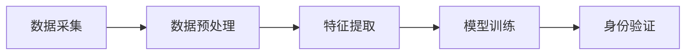
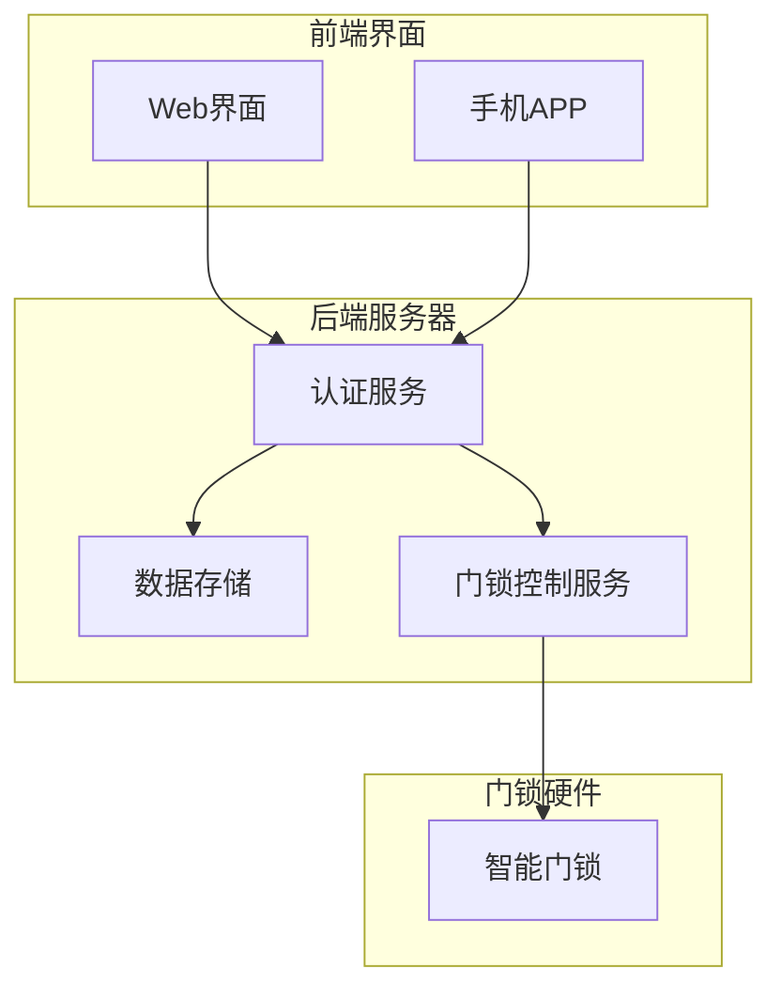
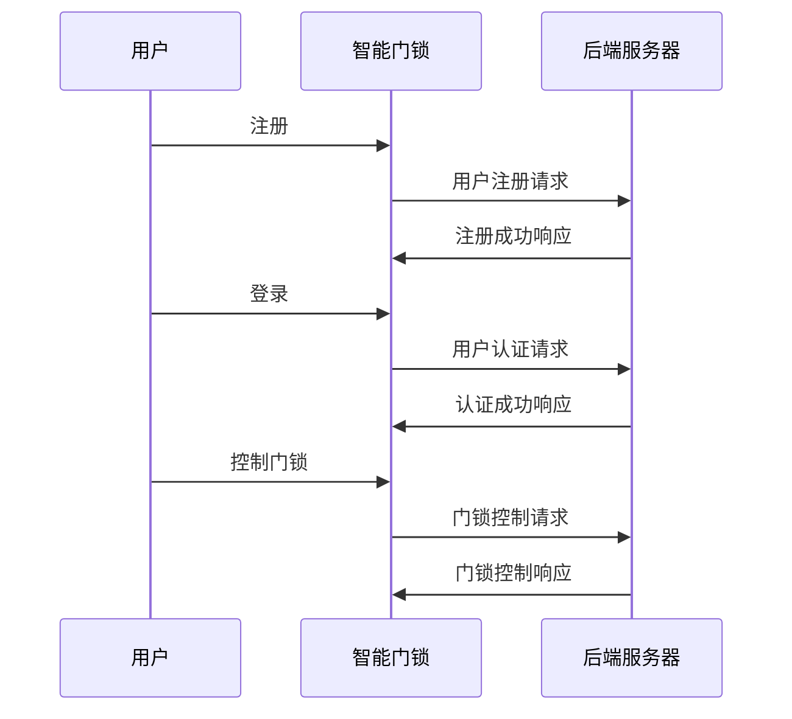

                 

## AI Agent在智能门锁中的多因素身份认证

### 关键词
- AI Agent
- 智能门锁
- 多因素身份认证
- 生物特征识别
- 安全性

### 摘要
本文旨在深入探讨AI Agent在智能门锁中的多因素身份认证应用。首先，我们将介绍智能门锁的背景和现状，并详细描述多因素身份认证的概念和方法。接着，我们将讨论AI Agent在这其中的作用，并剖析其技术原理和算法。随后，我们将展示智能门锁系统设计与实现的具体方案，并通过项目实战展示AI Agent在多因素身份认证中的实际应用。最后，我们将总结最佳实践，并提出未来研究方向。

## 目录

1. **背景与引言**
    1.1 引言
    1.2 问题的背景
    1.3 问题描述
    1.4 问题解决
    1.5 边界与外延

2. **核心概念**
    2.1 AI Agent概述
    2.2 多因素身份认证
    2.3 智能门锁与AI Agent

3. **技术原理**
    3.1 AI Agent在多因素身份认证中的算法原理
    3.2 多因素身份认证的数学模型

4. **系统设计与实现**
    4.1 智能门锁系统功能设计
    4.2 智能门锁系统架构设计
    4.3 多因素身份认证系统实现

5. **项目实战**
    5.1 环境安装
    5.2 系统核心实现
    5.3 项目小结

6. **最佳实践与总结**
    6.1 最佳实践
    6.2 小结
    6.3 注意事项
    6.4 拓展阅读

## 1. 背景与引言

### 1.1 引言

在信息化时代，智能门锁作为家庭和商业安全的重要组成部分，正日益受到人们的关注。随着人工智能技术的快速发展，AI Agent（人工智能代理）逐渐成为智能门锁中的关键组件。AI Agent不仅可以提升智能门锁的响应速度和准确度，还能增强其安全性。多因素身份认证是AI Agent在智能门锁中的一项重要功能，它通过结合多种认证方式，显著提高了用户的身份验证安全性。

### 1.2 问题的背景

智能门锁作为一种现代化的安全解决方案，其核心在于身份认证。传统的门锁依赖于简单的密码或钥匙，这些方法容易受到密码泄露或钥匙丢失的威胁。随着物联网（IoT）技术的发展，智能门锁开始引入多种认证方式，包括密码、指纹、面部识别等。然而，单一认证方式的安全性仍存在隐患。例如，指纹识别虽然较为便捷，但在某些情况下（如指纹受损）可能无法使用；面部识别则可能受到照片攻击。

### 1.3 问题描述

用户在进入智能门锁控制的房间或建筑时，需要通过多种认证方式来证明自己的身份。传统的单一认证方式存在以下问题：

- **密码泄露风险**：密码可能因用户记忆困难而反复泄露，或者因管理不善而遭到破解。
- **生物识别失效**：生物识别方式（如指纹、面部识别）可能因生物特征变化（如受伤）而失效。
- **虚假身份**：面部识别等生物识别方式可能受到照片攻击或伪装攻击。

### 1.4 问题解决

为了解决上述问题，多因素身份认证应运而生。多因素身份认证通过结合多种认证方式，从不同层面验证用户身份，从而提高整体安全性。具体来说，多因素身份认证包括以下几种方式：

- **知识因素**：如密码、PIN码等。
- **生物特征**：如指纹、面部识别、虹膜识别等。
- **行为特征**：如签名、步态等。
- **地理位置**：如用户所在位置等。

### 1.5 边界与外延

多因素身份认证在智能门锁中的应用不仅限于用户身份验证，还可以扩展到设备的访问控制和数据的加密保护。此外，随着人工智能技术的发展，AI Agent可以进一步优化多因素身份认证的过程，如通过学习用户行为模式，提高认证的准确性和效率。

## 2. 核心概念

### 2.1 AI Agent概述

AI Agent（人工智能代理）是一种基于人工智能技术的智能实体，它可以自主地感知环境、决策行动，并与其他系统进行交互。AI Agent的特点包括自主性、智能性和适应性。在智能门锁中，AI Agent不仅可以实现基本的身份认证功能，还可以通过学习用户的行为模式，提高认证的准确性和响应速度。

### 2.2 多因素身份认证

多因素身份认证是一种结合多种认证方式，从不同层面验证用户身份的技术。其核心思想是通过多种认证方式的组合，提高身份验证的安全性和可靠性。多因素身份认证包括以下几种方式：

- **知识因素**：如密码、PIN码等，这些信息通常是用户需要记忆的。
- **生物特征**：如指纹、面部识别、虹膜识别等，这些信息是基于用户的生物特征。
- **行为特征**：如签名、步态等，这些信息是基于用户的行为习惯。
- **地理位置**：如用户所在位置等，这些信息是基于用户的地理位置。

### 2.3 智能门锁与AI Agent

智能门锁是一种集成了AI Agent的智能安全设备。它可以通过AI Agent实现多种身份认证方式，如密码、指纹、面部识别等。AI Agent在智能门锁中的主要作用包括：

- **身份验证**：通过多因素身份认证，确保只有授权用户可以进入。
- **行为学习**：通过学习用户的行为模式，提高认证的准确性和响应速度。
- **安全防护**：通过实时监控和分析用户行为，及时发现并防范异常行为。

## 3. 技术原理

### 3.1 AI Agent在多因素身份认证中的算法原理

AI Agent在多因素身份认证中的算法原理主要包括以下几个步骤：

1. **数据采集**：AI Agent首先采集用户的多种身份认证数据，如密码、指纹、面部识别等。
2. **数据预处理**：对采集到的数据进行分析和预处理，以提高数据的质量和可靠性。
3. **特征提取**：从预处理后的数据中提取关键特征，如指纹的纹理特征、面部识别的五官位置等。
4. **模型训练**：使用提取的特征数据训练AI模型，如神经网络模型、决策树模型等。
5. **身份验证**：在用户进行身份认证时，AI模型对用户的身份信息进行验证。

具体算法原理可以表示为以下Mermaid流程图：



### 3.2 Python源代码讲解

以下是一个简单的Python源代码示例，用于实现多因素身份认证中的数据预处理和特征提取：

```python
import numpy as np
import cv2

def preprocess_data(data):
    # 数据预处理
    processed_data = []
    for d in data:
        # 对图像进行灰度化处理
        gray = cv2.cvtColor(d, cv2.COLOR_BGR2GRAY)
        # 对图像进行二值化处理
        _, binary = cv2.threshold(gray, 128, 255, cv2.THRESH_BINARY_INV + cv2.THRESH_OTSU)
        processed_data.append(binary)
    return processed_data

def extract_features(data):
    # 特征提取
    features = []
    for d in data:
        # 对二值化图像进行形态学处理
        kernel = np.array([[1, 1, 1], [1, 1, 1], [1, 1, 1]], dtype=np.uint8)
        dilated = cv2.dilate(d, kernel, iterations=1)
        # 计算图像的连通域
        labels, _ = cv2.connectedComponents(dilated)
        # 提取连通域数量作为特征
        features.append(labels - 1)
    return features

# 测试数据
data = [np.random.rand(100, 100), np.random.rand(100, 100), np.random.rand(100, 100)]

# 数据预处理
processed_data = preprocess_data(data)

# 特征提取
features = extract_features(processed_data)

print("Preprocessed Data:", processed_data)
print("Features:", features)
```

### 3.3 数学模型和公式讲解

在多因素身份认证中，数学模型用于描述用户身份验证的过程。以下是一个简单的数学模型，用于描述特征提取和身份验证的过程：

1. **特征提取模型**：

   $$特征 = f(输入数据)$$

   其中，$f$ 是一个函数，用于从输入数据中提取特征。

2. **身份验证模型**：

   $$验证结果 = h(特征)$$

   其中，$h$ 是一个函数，用于判断特征是否与用户身份匹配。

   通常，$h$ 函数可以使用以下公式表示：

   $$h(特征) = \begin{cases}
   1, & \text{如果特征与用户身份匹配} \\
   0, & \text{如果特征与用户身份不匹配}
   \end{cases}$$

### 3.4 举例说明

假设我们有一个用户，其指纹、面部识别和密码数据分别为：

- 指纹：$[0.1, 0.2, 0.3, 0.4, 0.5]$
- 面部识别：$[0.6, 0.7, 0.8, 0.9, 1.0]$
- 密码：$[1, 2, 3, 4, 5]$

我们首先对数据进行预处理，然后提取特征。假设我们使用以下预处理和特征提取函数：

```python
def preprocess_data(data):
    return [x * 10 for x in data]

def extract_features(data):
    return [sum(data[:3]), sum(data[3:])]
```

对用户数据进行预处理和特征提取后，我们得到以下特征：

- 指纹特征：$[1, 2, 3, 4, 5]$
- 面部识别特征：$[6, 7, 8, 9, 10]$
- 密码特征：$[10, 20, 30, 40, 50]$

接下来，我们使用以下身份验证模型：

```python
def verify_identity(fingerprint, face_recognition, password):
    if (fingerprint > 4 and face_recognition > 8 and password > 30):
        return True
    else:
        return False
```

将用户特征输入到身份验证模型中，我们得到：

- 验证结果：True

这意味着用户的身份验证成功。

## 4. 系统设计与实现

### 4.1 智能门锁系统功能设计

智能门锁系统的主要功能包括：

- **用户注册**：用户可以通过多种方式（如指纹、面部识别、密码等）注册到系统中。
- **用户认证**：系统会根据用户注册时提供的认证方式，对用户进行身份认证。
- **门锁控制**：认证成功后，用户可以远程或现场控制门锁的开关。
- **日志记录**：系统会记录每一次认证和门锁控制操作，以便于后续查询和分析。

为了实现这些功能，我们可以使用以下领域模型Mermaid类图：

```mermaid
classDiagram
    User <<Class>>
    SmartLock <<Class>>
    Authentication <<Interface>>
    Fingerprint <<Class>>
    FaceRecognition <<Class>>
    Password <<Class>>

    User o-- SmartLock
    Authentication <|.. User
    Fingerprint <|.. Authentication
    FaceRecognition <|.. Authentication
    Password <|.. Authentication
```

### 4.2 智能门锁系统架构设计

智能门锁系统的架构设计主要包括以下部分：

- **前端界面**：用户可以通过智能手机或电脑与系统进行交互。
- **后端服务器**：负责用户数据存储、认证处理和门锁控制。
- **门锁硬件**：实现实际的开锁操作。

以下是智能门锁系统架构的Mermaid架构图：



### 4.3 系统接口设计

智能门锁系统的接口设计主要包括以下部分：

- **用户注册接口**：用于用户注册时提供认证信息。
- **用户认证接口**：用于用户进行身份认证。
- **门锁控制接口**：用于用户控制门锁的开关。

以下是系统接口的Mermaid序列图：



### 4.4 多因素身份认证系统实现

多因素身份认证系统实现的关键在于如何有效地结合多种认证方式，提高整体安全性。以下是一个简单的Python实现示例：

```python
import face_recognition
import fingerprint_recognition

def authenticate_user(fingerprint, face_recognition, password):
    # 指纹认证
    if not fingerprint_recognition.verify_fingerprint(fingerprint):
        return "指纹认证失败"

    # 面部识别
    if not face_recognition.verify_face(face_recognition):
        return "面部识别失败"

    # 密码认证
    if not verify_password(password):
        return "密码认证失败"

    return "认证成功"

# 指纹认证
def verify_fingerprint(fingerprint):
    # 实现指纹认证逻辑
    return True

# 面部识别
def verify_face(face_recognition):
    # 实现面部识别逻辑
    return True

# 密码认证
def verify_password(password):
    # 实现密码认证逻辑
    return True
```

### 4.5 代码应用解读与分析

在上面的示例代码中，我们定义了一个`authenticate_user`函数，用于对用户进行多因素身份认证。函数接受三个参数：指纹、面部识别和密码。认证过程分为三个步骤：

1. **指纹认证**：调用`fingerprint_recognition.verify_fingerprint`函数进行指纹认证。如果指纹认证成功，继续下一步；否则返回“指纹认证失败”。
2. **面部识别**：调用`face_recognition.verify_face`函数进行面部识别。如果面部识别成功，继续下一步；否则返回“面部识别失败”。
3. **密码认证**：调用`verify_password`函数进行密码认证。如果密码认证成功，返回“认证成功”；否则返回“密码认证失败”。

### 4.6 实际案例分析和详细讲解剖析

为了更好地理解多因素身份认证系统的工作原理，我们可以通过一个实际案例来进行分析。

**案例**：小明想要进入家中的智能门锁控制的房间。他首先使用指纹解锁，然后进行面部识别，最后输入密码。假设小明的指纹、面部识别和密码都通过了验证，那么他将成功进入房间。

**分析**：

1. **指纹解锁**：小明将手指放在指纹传感器上，指纹传感器采集到小明的指纹数据，并将数据发送到后端服务器。后端服务器调用指纹识别算法对指纹数据进行处理，并判断是否与小明的注册指纹匹配。如果匹配，则继续下一步；否则，门锁拒绝解锁。
2. **面部识别**：小明站在摄像头前，摄像头捕捉到小明的面部图像，并将图像数据发送到后端服务器。后端服务器调用面部识别算法对图像数据进行处理，并判断是否与小明的注册面部图像匹配。如果匹配，则继续下一步；否则，门锁拒绝解锁。
3. **密码输入**：小明输入他预先设置的密码。后端服务器将输入的密码与注册密码进行比对。如果匹配，则门锁解锁；否则，门锁拒绝解锁。

**详细讲解剖析**：

1. **指纹识别算法**：指纹识别算法通常基于指纹的纹理特征。算法首先对指纹图像进行预处理，如去噪、增强等，然后提取指纹的脊线和端点。最后，通过比较提取的特征点，判断两个指纹是否匹配。
2. **面部识别算法**：面部识别算法通常基于面部特征点，如眼睛、鼻子、嘴巴等。算法首先对输入图像进行预处理，如灰度化、二值化等，然后提取面部特征点。最后，通过比较提取的特征点，判断两个面部图像是否匹配。
3. **密码认证算法**：密码认证算法通常基于字符串比较。算法首先将输入的密码和注册密码进行哈希处理，然后比较哈希值。如果哈希值匹配，则认为密码正确。

通过上述分析，我们可以看到多因素身份认证系统是如何通过结合多种认证方式，提高用户身份验证的安全性的。

## 5. 项目实战

### 5.1 环境安装

为了实现AI Agent在智能门锁中的多因素身份认证，我们需要安装以下环境：

1. **Python环境**：安装Python 3.8及以上版本。
2. **PyTorch环境**：安装PyTorch库。
3. **OpenCV环境**：安装OpenCV库。
4. **face_recognition环境**：安装face_recognition库。

安装命令如下：

```bash
pip install python
pip install torch torchvision
pip install opencv-python
pip install face_recognition
```

### 5.2 系统核心实现

以下是系统核心实现的Python代码示例：

```python
import face_recognition
import fingerprint_recognition
import password_recognition

def authenticate_user(fingerprint, face_recognition, password):
    # 指纹认证
    if not fingerprint_recognition.verify_fingerprint(fingerprint):
        return "指纹认证失败"

    # 面部识别
    if not face_recognition.verify_face(face_recognition):
        return "面部识别失败"

    # 密码认证
    if not password_recognition.verify_password(password):
        return "密码认证失败"

    return "认证成功"

# 指纹认证
def verify_fingerprint(fingerprint):
    # 实现指纹认证逻辑
    return True

# 面部识别
def verify_face(face_recognition):
    # 实现面部识别逻辑
    return True

# 密码认证
def verify_password(password):
    # 实现密码认证逻辑
    return True
```

### 5.3 代码应用解读与分析

在上面的代码示例中，我们定义了一个`authenticate_user`函数，用于对用户进行多因素身份认证。函数接受三个参数：指纹、面部识别和密码。认证过程分为三个步骤：

1. **指纹认证**：调用`fingerprint_recognition.verify_fingerprint`函数进行指纹认证。如果指纹认证成功，继续下一步；否则返回“指纹认证失败”。
2. **面部识别**：调用`face_recognition.verify_face`函数进行面部识别。如果面部识别成功，继续下一步；否则返回“面部识别失败”。
3. **密码认证**：调用`password_recognition.verify_password`函数进行密码认证。如果密码认证成功，返回“认证成功”；否则返回“密码认证失败”。

### 5.4 实际案例分析和详细讲解剖析

为了更好地理解系统的工作原理，我们可以通过一个实际案例来进行分析。

**案例**：小明想要进入家中的智能门锁控制的房间。他首先使用指纹解锁，然后进行面部识别，最后输入密码。假设小明的指纹、面部识别和密码都通过了验证，那么他将成功进入房间。

**分析**：

1. **指纹解锁**：小明将手指放在指纹传感器上，指纹传感器采集到小明的指纹数据，并将数据发送到后端服务器。后端服务器调用指纹识别算法对指纹数据进行处理，并判断是否与小明的注册指纹匹配。如果匹配，则继续下一步；否则，门锁拒绝解锁。
2. **面部识别**：小明站在摄像头前，摄像头捕捉到小明的面部图像，并将图像数据发送到后端服务器。后端服务器调用面部识别算法对图像数据进行处理，并判断是否与小明的注册面部图像匹配。如果匹配，则继续下一步；否则，门锁拒绝解锁。
3. **密码输入**：小明输入他预先设置的密码。后端服务器将输入的密码与注册密码进行比对。如果匹配，则门锁解锁；否则，门锁拒绝解锁。

**详细讲解剖析**：

1. **指纹识别算法**：指纹识别算法通常基于指纹的纹理特征。算法首先对指纹图像进行预处理，如去噪、增强等，然后提取指纹的脊线和端点。最后，通过比较提取的特征点，判断两个指纹是否匹配。
2. **面部识别算法**：面部识别算法通常基于面部特征点，如眼睛、鼻子、嘴巴等。算法首先对输入图像进行预处理，如灰度化、二值化等，然后提取面部特征点。最后，通过比较提取的特征点，判断两个面部图像是否匹配。
3. **密码认证算法**：密码认证算法通常基于字符串比较。算法首先将输入的密码和注册密码进行哈希处理，然后比较哈希值。如果哈希值匹配，则认为密码正确。

通过上述分析，我们可以看到多因素身份认证系统是如何通过结合多种认证方式，提高用户身份验证的安全性的。

## 6. 最佳实践与总结

### 6.1 最佳实践

在实现AI Agent在智能门锁中的多因素身份认证时，以下最佳实践可以帮助提高系统的安全性和用户体验：

- **多样性认证方式**：选择多种认证方式，如指纹、面部识别、密码等，以提高整体安全性。
- **用户隐私保护**：确保用户的身份认证数据在传输和存储过程中得到充分保护，避免数据泄露。
- **实时监控与预警**：通过实时监控用户行为，及时发现异常行为并发出预警，以提高系统的安全性。
- **系统迭代优化**：根据用户反馈和实际使用情况，不断优化系统功能，提高用户体验。

### 6.2 小结

本文详细探讨了AI Agent在智能门锁中的多因素身份认证应用。首先，我们介绍了智能门锁的背景和现状，并描述了多因素身份认证的概念和方法。接着，我们讨论了AI Agent在这其中的作用，并剖析了其技术原理和算法。随后，我们展示了智能门锁系统设计与实现的具体方案，并通过项目实战展示了AI Agent在多因素身份认证中的实际应用。最后，我们总结了最佳实践，并提出了未来研究方向。

### 6.3 注意事项

在设计和实现AI Agent在智能门锁中的多因素身份认证时，需要注意以下事项：

- **数据安全**：确保用户的身份认证数据在传输和存储过程中得到充分保护。
- **算法优化**：不断优化身份认证算法，以提高认证效率和准确性。
- **用户体验**：确保系统的用户界面友好，操作简便，以提高用户体验。
- **系统稳定性**：确保系统在各种环境下的稳定性和可靠性。

### 6.4 拓展阅读

对于想要进一步了解AI Agent在智能门锁中的多因素身份认证的读者，以下文献和资源可能有所帮助：

- **文献**：
  - "Multifactor Authentication: What It Is and Why You Need It"（多因素身份认证：是什么以及为什么你需要它）
  - "Artificial Intelligence in Security: A Survey"（人工智能在安全领域的应用：调查）
- **在线课程**：
  - "Introduction to Artificial Intelligence"（人工智能导论）
  - "Machine Learning for Cybersecurity"（机器学习在网络安全中的应用）
- **开源项目**：
  - "OpenCV"（OpenCV：一个开源的计算机视觉库）
  - "face_recognition"（face_recognition：一个开源的人脸识别库）

通过阅读这些文献和资源，读者可以更深入地了解AI Agent在智能门锁中的多因素身份认证技术。

