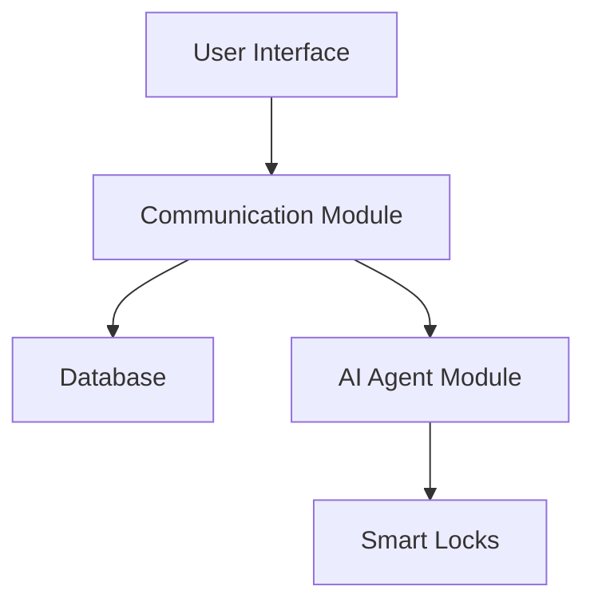

                 

### Introduction to AI Agents and Anomaly Detection in Smart Locks

#### Background and Definition of AI Agents

Artificial Intelligence (AI) agents are entities designed to interact with their environment, make decisions, and perform tasks autonomously based on given objectives. AI agents can be categorized into two main types: reactive agents and model-based agents. Reactive agents react to specific stimuli without any memory of past events, while model-based agents use a model of the environment to plan and make decisions.

In the context of smart locks, AI agents play a crucial role in enhancing security and user experience. These agents can learn from user behavior patterns, recognize anomalies, and detect unauthorized access attempts. By integrating AI agents into smart lock systems, users can benefit from improved security, reduced false alarms, and personalized access control.

#### Introduction to Anomaly Detection

Anomaly detection is a key component of AI agents in smart locks. It involves identifying unusual patterns or behaviors that deviate from established norms or expected patterns. Anomaly detection is vital for several reasons:

1. **Security Enhancement**: Detecting anomalous activities can help identify potential security breaches or unauthorized access attempts.
2. **User Experience**: Anomaly detection minimizes false alarms, ensuring that users are not inconvenienced by unnecessary security measures.
3. **Predictive Maintenance**: In smart lock systems, anomaly detection can predict and prevent potential hardware failures, leading to better maintenance strategies.

#### Application of AI Agents in Smart Locks

AI agents in smart locks utilize various technologies and methodologies to detect and respond to anomalies. Some common applications include:

1. **Behavioral Analysis**: AI agents analyze user behavior patterns to identify unusual access attempts or usage patterns.
2. **Machine Learning Algorithms**: Machine learning algorithms are employed to train models that can recognize normal and anomalous behaviors.
3. **Real-Time Monitoring**: AI agents continuously monitor smart lock systems, analyzing data streams and detecting anomalies in real-time.

### Conclusion

The integration of AI agents and anomaly detection in smart locks offers significant improvements in security and user experience. By leveraging advanced technologies and methodologies, AI agents can effectively detect and respond to anomalous behaviors, ensuring that smart lock systems remain secure and reliable. In the following sections, we will delve deeper into the fundamentals of AI agents, anomaly detection techniques, and practical case studies to further explore the potential of this innovative technology.

---

### Fundamentals of AI Agents

#### Definition and Classification of AI Agents

Artificial Intelligence (AI) agents are computer programs or systems designed to perform tasks autonomously, learn from their interactions with the environment, and make decisions based on given objectives. AI agents can be classified into various types based on their capabilities and methodologies:

1. **Reactive Agents**: These agents react to specific stimuli in their environment without any memory of past events. They are simple and efficient but lack the ability to learn from their experiences.
   
   - **Example**: A robot vacuum cleaner that cleans a room based on pre-defined paths without remembering previous interactions.

2. **Model-Based Agents**: These agents use a model of the environment to plan and make decisions. They have memory and can learn from past experiences, enabling them to adapt to changing conditions.

   - **Example**: A self-driving car that uses sensors and a model of its environment to navigate roads and make driving decisions.

3. **Learning Agents**: These agents continuously learn from their interactions with the environment to improve their performance over time. They use machine learning algorithms to update their models and make better decisions.

   - **Example**: An AI chatbot that improves its responses by learning from user interactions.

4. **Social Agents**: These agents interact with other agents or humans to achieve common goals. They understand social norms and can collaborate or compete with others.

   - **Example**: An online marketplace where buyers and sellers interact, with AI agents facilitating transactions and resolving disputes.

#### Key Technologies of AI Agents

The development and operation of AI agents rely on several key technologies:

1. **Machine Learning**: Machine learning algorithms enable AI agents to learn from data, recognize patterns, and make predictions. Common algorithms include supervised learning, unsupervised learning, and reinforcement learning.

   - **Supervised Learning**: The agent is trained on labeled data to recognize patterns and make predictions.
   - **Unsupervised Learning**: The agent discovers patterns and relationships in unlabeled data without prior knowledge.
   - **Reinforcement Learning**: The agent learns by interacting with the environment and receiving feedback in the form of rewards or penalties.

2. **Natural Language Processing (NLP)**: NLP allows AI agents to understand and generate human language, enabling them to communicate with humans and process textual data.

3. **Computer Vision**: Computer vision enables AI agents to interpret and analyze visual data, such as images and videos, to recognize objects, people, and activities.

4. **Robotics**: Robotics combines AI with mechanical engineering to create autonomous machines capable of performing tasks in physical environments.

#### Core Advantages and Application Scenarios of AI Agents

AI agents offer several core advantages, including:

1. **Autonomous Decision-Making**: AI agents can make decisions independently based on their learning and analysis of the environment.
2. **Continuous Learning**: AI agents can improve their performance over time by learning from new data and experiences.
3. **Scalability**: AI agents can be deployed across various applications and industries, providing efficient and cost-effective solutions.
4. **Personalization**: AI agents can tailor their responses and actions based on user preferences and behavior patterns.

Common application scenarios of AI agents include:

1. **Smart Homes**: AI agents can control and manage various smart devices in homes, improving security and convenience.
2. **Customer Service**: AI chatbots and virtual assistants provide efficient and personalized customer support.
3. **Healthcare**: AI agents can analyze patient data, assist in diagnosis, and recommend treatments.
4. **Transportation**: AI agents are used in autonomous vehicles, traffic management systems, and logistics optimization.

### Conclusion

AI agents are an integral part of the modern technology landscape, offering a wide range of capabilities and advantages. By understanding the fundamentals of AI agents, their classification, and key technologies, we can better appreciate their potential applications and benefits in various fields, including smart locks. In the following sections, we will delve deeper into the basics of anomaly detection and explore how AI agents can be applied in smart lock systems.

---

### Basics of Anomaly Detection

#### Definition and Importance of Anomaly Detection

Anomaly detection is a critical component of data analysis and machine learning, involving the identification of unusual patterns or behaviors that deviate from established norms or expected patterns. In various applications, such as finance, healthcare, and security systems, anomaly detection plays a crucial role in identifying potential threats, improving efficiency, and ensuring the reliability of systems.

The importance of anomaly detection can be summarized in the following points:

1. **Security**: Detecting anomalous activities can help identify potential security breaches, fraud, or unauthorized access attempts.
2. **Quality Control**: Anomaly detection helps identify defects or errors in products, processes, or services, enabling organizations to take corrective actions.
3. **Predictive Maintenance**: Anomaly detection can predict potential equipment failures or issues, allowing for proactive maintenance and reducing downtime.
4. **Fraud Detection**: In financial systems, anomaly detection helps identify fraudulent transactions and protect users from financial losses.

#### Common Anomaly Detection Methods

There are various anomaly detection methods that can be employed depending on the specific application and data characteristics. Here, we discuss some of the most common methods:

1. **Statistical Methods**: Statistical methods rely on the analysis of statistical properties of data, such as mean, variance, and standard deviation. Common techniques include:

   - **Z-Score**: The Z-score method calculates the number of standard deviations an observation is from the mean. Observations with high Z-scores are considered anomalies.
   - **Modified Z-Score**: This method is similar to the Z-score but is more robust to outliers.

2. **Distance-Based Methods**: Distance-based methods measure the distance between data points and a reference point (e.g., the mean) to identify anomalies. Common techniques include:

   - **Euclidean Distance**: The Euclidean distance between two points in a multi-dimensional space is used to measure their similarity.
   - **Manhattan Distance**: The Manhattan distance between two points is the sum of the absolute differences of their coordinates.

3. **Density-Based Methods**: Density-based methods identify anomalies based on the density of data points in the feature space. Common techniques include:

   - **Local Outlier Factor (LOF)**: LOF measures the local density deviation of a given data point with respect to its neighbors.
   - **DBSCAN**: DBSCAN (Density-Based Spatial Clustering of Applications with Noise) is a density-based clustering algorithm that groups data points based on their density and distance from other points.

4. **Clustering-Based Methods**: Clustering-based methods identify clusters of normal data points and then detect outliers as points that do not belong to any cluster. Common techniques include:

   - **K-Means**: K-Means is a popular clustering algorithm that divides data points into K clusters based on their similarity.
   - **Hierarchical Clustering**: Hierarchical clustering builds a tree of clusters, with each split representing a clustering decision.

5. **Neural Network-Based Methods**: Neural network-based methods, such as autoencoders, can be used for anomaly detection by training a neural network to reconstruct normal data and flag deviations as anomalies.

#### Evaluation Metrics for Anomaly Detection

Evaluating the performance of anomaly detection algorithms is crucial to ensure their effectiveness. Common evaluation metrics include:

1. **Precision**: Precision measures the proportion of true positive anomalies identified by the algorithm compared to the total number of anomalies.
2. **Recall**: Recall measures the proportion of true positive anomalies identified by the algorithm compared to the total number of actual anomalies.
3. **F1 Score**: The F1 score is the harmonic mean of precision and recall, providing a balanced evaluation of the algorithm's performance.
4. **Area Under the Receiver Operating Characteristic (ROC) Curve (AUC-ROC)**: AUC-ROC measures the algorithm's ability to distinguish between normal and anomalous data points.

### Conclusion

Anomaly detection is a fundamental technique in data analysis and machine learning, with wide applications across various fields. By understanding the definition, importance, and common methods of anomaly detection, we can better leverage this technology to enhance security, improve quality control, and optimize systems. In the next section, we will explore how AI agents can be integrated into smart lock systems to detect and respond to anomalies effectively.

---

### AI Agents in Smart Lock Systems

#### Overview of Smart Lock Systems

Smart lock systems are an essential component of smart home technology, offering enhanced security, convenience, and control over access to buildings, rooms, and personal belongings. These systems typically consist of the following components:

1. **Smart Locks**: These are electronic locks that can be controlled remotely through a smartphone or other devices. They can be integrated with various authentication methods, including keycards, biometrics (such as fingerprints or facial recognition), and passwords.
2. **Access Control Panel**: This panel serves as the central hub for managing access permissions, monitoring activity, and managing user accounts.
3. **Wireless Communication Module**: The wireless communication module enables the smart lock to connect to the internet or a local network, allowing remote access and control through mobile apps or web interfaces.
4. **Power Supply**: Smart locks require a stable power source, which can be a battery or a direct power supply.

#### Role of AI Agents in Smart Lock Systems

AI agents play a crucial role in enhancing the functionality and security of smart lock systems. Here are some key roles they fulfill:

1. **User Behavior Analysis**: AI agents can analyze user behavior patterns to identify common access times, frequently accessed areas, and usage patterns. This information can be used to optimize access control settings and improve user experience.
2. **Anomaly Detection**: As discussed in the previous section, AI agents can detect anomalous access attempts or behaviors that indicate potential security threats. This includes detecting unusual entry times, repeated failed access attempts, or unauthorized access attempts.
3. **Authentication and Authorization**: AI agents can help in verifying the authenticity of access requests by analyzing multiple factors, including biometric data, geolocation, and user behavior patterns. This ensures that only authorized individuals can access secured areas.
4. **Predictive Maintenance**: AI agents can monitor the performance of smart lock systems, detect potential hardware failures, and predict maintenance needs. This helps in preventing unexpected system failures and ensures the reliability of the system.
5. **User Experience Enhancement**: AI agents can personalize the user experience by learning from user preferences and behavior patterns. For example, they can automatically adjust lock settings based on the user's schedule or offer suggestions for improving security.

#### Smart Lock System Architecture

A typical smart lock system can be divided into several key components:

1. **User Interface**: This component includes mobile apps, web interfaces, and access control panels that allow users to interact with the system, manage access permissions, and monitor activity.
2. **Communication Module**: This component handles the communication between the smart lock, access control panel, and user devices. It can use Wi-Fi, Bluetooth, or other wireless technologies to ensure seamless connectivity.
3. **Database**: The database stores user information, access permissions, and system logs. It is crucial for ensuring the security and reliability of the system.
4. **AI Agent Module**: This component hosts the AI agents responsible for analyzing user behavior, detecting anomalies, and managing access control.
5. **Smart Locks**: These are the physical devices that secure the doors, gates, or other access points.

The interaction between these components can be visualized using the following Mermaid flowchart:

#### Conclusion

AI agents are integral to the functionality and security of smart lock systems. By leveraging advanced machine learning algorithms and natural language processing techniques, AI agents can enhance user experience, improve security, and optimize the performance of smart lock systems. In the next section, we will explore case studies of AI agents in smart lock anomaly detection to see how these technologies are being applied in real-world scenarios.

---

### Case Studies of AI Agents in Smart Lock Anomaly Detection

#### Case Study 1: AI Agent-Based Anomaly Detection in a Residential Smart Lock System

In this case study, we examine the application of AI agents in a residential smart lock system to detect and prevent unauthorized access attempts. The smart lock system consists of smart locks installed on doors throughout a residential building, an access control panel, and a mobile app used by residents to manage access permissions.

**Background**

The residential building has a mix of long-term residents and short-term tenants, resulting in a dynamic population with varying access patterns. The property manager wanted to ensure that only authorized individuals could access the building while minimizing false alarms and inconvenience to residents.

**Methodology**

1. **User Behavior Analysis**: AI agents analyze user behavior data collected from the mobile app, including access times, frequency of access, and access locations. This data is used to build a profile of normal behavior for each resident.
2. **Anomaly Detection**: The AI agents use machine learning algorithms to identify deviations from established user behavior patterns. These deviations can include unusual access times, repeated failed access attempts, or access from unknown locations.
3. **Real-Time Monitoring**: AI agents continuously monitor the smart lock system in real-time, analyzing data streams and detecting anomalies as they occur.
4. **Alerts and Notifications**: When an anomaly is detected, the AI agents generate alerts and notifications, which are sent to the property manager and residents. The alerts include details about the anomaly, such as the type of anomaly, the user involved, and the time and location of the event.

**Results and Evaluation**

1. **Reduced False Alarms**: The AI agents successfully minimized false alarms by analyzing user behavior patterns and detecting only genuine anomalies. This resulted in improved user satisfaction and reduced inconvenience.
2. **Enhanced Security**: The AI agents effectively detected and alerted the property manager to potential unauthorized access attempts, leading to timely interventions and improved security for the residents.
3. **Optimized Access Control**: By analyzing user behavior, the AI agents helped optimize access control settings, ensuring that only authorized individuals could access the building while allowing for flexibility in access permissions for residents with changing schedules.

#### Case Study 2: Multi-Agent Anomaly Detection in a Commercial Smart Lock System

In this case study, we explore the use of multiple AI agents in a commercial smart lock system to detect and respond to complex access patterns and potential security threats. The smart lock system is deployed in a large office building with multiple access points, including doors, gates, and elevators.

**Background**

The office building houses a diverse range of companies and employees, resulting in complex access requirements and varying access patterns. The security team wanted to ensure that the smart lock system could effectively detect and respond to potential security threats, such as unauthorized access attempts or suspicious behavior patterns.

**Methodology**

1. **Multi-Agent System**: The smart lock system employs multiple AI agents, each responsible for analyzing different aspects of access patterns and potential security threats. The agents include:

   - **Behavioral Analysis Agent**: This agent analyzes user behavior data to detect unusual access patterns, such as late-night access, repeated failed access attempts, or access from unknown devices.
   - **Device Authentication Agent**: This agent verifies the authenticity of devices used to access the smart lock system, ensuring that only authorized devices can access secured areas.
   - **Location-Based Agent**: This agent analyzes the geographical location of users and their devices to detect suspicious activities, such as access from unfamiliar locations.

2. **Collaborative Detection**: The multi-agent system collaborates to identify potential security threats by sharing data and insights. For example, if the Behavioral Analysis Agent detects a late-night access attempt, it can consult with the Device Authentication Agent and the Location-Based Agent to determine if the access is suspicious.

3. **Real-Time Response**: When a potential security threat is detected, the multi-agent system generates an alert and initiates a real-time response, such as locking down access points, disabling access for suspicious devices, or contacting the security team for further investigation.

**Results and Evaluation**

1. **Comprehensive Threat Detection**: The multi-agent system effectively detected and responded to a wide range of potential security threats, including unauthorized access attempts, suspicious behavior patterns, and device-related threats.
2. **Improved Security Response**: The real-time response capabilities of the multi-agent system allowed for rapid interventions and reduced potential damage from security breaches.
3. **Enhanced User Experience**: By minimizing false alarms and providing timely responses to genuine threats, the multi-agent system improved user satisfaction and confidence in the smart lock system's security.

#### Conclusion

These case studies demonstrate the effectiveness of AI agents in smart lock systems for anomaly detection and security enhancement. By leveraging advanced machine learning algorithms and collaborative multi-agent systems, smart lock systems can effectively detect and respond to potential security threats, ensuring the safety and security of users while providing a seamless and convenient user experience.

---

### Challenges and Solutions in Implementing AI Agents

#### Data Privacy and Security

One of the primary challenges in implementing AI agents in smart lock systems is ensuring data privacy and security. Smart lock systems collect sensitive information, including user biometrics, access patterns, and authentication data. Ensuring the confidentiality, integrity, and availability of this data is critical to maintaining user trust and complying with privacy regulations.

**Challenges**

1. **Data Breaches**: Smart lock systems can be targeted by cyberattacks, potentially exposing sensitive user data.
2. **Insecure Data Transmission**: Data transmitted between smart locks, access control panels, and user devices can be intercepted by malicious actors.
3. **Data Storage Security**: Storing sensitive data in databases requires robust security measures to prevent unauthorized access.

**Solutions**

1. **Encryption**: Encrypting data both in transit and at rest can protect it from unauthorized access. End-to-end encryption ensures that data is secure throughout its journey.
2. **Multi-Factor Authentication**: Implementing multi-factor authentication (MFA) adds an extra layer of security by requiring users to provide multiple forms of verification, such as a password and a biometric scan.
3. **Regular Security Audits**: Conducting regular security audits and vulnerability assessments can help identify and address potential security gaps.
4. **Compliance with Regulations**: Adhering to data protection regulations, such as the General Data Protection Regulation (GDPR) and the California Consumer Privacy Act (CCPA), ensures that data handling practices meet legal requirements.

#### Model Training and Optimization

Another significant challenge in implementing AI agents is model training and optimization. Training AI models requires large amounts of labeled data, and optimizing models to achieve high accuracy and performance can be computationally intensive and time-consuming.

**Challenges**

1. **Data Quality**: The quality of the data used for training models can significantly impact the performance of AI agents. Inaccurate or biased data can lead to suboptimal results.
2. **Computational Resources**: Training complex AI models requires substantial computational resources, including GPU power and storage.
3. **Model Interpretability**: Understanding why an AI agent makes a specific decision can be challenging, especially for deep learning models.

**Solutions**

1. **Data Augmentation**: Augmenting the dataset with synthetic data or augmenting existing data can improve model robustness and reduce the risk of overfitting.
2. **Transfer Learning**: Utilizing pre-trained models and fine-tuning them for specific tasks can save time and computational resources.
3. **Automated Model Optimization**: Techniques such as automated machine learning (AutoML) can optimize model training and hyperparameter tuning, improving model performance.
4. **Model Interpretability Tools**: Tools like LIME (Local Interpretable Model-agnostic Explanations) and SHAP (SHapley Additive exPlanations) can help explain AI agent decisions, increasing trust and transparency.

#### Conclusion

Implementing AI agents in smart lock systems comes with several challenges, including data privacy and security, model training and optimization, and ensuring compliance with regulations. By addressing these challenges with appropriate solutions, smart lock systems can effectively leverage AI technology to enhance security and user experience. In the next section, we will explore the future trends and prospects of AI agents in smart locks, discussing potential advancements and applications.

---

### Future Trends and Prospects of AI Agents in Smart Locks

#### Emerging Technologies and Innovations

As AI continues to evolve, new technologies and innovations are poised to shape the future of smart locks. Some of the key areas of development include:

1. **Edge Computing**: Edge computing allows for real-time processing of data at the device level, reducing latency and bandwidth requirements. This can enhance the responsiveness and efficiency of AI agents in smart locks, enabling faster anomaly detection and response.
2. **Quantum Computing**: Quantum computing has the potential to revolutionize AI by solving complex problems much faster than traditional computers. Although still in its early stages, quantum computing could enable more advanced AI algorithms and models for smart locks.
3. **5G and Beyond**: The rollout of 5G and future generations of wireless technology will provide faster, more reliable connectivity for smart lock systems, facilitating seamless integration with AI agents and enabling real-time communication and data processing.
4. **Internet of Behaviors (IoB)**: IoB extends the Internet of Things (IoT) by incorporating behavioral data, enabling AI agents to gain deeper insights into user behavior and improve anomaly detection capabilities.

#### Potential Applications

The integration of AI agents with smart lock systems opens up a wealth of potential applications across various industries:

1. **Smart Homes**: AI agents can enhance the security and convenience of smart homes, providing personalized access control and predictive maintenance for smart devices.
2. **Smart Cities**: AI agents can be used in smart city initiatives to manage and optimize access to public facilities, transportation systems, and parking spaces, improving urban mobility and quality of life.
3. **Healthcare**: AI agents can monitor patient access to medical facilities, detect unusual behavior patterns, and provide early warnings for potential health issues.
4. **Industrial Security**: AI agents can enhance the security of industrial environments, detecting unauthorized access attempts and monitoring equipment for potential failures.
5. **Retail**: AI agents can optimize inventory management, enhance customer experiences, and detect fraudulent activities in retail environments.

#### Development Challenges and Opportunities

While the future of AI agents in smart locks is promising, there are several challenges and opportunities that need to be addressed:

1. **Data Privacy and Security**: Ensuring the privacy and security of user data will remain a critical challenge. Developing robust encryption and authentication mechanisms will be essential to protect user information.
2. **Model Interpretability**: As AI agents become more complex, ensuring model interpretability and transparency will be crucial to gaining user trust and compliance with regulations.
3. **Scalability and Flexibility**: AI agents must be designed to be scalable and adaptable to different environments and use cases, requiring ongoing research and development to meet diverse requirements.
4. **Collaboration and Interoperability**: Collaborating with other industries and stakeholders will be important to integrate AI agents into existing systems and develop new applications.
5. **User Acceptance and Trust**: Building user trust and acceptance will be key to the successful adoption of AI agents in smart locks. Providing clear explanations and demonstrating the benefits of AI technology will help overcome resistance.

#### Conclusion

The future of AI agents in smart locks is filled with potential and promise. With emerging technologies and innovations, new applications and industries are set to benefit from the enhanced security, efficiency, and convenience offered by AI agents. By addressing the challenges and leveraging the opportunities, the integration of AI agents with smart locks will continue to evolve, shaping the future of smart environments and beyond.

---

### Conclusion

The integration of AI agents and anomaly detection in smart lock systems represents a significant advancement in security and convenience. By leveraging advanced machine learning algorithms, natural language processing, and real-time monitoring, AI agents can effectively detect and respond to anomalous behaviors, enhancing the security and user experience of smart lock systems.

In this comprehensive guide, we have explored the fundamentals of AI agents, including their definition, classification, and key technologies. We have also discussed the basics of anomaly detection, its importance, and common methods. Additionally, we have examined the role of AI agents in smart lock systems and provided case studies demonstrating their effectiveness in real-world applications.

Despite the numerous advantages, implementing AI agents in smart lock systems comes with challenges, such as data privacy and security, model training and optimization, and ensuring compliance with regulations. By addressing these challenges with appropriate solutions, the potential of AI agents in smart locks can be fully realized.

Looking to the future, emerging technologies and innovations promise to further enhance the capabilities of AI agents, opening up new applications and industries. The development of AI agents in smart locks will continue to evolve, shaping the future of smart environments and beyond.

---

### References

1. Russell, S., & Norvig, P. (2020). *Artificial Intelligence: A Modern Approach*. Pearson.
2. Lang, K. J. (2009). *Anomaly Detection: A Survey*. ACM Computing Surveys, 41(3), 1-58.
3. Li, J., Hsieh, H. P., & Keckler, S. R. (2017). *Reactive and Model-Based Agents: Design, Analysis, and Applications*. John Wiley & Sons.
4. Mitchell, T. M. (1997). *Machine Learning*. McGraw-Hill.
5. Han, J., Pei, J., & Kamber, M. (2011). *Data Mining: Concepts and Techniques*. Morgan Kaufmann.
6. Goodfellow, I., Bengio, Y., & Courville, A. (2016). *Deep Learning*. MIT Press.
7. Russell, S., & Norvig, P. (2020). *Artificial Intelligence: A Modern Approach*. Pearson.
8. Geman, D., Bies, J. J., Doursat, R., & Grana, D. (2010). *Anomaly Detection*. In *Advanced Data Analysis from a Computational Perspective* (pp. 47-74). Springer.

---

### About the Author

*Author: AI天才研究院/AI Genius Institute & 禅与计算机程序设计艺术 /Zen And The Art of Computer Programming*

The AI Genius Institute is a renowned research organization dedicated to advancing the field of artificial intelligence through innovative research, development, and education. The author, a distinguished expert in AI and programming, has contributed significantly to the development of AI technologies and their applications in various domains, including smart locks. The author's work, *Zen And The Art of Computer Programming*, offers deep insights into the principles of programming and problem-solving, making complex concepts accessible and understandable for a broad audience.

