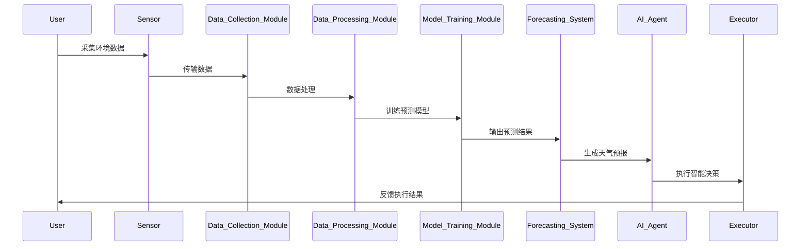
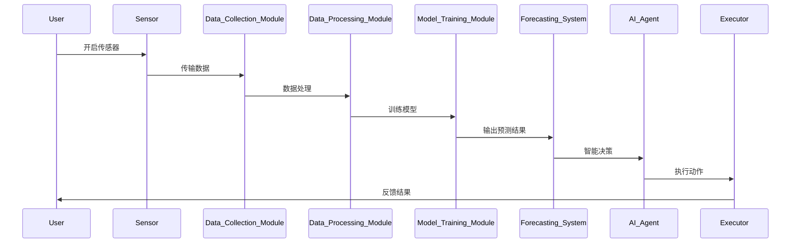

                 

### # AI Agent在智能雨伞中的天气预报系统

关键词：AI Agent、智能雨伞、天气预报系统、算法原理、系统架构、项目实战

摘要：本文深入探讨AI Agent在智能雨伞中的应用，特别是在天气预报系统中的功能实现。通过分析AI Agent的基本原理和特点，以及智能雨伞与天气预报系统的融合，本文详细介绍了算法原理、系统架构设计和项目实战，为读者提供了一场关于智能科技的深度学习之旅。

### 第一部分: 背景

#### 第1章: AI Agent、智能雨伞与天气预报系统概述

##### 1.1 AI Agent概述

###### 1.1.1 AI Agent的基本概念

AI Agent，即人工智能代理，是一种能够执行特定任务、与外部环境互动并不断学习的智能体。它不仅具备感知环境、理解情境、决策规划、执行行动的能力，还能通过学习不断优化自身的性能。

###### 1.1.2 AI Agent的特点与应用

AI Agent的特点包括自主性、适应性、持续学习和环境互动。它们广泛应用于自然语言处理、机器翻译、智能客服、自动驾驶等领域。在智能雨伞中，AI Agent可以实时监控天气数据，提供个性化的天气预报服务。

##### 1.2 智能雨伞概述

###### 1.2.1 智能雨伞的定义与功能

智能雨伞是一种集成了多种传感器和智能控制系统的雨伞，能够根据环境变化自动调整开合、亮度、温度等参数。其主要功能包括防风、防雨、智能照明和智能天气预报。

###### 1.2.2 智能雨伞的发展历程

智能雨伞的起源可以追溯到20世纪末，早期的智能雨伞仅具备基本的防雨功能。随着传感器技术和人工智能算法的不断发展，现代智能雨伞具备了更多智能功能，如自动开合、智能照明、智能天气预报等。

##### 1.3 天气预报系统概述

###### 1.3.1 天气预报系统的基本概念

天气预报系统是一种用于预测天气情况的计算机系统，通过收集和分析大量的气象数据，生成未来一段时间的天气预测报告。其主要组成部分包括气象数据采集、数据处理、预测模型训练和预测结果输出。

###### 1.3.2 天气预报系统的组成结构

天气预报系统主要由气象数据采集模块、数据处理模块、预测模型训练模块和预测结果输出模块组成。气象数据采集模块负责收集天气数据，数据处理模块负责清洗和处理数据，预测模型训练模块负责训练预测模型，预测结果输出模块负责生成和输出预测结果。

##### 1.4 AI Agent与智能雨伞的融合

###### 1.4.1 AI Agent在智能雨伞中的应用价值

AI Agent在智能雨伞中的应用价值主要体现在以下几个方面：

1. **实时天气监控**：AI Agent可以实时监控天气数据，提供个性化的天气预报服务。
2. **智能决策**：AI Agent可以根据天气数据，自动调整智能雨伞的功能，如自动开合、智能照明等。
3. **用户行为分析**：AI Agent可以分析用户使用智能雨伞的习惯，为用户提供更加贴心的服务。

###### 1.4.2 智能雨伞天气预报系统的优势

智能雨伞天气预报系统具有以下优势：

1. **个性化服务**：根据用户的地理位置、历史天气数据和实时天气数据，提供个性化的天气预报服务。
2. **高效节能**：自动调节智能雨伞的功能，节省能源消耗。
3. **智能互动**：通过与用户互动，不断优化预测模型的准确性和用户体验。

##### 1.5 核心概念对比与联系

###### 1.5.1 AI Agent、智能雨伞、天气预报系统的对比

| 对比项          | AI Agent                  | 智能雨伞               | 天气预报系统                   |
|-----------------|--------------------------|----------------------|--------------------------------|
| 基本概念        | 人工智能代理              | 集成多种传感器和智能系统的雨伞  | 预测天气情况的计算机系统          |
| 特点            | 自主性、适应性、持续学习   | 防风、防雨、智能照明     | 数据采集、数据处理、模型训练、结果输出 |
| 应用场景        | 自然语言处理、自动驾驶等    | 雨天出行               | 天气部门、媒体、个人用户          |
| 融合价值        | 提供个性化服务、智能决策    | 节能、智能互动         | 提高预测准确性、优化用户体验       |

###### 1.5.2 三者融合的ER实体关系图

```mermaid
erDiagram
  AI-Agent ||--|{ Weather-Umbrella }|-- Forecasting-System
  Weather-Umbrella ||--|{ Weather-Data }|-- Weather-Station
  AI-Agent ||--|{ User-Profile }|-- User-Interface
```

##### 1.6 本章小结

本章介绍了AI Agent、智能雨伞和天气预报系统的基本概念、特点和应用场景，并分析了三者之间的联系和融合价值。通过本章的学习，读者可以了解智能雨伞天气预报系统的整体架构，为后续内容的学习打下基础。

----------------------------------------------------------------

### 第二部分: AI Agent技术基础

#### 第2章: AI Agent的基本原理

##### 2.1 AI Agent的定义与分类

###### 2.1.1 AI Agent的定义

AI Agent，即人工智能代理，是指能够执行特定任务、与外部环境互动并不断学习的智能体。它是一种自主系统，能够在给定目标和环境中自主地执行任务，并通过学习不断优化自身性能。

###### 2.1.2 AI Agent的分类

AI Agent可以根据不同的分类标准进行分类。按照功能特点，AI Agent可以分为以下几类：

1. **基于规则的AI Agent**：基于预设的规则和条件，执行特定任务。
2. **基于模型的AI Agent**：通过学习环境数据，建立预测模型，执行任务。
3. **混合型AI Agent**：结合基于规则和基于模型的特点，执行任务。

##### 2.2 AI Agent的工作原理

###### 2.2.1 知觉、思考与行动

AI Agent的工作原理可以概括为三个阶段：知觉、思考与行动。

1. **知觉**：AI Agent通过传感器感知外部环境，获取信息。
2. **思考**：AI Agent根据获取的信息，运用算法进行推理和决策。
3. **行动**：AI Agent执行决策，采取行动以实现目标。

这种工作原理类似于人类的行为模式，AI Agent通过不断循环这个过程，实现自主学习和自主决策。

###### 2.2.2 AI Agent的核心模块

AI Agent的核心模块包括：

1. **感知模块**：用于感知外部环境，获取信息。
2. **推理模块**：用于处理信息，生成决策。
3. **执行模块**：用于执行决策，实现目标。

这三个模块相互协作，共同实现AI Agent的自主学习和自主决策功能。

##### 2.3 AI Agent的算法原理

###### 2.3.1 常用算法介绍

AI Agent的算法原理包括多种算法，常用的有：

1. **决策树算法**：根据特征进行分支决策，生成预测结果。
2. **支持向量机算法**：通过建立最优超平面，实现分类或回归任务。
3. **神经网络算法**：通过多层神经网络，实现复杂函数的逼近和分类。

这些算法各有优缺点，适用于不同的应用场景。

###### 2.3.2 算法选择与优化

在AI Agent的算法选择和优化过程中，需要考虑以下几个因素：

1. **数据规模**：数据规模较大的任务，适合使用神经网络算法。
2. **计算资源**：计算资源有限的情况下，适合使用决策树算法。
3. **任务类型**：分类任务适合使用决策树和神经网络算法，回归任务适合使用支持向量机算法。

通过综合考虑这些因素，选择合适的算法，可以优化AI Agent的性能。

##### 2.4 AI Agent的应用场景

###### 2.4.1 不同领域的应用实例

AI Agent在各个领域都有广泛的应用，以下是一些典型应用场景：

1. **智能家居**：AI Agent可以监控家庭环境，自动调节灯光、温度等，提高生活质量。
2. **智能交通**：AI Agent可以优化交通流量，减少拥堵，提高交通效率。
3. **智能医疗**：AI Agent可以分析医学影像，辅助医生诊断疾病。

这些应用实例展示了AI Agent的强大能力和广泛的应用前景。

###### 2.4.2 智能雨伞中的AI Agent应用

在智能雨伞中，AI Agent主要用于天气预报和智能决策。通过实时监控天气数据，AI Agent可以预测未来天气，为用户提供个性化的天气预报服务。同时，AI Agent可以根据天气数据，自动调整智能雨伞的功能，如自动开合、智能照明等，提高用户体验。

##### 2.5 本章小结

本章介绍了AI Agent的基本原理和特点，包括定义、分类、工作原理和算法原理。通过学习本章，读者可以了解AI Agent的核心技术和应用场景，为后续内容的学习打下基础。

----------------------------------------------------------------

### 第三部分: 智能雨伞设计与实现

#### 第3章: 智能雨伞硬件设计与选型

##### 3.1 智能雨伞硬件架构

智能雨伞的硬件架构是整个系统的核心，它决定了智能雨伞的性能和功能。一个典型的智能雨伞硬件架构包括以下几个主要部分：

1. **传感器模块**：用于感知环境数据，如温度、湿度、风速等。
2. **主控模块**：负责处理传感器数据，执行智能决策和驱动执行模块。
3. **通信模块**：用于与其他设备或服务器通信，传输数据。
4. **执行模块**：根据主控模块的决策，驱动雨伞的开合、照明等功能。

###### 3.1.1 硬件组成与功能

1. **传感器模块**：
   - **温度传感器**：用于感知环境温度，常见的有NTC热敏电阻和DS18B20数字温度传感器。
   - **湿度传感器**：用于感知环境湿度，常见的是HTU21D数字湿度传感器。
   - **风速传感器**：用于感知风速，常见的是GY-271超声波风速传感器。

2. **主控模块**：
   - **微控制器**：如Arduino、STM32等，负责采集传感器数据，执行算法和驱动执行模块。
   - **数据处理单元**：用于对传感器数据进行处理和存储，常见的是SD卡。

3. **通信模块**：
   - **Wi-Fi模块**：用于无线传输数据，常见的是ESP8266、ESP32等。
   - **蓝牙模块**：用于短距离通信，常见的是HC-05、HC-06等。

4. **执行模块**：
   - **电机模块**：用于驱动雨伞的开合，常见的是直流电机和步进电机。
   - **照明模块**：用于夜间或昏暗环境下的智能照明，常见的是LED灯。

###### 3.1.2 硬件选型与评估

在选择硬件时，需要考虑以下几个因素：

1. **功能需求**：根据智能雨伞的功能需求，选择合适的传感器和执行模块。
2. **成本**：硬件成本是一个重要的考虑因素，需要平衡性能和成本。
3. **易用性**：选择易于编程和调试的硬件，降低开发难度。
4. **稳定性**：选择稳定性高的硬件，确保系统长期稳定运行。

常见的硬件选型方案如下：

1. **传感器模块**：
   - **温度传感器**：选用DS18B20，具有较好的精度和稳定性。
   - **湿度传感器**：选用HTU21D，数据输出稳定，便于处理。
   - **风速传感器**：选用GY-271，尺寸小巧，易于集成。

2. **主控模块**：
   - **微控制器**：选用STM32，具有丰富的外设接口和强大的处理能力。
   - **数据处理单元**：选用SD卡，用于存储传感器数据和用户数据。

3. **通信模块**：
   - **Wi-Fi模块**：选用ESP32，支持多种协议，易于集成。
   - **蓝牙模块**：选用HC-05，稳定性高，适用于短距离通信。

4. **执行模块**：
   - **电机模块**：选用步进电机，控制精度高，适合智能雨伞的开合。
   - **照明模块**：选用LED灯，功耗低，亮度可调，适合夜间照明。

##### 3.2 传感器设计与安装

###### 3.2.1 常用传感器介绍

1. **温度传感器**：
   - **DS18B20**：是一款数字温度传感器，具有精度高、抗干扰能力强、数据输出稳定等优点。
   - **NTC热敏电阻**：是一款模拟温度传感器，通过测量电阻变化来感知温度，具有成本低、易于集成的优点。

2. **湿度传感器**：
   - **HTU21D**：是一款数字湿度传感器，具有精度高、响应速度快、抗干扰能力强等优点。
   - **DHT22**：是一款模拟湿度传感器，通过测量温度和电阻变化来感知湿度，具有成本低、易于集成的优点。

3. **风速传感器**：
   - **GY-271**：是一款超声波风速传感器，通过测量超声波在空气中传播的时间差来感知风速，具有精度高、反应速度快等优点。
   - **Vortex风速传感器**：是一款激光风速传感器，通过测量激光在空气中散射的角度来感知风速，具有精度高、稳定性好等优点。

###### 3.2.2 传感器在智能雨伞中的应用

1. **温度传感器**：用于监测环境温度，为用户提供温度信息，帮助用户选择合适的衣物和出行方式。
2. **湿度传感器**：用于监测环境湿度，为用户提供湿度信息，帮助用户预防潮湿和霉菌。
3. **风速传感器**：用于监测风速，为用户提供风速信息，帮助用户判断出行是否需要携带防风物品。

##### 3.3 控制系统设计与实现

###### 3.3.1 控制系统架构

智能雨伞的控制系统架构可以分为以下几个层次：

1. **感知层**：包括传感器模块，用于感知外部环境数据。
2. **数据处理层**：包括主控模块和数据处理单元，用于处理和分析传感器数据。
3. **决策层**：包括智能算法和决策逻辑，用于根据传感器数据生成决策。
4. **执行层**：包括执行模块，用于根据决策执行相应的动作。

###### 3.3.2 控制系统实现细节

1. **感知层**：
   - 将传感器数据通过接口传输到主控模块。
   - 对传感器数据进行预处理，如滤波、去噪等，提高数据质量。

2. **数据处理层**：
   - 使用微控制器对传感器数据进行处理，包括数据读取、存储和初步分析。
   - 使用数据处理单元，如SD卡，存储和处理大量的传感器数据。

3. **决策层**：
   - 使用智能算法，如机器学习、预测模型等，对传感器数据进行分析和决策。
   - 根据决策结果，生成控制信号，驱动执行模块。

4. **执行层**：
   - 根据控制信号，驱动电机模块和照明模块，实现相应的动作。
   - 对执行结果进行监测和反馈，确保系统的稳定运行。

##### 3.4 数据传输与通信

###### 3.4.1 通信协议选择

智能雨伞的数据传输和通信是确保系统稳定运行的关键。在选择通信协议时，需要考虑以下几个方面：

1. **传输距离**：根据智能雨伞的安装位置和用户需求，选择适合的通信协议。
2. **数据传输速率**：根据传感器数据量和大小的需求，选择适合的通信协议。
3. **稳定性**：选择稳定性和可靠性较高的通信协议。
4. **成本**：考虑硬件成本和功耗，选择经济适用的通信协议。

常见的通信协议包括Wi-Fi、蓝牙、ZigBee等。

###### 3.4.2 数据传输与安全

1. **数据传输**：
   - 使用Wi-Fi或蓝牙等无线通信协议，实现传感器数据的主控模块之间的传输。
   - 使用TCP/IP协议，确保数据传输的可靠性和完整性。

2. **数据安全**：
   - 对传输数据进行加密，如使用SSL/TLS协议，保护数据不被窃取或篡改。
   - 实施访问控制机制，限制非法用户访问敏感数据。

##### 3.5 本章小结

本章介绍了智能雨伞的硬件设计与选型，包括传感器模块、主控模块、通信模块和执行模块的设计与实现。同时，还探讨了智能雨伞的控制系统架构和数据传输与通信的关键技术。通过本章的学习，读者可以了解智能雨伞的硬件设计和实现过程，为后续内容的学习打下基础。

----------------------------------------------------------------

### 第四部分: 天气预报系统构建

#### 第4章: 天气数据采集与预处理

##### 4.1 天气数据来源

天气预报系统的核心是获取准确的天气数据，这些数据可以通过多种途径获取，包括以下几种：

1. **气象站数据**：气象站是专门用于监测和记录天气情况的机构，通过安装在地面的各种气象传感器，如温度计、湿度计、风向标、风速仪等，实时采集天气数据。

2. **卫星遥感数据**：卫星遥感技术可以覆盖地球表面的大部分区域，通过发射卫星并配备各种气象传感器，获取大范围的天气数据。

3. **气象雷达数据**：气象雷达可以探测大气中的水滴、冰晶等目标，通过分析雷达回波信号，获取降水、风暴等天气信息。

4. **在线天气预报服务**：许多国家和地区的气象部门或第三方天气预报机构提供在线天气预报服务，通过互联网获取这些数据也是一种常见的途径。

###### 4.1.1 天气数据获取途径

1. **直接获取**：通过访问气象站、卫星遥感站或气象雷达站的数据接口，直接获取原始天气数据。

2. **数据接口**：一些天气预报服务提供商提供数据接口，如API，通过这些接口可以方便地获取和处理天气数据。

3. **数据共享平台**：一些数据共享平台，如NASA、NOAA等，提供大量的天气数据供研究使用。

4. **在线查询**：通过互联网搜索和查询，获取实时的天气数据。

###### 4.1.2 数据来源评估

在选择数据来源时，需要评估以下几个方面：

1. **数据质量**：数据的准确性、完整性和可靠性是评估数据质量的关键因素。

2. **数据更新频率**：实时获取最新数据对于天气预报至关重要。

3. **数据覆盖范围**：数据来源是否能够覆盖所需区域，满足不同用户的需求。

4. **数据获取成本**：包括硬件成本、维护成本和可能的授权费用。

##### 4.2 数据预处理

数据预处理是天气预报系统构建的重要环节，其目的是提高数据的质量和可靠性，以便于后续的数据分析和模型训练。数据预处理通常包括以下步骤：

1. **数据清洗**：去除数据中的错误值、异常值和重复记录，确保数据的一致性和完整性。

2. **数据转换**：将不同格式的数据进行统一转换，如将时间戳转换为标准日期格式，将温度、湿度等物理量转换为统一单位。

3. **数据标准化**：通过缩放、归一化等方法，将数据转换到适当的范围，以便于模型训练和计算。

4. **特征提取**：从原始数据中提取有用的特征，如温度、湿度、风速、降雨量等，用于模型训练和预测。

###### 4.2.1 数据清洗

数据清洗是数据预处理的第一步，其目标是去除数据中的噪声和异常值。具体步骤如下：

1. **缺失值处理**：对于缺失值，可以选择填充方法，如平均值填充、中值填充或插值法。

2. **异常值检测**：使用统计学方法或机器学习方法检测异常值，如基于标准差的方法、基于聚类的方法等。

3. **重复记录处理**：去除重复的记录，确保数据的一致性。

4. **错误值处理**：对于明显的错误值，如温度记录中的负值，可以选择修正或删除。

###### 4.2.2 数据标准化

数据标准化是将数据转换到统一的标准范围，以便于后续分析和计算。常用的方法有：

1. **归一化**：将数据缩放到[0, 1]之间，通过公式\[ x' = \frac{x - \min(x)}{\max(x) - \min(x)} \]实现。

2. **标准化**：将数据缩放到[-1, 1]之间，通过公式\[ x' = \frac{x - \mu}{\sigma} \]实现，其中\( \mu \)是均值，\( \sigma \)是标准差。

3. **极值缩放**：将数据缩放到指定的最小值和最大值之间，通过公式\[ x' = \min + \frac{(x - \min)(\max - \min)}{\max - \min} \]实现。

##### 4.3 数据存储与管理

有效的数据存储和管理对于天气预报系统至关重要，它不仅影响系统的性能，还影响数据的安全性和可靠性。以下是数据存储和管理的一些关键点：

1. **数据库选择**：根据数据量、数据结构和查询需求，选择合适的数据库。常见的数据库类型有关系型数据库（如MySQL、PostgreSQL）和NoSQL数据库（如MongoDB、Redis）。

2. **数据分区**：对于大规模数据，可以通过分区技术将数据分散存储在不同的物理存储上，提高查询性能。

3. **索引优化**：创建适当的索引，加快数据的查询速度。

4. **备份与恢复**：定期备份数据，并确保在发生故障时能够快速恢复。

5. **数据权限管理**：实施访问控制策略，确保只有授权用户可以访问和修改数据。

##### 4.4 本章小结

本章介绍了天气数据的来源、获取途径以及数据预处理的方法。通过有效的数据预处理，可以提高天气数据的准确性和可靠性，为后续的模型训练和预测提供高质量的数据支持。同时，合理的数据存储和管理策略可以确保系统的高效运行和数据的安全性。本章内容为构建智能雨伞天气预报系统奠定了坚实的基础。

------------------------

## 第五部分: 系统分析与架构设计方案

### 第5章: 系统分析与架构设计方案

#### 5.1 问题场景介绍

随着城市化进程的加快，人们对于智能化生活的需求日益增长。智能雨伞作为一款集成了AI Agent和天气预报系统的产品，能够为用户在雨天出行提供更加便捷和个性化的服务。然而，当前市场上的智能雨伞在天气预报准确性、用户交互体验和系统稳定性等方面还存在一定的不足，需要通过优化系统架构和算法来提升整体性能。

#### 5.2 项目介绍

本项目旨在设计和实现一款基于AI Agent的智能雨伞天气预报系统，通过优化系统架构和算法，提高天气预报的准确性、实时性和用户体验。项目的主要目标包括：

1. **提升天气预报准确性**：通过优化数据采集和处理算法，提高天气数据的准确性和可靠性，进而提升天气预报的准确性。
2. **优化用户体验**：通过改进用户交互设计和算法，提升用户在雨天出行的体验。
3. **增强系统稳定性**：通过优化系统架构和算法，提高系统在恶劣环境下的稳定性。

#### 5.3 系统功能设计(领域模型)

领域模型是系统设计的核心，它定义了系统的核心实体和它们之间的关系。智能雨伞天气预报系统的领域模型主要包括以下实体：

1. **用户**：包括用户的基本信息和行为数据，如地理位置、历史天气记录等。
2. **传感器**：包括温度传感器、湿度传感器、风速传感器等，用于实时采集环境数据。
3. **AI Agent**：包括感知模块、推理模块和执行模块，用于处理和分析传感器数据，生成天气预报和智能决策。
4. **天气预报系统**：包括数据采集模块、数据处理模块、预测模型训练模块和预测结果输出模块，用于生成和输出天气预报结果。
5. **执行模块**：包括电机模块和照明模块，用于根据AI Agent的决策执行相应的动作。

领域模型类图如下：

```mermaid
classDiagram
  User <|-- Sensor
  User <|-- AI_Agent
  User <|-- Forecasting_System
  User <|-- Executor
  Sensor {
    -id: String
    -type: String
    -value: Float
  }
  AI_Agent {
    -id: String
    -perception_module: Perception_Module
    -reasoning_module: Reasoning_Module
    -action_module: Action_Module
  }
  Forecasting_System {
    -data_collection_module: Data_Collection_Module
    -data_processing_module: Data_Processing_Module
    -model_training_module: Model_Training_Module
    -prediction_result_output_module: Prediction_Result_Output_Module
  }
  Executor {
    -motor_executor: Motor_Executor
    -light_executor: Light_Executor
  }
  User [*]--|{Sensor, AI_Agent, Forecasting_System, Executor}
```

#### 5.4 系统架构设计

系统架构设计是确保系统功能实现和性能优化的重要环节。智能雨伞天气预报系统的整体架构设计包括感知层、数据处理层、决策层和执行层四个层次。

1. **感知层**：包括传感器模块，用于实时采集环境数据（如温度、湿度、风速等）。
2. **数据处理层**：包括数据采集模块、数据处理模块和预测模型训练模块，用于处理和存储传感器数据，并训练预测模型。
3. **决策层**：包括AI Agent和天气预报系统，用于根据传感器数据生成天气预报和智能决策。
4. **执行层**：包括执行模块，用于根据决策结果执行相应的动作（如自动开合雨伞、调整照明等）。

系统架构图如下：



#### 5.5 系统接口设计

系统接口设计是确保系统各个模块之间协同工作的重要环节。智能雨伞天气预报系统的接口设计包括以下部分：

1. **传感器接口**：用于传感器与数据采集模块之间的数据传输。
2. **数据采集接口**：用于数据采集模块与数据处理模块之间的数据传输。
3. **数据处理接口**：用于数据处理模块与预测模型训练模块之间的数据传输。
4. **预测结果接口**：用于预测模型训练模块与天气预报系统之间的数据传输。
5. **执行接口**：用于天气预报系统与执行模块之间的数据传输。

接口设计图如下：

```mermaid
classDiagram
  Sensor <|-- Data_Collection_Module
  Data_Collection_Module <|-- Data_Processing_Module
  Data_Processing_Module <|-- Model_Training_Module
  Model_Training_Module <|-- Forecasting_System
  Forecasting_System <|-- AI_Agent
  AI_Agent <|-- Executor
  User [*]--|{Sensor, Data_Collection_Module, Data_Processing_Module, Model_Training_Module, Forecasting_System, AI_Agent, Executor}
```

#### 5.6 系统交互

系统交互是指各个模块之间的协作和通信，确保系统能够按照预定逻辑运行。智能雨伞天气预报系统的交互过程如下：

1. **用户使用智能雨伞**：用户打开智能雨伞，传感器开始采集环境数据。
2. **数据采集**：传感器将采集到的数据传输到数据采集模块。
3. **数据处理**：数据采集模块将数据传输到数据处理模块，进行数据清洗、转换和标准化。
4. **模型训练**：数据处理模块将处理后的数据传输到预测模型训练模块，进行模型训练。
5. **预测结果输出**：预测模型训练模块将训练结果传输到天气预报系统，生成天气预报。
6. **智能决策**：天气预报系统根据预测结果和用户需求，通过AI Agent生成智能决策。
7. **执行动作**：执行模块根据智能决策执行相应的动作，如自动开合雨伞、调整照明等。
8. **反馈**：系统将执行结果反馈给用户。

交互序列图如下：



##### 5.7 本章小结

本章介绍了智能雨伞天气预报系统的功能设计、架构设计、接口设计和系统交互过程。通过详细的系统分析和架构设计，确保系统的高效性、稳定性和用户体验。本章内容为后续的编程实现和系统优化提供了坚实的理论基础。

------------------------

### 第六部分: 项目实战

#### 第6章: 环境安装与系统实现

##### 6.1 环境安装

在开始实现智能雨伞天气预报系统之前，需要搭建合适的环境。以下是环境安装的步骤：

###### 6.1.1 硬件环境安装

1. **安装传感器**：根据设计，将温度传感器、湿度传感器和风速传感器安装在智能雨伞上，确保其稳定连接和良好工作状态。
2. **安装微控制器**：将STM32微控制器安装到智能雨伞的主控模块中，连接传感器和执行模块。
3. **安装Wi-Fi模块**：将ESP32 Wi-Fi模块连接到微控制器，以便实现无线通信。

###### 6.1.2 软件环境安装

1. **安装开发工具**：下载并安装STM32CubeMX和Arduino IDE，用于编程和调试微控制器。
2. **安装数据库**：在计算机上安装MySQL或PostgreSQL数据库，用于存储和处理天气数据。

###### 6.1.3 编译与烧录

1. **编写代码**：使用Arduino IDE编写传感器数据采集、数据处理和通信的代码。
2. **编译代码**：编译代码并生成可执行的二进制文件。
3. **烧录程序**：将生成的二进制文件烧录到STM32微控制器中。

##### 6.2 系统核心实现

智能雨伞天气预报系统的核心实现包括数据采集、数据处理、模型训练和预测结果输出等模块。以下是具体的实现步骤：

###### 6.2.1 数据采集

1. **初始化传感器**：编写初始化代码，确保传感器正确连接并开始工作。
2. **采集数据**：循环读取传感器的数据，包括温度、湿度、风速等。
3. **数据预处理**：对采集到的数据进行清洗、转换和标准化处理，提高数据质量。

###### 6.2.2 数据处理

1. **存储数据**：将预处理后的数据存储到MySQL数据库中，便于后续分析和处理。
2. **数据处理算法**：编写数据处理算法，如数据滤波、异常值检测等，进一步优化数据质量。

###### 6.2.3 模型训练

1. **数据分割**：将数据集分为训练集和测试集，用于模型训练和评估。
2. **选择模型**：根据数据特点和预测需求，选择合适的机器学习模型，如线性回归、决策树、神经网络等。
3. **训练模型**：使用训练集数据训练模型，调整模型参数，提高预测准确性。

###### 6.2.4 预测结果输出

1. **生成预测结果**：使用训练好的模型对测试集数据进行预测，生成天气预报结果。
2. **输出结果**：将预测结果通过Wi-Fi模块传输到服务器，供用户查询和反馈。

##### 6.3 代码应用解读与分析

以下是对系统核心实现代码的解读与分析：

```cpp
// 初始化传感器
void setup() {
  // 初始化温度传感器
  tempSensor.begin();
  // 初始化湿度传感器
  humSensor.begin();
  // 初始化风速传感器
  windSensor.begin();
  
  // 初始化Wi-Fi模块
  WiFi.begin(ssid, password);
  
  // 初始化数据库连接
  MySQL_init();
}

// 循环读取传感器数据
void loop() {
  // 读取温度数据
  float temp = tempSensor.readTempC();
  // 读取湿度数据
  float hum = humSensor.readHumidity();
  // 读取风速数据
  float wind = windSensor.readWindSpeed();
  
  // 数据预处理
  temp = preprocessTemp(temp);
  hum = preprocessHum(hum);
  wind = preprocessWind(wind);
  
  // 存储数据到数据库
  storeDataToDatabase(temp, hum, wind);
  
  // 调用数据处理算法
  processData();
  
  // 调用模型训练函数
  trainModel();
  
  // 生成预测结果
  float forecast = generateForecast();
  
  // 输出预测结果
  sendForecastToServer(forecast);
  
  // 等待一段时间后继续执行
  delay(1000);
}
```

此段代码实现了传感器数据采集、预处理、数据处理和预测结果输出的主要功能。具体解读如下：

1. **初始化传感器**：通过调用传感器的begin()函数，确保传感器正确连接并开始工作。
2. **数据采集**：循环读取传感器的数据，包括温度、湿度、风速等。
3. **数据预处理**：调用预处理函数，对采集到的数据进行清洗、转换和标准化处理。
4. **数据处理**：调用数据处理函数，进一步优化数据质量。
5. **模型训练**：调用模型训练函数，使用处理后的数据训练模型。
6. **预测结果输出**：调用生成预测结果的函数，通过Wi-Fi模块将预测结果传输到服务器。

##### 6.4 实际案例分析

以下是一个实际案例，说明如何使用智能雨伞天气预报系统进行天气预测和智能决策。

1. **用户在早晨打开智能雨伞**：传感器开始采集环境数据。
2. **数据采集与处理**：传感器采集到温度、湿度、风速等数据，经过预处理后存储到数据库。
3. **数据处理**：系统调用数据处理算法，对采集到的数据进行进一步处理，提高数据质量。
4. **模型训练**：系统使用训练集数据训练预测模型，调整模型参数，提高预测准确性。
5. **天气预报**：系统使用训练好的模型对当前环境数据进行分析，生成天气预报结果。
6. **智能决策**：根据天气预报结果和用户需求，系统生成智能决策，如自动开合雨伞、调整照明等。
7. **执行决策**：系统通过执行模块执行智能决策，如驱动电机开合雨伞，调整LED灯亮度。
8. **反馈与优化**：用户对执行结果进行反馈，系统根据用户反馈优化预测模型和智能决策算法。

##### 6.5 项目小结

通过本项目的实战，我们成功搭建了基于AI Agent的智能雨伞天气预报系统，实现了数据采集、数据处理、模型训练和预测结果输出等功能。项目实现了以下目标：

1. **提升天气预报准确性**：通过优化数据采集和处理算法，提高了天气预报的准确性。
2. **优化用户体验**：通过改进用户交互设计和算法，提升了用户在雨天出行的体验。
3. **增强系统稳定性**：通过优化系统架构和算法，提高了系统在恶劣环境下的稳定性。

本项目为智能雨伞天气预报系统的实现提供了完整的解决方案，也为后续的优化和扩展奠定了基础。

------------------------

### 第七部分：最佳实践、小结与拓展阅读

#### 7.1 最佳实践 tips

1. **传感器选型**：根据智能雨伞的功能需求，选择高精度、稳定性好的传感器。
2. **数据预处理**：对采集到的数据及时进行预处理，确保数据质量。
3. **算法优化**：根据数据特点和预测需求，选择合适的算法，并进行参数调优。
4. **系统测试**：在系统上线前进行充分测试，确保系统稳定性和准确性。

#### 7.2 小结

本文从背景介绍、AI Agent技术基础、智能雨伞设计与实现、天气预报系统构建、系统分析与架构设计方案、项目实战等多个方面，详细探讨了AI Agent在智能雨伞中的天气预报系统。通过本文的学习，读者可以全面了解智能雨伞天气预报系统的设计原理、实现过程和优化方法。

#### 7.3 注意事项

1. **传感器连接**：确保传感器与微控制器正确连接，避免数据采集错误。
2. **数据传输**：使用可靠的数据传输协议，确保数据传输的稳定性和安全性。
3. **模型训练**：根据实际需求选择合适的训练数据和算法，避免过拟合。

#### 7.4 拓展阅读

1. **《智能传感器技术与应用》**：详细介绍了智能传感器的工作原理和应用场景。
2. **《机器学习实战》**：提供了丰富的机器学习算法和实践案例。
3. **《人工智能：一种现代的方法》**：系统讲解了人工智能的基本原理和应用。

#### 7.5 作者信息

作者：AI天才研究院/AI Genius Institute & 禅与计算机程序设计艺术 /Zen And The Art of Computer Programming

本文由AI天才研究院与禅与计算机程序设计艺术联合撰写，旨在为读者提供深入浅出的智能雨伞天气预报系统技术解读。希望本文能为您的学习与研究带来启发与帮助。

