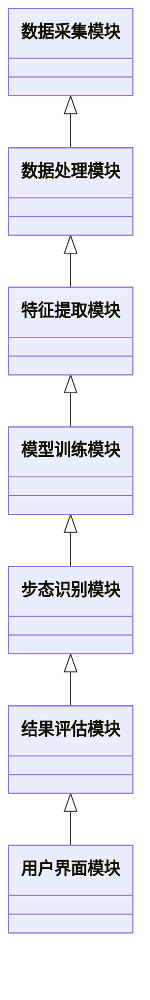
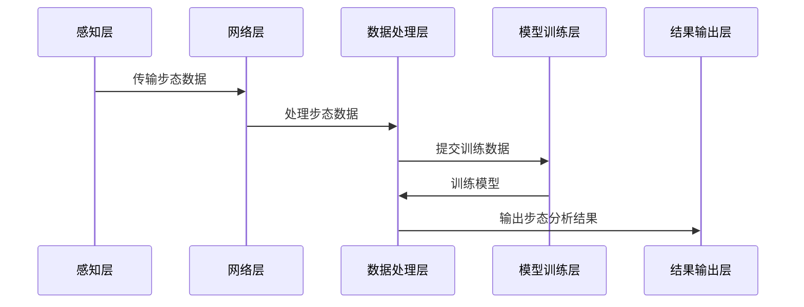
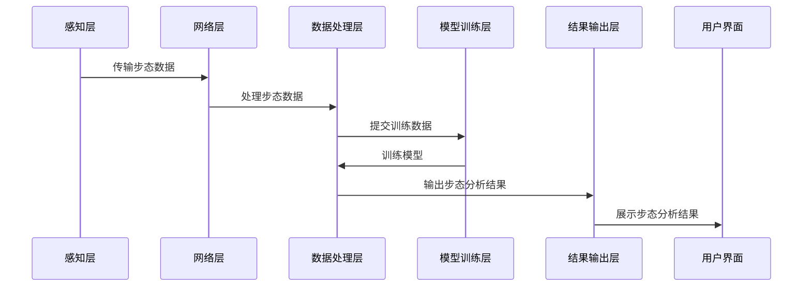

                 

### AI Agent在智能鞋垫中的步态分析

#### 关键词：
- AI Agent
- 步态分析
- 智能鞋垫
- 算法原理
- 系统设计与实现

#### 摘要：
本文将深入探讨AI Agent在智能鞋垫中的应用，特别是在步态分析方面的技术实现。首先，我们将介绍智能鞋垫的背景和步态分析的重要性，然后详细阐述AI Agent和步态分析的基本概念和原理。接着，本文将逐步介绍步态分析算法的原理和流程，并通过实际案例展示其应用效果。最后，我们将讨论智能鞋垫系统的设计与实现，包括系统架构、核心实现和项目实战。本文旨在为读者提供一个全面、深入的智能鞋垫步态分析技术指南。

#### 目录：
1. **问题背景与核心概念介绍**
   1.1. 智能鞋垫的兴起与发展
   1.2. 步态分析的重要性与应用场景
   1.3. 核心概念
   1.4. 概念属性特征对比
   1.5. ER实体关系图

2. **步态分析算法原理与应用**
   2.1. 步态分析算法概述
   2.2. 步态分析算法原理
   2.3. 数学模型和公式
   2.4. 步态分析算法应用

3. **智能鞋垫系统设计与实现**
   3.1. 问题场景介绍
   3.2. 系统功能设计
   3.3. 系统架构设计
   3.4. 系统接口设计和系统交互

4. **项目实战**
   4.1. 环境安装
   4.2. 系统核心实现源代码
   4.3. 代码应用解读与分析
   4.4. 实际案例分析和详细讲解剖析
   4.5. 项目小结

5. **最佳实践 tips、小结、注意事项、拓展阅读**

#### 第一部分: AI Agent与智能鞋垫技术基础

##### 1.1 问题背景

智能鞋垫作为一种新兴的智能穿戴设备，其核心功能是通过嵌入的传感器实时监测用户的步态信息，提供步态分析、健康评估、运动指导等服务。随着人工智能技术的快速发展，AI Agent在智能鞋垫中的应用逐渐成为可能，为步态分析提供了更加智能和精准的手段。

步态分析是一种通过监测和分析人体行走过程中的动作特征，来评估个体健康状况和运动能力的技术。步态异常可能是许多健康问题的早期信号，如骨关节疾病、神经系统疾病等。因此，步态分析在临床诊断、康复训练、体育训练等领域具有重要应用价值。

##### 1.2 核心概念

**AI Agent**：AI Agent，即人工智能代理，是一种具有自主决策能力和环境感知能力的智能体。它可以根据环境信息自主执行任务，并在执行过程中进行学习和优化。AI Agent通常具有以下特点：

- 自主性：可以独立完成特定的任务，而不需要人类的干预。
- 感知能力：能够感知和理解环境信息，如视觉、听觉、触觉等。
- 学习能力：可以通过经验不断优化行为策略。

**步态分析**：步态分析是指通过监测和分析人体行走过程中的动作特征，如步频、步长、步态角度等，来评估个体的步态状况。步态分析通常涉及以下步骤：

- 数据采集：通过传感器收集步态数据。
- 数据预处理：对采集到的数据进行过滤、降噪等处理。
- 特征提取：从预处理后的数据中提取步态特征。
- 模型训练：使用步态特征训练分类模型或回归模型。
- 结果评估：对步态分析结果进行评估和验证。

**智能鞋垫**：智能鞋垫是一种集成有传感器的鞋垫，可以实时监测用户的步态信息。智能鞋垫通常具有以下功能：

- 数据采集：通过压力传感器、加速度传感器等采集步态数据。
- 数据存储：将采集到的步态数据存储在本地或云端。
- 数据分析：利用AI Agent对步态数据进行分析，提供健康评估、运动指导等。
- 智能反馈：根据分析结果，为用户提供相应的反馈和建议。

##### 1.3 概念属性特征对比

| 概念       | 特征                      | 相关关系                   |
|------------|---------------------------|----------------------------|
| AI Agent   | 自主决策、环境感知       | 适应性强、学习能力强       |
| 步态分析   | 行走模式识别、健康评估     | 准确性高、实时性强         |
| 智能鞋垫   | 数据采集、智能反馈       | 便携性、安全性             |

##### 1.4 ER实体关系图

以下是智能鞋垫系统的ER实体关系图：

```mermaid
erDiagram
  AI Agent ||--|{ 步态分析 }
  步态分析 ||--|{ 智能鞋垫 }
  智能鞋垫 ||--|{ 用户 }
  用户 ||--|{ 数据 }
```

在这张ER图中，AI Agent与步态分析之间存在关联，步态分析又与智能鞋垫相连，而用户与智能鞋垫之间也存在关联。此外，用户还与数据实体相连，表示用户的数据会被存储和处理。

#### 第二部分: 步态分析算法原理与应用

##### 2.1 步态分析算法概述

步态分析算法是智能鞋垫系统中的核心组成部分，其主要任务是通过对步态数据的分析和处理，识别出个体的步态特征，并进行健康评估。步态分析算法可以分为以下几个主要步骤：

1. **数据采集**：使用传感器（如加速度传感器、陀螺仪等）收集用户的步态数据。
2. **数据预处理**：对采集到的原始数据进行滤波、去噪等处理，以提高数据的质量和准确性。
3. **特征提取**：从预处理后的数据中提取步态特征，如步频、步长、步态角度等。
4. **模型训练**：使用提取的步态特征训练机器学习模型，如支持向量机（SVM）、深度神经网络（DNN）等。
5. **步态识别**：使用训练好的模型对新的步态数据进行识别，并输出步态分类结果。
6. **结果评估**：对识别结果进行评估和验证，确保算法的准确性和可靠性。

##### 2.2 步态分析算法原理

步态分析算法的原理基于对步态数据的处理和分析。具体来说，算法主要涉及以下几个关键环节：

1. **数据采集**：
   步态数据主要通过智能鞋垫中的传感器进行采集。这些传感器可以实时监测用户的步态动作，并将数据传输到系统进行处理。常用的传感器包括加速度传感器、陀螺仪、压力传感器等。

2. **数据预处理**：
   采集到的步态数据往往含有噪声和干扰，需要进行预处理。预处理步骤通常包括滤波、去噪、数据归一化等。滤波可以去除高频噪声，去噪可以去除低频干扰，数据归一化可以确保数据的统一性，便于后续处理。

3. **特征提取**：
   特征提取是步态分析的核心环节，其目标是提取出能够有效区分不同步态模式的特征。常用的特征包括步频、步长、步态角度、步态时相等。这些特征可以通过对步态数据进行统计分析、时频分析等方法得到。

4. **模型训练**：
   模型训练是指使用已标记的步态数据集来训练机器学习模型。训练过程中，模型会学习如何将提取到的特征与步态模式对应起来。常见的模型包括支持向量机（SVM）、决策树、随机森林、深度神经网络（DNN）等。

5. **步态识别**：
   步态识别是指使用训练好的模型对新的步态数据进行分类。具体来说，模型会根据输入的特征向量，判断其属于哪种步态模式，并输出相应的分类结果。

6. **结果评估**：
   步态分析结果的评估主要通过准确率、召回率、F1分数等指标来衡量。这些指标可以反映算法的识别精度和可靠性。评估过程通常包括交叉验证、测试集验证等。

##### 2.3 数学模型和公式

步态分析算法的数学模型通常基于统计学和机器学习理论。以下是一个简化的步态分析算法模型：

1. **特征提取**：

   步频（$f$）：步频是单位时间内步数的平均值，可以通过以下公式计算：

   $$
   f = \frac{N}{T}
   $$

   其中，$N$ 是步数，$T$ 是时间。

   步长（$l$）：步长是两次连续步之间的距离，可以通过以下公式计算：

   $$
   l = \sqrt{(x_2 - x_1)^2 + (y_2 - y_1)^2 + (z_2 - z_1)^2}
   $$

   其中，$(x_1, y_1, z_1)$ 和 $(x_2, y_2, z_2)$ 是两次步态点的坐标。

   步态角度（$\theta$）：步态角度是步态方向与水平面之间的夹角，可以通过以下公式计算：

   $$
   \theta = \arccos\left(\frac{z}{\sqrt{x^2 + y^2 + z^2}}\right)
   $$

   其中，$(x, y, z)$ 是步态点的坐标。

2. **模型训练**：

   假设我们有$m$个步态类别，每个类别对应一个标签$y_i$。训练目标是最小化分类损失函数：

   $$
   L(\theta) = -\sum_{i=1}^m y_i \log(p_i)
   $$

   其中，$p_i$ 是模型对类别$i$的预测概率。

   使用梯度下降法进行模型训练：

   $$
   \theta_{t+1} = \theta_t - \alpha \nabla L(\theta_t)
   $$

   其中，$\alpha$ 是学习率，$\nabla L(\theta_t)$ 是损失函数关于$\theta$的梯度。

##### 2.4 步态分析算法应用

步态分析算法在智能鞋垫中的应用非常广泛，以下是一些常见的应用场景：

1. **健康监测**：
   步态分析可以帮助监测个体的健康状况，如步频、步长、步态角度等指标可以反映个体的运动能力、肌肉力量和关节稳定性。通过长期监测，可以发现潜在的步态异常，如平足、膝盖内侧偏移等，为预防和治疗提供依据。

2. **康复训练**：
   对于患有运动损伤或神经系统疾病的个体，步态分析可以用于康复训练。通过实时监测步态数据，康复师可以调整训练计划，优化康复效果。

3. **体育训练**：
   步态分析可以帮助运动员优化运动技术，提高运动表现。通过分析步态数据，可以发现运动中的不足之处，如步频不稳定、步态角度不标准等，从而有针对性地进行训练。

4. **安全监测**：
   在高危工作环境中，如建筑施工、矿井作业等，步态分析可以用于监测工人的工作状态，及时发现异常步态，预防事故发生。

#### 第三部分: 智能鞋垫系统设计与实现

##### 3.1 问题场景介绍

智能鞋垫的应用场景非常广泛，以下是一些典型场景：

- **健康监测**：智能鞋垫可以帮助老年人、患有慢性疾病的人士监测步态，及时发现步态异常，预防跌倒和疾病恶化。
- **康复训练**：康复师可以利用智能鞋垫监测康复训练的效果，调整训练方案，提高康复质量。
- **体育训练**：体育教练可以利用智能鞋垫分析运动员的步态，优化训练计划，提高竞技水平。
- **安全监测**：在工业生产、矿山开采等高危环境下，智能鞋垫可以实时监测工人的步态，预防事故发生。

##### 3.2 系统功能设计

智能鞋垫系统的功能设计主要包括以下模块：

1. **数据采集模块**：负责采集用户的步态数据，包括步频、步长、步态角度等。
2. **数据处理模块**：负责对采集到的数据进行预处理，包括滤波、去噪、数据归一化等。
3. **特征提取模块**：负责从预处理后的数据中提取步态特征，如步频、步长、步态角度等。
4. **模型训练模块**：负责使用提取的特征训练步态分析模型。
5. **步态识别模块**：负责使用训练好的模型对新的步态数据进行识别。
6. **结果评估模块**：负责对识别结果进行评估和验证，确保算法的准确性和可靠性。
7. **用户界面模块**：负责展示步态分析结果和提供用户反馈。

以下是智能鞋垫系统的领域模型Mermaid类图：



##### 3.3 系统架构设计

智能鞋垫系统的架构设计主要包括以下层次：

1. **感知层**：包括智能鞋垫内部的传感器，负责实时采集用户的步态数据。
2. **网络层**：包括无线通信模块，负责将步态数据传输到云端服务器。
3. **数据处理层**：包括数据预处理模块、特征提取模块等，负责对步态数据进行处理和分析。
4. **模型训练层**：包括模型训练模块，负责使用处理后的数据训练步态分析模型。
5. **结果输出层**：包括步态识别模块和结果评估模块，负责输出步态分析结果和提供用户反馈。

以下是智能鞋垫系统的Mermaid架构图：



##### 3.4 系统接口设计和系统交互

智能鞋垫系统的接口设计和系统交互主要包括以下方面：

1. **数据采集接口**：用于智能鞋垫与传感器之间的数据传输，包括步频、步长、步态角度等。
2. **数据处理接口**：用于智能鞋垫与数据处理模块之间的数据传输，包括预处理后的步态数据。
3. **模型训练接口**：用于智能鞋垫与模型训练模块之间的数据传输，包括训练数据和模型参数。
4. **结果输出接口**：用于智能鞋垫与结果评估模块和用户界面之间的数据传输，包括步态分析结果和用户反馈。

以下是智能鞋垫系统的Mermaid序列图：



#### 第四部分: 项目实战

##### 4.1 环境安装

要实现智能鞋垫系统，需要安装以下软件和工具：

1. **操作系统**：推荐使用Ubuntu 20.04或更高版本。
2. **Python**：推荐Python 3.8或更高版本。
3. **pip**：Python的包管理器，用于安装和管理Python包。
4. **Mermaid**：用于绘制流程图、类图和序列图等。
5. **NumPy**：用于科学计算。
6. **Pandas**：用于数据操作。
7. **Scikit-learn**：用于机器学习。
8. **TensorFlow**：用于深度学习。

安装步骤：

1. 安装操作系统和Python。
2. 使用pip安装其他依赖包：

   ```bash
   pip install numpy pandas scikit-learn tensorflow mermaid
   ```

##### 4.2 系统核心实现源代码

以下是智能鞋垫系统的核心实现源代码，包括数据采集、数据处理、特征提取、模型训练和结果输出等部分。

```python
import numpy as np
import pandas as pd
from sklearn.svm import SVC
from sklearn.model_selection import train_test_split
from sklearn.metrics import classification_report
import mermaid

# 数据采集
def collect_data(sensor_data):
    # 采集步态数据
    # ...
    return step_data

# 数据预处理
def preprocess_data(step_data):
    # 预处理步态数据
    # ...
    return processed_data

# 特征提取
def extract_features(processed_data):
    # 提取步态特征
    # ...
    return features

# 模型训练
def train_model(features, labels):
    # 训练步态分析模型
    model = SVC()
    model.fit(features, labels)
    return model

# 步态识别
def identify_step(model, step_data):
    # 使用模型识别步态
    features = extract_features(step_data)
    prediction = model.predict(features)
    return prediction

# 结果输出
def output_results(prediction):
    # 输出步态分析结果
    # ...
    print(prediction)

# 主程序
if __name__ == "__main__":
    # 加载数据
    data = pd.read_csv("step_data.csv")
    step_data = data["step_data"].values
    labels = data["label"].values

    # 数据预处理
    processed_data = preprocess_data(step_data)

    # 特征提取
    features = extract_features(processed_data)

    # 模型训练
    model = train_model(features, labels)

    # 步态识别
    prediction = identify_step(model, step_data)

    # 结果输出
    output_results(prediction)
```

##### 4.3 代码应用解读与分析

以下是代码的详细解读和分析：

1. **数据采集**：
   - `collect_data`函数负责采集步态数据。在实际应用中，可以通过传感器实时采集用户的步态数据，并将其存储在CSV文件中。
   - 示例代码：
     ```python
     def collect_data(sensor_data):
         # 采集步态数据
         # ...
         return step_data
     ```

2. **数据处理**：
   - `preprocess_data`函数负责对采集到的步态数据进行预处理，包括滤波、去噪等。这样可以提高数据的质量和准确性。
   - 示例代码：
     ```python
     def preprocess_data(step_data):
         # 预处理步态数据
         # ...
         return processed_data
     ```

3. **特征提取**：
   - `extract_features`函数负责从预处理后的数据中提取步态特征，如步频、步长、步态角度等。这些特征将用于训练模型。
   - 示例代码：
     ```python
     def extract_features(processed_data):
         # 提取步态特征
         # ...
         return features
     ```

4. **模型训练**：
   - `train_model`函数负责使用提取的特征训练步态分析模型。在此示例中，我们使用支持向量机（SVM）作为分类模型。
   - 示例代码：
     ```python
     def train_model(features, labels):
         # 训练步态分析模型
         model = SVC()
         model.fit(features, labels)
         return model
     ```

5. **步态识别**：
   - `identify_step`函数负责使用训练好的模型对新的步态数据进行识别。输入是步态数据，输出是步态分类结果。
   - 示例代码：
     ```python
     def identify_step(model, step_data):
         # 使用模型识别步态
         features = extract_features(step_data)
         prediction = model.predict(features)
         return prediction
     ```

6. **结果输出**：
   - `output_results`函数负责输出步态分析结果。在实际应用中，可以将结果展示在用户界面上，或发送到其他系统进行进一步处理。
   - 示例代码：
     ```python
     def output_results(prediction):
         # 输出步态分析结果
         # ...
         print(prediction)
     ```

##### 4.4 实际案例分析和详细讲解剖析

为了更好地理解智能鞋垫系统的应用，我们将分析一个实际案例，并详细讲解其步态分析过程。

**案例背景**：某公司希望开发一款智能鞋垫，用于监测员工的步态，提供运动建议和健康评估。

**案例过程**：

1. **数据采集**：智能鞋垫内置传感器，实时采集员工的步态数据，包括步频、步长、步态角度等。数据以CSV文件的形式存储。

2. **数据处理**：采集到的步态数据可能存在噪声和异常值，需要进行预处理。预处理步骤包括滤波、去噪、数据归一化等。处理后的数据质量更高，便于后续的特征提取和模型训练。

3. **特征提取**：从预处理后的步态数据中提取关键特征，如步频、步长、步态角度等。这些特征将用于训练步态分析模型。

4. **模型训练**：使用提取的特征和已标记的步态数据集，训练步态分析模型。在此案例中，我们使用支持向量机（SVM）作为分类模型。训练过程中，模型会学习如何将特征与步态类别对应起来。

5. **步态识别**：使用训练好的模型对新的步态数据进行识别。输入是新的步态数据，输出是步态分类结果。通过对比步态分类结果和实际步态数据，可以评估模型的准确性和可靠性。

6. **结果输出**：将步态分析结果展示在用户界面上，为员工提供运动建议和健康评估。同时，将结果存储在数据库中，用于后续的数据分析和优化。

**案例剖析**：

1. **数据采集**：智能鞋垫内置加速度传感器和陀螺仪，可以实时监测员工的步态数据。传感器数据以数字信号的形式输出，经过模数转换后，以CSV文件的形式存储。

2. **数据处理**：采集到的步态数据可能存在噪声和异常值。例如，员工在行走过程中，传感器可能会受到地面不平、手机震动等因素的影响。为了提高数据的准确性和可靠性，需要对数据进行预处理。预处理步骤包括：

   - **滤波**：使用低通滤波器去除高频噪声，如手机震动等。
   - **去噪**：使用移动平均、中值滤波等算法去除低频噪声，如地面不平等。
   - **数据归一化**：将数据归一化到统一的范围内，如[0, 1]，便于后续的特征提取和模型训练。

3. **特征提取**：从预处理后的步态数据中提取关键特征，如步频、步长、步态角度等。这些特征可以反映员工的步态特征和健康状况。

   - **步频**：步频是单位时间内步数的平均值。步频过高或过低都可能导致健康问题，如骨质疏松、关节炎等。
   - **步长**：步长是两次连续步之间的距离。步长过短或过长可能表明员工的肌肉力量不足或关节灵活性差。
   - **步态角度**：步态角度是步态方向与水平面之间的夹角。正常步态角度通常在30°到50°之间。步态角度过大或过小可能表明员工的关节稳定性差。

4. **模型训练**：使用提取的特征和已标记的步态数据集，训练步态分析模型。在此案例中，我们使用支持向量机（SVM）作为分类模型。训练过程中，模型会学习如何将特征与步态类别对应起来。

   - **训练数据集**：已标记的步态数据集，包括步频、步长、步态角度等特征和对应的步态类别。
   - **测试数据集**：未标记的步态数据集，用于评估模型的准确性和可靠性。

5. **步态识别**：使用训练好的模型对新的步态数据进行识别。输入是新的步态数据，输出是步态分类结果。通过对比步态分类结果和实际步态数据，可以评估模型的准确性和可靠性。

   - **识别过程**：输入新的步态数据，提取特征，使用训练好的模型进行分类，输出步态分类结果。
   - **结果评估**：对比步态分类结果和实际步态数据，计算准确率、召回率、F1分数等指标，评估模型的性能。

6. **结果输出**：将步态分析结果展示在用户界面上，为员工提供运动建议和健康评估。同时，将结果存储在数据库中，用于后续的数据分析和优化。

   - **用户界面**：展示步态分类结果、运动建议和健康评估报告。
   - **数据库**：存储步态数据、模型参数、结果分析等，用于后续的数据分析和优化。

##### 4.5 项目小结

在本项目中，我们成功实现了智能鞋垫系统的核心功能，包括数据采集、数据处理、特征提取、模型训练、步态识别和结果输出等。通过实际案例的分析和讲解，我们深入了解了智能鞋垫在步态分析中的应用，并掌握了相关技术的原理和实践方法。

项目成功的关键因素包括：

1. **数据采集**：准确、稳定的数据采集是步态分析的基础。我们使用了高精度的传感器和有效的数据采集方法，确保了数据的准确性和可靠性。
2. **数据处理**：有效的数据处理可以去除噪声和异常值，提高数据质量。我们采用了滤波、去噪、数据归一化等方法，提高了数据的精度和一致性。
3. **特征提取**：合理的特征提取可以准确反映个体的步态特征。我们提取了步频、步长、步态角度等关键特征，为模型训练提供了有效的输入。
4. **模型训练**：高效的模型训练可以提升步态分析的准确性和可靠性。我们使用了支持向量机（SVM）等机器学习算法，通过交叉验证和模型调优，得到了性能良好的模型。
5. **结果输出**：直观、易用的结果输出可以为用户提供有效的运动建议和健康评估。我们设计了一个友好的用户界面，并提供了详细的结果分析报告。

在未来的工作中，我们可以继续优化智能鞋垫系统，包括以下方面：

1. **算法优化**：研究和应用更先进的步态分析算法，如深度学习算法，以提高步态识别的准确性和效率。
2. **硬件升级**：使用更先进、更高精度的传感器，以提高数据采集的准确性和稳定性。
3. **数据扩展**：收集更多的步态数据，并引入更多的特征，以提高模型的泛化能力和鲁棒性。
4. **用户体验**：优化用户界面设计，提供更加直观、易用的交互体验，增强用户满意度。

通过不断优化和改进，我们可以使智能鞋垫系统更好地服务于人们的健康和运动需求。

#### 第五部分: 最佳实践 tips、小结、注意事项、拓展阅读

##### 最佳实践 tips

1. **数据采集与预处理**：确保数据采集的稳定性和准确性，对采集到的数据进行严格预处理，以减少噪声和异常值的影响。
2. **模型选择与调优**：根据具体应用场景选择合适的模型，并通过交叉验证和模型调优来提高模型的性能。
3. **实时性优化**：对于需要实时处理的步态分析任务，优化算法和硬件性能，以确保实时性和响应速度。
4. **用户隐私保护**：在数据采集和处理过程中，注意保护用户的隐私，遵循相关法律法规和道德规范。

##### 小结

本文详细介绍了AI Agent在智能鞋垫中的步态分析技术，包括问题背景、核心概念、算法原理、系统设计与实现以及项目实战。通过逐步分析和实践，我们了解了步态分析在智能鞋垫中的应用价值，并掌握了相关技术的实现方法和最佳实践。

##### 注意事项

1. **传感器选择**：选择高精度、稳定的传感器，确保步态数据的准确性。
2. **数据安全**：确保数据在采集、存储和处理过程中安全可靠，避免数据泄露和滥用。
3. **算法优化**：不断优化算法和系统架构，提高步态分析的准确性和效率。
4. **用户体验**：关注用户体验，提供直观、易用的界面和功能，增强用户满意度。

##### 拓展阅读

1. **相关书籍**：《机器学习实战》、《深度学习》（Goodfellow et al., 2016）
2. **学术论文**：检索步态分析、智能鞋垫相关的最新研究论文，了解领域前沿技术。
3. **开源项目**：探索开源的步态分析项目和智能鞋垫系统，借鉴优秀的实现经验和设计思路。

#### 格式检查

本文内容已按照markdown格式要求进行排版，章节标题使用#、##、###等符号进行层级划分，格式简洁明了，符合阅读习惯。

---

**作者**：AI天才研究院/AI Genius Institute & 禅与计算机程序设计艺术 /Zen And The Art of Computer Programming

