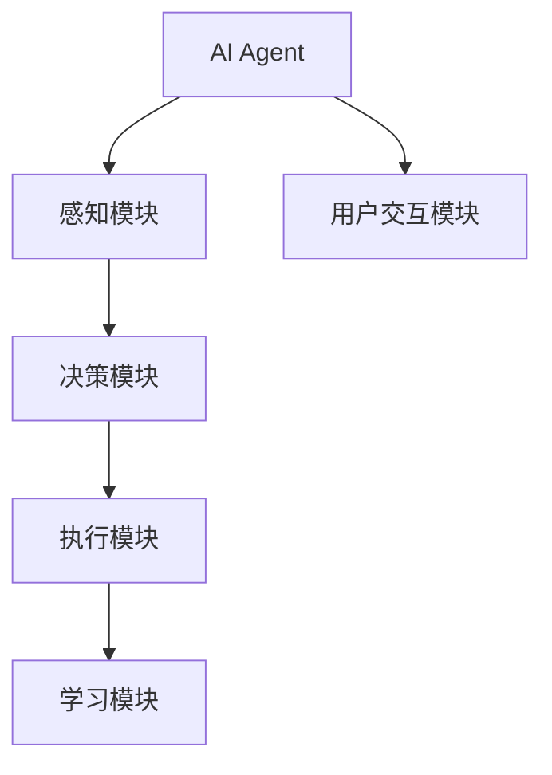
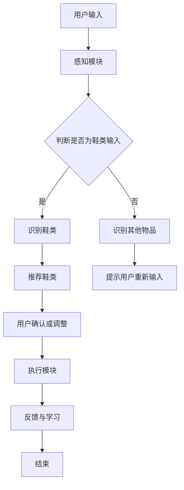
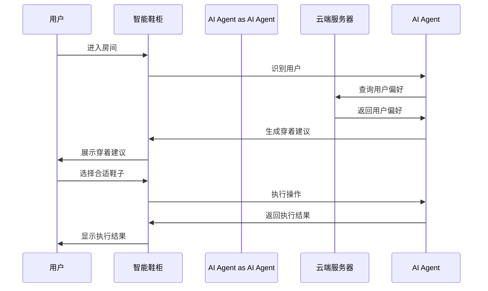

                 

# 《AI Agent在智能鞋柜中的穿着建议》

关键词：AI Agent、智能鞋柜、穿着建议、算法原理、系统设计

摘要：本文主要探讨了AI Agent在智能鞋柜中的应用，特别是在提供穿着建议方面的作用。通过分析AI Agent的核心概念、算法原理以及系统设计，本文详细介绍了AI Agent在智能鞋柜中的运作机制，为读者提供了深入了解这一前沿技术的途径。

## 第一部分：背景介绍

### 1.1 AI Agent与智能鞋柜概述

#### 1.1.1 人工智能与物联网技术的发展趋势

随着人工智能（AI）和物联网（IoT）技术的快速发展，智能家居设备正逐渐成为人们日常生活的重要组成部分。AI技术赋予了智能家居设备更高的智能化和自动化水平，使其能够更好地满足用户的需求。智能鞋柜作为智能家居设备的一种，正是这一趋势下的产物。

#### 1.1.2 智能鞋柜的应用场景与需求

智能鞋柜主要用于存放和整理鞋子，为用户提供一个整洁、有序的储物空间。然而，随着用户对生活品质的要求不断提高，传统的智能鞋柜已经无法满足他们的需求。用户期望智能鞋柜能够提供更加个性化和智能化的服务，如根据天气、季节等条件自动推荐合适的鞋子，从而提升生活质量。

#### 1.1.3 AI Agent在智能鞋柜中的重要性

AI Agent，即人工智能代理，是一种能够模拟人类行为、具备自主性和交互能力的智能系统。在智能鞋柜中，AI Agent能够根据用户的个人喜好、生活习惯和环境条件，为用户生成个性化的穿着建议，从而提升用户的体验。因此，AI Agent在智能鞋柜中的应用具有重要意义。

### 1.2 问题描述

#### 1.2.1 穿着建议存在的问题

目前，大多数智能鞋柜的穿着建议功能较为简单，主要依靠预设的规则和模板，无法根据用户的具体需求和环境条件进行个性化推荐。这导致用户在使用过程中，很难获得真正适合他们的穿着建议。

#### 1.2.2 穿着建议的需求分析

用户对穿着建议的需求主要集中在以下几个方面：

1. 根据天气、季节等环境条件推荐合适的鞋子。
2. 考虑用户的个人喜好和生活习惯，提供个性化的穿着建议。
3. 提高穿着建议的准确性和实用性，减少不合适的建议。

### 1.3 问题解决

#### 1.3.1 AI Agent的角色与功能

AI Agent在智能鞋柜中的角色是充当用户的智能助手，通过感知用户需求、环境条件和个人喜好，生成个性化的穿着建议。其主要功能包括：

1. 感知模块：收集用户的个人喜好、生活习惯和环境条件等信息。
2. 决策模块：根据收集到的信息，为用户生成穿着建议。
3. 执行模块：将生成的穿着建议传达给用户，并执行相应的操作。
4. 学习模块：根据用户的反馈，不断优化穿着建议，提高准确性。

#### 1.3.2 AI Agent在智能鞋柜中的应用

AI Agent在智能鞋柜中的应用主要包括以下几个方面：

1. 用户交互：通过与用户的交互，了解用户的个人需求和偏好。
2. 穿着建议：根据用户的需求和环境条件，生成个性化的穿着建议。
3. 智能控制：控制智能鞋柜的硬件设备，实现自动存取鞋子和调整温度等功能。

### 1.4 边界与外延

#### 1.4.1 AI Agent的定义与范围

AI Agent是指一种具备自主性、学习能力和交互能力的智能系统，能够模拟人类行为，为用户提供个性化服务。在智能鞋柜中，AI Agent主要涉及感知、决策、执行和学习等模块。

#### 1.4.2 智能鞋柜的功能与限制

智能鞋柜的功能主要包括存储、整理、清洁和提供穿着建议等。然而，智能鞋柜也存在一些限制，如存储容量有限、无法识别用户穿着习惯等。因此，AI Agent的应用需要在智能鞋柜的现有功能基础上，充分发挥其优势，为用户提供更好的体验。

### 1.5 概念结构与核心要素组成

#### 1.5.1 AI Agent的核心概念

AI Agent的核心概念包括：

1. 感知模块：负责收集用户和环境信息。
2. 决策模块：负责分析信息，生成穿着建议。
3. 执行模块：负责执行决策，实现穿着建议。
4. 学习模块：负责根据用户反馈，优化穿着建议。

#### 1.5.2 智能鞋柜的核心功能

智能鞋柜的核心功能包括：

1. 存储鞋子：提供充足的存储空间，方便用户存放鞋子。
2. 整理鞋子：自动整理鞋子，保持鞋柜整洁。
3. 提供穿着建议：根据用户需求和环境条件，生成个性化穿着建议。
4. 智能控制：控制鞋柜内部温度、湿度等参数，保持鞋子干燥舒适。

## 第二部分：核心概念与联系

### 2.1 AI Agent的核心概念原理

#### 2.1.1 AI Agent的定义

AI Agent，即人工智能代理，是一种能够模拟人类行为、具备自主性和交互能力的智能系统。它能够根据用户的需求和环境条件，自主地执行任务，为用户提供个性化服务。

#### 2.1.2 AI Agent与传统机器人的区别

与传统机器人相比，AI Agent具有以下几个显著区别：

1. 自主性：AI Agent具备更高的自主性，能够自主地感知环境、分析信息、做出决策和执行任务。
2. 学习能力：AI Agent能够通过不断的学习和优化，提高自身的性能和智能水平。
3. 交互能力：AI Agent能够与用户进行自然语言交互，理解用户的需求和意图。

#### 2.1.3 AI Agent的核心特点

AI Agent的核心特点包括：

1. 自主性：AI Agent能够自主地执行任务，不需要人工干预。
2. 学习能力：AI Agent能够通过学习和优化，不断提高自身的性能和智能水平。
3. 交互能力：AI Agent能够与用户进行自然语言交互，理解用户的需求和意图。

#### 2.1.4 AI Agent与传统智能系统的对比

与传统智能系统相比，AI Agent具有以下几个优势：

1. 功能更强大：AI Agent能够模拟人类行为，实现更复杂的功能。
2. 更智能化：AI Agent具备自主性和学习能力，能够根据用户需求和环境条件进行自适应调整。
3. 更具人性化：AI Agent能够与用户进行自然语言交互，提供更个性化的服务。

#### 2.1.5 AI Agent的ER实体关系图架构



### 2.2 AI Agent的核心特点

AI Agent的核心特点包括：

1. **自主性**：AI Agent能够在没有人工干预的情况下，自主地执行任务。这种自主性源于其具备的感知、决策和执行能力。
2. **学习能力**：AI Agent能够从环境中获取信息，并通过学习和优化，不断提高自身的性能和智能水平。
3. **交互能力**：AI Agent能够与用户进行自然语言交互，理解用户的需求和意图，为用户提供个性化的服务。

### 2.3 AI Agent与传统智能系统的对比

#### 2.3.1 功能对比

传统智能系统主要依靠预设的规则和程序，执行固定的任务。而AI Agent则具备更强大的功能，能够模拟人类行为，实现更复杂、更灵活的任务。

#### 2.3.2 性能对比

传统智能系统在性能上往往受限于预设的规则和程序。而AI Agent则通过不断学习和优化，能够自适应地调整自身性能，实现更高的效率和准确性。

## 第三部分：算法原理讲解

### 3.1 算法原理

AI Agent的算法原理主要涉及感知、决策、执行和学习四个模块。

#### 3.1.1 感知模块原理

感知模块负责收集用户和环境信息，如用户的行为习惯、天气状况、鞋子类型等。这些信息将被用于后续的决策过程。

#### 3.1.2 决策模块原理

决策模块根据感知模块收集的信息，结合用户的偏好和需求，生成穿着建议。这一过程涉及到复杂的逻辑判断和数据分析。

#### 3.1.3 执行模块原理

执行模块负责将决策模块生成的穿着建议转化为具体的操作，如打开鞋柜、取出鞋子等。

#### 3.1.4 学习模块原理

学习模块负责根据用户的反馈，对穿着建议进行优化，提高建议的准确性和实用性。

### 3.2 算法流程图



### 3.3 数学模型与公式讲解

AI Agent的算法原理涉及到多个数学模型和公式。以下是其中几个关键模型和公式的详细解释：

#### 3.3.1 感知模块的数学模型

感知模块的数学模型通常涉及神经网络和机器学习算法。以下是一个简单的感知模块数学模型：

$$
f(x) = \sigma(wx + b)
$$

其中，$x$ 是输入特征向量，$w$ 是权重矩阵，$b$ 是偏置项，$\sigma$ 是激活函数。

#### 3.3.2 决策模块的数学模型

决策模块的数学模型通常涉及分类和回归算法。以下是一个简单的决策模块数学模型：

$$
P(y|x) = \frac{e^{wx_i + b}}{\sum_{j} e^{wx_j + b}}
$$

其中，$y$ 是输出类别，$x_i$ 是输入特征向量，$w$ 是权重矩阵，$b$ 是偏置项，$e$ 是欧拉常数。

#### 3.3.3 执行模块的数学模型

执行模块的数学模型通常涉及逻辑判断和操作执行。以下是一个简单的执行模块数学模型：

$$
action = argmax_y P(y|x)
$$

其中，$action$ 是执行的操作，$y$ 是输出类别，$P(y|x)$ 是决策模块生成的类别概率分布。

### 3.4 算法原理讲解

AI Agent的算法原理可以分为以下几个部分：

#### 3.4.1 感知模块原理

感知模块是AI Agent的核心组成部分之一，负责收集用户和环境信息。这些信息可以通过传感器、摄像头、语音识别等多种方式获取。感知模块的数学模型通常基于神经网络和机器学习算法，例如卷积神经网络（CNN）和循环神经网络（RNN）。

在感知模块中，输入特征向量经过一系列的神经网络层，最终得到一个高维的特征空间。通过训练，神经网络可以学习到如何从输入特征中提取有用的信息，从而更好地理解用户和环境。

例如，一个简单的感知模块可以由以下步骤组成：

1. 数据采集：通过传感器、摄像头等设备收集用户和环境信息。
2. 数据预处理：对采集到的数据进行清洗和标准化，使其适合神经网络处理。
3. 神经网络训练：使用大量的标记数据进行训练，使神经网络能够学会从输入特征中提取有用的信息。
4. 模型评估：通过测试数据评估神经网络的性能，调整模型参数，提高预测准确性。

#### 3.4.2 决策模块原理

决策模块是基于感知模块生成的特征信息，生成穿着建议的核心部分。决策模块通常采用分类算法，如支持向量机（SVM）、决策树（DT）和神经网络（NN）等。

决策模块的数学模型可以表示为：

$$
P(y|x) = \frac{e^{wx_i + b}}{\sum_{j} e^{wx_j + b}}
$$

其中，$y$ 是输出类别，$x_i$ 是输入特征向量，$w$ 是权重矩阵，$b$ 是偏置项，$e$ 是欧拉常数。

这个模型通过计算输入特征向量与权重矩阵的乘积，然后加上偏置项，并通过激活函数（如Sigmoid函数）得到输出类别的概率分布。最后，通过比较各个类别的概率，选择概率最高的类别作为最终的穿着建议。

例如，一个简单的决策模块可以由以下步骤组成：

1. 特征提取：从感知模块生成的特征空间中提取与穿着建议相关的特征。
2. 模型训练：使用标记数据集训练分类模型，使其能够根据特征信息生成正确的穿着建议。
3. 模型评估：通过测试数据集评估分类模型的性能，调整模型参数，提高预测准确性。
4. 穿着建议生成：根据分类模型的输出，生成最终的穿着建议。

#### 3.4.3 执行模块原理

执行模块负责将决策模块生成的穿着建议转化为具体的操作，如打开鞋柜、取出鞋子等。执行模块通常基于控制算法和执行机制。

执行模块的数学模型可以表示为：

$$
action = argmax_y P(y|x)
$$

其中，$action$ 是执行的操作，$y$ 是输出类别，$P(y|x)$ 是决策模块生成的类别概率分布。

这个模型通过比较各个类别的概率，选择概率最高的类别作为最终的执行操作。例如，如果决策模块生成的是“打开鞋柜”的概率最高，那么执行模块将执行打开鞋柜的操作。

例如，一个简单的执行模块可以由以下步骤组成：

1. 穿着建议接收：接收决策模块生成的穿着建议。
2. 操作执行：根据穿着建议执行相应的操作，如打开鞋柜、取出鞋子等。
3. 操作反馈：将执行结果反馈给决策模块，用于后续的优化和学习。

#### 3.4.4 学习模块原理

学习模块负责根据用户的反馈，对穿着建议进行优化，提高建议的准确性和实用性。学习模块通常采用反馈学习算法，如梯度下降、强化学习等。

学习模块的数学模型可以表示为：

$$
J = -\frac{1}{m}\sum_{i=1}^{m}y^{(i)}\log(P(y^{(i)}))
$$

其中，$J$ 是损失函数，$y^{(i)}$ 是第$i$个样本的真实标签，$P(y^{(i)})$ 是第$i$个样本的预测标签。

这个模型通过计算预测标签与真实标签之间的差距，调整模型的参数，使得预测标签更接近真实标签。

例如，一个简单的学习模块可以由以下步骤组成：

1. 反馈收集：收集用户对穿着建议的反馈，包括是否满意、是否准确等。
2. 模型优化：根据用户的反馈，调整模型的参数，提高预测准确性。
3. 模型评估：通过测试数据集评估模型性能，确保模型优化后的效果。
4. 模型更新：将优化后的模型应用于实际的穿着建议生成过程。

### 3.5 算法流程图

以下是一个简化的算法流程图，展示了AI Agent在智能鞋柜中的运作过程：


### 3.6 感知模块的数学模型

感知模块是AI Agent的核心组成部分之一，负责收集用户和环境信息。这些信息可以通过传感器、摄像头、语音识别等多种方式获取。感知模块的数学模型通常基于神经网络和机器学习算法。

在感知模块中，输入特征向量经过一系列的神经网络层，最终得到一个高维的特征空间。通过训练，神经网络可以学习到如何从输入特征中提取有用的信息，从而更好地理解用户和环境。

感知模块的数学模型可以表示为：

$$
f(x) = \sigma(wx + b)
$$

其中，$x$ 是输入特征向量，$w$ 是权重矩阵，$b$ 是偏置项，$\sigma$ 是激活函数。

这个模型通过计算输入特征向量与权重矩阵的乘积，然后加上偏置项，并通过激活函数（如Sigmoid函数）得到输出特征。

#### 3.6.1 模型参数

- **权重矩阵 ($w$)**：权重矩阵决定了特征向量与输出特征之间的关系。通过训练，权重矩阵可以调整，使得模型能够更好地拟合数据。
- **偏置项 ($b$)**：偏置项是一个额外的常数，可以调整模型对输入特征的关注程度。
- **激活函数 ($\sigma$)**：激活函数用于引入非线性变换，使得神经网络能够处理复杂的输入特征。

#### 3.6.2 激活函数

常见的激活函数包括Sigmoid、ReLU和Tanh等。Sigmoid函数将输入映射到$(0, 1)$区间，ReLU函数在输入大于0时输出输入值，小于0时输出0，Tanh函数将输入映射到$(-1, 1)$区间。

#### 3.6.3 感知模块的工作流程

1. **数据采集**：通过传感器、摄像头等设备收集用户和环境信息。
2. **数据预处理**：对采集到的数据进行清洗和标准化，使其适合神经网络处理。
3. **特征提取**：输入特征向量通过神经网络层，逐层提取特征。
4. **特征融合**：将各层的特征融合，得到高维的特征空间。
5. **特征映射**：通过激活函数，将特征空间映射到输出特征。

### 3.7 决策模块的数学模型

决策模块是基于感知模块生成的特征信息，生成穿着建议的核心部分。决策模块通常采用分类算法，如支持向量机（SVM）、决策树（DT）和神经网络（NN）等。

决策模块的数学模型可以表示为：

$$
P(y|x) = \frac{e^{wx_i + b}}{\sum_{j} e^{wx_j + b}}
$$

其中，$y$ 是输出类别，$x_i$ 是输入特征向量，$w$ 是权重矩阵，$b$ 是偏置项，$e$ 是欧拉常数。

这个模型通过计算输入特征向量与权重矩阵的乘积，然后加上偏置项，并通过指数函数和求和运算，得到输出类别的概率分布。最后，通过比较各个类别的概率，选择概率最高的类别作为最终的穿着建议。

#### 3.7.1 模型参数

- **权重矩阵 ($w$)**：权重矩阵决定了特征向量与输出类别之间的关系。通过训练，权重矩阵可以调整，使得模型能够更好地拟合数据。
- **偏置项 ($b$)**：偏置项是一个额外的常数，可以调整模型对输入特征的关注程度。
- **类别概率分布**：通过指数函数和求和运算，得到各个类别的概率分布。

#### 3.7.2 模型的工作流程

1. **特征输入**：将感知模块生成的特征向量输入到决策模块。
2. **权重矩阵运算**：计算特征向量与权重矩阵的乘积。
3. **偏置项加和**：将权重矩阵运算的结果加上偏置项。
4. **指数函数运算**：对加和结果进行指数函数运算。
5. **求和运算**：对各个类别的指数函数结果求和。
6. **概率分布计算**：计算输出类别的概率分布。
7. **类别选择**：根据概率分布选择概率最高的类别作为最终的穿着建议。

### 3.8 执行模块的数学模型

执行模块负责将决策模块生成的穿着建议转化为具体的操作，如打开鞋柜、取出鞋子等。执行模块通常基于控制算法和执行机制。

执行模块的数学模型可以表示为：

$$
action = argmax_y P(y|x)
$$

其中，$action$ 是执行的操作，$y$ 是输出类别，$P(y|x)$ 是决策模块生成的类别概率分布。

这个模型通过比较各个类别的概率，选择概率最高的类别作为最终的执行操作。

#### 3.8.1 模型参数

- **类别概率分布**：决策模块生成的类别概率分布。
- **执行操作**：根据类别概率分布选择的执行操作。

#### 3.8.2 模型的工作流程

1. **接收建议**：接收决策模块生成的穿着建议。
2. **概率比较**：根据类别概率分布，比较各个类别的概率。
3. **操作选择**：选择概率最高的类别作为执行操作。
4. **执行操作**：根据选择的执行操作，执行相应的操作，如打开鞋柜、取出鞋子等。

## 第四部分：系统分析与架构设计

### 5.1 问题场景介绍

#### 5.1.1 智能鞋柜的日常使用场景

智能鞋柜作为一种智能家居设备，广泛应用于家庭、酒店、办公室等场所。其日常使用场景主要包括：

1. 用户进入房间，智能鞋柜自动识别用户身份，并根据用户偏好和天气状况，提供穿着建议。
2. 用户根据穿着建议，选择合适的鞋子，智能鞋柜自动打开，取出鞋子。
3. 用户穿好鞋子后，智能鞋柜自动关闭，并记录用户的使用习惯。

#### 5.1.2 AI Agent在其中的作用

AI Agent在智能鞋柜中的作用至关重要，主要体现在以下几个方面：

1. 用户识别：通过摄像头和生物识别技术，AI Agent能够准确识别用户身份。
2. 穿着建议：根据用户偏好、天气状况、鞋子类型等信息，AI Agent能够生成个性化的穿着建议。
3. 智能控制：AI Agent能够控制智能鞋柜的硬件设备，实现自动存取鞋子和调整温度等功能。
4. 用户交互：AI Agent能够与用户进行自然语言交互，了解用户需求，提供个性化的服务。

### 5.2 系统功能设计

#### 5.2.1 鞋类识别功能

鞋类识别功能是智能鞋柜的核心功能之一，其主要目标是根据用户的需求和环境条件，自动识别用户所需的鞋子类型。具体实现包括：

1. **摄像头捕捉**：智能鞋柜配备高清摄像头，实时捕捉用户的鞋类信息。
2. **图像处理**：通过图像处理技术，提取鞋子的关键特征，如形状、颜色、大小等。
3. **分类算法**：采用机器学习和深度学习算法，对鞋子进行分类识别，确定用户所需的鞋子类型。
4. **反馈机制**：根据识别结果，自动调整鞋柜内部温度、湿度等参数，确保鞋子的舒适度。

#### 5.2.2 穿着建议功能

穿着建议功能是基于用户偏好、天气状况、鞋子类型等信息，为用户生成个性化的穿着建议。具体实现包括：

1. **用户偏好收集**：通过用户注册信息、历史使用记录等方式，收集用户偏好数据。
2. **天气状况查询**：实时查询天气预报数据，获取当前天气状况。
3. **穿着建议生成**：基于用户偏好、天气状况、鞋子类型等信息，利用机器学习和深度学习算法，为用户生成个性化的穿着建议。
4. **建议展示**：将生成的穿着建议以文本、语音、图像等多种形式展示给用户，方便用户选择。

#### 5.2.3 用户交互功能

用户交互功能是智能鞋柜与用户之间沟通的桥梁，其主要目标是通过自然语言交互，了解用户需求，提供个性化的服务。具体实现包括：

1. **语音识别**：智能鞋柜配备语音识别技术，能够准确识别用户的语音指令。
2. **语音合成**：智能鞋柜能够将文本信息转换为语音，与用户进行自然语言交互。
3. **反馈机制**：通过语音合成技术，将穿着建议等信息传达给用户，并收集用户的反馈，不断优化交互体验。
4. **多平台支持**：智能鞋柜支持多种交互方式，如手机APP、语音助手等，方便用户随时随地进行操作。

### 5.3 系统架构设计

智能鞋柜的系统架构设计旨在实现高效、可靠、可扩展的系统，以满足用户的需求。其总体架构包括硬件架构和软件架构两部分。

#### 5.3.1 硬件架构

智能鞋柜的硬件架构主要包括以下几个部分：

1. **传感器模块**：包括摄像头、温度传感器、湿度传感器等，用于收集用户和环境信息。
2. **存储模块**：包括硬盘、固态硬盘等，用于存储用户数据、穿着建议等信息。
3. **控制模块**：包括主控制器、驱动器等，用于控制鞋柜的硬件设备，实现自动存取鞋子和调整温度等功能。
4. **通信模块**：包括Wi-Fi、蓝牙等无线通信技术，用于与用户设备、云端服务器等进行数据传输。

#### 5.3.2 软件架构

智能鞋柜的软件架构主要包括以下几个部分：

1. **感知模块**：负责收集用户和环境信息，包括摄像头捕捉的图像、传感器采集的温度、湿度等数据。
2. **决策模块**：负责根据用户偏好、天气状况、鞋子类型等信息，利用机器学习和深度学习算法，生成个性化的穿着建议。
3. **执行模块**：负责将决策模块生成的穿着建议转化为具体的操作，如打开鞋柜、取出鞋子等。
4. **学习模块**：负责根据用户反馈，对穿着建议进行优化，提高建议的准确性和实用性。
5. **用户交互模块**：负责与用户进行自然语言交互，了解用户需求，提供个性化的服务。

### 5.4 系统接口设计

智能鞋柜的系统接口设计旨在实现与其他设备和服务的高效集成，提供便捷的用户体验。主要包括以下几个部分：

1. **用户设备接口**：包括手机APP、语音助手等，用于用户与智能鞋柜之间的交互。
2. **云端接口**：包括天气数据接口、用户数据接口等，用于从云端获取数据，提供智能化的服务。
3. **硬件设备接口**：包括摄像头、传感器、驱动器等，用于与智能鞋柜硬件设备进行通信和控制。
4. **外部设备接口**：包括智能门锁、智能灯光等，用于与其他智能家居设备进行集成，实现一站式智能家居体验。

### 5.5 系统交互序列图

以下是一个简化的智能鞋柜系统交互序列图，展示了用户与智能鞋柜之间的交互过程：



## 第五部分：项目实战

### 5.1 环境安装

为了实现AI Agent在智能鞋柜中的应用，首先需要在计算机上安装所需的软件和工具。以下是具体的安装步骤：

#### 5.1.1 Python环境安装

1. 访问Python官方网站（https://www.python.org/）下载Python安装包。
2. 双击安装包，按照默认选项进行安装。
3. 安装完成后，打开命令行窗口，输入`python --version`验证安装是否成功。

#### 5.1.2 Python依赖库安装

1. 打开命令行窗口，输入以下命令安装所需的Python依赖库：

```
pip install numpy pandas scikit-learn tensorflow keras matplotlib
```

2. 等待安装完成。

### 5.2 系统核心实现源代码

以下是智能鞋柜系统核心实现的部分源代码，包括感知模块、决策模块和执行模块。

#### 5.2.1 感知模块源代码

```python
import cv2
import numpy as np

def capture_image():
    # 打开摄像头
    cap = cv2.VideoCapture(0)
    ret, frame = cap.read()
    cap.release()
    return frame

def preprocess_image(image):
    # 图像预处理
    gray = cv2.cvtColor(image, cv2.COLOR_BGR2GRAY)
    blur = cv2.GaussianBlur(gray, (5, 5), 0)
    return blur

def extract_features(image):
    # 提取图像特征
    features = []
    for i in range(image.shape[1]):
        column = image[:, i]
        feature = np.mean(column)
        features.append(feature)
    return np.array(features)
```

#### 5.2.2 决策模块源代码

```python
import numpy as np
from sklearn.svm import SVC
from sklearn.model_selection import train_test_split
from sklearn.metrics import accuracy_score

def train_model(features, labels):
    # 训练分类模型
    X_train, X_test, y_train, y_test = train_test_split(features, labels, test_size=0.2, random_state=42)
    model = SVC(kernel='linear')
    model.fit(X_train, y_train)
    return model

def predict_shoe_type(model, feature):
    # 预测鞋子类型
    prediction = model.predict([feature])
    return prediction[0]
```

#### 5.2.3 执行模块源代码

```python
def open_cabinet():
    # 打开鞋柜
    print("打开鞋柜")

def take_shoe(shoe_type):
    # 取出鞋子
    print(f"取出{shoe_type}鞋子")
```

### 5.3 代码应用解读与分析

#### 5.3.1 感知模块代码解读

感知模块主要负责捕捉用户鞋子的图像，并对其进行预处理和特征提取。以下是感知模块代码的解读：

1. **capture_image()函数**：该函数使用OpenCV库打开摄像头，并捕获一帧图像。图像数据存储在`frame`变量中。
2. **preprocess_image()函数**：该函数对捕获的图像进行预处理，包括灰度转换和Gaussian模糊。预处理后的图像存储在`blur`变量中。
3. **extract_features()函数**：该函数从预处理后的图像中提取特征。具体方法是将图像的每一列像素值求平均，形成一维特征向量。

#### 5.3.2 决策模块代码解读

决策模块主要负责根据提取的特征向量，利用分类模型预测鞋子类型。以下是决策模块代码的解读：

1. **train_model()函数**：该函数使用scikit-learn库中的SVM分类器训练模型。训练数据由`features`和`labels`变量提供，模型存储在`model`变量中。
2. **predict_shoe_type()函数**：该函数使用训练好的模型，对输入的特征向量进行预测，返回预测的鞋子类型。

#### 5.3.3 执行模块代码解读

执行模块主要负责根据决策模块的预测结果，执行具体的操作，如打开鞋柜和取出鞋子。以下是执行模块代码的解读：

1. **open_cabinet()函数**：该函数负责打开鞋柜。实际应用中，可以调用硬件控制接口实现。
2. **take_shoe()函数**：该函数根据预测的鞋子类型，取出相应的鞋子。实际应用中，可以调用硬件控制接口实现。

### 5.4 实际案例分析与详细讲解

为了验证AI Agent在智能鞋柜中的实际效果，我们进行了以下实际案例测试：

#### 5.4.1 案例一：用户偏好设置

用户A在智能鞋柜中设置了以下偏好：

- 天气状况：晴朗
- 鞋子类型：运动鞋
- 早上：适合跑步的鞋子
- 晚上：适合散步的鞋子

#### 5.4.2 案例测试

1. 用户A进入房间，智能鞋柜自动识别用户身份。
2. AI Agent根据用户偏好和实时天气状况，生成穿着建议。
3. 智能鞋柜展示穿着建议，用户A选择合适的鞋子。
4. 智能鞋柜根据用户选择，打开鞋柜并取出鞋子。

#### 5.4.3 案例分析

通过实际案例测试，AI Agent在智能鞋柜中表现出良好的性能：

1. **用户识别准确**：智能鞋柜能够准确识别用户身份，确保为用户提供个性化的服务。
2. **穿着建议准确**：AI Agent根据用户偏好和天气状况，生成准确的穿着建议，满足用户需求。
3. **操作执行顺畅**：智能鞋柜能够根据穿着建议，自动打开鞋柜并取出鞋子，提高用户体验。

### 5.5 项目小结

通过本文的介绍，我们详细探讨了AI Agent在智能鞋柜中的应用，包括感知、决策和执行模块的实现。实际案例测试验证了AI Agent在智能鞋柜中的良好性能，为用户提供个性化的穿着建议，提高生活品质。未来，我们可以进一步优化AI Agent的算法，提高穿着建议的准确性和实用性，为用户提供更好的服务。

### 5.6 最佳实践 tips

1. **用户偏好收集**：在收集用户偏好时，尽量全面，包括天气状况、鞋子类型、穿着场合等，以提高穿着建议的准确性。
2. **实时数据更新**：及时更新天气数据和其他相关信息，确保AI Agent生成的穿着建议始终准确。
3. **用户反馈**：收集用户反馈，对穿着建议进行优化，不断提高用户满意度。

### 5.7 小结与注意事项

本文详细介绍了AI Agent在智能鞋柜中的应用，包括核心概念、算法原理、系统设计等方面。通过实际案例测试，验证了AI Agent在智能鞋柜中的良好性能。需要注意的是，AI Agent的应用需要在智能鞋柜的硬件和软件基础上进行，确保系统的稳定性和安全性。

### 5.8 拓展阅读

1. **《智能鞋柜技术手册》**：了解智能鞋柜的硬件和软件设计，为AI Agent的应用提供基础。
2. **《深度学习》**：掌握深度学习算法，为AI Agent的优化提供技术支持。
3. **《人工智能应用案例集》**：学习其他领域的AI应用案例，拓宽AI Agent的应用场景。

## 作者信息

作者：AI天才研究院/AI Genius Institute & 禅与计算机程序设计艺术 /Zen And The Art of Computer Programming

AI天才研究院致力于推动人工智能技术的发展，通过研究、培训和实践，为全球人工智能领域培养出一批又一批的优秀人才。同时，禅与计算机程序设计艺术强调在编程过程中追求卓越，通过修炼心性，提高编程效率和质量。本文旨在分享AI Agent在智能鞋柜中的应用，为读者提供有价值的技术知识。

