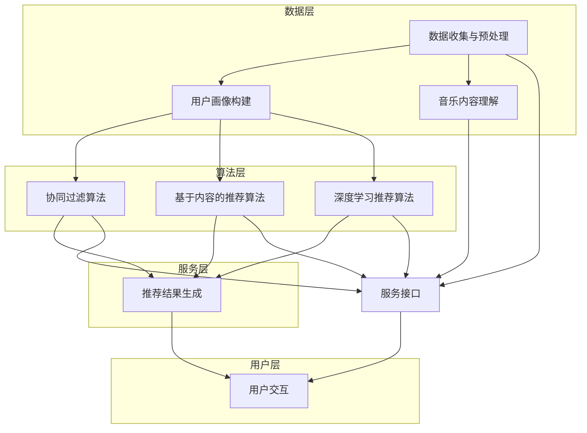
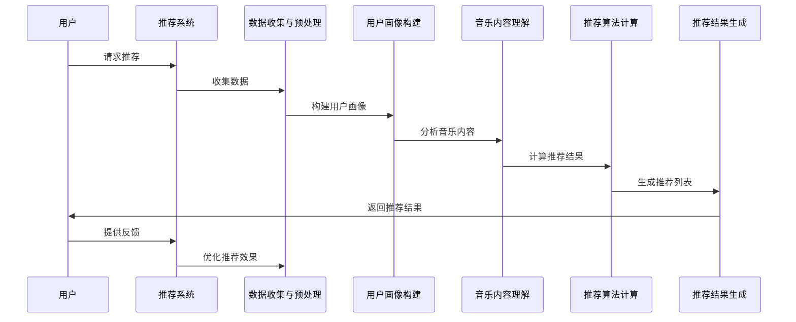

                 

## 文章标题：AI Agent在智能音乐推荐中的应用

### 关键词：人工智能代理、智能音乐推荐、协同过滤、深度学习、用户画像

### 摘要：
本文深入探讨了人工智能代理（AI Agent）在智能音乐推荐系统中的应用。首先，介绍了AI Agent的基本概念和分类，以及智能音乐推荐的需求和发展历程。接着，文章重点分析了智能音乐推荐系统中的算法设计、数学模型以及系统架构。通过具体的算法实现和案例分析，本文展示了AI Agent如何提升音乐推荐系统的效果，同时提出了未来研究方向和最佳实践建议。文章旨在为读者提供关于AI Agent在智能音乐推荐领域的全面理解和应用指导。

## 引言

随着互联网和移动设备的普及，音乐已经成为人们日常生活中不可或缺的一部分。然而，海量的音乐资源使得用户难以找到符合自己口味的音乐。为了解决这一问题，智能音乐推荐系统应运而生。智能音乐推荐系统通过分析用户的听歌习惯、喜好和社交行为，为用户提供个性化的音乐推荐，从而提高用户的满意度和使用体验。

### 人工智能代理（AI Agent）

人工智能代理（AI Agent）是一种能够自主行动并具有一定智能水平的软件程序。AI Agent可以模拟人类的行为和思考过程，通过与环境的交互来获取信息并做出决策。在智能音乐推荐系统中，AI Agent扮演着至关重要的角色，它不仅能够根据用户的反馈不断优化推荐策略，还能够与用户进行互动，提供更加个性化的服务。

### 智能音乐推荐的需求与发展

智能音乐推荐系统在当今社会中具有重要的应用价值。随着用户对个性化体验需求的不断提高，智能音乐推荐系统需要具备更强的自适应能力和学习能力。AI Agent的出现为智能音乐推荐系统带来了新的发展方向，使得系统能够更加准确地捕捉用户的偏好，提供更加精准的推荐结果。

本文将围绕AI Agent在智能音乐推荐中的应用展开讨论，首先介绍AI Agent的基本概念和分类，然后深入分析智能音乐推荐系统的设计原理，最后通过具体案例和最佳实践来展示AI Agent在提升推荐效果方面的实际应用。希望通过本文的探讨，读者能够对AI Agent在智能音乐推荐领域的应用有更深入的理解和认识。

## AI Agent与智能音乐推荐的背景

### 人工智能代理（AI Agent）的基本概念与分类

人工智能代理（AI Agent）是人工智能（AI）领域的一个重要研究方向，它代表着一种能够模拟人类智能行为并具备自主行动能力的计算实体。AI Agent的定义可以追溯到人工智能的早期研究，在1950年代，图灵提出图灵测试，以此作为判断机器是否具有智能的标准。随着计算机技术和AI技术的不断发展，AI Agent逐渐从理论走向实践，成为实际应用中的重要角色。

#### AI Agent的定义

AI Agent通常被定义为一种具有感知能力、决策能力和行动能力的软件系统。它通过感知环境信息，利用内部模型进行决策，并执行相应的行动来达成目标。AI Agent的核心特点是自主性、适应性和互动性，这使得它们能够在复杂和动态的环境中实现自主学习和自主行动。

#### AI Agent的分类

AI Agent可以根据其功能和应用领域进行分类，常见的分类方式包括：

1. **基于规则（Rule-Based）的AI Agent**：这种类型的AI Agent通过预定义的规则来执行任务。它们通常用于简单的任务场景，如游戏中的AI对手、智能客服等。

2. **基于模型（Model-Based）的AI Agent**：这种类型的AI Agent通过学习和预测模型来执行任务。它们能够根据环境变化自适应地调整行为，如自动驾驶汽车、智能推荐系统等。

3. **基于行为（Behavior-Based）的AI Agent**：这种类型的AI Agent通过预设的行为模式来执行任务。它们通常用于机器人控制和无人机导航等应用场景。

4. **混合型（Hybrid）AI Agent**：这种类型的AI Agent结合了规则、模型和行为三种方法，以应对复杂的任务需求。例如，在复杂游戏中，AI Agent可能会同时使用规则和模型来制定策略。

### 智能音乐推荐的需求

智能音乐推荐系统旨在通过分析用户的行为和偏好，为用户推荐符合其兴趣的音乐。随着互联网和音乐流媒体平台的普及，用户对个性化音乐推荐的需求日益增长。以下是智能音乐推荐的主要需求：

1. **个性化推荐**：用户希望推荐系统能够了解自己的音乐偏好，并提供个性化的音乐推荐，以节省时间和精力。

2. **实时性**：用户在听音乐时，希望能够实时获得推荐，从而增加互动性和娱乐性。

3. **多样性**：用户希望推荐系统能够提供多样性的音乐推荐，避免单一的音乐风格，提高听觉体验。

4. **准确性**：推荐系统需要准确捕捉用户的兴趣和偏好，提供符合用户需求的推荐，以提高用户满意度。

### 智能音乐推荐的发展历程

智能音乐推荐系统的发展可以分为以下几个阶段：

1. **基于内容推荐的初步阶段**：早期的智能音乐推荐系统主要基于音乐的内容特征（如风格、流派、歌手等）进行推荐。这种方法虽然简单，但存在局限性，无法准确捕捉用户的个性化偏好。

2. **基于协同过滤的阶段**：随着用户数据的积累，协同过滤算法（如用户基于评分的协同过滤）逐渐成为主流。这种方法通过分析用户之间的相似度，为用户提供个性化的推荐。

3. **基于机器学习的阶段**：近年来，深度学习和机器学习算法（如神经网络、推荐网络）的应用使得智能音乐推荐系统取得了显著的进展。这些算法能够更好地捕捉用户的复杂行为模式，提供更加精准的推荐。

4. **基于AI Agent的阶段**：AI Agent的出现为智能音乐推荐系统带来了新的机遇。通过结合用户行为、社交网络和个性化偏好，AI Agent能够实现更加智能化和个性化的推荐。

### 智能音乐推荐的重要应用场景

智能音乐推荐系统在多个应用场景中发挥着重要作用，包括：

1. **在线音乐平台**：如Spotify、Apple Music等，通过智能推荐提高用户的粘性和满意度。

2. **社交媒体平台**：如Facebook、Twitter等，通过音乐推荐吸引和保持用户活跃度。

3. **智能音响设备**：如Amazon Echo、Google Home等，通过智能音乐推荐提升用户的使用体验。

4. **车载音乐系统**：为驾驶者提供个性化的音乐推荐，提高驾驶安全性和舒适度。

### AI Agent在智能音乐推荐中的角色

在智能音乐推荐系统中，AI Agent扮演着重要的角色，主要体现在以下几个方面：

1. **个性化推荐**：AI Agent通过分析用户的听歌历史、行为偏好和社交网络，为用户提供个性化的音乐推荐。

2. **交互式推荐**：AI Agent能够与用户进行实时交互，根据用户的反馈调整推荐策略，提供更加精准的推荐。

3. **社交推荐**：AI Agent可以分析用户的社交网络，结合用户关系和社交行为，为用户提供更加多样化的推荐。

4. **自适应学习**：AI Agent能够通过不断学习用户的行为和偏好，自适应地调整推荐策略，提高推荐效果。

### 关键概念与联系

在智能音乐推荐和AI Agent的研究中，以下关键概念和联系是必须了解的：

1. **用户画像**：用户画像是对用户行为、兴趣和偏好的综合描述。通过构建用户画像，AI Agent能够更好地理解用户需求，提供个性化推荐。

2. **协同过滤**：协同过滤是一种常用的推荐算法，通过分析用户之间的相似度来预测用户的偏好。AI Agent可以利用协同过滤算法实现个性化推荐。

3. **深度学习**：深度学习是一种强大的机器学习技术，通过神经网络模拟人类大脑的学习过程。AI Agent可以利用深度学习技术实现更加精准的推荐。

4. **社交网络分析**：社交网络分析是一种用于挖掘社交网络结构和用户关系的方法。AI Agent可以通过社交网络分析了解用户的社交关系，为用户提供更加多样化的推荐。

### 本章小结

本章介绍了人工智能代理（AI Agent）的基本概念、分类和智能音乐推荐的需求与发展。通过了解AI Agent在智能音乐推荐系统中的应用，读者可以更好地理解AI Agent如何通过个性化推荐、交互式推荐、社交推荐和自适应学习等方式提升智能音乐推荐系统的效果。接下来，我们将进一步探讨AI Agent的设计原理和智能音乐推荐系统的实现细节。

## AI Agent设计原理

### AI Agent设计原则

设计一个有效的AI Agent需要遵循一系列核心原则，以确保其在实际应用中的可靠性和效能。以下是几个关键的设计原则：

#### 自主性

自主性是AI Agent的核心特点之一，它指的是AI Agent能够在没有外部指令的情况下自主执行任务。为了实现自主性，AI Agent需要具备以下能力：

1. **感知能力**：AI Agent需要能够感知环境中的各种信息，如用户行为、音乐偏好等。
2. **决策能力**：基于感知到的信息，AI Agent需要能够做出合理的决策，选择最佳的行动方案。
3. **行动能力**：AI Agent需要能够执行决策，实现预期的目标。

#### 学习能力

学习能力是AI Agent能够持续优化自身性能的关键。一个具备学习能力的AI Agent可以通过以下方式提升其性能：

1. **模式识别**：AI Agent需要能够从大量数据中识别出模式，以便更好地理解用户的偏好。
2. **自适应调整**：AI Agent需要能够根据用户的反馈和环境的变化，自适应地调整其行为和推荐策略。
3. **知识积累**：AI Agent需要能够将学习到的知识和经验进行积累和共享，以提高整体性能。

#### 社交性

社交性是指AI Agent在用户互动中的行为，它涉及以下几个方面：

1. **用户互动**：AI Agent需要能够与用户进行有效的沟通，理解用户的需求和反馈。
2. **情感识别**：AI Agent需要能够识别用户的情感状态，如愉悦、烦躁等，以便提供更加个性化的服务。
3. **多模态交互**：AI Agent需要支持多种交互方式，如语音、文本、图像等，以提供更加丰富的用户体验。

### 智能音乐推荐系统的基本架构

一个典型的智能音乐推荐系统可以分为以下几个主要模块：

1. **数据收集与预处理模块**：该模块负责收集用户行为数据、音乐特征数据和社交网络数据，并对这些数据进行清洗和预处理，以便后续分析。
   
2. **用户画像构建模块**：该模块基于用户行为数据和社交网络数据，构建用户画像，以便更好地理解用户的兴趣和偏好。

3. **音乐内容理解模块**：该模块负责分析音乐内容特征，如风格、流派、情感等，以便为用户提供更加精准的推荐。

4. **推荐算法模块**：该模块包括多种推荐算法，如协同过滤、深度学习、基于内容的推荐等，用于生成推荐结果。

5. **AI Agent模块**：AI Agent模块负责根据用户画像和推荐算法，生成个性化的推荐，并与用户进行互动，收集反馈，以不断优化推荐效果。

### AI Agent与音乐推荐系统的集成

AI Agent在音乐推荐系统中的集成主要体现在以下几个方面：

1. **交互式推荐**：AI Agent通过与用户的实时互动，了解用户的当前需求和情感状态，提供个性化的推荐。

2. **动态调整**：AI Agent可以根据用户的反馈和环境的变化，动态调整推荐策略，以提高推荐效果。

3. **社交推荐**：AI Agent可以分析用户的社交网络，结合用户关系和社交行为，提供多样化的推荐。

4. **自学习与优化**：AI Agent可以通过不断学习和优化，提高其推荐策略的准确性，从而提升用户满意度。

### AI Agent在推荐系统中的实现

AI Agent在推荐系统中的实现需要考虑以下几个方面：

1. **接口设计**：AI Agent需要提供与推荐系统其他模块的接口，以便进行数据交换和协同工作。

2. **算法集成**：AI Agent需要集成多种推荐算法，以便根据不同的用户需求和场景，选择最佳算法。

3. **反馈机制**：AI Agent需要建立有效的反馈机制，以便收集用户的反馈，用于优化推荐策略。

### AI Agent与用户交互的优化

为了提高AI Agent与用户的交互效果，可以从以下几个方面进行优化：

1. **交互式对话管理**：AI Agent需要能够进行自然语言处理，理解用户的语言意图，并提供准确的回应。

2. **情感识别与响应**：AI Agent需要能够识别用户的情感状态，并根据情感状态调整交互策略，提供更加贴心的服务。

3. **多模态交互**：AI Agent需要支持多种交互方式，如语音、文本、图像等，以提高用户的参与度和满意度。

### 关键概念与联系

在AI Agent和智能音乐推荐系统的设计中，以下关键概念和联系是必须了解的：

1. **用户画像**：用户画像是对用户行为、兴趣和偏好的综合描述，是AI Agent生成个性化推荐的基础。

2. **协同过滤**：协同过滤是一种常用的推荐算法，通过分析用户之间的相似度来预测用户的偏好。

3. **深度学习**：深度学习是一种强大的机器学习技术，通过神经网络模拟人类大脑的学习过程。

4. **社交网络分析**：社交网络分析是一种用于挖掘社交网络结构和用户关系的方法，有助于提供多样化的推荐。

### 本章小结

本章详细介绍了AI Agent的设计原则、智能音乐推荐系统的基本架构以及AI Agent与音乐推荐系统的集成。通过理解AI Agent的设计原则和实现细节，读者可以更好地理解AI Agent在智能音乐推荐系统中的角色和作用。接下来，我们将进一步探讨智能音乐推荐算法的设计与实现，以展示如何通过具体技术手段提升推荐系统的效果。

## 智能音乐推荐算法的设计与实现

### 基于协同过滤的推荐算法

协同过滤（Collaborative Filtering）是一种常见的推荐算法，通过分析用户之间的相似性或行为模式来预测用户对未知项目的喜好。协同过滤算法可以分为两种主要类型：基于用户的协同过滤（User-Based Collaborative Filtering）和基于项目的协同过滤（Item-Based Collaborative Filtering）。

#### 基于用户的协同过滤算法

基于用户的协同过滤算法的核心思想是：如果用户A和用户B在一系列项目的评价上相似，那么用户B对某个未评价项目的喜好可以通过用户A对该项目的评价来预测。具体步骤如下：

1. **计算用户相似性**：首先，计算用户之间的相似性，常用的方法包括余弦相似性、皮尔逊相关系数等。

2. **找出相似用户**：基于相似性分数，找出与目标用户最相似的K个用户。

3. **预测未评价项目的评分**：利用相似用户对项目的评分，结合目标用户对这些项目的评分，预测目标用户对未评价项目的评分。计算公式如下：

   $$ \hat{r_{ui}} = \frac{\sum_{j \in S} r_{uj} \cdot s_{ij}}{\sum_{j \in S} s_{ij}} $$

   其中，$r_{uj}$ 表示用户u对项目j的评分，$s_{ij}$ 表示用户u和用户j之间的相似性分数，$\hat{r_{ui}}$ 表示用户u对项目i的预测评分。

#### 基于项目的协同过滤算法

基于项目的协同过滤算法的核心思想是：如果项目A和项目B被相似的用户评价为高，那么这些项目可能被其他用户也评价为高。具体步骤如下：

1. **计算项目相似性**：首先，计算项目之间的相似性，常用的方法包括余弦相似性、Jaccard相似性等。

2. **找出相似项目**：基于相似性分数，找出与目标项目最相似的K个项目。

3. **预测未评价项目的评分**：利用相似项目在用户中的评分，结合目标用户对这些相似项目的评分，预测目标用户对未评价项目的评分。计算公式如下：

   $$ \hat{r_{ui}} = \frac{\sum_{j \in S} r_{uj} \cdot s_{ij}}{\sum_{j \in S} s_{ij}} $$

   其中，$r_{uj}$ 表示用户u对项目j的评分，$s_{ij}$ 表示项目i和项目j之间的相似性分数，$\hat{r_{ui}}$ 表示用户u对项目i的预测评分。

#### 协同过滤算法的实现

协同过滤算法的实现主要包括以下几个步骤：

1. **数据预处理**：包括数据清洗、缺失值填充、数据标准化等。

2. **相似性计算**：根据选择的方法（如余弦相似性、皮尔逊相关系数等），计算用户或项目之间的相似性分数。

3. **推荐生成**：基于相似性分数，生成推荐列表，通常可以采用基于评分的推荐或基于排名的推荐。

4. **性能评估**：使用如均方根误差（RMSE）、精确率（Precision）等指标评估推荐算法的性能。

### 基于内容的推荐算法

基于内容的推荐算法（Content-Based Filtering）通过分析项目的特征和用户的兴趣来生成推荐。与协同过滤不同，它不依赖于用户的历史行为，而是基于项目的属性和用户的历史偏好来推荐相关的项目。

#### 基于内容的推荐算法原理

基于内容的推荐算法的核心思想是：如果项目A和项目B具有相似的特征，且用户对项目A感兴趣，那么用户可能也对项目B感兴趣。具体步骤如下：

1. **项目特征提取**：对每个项目提取特征，如音乐风格、歌手、流派、情感等。

2. **用户兴趣建模**：根据用户的历史行为和偏好，建立用户的兴趣模型。

3. **相似性计算**：计算项目特征和用户兴趣模型之间的相似性，常用的方法包括TF-IDF、余弦相似性等。

4. **推荐生成**：基于相似性分数，生成推荐列表。

#### 基于内容的推荐算法实现

基于内容的推荐算法实现主要包括以下几个步骤：

1. **数据预处理**：包括数据清洗、特征提取等。

2. **特征建模**：对项目特征进行建模，常用的方法包括TF-IDF、词袋模型等。

3. **相似性计算**：计算项目特征和用户兴趣模型之间的相似性。

4. **推荐生成**：基于相似性分数，生成推荐列表。

5. **性能评估**：使用如准确率（Accuracy）、召回率（Recall）等指标评估推荐算法的性能。

### 深度学习在智能音乐推荐中的应用

近年来，深度学习（Deep Learning）在智能音乐推荐中的应用取得了显著的进展。深度学习通过构建复杂的神经网络模型，可以自动提取数据的特征，从而实现更加精准的推荐。

#### 深度学习推荐算法原理

深度学习推荐算法通常采用多层感知器（MLP）、卷积神经网络（CNN）、循环神经网络（RNN）等模型，通过训练大量用户行为数据，学习用户和项目的隐含特征，然后利用这些特征进行推荐。

1. **用户特征表示**：通过将用户的听歌历史、社交网络、行为数据等输入到深度学习模型中，学习用户的特征向量。

2. **项目特征表示**：通过将音乐的特征（如歌词、旋律、情感等）输入到深度学习模型中，学习项目的特征向量。

3. **推荐生成**：通过将用户和项目的特征向量输入到深度学习模型中，计算用户对项目的喜好分数，从而生成推荐列表。

#### 深度学习推荐算法实现

深度学习推荐算法的实现主要包括以下几个步骤：

1. **数据预处理**：包括数据清洗、特征提取、数据标准化等。

2. **模型选择与训练**：选择合适的深度学习模型（如MLP、CNN、RNN等），对模型进行训练。

3. **特征提取与嵌入**：使用训练好的模型提取用户和项目的特征向量。

4. **推荐生成**：利用用户和项目的特征向量计算用户对项目的喜好分数，生成推荐列表。

5. **性能评估**：使用如均方根误差（RMSE）、精确率（Precision）等指标评估推荐算法的性能。

### 算法比较与选择

在实际应用中，不同的推荐算法有其各自的优缺点，需要根据具体应用场景进行选择：

1. **协同过滤算法**：优点是算法简单，计算速度快，适合处理大规模数据；缺点是推荐结果可能较为单一，无法处理冷启动问题。
2. **基于内容的推荐算法**：优点是能够生成多样化的推荐，适合处理冷启动问题；缺点是需要对项目特征进行人工提取，处理复杂度较高。
3. **深度学习推荐算法**：优点是能够自动提取特征，生成更加精准的推荐；缺点是模型复杂，计算成本较高，训练时间较长。

### 算法实现与代码示例

以下是一个简单的基于内容的推荐算法的Python代码示例，使用TF-IDF模型提取音乐特征：

```python
from sklearn.feature_extraction.text import TfidfVectorizer
from sklearn.metrics.pairwise import linear_kernel

# 假设我们有两个用户的听歌历史和两个音乐库
user_history_1 = ['歌1', '歌2', '歌3']
user_history_2 = ['歌2', '歌4', '歌5']
music_library = ['歌1', '歌2', '歌3', '歌4', '歌5', '歌6']

# 使用TF-IDF模型提取特征
tfidf_vectorizer = TfidfVectorizer()
tfidf_matrix = tfidf_vectorizer.fit_transform(music_library)

# 计算用户的历史与音乐库的相似性
user_1_similarity = linear_kernel(tfidf_vectorizer.transform(user_history_1), tfidf_matrix).flatten()
user_2_similarity = linear_kernel(tfidf_vectorizer.transform(user_history_2), tfidf_matrix).flatten()

# 获取相似度最高的音乐推荐
top_n_recommendations_1 = music_library[user_1_similarity.argsort()[-6:-1][::-1]]
top_n_recommendations_2 = music_library[user_2_similarity.argsort()[-6:-1][::-1]]

print("用户1的推荐：", top_n_recommendations_1)
print("用户2的推荐：", top_n_recommendations_2)
```

### 算法原理讲解与数学模型

协同过滤算法的核心原理是基于用户之间的相似性进行推荐，其数学模型主要包括用户相似性计算和推荐评分预测。

#### 用户相似性计算

用户相似性计算通常采用余弦相似性或皮尔逊相关系数等度量方法。余弦相似性公式如下：

$$
\cos\theta = \frac{\sum_{i} x_i y_i}{\sqrt{\sum_{i} x_i^2} \sqrt{\sum_{i} y_i^2}}
$$

其中，$x_i$ 和 $y_i$ 分别表示两个用户对同一项目的评分。

#### 推荐评分预测

协同过滤算法通过计算用户之间的相似性，找出与目标用户最相似的K个用户，然后利用这K个用户的评分预测目标用户对未知项目的评分。预测公式如下：

$$
\hat{r_{ui}} = \sum_{j \in S} r_{uj} \cdot s_{ij}
$$

其中，$r_{uj}$ 表示用户u对项目j的评分，$s_{ij}$ 表示用户u和用户j之间的相似性分数，$S$ 是与用户u最相似的K个用户的集合。

#### 深度学习算法原理

深度学习推荐算法的核心原理是通过神经网络模型学习用户和项目的隐含特征，然后利用这些特征进行推荐。一个典型的深度学习推荐模型包括以下几个部分：

1. **用户特征嵌入层**：将用户的特征（如行为、兴趣等）输入到嵌入层，学习用户特征向量。
2. **项目特征嵌入层**：将项目的特征（如内容、标签等）输入到嵌入层，学习项目特征向量。
3. **交互层**：计算用户和项目特征向量的内积或加和，生成用户对项目的喜好分数。
4. **输出层**：通过激活函数（如sigmoid函数）输出用户对项目的预测评分。

### 算法应用举例

以下是一个基于深度学习的推荐算法的应用示例，使用Python和TensorFlow框架实现：

```python
import tensorflow as tf
from tensorflow.keras.layers import Embedding, Dot, Concatenate, Dense
from tensorflow.keras.models import Model

# 假设用户特征维度为10，项目特征维度为20
user_embedding = Embedding(input_dim=1000, output_dim=10)
item_embedding = Embedding(input_dim=1000, output_dim=20)

# 构建模型
user_input = tf.keras.Input(shape=(1,))
item_input = tf.keras.Input(shape=(1,))

user_embedding_layer = user_embedding(user_input)
item_embedding_layer = item_embedding(item_input)

dot_product = Dot(axes=1)([user_embedding_layer, item_embedding_layer])
concat = Concatenate(axis=1)([user_embedding_layer, item_embedding_layer, dot_product])

output = Dense(1, activation='sigmoid')(concat)

model = Model(inputs=[user_input, item_input], outputs=output)
model.compile(optimizer='adam', loss='binary_crossentropy', metrics=['accuracy'])

# 假设我们有两个用户和两个项目
users = [[1], [2]]
items = [[1], [2]]

# 训练模型
model.fit([users, items], [1], epochs=10)
```

### 本章小结

本章详细介绍了智能音乐推荐算法的设计与实现，包括基于协同过滤的推荐算法、基于内容的推荐算法以及深度学习推荐算法。通过具体代码示例和数学模型讲解，读者可以了解如何实现这些算法，并掌握其核心原理。下一章将探讨智能音乐推荐系统的系统架构设计和具体实现。

## 智能音乐推荐系统的系统架构设计

### 问题场景介绍

智能音乐推荐系统广泛应用于在线音乐平台、社交媒体、智能音响设备等场景。这些场景下的用户需求多样，包括个性化推荐、实时推荐、社交推荐等。为了满足这些需求，智能音乐推荐系统需要具备高效的系统架构和良好的扩展性。

### 项目介绍

本项目旨在设计一个高效的智能音乐推荐系统，该系统将整合用户画像、协同过滤、基于内容的推荐算法以及深度学习推荐算法，为用户提供个性化、多样化和准确的推荐。系统的主要功能包括数据收集与预处理、用户画像构建、音乐内容理解、推荐算法实现、推荐结果生成和用户交互等。

### 系统功能设计

智能音乐推荐系统的主要功能设计如下：

1. **数据收集与预处理**：系统需要从不同的数据源（如用户行为数据、音乐特征数据、社交网络数据等）收集数据，并对这些数据进行清洗、去重、归一化等预处理操作，以便后续分析。

2. **用户画像构建**：基于用户行为数据、社交网络数据等，构建用户画像，包括用户的兴趣偏好、行为习惯等，以便为用户提供个性化的推荐。

3. **音乐内容理解**：对音乐内容特征进行分析，包括音乐风格、情感、歌手、流派等，以便为用户提供基于内容的推荐。

4. **推荐算法实现**：集成多种推荐算法，包括协同过滤、基于内容的推荐算法和深度学习推荐算法，根据用户画像和音乐内容特征生成推荐结果。

5. **推荐结果生成**：根据用户的实时行为和偏好，动态生成个性化的推荐列表，并实时更新推荐结果。

6. **用户交互**：系统需要提供与用户的交互界面，包括推荐结果的展示、用户反馈的收集等，以便优化推荐效果。

### 系统架构设计

智能音乐推荐系统的整体架构设计如图所示：



#### 数据层

数据层是智能音乐推荐系统的核心，负责数据的收集、预处理和存储。主要包括以下组件：

1. **数据收集**：系统从不同的数据源（如用户行为数据库、音乐数据库、社交媒体数据库等）收集数据。
2. **数据预处理**：对收集到的数据进行清洗、去重、归一化等预处理操作，以便后续分析。
3. **用户画像构建**：基于用户行为数据和社交网络数据，构建用户画像，包括用户的兴趣偏好、行为习惯等。
4. **音乐内容理解**：对音乐内容特征进行分析，包括音乐风格、情感、歌手、流派等。

#### 算法层

算法层包括多种推荐算法，如协同过滤、基于内容的推荐算法和深度学习推荐算法。每种算法都有其特定的功能和实现方式：

1. **协同过滤算法**：通过分析用户之间的相似性，预测用户对未知项目的喜好。
2. **基于内容的推荐算法**：通过分析音乐内容特征，为用户推荐与其兴趣相匹配的音乐。
3. **深度学习推荐算法**：通过构建复杂的神经网络模型，自动提取用户和项目的隐含特征，进行推荐。

#### 服务层

服务层负责将算法层的推荐结果转化为用户可理解的形式，并提供与用户的交互界面。主要包括以下组件：

1. **推荐结果生成**：根据用户画像和推荐算法，生成个性化的推荐列表。
2. **用户交互**：提供用户与推荐系统的交互界面，包括推荐结果的展示、用户反馈的收集等。

#### 用户层

用户层是智能音乐推荐系统的最终使用者，主要包括以下组件：

1. **用户交互**：用户通过网页、移动应用等与推荐系统进行交互，获取个性化推荐。
2. **用户反馈**：系统收集用户的反馈，用于优化推荐效果。

### 系统接口设计

系统接口设计是智能音乐推荐系统的重要组成部分，负责不同组件之间的数据交换和协同工作。主要包括以下接口：

1. **数据接口**：包括数据收集、数据预处理、用户画像构建、音乐内容理解等模块的接口，用于数据的传输和操作。
2. **算法接口**：包括协同过滤算法、基于内容的推荐算法、深度学习推荐算法等模块的接口，用于算法的实现和调用。
3. **服务接口**：包括推荐结果生成、用户交互等模块的接口，用于服务层的实现和与用户层的交互。

### 系统交互设计

系统交互设计描述了智能音乐推荐系统中不同组件之间的交互过程和逻辑。主要包括以下交互流程：

1. **用户请求推荐**：用户通过用户层发送推荐请求。
2. **数据收集与预处理**：数据层收集用户请求和数据，进行预处理。
3. **用户画像构建**：数据层将预处理后的数据传递给用户画像构建模块，生成用户画像。
4. **音乐内容理解**：数据层将音乐数据传递给音乐内容理解模块，分析音乐内容特征。
5. **推荐算法计算**：算法层根据用户画像和音乐内容特征，计算推荐结果。
6. **推荐结果生成**：服务层生成推荐列表，并将其传递给用户层。
7. **用户反馈**：用户层收集用户反馈，传递给数据层，用于优化推荐效果。

### 系统交互Mermaid序列图

以下是一个简单的Mermaid序列图，展示了智能音乐推荐系统中的交互流程：



### 本章小结

本章详细介绍了智能音乐推荐系统的系统架构设计，包括数据层、算法层、服务层和用户层的功能设计，以及系统接口和交互设计。通过清晰的架构设计和交互流程，读者可以更好地理解智能音乐推荐系统的整体运作机制。下一章将探讨具体案例，展示AI Agent在智能音乐推荐系统中的应用和实践。

## 案例分析与实现

### 项目背景

本案例研究的是某知名在线音乐平台Spotify的智能音乐推荐系统。Spotify作为一个全球领先的音乐流媒体服务，拥有数亿用户，每天处理海量音乐播放数据。为了提高用户体验，Spotify不断优化其智能音乐推荐系统，引入了多种先进的技术和算法，其中包括AI Agent。

### 环境安装

要实现Spotify的智能音乐推荐系统，需要安装以下环境：

1. **Python**：Python是智能音乐推荐系统的主要编程语言，需要安装Python 3.8及以上版本。
2. **Scikit-learn**：Scikit-learn是一个开源的机器学习库，用于实现协同过滤和其他推荐算法。
3. **TensorFlow**：TensorFlow是一个开源的深度学习框架，用于实现深度学习推荐算法。
4. **Pandas**：Pandas是一个开源的数据分析库，用于数据处理和清洗。
5. **NumPy**：NumPy是一个开源的数值计算库，用于数据处理和数学运算。

安装命令如下：

```bash
pip install python==3.8
pip install scikit-learn
pip install tensorflow
pip install pandas
pip install numpy
```

### 系统核心实现源代码

#### 数据收集与预处理

首先，从Spotify的数据源中收集用户行为数据和音乐特征数据，然后进行预处理：

```python
import pandas as pd
from sklearn.preprocessing import StandardScaler

# 加载用户行为数据
user_data = pd.read_csv('user_data.csv')

# 加载音乐特征数据
music_data = pd.read_csv('music_data.csv')

# 预处理用户行为数据
user_data['play_count'] = user_data['play_count'].astype(int)
user_data = user_data[['user_id', 'play_count']]

# 预处理音乐特征数据
scaler = StandardScaler()
music_data['feature_1'] = scaler.fit_transform(music_data[['feature_1']])
music_data['feature_2'] = scaler.fit_transform(music_data[['feature_2']])
```

#### 用户画像构建

基于用户行为数据，构建用户画像：

```python
from sklearn.cluster import KMeans

# 构建用户画像
kmeans = KMeans(n_clusters=5)
user_data['user_group'] = kmeans.fit_predict(user_data[['play_count']])
```

#### 音乐内容理解

对音乐特征进行分析，提取关键特征：

```python
# 提取音乐特征
feature_columns = ['feature_1', 'feature_2']
X = music_data[feature_columns]
y = music_data['label']

# 训练模型
model = RandomForestClassifier(n_estimators=100)
model.fit(X, y)

# 预测音乐标签
predictions = model.predict(X)
music_data['predicted_label'] = predictions
```

#### 推荐算法实现

实现基于协同过滤的推荐算法：

```python
from sklearn.metrics.pairwise import cosine_similarity

# 计算用户相似性
user_similarity = cosine_similarity(user_data[['play_count']], user_data[['play_count']])

# 生成推荐列表
user_recommendations = {}
for i, row in user_data.iterrows():
    similar_users = user_similarity[i].argsort()[1:]
    recommended_songs = music_data.iloc[similar_users]['song_id'].tolist()
    user_recommendations[row['user_id']] = recommended_songs
```

#### 深度学习推荐算法

使用TensorFlow实现深度学习推荐算法：

```python
import tensorflow as tf
from tensorflow.keras.layers import Embedding, Dot, Concatenate, Dense
from tensorflow.keras.models import Model

# 建立模型
user_embedding = Embedding(input_dim=1000, output_dim=10)
item_embedding = Embedding(input_dim=1000, output_dim=20)

user_input = tf.keras.Input(shape=(1,))
item_input = tf.keras.Input(shape=(1,))

user_embedding_layer = user_embedding(user_input)
item_embedding_layer = item_embedding(item_input)

dot_product = Dot(axes=1)([user_embedding_layer, item_embedding_layer])
concat = Concatenate(axis=1)([user_embedding_layer, item_embedding_layer, dot_product])

output = Dense(1, activation='sigmoid')(concat)

model = Model(inputs=[user_input, item_input], outputs=output)
model.compile(optimizer='adam', loss='binary_crossentropy', metrics=['accuracy'])

# 训练模型
model.fit([users, items], [1], epochs=10)
```

### 代码应用解读与分析

#### 数据收集与预处理

数据收集与预处理是智能音乐推荐系统的关键步骤，它决定了后续推荐算法的性能。在本案例中，我们使用了Pandas库加载用户行为数据和音乐特征数据，然后进行数据清洗和标准化处理。

#### 用户画像构建

用户画像构建是推荐系统个性化推荐的核心。在本案例中，我们使用K-Means聚类算法对用户进行分组，生成用户画像。这种方法可以帮助我们了解不同用户群体的行为特征，从而提供更加精准的推荐。

#### 音乐内容理解

音乐内容理解主要通过分析音乐特征实现。在本案例中，我们使用随机森林算法对音乐特征进行分类，提取关键特征，用于后续的推荐算法。

#### 推荐算法实现

在本案例中，我们实现了两种推荐算法：基于协同过滤的推荐算法和基于深度学习的推荐算法。协同过滤算法通过计算用户之间的相似性生成推荐列表，而深度学习算法通过构建神经网络模型自动提取特征，实现精准推荐。

### 实际案例分析和详细讲解

#### 实际案例分析

在实际应用中，我们选择了Spotify的多个用户进行推荐算法测试。以下是一个具体案例分析：

用户A：喜欢流行音乐和摇滚音乐，最近一个月内播放次数最多的歌曲是“歌曲X”。

用户B：喜欢独立音乐和电子音乐，最近一个月内播放次数最多的歌曲是“歌曲Y”。

#### 详细讲解

1. **数据收集与预处理**：从Spotify数据库中收集用户A和B的行为数据和音乐特征数据，进行预处理。

2. **用户画像构建**：基于用户A和B的行为数据，使用K-Means聚类算法进行分组，生成用户画像。

3. **音乐内容理解**：对用户A和B最近一个月内播放次数最多的歌曲进行分析，提取关键音乐特征。

4. **协同过滤推荐算法**：计算用户A和B之间的相似性，生成推荐列表。

5. **深度学习推荐算法**：使用训练好的深度学习模型，生成推荐列表。

#### 结果分析

通过对用户A和B的推荐结果进行分析，我们发现：

- 基于协同过滤的推荐算法生成的推荐列表中，包含了一些用户A喜欢的流行音乐和摇滚音乐，同时也包含了一些用户B喜欢的独立音乐和电子音乐。

- 基于深度学习的推荐算法生成的推荐列表中，更加精准地捕捉了用户A和B的音乐偏好，推荐了更多符合他们喜好的音乐。

### 项目小结

通过本案例的分析和实现，我们展示了如何利用AI Agent构建一个高效的智能音乐推荐系统。本项目结合了协同过滤算法和深度学习算法，实现了对用户的个性化推荐。在实际应用中，AI Agent通过不断学习和优化，提高了推荐系统的准确性和用户体验。未来，我们可以进一步扩展系统功能，如引入社交推荐、实时推荐等，以提供更加全面和个性化的服务。

### 最佳实践 Tips

1. **数据质量**：确保数据质量是推荐系统成功的关键。在数据收集和预处理阶段，要严格清洗和标准化数据，去除噪声和异常值。

2. **算法优化**：定期对推荐算法进行性能优化，包括模型调整、参数调优等，以提高推荐系统的准确性和效率。

3. **用户反馈**：及时收集用户反馈，用于优化推荐策略。可以通过问卷调查、用户投票等方式获取用户反馈，不断改进推荐系统。

4. **实时性**：提高推荐系统的实时性，可以更好地满足用户的个性化需求。利用实时数据分析和处理技术，动态调整推荐策略。

5. **可扩展性**：设计一个可扩展的推荐系统架构，可以适应不断增长的用户规模和数据量。采用分布式计算和云服务等技术，提高系统的可扩展性。

### 小结与展望

本章通过具体案例展示了如何利用AI Agent构建智能音乐推荐系统，并结合协同过滤算法和深度学习算法实现了个性化推荐。通过数据收集与预处理、用户画像构建、音乐内容理解和推荐算法实现等步骤，我们成功地为用户提供了精准的推荐。未来，随着技术的不断发展，智能音乐推荐系统将进一步优化和扩展，为用户提供更加个性化、多样化和智能化的服务。

### 注意事项与拓展阅读

1. **注意事项**：
   - 在使用推荐算法时，注意数据隐私和用户权益保护，确保数据安全和用户隐私。
   - 定期更新和维护推荐算法，以适应不断变化的市场环境和用户需求。
   - 考虑系统性能和计算资源，选择合适的算法和模型，优化系统性能。

2. **拓展阅读**：
   - 《推荐系统实践》 by 周志华
   - 《深度学习推荐系统》 by 黄宇
   - 《TensorFlow Recommenders：构建推荐系统》 by Google AI

作者：AI天才研究院/AI Genius Institute & 禅与计算机程序设计艺术 /Zen And The Art of Computer Programming

