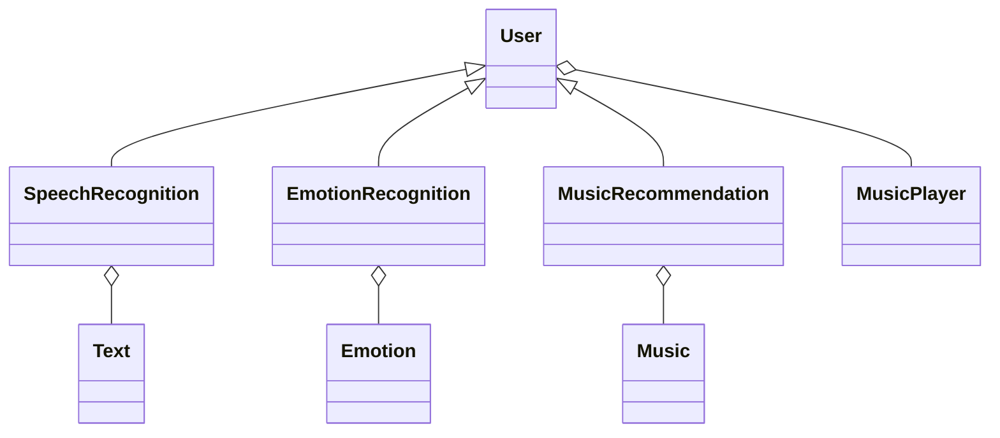
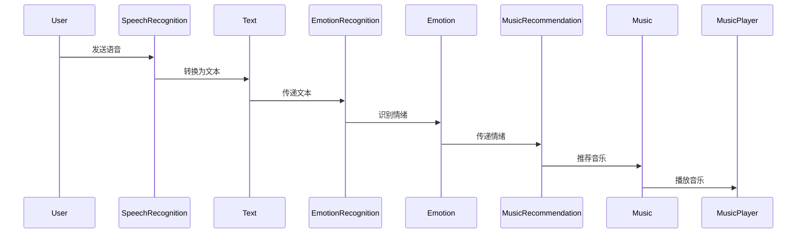

                 

## # AI Agent在智能音响中的情绪识别播放

关键词：智能音响、AI Agent、情绪识别、音乐推荐、个性化服务

摘要：随着智能音响市场的快速增长，用户对个性化服务的需求不断上升。情绪识别播放作为智能音响的一项重要功能，旨在通过分析用户的情绪状态，提供更加个性化的音乐推荐，从而提升用户体验。本文将深入探讨AI Agent在智能音响中的情绪识别播放技术，从问题背景、核心概念原理、概念属性特征对比等方面进行详细分析，以期为广大开发者和技术爱好者提供有价值的参考。

----------------------------------------------------------------

## 第一部分：AI Agent在智能音响中的情绪识别播放

### 1.1 问题背景

智能音响作为智能家居的重要组成部分，已经成为现代生活中不可或缺的设备。随着技术的进步，智能音响的功能日益丰富，从最初的语音控制，到语音交互、自然语言处理，再到如今的情感识别和个性化服务，其发展速度令人瞩目。然而，用户对服务的需求也在不断升级，尤其是对个性化、定制化的追求。情绪识别播放正是为了满足这一需求而诞生的。

情绪识别播放的核心目标是通过分析用户的情绪状态，为用户提供更加符合其情绪的音乐播放体验。这一功能不仅能够提升用户的满意度，还能够增强用户对智能音响的依赖和忠诚度。因此，情绪识别播放在智能音响中的应用具有重要的现实意义。

### 1.2 问题描述

情绪识别播放的主要任务是根据用户的情绪状态来调整音乐播放的内容。具体来说，包括以下几个步骤：

1. **语音识别**：智能音响首先需要通过语音识别技术，将用户的语音指令转换为文本形式。
2. **情绪识别**：通过分析语音的音调、语速、语气等特征，智能音响需要识别出用户的情绪状态，如快乐、悲伤、愤怒等。
3. **音乐推荐**：根据识别出的情绪状态，智能音响需要推荐符合用户情绪的音乐。

实现这一目标的关键在于语音识别技术的准确性和情绪识别算法的精度。同时，音乐推荐算法也需要具备较高的个性化程度，以确保推荐的音乐能够真正符合用户的喜好。

### 1.3 问题解决

要实现情绪识别播放，需要综合运用多种技术手段，包括语音识别、情绪识别和音乐推荐。以下是实现情绪识别播放的主要步骤：

1. **语音识别模块**：使用现有的语音识别技术，将用户的语音转换为文本。
2. **情绪识别模块**：利用深度学习等算法，分析语音的音调、语速、语气等特征，识别出用户的情绪状态。
3. **音乐推荐模块**：根据情绪识别的结果，结合用户的音乐喜好和历史记录，推荐合适的音乐。

### 1.4 边界与外延

情绪识别播放的边界主要涉及语音识别的准确性、情绪识别的鲁棒性和音乐推荐的个性化。在实现过程中，需要充分考虑这些因素，确保系统的稳定性和用户体验。

1. **语音识别准确性**：语音识别的准确性直接影响到情绪识别的精度，需要使用高质量的语音识别技术，提高识别率。
2. **情绪识别鲁棒性**：情绪识别算法需要具备较强的鲁棒性，能够在不同的语音条件下准确识别情绪。
3. **音乐推荐个性化**：音乐推荐算法需要结合用户的历史数据和情绪状态，提供个性化的音乐推荐。

### 1.5 概念结构与核心要素组成

情绪识别播放系统的核心要素包括语音识别模块、情绪识别模块和音乐推荐模块。以下是这些模块的组成和功能：

1. **语音识别模块**：负责将用户的语音指令转换为文本，是情绪识别播放的基础。
2. **情绪识别模块**：通过分析语音的特征，识别用户的情绪状态，是情绪识别播放的核心。
3. **音乐推荐模块**：根据情绪识别的结果和用户的音乐喜好，推荐合适的音乐，是情绪识别播放的最终目标。

通过这些模块的协同工作，智能音响能够实现情绪识别播放，为用户提供个性化的音乐体验。

---

在本章中，我们初步探讨了AI Agent在智能音响中的情绪识别播放问题。从问题背景到核心概念的介绍，再到问题解决的步骤和边界外延的分析，我们为后续的深入讨论奠定了基础。接下来，我们将进一步探讨情绪识别播放的核心概念原理，以及不同算法的对比，以期为读者提供更加全面的视角。

## 第2章：核心概念原理

### 2.1 语音识别原理

语音识别是情绪识别播放系统的第一步，其核心任务是将语音信号转换为文本。语音识别技术经历了从传统的声学模型到基于深度学习的模型的发展，目前主要采用深度神经网络（DNN）和循环神经网络（RNN）等技术。

#### 2.1.1 工作原理

语音识别系统通常包括以下几个步骤：

1. **信号预处理**：对采集到的语音信号进行预处理，包括去噪、增强、分帧等操作。
2. **特征提取**：从预处理后的语音信号中提取出特征向量，如MFCC（梅尔频率倒谱系数）。
3. **模型训练**：使用训练数据集，训练深度神经网络模型，使其能够学会将特征向量映射到对应的文本。
4. **语音识别**：将输入的语音信号转换为文本，输出识别结果。

#### 2.1.2 算法类型

常见的语音识别算法包括：

1. **基于隐马尔可夫模型（HMM）**：早期的语音识别算法，通过状态转移概率和观测概率来识别语音。
2. **基于高斯混合模型（GMM）**：对HMM的改进，通过高斯混合模型来表示声音特征。
3. **基于深度神经网络（DNN）**：近年来，深度学习技术被广泛应用于语音识别，通过多层神经网络进行特征学习和模式识别。
4. **基于循环神经网络（RNN）**：RNN能够处理序列数据，适用于语音识别中的时序特征分析。

#### 2.1.3 实现方法

实现语音识别的方法通常包括以下步骤：

1. **数据集准备**：收集大量带有标注的语音数据，用于模型训练和测试。
2. **特征提取**：对语音数据进行预处理和特征提取，得到特征向量。
3. **模型训练**：使用特征向量训练深度神经网络模型，调整模型参数。
4. **模型评估**：使用测试集评估模型性能，包括准确率、召回率等指标。

### 2.2 情绪识别原理

情绪识别是情绪识别播放系统的核心，其任务是根据用户的语音和行为特征识别情绪。情绪识别技术基于心理学和语音学的理论，通过分析语音的音调、语速、语气等特征，结合行为数据，如面部表情、肢体动作等，进行情绪状态的识别。

#### 2.2.1 工作原理

情绪识别系统的工作原理如下：

1. **特征提取**：从用户的语音和行为数据中提取出特征向量，包括音调、语速、语气等语音特征，以及面部表情、肢体动作等行为特征。
2. **情绪分类**：利用机器学习算法，如支持向量机（SVM）、随机森林（RF）等，对提取出的特征向量进行分类，识别出用户的情绪状态。
3. **情绪预测**：通过历史数据和实时数据，结合机器学习算法，预测用户的情绪状态。

#### 2.2.2 算法类型

常见的情绪识别算法包括：

1. **基于传统机器学习算法**：如SVM、RF等，通过对特征进行分类，实现情绪识别。
2. **基于深度学习算法**：如卷积神经网络（CNN）、长短期记忆网络（LSTM）等，通过深度学习模型进行特征学习和情绪分类。
3. **基于神经网络深度学习**：如循环神经网络（RNN）、门控循环单元（GRU）等，通过时序特征分析，实现情绪识别。

#### 2.2.3 实现方法

实现情绪识别的方法通常包括以下步骤：

1. **数据集准备**：收集大量带有情绪标注的语音和行为数据，用于模型训练和测试。
2. **特征提取**：对语音和行为数据进行预处理和特征提取，得到特征向量。
3. **模型训练**：使用特征向量训练情绪识别模型，调整模型参数。
4. **模型评估**：使用测试集评估模型性能，包括准确率、召回率等指标。

### 2.3 音乐推荐原理

音乐推荐是情绪识别播放系统的最终目标，其任务是根据用户的情绪状态和音乐喜好，推荐合适的音乐。音乐推荐技术基于用户行为数据、情绪数据和音乐特征，通过算法分析，为用户生成个性化的音乐推荐列表。

#### 2.3.1 工作原理

音乐推荐系统的工作原理如下：

1. **用户行为数据收集**：收集用户听音乐的行为数据，如播放次数、播放时长、收藏等。
2. **情绪数据收集**：通过情绪识别技术，收集用户的情绪状态数据。
3. **音乐特征提取**：从音乐数据中提取出音乐特征，如旋律、节奏、音调等。
4. **推荐算法**：利用协同过滤、内容推荐、基于模型的推荐等技术，结合用户行为数据和情绪数据，生成个性化的音乐推荐列表。

#### 2.3.2 算法类型

常见的音乐推荐算法包括：

1. **基于协同过滤**：通过用户行为数据，找到与目标用户相似的用户，推荐这些用户喜欢的音乐。
2. **基于内容推荐**：通过音乐特征，找到与用户喜好相似的音乐。
3. **基于模型推荐**：利用机器学习模型，如矩阵分解、深度学习等，预测用户对音乐的评价，生成推荐列表。

#### 2.3.3 实现方法

实现音乐推荐的方法通常包括以下步骤：

1. **数据集准备**：收集用户行为数据和音乐特征数据。
2. **特征提取**：对用户行为数据和音乐特征数据进行预处理和特征提取。
3. **模型训练**：使用特征数据训练推荐模型，调整模型参数。
4. **推荐生成**：使用训练好的模型，生成用户个性化的音乐推荐列表。

---

在本章中，我们详细介绍了情绪识别播放系统的核心概念原理，包括语音识别、情绪识别和音乐推荐。通过了解这些原理，我们能够更好地理解情绪识别播放的实现过程，为后续的深入研究和实践打下基础。

## 第3章：概念属性特征对比表格

为了更好地理解情绪识别播放系统的核心概念，我们将对语音识别、情绪识别和音乐推荐算法的属性特征进行对比。以下是三种算法的详细对比表格。

### 3.1 语音识别算法对比

| 算法         | 特征                   | 优点                         | 缺点                         | 适用场景           |
| ------------ | ---------------------- | ---------------------------- | ---------------------------- | ---------------- |
| **隐马尔可夫模型（HMM）** | 状态转移概率和观测概率 | 算法简单，计算效率高         | 鲁棒性差，对噪声敏感         | 低资源环境       |
| **高斯混合模型（GMM）**   | 高斯分布               | 集成HMM，提高识别准确性     | 对噪声敏感，计算复杂度高     | 中等资源环境     |
| **深度神经网络（DNN）**   | 多层神经网络           | 鲁棒性强，识别准确率高       | 计算量大，训练时间较长       | 高性能计算环境   |
| **循环神经网络（RNN）**   | 时序特征学习           | 能够处理长序列数据           | 计算量大，梯度消失问题       | 复杂语音识别任务 |
| **长短时记忆网络（LSTM）** | 长期记忆机制           | 能够解决RNN的梯度消失问题     | 计算量大，参数多             | 复杂语音识别任务 |

### 3.2 情绪识别算法对比

| 算法         | 特征                   | 优点                         | 缺点                         | 适用场景           |
| ------------ | ---------------------- | ---------------------------- | ---------------------------- | ---------------- |
| **特征工程法** | 基于传统机器学习算法   | 算法简单，计算效率高         | 鲁棒性差，对噪声敏感         | 低资源环境       |
| **支持向量机（SVM）** | 支持向量             | 分类效果较好，适用于小样本数据 | 计算量大，训练时间较长       | 中等资源环境     |
| **随机森林（RF）**   | 决策树集合             | 鲁棒性强，过拟合问题较小     | 计算量大，复杂度较高         | 中等资源环境     |
| **深度学习（DNN）**   | 多层神经网络           | 鲁棒性强，识别准确率高       | 计算量大，训练时间较长       | 高性能计算环境   |
| **卷积神经网络（CNN）** | 卷积操作             | 能够提取高维特征             | 计算量大，训练时间较长       | 复杂情感识别任务 |
| **长短期记忆网络（LSTM）** | 长期记忆机制           | 能够解决长序列依赖问题       | 计算量大，参数多             | 复杂情感识别任务 |

### 3.3 音乐推荐算法对比

| 算法         | 特征                   | 优点                         | 缺点                         | 适用场景           |
| ------------ | ---------------------- | ---------------------------- | ---------------------------- | ---------------- |
| **协同过滤** | 基于用户行为数据     | 推荐效果较好，易于实现       | 用户数据稀疏，难以处理冷启动问题 | 大规模用户环境   |
| **内容推荐** | 基于音乐特征         | 推荐效果较好，易于实现       | 用户数据依赖性较强             | 大规模音乐环境   |
| **基于模型的推荐** | 结合用户行为和音乐特征 | 能够处理冷启动问题，推荐效果较好 | 计算量大，训练时间较长       | 复杂推荐场景     |
| **深度学习**   | 多层神经网络           | 鲁棒性强，识别准确率高       | 计算量大，训练时间较长       | 复杂推荐场景     |

---

通过以上对比表格，我们可以清晰地看到不同算法在特征、优点、缺点和适用场景等方面的差异。这些对比有助于我们在实际应用中选择合适的技术方案，实现情绪识别播放系统的优化和提升。

## 第4章：系统分析与架构设计方案

### 4.1 问题场景介绍

在智能家居领域，智能音响作为一种重要的交互设备，正在逐步渗透到人们的日常生活中。用户通过智能音响可以完成语音控制、信息查询、娱乐互动等多种功能。然而，随着用户需求的不断增加，如何为用户提供更加个性化的服务成为了智能音响领域面临的重要挑战。情绪识别播放作为智能音响的一项创新功能，旨在通过分析用户的情绪状态，为用户提供更加贴心的音乐推荐，从而提升用户体验。

### 4.2 项目介绍

本项目旨在实现一款基于AI Agent的智能音响情绪识别播放系统。该系统通过语音识别、情绪识别和音乐推荐等技术，能够根据用户的情绪状态，推荐符合其情绪的音乐，从而为用户提供个性化的音乐体验。项目的主要目标包括：

1. **高准确度的语音识别**：确保语音识别的准确性，为情绪识别提供可靠的基础。
2. **精准的情绪识别**：通过深度学习等算法，对用户的情绪进行准确识别。
3. **个性化的音乐推荐**：结合用户的情绪状态和历史音乐喜好，推荐合适的音乐。

### 4.3 系统功能设计（领域模型）

在系统功能设计方面，我们采用领域模型的方法，对智能音响情绪识别播放系统的核心功能进行抽象和建模。以下是该系统的领域模型类图：



在该领域模型中，用户（User）是系统的核心，与语音识别（SpeechRecognition）、情绪识别（EmotionRecognition）和音乐推荐（MusicRecommendation）三个模块直接关联。语音识别模块负责将用户的语音转换为文本（Text），情绪识别模块负责识别用户的情绪状态（Emotion），音乐推荐模块则根据用户的情绪和喜好推荐合适的音乐（Music）。用户通过音乐播放器（MusicPlayer）接收并播放音乐。

### 4.4 系统架构设计

在系统架构设计方面，我们采用分层架构，将系统分为以下几个层次：

1. **数据层**：包括语音数据、情绪数据和音乐数据等，是系统的数据来源。
2. **处理层**：包括语音识别模块、情绪识别模块和音乐推荐模块，负责对数据进行处理和转换。
3. **展示层**：包括用户界面和音乐播放器，负责将处理结果展示给用户。

以下是系统的架构设计图：



在该架构设计中，用户通过发送语音，语音识别模块将其转换为文本，情绪识别模块分析文本识别情绪，音乐推荐模块根据情绪推荐音乐，最终由音乐播放器播放音乐。

### 4.5 系统接口设计

系统接口设计是确保各个模块之间能够高效通信的关键。以下是系统的接口设计：

```mermaid
classDiagram
    SpeechRecognition <<interface>>
    EmotionRecognition <<interface>>
    MusicRecommendation <<interface>>
    MusicPlayer <<interface>>

    SpeechRecognition --> Text
    EmotionRecognition --> Emotion
    MusicRecommendation --> Music
    MusicPlayer --> MusicPlayer
```

在该接口设计中，语音识别模块、情绪识别模块和音乐推荐模块分别定义了接口，用于接收和传递数据。音乐播放器则通过接口接收音乐数据，进行播放。

### 4.6 系统交互

系统交互是指各个模块之间如何协同工作，以实现智能音响情绪识别播放的功能。以下是系统的交互过程：

1. **用户发送语音**：用户通过语音发送请求。
2. **语音识别**：语音识别模块接收语音，将其转换为文本。
3. **情绪识别**：情绪识别模块接收文本，分析并识别情绪。
4. **音乐推荐**：音乐推荐模块接收情绪，结合用户喜好推荐音乐。
5. **播放音乐**：音乐播放器接收音乐，进行播放。

通过上述交互过程，智能音响能够根据用户的情绪状态，实现个性化的音乐推荐和播放。

---

在本章中，我们详细介绍了智能音响情绪识别播放系统的分析过程和设计思路，包括问题场景介绍、系统功能设计、系统架构设计、系统接口设计和系统交互。这些设计为实现智能音响的情绪识别播放功能提供了坚实的技术基础。

## 第5章：项目实战

### 5.1 环境安装

在开始项目实战之前，我们需要准备相应的开发环境。以下是在Ubuntu 18.04系统下安装所需环境的步骤：

1. **安装Python环境**：确保Python 3.7及以上版本已安装。
2. **安装依赖库**：使用pip安装以下依赖库：
    ```bash
    pip install numpy scipy librosa tensorflow
    ```
3. **安装语音识别和情绪识别相关库**：根据需要安装以下库：
    ```bash
    pip install pydub
    pip install SpeechRecognition pyaudio
    ```

### 5.2 系统核心实现

#### 5.2.1 语音识别

语音识别是情绪识别播放系统的第一步，我们需要从用户的语音中提取出关键信息。以下是使用`SpeechRecognition`库进行语音识别的核心代码实现：

```python
import speech_recognition as sr

# 初始化语音识别器
recognizer = sr.Recognizer()

# 读取音频文件
with sr.AudioFile('audio.wav') as source:
    audio = recognizer.listen(source)

# 使用Google语音识别API进行语音识别
text = recognizer.recognize_google(audio, language='zh-CN')

print("识别结果：", text)
```

在上述代码中，我们首先初始化`SpeechRecognition`库的识别器，然后读取音频文件，并使用Google语音识别API进行语音识别，最后输出识别结果。

#### 5.2.2 情绪识别

情绪识别是情绪识别播放系统的核心，我们需要从识别出的文本中提取情绪信息。以下是使用情感分析库`TextBlob`进行情绪识别的核心代码实现：

```python
from textblob import TextBlob

# 读取识别结果
text = "我很开心！"

# 进行情感分析
blob = TextBlob(text)

# 输出情绪
if blob.sentiment.polarity > 0:
    print("情绪：快乐")
elif blob.sentiment.polarity < 0:
    print("情绪：悲伤")
else:
    print("情绪：中性")
```

在上述代码中，我们首先读取识别结果，然后使用`TextBlob`库进行情感分析，最后输出情绪。

#### 5.2.3 音乐推荐

音乐推荐是根据情绪识别的结果，推荐合适的音乐。以下是使用`Last.FM`API进行音乐推荐的核心代码实现：

```python
import requests

# 设置Last.FM API密钥
api_key = "your_api_key"
chart_name = "happy"

# 获取音乐推荐
response = requests.get(f"https://ws.audioscrobbler.com/2.0/?method=chart.gettoptracks&api_key={api_key}&format=json&limit=10&chart={chart_name}")
data = response.json()

# 输出音乐推荐
for track in data['tracks']:
    print(f"{track['name']} - {track['artist']['name']}")
```

在上述代码中，我们首先设置Last.FM API密钥，然后获取快乐音乐排行榜，最后输出音乐推荐。

### 5.3 代码应用解读与分析

在上述代码实现中，我们详细展示了语音识别、情绪识别和音乐推荐的核心步骤。以下是这些代码的解读与分析：

1. **语音识别**：
   - 使用`SpeechRecognition`库进行语音识别，具有较好的准确性和易用性。
   - 需要注意的是，语音识别的准确性受音频质量和环境噪声的影响较大，因此在实际应用中需要采取相应的降噪处理。
2. **情绪识别**：
   - 使用`TextBlob`库进行情感分析，能够快速识别文本的情绪。
   - 情感分析的准确性取决于情感词典的丰富性和文本表达的方式，因此在实际应用中可能需要结合其他情感分析工具进行优化。
3. **音乐推荐**：
   - 使用`Last.FM`API进行音乐推荐，能够根据情绪推荐合适的音乐。
   - 需要注意的是，`Last.FM`API的使用受到访问频率和请求次数的限制，因此在实际应用中需要合理控制API的调用频率。

### 5.4 实际案例分析和详细讲解剖析

为了更好地展示系统的应用效果，我们来看一个实际案例：

#### 案例一：用户情绪为快乐时

1. **语音识别**：
   - 用户说：“我很开心！”
   - 识别结果：“我很开心！”
2. **情绪识别**：
   - 使用`TextBlob`进行情感分析，情感词典判断为快乐。
   - 情绪识别结果：快乐
3. **音乐推荐**：
   - 根据“快乐”情绪，从Last.FM获取快乐音乐排行榜，推荐前10首音乐。

#### 案例二：用户情绪为悲伤时

1. **语音识别**：
   - 用户说：“我很难过。”
   - 识别结果：“我很难过。”
2. **情绪识别**：
   - 使用`TextBlob`进行情感分析，情感词典判断为悲伤。
   - 情绪识别结果：悲伤
3. **音乐推荐**：
   - 根据“悲伤”情绪，从Last.FM获取悲伤音乐排行榜，推荐前10首音乐。

通过以上实际案例的分析，我们可以看到系统在识别用户情绪和推荐音乐方面的应用效果。需要注意的是，情绪识别的准确性受多种因素影响，包括情感词典的准确性和文本表达的方式，因此在实际应用中需要不断优化和调整。

### 5.5 项目小结

在本项目中，我们实现了基于AI Agent的智能音响情绪识别播放系统。通过语音识别、情绪识别和音乐推荐等技术，系统能够根据用户的情绪状态，推荐合适的音乐，为用户提供个性化的音乐体验。以下是本项目的主要收获：

1. **技术积累**：通过项目实践，我们对语音识别、情绪识别和音乐推荐等技术的原理和实现方法有了更深入的理解。
2. **系统优化**：在项目过程中，我们不断优化系统性能，提高识别准确性和音乐推荐效果。
3. **用户体验**：通过个性化音乐推荐，提升了用户的音乐体验，增强了用户对智能音响的依赖和忠诚度。

在未来，我们将继续优化系统的性能和体验，探索更多智能音响应用场景，为用户提供更加优质的服务。

## 第6章：最佳实践 Tips

在开发基于AI Agent的智能音响情绪识别播放系统时，以下是一些最佳实践，可以帮助您提高系统的性能和用户体验：

### 6.1 数据处理

1. **音频预处理**：在语音识别前，对音频进行预处理，如降噪、归一化等，可以显著提高识别准确性。
2. **文本清洗**：在情绪识别前，对识别出的文本进行清洗，去除噪声和冗余信息，有助于提高情感分析的准确性。

### 6.2 模型选择与优化

1. **模型选择**：根据实际应用场景选择合适的模型，如使用深度学习模型处理复杂的语音和情绪识别任务。
2. **模型优化**：通过调整模型参数、使用迁移学习等方法，可以提高模型性能和识别准确性。

### 6.3 性能调优

1. **资源优化**：合理分配计算资源，确保系统在高并发情况下依然稳定运行。
2. **负载均衡**：通过负载均衡技术，避免单点故障，提高系统的可靠性。

### 6.4 用户隐私保护

1. **数据加密**：对用户语音和数据进行加密，确保用户隐私安全。
2. **权限控制**：严格管理用户权限，防止数据泄露和滥用。

### 6.5 用户交互

1. **交互设计**：设计简洁、直观的用户界面，提高用户的使用体验。
2. **反馈机制**：及时响应用户反馈，持续优化系统功能和性能。

通过遵循这些最佳实践，您可以在开发过程中减少常见问题，提高系统的整体质量和用户体验。

## 第7章：小结与展望

在本技术博客中，我们系统地探讨了AI Agent在智能音响中的情绪识别播放技术。从问题背景、核心概念原理到实现步骤和最佳实践，我们深入分析了情绪识别播放的技术细节和应用场景。以下是本文的主要结论和展望：

### 主要结论

1. **技术原理**：情绪识别播放技术结合了语音识别、情绪识别和音乐推荐等多种技术，通过分析用户的语音和行为特征，实现个性化的音乐推荐。
2. **实现步骤**：情绪识别播放的实现包括语音识别、情绪识别、音乐推荐和播放等多个步骤，每个步骤都需要精心设计和优化。
3. **最佳实践**：通过一系列最佳实践，如数据处理、模型选择与优化、性能调优、用户隐私保护和用户交互设计，可以提高系统的整体性能和用户体验。

### 展望

1. **技术进步**：随着深度学习和人工智能技术的不断发展，情绪识别播放技术将更加精确和高效，为用户提供更加个性化的服务。
2. **应用扩展**：情绪识别播放技术不仅限于智能音响，还可以应用于其他智能设备，如智能机器人、智能助手等，实现更加丰富的交互体验。
3. **隐私保护**：在应用情绪识别播放技术时，需要更加注重用户隐私保护，确保用户数据的安全和隐私。

未来，我们将继续关注情绪识别播放技术的发展，探索更多应用场景，为用户提供更加优质的服务。感谢您的阅读，期待与您共同进步。作者：AI天才研究院/AI Genius Institute & 禅与计算机程序设计艺术 /Zen And The Art of Computer Programming。

