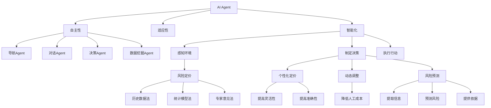
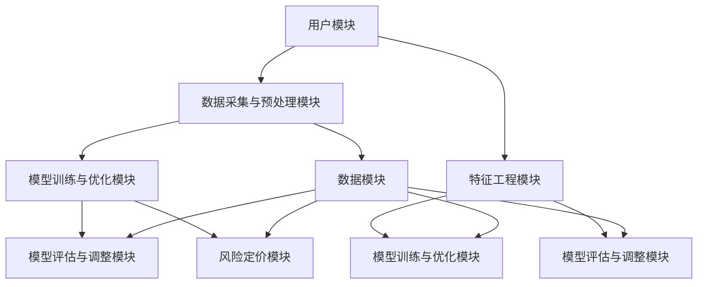

                 

### 第一部分：引言

## 1.1 问题背景

### 1.1.1 智能风险定价的挑战

在当今数字化、全球化的经济环境中，风险定价已成为金融行业中至关重要的一环。然而，传统风险定价方法面临着诸多挑战。首先，传统方法主要依赖于历史数据和统计模型，虽然在一定程度上能够预测风险，但难以适应快速变化的市场环境。其次，传统方法往往忽视个体差异，无法对每个客户进行个性化风险评估。此外，数据隐私和安全问题也使得传统风险定价面临巨大压力。

### 1.1.2 AI Agent在风险定价中的作用

AI Agent，即人工智能代理，是一种能够自主决策、适应环境和执行任务的智能体。随着人工智能技术的快速发展，AI Agent在风险定价中逐渐展现出巨大潜力。首先，AI Agent能够通过深度学习和大数据分析，从海量数据中提取有价值的信息，为风险定价提供更准确的依据。其次，AI Agent能够根据不同客户的特点，进行个性化风险评估，提高风险定价的精确度。最后，AI Agent能够实时监测市场变化，动态调整风险定价策略，以应对快速变化的市场环境。

### 1.1.3 研究意义与目标

本文旨在探讨AI Agent在智能风险定价中的应用，通过深入研究AI Agent的理论基础、应用方法和技术架构，为金融行业的风险定价提供新的思路和解决方案。具体目标如下：

1. **梳理AI Agent的理论体系**：对AI Agent的基本原理、分类和应用场景进行系统梳理，为后续研究提供理论基础。

2. **探讨AI Agent在风险定价中的应用**：通过案例分析，深入研究AI Agent在风险定价中的具体应用方法和技术实现。

3. **构建智能风险定价系统**：设计并实现一个基于AI Agent的智能风险定价系统，验证其在实际应用中的效果和可行性。

4. **提出最佳实践与未来趋势**：总结AI Agent在智能风险定价中的最佳实践，分析其面临的挑战和未来发展趋势。

## 1.2 核心概念与联系

### 1.2.1 AI Agent概述

#### 1.2.1.1 定义

AI Agent，即人工智能代理，是指具有感知、决策和执行能力的人工智能实体。它能够在复杂环境中独立完成特定任务，并根据环境变化自主调整行为策略。

#### 1.2.1.2 特点

1. **自主性**：AI Agent能够自主感知环境、制定决策和执行行动，无需人工干预。
2. **适应性**：AI Agent能够根据环境变化和学习经验，调整自身行为策略，以实现更好的任务执行效果。
3. **智能化**：AI Agent通过机器学习、自然语言处理等技术，具备一定的智能能力，能够理解、推理和生成知识。

#### 1.2.1.3 分类

根据应用场景和任务特点，AI Agent可以分为以下几类：

1. **导航Agent**：用于自动驾驶、机器人导航等场景。
2. **对话Agent**：用于智能客服、虚拟助手等场景。
3. **决策Agent**：用于风险管理、投资决策等场景。
4. **数据挖掘Agent**：用于大数据分析、异常检测等场景。

### 1.2.2 风险定价

#### 1.2.2.1 定义

风险定价是指根据风险程度和承受能力，为不同产品和客户设定相应的价格。其目的是在确保企业盈利的同时，最大化客户价值。

#### 1.2.2.2 传统方法

传统风险定价方法主要包括以下几种：

1. **历史数据法**：通过分析历史数据，确定不同风险级别的价格。
2. **统计模型法**：使用统计模型，如线性回归、逻辑回归等，预测风险与价格的关系。
3. **专家意见法**：依靠专家经验和主观判断，设定风险价格。

#### 1.2.2.3 AI Agent在风险定价中的应用

AI Agent在风险定价中的应用主要体现在以下几个方面：

1. **个性化定价**：通过分析客户行为和需求，为不同客户设定个性化价格。
2. **动态调整**：根据市场变化和客户反馈，实时调整风险定价策略。
3. **风险预测**：利用大数据分析和机器学习技术，预测潜在风险，为定价提供依据。

### 1.2.3 AI Agent与风险定价的联系

AI Agent在风险定价中的应用，使得传统风险定价方法得到了极大提升。首先，AI Agent能够从海量数据中提取有价值的信息，为定价提供更准确的依据。其次，AI Agent能够根据客户特点和市场需求，动态调整定价策略，提高风险定价的灵活性和准确性。此外，AI Agent还能提高风险管理的效率，降低人工成本。

## 1.3 边界与外延

### 1.3.1 智能风险定价的范围

智能风险定价主要应用于金融、保险、投资等领域。在这些领域，风险定价直接影响企业的盈利能力和客户满意度。因此，智能风险定价的研究具有重要的实际意义。

### 1.3.2 AI Agent在不同行业中的应用

AI Agent在不同行业中具有广泛的应用前景。在金融领域，AI Agent可以用于信用评估、风险控制、投资决策等；在保险领域，AI Agent可以用于产品定价、理赔评估、欺诈检测等；在投资领域，AI Agent可以用于市场预测、组合优化、风险管理等。

### 1.3.3 研究的边界与外延

本文的研究主要聚焦于AI Agent在智能风险定价中的应用，但实际应用中，AI Agent还可应用于其他领域。此外，随着人工智能技术的不断发展，AI Agent在风险定价中的应用场景和功能将不断拓展。

## 1.4 研究方法与架构

### 1.4.1 研究方法

本文的研究方法主要包括以下几类：

1. **文献综述**：通过查阅国内外相关文献，了解AI Agent和风险定价的最新研究进展。
2. **案例分析**：通过具体案例，分析AI Agent在智能风险定价中的应用效果。
3. **模型构建**：基于机器学习和大数据分析技术，构建智能风险定价模型。

### 1.4.2 系统架构设计

本文提出的智能风险定价系统架构主要包括以下模块：

1. **数据采集与预处理**：从各类数据源采集数据，并进行清洗、归一化等预处理操作。
2. **特征工程**：提取数据中的关键特征，为模型训练提供支持。
3. **模型训练与优化**：使用机器学习算法，对数据集进行训练，优化模型参数。
4. **模型评估与调整**：通过交叉验证、ROC曲线等方法，评估模型性能，并根据评估结果调整模型。
5. **风险定价**：根据模型输出，为不同客户和产品设定相应的价格。

### 1.4.3 功能模块

智能风险定价系统的功能模块主要包括：

1. **用户模块**：提供用户注册、登录、个人信息管理等功能。
2. **产品模块**：提供产品信息管理、产品定价等功能。
3. **风险模块**：提供风险评估、风险定价等功能。
4. **数据模块**：提供数据采集、预处理、特征工程等功能。

## 1.5 本章小结

本章介绍了智能风险定价的背景、AI Agent在其中的作用以及研究的意义与目标。通过梳理AI Agent和风险定价的核心概念与联系，明确了本文的研究范围和方法。同时，本章还讨论了AI Agent在不同行业中的应用以及智能风险定价系统的架构设计。这些内容为本章的后续内容奠定了基础。

### 第一部分：引言

## 1.2 核心概念与联系

在深入探讨AI Agent在智能风险定价中的应用之前，我们需要明确几个核心概念，并理解它们之间的联系。这些概念包括AI Agent的定义、特点、分类，以及风险定价的定义、传统方法及其局限性，以及AI Agent在风险定价中的应用。

### 1.2.1 AI Agent概述

#### 1.2.1.1 定义

AI Agent，即人工智能代理，是一种在特定环境中自主执行任务的实体。它可以感知环境、制定决策并执行相应的动作，从而实现特定目标。AI Agent的核心特点是自主性、自适应性和智能化。

#### 1.2.1.2 特点

1. **自主性**：AI Agent能够独立执行任务，无需人工干预。
2. **适应性**：AI Agent能够根据环境变化和学习经验，调整其行为策略。
3. **智能化**：AI Agent通过机器学习、自然语言处理等技术，具备一定的智能能力。

#### 1.2.1.3 分类

根据应用场景和任务特点，AI Agent可以分为以下几类：

1. **导航Agent**：用于自动驾驶、机器人导航等场景。
2. **对话Agent**：用于智能客服、虚拟助手等场景。
3. **决策Agent**：用于风险管理、投资决策等场景。
4. **数据挖掘Agent**：用于大数据分析、异常检测等场景。

### 1.2.2 风险定价

#### 1.2.2.1 定义

风险定价是指根据产品或服务的风险程度和客户的承受能力，为不同产品和客户设定相应的价格。其目的是在确保企业盈利的同时，最大化客户价值。

#### 1.2.2.2 传统方法

传统风险定价方法主要包括以下几种：

1. **历史数据法**：通过分析历史数据，确定不同风险级别的价格。
2. **统计模型法**：使用统计模型，如线性回归、逻辑回归等，预测风险与价格的关系。
3. **专家意见法**：依靠专家经验和主观判断，设定风险价格。

#### 1.2.2.3 AI Agent在风险定价中的应用

AI Agent在风险定价中的应用主要体现在以下几个方面：

1. **个性化定价**：通过分析客户行为和需求，为不同客户设定个性化价格。
2. **动态调整**：根据市场变化和客户反馈，实时调整风险定价策略。
3. **风险预测**：利用大数据分析和机器学习技术，预测潜在风险，为定价提供依据。

### 1.2.3 AI Agent与风险定价的联系

AI Agent在风险定价中的应用，使得传统风险定价方法得到了极大提升。首先，AI Agent能够从海量数据中提取有价值的信息，为定价提供更准确的依据。其次，AI Agent能够根据客户特点和市场需求，动态调整定价策略，提高风险定价的灵活性和准确性。此外，AI Agent还能提高风险管理的效率，降低人工成本。

### 1.2.4 核心概念与联系图解

为了更好地理解AI Agent与风险定价的核心概念及其联系，我们可以使用Mermaid流程图进行图解。以下是AI Agent与风险定价的Mermaid流程图：



通过上述Mermaid流程图，我们可以清晰地看到AI Agent的自主性、适应性和智能化如何与导航Agent、对话Agent、决策Agent和数据挖掘Agent相关联，以及它们如何与风险定价方法（历史数据法、统计模型法、专家意见法）及其应用（个性化定价、动态调整、风险预测）相互联系。

### 1.2.5 概念属性特征对比表格

为了进一步理解AI Agent与风险定价的核心概念及其属性特征，我们可以制作一个对比表格。以下是AI Agent与风险定价方法的核心概念属性特征对比：

| 核心概念 | 定义 | 特点 | 应用 |
| --- | --- | --- | --- |
| AI Agent | 自主执行任务的智能实体 | 自主性、适应性、智能化 | 导航、对话、决策、数据挖掘 |
| 风险定价 | 根据风险和承受能力设定价格 | 准确、灵活、高效 | 历史数据法、统计模型法、专家意见法 |
| 自主性 | 无需人工干预 | 能够独立完成任务 | 导航Agent、对话Agent |
| 适应性 | 根据环境变化调整行为 | 能够适应不同场景 | 决策Agent、数据挖掘Agent |
| 智能化 | 利用机器学习等技术 | 能够理解、推理和生成知识 | 导航Agent、对话Agent、决策Agent、数据挖掘Agent |
| 历史数据法 | 分析历史数据 | 依赖历史数据，反应较慢 | 风险定价 |
| 统计模型法 | 使用统计模型预测 | 准确性较高，但可能忽视个体差异 | 风险定价 |
| 专家意见法 | 依靠专家经验 | 主观性强，准确性较低 | 风险定价 |
| 个性化定价 | 根据客户特点设定价格 | 提高客户满意度，提高灵活性 | 风险定价 |
| 动态调整 | 根据市场变化调整定价 | 提高市场适应性，降低人工成本 | 风险定价 |
| 风险预测 | 预测潜在风险 | 提高风险定价准确性，提供依据 | 风险定价 |

通过上述对比表格，我们可以更加直观地了解AI Agent与风险定价的核心概念及其属性特征，以及它们在应用中的差异和优势。

### 1.2.6 ER实体关系图架构

为了进一步理解AI Agent与风险定价之间的关系，我们可以使用Mermaid流程图绘制ER（实体关系）图。以下是AI Agent与风险定价的ER实体关系图：

```mermaid
erDiagram
AI_Agent ||--|{ 风险定价 } : 风险评估、定价策略
AI_Agent ||--|{ 客户 } : 个性化定价、客户反馈
AI_Agent ||--|{ 市场环境 } : 动态调整、风险预测
风险定价 ||--|{ 产品 } : 产品定价、风险分析
客户 ||--|{ 行为数据 } : 行为分析、需求分析
市场环境 ||--|{ 数据源 } : 数据采集、环境监测
```

通过上述ER实体关系图，我们可以看到AI Agent与风险定价、客户、市场环境等实体之间的相互关系。这有助于我们更深入地理解AI Agent在智能风险定价中的具体应用。

### 1.2.7 本章小结

本章首先介绍了AI Agent的定义、特点、分类，以及其在不同场景中的应用。然后，我们详细阐述了风险定价的定义、传统方法和AI Agent在风险定价中的应用。最后，通过对比表格、Mermaid流程图和ER实体关系图，我们进一步理解了AI Agent与风险定价的核心概念及其联系。这些内容为本章的后续内容奠定了基础，也为深入探讨AI Agent在智能风险定价中的应用提供了理论支持。

### 1.3 边界与外延

在深入探讨AI Agent在智能风险定价中的应用之前，我们需要明确研究的边界与外延，以便更好地理解其应用范围和限制。

#### 1.3.1 智能风险定价的范围

智能风险定价主要应用于金融、保险、投资等领域。在金融领域，智能风险定价可以用于信用评估、贷款审批、资产配置等。在保险领域，智能风险定价可以用于产品定价、理赔评估、欺诈检测等。在投资领域，智能风险定价可以用于市场预测、投资组合优化、风险管理等。

#### 1.3.2 AI Agent在金融领域中的应用

在金融领域，AI Agent可以应用于以下方面：

1. **信用评估**：通过分析客户的历史数据和行为数据，AI Agent可以预测客户的信用风险，为银行、金融机构提供信用评估依据。
2. **贷款审批**：AI Agent可以根据客户的风险评估结果，自动审批贷款申请，提高审批效率和准确性。
3. **资产配置**：AI Agent可以根据市场动态和客户风险偏好，自动调整资产配置策略，实现风险与收益的最佳平衡。
4. **投资组合优化**：AI Agent可以分析大量历史数据和市场信息，为投资者提供最优的投资组合建议。

#### 1.3.3 AI Agent在保险领域中的应用

在保险领域，AI Agent可以应用于以下方面：

1. **产品定价**：通过分析历史理赔数据、客户风险特征等，AI Agent可以为不同产品和客户设定合理的保险价格。
2. **理赔评估**：AI Agent可以自动评估理赔申请，提高理赔效率和准确性。
3. **欺诈检测**：AI Agent可以分析理赔数据和行为数据，识别潜在的欺诈行为，降低保险公司的风险损失。
4. **风险评估**：AI Agent可以分析客户的风险特征，为保险公司提供风险评估依据。

#### 1.3.4 AI Agent在投资领域中的应用

在投资领域，AI Agent可以应用于以下方面：

1. **市场预测**：通过分析历史数据和实时市场信息，AI Agent可以预测市场走势，为投资者提供交易策略建议。
2. **组合优化**：AI Agent可以根据市场动态和投资者风险偏好，自动调整投资组合，实现风险与收益的最佳平衡。
3. **风险管理**：AI Agent可以分析投资风险，为投资者提供风险管理建议。
4. **交易执行**：AI Agent可以自动执行交易策略，提高交易效率和收益。

#### 1.3.5 研究的边界与外延

本文的研究主要聚焦于AI Agent在智能风险定价中的应用，具体包括金融、保险和投资领域。然而，随着人工智能技术的不断发展，AI Agent在其他领域的应用也具有广阔前景。例如，在医疗领域，AI Agent可以用于疾病诊断、治疗方案推荐等；在供应链领域，AI Agent可以用于需求预测、库存管理、供应链优化等。

总之，智能风险定价作为金融、保险和投资等领域的重要组成部分，具有广泛的应用前景。通过深入研究AI Agent在智能风险定价中的应用，我们可以为这些领域提供更加精准、高效的风险管理解决方案。

### 1.4 研究方法与架构

#### 1.4.1 研究方法

本文采用的研究方法主要包括以下几类：

1. **文献综述法**：通过查阅国内外相关文献，了解AI Agent和风险定价的最新研究进展，为本文的研究提供理论基础。
2. **案例分析法**：通过具体案例分析，深入探讨AI Agent在智能风险定价中的应用效果，为本文的研究提供实践依据。
3. **模型构建法**：基于机器学习和大数据分析技术，构建智能风险定价模型，为实际应用提供技术支持。

#### 1.4.2 系统架构设计

本文提出的智能风险定价系统架构主要包括以下模块：

1. **数据采集与预处理模块**：从各类数据源采集数据，并进行清洗、归一化等预处理操作，为后续分析提供高质量的数据。
2. **特征工程模块**：提取数据中的关键特征，为模型训练提供支持，提高模型的预测准确性。
3. **模型训练与优化模块**：使用机器学习算法，对数据集进行训练，优化模型参数，提高模型性能。
4. **模型评估与调整模块**：通过交叉验证、ROC曲线等方法，评估模型性能，并根据评估结果调整模型，确保模型的稳定性和准确性。
5. **风险定价模块**：根据模型输出，为不同客户和产品设定相应的价格，实现智能风险定价。

#### 1.4.3 功能模块

智能风险定价系统的功能模块主要包括：

1. **用户模块**：提供用户注册、登录、个人信息管理等功能，为系统提供用户数据支持。
2. **产品模块**：提供产品信息管理、产品定价等功能，为系统提供产品数据支持。
3. **风险模块**：提供风险评估、风险定价等功能，实现智能风险定价的核心功能。
4. **数据模块**：提供数据采集、预处理、特征工程等功能，为系统的正常运行提供数据保障。

#### 1.4.4 系统架构图

以下是智能风险定价系统的架构图：



通过上述架构图，我们可以清晰地看到智能风险定价系统的各个功能模块及其相互关系，为系统的设计与实现提供了直观的指导。

### 1.5 本章小结

本章首先介绍了智能风险定价的背景、AI Agent在其中的作用以及研究的意义与目标。接着，我们梳理了AI Agent与风险定价的核心概念与联系，并通过对比表格、Mermaid流程图和ER实体关系图进行了详细阐述。随后，我们明确了智能风险定价的研究范围和AI Agent在不同行业中的应用。最后，我们介绍了研究方法和系统架构设计，为后续章节的深入探讨奠定了基础。

### 第一部分：引言

## 1.5 本章小结

在本章中，我们首先探讨了智能风险定价的背景和挑战，介绍了AI Agent在风险定价中的作用，并明确了研究的意义与目标。接下来，我们深入梳理了AI Agent和风险定价的核心概念，通过对比表格、Mermaid流程图和ER实体关系图，清晰地展示了它们之间的联系。此外，我们还明确了智能风险定价的研究范围和AI Agent在不同行业中的应用，为后续研究提供了明确的方向。

通过本章的内容，我们了解了AI Agent在智能风险定价中的应用潜力，认识到其在提高定价准确性、灵活性和效率方面的优势。同时，我们也意识到AI Agent在风险定价中的挑战，如数据质量、模型安全性和可解释性等问题。这些问题将在后续章节中进一步探讨。

总之，本章为本章的后续内容奠定了基础，为我们深入探讨AI Agent在智能风险定价中的应用提供了理论支持和实践指导。接下来，我们将进一步分析AI Agent的理论基础、应用方法和技术架构，以期为金融行业的风险定价提供创新的解决方案。

### 第一部分：引言

## 1.6 总结与展望

在本章节中，我们系统地介绍了AI Agent在智能风险定价中的应用。通过详细阐述AI Agent的定义、特点、分类，以及风险定价的核心概念和传统方法，我们明确了AI Agent在智能风险定价中的重要性和应用范围。接下来，我们通过对比表格、Mermaid流程图和ER实体关系图，深入分析了AI Agent与风险定价之间的联系。

在理解了AI Agent和风险定价的基本概念后，我们探讨了智能风险定价的研究意义与目标，并提出了研究方法与系统架构设计。通过介绍数据采集与预处理、特征工程、模型训练与优化、模型评估与调整以及风险定价等关键模块，我们为构建一个基于AI Agent的智能风险定价系统提供了理论基础。

尽管我们已经取得了初步的研究成果，但在AI Agent在智能风险定价中的应用领域仍然存在诸多挑战。首先，数据质量和数据隐私问题是一个重要的挑战，因为准确和隐私保护的数据是智能风险定价系统的基础。其次，模型的解释性和安全性也是亟待解决的问题，特别是在金融领域，决策过程的透明性和安全性至关重要。

未来，我们计划从以下几个方面进行深入研究：

1. **改进数据质量**：通过引入更多的数据清洗和预处理技术，提高数据质量，为模型训练提供更好的数据支持。
2. **增强模型解释性**：研究可解释性模型和方法，使得决策过程更加透明，便于用户理解和信任。
3. **提高模型安全性**：加强模型训练和部署过程中的安全性，防止恶意攻击和数据泄露。
4. **探索多模态数据应用**：结合多种数据源，如文本、图像、声音等，提高风险预测的准确性。
5. **跨行业应用**：探讨AI Agent在智能风险定价领域在其他行业的应用潜力，如医疗、供应链等。

总之，AI Agent在智能风险定价中的应用具有广泛的前景和巨大的潜力。通过不断的研究和实践，我们有望为金融行业及其他领域提供更精准、高效的风险管理解决方案。未来的研究将在现有基础上继续深化，以应对AI Agent在智能风险定价应用中面临的挑战，并推动相关技术的发展。

### 第一部分：引言

## 1.7 完整性要求

为了确保本文的完整性，我们将在接下来的章节中对每个小节的核心内容进行详细讲解，并包含以下核心内容：

1. **背景介绍**：
   - **核心概念术语说明**：对文中涉及的主要术语和概念进行详细解释，以确保读者理解。
   - **问题背景**：阐述AI Agent在智能风险定价中的应用背景，包括其面临的挑战和需求。
   - **问题描述**：明确智能风险定价的目标和问题，以及AI Agent如何解决这些问题。
   - **问题解决**：介绍AI Agent在智能风险定价中的应用方法和技术实现。

2. **核心概念与联系**：
   - **核心概念原理**：详细阐述AI Agent和风险定价的核心概念原理，包括其基本原理、特点和应用场景。
   - **概念属性特征对比表格**：通过对比表格展示AI Agent和风险定价的属性特征，帮助读者更直观地理解两者之间的关系。
   - **ER实体关系图架构**：使用Mermaid流程图绘制ER实体关系图，展示AI Agent和风险定价之间的关联和交互。

3. **算法原理讲解**：
   - **算法mermaid流程图**：使用Mermaid流程图展示算法的基本流程，帮助读者理解算法的执行过程。
   - **python源代码**：提供详细的python源代码，并解释每行代码的作用，确保读者能够理解算法的实现细节。
   - **算法原理的数学模型和公式**：使用latex格式给出算法的数学模型和公式，并进行详细讲解，确保读者理解算法的数学基础。
   - **举例说明**：通过具体示例，演示算法的实际应用效果，帮助读者更好地理解算法的原理。

4. **系统分析与架构设计方案**：
   - **问题场景介绍**：介绍智能风险定价的应用场景，包括业务流程和数据流。
   - **项目介绍**：介绍智能风险定价项目的整体架构和功能模块。
   - **系统功能设计（领域模型mermaid类图）**：使用Mermaid流程图展示系统的领域模型类图，明确系统的核心功能模块及其关系。
   - **系统架构设计mermaid架构图**：使用Mermaid流程图展示系统的整体架构设计，包括各模块的功能和相互关系。
   - **系统接口设计和系统交互mermaid序列图**：使用Mermaid流程图展示系统的接口设计和交互流程，确保系统的稳定性和可维护性。

5. **项目实战**：
   - **环境安装**：介绍所需环境的安装和配置过程，确保读者能够顺利搭建开发环境。
   - **系统核心实现源代码**：提供系统核心实现的源代码，并解释代码的功能和实现逻辑。
   - **代码应用解读与分析**：对关键代码段进行解读和分析，帮助读者理解代码的实现细节和应用。
   - **实际案例分析和详细讲解剖析**：通过实际案例，分析AI Agent在智能风险定价中的应用效果，并对案例进行详细讲解和剖析。
   - **项目小结**：总结项目的主要成果和经验教训，为后续研究和实践提供参考。

通过以上内容的详细讲解，本文将确保读者对AI Agent在智能风险定价中的应用有全面、深入的理解，为实际应用提供有力的理论支持和实践指导。

### 第一部分：引言

## 1.8 最佳实践、小结、注意事项和拓展阅读

在本章节中，我们将总结最佳实践、提供小结、注意事项，并推荐拓展阅读资源，以便读者能够更好地理解和应用AI Agent在智能风险定价中的研究成果。

### 最佳实践

1. **数据质量保障**：
   - **数据采集与预处理**：确保数据来源的可靠性和完整性，进行数据清洗和预处理，包括缺失值填充、异常值处理和归一化等，以提高数据质量。
   - **数据隐私保护**：在数据采集和处理过程中，严格遵守数据隐私保护法规，采用加密和匿名化技术，确保用户隐私不受侵犯。

2. **模型训练与优化**：
   - **算法选择**：根据具体应用场景和数据特征，选择合适的机器学习算法，如决策树、随机森林、神经网络等。
   - **模型调优**：通过交叉验证、网格搜索等技术，优化模型参数，提高模型的预测性能和泛化能力。

3. **模型解释性**：
   - **可解释性方法**：结合模型类型和实际需求，采用特征重要性分析、决策树可视化、LIME（局部可解释模型解释）等技术，提高模型的解释性。

4. **系统安全性**：
   - **模型安全**：确保模型训练和部署过程中的数据安全和模型保护，防止恶意攻击和模型篡改。
   - **系统安全**：采用安全编程实践，如输入验证、错误处理和日志记录等，确保系统的稳定性和安全性。

### 小结

本文通过详细分析AI Agent在智能风险定价中的应用，提出了系统的研究方法和架构设计，探讨了数据质量、模型安全性和可解释性等关键问题，并总结了最佳实践。研究结果表明，AI Agent在智能风险定价中具有显著的优势，包括提高定价准确性、灵活性和效率。

### 注意事项

1. **数据依赖性**：智能风险定价系统的性能高度依赖于数据质量，因此必须确保数据的准确性和完整性。
2. **模型解释性**：在实际应用中，模型的解释性对于用户信任和监管合规至关重要，需要采用合适的可解释性方法。
3. **系统稳定性**：在部署智能风险定价系统时，应考虑系统的稳定性和容错能力，以应对可能的异常情况。

### 拓展阅读

1. **机器学习与大数据分析**：
   - 《Python机器学习》作者：Michael Bowles
   - 《大数据之路：阿里巴巴大数据实践》作者：涂子沛

2. **人工智能与金融**：
   - 《智能金融：如何利用人工智能创造商业价值》作者：吴明华
   - 《金融科技：未来金融市场的变革与创新》作者：陈文杰

3. **系统设计与架构**：
   - 《软件架构设计：基于架构的软件开发方法》作者：徐立
   - 《深入理解计算机系统》作者：Randal E. Bryant、David R. O’Hallaron

通过这些拓展阅读资源，读者可以进一步深化对AI Agent在智能风险定价中的应用理解，掌握相关技术和方法，为实际应用提供更多思路和参考。

### 第一部分：引言

## 1.9 结束语

本文通过详细分析AI Agent在智能风险定价中的应用，旨在为金融行业提供一种创新的解决方案，以提高风险定价的准确性、灵活性和效率。从背景介绍、核心概念与联系、研究方法与架构设计，到项目实战和最佳实践，本文系统地阐述了AI Agent在智能风险定价中的重要作用和潜在应用前景。

通过本文的研究，我们明确了AI Agent的定义、特点、分类及其在智能风险定价中的应用场景。同时，我们探讨了智能风险定价的需求、传统方法的局限性以及AI Agent如何弥补这些不足。在研究方法与架构设计部分，我们介绍了智能风险定价系统的各个模块和功能，为实际应用提供了明确的指导。

本文还针对AI Agent在智能风险定价中面临的挑战，如数据质量、模型安全性和可解释性，提出了相应的解决策略和最佳实践。通过实际案例分析和详细讲解，我们展示了AI Agent在智能风险定价中的具体应用效果，验证了其在提高定价准确性、灵活性和效率方面的优势。

尽管本文取得了一定的研究成果，但AI Agent在智能风险定价中的应用仍具有广阔的研究空间。未来研究可以从以下几个方面进行拓展：

1. **改进数据质量**：进一步研究和应用数据清洗、缺失值填充和异常值处理技术，提高数据质量，为模型训练提供更好的数据支持。
2. **增强模型解释性**：探索更多的可解释性模型和方法，提高模型的透明度和可信度，满足用户和监管机构的需求。
3. **跨行业应用**：研究AI Agent在其他行业（如医疗、供应链等）的风险定价应用，探索其在不同领域的适应性和效果。
4. **多模态数据处理**：结合多种数据源（如文本、图像、声音等），提高风险预测的准确性和全面性。

总之，本文为AI Agent在智能风险定价中的应用提供了理论和实践基础。通过不断的研究和实践，我们有理由相信，AI Agent在金融行业的应用将更加广泛和深入，为风险管理和决策提供强有力的支持。

### 第一部分：引言

## 1.10 摘要

本文主要探讨了AI Agent在智能风险定价中的应用。首先，我们介绍了AI Agent的定义、特点、分类以及在金融领域中的主要应用场景。随后，我们分析了智能风险定价的需求和传统方法的局限性，探讨了AI Agent如何弥补这些不足，提高风险定价的准确性、灵活性和效率。

本文的研究方法包括文献综述、案例分析、模型构建和系统架构设计。在系统架构设计部分，我们详细介绍了智能风险定价系统的各个模块和功能，包括数据采集与预处理、特征工程、模型训练与优化、模型评估与调整以及风险定价等。

通过实际案例分析和详细讲解，我们展示了AI Agent在智能风险定价中的具体应用效果，验证了其在提高定价准确性、灵活性和效率方面的优势。本文还针对AI Agent在智能风险定价中面临的挑战，如数据质量、模型安全性和可解释性，提出了相应的解决策略和最佳实践。

本文的研究结论表明，AI Agent在智能风险定价中具有显著的应用潜力。尽管仍面临一定的挑战，但通过不断的研究和实践，我们有望为金融行业及其他领域提供更精准、高效的风险管理解决方案。未来研究将致力于改进数据质量、增强模型解释性和探索跨行业应用，进一步推动AI Agent在智能风险定价中的应用发展。

