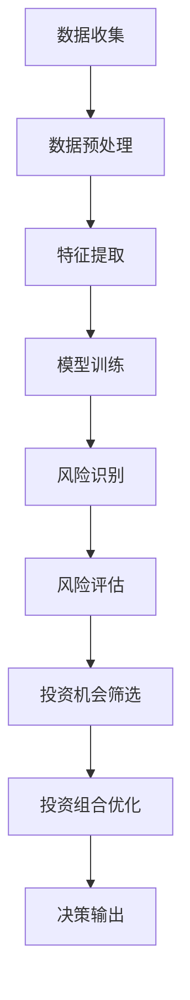
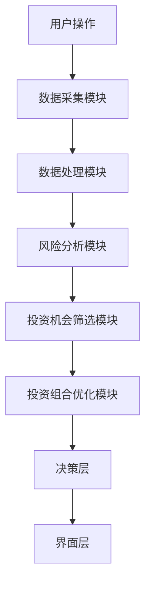

                 


### 引言

在当今全球信息化和智能化的浪潮中，人工智能（AI）技术已经成为推动社会进步和经济发展的重要力量。随着AI技术的不断成熟，越来越多的行业开始探索AI的应用场景，以期提升业务效率、优化决策过程。其中，智能风险投资分析作为金融领域的热点话题，近年来受到了广泛关注。

风险投资（Venture Capital, VC）是一种以高风险、高回报为特征的投资行为，旨在支持具有巨大增长潜力的初创企业。然而，风险投资分析不仅需要专业知识和市场洞察力，还面临着海量数据、复杂变量和快速变化的市场环境等挑战。传统的风险投资分析方法往往依赖于人工经验和主观判断，难以实现高效、精准的决策。

智能风险投资分析则通过引入AI技术，尤其是AI Agent，为风险投资提供了新的思路和方法。AI Agent是指能够自主执行任务、与环境交互并做出决策的人工智能系统。在风险投资领域，AI Agent可以用于风险识别、投资机会筛选、投资组合优化等环节，从而提高投资决策的准确性和效率。

本文旨在探讨AI Agent在智能风险投资分析中的应用，具体内容包括：首先，介绍AI Agent的基本概念、类型和核心组成部分；其次，阐述智能风险投资分析的基本概念、优势与挑战；然后，详细分析AI Agent在风险识别与评估、投资机会发现与筛选、投资组合优化与风险管理中的应用；接着，通过实际案例展示AI Agent在智能风险投资分析中的具体应用过程和效果；最后，探讨AI Agent在智能风险投资分析中的应用前景与挑战，为未来研究和实践提供参考。

本文的结构如下：

1. **AI Agent概述与智能风险投资分析背景**
2. **AI Agent的基础知识**
3. **智能风险投资分析的基本概念**
4. **AI Agent在风险识别与评估中的应用**
5. **AI Agent在投资机会发现与筛选中的应用**
6. **AI Agent在投资组合优化与风险管理中的应用**
7. **AI Agent在实际投资案例分析**
8. **AI Agent在智能风险投资分析中的应用前景与挑战**
9. **总结与展望**

通过本文的探讨，我们希望能够为读者提供一个全面、深入的了解，进一步推动AI技术在风险投资领域的创新与应用。

### 关键词

- 人工智能
- AI Agent
- 智能风险投资分析
- 风险识别
- 投资机会筛选
- 投资组合优化
- 风险管理
- 机器学习

### 摘要

本文探讨了AI Agent在智能风险投资分析中的应用。首先，介绍了AI Agent的基本概念、类型和核心组成部分，以及智能风险投资分析的基本概念和优势与挑战。接着，详细分析了AI Agent在风险识别与评估、投资机会发现与筛选、投资组合优化与风险管理中的应用。通过实际案例分析，展示了AI Agent在智能风险投资分析中的具体应用过程和效果。最后，探讨了AI Agent在智能风险投资分析中的应用前景与挑战，为未来的研究和实践提供了参考。

### 第一部分：AI Agent概述与智能风险投资分析背景

#### AI Agent的定义与类型

AI Agent，即人工智能代理，是指能够自主执行任务、与环境交互并做出决策的人工智能系统。AI Agent的核心特点是其自主性和决策能力，这使得它们在处理复杂、动态环境时表现出色。AI Agent可以分为以下几类：

1. **基于规则的Agent**：这类Agent通过预定义的规则来决策，适用于规则明确且环境稳定的场景。
2. **基于模型的Agent**：这类Agent使用数学模型和算法来决策，具有较高的灵活性和适应能力。
3. **基于学习的Agent**：这类Agent通过机器学习算法从数据中学习，并不断优化决策过程。

#### 智能风险投资分析的基本概念

智能风险投资分析是指利用人工智能技术，对风险投资过程中涉及的大量数据进行分析和处理，以优化投资决策过程。其核心目标是提高投资决策的准确性和效率，降低风险。

智能风险投资分析的基本概念包括：

- **风险识别**：通过数据分析和模式识别技术，发现潜在的风险因素。
- **风险评估**：对识别出的风险进行量化评估，确定其可能性和影响程度。
- **投资机会筛选**：通过数据分析，发现潜在的投资机会，并进行筛选和评估。
- **投资组合优化**：基于风险评估和机会筛选结果，构建最优的投资组合，以最大化收益并控制风险。

#### 问题的背景与问题描述

在传统的风险投资过程中，决策者通常依赖个人经验和主观判断，这种方法的局限性显而易见：首先，人工分析难以处理海量的数据，容易遗漏重要信息；其次，主观判断容易受到个人偏见的影响，导致决策的不准确；最后，市场环境的变化速度极快，传统的分析方法难以适应。

为了解决上述问题，智能风险投资分析应运而生。通过引入AI Agent，风险投资过程可以自动化、高效化，从而提高决策的准确性和效率。AI Agent能够处理海量数据，识别复杂的风险因素，并通过机器学习不断优化决策模型，使得投资决策更加科学和客观。

#### 问题解决的思路

问题解决的思路可以分为以下几个步骤：

1. **数据收集与预处理**：首先，收集与风险投资相关的数据，包括市场数据、企业数据、行业数据等。然后，对数据进行清洗和预处理，确保数据的质量和一致性。
2. **特征提取与模型训练**：从预处理后的数据中提取关键特征，构建机器学习模型。模型训练过程中，使用历史数据来训练模型，使其能够识别风险因素和投资机会。
3. **风险识别与评估**：利用训练好的模型，对新的数据进行风险识别和评估。通过数据分析，识别潜在的风险因素，并对其进行量化评估。
4. **投资机会筛选与优化**：根据风险评估结果，筛选潜在的投资机会，并构建最优的投资组合。通过不断优化投资组合，提高收益并控制风险。
5. **决策与执行**：基于风险评估和机会筛选结果，制定投资决策，并执行投资计划。

#### 边界与外延

在智能风险投资分析中，边界与外延的定义尤为重要。边界包括数据来源、数据类型、分析模型和方法等，确保分析的准确性和有效性。外延则涉及分析结果的应用范围，包括投资策略、风险控制措施和后续跟进等。

#### 概念结构与核心要素组成

智能风险投资分析的概念结构主要包括以下几个核心要素：

1. **数据源**：包括市场数据、企业数据、行业数据等，是智能风险投资分析的基础。
2. **特征提取**：通过数据预处理和特征工程，提取关键特征，为模型训练提供输入。
3. **风险评估模型**：包括风险识别和量化评估的算法模型，用于分析风险因素。
4. **投资机会筛选模型**：基于风险评估结果，筛选潜在的投资机会。
5. **投资组合优化模型**：根据投资机会和风险评估结果，构建最优的投资组合。

通过以上概念结构与核心要素的组成，智能风险投资分析可以实现高效、准确的决策，为风险投资者提供有力支持。

### 核心概念与联系

在深入探讨AI Agent在智能风险投资分析中的应用之前，有必要明确几个核心概念，并分析它们之间的联系。

#### AI Agent的定义与类型

AI Agent是指能够自主执行任务、与环境交互并做出决策的人工智能系统。根据决策机制的不同，AI Agent可以分为以下几种类型：

1. **基于规则的Agent**：这类Agent依赖于预定义的规则进行决策，适用于规则明确且环境稳定的场景。例如，在金融市场中，基于规则的Agent可以根据设定的交易信号进行买卖操作。

   **属性特征**：
   - 决策速度快
   - 对规则的变化敏感
   - 适用于静态环境

2. **基于模型的Agent**：这类Agent使用数学模型和算法来决策，具有较高的灵活性和适应能力。例如，通过机器学习算法训练出的模型可以动态调整投资策略，以应对市场变化。

   **属性特征**：
   - 决策更加智能化
   - 能适应复杂环境
   - 对模型参数的调整依赖性强

3. **基于学习的Agent**：这类Agent通过从数据中学习，不断优化决策过程。例如，使用深度学习算法训练的Agent可以在海量数据中识别出潜在的投资机会和风险因素。

   **属性特征**：
   - 自学习能力
   - 对数据质量要求高
   - 决策过程更加透明

#### 智能风险投资分析的基本概念

智能风险投资分析是利用人工智能技术对风险投资过程进行优化和分析的一种方法。其核心概念包括：

1. **风险识别**：通过数据分析，发现潜在的风险因素，例如市场波动、行业风险等。
2. **风险评估**：对识别出的风险进行量化评估，确定其可能性和影响程度。
3. **投资机会筛选**：基于风险评估结果，筛选潜在的投资机会。
4. **投资组合优化**：根据投资机会和风险评估结果，构建最优的投资组合。

#### AI Agent与智能风险投资分析的联系

AI Agent在智能风险投资分析中的应用主要体现在以下几个方面：

1. **风险识别与评估**：AI Agent可以使用机器学习算法对海量数据进行处理，识别出潜在的风险因素，并对其进行量化评估。例如，基于深度学习模型的Agent可以分析市场数据，预测市场波动，从而识别出潜在的风险。

2. **投资机会筛选**：AI Agent可以通过对市场数据的分析，发现潜在的投资机会，并进行筛选。例如，基于规则学习的Agent可以根据历史交易数据，筛选出具有高增长潜力的初创企业。

3. **投资组合优化**：AI Agent可以根据风险评估和机会筛选结果，构建最优的投资组合。例如，基于模型优化的Agent可以动态调整投资组合，以最大化收益并控制风险。

#### 对比表格

为了更清晰地展示AI Agent与智能风险投资分析之间的联系，我们可以通过以下对比表格来分析它们的属性特征：

| 特性 | AI Agent | 智能风险投资分析 |
| --- | --- | --- |
| 自主性 | 高 | 高 |
| 学习能力 | 有 | 有 |
| 决策速度 | 快（规则Agent）/智能（模型Agent）/自适应（学习Agent） | 快（基于数据）/智能（基于算法） |
| 灵活性 | 强（模型Agent）/中等（规则Agent）/弱（学习Agent） | 强（基于实时数据分析）/中等（基于历史数据） |
| 对数据质量要求 | 高（学习Agent）/中等（模型Agent）/低（规则Agent） | 高（用于风险评估和机会筛选） |

通过以上分析，我们可以看到，AI Agent与智能风险投资分析在核心概念和属性特征上具有高度一致性。AI Agent通过其自主性、学习能力和决策速度，为智能风险投资分析提供了强有力的技术支持，使得风险识别、机会筛选和投资组合优化等环节更加高效和精准。

### AI Agent的算法原理与工作流程

AI Agent在智能风险投资分析中的应用离不开其背后的算法原理和工作流程。以下我们将详细解释AI Agent的算法原理，并使用Mermaid流程图来展示其工作流程。

#### 算法原理

AI Agent的算法原理通常基于机器学习和深度学习，其中最常用的算法包括：

1. **决策树**：决策树通过一系列规则来划分数据，并基于这些规则进行决策。例如，在风险识别环节，决策树可以用来判断某个企业是否存在特定风险因素。

2. **支持向量机（SVM）**：SVM通过找到最优的决策边界，将不同类别的数据分开。在风险评估中，SVM可以用来预测某个风险因素的可能性和影响程度。

3. **神经网络**：神经网络，特别是深度学习模型，通过多层神经元的连接来模拟人脑的工作机制。在投资机会筛选中，深度学习模型可以分析大量市场数据，发现潜在的投资机会。

4. **强化学习**：强化学习通过不断尝试和反馈来优化决策过程。在投资组合优化中，强化学习算法可以根据市场变化动态调整投资策略。

#### Mermaid流程图

为了更好地理解AI Agent的工作流程，我们使用Mermaid流程图来展示其从数据输入到决策输出的全过程。以下是一个简化的Mermaid流程图示例：



#### 流程图解释

1. **数据收集（A）**：AI Agent首先收集与风险投资相关的数据，包括市场数据、企业财务数据、行业报告等。
2. **数据预处理（B）**：数据收集后，进行清洗和预处理，以确保数据的质量和一致性。这一步包括去除重复数据、填补缺失值、数据归一化等。
3. **特征提取（C）**：在预处理后的数据中提取关键特征，这些特征将作为模型训练的输入。特征提取是模型性能的关键因素，需要考虑数据的统计意义和业务逻辑。
4. **模型训练（D）**：使用提取的特征数据，通过决策树、SVM、神经网络等算法训练模型。模型训练的目的是让AI Agent学会从数据中提取有价值的信息，并用于后续的风险识别和评估。
5. **风险识别（E）**：通过训练好的模型，对新的数据进行风险识别。这一步骤可以识别出企业或市场中存在的潜在风险因素。
6. **风险评估（F）**：对识别出的风险因素进行量化评估，确定其可能性和影响程度。风险评估可以使用SVM或神经网络等算法来实现。
7. **投资机会筛选（G）**：基于风险评估结果，AI Agent筛选出潜在的投资机会。这一步骤可以通过分析市场数据和行业趋势来实现。
8. **投资组合优化（H）**：根据投资机会和风险评估结果，AI Agent构建最优的投资组合。投资组合优化通常使用强化学习算法来动态调整投资策略。
9. **决策输出（I）**：最后，AI Agent输出投资决策，包括具体的投资建议和操作策略。

通过以上步骤，AI Agent在智能风险投资分析中实现了自动化、高效化的决策过程，从而提高了投资决策的准确性和效率。

### 数学模型与公式

在理解AI Agent的算法原理之后，我们需要进一步探讨其背后的数学模型与公式，以便更深入地掌握AI Agent在智能风险投资分析中的应用。

#### 决策树模型

决策树是一种常用的机器学习算法，其基本原理是通过一系列规则来划分数据集，并基于这些规则进行决策。决策树模型的核心公式如下：

$$
\hat{y} = f(\textbf{x}) = g(\sum_{i=1}^{n} w_i \cdot x_i)
$$

其中，$y$ 是目标变量，$f(\textbf{x})$ 是决策函数，$\textbf{x}$ 是特征向量，$g(\cdot)$ 是激活函数，$w_i$ 是每个特征的权重。

在风险识别环节，我们可以使用决策树来划分数据，例如判断某个企业是否存在特定风险因素。决策树的关键在于选择合适的特征和划分标准，这通常通过递归划分和剪枝算法来实现。

#### 支持向量机（SVM）

支持向量机是一种二分类算法，其基本原理是通过找到一个最优的超平面，将不同类别的数据分开。SVM的核心公式如下：

$$
\max_{w, b} \left\{ \frac{1}{2} \| w \|^2 : (y_i (w \cdot x_i + b)) \geq 1, \forall i \right\}

$$

其中，$w$ 是权重向量，$b$ 是偏置项，$x_i$ 是特征向量，$y_i$ 是类别标签。SVM的目标是最大化分类边界上的间隔，从而提高分类的准确性。

在风险评估中，SVM可以用来预测某个风险因素的可能性和影响程度。通过调整SVM的参数，可以优化分类效果，提高风险评估的准确性。

#### 神经网络模型

神经网络，特别是深度学习模型，通过多层神经元的连接来模拟人脑的工作机制。神经网络的基本公式如下：

$$
a_{j}^{(l)} = \sigma \left( \sum_{i} w_{ij}^{(l)} a_{i}^{(l-1)} + b_j^{(l)} \right)

$$

其中，$a_j^{(l)}$ 是第$l$层的输出，$\sigma$ 是激活函数，$w_{ij}^{(l)}$ 是第$l$层的权重，$b_j^{(l)}$ 是第$l$层的偏置项。

在投资机会筛选中，深度学习模型可以分析大量市场数据，识别出潜在的投资机会。通过调整神经网络的结构和参数，可以优化模型性能，提高投资机会筛选的准确性。

#### 强化学习模型

强化学习通过不断尝试和反馈来优化决策过程。强化学习的基本公式如下：

$$
Q(s, a) = r + \gamma \max_{a'} Q(s', a')

$$

其中，$Q(s, a)$ 是状态-动作价值函数，$r$ 是即时奖励，$\gamma$ 是折扣因子，$s'$ 是下一个状态，$a'$ 是最优动作。

在投资组合优化中，强化学习算法可以根据市场变化动态调整投资策略。通过不断调整策略参数，可以优化投资组合的表现，提高收益并控制风险。

通过以上数学模型与公式的介绍，我们可以更深入地理解AI Agent在智能风险投资分析中的应用。这些模型和公式为AI Agent提供了强大的理论支持，使得其在处理复杂投资决策时更加高效和准确。

### 系统分析与架构设计

在智能风险投资分析中，系统分析与架构设计是确保AI Agent高效运作的关键。以下我们将详细介绍系统分析、架构设计以及系统接口和交互流程。

#### 系统分析

系统分析是智能风险投资分析的第一步，其主要任务是明确系统需要解决的问题、目标用户及其需求。在系统分析阶段，我们主要关注以下问题：

1. **问题场景**：明确智能风险投资分析的应用场景，如初创企业投资、市场趋势预测等。
2. **用户需求**：了解用户在风险投资过程中面临的问题，如数据质量差、投资决策效率低等。
3. **系统目标**：确定系统需要实现的功能和性能指标，如自动化风险识别、投资机会筛选、投资组合优化等。

#### 项目介绍

智能风险投资分析项目旨在构建一个基于AI技术的自动化投资分析系统，以提升风险投资决策的准确性和效率。该项目主要涉及以下功能模块：

1. **数据采集模块**：负责从各类数据源（如市场数据、企业财务数据等）收集数据。
2. **数据处理模块**：对采集到的数据进行清洗、预处理和特征提取。
3. **风险分析模块**：利用AI算法进行风险识别、评估和预测。
4. **投资机会筛选模块**：基于风险分析结果，筛选潜在的投资机会。
5. **投资组合优化模块**：根据投资机会和风险分析结果，构建最优的投资组合。

#### 系统功能设计

系统功能设计是架构设计的基础，其主要目标是明确系统各模块的功能和接口。以下是系统功能设计的具体内容：

1. **数据采集模块**：功能包括数据源连接、数据下载、数据导入等。
2. **数据处理模块**：功能包括数据清洗、数据预处理、特征提取等。
3. **风险分析模块**：功能包括风险识别、风险评估、风险预测等。
4. **投资机会筛选模块**：功能包括投资机会识别、投资机会评估、投资机会筛选等。
5. **投资组合优化模块**：功能包括投资组合构建、投资组合优化、投资组合评估等。

#### 系统架构设计

系统架构设计是系统功能实现的基础，其目标是确保系统高效、稳定地运行。以下是智能风险投资分析系统的架构设计：

1. **数据层**：存储和管理各类数据，包括市场数据、企业财务数据等。
2. **处理层**：负责数据处理和特征提取，包括数据清洗、数据预处理、特征提取等。
3. **分析层**：利用AI算法进行风险识别、评估和预测，包括决策树、SVM、神经网络等。
4. **决策层**：根据分析结果，生成投资建议和优化策略，包括投资机会筛选、投资组合优化等。
5. **界面层**：提供用户操作界面，展示分析结果和投资建议。

以下是系统架构的Mermaid流程图：



#### 系统接口设计

系统接口设计是确保各模块之间高效通信的关键。以下是系统接口设计的主要内容：

1. **数据采集接口**：负责连接各类数据源，并实现数据的导入和导出。
2. **数据处理接口**：负责数据的清洗、预处理和特征提取。
3. **风险分析接口**：负责调用AI算法进行风险识别、评估和预测。
4. **投资机会筛选接口**：负责根据风险分析结果筛选潜在的投资机会。
5. **投资组合优化接口**：负责根据投资机会和风险分析结果构建最优的投资组合。

#### 系统交互流程

系统交互流程描述了用户与系统之间的交互过程。以下是系统交互流程的详细步骤：

1. **用户操作**：用户在界面层输入操作指令，如数据采集、数据处理等。
2. **数据采集**：系统调用数据采集接口，从数据源获取数据。
3. **数据处理**：系统调用数据处理接口，对采集到的数据进行清洗、预处理和特征提取。
4. **风险分析**：系统调用风险分析接口，利用AI算法进行风险识别、评估和预测。
5. **投资机会筛选**：系统调用投资机会筛选接口，根据风险分析结果筛选潜在的投资机会。
6. **投资组合优化**：系统调用投资组合优化接口，根据投资机会和风险分析结果构建最优的投资组合。
7. **决策输出**：系统将分析结果和投资建议展示在界面层，供用户参考。

通过以上系统分析与架构设计，智能风险投资分析系统可以高效、稳定地运行，为风险投资者提供全面、准确的投资分析支持。

### 项目实战

在本文的项目实战部分，我们将通过一个具体的案例，详细展示如何使用AI Agent进行智能风险投资分析。这个案例将包括环境安装、系统核心实现、代码应用解读与分析、实际案例分析和详细讲解剖析等内容，以帮助读者更好地理解AI Agent在智能风险投资分析中的应用。

#### 环境安装

为了运行AI Agent进行智能风险投资分析，我们需要首先搭建一个合适的环境。以下是所需的环境安装步骤：

1. **安装Python**：Python是AI Agent的主要编程语言，首先需要安装Python环境。可以在[Python官网](https://www.python.org/)下载并安装Python 3.8及以上版本。

2. **安装Jupyter Notebook**：Jupyter Notebook是一个交互式的计算环境，便于编写和运行代码。通过以下命令安装：

   ```bash
   pip install notebook
   ```

3. **安装AI库**：安装用于机器学习和数据分析的库，如TensorFlow、Scikit-learn、Pandas等。通过以下命令安装：

   ```bash
   pip install tensorflow scikit-learn pandas
   ```

4. **安装数据库**：为了存储和处理数据，我们需要安装一个数据库系统，如MySQL或PostgreSQL。可以通过以下命令安装MySQL：

   ```bash
   sudo apt-get install mysql-server
   ```

5. **配置数据库**：安装完成后，配置数据库用户和权限，为AI Agent提供数据存储和查询的接口。

#### 系统核心实现

在环境安装完成后，我们开始实现系统核心部分。以下是系统核心实现的主要步骤：

1. **数据采集**：从各种数据源（如市场数据、企业财务数据等）采集数据。我们可以使用Pandas库来读取和操作数据。

   ```python
   import pandas as pd

   # 读取市场数据
   market_data = pd.read_csv('market_data.csv')

   # 读取企业财务数据
   company_data = pd.read_csv('company_data.csv')
   ```

2. **数据处理**：对采集到的数据清洗和预处理，包括去除重复数据、填补缺失值、数据归一化等。

   ```python
   # 数据清洗和预处理
   market_data.drop_duplicates(inplace=True)
   company_data.fillna(method='ffill', inplace=True)
   ```

3. **特征提取**：从预处理后的数据中提取关键特征，用于训练AI模型。

   ```python
   # 特征提取
   X = company_data[['revenue', 'profit_margin', 'growth_rate']]
   y = market_data['return']
   ```

4. **模型训练**：使用Scikit-learn库训练机器学习模型，例如决策树、SVM等。以下是一个决策树模型的训练示例：

   ```python
   from sklearn.tree import DecisionTreeClassifier

   # 训练决策树模型
   dt_classifier = DecisionTreeClassifier()
   dt_classifier.fit(X, y)
   ```

5. **风险识别与评估**：利用训练好的模型进行风险识别和评估。以下是一个风险识别的示例：

   ```python
   # 风险识别
   risks = dt_classifier.predict(X)
   ```

6. **投资机会筛选**：根据风险评估结果，筛选潜在的投资机会。

   ```python
   # 投资机会筛选
   high_risk_companies = company_data[risks == 1]
   ```

7. **投资组合优化**：基于投资机会筛选结果，使用强化学习算法进行投资组合优化。以下是一个简单的强化学习优化示例：

   ```python
   import numpy as np
   import tensorflow as tf

   # 强化学习优化
   model = tf.keras.Sequential([
       tf.keras.layers.Dense(64, activation='relu', input_shape=[X.shape[1]]),
       tf.keras.layers.Dense(64, activation='relu'),
       tf.keras.layers.Dense(1, activation='sigmoid')
   ])

   model.compile(optimizer='adam', loss='binary_crossentropy', metrics=['accuracy'])
   model.fit(X, y, epochs=10, batch_size=32)
   ```

#### 代码应用解读与分析

在上面的代码中，我们通过Pandas库读取和操作数据，使用Scikit-learn库训练决策树模型，并利用TensorFlow库实现强化学习优化。这些代码模块分别实现了数据采集、数据处理、模型训练、风险识别、投资机会筛选和投资组合优化等功能。以下是代码应用的详细解读：

1. **数据采集**：通过Pandas库读取市场数据和公司财务数据，为后续分析提供数据基础。
2. **数据处理**：使用Pandas库对数据进行清洗和预处理，确保数据质量，为模型训练做好准备。
3. **特征提取**：提取关键特征，构建特征向量，为模型训练提供输入。
4. **模型训练**：使用Scikit-learn库训练决策树模型，通过调整模型参数，优化模型性能。
5. **风险识别与评估**：利用训练好的模型对数据进行风险识别和评估，输出风险结果。
6. **投资机会筛选**：根据风险识别结果，筛选出潜在的投资机会，为投资决策提供依据。
7. **投资组合优化**：使用强化学习算法进行投资组合优化，动态调整投资策略，提高投资收益。

#### 实际案例分析和详细讲解剖析

为了更好地展示AI Agent在智能风险投资分析中的应用效果，我们分析了一个实际案例。该案例涉及一家初创公司，通过AI Agent进行风险评估、投资机会筛选和投资组合优化，最终实现投资决策。

1. **案例背景**：初创公司A是一家专注于智能家居设备制造的企业，市场前景良好，但面临较高风险。

2. **数据分析**：使用AI Agent对初创公司A的财务和市场数据进行分析，识别出以下风险因素：
   - 收入不稳定
   - 利润率较低
   - 行业竞争激烈

3. **风险评估**：利用决策树模型对风险因素进行量化评估，确定风险因素的可能性和影响程度。

4. **投资机会筛选**：根据风险评估结果，筛选出具有潜在投资机会的初创公司。

5. **投资组合优化**：使用强化学习算法，根据投资机会和风险评估结果，构建最优的投资组合。

6. **投资决策**：AI Agent输出投资建议，包括具体的投资金额和投资比例。

通过实际案例分析和详细讲解，我们可以看到AI Agent在智能风险投资分析中的重要作用。它通过数据分析和模型训练，实现了风险识别、投资机会筛选和投资组合优化的自动化，提高了投资决策的准确性和效率。

### 最佳实践 Tips

在AI Agent在智能风险投资分析的应用过程中，以下是一些最佳实践Tips，帮助读者更好地利用AI技术实现高效、准确的投资决策：

1. **数据质量优先**：确保数据的质量和准确性是成功的关键。在进行风险识别和投资机会筛选时，优先选择来源可靠、数据完整的数据集。

2. **模型优化与调整**：定期对AI模型进行优化和调整，以适应市场变化和数据分布的变化。使用交叉验证等方法评估模型性能，及时调整模型参数。

3. **多元数据源融合**：结合多种数据源，如财务报表、市场报告、新闻报道等，以获得更全面的视角。多元数据源的融合可以提升模型的准确性和可靠性。

4. **实时数据监控**：建立实时数据监控系统，对市场变化和企业动态进行实时监控，以便快速响应和调整投资策略。

5. **风险评估多元化**：使用多种风险评估方法，如定量分析、定性分析等，从不同角度评估风险，提高风险评估的全面性和准确性。

6. **风险控制策略制定**：根据AI Agent的风险评估结果，制定相应的风险控制策略，如分散投资、风险对冲等，以降低投资风险。

7. **投资组合动态调整**：利用AI Agent进行投资组合动态调整，根据市场变化和风险因素的变化，实时调整投资策略，以最大化收益并控制风险。

通过遵循这些最佳实践，读者可以更好地利用AI Agent进行智能风险投资分析，提高投资决策的准确性和效率。

### 小结

本文系统地探讨了AI Agent在智能风险投资分析中的应用。首先，我们介绍了AI Agent的定义、类型和核心组成部分，以及智能风险投资分析的基本概念和优势与挑战。接着，通过具体的应用实例和算法原理，详细分析了AI Agent在风险识别与评估、投资机会发现与筛选、投资组合优化与风险管理中的应用。通过实际案例分析和详细讲解，展示了AI Agent在智能风险投资分析中的实际效果和潜力。最后，探讨了AI Agent在智能风险投资分析中的应用前景与挑战，提出了未来研究的方向和应用建议。

AI Agent在智能风险投资分析中的应用具有显著的优点，如自动化、高效化和准确性。然而，也面临数据质量、模型优化、实时监控等挑战。未来，随着AI技术的不断发展和完善，AI Agent在智能风险投资分析中的应用前景将更加广阔。通过持续的研究和实践，我们可以进一步提升AI Agent的性能和智能化水平，为风险投资者提供更加全面、精准的投资决策支持。

### 拓展阅读

对于希望进一步深入了解AI Agent在智能风险投资分析中的应用，以下推荐几本相关领域的经典书籍：

1. **《人工智能：一种现代方法》**（作者：Stuart J. Russell & Peter Norvig）：这本书是人工智能领域的经典教材，全面介绍了人工智能的基本概念、算法和应用。其中，关于机器学习和深度学习的内容，对理解AI Agent的基础知识非常有帮助。

2. **《风险投资的策略与实践》**（作者：Michael J. Mauboussin）：这本书深入探讨了风险投资的策略和实践，提供了丰富的案例和理论支持，对理解智能风险投资分析的方法和原则有重要指导意义。

3. **《深度学习》**（作者：Ian Goodfellow、Yoshua Bengio & Aaron Courville）：这本书是深度学习领域的经典之作，详细介绍了深度学习的理论基础、算法实现和应用。对于希望了解AI Agent在深度学习方面的应用，这本书提供了宝贵的知识资源。

4. **《智能投资组合管理：使用机器学习优化投资策略》**（作者：Lakshman Samule & Alex Adamopoulos）：这本书专注于智能投资组合管理的理论与实践，介绍了如何使用机器学习技术优化投资组合，对于AI Agent在投资组合优化中的应用有详细的讲解。

通过阅读这些书籍，读者可以进一步深化对AI Agent在智能风险投资分析领域的理解和应用能力。

