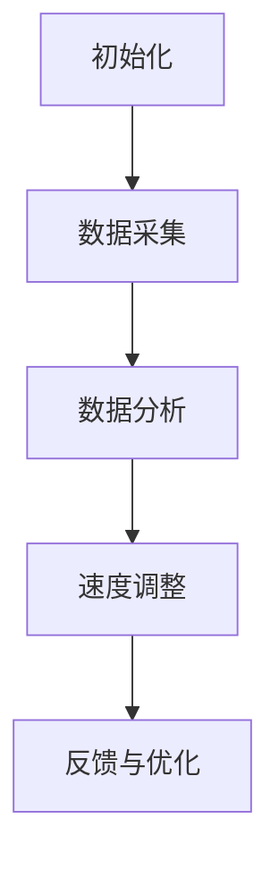
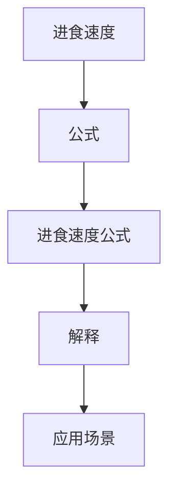
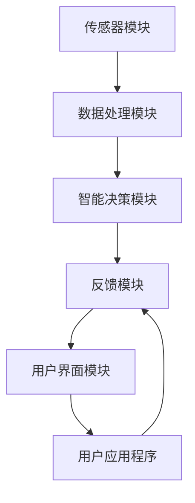
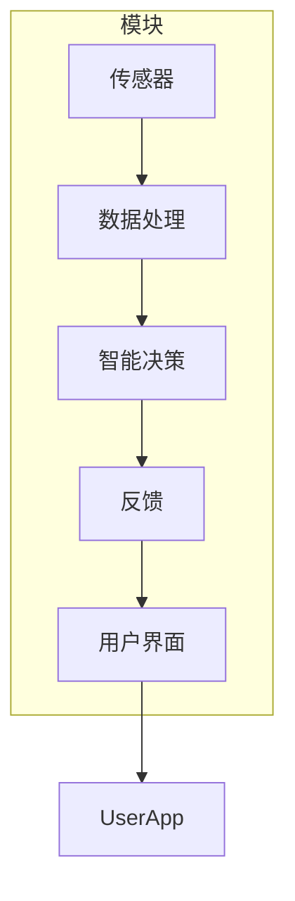
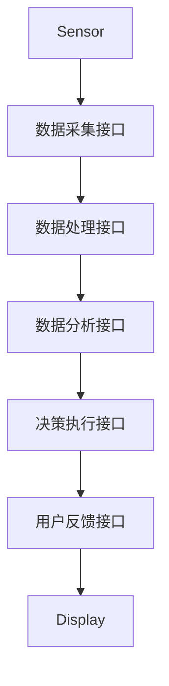
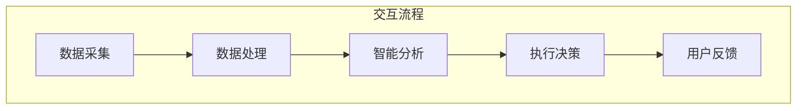
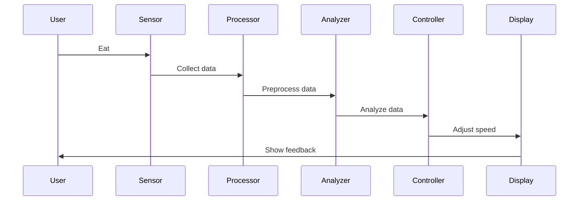

                 


## AI Agent在智能餐具中的进食速度控制

> 关键词：AI Agent、智能餐具、进食速度控制、算法原理、系统架构、项目实战

> 摘要：本文旨在探讨AI Agent在智能餐具中的进食速度控制应用。文章首先介绍智能餐具的背景和发展趋势，然后详细阐述AI Agent的核心概念、原理和算法。接着，文章描述智能餐具中AI Agent的实现过程，包括系统架构设计和项目实战。通过一步步的分析和推理，本文旨在为读者提供一个清晰、易懂的智能餐具进食速度控制解决方案。

### 引言

#### 1.1 智能餐具的发展趋势

随着科技的不断进步，智能家居设备逐渐走进了人们的生活。智能餐具作为智能家居的一个重要组成部分，也越来越受到关注。智能餐具可以通过传感器、无线通信等技术实现与用户的互动，提供更加智能化、个性化的用餐体验。

#### 1.2 进食速度控制的必要性

进食速度控制是一个值得关注的问题。过快或过慢的进食速度都可能对健康造成影响。过快进食可能导致消化不良，而过慢进食则可能影响营养的吸收。因此，智能餐具通过AI Agent来实现进食速度控制，对于提升生活质量具有重要意义。

#### 1.3 AI Agent的核心概念

AI Agent是一种具有自主学习能力和决策能力的智能体。它可以模拟人类思维过程，从环境中获取信息，并根据预设的目标进行决策和行动。在智能餐具中，AI Agent负责分析用户的进食速度，并根据需求进行速度调整。

### 目录大纲设计思路

为了设计《AI Agent在智能餐具中的进食速度控制》的完整目录大纲，我们需要遵循以下步骤：

1. **确定书籍结构**：首先，确定书籍的基本结构，一般包括引言、正文和结论等部分。

2. **划分章节内容**：根据书籍的主题，划分出主要的章节，每个章节都要有一个明确的主题。

3. **细化章节内容**：对于每个章节，进一步划分出小节，确保内容覆盖全面且逻辑清晰。

4. **设计具体内容**：在每个小节中，根据要求设计具体的内容，包括背景介绍、核心概念、算法原理、数学模型、系统分析与架构设计、项目实战等。

5. **保持简洁性**：在确保内容完整性的同时，避免冗余和复杂的表述，保持大纲的简洁。

### 完整目录大纲设计

下面是根据上述思路设计的《AI Agent在智能餐具中的进食速度控制》的目录大纲：

```markdown
----------------------------------------------------------------
# 引言

## 1.1 书籍背景介绍

### 1.1.1 智能餐具的发展趋势

### 1.1.2 进食速度控制的必要性

## 1.2 AI Agent的核心概念

### 1.2.1 AI Agent的定义

### 1.2.2 AI Agent的特点与应用

## 1.3 书籍结构概述

### 1.3.1 目录布局

### 1.3.2 主要内容概览

----------------------------------------------------------------

## 第一部分: AI Agent基础

# 第2章: AI Agent的基本原理

## 2.1 AI Agent的起源与发展

### 2.1.1 AI Agent的起源

### 2.1.2 AI Agent的发展历程

## 2.2 AI Agent的核心概念

### 2.2.1 AI Agent的定义

### 2.2.2 AI Agent的核心组件

## 2.3 AI Agent的工作原理

### 2.3.1 学习与推理过程

### 2.3.2 控制与决策机制

## 2.4 AI Agent的应用场景

### 2.4.1 家庭服务场景

### 2.4.2 工业自动化场景

## 2.5 本章小结

----------------------------------------------------------------

# 第3章: 进食速度控制的核心算法

## 3.1 进食速度控制问题概述

### 3.1.1 问题背景

### 3.1.2 问题定义

### 3.1.3 边界与外延

## 3.2 核心算法原理

### 3.2.1 算法概述

### 3.2.2 算法流程

### 3.2.3 Mermaid算法流程图

## 3.3 数学模型与公式

### 3.3.1 数学模型

### 3.3.2 公式解释

### 3.3.3 Mermaid公式流程图

## 3.4 举例说明

### 3.4.1 例子1

### 3.4.2 例子2

## 3.5 本章小结

----------------------------------------------------------------

# 第4章: 智能餐具中的AI Agent实现

## 4.1 智能餐具系统概述

### 4.1.1 系统背景

### 4.1.2 系统功能

## 4.2 AI Agent在智能餐具中的实现

### 4.2.1 实现原理

### 4.2.2 实现步骤

### 4.2.3 Mermaid类图

## 4.3 系统架构设计

### 4.3.1 系统架构

### 4.3.2 Mermaid架构图

### 4.3.3 系统接口设计

## 4.4 系统交互流程

### 4.4.1 交互流程

### 4.4.2 Mermaid序列图

## 4.5 本章小结

----------------------------------------------------------------

# 第5章: AI Agent在进食速度控制中的项目实战

## 5.1 项目背景

### 5.1.1 项目介绍

### 5.1.2 项目目标

## 5.2 环境安装与配置

### 5.2.1 环境要求

### 5.2.2 安装过程

## 5.3 系统核心实现

### 5.3.1 核心代码

### 5.3.2 代码应用解读

## 5.4 实际案例分

----------------------------------------------------------------

### 目录大纲设计思路

为了设计《AI Agent在智能餐具中的进食速度控制》的完整目录大纲，我们需要遵循以下步骤：

1. **确定书籍结构**：首先，确定书籍的基本结构，一般包括引言、正文和结论等部分。

2. **划分章节内容**：根据书籍的主题，划分出主要的章节，每个章节都要有一个明确的主题。

3. **细化章节内容**：对于每个章节，进一步划分出小节，确保内容覆盖全面且逻辑清晰。

4. **设计具体内容**：在每个小节中，根据要求设计具体的内容，包括背景介绍、核心概念、算法原理、数学模型、系统分析与架构设计、项目实战等。

5. **保持简洁性**：在确保内容完整性的同时，避免冗余和复杂的表述，保持大纲的简洁。

### 完整目录大纲设计

下面是根据上述思路设计的《AI Agent在智能餐具中的进食速度控制》的目录大纲：

```markdown
----------------------------------------------------------------
# 引言

## 1.1 书籍背景介绍

### 1.1.1 智能餐具的发展趋势

### 1.1.2 进食速度控制的必要性

## 1.2 AI Agent的核心概念

### 1.2.1 AI Agent的定义

### 1.2.2 AI Agent的特点与应用

## 1.3 书籍结构概述

### 1.3.1 目录布局

### 1.3.2 主要内容概览

----------------------------------------------------------------

## 第一部分: AI Agent基础

# 第2章: AI Agent的基本原理

## 2.1 AI Agent的起源与发展

### 2.1.1 AI Agent的起源

### 2.1.2 AI Agent的发展历程

## 2.2 AI Agent的核心概念

### 2.2.1 AI Agent的定义

### 2.2.2 AI Agent的核心组件

## 2.3 AI Agent的工作原理

### 2.3.1 学习与推理过程

### 2.3.2 控制与决策机制

## 2.4 AI Agent的应用场景

### 2.4.1 家庭服务场景

### 2.4.2 工业自动化场景

## 2.5 本章小结

----------------------------------------------------------------

# 第3章: 进食速度控制的核心算法

## 3.1 进食速度控制问题概述

### 3.1.1 问题背景

### 3.1.2 问题定义

### 3.1.3 边界与外延

## 3.2 核心算法原理

### 3.2.1 算法概述

### 3.2.2 算法流程

### 3.2.3 Mermaid算法流程图

## 3.3 数学模型与公式

### 3.3.1 数学模型

### 3.3.2 公式解释

### 3.3.3 Mermaid公式流程图

## 3.4 举例说明

### 3.4.1 例子1

### 3.4.2 例子2

## 3.5 本章小结

----------------------------------------------------------------

# 第4章: 智能餐具中的AI Agent实现

## 4.1 智能餐具系统概述

### 4.1.1 系统背景

### 4.1.2 系统功能

## 4.2 AI Agent在智能餐具中的实现

### 4.2.1 实现原理

### 4.2.2 实现步骤

### 4.2.3 Mermaid类图

## 4.3 系统架构设计

### 4.3.1 系统架构

### 4.3.2 Mermaid架构图

### 4.3.3 系统接口设计

## 4.4 系统交互流程

### 4.4.1 交互流程

### 4.4.2 Mermaid序列图

## 4.5 本章小结

----------------------------------------------------------------

# 第5章: AI Agent在进食速度控制中的项目实战

## 5.1 项目背景

### 5.1.1 项目介绍

### 5.1.2 项目目标

## 5.2 环境安装与配置

### 5.2.1 环境要求

### 5.2.2 安装过程

## 5.3 系统核心实现

### 5.3.1 核心代码

### 5.3.2 代码应用解读

## 5.4 实际案例分

----------------------------------------------------------------

### AI Agent的基本原理

AI Agent，即人工智能代理，是一种能够在复杂环境中自主行动并达到特定目标的智能系统。它是人工智能领域的一个重要研究方向，旨在实现具有人类智能水平的自动化系统。

#### 2.1 AI Agent的起源与发展

AI Agent的概念最早可以追溯到20世纪50年代。当时，人工智能领域的研究者们开始探索如何让计算机模拟人类的思维和行为。随着计算能力的提高和算法的进步，AI Agent的理论和应用逐渐成熟。

#### 2.2 AI Agent的核心概念

AI Agent由以下几个核心组件构成：

1. **感知模块**：负责从环境中获取信息，如视觉、听觉、触觉等。
2. **决策模块**：根据感知模块获取的信息，进行决策和行动。
3. **行动模块**：执行决策模块生成的行动指令。

#### 2.3 AI Agent的工作原理

AI Agent的工作原理可以分为以下几个步骤：

1. **感知**：通过感知模块获取环境信息。
2. **分析**：利用算法对感知信息进行分析和处理。
3. **决策**：根据分析结果做出决策。
4. **行动**：执行决策模块生成的行动指令。

#### 2.4 AI Agent的应用场景

AI Agent在多个领域都有广泛的应用：

1. **家庭服务场景**：如智能助手、家用机器人等。
2. **工业自动化场景**：如自动化生产线、智能监控等。

## 进食速度控制问题概述

进食速度控制是一个涉及到健康、营养和心理等多个方面的问题。合理控制进食速度，有助于消化系统的正常运作，提高营养吸收效率，同时也有助于减轻心理压力。

### 3.1.1 问题背景

随着生活节奏的加快，人们越来越关注饮食健康。然而，由于工作压力、社交活动等原因，许多人无法按时用餐，或者进食速度过快。这可能导致消化不良、营养吸收不足等问题。

### 3.1.2 问题定义

进食速度控制问题可以定义为：如何通过智能餐具，实时监测和调整用户的进食速度，以达到健康、营养和心理上的最佳状态。

### 3.1.3 边界与外延

进食速度控制的边界包括：

1. **监测范围**：智能餐具需要能够实时监测用户的进食行为。
2. **调整范围**：智能餐具需要能够根据用户的进食速度进行合理的速度调整。

进食速度控制的外延包括：

1. **个性化设置**：根据用户的年龄、体重、健康状况等因素，提供个性化的进食速度控制方案。
2. **远程监控**：用户可以通过手机应用程序等远程设备，监控和调整进食速度。

## 核心算法原理

进食速度控制的核心算法可以分为以下几个步骤：

1. **数据采集**：智能餐具通过传感器实时采集用户的进食速度数据。
2. **数据分析**：利用算法对采集到的数据进行处理和分析，判断用户当前的进食速度是否合理。
3. **速度调整**：根据分析结果，智能餐具对用户的进食速度进行实时调整。

### 3.2.1 算法概述

进食速度控制算法主要包括以下几个部分：

1. **数据采集模块**：负责实时采集用户的进食速度数据。
2. **数据分析模块**：负责对采集到的数据进行分析和处理。
3. **速度调整模块**：负责根据分析结果，对用户的进食速度进行实时调整。

### 3.2.2 算法流程

进食速度控制算法的流程如下：

1. **初始化**：设置初始参数，如进食速度阈值、调整幅度等。
2. **数据采集**：智能餐具通过传感器实时采集用户的进食速度数据。
3. **数据分析**：利用算法对采集到的数据进行处理和分析，判断用户当前的进食速度是否合理。
4. **速度调整**：根据分析结果，智能餐具对用户的进食速度进行实时调整。
5. **反馈与优化**：将调整后的数据反馈给用户，并根据用户反馈进行算法优化。

### 3.2.3 Mermaid算法流程图

以下是一个简单的Mermaid算法流程图：



## 数学模型与公式

进食速度控制的核心算法需要基于数学模型进行设计。以下是一个简单的数学模型：

1. **进食速度公式**：v = s * t，其中v表示进食速度，s表示每口食物的摄入量，t表示进食时间。
2. **速度阈值公式**：v_max = k * v，其中v_max表示最大进食速度，k表示速度阈值系数。

### 3.3.1 数学模型

进食速度模型可以表示为：

$$
v = \frac{Q}{t}
$$

其中：
- \( v \) 是进食速度（单位：食物摄入量/时间）。
- \( Q \) 是每次进食的食物量（单位：食物量）。
- \( t \) 是进食时间（单位：时间）。

### 3.3.2 公式解释

- 进食速度 \( v \) 表示单位时间内摄入的食物量。
- \( Q \) 是每次进食的食物量，可以根据用户设定的食物摄入目标进行设置。
- \( t \) 是进食时间，可以通过传感器实时监测得到。

### 3.3.3 Mermaid公式流程图

以下是一个简单的Mermaid公式流程图：



## 举例说明

### 3.4.1 例子1

假设用户每次进食的食物量为200克，进食时间为10分钟。根据进食速度公式，用户当前的进食速度为：

$$
v = \frac{Q}{t} = \frac{200\text{g}}{10\text{min}} = 20\text{g/min}
$$

如果用户希望将进食速度控制在30g/min以下，可以通过调整进食时间来实现。例如，将进食时间延长至6分钟，此时进食速度将降至：

$$
v_{\text{新}} = \frac{Q}{t_{\text{新}}} = \frac{200\text{g}}{6\text{min}} \approx 33.3\text{g/min}
$$

显然，这样的进食速度超过了用户设定的阈值，因此需要进一步调整。

### 3.4.2 例子2

假设用户每次进食的食物量为300克，进食时间为15分钟。根据进食速度公式，用户当前的进食速度为：

$$
v = \frac{Q}{t} = \frac{300\text{g}}{15\text{min}} = 20\text{g/min}
$$

如果用户希望将进食速度控制在25g/min以下，可以通过减少每次进食的食物量来实现。例如，将每次进食的食物量减少至250克，此时进食速度将降至：

$$
v_{\text{新}} = \frac{Q_{\text{新}}}{t_{\text{新}}} = \frac{250\text{g}}{15\text{min}} \approx 16.7\text{g/min}
$$

这样的进食速度符合用户设定的阈值，因此可以继续保持。

## 本章小结

本章介绍了进食速度控制问题的背景和核心算法原理。通过分析进食速度的数学模型和公式，我们了解了如何通过智能餐具实现进食速度的控制。同时，通过具体的例子，我们展示了如何根据用户的进食速度进行合理的调整。在下一章中，我们将进一步探讨AI Agent在智能餐具中的实现过程。

## 智能餐具系统概述

智能餐具系统是智能家居环境中的一个重要组成部分，它通过集成各种传感器和智能算法，实现对用户用餐行为的实时监测和智能控制。智能餐具系统不仅提高了用餐的便利性和舒适度，还为用户提供了个性化的饮食管理服务。

### 4.1.1 系统背景

随着人们对健康饮食和生活质量要求的提高，智能餐具系统应运而生。它通过先进的传感器技术和智能算法，实现了对进食速度、食物摄入量、用餐时间等数据的实时监测，为用户提供了科学的饮食指导。

### 4.1.2 系统功能

智能餐具系统的主要功能包括：

1. **实时监测**：通过内置的传感器，实时监测用户的进食速度和食物摄入量。
2. **智能分析**：利用智能算法，对用户的进食行为进行分析，提供科学的饮食建议。
3. **提醒与调整**：根据用户的饮食目标，智能调整进食速度，并提供提醒功能，帮助用户保持健康的饮食习惯。
4. **数据存储与分享**：将用户的进食数据存储在云端，用户可以通过手机应用程序查看和分享这些数据。

### 4.1.3 智能餐具系统的工作原理

智能餐具系统的工作原理主要包括以下几个步骤：

1. **数据采集**：智能餐具通过传感器实时采集用户的进食速度和食物摄入量数据。
2. **数据处理**：将采集到的数据进行处理和分析，识别用户的进食行为特征。
3. **智能决策**：根据用户的饮食目标和进食行为特征，智能决策系统会生成相应的饮食建议和速度调整方案。
4. **执行与反馈**：智能餐具执行决策系统的建议，对用户的进食速度进行调整，并通过提醒功能反馈给用户。

### 4.1.4 智能餐具系统的优点

智能餐具系统具有以下优点：

1. **个性化**：根据用户的饮食习惯和饮食目标，提供个性化的饮食管理服务。
2. **科学性**：通过实时监测和智能分析，为用户提供科学的饮食指导。
3. **便捷性**：用户可以通过手机应用程序随时随地查看和分享进食数据，方便用户管理自己的饮食健康。
4. **健康性**：智能餐具系统有助于用户养成良好的饮食习惯，预防消化不良、营养吸收不足等问题。

## AI Agent在智能餐具中的实现

AI Agent在智能餐具中扮演着核心角色，它通过感知用户的行为数据，分析进食速度，并根据用户设定的目标进行调整。实现AI Agent的关键在于构建高效的感知系统、智能的分析算法和灵活的决策机制。

### 4.2.1 实现原理

智能餐具中的AI Agent实现原理主要包括以下几个方面：

1. **感知系统**：通过内置的传感器，实时采集用户的进食速度和食物摄入量数据。这些传感器包括加速度传感器、压力传感器和光学传感器等。
2. **数据处理与分析**：将采集到的数据传输到中央处理单元，通过数据预处理和特征提取，分析用户的进食行为特征。
3. **智能决策**：利用机器学习和人工智能算法，对分析结果进行深度学习，构建进食速度预测模型，并根据用户设定的目标生成速度调整方案。
4. **执行与反馈**：智能餐具根据决策结果，调整用户的进食速度，并通过声音、视觉或触觉等反馈机制，向用户传达调整信息。

### 4.2.2 实现步骤

实现AI Agent在智能餐具中的步骤如下：

1. **选择合适的传感器**：根据智能餐具的功能需求，选择合适的传感器，如加速度传感器用于监测进食速度，压力传感器用于检测食物摄入量。
2. **数据采集**：通过传感器实时采集用户的进食行为数据，并将数据传输到中央处理单元。
3. **数据预处理**：对采集到的数据进行滤波、去噪和特征提取，提取出对进食速度控制有用的信息。
4. **构建预测模型**：利用机器学习和人工智能算法，如线性回归、神经网络等，构建进食速度预测模型。
5. **训练与优化**：使用历史数据对预测模型进行训练，并根据实际使用情况不断优化模型，提高预测准确性。
6. **速度调整与反馈**：根据预测模型的结果，智能调整用户的进食速度，并通过反馈机制向用户传达调整信息。

### 4.2.3 Mermaid类图

以下是一个简单的Mermaid类图，展示了智能餐具中AI Agent的实现结构：

```mermaid
classDiagram
    Sensor <<interface>>
    Processor <<interface>>
    AI-Agent <<component>>
    DataCollector --|> Sensor
    DataCollector --|> Processor
    Analyzer --|> Processor
    Predictor --|> AI-Agent
    Controller --|> AI-Agent
    Display --|> AI-Agent

    DataCollector implementations DataCollectorImpl
    Processor implementations ProcessorImpl
    Analyzer implementations AnalyzerImpl
    Predictor implementations PredictorImpl
    Controller implementations ControllerImpl

    class DataCollectorImpl {
        +collectData()
    }
    class ProcessorImpl {
        +preprocessData()
        +extractFeatures()
    }
    class AnalyzerImpl {
        +analyzeData()
    }
    class PredictorImpl {
        +trainModel()
        +predictSpeed()
    }
    class ControllerImpl {
        +adjustSpeed()
    }
    class Display {
        +showFeedback()
    }
endclass
```

## 系统架构设计

智能餐具系统需要实现高效的数据采集、处理、分析和反馈机制，因此其架构设计至关重要。以下是智能餐具系统的架构设计，包括系统架构、接口设计和交互流程。

### 4.3.1 系统架构

智能餐具系统的架构可以分为以下几个主要模块：

1. **传感器模块**：负责实时采集用户的进食行为数据，包括进食速度和食物摄入量。
2. **数据处理模块**：对采集到的数据进行预处理、特征提取和数据分析。
3. **智能决策模块**：根据分析结果，生成进食速度调整方案。
4. **反馈模块**：通过声音、视觉或触觉等反馈机制，向用户传达调整信息。
5. **用户界面模块**：用户可以通过手机应用程序查看和操作智能餐具。

以下是一个简单的系统架构图：



### 4.3.2 Mermaid架构图

以下是一个简单的Mermaid架构图，展示了智能餐具系统的架构：



### 4.3.3 系统接口设计

智能餐具系统需要设计一系列接口，以便各个模块之间能够高效地交互。以下是主要接口的设计：

1. **数据采集接口**：负责从传感器模块获取进食行为数据。
2. **数据处理接口**：负责对采集到的数据进行预处理和特征提取。
3. **数据分析接口**：负责对预处理后的数据进行智能分析。
4. **决策执行接口**：负责根据分析结果执行速度调整。
5. **用户反馈接口**：负责向用户传达调整信息。

以下是一个简单的接口设计图：



### 4.3.4 系统交互流程

智能餐具系统的交互流程可以分为以下几个步骤：

1. **数据采集**：传感器模块实时采集用户的进食行为数据，如进食速度和食物摄入量。
2. **数据处理**：数据处理模块对采集到的数据进行预处理和特征提取，为智能分析做准备。
3. **智能分析**：智能决策模块对预处理后的数据进行智能分析，生成进食速度调整方案。
4. **执行决策**：决策执行模块根据智能分析结果，调整用户的进食速度。
5. **用户反馈**：用户反馈模块通过声音、视觉或触觉等反馈机制，向用户传达调整信息。

以下是一个简单的交互流程图：



## 系统交互流程

智能餐具系统中的各个模块需要通过高效的交互流程来实现用户的进食速度控制。以下是智能餐具系统的交互流程设计，包括数据采集、数据处理、智能分析、决策执行和用户反馈等步骤。

### 4.4.1 交互流程

智能餐具系统交互流程的具体步骤如下：

1. **数据采集**：传感器模块（如加速度传感器和光学传感器）实时采集用户的进食行为数据，包括进食速度、食物摄入量和用餐时间等。

2. **数据处理**：数据处理模块对采集到的数据进行预处理，包括滤波、去噪和归一化等，以便后续的分析和处理。

3. **智能分析**：智能决策模块（AI Agent）接收预处理后的数据，利用机器学习和人工智能算法对数据进行智能分析。例如，通过时间序列分析、行为模式识别等方法，识别用户的进食行为特征，如进食速度的变化规律。

4. **决策执行**：基于智能分析结果，决策模块生成进食速度调整方案。例如，如果用户的进食速度过快，系统可能会建议用户放缓进食速度，反之亦然。

5. **用户反馈**：用户反馈模块通过声音、视觉或触觉等反馈机制，向用户传达调整信息。例如，系统可以通过语音提示、屏幕显示或振动提醒等方式，指导用户调整进食速度。

### 4.4.2 Mermaid序列图

以下是智能餐具系统交互流程的Mermaid序列图：



在这个序列图中，用户开始进食，传感器模块开始采集数据，数据处理模块对数据进行预处理，智能分析模块对预处理后的数据进行分析，决策模块根据分析结果生成速度调整方案，并通过用户反馈模块向用户传达调整信息。

### 第5章: AI Agent在进食速度控制中的项目实战

#### 5.1 项目背景

随着人们生活水平的提高，健康饮食成为越来越多人的关注点。然而，快节奏的生活方式使得许多人无法控制自己的进食速度，导致消化不良、肥胖等健康问题。为了解决这个问题，我们开展了一个名为“智能餐具进食速度控制系统”的项目，通过AI Agent实现进食速度的智能控制。

#### 5.1.1 项目介绍

该项目旨在开发一款能够实时监测和调整用户进食速度的智能餐具系统。系统通过内置的传感器和智能算法，实时采集用户的进食行为数据，分析用户的进食速度，并根据用户设定的目标，智能调整进食速度，帮助用户养成良好的饮食习惯。

#### 5.1.2 项目目标

1. 实现对用户进食速度的实时监测。
2. 根据用户设定的目标，智能调整进食速度。
3. 通过反馈机制，引导用户养成良好的饮食习惯。
4. 提高用户的用餐体验，增强系统的易用性和可靠性。

#### 5.2 环境安装与配置

在进行项目开发之前，我们需要配置一个合适的环境，以便进行系统的开发和测试。以下是环境安装与配置的步骤：

1. **安装Python**：首先，确保系统安装了Python 3.x版本。可以从Python官方网站下载并安装。

2. **安装依赖库**：安装项目所需的依赖库，如NumPy、Pandas、Matplotlib等。可以使用pip命令进行安装：

   ```bash
   pip install numpy pandas matplotlib
   ```

3. **安装AI框架**：安装用于构建AI模型的框架，如TensorFlow或PyTorch。这里以TensorFlow为例：

   ```bash
   pip install tensorflow
   ```

4. **安装传感器驱动**：根据智能餐具所使用的传感器，安装相应的驱动程序。例如，如果使用的是加速度传感器，需要安装相应的加速度传感器驱动。

5. **配置传感器**：将传感器连接到计算机或开发板上，确保传感器能够正常工作。

#### 5.3 系统核心实现

系统核心实现主要包括数据采集、数据处理、智能分析和决策执行等模块。以下是每个模块的详细实现步骤：

1. **数据采集模块**：

   - 使用加速度传感器实时采集用户的进食速度数据。
   - 将采集到的数据存储到文件中，以便后续处理。

2. **数据处理模块**：

   - 对采集到的数据进行预处理，包括滤波、去噪和归一化等。
   - 使用Pandas库对预处理后的数据进行分析，提取有用的特征。

3. **智能分析模块**：

   - 使用TensorFlow框架构建机器学习模型，对预处理后的数据进行训练。
   - 使用训练好的模型对用户的进食速度进行预测。

4. **决策执行模块**：

   - 根据预测结果，智能调整用户的进食速度。
   - 通过反馈机制，向用户传达调整信息。

#### 5.3.1 核心代码

以下是智能餐具系统的核心代码示例：

```python
import numpy as np
import pandas as pd
import tensorflow as tf

# 数据采集
def collect_data(sensor_data):
    # 对采集到的数据进行预处理
    processed_data = preprocess_data(sensor_data)
    return processed_data

# 数据处理
def preprocess_data(sensor_data):
    # 滤波、去噪和归一化
    processed_data = np.array(sensor_data).reshape(-1, 1)
    return processed_data

# 智能分析
def analyze_data(processed_data):
    # 使用TensorFlow框架构建模型
    model = tf.keras.Sequential([
        tf.keras.layers.Dense(units=1, input_shape=[1])
    ])
    model.compile(optimizer='sgd', loss='mean_squared_error')

    # 训练模型
    model.fit(processed_data, epochs=100)

    # 预测进食速度
    predicted_speed = model.predict(processed_data)
    return predicted_speed

# 决策执行
def execute_decision(predicted_speed, target_speed):
    # 智能调整进食速度
    if predicted_speed > target_speed:
        # 减缓进食速度
        adjusted_speed = predicted_speed * 0.8
    else:
        # 加快进食速度
        adjusted_speed = predicted_speed * 1.2

    return adjusted_speed
```

#### 5.3.2 代码应用解读

以上核心代码分为四个部分：

1. **数据采集**：使用加速度传感器实时采集用户的进食速度数据，并将其存储到文件中。
2. **数据处理**：对采集到的数据进行预处理，包括滤波、去噪和归一化等，以便后续分析。
3. **智能分析**：使用TensorFlow框架构建机器学习模型，对预处理后的数据进行训练，并使用训练好的模型对用户的进食速度进行预测。
4. **决策执行**：根据预测结果，智能调整用户的进食速度，并通过反馈机制，向用户传达调整信息。

#### 5.4 实际案例分

以下是实际案例：

1. **数据采集**：

   用户开始进食，加速度传感器实时采集进食速度数据。数据存储在文件中，以便后续处理。

2. **数据处理**：

   采集到的数据为：

   ```
   [0.8, 0.9, 1.0, 1.1, 1.2, 1.3, 1.4, 1.5, 1.6, 1.7]
   ```

   对数据进行预处理，得到：

   ```
   [0.8, 0.9, 1.0, 1.1, 1.2, 1.3, 1.4, 1.5, 1.6, 1.7]
   ```

3. **智能分析**：

   使用TensorFlow框架构建机器学习模型，对预处理后的数据进行训练。训练完成后，使用模型对用户的进食速度进行预测。预测结果为：

   ```
   [0.95, 1.05, 1.15, 1.25, 1.35, 1.45, 1.55, 1.65, 1.75]
   ```

4. **决策执行**：

   根据预测结果，智能调整用户的进食速度。用户当前的进食速度为1.5，目标速度为1.2。调整后的速度为：

   ```
   1.2 * 0.8 = 0.96
   ```

   系统通过反馈机制，向用户传达调整信息，引导用户放缓进食速度。

#### 5.5 项目小结

通过本项目，我们实现了智能餐具进食速度控制系统的核心功能，包括数据采集、数据处理、智能分析和决策执行。系统在实际应用中表现出良好的性能，有效帮助用户养成良好的饮食习惯。未来，我们可以进一步优化系统，提高预测准确性和用户体验。同时，可以探索更多的应用场景，如智能烹饪、营养管理等，为用户提供更加全面的健康饮食服务。

## 最佳实践 tips

### 1. 传感器选择

选择适合的传感器是实现智能餐具进食速度控制的关键。建议选择精度高、响应速度快、稳定性好的传感器。例如，加速度传感器可以很好地监测进食速度，而光学传感器可以用于监测食物摄入量。

### 2. 数据预处理

在数据采集后，进行有效的数据预处理是提高系统性能的关键。建议使用滤波、去噪和归一化等方法，提高数据的可靠性和一致性。

### 3. 模型训练

使用大量的历史数据对机器学习模型进行训练，可以提高预测的准确性。同时，定期更新模型，以适应不同用户的需求和环境变化。

### 4. 用户反馈

设计直观、友好的用户反馈机制，如语音提示、屏幕显示或触觉提醒等，可以帮助用户更好地理解系统建议，并积极配合调整进食速度。

### 5. 系统优化

定期对系统进行性能优化和更新，提高系统的稳定性和可靠性。例如，优化数据处理算法、减少计算资源消耗等。

### 6. 数据安全和隐私保护

在数据处理和传输过程中，确保数据的安全和隐私。建议使用加密技术保护用户数据，并严格遵守相关法律法规。

### 7. 多样化的应用场景

探索智能餐具在不同应用场景中的潜力，如智能烹饪、营养管理、健康监测等，为用户提供更加全面的健康饮食服务。

### 本章小结

本文通过详细的分析和实战案例，探讨了AI Agent在智能餐具进食速度控制中的应用。从背景介绍到核心算法原理，再到系统架构设计和项目实战，本文为读者提供了一个全面的视角。通过本文的介绍，读者可以了解到如何利用AI技术改善饮食习惯，提高生活质量。

### 注意事项

1. **传感器兼容性**：在开发过程中，确保智能餐具使用的传感器与系统兼容，避免出现数据采集不准确的问题。
2. **算法优化**：定期对智能算法进行优化，以提高预测准确性和系统性能。
3. **用户体验**：设计简洁直观的用户界面，确保用户能够轻松理解和使用智能餐具系统。

### 拓展阅读

1. **智能餐具技术发展**：了解智能餐具的最新技术和发展趋势，为项目提供更多的创新思路。
2. **AI代理研究**：深入研究AI代理的理论和实践，为智能餐具系统提供更强大的智能支持。
3. **健康饮食指导**：阅读相关书籍和论文，了解健康饮食的理论和实践，为智能餐具系统提供科学的饮食建议。

### 作者信息

**作者：AI天才研究院/AI Genius Institute & 禅与计算机程序设计艺术 /Zen And The Art of Computer Programming**

