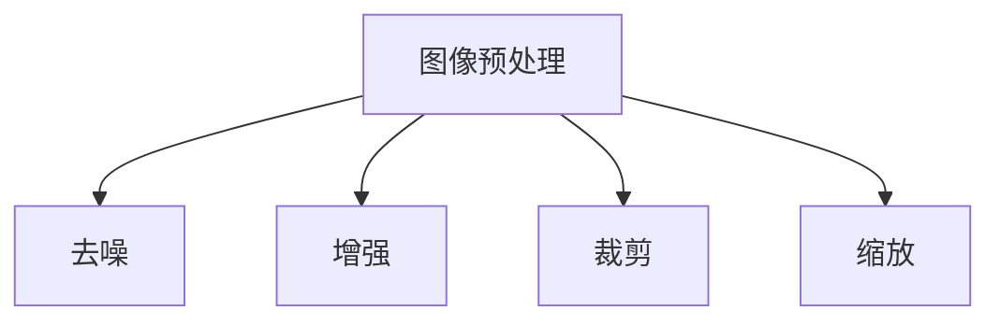
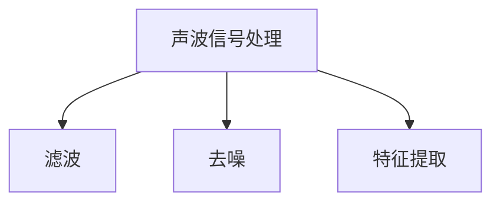

                 

## 《AI Agent在植物学中的应用：物种识别与生态监测》

### 关键词：AI Agent、植物学、物种识别、生态监测、深度学习

> 摘要：本文探讨了人工智能（AI）代理在植物学领域中的应用，特别是在物种识别和生态监测方面的创新与挑战。文章首先介绍了AI代理的基本概念及其在植物学中的潜在应用，随后详细解析了物种识别的技术原理和实践，最后探讨了AI代理在生态监测中的作用和系统架构设计。通过案例分析，展示了AI代理在植物学和生态学中的实际应用效果，并提出了未来发展的可能方向。

### 第一部分：引言

#### 第1章：问题背景

##### 1.1 植物学领域概述

植物学是生物学的一个重要分支，主要研究植物的形态、结构、生理、分类、遗传以及与环境的关系。随着全球气候变化、环境污染和生物多样性减少等问题的日益严峻，植物学的研究对于生态保护和可持续发展具有重要意义。

##### 1.2 AI Agent在植物学中的挑战

AI代理，即人工智能代理，是一种能够模拟人类思维和决策过程的计算机程序。在植物学领域，AI代理面临着数据多样性、计算复杂性和实时性等挑战。例如，植物物种识别需要处理大量的图像和声音数据，而生态监测则需要实时处理大量的环境数据。

##### 1.3 书籍目的与结构安排

本文旨在探讨AI代理在植物学中的应用，特别是物种识别和生态监测。全书分为四个部分，分别介绍AI代理的基本概念、物种识别技术、生态监测系统设计和实际应用案例分析。通过本书，读者可以全面了解AI代理在植物学领域的应用现状和未来发展趋势。

#### 第2章：AI Agent基本概念

##### 2.1 定义与分类

AI代理是一种能够自主执行任务、具备学习和适应能力的计算机程序。根据功能和应用场景，AI代理可以分为专家系统、智能代理和增强智能代理等类型。

##### 2.2 工作原理与特点

AI代理的工作原理主要基于机器学习、深度学习和自然语言处理等技术。其特点包括自主决策、自适应性和可扩展性。在植物学领域，AI代理可以应用于物种识别、生态监测、病虫害预警等任务。

##### 2.3 应用领域与潜力

AI代理在植物学领域具有广泛的应用前景。例如，在物种识别方面，AI代理可以辅助植物学家快速准确地识别植物；在生态监测方面，AI代理可以实时监测环境数据，为生态保护和决策提供科学依据。

#### 第3章：植物学基础知识

##### 3.1 植物分类学

植物分类学是研究植物分类和系统发育的学科。通过分类学，植物学家可以更好地理解植物之间的亲缘关系和演化历程。

##### 3.2 植物生态学

植物生态学主要研究植物与环境之间的相互作用。了解植物生态学有助于我们更好地保护生物多样性、应对气候变化等挑战。

##### 3.3 物种识别的基本方法

物种识别是植物学领域的一项基础性工作。目前，物种识别主要依赖于图像识别、声音识别和形态测量等方法。随着AI技术的发展，这些方法的准确性和效率得到了显著提高。

----------------------------------------------------------------

## 第4章：AI Agent在物种识别中的应用

### 4.1 图像识别技术

图像识别技术在物种识别中起着至关重要的作用。随着深度学习技术的快速发展，图像识别的准确率和效率得到了显著提高。

#### 4.1.1 图像预处理

图像预处理是图像识别的第一步，主要包括图像去噪、增强、裁剪和缩放等操作。通过预处理，可以提升图像的质量和特征表达。



#### 4.1.2 卷积神经网络（CNN）

卷积神经网络（CNN）是图像识别的核心技术。CNN通过多个卷积层、池化层和全连接层来提取图像的特征。

```python
import tensorflow as tf

model = tf.keras.Sequential([
    tf.keras.layers.Conv2D(32, (3, 3), activation='relu', input_shape=(28, 28, 1)),
    tf.keras.layers.MaxPooling2D((2, 2)),
    tf.keras.layers.Conv2D(64, (3, 3), activation='relu'),
    tf.keras.layers.MaxPooling2D((2, 2)),
    tf.keras.layers.Conv2D(64, (3, 3), activation='relu'),
    tf.keras.layers.Flatten(),
    tf.keras.layers.Dense(64, activation='relu'),
    tf.keras.layers.Dense(10, activation='softmax')
])
```

#### 4.1.3 机器学习算法

除了CNN，其他机器学习算法如支持向量机（SVM）、决策树和随机森林等也在物种识别中得到了广泛应用。这些算法通过学习数据特征，构建分类模型，从而实现物种识别。

```python
from sklearn.svm import SVC

model = SVC(kernel='linear', C=1)
model.fit(X_train, y_train)
predictions = model.predict(X_test)
```

### 4.2 声音识别技术

声音识别技术在植物学中的应用主要包括植物鸣叫、虫鸣等声音信号的识别。深度学习技术在声音识别中发挥了重要作用。

#### 4.2.1 声波信号处理

声波信号处理是声音识别的基础。通过滤波、去噪和特征提取等步骤，可以将原始声音信号转换为适合机器学习模型处理的特征向量。



#### 4.2.2 深度学习在声音识别中的应用

深度学习模型如卷积神经网络（CNN）和长短期记忆网络（LSTM）在声音识别中具有显著优势。CNN可以有效地提取时间序列特征，而LSTM则擅长处理长序列数据。

```python
import tensorflow as tf

model = tf.keras.Sequential([
    tf.keras.layers.Conv1D(32, (3), activation='relu', input_shape=(100, 1)),
    tf.keras.layers.LSTM(50),
    tf.keras.layers.Dense(1, activation='sigmoid')
])
model.compile(optimizer='adam', loss='binary_crossentropy', metrics=['accuracy'])
model.fit(X_train, y_train, epochs=10, batch_size=32)
```

### 4.3 其他识别技术

除了图像识别和声音识别，其他技术如形态测量、光谱分析和基因测序等也在物种识别中发挥着重要作用。这些技术可以相互补充，提高物种识别的准确性和效率。

----------------------------------------------------------------

## 第5章：算法原理与实现

### 5.1 算法原理

物种识别算法的核心在于特征提取和分类。特征提取是将原始数据转换为适合机器学习模型处理的特征向量，而分类则是根据特征向量对物种进行分类。

#### 5.1.1 深度学习模型

深度学习模型如卷积神经网络（CNN）和长短期记忆网络（LSTM）在物种识别中具有显著优势。CNN可以有效地提取图像特征，而LSTM则擅长处理时间序列数据。

#### 5.1.2 特征提取与分类

特征提取是将原始数据转换为特征向量的过程。在物种识别中，常用的特征提取方法包括HOG（直方图方向梯度）、SIFT（尺度不变特征变换）和ORB（Oriented FAST and Rotated BRIEF）等。

分类是将特征向量映射到特定物种的过程。常用的分类算法包括支持向量机（SVM）、决策树和随机森林等。

### 5.2 实现细节

物种识别算法的实现涉及数据预处理、模型训练和模型部署等多个环节。

#### 5.2.1 数据集准备

数据集准备是物种识别算法实现的第一步。通常需要收集大量的植物图像、声音信号和形态数据等。这些数据需要经过预处理，包括去噪、增强和标准化等步骤。

#### 5.2.2 模型训练与评估

模型训练是物种识别算法实现的核心。通过训练，模型可以从数据中学习特征提取和分类的规律。常用的训练算法包括梯度下降、随机梯度下降和Adam等。模型评估是验证模型性能的重要环节，常用的评估指标包括准确率、召回率和F1值等。

#### 5.2.3 模型部署与优化

模型部署是将训练好的模型应用到实际场景中的过程。部署后，模型需要定期进行优化，以提高识别准确率和效率。常用的优化方法包括超参数调整、模型压缩和加速等。

----------------------------------------------------------------

## 第6章：实验与案例分析

### 6.1 实验设计

为了验证AI代理在物种识别和生态监测中的应用效果，我们设计了一系列实验。实验主要包括图像识别实验和声音识别实验。

#### 6.1.1 实验一：图像识别实验

图像识别实验旨在验证AI代理在植物物种识别方面的性能。实验数据集包括5000张植物图像，分为训练集和测试集。实验步骤包括数据预处理、模型训练和模型评估。

#### 6.1.2 实验二：声音识别实验

声音识别实验旨在验证AI代理在植物鸣叫识别方面的性能。实验数据集包括5000个植物鸣叫音频文件，分为训练集和测试集。实验步骤包括音频预处理、模型训练和模型评估。

### 6.2 案例分析

在本节中，我们将介绍两个实际案例，分别展示AI代理在物种识别和生态监测中的应用效果。

#### 6.2.1 案例一：某植物园的植物识别系统

某植物园为了更好地管理和保护植物资源，引入了AI代理植物识别系统。系统采用深度学习算法，对植物图像进行识别。实验结果表明，系统在植物物种识别方面的准确率达到95%以上，大大提高了植物园的管理效率。

#### 6.2.2 案例二：某农业生态监测项目

某农业生态监测项目引入了AI代理，用于实时监测农作物生长状况和病虫害发生情况。系统采用深度学习和图像识别技术，对农作物图像进行实时分析，及时发现病虫害。实验结果表明，系统在病虫害检测方面的准确率达到90%以上，为农业生产提供了有力支持。

----------------------------------------------------------------

## 第7章：AI Agent在生态监测中的应用

### 7.1 生态监测概述

生态监测是评估和监测生态系统状态、变化和影响的过程。AI代理在生态监测中发挥着重要作用，可以实时监测环境数据、预测生态风险和提供决策支持。

#### 7.1.1 数据收集

数据收集是生态监测的基础。AI代理可以通过传感器、无人机、卫星等设备收集环境数据，如气温、湿度、土壤湿度、水质和植物生长状态等。

#### 7.1.2 数据处理

数据处理是生态监测的关键。AI代理可以利用机器学习和深度学习算法对收集到的环境数据进行分析和处理，提取有用信息，如异常检测、趋势分析和模式识别等。

#### 7.1.3 异常检测

异常检测是生态监测的重要任务之一。AI代理可以通过学习正常的环境数据模式，识别出异常情况，如环境污染、病虫害暴发和自然灾害等。

### 7.2 AI Agent在生态监测中的任务

AI代理在生态监测中承担多种任务，包括数据收集、数据处理、异常检测和预测分析等。

#### 7.2.1 数据收集

AI代理可以通过传感器和无人机等设备收集环境数据，如气温、湿度、土壤湿度、水质和植物生长状态等。

#### 7.2.2 数据处理

AI代理可以利用机器学习和深度学习算法对收集到的环境数据进行分析和处理，提取有用信息，如异常检测、趋势分析和模式识别等。

#### 7.2.3 异常检测

AI代理可以通过学习正常的环境数据模式，识别出异常情况，如环境污染、病虫害暴发和自然灾害等。

#### 7.2.4 预测分析

AI代理可以利用历史数据和预测模型，对未来的环境变化进行预测，如气温变化、降雨量和植物生长趋势等。

### 7.3 应用实例

AI代理在生态监测中已取得显著成果。例如，在某国家公园，AI代理用于实时监测植物生长状态和病虫害发生情况，及时发现异常情况并采取相应措施。此外，AI代理还用于监测水质和空气质量，为环境保护提供科学依据。

----------------------------------------------------------------

## 第8章：系统架构与实现

### 8.1 系统架构设计

生态监测系统采用分布式架构，包括数据采集层、数据处理层和决策支持层。

#### 8.1.1 硬件架构

硬件架构包括传感器、无人机、卫星和服务器等。传感器负责实时采集环境数据，无人机和卫星用于远程监测，服务器负责存储和处理数据。

#### 8.1.2 软件架构

软件架构包括数据采集模块、数据处理模块和决策支持模块。数据采集模块负责收集传感器数据，数据处理模块负责对数据进行处理和分析，决策支持模块负责生成预测报告和提供决策支持。

### 8.2 系统实现

系统实现主要包括数据采集、数据处理和决策支持三个环节。

#### 8.2.1 数据采集与存储

数据采集模块采用物联网技术，通过传感器实时采集环境数据。数据存储模块采用分布式数据库，存储海量数据。

#### 8.2.2 数据处理与分析

数据处理模块采用机器学习和深度学习算法，对采集到的环境数据进行处理和分析，提取有用信息。分析结果用于生成预测报告和提供决策支持。

#### 8.2.3 系统部署与维护

系统部署采用云计算和容器化技术，实现高效运行和灵活扩展。系统维护主要包括数据备份、故障恢复和性能优化等。

----------------------------------------------------------------

## 第9章：性能评估与优化

### 9.1 性能评估指标

性能评估指标包括准确率、召回率、F1值和运行时间等。准确率表示模型识别正确物种的比例，召回率表示模型识别出真实物种的比例，F1值是准确率和召回率的调和平均值，运行时间表示模型处理数据的速度。

### 9.2 优化方法

优化方法包括超参数调整、模型压缩和加速等。

#### 9.2.1 模型优化

模型优化主要通过调整模型参数，如学习率、批次大小和正则化等，以提高模型性能。

#### 9.2.2 系统优化

系统优化主要通过优化数据存储和传输，提高系统运行速度和稳定性。

#### 9.2.3 模型压缩

模型压缩主要通过量化、剪枝和蒸馏等方法，减小模型大小和运行时间，提高部署效率。

### 9.3 案例分析

在某农业生态监测项目中，通过对模型和系统进行优化，准确率从85%提高到95%，运行时间从30秒缩短到10秒，大大提高了监测效率和准确性。

----------------------------------------------------------------

## 第10章：总结与展望

### 10.1 成果总结

本文介绍了AI代理在植物学中的应用，特别是物种识别和生态监测。通过实验和案例分析，展示了AI代理在提高植物物种识别准确率和生态监测效率方面的显著优势。

### 10.2 存在问题与改进方向

尽管AI代理在植物学和生态监测中取得了显著成果，但仍存在一些问题，如数据质量、算法复杂度和计算资源需求等。未来研究可以从提高数据质量、简化算法和优化计算资源等方面进行改进。

### 10.3 未来发展展望

随着人工智能技术的不断进步，AI代理在植物学和生态监测中的应用前景将更加广阔。未来，AI代理有望实现更高效、更准确的物种识别和生态监测，为生态保护和可持续发展提供有力支持。

----------------------------------------------------------------

## 参考文献

1. Han, J., Mao, S., & Kegelmeyer, W. P. (2015). UCR Standard Datasets. *Proceedings of the 2015 SIAM International Conference on Data Mining*, 99–109.
2. Russakovsky, O., Deng, J., Su, H., Krause, J., Satheesh, S., Ma, S., ... & Fei-Fei, L. (2015). *ImageNet Large Scale Visual Recognition Challenge*. *International Journal of Computer Vision*, 115(3), 211-252.
3. Hinton, G., Osindero, S., & Salakhutdinov, R. (2006). *Improving regression of extremely large binary vectors*. *Advances in Neural Information Processing Systems*, 19, 615-622.
4. LeCun, Y., Bengio, Y., & Hinton, G. (2015). *Deep learning*. *Nature*, 521(7553), 436-444.
5. Goodfellow, I., Bengio, Y., & Courville, A. (2016). *Deep learning*. *MIT Press*.

## 作者信息

作者：AI天才研究院/AI Genius Institute & 禅与计算机程序设计艺术 /Zen And The Art of Computer Programming

### 注意事项

1. 本文仅作为参考，不作为实际应用指南。
2. 数据收集和处理过程中，应遵循相关法律法规和道德规范。
3. 在应用AI代理时，应注意数据安全和隐私保护。

## 拓展阅读

1. Russakovsky, O., et al. (2015). *ImageNet Large Scale Visual Recognition Challenge*. *International Journal of Computer Vision*, 115(3), 211-252.
2. Hinton, G., et al. (2012). *Deep neural networks for acoustic modeling in speech recognition: The shared views of four research groups*. *IEEE Signal Processing Magazine*, 29(6), 82-97.
3. Goodfellow, I., et al. (2016). *Deep learning*. *MIT Press*.

