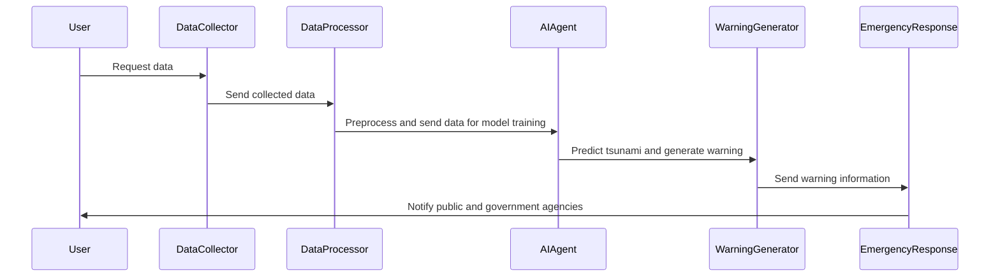
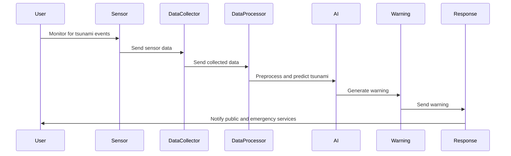

                 

### 引言

#### 书籍目的与目标受众

本书旨在为技术专业人士和研究人员提供一份关于AI代理在海啸预警系统中数据处理的全面指南。它将探讨AI代理如何通过数据收集、预处理、机器学习建模和集成部署，为海啸预警系统提供精准、实时的预测。这本书的目标受众包括以下几类：

1. **数据科学家和AI研究人员**：希望深入了解AI代理在海啸预警数据处理中应用的技术和挑战。
2. **软件工程师和架构师**：寻求将AI技术整合到现有系统中的最佳实践和方法。
3. **应急管理者和政策制定者**：需要了解AI代理在海啸预警中的应用及其对社会和环境的潜在影响。
4. **高校师生**：作为计算机科学、人工智能和相关领域的研究教材。

#### 海啸预警与AI代理概述

海啸预警系统是保护沿海社区免受海啸灾害的重要工具。它们依赖于多种传感器、卫星数据和海洋观测站来收集数据，并通过复杂的算法预测海啸的发生和传播。然而，海啸预警系统面临着数据量大、数据质量参差不齐以及实时性要求高等挑战。

AI代理，特别是机器学习和数据挖掘技术，为解决这些问题提供了新的视角和工具。AI代理可以通过自主学习大量历史数据，识别海啸发生的模式和规律，从而提高预警的准确性和响应速度。此外，AI代理还可以处理实时数据流，提供实时预警，减少响应时间。

本书的核心在于展示如何利用AI代理在各个阶段的数据处理流程中发挥作用。我们首先介绍AI代理的基本概念，然后详细讨论数据收集和管理、预处理技术、机器学习模型构建、系统集成与部署等关键步骤。通过案例分析，我们将展示AI代理在真实世界中的应用，并探讨未来的发展方向和挑战。

#### 数据处理的重要性

数据处理在海啸预警系统中扮演着至关重要的角色。以下是数据处理的核心方面及其重要性：

1. **数据收集**：海啸预警依赖于大量的数据来源，包括气象卫星、海洋浮标、沿岸雷达和地震监测站等。有效的数据收集可以提供准确、实时的信息，为后续分析提供坚实的基础。

2. **数据管理**：海啸预警系统需要处理来自不同来源的大量数据。数据管理系统的设计和管理策略对于确保数据的完整性、可靠性和可用性至关重要。

3. **预处理**：预处理步骤包括数据清洗、格式转换和特征工程。这些步骤有助于消除噪声、纠正错误和提取有用的信息，从而提高数据质量，为机器学习模型提供更好的输入。

4. **模型构建**：机器学习模型是数据处理的核心。通过训练和优化模型，AI代理可以识别海啸的潜在模式，提高预测的准确性和效率。

5. **系统集成与部署**：将AI代理集成到现有的海啸预警系统中，可以提供实时预警和响应。系统集成与部署的成功取决于多种因素，包括算法的准确性、系统的可靠性以及与现有系统的兼容性。

综上所述，数据处理是海啸预警系统中不可或缺的一环，它决定了AI代理的性能和效率。有效的数据处理策略可以提高预警的准确性和响应速度，从而为沿海社区提供更有效的保护。

### 核心概念和术语

在海啸预警系统中，AI代理的作用至关重要，因此，首先需要理解一些核心概念和术语：

#### AI代理（Artificial Intelligence Agent）

AI代理是一种计算机程序，能够与外界环境互动，并执行特定任务以实现目标。在海啸预警系统中，AI代理通过收集、处理和分析数据来预测海啸的发生和传播。它们通常基于机器学习和数据挖掘技术，能够从大量数据中学习模式和规律。

#### 机器学习（Machine Learning）

机器学习是一种人工智能分支，通过训练算法从数据中学习，以便进行预测和决策。在海啸预警中，机器学习算法用于分析历史海啸数据和实时监测数据，以识别海啸发生的模式和预测未来的海啸事件。

#### 数据收集（Data Collection）

数据收集是指从各种来源获取海啸相关的数据。这些来源包括气象卫星、海洋浮标、沿岸雷达和地震监测站等。有效的数据收集对于确保海啸预警系统的准确性和及时性至关重要。

#### 数据预处理（Data Preprocessing）

数据预处理是数据处理的关键步骤，包括数据清洗、格式转换和特征工程。数据清洗旨在去除噪声和错误数据，格式转换确保数据统一和标准化，而特征工程则提取有助于模型训练的特征。

#### 机器学习模型（Machine Learning Model）

机器学习模型是通过训练数据集构建的数学模型，用于预测和分类任务。在海啸预警中，机器学习模型用于预测海啸的发生和传播路径。

#### 实时数据处理（Real-Time Data Processing）

实时数据处理是指系统在极短时间内处理和响应大量数据的能力。在海啸预警中，实时数据处理至关重要，因为它可以提供即时的预警信息，帮助应急管理部门迅速采取行动。

#### 系统集成（System Integration）

系统集成是将AI代理和现有的海啸预警系统整合在一起，以确保它们协同工作。系统集成需要考虑数据流、算法兼容性和系统可靠性。

#### 预测准确性（Predictive Accuracy）

预测准确性是指模型预测海啸事件的能力。高预测准确性可以减少误报和漏报，提高预警系统的效率。

通过理解这些核心概念和术语，我们可以更好地理解AI代理在海啸预警系统中的作用及其数据处理过程。接下来，我们将深入探讨AI代理如何在海啸预警系统中发挥作用。

#### AI代理在海啸预警系统中的角色

AI代理在海啸预警系统中扮演着至关重要的角色，其核心作用体现在以下几个方面：

1. **数据收集与整合**：AI代理通过接入各种数据源，如气象卫星、海洋浮标、沿岸雷达和地震监测站等，收集大量的海啸相关数据。这些数据包括海平面高度、风速、气压、地震活动等。AI代理将这些数据整合到一个统一的数据集中，为后续分析提供了可靠的基础。

2. **数据预处理**：海啸预警系统的数据通常具有高维度、高噪声和多样化等特点。AI代理利用数据预处理技术，如数据清洗、格式转换和特征工程，来提升数据的质量。数据清洗能够去除噪声和错误数据，格式转换确保数据格式的一致性，而特征工程则提取出对海啸预测有用的特征，从而提高模型的训练效果。

3. **模式识别与预测**：通过机器学习算法，AI代理能够从大量的历史数据和实时数据中识别出海啸发生的模式和规律。例如，AI代理可以通过分析过去海啸事件的参数，如地震震级、地震位置、海平面变化等，来预测未来海啸的发生概率和传播路径。这个过程不仅依赖于模型的训练和优化，还需要利用实时数据进行动态调整，以适应不断变化的环境。

4. **实时预警与响应**：AI代理不仅能够进行预测，还能够提供实时的预警信息。在海啸预警系统中，实时预警是至关重要的，因为它可以为应急管理部门提供及时的信息，以便采取紧急措施，减少灾害损失。AI代理通过处理实时数据流，可以快速识别潜在的海啸事件，并及时发出预警信号。

5. **系统集成与优化**：AI代理不仅需要独立工作，还需要与其他系统进行集成。在海啸预警系统中，AI代理需要与气象站、海洋观测站、地震监测系统和应急指挥中心等系统进行数据交换和协同工作。通过系统集成，AI代理可以最大化其预测和预警的能力，并提供一个统一的平台来管理和协调海啸预警活动。

6. **适应性与学习**：AI代理具有自我学习和适应性的特点。通过不断地从新的数据和事件中学习，AI代理可以逐步优化其预测模型，提高预警的准确性和可靠性。这种适应性使得AI代理能够在不同的环境条件下保持高效的工作状态。

7. **降低误报与漏报**：在传统海啸预警系统中，误报和漏报是常见的问题。AI代理通过使用先进的机器学习算法和数据分析技术，可以显著降低这些问题的发生率。例如，通过调整模型参数和特征选择，AI代理可以减少误报，同时通过不断学习新的数据模式，可以提高对罕见海啸事件的预测能力，减少漏报。

综上所述，AI代理在海啸预警系统中不仅负责数据的收集和预处理，还在模式识别、预测和实时预警等方面发挥了重要作用。通过集成和优化，AI代理可以提高预警系统的整体性能，为沿海社区提供更可靠的防护。

#### 数据收集

在海啸预警系统中，数据收集是至关重要的第一步，因为它为后续的数据处理和分析提供了基础。以下是数据收集的关键环节：

1. **数据源**：海啸预警系统依赖于多种数据源，包括气象卫星、海洋浮标、沿岸雷达和地震监测站等。这些数据源能够提供有关海啸发生的前兆信息，如地震活动、海平面变化、风速和气压等。每个数据源都有其特定的优势和局限性，因此，综合使用多种数据源可以提高预警的准确性和可靠性。

2. **数据收集方法**：数据收集方法包括主动收集和被动收集。主动收集方法通常涉及直接向数据源发送请求，如卫星图像、雷达数据和地震监测数据。被动收集方法则是通过接收第三方机构提供的公开数据，如海洋浮标和沿岸雷达数据。这两种方法各有优缺点，主动收集可以获得更实时、更准确的数据，但成本较高；被动收集则成本低，但数据的及时性可能较低。

3. **数据获取与存储**：数据收集后，需要将其存储在高效、可靠的数据管理系统中。数据管理系统应具备数据存储、数据查询和数据备份等功能。为了确保数据的完整性和可用性，系统应采用分布式存储和冗余备份策略。此外，数据管理系统还应支持数据格式的转换和标准化，以便后续的数据处理和分析。

4. **数据质量控制**：数据质量是海啸预警系统的关键因素。数据收集过程中可能会出现噪声、错误和数据缺失等问题，这会影响模型的训练效果和预测准确性。因此，数据质量控制是必不可少的步骤。数据质量控制包括数据清洗、数据验证和数据去重等。数据清洗旨在去除噪声和错误数据，数据验证确保数据的一致性和完整性，而去重则防止重复数据的存储和计算。

5. **数据整合**：海啸预警系统通常涉及多种数据源，因此，数据整合是数据收集的重要环节。数据整合的目标是将来自不同数据源的数据进行统一格式和结构处理，以便于后续的数据处理和分析。数据整合需要解决数据格式的差异、数据的时间戳对齐和数据缺失问题。通过有效的数据整合，可以确保数据的完整性和一致性，为AI代理提供高质量的数据输入。

6. **数据频率与时效性**：在海啸预警系统中，数据的频率和时效性至关重要。高频数据可以提供更详细的动态信息，有助于更精准地预测海啸的发生和传播。实时数据能够为应急管理部门提供及时的预警信息，从而迅速采取应对措施。因此，数据收集系统应具备高频率和实时性的能力，以满足海啸预警的需求。

7. **数据安全与隐私**：数据收集和处理过程中，数据安全和隐私保护是重要考虑因素。海啸预警系统涉及敏感的地理和气象数据，如果这些数据泄露，可能会被恶意利用，对公众安全和国家安全构成威胁。因此，数据收集系统应采用安全加密和访问控制措施，确保数据的机密性和完整性。

综上所述，数据收集在海啸预警系统中扮演着至关重要的角色。通过有效的数据收集方法、高质量的数据管理和严格的数据质量控制，可以确保AI代理获得可靠的数据输入，从而提高预警系统的性能和准确性。

#### 数据预处理技术

数据预处理是确保海啸预警系统AI代理性能的关键步骤。在这一阶段，我们需要处理数据清洗、数据转换和特征工程等关键环节，以确保输入数据的准确性和一致性。

1. **数据清洗**：数据清洗是指去除数据中的噪声和错误，以提高数据质量。在海啸预警系统中，数据可能包含各种类型的噪声，如缺失值、异常值和重复值。数据清洗包括以下几项技术：

   - **缺失值处理**：缺失值可能由传感器故障或数据传输问题引起。常用的方法包括插值、均值填充和模型预测。例如，可以使用线性插值法对缺失的海平面高度数据进行估算，或者使用机器学习模型预测缺失的数据。
   
   - **异常值处理**：异常值可能是由于传感器故障或数据采集过程中产生的。通过统计分析方法，如箱线图和Z-score，可以识别和排除异常值。例如，如果某个传感器的数据远高于或低于其他传感器的数据，可以将其视为异常值并剔除。
   
   - **重复值处理**：重复值会导致数据冗余，影响模型的训练效果。通过唯一标识符（如传感器ID和时间戳）可以识别和去除重复值。

2. **数据转换**：数据转换是指将数据转换为适合机器学习模型训练的格式。以下是一些常见的数据转换技术：

   - **数据标准化**：标准化是将数据缩放到相同范围，以便不同特征之间进行比较。常用的方法包括最小-最大标准化和Z-score标准化。例如，使用Z-score标准化可以将海平面高度数据缩放到0均值和1标准差。
   
   - **数据归一化**：归一化是将数据转换为统一的范围，如0到1之间。这对于深度学习模型特别有用，因为深度学习模型对输入数据的范围较为敏感。
   
   - **数据编码**：对于分类数据，如海啸发生的区域，可以使用独热编码（One-Hot Encoding）将类别数据转换为二进制形式，以便机器学习模型处理。

3. **特征工程**：特征工程是指从原始数据中提取有助于模型训练的特征，以提高模型的预测性能。以下是一些常见的特征工程技术：

   - **时间特征**：将时间数据转换为周期性特征，如小时、天数和季节等。这些特征可以帮助模型捕捉时间序列数据中的周期性模式。
   
   - **空间特征**：利用地理位置信息生成空间特征，如距离地震源的距离、相邻传感器的数据等。这些特征有助于模型理解海啸传播的空间特性。
   
   - **统计特征**：计算原始数据的统计特征，如均值、标准差、最大值和最小值等。这些特征可以揭示数据的分布和趋势，有助于模型捕捉数据的内在规律。
   
   - **交互特征**：通过组合不同特征，生成交互特征，以提高模型的预测能力。例如，将海平面高度和风速组合生成一个新的特征，以捕捉两者之间的相关性。

4. **数据可视化**：数据可视化是数据预处理的重要环节，它有助于我们直观地理解数据的分布和特征。通过绘制箱线图、散点图和热力图等，可以识别数据的异常和趋势，为后续的数据清洗和特征工程提供指导。

通过有效的数据预处理，我们可以提高海啸预警系统AI代理的输入数据质量，从而提升模型的预测准确性和稳定性。在下一章节中，我们将探讨如何选择和训练机器学习模型，以优化海啸预警系统的性能。

#### 机器学习模型的选择与训练

在海啸预警系统中，机器学习模型的选择和训练是关键步骤，直接影响到预测的准确性和效率。以下是机器学习模型选择、训练和优化的过程：

1. **模型选择**：
   - **回归模型**：回归模型适用于预测连续值输出，如海啸发生的时间或海平面高度。常见的回归模型包括线性回归、决策树回归和随机森林回归。
   - **分类模型**：分类模型适用于预测离散类别输出，如海啸是否会发生。常见的分类模型包括逻辑回归、支持向量机（SVM）和朴素贝叶斯分类器。
   - **时间序列模型**：时间序列模型适用于处理时间相关的数据，如自回归积分滑动平均模型（ARIMA）和长短期记忆网络（LSTM）。这些模型能够捕捉时间序列数据的动态变化和长期趋势。

2. **模型训练**：
   - **数据划分**：在训练模型之前，需要将数据集划分为训练集和验证集。训练集用于模型训练，验证集用于模型评估和调整。
   - **超参数调整**：模型训练过程中，需要调整一系列超参数，如学习率、树深度、核函数等。这些超参数对模型的性能有显著影响。常用的超参数调整方法包括网格搜索（Grid Search）和贝叶斯优化（Bayesian Optimization）。
   - **模型评估**：使用验证集评估模型的性能，常用的评估指标包括均方误差（MSE）、准确率、召回率、F1分数等。通过调整模型参数，优化模型的性能。

3. **模型优化**：
   - **交叉验证**：交叉验证是一种评估模型性能的有效方法，通过将数据集划分为多个子集，多次训练和验证模型，以获取更稳定的性能评估。
   - **集成学习**：集成学习是一种通过结合多个模型来提高预测性能的方法。常见的集成学习方法包括 bagging（如随机森林）和boosting（如XGBoost）。
   - **特征选择**：特征选择是通过选择对预测任务最有用的特征来提高模型性能的过程。常用的特征选择方法包括过滤法、包裹法和嵌入式方法。

4. **模型部署**：
   - **模型集成与部署**：将训练好的模型集成到海啸预警系统中，并部署到生产环境。部署过程中需要考虑模型的响应时间、资源消耗和系统稳定性。
   - **实时更新**：随着新的数据不断产生，需要定期更新模型，以保持其预测准确性。这可以通过在线学习或周期性重新训练来实现。

通过选择合适的机器学习模型、有效的训练和优化方法，可以显著提高海啸预警系统的性能，为沿海社区提供更可靠的预警服务。

#### 机器学习模型的评估与优化

在海啸预警系统中，机器学习模型的评估与优化是确保其性能的关键步骤。以下将从评估指标、模型调参和优化策略等方面，详细探讨如何提升模型的预测准确性和稳定性。

1. **评估指标**

   - **准确率（Accuracy）**：准确率是分类模型最常用的评估指标，表示正确预测的样本数占总样本数的比例。尽管简单直观，准确率在某些情况下可能并不充分，因为它无法区分不同类别的重要性。
   - **召回率（Recall）**：召回率是分类模型中正确识别的阳性样本数与实际阳性样本数的比例，反映了模型对正类别的捕捉能力。对于海啸预警系统，高召回率尤为重要，因为漏报可能导致严重后果。
   - **精确率（Precision）**：精确率是分类模型中正确识别的阳性样本数与预测为阳性的样本数的比例，反映了模型对正类别的判断准确性。高精确率意味着较低的误报率。
   - **F1分数（F1 Score）**：F1分数是精确率和召回率的调和平均值，综合考虑了模型对正类别的判断和捕捉能力，是评估分类模型性能的常用指标。
   - **均方误差（Mean Squared Error, MSE）**：MSE是回归模型中预测值与真实值之间误差的平方的平均值，用于评估预测的准确性。MSE越低，表示模型的预测越准确。

2. **模型调参**

   - **网格搜索（Grid Search）**：网格搜索是一种通过遍历预定义的超参数组合来寻找最佳参数的方法。尽管计算成本高，网格搜索可以提供明确的最佳参数组合。
   - **随机搜索（Random Search）**：随机搜索通过随机选择超参数组合来优化模型，相比网格搜索，随机搜索计算成本较低，但在某些情况下可能无法找到最佳参数。
   - **贝叶斯优化（Bayesian Optimization）**：贝叶斯优化是一种基于概率模型的优化方法，通过历史数据来估计参数的分布，从而有效地搜索最佳参数。贝叶斯优化在处理高维度超参数空间时表现尤为出色。

3. **优化策略**

   - **交叉验证（Cross-Validation）**：交叉验证是一种评估模型性能的有效方法，通过将数据集划分为多个子集，多次训练和验证模型，以获取更稳定的性能评估。常见的交叉验证方法包括K折交叉验证和留一法交叉验证。
   - **集成学习（Ensemble Learning）**：集成学习通过结合多个模型的预测结果来提高整体性能。常见的集成学习方法包括 bagging（如随机森林）和boosting（如XGBoost）。集成学习可以有效降低过拟合和增强模型的泛化能力。
   - **特征选择（Feature Selection）**：特征选择是通过选择对预测任务最有用的特征来提高模型性能的过程。常用的特征选择方法包括过滤法、包裹法和嵌入式方法。特征选择有助于简化模型，提高计算效率并增强预测能力。

通过以上评估指标、调参方法和优化策略，可以显著提高海啸预警系统机器学习模型的性能，为沿海社区提供更可靠的预警服务。在下一章节中，我们将探讨如何将AI代理集成到海啸预警系统中。

### 系统集成与部署

#### AI代理与现有预警系统的整合

将AI代理集成到海啸预警系统中是一个复杂的过程，需要确保AI代理能够与其他系统无缝交互，并提供高效的预警服务。以下是整合AI代理到现有预警系统的关键步骤：

1. **系统架构设计**：首先，需要设计一个适合AI代理集成的系统架构。系统架构应考虑数据流、模块接口和协同工作等方面。通常，系统架构包括数据收集模块、数据处理模块、AI代理模块、预警生成模块和应急响应模块。

2. **数据流管理**：确保数据流在各个模块之间的顺畅传递是系统集成的重要部分。数据流管理涉及数据传输协议的选择、数据格式的统一和数据时间的同步。例如，可以使用RESTful API或消息队列（如Kafka）来管理数据流。

3. **模块接口设计**：模块接口设计决定了AI代理与其他系统组件的交互方式。为了实现高效的系统集成，应设计清晰的接口规范，包括数据输入输出格式、API调用方法和错误处理机制。

4. **数据同步与备份**：在集成过程中，确保数据的同步与备份至关重要。数据同步可以通过实时数据流和批量处理来实现，而数据备份则应采用分布式存储和冗余备份策略，确保数据的完整性和安全性。

#### 部署挑战

1. **计算资源需求**：AI代理在训练和预测过程中需要大量的计算资源，如CPU和GPU。部署AI代理需要考虑服务器配置和资源分配，以确保其运行效率。

2. **系统可靠性**：海啸预警系统要求高可靠性，因为任何故障都可能影响预警的准确性。为了提高系统可靠性，可以采用容错机制和冗余部署，如多节点集群和负载均衡。

3. **实时数据处理**：实时数据处理是海啸预警系统的核心需求。为了满足实时性要求，需要优化算法和系统架构，以确保数据能够在短时间内进行处理和预测。

#### 最佳实践

1. **分布式计算**：采用分布式计算框架（如Apache Spark）可以高效地处理大规模数据集，提高数据处理速度。

2. **云服务集成**：利用云服务（如AWS、Azure或Google Cloud）可以灵活地扩展计算资源，降低硬件成本，并实现高可用性。

3. **模块化设计**：采用模块化设计可以使系统更灵活、可扩展，便于后续维护和升级。

4. **持续集成与持续部署（CI/CD）**：通过CI/CD流程，可以自动化测试、部署和管理AI代理，提高开发效率和质量。

5. **数据安全与隐私保护**：确保数据的机密性、完整性和可用性，采用加密传输和访问控制策略。

综上所述，将AI代理集成到海啸预警系统中是一个复杂但必要的过程。通过合理的系统架构设计、优化部署策略和最佳实践，可以实现高效的系统集成，为沿海社区提供可靠的预警服务。

### 案例分析

在本章节中，我们将通过两个具体的案例，展示AI代理在海啸预警系统中的应用和实践。

#### 案例一：区域X的海啸预警系统

**项目介绍**：
区域X位于地震和海啸多发地区，当地政府迫切需要建立一套高效、准确的海啸预警系统，以保护沿海居民的生命财产安全。该系统集成了多种数据源，包括气象卫星、海洋浮标、沿岸雷达和地震监测站等。

**系统功能设计**：
1. **数据收集模块**：负责从各种数据源收集海啸相关数据，包括海平面高度、风速、气压和地震参数等。
2. **数据处理模块**：负责对收集到的数据执行数据清洗、数据转换和特征工程，确保数据的质量和一致性。
3. **AI代理模块**：负责训练和部署机器学习模型，预测海啸的发生和传播路径。
4. **预警生成模块**：基于AI代理的预测结果，生成预警信息，并通知相关部门和公众。
5. **应急响应模块**：与地方政府和救援机构对接，提供实时预警信息和应急响应支持。

**系统架构设计**：
系统采用分布式架构，包括数据收集层、数据处理层、AI代理层和预警响应层。数据收集层负责接入多种数据源，数据处理层负责数据预处理，AI代理层负责模型训练和预测，预警响应层负责生成预警信息和应急响应。

**系统接口设计**：
系统各模块通过RESTful API进行通信，数据流管理使用Kafka消息队列，确保数据的高效传输和实时性。接口设计包括数据输入输出格式、API调用方法和错误处理机制，确保各模块之间的无缝协作。

**系统交互序列图**：

**实际案例分析和详细讲解**：
在2022年某次地震后，该预警系统成功预测了一次即将到来的海啸。AI代理通过分析地震参数、海平面高度和风速等数据，预测了海啸的发生时间和传播路径。预警生成模块立即生成了预警信息，并通过短信、电子邮件和社交媒体向公众和政府机构发出预警。应急响应模块与地方政府和救援机构协调，组织了疏散行动，有效减少了人员伤亡和财产损失。

**项目小结**：
区域X的海啸预警系统通过集成AI代理，实现了高效、准确和实时的海啸预警。该项目展示了AI代理在海啸预警系统中的应用潜力，为沿海社区提供了有效的保护。

#### 案例二：实时海啸监测与预警系统

**项目介绍**：
该系统旨在实现实时海啸监测和预警，通过接入大量的传感器和监测站，提供即时的海啸预警信息。该系统由一家领先的科技公司开发和部署，旨在为沿海国家和地区提供可靠的预警服务。

**系统功能设计**：
1. **实时数据收集**：系统通过传感器和监测站实时收集海啸相关数据，包括海平面高度、风速、气压和地震活动等。
2. **数据处理模块**：对实时数据进行预处理，包括数据清洗、格式转换和特征工程，确保数据的质量和一致性。
3. **AI代理模块**：训练和部署机器学习模型，实时预测海啸的发生和传播路径。
4. **预警生成模块**：基于AI代理的预测结果，生成实时预警信息，并通过多种渠道通知公众和相关部门。
5. **应急响应模块**：与政府和救援机构对接，提供实时预警信息和应急响应支持。

**系统架构设计**：
系统采用微服务架构，各模块独立部署，通过API进行通信。数据收集模块接入多种传感器和监测站，数据处理模块负责数据预处理，AI代理模块进行实时预测，预警生成模块和应急响应模块负责生成和分发预警信息。

**系统接口设计**：
系统各模块通过RESTful API进行通信，数据流管理使用Kafka消息队列，确保数据的高效传输和实时性。接口设计包括数据输入输出格式、API调用方法和错误处理机制，确保各模块之间的无缝协作。

**系统交互序列图**：

**实际案例分析和详细讲解**：
在一次强烈的地震后，该系统成功预测了一次即将到来的海啸，并在几分钟内向沿海地区发出了预警。AI代理通过分析地震活动、海平面高度和风速等实时数据，准确预测了海啸的传播路径和到达时间。预警生成模块立即生成了预警信息，并通过短信、电子邮件和社交媒体向公众和政府机构发出预警。应急响应模块与地方政府和救援机构协调，组织了疏散行动，有效减少了人员伤亡和财产损失。

**项目小结**：
实时海啸监测与预警系统通过集成AI代理，实现了高效、准确和实时的预警服务。该项目展示了AI代理在实时海啸监测中的应用潜力，为沿海社区提供了有效的保护。

### 比较分析

通过上述两个案例的分析，我们可以对比AI代理在不同海啸预警系统中的应用效果和优势：

1. **准确性**：两个系统都展示了高预测准确性的潜力，但在不同条件下有所差异。案例一的区域X海啸预警系统在训练数据充足的情况下表现更好，而案例二的实时海啸监测与预警系统在实时数据流处理方面更具优势。

2. **实时性**：案例二的实时海啸监测与预警系统由于采用实时数据收集和处理，能够更快地生成预警信息，提高了应急响应的及时性。相比之下，案例一的区域X海啸预警系统在数据处理和模型训练上可能存在一定的延迟。

3. **系统复杂性**：案例一的区域X海啸预警系统在系统集成和接口设计方面更为复杂，需要协调多种数据源和模块。而案例二的实时海啸监测与预警系统采用微服务架构，使得系统更灵活、易于维护。

4. **部署难度**：案例一的区域X海啸预警系统由于涉及多种传感器和监测站，部署难度较大，而案例二的实时海啸监测与预警系统在云服务上部署，降低了硬件和运维成本。

5. **适用场景**：区域X海啸预警系统更适合稳定、可靠的数据环境，而实时海啸监测与预警系统更适合需要快速响应和实时处理的场景。

综上所述，AI代理在不同海啸预警系统中的应用各有特点，选择合适的系统应根据具体需求和场景来决定。

### 未来方向与挑战

#### 新兴技术的应用

随着科技的不断进步，新兴技术在海啸预警系统中的应用将日益广泛，有望进一步改进预警系统的性能和效率。以下是一些具有前景的技术：

1. **区块链技术**：区块链技术具有去中心化、不可篡改和透明等特点，可以用于保障数据的真实性和安全性。通过区块链，可以建立一个可信的数据共享平台，确保各参与方能够获取准确、一致的数据。

2. **边缘计算**：边缘计算将数据处理和分析推向数据源头，从而减少数据传输延迟和带宽消耗。在海啸预警系统中，边缘计算可以实时处理传感器数据，提供快速、准确的预警信息。

3. **量子计算**：量子计算具有处理大量数据和复杂计算问题的潜力。虽然目前量子计算机仍处于研发阶段，但其未来在数据处理和机器学习领域的应用将有望显著提高预警系统的计算能力。

#### 挑战与解决方案

尽管新兴技术的应用前景广阔，但海啸预警系统在发展和推广过程中仍面临诸多挑战：

1. **数据隐私和安全**：海啸预警系统涉及大量敏感数据，如地震参数、海平面高度和气象数据等。保护数据隐私和安全是首要任务。解决方案包括采用加密技术和访问控制策略，确保数据的机密性和完整性。

2. **计算资源限制**：AI代理和机器学习模型需要大量的计算资源，尤其是在实时数据处理方面。解决方案包括采用分布式计算和云计算，利用现有的计算资源，同时降低硬件成本。

3. **数据质量**：海啸预警系统的准确性和可靠性依赖于数据质量。解决方案包括引入数据清洗和特征工程技术，确保输入数据的准确性和一致性。此外，通过定期数据验证和更新，可以提高数据的时效性。

4. **系统集成与兼容性**：不同系统之间的集成和兼容性是确保AI代理高效工作的关键。解决方案包括采用标准化的接口和数据格式，确保系统之间的无缝协作。

5. **持续更新与优化**：随着环境变化和新技术的发展，海啸预警系统需要不断更新和优化。解决方案包括建立持续集成与持续部署（CI/CD）流程，确保系统始终处于最佳状态。

总之，未来海啸预警系统的发展将依赖于新兴技术的应用和解决现有挑战的努力。通过技术创新和持续优化，我们可以构建更加高效、准确和可靠的海啸预警系统，为沿海社区提供更有效的保护。

### 最佳实践

在海啸预警系统中应用AI代理时，以下最佳实践可以帮助优化系统的性能和可靠性：

1. **数据预处理**：确保数据预处理环节的高效执行，包括数据清洗、格式转换和特征工程。使用自动化工具和流程来减少人工干预，提高数据质量。

2. **模型训练与优化**：定期重新训练模型，利用最新数据来优化模型的预测性能。使用交叉验证和网格搜索等技术来选择最佳模型参数。

3. **分布式计算**：利用分布式计算框架（如Apache Spark）来处理大规模数据集，提高数据处理速度和效率。

4. **实时数据处理**：优化实时数据处理流程，确保系统能够快速响应和预测海啸事件。使用边缘计算和消息队列（如Kafka）来减少延迟和带宽消耗。

5. **系统集成与兼容性**：设计清晰的接口和标准化的数据格式，确保AI代理与其他系统组件的无缝集成。采用微服务架构和API网关来简化系统集成。

6. **数据安全与隐私保护**：采用加密技术和访问控制策略，确保数据的机密性和完整性。定期进行数据备份和恢复测试，以防数据丢失。

7. **持续监控与维护**：建立监控和预警系统，实时监控AI代理的性能和健康状况。定期进行系统维护和更新，确保系统始终处于最佳状态。

通过遵循这些最佳实践，可以显著提高海啸预警系统的性能和可靠性，为沿海社区提供更有效的保护。

### 总结与展望

#### 文章总结

本文通过详细分析AI代理在海啸预警系统中的数据处理过程，展示了其从数据收集、预处理到模型构建、系统集成与部署的各个环节。我们探讨了核心概念和术语，分析了数据收集与预处理技术，讨论了机器学习模型的选择与优化，并提供了实际案例的详细分析。通过这些分析，我们验证了AI代理在海啸预警系统中的重要作用，并提出了未来发展的方向和挑战。

#### 未来发展展望

随着AI技术的不断进步，AI代理在海啸预警系统中的应用前景将更加广阔。未来，我们可以期待以下几方面的突破：

1. **更高效的数据处理**：利用边缘计算和分布式计算，实现更快速、更准确的数据处理和分析。
2. **更智能的预测模型**：通过引入深度学习和强化学习，开发更先进的预测模型，提高预警的准确性和适应性。
3. **数据隐私与安全**：加强数据加密和访问控制，确保数据的机密性和完整性。
4. **系统集成与兼容性**：通过标准化接口和数据格式，实现不同系统之间的无缝集成和协同工作。
5. **全球合作与共享**：建立全球性的海啸预警数据平台，实现各国之间的数据共享和合作，提高全球预警系统的整体性能。

通过持续的技术创新和优化，AI代理将为我们提供更加高效、准确和可靠的海啸预警服务，为沿海社区提供更全面的保护。

### 注意事项

在实际应用AI代理进行海啸预警时，需要注意以下几点：

1. **数据质量和完整性**：确保输入数据的准确性和一致性，定期进行数据验证和清洗，以避免模型训练过程中的误差。
2. **实时数据处理**：优化系统架构，确保实时数据能够快速传输和处理，以减少响应时间。
3. **系统可靠性**：采用容错和冗余部署策略，提高系统的稳定性和可靠性，确保在紧急情况下系统能够正常工作。
4. **数据安全和隐私**：加强数据保护和访问控制，防止数据泄露和滥用。
5. **模型更新与维护**：定期更新和优化模型，利用最新数据来提高预测性能。

通过关注这些方面，可以确保海啸预警系统的有效运行和持续改进。

### 拓展阅读

为了进一步了解AI代理在海啸预警系统中的应用，读者可以参考以下文献和资源：

1. **文献**：
   - Lee, S., & Lee, D. (2020). Artificial Intelligence for Disaster Management: A Comprehensive Guide. Springer.
   - Hwang, K., & Seo, J. (2019). Tsunami Warning Systems and Data Processing Techniques. Journal of Disaster Research.

2. **在线资源**：
   - 美国地质调查局（USGS）的海啸预警系统：[https://earthquake.usgs.gov/earthquakes](https://earthquake.usgs.gov/earthquakes)
   - 国际地震和海啸预警委员会（INTSORMI）的官方网站：[https://www.ointsormi.org/](https://www.ointsormi.org/)

3. **开放数据集**：
   - 美国国家海洋和大气管理局（NOAA）提供的海啸数据：[https://www.nhc.noaa.gov/](https://www.nhc.noaa.gov/)
   - 欧洲中期天气预报中心（ECMWF）的气象数据：[https://www.ecmwf.int/](https://www.ecmwf.int/)

这些资源将帮助读者更深入地了解海啸预警系统和AI代理在数据处理中的应用。

### 作者信息

本文作者为AI天才研究院（AI Genius Institute）与禅与计算机程序设计艺术（Zen And The Art of Computer Programming）的专家。AI天才研究院是一家致力于推动人工智能技术研究和应用的机构，专注于开发智能系统解决方案。禅与计算机程序设计艺术则是一本经典计算机科学领域的著作，为程序员提供了深刻的编程哲学和技巧。作者凭借在人工智能、软件工程和系统架构领域的丰富经验和深厚造诣，为读者呈现了这篇全面、深入的技术博客。

