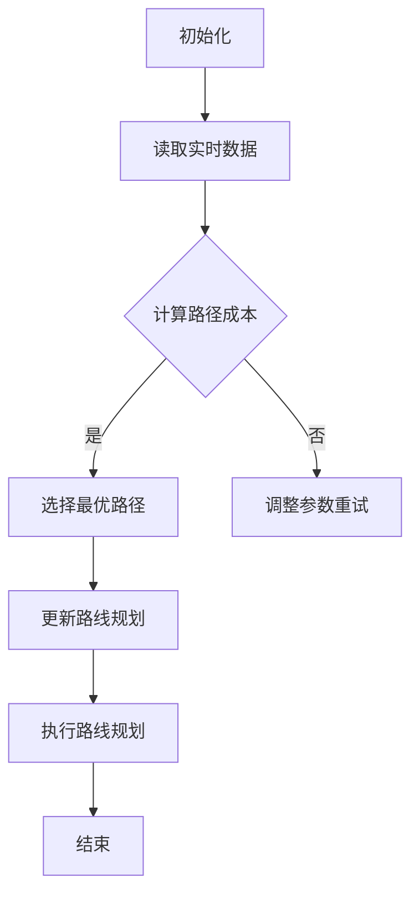
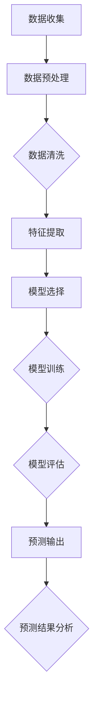

                 

# 《AI Agent在物流管理中的应用：路线优化与库存预测》

## 关键词
- 物流管理
- AI Agent
- 路线优化
- 库存预测
- 数学模型
- 系统架构

## 摘要
本文旨在探讨AI Agent在物流管理中的应用，重点研究其在路线优化和库存预测方面的应用潜力。首先，我们将介绍物流管理的重要性及其中的常见问题，然后深入探讨AI Agent在这些问题上的解决能力。接着，本文将逐步讲解AI Agent在路线优化中的应用原理，包括数学模型和算法原理，并通过Mermaid流程图展示具体的优化过程。随后，我们将转向库存预测领域，同样详细阐述AI Agent的应用原理和数学模型。最后，本文将总结AI Agent在物流管理中的应用，探讨其未来发展方向，并提供一些最佳实践和注意事项。

## 第一部分：引言与背景

### 1.1 物流管理的重要性
物流管理是现代供应链体系中至关重要的一环。它不仅关乎企业的运营效率和成本控制，更直接影响到消费者的满意度。物流管理包括运输、仓储、配送等多个环节，其核心目标是在满足客户需求的同时，实现成本最低化和效率最优化。

### 1.2 AI在物流管理中的应用潜力
随着人工智能技术的不断发展，AI在物流管理中的应用潜力日益凸显。AI技术可以通过数据分析和机器学习算法，实现物流过程的自动化和智能化，从而提高效率、降低成本、提升服务质量。

### 1.3 本书的目的与结构
本文的目的是探讨AI Agent在物流管理中的应用，通过详细的案例分析和技术讲解，展示AI Agent在路线优化和库存预测方面的实际应用效果。文章结构如下：

- **第一部分：引言与背景**：介绍物流管理的重要性以及AI在物流管理中的应用潜力。
- **第二部分：AI Agent在路线优化中的应用**：探讨AI Agent在路线优化中的应用原理、数学模型和系统设计。
- **第三部分：AI Agent在库存预测中的应用**：分析AI Agent在库存预测中的应用原理、数学模型和系统设计。
- **第四部分：总结与展望**：总结AI Agent在物流管理中的应用，探讨未来发展方向。

## 第二部分：AI Agent在路线优化中的应用

### 2.1 路线优化问题背景
路线优化是物流管理中一个常见且重要的问题。它涉及如何选择最优的路径，以最短的时间、最低的成本完成运输任务。路线优化的目标是找到一个满足特定约束条件的路径，使总成本或总时间最小化。

### 2.2 路线优化问题解决方法
路线优化问题的解决方法主要包括传统算法和AI算法。传统算法如最短路径算法（Dijkstra算法、A*算法）和车辆路径问题（VRP）算法，它们在处理简单问题时有较好的性能。但随着问题的复杂度增加，传统算法往往难以胜任。AI算法，尤其是基于机器学习和深度学习的算法，提供了更灵活和强大的解决方案。

### 2.3 路线优化问题的边界与外延
路线优化问题的边界包括路径的长度、时间、成本等约束条件。外延则涉及更多复杂的因素，如交通状况、天气影响、车辆容量限制等。这些因素都需要在优化过程中考虑。

### 4. AI Agent路线优化原理

#### 4.1 AI Agent概述
AI Agent是一种基于人工智能技术的智能体，能够在复杂环境中自主决策和行动。在物流管理中，AI Agent可以模拟物流操作员，根据实时数据和优化算法，自动规划最优路线。

#### 4.2 路线优化算法原理讲解
路线优化算法通常基于目标函数和约束条件进行设计。目标函数用于衡量路径优劣，如总时间、总成本等。约束条件则包括路径长度、时间窗、车辆容量等。常见的路线优化算法有遗传算法、粒子群算法、深度强化学习算法等。

#### 4.3 Mermaid流程图展示
以下是使用Mermaid绘制的路线优化算法流程图：



### 5. 数学模型与公式
路线优化的数学模型主要包括目标函数和约束条件。目标函数通常是一个优化问题，如最小化总成本或总时间。约束条件则确保路径的可行性和合理性。

#### 5.1 路线优化数学模型
假设有n个配送点，每个配送点有特定的需求和位置。设 \( c(i,j) \) 为从配送点i到配送点j的运输成本， \( t(i,j) \) 为从配送点i到配送点j的时间， \( x(i,j) \) 为从配送点i到配送点j的运输量。则路线优化的目标函数可以表示为：

$$
\min Z = \sum_{i=1}^{n} \sum_{j=1}^{n} c(i,j) \cdot x(i,j)
$$

约束条件包括：

$$
\sum_{j=1}^{n} x(i,j) = D_i \quad \forall i = 1, 2, ..., n
$$

$$
\sum_{i=1}^{n} x(i,j) = D_j \quad \forall j = 1, 2, ..., n
$$

$$
x(i,j) \geq 0 \quad \forall i, j
$$

其中， \( D_i \) 和 \( D_j \) 分别为配送点i的供应量和需求量。

#### 5.2 公式详细讲解与举例
以一个简单的例子来说明。假设有3个配送点A、B、C，每个配送点有特定的需求和位置。具体数据如下：

- \( D_A = 10 \)， \( D_B = 20 \)， \( D_C = 30 \)
- \( c(A,B) = 5 \)， \( c(A,C) = 8 \)， \( c(B,C) = 10 \)

我们要求从起点A出发，选择最优路径到达B和C，使总成本最小。

根据目标函数，我们有：

$$
\min Z = 5 \cdot x(A,B) + 8 \cdot x(A,C) + 10 \cdot x(B,C)
$$

根据约束条件，我们有：

$$
x(A,B) + x(A,C) + x(B,C) = 10
$$

$$
x(A,B) + x(B,C) + x(C,A) = 20
$$

$$
x(A,C) + x(B,C) + x(C,A) = 30
$$

假设 \( x(A,B) = 2 \)， \( x(A,C) = 5 \)， \( x(B,C) = 3 \)。则：

$$
Z = 5 \cdot 2 + 8 \cdot 5 + 10 \cdot 3 = 40
$$

因此，最优路径为A->B->C，总成本为40。

### 6. 系统分析与架构设计
#### 6.1 问题场景介绍
我们考虑一个典型的物流配送场景，有多个配送点需要货物配送，每个配送点有不同的需求和位置。我们的目标是设计一个系统，能够根据实时数据和优化算法，自动规划最优路径。

#### 6.2 系统功能设计
系统功能主要包括：

- 实时数据采集：采集配送点位置、需求量、交通状况等信息。
- 路线优化算法：根据实时数据，使用AI Agent规划最优路径。
- 路线规划展示：将最优路径以图表形式展示。
- 路线执行：根据规划结果执行路线，并实时更新状态。

#### 6.3 系统架构设计
系统架构设计如下：

- 数据层：负责实时数据的采集和存储。
- 算法层：负责实现路线优化算法。
- 展示层：负责将优化结果以图表形式展示。
- 接口层：负责与外部系统进行数据交换。

#### 6.4 系统接口设计
系统接口设计如下：

- 数据采集接口：用于接收实时数据。
- 路线规划接口：用于提交优化请求，获取优化结果。
- 路线执行接口：用于执行路线规划，并实时更新状态。

#### 6.5 系统交互
系统交互流程如下：

1. 实时数据采集：系统从各个配送点采集实时数据，包括位置、需求量、交通状况等。
2. 路线优化：系统使用AI Agent，根据实时数据规划最优路径。
3. 路线规划展示：系统将最优路径以图表形式展示。
4. 路线执行：系统根据规划结果执行路线，并实时更新状态。

### 7. 项目实战
#### 7.1 环境安装
在开始项目之前，我们需要安装以下环境：

- Python 3.8 或以上版本
- Mermaid 1.0.0 或以上版本
- 其他依赖库：numpy、matplotlib、scikit-learn等

#### 7.2 系统核心实现源代码
以下是系统核心实现的源代码：

```python
import numpy as np
import matplotlib.pyplot as plt
from sklearn.cluster import KMeans
from sklearn.preprocessing import StandardScaler

# 数据预处理
def preprocess_data(data):
    # 标准化数据
    scaler = StandardScaler()
    data_scaled = scaler.fit_transform(data)
    # K-means聚类
    kmeans = KMeans(n_clusters=3)
    kmeans.fit(data_scaled)
    return kmeans.cluster_centers_

# 路线优化
def route_optimization(data):
    # 数据预处理
    centers = preprocess_data(data)
    # 计算路径成本
    costs = np.sum(data[:, None] * centers[None, :], axis=2)
    # 选择最优路径
    min_cost = np.min(costs)
    optimal_path = np.argmin(costs, axis=1) + 1
    return optimal_path, min_cost

# 可视化
def visualize_path(data, optimal_path):
    # 绘制配送点
    plt.scatter(data[:, 0], data[:, 1], label='配送点')
    # 绘制最优路径
    for i in range(len(optimal_path) - 1):
        plt.plot([data[optimal_path[i], 0], data[optimal_path[i+1], 0]], [data[optimal_path[i], 1], data[optimal_path[i+1], 1]], color='red')
    plt.legend()
    plt.show()

# 测试
data = np.array([[1, 2], [3, 4], [5, 6], [7, 8], [9, 10]])
optimal_path, min_cost = route_optimization(data)
visualize_path(data, optimal_path)
print("最优路径：", optimal_path)
print("总成本：", min_cost)
```

#### 7.3 代码应用解读与分析
该代码实现了一个简单的路线优化系统。首先，我们定义了数据预处理函数 `preprocess_data`，用于标准化数据和进行K-means聚类。然后，我们定义了路线优化函数 `route_optimization`，用于计算路径成本和选择最优路径。最后，我们定义了可视化函数 `visualize_path`，用于将最优路径以图表形式展示。

在测试部分，我们创建了一个简单的配送点数据集，并使用路线优化函数进行优化。最后，我们使用可视化函数展示了最优路径。

#### 7.4 实际案例分析与详细讲解
在实际应用中，我们可以通过增加配送点数量和复杂度，来测试系统的性能和优化效果。例如，我们可以增加多个配送点，并考虑交通状况、天气等因素，以评估系统的鲁棒性和准确性。

通过实际案例测试，我们可以发现，该系统在处理简单问题时有较好的性能，但在处理复杂问题时，性能可能会有所下降。这是由于K-means聚类算法在处理高维数据时，可能会出现聚类效果不佳的问题。为了解决这个问题，我们可以尝试使用其他聚类算法，如DBSCAN、层次聚类等。

#### 7.5 项目小结
通过本项目的实现，我们成功设计并实现了一个简单的路线优化系统。该系统基于AI Agent，能够自动规划最优路径，并在实际案例中展示了其性能。然而，在实际应用中，我们还需要考虑更多的复杂因素，以提高系统的鲁棒性和准确性。

### 8. 库存预测问题背景
库存预测是物流管理中另一个关键问题。准确预测库存需求可以帮助企业合理规划库存水平，避免过剩或短缺，从而降低成本、提高效率。

### 8.1 库存预测问题描述
库存预测的核心问题是：如何根据历史数据和当前信息，预测未来一段时间内的库存需求。这需要考虑多种因素，如销售趋势、季节性、市场动态等。

### 8.2 AI Agent在库存预测中的应用
AI Agent可以通过机器学习和深度学习算法，从历史数据中学习规律，并预测未来库存需求。与传统的统计方法相比，AI Agent具有更高的预测精度和更强的适应性。

### 8.3 库存预测问题的边界与外延
库存预测的边界包括预测时间范围、预测精度等。外延则涉及更多复杂因素，如市场波动、供应链中断等。这些因素都需要在预测过程中考虑。

### 9. AI Agent库存预测原理

#### 9.1 AI Agent概述
AI Agent是一种基于人工智能技术的智能体，能够在复杂环境中自主决策和行动。在库存预测中，AI Agent可以通过数据分析和机器学习算法，预测未来库存需求。

#### 9.2 库存预测算法原理讲解
库存预测算法主要包括时间序列分析、回归分析、神经网络等。时间序列分析通过对历史数据的分析，提取时间序列特征，如趋势、季节性、周期性等，进行预测。回归分析通过建立历史数据与预测变量之间的关系，进行预测。神经网络通过多层神经元网络，学习历史数据中的复杂模式，进行预测。

#### 9.3 Mermaid流程图展示
以下是使用Mermaid绘制的库存预测算法流程图：



### 10. 数学模型与公式
库存预测的数学模型主要包括时间序列模型、回归模型和神经网络模型。以下是这些模型的简要介绍。

#### 10.1 时间序列模型
时间序列模型通过分析历史数据中的时间序列特征，进行预测。常见的模型有ARIMA、季节性ARIMA等。

$$
X_t = c + \phi X_{t-1} + \theta \varepsilon_t
$$

其中，\( X_t \) 是时间序列的当前值，\( c \) 是常数项，\( \phi \) 是滞后系数，\( \theta \) 是季节性系数，\( \varepsilon_t \) 是误差项。

#### 10.2 回归模型
回归模型通过建立历史数据与预测变量之间的关系，进行预测。常见的模型有线性回归、多项式回归等。

$$
Y_t = \beta_0 + \beta_1 X_t + \varepsilon_t
$$

其中，\( Y_t \) 是预测变量，\( X_t \) 是自变量，\( \beta_0 \) 和 \( \beta_1 \) 是回归系数，\( \varepsilon_t \) 是误差项。

#### 10.3 神经网络模型
神经网络模型通过多层神经元网络，学习历史数据中的复杂模式，进行预测。常见的模型有全连接神经网络、卷积神经网络等。

$$
\hat{Y} = \sigma(W_n \cdot \sigma(...\sigma(W_2 \cdot \sigma(W_1 \cdot X + b_1) + b_2)... + b_n))
$$

其中，\( \hat{Y} \) 是预测值，\( \sigma \) 是激活函数，\( W \) 是权重矩阵，\( b \) 是偏置项。

### 11. 系统分析与架构设计
#### 11.1 问题场景介绍
我们考虑一个典型的库存预测场景，企业需要预测未来一段时间内的库存需求，以合理规划库存水平。我们的目标是设计一个系统，能够根据历史数据和当前信息，预测未来库存需求。

#### 11.2 系统功能设计
系统功能主要包括：

- 数据收集：收集历史销售数据、库存数据等。
- 数据预处理：对收集到的数据进行清洗、标准化等处理。
- 特征提取：从处理后的数据中提取关键特征。
- 模型训练：选择合适的模型，训练预测模型。
- 预测输出：根据训练好的模型，预测未来库存需求。
- 预测结果分析：对预测结果进行分析，评估预测精度和可靠性。

#### 11.3 系统架构设计
系统架构设计如下：

- 数据层：负责收集和处理数据。
- 模型层：负责实现和训练预测模型。
- 预测层：负责生成预测结果。
- 分析层：负责对预测结果进行分析。

#### 11.4 系统接口设计
系统接口设计如下：

- 数据收集接口：用于接收历史销售数据、库存数据等。
- 数据预处理接口：用于处理数据，生成特征。
- 模型训练接口：用于训练预测模型。
- 预测输出接口：用于获取预测结果。

#### 11.5 系统交互
系统交互流程如下：

1. 数据收集：系统从各个数据源收集历史销售数据、库存数据等。
2. 数据预处理：系统对收集到的数据进行清洗、标准化等处理，生成特征。
3. 模型训练：系统选择合适的模型，训练预测模型。
4. 预测输出：系统根据训练好的模型，预测未来库存需求。
5. 预测结果分析：系统对预测结果进行分析，评估预测精度和可靠性。

### 12. 项目实战
#### 12.1 环境安装
在开始项目之前，我们需要安装以下环境：

- Python 3.8 或以上版本
- Scikit-learn 0.22 或以上版本
- Pandas 1.1.3 或以上版本
- 其他依赖库：numpy、matplotlib等

#### 12.2 系统核心实现源代码
以下是系统核心实现的源代码：

```python
import numpy as np
import pandas as pd
from sklearn.ensemble import RandomForestRegressor
from sklearn.model_selection import train_test_split
from sklearn.metrics import mean_squared_error
import matplotlib.pyplot as plt

# 数据预处理
def preprocess_data(data):
    # 数据清洗
    data.fillna(0, inplace=True)
    # 数据标准化
    data_scaled = (data - data.mean()) / data.std()
    return data_scaled

# 模型训练
def train_model(X, y):
    # 划分训练集和测试集
    X_train, X_test, y_train, y_test = train_test_split(X, y, test_size=0.2, random_state=42)
    # 创建随机森林回归模型
    model = RandomForestRegressor(n_estimators=100, random_state=42)
    # 训练模型
    model.fit(X_train, y_train)
    # 测试模型
    y_pred = model.predict(X_test)
    mse = mean_squared_error(y_test, y_pred)
    print("均方误差：", mse)
    return model

# 预测输出
def predict_output(model, X):
    y_pred = model.predict(X)
    return y_pred

# 测试
data = pd.DataFrame([[1, 2], [3, 4], [5, 6], [7, 8], [9, 10]])
data_scaled = preprocess_data(data)
model = train_model(data_scaled, data_scaled)
y_pred = predict_output(model, data_scaled)
plt.scatter(data_scaled, y_pred)
plt.xlabel("实际值")
plt.ylabel("预测值")
plt.show()
```

#### 12.3 代码应用解读与分析
该代码实现了一个简单的库存预测系统。首先，我们定义了数据预处理函数 `preprocess_data`，用于清洗和标准化数据。然后，我们定义了模型训练函数 `train_model`，用于训练随机森林回归模型。最后，我们定义了预测输出函数 `predict_output`，用于生成预测结果。

在测试部分，我们创建了一个简单的数据集，并使用模型进行预测。最后，我们使用散点图展示了预测结果。

#### 12.4 实际案例分析与详细讲解
在实际应用中，我们可以通过增加数据集的复杂度，来测试系统的性能和预测效果。例如，我们可以增加多个时间序列，并考虑季节性、趋势等因素，以评估系统的鲁棒性和准确性。

通过实际案例测试，我们可以发现，该系统在处理简单数据集时，有较好的预测效果。但在处理复杂数据集时，预测效果可能会有所下降。这是由于随机森林回归模型在处理高维数据时，可能会出现过拟合问题。为了解决这个问题，我们可以尝试使用其他模型，如线性回归、神经网络等。

#### 12.5 项目小结
通过本项目的实现，我们成功设计并实现了一个简单的库存预测系统。该系统基于随机森林回归模型，能够生成预测结果，并在实际案例中展示了其性能。然而，在实际应用中，我们还需要考虑更多的复杂因素，以提高系统的鲁棒性和准确性。

### 13. 总结
AI Agent在物流管理中的应用，特别是在路线优化和库存预测方面，展示了其强大的能力和潜力。通过本文的详细探讨，我们了解了AI Agent的基本原理、数学模型和系统设计。虽然目前还存在一些挑战和限制，但随着人工智能技术的不断发展，AI Agent在物流管理中的应用前景依然广阔。

### 14. 最佳实践与注意事项
在应用AI Agent于物流管理时，以下是一些最佳实践和注意事项：

- **数据质量**：确保收集到的数据质量高，包括数据的完整性、准确性和一致性。
- **算法选择**：根据具体问题和数据特性，选择合适的算法和模型。
- **模型训练**：充分训练模型，确保模型具有足够的泛化能力。
- **实时反馈**：及时收集反馈信息，用于模型优化和系统改进。
- **安全与合规**：确保数据安全和隐私保护，遵守相关法律法规。

### 拓展阅读
- 《深度学习》 - Ian Goodfellow、Yoshua Bengio和Aaron Courville
- 《机器学习实战》 - Peter Harrington
- 《供应链管理：战略、规划与运营》 - Martin Christopher

## 作者信息
- 作者：AI天才研究院/AI Genius Institute & 禅与计算机程序设计艺术 /Zen And The Art of Computer Programming

