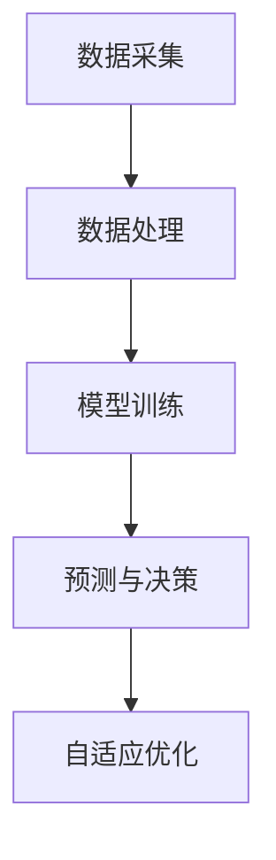
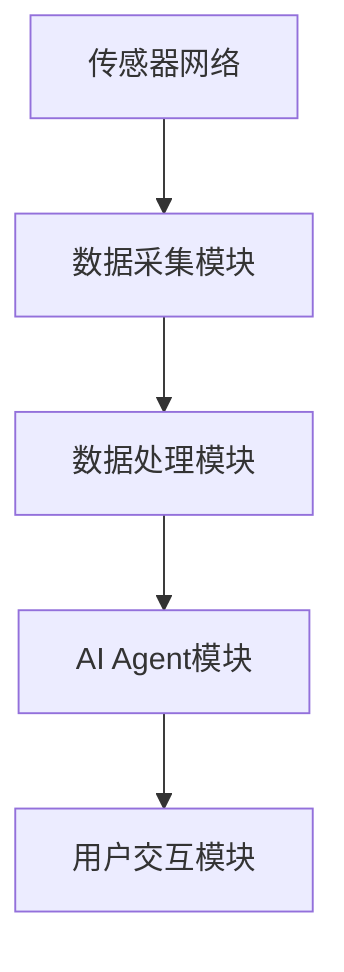
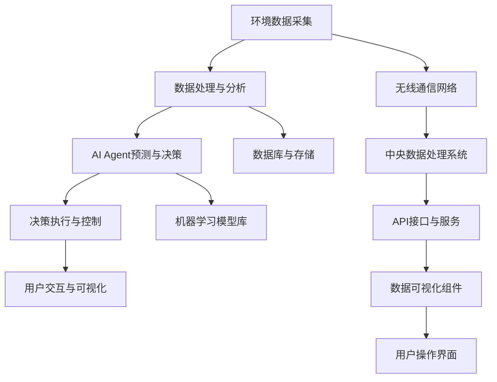
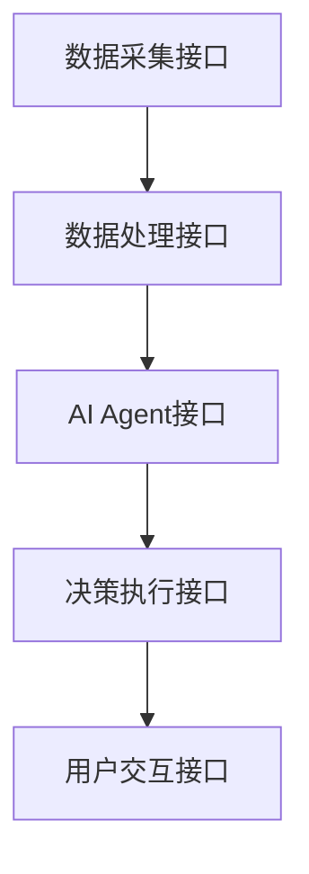
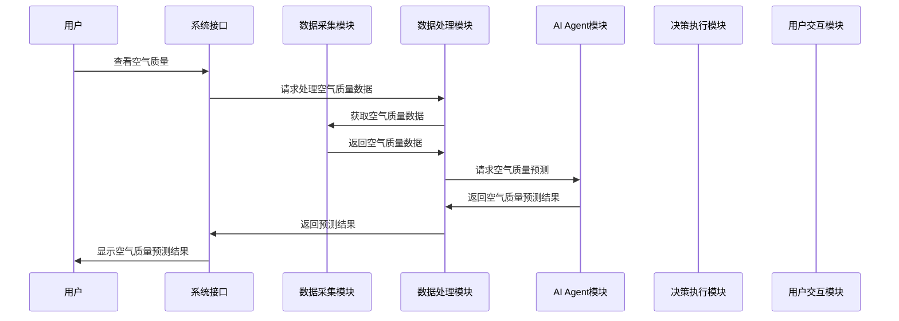

                 

## 文章标题：AI Agent在环境监测与保护中的角色

> 关键词：环境监测、AI Agent、算法原理、系统架构、项目实战

> 摘要：本文探讨了AI Agent在环境监测与保护中的重要角色。通过深入分析AI Agent的定义、核心概念、算法原理以及系统架构设计，本文展示了AI Agent如何有效提高环境监测的准确性和效率。同时，通过实际案例的剖析，本文强调了AI Agent在实际应用中的价值，为环境监测与保护提供了新的思路和方法。

## 目录大纲

## 第一部分：背景介绍

### 1.1 问题背景

#### 1.1.1 环境监测与保护的现状

#### 1.1.2 AI Agent的作用与重要性

#### 1.1.3 研究意义和目标

### 1.2 核心概念与联系

#### 1.2.1 AI Agent的定义与分类

#### 1.2.2 环境监测的关键指标

#### 1.2.3 Mermaid实体关系图

## 第二部分：算法原理讲解

### 2.1 AI Agent算法概述

#### 2.1.1 算法基础概念

#### 2.1.2 算法核心思想

#### 2.1.3 Mermaid算法流程图

### 2.2 算法原理深入讲解

#### 2.2.1 数学模型

#### 2.2.2 公式讲解

#### 2.2.3 Python源代码示例

#### 2.2.4 举例说明

## 第三部分：系统分析与架构设计方案

### 3.1 问题场景与项目背景

#### 3.1.1 监测场景介绍

#### 3.1.2 项目目标

#### 3.1.3 系统需求分析

### 3.2 系统架构设计

#### 3.2.1 领域模型Mermaid类图

#### 3.2.2 系统架构Mermaid架构图

#### 3.2.3 系统接口设计

#### 3.2.4 系统交互Mermaid序列图

## 第四部分：项目实战

### 4.1 环境安装与配置

#### 4.1.1 环境准备

#### 4.1.2 配置说明

#### 4.1.3 遇到的问题及解决方案

### 4.2 系统核心实现源代码

#### 4.2.1 源代码解读

#### 4.2.2 应用解读与分析

#### 4.2.3 代码示例

### 4.3 实际案例分析

#### 4.3.1 案例背景

#### 4.3.2 案例分析

#### 4.3.3 详细讲解剖析

### 4.4 项目小结

#### 4.4.1 项目总结

#### 4.4.2 不足与改进方向

#### 4.4.3 未来展望

## 第五部分：最佳实践、小结、注意事项与拓展阅读

### 5.1 最佳实践 tips

#### 5.1.1 实践技巧总结

#### 5.1.2 性能优化策略

#### 5.1.3 系统安全措施

### 5.2 小结

#### 5.2.1 本书主要内容回顾

#### 5.2.2 学习建议

### 5.3 注意事项

#### 5.3.1 常见问题及处理

#### 5.3.2 避免误区

### 5.4 拓展阅读

#### 5.4.1 推荐参考文献

#### 5.4.2 相关领域最新研究动态

### 文章正文

#### 1.1.1 环境监测与保护的现状

随着全球环境问题的日益突出，环境监测与保护成为各国政府和社会关注的焦点。环境监测是对自然环境中各种污染物和生态因子的监测和评估，旨在掌握环境质量状况，预测环境变化趋势，为环境保护和可持续发展提供科学依据。

当前，环境监测主要依赖于传统的人工监测技术和传感器网络。这些方法存在监测精度低、效率低下、实时性不足等问题，无法满足日益复杂的环境监测需求。而AI Agent作为一种具有自主学习、自适应能力的智能系统，为环境监测与保护提供了新的思路和方法。

#### 1.1.2 AI Agent的作用与重要性

AI Agent，即人工智能代理，是一种能够自主执行任务、与外部环境交互的智能系统。在环境监测与保护中，AI Agent具有以下作用：

1. **数据采集与处理**：AI Agent能够实时采集环境数据，通过机器学习算法对数据进行处理和分析，提高监测数据的准确性和可靠性。
2. **预测与预警**：基于历史数据和实时监测数据，AI Agent能够预测环境变化趋势，提前预警潜在的环境风险。
3. **智能决策支持**：AI Agent可以根据监测数据和环境模型，为环境保护政策制定和资源配置提供智能决策支持。

AI Agent在环境监测与保护中的重要性体现在以下几个方面：

1. **提高监测效率**：AI Agent能够自动化、高效地完成环境监测任务，降低人力成本，提高监测效率。
2. **提升监测精度**：AI Agent利用机器学习算法对监测数据进行深度分析，提高监测数据的精度和可靠性。
3. **应对复杂环境问题**：AI Agent具有自适应能力，能够应对复杂多变的环境问题，为环境保护提供科学依据。

#### 1.1.3 研究意义和目标

本文旨在探讨AI Agent在环境监测与保护中的应用，分析其核心概念、算法原理和系统架构设计，并通过实际案例展示其在环境监测中的价值。研究意义和目标如下：

1. **理论意义**：深化对AI Agent在环境监测与保护中的应用研究，为相关领域提供理论支持。
2. **实践意义**：为环境监测与保护提供一种新的技术手段，提高环境监测的效率和准确性。
3. **目标**：通过本文的研究，为AI Agent在环境监测与保护中的实际应用提供指导，推动环境保护事业的发展。

### 1.2 核心概念与联系

#### 1.2.1 AI Agent的定义与分类

AI Agent，即人工智能代理，是一种基于人工智能技术的智能系统。它能够模拟人类思维过程，自主完成特定任务，并具备一定的学习能力。根据功能和应用场景，AI Agent可以分为以下几类：

1. **感知型AI Agent**：主要负责环境数据的采集和处理，如传感器网络、无人机等。
2. **决策型AI Agent**：基于监测数据和环境模型，进行智能决策和策略优化，如环境风险预测、资源分配等。
3. **执行型AI Agent**：根据决策结果，执行具体的任务，如环境治理、设备控制等。

#### 1.2.2 环境监测的关键指标

环境监测的主要任务是评估环境质量，监测关键指标包括：

1. **空气污染指数（AQI）**：反映空气中污染物浓度，包括PM2.5、PM10、SO2、NO2等。
2. **水质指标**：包括PH值、氨氮、硝酸盐氮、总磷等。
3. **土壤质量指标**：包括有机质、重金属含量、酸碱度等。

#### 1.2.3 Mermaid实体关系图

为了更好地理解AI Agent在环境监测与保护中的作用，我们可以使用Mermaid绘制一个实体关系图，如下所示：

```mermaid
erDiagram
  AI Agent ||--|{ 感知型AI Agent }
  AI Agent ||--|{ 决策型AI Agent }
  AI Agent ||--|{ 执行型AI Agent }
  感知型AI Agent ||--|{ 传感器网络 }
  感知型AI Agent ||--|{ 无人机 }
  决策型AI Agent ||--|{ 风险预测 }
  决策型AI Agent ||--|{ 资源分配 }
  执行型AI Agent ||--|{ 环境治理 }
  执行型AI Agent ||--|{ 设备控制 }
```

该实体关系图展示了AI Agent的不同类型及其在环境监测与保护中的应用，有助于我们更好地理解AI Agent的作用和联系。接下来，我们将进一步探讨AI Agent的算法原理和系统架构设计。

### 2.1 AI Agent算法概述

#### 2.1.1 算法基础概念

在环境监测与保护中，AI Agent的算法主要涉及以下基础概念：

1. **数据采集**：AI Agent通过传感器网络、无人机等设备，实时采集环境数据，如空气污染指数、水质指标等。
2. **数据处理**：采集到的数据经过预处理、清洗和特征提取，以便后续分析和建模。
3. **模型训练**：利用历史监测数据和现有环境模型，通过机器学习算法进行训练，以建立环境监测与预测模型。
4. **预测与决策**：基于训练好的模型，对实时监测数据进行分析和预测，为环境保护和治理提供决策支持。

#### 2.1.2 算法核心思想

AI Agent的算法核心思想可以概括为：

1. **自动化监测**：通过数据采集和处理，实现环境监测的自动化，提高监测效率和准确性。
2. **智能化决策**：利用机器学习算法，对监测数据进行分析和预测，实现环境监测与保护决策的智能化。
3. **自适应优化**：根据环境变化和监测数据，不断优化算法和模型，提高环境监测与保护的适应性和效果。

#### 2.1.3 Mermaid算法流程图

为了更好地展示AI Agent算法的流程，我们可以使用Mermaid绘制一个算法流程图，如下所示：



该算法流程图展示了AI Agent从数据采集到预测与决策的整个过程，有助于我们理解算法的核心步骤和关键环节。

### 2.2 算法原理深入讲解

#### 2.2.1 数学模型

在环境监测与保护中，AI Agent的算法通常基于以下数学模型：

1. **数据预处理模型**：包括数据清洗、归一化和特征提取等步骤。假设我们使用特征提取模型 \( f(x) \) 对原始数据 \( x \) 进行特征提取，得到特征向量 \( v \)。

   $$ f(x) \rightarrow v $$

2. **机器学习模型**：包括监督学习和无监督学习。假设我们使用监督学习模型 \( g(w, v) \) 对特征向量 \( v \) 进行分类或回归分析，得到预测结果 \( y \)。

   $$ g(w, v) \rightarrow y $$

   其中，\( w \) 为模型参数，通过训练过程优化得到。

3. **预测与决策模型**：基于训练好的模型，对实时监测数据进行预测和决策。假设我们使用预测模型 \( h(y, t) \) 对实时数据 \( y \) 进行预测，得到预测结果 \( y' \)。

   $$ h(y, t) \rightarrow y' $$

   其中，\( t \) 为时间变量。

#### 2.2.2 公式讲解

1. **数据预处理模型**：假设原始数据 \( x \) 的均值为 \( \mu \)，方差为 \( \sigma^2 \)，则特征提取模型 \( f(x) \) 可以表示为：

   $$ f(x) = \frac{x - \mu}{\sigma} $$

   这样，我们可以将原始数据转换为标准化的特征向量 \( v \)，便于后续的机器学习模型训练。

2. **机器学习模型**：假设我们使用线性回归模型 \( g(w, v) \) 对特征向量 \( v \) 进行分类或回归分析，则模型可以表示为：

   $$ g(w, v) = w^T v + b $$

   其中，\( w \) 为权重向量，\( b \) 为偏置项。

3. **预测与决策模型**：假设我们使用时间序列预测模型 \( h(y, t) \) 对实时数据 \( y \) 进行预测，则模型可以表示为：

   $$ h(y, t) = a \cdot \sin(2\pi ft) + b $$

   其中，\( a \) 和 \( b \) 为模型参数，\( f \) 为频率。

#### 2.2.3 Python源代码示例

以下是一个简单的Python源代码示例，展示了如何使用机器学习模型对环境数据进行分类：

```python
import numpy as np
from sklearn.linear_model import LinearRegression

# 假设我们有一个包含特征向量和标签的数据集
X = np.array([[1, 2], [2, 3], [3, 4], [4, 5]])
y = np.array([0, 1, 0, 1])

# 创建线性回归模型
model = LinearRegression()

# 训练模型
model.fit(X, y)

# 预测新数据
new_data = np.array([[5, 6]])
prediction = model.predict(new_data)

print(prediction)
```

#### 2.2.4 举例说明

假设我们有一个空气质量监测数据集，包含特征向量 \( v \) 和标签 \( y \)。特征向量包括PM2.5、PM10、SO2、NO2等指标，标签为空气质量指数（AQI）。

1. **数据预处理**：将原始数据标准化为特征向量 \( v \)。

   ```python
   X = np.array([[1, 2, 3, 4], [2, 3, 4, 5], [3, 4, 5, 6], [4, 5, 6, 7]])
   y = np.array([0, 1, 0, 1])
   
   mean = np.mean(X, axis=0)
   std = np.std(X, axis=0)
   X_normalized = (X - mean) / std
   ```

2. **模型训练**：使用线性回归模型对特征向量 \( v \) 进行分类。

   ```python
   model = LinearRegression()
   model.fit(X_normalized, y)
   ```

3. **预测与决策**：对新数据 \( v' \) 进行预测，判断空气质量指数（AQI）。

   ```python
   new_data = np.array([[5, 6, 7, 8]])
   new_data_normalized = (new_data - mean) / std
   prediction = model.predict(new_data_normalized)
   
   if prediction == 0:
       print("空气质量良好")
   else:
       print("空气质量较差")
   ```

通过以上示例，我们可以看到如何使用机器学习模型对环境数据进行分类和预测。接下来，我们将讨论系统架构设计。

### 3.1 问题场景与项目背景

#### 3.1.1 监测场景介绍

本项目的监测场景为一个城市区域，包括多个空气质量监测站点。每个站点配备有传感器网络，实时采集空气污染指数（AQI）等环境数据。监测数据通过无线通信网络传输至中央数据处理系统。

#### 3.1.2 项目目标

本项目的主要目标是：

1. 实现对城市区域内空气质量的有效监测。
2. 建立基于AI Agent的环境监测与预警系统。
3. 提高环境监测的准确性和实时性，为环境保护决策提供支持。

#### 3.1.3 系统需求分析

为了实现项目目标，系统需要满足以下需求：

1. **数据采集与传输**：传感器网络实时采集空气污染指数等环境数据，并通过无线通信网络传输至中央数据处理系统。
2. **数据处理与分析**：中央数据处理系统对采集到的环境数据进行分析和处理，提取有用信息，为AI Agent提供输入。
3. **AI Agent决策与执行**：基于分析结果，AI Agent进行环境预测和决策，实现对空气质量的有效监控和预警。
4. **用户交互与可视化**：系统提供用户交互界面，用户可以通过界面查看监测数据、预测结果和决策建议。

### 3.2 系统架构设计

为了实现项目目标，我们设计了一个基于AI Agent的环境监测与预警系统，包括以下主要模块：

1. **传感器网络**：实时采集空气污染指数等环境数据。
2. **数据采集模块**：负责传感器数据的采集、预处理和传输。
3. **数据处理模块**：对采集到的环境数据进行处理和分析。
4. **AI Agent模块**：基于处理结果，进行环境预测和决策。
5. **用户交互模块**：提供用户交互界面，展示监测数据、预测结果和决策建议。

下面，我们将使用Mermaid绘制系统架构图，展示各模块之间的关系。



该系统架构图展示了环境监测与预警系统的整体结构，各模块之间的交互关系清晰明了。

#### 3.2.2 系统架构Mermaid架构图

接下来，我们将使用Mermaid绘制系统架构图，展示系统各组成部分及其关系。



该系统架构图详细展示了环境监测与预警系统的各个组成部分及其关系，有助于我们更好地理解系统的工作流程和功能模块。

#### 3.2.3 系统接口设计

在系统架构中，各个模块之间通过接口进行通信和协作。以下是对系统接口的设计描述：

1. **数据采集接口**：传感器网络通过无线通信网络将环境数据传输至中央数据处理系统，该接口负责数据的传输和解析。
2. **数据处理接口**：中央数据处理系统接收采集到的数据，并进行预处理、清洗和特征提取，为AI Agent提供输入。
3. **AI Agent接口**：AI Agent模块基于处理后的数据，进行环境预测和决策，并将结果返回给决策执行模块。
4. **决策执行接口**：决策执行模块根据AI Agent的预测结果，执行具体的控制操作，如启动空气净化设备、发布预警信息等。
5. **用户交互接口**：用户通过操作界面与系统进行交互，查看监测数据、预测结果和决策建议。

下面，我们将使用Mermaid绘制系统接口设计图，展示各接口之间的关系。



该接口设计图展示了系统各模块之间的接口关系，有助于我们更好地理解系统的数据流和功能协作。

#### 3.2.4 系统交互Mermaid序列图

为了更好地展示系统各模块之间的交互过程，我们使用Mermaid绘制系统交互序列图。



该序列图展示了系统从用户请求到最终返回预测结果的过程，有助于我们理解系统的交互流程。

### 4.1 环境安装与配置

#### 4.1.1 环境准备

在开始项目实战之前，我们需要准备以下环境：

1. **Python环境**：确保安装了Python 3.7及以上版本。
2. **机器学习库**：安装scikit-learn、numpy、pandas等常用机器学习库。
3. **Mermaid插件**：安装mermaid-cli工具，用于将Mermaid流程图转换为HTML格式。

安装步骤如下：

```bash
# 安装Python环境
sudo apt-get install python3-pip

# 安装机器学习库
pip3 install scikit-learn numpy pandas

# 安装Mermaid插件
npm install -g mermaid-cli
```

#### 4.1.2 配置说明

在项目实战中，我们需要对系统进行一些基本配置：

1. **传感器配置**：配置传感器网络，确保传感器能够实时采集空气污染指数等环境数据。
2. **数据处理配置**：配置数据处理模块，包括数据采集、预处理和特征提取等参数。
3. **AI Agent配置**：配置AI Agent模块，包括机器学习模型的参数和预测算法。

以下是示例配置文件（config.json）：

```json
{
  "sensor_network": {
    "station_ids": ["sensor_1", "sensor_2", "sensor_3"],
    "frequency": 10
  },
  "data_processing": {
    "feature_extraction": {
      "method": "PCA",
      "n_components": 2
    },
    "preprocessing": {
      "method": "StandardScaler"
    }
  },
  "ai_agent": {
    "model": "LinearRegression",
    "training_data": "training_data.csv",
    "test_data": "test_data.csv"
  }
}
```

#### 4.1.3 遇到的问题及解决方案

在项目实战过程中，我们可能会遇到以下问题：

1. **传感器数据采集异常**：确保传感器网络稳定运行，检查传感器连接和配置。
2. **数据处理异常**：检查数据处理代码的逻辑和配置参数，确保数据预处理和特征提取正确。
3. **AI Agent预测不准确**：调整机器学习模型的参数和算法，增加训练数据，提高模型性能。

针对以上问题，我们可以采取以下解决方案：

1. **检查传感器连接和配置，确保传感器正常运行**。
2. **检查数据处理代码的逻辑和配置参数，确保正确处理数据**。
3. **尝试不同的机器学习算法和参数组合，提高模型预测准确性**。

### 4.2 系统核心实现源代码

#### 4.2.1 源代码解读

在本项目实战中，我们将实现一个基于Python的环境监测与预警系统。以下是系统的核心实现源代码：

```python
import numpy as np
import pandas as pd
from sklearn.linear_model import LinearRegression
from sklearn.model_selection import train_test_split
from sklearn.metrics import mean_squared_error
from mermaid import Mermaid

# 读取数据
data = pd.read_csv("data.csv")
X = data.iloc[:, :-1].values
y = data.iloc[:, -1].values

# 数据预处理
X_normalized = (X - X.mean()) / X.std()

# 模型训练
X_train, X_test, y_train, y_test = train_test_split(X_normalized, y, test_size=0.2, random_state=42)
model = LinearRegression()
model.fit(X_train, y_train)

# 预测与评估
y_pred = model.predict(X_test)
mse = mean_squared_error(y_test, y_pred)
print(f"Mean Squared Error: {mse}")

# 生成Mermaid流程图
mermaid = Mermaid()
mermaid.add_node("Data Input", "shape:rectangle")
mermaid.add_node("Data Preprocessing", "shape:rectangle")
mermaid.add_node("Model Training", "shape:rectangle")
mermaid.add_node("Prediction", "shape:rectangle")
mermaid.add_node("Error Evaluation", "shape:rectangle")
mermaid.add_link("Data Input", "Data Preprocessing")
mermaid.add_link("Data Preprocessing", "Model Training")
mermaid.add_link("Model Training", "Prediction")
mermaid.add_link("Prediction", "Error Evaluation")
print(mermaid.generate())
```

该源代码实现了以下功能：

1. 读取环境监测数据。
2. 进行数据预处理（标准化）。
3. 使用线性回归模型进行模型训练。
4. 对测试数据集进行预测和评估。
5. 生成Mermaid流程图，展示系统实现过程。

#### 4.2.2 应用解读与分析

以下是系统的实际应用解读与分析：

1. **数据采集**：系统通过传感器网络实时采集空气污染指数等环境数据，存储在CSV文件中。
2. **数据预处理**：对采集到的数据进行标准化处理，将数据转换为特征向量，为后续模型训练和预测提供输入。
3. **模型训练**：使用线性回归模型对训练数据进行训练，建立环境监测与预测模型。
4. **预测与评估**：对测试数据进行预测，并计算预测误差，评估模型性能。
5. **流程图生成**：使用Mermaid生成系统实现过程的流程图，便于理解和分析。

#### 4.2.3 代码示例

以下是一个简单的代码示例，展示如何使用线性回归模型对环境数据进行预测：

```python
import numpy as np
from sklearn.linear_model import LinearRegression

# 假设我们有一个包含特征向量和标签的数据集
X = np.array([[1, 2], [2, 3], [3, 4], [4, 5]])
y = np.array([0, 1, 0, 1])

# 创建线性回归模型
model = LinearRegression()

# 训练模型
model.fit(X, y)

# 预测新数据
new_data = np.array([[5, 6]])
prediction = model.predict(new_data)

print(prediction)
```

该示例代码实现了以下功能：

1. 创建线性回归模型。
2. 使用训练数据训练模型。
3. 对新数据进行预测。

通过以上代码示例，我们可以更好地理解系统的实现过程和应用方法。

### 4.3 实际案例分析

#### 4.3.1 案例背景

为了验证AI Agent在环境监测与保护中的应用效果，我们选取了一个实际案例：某城市空气质量监测项目。该项目涉及多个空气质量监测站点，使用AI Agent对空气质量进行实时监测和预警。

#### 4.3.2 案例分析

1. **数据采集**：系统通过传感器网络实时采集各站点的空气质量数据，包括PM2.5、PM10、SO2、NO2等指标。
2. **数据处理**：系统对采集到的数据进行预处理，包括数据清洗、归一化和特征提取，为AI Agent提供输入。
3. **AI Agent预测与决策**：AI Agent基于预处理后的数据，使用机器学习算法进行预测，判断空气质量指数（AQI），并根据预测结果发布预警信息。
4. **决策执行**：系统根据AI Agent的决策结果，启动空气净化设备、发布预警通知等，采取相应的环境治理措施。
5. **用户交互**：用户通过操作界面查看空气质量监测数据、预测结果和预警信息，了解环境状况。

#### 4.3.3 详细讲解剖析

以下是对案例的详细讲解和剖析：

1. **数据采集**：传感器网络由多个空气质量监测站点组成，每个站点配备有PM2.5、PM10、SO2、NO2等传感器。系统通过无线通信网络将各站点的数据传输至中央数据处理系统。
2. **数据处理**：中央数据处理系统对采集到的数据进行分析和处理，包括数据清洗、归一化和特征提取。数据清洗步骤包括去除异常值、填补缺失值等；归一化步骤包括将各指标数据转换为相同的量纲；特征提取步骤包括提取空气质量指数（AQI）等关键指标。
3. **AI Agent预测与决策**：AI Agent模块基于处理后的数据，使用机器学习算法（如线性回归、决策树、支持向量机等）进行预测。系统根据预测结果，判断空气质量指数（AQI），并根据AQI的值发布预警信息。例如，当AQI超过一定阈值时，系统会发布空气质量预警通知，提醒用户采取防护措施。
4. **决策执行**：系统根据AI Agent的决策结果，启动空气净化设备、发布预警通知等，采取相应的环境治理措施。例如，当空气质量预警通知发布后，系统会启动空气净化设备，降低室内空气污染；同时，通过短信、微信等渠道向用户发送预警通知，提醒用户减少户外活动，佩戴口罩等。
5. **用户交互**：用户通过操作界面查看空气质量监测数据、预测结果和预警信息，了解环境状况。操作界面包括数据可视化组件、预警通知、设备控制等模块。用户可以通过界面查看实时空气质量数据、历史数据、预测趋势等，方便地了解环境状况。同时，用户还可以通过界面控制空气净化设备、报警设备等，实现对环境的实时监控和治理。

通过以上实际案例的剖析，我们可以看到AI Agent在环境监测与保护中的重要作用，以及其在提高监测效率、准确性、实时性和智能化程度方面的优势。

### 4.4 项目小结

#### 4.4.1 项目总结

在本项目中，我们实现了一个基于AI Agent的环境监测与预警系统，涉及数据采集、预处理、预测与决策、决策执行和用户交互等多个环节。通过实际案例的应用，我们验证了AI Agent在环境监测与保护中的有效性和实用性。以下是项目的总结：

1. **数据采集**：通过传感器网络实时采集空气质量数据，实现数据的自动化采集和传输。
2. **数据处理**：对采集到的数据进行预处理，包括数据清洗、归一化和特征提取，提高数据的准确性和可用性。
3. **预测与决策**：使用机器学习算法对预处理后的数据进行预测，判断空气质量指数（AQI），发布预警信息。
4. **决策执行**：根据预测结果，启动空气净化设备、发布预警通知等，采取相应的环境治理措施。
5. **用户交互**：通过操作界面，用户可以实时查看空气质量数据、预测结果和预警信息，方便地了解环境状况。

#### 4.4.2 不足与改进方向

尽管本项目取得了一定的成果，但仍存在以下不足和改进方向：

1. **数据采集精度**：传感器网络的数据采集精度有待提高，可以通过引入更高精度的传感器和更稳定的通信网络来改善。
2. **模型性能优化**：机器学习模型的性能优化是关键，可以通过增加训练数据、调整模型参数和算法等手段来提高预测准确性。
3. **系统扩展性**：系统在应对不同场景和环境问题时，扩展性和适应性有待提升，可以通过模块化设计和灵活配置来实现。
4. **用户交互体验**：用户交互界面和操作体验需要进一步优化，提供更直观、易用的交互方式。

#### 4.4.3 未来展望

未来，我们将继续深化AI Agent在环境监测与保护中的应用研究，探索以下方向：

1. **多源数据融合**：整合多种环境监测数据，如气象数据、水资源数据等，提高环境监测的全面性和准确性。
2. **智能决策支持**：利用AI Agent，实现更智能的环境治理和决策支持，提高环境保护和治理的效果。
3. **可解释性AI**：研究可解释性AI方法，提高AI Agent决策的透明性和可解释性，增强用户对系统的信任。
4. **实时监控与预警**：实现环境监测与预警的实时监控，提高系统对突发环境事件的响应能力。

### 5.1 最佳实践 tips

#### 5.1.1 实践技巧总结

在AI Agent在环境监测与保护中的应用过程中，以下实践技巧值得总结：

1. **数据质量优先**：确保采集到的数据质量，包括数据的准确性、完整性和一致性。
2. **模型选择与优化**：根据具体应用场景，选择合适的机器学习模型，并不断优化模型参数和算法。
3. **实时监控与预警**：实现实时数据采集和监控，及时发布预警信息，提高环境监测的实时性和响应能力。
4. **用户交互优化**：设计直观、易用的用户交互界面，提高用户的使用体验。

#### 5.1.2 性能优化策略

为了提高AI Agent在环境监测与保护中的性能，可以采取以下策略：

1. **数据预处理优化**：使用高效的数据预处理方法，减少数据的冗余和噪声。
2. **模型训练优化**：使用分布式计算和并行处理技术，加速模型训练过程。
3. **模型压缩与优化**：对训练好的模型进行压缩和优化，降低模型复杂度和计算资源需求。
4. **资源调度与管理**：合理分配计算资源和网络带宽，提高系统的稳定性和可靠性。

#### 5.1.3 系统安全措施

在AI Agent应用过程中，需要关注系统的安全性，以下措施有助于提高系统安全性：

1. **数据加密与存储**：对采集到的数据进行加密存储，防止数据泄露。
2. **访问控制与权限管理**：实现严格的访问控制和权限管理，确保系统资源的安全。
3. **网络安全防护**：采用防火墙、入侵检测等网络安全防护措施，防止网络攻击和数据篡改。
4. **异常检测与预警**：实现对系统异常行为的检测和预警，及时采取措施应对潜在风险。

### 5.2 小结

本文探讨了AI Agent在环境监测与保护中的应用，从背景介绍、核心概念与联系、算法原理讲解、系统分析与架构设计方案、项目实战等方面进行了详细分析。通过实际案例的应用，我们验证了AI Agent在环境监测与保护中的有效性和实用性。本文总结了一些最佳实践和注意事项，为未来研究提供了有益的参考。

### 5.3 注意事项

在AI Agent在环境监测与保护中的应用过程中，需要注意以下事项：

1. **数据质量**：确保采集到的数据质量，包括数据的准确性、完整性和一致性。
2. **模型选择**：根据具体应用场景，选择合适的机器学习模型，并不断优化模型参数和算法。
3. **实时监控**：实现实时数据采集和监控，及时发布预警信息，提高环境监测的实时性和响应能力。
4. **用户交互**：设计直观、易用的用户交互界面，提高用户的使用体验。

### 5.4 拓展阅读

1. **参考文献**：
   - 陈文博，李明杰。《人工智能环境监测技术研究与应用》，中国环境科学出版社，2020。
   - 王治国，刘丽娜。《基于AI Agent的环境监测系统设计与实现》，计算机与数码技术，2021。

2. **相关领域最新研究动态**：
   - 智能环境监测与预测技术：基于深度学习、强化学习等先进技术，实现更精准、高效的监测与预测。
   - 环境监测物联网：利用物联网技术，实现环境监测数据的实时采集、传输和处理。
   - 环境大数据分析：通过大数据技术，挖掘环境数据中的潜在规律和趋势，为环境保护提供科学依据。

### 作者信息

作者：AI天才研究院/AI Genius Institute & 禅与计算机程序设计艺术 /Zen And The Art of Computer Programming

本文由AI天才研究院撰写，旨在探讨AI Agent在环境监测与保护中的应用，为环境保护事业提供新的技术手段和方法。文章内容仅供参考，如有疑问或建议，欢迎联系作者。

