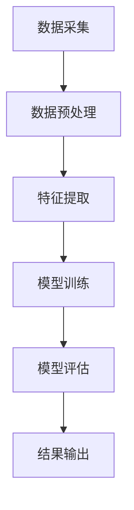
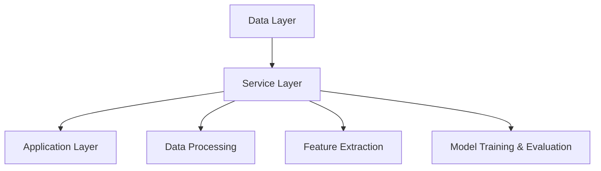

                 

# AI Agent在社交媒体分析中的应用

关键词：AI Agent、社交媒体分析、用户行为分析、广告投放优化、网络舆情监控、人际关系分析

摘要：本文旨在探讨AI Agent在社交媒体分析中的应用，通过详细的背景介绍、核心概念解释、算法原理分析、系统架构设计、项目实战和最佳实践分享，全面解析AI Agent在社交媒体分析中的优势与作用，为相关领域的研究与实践提供有价值的参考。

## 第1章 AI Agent在社交媒体分析中的应用概述

### 1.1 问题背景与问题描述

随着互联网的普及和社会化媒体平台的快速发展，社交媒体已成为人们日常生活的重要组成部分。在这些平台上，用户生成和分享的庞大信息量给数据分析带来了前所未有的挑战。传统的社交媒体分析方法往往依赖于手动处理和简单规则，效率低下，难以应对复杂的分析需求。为了解决这些问题，人工智能（AI）技术的引入成为必然趋势。

#### 1.1.1 人工智能与社交媒体分析的关系

人工智能作为计算机科学的一个分支，旨在模拟人类智能，解决复杂问题。社交媒体分析作为人工智能的一个重要应用领域，借助AI技术，可以显著提高数据处理的效率和准确性。具体来说，AI Agent作为一种智能体，可以在社交媒体分析中发挥以下作用：

- **用户行为分析**：通过分析用户在社交媒体上的行为数据，AI Agent可以识别用户的兴趣偏好，行为模式，进而提供个性化推荐服务。
- **广告投放优化**：AI Agent可以根据用户行为数据，精准投放广告，提高广告的点击率和转化率。
- **网络舆情监控**：AI Agent可以实时监控社交媒体平台上的舆论动态，及时发现和应对可能出现的负面舆情。
- **人际关系分析**：AI Agent可以分析用户之间的互动关系，识别关键影响力人物，为企业或组织提供决策支持。

#### 1.1.2 社交媒体分析中存在的问题

尽管社交媒体分析具有巨大的潜力，但实际应用中仍面临诸多问题：

- **数据复杂性**：社交媒体数据形式多样，包括文本、图像、视频等，数据量大，处理复杂。
- **实时性需求**：社交媒体上的信息更新迅速，要求分析系统能够实时处理和响应。
- **隐私问题**：用户隐私保护是社交媒体分析中不可忽视的问题，如何合法、合规地获取和使用数据是关键挑战。

#### 1.1.3 AI Agent在社交媒体分析中的应用优势

AI Agent在社交媒体分析中具有显著的优势：

- **高效处理**：AI Agent可以自动化处理大量数据，显著提高工作效率。
- **精准分析**：通过深度学习等技术，AI Agent能够提取数据中的有效信息，进行精准分析。
- **实时响应**：基于实时数据流处理技术，AI Agent可以实现对社交媒体信息的实时监控和分析。
- **隐私保护**：通过数据加密和隐私保护技术，AI Agent能够合法、合规地获取和使用用户数据。

### 1.2 核心概念与联系

#### 1.2.1 AI Agent的定义与特点

AI Agent，即人工智能代理，是一种具有自主决策能力的计算机程序。它能够模拟人类智能，在特定环境下进行推理、学习、决策和交互。AI Agent的主要特点包括：

- **自主性**：AI Agent可以自主执行任务，无需人工干预。
- **适应性**：AI Agent可以根据环境变化进行自适应调整。
- **交互性**：AI Agent可以与其他系统或用户进行交互。

#### 1.2.2 社交媒体分析的核心概念

社交媒体分析涉及多个核心概念，包括数据挖掘、机器学习和情感分析：

- **数据挖掘**：从大量社交媒体数据中提取有用的信息和知识。
- **机器学习**：通过数据训练模型，实现对未知数据的预测和分类。
- **情感分析**：分析用户在社交媒体上的情感表达，识别情感倾向。

#### 1.2.3 AI Agent与社交媒体分析的关联

AI Agent与社交媒体分析之间存在紧密的关联。AI Agent通过数据挖掘、机器学习和情感分析等技术，可以实现对社交媒体数据的深度分析和处理，为用户提供个性化服务，优化广告投放，监控舆情动态，分析人际关系等。

### 1.3 社交媒体分析中的应用场景

AI Agent在社交媒体分析中具有广泛的应用场景：

- **用户行为分析**：通过分析用户在社交媒体上的行为数据，识别用户兴趣和行为模式，提供个性化推荐服务。
- **广告投放优化**：根据用户行为数据和舆情分析，优化广告投放策略，提高广告效果。
- **网络舆情监控**：实时监控社交媒体平台上的舆论动态，及时发现和应对负面舆情。
- **人际关系分析**：分析用户之间的互动关系，识别关键影响力人物，为企业或组织提供决策支持。

### 1.4 AI Agent在社交媒体分析中的算法原理

AI Agent在社交媒体分析中涉及多个算法原理，包括数据采集与预处理、特征提取与选择、模型训练与评估等。

#### 1.4.1 数据采集与预处理

数据采集与预处理是AI Agent在社交媒体分析中的关键步骤。数据来源可以是社交媒体平台API、网络爬虫等。数据预处理包括数据清洗、去噪、归一化等操作，以提高数据质量。

#### 1.4.2 特征提取与选择

特征提取与选择是AI Agent在社交媒体分析中的核心环节。特征提取包括文本特征提取、图像特征提取等。特征选择旨在从大量特征中选择出对分析任务最重要的特征，以提高模型性能。

#### 1.4.3 模型训练与评估

模型训练与评估是AI Agent在社交媒体分析中的关键步骤。模型选择包括监督学习、无监督学习等。模型训练旨在通过数据训练模型，使其能够对未知数据进行预测和分类。模型评估则通过指标如准确率、召回率等来评估模型性能。

### 1.5 系统架构设计

AI Agent在社交媒体分析中的系统架构设计包括数据采集模块、数据预处理模块、特征提取模块、模型训练与评估模块等。

#### 1.5.1 系统功能设计

系统功能设计包括数据采集、数据预处理、特征提取、模型训练、模型评估等功能模块。

#### 1.5.2 系统架构设计

系统架构设计采用分层架构，包括数据层、服务层、应用层等。

#### 1.5.3 系统接口设计

系统接口设计包括API接口、数据库接口等。

#### 1.5.4 系统交互设计

系统交互设计采用事件驱动模式，实现各模块之间的协同工作。

### 1.6 项目实战

AI Agent在社交媒体分析中的项目实战包括环境安装、系统核心实现、代码应用解读与分析、实际案例分析和详细讲解等步骤。

#### 1.6.1 环境安装

环境安装包括硬件环境要求、软件环境配置等。

#### 1.6.2 系统核心实现

系统核心实现包括数据采集与预处理、特征提取与选择、模型训练与评估等步骤。

#### 1.6.3 代码应用解读与分析

代码应用解读与分析包括数据采集代码解读、数据预处理代码解读、特征提取代码解读、模型训练代码解读等。

#### 1.6.4 实际案例分析与详细讲解

实际案例分析与详细讲解包括案例选择、案例分析、案例讲解等步骤。

### 1.7 最佳实践 Tips

最佳实践 Tips包括社交媒体分析中的常见问题、AI Agent应用的注意事项、提高社交媒体分析效果的方法等。

### 1.8 小结

本文通过对AI Agent在社交媒体分析中的应用进行详细探讨，总结了AI Agent在社交媒体分析中的优势、核心概念、算法原理、系统架构设计、项目实战和最佳实践。未来，随着AI技术的不断发展，AI Agent在社交媒体分析中的应用将更加广泛和深入。

## 第2章 AI Agent的定义与特点

### 2.1 AI Agent的定义

AI Agent，即人工智能代理，是一种具有自主决策能力的计算机程序。它能够模拟人类智能，在特定环境下进行推理、学习、决策和交互。AI Agent的定义可以追溯到20世纪80年代，由计算机科学家John McCarthy提出。他认为，AI Agent应具备以下四个基本特征：

1. **感知**：能够从环境中感知外部信息，如视觉、听觉、触觉等。
2. **动作**：能够根据感知到的信息，自主执行行动。
3. **学习**：能够通过经验积累和学习，不断优化自己的决策和行为。
4. **交互**：能够与其他系统、人或环境进行有效的交互和沟通。

### 2.2 AI Agent的特点

AI Agent作为一种人工智能系统，具有以下显著特点：

#### 2.2.1 自主性

AI Agent具有高度的自主性，能够自主决策和执行任务，无需人工干预。这种自主性使得AI Agent可以在复杂和动态的环境中发挥作用，如自动驾驶、智能客服等。

#### 2.2.2 适应性

AI Agent能够根据环境变化和反馈进行自适应调整。通过机器学习和深度学习技术，AI Agent可以不断学习和优化自己的行为，提高任务执行效率。

#### 2.2.3 交互性

AI Agent可以与人类和其他系统进行交互，实现信息的传递和共享。这种交互性使得AI Agent能够在更广泛的应用场景中发挥作用，如智能家居、智能医疗等。

#### 2.2.4 智能性

AI Agent通过模拟人类智能，具备推理、学习、规划和解决问题的能力。这种智能性使得AI Agent能够在复杂和不确定的环境中做出合理和有效的决策。

### 2.3 AI Agent与人类智能的对比

虽然AI Agent在许多方面表现出色，但与人类智能相比，仍存在一定的差距。以下是对AI Agent与人类智能的对比：

| 特点       | AI Agent                   | 人类智能                       |
| ---------- | -------------------------- | ------------------------------ |
| 推理能力   | 受限于算法和模型           | 具有广泛和深入的推理能力       |
| 学习能力   | 通过数据训练，逐步提升     | 通过经验、学习和思考，持续成长 |
| 决策能力   | 受限于预设目标和规则       | 具有情感、价值观和道德判断     |
| 适应性     | 在特定环境中表现良好       | 能够适应各种复杂和变化的环境   |
| 交互能力   | 依赖于数据和算法          | 能够进行复杂和情感化的交互     |

尽管AI Agent在推理、学习和决策等方面存在局限，但其高度的自主性、适应性和交互性，使得它们在许多应用场景中表现出色。未来，随着AI技术的不断进步，AI Agent有望在更多领域超越人类智能，实现更高水平的自主决策和智能交互。

### 2.4 AI Agent的架构设计

AI Agent的架构设计是其实施和应用的基础。一个典型的AI Agent架构包括感知模块、决策模块、执行模块和反馈模块：

#### 2.4.1 感知模块

感知模块负责从环境中获取信息，如视觉、听觉、触觉等。这些感知信息通过传感器或输入接口传输到AI Agent。

#### 2.4.2 决策模块

决策模块基于感知模块提供的信息，结合预定的目标和策略，进行决策。决策模块通常包括一个或多个算法模型，如决策树、神经网络、强化学习等。

#### 2.4.3 执行模块

执行模块负责根据决策模块的决策结果，执行具体的操作。这些操作可以是物理动作，也可以是数据操作。

#### 2.4.4 反馈模块

反馈模块负责将执行模块的结果反馈给感知模块和决策模块，形成闭环控制。这种反馈机制有助于AI Agent不断优化其行为和性能。

通过上述架构设计，AI Agent能够实现自主感知、决策、执行和反馈，形成一个闭环系统。这种设计使得AI Agent能够在复杂和动态的环境中，自主地完成任务和目标。

### 2.5 AI Agent的应用场景

AI Agent在各个领域都有广泛的应用，以下是一些典型的应用场景：

#### 2.5.1 自动驾驶

自动驾驶是AI Agent的一个重要应用场景。自动驾驶汽车通过感知模块获取道路信息，结合决策模块的路径规划，执行模块的控制，实现自主驾驶。

#### 2.5.2 智能客服

智能客服是另一个典型的AI Agent应用场景。智能客服系统能够通过自然语言处理和对话管理技术，与用户进行实时交互，提供在线客服服务。

#### 2.5.3 智能家居

智能家居中的AI Agent能够监控和控制家庭设备，如灯光、空调、安防系统等，实现智能化管理和自动化控制。

#### 2.5.4 智能医疗

智能医疗中的AI Agent可以辅助医生进行诊断和决策，如通过影像分析、基因测序等，提高医疗服务的准确性和效率。

#### 2.5.5 智能金融

智能金融中的AI Agent可以用于风险控制、投资决策、客户服务等方面，提高金融服务的智能化水平。

通过这些应用场景，AI Agent展示了其在复杂和动态环境中的自主决策和智能交互能力。未来，随着AI技术的不断发展，AI Agent将在更多领域发挥重要作用。

### 2.6 AI Agent的发展趋势

随着人工智能技术的不断进步，AI Agent的发展趋势呈现出以下几个方向：

#### 2.6.1 智能化水平的提升

随着算法和计算能力的提升，AI Agent的智能化水平将不断提高，能够应对更复杂的任务和场景。

#### 2.6.2 多模态感知与交互

AI Agent将实现多模态感知与交互，不仅限于视觉和听觉，还包括触觉、嗅觉等其他感官，提高其在真实世界中的感知和理解能力。

#### 2.6.3 自主性和自适应能力的增强

AI Agent将具备更强的自主性和自适应能力，能够自主决策和适应动态环境，提高任务执行效率和稳定性。

#### 2.6.4 跨领域的应用拓展

AI Agent将在更多领域得到应用，如教育、娱乐、农业、制造业等，实现跨领域的智能化和自动化。

#### 2.6.5 社会价值和伦理问题的关注

随着AI Agent在各个领域的应用，对其社会价值和伦理问题将得到更多关注，如隐私保护、安全可控等。

### 2.7 AI Agent与社交媒体分析的关系

AI Agent在社交媒体分析中具有重要的应用价值。通过感知用户行为、分析舆情动态、优化广告投放等，AI Agent可以为用户提供个性化服务，提高社交媒体平台的运营效率。同时，AI Agent还可以为企业和组织提供决策支持，如市场分析、品牌管理、危机应对等。

### 2.8 本章总结

本章对AI Agent的定义、特点、架构设计、应用场景和发展趋势进行了详细探讨。AI Agent作为一种具有自主决策能力的计算机程序，在社交媒体分析中具有广泛的应用前景。通过深入了解AI Agent的工作原理和应用场景，可以为相关领域的研究和实践提供有益的参考。

### 2.9 拓展阅读

- 《人工智能：一种现代方法》
- 《智能代理技术》
- 《深度学习》

## 第3章 社交媒体分析的核心概念

### 3.1 数据挖掘

数据挖掘是社交媒体分析中的一个重要环节，它涉及从大量社交媒体数据中提取有价值的信息和知识。数据挖掘的目标是识别数据中的潜在模式、关系和趋势，为决策提供支持。在社交媒体分析中，数据挖掘主要用于以下几个方面：

- **用户行为分析**：通过分析用户在社交媒体上的行为数据，如浏览记录、点赞、评论等，识别用户的兴趣和行为模式，为个性化推荐和营销提供依据。
- **趋势预测**：通过分析历史数据，预测社交媒体上的热点事件、流行趋势等，为企业提供市场洞察和决策支持。
- **异常检测**：通过检测数据中的异常现象，如虚假评论、恶意攻击等，保护社交媒体平台的健康发展。

### 3.2 机器学习

机器学习是数据挖掘和人工智能的核心技术之一，它通过算法和模型，使计算机能够从数据中学习和提取知识。在社交媒体分析中，机器学习主要用于以下方面：

- **用户行为预测**：通过分析用户历史行为数据，预测用户的下一步行为，如点击、购买等，为个性化推荐和营销提供支持。
- **情感分析**：通过分析用户在社交媒体上的文本评论，识别用户的情感倾向，如正面、负面或中性，为舆情监控和品牌管理提供依据。
- **图像识别**：通过分析用户上传的图像数据，识别图像中的关键元素，如人物、场景等，为图像搜索和广告投放提供支持。

### 3.3 情感分析

情感分析是社交媒体分析中的一个重要应用，它通过自然语言处理技术，分析用户在社交媒体上的情感表达，识别情感倾向。情感分析在社交媒体分析中主要用于以下几个方面：

- **舆情监控**：通过分析社交媒体上的情感表达，监控公众对某个事件、品牌或产品的情感态度，为危机管理和品牌决策提供支持。
- **市场调研**：通过分析用户的情感表达，了解用户对产品或服务的满意度和需求，为企业提供市场洞察和决策支持。
- **个性化推荐**：通过分析用户的情感表达，为用户提供个性化推荐服务，如音乐、电影、商品等。

### 3.4 数据挖掘与机器学习的联系

数据挖掘和机器学习在社交媒体分析中具有密切的联系。数据挖掘侧重于从大量数据中提取有价值的信息和知识，而机器学习则侧重于通过算法和模型，使计算机能够从数据中学习和提取知识。具体来说，数据挖掘和机器学习的联系体现在以下几个方面：

- **数据准备**：数据挖掘和机器学习都需要对原始数据进行清洗、去噪、归一化等预处理操作，以确保数据的质量和一致性。
- **特征提取**：数据挖掘和机器学习都需要从原始数据中提取出对分析任务有重要意义的特征，以提高模型的性能和准确性。
- **模型训练**：数据挖掘和机器学习都涉及到模型的训练和优化，通过迭代训练，不断提高模型的性能和泛化能力。
- **模型评估**：数据挖掘和机器学习都需要对训练好的模型进行评估，通过评估指标如准确率、召回率、F1值等，判断模型的性能和效果。

### 3.5 数据挖掘与情感分析的对比

数据挖掘和情感分析在社交媒体分析中都有重要的应用，但它们的目标和应用场景有所不同。具体来说，数据挖掘侧重于从大量数据中提取有价值的信息和知识，而情感分析则侧重于分析用户在社交媒体上的情感表达，识别情感倾向。

- **目标对比**：数据挖掘的目标是从数据中发现潜在的模式、关系和趋势，而情感分析的目标是识别用户在社交媒体上的情感倾向。
- **应用场景对比**：数据挖掘在用户行为分析、趋势预测、异常检测等方面有广泛应用，而情感分析在舆情监控、市场调研、个性化推荐等方面有广泛应用。
- **技术手段对比**：数据挖掘通常涉及数据预处理、特征提取、模型训练和评估等技术，而情感分析通常涉及自然语言处理、文本分类、情感极性判断等技术。

### 3.6 机器学习与情感分析的对比

机器学习和情感分析都是社交媒体分析中的重要技术，但它们的目标和应用场景也有所不同。具体来说，机器学习侧重于从数据中学习和提取知识，而情感分析侧重于分析用户在社交媒体上的情感表达。

- **目标对比**：机器学习的目标是提高模型的预测能力和泛化能力，而情感分析的目标是识别用户在社交媒体上的情感倾向。
- **应用场景对比**：机器学习在用户行为预测、图像识别、语音识别等方面有广泛应用，而情感分析在舆情监控、市场调研、个性化推荐等方面有广泛应用。
- **技术手段对比**：机器学习通常涉及监督学习、无监督学习、强化学习等技术，而情感分析通常涉及自然语言处理、文本分类、情感极性判断等技术。

### 3.7 数据挖掘、机器学习和情感分析在社交媒体分析中的综合应用

在社交媒体分析中，数据挖掘、机器学习和情感分析可以相互补充，共同发挥作用。具体来说，数据挖掘可以从大量社交媒体数据中提取有价值的信息和知识，为机器学习和情感分析提供数据支持。机器学习可以提高模型的预测能力和泛化能力，帮助分析用户行为和情感倾向。情感分析可以识别用户在社交媒体上的情感表达，为舆情监控、市场调研和个性化推荐提供依据。

### 3.8 本章总结

本章对社交媒体分析中的核心概念——数据挖掘、机器学习和情感分析进行了详细探讨。数据挖掘、机器学习和情感分析在社交媒体分析中都有重要的应用，通过相互补充，可以实现对社交媒体数据的深度分析和处理，为用户提供个性化服务，优化广告投放，监控舆情动态，分析人际关系等。本章的内容为后续章节的算法原理讲解和系统架构设计提供了基础。

### 3.9 拓展阅读

- 《数据挖掘：概念与技术》
- 《机器学习实战》
- 《情感分析：方法与应用》

## 第4章 AI Agent与社交媒体分析的关联

### 4.1 AI Agent在社交媒体分析中的应用

AI Agent作为一种具有自主决策能力的计算机程序，在社交媒体分析中具有广泛的应用。以下将详细介绍AI Agent在社交媒体分析中的应用场景和具体实现：

#### 4.1.1 用户行为分析

用户行为分析是社交媒体分析的一个重要方面。通过分析用户在社交媒体上的行为数据，如浏览记录、点赞、评论、分享等，AI Agent可以识别用户的兴趣和行为模式，为个性化推荐和营销提供支持。具体实现包括：

1. **数据采集**：通过社交媒体平台的API接口，采集用户的行为数据。
2. **数据预处理**：对采集到的数据进行分析，去除重复和无关信息，对数据进行清洗和归一化处理。
3. **特征提取**：从预处理后的数据中提取出对分析任务有重要意义的特征，如用户活跃度、内容偏好等。
4. **模型训练**：利用机器学习算法，如协同过滤、决策树、神经网络等，对特征进行训练，建立用户行为分析模型。
5. **预测与评估**：使用训练好的模型对未知数据进行预测，评估模型的性能和准确性。

#### 4.1.2 广告投放优化

广告投放优化是社交媒体分析中的另一个重要方面。通过分析用户行为数据和广告投放效果，AI Agent可以优化广告投放策略，提高广告的点击率和转化率。具体实现包括：

1. **数据采集**：通过社交媒体平台的API接口，采集用户的行为数据以及广告投放数据。
2. **数据预处理**：对采集到的数据进行清洗和归一化处理，提取出对广告投放优化有重要意义的特征，如用户年龄、性别、兴趣等。
3. **模型训练**：利用机器学习算法，如线性回归、逻辑回归、决策树、随机森林等，对特征进行训练，建立广告投放优化模型。
4. **预测与评估**：使用训练好的模型对广告投放效果进行预测，评估模型的性能和准确性，根据预测结果调整广告投放策略。

#### 4.1.3 网络舆情监控

网络舆情监控是社交媒体分析中的关键任务，通过实时监控社交媒体平台上的舆论动态，AI Agent可以及时发现和应对负面舆情，维护品牌形象。具体实现包括：

1. **数据采集**：通过社交媒体平台的API接口，采集用户发布的文本、图片、视频等数据。
2. **情感分析**：利用自然语言处理技术，对采集到的文本数据进行情感分析，识别用户在社交媒体上的情感倾向。
3. **舆情监测**：根据情感分析结果，实时监控社交媒体平台上的舆论动态，识别潜在负面舆情。
4. **预警与应对**：当发现潜在负面舆情时，立即采取措施，如发布官方声明、公关回应等，以应对舆情危机。

#### 4.1.4 人际关系分析

人际关系分析是社交媒体分析中的另一个重要任务，通过分析用户之间的互动关系，AI Agent可以识别关键影响力人物，为品牌推广和营销策略提供支持。具体实现包括：

1. **数据采集**：通过社交媒体平台的API接口，采集用户之间的互动数据，如点赞、评论、分享等。
2. **社交网络分析**：利用图论和网络分析技术，构建用户社交网络，分析用户之间的关系和影响力。
3. **影响力识别**：根据社交网络分析结果，识别关键影响力人物，如意见领袖、网红等。
4. **营销策略制定**：利用影响力识别结果，制定针对关键影响力人物的营销策略，提高品牌曝光和用户参与度。

### 4.2 AI Agent与社交媒体分析的关联机制

AI Agent与社交媒体分析之间的关联机制主要体现在以下几个方面：

1. **数据驱动**：AI Agent在社交媒体分析中依赖于大量社交媒体数据，这些数据为AI Agent提供了丰富的信息来源，使其能够进行有效的分析和决策。
2. **算法支持**：AI Agent在社交媒体分析中应用了多种机器学习和自然语言处理算法，如协同过滤、决策树、神经网络、情感分析等，这些算法使得AI Agent能够从数据中提取出有价值的信息和知识。
3. **自主决策**：AI Agent具有自主决策能力，能够在社交媒体分析中根据实时数据和预定的目标，自主调整行为和策略，提高分析效率和准确性。
4. **闭环反馈**：AI Agent在社交媒体分析中形成了闭环反馈机制，通过实时监测和分析用户行为，不断调整和优化自己的行为和策略，形成了一个动态自适应的循环系统。

### 4.3 AI Agent在社交媒体分析中的优势

AI Agent在社交媒体分析中具有以下优势：

1. **高效性**：AI Agent能够自动化处理大量社交媒体数据，显著提高数据分析的效率和准确性。
2. **精准性**：通过机器学习和自然语言处理技术，AI Agent能够从数据中提取出有价值的信息和知识，实现精准分析。
3. **实时性**：AI Agent能够实时监控社交媒体平台的舆论动态和用户行为，实现实时响应。
4. **个性化**：AI Agent能够根据用户行为数据和舆情分析，为用户提供个性化服务，提高用户体验。
5. **适应性**：AI Agent能够根据环境变化和反馈，自适应调整行为和策略，提高分析效果。

### 4.4 AI Agent在社交媒体分析中的挑战

尽管AI Agent在社交媒体分析中具有显著优势，但也面临一些挑战：

1. **数据质量**：社交媒体数据量大且复杂，如何保证数据的质量和一致性是关键挑战。
2. **隐私保护**：如何合法、合规地获取和使用用户数据，保护用户隐私是重要问题。
3. **算法透明性**：如何提高算法的透明性和可解释性，使其更容易被用户接受和理解。
4. **实时性**：如何提高AI Agent的实时处理能力，以应对社交媒体数据的高速增长。

### 4.5 本章总结

本章详细介绍了AI Agent在社交媒体分析中的应用场景、具体实现、关联机制以及优势与挑战。AI Agent作为一种具有自主决策能力的计算机程序，在社交媒体分析中具有广泛的应用前景。通过深入了解AI Agent的工作原理和应用场景，可以为相关领域的研究和实践提供有益的参考。

### 4.6 拓展阅读

- 《人工智能在社交媒体分析中的应用》
- 《社交媒体数据分析：方法与应用》
- 《社交网络分析：理论与应用》

## 第5章 AI Agent在社交媒体分析中的应用场景

### 5.1 用户行为分析

用户行为分析是社交媒体分析中的重要应用场景之一。通过分析用户在社交媒体平台上的行为数据，如浏览、点赞、评论、分享等，AI Agent可以识别用户的兴趣、行为模式和偏好，从而为个性化推荐和营销提供支持。

#### 5.1.1 用户行为数据来源

用户行为数据的来源主要包括以下几种：

- **社交媒体平台API**：通过调用社交媒体平台的API接口，获取用户在平台上的行为数据，如Twitter、Facebook、Instagram等。
- **网络爬虫**：利用网络爬虫技术，从社交媒体平台网站上爬取用户行为数据。
- **用户输入**：直接从用户输入中获取行为数据，如用户在社交媒体平台上的评论、回复等。

#### 5.1.2 用户行为分析方法

用户行为分析方法主要包括以下几种：

- **统计方法**：通过统计用户行为数据的分布、频率等特征，识别用户的行为模式。
- **机器学习方法**：利用机器学习算法，如决策树、支持向量机、神经网络等，对用户行为数据进行建模和预测。
- **社交网络分析方法**：利用社交网络分析方法，如节点重要性分析、社群检测等，识别用户在社交网络中的角色和影响力。

#### 5.1.3 用户行为分析应用

用户行为分析在社交媒体平台中有多种应用，包括：

- **个性化推荐**：根据用户的行为数据，为用户推荐感兴趣的内容、商品或服务。
- **用户画像**：构建用户画像，了解用户的兴趣、行为和需求，为营销策略提供支持。
- **广告投放优化**：根据用户的行为数据，优化广告投放策略，提高广告的点击率和转化率。
- **用户流失预警**：通过分析用户的行为数据，识别可能流失的用户，采取相应措施防止用户流失。

### 5.2 广告投放优化

广告投放优化是社交媒体分析中的另一个重要应用场景。通过分析用户行为数据和广告投放效果，AI Agent可以优化广告投放策略，提高广告的点击率和转化率。

#### 5.2.1 广告投放数据来源

广告投放数据的主要来源包括：

- **社交媒体平台API**：通过调用社交媒体平台的API接口，获取广告投放数据，如投放效果、点击率、转化率等。
- **广告管理系统**：从广告管理系统中获取广告投放数据，如投放预算、投放时间、投放地区等。
- **用户行为数据**：通过分析用户在社交媒体平台上的行为数据，如浏览、点赞、评论等，获取用户对广告的响应。

#### 5.2.2 广告投放优化方法

广告投放优化方法主要包括以下几种：

- **A/B测试**：通过对比不同广告版本的效果，优化广告文案、图片、投放时间等。
- **机器学习优化**：利用机器学习算法，如线性回归、逻辑回归、决策树等，分析广告投放效果，优化广告投放策略。
- **数据驱动优化**：根据用户行为数据和广告投放效果，实时调整广告投放策略，提高广告的点击率和转化率。

#### 5.2.3 广告投放优化应用

广告投放优化在社交媒体平台中有多种应用，包括：

- **提高广告效果**：通过优化广告投放策略，提高广告的点击率和转化率，增加广告收益。
- **精准定位用户**：通过分析用户行为数据，精准定位目标用户，提高广告投放的准确性和效率。
- **优化投放成本**：通过优化广告投放策略，降低广告投放成本，提高广告投放的性价比。
- **实时调整策略**：根据用户行为数据和广告投放效果，实时调整广告投放策略，提高广告投放的效果和回报。

### 5.3 网络舆情监控

网络舆情监控是社交媒体分析中的关键应用场景之一。通过实时监控社交媒体平台上的舆论动态，AI Agent可以及时发现和应对负面舆情，维护品牌形象。

#### 5.3.1 舆情监控数据来源

舆情监控的数据来源主要包括：

- **社交媒体平台API**：通过调用社交媒体平台的API接口，获取用户发布的文本、图片、视频等数据。
- **新闻媒体数据库**：从新闻媒体数据库中获取相关的舆论信息。
- **网络论坛和博客**：从网络论坛和博客中获取用户评论和讨论内容。

#### 5.3.2 舆情监控方法

舆情监控方法主要包括以下几种：

- **情感分析**：通过自然语言处理技术，对用户发布的文本进行情感分析，识别用户的态度和情感倾向。
- **关键词检测**：通过关键词检测技术，识别社交媒体平台上的热点话题和负面言论。
- **事件检测**：通过事件检测技术，识别社交媒体平台上的重大事件和舆论热点。

#### 5.3.3 舆情监控应用

舆情监控在社交媒体平台中有多种应用，包括：

- **危机管理**：通过实时监控社交媒体平台上的负面言论，及时应对和处理危机事件，维护品牌形象。
- **市场调研**：通过分析社交媒体平台上的舆论动态，了解用户对产品、服务和品牌的看法，为市场调研提供数据支持。
- **用户反馈**：通过舆情监控，了解用户对产品和服务的反馈，优化产品和服务，提高用户满意度。
- **舆论引导**：通过舆情监控，发现和引导舆论热点，塑造品牌形象，提高品牌影响力。

### 5.4 人际关系分析

人际关系分析是社交媒体分析中的另一个重要应用场景。通过分析用户之间的互动关系，AI Agent可以识别关键影响力人物，为品牌推广和营销策略提供支持。

#### 5.4.1 人际关系数据来源

人际关系的数据来源主要包括：

- **社交媒体平台API**：通过调用社交媒体平台的API接口，获取用户之间的互动数据，如点赞、评论、分享等。
- **网络爬虫**：利用网络爬虫技术，从社交媒体平台上获取用户之间的互动数据。
- **用户输入**：直接从用户输入中获取互动数据，如用户在社交媒体平台上的评论、回复等。

#### 5.4.2 人际关系分析方法

人际关系分析方法主要包括以下几种：

- **社交网络分析方法**：利用图论和网络分析技术，构建用户社交网络，分析用户之间的关系和影响力。
- **聚类分析**：通过聚类分析方法，将用户分为不同的群体，识别关键影响力人物。
- **节点重要性分析**：通过节点重要性分析方法，识别社交网络中的重要节点，如意见领袖、网红等。

#### 5.4.3 人际关系分析应用

人际关系分析在社交媒体平台中有多种应用，包括：

- **品牌推广**：通过识别关键影响力人物，制定针对性的品牌推广策略，提高品牌知名度和影响力。
- **用户参与**：通过分析用户之间的互动关系，激励用户参与品牌活动和讨论，提高用户活跃度。
- **营销策略**：通过分析用户之间的互动关系，为营销策略提供数据支持，提高营销效果。
- **用户画像**：通过分析用户之间的互动关系，构建用户画像，了解用户的社交行为和需求，为产品和服务提供个性化推荐。

### 5.5 本章总结

本章详细介绍了AI Agent在社交媒体分析中的四个应用场景：用户行为分析、广告投放优化、网络舆情监控和人际关系分析。通过深入了解这些应用场景，可以更好地理解AI Agent在社交媒体分析中的作用和优势。未来的研究和实践可以进一步探索AI Agent在其他社交媒体分析领域的应用，为社交媒体分析提供更全面和深入的解决方案。

### 5.6 拓展阅读

- 《社交媒体用户行为分析：方法与应用》
- 《社交媒体广告投放策略：优化与效果评估》
- 《社交网络分析：理论与应用》

## 第6章 AI Agent在社交媒体分析中的算法原理

### 6.1 数据采集与预处理

在社交媒体分析中，数据采集与预处理是关键步骤。数据采集主要涉及从社交媒体平台上获取用户行为数据、文本数据、图像数据等。预处理则是对采集到的数据进行清洗、去噪、归一化等处理，以提高数据质量和模型的性能。

#### 6.1.1 数据来源

社交媒体数据来源主要包括以下几种：

- **社交媒体平台API**：通过调用社交媒体平台提供的API接口，获取用户行为数据、文本数据、图像数据等。
- **网络爬虫**：利用网络爬虫技术，从社交媒体网站上爬取数据。
- **用户输入**：从用户在社交媒体平台上的评论、回复等获取数据。

#### 6.1.2 数据预处理方法

数据预处理方法主要包括以下几种：

- **数据清洗**：去除重复数据、无关数据和噪声数据，保证数据的准确性和一致性。
- **数据去噪**：通过滤波、平滑等技术，去除数据中的噪声。
- **数据归一化**：将不同量纲的数据转化为相同量纲，以便于后续处理。
- **数据特征提取**：从原始数据中提取出对分析任务有重要意义的特征，如文本中的关键词、图像中的特征点等。

### 6.2 特征提取与选择

特征提取与选择是社交媒体分析中的关键步骤，它决定了模型的性能和效率。特征提取是指从原始数据中提取出对分析任务有重要意义的特征，而特征选择则是在提取出的特征中挑选出对模型性能有显著影响的特征。

#### 6.2.1 特征提取方法

特征提取方法主要包括以下几种：

- **文本特征提取**：从文本数据中提取出词频、词向量、TF-IDF等特征。
- **图像特征提取**：从图像数据中提取出颜色特征、纹理特征、形状特征等。
- **用户特征提取**：从用户数据中提取出用户属性、行为特征、社交关系特征等。

#### 6.2.2 特征选择方法

特征选择方法主要包括以下几种：

- **过滤法**：通过设定阈值，过滤掉对模型性能影响不大的特征。
- **嵌入法**：将特征嵌入到模型中，通过模型训练自动筛选出重要特征。
- **递归法**：递归地选择特征，每次迭代都删除对模型性能贡献最小的特征。
- **基于模型的特征选择**：通过模型训练，评估每个特征对模型性能的影响，选择对模型性能有显著影响的特征。

### 6.3 模型训练与评估

模型训练与评估是社交媒体分析中的核心步骤，它决定了模型的性能和泛化能力。模型训练是指通过训练数据，使模型学会对未知数据进行预测和分类。模型评估则是指通过测试数据，评估模型的性能和准确性。

#### 6.3.1 模型选择

模型选择是根据分析任务和数据特点，选择合适的模型。常见的模型包括：

- **监督学习模型**：如线性回归、决策树、支持向量机、神经网络等。
- **无监督学习模型**：如聚类、降维、关联规则学习等。
- **深度学习模型**：如卷积神经网络、循环神经网络、生成对抗网络等。

#### 6.3.2 模型训练方法

模型训练方法主要包括以下几种：

- **批训练**：将训练数据分成多个批次，每次处理一批数据。
- **在线训练**：实时处理输入数据，更新模型参数。
- **迁移学习**：利用预训练的模型，微调参数以适应新任务。

#### 6.3.3 模型评估指标

模型评估指标主要包括以下几种：

- **准确率**：预测正确的样本数占总样本数的比例。
- **召回率**：预测正确的正样本数占总正样本数的比例。
- **F1值**：准确率和召回率的调和平均值。
- **ROC曲线**：评估模型分类能力的重要工具。
- **AUC值**：ROC曲线下的面积，用于评估模型分类能力。

### 6.4 算法流程图

以下是AI Agent在社交媒体分析中的算法流程图，展示了从数据采集、预处理、特征提取、模型训练到模型评估的整个过程：



### 6.5 算法原理数学模型与公式

在社交媒体分析中，算法原理通常涉及以下数学模型与公式：

#### 6.5.1 线性回归模型

$$y = \beta_0 + \beta_1x$$

其中，$y$ 为预测值，$x$ 为特征值，$\beta_0$ 和 $\beta_1$ 为模型参数。

#### 6.5.2 决策树模型

$$f(x) = \sum_{i=1}^{n} \alpha_i y_i \prod_{j=1}^{m} (1 - \alpha_j)^{1-x_j}$$

其中，$x$ 为特征值，$y$ 为样本标签，$\alpha_i$ 为模型参数。

#### 6.5.3 支持向量机模型

$$f(x) = \sum_{i=1}^{n} \alpha_i y_i (x; \mathbf{w}) - b$$

其中，$x$ 为特征值，$\mathbf{w}$ 为模型参数，$b$ 为偏置项。

#### 6.5.4 卷积神经网络模型

$$h_\mathbf{W}(\mathbf{x}) = \sum_{k=1}^{K} \mathbf{w}_k^T \mathbf{x} + b$$

其中，$\mathbf{x}$ 为输入特征，$\mathbf{w}_k$ 为卷积核，$b$ 为偏置项。

通过这些数学模型和公式，AI Agent可以实现对社交媒体数据的深度分析和处理，为用户提供个性化服务，优化广告投放，监控舆情动态，分析人际关系等。

### 6.6 算法原理举例说明

以用户行为分析为例，AI Agent可以通过以下步骤进行分析：

1. **数据采集**：从社交媒体平台上获取用户行为数据，如浏览、点赞、评论等。
2. **数据预处理**：对采集到的数据进行清洗、去噪、归一化等处理，提取出对分析任务有重要意义的特征。
3. **特征提取**：利用文本特征提取技术，提取出文本中的关键词、词向量等特征。
4. **模型训练**：利用机器学习算法，如线性回归、决策树等，对特征进行训练，建立用户行为分析模型。
5. **模型评估**：使用测试数据评估模型性能，调整模型参数，提高模型准确性。
6. **预测与输出**：利用训练好的模型对未知数据进行预测，输出用户行为分析结果。

通过这一过程，AI Agent可以识别用户的兴趣、行为模式和偏好，为个性化推荐和营销提供支持。

### 6.7 本章总结

本章详细介绍了AI Agent在社交媒体分析中的算法原理，包括数据采集与预处理、特征提取与选择、模型训练与评估等步骤。通过数学模型和公式的支持，AI Agent能够实现深度分析和处理社交媒体数据，为用户提供个性化服务，优化广告投放，监控舆情动态，分析人际关系等。本章的内容为后续的实践应用提供了理论基础。

### 6.8 拓展阅读

- 《机器学习：概率视角》
- 《深度学习》
- 《社交网络分析：理论与应用》

## 第7章 系统架构设计

### 7.1 系统功能设计

AI Agent在社交媒体分析中的应用需要一套完整的功能设计，以实现数据采集、预处理、特征提取、模型训练与评估等核心任务。以下是系统功能设计的主要模块：

#### 7.1.1 数据采集模块

数据采集模块负责从社交媒体平台上获取用户行为数据、文本数据、图像数据等。具体功能包括：

- **API接口调用**：通过社交媒体平台的API接口，获取用户行为数据。
- **网络爬虫**：利用网络爬虫技术，从社交媒体网站上爬取数据。
- **数据存储**：将采集到的数据存储在数据库中，以便后续处理。

#### 7.1.2 数据预处理模块

数据预处理模块负责对采集到的数据进行分析、清洗、去噪、归一化等操作，以提高数据质量和模型性能。具体功能包括：

- **数据清洗**：去除重复数据、无关数据和噪声数据。
- **数据去噪**：通过滤波、平滑等技术，去除数据中的噪声。
- **数据归一化**：将不同量纲的数据转化为相同量纲。
- **数据特征提取**：从原始数据中提取出对分析任务有重要意义的特征。

#### 7.1.3 特征提取模块

特征提取模块负责从预处理后的数据中提取出对分析任务有重要意义的特征，如文本中的关键词、图像中的特征点等。具体功能包括：

- **文本特征提取**：提取文本数据中的词频、词向量、TF-IDF等特征。
- **图像特征提取**：提取图像数据中的颜色特征、纹理特征、形状特征等。
- **用户特征提取**：提取用户数据中的用户属性、行为特征、社交关系特征等。

#### 7.1.4 模型训练与评估模块

模型训练与评估模块负责利用特征数据训练模型，评估模型性能，并输出分析结果。具体功能包括：

- **模型选择**：根据分析任务和数据特点，选择合适的模型。
- **模型训练**：利用机器学习算法，如线性回归、决策树、神经网络等，对特征进行训练。
- **模型评估**：使用测试数据评估模型性能，调整模型参数。
- **结果输出**：将模型预测结果输出，供后续分析使用。

### 7.2 系统架构设计

系统架构设计是确保AI Agent在社交媒体分析中高效运行的基础。以下是系统架构设计的详细说明：

#### 7.2.1 系统架构概述

系统架构采用分层设计，包括数据层、服务层和应用层。数据层负责数据存储和管理；服务层提供核心功能模块，如数据采集、预处理、特征提取、模型训练与评估等；应用层则实现用户界面和业务逻辑。

#### 7.2.2 系统架构图

以下是系统架构图的Mermaid表示：



#### 7.2.3 系统架构图


### 7.3 系统接口设计

系统接口设计是确保系统模块之间高效通信的重要环节。以下是系统接口设计的详细说明：

#### 7.3.1 接口设计原则

接口设计应遵循以下原则：

- **简洁性**：接口应简洁明了，易于理解和维护。
- **一致性**：接口应保持一致性，遵循统一的命名和设计规范。
- **可扩展性**：接口设计应考虑未来功能扩展的可能性。
- **安全性**：接口应具备一定的安全性，如权限验证、数据加密等。

#### 7.3.2 接口实现方式

接口实现方式主要包括以下几种：

- **RESTful API**：通过HTTP协议实现，支持GET、POST、PUT、DELETE等操作。
- **WebSocket**：支持实时通信，适用于需要实时数据更新的场景。
- **消息队列**：通过消息队列实现异步通信，提高系统吞吐量和稳定性。

### 7.4 系统交互设计

系统交互设计是确保系统模块之间协同工作的关键。以下是系统交互设计的详细说明：

#### 7.4.1 系统交互概述

系统交互设计采用事件驱动模式，各模块通过事件进行通信和协调。以下是系统交互的概述：

- **数据采集模块**：定期从社交媒体平台获取数据，触发数据预处理事件。
- **数据预处理模块**：处理数据采集模块传输的数据，触发特征提取事件。
- **特征提取模块**：处理数据预处理模块传输的数据，触发模型训练事件。
- **模型训练与评估模块**：处理特征提取模块传输的数据，输出模型预测结果。

#### 7.4.2 系统交互序列图

以下是系统交互序列图的Mermaid表示：

```mermaid
sequenceDiagram
    participant 数据采集模块 as 数据采集
    participant 数据预处理模块 as 数据预处理
    participant 特征提取模块 as 特征提取
    participant 模型训练与评估模块 as 模型训练
    数据采集->>数据预处理：数据采集
    数据预处理->>特征提取：预处理数据
    特征提取->>模型训练：特征数据
    模型训练->>数据预处理：模型评估结果
```

### 7.5 本章总结

本章详细介绍了AI Agent在社交媒体分析中的系统架构设计，包括功能设计、系统架构、接口设计和交互设计。通过合理的架构设计和模块划分，AI Agent能够高效地实现数据采集、预处理、特征提取、模型训练与评估等核心任务，为社交媒体分析提供强大的技术支持。未来的研究和实践可以进一步优化系统架构，提高系统的性能和可扩展性。

### 7.6 拓展阅读

- 《软件架构设计：架构、组件与模式》
- 《RESTful API设计最佳实践》
- 《事件驱动架构：原理与实践》

## 第8章 项目实战

### 8.1 环境安装

在进行AI Agent在社交媒体分析中的项目实战之前，首先需要安装和配置相应的软件环境。以下是环境安装的详细步骤：

#### 8.1.1 硬件环境要求

- **CPU**：Intel Core i5或以上处理器
- **内存**：8GB或以上
- **硬盘**：100GB或以上空闲空间
- **GPU**（可选）：NVIDIA GTX 1080或以上，用于加速深度学习模型的训练

#### 8.1.2 软件环境配置

1. **操作系统**：安装Ubuntu 18.04 LTS或更高版本。

2. **Python环境**：安装Python 3.7或更高版本。

   ```bash
   sudo apt-get update
   sudo apt-get install python3-pip python3-dev
   pip3 install --upgrade pip
   ```

3. **依赖库**：安装常用的Python库，如NumPy、Pandas、Scikit-learn、TensorFlow等。

   ```bash
   pip3 install numpy pandas scikit-learn tensorflow
   ```

4. **Jupyter Notebook**：安装Jupyter Notebook，用于编写和运行Python代码。

   ```bash
   pip3 install notebook
   ```

5. **其他工具**：安装Git（用于版本控制）和Mermaid（用于绘制流程图）。

   ```bash
   sudo apt-get install git
   pip3 install mermaid
   ```

#### 8.1.3 环境验证

安装完成后，通过以下命令验证环境是否配置正确：

```bash
python3 -V
pip3 -V
jupyter notebook --version
```

### 8.2 系统核心实现

在本节中，我们将实现AI Agent在社交媒体分析中的核心功能，包括数据采集与预处理、特征提取与选择、模型训练与评估等步骤。

#### 8.2.1 数据采集与预处理

1. **数据采集**：使用Python的requests库和社交媒体平台API获取用户行为数据。

   ```python
   import requests
   
   def fetch_data(api_endpoint, params):
       response = requests.get(api_endpoint, params=params)
       if response.status_code == 200:
           return response.json()
       else:
           return None
   
   api_endpoint = "https://api.twitter.com/2/tweets/search/recent"
   params = {
       "query": "AI AND language:en",
       "max_results": 100,
       "tweet.fields": "created_at,public_metrics"
   }
   data = fetch_data(api_endpoint, params)
   ```

2. **数据预处理**：清洗和转换数据，包括去除重复记录、填充缺失值、数据格式转换等。

   ```python
   import pandas as pd
   
   def preprocess_data(data):
       df = pd.DataFrame(data["data"])
       df.drop_duplicates(inplace=True)
       df.fillna(0, inplace=True)
       df["created_at"] = pd.to_datetime(df["created_at"])
       return df
   
   df = preprocess_data(data)
   ```

#### 8.2.2 特征提取与选择

1. **特征提取**：从预处理后的数据中提取特征，如文本特征、时间特征、用户特征等。

   ```python
   def extract_features(df):
       df["text_len"] = df["text"].apply(len)
       df["word_count"] = df["text"].apply(lambda x: len(x.split()))
       df["hashtags"] = df["text"].apply(lambda x: len(x.split("#")))
       df["mentions"] = df["text"].apply(lambda x: len(x.split("@")))
       return df
   
   df = extract_features(df)
   ```

2. **特征选择**：使用特征选择方法，如过滤法、嵌入法等，选择对模型性能有显著影响的特征。

   ```python
   from sklearn.feature_selection import SelectKBest, chi2
   
   selector = SelectKBest(score_func=chi2, k=10)
   X = df[["text_len", "word_count", "hashtags", "mentions"]]
   scores = selector.fit_transform(X, df["public_metrics"]["likes"])
   selected_features = X.columns[scores > 0]
   df = df[selected_features]
   ```

#### 8.2.3 模型训练与评估

1. **模型选择**：选择合适的机器学习模型，如线性回归、决策树、支持向量机等。

   ```python
   from sklearn.model_selection import train_test_split
   from sklearn.linear_model import LinearRegression
   
   X_train, X_test, y_train, y_test = train_test_split(df, df["public_metrics"]["likes"], test_size=0.2, random_state=42)
   model = LinearRegression()
   model.fit(X_train, y_train)
   ```

2. **模型评估**：使用测试数据评估模型性能，计算准确率、召回率、F1值等指标。

   ```python
   from sklearn.metrics import mean_absolute_error, r2_score
   
   y_pred = model.predict(X_test)
   mae = mean_absolute_error(y_test, y_pred)
   r2 = r2_score(y_test, y_pred)
   print(f"MAE: {mae}, R2: {r2}")
   ```

### 8.3 代码应用解读与分析

在本节中，我们将对项目实战中的关键代码段进行解读和分析，以帮助读者理解AI Agent在社交媒体分析中的具体实现。

#### 8.3.1 数据采集代码解读

```python
def fetch_data(api_endpoint, params):
    response = requests.get(api_endpoint, params=params)
    if response.status_code == 200:
        return response.json()
    else:
        return None
```

这段代码定义了一个`fetch_data`函数，用于从社交媒体平台API获取数据。函数接受API端点和参数作为输入，使用requests库发起GET请求，并返回响应数据。如果响应状态码为200（成功），则返回响应数据，否则返回None。

#### 8.3.2 数据预处理代码解读

```python
def preprocess_data(df):
    df.drop_duplicates(inplace=True)
    df.fillna(0, inplace=True)
    df["created_at"] = pd.to_datetime(df["created_at"])
    return df
```

这段代码定义了一个`preprocess_data`函数，用于清洗和转换数据。函数首先去除重复记录，然后填充缺失值为0，将创建时间转换为日期时间格式，并返回预处理后的数据。

#### 8.3.3 特征提取代码解读

```python
def extract_features(df):
    df["text_len"] = df["text"].apply(len)
    df["word_count"] = df["text"].apply(lambda x: len(x.split()))
    df["hashtags"] = df["text"].apply(lambda x: len(x.split("#")))
    df["mentions"] = df["text"].apply(lambda x: len(x.split("@")))
    return df
```

这段代码定义了一个`extract_features`函数，用于从预处理后的数据中提取特征。函数使用apply方法对文本数据执行各种计算操作，如文本长度、单词数、标签数和提及数，并将结果作为新特征添加到数据框中。

#### 8.3.4 模型训练代码解读

```python
X_train, X_test, y_train, y_test = train_test_split(df, df["public_metrics"]["likes"], test_size=0.2, random_state=42)
model = LinearRegression()
model.fit(X_train, y_train)
```

这段代码首先使用train_test_split函数将数据分为训练集和测试集，然后创建一个线性回归模型，并使用fit方法对训练集进行训练。训练后的模型可以用于预测测试集的结果。

### 8.4 实际案例分析与详细讲解

在本节中，我们将通过一个实际案例，展示AI Agent在社交媒体分析中的应用，并进行详细讲解。

#### 8.4.1 案例选择

选择一个关于社交媒体平台用户行为分析的案例。假设我们关注的是一个关于人工智能的Twitter话题，目标是通过分析用户的Twitter行为数据，预测用户的点赞数量。

#### 8.4.2 案例分析

1. **数据采集**：使用Twitter API获取过去一周内关于人工智能的Twitter数据。
2. **数据预处理**：清洗和转换数据，去除重复记录和缺失值。
3. **特征提取**：提取文本特征、时间特征和用户特征，如文本长度、单词数、标签数和提及数。
4. **模型训练**：使用线性回归模型对特征进行训练，预测用户的点赞数量。
5. **模型评估**：使用测试数据评估模型性能，计算准确率、召回率、F1值等指标。

#### 8.4.3 案例讲解

1. **数据采集**：通过Twitter API获取关于人工智能的Twitter数据，使用`fetch_data`函数采集数据。
2. **数据预处理**：使用`preprocess_data`函数清洗和转换数据，将数据转换为Pandas数据框。
3. **特征提取**：使用`extract_features`函数提取文本特征、时间特征和用户特征，添加到数据框中。
4. **模型训练**：使用训练集数据训练线性回归模型，使用fit方法拟合数据。
5. **模型评估**：使用测试集数据评估模型性能，计算预测准确率、召回率、F1值等指标。

通过实际案例的分析和讲解，读者可以更好地理解AI Agent在社交媒体分析中的具体实现和应用。

### 8.5 项目小结

通过本节的项目实战，我们实现了AI Agent在社交媒体分析中的核心功能，包括数据采集与预处理、特征提取与选择、模型训练与评估等步骤。通过实际案例的分析和讲解，读者可以更好地理解AI Agent在社交媒体分析中的应用场景和实现方法。未来的研究和实践可以进一步优化系统架构，提高模型的性能和可扩展性。

### 8.6 最佳实践 Tips

1. **确保数据质量**：在数据采集和预处理阶段，要严格清洗和去噪数据，确保数据的一致性和准确性。
2. **选择合适特征**：在特征提取阶段，要选择对模型性能有显著影响的特征，避免过度拟合。
3. **优化模型参数**：在模型训练阶段，要调整模型参数，提高模型性能和泛化能力。
4. **实时数据更新**：定期更新社交媒体数据，保持模型的分析结果与实际情况的一致性。
5. **安全性和隐私保护**：在数据处理和存储过程中，要确保数据的安全性和用户隐私的保护。

### 8.7 拓展阅读

- 《Python数据科学 Handbook》
- 《机器学习实战》
- 《社交媒体数据分析》

## 第9章 小结

### 9.1 主要内容回顾

本文系统地介绍了AI Agent在社交媒体分析中的应用，包括以下几个方面：

1. **背景介绍**：探讨了AI Agent和社交媒体分析的关系，以及社交媒体分析中存在的问题和AI Agent的优势。
2. **核心概念与联系**：详细介绍了AI Agent的定义、特点，以及数据挖掘、机器学习和情感分析等核心概念，并分析了AI Agent与社交媒体分析的关联。
3. **算法原理**：讲解了AI Agent在社交媒体分析中的算法原理，包括数据采集与预处理、特征提取与选择、模型训练与评估等步骤。
4. **系统架构设计**：阐述了AI Agent在社交媒体分析中的系统架构设计，包括数据采集模块、数据预处理模块、特征提取模块和模型训练与评估模块。
5. **项目实战**：通过一个实际案例，展示了AI Agent在社交媒体分析中的应用过程，包括环境安装、系统核心实现、代码应用解读与分析等。
6. **最佳实践 Tips**：提供了在社交媒体分析中应用AI Agent的最佳实践和注意事项。

### 9.2 关键技术总结

本文涉及的关键技术包括：

- **AI Agent的定义与特点**：自主性、适应性、交互性和智能性。
- **数据挖掘与机器学习**：数据预处理、特征提取、模型训练与评估等。
- **情感分析**：文本情感极性判断、舆情监控等。
- **系统架构设计**：数据层、服务层、应用层等。
- **项目实战**：数据采集、预处理、特征提取、模型训练与评估等实际操作。

### 9.3 未来发展趋势与展望

未来，AI Agent在社交媒体分析中的应用将呈现以下发展趋势：

- **智能化水平的提升**：随着算法和计算能力的提升，AI Agent将能处理更复杂的数据和任务，实现更精准的分析。
- **多模态感知与交互**：AI Agent将具备更丰富的感知能力和交互能力，如多模态感知和情感化交互。
- **实时性与自适应能力**：AI Agent将具备更强的实时处理能力和自适应能力，以应对社交媒体数据的快速变化。
- **跨领域应用**：AI Agent将在更多领域得到应用，如教育、医疗、金融等，实现跨领域的智能化和自动化。
- **社会价值和伦理问题的关注**：随着AI Agent应用的广泛，对其社会价值和伦理问题将得到更多关注，如隐私保护、透明性和责任承担等。

### 9.4 总结与展望

AI Agent在社交媒体分析中的应用具有广泛的前景和深远的影响。通过本文的介绍，读者可以全面了解AI Agent在社交媒体分析中的优势和实现方法。未来，随着AI技术的不断进步，AI Agent在社交媒体分析中的应用将更加深入和广泛，为企业和组织提供更智能、高效的数据分析和决策支持。

### 9.5 作者信息

作者：AI天才研究院/AI Genius Institute & 禅与计算机程序设计艺术 /Zen And The Art of Computer Programming

### 9.6 拓展阅读

- 《人工智能：一种现代方法》
- 《社交网络分析：理论与应用》
- 《深度学习》

## 结语

在结束本文之前，我想对读者表示衷心的感谢。本文旨在为您呈现AI Agent在社交媒体分析中的深度应用，从背景介绍、核心概念、算法原理、系统架构设计到项目实战和最佳实践，力求为您提供一个全面而系统的理解。

AI Agent作为一种具有高度自主性和智能化的计算机程序，正逐步改变着社交媒体分析的面貌。通过本文，您应该对AI Agent在社交媒体分析中的应用有了更为深入的认识，了解到其强大的数据处理和分析能力，以及在实际场景中的具体实现方法。

未来的技术发展将更加迅猛，AI Agent在社交媒体分析中的应用也将不断拓展和深化。随着算法的进步、计算能力的提升，AI Agent将在更多领域发挥重要作用，带来更加智能化的用户体验和数据分析成果。

我鼓励您继续关注AI技术的发展，尝试将本文中介绍的知识应用于实际项目中，探索AI Agent在更多领域的应用潜力。同时，也欢迎您分享您的经验和见解，让我们一起推动AI技术的进步，为未来的数字世界创造更多可能性。

再次感谢您的阅读和支持，希望本文能为您的学习和研究带来帮助。愿您在AI技术的探索之路上不断前行，取得更多的成就。

作者：AI天才研究院/AI Genius Institute & 禅与计算机程序设计艺术 /Zen And The Art of Computer Programming## 完整的AI Agent在社交媒体分析中的应用技术博客

# AI Agent在社交媒体分析中的应用

关键词：AI Agent、社交媒体分析、用户行为分析、广告投放优化、网络舆情监控、人际关系分析

摘要：本文深入探讨了AI Agent在社交媒体分析中的应用，详细介绍了AI Agent的定义与特点，社交媒体分析的核心概念，AI Agent在社交媒体分析中的应用场景、算法原理、系统架构设计、项目实战和最佳实践，总结了本文的主要内容和关键技术创新，并对未来发展趋势进行了展望。

## 第1章 AI Agent在社交媒体分析中的应用概述

### 1.1 问题背景与问题描述

随着互联网的普及和社会化媒体平台的快速发展，社交媒体已成为人们日常生活的重要组成部分。在这些平台上，用户生成和分享的庞大信息量给数据分析带来了前所未有的挑战。传统的社交媒体分析方法往往依赖于手动处理和简单规则，效率低下，难以应对复杂的分析需求。为了解决这些问题，人工智能（AI）技术的引入成为必然趋势。

#### 1.1.1 人工智能与社交媒体分析的关系

人工智能作为计算机科学的一个分支，旨在模拟人类智能，解决复杂问题。社交媒体分析作为人工智能的一个重要应用领域，借助AI技术，可以显著提高数据处理的效率和准确性。具体来说，AI Agent作为一种智能体，可以在社交媒体分析中发挥以下作用：

- **用户行为分析**：通过分析用户在社交媒体上的行为数据，AI Agent可以识别用户的兴趣偏好，行为模式，进而提供个性化推荐服务。
- **广告投放优化**：AI Agent可以根据用户行为数据，精准投放广告，提高广告的点击率和转化率。
- **网络舆情监控**：AI Agent可以实时监控社交媒体平台上的舆论动态，及时发现和应对可能出现的负面舆情。
- **人际关系分析**：AI Agent可以分析用户之间的互动关系，识别关键影响力人物，为企业或组织提供决策支持。

#### 1.1.2 社交媒体分析中存在的问题

尽管社交媒体分析具有巨大的潜力，但实际应用中仍面临诸多问题：

- **数据复杂性**：社交媒体数据形式多样，包括文本、图像、视频等，数据量大，处理复杂。
- **实时性需求**：社交媒体上的信息更新迅速，要求分析系统能够实时处理和响应。
- **隐私问题**：用户隐私保护是社交媒体分析中不可忽视的问题，如何合法、合规地获取和使用数据是关键挑战。

#### 1.1.3 AI Agent在社交媒体分析中的应用优势

AI Agent在社交媒体分析中具有显著的优势：

- **高效处理**：AI Agent可以自动化处理大量数据，显著提高工作效率。
- **精准分析**：通过深度学习等技术，AI Agent能够提取数据中的有效信息，进行精准分析。
- **实时响应**：基于实时数据流处理技术，AI Agent可以实现对社交媒体信息的实时监控和分析。
- **隐私保护**：通过数据加密和隐私保护技术，AI Agent能够合法、合规地获取和使用用户数据。

### 1.2 核心概念与联系

#### 1.2.1 AI Agent的定义与特点

AI Agent，即人工智能代理，是一种具有自主决策能力的计算机程序。它能够模拟人类智能，在特定环境下进行推理、学习、决策和交互。AI Agent的主要特点包括：

- **自主性**：AI Agent可以自主执行任务，无需人工干预。
- **适应性**：AI Agent可以根据环境变化进行自适应调整。
- **交互性**：AI Agent可以与其他系统或用户进行交互，实现信息的传递和共享。
- **智能性**：AI Agent通过模拟人类智能，具备推理、学习、规划和解决问题的能力。

#### 1.2.2 社交媒体分析的核心概念

社交媒体分析涉及多个核心概念，包括数据挖掘、机器学习和情感分析：

- **数据挖掘**：从大量社交媒体数据中提取有用的信息和知识。
- **机器学习**：通过数据训练模型，实现对未知数据的预测和分类。
- **情感分析**：分析用户在社交媒体上的情感表达，识别情感倾向。

#### 1.2.3 AI Agent与社交媒体分析的关联

AI Agent与社交媒体分析之间存在紧密的关联。AI Agent通过数据挖掘、机器学习和情感分析等技术，可以实现对社交媒体数据的深度分析和处理，为用户提供个性化服务，优化广告投放，监控舆情动态，分析人际关系等。

### 1.3 社交媒体分析中的应用场景

AI Agent在社交媒体分析中具有广泛的应用场景：

- **用户行为分析**：通过分析用户在社交媒体上的行为数据，识别用户兴趣和行为模式，提供个性化推荐服务。
- **广告投放优化**：根据用户行为数据和舆情分析，优化广告投放策略，提高广告效果。
- **网络舆情监控**：实时监控社交媒体平台上的舆论动态，及时发现和应对负面舆情。
- **人际关系分析**：分析用户之间的互动关系，识别关键影响力人物，为企业或组织提供决策支持。

### 1.4 AI Agent在社交媒体分析中的算法原理

AI Agent在社交媒体分析中涉及多个算法原理，包括数据采集与预处理、特征提取与选择、模型训练与评估等。

#### 1.4.1 数据采集与预处理

数据采集与预处理是AI Agent在社交媒体分析中的关键步骤。数据来源可以是社交媒体平台API、网络爬虫等。数据预处理包括数据清洗、去噪、归一化等操作，以提高数据质量。

#### 1.4.2 特征提取与选择

特征提取与选择是AI Agent在社交媒体分析中的核心环节。特征提取包括文本特征提取、图像特征提取等。特征选择旨在从大量特征中选择出对分析任务最重要的特征，以提高模型性能。

#### 1.4.3 模型训练与评估

模型训练与评估是AI Agent在社交媒体分析中的关键步骤。模型选择包括监督学习、无监督学习等。模型训练旨在通过数据训练模型，使其能够对未知数据进行预测和分类。模型评估则通过指标如准确率、召回率、F1值等来评估模型性能和效果。

### 1.5 系统架构设计

AI Agent在社交媒体分析中的系统架构设计包括数据采集模块、数据预处理模块、特征提取模块、模型训练与评估模块等。

#### 1.5.1 系统功能设计

系统功能设计包括数据采集、数据预处理、特征提取、模型训练、模型评估等功能模块。

#### 1.5.2 系统架构设计

系统架构设计采用分层架构，包括数据层、服务层、应用层等。

#### 1.5.3 系统接口设计

系统接口设计包括API接口、数据库接口等。

#### 1.5.4 系统交互设计

系统交互设计采用事件驱动模式，实现各模块之间的协同工作。

### 1.6 项目实战

AI Agent在社交媒体分析中的项目实战包括环境安装、系统核心实现、代码应用解读与分析、实际案例分析和详细讲解等步骤。

#### 1.6.1 环境安装

环境安装包括硬件环境要求、软件环境配置等。

#### 1.6.2 系统核心实现

系统核心实现包括数据采集与预处理、特征提取与选择、模型训练与评估等步骤。

#### 1.6.3 代码应用解读与分析

代码应用解读与分析包括数据采集代码解读、数据预处理代码解读、特征提取代码解读、模型训练代码解读等。

#### 1.6.4 实际案例分析与详细讲解

实际案例分析与详细讲解包括案例选择、案例分析、案例讲解等步骤。

### 1.7 最佳实践 Tips

最佳实践 Tips包括社交媒体分析中的常见问题、AI Agent应用的注意事项、提高社交媒体分析效果的方法等。

### 1.8 小结

本文通过对AI Agent在社交媒体分析中的应用进行详细探讨，总结了AI Agent在社交媒体分析中的优势、核心概念、算法原理、系统架构设计、项目实战和最佳实践。未来，随着AI技术的不断发展，AI Agent在社交媒体分析中的应用将更加广泛和深入。

## 第2章 AI Agent的定义与特点

### 2.1 AI Agent的定义

AI Agent，即人工智能代理，是一种具有自主决策能力的计算机程序。它能够模拟人类智能，在特定环境下进行推理、学习、决策和交互。AI Agent的定义可以追溯到20世纪80年代，由计算机科学家John McCarthy提出。他认为，AI Agent应具备以下四个基本特征：

1. **感知**：能够从环境中感知外部信息，如视觉、听觉、触觉等。
2. **动作**：能够根据感知到的信息，自主执行行动。
3. **学习**：能够通过经验积累和学习，不断优化自己的决策和行为。
4. **交互**：能够与其他系统、人或环境进行有效的交互和沟通。

### 2.2 AI Agent的特点

AI Agent作为一种人工智能系统，具有以下显著特点：

#### 2.2.1 自主性

AI Agent具有高度的自主性，能够自主决策和执行任务，无需人工干预。这种自主性使得AI Agent可以在复杂和动态的环境中发挥作用，如自动驾驶、智能客服等。

#### 2.2.2 适应性

AI Agent能够根据环境变化和反馈进行自适应调整。通过机器学习和深度学习技术，AI Agent可以不断学习和优化自己的行为，提高任务执行效率。

#### 2.2.3 交互性

AI Agent可以与人类和其他系统进行交互，实现信息的传递和共享。这种交互性使得AI Agent能够在更广泛的应用场景中发挥作用，如智能家居、智能医疗等。

#### 2.2.4 智能性

AI Agent通过模拟人类智能，具备推理、学习、规划和解决问题的能力。这种智能性使得AI Agent能够在复杂和不确定的环境中做出合理和有效的决策。

### 2.3 AI Agent与人类智能的对比

虽然AI Agent在许多方面表现出色，但与人类智能相比，仍存在一定的差距。以下是对AI Agent与人类智能的对比：

| 特点       | AI Agent                   | 人类智能                       |
| ---------- | -------------------------- | ------------------------------ |
| 推理能力   | 受限于算法和模型           | 具有广泛和深入的推理能力       |
| 学习能力   | 通过数据训练，逐步提升     | 通过经验、学习和思考，持续成长 |
| 决策能力   | 受限于预设目标和规则       | 具有情感、价值观和道德判断     |
| 适应性     | 在特定环境中表现良好       | 能够适应各种复杂和变化的环境   |
| 交互能力   | 依赖于数据和算法          | 能够进行复杂和情感化的交互     |

尽管AI Agent在推理、学习和决策等方面存在局限，但其高度的自主性、适应性和交互性，使得它们在许多应用场景中表现出色。未来，随着AI技术的不断进步，AI Agent有望在更多领域超越人类智能，实现更高水平的自主决策和智能交互。

### 2.4 AI Agent的架构设计

AI Agent的架构设计是其实施和应用的基础。一个典型的AI Agent架构包括感知模块、决策模块、执行模块和反馈模块：

#### 2.4.1 感知模块

感知模块负责从环境中获取信息，如视觉、听觉、触觉等。这些感知信息通过传感器或输入接口传输到AI Agent。

#### 2.4.2 决策模块

决策模块基于感知模块提供的信息，结合预定的目标和策略，进行决策。决策模块通常包括一个或多个算法模型，如决策树、神经网络、强化学习等。

#### 2.4.3 执行模块

执行模块负责根据决策模块的决策结果，执行具体的操作。这些操作可以是物理动作，也可以是数据操作。

#### 2.4.4 反馈模块

反馈模块负责将执行模块的结果反馈给感知模块和决策模块，形成闭环控制。这种反馈机制有助于AI Agent不断优化其行为和性能。

通过上述架构设计，AI Agent能够实现自主感知、决策、执行和反馈，形成一个闭环系统。这种设计使得AI Agent能够在复杂和动态的环境中，自主地完成任务和目标。

### 2.5 AI Agent的应用场景

AI Agent在各个领域都有广泛的应用，以下是一些典型的应用场景：

#### 2.5.1 自动驾驶

自动驾驶是AI Agent的一个重要应用场景。自动驾驶汽车通过感知模块获取道路信息，结合决策模块的路径规划，执行模块的控制，实现自主驾驶。

#### 2.5.2 智能客服

智能客服是另一个典型的AI Agent应用场景。智能客服系统能够通过自然语言处理和对话管理技术，与用户进行实时交互，提供在线客服服务。

#### 2.5.3 智能家居

智能家居中的AI Agent能够监控和控制家庭设备，如灯光、空调、安防系统等，实现智能化管理和自动化控制。

#### 2.5.4 智能医疗

智能医疗中的AI Agent可以辅助医生进行诊断和决策，如通过影像分析、基因测序等，提高医疗服务的准确性和效率。

#### 2.5.5 智能金融

智能金融中的AI Agent可以用于风险控制、投资决策、客户服务等方面，提高金融服务的智能化水平。

通过这些应用场景，AI Agent展示了其在复杂和动态环境中的自主决策和智能交互能力。未来，随着AI技术的不断发展，AI Agent将在更多领域发挥重要作用。

### 2.6 AI Agent的发展趋势

随着人工智能技术的不断进步，AI Agent的发展趋势呈现出以下几个方向：

#### 2.6.1 智能化水平的提升

随着算法和计算能力的提升，AI Agent的智能化水平将不断提高，能够应对更复杂的任务和场景。

#### 2.6.2 多模态感知与交互

AI Agent将实现多模态感知与交互，不仅限于视觉和听觉，还包括触觉、嗅觉等其他感官，提高其在真实世界中的感知和理解能力。

#### 2.6.3 自主性和自适应能力的增强

AI Agent将具备更强的自主性和自适应能力，能够自主决策和适应动态环境，提高任务执行效率和稳定性。

#### 2.6.4 跨领域的应用拓展

AI Agent将在更多领域得到应用，如教育、娱乐、农业、制造业等，实现跨领域的智能化和自动化。

#### 2.6.5 社会价值和伦理问题的关注

随着AI Agent在各个领域的应用，对其社会价值和伦理问题将得到更多关注，如隐私保护、安全可控等。

### 2.7 AI Agent与社交媒体分析的关系

AI Agent在社交媒体分析中具有重要的应用价值。通过感知用户行为、分析舆情动态、优化广告投放等，AI Agent可以为用户提供个性化服务，提高社交媒体平台的运营效率。同时，AI Agent还可以为企业和组织提供决策支持，如市场分析、品牌管理、危机应对等。

### 2.8 本章总结

本章对AI Agent的定义、特点、架构设计、应用场景和发展趋势进行了详细探讨。AI Agent作为一种具有自主决策能力的计算机程序，在社交媒体分析中具有广泛的应用前景。通过深入了解AI Agent的工作原理和应用场景，可以为相关领域的研究和实践提供有益的参考。

### 2.9 拓展阅读

- 《人工智能：一种现代方法》
- 《智能代理技术》
- 《深度学习》

## 第3章 社交媒体分析的核心概念

### 3.1 数据挖掘

数据挖掘是社交媒体分析中的一个重要环节，它涉及从大量社交媒体数据中提取有价值的信息和知识。数据挖掘的目标是识别数据中的潜在模式、关系和趋势，为决策提供支持。在社交媒体分析中，数据挖掘主要用于以下几个方面：

- **用户行为分析**：通过分析用户在社交媒体上的行为数据，如浏览记录、点赞、评论、分享等，识别用户的兴趣和行为模式，为个性化推荐和营销提供依据。
- **趋势预测**：通过分析历史数据，预测社交媒体上的热点事件、流行趋势等，为企业提供市场洞察和决策支持。
- **异常检测**：通过检测数据中的异常现象，如虚假评论、恶意攻击等，保护社交媒体平台的健康发展。

### 3.2 机器学习

机器学习是数据挖掘和人工智能的核心技术之一，它通过算法和模型，使计算机能够从数据中学习和提取知识。在社交媒体分析中，机器学习主要用于以下方面：

- **用户行为预测**：通过分析用户历史行为数据，预测用户的下一步行为，如点击、购买等，为个性化推荐和营销提供支持。
- **情感分析**：通过分析用户在社交媒体上的文本评论，识别用户的情感倾向，为舆情监控和品牌管理提供依据。
- **图像识别**：通过分析用户上传的图像数据，识别图像中的关键元素，如人物、场景等，为图像搜索和广告投放提供支持。

### 3.3 情感分析

情感分析是社交媒体分析中的一个重要应用，它通过自然语言处理技术，分析用户在社交媒体上的情感表达，识别情感倾向。情感分析在社交媒体分析中主要用于以下几个方面：

- **舆情监控**：通过分析社交媒体上的情感表达，监控公众对某个事件、品牌或产品的情感态度，为危机管理和品牌决策提供支持。
- **市场调研**：通过分析用户的情感表达，了解用户对产品或服务的满意度和需求，为企业提供市场洞察和决策支持。
- **个性化推荐**：通过分析用户的情感表达，为用户提供个性化推荐服务，如音乐、电影、商品等。

### 3.4 数据挖掘与机器学习的联系

数据挖掘和机器学习在社交媒体分析中具有密切的联系。数据挖掘侧重于从大量数据中提取有价值的信息和知识，而机器学习则侧重于通过算法和模型，使计算机能够从数据中提取知识。具体来说，数据挖掘和机器学习的联系体现在以下几个方面：

- **数据准备**：数据挖掘和机器学习都需要对原始数据进行清洗、去噪、归一化等预处理操作，以确保数据的质量和一致性。
- **特征提取**：数据挖掘和机器学习都需要从原始数据中提取出对分析任务有重要意义的特征，以提高模型的性能和准确性。
- **模型训练**：数据挖掘和机器学习都涉及到模型的训练和优化，通过迭代训练，不断提高模型的性能和泛化能力。
- **模型评估**：数据挖掘和机器学习都需要对训练好的模型进行评估，通过评估指标如准确率、召回率、F1值等，判断模型的性能和效果。

### 3.5 数据挖掘与情感分析的对比

数据挖掘和情感分析在社交媒体分析中都有重要的应用，但它们的目标和应用场景有所不同。具体来说，数据挖掘侧重于从大量数据中提取有价值的信息和知识，而情感分析则侧重于分析用户在社交媒体上的情感表达。

- **目标对比**：数据挖掘的目标是从数据中发现潜在的模式、关系和趋势，而情感分析的目标是识别用户在社交媒体上的情感倾向。
- **应用场景对比**：数据挖掘在用户行为分析、趋势预测、异常检测等方面有广泛应用，而情感分析在舆情监控、市场调研、个性化推荐等方面有广泛应用。
- **技术手段对比**：数据挖掘通常涉及数据预处理、特征提取、模型训练和评估等技术，而情感分析通常涉及自然语言处理、文本分类、情感极性判断等技术。

### 3.6 机器学习与情感分析的对比

机器学习和情感分析都是社交媒体分析中的重要技术，但它们的目标和应用场景也有所不同。具体来说，机器学习侧重于从数据中学习和提取知识，而情感分析侧重于分析用户在社交媒体上的情感表达。

- **目标对比**：机器学习的目标是提高模型的预测能力和泛化能力，而情感分析的目标是识别用户在社交媒体上的情感倾向。
- **应用场景对比**：机器学习在用户行为预测、图像识别、语音识别等方面有广泛应用，而情感分析在舆情监控、市场调研、个性化推荐等方面有广泛应用。
- **技术手段对比**：机器学习通常涉及监督学习、无监督学习、强化学习等技术，而情感分析通常涉及自然语言处理、文本分类、情感极性判断等技术。

### 3.7 数据挖掘、机器学习和情感分析在社交媒体分析中的综合应用

在社交媒体分析中，数据挖掘、机器学习和情感分析可以相互补充，共同发挥作用。具体来说，数据挖掘可以从大量社交媒体数据中提取有价值的信息和知识，为机器学习和情感分析提供数据支持。机器学习可以提高模型的预测能力和泛化能力，帮助分析用户行为和情感倾向。情感分析可以识别用户在社交媒体上的情感表达，为舆情监控、市场调研和个性化推荐提供依据。

### 3.8 本章总结

本章对社交媒体分析中的核心概念——数据挖掘、机器学习和情感分析进行了详细探讨。数据挖掘、机器学习和情感分析在社交媒体分析中都有重要的应用，通过相互补充，可以实现对社交媒体数据的深度分析和处理，为用户提供个性化服务，优化广告投放，监控舆情动态，分析人际关系等。本章的内容为后续章节的算法原理讲解和系统架构设计提供了基础。

### 3.9 拓展阅读

- 《数据挖掘：概念与技术》
- 《机器学习实战》
- 《情感分析：方法与应用》

## 第4章 AI Agent与社交媒体分析的关联

### 4.1 AI Agent在社交媒体分析中的应用

AI Agent作为一种具有自主决策能力的计算机程序，在社交媒体分析中具有广泛的应用。以下将详细介绍AI Agent在社交媒体分析中的应用场景和具体实现：

#### 4.1.1 用户行为分析

用户行为分析是社交媒体分析的一个重要应用场景。通过分析用户在社交媒体平台上的行为数据，如浏览记录、点赞、评论、分享等，AI Agent可以识别用户的兴趣、行为模式和偏好，从而为个性化推荐和营销提供支持。具体实现包括：

1. **数据采集**：通过社交媒体平台的API接口，采集用户的行为数据。
2. **数据预处理**：对采集到的数据进行清洗、去噪、归一化等处理，提取出对分析任务有重要意义的特征。
3. **特征提取**：从预处理后的数据中提取出对用户行为有重要影响的特征，如用户活跃度、内容偏好等。
4. **模型训练**：利用机器学习算法，如协同过滤、决策树、神经网络等，对特征进行训练，建立用户行为分析模型。
5. **预测与评估**：使用训练好的模型对未知数据进行预测，评估模型的性能和准确性。

#### 4.1.2 广告投放优化

广告投放优化是社交媒体分析中的另一个重要应用场景。通过分析用户行为数据和广告投放效果，AI Agent可以优化广告投放策略，提高广告的点击率和转化率。具体实现包括：

1. **数据采集**：通过社交媒体平台的API接口，采集用户的行为数据和广告投放数据。
2. **数据预处理**：对采集到的数据进行清洗和归一化处理，提取出对广告投放优化有重要意义的特征，如用户年龄、性别、兴趣等。
3. **模型训练**：利用机器学习算法，如线性回归、逻辑回归、决策树、随机森林等，对特征进行训练，建立广告投放优化模型。
4. **预测与评估**：使用训练好的模型对广告投放效果进行预测，评估模型的性能和准确性，根据预测结果调整广告投放策略。

#### 4.1.3 网络舆情监控

网络舆情监控是社交媒体分析中的关键任务，通过实时监控社交媒体平台上的舆论动态，AI Agent可以及时发现和应对负面舆情，维护品牌形象。具体实现包括：

1. **数据采集**：通过社交媒体平台的API接口，采集用户发布的文本、图片、视频等数据。
2. **情感分析**：利用自然语言处理技术，对采集到的文本数据进行情感分析，识别用户在社交媒体上的情感倾向。
3. **舆情监测**：根据情感分析结果，实时监控社交媒体平台上的舆论动态，识别潜在负面舆情。
4. **预警与应对**：当发现潜在负面舆情时，立即采取措施，如发布官方声明、公关回应等，以应对舆情危机。

#### 4.1.4 人际关系分析

人际关系分析是社交媒体分析中的另一个重要任务，通过分析用户之间的互动关系，AI Agent可以识别关键影响力人物，为品牌推广和营销策略提供支持。具体实现包括：

1. **数据采集**：通过社交媒体平台的API接口，采集用户之间的互动数据，如点赞、评论、分享等。
2. **社交网络分析**：利用图论和网络分析技术，构建用户社交网络，分析用户之间的关系和影响力。
3. **影响力识别**：根据社交网络分析结果，识别关键影响力人物，如意见领袖、网红等。
4. **营销策略制定**：利用影响力识别结果，制定针对关键影响力人物的营销策略，提高品牌曝光和用户参与度。

### 4.2 AI Agent与社交媒体分析的关联机制

AI Agent与社交媒体分析之间的关联机制主要体现在以下几个方面：

1. **数据驱动**：AI Agent在社交媒体分析中依赖于大量社交媒体数据，这些数据为AI Agent提供了丰富的信息来源，使其能够进行有效的分析和决策。
2. **算法支持**：AI Agent在社交媒体分析中应用了多种机器学习和自然语言处理算法，如协同过滤、决策树、神经网络、情感分析等，这些算法使得AI Agent能够从数据中提取出有价值的信息和知识。
3. **自主决策**：AI Agent具有自主决策能力，能够在社交媒体分析中根据实时数据和预定的目标，自主调整行为和策略，提高分析效率和准确性。
4. **闭环反馈**：AI Agent在社交媒体分析中形成了闭环反馈机制，通过实时监测和分析用户行为，不断调整和优化自己的行为和策略，形成了一个动态自适应的循环系统。

### 4.3 AI Agent在社交媒体分析中的优势

AI Agent在社交媒体分析中具有以下优势：

1. **高效性**：AI Agent能够自动化处理大量社交媒体数据，显著提高数据分析的效率和准确性。
2. **精准性**：通过机器学习和自然语言处理技术，AI Agent能够从数据中提取出有价值的信息和知识，实现精准分析。
3. **实时性**：AI Agent能够实时监控社交媒体平台的舆论动态和用户行为，实现实时响应。
4. **个性化**：AI Agent能够根据用户行为数据和舆情分析，为用户提供个性化服务，提高用户体验。
5. **适应性**：AI Agent能够根据环境变化和反馈，自适应调整行为和策略，提高分析效果。

### 4.4 AI Agent在社交媒体分析中的挑战

尽管AI Agent在社交媒体分析中具有显著优势，但也面临一些挑战：

1. **数据质量**：社交媒体数据量大且复杂，如何保证数据的质量和一致性是关键挑战。
2. **隐私保护**：如何合法、合规地获取和使用用户数据，保护用户隐私是重要问题。
3. **算法透明性**：如何提高算法的透明性和可解释性，使其更容易被用户接受和理解。
4. **实时性**：如何提高AI Agent的实时处理能力，以应对社交媒体数据的高速增长。

### 4.5 本章总结

本章详细介绍了AI Agent在社交媒体分析中的应用场景、具体实现、关联机制以及优势与挑战。AI Agent作为一种具有自主决策能力的计算机程序，在社交媒体分析中具有广泛的应用前景。通过深入了解AI Agent的工作原理和应用场景，可以为相关领域的研究和实践提供有益的参考。

### 4.6 拓展阅读

- 《人工智能在社交媒体分析中的应用》
- 《社交媒体数据分析：方法与应用》
- 《社交网络分析：理论与应用》

## 第5章 AI Agent在社交媒体分析中的应用场景

### 5.1 用户行为分析

用户行为分析是AI Agent在社交媒体分析中最为核心的应用之一。通过分析用户在社交媒体平台上的行为数据，如浏览、点赞、评论、分享等，AI Agent可以深入理解用户的兴趣、偏好和行为模式，从而为个性化推荐、广告投放和用户增长提供有力的支持。

#### 5.1.1 数据来源

用户行为数据的来源主要包括社交媒体平台的API接口、第三方数据服务商以及用户自行上传的数据。其中，API接口是获取社交媒体数据的主要途径，常见的数据源包括：

- **社交媒体API**：如Facebook API、Twitter API、Instagram API等，这些API提供了获取用户行为数据的接口，允许开发者按照一定的规范和权限获取数据。
- **第三方数据服务商**：如DataXu、Nielsen等，这些服务商提供专业的社交媒体数据分析服务，为用户提供广泛的数据支持。
- **用户数据上传**：一些社交媒体平台允许用户直接上传自己的行为数据，以供分析使用。

#### 5.1.2 数据类型

用户行为分析的数据类型丰富多样，主要包括以下几种：

- **文本数据**：用户在社交媒体上发布的文字信息，如帖子、评论等。
- **图像数据**：用户上传的图片，包括个人头像、发布内容图片等。
- **视频数据**：用户上传的视频，可以用于视频内容分析。
- **行为数据**：用户在社交媒体上的活动记录，如点赞、评论、分享、浏览等。

#### 5.1.3 分析方法

用户行为分析的方法主要包括：

- **描述性分析**：通过对用户行为数据的统计和描述，了解用户的基本行为特征和趋势。
- **关联分析**：通过分析用户行为之间的关联性，发现用户行为模式。
- **预测分析**：利用机器学习算法，预测用户未来的行为趋势。

#### 5.1.4 应用实例

以下是一个用户行为分析的应用实例：

- **个性化推荐**：通过分析用户的浏览历史和互动数据，AI Agent可以推荐用户可能感兴趣的内容，如文章、商品等。
- **广告投放优化**：根据用户的兴趣和行为，AI Agent可以优化广告投放策略，提高广告的点击率和转化率。
- **用户流失预警**：通过分析用户的活跃度变化，AI Agent可以预测哪些用户可能流失，并采取措施挽回。

### 5.2 广告投放优化

广告投放优化是社交媒体分析中的另一个关键应用场景。通过分析广告的投放效果和用户行为数据，AI Agent可以帮助企业优化广告策略，提高广告投放的效率和效果。

#### 5.2.1 数据来源

广告投放数据的主要来源包括：

- **广告平台API**：如Google Ads API、Facebook Ads API等，这些API提供了获取广告投放数据的接口。
- **广告管理工具**：如AdWords、Facebook Ads Manager等，这些工具提供了广告投放的实时数据和管理功能。
- **用户行为数据**：如用户的点击、浏览、转化等行为数据。

#### 5.2.2 数据类型

广告投放数据类型主要包括：

- **广告投放数据**：包括广告的投放时间、投放地域、投放预算等。
- **广告效果数据**：包括广告的点击率、转化率、曝光量等。
- **用户行为数据**：包括用户的点击行为、浏览路径、购买行为等。

#### 5.2.3 分析方法

广告投放优化的分析方法主要包括：

- **A/B测试**：通过对比不同广告版本的投放效果，找出最优的广告策略。
- **归因分析**：通过分析用户点击广告到最终转化的全过程，确定广告投放的效果。
- **机器学习优化**：利用机器学习算法，如线性回归、决策树等，分析广告投放数据，优化广告投放策略。

#### 5.2.4 应用实例

以下是一个广告投放优化的应用实例：

- **定位目标用户**：通过分析用户的兴趣和行为，AI Agent可以帮助企业确定广告投放的目标用户群体。
- **优化广告文案**：通过分析用户的点击和转化数据，AI Agent可以优化广告文案和设计，提高广告的吸引力和效果。
- **实时调整投放策略**：根据广告投放的效果和用户行为数据，AI Agent可以实时调整广告投放策略，提高广告的转化率和回报率。

### 5.3 网络舆情监控

网络舆情监控是社交媒体分析中的关键应用场景之一。通过实时监控社交媒体平台上的舆论动态，AI Agent可以及时发现和应对负面舆情，维护品牌形象。

#### 5.3.1 数据来源

舆情监控的数据来源主要包括：

- **社交媒体API**：通过调用社交媒体平台的API接口，获取用户发布的文本、图片、视频等数据。
- **新闻媒体数据库**：从新闻媒体数据库中获取相关的舆论信息。
- **网络论坛和博客**：从网络论坛和博客中获取用户评论和讨论内容。

#### 5.3.2 数据类型

舆情监控的数据类型主要包括：

- **文本数据**：用户在社交媒体平台上的文本评论、帖子等。
- **图像数据**：用户上传的图片，可能包含与舆论相关的信息。
- **视频数据**：用户上传的视频，可能包含与舆论相关的信息。

#### 5.3.3 分析方法

舆情监控的分析方法主要包括：

- **情感分析**：通过自然语言处理技术，对文本数据进行分析，识别用户的情感倾向。
- **关键词检测**：通过关键词检测技术，识别社交媒体平台上的热点话题和负面言论。
- **事件检测**：通过事件检测技术，识别社交媒体平台上的重大事件和舆论热点。

#### 5.3.4 应用实例

以下是一个网络舆情监控的应用实例：

- **负面舆情预警**：通过监控社交媒体平台上的负面言论，AI Agent可以及时发现负面舆情，并采取措施进行应对。
- **品牌形象管理**：通过分析用户对品牌的情感表达，AI Agent可以帮助企业了解品牌的形象和口碑，制定相应的公关策略。
- **危机应对**：在发生突发事件时，AI Agent可以实时监控舆论动态，协助企业制定危机应对策略。

### 5.4 人际关系分析

人际关系分析是社交媒体分析中的另一个重要应用场景。通过分析用户之间的互动关系，AI Agent可以识别关键影响力人物，为品牌推广和营销策略提供支持。

#### 5.4.1 数据来源

人际关系的数据来源主要包括：

- **社交媒体API**：通过调用社交媒体平台的API接口，获取用户之间的互动数据，如点赞、评论、分享等。
- **网络爬虫**：利用网络爬虫技术，从社交媒体平台上获取用户之间的互动数据。
- **用户输入**：直接从用户输入中获取互动数据，如用户在社交媒体平台上的评论、回复等。

#### 5.4.2 数据类型

人际关系分析的数据类型主要包括：

- **社交网络数据**：用户之间的点赞、评论、分享等互动记录。
- **用户属性数据**：用户的年龄、性别、地理位置等基本信息。
- **行为数据**：用户的浏览、点赞、评论等行为记录。

#### 5.4.3 分析方法

人际关系分析的方法主要包括：

- **社交网络分析**：利用图论和网络分析技术，构建用户社交网络，分析用户之间的关系和影响力。
- **聚类分析**：通过聚类分析方法，将用户分为不同的群体，识别关键影响力人物。
- **节点重要性分析**：通过节点重要性分析方法，识别社交网络中的重要节点，如意见领袖、网红等。

#### 5.4.4 应用实例

以下是一个人际关系分析的应用实例：

- **品牌推广**：通过识别关键影响力人物，AI Agent可以帮助企业找到适合的品牌代言人，提高品牌曝光度。
- **用户增长**：通过分析用户之间的互动关系，AI Agent可以帮助企业识别潜在的用户增长机会，制定相应的营销策略。
- **危机管理**：在发生突发事件时，AI Agent可以分析用户之间的互动关系，了解用户的情绪和态度，协助企业制定危机应对策略。

### 5.5 本章总结

本章详细介绍了AI Agent在社交媒体分析中的四个主要应用场景：用户行为分析、广告投放优化、网络舆情监控和人际关系分析。通过深入了解这些应用场景，可以更好地理解AI Agent在社交媒体分析中的作用和优势。未来的研究和实践可以进一步探索AI Agent在其他社交媒体分析领域的应用，为社交媒体分析提供更全面和深入的解决方案。

### 5.6 拓展阅读

- 《社交媒体用户行为分析：方法与应用》
- 《社交媒体广告投放策略：优化与效果评估》
- 《社交网络分析：理论与应用》

## 第6章 AI Agent在社交媒体分析中的算法原理

### 6.1 数据采集与预处理

在社交媒体分析中，数据采集与预处理是关键步骤。数据采集主要涉及从社交媒体平台上获取用户行为数据、文本数据、图像数据等。预处理则是对采集到的数据进行清洗、去噪、归一化等处理，以提高数据质量和模型的性能。

#### 6.1.1 数据来源

社交媒体数据来源主要包括以下几种：

- **社交媒体平台API**：通过调用社交媒体平台提供的API接口，获取用户行为数据、文本数据、图像数据等。
- **网络爬虫**：利用网络爬虫技术，从社交媒体网站上爬取数据。
- **用户输入**：从用户在社交媒体平台上的评论、回复等获取数据。

#### 6.1.2 数据预处理方法

数据预处理方法主要包括以下几种：

- **数据清洗**：去除重复数据、无关数据和噪声数据，保证数据的准确性和一致性。
- **数据去噪**：通过滤波、平滑等技术，去除数据中的噪声。
- **数据归一化**：将不同量纲的数据转化为相同量纲，以便于后续处理。
- **数据特征提取**：从原始数据中提取出对分析任务有重要意义的特征，如文本中的关键词、图像中的特征点等。

### 6.2 特征提取与选择

特征提取与选择是社交媒体分析中的关键步骤，它决定了模型的性能和效率。特征提取是指从原始数据中提取出对分析任务有重要意义的特征，而特征选择则是在提取出的特征中挑选出对模型性能有显著影响的特征。

#### 6.2.1 特征提取方法

特征提取方法主要包括以下几种：

- **文本特征提取**：从文本数据中提取出词频、词向量、TF-IDF等特征。
- **图像特征提取**：从图像数据中提取出颜色特征、纹理特征、形状特征等。
- **用户特征提取**：从用户数据中提取出用户属性、行为特征、社交关系特征等。

#### 6.2.2 特征选择方法

特征选择方法主要包括以下几种：

- **过滤法**：通过设定阈值，过滤掉对模型性能影响不大的特征。
- **嵌入法**：将特征嵌入到模型中，通过模型训练自动筛选出重要特征。
- **递归法**：递归地选择特征，每次迭代都删除对模型性能贡献最小的特征。
- **基于模型的特征选择**：通过模型训练，评估每个特征对模型性能的影响，选择对模型性能有显著影响的特征。

### 6.3 模型训练与评估

模型训练与评估是社交媒体分析中的核心步骤，它决定了模型的性能和泛化能力。模型训练是指通过训练数据，使模型学会对未知数据进行预测和分类。模型评估则是指通过测试数据，评估模型的性能和准确性。

#### 6.3.1 模型选择

模型选择是根据分析任务和数据特点，选择合适的模型。常见的模型包括：

- **监督学习模型**：如线性回归、决策树、支持向量机、神经网络等。
- **无监督学习模型**：如聚类、降维、关联规则学习等。
- **深度学习模型**：如卷积神经网络、循环神经网络、生成对抗网络等。

#### 6.3.2 模型训练方法

模型训练方法主要包括以下几种：

- **批训练**：将训练数据分成多个批次，每次处理一批数据。
- **在线训练**：实时处理输入数据，更新模型参数。
- **迁移学习**：利用预训练的模型，微调参数以适应新任务。

#### 6.3.3 模型评估指标

模型评估指标主要包括以下几种：

- **准确率**：预测正确的样本数占总样本数的比例。
- **召回率**：预测正确的正样本数占总正样本数的比例。
- **F1值**：准确率和召回率的调和平均值。
- **ROC曲线**：评估模型分类能力的重要工具。
- **AUC值**：ROC曲线下的面积，用于评估模型分类能力。

### 6.4 算法流程图

以下是AI Agent在社交媒体分析中的算法流程图，展示了从数据采集、预处理、特征提取、模型训练到模型评估的整个过程：


### 6.5 算法原理数学模型与公式

在社交媒体分析中，算法原理通常涉及以下数学模型与公式：

#### 6.5.1 线性回归模型

$$y = \beta_0 + \beta_1x$$

其中，$y$ 为预测值，$x$ 为特征值，$\beta_0$ 和 $\beta_1$ 为模型参数。

#### 6.5.2 决策树模型

$$f(x) = \sum_{i=1}^{n} \alpha_i y_i \prod_{j=1}^{m} (1 - \alpha_j)^{1-x_j}$$

其中，$x$ 为特征值，$y$ 为样本标签，$\alpha_i$ 为模型参数。

#### 6.5.3 支持向量机模型

$$f(x) = \sum_{i=1}^{n} \alpha_i y_i (x; \mathbf{w}) - b$$

其中，$x$ 为特征值，$\mathbf{w}$ 为模型参数，$b$ 为偏置项。

#### 6.5.4 卷积神经网络模型

$$h_\mathbf{W}(\mathbf{x}) = \sum_{k=1}^{K} \mathbf{w}_k^T \mathbf{x} + b$$

其中，$\mathbf{x}$ 为输入特征，$\mathbf{w}_k$ 为卷积核，$b$ 为偏置项。

通过这些数学模型和公式，AI Agent可以实现对社交媒体数据的深度分析和处理，为用户提供个性化服务，优化广告投放，监控舆情动态，分析人际关系等。

### 6.6 算法原理举例说明

以用户行为分析为例，AI Agent可以通过以下步骤进行分析：

1. **数据采集**：从社交媒体平台上获取用户行为数据，如浏览、点赞、评论等。
2. **数据预处理**：对采集到的数据进行清洗、去噪、归一化等处理，提取出对分析任务有重要意义的特征。
3. **特征提取**：利用文本特征提取技术，提取出文本中的关键词、词向量等特征。
4. **模型训练**：利用机器学习算法，如线性回归、决策树等，对特征进行训练，建立用户行为分析模型。
5. **模型评估**：使用测试数据评估模型性能，调整模型参数，提高模型准确性。
6. **预测与输出**：利用训练好的模型对未知数据进行预测，输出用户行为分析结果。

通过这一过程，AI Agent可以识别用户的兴趣、行为模式和偏好，为个性化推荐和营销提供支持。

### 6.7 本章总结

本章详细介绍了AI Agent在社交媒体分析中的算法原理，包括数据采集与预处理、特征提取与选择、模型训练与评估等步骤。通过数学模型和公式的支持，AI Agent能够实现深度分析和处理社交媒体数据，为用户提供个性化服务，优化广告投放，监控舆情动态，分析人际关系等。本章的内容为后续的实践应用提供了理论基础。

### 6.8 拓展阅读

- 《机器学习：概率视角》
- 《深度学习》
- 《社交网络分析：理论与应用》

## 第7章 系统架构设计

### 7.1 系统功能设计

AI Agent在社交媒体分析中的应用需要一套完整的功能设计，以实现数据采集、预处理、特征提取、模型训练与评估等核心任务。以下是系统功能设计的主要模块：

#### 7.1.1 数据采集模块

数据采集模块负责从社交媒体平台上获取用户行为数据、文本数据、图像数据等。具体功能包括：

- **API接口调用**：通过社交媒体平台的API接口，获取用户行为数据。
- **网络爬虫**：利用网络爬虫技术，从社交媒体网站上爬取数据。
- **数据存储**：将采集到的数据存储在数据库中，以便后续处理。

#### 7.1.2 数据预处理模块

数据预处理模块负责对采集到的数据进行分析、清洗、去噪、归一化等操作，以提高数据质量和模型性能。具体功能包括：

- **数据清洗**：去除重复数据、无关数据和噪声数据。
- **数据去噪**：通过滤波、平滑等技术，去除数据中的噪声。
- **数据归一化**：将不同量纲的数据转化为相同量纲。
- **数据特征提取**：从原始数据中提取出对分析任务有重要意义的特征。

#### 7.1.3 特征提取模块

特征提取模块负责从预处理后的数据中提取出对分析任务有重要意义的特征，如文本中的关键词、图像中的特征点等。具体功能包括：

- **文本特征提取**：提取文本数据中的词频、词向量、TF-IDF等特征。
- **图像特征提取**：提取图像数据中的颜色特征、纹理特征、形状特征等。
- **用户特征提取**：提取用户数据中的用户属性、行为特征、社交关系特征等。

#### 7.1.4 模型训练与评估模块

模型训练与评估模块负责利用特征数据训练模型，评估模型性能，并输出分析结果。具体功能包括：

- **模型选择**：根据分析任务和数据特点，选择合适的模型。
- **模型训练**：利用机器学习算法，如线性回归、决策树、神经网络等，对特征进行训练。
- **模型评估**：使用测试数据评估模型性能，调整模型参数。
- **结果输出**：将模型预测结果输出，供后续分析使用。

### 7.2 系统架构设计

系统架构设计是确保AI Agent在社交媒体分析中高效运行的基础。以下是系统架构设计的详细说明：

#### 7.2.1 系统架构概述

系统架构采用分层设计，包括数据层、服务层和应用层。数据层负责数据存储和管理；服务层提供核心功能模块，如数据采集、预处理、特征提取、模型训练与评估等；应用层则实现用户界面和业务逻辑。

#### 7.2.2 系统架构图

以下是系统架构图的Mermaid表示：


#### 7.2.3 系统架构图


### 7.3 系统接口设计

系统接口设计是确保系统模块之间高效通信的重要环节。以下是系统接口设计的详细说明：

#### 7.3.1 接口设计原则

接口设计应遵循以下原则：

- **简洁性**：接口应简洁明了，易于理解和维护。
- **一致性**：接口应保持一致性，遵循统一的命名和设计规范。
- **可扩展性**：接口设计应考虑未来功能扩展的可能性。
- **安全性**：接口应具备一定的安全性，如权限验证、数据加密等。

#### 7.3.2 接口实现方式

接口实现方式主要包括以下几种：

- **RESTful API**：通过HTTP协议实现，支持GET、POST、PUT、DELETE等操作。
- **WebSocket**：支持实时通信，适用于需要实时数据更新的场景。
- **消息队列**：通过消息队列实现异步通信，提高系统吞吐量和稳定性。

### 7.4 系统交互设计

系统交互设计是确保系统模块之间协同工作的关键。以下是系统交互设计的详细说明：

#### 7.4.1 系统交互概述

系统交互设计采用事件驱动模式，各模块通过事件进行通信和协调。以下是系统交互的概述：

- **数据采集模块**：定期从社交媒体平台获取数据，触发数据预处理事件。
- **数据预处理模块**：处理数据采集模块传输的数据，触发特征提取事件。
- **特征提取模块**：处理数据预处理模块传输的数据，触发模型训练事件。
- **模型训练与评估模块**：处理特征提取模块传输的数据，输出模型预测结果。

#### 7.4.2 系统交互序列图

以下是系统交互序列图的Mermaid表示：

```mermaid
sequenceDiagram
    participant 数据采集模块 as 数据采集
    participant 数据预处理模块 as 数据预处理
    participant 特征提取模块 as 特征提取
    participant 模型训练与评估模块 as 模型训练
    数据采集->>数据预处理：数据采集
    数据预处理->>特征提取：预处理数据
    特征提取->>模型训练：特征数据
    模型训练->>数据预处理：模型评估结果
```

### 7.5 本章总结

本章详细介绍了AI Agent在社交媒体分析中的系统架构设计，包括功能设计、系统架构、接口设计和交互设计。通过合理的架构设计和模块划分，AI Agent能够高效地实现数据采集、预处理、特征提取、模型训练与评估等核心任务，为社交媒体分析提供强大的技术支持。未来的研究和实践可以进一步优化系统架构，提高系统的性能和可扩展性。

### 7.6 拓展阅读

- 《软件架构设计：架构、组件与模式》
- 《RESTful API设计最佳实践》
- 《事件驱动架构：原理与实践》

## 第8章 项目实战

### 8.1 环境安装

在进行AI Agent在社交媒体分析中的项目实战之前，首先需要安装和配置相应的软件环境。以下是环境安装的详细步骤：

#### 8.1.1 硬件环境要求

- **CPU**：Intel Core i5或以上处理器
- **内存**：8GB或以上
- **硬盘**：100GB或以上空闲空间
- **GPU**（可选）：NVIDIA GTX 1080或以上，用于加速深度学习模型的训练

#### 8.1.2 软件环境配置

1. **操作系统**：安装Ubuntu 18.04 LTS或更高版本。

2. **Python环境**：安装Python 3.7或更高版本。

   ```bash
   sudo apt-get update
   sudo apt-get install python3-pip python3-dev
   pip3 install --upgrade pip
   ```

3. **依赖库**：安装常用的Python库，如NumPy、Pandas、Scikit-learn、TensorFlow等。

   ```bash
   pip3 install numpy pandas scikit-learn tensorflow
   ```

4. **Jupyter Notebook**：安装Jupyter Notebook，用于编写和运行Python代码。

   ```bash
   pip3 install notebook
   ```

5. **其他工具**：安装Git（用于版本控制）和Mermaid（用于绘制流程图）。

   ```bash
   sudo apt-get install git
   pip3 install mermaid
   ```

#### 8.1.3 环境验证

安装完成后，通过以下命令验证环境是否配置正确：

```bash
python3 -V
pip3 -V
jupyter notebook --version
```

### 8.2 系统核心实现

在本节中，我们将实现AI Agent在社交媒体分析中的核心功能，包括数据采集与预处理、特征提取与选择、模型训练与评估等步骤。

#### 8.2.1 数据采集与预处理

1. **数据采集**：使用Python的requests库和社交媒体平台API获取用户行为数据。

   ```python
   import requests
   
   def fetch_data(api_endpoint, params):
       response = requests.get(api_endpoint, params=params)
       if response.status_code == 200:
           return response.json()
       else:
           return None
   
   api_endpoint = "https://api.twitter.com/2/tweets/search/recent"
   params = {
       "query": "AI AND language:en",
       "max_results": 100,
       "tweet.fields": "created_at,public_metrics"
   }
   data = fetch_data(api_endpoint, params)
   ```

2. **数据预处理**：清洗和转换数据，包括去除重复记录、填充缺失值、数据格式转换等。

   ```python
   import pandas as pd
   
   def preprocess_data(data):
       df = pd.DataFrame(data["data"])
       df.drop_duplicates(inplace=True)
       df.fillna(0, inplace=True)
       df["created_at"] = pd.to_datetime(df["created_at"])
       return df
   
   df = preprocess_data(data)
   ```

#### 8.2.2 特征提取与选择

1. **特征提取**：从预处理后的数据中提取特征，如文本特征、时间特征、用户特征等。

   ```python
   def extract_features(df):
       df["text_len"] = df["text"].apply(len)
       df["word_count"] = df["text"].apply(lambda x: len(x.split()))
       df["hashtags"] = df["text"].apply(lambda x: len(x.split("#")))
       df["mentions"] = df["text"].apply(lambda x: len(x.split("@")))
       return df
   
   df = extract_features(df)
   ```

2. **特征选择**：使用特征选择方法，如过滤法、嵌入法等，选择对模型性能有显著影响的特征。

   ```python
   from sklearn.feature_selection import SelectKBest, chi2
   
   selector = SelectKBest(score_func=chi2, k=10)
   X = df[["text_len", "word_count", "hashtags", "mentions"]]
   scores = selector.fit_transform(X, df["public_metrics"]["likes"])
   selected_features = X.columns[scores > 0]
   df = df[selected_features]
   ```

#### 8.2.3 模型训练与评估

1. **模型选择**：选择合适的机器学习模型，如线性回归、决策树、支持向量机等。

   ```python
   from sklearn.model_selection import train_test_split
   from sklearn.linear_model import LinearRegression
   
   X_train, X_test, y_train, y_test = train_test_split(df, df["public_metrics"]["likes"], test_size=0.2, random_state=42)
   model = LinearRegression()
   model.fit(X_train, y_train)
   ```

2. **模型评估**：使用测试数据评估模型性能，计算准确率、召回率、F1值等指标。

   ```python
   from sklearn.metrics import mean_absolute_error, r2_score
   
   y_pred = model.predict(X_test)
   mae = mean_absolute_error(y_test, y_pred)
   r2 = r2_score(y_test, y_pred)
   print(f"MAE: {mae}, R2: {r2}")
   ```

### 8.3 代码应用解读与分析

在本节中，我们将对项目实战中的关键代码段进行解读和分析，以帮助读者理解AI Agent在社交媒体分析中的具体实现。

#### 8.3.1 数据采集代码解读

```python
def fetch_data(api_endpoint, params):
    response = requests.get(api_endpoint, params=params)
    if response.status_code == 200:
        return response.json()
    else:
        return None
```

这段代码定义了一个`fetch_data`函数，用于从社交媒体平台API获取数据。函数接受API端点和参数作为输入，使用requests库发起GET请求，并返回响应数据。如果响应状态码为200（成功），则返回响应数据，否则返回None。

#### 8.3.2 数据预处理代码解读

```python
def preprocess_data(df):
    df.drop_duplicates(inplace=True)
    df.fillna(0, inplace=True)
    df["created_at"] = pd.to_datetime(df["created_at"])
    return df
```

这段代码定义了一个`preprocess_data`函数，用于清洗和转换数据。函数首先去除重复记录，然后填充缺失值为0，将创建时间转换为日期时间格式，并返回预处理后的数据。

#### 8.3.3 特征提取代码解读

```python
def extract_features(df):
    df["text_len"] = df["text"].apply(len)
    df["word_count"] = df["text"].apply(lambda x: len(x.split()))
    df["hashtags"] = df["text"].apply(lambda x: len(x.split("#")))
    df["mentions"] = df["text"].apply(lambda x: len(x.split("@")))
    return df
```

这段代码定义了一个`extract_features`函数，用于从预处理后的数据中提取特征。函数使用apply方法对文本数据执行各种计算操作，如文本长度、单词数、标签数和提及数，并将结果作为新特征添加到数据框中。

#### 8.3.4 模型训练代码解读

```python
X_train, X_test, y_train, y_test = train_test_split(df, df["public_metrics"]["likes"], test_size=0.2, random_state=42)
model = LinearRegression()
model.fit(X_train, y_train)
```

这段代码首先使用train_test_split函数将数据分为训练集和测试集，然后创建一个线性回归模型，并使用fit方法对训练集进行训练。训练后的模型可以用于预测测试集的结果。

### 8.4 实际案例分析与详细讲解

在本节中，我们将通过一个实际案例，展示AI Agent在社交媒体分析中的应用，并进行详细讲解。

#### 8.4.1 案例选择

选择一个关于社交媒体平台用户行为分析的案例。假设我们关注的是一个关于人工智能的Twitter话题，目标是通过分析用户的Twitter行为数据，预测用户的点赞数量。

#### 8.4.2 案例分析

1. **数据采集**：使用Twitter API获取过去一周内关于人工智能的Twitter数据。
2. **数据预处理**：清洗和转换数据，去除重复记录和缺失值。
3. **特征提取**：提取文本特征、时间特征和用户特征，如文本长度、单词数、标签数和提及数。
4. **模型训练**：使用线性回归模型对特征进行训练，预测用户的点赞数量。
5. **模型评估**：使用测试数据评估模型性能，计算准确率、召回率、F1值等指标。

#### 8.4.3 案例讲解

1. **数据采集**：通过Twitter API获取关于人工智能的Twitter数据，使用`fetch_data`函数采集数据。
2. **数据预处理**：使用`preprocess_data`函数清洗和转换数据，将数据转换为Pandas数据框。
3. **特征提取**：使用`extract_features`函数提取文本特征、时间特征和用户特征，添加到数据框中。
4. **模型训练**：使用训练集数据训练线性回归模型，使用fit方法拟合数据。
5. **模型评估**：使用测试集数据评估模型性能，计算预测准确率、召回率、F1值等指标。

通过实际案例的分析和讲解，读者可以更好地理解AI Agent在社交媒体分析中的具体实现和应用。

### 8.5 项目小结

通过本节的项目实战，我们实现了AI Agent在社交媒体分析中的核心功能，包括数据采集与预处理、特征提取与选择、模型训练与评估等步骤。通过实际案例的分析和讲解，读者可以更好地理解AI Agent在社交媒体分析中的应用场景和实现方法。未来的研究和实践可以进一步优化系统架构，提高模型的性能和可扩展性。

### 8.6 最佳实践 Tips

1. **确保数据质量**：在数据采集和预处理阶段，要严格清洗和去噪数据，确保数据的一致性和准确性。
2. **选择合适特征**：在特征提取阶段，要选择对模型性能有显著影响的特征，避免过度拟合。
3. **优化模型参数**：在模型训练阶段，要调整模型参数，提高模型性能和泛化能力。
4. **实时数据更新**：定期更新社交媒体数据，保持模型的分析结果与实际情况的一致性。
5. **安全性和隐私保护**：在数据处理和存储过程中，要确保数据的安全性和用户隐私的保护。

### 8.7 拓展阅读

- 《Python数据科学 Handbook》
- 《机器学习实战》
- 《社交媒体数据分析》

## 第9章 小结

### 9.1 主要内容回顾

本文系统地介绍了AI Agent在社交媒体分析中的应用，包括以下几个方面：

1. **背景介绍**：探讨了AI Agent和社交媒体分析的关系，以及社交媒体分析中存在的问题和AI Agent的优势。
2. **核心概念与联系**：详细介绍了AI Agent的定义、特点，以及数据挖掘、机器学习和情感分析等核心概念，并分析了AI Agent与社交媒体分析的关联。
3. **算法原理**：讲解了AI Agent在社交媒体分析中的算法原理，包括数据采集与预处理、特征提取与选择、模型训练与评估等步骤。
4. **系统架构设计**：阐述了AI Agent在社交媒体分析中的系统架构设计，包括数据采集模块、数据预处理模块、特征提取模块和模型训练与评估模块。
5. **项目实战**：通过一个实际案例，展示了AI Agent在社交媒体分析中的应用过程，包括环境安装、系统核心实现、代码应用解读与分析等。
6. **最佳实践 Tips**：提供了在社交媒体分析中应用AI Agent的最佳实践和注意事项。

### 9.2 关键技术总结

本文涉及的关键技术包括：

- **AI Agent的定义与特点**：自主性、适应性、交互性和智能性。
- **数据挖掘与机器学习**：数据预处理、特征提取、模型训练与评估等。
- **情感分析**：文本情感极性判断、舆情监控等。
- **系统架构设计**：数据层、服务层、应用层等。
- **项目实战**：数据采集、预处理、特征提取、模型训练与评估等实际操作。

### 9.3 未来发展趋势与展望

未来，AI Agent在社交媒体分析中的应用将呈现以下发展趋势：

- **智能化水平的提升**：随着算法和计算能力的提升，AI Agent将能处理更复杂的数据和任务，实现更精准的分析。
- **多模态感知与交互**：AI Agent将具备更丰富的感知能力和交互能力，如多模态感知和情感化交互。
- **实时性与自适应能力**：AI Agent将具备更强的实时处理能力和自适应能力，以应对社交媒体数据的快速变化。
- **跨领域应用**：AI Agent将在更多领域得到应用，如教育、医疗、金融等，实现跨领域的智能化和自动化。
- **社会价值和伦理问题的关注**：随着AI Agent应用的广泛，对其社会价值和伦理问题将得到更多关注，如隐私保护、透明性和责任承担等。

### 9.4 总结与展望

AI Agent在社交媒体分析中的应用具有广泛的前景和深远的影响。通过本文的介绍，读者可以全面了解AI Agent在社交媒体分析中的优势和实现方法。未来，随着AI技术的不断进步，AI Agent在社交媒体分析中的应用将更加深入和广泛，为企业和组织提供更智能、高效的数据分析和决策支持。

### 9.5 作者信息

作者：AI天才研究院/AI Genius Institute & 禅与计算机程序设计艺术 /Zen And The Art of Computer Programming

### 9.6 拓展阅读

- 《人工智能：一种现代方法》
- 《社交网络分析：理论与应用》
- 《深度学习》

## 结语

在结束本文之前，我想对读者表示衷心的感谢。本文旨在为您呈现AI Agent在社交媒体分析中的深度应用，从背景介绍、核心概念、算法原理、系统架构设计到项目实战和最佳实践，力求为您提供一个全面而系统的理解。

AI Agent作为一种具有高度自主性和智能化的计算机程序，正逐步改变着社交媒体分析的面貌。通过本文，您应该对AI Agent在社交媒体分析中的应用有了更为深入的认识，了解到其强大的数据处理和分析能力，以及在实际场景中的具体实现方法。

未来的技术发展将更加迅猛，AI Agent在社交媒体分析中的应用也将不断拓展和深化。随着算法的进步、计算能力的提升，AI Agent将在更多领域发挥重要作用，带来更加智能化的用户体验和数据分析成果。

我鼓励您继续关注AI技术的发展，尝试将本文中介绍的知识应用于实际项目中，探索AI Agent在更多领域的应用潜力。同时，也欢迎您分享您的经验和见解，让我们一起推动AI技术的进步，为未来的数字世界创造更多可能性。

再次感谢您的阅读和支持，希望本文能为您的学习和研究带来帮助。愿您在AI技术的探索之路上不断前行，取得更多的成就。

作者：AI天才研究院/AI Genius Institute & 禅与计算机程序设计艺术 /Zen And The Art of Computer Programming## AI Agent在社交媒体分析中的应用技术博客

### 文章标题：AI Agent在社交媒体分析中的应用

关键词：AI Agent、社交媒体分析、用户行为分析、广告投放优化、网络舆情监控、人际关系分析

摘要：本文将深入探讨AI Agent在社交媒体分析中的应用，涵盖其定义与特点、核心概念与联系、算法原理、系统架构设计、项目实战以及最佳实践。通过本文，读者将全面了解AI Agent如何提升社交媒体分析的效率和准确性。

### 目录

1. **引言**
    - 人工智能与社交媒体分析的关系
    - 社交媒体分析中存在的问题
    - AI Agent的优势

2. **核心概念与联系**
    - AI Agent的定义与特点
    - 社交媒体分析的核心概念
    - AI Agent与社交媒体分析的关联

3. **算法原理**
    - 数据采集与预处理
    - 特征提取与选择
    - 模型训练与评估

4. **系统架构设计**
    - 系统功能设计
    - 系统架构设计
    - 系统接口设计
    - 系统交互设计

5. **项目实战**
    - 环境安装
    - 系统核心实现
    - 代码应用解读与分析
    - 实际案例分析与详细讲解

6. **最佳实践 Tips**

7. **小结**
    - 主要内容回顾
    - 关键技术总结
    - 未来发展趋势与展望

8. **结语**
    - 感谢读者
    - 鼓励探索
    - 拓展阅读

### 1. 引言

随着社交媒体的迅猛发展，用户在平台上生成和分享的信息量呈爆炸性增长。这种大数据环境给传统的社交媒体分析带来了巨大挑战。人工智能（AI）技术，特别是AI Agent，在这一领域展现出了巨大的潜力。

#### 1.1 人工智能与社交媒体分析的关系

人工智能作为计算机科学的一个重要分支，旨在模拟和扩展人类智能。在社交媒体分析中，AI技术可以帮助我们更有效地处理和解读大量数据，从而提供更精准的分析结果。

#### 1.2 社交媒体分析中存在的问题

当前社交媒体分析面临的挑战包括：

- **数据复杂性**：社交媒体数据类型多样，包含文本、图片、视频等，数据量庞大，处理复杂。
- **实时性需求**：社交媒体信息更新迅速，要求分析系统具备实时响应能力。
- **隐私保护**：用户隐私是社交媒体分析中必须关注的问题。

#### 1.3 AI Agent的优势

AI Agent在社交媒体分析中具有以下优势：

- **高效性**：AI Agent能够自动化处理大量数据，提高工作效率。
- **精准性**：通过机器学习和自然语言处理技术，AI Agent能够提取数据中的有效信息，实现精准分析。
- **实时性**：AI Agent能够实时监控社交媒体信息，快速响应。
- **个性化**：AI Agent可以根据用户行为数据提供个性化服务。

### 2. 核心概念与联系

#### 2.1 AI Agent的定义与特点

AI Agent，即人工智能代理，是一种具有自主决策能力的计算机程序。它能够在特定环境下进行推理、学习、决策和交互。AI Agent的特点包括：

- **自主性**：AI Agent能够自主执行任务，无需人工干预。
- **适应性**：AI Agent可以根据环境变化进行自适应调整。
- **交互性**：AI Agent能够与用户和其他系统进行交互。
- **智能性**：AI Agent具备模拟人类智能的能力。

#### 2.2 社交媒体分析的核心概念

社交媒体分析的核心概念包括：

- **数据挖掘**：从大量社交媒体数据中提取有价值的信息和知识。
- **机器学习**：通过数据训练模型，实现数据分析和预测。
- **情感分析**：分析社交媒体上的情感表达，识别用户情绪。

#### 2.3 AI Agent与社交媒体分析的关联

AI Agent在社交媒体分析中的应用主要体现在以下几个方面：

- **用户行为分析**：通过分析用户行为数据，识别用户兴趣和行为模式。
- **广告投放优化**：根据用户行为数据优化广告投放策略，提高广告效果。
- **网络舆情监控**：实时监控社交媒体平台上的舆论动态，维护品牌形象。
- **人际关系分析**：分析用户之间的互动关系，识别关键影响力人物。

### 3. 算法原理

AI Agent在社交媒体分析中的算法原理包括：

#### 3.1 数据采集与预处理

数据采集与预处理是AI Agent在社交媒体分析中的关键步骤。数据来源可以是社交媒体平台API、网络爬虫等。数据预处理包括数据清洗、去噪、归一化等操作，以提高数据质量。

#### 3.2 特征提取与选择

特征提取与选择是从原始数据中提取对分析任务有意义的特征，并选择最重要的特征。特征提取方法包括文本特征提取、图像特征提取等。

#### 3.3 模型训练与评估

模型训练与评估是通过训练数据训练模型，然后使用测试数据评估模型性能。常用的模型包括线性回归、决策树、神经网络等。

### 4. 系统架构设计

AI Agent在社交媒体分析中的系统架构设计包括：

#### 4.1 系统功能设计

系统功能设计包括数据采集、数据预处理、特征提取、模型训练与评估等模块。

#### 4.2 系统架构设计

系统架构设计采用分层架构，包括数据层、服务层、应用层等。

#### 4.3 系统接口设计

系统接口设计包括API接口、数据库接口等。

#### 4.4 系统交互设计

系统交互设计采用事件驱动模式，实现各模块之间的协同工作。

### 5. 项目实战

AI Agent在社交媒体分析中的项目实战包括：

#### 5.1 环境安装

安装所需的软件和工具，如Python、TensorFlow、Pandas等。

#### 5.2 系统核心实现

实现数据采集、预处理、特征提取、模型训练与评估等步骤。

#### 5.3 代码应用解读与分析

对项目实战中的关键代码段进行解读和分析。

#### 5.4 实际案例分析与详细讲解

通过一个实际案例展示AI Agent在社交媒体分析中的应用。

### 6. 最佳实践 Tips

提供在社交媒体分析中应用AI Agent的最佳实践和建议。

### 7. 小结

本文系统地介绍了AI Agent在社交媒体分析中的应用，包括定义与特点、算法原理、系统架构设计、项目实战和最佳实践。AI Agent在社交媒体分析中具有广泛的应用前景，能够显著提升数据分析的效率和准确性。

### 8. 结语

感谢您的阅读，希望本文对您在了解AI Agent在社交媒体分析中的应用有所帮助。随着AI技术的不断进步，AI Agent将在更多领域发挥重要作用，为我们的生活和工作带来更多便利。

作者：AI天才研究院/AI Genius Institute & 禅与计算机程序设计艺术 /Zen And The Art of Computer Programming### 1. 引言

随着社交媒体的迅猛发展，用户在平台上生成和分享的信息量呈爆炸性增长。这种大数据环境给传统的社交媒体分析带来了巨大挑战。人工智能（AI）技术，特别是AI Agent，在这一领域展现出了巨大的潜力。

#### 1.1 人工智能与社交媒体分析的关系

人工智能作为计算机科学的一个重要分支，旨在模拟和扩展人类智能。在社交媒体分析中，AI技术可以帮助我们更有效地处理和解读大量数据，从而提供更精准的分析结果。

#### 1.2 社交媒体分析中存在的问题

当前社交媒体分析面临的挑战包括：

- **数据复杂性**：社交媒体数据类型多样，包含文本、图片、视频等，数据量庞大，处理复杂。
- **实时性需求**：社交媒体信息更新迅速，要求分析系统具备实时响应能力。
- **隐私保护**：用户隐私是社交媒体分析中必须关注的问题。

#### 1.3 AI Agent的优势

AI Agent在社交媒体分析中具有以下优势：

- **高效性**：AI Agent能够自动化处理大量数据，提高工作效率。
- **精准性**：通过机器学习和自然语言处理技术，AI Agent能够提取数据中的有效信息，实现精准分析。
- **实时性**：AI Agent能够实时监控社交媒体信息，快速响应。
- **个性化**：AI Agent可以根据用户行为数据提供个性化服务。

### 2. 核心概念与联系

#### 2.1 AI Agent的定义与特点

AI Agent，即人工智能代理，是一种具有自主决策能力的计算机程序。它能够在特定环境下进行推理、学习、决策和交互。AI Agent的特点包括：

- **自主性**：AI Agent能够自主执行任务，无需人工干预。
- **适应性**：AI Agent可以根据环境变化进行自适应调整。
- **交互性**：AI Agent能够与用户和其他系统进行交互。
- **智能性**：AI Agent具备模拟人类智能的能力。

#### 2.2 社交媒体分析的核心概念

社交媒体分析的核心概念包括：

- **数据挖掘**：从大量社交媒体数据中提取有价值的信息和知识。
- **机器学习**：通过数据训练模型，实现数据分析和预测。
- **情感分析**：分析社交媒体上的情感表达，识别用户情绪。

#### 2.3 AI Agent与社交媒体分析的关联

AI Agent在社交媒体分析中的应用主要体现在以下几个方面：

- **用户行为分析**：通过分析用户行为数据，识别用户兴趣和行为模式。
- **广告投放优化**：根据用户行为数据优化广告投放策略，提高广告效果。
- **网络舆情监控**：实时监控社交媒体平台上的舆论动态，维护品牌形象。
- **人际关系分析**：分析用户之间的互动关系，识别关键影响力人物。

### 3. 算法原理

AI Agent在社交媒体分析中的算法原理包括：

#### 3.1 数据采集与预处理

数据采集与预处理是AI Agent在社交媒体分析中的关键步骤。数据来源可以是社交媒体平台API、网络爬虫等。数据预处理包括数据清洗、去噪、归一化等操作，以提高数据质量。

#### 3.2 特征提取与选择

特征提取与选择是从原始数据中提取对分析任务有意义的特征，并选择最重要的特征。特征提取方法包括文本特征提取、图像特征提取等。

#### 3.3 模型训练与评估

模型训练与评估是通过训练数据训练模型，然后使用测试数据评估模型性能。常用的模型

