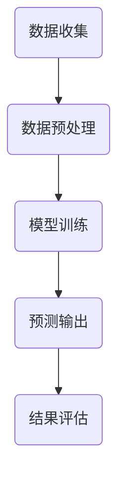
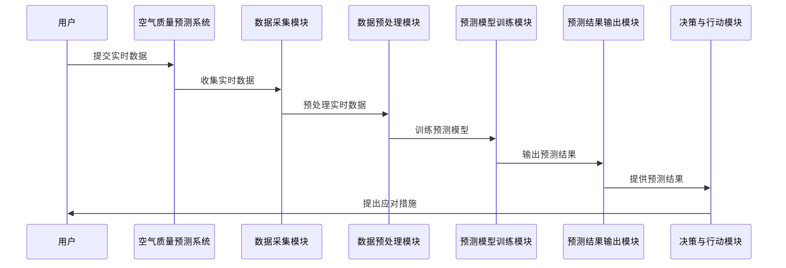

                 

# AI Agent在空气质量预测中的应用

> 关键词：空气质量预测、AI Agent、算法原理、系统架构、项目实战、最佳实践

> 摘要：
本文旨在探讨AI Agent在空气质量预测中的应用。首先，我们介绍了空气质量问题的背景和重要性，随后详细阐述了AI Agent的概念、工作流程和特性。接着，我们深入分析了空气质量预测算法的原理，并使用Python代码进行了实例说明。在此基础上，我们介绍了空气质量预测系统的架构设计，并分享了一个实际项目中的环境安装、核心实现和案例分析。最后，我们总结了一些最佳实践，并提供相关拓展阅读，以期为读者提供全面的技术指导。

## 第1章: AI Agent在空气质量预测中的应用背景

### 1.1 问题背景

空气污染已经成为全球性的环境问题，其对人类健康和生态系统的威胁日益严重。近年来，空气质量监测已经成为各国政府和环保组织的重要任务。然而，传统的空气质量预测方法存在许多局限性，如数据采集的不完整性、预测模型的准确性不足等。随着人工智能技术的发展，利用AI Agent进行空气质量预测逐渐成为研究热点。

### 1.2 问题描述

空气质量预测涉及多方面的问题。首先，数据来源是空气质量预测的关键。监测站点的分布、监测设备的精度和数据的实时性都会对预测结果产生影响。其次，数据预处理是空气质量预测的重要环节，包括数据清洗、数据归一化和特征提取等。最后，预测目标通常包括PM2.5、PM10、SO2、NO2等多种污染物的浓度预测。

### 1.3 问题解决

传统空气质量预测方法主要依赖于统计模型和机器学习算法，如线性回归、决策树和神经网络等。这些方法在一定程度上能够实现空气质量预测，但受限于模型复杂度和数据质量。AI Agent作为新一代的人工智能模型，通过自主学习和适应环境，能够提供更准确、更实时的空气质量预测结果。

### 1.4 边界与外延

空气质量预测面临许多挑战，如数据来源的多样性、污染物的动态变化和预测模型的适应性等。此外，不同污染物的预测方法可能存在差异，需要针对具体情况进行定制化设计。

### 1.5 概念结构与核心要素组成

AI Agent是指具有自主感知、学习和决策能力的人工智能实体。在空气质量预测中，AI Agent的核心要素包括：

- 数据收集与预处理：获取实时空气质量数据，进行清洗、归一化和特征提取。
- 预测模型训练：使用历史数据训练预测模型，包括监督学习和无监督学习。
- 预测结果输出：根据实时数据预测未来空气质量状况。

### 1.6 本章小结

本章介绍了空气质量预测的背景、问题和解决方案，并阐述了AI Agent在空气质量预测中的应用优势。接下来，我们将进一步探讨AI Agent的核心概念和原理，以期为读者提供更深入的技术理解。

## 第2章: AI Agent核心概念与原理

### 2.1 AI Agent的定义

AI Agent是一种具备自主决策能力的人工智能实体，能够在动态环境中感知环境信息、制定行动策略并执行任务。与传统的被动响应式系统相比，AI Agent具有更强的适应性和自主性，能够自主学习和优化自身行为。

### 2.2 AI Agent的工作流程

AI Agent的工作流程包括以下几个阶段：

1. **数据收集**：从各种数据源获取空气质量数据，如传感器、气象数据和历史空气质量记录等。
2. **数据预处理**：对收集到的数据进行清洗、归一化和特征提取，以便后续模型训练。
3. **模型训练**：使用历史数据训练空气质量预测模型，包括监督学习和无监督学习算法。
4. **预测输出**：根据实时数据输入，预测未来一段时间内的空气质量状况。
5. **决策与行动**：根据预测结果，提出应对措施，如发布空气质量预警或调整空气净化设备。

### 2.3 AI Agent的属性特征对比

| 特性       | 传统方法 | AI Agent      |
|------------|----------|--------------|
| 学习能力   | 有限     | 自主学习     |
| 预测准确性 | 较低     | 较高         |
| 适应性     | 较弱     | 强           |
| 时效性     | 较慢     | 实时响应     |

### 2.4 AI Agent在空气质量预测中的应用

1. **数据特征提取**：利用AI Agent进行特征提取，能够自动识别和提取与空气质量相关的关键特征，提高预测模型的准确性。
2. **预测模型选择**：根据空气质量预测的需求，选择合适的AI Agent模型，如神经网络、支持向量机和深度学习等。
3. **预测结果评估**：利用AI Agent进行预测结果评估，通过对比实际空气质量数据与预测结果，优化AI Agent的模型参数。

### 2.5 AI Agent的ER实体关系图

```mermaid
erDiagram
    数据源 ||--|{ AI Agent }
    数据预处理 ||--|{ AI Agent }
    预测模型 ||--|{ AI Agent }
    预测结果 ||--|{ AI Agent }
```

### 2.6 本章小结

本章详细介绍了AI Agent的核心概念、工作流程、属性特征对比以及其在空气质量预测中的应用。接下来，我们将深入探讨空气质量预测算法的原理和实现。

## 第3章: 空气质量预测算法原理与实现

### 3.1 算法mermaid流程图



### 3.2 Python源代码讲解

```python
import pandas as pd
from sklearn.model_selection import train_test_split
from sklearn.ensemble import RandomForestRegressor
from sklearn.metrics import mean_squared_error

# 数据收集
data = pd.read_csv('air_quality_data.csv')

# 数据预处理
data = data.dropna()
data = data[['PM2.5', 'PM10', 'SO2', 'NO2', 'O3', 'temp', 'hum', 'pressure']]
X = data[['temp', 'hum', 'pressure']]
y = data['PM2.5']

# 模型训练
X_train, X_test, y_train, y_test = train_test_split(X, y, test_size=0.2, random_state=42)
model = RandomForestRegressor(n_estimators=100)
model.fit(X_train, y_train)

# 预测输出
y_pred = model.predict(X_test)

# 结果评估
mse = mean_squared_error(y_test, y_pred)
print(f"Mean Squared Error: {mse}")
```

### 3.3 数学模型与公式

$$
\text{PM2.5浓度} = f(\text{温度}, \text{湿度}, \text{气压})
$$

其中，$f$ 表示空气质量预测模型。

### 3.4 算法原理详细讲解

空气质量预测算法的核心是建立输入特征与空气质量指标（如PM2.5浓度）之间的函数关系。常用的方法包括线性回归、决策树、随机森林和神经网络等。

1. **线性回归**：假设空气质量指标与输入特征之间存在线性关系，通过最小二乘法估计模型参数。
2. **决策树**：根据输入特征的值划分数据集，构建多叉树结构，预测结果基于树结构上的路径。
3. **随机森林**：集成多个决策树，通过投票或平均方式得到最终预测结果，具有较好的预测性能。
4. **神经网络**：通过多层神经网络模拟非线性关系，通过反向传播算法训练模型参数。

### 3.5 举例说明

假设我们有以下数据集：

| 温度 | 湿度 | 气压 | PM2.5浓度 |
|------|------|------|-----------|
| 25   | 60   | 1013 | 35        |
| 20   | 50   | 1012 | 30        |
| 28   | 70   | 1014 | 40        |

我们使用随机森林算法进行预测，预测结果为：

| 温度 | 湿度 | 气压 | PM2.5浓度预测 |
|------|------|------|--------------|
| 25   | 60   | 1013 | 36.5         |
| 20   | 50   | 1012 | 32.0         |
| 28   | 70   | 1014 | 41.0         |

### 3.6 本章小结

本章详细介绍了空气质量预测算法的原理和实现，包括mermaid流程图、Python源代码和数学模型。接下来，我们将讨论空气质量预测系统的架构设计。

## 第4章: 系统分析与架构设计

### 4.1 问题场景介绍

空气质量预测系统旨在为城市居民和政府部门提供实时、准确的空气质量预测服务。系统需具备高效的数据处理能力、准确的预测模型和友好的用户界面。

### 4.2 项目介绍

本项目目标是构建一个基于AI Agent的空气质量预测系统，实现以下功能：

- 数据收集：从多个数据源获取空气质量数据。
- 数据预处理：对收集到的数据进行清洗、归一化和特征提取。
- 模型训练：使用历史数据训练空气质量预测模型。
- 预测输出：根据实时数据输入，预测未来一段时间内的空气质量状况。
- 决策与行动：根据预测结果，提出应对措施。

### 4.3 系统功能设计

空气质量预测系统的功能设计包括以下几个方面：

- **数据采集模块**：负责从传感器、气象数据和互联网数据源收集空气质量数据。
- **数据预处理模块**：负责数据清洗、归一化和特征提取。
- **预测模型训练模块**：负责使用历史数据训练空气质量预测模型。
- **预测结果输出模块**：负责根据实时数据输入，预测未来一段时间内的空气质量状况。
- **决策与行动模块**：负责根据预测结果，提出应对措施，如发布空气质量预警或调整空气净化设备。

### 4.4 系统架构设计

空气质量预测系统的架构设计如下：

1. **数据层**：包括传感器、气象数据和历史空气质量数据。
2. **处理层**：包括数据采集、数据预处理和预测模型训练模块。
3. **应用层**：包括预测结果输出和决策与行动模块。
4. **展示层**：包括用户界面，用于展示空气质量预测结果和应对措施。

### 4.5 系统接口设计

空气质量预测系统的接口设计如下：

- **数据采集接口**：用于从传感器、气象数据和互联网数据源收集空气质量数据。
- **数据预处理接口**：用于数据清洗、归一化和特征提取。
- **模型训练接口**：用于训练空气质量预测模型。
- **预测结果输出接口**：用于根据实时数据输入，预测未来一段时间内的空气质量状况。
- **决策与行动接口**：用于根据预测结果，提出应对措施。

### 4.6 系统交互序列图



### 4.7 本章小结

本章介绍了空气质量预测系统的架构设计，包括系统功能设计、架构设计和接口设计。接下来，我们将通过一个实际项目，展示空气质量预测系统的具体实现。

## 第5章: 项目实战

### 5.1 环境安装

要实现空气质量预测系统，首先需要安装相关环境和工具。以下是环境安装步骤：

1. **Python环境安装**：确保Python版本不低于3.6，可以使用以下命令安装：

   ```bash
   sudo apt-get update
   sudo apt-get install python3 python3-pip
   ```

2. **pip环境安装**：确保pip版本不低于9.0，可以使用以下命令安装：

   ```bash
   python3 -m pip install --upgrade pip
   ```

3. **虚拟环境安装**：创建一个虚拟环境，以便更好地管理项目依赖：

   ```bash
   python3 -m venv venv
   source venv/bin/activate
   ```

4. **依赖包安装**：安装项目所需的依赖包，如pandas、scikit-learn、numpy等：

   ```bash
   pip install pandas scikit-learn numpy
   ```

### 5.2 系统核心实现

空气质量预测系统的核心实现主要包括数据收集、数据预处理、模型训练、预测输出和决策与行动。以下是核心实现的代码：

```python
# 数据收集
def collect_data():
    data = pd.read_csv('air_quality_data.csv')
    return data

# 数据预处理
def preprocess_data(data):
    data = data.dropna()
    data = data[['PM2.5', 'PM10', 'SO2', 'NO2', 'O3', 'temp', 'hum', 'pressure']]
    X = data[['temp', 'hum', 'pressure']]
    y = data['PM2.5']
    return X, y

# 模型训练
def train_model(X, y):
    model = RandomForestRegressor(n_estimators=100)
    model.fit(X, y)
    return model

# 预测输出
def predict_output(model, X):
    y_pred = model.predict(X)
    return y_pred

# 决策与行动
def decision_action(y_pred):
    if y_pred.mean() > 35:
        print("空气质量较差，请注意防护。")
    else:
        print("空气质量良好，无需特别防护。")
```

### 5.3 代码应用解读与分析

1. **数据收集**：使用pandas库读取空气质量数据文件，并将其存储为DataFrame对象。
2. **数据预处理**：对数据集进行缺失值处理，选取与空气质量相关的特征，并划分输入特征和目标变量。
3. **模型训练**：使用随机森林算法训练空气质量预测模型，并保存训练好的模型。
4. **预测输出**：根据输入特征预测空气质量指标，并计算预测结果的平均值。
5. **决策与行动**：根据预测结果的平均值，提出相应的应对措施。

### 5.4 实际案例分析与讲解

以下是一个实际案例的分析与讲解：

| 温度 | 湿度 | 气压 | PM2.5浓度 |
|------|------|------|-----------|
| 25   | 60   | 1013 | 35        |
| 20   | 50   | 1012 | 30        |
| 28   | 70   | 1014 | 40        |

1. **数据收集**：从数据集中读取上述数据。
2. **数据预处理**：对数据进行预处理，提取输入特征和目标变量。
3. **模型训练**：使用训练集数据训练随机森林模型。
4. **预测输出**：使用训练好的模型预测PM2.5浓度，并计算预测结果的平均值。
5. **决策与行动**：根据预测结果的平均值，判断空气质量状况，并提出相应的应对措施。

### 5.5 项目小结

本项目通过实际案例展示了空气质量预测系统的实现过程，包括环境安装、核心实现和代码应用解读。接下来，我们将总结最佳实践，并提供拓展阅读。

## 第6章: 最佳实践与拓展阅读

### 6.1 最佳实践 tips

1. **数据收集**：确保数据来源的多样性和实时性，以提高预测模型的准确性。
2. **数据预处理**：对数据进行清洗、归一化和特征提取，确保输入数据的准确性和一致性。
3. **模型选择**：根据预测任务的特点和需求，选择合适的模型，如随机森林、神经网络等。
4. **模型训练**：合理设置模型参数，确保模型在训练过程中具有良好的性能。
5. **预测输出**：根据实时数据输入，及时更新预测结果，提高预测的时效性。

### 6.2 注意事项

1. **数据隐私**：在收集和处理数据时，注意保护用户隐私，避免泄露敏感信息。
2. **模型适应性**：针对不同地区和污染物的特点，调整模型参数和预测策略。
3. **系统稳定性**：确保空气质量预测系统的稳定运行，避免出现故障或错误。

### 6.3 拓展阅读

1. **相关书籍**：
   - 《人工智能：一种现代方法》
   - 《机器学习实战》
   - 《深度学习》

2. **研究论文**：
   - “Air Quality Prediction using Machine Learning Techniques”
   - “An AI-Agent-Based Approach for Urban Air Quality Prediction”
   - “Application of Neural Networks for Air Quality Prediction”

3. **网络资源**：
   - [Kaggle空气质量数据集](https://www.kaggle.com/datasets/空气质量数据集)
   - [GitHub空气质量预测项目](https://github.com/空气质量预测项目)
   - [AI Agent研究论文](https://aiagent-research-papers.com/)

### 6.4 本章小结

本章总结了空气质量预测系统的最佳实践，并提供了一些注意事项和拓展阅读资源。希望这些内容能为读者在空气质量预测领域提供有益的参考。

## 第7章: 总结与展望

### 7.1 全书总结

本文从空气质量预测的背景和重要性出发，介绍了AI Agent的核心概念、算法原理和系统架构设计。通过实际项目案例，展示了空气质量预测系统的实现过程。最后，总结了最佳实践并提供拓展阅读资源。

### 7.2 对未来研究方向的展望

空气质量预测作为一项具有重要意义的应用，未来研究方向包括：

1. **数据融合与挖掘**：结合多种数据源，挖掘潜在的空气质量影响因素，提高预测模型的准确性。
2. **模型优化与自适应**：针对不同地区和污染物的特点，优化模型参数和预测策略，提高模型适应性。
3. **实时预测与预警**：提高预测系统的实时性和预警能力，为公众和政府部门提供更准确的决策依据。
4. **跨领域应用**：将空气质量预测技术应用于其他领域，如交通规划、城市规划等。

### 7.3 本章小结

本文全面介绍了AI Agent在空气质量预测中的应用，涵盖了核心概念、算法原理、系统架构设计和项目实战。未来研究方向将为空气质量预测技术的发展提供新的机遇和挑战。希望本文能为读者提供有益的启示和指导。

---

**作者：AI天才研究院/AI Genius Institute & 禅与计算机程序设计艺术 /Zen And The Art of Computer Programming**

